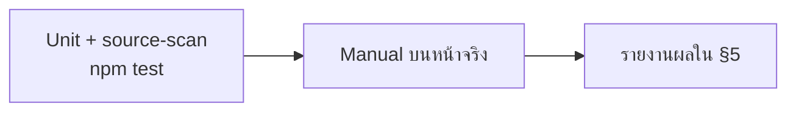

> **โมดูล:** M53-PublicProfileDisplayControls
> **ประเภทเอกสาร:** Test Case
> **เวอร์ชัน:** 1.0
> **วันที่จัดทำ:** 2026-08-23

# Test Case: ตัวควบคุมการแสดงผลหน้าร้านสาธารณะ

---

## 1. Overview

| ชั้น | เครื่องมือ | ขอบเขต |
|------|-----------|--------|
| Unit | Vitest (`npm test`) | ฟังก์ชันบริสุทธิ์: การเรียง · ถ้อยคำยอดสะสม · ค่าตั้งต้นของ layout |
| Source-scan | Vitest | ด่านกันแพตเทิร์นกลับมา (ราคาที่ไม่ผ่านตัวตัดสิน · ตัวกรองที่กลายเป็นบังคับ) |
| Manual / Browser | เปิดหน้าจริง | ทุกอย่างที่เป็นการมองเห็นและการกด |

🛑 เทสที่ติดป้าย `[blocker]` ต้อง **พิสูจน์ด้วย mutation** ทุกตัว (แก้ตรรกะให้ผิดแล้วเทสต้องแดง) เทสที่เขียวทั้งที่ mutation แล้ว = ชุด input อ่อน ต้องเติม input ไม่ใช่บอกว่า mutation ไม่เกี่ยว

---

## 2. Test Scenarios

### กลุ่ม A — สวิตช์ราคา (ระดับร้าน)

#### TC-A1 `[blocker]` ค่าตั้งต้นเมื่อไม่มีแถว `ShopPageLayout`
- **ชั้น:** Unit
- **ขั้นตอน:** เรียก `getShopPageLayout()` กับร้านที่ไม่มีแถว
- **คาดหวัง:** `{ isPublished: true, showPrices: false, tabOrder: [] }`
- **mutation:** เปลี่ยน fallback เป็น `showPrices: true` → ต้องแดง

#### TC-A2 ค่าจากแถวที่มีอยู่ถูกอ่านตรง
- **ขั้นตอน:** แถวมี `showPrices = true` → เรียกฟังก์ชัน
- **คาดหวัง:** คืน `true` (ไม่ถูก fallback ทับ)

#### TC-A3 สลับสวิตช์แล้วบันทึก
- **ชั้น:** Manual
- **ขั้นตอน:** `/public-profile` → เปิดสวิตช์ราคา
- **คาดหวัง:** toast สำเร็จ · รีโหลดแล้วสวิตช์ยังเปิด · แถบเตือน "ราคาถูกซ่อนอยู่" หายไป

#### TC-A4 บันทึกล้มแล้วเด้งกลับ
- **ชั้น:** Manual (ตัดเน็ตหรือ throttle offline)
- **คาดหวัง:** สวิตช์กลับค่าเดิม + toast แดง

#### TC-A5 สิทธิ์
- **ขั้นตอน:** ยิง `PATCH .../prices` ด้วย session ที่ไม่ใช่ OWNER/ADMIN ของร้านนั้น
- **คาดหวัง:** 401/403 และค่าในฐานไม่เปลี่ยน

---

### กลุ่ม B — ราคาหายจริงบนหน้าร้าน

#### TC-B1 การ์ดสินค้าในกริด
- **ขั้นตอน:** ปิดสวิตช์ราคา → เปิด `/b/{slug}` แท็บสินค้า
- **คาดหวัง:** ไม่มี `฿` ในการ์ดใด · ไม่มีข้อความแทน · ไม่มีช่องว่างค้างตรงที่ราคาเคยอยู่

#### TC-B2 ป๊อปอัปรายละเอียดสินค้า
- **คาดหวัง:** กดการ์ดแล้วป๊อปอัปไม่มีบรรทัดราคา

#### TC-B3 การ์ดห้องพัก
- **คาดหวัง:** ไม่มี "฿x" ในแท็บห้องพัก

#### TC-B4 การ์ดบริการ
- **คาดหวัง:** ไม่มีบล็อก "มัดจำ" ในแท็บบริการ

#### TC-B5 เปิดสวิตช์กลับ
- **คาดหวัง:** ราคากลับมาครบทั้ง 4 จุด ไม่มีจุดใดค้าง

#### TC-B6 `[blocker]` ด่านสแกนซอร์ส
- **ชั้น:** Source-scan
- **กติกา:** ไฟล์ในหน้าร้าน (`src/views/pages/user-profile/**`) ที่พิมพ์สัญลักษณ์ `฿` ต้องอยู่ในไฟล์ที่รับ prop `showPrices` (หรืออยู่ในรายการยกเว้นที่ประกาศไว้ชัดเจนพร้อมเหตุผล)
- **mutation:** เพิ่มไฟล์ที่พิมพ์ `฿` โดยไม่รับ `showPrices` → ต้องแดง

---

### กลุ่ม C — ยอดสะสมยังอยู่และคำถูกโดเมน

#### TC-C1 `[blocker]` ถ้อยคำต่อ vertical
- **ชั้น:** Unit (`soldLine`)
- **คาดหวัง:** ONLINE_SALES → `ขายแล้ว 3 ชิ้น` · SERVICE_QUEUE → `ใช้บริการแล้ว 3 ครั้ง` · ห้องพัก → `เข้าพักแล้ว 3 ครั้ง`
- **mutation:** สลับคำของ SERVICE_QUEUE กับ ONLINE_SALES → ต้องแดง

#### TC-C2 ยอดสะสมไม่หายไปพร้อมราคา
- **ชั้น:** Manual
- **ขั้นตอน:** ร้าน SERVICE_QUEUE ที่มีสินค้ามียอดสะสม > 0 · ปิดราคา
- **คาดหวัง:** เห็น "ใช้บริการแล้ว N ครั้ง" ใต้ชื่อสินค้า

#### TC-C3 การจัดแนวก้นการ์ด
- **ชั้น:** Manual
- **ขั้นตอน:** กริดที่มีสินค้าชื่อสั้น/ยาวปนกัน และปิดราคา
- **คาดหวัง:** บรรทัดยอดสะสมของทุกใบยังเรียงตรงแถวเดียวกันที่ก้นการ์ด ไม่ลอยขึ้นไปติดชื่อ

#### TC-C4 สินค้าที่ยอดสะสม = 0
- **คาดหวัง:** ไม่มีบรรทัดยอดสะสม (พฤติกรรมเดิม) และไม่มีช่องว่างค้าง

---

### กลุ่ม D — ซ่อน/แสดงรายตัว

#### TC-D1 ซ่อนสินค้าแล้วหายจากกริด
- **ขั้นตอน:** ปิดสวิตช์สินค้า A ที่ `/public-profile` → เปิดหน้าร้าน
- **คาดหวัง:** A ไม่อยู่ในกริด · ตัวเลขบนแท็บสินค้าลดลง 1

#### TC-D2 `[blocker]` ซ่อนสินค้าที่ปักหมุด
- **ชั้น:** Unit + Manual
- **คาดหวัง:** A หายจากชุด "สินค้าปักหมุด" บนหน้าร้าน · `pinnedAt` ในฐานไม่เปลี่ยน · หน้า `/products` ยังแสดงหมุด
- **mutation:** ให้ `setProfileItemVisibility` เขียน `pinnedAt: null` ด้วย → ต้องแดง

#### TC-D3 ซ่อนห้องพัก / ซ่อนบริการ
- **คาดหวัง:** หายจากแท็บของตัวเอง · แท็บที่เหลือ 0 รายการต้องไม่ถูก render เลย

#### TC-D4 `[blocker]` ยังขายได้ตามปกติ
- **ชั้น:** Unit + Manual
- **คาดหวัง:** `getProductsByShop(shopId)` (ไม่ส่ง `publicOnly`) ยังคืนสินค้าที่ซ่อน · แผงเลือกสินค้าในแชท · หน้าสร้างออเดอร์ · หน้าสร้างการประมูล ยังเลือกได้
- **mutation:** ทำให้ตัวกรองเป็นค่าตั้งต้น (กรองเสมอ) → ต้องแดง

#### TC-D5 ลิงก์ตรงไปสินค้าที่ซ่อน
- **ขั้นตอน:** เปิด `/b/{slug}?p={id ของสินค้าที่ซ่อน}`
- **คาดหวัง:** ไม่เปิดป๊อปอัป · พารามิเตอร์ถูกถอดทิ้งเงียบ ๆ · ไม่มี toast/error

#### TC-D6 id ของร้านอื่น
- **ขั้นตอน:** ยิง `item-visibility` ด้วย id ของสินค้าร้านอื่น
- **คาดหวัง:** 404 และค่าของแถวนั้นไม่เปลี่ยน

#### TC-D7 ตัวนับและการค้นหาในหน้าตั้งค่า
- **คาดหวัง:** "แสดงอยู่ x จาก y" ตรงกับความจริงหลังกดสวิตช์ทันที · ค้นหาชื่อแล้วกรองถูก · ชนิดที่ร้านไม่มีเลยไม่แสดงกลุ่ม

---

### กลุ่ม E — ชิปเรียงลำดับ

#### TC-E1 `[blocker]` การเรียง
- **ชั้น:** Unit (`sortProfileProducts`)
- **คาดหวัง:** `BEST_SELLING` เรียง `soldCount` มาก→น้อย · `POPULAR` เรียง `likeCount` มาก→น้อย · `DEFAULT` คืนลำดับเดิมทุกประการ · ค่าที่เท่ากันคงลำดับเดิม (stable)
- **mutation:** สลับให้ `BEST_SELLING` อ่าน `likeCount` → ต้องแดง (ชุด input ต้องมีรายการที่ลำดับของสองเกณฑ์ไม่ตรงกัน มิฉะนั้นเทสจะเขียวทั้งที่ผิด)

#### TC-E2 กดชิปเดิมซ้ำ
- **คาดหวัง:** กลับไปลำดับตั้งต้น และไม่มีชิปใดถูกเลือก

#### TC-E3 ชุดปักหมุดไม่ถูกจัดเรียงใหม่
- **คาดหวัง:** ลำดับของ "สินค้าปักหมุด" คงเดิมไม่ว่าเลือกชิปไหน

#### TC-E4 ไม่ยิง request
- **ชั้น:** Manual (Network tab)
- **คาดหวัง:** กดชิปแล้วไม่มี request ใหม่ และ URL ไม่เปลี่ยน

#### TC-E5 ป๊อปอัปยังทำงานหลังเรียงใหม่
- **คาดหวัง:** กดการ์ดหลังเรียง → ป๊อปอัปเปิดใบที่ถูก · ปุ่ม ‹ › เดินตามลำดับที่เห็นบนจอ · กด back ปิดป๊อปอัป

#### TC-E6 ชิปไม่ขึ้นเมื่อไม่มีอะไรให้เรียง
- **คาดหวัง:** ร้านที่มีสินค้าในกริด ≤ 1 รายการ ไม่เห็นแถบชิป

#### TC-E7 เกินเพดาน 48
- **ขั้นตอน:** ร้านที่มีสินค้าที่แสดงได้ > 48
- **คาดหวัง:** กริดแสดง 48 · มีข้อความบอกว่าแสดงบางส่วน · ไม่มีจุดใดอ้างว่าเป็นขายดีทั้งร้าน

---

### กลุ่ม F — ไม่ถดถอย

#### TC-F1 สวิตช์เผยแพร่เดิม
- **คาดหวัง:** ปิด `isPublished` → คนนอกยังเห็นหน้า "ปิดการแสดงผล" เหมือนเดิม ไม่ถูกกระทบจากคอลัมน์ใหม่

#### TC-F2 ราคาที่อื่นในระบบ
- **คาดหวัง:** ราคาในแชท · การ์ดสินค้าที่ส่งเข้าแชท · `/o/[token]` · ทุกหน้าหลังร้าน ไม่เปลี่ยน

#### TC-F3 i18n
- **คาดหวัง:** สลับภาษาเป็นอังกฤษแล้วข้อความใหม่ทุกบรรทัดเป็นอังกฤษครบ ไม่มีคำไทยค้าง

---

## 3. Traceability Matrix

| BRD FR | Test Case |
|--------|-----------|
| FR-PPD-01 | TC-A3, TC-A4, TC-A5 |
| FR-PPD-02 | TC-A1, TC-A2 |
| FR-PPD-03 | TC-B1..B6 |
| FR-PPD-04 | TC-C2, TC-C3, TC-C4 |
| FR-PPD-05 | TC-C1 |
| FR-PPD-06 | TC-F2 |
| FR-PPD-07 | TC-D1, TC-D7 |
| FR-PPD-08 | TC-A1 (ฝั่ง layout), TC-D4 |
| FR-PPD-09 | TC-D1, TC-D3, TC-D5 |
| FR-PPD-10 | TC-D4 |
| FR-PPD-11 | TC-D2 |
| FR-PPD-12 | TC-D7 |
| FR-PPD-13..15 | TC-E1, TC-E2, TC-E3 |
| FR-PPD-16 | TC-E1, TC-E7 |
| FR-PPD-17 | TC-E6 |

---

## 4. Flow

---

## 5. ผลล่าสุด

| รอบ | วันที่ | Unit | Manual | หมายเหตุ |
|-----|--------|------|--------|----------|
| 1 | 2026-08-23 | รอบันทึกหลัง implement | **ยังไม่รัน** | เคส Manual ทั้งหมดยังไม่เคยกดจริง — ต้องระบุตรง ๆ ไม่ใช่ปล่อยว่าง |

🛑 ช่องที่เขียนว่า "ยังไม่รัน" แปลว่า **ไม่เคยทดสอบ** ไม่ใช่หมายเหตุ — ห้ามนับเป็นผ่าน

---

## 6. สรุป

จุดที่เทสอัตโนมัติจับได้จริงมี 6 ตัว (`[blocker]`) ที่เหลือเป็นการมองเห็นซึ่งต้องเปิดหน้าจริง — โดยเฉพาะกลุ่ม B (ราคาหายครบทุกจุดไหม) และ TC-C3 (การจัดแนวก้นการ์ดหลังบรรทัดราคาหายไป) ซึ่งเป็นสองอย่างที่ `tsc`/build/grep มองไม่เห็นเลย
