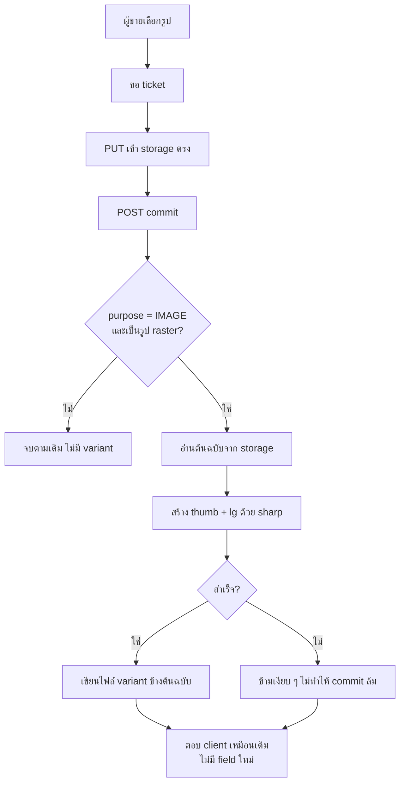
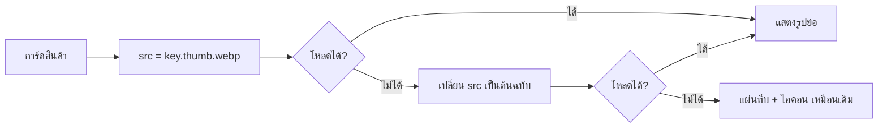

> **โมดูล:** M54-ImageVariants · **เวอร์ชัน:** 1.0 · **วันที่:** 2026-08-23

# BRD: รูปย่อสำหรับหน้าจอ

---

## 1. บทนำ

### 1.1 วัตถุประสงค์ของเอกสาร
แปลง [[PRD]] เป็นข้อกำหนดที่ทดสอบได้ — ทุกข้อมี AC ที่กดตามได้จริง

### 1.2 ขอบเขตของระบบ

**อยู่ในขอบเขต:** จุดสร้าง variant (`POST /api/uploads/commit`) · ตัวสร้างรูป (`sharp`) · การเลือกขนาดที่หน้าจอ (กริดสินค้า/ห้องพัก + ป๊อปอัป) · สคริปต์ backfill

**นอกขอบเขต:** ไฟล์แนบในแชท · เอกสาร KYC/สลิป · ไปป์ไลน์ mirror ของ 00051 · การลบ/บีบไฟล์ต้นฉบับ

### 1.3 กลุ่มผู้ใช้งาน
ผู้ซื้อ (ได้ประโยชน์ ไม่ต้องทำอะไร) · ผู้ขาย (ไม่ต้องทำอะไร) · ผู้ดูแลระบบ (รัน backfill)

---

## 2. ความต้องการหลัก (Functional Requirements)

| ID | ความต้องการ | Acceptance Criteria |
|----|-------------|---------------------|
| **FR-IMG-01** | รูปที่อัปโหลดด้วย purpose `IMAGE` ได้ variant `thumb` + `lg` อัตโนมัติ | AC-01-1 อัปรูปสินค้าใหม่ → มีไฟล์ `<key>.thumb.webp` และ `<key>.lg.webp` ในบัคเก็ต · AC-01-2 ต้นฉบับยังอยู่ ขนาดเท่าเดิมทุกไบต์ · AC-01-3 ผู้ใช้ไม่เห็นขั้นตอนเพิ่มบนหน้าจอ |
| **FR-IMG-02** | `thumb` กว้างไม่เกิน 480 px · `lg` ด้านยาวไม่เกิน 1280 px · ทั้งคู่เป็น WebP | AC-02-1 ตรวจ metadata ของไฟล์ที่ได้ · AC-02-2 รูปที่เล็กกว่าเกณฑ์อยู่แล้วต้อง **ไม่ถูกขยาย** |
| **FR-IMG-03** | ห้ามสร้าง variant ให้ไฟล์ที่มีด่านสิทธิ์ | AC-03-1 อัปเอกสาร KYC (purpose `DOCUMENT`) → ไม่มีไฟล์ variant เกิดขึ้น · AC-03-2 แนบไฟล์ในแชท (purpose `CHAT`) → ไม่มี variant · AC-03-3 มีเทสที่แดงถ้าใครเปิด purpose อื่นเข้ามา |
| **FR-IMG-04** | สร้าง variant ล้มต้องไม่ทำให้อัปโหลดล้ม | AC-04-1 บังคับให้ตัวสร้างโยน error → การอัปโหลดยังสำเร็จ 200 · AC-04-2 หน้าจอแสดงต้นฉบับแทน |
| **FR-IMG-05** | ไม่สร้าง variant ให้ GIF | AC-05-1 อัป GIF → ไม่มีไฟล์ variant (ภาพเคลื่อนไหวไม่ถูกทำลาย) |
| **FR-IMG-06** | variant ต้องไม่ใหญ่กว่าต้นฉบับ | AC-06-1 รูปเล็กมาก (เช่น 100×100 8 KB) → ถ้า WebP ที่ได้ใหญ่กว่า ให้ไม่สร้าง variant นั้น |
| **FR-IMG-07** | กริดใช้ `thumb` · ป๊อปอัปใช้ `lg` | AC-07-1 Network tab บนหน้าร้านแสดงคำขอ `.thumb.webp` สำหรับการ์ด · AC-07-2 เปิดป๊อปอัปแล้วขอ `.lg.webp` |
| **FR-IMG-08** | ไฟล์ที่ไม่มี variant ต้องแสดงต้นฉบับแทน | AC-08-1 รูปที่ยังไม่ backfill แสดงได้ปกติ · AC-08-2 ไม่มีไอคอนรูปแตกของเบราว์เซอร์โผล่ · AC-08-3 ลบ variant ทิ้งแล้วรีเฟรช → การ์ดยังมีรูป |
| **FR-IMG-09** | สคริปต์ backfill สร้าง variant ให้รูปเก่า | AC-09-1 มีโหมด dry-run ที่รายงานจำนวนไฟล์ที่จะแตะโดยไม่เขียนอะไร · AC-09-2 รันซ้ำแล้วข้ามไฟล์ที่มี variant อยู่แล้ว · AC-09-3 รายงานสรุปตอนจบ (สร้างกี่ไฟล์ ข้ามกี่ไฟล์ ล้มกี่ไฟล์) |
| **FR-IMG-10** | backfill ต้องไม่ลบหรือเขียนทับอะไรเลย | AC-10-1 อ่านซอร์สแล้วไม่มีคำสั่งลบ · AC-10-2 นับจำนวนไฟล์ต้นฉบับก่อน/หลังแล้วเท่ากัน · AC-10-3 ขนาดไฟล์ต้นฉบับที่สุ่มตรวจไม่เปลี่ยน |

---

## 3. Acceptance Criteria สรุป

- [ ] อัปรูปสินค้าใหม่แล้วได้ variant ครบสองขนาด ต้นฉบับไม่เปลี่ยน
- [ ] KYC/สลิป/ไฟล์แนบแชท ไม่มี variant เกิดขึ้นเลย
- [ ] หน้าร้านโหลดกริดด้วย `.thumb.webp` และป๊อปอัปด้วย `.lg.webp`
- [ ] รูปเก่าที่ยังไม่ backfill แสดงได้ปกติ (ไม่มีรูปแตก)
- [ ] backfill มี dry-run · resume ได้ · ไม่มีคำสั่งลบ

---

## 4. Business Flows

### 4.1 Flow หลัก: อัปโหลดรูปสินค้าใหม่

### 4.2 Flow: หน้าจอเลือกขนาด

---

## 5. Use Case Scenarios

### Scenario 1: ร้านอัปรูปใหม่ (Best case)
ผู้ขายอัปรูป 8 MB จากมือถือ → ระบบสร้าง thumb 35 KB + lg 120 KB → หน้าร้านโหลดกริดเร็วขึ้นทันที โดยผู้ขายไม่รู้ว่ามีอะไรเกิดขึ้น

### Scenario 2: รูปเก่าที่ยังไม่ backfill (Edge)
ผู้ชมเปิดหน้าร้านก่อนรัน backfill → `.thumb.webp` ตอบ 404 → `` สลับไปต้นฉบับเอง → เห็นรูปครบเหมือนเดิม (ช้าเท่าเดิม แต่ไม่พัง)

### Scenario 3: เบราว์เซอร์ไม่รองรับ WebP (Edge)
`` โหลด `.thumb.webp` ไม่ได้ → `onError` → ต้นฉบับ JPEG → เห็นรูปครบ

### Scenario 4: sharp ล้มเพราะไฟล์เสีย (Negative)
รูปที่ metadata เสีย → ตัวสร้างคืน `null` → commit ยังตอบ 200 → ผู้ขายอัปโหลดสำเร็จตามปกติ

---

## 6. ความต้องการด้านคุณภาพ

### 6.1 ความถูกต้องของข้อมูล
variant ต้องมาจากต้นฉบับใบเดียวกันเสมอ (คีย์ derive จากคีย์ต้นฉบับตรง ๆ ไม่มีทางชี้ผิดใบ)

### 6.2 ความรวดเร็ว
การสร้าง variant ต้องไม่ทำให้ผู้ใช้รอนานขึ้นจนรู้สึกได้ — วัดเวลา commit ก่อน/หลัง

### 6.3 ความน่าเชื่อถือ
ทุกความล้มเหลวของการสร้าง variant ต้อง degrade เป็น "ใช้ต้นฉบับ" ไม่ใช่ error ที่ผู้ใช้เห็น

### 6.4 ความปลอดภัย
🛑 คีย์ variant **ไม่ผ่านด่านสิทธิ์ใด ๆ** ใน `/api/files/*` (ด่านตรวจจากคีย์ต้นฉบับ) ⇒ ไฟล์ที่มีด่านต้องไม่มี variant เด็ดขาด

### 6.5 ความสะดวก
ไม่มีขั้นตอนใหม่บนหน้าจอ ไม่มีปุ่มใหม่ ไม่มีข้อความใหม่ให้ผู้ใช้อ่าน

---

## 7. ข้อจำกัด

- พื้นที่เก็บโตขึ้นราว 60% ต่อรูป — แลกกับการไม่แตะต้นฉบับ
- ไม่มีคอลัมน์ใหม่ใน DB ⇒ ระบบ "รู้" ว่ามี variant ไหม ได้จากการลองโหลดเท่านั้น (ฝั่งเบราว์เซอร์) และจากการ HEAD (ฝั่งสคริปต์)

---

## 8. กฎทางธุรกิจ

- **BR-IMG-01** ต้นฉบับห้ามถูกลบหรือเขียนทับ
- **BR-IMG-02** คีย์ variant = `<คีย์ต้นฉบับไม่รวมนามสกุล>.<variant>.webp`
- **BR-IMG-03** สร้าง variant เฉพาะ purpose `IMAGE` และชนิด jpg/jpeg/png/webp
- **BR-IMG-04** ล้มเหลว = เงียบ + ใช้ต้นฉบับ
- **BR-IMG-05** variant ที่ใหญ่กว่าต้นฉบับ ให้ทิ้ง

---

## 9. อภิธานศัพท์
ใช้ร่วมกับ [[PRD]] §7

---

## 10. สรุป
เพิ่มไฟล์รูปย่อข้างต้นฉบับ แล้วให้หน้าจอหยิบขนาดที่ตรงกับกรอบจริง — งานทั้งหมดเป็นการ *เพิ่ม* ไม่มีการลบหรือแก้ของเดิมเลย จุดที่ต้องระวังที่สุดคือ **ห้ามให้ไฟล์ที่มีด่านสิทธิ์มี variant** เพราะคีย์ variant เดินผ่านด่านทั้งหมดโดยไม่ถูกตรวจ
