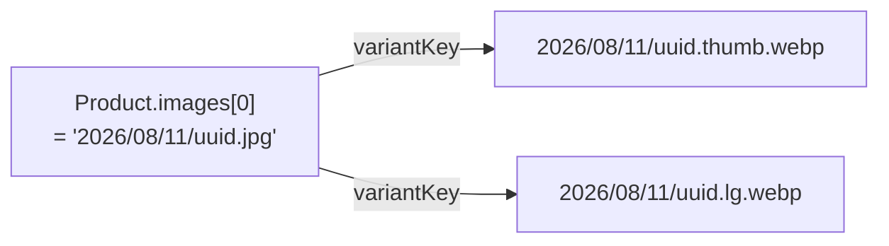

> **โมดูล:** M54-ImageVariants · **เวอร์ชัน:** 1.0 · **วันที่:** 2026-08-23

# DATABASE: รูปย่อสำหรับหน้าจอ

---

## 1. Overview

🛑 **ฟีเจอร์นี้ไม่มีการเปลี่ยนแปลงฐานข้อมูลเลย — ไม่มี migration ไม่มีคอลัมน์ใหม่ ไม่มี index ใหม่**

เอกสารนี้มีอยู่เพื่อบันทึก **เหตุผล** ที่ไม่มี และเพื่อระบุคอลัมน์ที่ฟีเจอร์นี้ *อ่าน* (ตอน backfill) ให้ครบ

---

## 2. ERD

ไม่มีเอนทิตีใหม่ — ความสัมพันธ์ระหว่างต้นฉบับกับ variant อยู่ใน **สูตรคีย์** ไม่ใช่ในตาราง

---

## 3. Tables

**ไม่มีตารางที่ถูกแก้** — คอลัมน์ที่ถูก *อ่าน* ตอน backfill:

| ตาราง | คอลัมน์ | ชนิด | หมายเหตุ |
|-------|---------|------|----------|
| `Product` | `images` | Json (array ของ fileId) | รูปสินค้า — สาธารณะอยู่แล้ว |
| `Room` | `images` | Json (array ของ fileId) | รูปห้องพัก — สาธารณะอยู่แล้ว |
| `Shop` | `logo`, `coverImage` | String? | โลโก้/ปกร้าน — สาธารณะอยู่แล้ว |
| `User` | `avatar` | String? | อวาตาร์ — สาธารณะอยู่แล้ว (อาจเป็น URL ของ Facebook ⇒ ต้องข้าม) |

🛑 **คอลัมน์ที่ห้ามแตะเด็ดขาด** (ไฟล์เหล่านี้มีด่านสิทธิ์ใน `/api/files/*` และคีย์ variant จะเล็ดลอดด่านทั้งหมด):
`VerificationRecord.documents` · `TopUpRequest.slipFileId` · `Order.slipFileId` · `ScamReport.evidence` · `ChatMessage.imageUrl`

---

## 4. Indexes
ไม่มี

---

## 5. Migration Plan
ไม่มี migration — ฟีเจอร์นี้ deploy ได้โดยไม่แตะฐานข้อมูล

**สิ่งที่ต้องรันด้วยมือ (ครั้งเดียว):** `scripts/backfill-image-variants.ts` — dry-run ก่อน แล้วค่อย `--apply`
สคริปต์นี้ **อ่านฐานข้อมูลอย่างเดียว** และ **เขียนเฉพาะ storage** ไม่มี UPDATE/DELETE ใด ๆ

### 5.2 Rollback
ลบไฟล์ variant ออกจากบัคเก็ต (ถ้าต้องการ) — หน้าจอตกไป fallback ต้นฉบับเองทันที ไม่มีข้อมูลใดสูญหาย
🛑 การ rollback ไม่ต้องแตะฐานข้อมูลเลย เพราะไม่เคยเขียนอะไรลงไป

### 5.3 ผลกระทบ

| ด้าน | ผล |
|------|-----|
| ฐานข้อมูล | ไม่มี |
| storage | โตขึ้นราว 60% ต่อรูปหนึ่งใบที่ถูก backfill |
| พฤติกรรมที่ผู้ใช้เห็น | หน้าร้านเบาลง · ผู้ขายไม่เห็นความต่าง |

---

## 6. Retention / ข้อควรระวัง

- 🛑 **ไฟล์ต้นฉบับห้ามถูกลบหรือเขียนทับ** ไม่ว่าในขั้นตอนใด
- 🛑 ถ้าวันหนึ่งมีนโยบายลบไฟล์ ต้องจำไว้ว่า **หนึ่งต้นฉบับมีบริวารสองไฟล์** ที่ต้องถูกลบไปด้วย มิฉะนั้นจะเหลือไฟล์กำพร้าที่ไม่มีใครอ้างถึงและไม่มีใครรู้ว่ามาจากไหน
- variant ถูกสร้างซ้ำได้เสมอจากต้นฉบับ (idempotent) ⇒ ทำหายไม่ใช่เรื่องคอขาดบาดตาย

---

## 7. Traceability

| TFR | ผลกับฐานข้อมูล |
|-----|----------------|
| ทั้งหมด | ไม่มี |

---

## 8. สรุป
ไม่มี migration ไม่มีคอลัมน์ใหม่ — ความสัมพันธ์ต้นฉบับ↔variant อยู่ในสูตรคีย์ ซึ่งเป็นเหตุผลเดียวกับที่ฟีเจอร์นี้ deploy และ rollback ได้โดยไม่แตะฐานข้อมูลเลย
