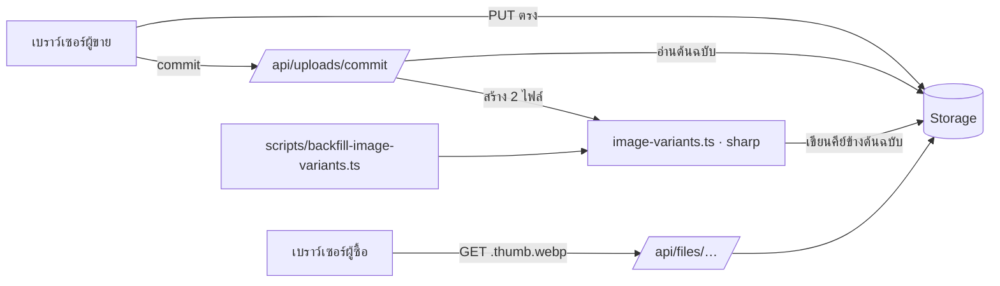
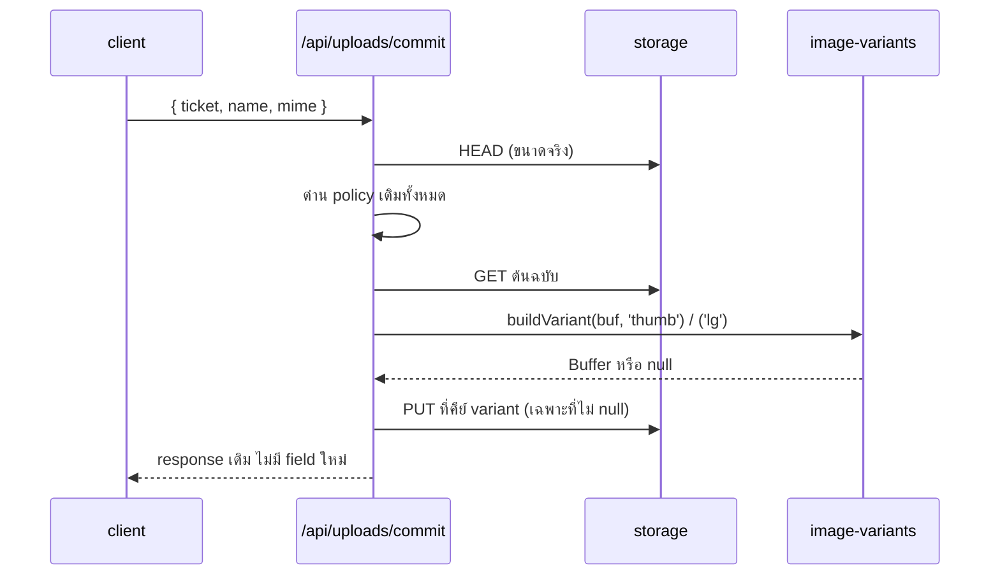

> **โมดูล:** M54-ImageVariants · **เวอร์ชัน:** 1.0 · **วันที่:** 2026-08-23

# SRS: รูปย่อสำหรับหน้าจอ

---

## 1. บทนำ

### 1.1 วัตถุประสงค์
สเปกเชิงเทคนิคที่ผู้พัฒนาใช้สร้างได้โดยไม่ต้องตีความ

### 1.2 ขอบเขตเชิงระบบ
Next.js App Router · `sharp` · Supabase Storage (S3 driver) + local driver · ไม่มีการเปลี่ยน schema

### 1.3 เอกสารอ้างอิง
[[PRD]] · [[BRD]] · [[SDS]] · [[API]] · [[DATABASE]] · [[TestCase]] · `docs/conventions/upload-body-size-limit.md`

### 1.4 นิยาม
| คำ | ความหมาย |
|----|-----------|
| คีย์ | path เต็มของไฟล์ในบัคเก็ต เช่น `2026/08/11/uuid.jpg` (เท่ากับ `fileId` ที่เก็บใน DB) |
| variant | ไฟล์ที่ระบบสร้าง คีย์ `<คีย์ต้นฉบับไม่รวมนามสกุล>.<ชื่อ variant>.webp` |

---

## 2. ภาพรวมสถาปัตยกรรม

### 2.1 บริบท



### 2.2 องค์ประกอบหลัก

| องค์ประกอบ | หน้าที่ | ใหม่/เดิม |
|-----------|---------|-----------|
| `src/lib/image-variants.ts` | สเปกขนาด + ตัวสร้าง (pure, sharp) + สูตรคีย์ | ใหม่ |
| `saveFileAtKey()` ใน `src/lib/storage/*` | เขียนไฟล์ที่ "คีย์ที่กำหนด" (ของเดิมสร้างคีย์ใหม่เสมอ) | ใหม่ |
| `POST /api/uploads/commit` | เรียกสร้าง variant หลังไฟล์ผ่านด่านแล้ว | แก้ของเดิม |
| `src/lib/file-url.ts` | `variantUrlOf(fileId, variant)` | แก้ของเดิม |
| การ์ดสินค้า/ห้องพัก + ป๊อปอัป | เลือกขนาดตามกรอบจริง + fallback | แก้ของเดิม |
| `scripts/backfill-image-variants.ts` | สร้าง variant ให้รูปเก่า | ใหม่ |

---

## 3. ข้อกำหนดเชิงฟังก์ชันเชิงเทคนิค

### TFR-001: สูตรคีย์ของ variant

```
variantKey('2026/08/11/uuid.jpg', 'thumb') === '2026/08/11/uuid.thumb.webp'
```

- ตัดนามสกุลสุดท้ายออกแล้วต่อ `.<variant>.webp`
- 🛑 ต้องเป็นฟังก์ชันบริสุทธิ์ที่เดียว ใช้ร่วมทั้ง commit, backfill และฝั่งเบราว์เซอร์ — ถ้าสองฝั่งคิดคีย์ต่างกันแม้แต่ตัวอักษรเดียว หน้าจอจะขอไฟล์ที่ไม่มีอยู่จริงตลอดกาลโดยไม่มี error ให้ใครเห็น (แค่ตกไป fallback เงียบ ๆ = ฟีเจอร์ไม่ทำงานเลยแต่ดูปกติทุกอย่าง)
- ห้ามใช้กับคีย์ที่มี query string หรือ URL เต็ม — `variantUrlOf` ต้องคืน `null` เมื่อค่าที่รับมาไม่ใช่คีย์ของบัคเก็ตเรา (ค่ารูปในระบบมีทั้ง storage key และ URL ภายนอกปนกัน — ดู `file-url.ts`)

### TFR-002: สเปกขนาด

| variant | resize | encode |
|---------|--------|--------|
| `thumb` | `fit: 'inside'`, กว้าง 480 / สูง 480×4 (ปล่อยให้ความกว้างเป็นตัวคุม), `withoutEnlargement: true` | WebP q72 |
| `lg` | `fit: 'inside'`, ด้านยาวไม่เกิน 1280 (ส่งทั้ง `width: 1280, height: 1280`), `withoutEnlargement: true` | WebP q80 |

- `.rotate()` ก่อนเสมอ — เคารพ EXIF ไม่งั้นรูปจากมือถือตะแคง (บทเรียนเดียวกับ `buildMetaCardJpeg`)
- ไม่ `flatten` — WebP รองรับ alpha จึงไม่ต้องถมพื้นขาวเหมือน JPEG
- คืน `null` เมื่อ: sharp โยน error · ผลลัพธ์ใหญ่กว่าต้นฉบับ (BR-IMG-05)

### TFR-003: จุดสร้าง

สร้างใน `POST /api/uploads/commit` **หลัง** ทุกด่านผ่านแล้ว (ขนาด/ชนิด/policy) และเฉพาะเมื่อ:
- `purpose === 'IMAGE'` (allow-list ตายตัว ห้ามเป็น deny-list)
- นามสกุลอยู่ใน `{jpg, jpeg, png, webp}` (ไม่รวม `gif` — BR-IMG-05 ของ PRD)

🛑 **ต้องไม่ทำให้ commit ล้ม** — ห่อด้วย try/catch ที่กลืน error ทั้งหมด และไม่เพิ่ม field ใหม่ใน response (client ไม่ต้องรู้)

### TFR-004: การเขียนไฟล์

เพิ่ม `saveFileAtKey(key, buffer, contentType)` ในทั้งสอง driver:
- S3: `PutObjectCommand` ที่ `Key: key` ตรง ๆ
- local: เขียนไฟล์ตาม path พร้อมสร้างโฟลเดอร์

🛑 **ห้ามใช้ `writeDedupedFile` ของ 00051** — ตัวนั้น scope ด้วย `shopId` และคืนคีย์ของไฟล์ที่ซ้ำ ซึ่งจะทำให้ variant ของรูป A ชี้ไปไฟล์ของรูป B ที่เนื้อเหมือนกัน (ถูกในแง่เนื้อไฟล์ แต่พังสูตรคีย์ที่ฝั่งเบราว์เซอร์ derive เอง)

### TFR-005: การเลือกขนาดที่หน้าจอ

- การ์ดสินค้า (`ProductCard`) → `thumb`
- ป๊อปอัปสินค้า (`ProductLightbox`) → `lg`
- การ์ดห้องพัก (`PublicRoomList`) → `thumb`
- fallback เป็นลำดับ: variant → ต้นฉบับ → แผ่นทึบ+ไอคอน (สถานะเดิมของแต่ละคอมโพเนนต์)

🛑 fallback ต้องทำด้วย `onError` ที่ **เปลี่ยน `src` ไปต้นฉบับ** ไม่ใช่กระโดดไป error state ทันที — ของเดิมมี `onError` ที่ตั้ง `imgFailed` ชั้นเดียว ต้องแทรกชั้นกลางเข้าไป

### TFR-006: backfill

`scripts/backfill-image-variants.ts`
- แหล่งรายชื่อ: `Product.images`, `Room.images`, `Shop.logo/coverImage`, `User.avatar` — **เฉพาะคอลัมน์ที่เป็นรูปสาธารณะอยู่แล้ว** (BR-IMG-03)
- ข้ามค่าที่เป็น URL ภายนอก (`http…`) และค่าที่ขึ้นต้นด้วย `/`
- ข้ามไฟล์ที่มี variant ครบแล้ว (HEAD)
- `--dry-run` เป็นค่าตั้งต้น ต้องส่ง `--apply` ถึงจะเขียนจริง
- 🛑 **ห้ามมีคำสั่งลบใด ๆ ในไฟล์นี้** — มีเทสสแกนซอร์สยืนยัน

---

## 4. ข้อกำหนดส่วนต่อประสาน

### 4.1 ไม่มี endpoint ใหม่
variant ถูกเสิร์ฟผ่าน `GET /api/files/[...fileId]` เดิมทุกประการ (คีย์ต่างกันเท่านั้น) — ได้ `Cache-Control: public, max-age=86400` และ CDN เดิมมาฟรี

### 4.2 response ของ commit ไม่เปลี่ยน
ไม่มี field ใหม่ — client เดา URL ของ variant เองจาก `fileId` (TFR-001)

### 4.3 Sequence



---

## 5. ข้อกำหนดด้านข้อมูล

**ไม่มีการเปลี่ยน schema เลย** — ดู [[DATABASE]]

---

## 6. NFR

| # | ข้อกำหนด | เกณฑ์ |
|---|----------|-------|
| NFR-1 | commit ช้าลงไม่เกินที่ผู้ใช้รู้สึก | วัดเวลาจริงก่อน/หลังด้วยรูป ~2 MB |
| NFR-2 | ความล้มเหลวของ variant ต้องไม่ทำให้อัปโหลดล้ม | บังคับให้ล้มแล้วยังได้ 200 |
| NFR-3 | ไฟล์ต้นฉบับต้องไม่เปลี่ยนแม้แต่ไบต์เดียว | เทียบขนาด/eTag ก่อน-หลัง |
| NFR-4 | ไม่มี variant ของไฟล์ที่มีด่านสิทธิ์ | เทส `[blocker]` + สแกน storage หลัง backfill |
| NFR-5 | กริดสินค้าโหลดลดลง ≥ 80% | Network tab |

---

## 7. ข้อจำกัด / การพึ่งพา / สมมติฐาน

- `sharp` เป็น native module — ทำงานบน Vercel ได้ (ใช้อยู่แล้วใน 00045)
- คีย์ variant ไม่ผ่านด่านสิทธิ์ ⇒ allow-list ที่ purpose คือด่านเดียวที่กัน
- ค่ารูปในระบบมีทั้ง storage key และ URL ภายนอก ⇒ ทุกจุดต้องผ่าน `variantUrlOf` ที่คืน `null` ให้ค่าที่ไม่ใช่คีย์เรา

---

## 8. ความเสี่ยงเชิงสถาปัตยกรรม

| # | ความเสี่ยง | การรับมือ |
|---|-----------|-----------|
| AR-1 | สูตรคีย์สองฝั่งไม่ตรงกัน → ฟีเจอร์ไม่ทำงานเลยแต่ดูปกติ (ตก fallback เงียบ ๆ) | ฟังก์ชันเดียวใช้ร่วมทั้งสองฝั่ง + เทสที่ยืนยันสตริงผลลัพธ์ตรงตัว |
| AR-2 | variant ของไฟล์ที่มีด่าน | allow-list + เทส `[blocker]` ที่แดงเมื่อมีใครเพิ่ม purpose |
| AR-3 | เขียน variant ทับไฟล์ที่มีอยู่ | คีย์ derive จากคีย์ต้นฉบับซึ่งเป็น uuid — ชนได้เฉพาะกับ variant ของตัวเอง (idempotent) |
| AR-4 | backfill ลบของ | ไม่มีคำสั่งลบในไฟล์ + เทสสแกนซอร์ส + dry-run เป็นค่าตั้งต้น |

---

## 9. Traceability

| BRD | TFR |
|-----|-----|
| FR-IMG-01/03/04/05 | TFR-003 |
| FR-IMG-02/06 | TFR-002 |
| FR-IMG-07/08 | TFR-001, TFR-005 |
| FR-IMG-09/10 | TFR-006 |

---

## 10. สรุป
งานทั้งหมดเป็น additive: 1 lib ใหม่ · 1 primitive เขียนไฟล์ · hook เดียวที่ commit · เปลี่ยน `src` ที่หน้าจอ 3 จุด · 1 สคริปต์ ไม่มี migration ไม่มี endpoint ใหม่ ไม่มี field ใหม่ใน response
