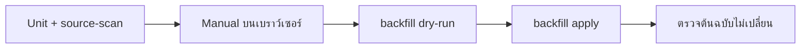

> **โมดูล:** M54-ImageVariants · **เวอร์ชัน:** 1.0 · **วันที่:** 2026-08-23

# Test Case: รูปย่อสำหรับหน้าจอ

---

## 1. Overview

| ชั้น | เครื่องมือ | ขอบเขต |
|------|-----------|--------|
| Unit | Vitest + sharp จริง | สูตรคีย์ · สเปกขนาด · เงื่อนไข allow-list |
| Source-scan | Vitest | ด่านกัน "สร้าง variant ให้ไฟล์ที่มีด่านสิทธิ์" และ "backfill มีคำสั่งลบ" |
| Manual | เบราว์เซอร์ + storage | Network tab · fallback · ต้นฉบับไม่เปลี่ยน |

🛑 เทส `[blocker]` ต้องพิสูจน์ด้วย mutation ทุกตัว

---

## 2. Test Scenarios

### กลุ่ม A — สูตรคีย์

#### TC-A1 `[blocker]` `variantKey`
- `('2026/08/11/uuid.jpg','thumb')` → `2026/08/11/uuid.thumb.webp`
- `('uuid.png','lg')` → `uuid.lg.webp` (ไฟล์เก่าที่ไม่มีโฟลเดอร์)
- นามสกุลหลายจุด `('a.b.jpg','thumb')` → `a.b.thumb.webp` (ตัดเฉพาะจุดสุดท้าย)
- **mutation:** ตัดทุกจุดแทนจุดสุดท้าย → ต้องแดง

#### TC-A2 `[blocker]` `variantUrlOf` ปฏิเสธค่าที่ไม่ใช่คีย์ของเรา
- URL เต็ม (`https://…`) → `null`
- ค่าที่ขึ้นต้นด้วย `/` (เช่น `/api/files/x` หรือ `/images/badges/a.png`) → `null`
- `null`/ค่าว่าง → `null`
- **mutation:** ถอดการเช็ค `http` ออก → ต้องแดง (ไม่งั้นจะได้ URL อย่าง `https://….thumb.webp` ที่ไม่มีวันมีอยู่จริง)

### กลุ่ม B — ตัวสร้างรูป

#### TC-B1 `[blocker]` ขนาดที่ได้ตรงสเปก
- ป้อนรูป 1080×1920 → `thumb` กว้าง ≤ 480 · `lg` ด้านยาว ≤ 1280 · ทั้งคู่เป็น WebP
- **mutation:** สลับค่าของ thumb กับ lg → ต้องแดง

#### TC-B2 `[blocker]` ไม่ขยายรูปที่เล็กกว่าเกณฑ์
- ป้อนรูป 200×200 → `thumb` ยังเป็น 200×200 (ไม่ใช่ 480×480)
- **mutation:** ถอด `withoutEnlargement` → ต้องแดง

#### TC-B3 `[blocker]` เคารพ EXIF
- ป้อนรูปที่มี EXIF orientation → ด้านกว้าง/สูงของผลลัพธ์สลับตามที่ควรเป็น
- **mutation:** ถอด `.rotate()` → ต้องแดง

#### TC-B4 ผลลัพธ์ใหญ่กว่าต้นฉบับ → คืน null
- ป้อนรูปเล็กมากที่ WebP ทำให้ใหญ่ขึ้น → คืน `null` ไม่สร้างไฟล์

#### TC-B5 ไฟล์เสีย → คืน null ไม่ throw
- ป้อน Buffer ที่ไม่ใช่รูป → `null` (ไม่โยน error ออกมา)

#### TC-B6 `[blocker]` allow-list นามสกุล
- `jpg/jpeg/png/webp` → true · `gif/pdf/mp4/heic` → false
- **mutation:** เพิ่ม `gif` เข้า allow-list → ต้องแดง (ภาพเคลื่อนไหวจะถูกทำลาย)

### กลุ่ม C — จุดสร้าง (ความปลอดภัย)

#### TC-C1 `[blocker]` สร้างเฉพาะ purpose IMAGE
- Source-scan: จุดเรียกใน commit ต้องอยู่หลังเงื่อนไขที่เทียบ `'IMAGE'` ตรงตัว
- **mutation:** เปลี่ยนเป็น `purpose !== 'DOCUMENT'` (deny-list) → ต้องแดง

#### TC-C2 `[blocker]` backfill ไม่มีคำสั่งลบ
- Source-scan สคริปต์: ห้ามมี `deleteFile`, `DeleteObject`, `unlink`, `rm `
- **mutation:** เติม `deleteFile(` ลงไป → ต้องแดง

#### TC-C3 `[blocker]` backfill อ่านเฉพาะคอลัมน์รูปสาธารณะ
- Source-scan: ห้ามอ้าง `documents`, `slipFileId`, `evidence`, `ChatMessage`
- **mutation:** เติม `slipFileId` → ต้องแดง

#### TC-C4 commit ยังสำเร็จเมื่อสร้าง variant ล้ม
- mock ให้ตัวสร้างโยน error → response ยัง 200

### กลุ่ม D — หน้าจอ (Manual)

#### TC-D1 กริดขอ `.thumb.webp`
Network tab บนหน้าร้าน → คำขอของการ์ดเป็น `.thumb.webp` และขนาดรวมลดลง ≥ 80%

#### TC-D2 ป๊อปอัปขอ `.lg.webp`

#### TC-D3 รูปที่ไม่มี variant ยังแสดงได้
เปิดหน้าร้านของร้านที่ยังไม่ backfill → เห็นรูปครบ ไม่มีไอคอนรูปแตก

#### TC-D4 ลบ variant ทิ้งแล้วยังแสดงได้
ลบไฟล์ `.thumb.webp` ของสินค้าใบหนึ่งออกจากบัคเก็ต → รีเฟรช → การ์ดยังมีรูป (ตกไปต้นฉบับ)

#### TC-D5 คุณภาพยอมรับได้
เทียบการ์ดก่อน/หลังบนจอ retina — ต้องไม่เห็นความต่างในระยะการใช้งานจริง

### กลุ่ม E — backfill (Manual)

#### TC-E1 dry-run ไม่เขียนอะไร
รัน `--dry-run` → รายงานจำนวน · นับไฟล์ในบัคเก็ตก่อน/หลังเท่ากัน

#### TC-E2 `--apply` สร้าง variant ครบ
สุ่มตรวจ 5 ไฟล์ → มี `.thumb.webp` และ `.lg.webp`

#### TC-E3 `[blocker]` ต้นฉบับไม่เปลี่ยน
เทียบขนาด + eTag ของต้นฉบับ 10 ไฟล์ ก่อน/หลัง → ต้องเท่ากันทุกไฟล์

#### TC-E4 รันซ้ำแล้วข้าม
รันอีกครั้ง → รายงาน "ข้าม" เท่ากับจำนวนที่สร้างไปแล้ว สร้างใหม่ = 0

#### TC-E5 ไม่มี variant ของไฟล์ที่มีด่านสิทธิ์
query `storage.objects` หา `%.thumb.webp` แล้วเทียบกับรายชื่อไฟล์ KYC/สลิป → ต้องไม่มีคู่ที่ตรงกันเลย

---

## 3. Traceability Matrix

| BRD FR | Test Case |
|--------|-----------|
| FR-IMG-01 | TC-C1, TC-E2 |
| FR-IMG-02 | TC-B1, TC-B2 |
| FR-IMG-03 | TC-C1, TC-C3, TC-E5 |
| FR-IMG-04 | TC-B5, TC-C4 |
| FR-IMG-05 | TC-B6 |
| FR-IMG-06 | TC-B4 |
| FR-IMG-07 | TC-D1, TC-D2 |
| FR-IMG-08 | TC-D3, TC-D4, TC-A2 |
| FR-IMG-09 | TC-E1, TC-E4 |
| FR-IMG-10 | TC-C2, TC-E3 |

---

## 4. Flow

---

## 5. ผลล่าสุด

| รอบ | วันที่ | Unit | Manual | backfill |
|-----|--------|------|--------|----------|
| 1 | 2026-08-23 | รอบันทึกหลัง implement | **ยังไม่รัน** | **ยังไม่รัน** |

🛑 "ยังไม่รัน" = ไม่เคยทดสอบ ไม่ใช่หมายเหตุ — ห้ามนับเป็นผ่าน

---

## 6. สรุป
เทสอัตโนมัติครอบสิ่งที่เครื่องตรวจได้ (สูตรคีย์ · สเปกขนาด · allow-list · ไม่มีคำสั่งลบ) ส่วนที่เหลือต้องเปิดของจริง — โดยเฉพาะ **TC-E3 (ต้นฉบับไม่เปลี่ยน)** ซึ่งเป็นข้อเดียวที่ถ้าพลาดแล้วกู้คืนไม่ได้
