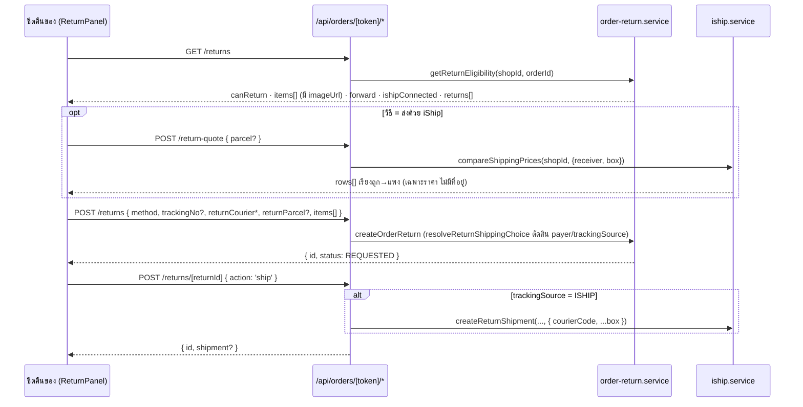

> **โมดูล:** 00056-OrderReturn
> **ประเภทเอกสาร:** API Contract
> **เวอร์ชัน:** 2.0 (รอบ re-design 2026-08-25 · D-1..D-9)
> **สถานะ:** Reviewed — ตรงกับโค้ดที่ขึ้นแล้ว

🛑 **SSOT ของกฎอยู่ที่ `docs/SRS.md §10.15` และ `src/lib/order-return.ts`** — ไฟล์นี้เป็น
*สัญญาเชื่อมต่อ* เท่านั้น **ห้ามเขียนกฎธุรกิจซ้ำที่นี่** (HR16) เพราะกฎที่อยู่สองที่จะเลื่อน
ออกจากกันแน่นอน แล้วจะไม่มีใครรู้ว่าที่ไหนถูก

---

## 1. ภาพรวม

## 2. Endpoints

| Method | Path | ใช้ทำอะไร |
|---|---|---|
| `GET` | `/api/orders/[token]/returns` | สิทธิ์ + รายการที่คืนได้ + พัสดุขาไป + ใบคืนที่มีอยู่ |
| `POST` | `/api/orders/[token]/returns` | เปิดใบคืน |
| `POST` | `/api/orders/[token]/returns/[returnId]` | `ship` / `receive` / `cancel` |
| `POST` | `/api/orders/[token]/return-quote` | **ใหม่ 2026-08-25** — ค่าส่งขากลับโดยประมาณต่อขนส่ง |
| `GET` | `/api/o/[token]/return-label` | ใบปะหน้าพัสดุขากลับ (**สาธารณะ** — ผู้ซื้อเป็นคนพิมพ์) |

สิทธิ์: ทุกตัวยกเว้น `return-label` ต้องมี session + `canAccessShop(order.shopId, userId)`
คีย์ด้วย `Order.publicToken` เหมือน route อื่นของออเดอร์

## 3. รูปร่าง request/response

รายละเอียดฟิลด์ + ตารางแปลง "วิธี × เลขพัสดุ → ค่าที่บันทึก" อยู่ที่ **`docs/SRS.md §10.15`**
(ที่เดียว ห้ามคัดลอกมา) · Valibot schema จริง = `src/app/api/orders/[token]/returns/route.ts`

🛑 **`payer` และ `trackingSource` ไม่อยู่ใน request schema โดยเจตนา** — เป็นผลลัพธ์ที่
`resolveReturnShippingChoice()` ตัดสินฝั่ง server (BR-RT-39) · เปิดให้ client ส่งมาเอง
= ให้จอกำหนดว่าใครจ่ายเงิน ซึ่งเป็นสิ่งที่วิธีที่เลือกบอกอยู่แล้ว

`GET /returns` คืนเพิ่มจากรอบก่อน: `items[].imageUrl` · `forward` · `ishipConnected` · `orderStatus`
🛑 **ไม่มีที่อยู่/ชื่อ/เบอร์ผู้ซื้อในทุก response ของหมวดนี้** — หน้านี้อยู่ใต้ client layout
ค่าที่คืนไปจะถูก serialize เข้า flight payload ทุกใบ (เทส `[blocker]` ปักหมุดไว้)

## 4. Error

| HTTP | ที่มา | ตัวอย่าง |
|---|---|---|
| 400 | `OrderReturnError` | `ORDER_NOT_DELIVERED` · `QTY_EXCEEDS_REMAINING` · `RETURN_ALREADY_OPEN` · `NO_PARCEL` |
| 400 | Valibot | รูปร่าง body ไม่ถูก |
| 401/403/404 | guard | ไม่ล็อกอิน / ไม่ใช่ร้านของตัวเอง / ไม่พบออเดอร์ |
| 4xx/5xx | `mapIShipError` | ต่อ iShip ไม่ได้ / เครดิตไม่พอ / ขนส่งปฏิเสธ |

ข้อความ error ส่งต่อจาก service ตรง ๆ เพราะมันบอก**ทางแก้**อยู่แล้ว
(คืนได้อีกกี่ชิ้น / ทำไมคืนไม่ได้) — แปลงเป็น "เกิดข้อผิดพลาด" คือการลบข้อมูลที่ผู้ใช้ต้องใช้

## 5. ของที่ยังไม่มี

`SDS.md` · `TestCase.md` · `SRS.md` (ระดับ feature) ยังไม่ถูกเขียน — เป็นหนี้ที่ค้างมาตั้งแต่
รอบแรก 2026-08-24 ไม่ใช่ของที่รอบ re-design นี้สร้างขึ้น
