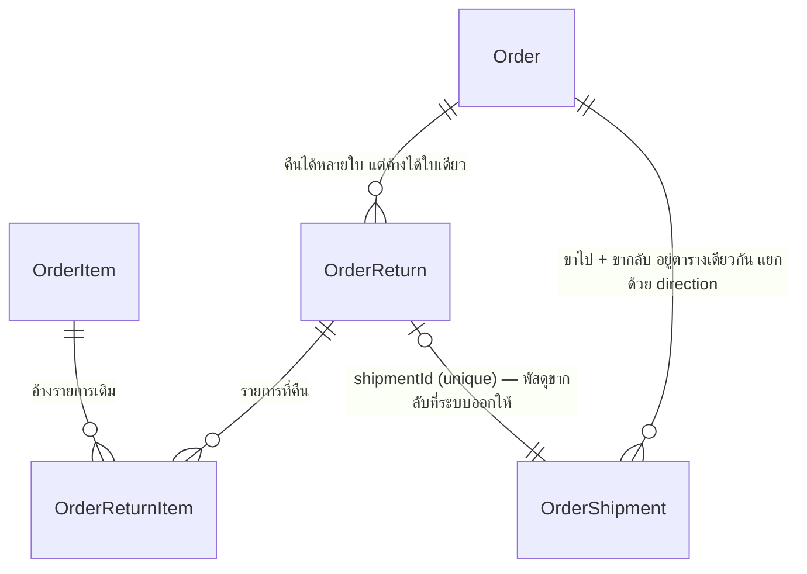

> **โมดูล:** 00056-OrderReturn
> **ประเภทเอกสาร:** DATABASE Design
> **เวอร์ชัน:** 2.0 (รอบ re-design 2026-08-25)
> **สถานะ:** Reviewed — ตรงกับ `prisma/schema.prisma` ที่ขึ้นแล้ว

🛑 **SSOT คือ `prisma/schema.prisma`** — ไฟล์นี้อธิบาย *เหตุผล* ของรูปร่าง ไม่ใช่สำเนาของ schema

---

## 1. ERD

## 2. ทำไมพัสดุขากลับอยู่ตาราง `OrderShipment` เดิม

เพื่อใช้ `createShipment()` ที่ถือตรรกะทั้งหมดของการเปิดพัสดุซ้ำ (ตรวจที่อยู่ · เครดิต ·
retry · เก็บหลักฐาน · ต้นทุนจริง) แยกเป็นตารางใหม่ = ก็อปตรรกะทั้งชุดไปเขียนอีกรอบ

แลกด้วย: **มี 14 จุดในระบบที่ค้นหา "พัสดุของออเดอร์นี้"** — ทุกจุดต้องระบุ `direction`
ไม่งั้นจะหยิบพัสดุขากลับมาเป็นพัสดุของออเดอร์แล้วออเดอร์ที่คืนของแล้วกลับไปขึ้น
"กำลังจัดส่ง" **เงียบ ๆ ไม่มี error** ⇒ ตัวกรองอยู่ที่ `src/lib/shipment-direction.ts`
ที่เดียว + เทส `[blocker]` สแกนซอร์ส

## 3. คอลัมน์ที่เพิ่มรอบนี้ (migration `20260825120000_order_return_courier`)

| คอลัมน์ | ชนิด | เหตุผล |
|---|---|---|
| `returnCourierCode` | `String?` | ขากลับเป็นพัสดุ**คนละใบ มีขนส่งของตัวเอง** (D-3) — ส่งเข้า `createReturnShipment(override.courierCode)` ตอนกดออกเลข · `null` = ใช้เจ้าเดียวกับขาไป |
| `returnCourierName` | `String?` | คู่กับรหัส เหมือน `OrderShipment.courierCode/courierName` — ชื่อแพ็กเกจของ iShip จำเพาะกว่าชื่อแบรนด์ และเป็นคำที่ร้านเห็นตอนเลือก |
| `returnParcel` | `Json?` | กล่องขากลับที่ร้านแก้เอง (D-5) — **ทั้งชุดหรือไม่มีเลย** ไม่แตกเป็น 4 คอลัมน์เพราะจะเปิดช่องให้เกิดสถานะ "น้ำหนักใหม่ + ขนาดเก่า" ที่ไม่มีใครตั้งใจสร้าง |

**additive ล้วน** — nullable ทั้ง 3 ตัว ไม่มี DROP/CHECK/NOT NULL ⇒ metadata-only ใน Postgres
และ deployment เก่าที่ยังเสิร์ฟระหว่าง build ไม่พัง

### `manualCourier` — คอลัมน์ที่เลิกใช้แต่ไม่ลบ

เดิมเป็น**ข้อความอิสระ**ที่ร้านพิมพ์เอง ("เคอรี่"/"Kerry"/"KEX" = แบรนด์เดียวกันแต่จับคู่
โลโก้/สรุปยอดไม่ตรงสักครั้ง) → แทนด้วย `returnCourierCode` ที่เป็นรหัสจาก `COURIER_OPTIONS`

**ไม่ DROP** เพราะการลบคอลัมน์ทำให้ deployment เก่าที่ยังเสิร์ฟอยู่ระหว่าง build query พังทันที
ยืนยันแล้ว 2026-08-25 ว่า `OrderReturn` มี **0 แถวทั้ง prod และ dev** ⇒ ไม่มีข้อมูลให้ย้าย
และคอลัมน์นี้จะเป็น `null` ตลอดไป (โค้ดไม่เขียนแล้ว)

## 4. Constraint ที่บังคับที่ระดับฐาน

| ชื่อ | บังคับอะไร |
|---|---|
| `OrderShipment_active_order_key` บน **`(orderId, direction)`** `WHERE status <> 'CANCELLED'` | 1 ออเดอร์มี **ขาไป 1 + ขากลับ 1** ที่ยังใช้งานอยู่ · 🛑 เดิมเป็น `(orderId)` ล้วน ⇒ `createReturnShipment()` ชน P2002 **ทุกครั้งไม่มีข้อยกเว้น** = ระบบคืนของเปิดพัสดุขากลับไม่ได้เลยสักใบ (prod: `direction='RETURN'` 0 แถวทั้งที่ฟีเจอร์ขึ้นไปแล้ว) แก้ 2026-08-26 · ดู §6 |
| partial unique `(orderId) WHERE status IN ('REQUESTED','SHIPPING')` | 1 ออเดอร์มีใบคืนที่ยังไม่จบได้ใบเดียว (BR-RT-03) — ด่านในโค้ดกันได้แค่กรณีที่อ่านแล้วเห็น สองคนกดพร้อมกันจะลอดทั้งคู่ ⇒ ความถูกต้องต้องอยู่ที่ฐาน (service ดัก P2002) |
| `OrderReturn_manual_tracking_shape` | `MANUAL` ต้องมีเลข · แบบอื่นต้องไม่มีเลขที่กรอกเอง + `manualCourier IS NULL` |
| `@@unique([returnId, orderItemId])` | รายการเดิมโผล่ในใบคืนใบเดียวได้ครั้งเดียว — กันกดซ้ำแล้วยอดคืนเกินจริง |
| `shipmentId @unique` | พัสดุขากลับใบหนึ่งผูกกับใบคืนเดียว |

## 6. ปลดล็อกพัสดุขากลับ + เวลาของ "ขากลับ" (migration `20260826000000_shipment_return_leg`)

### 6.1 index ที่ลืม `direction` — บั๊กที่ทำให้ฟีเจอร์นี้ไม่เคยทำงานเลย

`OrderShipment_active_order_key` ถูกสร้างไว้ตั้งแต่ 20260726000000 เป็น `("orderId")
WHERE status <> 'CANCELLED'` · 00056 เพิ่มคอลัมน์ `direction` แล้ว **ไม่ได้ตามมาแก้ index**

1. `canCreateReturn()` บังคับว่าคืนของได้ต่อเมื่อของถึงมือลูกค้าแล้ว ⇒ ออเดอร์นั้น**มีพัสดุขาไป
   `status='CREATED'` อยู่แน่นอน**
2. `createReturnShipment()` สร้างแถวใหม่ `PENDING`/`RETURN` บน `orderId` เดิม
3. index เห็น `PENDING <> CANCELLED` ⇒ **P2002 ทุกครั้ง** · จุดนั้นไม่มี try/catch ⇒ ร้านได้ 500 ดิบ

**เพดานใหม่ = ขาไป 1 + ขากลับ 1 (ไม่ใช่ N ใบ)** โดยตั้งใจ — ทุกจุดที่หา "พัสดุของออเดอร์นี้"
ใช้ `take: 1, orderBy createdAt desc` การยอมให้มีขาไปหลายใบจะทำให้จุดพวกนั้นตอบเรื่องใบล่าสุด
ใบเดียวเงียบ ๆ ทั้งสถานะ · ชื่อเสียงผู้ซื้อ · ปิดงานอัตโนมัติ · ค่าส่งในกำไร

🛑 **unmanaged SQL** (Prisma DSL ประกาศ partial unique ไม่ได้) — `prisma db pull` มองไม่เห็น
แล้วจะสร้าง migration ที่ DROP ทิ้ง **ห้ามรันเด็ดขาด** (HR14)

### 6.2 ผลที่ตามมา — 6 จุดที่ "ถูกโดยบังเอิญ"

index เดิมบังคับว่าออเดอร์หนึ่งมีพัสดุที่ยังไม่ยกเลิกได้ใบเดียว ⇒ 6 จุดที่เขียน
`where: { status: { not: 'CANCELLED' } }` + `take: 1` จึงถูกมาตลอดโดยไม่ระบุทิศทาง
พอปลดล็อก index **พัสดุขากลับซึ่งเกิดทีหลังเสมอจะชนะทุกครั้ง** ⇒ เลขพัสดุในการ์ดแชท ·
สถานะที่ตัดสินพฤติกรรมลูกค้า · ใบที่ถูกพิมพ์ยกชุด กลายเป็นของขากลับ **โดยไม่มี error**

⇒ `LATEST_FORWARD_SHIPMENT` (`src/lib/shipment-direction.ts`) ·
**การปลดล็อก index กับการเติม `direction` ต้องอยู่คอมมิตเดียวกันเสมอ แยกไม่ได้**

### 6.3 คอลัมน์เวลาขากลับบน `OrderShipment`

| คอลัมน์ | ชนิด | ความหมาย |
|---|---|---|
| `returnStartedAt` | `TIMESTAMP(3)?` | พัสดุ**เริ่มเดินทางกลับ** (event `return` ครั้งแรก) |
| `returnedAt` | `TIMESTAMP(3)?` | พัสดุ**กลับมาถึงร้าน** (event `return_success`) |

**write-once ทั้งคู่** (`updateMany` + `WHERE <col> IS NULL` — ท่าเดียวกับ `deliveredAt`)
เพราะ event `return` เกิดซ้ำได้ **7–8 ครั้งต่อพัสดุใบเดียว** (ขนส่งพยายามส่งใหม่หลายรอบ
ก่อนยอมตีกลับ — prod: 44 events / 12 พัสดุ) ถ้าเขียนทับได้ วันที่จะขยับทุกครั้งที่ลองใหม่

ต้องมีคอลัมน์ทั้งที่ `ShipmentEvent` เก็บครบแล้ว เพราะ (1) `carrierStatusAt` ถูกเขียนทับ
ทุกครั้งที่สถานะขยับ (2) ไทม์ไลน์ต้องวาดได้จากค่าที่มีในมือ — ห้ามให้แถวในหน้า `/orders`
join `ShipmentEvent` เพิ่ม

🛑 **`NULL` ไม่ได้แปลว่า "ไม่เกิด"** — `returnedAt = NULL` ขณะที่ `carrierStatus =
'return_success'` แปลว่า **ถึงร้านแล้วแต่ไม่รู้ว่าเมื่อไร** (สถานะมาจากรอบ poll ที่ไม่ผ่าน
`ShipmentEvent`) **เกิดจริง 6 จาก 12 ใบบน prod** ⇒ จุดสว่างบนไทม์ไลน์ตัดสินจาก
`carrierStatus` ไม่ใช่จากคอลัมน์นี้ และหน้าจอต้องเขียนว่า "ขนส่งไม่ได้แจ้งเวลา"
**ห้ามเดาวันที่มาเติม** (`partial-data-must-be-labeled-or-filled.md`)

**backfill:** `MIN(occurredAt)` ของ event แต่ละชนิด · **ไม่เติมให้ใบที่ไม่มี event รองรับ**

### 6.4 ผู้เขียน `carrierStatus` มี 3 ทาง — ต้องประทับให้ครบทุกทาง

`handleStatusWebhook()` · `applyCarrierStatus()` (รอบ poll) · บล็อกรีเฟรชใน `getTraces()`
ทางไหนลืมเรียก `stampReturnLeg()` = พัสดุที่ตีกลับผ่านทางนั้นไม่มีวันเวลา **โดยไม่มี error**
(`deliveredAt` มีบั๊กนี้อยู่จริง — ทางที่ 3 ไม่เคยประทับให้เลย) ⇒ `returnLegStampOf()` เป็น
SSOT + เทส `[blocker]` บังคับว่าต้องมีการเรียกครบ 3 ทาง

### 6.5 ใครอ่าน `OrderReturn` เพื่อวาดไทม์ไลน์แถวที่ 2

`getActiveReturnForTimeline()` — **หน้ารายละเอียดออเดอร์จอเดียว** (มติ Q26 ทบทวน 2026-08-26)

🛑 **ห้ามเรียกในหน้ารายการ `/orders`** — เปิดออเดอร์ทีละ 30–50 ใบและออเดอร์ส่วนใหญ่ไม่มี
การคืนของ · `OrderDetailClient` เองก็เลี่ยงคิวรีนี้ด้วยเหตุผลเดียวกัน (`initialCount={0}`)
⇒ **แถบในหน้ารายการและ hover card เห็นเฉพาะเคสตีกลับ** · มีเทส `[blocker]` บังคับว่าต้องมี
อย่างน้อย 1 จอส่ง `orderReturn={` เข้ามาจริง (รอบแรกกิ่งนี้เป็นโค้ดตายที่ `tsc` มองไม่เห็น)

## 5. ของที่ยังไม่มี

`SDS.md` · `SRS.md` (ระดับ feature) — `TestCase.md` เขียนแล้ว 2026-08-26 (25 เคส **ยังไม่เคยรันสักเคส**) — หนี้ที่ค้างมาตั้งแต่รอบแรก 2026-08-24
