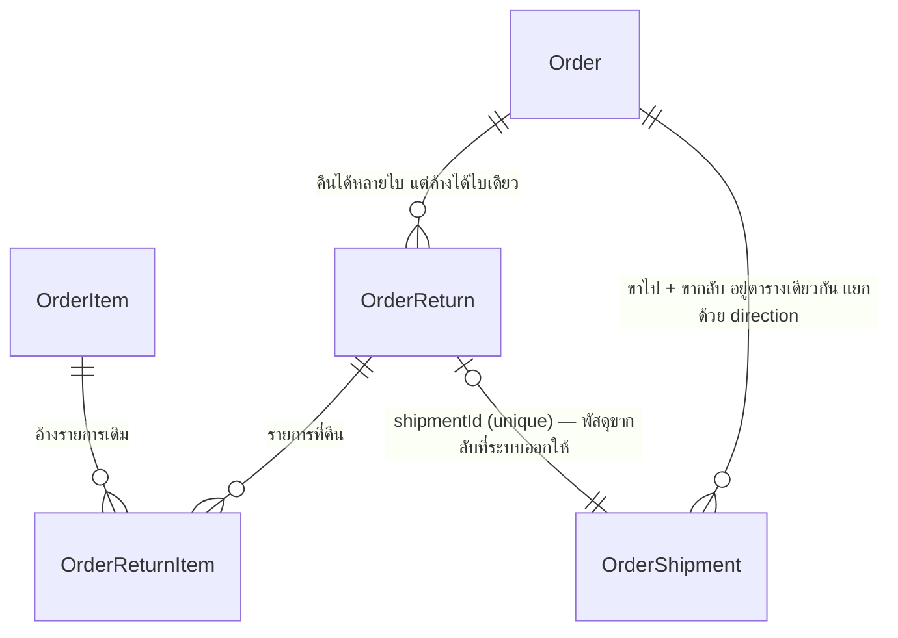

> **โมดูล:** 00056-OrderReturn
> **ประเภทเอกสาร:** DATABASE Design
> **เวอร์ชัน:** 2.0 (รอบ re-design 2026-08-25)
> **สถานะ:** Reviewed — ตรงกับ `prisma/schema.prisma` ที่ขึ้นแล้ว

🛑 **SSOT คือ `prisma/schema.prisma`** — ไฟล์นี้อธิบาย *เหตุผล* ของรูปร่าง ไม่ใช่สำเนาของ schema

---

## 1. ERD

## 2. ทำไมพัสดุขากลับอยู่ตาราง `OrderShipment` เดิม

เพื่อใช้ `createShipment()` ที่ถือตรรกะทั้งหมดของการเปิดพัสดุซ้ำ (ตรวจที่อยู่ · เครดิต ·
retry · เก็บหลักฐาน · ต้นทุนจริง) แยกเป็นตารางใหม่ = ก็อปตรรกะทั้งชุดไปเขียนอีกรอบ

แลกด้วย: **มี 14 จุดในระบบที่ค้นหา "พัสดุของออเดอร์นี้"** — ทุกจุดต้องระบุ `direction`
ไม่งั้นจะหยิบพัสดุขากลับมาเป็นพัสดุของออเดอร์แล้วออเดอร์ที่คืนของแล้วกลับไปขึ้น
"กำลังจัดส่ง" **เงียบ ๆ ไม่มี error** ⇒ ตัวกรองอยู่ที่ `src/lib/shipment-direction.ts`
ที่เดียว + เทส `[blocker]` สแกนซอร์ส

## 3. คอลัมน์ที่เพิ่มรอบนี้ (migration `20260825120000_order_return_courier`)

| คอลัมน์ | ชนิด | เหตุผล |
|---|---|---|
| `returnCourierCode` | `String?` | ขากลับเป็นพัสดุ**คนละใบ มีขนส่งของตัวเอง** (D-3) — ส่งเข้า `createReturnShipment(override.courierCode)` ตอนกดออกเลข · `null` = ใช้เจ้าเดียวกับขาไป |
| `returnCourierName` | `String?` | คู่กับรหัส เหมือน `OrderShipment.courierCode/courierName` — ชื่อแพ็กเกจของ iShip จำเพาะกว่าชื่อแบรนด์ และเป็นคำที่ร้านเห็นตอนเลือก |
| `returnParcel` | `Json?` | กล่องขากลับที่ร้านแก้เอง (D-5) — **ทั้งชุดหรือไม่มีเลย** ไม่แตกเป็น 4 คอลัมน์เพราะจะเปิดช่องให้เกิดสถานะ "น้ำหนักใหม่ + ขนาดเก่า" ที่ไม่มีใครตั้งใจสร้าง |

**additive ล้วน** — nullable ทั้ง 3 ตัว ไม่มี DROP/CHECK/NOT NULL ⇒ metadata-only ใน Postgres
และ deployment เก่าที่ยังเสิร์ฟระหว่าง build ไม่พัง

### `manualCourier` — คอลัมน์ที่เลิกใช้แต่ไม่ลบ

เดิมเป็น**ข้อความอิสระ**ที่ร้านพิมพ์เอง ("เคอรี่"/"Kerry"/"KEX" = แบรนด์เดียวกันแต่จับคู่
โลโก้/สรุปยอดไม่ตรงสักครั้ง) → แทนด้วย `returnCourierCode` ที่เป็นรหัสจาก `COURIER_OPTIONS`

**ไม่ DROP** เพราะการลบคอลัมน์ทำให้ deployment เก่าที่ยังเสิร์ฟอยู่ระหว่าง build query พังทันที
ยืนยันแล้ว 2026-08-25 ว่า `OrderReturn` มี **0 แถวทั้ง prod และ dev** ⇒ ไม่มีข้อมูลให้ย้าย
และคอลัมน์นี้จะเป็น `null` ตลอดไป (โค้ดไม่เขียนแล้ว)

## 4. Constraint ที่บังคับที่ระดับฐาน

| ชื่อ | บังคับอะไร |
|---|---|
| partial unique `(orderId) WHERE status IN ('REQUESTED','SHIPPING')` | 1 ออเดอร์มีใบคืนที่ยังไม่จบได้ใบเดียว (BR-RT-03) — ด่านในโค้ดกันได้แค่กรณีที่อ่านแล้วเห็น สองคนกดพร้อมกันจะลอดทั้งคู่ ⇒ ความถูกต้องต้องอยู่ที่ฐาน (service ดัก P2002) |
| `OrderReturn_manual_tracking_shape` | `MANUAL` ต้องมีเลข · แบบอื่นต้องไม่มีเลขที่กรอกเอง + `manualCourier IS NULL` |
| `@@unique([returnId, orderItemId])` | รายการเดิมโผล่ในใบคืนใบเดียวได้ครั้งเดียว — กันกดซ้ำแล้วยอดคืนเกินจริง |
| `shipmentId @unique` | พัสดุขากลับใบหนึ่งผูกกับใบคืนเดียว |

## 5. ของที่ยังไม่มี

`SDS.md` · `TestCase.md` · `SRS.md` (ระดับ feature) — หนี้ที่ค้างมาตั้งแต่รอบแรก 2026-08-24
