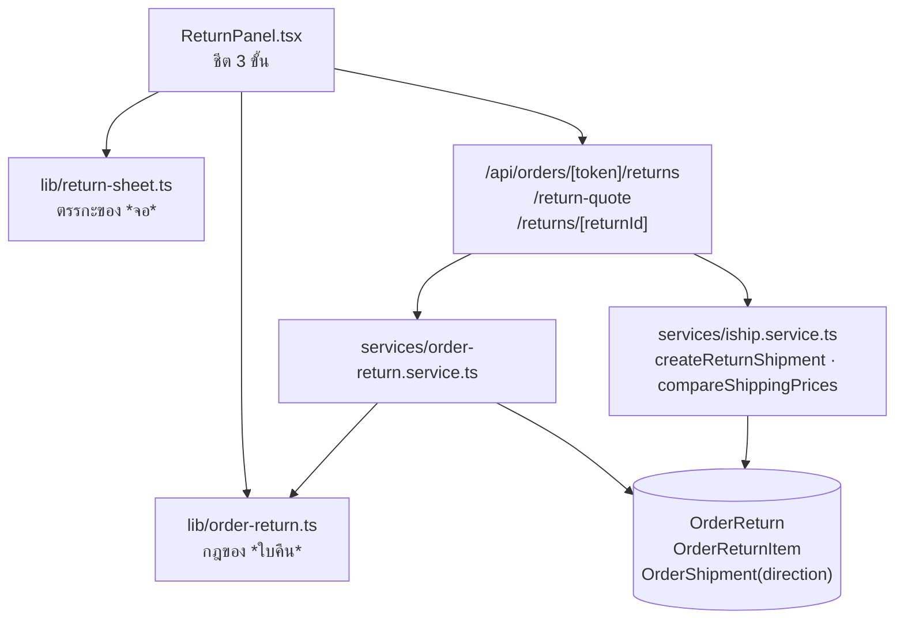
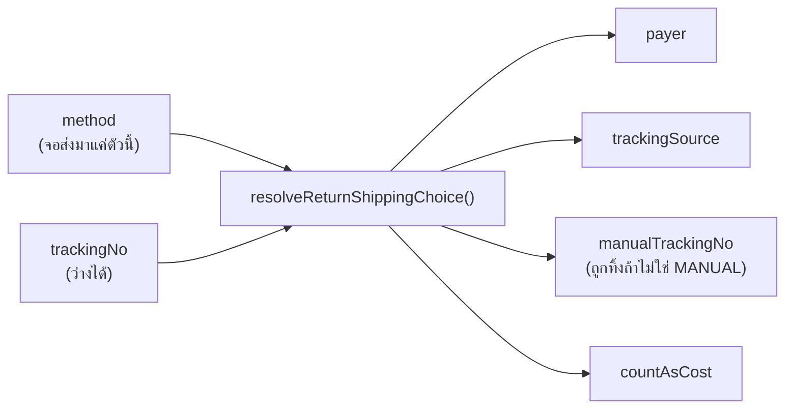

> **โมดูล:** 00056-OrderReturn · **ประเภทเอกสาร:** Software Design · **เวอร์ชัน:** 2.0

---

## 1. โครงรวม

## 2. การแบ่งความรับผิดชอบ — และเหตุผลที่แบ่งแบบนี้

| โมดูล | ตอบคำถามอะไร | ทำไมต้องแยก |
|---|---|---|
| `lib/order-return.ts` | "ใบคืนใบนี้ถูกต้องไหม" — เปิดได้ไหม · คู่ payer×trackingSource · ค่าส่งเข้าต้นทุนเท่าไร | pure · ทดสอบได้โดยไม่ต้องมีฐาน · **service กับ UI ต้องอ่านกฎชุดเดียวกัน** ไม่งั้นจอกับ API ตัดสินไม่ตรงกัน |
| `lib/return-sheet.ts` | "จอควรแสดงอะไร" — วิธีไหนกดได้ · ราคาอยู่สถานะไหน · กดถัดไปได้ไหม | 🛑 ทุกตัวเป็น boolean/สถานะที่ **เขียนกลับด้านได้ง่ายมากและผลคือร้านเสียเงินจริง** ⇒ ต้องมีที่ให้เทสจับ ไม่ใช่เทอร์นารีกลาง JSX (`ui-boolean-needs-a-testable-home.md`) |
| `services/order-return.service.ts` | เขียน/อ่านฐาน + บังคับกฎอีกชั้น | ownership scope ใน `where` ไม่ใช่ดึงมาเช็คทีหลัง (PII ไหลเข้า payload ไปแล้ว) |
| `services/iship.service.ts` | ยิงเครือข่าย + ตัดเครดิตจริง | **แยกจากการสร้างใบคืนโดยเจตนา** — iShip ล่มต้องไม่ทำให้บันทึกคำขอคืนไม่ได้ |

## 3. การตัดสินใจที่สำคัญ

### D-1 · `payer`/`trackingSource` เป็น **ผลลัพธ์** ไม่ใช่ input

🛑 API **ไม่รับ** `payer`/`trackingSource` จาก client เลย — เปิดให้ส่งมาได้เท่ากับให้จอกำหนด
ว่าใครจ่ายเงิน ซึ่งเป็นสิ่งที่วิธีที่เลือกบอกอยู่แล้ว · และคู่ที่เป็นไปไม่ได้
(`BUYER + ISHIP`) **หายไปจากโครงสร้าง** ไม่ใช่ถูกกันด้วยกฎ

### D-2 · พัสดุขากลับอยู่ตาราง `OrderShipment` เดิม แยกด้วย `direction`

แลกกับการที่ **14 จุดในระบบ** ต้องระบุ `direction` ทุกจุด — ตัวกรองจึงอยู่ที่
`lib/shipment-direction.ts` ที่เดียว + เทส `[blocker]` สแกนซอร์ส · จุดที่ลืมจะทำให้ออเดอร์
ที่คืนของแล้วกลับไปขึ้น "กำลังจัดส่ง" **เงียบ ๆ ไม่มี error**

### D-3 · `POST /return-quote` แยกจาก `/api/seller/iship/price/compare`

ใช้ **service ตัวเดียวกัน** (`compareShippingPrices` — ห้ามเขียนสูตรใหม่) ต่างกันแค่ที่มาของ
input: ตัวใหม่อ่านที่อยู่ผู้ซื้อ **ฝั่ง server** แล้วคืนเฉพาะราคา · ถ้าให้จอยิงตัวเดิมตรง ๆ จอ
ต้องถือที่อยู่ไว้ก่อน = ที่อยู่/ชื่อ/เบอร์ ไหลเข้า flight payload ทุกใบ เพื่อตัวเลขตัวเดียว

path เป็น `return-quote` ไม่ใช่ `returns/quote` เพราะ `returns/[returnId]` เป็น dynamic
segment ที่ static child จะบังทับ ⇒ ใบคืนที่ id ตรงกับคำนั้นจะเรียกไม่ได้ตลอดกาล

### D-4 · dropdown ขนส่งมี 2 แหล่งตามวิธี — และนั่นถูกต้อง

| วิธี | แหล่งรายชื่อ | มีราคาไหม |
|---|---|---|
| `ISHIP` | แพ็กเกจจริงของร้านจาก `/return-quote` | มี (ต่อเจ้า เรียงถูก→แพง) |
| `SHOP_SELF` / `BUYER_SELF` | `COURIER_OPTIONS` (แบรนด์ + "อื่น ๆ") | **ไม่มี** |

ระบบเป็นคนเปิดพัสดุเฉพาะกรณีแรก ⇒ ต้องเป็นรหัสแพ็กเกจจริง (ชื่อแบรนด์ลอย ๆ ส่งให้ iShip
ไม่ได้) · กรณีอื่นเป็นแค่ป้ายกำกับ และ**การโชว์ราคาของ iShip ให้พัสดุที่ร้านจะไปเปิดที่เคาน์เตอร์
เจ้าอื่น คือตัวเลขที่ไม่มีวันตรง**

## 4. กับดักที่เจอจริงและถูกปิดไปแล้ว

| # | อาการ | ต้นเหตุ |
|---|---|---|
| 1 | แถบปุ่มหายทั้งแถบในโหมดชีต | `footerConfig()` เช็ค `form` ตรง ๆ แต่โหมดชีตเข้าฟอร์มทันทีโดยไม่เคยตั้ง `form=true` ⇒ SSOT ตัวเดียว `formOpen = form \|\| asSheet` |
| 2 | โฟกัสไม่เคยเข้าแผง · Tab 60 ครั้งเดินหลังฉาก | `aria-modal` ที่ไม่มีกับดักโฟกัส ⇒ `useDialogFocus` |
| 3 | ใส่กับดักแล้วยังหลุด 8/25 | `onClose` เป็น arrow ใหม่ทุก render ⇒ effect cleanup ยกโฟกัสออกเอง (`hook-return-identity-in-deps.md`) ⇒ เก็บใน ref |
| 4 | ยังหลุด 10/30 เฉพาะก่อนเลือกวิธี | **radio กลุ่มเดียวกันคือ tab stop เดียวตามสเปก** ตัวกลางกลุ่มไม่เข้าเงื่อนไข wrap ⇒ ยุบกลุ่มเหลือตัวแทนเดียว |
| 5 | โลโก้ขนส่งถูกสร้าง DOM ใหม่ทุกตัวอักษรที่พิมพ์ | `ParcelStrip` ประกาศในตัว render (`component-declared-in-render.md`) ⇒ ย้ายไป module scope + เขียนด่านสแกนทั้ง `(paces)` |
| 6 | หน้าสรุปสัญญาว่าค่าส่ง "จะไปโผล่ในหน้ากำไร" แต่ไม่เคยถามว่ากี่บาท | route รับ · service เก็บ · **ไม่มี UI ไหนส่ง** (`value-fate-decided-at-write-site.md`) ⇒ เพิ่มช่องกรอก + ข้อความ 3 ทาง |
