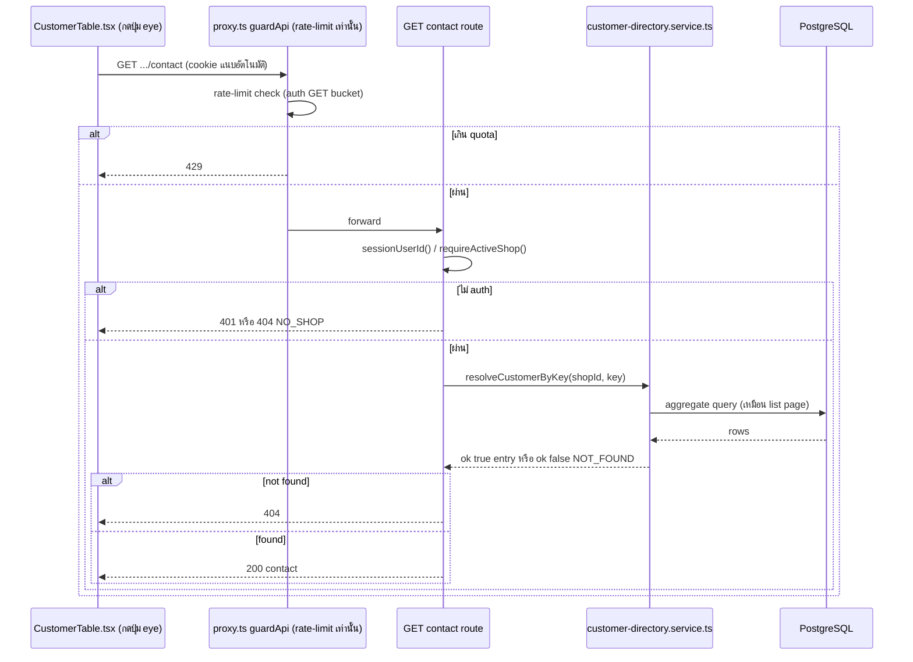

> **โมดูล:** M57-CustomerProfileRisk · **ประเภท:** API Contract · **เวอร์ชัน:** 1.0 · **วันที่:** 2026-08-24 · **สถานะ:** Draft

# API Contract: หน้าโปรไฟล์ลูกค้า + สัญญาณความเสี่ยง

---

## 1. Overview

ฟีเจอร์นี้มี **endpoint เดียว** — หน้าลิสต์/โปรไฟล์เป็น RSC ทั้งหมด ไม่มี fetch ฝั่ง client ยกเว้นปุ่ม "เปิดเผยเบอร์เต็ม" ทีละแถว

- **ต้นทาง:** SDS §6 TD-005
- **Base URL:** `/api` · **Content-Type:** `application/json`
- **Convention:** `{ error: string }` ตอน error / field ตรง ๆ ตอน success — pattern เดียวกับ `sales-series`, `iship/*` ทั้งหมด **ไม่มี `data`/`meta` wrapper**

---

## 2. Authentication

| รายการ | ค่า |
|---|---|
| วิธี | NextAuth session cookie (เดียวกับทุก `/api/seller/*`) |
| Header | ไม่มี custom header — cookie แนบอัตโนมัติ |
| Scope | `sessionUserId()` ต้อง resolve ได้ **และ** `requireActiveShop()` ต้องคืนร้าน |
| ไม่ผ่าน | ไม่มี session → 401 · มี session แต่ไม่มีร้าน → 404 |

---

## 3. Endpoint List

| Method | Path | คำอธิบาย |
|---|---|---|
| `GET` | `/api/seller/customers/{key}/contact` | คืนเบอร์เต็ม (unmasked) ของลูกค้า 1 คนที่ผูกกับร้านที่ active เท่านั้น |

---

## 4. Endpoint Detail

### `GET /api/seller/customers/{key}/contact`

เรียกทุกครั้งที่ผู้ใช้กดปุ่ม "แสดงเบอร์เต็ม" · idempotent · **ไม่ cache ผลใน sessionStorage/localStorage** — component เก็บใน React state ของแถวนั้นเท่านั้น ล้างเมื่อ reload หน้า

**Request**

| ส่วน | ฟิลด์ | ชนิด | บังคับ | คำอธิบาย |
|---|---|---|---|---|
| Path Param | `key` | `string` | yes | Opaque row key จาก `makeCustomerRowKey` — ขึ้นต้นด้วย `c-`/`u-`/`g-` |

ไม่มี query param · ไม่มี body

**Response — Success (200)**

| ฟิลด์ | ชนิด | คำอธิบาย |
|---|---|---|
| `contact` | `string` | เบอร์เต็ม/ข้อความติดต่อดิบ (ไม่ mask) |

**Response — Error**

| สถานะ | code | เงื่อนไข |
|---|---|---|
| 401 | — | ไม่มี session ที่ resolve `userId` ได้ |
| 404 | `NO_SHOP` | มี session แต่ `requireActiveShop()` คืน `null` |
| 404 | `NOT_FOUND` | `key` ไม่ผูกกับออเดอร์ของร้านที่ active — 🛑 **ใช้โค้ดเดียวกันทั้ง "ไม่มีอยู่จริงเลย" และ "เป็นของร้านอื่น" โดยตั้งใจ** (กัน cross-shop enumeration — §8) |
| 404 | `NO_CONTACT` | resolve entry ได้แต่ไม่มีเบอร์ (client ไม่ควรยิงมาถึงเพราะไม่ render ปุ่ม แต่ server ต้อง defensive) |
| 500 | `INTERNAL_ERROR` | exception ที่ไม่คาดคิด — `console.error` ก่อนตอบ |

**ตัวอย่าง**

```json
// GET /api/seller/customers/c-3f9a1b2c-4d5e-6f70-8192-a3b4c5d6e7f8/contact
// 200
{ "contact": "0812345678" }
// 404
{ "error": "ไม่พบข้อมูลลูกค้า" }
// 401
{ "error": "กรุณาเข้าสู่ระบบก่อนใช้งาน" }
```

**Implementation sketch** (อ้างอิง ไม่ใช่โค้ดสุดท้าย)

```ts
export const dynamic = 'force-dynamic'

export async function GET(
  request: NextRequest,
  { params }: { params: Promise<{ key: string }> },
) {
  const session = await getServerSession(authOptions)
  const userId = sessionUserId(session)
  if (!userId) {
    return NextResponse.json({ error: 'กรุณาเข้าสู่ระบบก่อนใช้งาน' }, { status: 401 })
  }
  const active = await requireActiveShop(
    session as unknown as { user: { id: string; activeShopId?: string | null } },
  )
  if (!active) {
    return NextResponse.json({ error: 'ไม่พบร้านค้า กรุณาเปิดร้านก่อนใช้งาน' }, { status: 404 })
  }

  const { key } = await params
  try {
    const result = await resolveCustomerByKey(active.shop.id, key)
    if (!result.ok) {
      return NextResponse.json({ error: 'ไม่พบข้อมูลลูกค้า' }, { status: 404 })
    }
    if (!result.entry.contactFull) {
      return NextResponse.json({ error: 'ลูกค้ารายนี้ไม่มีข้อมูลติดต่อ' }, { status: 404 })
    }
    return NextResponse.json(
      { contact: result.entry.contactFull },
      { headers: { 'cache-control': 'private, no-store' } },
    )
  } catch (e) {
    console.error('[GET /api/seller/customers/[key]/contact]', e)
    return NextResponse.json({ error: 'เกิดข้อผิดพลาด กรุณาลองใหม่' }, { status: 500 })
  }
}
```

🛑 **`cache-control: private, no-store` บังคับ** — response นี้เป็น PII ต่อ user/shop ห้าม cache ที่ CDN/browser

---

## 5. Error Code Table

**ไม่ใช้ในฟีเจอร์นี้:** `VALIDATION_ERROR` / `FORBIDDEN` / `CONFLICT` / `UPSTREAM_ERROR` — ไม่มี business-rule ที่ reject การกระทำ (read-only) และ**ตัดสินใจไม่แยก 403 ออกจาก 404** ด้วยเหตุผลด้าน security

โครง error response ตาม convention เดิมของ codebase (แบนราบ ไม่ใช้ envelope เต็มรูปของ template):

```json
{ "error": "ข้อความภาษาไทยสำหรับผู้ใช้" }
```

---

## 6. Sequence



---

## 7. Traceability

| Endpoint | SDS | BRD FR |
|---|---|---|
| `GET /api/seller/customers/[key]/contact` | TD-005, TD-002 | FR-004 |

---

## 8. Security & Rate Limit

**Rate limit:** เป็น `GET` ธรรมดา ตกอยู่ใน bucket GET มาตรฐานของ `guardApi` (`src/proxy.ts`) ซึ่งใช้ร่วมกับ `GET /api/*` ที่ authenticated จาก IP เดียวกันทั้งหมด — พิจารณาแล้วว่า**พอ** เพราะผู้ใช้กดปุ่ม eye เร็วสุดก็ไม่กี่ครั้งต่อวินาที ขณะที่การนำทางหน้าเพจปกติก็ใช้ quota เดียวกันนี้อยู่แล้วโดยไม่มีปัญหา — **ไม่เพิ่ม bucket แยกใหม่** (ถ้าพบว่าไม่พอในอนาคตค่อยทำแบบ `/api/uploads/*`)

**CSRF:** ไม่ต้องมี Origin-check เพราะเป็น `GET` — `guardApi` เช็ค CSRF เฉพาะ `POST/PUT/PATCH/DELETE`

**Authorization (สำคัญที่สุดของ endpoint นี้):** 🛑 **ห้ามเชื่อ `key` เปล่า ๆ** — ทุก request ต้องผ่าน `resolveCustomerByKey(active.shop.id, key)` ที่ query ด้วย `where: { shopId }` **ตั้งแต่ SELECT ไม่ใช่ filter หลัง fetch** ⇒ `aggregateShopCustomers` ไม่มีทางคืน entry ของร้านอื่นได้เลยตั้งแต่ query แรก การยิง key ของร้านอื่นผ่าน DevTools จึงได้ 404 เสมอ (BRD Scenario 3)

---

## 9. สรุป

Endpoint เดียวของฟีเจอร์นี้ออกแบบให้ DEV implement ได้ตรง ๆ โดยไม่ต้องตัดสินใจ shape ใหม่ — ทุก error path ผูกกับ status code ที่ระบุครบใน §4 และ authorization บังคับที่ชั้น query ไม่ใช่ post-check

**Open Questions:** ไม่มี
