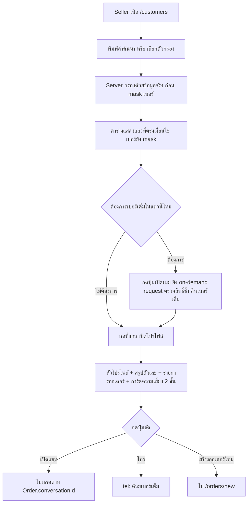
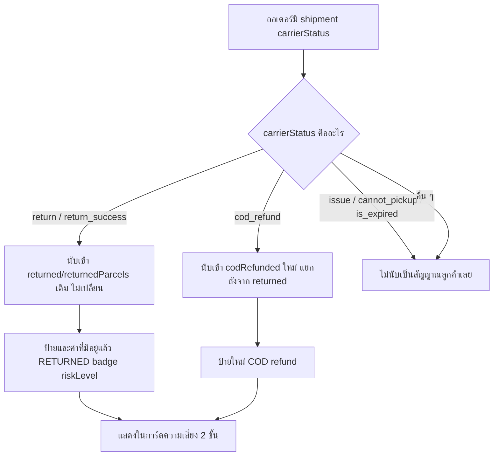

> **โมดูล:** M57-CustomerProfileRisk
> **ประเภทเอกสาร:** Business Requirements Document (BRD) - NON-TECHNICAL
> **เวอร์ชัน:** 1.0
> **วันที่จัดทำ:** 2026-08-24
> **สถานะ:** Draft
> **เจ้าของเอกสาร:** BA

# BRD: หน้าโปรไฟล์ลูกค้า + สัญญาณความเสี่ยง (Customer Profile & Risk)

---

## 1. บทนำ

### 1.1 วัตถุประสงค์ของเอกสาร

1. อธิบายความต้องการหลักของหน้าโปรไฟล์ลูกค้า `/customers/[id]` + การกรอง/ค้นหาที่ทำงานได้จริงในหน้า `/customers` เดิม
2. กำหนดขอบเขตการทำงาน — สัญญาณความเสี่ยงที่ดึงมาแสดง (ไม่คิดสูตรใหม่), ทางเข้าที่อนุญาต, ข้อมูลที่แสดงในโปรไฟล์
3. อธิบายเงื่อนไขการใช้งานและกฎว่าด้วยการรวมศูนย์ข้อมูลอ่อนไหวสำหรับชั้นสิทธิ์ในอนาคต
4. บันทึกอย่างเป็นทางการว่า `docs/20 - Features/00032 - Customer Shipping Risk/` ถูกฟีเจอร์นี้ (ร่วมกับ 00055) แทนที่แล้ว เพื่อไม่ให้คนถัดไปสร้างของซ้ำจาก draft เดิม
5. สร้างความเข้าใจร่วมกันก่อนเข้าสู่ขั้น SRS/SDS/DATABASE/API (Hard Rule 11)

### 1.2 ขอบเขตของระบบ

**หน้าโปรไฟล์ลูกค้า + สัญญาณความเสี่ยง** คือชั้น UI/navigation ที่ (1) ทำให้หน้า `/customers` เดิม (feature 00014) ค้นหา/กรองได้จริงกับข้อมูลจริง และ (2) เพิ่มหน้าลูก `/customers/[id]` ที่รวบรวมประวัติ/สัญญาณความเสี่ยงของลูกค้าคนหนึ่งที่มีอยู่แล้วในระบบ มาแสดงในที่เดียว **ไม่สร้างสูตรคำนวณความเสี่ยงใหม่**

**เข้าสู่ระบบ (Input):**
- การค้นหา/กรองจากหน้า `/customers`
- การกดแถวในลิสต์ / กดลิงก์จาก `CustomerPanel` / กดลิงก์จากหน้ารายละเอียดออเดอร์
- คีย์ลูกค้า (`c-`/`u-`/`g-`) ที่ผูกกับ URL ของหน้าโปรไฟล์

**ออกจากระบบ (Output):**
- ลิสต์ `/customers` ที่ค้นหา/กรองได้จริง
- หน้า `/customers/[id]` — หัวโปรไฟล์ + สรุปตัวเลข + รายการออเดอร์ + ปุ่มลัด + ที่อยู่ล่าสุด + การ์ดความเสี่ยง 2 ชั้น
- ไอคอนความเสี่ยงในแถวลิสต์ (reuse รูปแบบจาก `/orders`)
- สัญญาณ `cod_refund` ใหม่ใน `customer-behavior.ts`/`buyer-reputation.ts`

**ระบบที่เกี่ยวข้อง:** Customer Directory (00014) · Platform Buyer Reputation (00055) · `customer-behavior.ts` · Chat Integration (00018 ecosystem, `Order.conversationId`) · iShip (00022, `OrderShipment.carrierStatus`)

### 1.3 กลุ่มผู้ใช้งาน

| กลุ่มผู้ใช้ | บทบาท | สิทธิ์การใช้งาน |
|-----------|--------|----------------|
| **เจ้าของร้าน** | `ShopMember.role=OWNER` | เข้าถึง `/customers` + โปรไฟล์ลูกค้า + เบอร์เต็ม + ปุ่มลัดทั้งหมดของร้านตัวเอง |
| **พนักงานที่ถูกเชิญ** | `ShopMember.role=ADMIN` | เท่ากับเจ้าของร้านทุกประการในเฟสนี้ (ไม่มีชั้นสิทธิ์ย่อย — ระบบไม่มี role ที่สาม) |
| **ลูกค้า** | ไม่มีสิทธิ์เข้าหน้านี้ | ไม่มีช่องทาง report/appeal ในเฟสนี้ |

---

## 2. ความต้องการหลัก (Functional Requirements)

### 2.1 ค้นหาและกรองในหน้า `/customers` (server-side)

#### FR-001: ย้ายการค้นหาไปเทียบกับข้อมูลจริงฝั่ง server

**User Story:**
> ในฐานะพนักงานร้าน ฉันต้องการค้นหาลูกค้าด้วยเบอร์เต็มแล้วเจอผลลัพธ์จริง เพื่อไม่ต้องไล่หน้าเปิดทีละแถว

**Acceptance Criteria:**
- [ ] พิมพ์เบอร์เต็ม 10 หลักที่ตรงกับ `Order.buyerContact`/`Customer.phone` ของลูกค้าที่เคยสั่งกับร้านนี้ → เจอแถวนั้นเสมอ
- [ ] คำค้นหาเทียบกับค่าจริง (ก่อน mask) — บังคับที่จุดสร้าง query ฝั่ง server (RSC `searchParams`) ไม่ใช่ TanStack `globalFilter` บน array ที่ mask ไปแล้ว
- [ ] ผลลัพธ์ที่แสดงในตารางยังคง mask เบอร์เหลือ 4 ตัวท้ายเหมือนเดิม — การค้นหาเจอ ≠ การแสดงเบอร์เต็มในลิสต์

**Business Flow:**
1. Seller พิมพ์คำค้นหา → sync `?q=` ใน URL
2. RSC ของ `/customers` อ่าน `searchParams.q` แล้วกรองฝั่ง server **ก่อน** เข้าสู่ขั้น mask
3. ส่งเฉพาะแถวที่ตรงเงื่อนไข (mask แล้ว) ไปยัง client

#### FR-002: ตัวกรอง "มีสัญญาณเตือน"

**User Story:**
> ในฐานะเจ้าของร้าน ฉันต้องการกรองเฉพาะลูกค้าที่มีประวัติต้องระวัง เพื่อทบทวนก่อนขายซ้ำ

**Acceptance Criteria:**
- [ ] เมื่อเลือกตัวกรองนี้ ลิสต์เหลือเฉพาะแถวที่ `hasBehaviorWarning(customerBadges(...))` เป็นจริง — ใช้ฟังก์ชันเดิมจาก `src/lib/customer-behavior.ts` ห้ามเขียนเกณฑ์ใหม่
- [ ] ไม่มีลูกค้าที่ตรงเงื่อนไข → แสดงข้อความอธิบายชัดเจน (`ไม่พบลูกค้าที่ตรงกับตัวกรองนี้` + ปุ่มล้างตัวกรอง) ไม่ใช่ตารางว่างเปล่าไม่มีคำอธิบาย

#### FR-003: ตัวกรอง "ซื้อซ้ำแล้ว / ยังซื้อครั้งแรก"

**User Story:**
> ในฐานะเจ้าของร้าน ฉันต้องการแยกลูกค้าประจำออกจากลูกค้าใหม่ เพื่อวางแผนการติดตามต่างกัน

**Acceptance Criteria:**
- [ ] "ซื้อซ้ำแล้ว" = `totalOrders >= 2` (นับทุกสถานะ ตาม FR-9 ของ 00014 — ไม่เปลี่ยนนิยาม `totalOrders` เดิม)
- [ ] "ยังซื้อครั้งแรก" = `totalOrders === 1`
- [ ] ตัวกรองนี้เป็น 1 ใน 2 ตัวกรองทั้งหมดของหน้านี้ — ห้ามมีตัวกรองที่ 3 ที่อิงช่วงเวลา (BR-CUSTP-13)
- [ ] ตัวกรองนี้ **ไม่ผูกกับ** เกณฑ์ `REGULAR` ของ `customerBadges()` (ซึ่งใช้ `completed >= 3`) — เป็นคนละคำถาม ป้ายบนหน้าจอคงเกณฑ์เดิม

### 2.2 เบอร์โทร — บังในลิสต์ + เปิดเผยได้ทีละแถว + เต็มในโปรไฟล์

#### FR-004: ปุ่มเปิดเผยเบอร์เต็มทีละแถว โดยไม่ฝังเบอร์เต็มลงหน้าตั้งต้น

**User Story:**
> ในฐานะพนักงานร้าน ฉันต้องการดูเบอร์เต็มของลูกค้าบางคนในตารางโดยไม่ต้องเปิดโปรไฟล์ เพื่อโทรออกเร็ว ๆ

**Acceptance Criteria:**
- [ ] ค่าตั้งต้นของทุกแถวในตาราง `/customers` ยัง mask เหมือนเดิม (4 ตัวท้าย)
- [ ] แต่ละแถวมีปุ่ม "แสดงเบอร์เต็ม" — กดแล้วเรียก endpoint แยก (on-demand) ที่ตรวจซ้ำว่า key นี้ผูกกับออเดอร์ของร้านที่ล็อกอินอยู่จริง ก่อนคืนเบอร์เต็ม
- [ ] เบอร์เต็ม**ต้องไม่ปรากฏใน flight payload/HTML ตั้งต้นของหน้า** สำหรับแถวที่ยังไม่ถูกกดเปิดเผย (ตรวจด้วย view-source/network tab ก่อนกด) — สอดคล้อง `feedback_rsc_pii_neutralize_at_source`
- [ ] ผู้ใช้จากร้านอื่นเรียก endpoint นี้ด้วย key ของลูกค้าที่ไม่เคยสั่งกับร้านตัวเอง → 403/404 ไม่คืนเบอร์
- [ ] แถวที่ไม่มีเบอร์เลย (`contact === '—'`) → ไม่ render ปุ่มนี้

#### FR-005: เบอร์เต็มในหน้าโปรไฟล์

**Acceptance Criteria:**
- [ ] หน้า `/customers/[id]` แสดงเบอร์เต็มในหัวโปรไฟล์ (ต่างจากลิสต์ที่ยัง mask) เพราะเป็นการเปิดดูลูกค้ารายเดียวที่ตั้งใจแล้ว ไม่ใช่การโหลดหลายสิบแถวพร้อมกัน

### 2.3 หน้าโปรไฟล์ลูกค้า `/customers/[id]`

#### FR-006: รับคีย์ทั้ง 3 รูปแบบเหมือนลิสต์

**User Story:**
> ในฐานะพนักงานร้าน ฉันต้องการกดลูกค้าแถวไหนก็ได้ในลิสต์แล้วไปหน้าโปรไฟล์ได้เสมอ ไม่ว่าลูกค้าคนนั้นจะเป็นสมาชิกหรือ guest

**Acceptance Criteria:**
- [ ] `/customers/c-{customerId}` → resolve จาก `Customer.id` ตรง
- [ ] `/customers/u-{buyerUserId}` → resolve จาก `User.id` + ออเดอร์ที่ `buyerUserId` ตรงกัน
- [ ] `/customers/g-{hash}` → resolve ตาม FR-007
- [ ] key ที่ format ผิด (ไม่ตรง prefix ใด ๆ) → 404 (`notFound()` ไม่ใช่หน้าขาว)

#### FR-007: resolve คีย์ `g-` จากชุดออเดอร์ของร้าน ไม่ reverse hash

**Acceptance Criteria:**
- [ ] เปิด `/customers/g-{hash}` ของลูกค้า guest ที่มีอยู่จริงในร้าน → คำนวณ `makeCustomerRowKey` ของทุกออเดอร์ในร้านนั้นซ้ำ แล้วหาแถวที่ hash ตรง — **ไม่มีการ decode hash กลับเป็น contact ดิบ**
- [ ] hash ที่ไม่ตรงกับลูกค้ารายใดในร้าน → 404
- [ ] เมื่อ resolve เจอ ให้รวมออเดอร์ทั้งหมดที่ได้ key เดียวกันเข้าโปรไฟล์เดียว (เหมือน dedupe ของลิสต์ตาม 00014 FR-7)
- [ ] ตรรกะ group-by-key ต้องเป็น **ฟังก์ชันเดียวกัน** ที่ลิสต์ใช้ (ไม่เขียนซ้ำ 2 ที่) — ไม่งั้นสองหน้าจะ dedupe ไม่ตรงกันเมื่อมีคนแก้ที่เดียว

#### FR-008: เนื้อหาหน้าโปรไฟล์

**Acceptance Criteria:**
- [ ] หัวโปรไฟล์: ชื่อ (ลำดับเดียวกับลิสต์), avatar/initial, เบอร์เต็ม, ลิงก์ `/u/{username}` ถ้าเป็นสมาชิกและไม่ soft-delete (BR-CUST-08 ของ 00014), "ลูกค้าตั้งแต่ {วันที่ออเดอร์แรก}"
- [ ] สรุปตัวเลข: ยอดซื้อสะสม, ยอดเฉลี่ยต่อบิล, จำนวนออเดอร์ทั้งหมด, จำนวนยกเลิก, ซื้อล่าสุด (ดู FR-009)
- [ ] รายการออเดอร์ทั้งหมดของลูกค้าคนนี้กับร้านนี้ เรียงใหม่→เก่า แต่ละใบกดแล้วไปหน้ารายละเอียดออเดอร์ได้
- [ ] ปุ่มลัด: เปิดแชท (FR-011), โทร (`tel:` ด้วยเบอร์เต็ม), สร้างออเดอร์ใหม่ (ป้ายผันตาม `ORDER_VOCAB`)
- [ ] ที่อยู่ล่าสุด 1 อัน: จาก `shippingAddress` ของออเดอร์ล่าสุดที่มีที่อยู่ (ไม่ต้องรวมประวัติที่อยู่ทั้งหมด)
- [ ] ร้านที่ vertical ไม่มีแกน "ที่อยู่จัดส่ง" → ไม่ render section ที่อยู่ทั้งก้อน

#### FR-009: ยอดเฉลี่ยต่อบิล + จำนวนยกเลิก เป็นตัวเลขที่บังคับ ไม่ใช่คำนวณมือ

**Acceptance Criteria:**
- [ ] `ยอดเฉลี่ยต่อบิล = totalSpent (ยอดที่ countsAsRevenue) ÷ count(ออเดอร์ที่ countsAsRevenue เป็นจริง)` — ตัวหารมาจากออเดอร์ชุดเดียวกับตัวตั้ง (ไม่ใช่หารด้วย `totalOrders` ทั้งหมด)
- [ ] `จำนวนยกเลิก` เป็นตัวเลขของตัวเอง แสดงบนหน้าจอตรง ๆ (`cancelledTotal` จาก `summarizeCustomerBehavior()`) — ห้ามให้ผู้ใช้ลบ `totalOrders − ยอดที่นับเป็นยอดขาย` เอาเองในหัว (สองตัวนี้ไม่เท่ากับจำนวนยกเลิกเสมอไป เพราะมี PENDING/SHIPPED ที่ยังไม่จบและไม่ได้ถูกยกเลิก)
- [ ] ลูกค้าที่ไม่มีออเดอร์ที่ `countsAsRevenue` เลย → ยอดเฉลี่ยแสดง `—` ไม่ใช่ ฿0 หรือ NaN (ห้ามหารด้วย 0)

#### FR-010: การ์ดความเสี่ยง 2 ชั้น — reuse ของเดิมทั้งหมด

**Acceptance Criteria:**
- [ ] ชั้นที่ 1 (shop-level): ใช้ `customerBadges()` จาก `src/lib/customer-behavior.ts` ตัวเดียวกับที่ `CustomerPanel`/`OrdersTable` ใช้อยู่แล้ว — ไม่เขียนเกณฑ์ใหม่
- [ ] ชั้นที่ 2 (platform-level): ใช้ `BuyerReputationRow.tsx` (00055) ตัวเดียวกับที่ `CustomerPanel` ใช้อยู่แล้ว — import component เดิม ไม่ copy markup
- [ ] ลูกค้าที่ไม่มีสัญญาณเลยทั้ง 2 ชั้น → ไม่แสดงการ์ดทั้งสองส่วน (no-history-no-card)
- [ ] สีของสัญญาณทั้งหมดเป็น `warning` เท่านั้น ห้ามมี `danger`/`success` ปน ("เตือน ไม่ตัดสิน" — `customer-behavior.ts:159-162`)

#### FR-011: ปุ่มเปิดแชทผูกกับ `conversationId` จริง

**Acceptance Criteria:**
- [ ] ปุ่ม "เปิดแชท" ที่ออเดอร์ใบหนึ่งในรายการ → ไปที่ `Order.conversationId` ของใบนั้นตรง ๆ; เป็น `null` → **ไม่ render ปุ่มนั้น** (ไม่เดาเธรดจากเบอร์/Customer)
- [ ] ปุ่ม "เปิดแชท" บนหัวโปรไฟล์ → ไปเธรดของออเดอร์ล่าสุดที่มี `conversationId != null`
- [ ] ลูกค้าที่ไม่มีออเดอร์ใบไหนมี `conversationId` เลย → ปุ่มบนหัวโปรไฟล์ **ไม่แสดง** (ไม่ใช่ disabled เทา — ไม่มีอะไรให้เปิดจริง ๆ)
- [ ] **Known gap ที่ยอมรับ:** ลูกค้าที่เคยทักแชทแต่ออเดอร์ไม่ได้ผูกเธรด จะหาเธรดไม่เจอ — ไม่ fallback ไปเดาด้วยวิธีอื่น

### 2.4 ทางเข้าหน้าโปรไฟล์

#### FR-012: ลิงก์จาก 3 จุด — ไม่แตะ `/orders` (list)

**Acceptance Criteria:**
- [ ] แถวในลิสต์ `/customers` — คลิกทั้งแถวเปิดโปรไฟล์ (ปุ่ม/ลิงก์ภายในแถวต้องไม่ trigger navigate ซ้อน)
- [ ] `CustomerPanel.tsx` (ห้องแชท) — เพิ่มลิงก์ "ดูโปรไฟล์เต็ม" + **ลบคอมเมนต์ค้างที่เขียนว่าหน้านี้ยังไม่มีอยู่จริง**
- [ ] หน้ารายละเอียดออเดอร์ (`/orders/[token]`) — เพิ่มลิงก์ไปโปรไฟล์ลูกค้าของออเดอร์ใบนั้น
- [ ] ตาราง `/orders` (list) — **ไม่แก้ไข ไม่เพิ่มลิงก์** ในรอบนี้

### 2.5 สัญญาณ `cod_refund`

#### FR-013: เพิ่ม `cod_refund` เป็นสัญญาณแยกในทั้งสองโมดูล

> 🛑 **เลื่อนออกจากรอบนี้ตามมติ D-1 (PRD §0) — ห้าม implement ข้อนี้**
>
> `carrierStatus = 'cod_refund'` **ไม่เคยเกิดบน prod เลยสักแถว** (0/427 พัสดุ · 0/1,026 เหตุการณ์ · 0/17 payload ดิบ) ⇒ ป้ายที่จะสร้างยังไม่มีวันปรากฏบนหน้าจอ ขณะที่ blast radius จริงคือ 6 ไฟล์ รวม `orders/page.tsx` + `OrdersTable.tsx` แบบ compile-forced
>
> **ตัวเฝ้ามีอยู่แล้ว ไม่ต้องสร้างใหม่:** `cod_refund` อยู่ใน `PROBLEM_CARRIER_STATUSES` ⊂ `EVIDENCE_CARRIER_STATUSES` และ `iship.service.ts:2011` เรียก `shouldCaptureEvidence()` อยู่แล้ว ⇒ ใบแรกที่เกิดขึ้นจะถูกหยุดภาพ payload ดิบลง `ShipmentEvidence` โดยอัตโนมัติ — **เปิดใบจริงดูก่อนแล้วค่อยตั้งชื่อป้าย** (`CARRIER_STATUS.cod_refund.text` = "รายการขอเงินคืน" ซึ่งไม่เท่ากับ "ลูกค้าปฏิเสธรับพัสดุ" และเรายังไม่มีตัวอย่างที่จะชี้ขาด)
>
> **สิ่งที่ผู้ขายถามหาจริง ๆ ได้ไปแล้วในรอบนี้:** ป้าย "ตีกลับ N รายการ" ที่มีอยู่ — ข้อมูล prod ยืนยันว่า 7/12 ใบตีกลับมี `statusDesc` เขียนตรง ๆ ว่า `ผู้รับปฎิเสธรับสินค้า` / `ผู้รับปฏิเสธการชําระเงินปลายทาง` และ **0/12 ใบเคยผ่าน `delivered` ก่อน** ⇒ "ตีกลับ" ในระบบนี้แปลว่า "ลูกค้าไม่ได้รับของ" อยู่แล้ว
>
> เนื้อหาด้านล่างเก็บไว้เป็นสเปกพร้อมใช้สำหรับวันที่ใบแรกโผล่ — **ยังคงมีผล:** `issue` ห้ามนับเป็นสัญญาณลูกค้า และห้ามแตะ `RETURNED_CARRIER_STATUSES`/`PROBLEM_CARRIER_STATUSES`

**User Story:**
> ในฐานะเจ้าของร้าน ฉันต้องการรู้ว่าลูกค้าคนนี้เคยมีรายการขอคืนเงินค่าเก็บปลายทางไหม แยกจากพัสดุที่ตีกลับเฉย ๆ

**Acceptance Criteria:**
- [ ] `CustomerBehavior` (`src/lib/customer-behavior.ts`) เพิ่ม field ใหม่ `codRefunded: number` นับจากออเดอร์ที่ carrier status ของพัสดุ active คือ `cod_refund` — **ไม่รวมเข้า `returnedParcels`/`problemOrders` เดิม**
- [ ] `BuyerReputation` (`src/lib/buyer-reputation.ts`) เพิ่ม field คู่กัน ระดับ cross-shop — **ไม่รวมเข้า `returned`/`riskLevel` เดิม** (ไม่กระทบ `HIGH_RISK_MIN_RETURNED`/`HIGH_RISK_MIN_RATE`)
- [ ] `customerBadges()` เพิ่มป้ายใหม่แยกจากป้าย `RETURNED` เดิม tone `warning`
- [ ] **ถ้อยคำของป้ายต้องตรงกับความหมายของข้อมูล** — `CARRIER_STATUS.cod_refund` มีข้อความว่า "รายการขอเงินคืน" ไม่ใช่ "ลูกค้าปฏิเสธรับพัสดุ" ⇒ ห้ามใช้คำที่กล่าวหาเกินกว่าที่ข้อมูลบอก จนกว่าจะยืนยันความหมายจริงกับข้อมูล prod ได้ (HR16)
- [ ] เทส `[blocker]` เทียบค่าเดิม (`returned`/`returnedParcels`/`problemOrders`/`riskLevel`) บนชุดข้อมูลเดิม ต้องได้ผลเท่าเดิมทุกประการก่อน/หลังเพิ่ม field ใหม่
- [ ] `issue` (พัสดุมีปัญหาทั่วไป) **ไม่ถูกนับเป็นสัญญาณลูกค้า** ในทั้งสองโมดูล — เป็นถุงรวมที่ปนความผิดร้าน
- [ ] ไม่แตะ `RETURNED_CARRIER_STATUSES` / `PROBLEM_CARRIER_STATUSES` — เทส `[blocker]` ที่บังคับว่าสองชุดห้ามทับกัน ต้องยังเขียว

### 2.6 เอกสาร — ปิดสถานะ 00032

#### FR-014: ระบุใน 00032 ว่าถูกแทนที่แล้ว

**Acceptance Criteria:**
- [ ] เพิ่มหมายเหตุที่หัวไฟล์ `00032/PRD.md` และ `00032/BRD.md` ระบุว่า superseded by 00055 (สถิติ) + 00057 (UI/navigation) พร้อมลิงก์กลับมาที่ 00057
- [ ] ฟีเจอร์ที่ 00032 ออกแบบไว้แต่ 00057 ไม่ทำ (`CustomerNote`, `shopsInvolved`) ระบุชัดว่ายังเป็น candidate ของ phase ถัดไป ไม่ใช่ทิ้งถาวร

---

## 3. Acceptance Criteria สรุป

### 3.1 การค้นหาและกรอง
- ✅ ค้นหาเบอร์เต็มเจอผลลัพธ์จริงเสมอ (เทียบกับข้อมูลจริงฝั่ง server)
- ✅ ตัวกรองมีแค่ 2 ตัว ไม่มีตัวกรองช่วงเวลา
- ✅ ผลลัพธ์ว่างเปล่ามีคำอธิบายเสมอ และแยกข้อความ "ว่างเพราะตัวกรอง" ออกจาก "ร้านยังไม่มีลูกค้าเลย"

### 3.2 หน้าโปรไฟล์
- ✅ ทุกแถวในลิสต์กดแล้วเปิดโปรไฟล์ได้ ไม่ว่าเป็นคีย์ `c-`/`u-`/`g-`
- ✅ ตัวเลขสรุปตรงกับข้อมูลจริง ไม่ต้องคำนวณมือ
- ✅ ปุ่มเปิดแชทพาไปเธรดที่ถูกต้องจริงเสมอ หรือไม่แสดงถ้าไม่มีข้อมูล
- ✅ การ์ดความเสี่ยง 2 ชั้นมาจาก component/ฟังก์ชันเดิม ไม่มีสูตร/markup ใหม่

### 3.3 ความปลอดภัยของข้อมูล
- ✅ ร้าน A และ B เห็นตัวเลข "ทั้งระบบ" เหมือนกัน แต่ไม่เห็นรายละเอียดร้านอื่นเลย
- ✅ ร้าน B ขอเบอร์เต็มของลูกค้าที่ไม่เคยสั่งกับร้าน B ไม่ได้ แม้รู้ key ตรง ๆ
- ✅ เบอร์เต็มไม่ปรากฏใน flight payload ตั้งต้นของหน้าลิสต์

---

## 4. Business Flows (กระบวนการทำงาน)

### 4.1 Flow หลัก: ค้นหา/กรอง → เปิดโปรไฟล์ → ใช้ปุ่มลัด

### 4.2 Flow ย่อย: เพิ่มสัญญาณ `cod_refund` โดยไม่กระทบของเดิม

---

## 5. Use Case Scenarios (สถานการณ์การใช้งานจริง)

### Scenario 1: Best Case — เปิดโปรไฟล์จากลิสต์ที่กรองแล้ว

**ผู้เกี่ยวข้อง:** เจ้าของร้าน
**เงื่อนไขเริ่มต้น:** ร้านมีลูกค้า 50 คน, 3 คนมีสัญญาณความเสี่ยง

**ขั้นตอน:**
1. เปิด `/customers` เลือกตัวกรอง "มีสัญญาณเตือน"
2. เห็นเหลือ 3 แถว พร้อมไอคอนวงกลมความเสี่ยงท้ายชื่อ
3. กดแถว → เปิดโปรไฟล์
4. เห็นการ์ดความเสี่ยงชั้นที่ 1 (ร้านนี้) และชั้นที่ 2 (ทั้งระบบ)

**ผลลัพธ์:** เจ้าของร้านตัดสินใจเปลี่ยนวิธีชำระเงินสำหรับออเดอร์ถัดไป — ระบบไม่บล็อกอะไร

### Scenario 2: ลูกค้า guest ไม่มี `Customer` — resolve ผ่าน hash

**เงื่อนไขเริ่มต้น:** ลูกค้าสั่งด้วยเบอร์ผิดรูปแบบ (ไม่ผ่าน `^0[689][0-9]{8}$`) — ไม่มี `Customer` ผูก แถวเป็น `g-{hash}`

**ขั้นตอน:** พนักงานกดแถวนี้ → ระบบคำนวณ key ของทุกออเดอร์ในร้านซ้ำ แล้วหาแถวที่ตรง

**ผลลัพธ์:** โปรไฟล์เปิดสำเร็จ แสดงออเดอร์ที่ hash เดียวกันทั้งหมด — ไม่มีลิงก์โปรไฟล์สาธารณะ แต่ปุ่มลัด/สรุปตัวเลขทำงานปกติ

### Scenario 3: พยายามข้ามร้านดูเบอร์เต็ม — ถูกปฏิเสธ

**เงื่อนไขเริ่มต้น:** พนักงานร้าน B รู้ key ของลูกค้าที่เคยสั่งกับร้าน A เท่านั้น

**ขั้นตอน:** ยิง request เปิดเผยเบอร์เต็มด้วย key นั้นตรง ๆ ผ่าน DevTools

**ผลลัพธ์:** 403/404 — ไม่คืนเบอร์เต็ม เพราะ key นี้ไม่ผูกกับออเดอร์ของร้าน B (ตรวจซ้ำที่ server ทุกครั้ง ไม่เชื่อ key เปล่า ๆ)

### Scenario 4: ลูกค้าที่ยกเลิกทุกใบ

**เงื่อนไขเริ่มต้น:** ลูกค้ามี 3 ออเดอร์ ยกเลิกหมดทั้ง 3

**ผลลัพธ์:** ยอดซื้อสะสม ฿0 · ยอดเฉลี่ยต่อบิลแสดง `—` (ไม่หารด้วย 0) · จำนวนยกเลิก 3 · ป้าย "ยกเลิก 3 รายการ" ขึ้นตามจริง · แถวยังอยู่ในลิสต์ ไม่ถูกซ่อน

---

## 6. ความต้องการด้านคุณภาพ (Quality Requirements)

### 6.1 ความถูกต้องของข้อมูล
- ยอดเฉลี่ยต่อบิล/จำนวนยกเลิกต้องตรงกับข้อมูลจริง ตัวหารมาจากชุดเดียวกับตัวตั้ง (FR-009)
- ค่าที่มีอยู่แล้วใน `customer-behavior.ts`/`buyer-reputation.ts` ต้องไม่เปลี่ยนจากการเพิ่ม `cod_refund`

### 6.2 ความรวดเร็ว
- resolve คีย์ `g-` ต้อง scan orders ของร้านนั้น — ยอมรับได้ในสเกลปัจจุบัน (ร้านใหญ่สุด 413 ออเดอร์) ไม่ผูก benchmark เฉพาะในเฟสนี้

### 6.3 ความน่าเชื่อถือ
- สัญญาณความเสี่ยงเป็น derive สดจาก `Order`/`OrderShipment` เหมือนเดิม (ไม่มีตาราง counter ใหม่) — ไม่มีสถานะ "ข้อมูลค้าง"
- **ฐานข้อมูลล้ม ต้องไม่แสดงผลเหมือน "ร้านยังไม่มีลูกค้า"** — พฤติกรรมเดิมของ `page.tsx` ที่ `catch { orders = [] }` ทำให้ทั้งสองกรณีหน้าตาเหมือนกันเป๊ะ ต้องแยกให้ได้ในรอบนี้

### 6.4 ความปลอดภัย
- เบอร์เต็มไม่ฝังในค่าตั้งต้นของหน้าลิสต์ (FR-004)
- ทุก endpoint ที่คืนข้อมูลอ่อนไหวต้องตรวจว่า key นั้นผูกกับร้านที่ล็อกอินอยู่จริง
- ข้ามร้าน = ตัวเลขรวมเท่านั้น (BR-CUSTP-11)

### 6.5 ความสะดวกในการใช้งาน (Usability)
- ทุกแถวในลิสต์กดได้ ไม่มีแถวที่ "ตาย"
- ตัวกรองที่ให้ผลว่างต้องมีคำอธิบาย ไม่ใช่จอเปล่า
- ชื่อลูกค้ายาวผิดปกติ (34+ ตัวอักษร) ต้องไม่ดันกล่องหลุดขอบจอ

---

## 7. ข้อจำกัด (Constraints)

### 7.1 ข้อจำกัดทางธุรกิจ
- ไม่มีชั้นสิทธิ์พนักงานในเฟสนี้ (ไม่มี role ที่สามให้จำกัด)
- ไม่มีตัวกรองช่วงเวลา (ข้อมูลไม่พอให้มีความหมาย)
- `CustomerNote`/merge ลูกค้า ไม่ทำในเฟสนี้

### 7.2 ข้อจำกัดทางเทคนิค
- `g-` key เป็น hash ทางเดียว resolve ได้เฉพาะโดยการคำนวณซ้ำจากออเดอร์ของร้าน
- `Customer` ยังเป็น 1 เบอร์ต่อ 1 แถว (00042 ยังไม่ implement)
- `RETURNED_CARRIER_STATUSES` / `PROBLEM_CARRIER_STATUSES` ห้ามทับกัน (เทส `[blocker]` ที่มีอยู่)

---

## 8. กฎทางธุรกิจ (Business Rules)

### 8.1 กฎขอบเขตลิสต์และการเข้าถึง
- **BR-CUSTP-01** ลิสต์ = คนที่เคยมีออเดอร์กับร้านนี้เท่านั้น ไม่รวม chat lead
- **BR-CUSTP-02** ข้อมูลอ่อนไหวทั้งหมด resolve ผ่านจุดเดียวฝั่ง server เตรียมพร้อมสำหรับชั้นสิทธิ์ในอนาคต
- **BR-CUSTP-03** คำนามทุกจุดผันตาม `Shop.vertical` ผ่าน `ORDER_VOCAB` เท่านั้น ห้ามพิมพ์คำเอง

### 8.2 กฎเรื่อง key และการ resolve
- **BR-CUSTP-04** โปรไฟล์รับ key เดียวกับลิสต์ (`c-`/`u-`/`g-`, ลำดับเดียวกับ `makeCustomerRowKey`)
- **BR-CUSTP-05** `g-` key resolve ด้วยการคำนวณซ้ำจากออเดอร์ของร้าน ห้าม reverse hash และต้องใช้ฟังก์ชัน group เดียวกับลิสต์

### 8.3 กฎเนื้อหาโปรไฟล์
- **BR-CUSTP-06** เนื้อหาโปรไฟล์รอบแรก = หัวโปรไฟล์ + สรุปตัวเลข + รายการออเดอร์ + ปุ่มลัด + ที่อยู่ล่าสุด 1 อัน (ไม่มีเพิ่มเติม)
- **BR-CUSTP-07** ปุ่มเปิดแชทผูกกับ `Order.conversationId` จริงเท่านั้น ห้ามเดาเธรดจากเบอร์/Customer; ไม่มีข้อมูล = ไม่แสดงปุ่ม (ไม่ disabled)
- **BR-CUSTP-09** ยอดเฉลี่ยต่อบิล = `totalSpent(countsAsRevenue) ÷ count(countsAsRevenue)`; จำนวนยกเลิกเป็นตัวเลขของตัวเองบนหน้าจอ; ตัวหารเป็น 0 → แสดง `—`

### 8.4 กฎเรื่องความเสี่ยงและการแชร์ข้ามร้าน
- **BR-CUSTP-10** ลิสต์ใช้ไอคอนวงกลมแบบ `OrdersTable.tsx`; โปรไฟล์ใช้ 2 ชั้น (`customerBadges` + `BuyerReputationRow`) reuse ทั้งคู่ ห้ามเขียนใหม่; ทุกสัญญาณ tone `warning` เท่านั้น
- **BR-CUSTP-11** ข้ามร้าน = ตัวเลขรวมเท่านั้น ห้ามระบุตัวร้านอื่น
- **BR-CUSTP-12** `cod_refund` เป็นสัญญาณของตัวเอง แยกจาก "ตีกลับ"; `issue` ไม่นับเป็นสัญญาณลูกค้า; ถ้อยคำของป้ายต้องไม่กล่าวหาเกินกว่าที่ข้อมูลบอก

### 8.5 กฎตัวกรองและการค้นหา
- **BR-CUSTP-13** ตัวกรองมีแค่ 2 ตัว ห้ามมีตัวกรองช่วงเวลา
- **BR-CUSTP-14** ค้นหา/กรองเทียบกับข้อมูลจริงฝั่ง server ก่อน mask; ตารางยัง mask เบอร์เสมอเว้นแต่ถูกกดเปิดเผยรายแถว; โปรไฟล์แสดงเบอร์เต็ม

### 8.6 กฎเอกสาร
- **BR-CUSTP-15** `docs/20 - Features/00032 - Customer Shipping Risk/` ถูก 00055 + 00057 แทนที่แล้ว ต้องมีหมายเหตุระบุไว้ที่ไฟล์เดิม

---

## 9. อภิธานศัพท์ (Glossary)

| คำศัพท์ | ความหมาย |
|---------|----------|
| **CustomerRow key** | Opaque key `c-`/`u-`/`g-` — นิยามเดียวกับ 00014 `makeCustomerRowKey` |
| **on-demand reveal** | การขอค่าอ่อนไหว (เบอร์เต็ม) ผ่าน request แยกที่ตรวจสิทธิ์ซ้ำ แทนการฝังไว้ในหน้าตั้งต้น |
| **shop-level / platform-level risk** | ชั้นที่ 1 = พฤติกรรมกับร้านนี้ (`customer-behavior.ts`) · ชั้นที่ 2 = ทั้งแพลตฟอร์ม (`buyer-reputation.ts`, 00055) |
| **cod_refund** | สถานะพัสดุจาก iShip ข้อความว่า "รายการขอเงินคืน" — สัญญาณของตัวเอง แยกจาก "ตีกลับ" |
| **countsAsRevenue** | SSOT ของ "ออเดอร์นับเป็นยอดขายไหม" (00014 BR-CUST-07) |

---

## 10. สรุป

**จุดเด่นของระบบ:**
- ไม่คิดสูตรความเสี่ยงใหม่ — ดึงของที่มีอยู่แล้วมาแสดงในที่ที่มันควรอยู่
- ปิดช่องว่างเชิงโครงสร้างของหน้า `/customers` เดิม (ค้นหาที่ไม่มีทางเจอเบอร์เต็ม, แถวที่กดแล้วไม่ไปไหน)
- ปิดสถานะ 00032 อย่างเป็นทางการ ไม่ทิ้งเอกสารร้างไว้ให้คนถัดไปสร้างซ้ำ

**ผลลัพธ์ที่คาดหวัง:** เจ้าของร้านเห็นสัญญาณความเสี่ยงในจุดที่ยังไม่เคยเห็น (หน้ารายการ+โปรไฟล์ลูกค้า) และค้นหา/กรองลูกค้าได้จริงเป็นครั้งแรก

---

**หมายเหตุ:**
สำหรับความต้องการทางธุรกิจระดับภาพรวม/personas/KPI ดู PRD ของโมดูลนี้
สำหรับ technical specification ดู SRS/SDS/DATABASE/API ของโมดูลนี้
