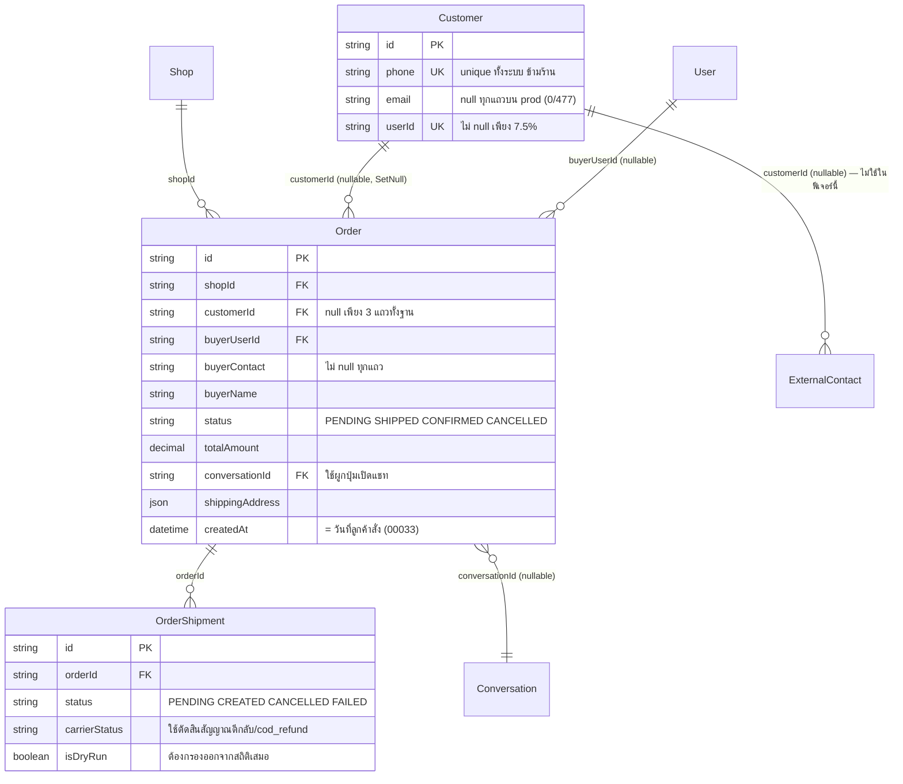

> **โมดูล:** M57-CustomerProfileRisk
> **ประเภทเอกสาร:** Database Design
> **เวอร์ชัน:** 1.0
> **วันที่จัดทำ:** 2026-08-24
> **สถานะ:** Draft

# DATABASE: หน้าโปรไฟล์ลูกค้า + สัญญาณความเสี่ยง

---

## 1. Overview

🛑 **ฟีเจอร์นี้ไม่มีการเปลี่ยนแปลงสคีมาเลย — ไม่มีตารางใหม่ ไม่มีคอลัมน์ใหม่ ไม่มี index ใหม่ ไม่มีไฟล์ migration**

00057 เป็นชั้น **อ่านอย่างเดียว (read-only projection)** ที่ประกอบข้อมูลจากตารางที่มีอยู่แล้วทั้งหมด สิ่งที่ "ใหม่" ในฟีเจอร์นี้คือ **ฟิลด์ที่คำนวณสด** (`codRefunded`, `firstOrderISO`, `revenueOrderCount`) ซึ่งอยู่ใน type ของ TypeScript ไม่ใช่ในฐานข้อมูล

การประกาศเรื่องนี้ไว้เป็นลายลักษณ์อักษรมีความสำคัญ เพราะ **การไม่มี migration คือสิ่งที่ต้องพิสูจน์ ไม่ใช่สิ่งที่สันนิษฐาน** — feature 00032 ที่ฟีเจอร์นี้แทนที่ เคยออกแบบให้มีตาราง `CustomerNote` และคอลัมน์ `shopsInvolved` ไว้ ถ้าใครหยิบเอกสารเก่ามาทำต่อจะสร้าง migration ที่ไม่มีใครต้องการ

**ข้อดีที่ตามมา:** deploy ของรอบนี้ไม่มีขั้นตอน `prisma migrate deploy` ที่ต้องเฝ้า และย้อนกลับได้ด้วยการ revert commit เพียงอย่างเดียว (ดู §5.2)

---

## 2. ERD

ตารางที่ฟีเจอร์นี้ **อ่าน** และความสัมพันธ์ที่ใช้จริง (ไม่มีเส้นไหนถูกเพิ่ม/แก้)

---

## 3. Tables

### 3.1 ตารางที่อ่าน (ไม่มีตารางไหนถูกแก้)

| ตาราง | ใช้ทำอะไรในฟีเจอร์นี้ | คอลัมน์ที่อ่าน |
|---|---|---|
| `Order` | แหล่งความจริงทั้งหมดของลิสต์และโปรไฟล์ | `id` `shopId` `customerId` `buyerUserId` `buyerContact` `buyerName` `status` `totalAmount` `conversationId` `shippingAddress` `createdAt` `cancelReason` `cancelInitiator` `publicToken` `orderNo` |
| `OrderShipment` | ตัดสินสัญญาณความเสี่ยง + `countsAsRevenue` | `status` `isDryRun` `carrierStatus` |
| `User` | ชื่อ/avatar/username ของลูกค้าที่เป็นสมาชิก + `deletedAt` (soft delete → ไม่ลิงก์โปรไฟล์สาธารณะ) | `id` `username` `displayName` `avatar` `deletedAt` |
| `Customer` | resolve key `c-` และเบอร์เต็ม | `id` `phone` |
| `Shop` | scope ทุก query + `vertical` สำหรับผันคำ | `id` `vertical` |
| `Conversation` | ปลายทางปุ่มเปิดแชท (ผ่าน `Order.conversationId` เท่านั้น ไม่ join เพิ่ม) | — (ใช้แค่ id ที่ `Order` ถืออยู่) |

### 3.2 ตารางที่ **จงใจไม่แตะ**

| ตาราง | เหตุผล |
|---|---|
| `ExternalContact` | ลิสต์นี้ = คนที่เคยมีออเดอร์เท่านั้น (BR-CUSTP-01) — 91.2% ของ `ExternalContact` ไม่เคยสั่งซื้อ การ join เข้ามาจะทำให้ลิสต์โตจาก 477 เป็น ~4,866 แถวโดยที่ 9 ใน 10 ไม่ใช่ลูกค้า |
| `CustomerFile` | เป็นของ 00048 ผูกกับ `ExternalContact` ไม่ใช่ `Customer` |
| `ShipmentEvent` | **ใช้เป็นแหล่งสถิติไม่ได้** — พัสดุ active 255 จาก 399 ใบไม่มี event เลย (เขียนเฉพาะตอนมีคนเปิดดู) และ `payload` เป็น null ทั้ง 1,026 แถว |
| `CustomerNote` | **ไม่มีอยู่จริง** — ออกแบบไว้ใน 00032 แต่ไม่เคยสร้าง และอยู่นอกขอบเขตรอบนี้ (BRD §5) |

---

## 4. Indexes

**ไม่มี index ใหม่** — index ที่มีอยู่แล้วครอบ query ของฟีเจอร์นี้ทั้งหมด

| Index ที่มีอยู่ | ใช้กับ query ไหนของ 00057 |
|---|---|
| `Order.shopId` (ผ่าน relation) | query หลักของทั้ง 2 จอ — ดึงออเดอร์ทั้งร้านมา aggregate |
| `@@index([customerId])` (`schema.prisma:911`) | resolve key `c-` |
| `@@index([customerId, status])` (`:919`) | นับ `cancelledTotal` ต่อลูกค้า |
| `@@index([conversationId])` (`:926`) | ไม่ได้ใช้ตรง ๆ (เราอ่าน `conversationId` จากแถวออเดอร์ ไม่ได้ค้นหาด้วยมัน) |

🛑 **จุดที่ index ช่วยไม่ได้ และเป็นเรื่องที่ต้องรู้ตัว:** การ resolve key `g-{hash}` **ไม่มี index รองรับได้เลยโดยธรรมชาติ** เพราะ hash ถูกคำนวณในโค้ด ไม่ได้เก็บในคอลัมน์ ⇒ ต้องดึงออเดอร์ของร้านมาคำนวณ `makeCustomerRowKey` ซ้ำทั้งชุด. ยอมรับได้ในสเกลปัจจุบัน (ร้านใหญ่สุด 413 ออเดอร์) และเป็นราคาที่จ่ายเพื่อไม่ต้องเก็บ contact ดิบไว้ใน URL — **ถ้าจะแก้ในอนาคต ทางที่ถูกคือเพิ่มคอลัมน์ hash ที่ generate ตอนเขียน ไม่ใช่ใส่ index บนสิ่งที่ไม่มีอยู่**

---

## 5. Migration Plan

### 5.1 ลำดับการ Migrate

**ไม่มี** — ไม่มีไฟล์ใน `prisma/migrations/` ถูกเพิ่มในรอบนี้

ตรวจสอบได้ด้วย: `git diff --name-only origin/main...HEAD -- prisma/` ต้องคืนค่าว่าง

> หมายเหตุตาม Hard Rule 15: ถึงรอบนี้จะไม่มี migration แต่การ push ขึ้น `main` ยังรัน `prisma migrate deploy` ตาม `vercel.json` เหมือนเดิม — มันจะไม่พบไฟล์ใหม่และผ่านไปเฉย ๆ ไม่ต้องทำอะไรเพิ่ม

### 5.2 Rollback

`git revert` คอมมิตของฟีเจอร์ — **ไม่มีสถานะในฐานข้อมูลที่ต้องย้อนกลับ** ไม่มีข้อมูลที่ถูกเขียนใหม่ ไม่มีคอลัมน์ที่ต้องดรอป

### 5.3 ผลกระทบ (Impact)

| ด้าน | ผลกระทบ |
|---|---|
| ข้อมูลเดิม | **ไม่มีการเขียนใด ๆ** — ฟีเจอร์นี้ไม่มี write path เลยสักเส้น (endpoint เดียวที่เพิ่มคือ GET) |
| ภาระ query | หน้าลิสต์ยังโหลดออเดอร์ทั้งร้านมา aggregate ใน memory (เท่าเดิมกับ 00014) + query เพิ่มสำหรับ `buyer-reputation` ระดับ cross-shop ต่อการเปิดโปรไฟล์ 1 ครั้ง |
| ตัวเลขบนหน้าจออื่น | 🛑 การเพิ่ม `codRefunded` แตะ `customer-behavior.ts`/`buyer-reputation.ts` ซึ่งใช้ร่วมกับ **ตาราง `/orders` · รายการแชท · แผงลูกค้า · โมดัลเตือนก่อนเปิดพัสดุ COD** — ค่าเดิมต้องไม่เปลี่ยน (บังคับด้วยเทส TC-CPR-U07/U08) |
| prod ปัจจุบัน | `carrierStatus = 'cod_refund'` มี **0 แถว** ⇒ ค่า `codRefunded` จะเป็น 0 ให้ทุกคนในวันที่ deploy |

---

## 6. Retention / ข้อควรระวัง

1. **`Customer.phone` เป็น unique ทั้งระบบ ข้ามร้าน** — การ query ด้วย `phone` โดยไม่ scope `shopId` จะข้ามร้านทันที ทุก query ของฟีเจอร์นี้ต้องเริ่มจาก `Order.shopId` เสมอ ยกเว้นชั้น cross-shop ของ `buyer-reputation` ที่ตั้งใจให้ข้ามร้าน (และคืนเฉพาะตัวเลขรวม — BR-CUSTP-11)
2. **`isDryRun` ต้องกรองออกจากสถิติทุกชนิด** (บน prod ตอนนี้เป็น 0 แถว แต่เป็นค่าที่กลับมาได้)
3. **`Customer.email` เป็น null ทั้ง 477 แถวบน prod** — อย่าออกแบบอะไรที่พึ่งคอลัมน์นี้
4. **`Order.cancelInitiator` เป็น `'seller'` ทุกใบบน prod** ไม่มี `'buyer'` เลย — ตัวที่ทำงานจริงในการแยก "ใครยกเลิก" คือ `cancelReason`
5. 🛑 **`OrderShipment.deliveredAt` เป็น null ทั้ง 427 แถวบน prod** รวม 41 ใบที่ `carrierStatus = 'delivered'` — คอลัมน์นี้ไม่เคยถูกเขียนสักแถว **อย่าใช้เป็นเกณฑ์ในฟีเจอร์นี้** (พบระหว่างสำรวจ 2026-08-24 — เป็นหนี้ของฟีเจอร์อื่น บันทึกไว้เพื่อไม่ให้ใครเผลอใช้)
6. **ไม่มี hard-delete ของ `Order`/`OrderShipment`** ในระบบ — ตัวเลขสะสมจึงไม่หดย้อนหลัง

---

## 7. Traceability

| Requirement | สิ่งที่ database ต้องรองรับ | สถานะ |
|---|---|---|
| FR-006 resolve key `c-` | `@@index([customerId])` | มีอยู่แล้ว |
| FR-006 resolve key `u-` | `Order.buyerUserId` | มีอยู่แล้ว |
| FR-007 resolve key `g-` | ไม่มี index รองรับได้ — คำนวณซ้ำจากออเดอร์ของร้าน | ยอมรับ (§4) |
| FR-009 จำนวนยกเลิก | `@@index([customerId, status])` | มีอยู่แล้ว |
| FR-011 ปุ่มเปิดแชท | `Order.conversationId` | มีอยู่แล้ว |
| FR-013 `codRefunded` | `OrderShipment.carrierStatus` (String, ไม่มี enum/CHECK) | มีอยู่แล้ว — **ไม่ต้องเพิ่มคอลัมน์** |
| BR-CUSTP-11 ข้ามร้าน = ตัวเลขรวม | บังคับที่ชั้น `select` ของ `buyer-reputation.service` ไม่ใช่ที่ schema | มีอยู่แล้ว (00055) |

---

## 8. สรุป (Summary)

ฟีเจอร์นี้ **ไม่มี migration และไม่มีการเขียนฐานข้อมูลเลย** — เป็นชั้นอ่านล้วนที่ประกอบข้อมูลจากตารางเดิม

จุดที่ต้องเฝ้าไม่ใช่เรื่องสคีมา แต่เป็น **ผลกระทบข้างเคียงของการเพิ่ม `codRefunded` เข้าไปในโมดูลที่ใช้ร่วมกับอีก 4 หน้าจอ** — ค่าเดิมต้องพิสูจน์ว่าไม่เปลี่ยนด้วยเทส ไม่ใช่ด้วยการอ่านโค้ด
