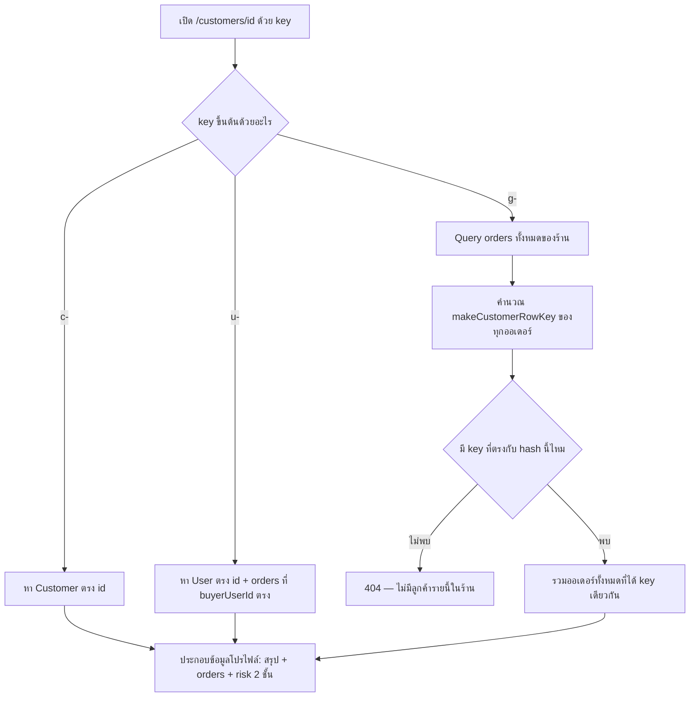

> **โมดูล:** M57-CustomerProfileRisk
> **ประเภทเอกสาร:** Product Requirements Document (PRD)
> **เวอร์ชัน:** 1.0
> **วันที่จัดทำ:** 2026-08-24
> **สถานะ:** Draft
> **เจ้าของเอกสาร:** BA + PO + PM

# PRD: หน้าโปรไฟล์ลูกค้า + สัญญาณความเสี่ยง (Customer Profile & Risk)

---

## Executive Summary

เจ้าของร้านรายงานเองว่าหน้า `/customers` (feature 00014) เป็นตารางที่ "กดชื่อลูกค้าแล้วไปไหนไม่ได้" — ไม่มีตัวกรอง ค้นเบอร์เต็มไม่ได้ (ค้นหาฝั่ง client ทำงานกับเบอร์ที่ถูกบังไว้แล้ว 4 ตัวท้ายเสมอ) และไม่เห็นสัญญาณความเสี่ยงที่ระบบมีอยู่แล้วในอีก 4 จอ (`CustomerPanel` ในห้องแชท, ป้ายท้ายชื่อใน `/orders`, โมดัลเตือนก่อนเปิดพัสดุ COD) — หน้า `/customers` เป็นจอเดียวที่ตกสำรวจ

ฟีเจอร์นี้เพิ่มหน้าลูกจาก `/customers` คือ `/customers/[id]` (โปรไฟล์ลูกค้า) + ทำให้ลิสต์เดิมค้นหา/กรองได้จริง + ดึงสัญญาณความเสี่ยงที่มีอยู่แล้ว (`src/lib/customer-behavior.ts` ระดับร้าน + `src/lib/buyer-reputation.ts` ระดับทั้งแพลตฟอร์ม จาก feature 00055) มาแสดงในหน้านี้ **โดยไม่คิดสูตร/UI ใหม่** — ใช้ตัวที่มีอยู่แล้วทั้งหมดตาม HR16 (นิยามเดียว ห้ามเขียนซ้ำ)

🛑 **ฟีเจอร์นี้แทนที่ `docs/20 - Features/00032 - Customer Shipping Risk/` ทั้งเอกสาร** — 00032 เป็น PRD+BRD draft ที่เขียนไว้ 2026-08-05 แล้วไม่เคยถูก implement เพราะรอ SRS/SDS/DATABASE/API ที่ไม่เคยเกิดขึ้น ระหว่างนั้น feature 00055 (2026-08-24) ได้ทำสถิติความเสี่ยงข้ามร้านจริงไปแล้วด้วยกลไกที่ต่างจาก 00032 ที่ออกแบบไว้ (00032 เสนอ counter คำนวณสดแบบ ad-hoc endpoint ใหม่ทั้งหมด; 00055 ใช้ `Customer.id` เป็นตัวรวมสถิติแบบ derive-only ที่ผูกกับ `customer-behavior.ts`/`buyer-reputation.ts` ที่มีอยู่แล้วในระบบ) ฟีเจอร์นี้ (00057) จึงเป็นชั้น **UI/navigation** ที่เอาผลลัพธ์ของ 00055 มาแสดงในที่ที่ 00032 ตั้งใจจะให้แสดง (หน้า `/customers` + โปรไฟล์ลูกค้า) — **00032 ถือว่าปิดสถานะเป็น superseded ตั้งแต่เอกสารนี้ผ่าน review** ไม่ใช่ยกเลิกโดยไม่มีเหตุผล (ดู §9.1)

---

## 0. มติที่เปลี่ยนระหว่างทาง

### D-1 (2026-08-24): ตัดสัญญาณ `cod_refund` ออกจากรอบนี้ — เหลือเป็น "ตัวเฝ้า" ที่มีอยู่แล้ว

**เดิม** FR-013 กำหนดให้เพิ่มสัญญาณ `codRefunded` (ปฏิเสธ/ขอคืนเงินค่าเก็บปลายทาง) เป็นป้ายของตัวเอง

**ที่เปลี่ยน:** ตรวจฐาน prod (2026-08-24) แล้วพบว่า `OrderShipment.carrierStatus = 'cod_refund'` **ไม่เคยเกิดขึ้นเลยแม้แต่ครั้งเดียว**

| แหล่ง | จำนวนที่พบ |
|---|---|
| `OrderShipment.carrierStatus` (427 แถว, dry-run 0) | **0** |
| `OrderShipment.carrierStatusText` | **0** |
| `ShipmentEvent.status` / `statusText` / `statusDesc` (1,026 แถว) | **0** |
| `ShipmentEvidence.traces` / `parcel` (payload ดิบ 17 แถว) | **0** |

ไม่ใช่เพราะท่อไม่รองรับ — `carrierStatusCodeFromId` แมป id 14 ไว้แล้ว และ `syncShipmentStatuses` เขียนค่านี้ได้ตรง ๆ **มันแค่ยังไม่เคยเกิด**

**ผลถ้าทำตามแผนเดิม:** ได้ป้ายที่ยังไม่มีวันปรากฏบนหน้าจอ พร้อม blast radius จริง — ต้องแตะ `customer-behavior.ts` · `buyer-reputation.ts` · i18n 2 ไฟล์ · **และ `orders/page.tsx` + `OrdersTable.tsx` แบบ compile-forced** ⇒ จ่ายราคาเต็มเพื่อสิ่งที่ยังไม่มีใครเห็น เป็นคลาสเดียวกับตัวกรองช่วงเวลาที่ถูกตัดไปแล้วด้วยเหตุผลเดียวกัน (§4.3)

**มติ:** เลื่อน FR-013 ทั้งข้อออกจากรอบนี้

🛑 **และสิ่งที่ผู้ขายถามหาจริง ๆ มีอยู่แล้ว แค่คนละชื่อ** — ข้อมูล prod ยืนยันว่าเส้นทาง "ลูกค้าไม่รับของ" ถูกบันทึกเป็น `issue` → `return` → `return_success` โดย `ShipmentEvent.statusDesc` เขียนตรง ๆ ว่า `ผู้รับปฎิเสธรับสินค้า` / `ผู้รับปฏิเสธการชําระเงินปลายทาง` (**7 จาก 12 ใบตีกลับ**) และ **ไม่มีพัสดุใบไหนเลยที่ผ่าน `delivered` ก่อนตีกลับ (0/12)** ⇒ ป้าย **"ตีกลับ N รายการ" ที่มีอยู่แล้วคือสัญญาณ "ลูกค้าไม่รับของ" ในระบบนี้อยู่แล้ว** — มันแค่ไม่เคยโผล่ในหน้าลูกค้า ซึ่งคืองานหลักของรอบนี้พอดี

**ตัวเฝ้า: ไม่ต้องสร้างใหม่ มีอยู่แล้ว** — `cod_refund` อยู่ใน `PROBLEM_CARRIER_STATUSES` ⊂ `EVIDENCE_CARRIER_STATUSES` และ `iship.service.ts:2011` เรียก `shouldCaptureEvidence()` อยู่แล้ว ⇒ ใบแรกที่เกิดขึ้นจะถูกหยุดภาพ payload ดิบลง `ShipmentEvidence` โดยอัตโนมัติ (feature 00055) **ห้ามตั้งชื่อป้ายก่อนเปิด payload ใบจริงดู** — `CARRIER_STATUS.cod_refund.text` เขียนว่า "รายการขอเงินคืน" ซึ่งไม่เท่ากับ "ลูกค้าปฏิเสธรับพัสดุ" และเรายังไม่มีตัวอย่างสักใบที่จะบอกได้ว่าอันไหนถูก

**สิ่งที่ยังคงอยู่จากมติเดิม:** `issue` **ไม่ถูกนับเป็นสัญญาณลูกค้า** (เป็นถุงรวมที่ปนความผิดร้าน) และ **ห้ามแตะ** `RETURNED_CARRIER_STATUSES`/`PROBLEM_CARRIER_STATUSES`

---

## 1. Business Goals & KPIs

### 1.1 เป้าหมายทางธุรกิจ

| เป้าหมาย | รายละเอียด |
|----------|-----------|
| **หน้า `/customers` ต้องพาไปต่อได้** | ปัจจุบันกดชื่อลูกค้าแล้วไม่มีอะไรเกิดขึ้น — ต้องมีหน้าโปรไฟล์ที่กดแล้วเห็นประวัติ/ปุ่มลัดจริง |
| **สัญญาณความเสี่ยงที่มีอยู่แล้วต้องไปถึงจุดตัดสินใจ** | `customer-behavior.ts`/`buyer-reputation.ts` คำนวณสัญญาณไว้แล้ว แต่หน้า `/customers` ไม่เคยดึงมาใช้เลย — ต้องดึงมาแสดง ไม่ใช่คิดสูตรใหม่ |
| **ค้นหาต้องค้นได้จริง** | ค้นหาปัจจุบันทำงานกับเบอร์ที่ถูก mask 4 ตัวท้ายไปแล้วที่ RSC boundary — ค้นเบอร์เต็มไม่มีทางเจออะไรเลยโดยโครงสร้าง |
| **ตัวกรองต้องมีความหมายกับข้อมูลจริง** | ร้านใหญ่สุด (413 ออเดอร์, 397 ลูกค้าไม่ซ้ำใน 25 วัน) มีลูกค้าซื้อซ้ำจริงแค่ ~16 คน — ตัวกรองที่อิงช่วงเวลาจะให้ผล 397:0 ทันที (ปุ่มกดแล้วจอว่าง) จึงต้องเลือกแกนกรองที่มีข้อมูลจริงให้กรอง |

### 1.2 ตัวชี้วัดความสำเร็จ (KPIs)

| KPI | คำอธิบาย/วิธีวัด | เป้าหมาย |
|-----|----------|---------|
| **Click-through ลิสต์→โปรไฟล์** | สัดส่วนการเปิดหน้า `/customers/[id]` ต่อการเปิด `/customers` | มีการใช้งานต่อเนื่องหลัง release (ไม่มี baseline เดิมเพราะปุ่มไม่เคยมี) |
| **อัตราค้นหาเบอร์เต็มสำเร็จ** | สุ่มค้นหาด้วยเบอร์เต็ม 10 หลักของลูกค้าที่มีอยู่จริง ต้องเจอแถวนั้นเสมอ | 100% |
| **Zero cross-shop leak** | สุ่มตรวจ response ของหน้าโปรไฟล์ + แถบ "ทั้งระบบ" ต้องไม่มีชื่อร้าน/เลขออเดอร์ของร้านอื่นปรากฏ | 0 กรณี (สืบทอด BR-BR-02/BR-CSR-07) |
| **No-noise filter** | ตัวกรอง "ซื้อซ้ำแล้ว" บนร้านที่มีข้อมูลน้อย ต้องไม่ให้ผลว่างเสมอโดยไม่มีข้อความอธิบาย | 0 กรณีจอว่างไม่มีคำอธิบาย |

---

## 2. User Personas (กลุ่มผู้ใช้งาน)

### 2.1 เจ้าของร้าน/พนักงานร้านที่ถูกเชิญ (`ShopMember.role = OWNER | ADMIN`)

**ข้อมูลพื้นฐาน:** ผู้ใช้ทุกประเภทร้าน (ONLINE_SALES/SERVICE_QUEUE/LODGING) — เมนู "ลูกค้า" เห็นได้ทุกประเภทร้านเหมือนเดิม (ไม่เปลี่ยนจาก 00014)

**เป้าหมาย:** เปิดโปรไฟล์ลูกค้าคนหนึ่งแล้วเห็นทุกอย่างที่จำเป็นในการติดต่อ/ตัดสินใจขายซ้ำ โดยไม่ต้องไล่หาทีละออเดอร์

**ความต้องการ:** ค้นหาลูกค้าด้วยเบอร์เต็มได้ กรองเฉพาะคนที่น่าสนใจ (มีความเสี่ยง/ซื้อซ้ำ) ได้ เปิดแชท/โทร/สร้างออเดอร์ใหม่ได้จากที่เดียว

**จุดปวด (Pain Points):** กดชื่อลูกค้าในตารางแล้วไม่มีอะไรเกิดขึ้น ค้นเบอร์เต็มแล้วหาไม่เจอทั้งที่รู้ว่าลูกค้าคนนี้เคยสั่ง ไม่รู้ว่าลูกค้าคนไหนเคยมีปัญหาการจัดส่งมาก่อน (ทั้งที่ระบบมีข้อมูลนี้อยู่แล้วในหน้าอื่น)

### 2.2 ลูกค้า/ผู้ซื้อ — ไม่ใช่ persona เป้าหมายของเฟสนี้

เหมือน 00032/00055 เดิม — ลูกค้าไม่มีสิทธิ์เห็นหน้านี้หรือสัญญาณความเสี่ยงของตัวเอง ไม่มีกลไก report/appeal ในเฟสนี้ ระบุไว้เพื่อความชัดเจนว่าพิจารณาแล้วและตัดออกอย่างมีเหตุผล ไม่ใช่ลืม

---

## 3. Business Requirements

### 3.1 ค้นหาและกรองที่ทำงานได้จริง (ย้ายไปฝั่ง server)

**ความต้องการ:**
- ค้นหาด้วยชื่อ/เบอร์ต้องเทียบกับข้อมูลจริง (ก่อน mask) ไม่ใช่กับเบอร์ที่ถูกบังไปแล้ว
- ตัวกรองต้องมีแค่ 2 แกนที่มีความหมายกับข้อมูลจริงของแพลตฟอร์มตอนนี้ (มีสัญญาณเตือน / ซื้อซ้ำแล้ว-ยังซื้อครั้งเดียว)

**Business Rules:** BR-CUSTP-01, BR-CUSTP-13

**เหตุผล:**
- ค้นหาฝั่ง client เดิมกรอง array ที่ RSC ส่งมาแล้ว ซึ่งฟิลด์ `contact` ถูก mask เหลือ 4 ตัวท้ายตั้งแต่ต้นทาง (`maskContact()` ใน `page.tsx`) — โครงสร้างนี้ทำให้ "ค้นเบอร์เต็ม" เป็นไปไม่ได้เลยไม่ว่าจะแก้ UI ยังไง ต้องย้ายจุดเทียบไปอยู่ก่อน mask
- ตัวกรองแบบช่วงเวลาจะกรองแล้วได้ 397:0 ทันทีบนร้านใหญ่สุด (ข้อมูลสะสมแค่ 25 วัน) — ปุ่มที่กดแล้วจอว่างเสมอไม่ใช่ตัวกรองที่มีประโยชน์

### 3.2 หน้าโปรไฟล์ลูกค้า `/customers/[id]`

**ความต้องการ:**
- ทุกแถวในลิสต์ `/customers` ต้องกดแล้วไปหน้าโปรไฟล์ได้ ไม่ว่าลูกค้าคนนั้นจะเป็นสมาชิก (มี `Customer.userId`), guest ที่มี `Customer` (ผูกด้วยเบอร์), หรือ guest ที่ไม่มี `Customer` เลย (email-only/เบอร์ผิดรูปแบบ)
- โปรไฟล์แสดง: หัวโปรไฟล์ (ชื่อ/avatar/สถานะสมาชิก), สรุปตัวเลข (ยอดซื้อสะสม, ยอดเฉลี่ยต่อบิล, จำนวนออเดอร์, จำนวนยกเลิก), รายการออเดอร์ทั้งหมดของลูกค้าคนนี้กับร้านนี้ (กดเข้าออเดอร์ได้), ปุ่มลัด (เปิดแชท/โทร/สร้างออเดอร์ใหม่), ที่อยู่ล่าสุด 1 อัน

**Business Rules:** BR-CUSTP-04, BR-CUSTP-05, BR-CUSTP-06, BR-CUSTP-09

**เหตุผล:**
- 00014 สร้างระบบ opaque key (`c-`/`u-`/`g-`) ไว้แก้ปัญหา dedupe ในลิสต์แล้ว (FR-7 ของ 00014) — คีย์เดียวกันนี้ต้องรับได้ในหน้าโปรไฟล์ด้วย ไม่งั้นบางแถวในลิสต์กดแล้วไปหน้าโปรไฟล์ไม่ได้ (โดยเฉพาะแถว `g-` ที่ไม่มี `Customer`/`User` ผูกอยู่เลย)

### 3.3 ปุ่มลัดที่ผูกกับข้อมูลจริง ไม่ใช่การเดา

**ความต้องการ:**
- ปุ่ม "เปิดแชท" ต่อออเดอร์แต่ละใบในหน้าโปรไฟล์ ต้องพาไปเธรดที่สร้างออเดอร์ใบนั้นจริง
- ปุ่ม "เปิดแชท" บนหัวโปรไฟล์ (ไม่ผูกกับออเดอร์ใบใดใบหนึ่ง) ต้องพาไปเธรดที่เคลื่อนไหวล่าสุดของลูกค้าคนนี้กับร้านนี้

**Business Rules:** BR-CUSTP-07

**เหตุผล:**
- `Order.conversationId` (schema.prisma:866) บันทึกไว้แล้วว่าออเดอร์ใบไหนเกิดจากเธรดไหนจริง — การเดาเธรดจากเบอร์ (join `ExternalContact`/`Customer` แบบคาดเดา) เคยเป็นปัญหาที่คอมเมนต์ใน schema ระบุไว้ตรง ๆ ว่าเป็นเหตุผลที่ field นี้ถูกสร้างขึ้นมา

### 3.4 สัญญาณความเสี่ยงที่มีอยู่แล้ว — ดึงมาแสดง ไม่คิดสูตรใหม่

**ความต้องการ:**
- แถวในลิสต์ `/customers` แสดงไอคอนวงกลมความเสี่ยงแบบเดียวกับที่ท้ายชื่อลูกค้าในตาราง `/orders` ใช้อยู่แล้ว
- โปรไฟล์ลูกค้าแสดงความเสี่ยง 2 ชั้น: พฤติกรรมกับร้านนี้ (shop-level, จาก `customer-behavior.ts`) + แถบ "ทั้งระบบ" (platform-level, จาก `buyer-reputation.ts`/feature 00055)
- `cod_refund` (ปฏิเสธ/ขอเงินคืน COD) ต้องเป็นสัญญาณของตัวเอง แยกป้ายจาก "ตีกลับ" (`return`/`return_success`)

**Business Rules:** BR-CUSTP-10, BR-CUSTP-12

**เหตุผล:**
- `customerBadges()`/`OrdersTable.tsx` มีรูปแบบไอคอนวงกลม (`inline-flex size-5 rounded-full bg-{tone}/15 text-{tone}-ink` + `role="img"` + `aria-label`) ที่ผ่าน accessibility gate มาแล้ว — สร้างรูปแบบใหม่ซ้ำจะเสี่ยงพลาดกฎ `aria-name-requires-supporting-role.md` แบบที่เคยพลาดมาก่อน
- `BuyerReputationRow.tsx` (feature 00055) คือ component สำเร็จรูปของแถบ "ทั้งระบบ" ที่ถูกออกแบบมาให้ reuse ได้หลายจุดโดยเจตนา — โปรไฟล์ลูกค้าคือจุดที่สองที่ควรใช้
- `cod_refund` อยู่ใน `PROBLEM_CARRIER_STATUSES` (`src/lib/iship/status.ts:443`) ซึ่งเป็นถุงรวมกับ `issue`/`cannot_pickup`/`is_expired` — ถุงนี้ตอบคำถาม "ร้านต้องรีบดูไหม" ไม่ใช่ "ลูกค้าคนนี้น่าเชื่อถือแค่ไหน" การยัด `cod_refund` เข้ากับ "ตีกลับ" ก็ผิดอีกทาง เพราะเทส `[blocker]` ที่มีอยู่บังคับว่า `RETURNED_CARRIER_STATUSES` กับ `PROBLEM_CARRIER_STATUSES` ห้ามทับกัน (คอมเมนต์ที่ `iship/status.ts:439-441`) — ต้องเป็นสัญญาณที่สามแยกต่างหากในโมดูลพฤติกรรมลูกค้า (คนละชั้นกับตัวจัดหมวดของ shipment stage)

### 3.5 ข้ามร้าน = ตัวเลขรวมเท่านั้น (คงมติเดิม)

**ความต้องการ:** ทุกจุดที่แสดงสถิติข้ามร้าน (แถบ "ทั้งระบบ" ในโปรไฟล์) ต้องเป็นตัวเลขรวมเท่านั้น ไม่มีชื่อร้าน/เลขออเดอร์/วันที่ของร้านอื่น

**Business Rules:** BR-CUSTP-11

**เหตุผล:** สืบทอด D-2 ของ 00055 และ BR-CSR-07 ของ 00032 ตรง ๆ — `buyer-reputation.service.ts` ถูกออกแบบให้บังคับที่ชนิดข้อมูลตั้งแต่ `select` แล้ว (ไม่มี field ระบุร้าน) การนำผลลัพธ์มาแสดงต่อจึงปลอดภัยโดยธรรมชาติ ตราบใดที่ไม่มีการ join เพิ่มเติมที่หน้าโปรไฟล์

### 3.6 ทางเข้าหน้าโปรไฟล์ — จำกัด 3 จุด ไม่แตะตาราง `/orders`

**ความต้องการ:**
- ลิงก์ไปหน้าโปรไฟล์เปิดได้จาก: (1) แถวในลิสต์ `/customers`, (2) แผงลูกค้าในห้องแชท (`CustomerPanel.tsx`), (3) หน้ารายละเอียดออเดอร์
- ตาราง `/orders` ไม่ต้องแตะ/ไม่ต้องเพิ่มลิงก์

**Business Rules:** BR-CUSTP-08

**เหตุผล:** `CustomerPanel.tsx` มีคอมเมนต์ที่เขียนไว้เองตั้งแต่ feature 00018 ว่า "ไม่มีลิงก์ 'ดูในหน้าลูกค้า' → `/customers/[id]` (หน้านี้ยังไม่มีอยู่จริงในโปรเจกต์...)" — เอกสารนี้ปิดช่องว่างที่เคยถูกบันทึกไว้ล่วงหน้าแล้วพอดี. `/orders` ถูกกันไว้นอกขอบเขตเพื่อจำกัดพื้นที่แก้ไขในรอบนี้ (ตารางนั้นมีป้ายพฤติกรรมลูกค้าอยู่แล้วซึ่งเพียงพอ)

### 3.7 ไม่มีชั้นสิทธิ์พนักงานรอบนี้ — แต่ต้องออกแบบให้รวมศูนย์ได้ในอนาคต

**ความต้องการ:**
- ผู้ใช้ที่เข้าหน้านี้ได้ = เจ้าของร้าน + พนักงานทุกคน (`ShopMember.role IN (OWNER, ADMIN)` — ระบบไม่มี role `STAFF` อยู่จริง) ไม่มีการจำกัดสิทธิ์เพิ่มเติมในรอบนี้
- ข้อมูลอ่อนไหวทั้งหมดที่หน้านี้แสดง (เบอร์เต็ม, รายการออเดอร์, ตัวเลขความเสี่ยงข้ามร้าน) ต้อง resolve ผ่านจุดเดียวฝั่ง server (ฟังก์ชัน/โมดูลเดียว) ไม่ใช่กระจาย query ทั่วหน้า

**Business Rules:** BR-CUSTP-02

**เหตุผล:** ไม่ทำชั้นสิทธิ์ตอนนี้เพราะยังไม่มี role ที่สามให้จำกัด — แต่ถ้าฟังก์ชัน resolve ข้อมูลกระจายอยู่คนละที่ วันที่มีชั้นสิทธิ์จริงจะต้องไล่แก้ N จุด ซึ่งเป็นแพตเทิร์นความเสี่ยงที่เกิดซ้ำในโปรเจกต์นี้แล้ว (`docs/conventions/missing-guard-is-a-class` — guard ที่หายไปคือหายทั้งคลาส เพราะกระจายจุดตรวจ)

---

## 4. Business Rules & Constraints

### 4.1 กฎทางธุรกิจหลัก

| กฎ | คำอธิบาย |
|----|----------|
| **BR-CUSTP-01 ลิสต์ = คนที่เคยสั่งซื้อเท่านั้น** | ไม่รวม chat lead (`ExternalContact` ที่ไม่เคยสั่งซื้อ) เข้าลิสต์ (91.2% ของ 4,815 แถว `ExternalContact` ไม่เคยสั่งซื้อ — รวมเข้าจะทำให้ลิสต์ท่วมด้วยคนที่ไม่ใช่ลูกค้า) |
| **BR-CUSTP-02 ข้อมูลอ่อนไหวรวมศูนย์ฝั่ง server** | ทุก field อ่อนไหว resolve ผ่านจุดเดียว เตรียมพร้อมสำหรับชั้นสิทธิ์ในอนาคต |
| **BR-CUSTP-04 คีย์เดียวกันทั้งลิสต์และโปรไฟล์** | `/customers/[id]` รับ `c-{customerId}` / `u-{buyerUserId}` / `g-{sha256(contact)}` เหมือน `makeCustomerRowKey` (feature 00014 FR-7) |
| **BR-CUSTP-08 ทางเข้าจำกัด 3 จุด** | ลิสต์ / `CustomerPanel` / order detail — ไม่แตะตาราง `/orders` |
| **BR-CUSTP-11 ข้ามร้าน = ตัวเลขรวมเท่านั้น** | สืบทอด D-2 (00055) / BR-CSR-07 (00032) |
| **BR-CUSTP-13 ตัวกรอง 2 ตัวเท่านั้น** | มีสัญญาณเตือน / ซื้อซ้ำแล้ว-ครั้งเดียว — ห้ามมีตัวกรองช่วงเวลา |

### 4.2 ข้อจำกัดทางธุรกิจ

| ข้อจำกัด | รายละเอียด |
|---------|-----------|
| **`g-` key resolve ได้ทางเดียว** | คีย์ `g-{hash}` เป็น hash ทางเดียว (SHA-256 ตัดครึ่ง) — resolve กลับเป็น contact ดิบไม่ได้ ต้อง derive จากออเดอร์ของร้านนั้นซ้ำ (คำนวณ `makeCustomerRowKey` ของทุกออเดอร์แล้วหาแถวที่ hash ตรง) ไม่ใช่ decode |
| **ไม่มีชั้นสิทธิ์พนักงานรอบนี้** | ทุกคนที่เข้าร้านได้ (OWNER/ADMIN) เห็นเบอร์เต็ม+ประวัติทั้งหมดของลูกค้าร้านนั้นเหมือนกันหมด |
| **cod_refund ไม่มี trust score penalty ในรอบนี้** | เพิ่มเป็นสัญญาณ*แสดงผล*เท่านั้น (badge/แถบ) — ไม่แตะสูตร `applyBuyerConductPenalty`/`PENALTY_PER_*` ของ 00055 §5 (นอกขอบเขต, ดู §5) |

### 4.3 เหตุผลที่ไม่ทำตัวกรองช่วงเวลา

ข้อมูล prod ปัจจุบัน (2026-08-24): ร้านใหญ่สุดมีออเดอร์สะสมแค่ 25 วัน ลูกค้าไม่ซ้ำ 397 คนในจำนวนนั้น ซื้อซ้ำจริงอย่างมาก ~16 คน — ตัวกรองที่แบ่งตามช่วงเวลา (เช่น "ลูกค้าใหม่ 7 วัน" / "ลูกค้าเก่า 30 วันขึ้นไป") จะให้ผล **397:0** ทันทีในเกือบทุกกรณี เพราะข้อมูลทั้งหมดยังอยู่ในช่วงเวลาเดียวกัน กติกาจึงยึดแกน "ซื้อซ้ำ/ไม่ซ้ำ" (นับจาก `totalOrders`) ซึ่งเป็นแกนที่มีการกระจายตัวจริงในข้อมูลปัจจุบัน แทน

---

## 5. Out of Scope (นอกขอบเขต)

| หัวข้อ | คำอธิบาย |
|--------|----------|
| **โน้ตที่ร้านจดเอง (`CustomerNote`)** | ออกแบบไว้แล้วใน 00032 §3.2 แต่ไม่เคย implement — รอบนี้ไม่ทำ (เอกสาร 00032 เก็บไว้เป็นอ้างอิงสำหรับ phase ถัดไปถ้าจะทำ ไม่ใช่ทิ้ง) |
| **สินค้าที่ซื้อบ่อย** | ไม่มีในสรุปตัวเลข/โปรไฟล์รอบนี้ |
| **`shopsInvolved` (จำนวนร้านที่เกี่ยวข้อง)** | 00055/`BuyerReputation` ไม่มี field นี้อยู่แล้ว (ต่างจากที่ 00032 เคยออกแบบไว้) — ไม่เพิ่มในรอบนี้ |
| **ผสาน chat lead (`ExternalContact`) เข้าลิสต์** | คงมติเดิมจาก 00014 Phase 2 (out) — ยังไม่ทำ |
| **Pagination ฝั่ง server** | คงเป็น known gap เดิมจาก 00014 (NFR-2) — ไม่แก้ในรอบนี้ |
| **ชั้นสิทธิ์พนักงาน (staff permission)** | ไม่มี role ที่สามให้จำกัดในระบบตอนนี้ — ดู §3.7 |
| **ตัวกรองช่วงเวลา** | ข้อมูลไม่พอให้กรองมีความหมาย (§4.3) |
| **แก้/รวม record ลูกค้า (merge)** | เป็นขอบเขตของ feature 00042 (approved แต่ยัง unbuilt) — ไม่ทำในฟีเจอร์นี้ |
| **Trust Score penalty จาก `cod_refund`** | เป็นขอบเขตของ 00055 §5 (D-4) ซึ่งยังปิดสวิตช์อยู่ — ฟีเจอร์นี้ไม่แตะสูตร |
| 🛑 **สัญญาณ `codRefunded` ทั้งข้อ (FR-013 เดิม)** | **เลื่อนออกตามมติ D-1 (§0)** — `cod_refund` ไม่เคยเกิดบน prod เลยสักแถว ตัวเฝ้ามีอยู่แล้วผ่าน `ShipmentEvidence` ไม่ต้องเขียนโค้ดเพิ่ม |

---

## 6. Risks & Mitigation (ความเสี่ยงและแนวทางแก้ไข)

### 6.1 ความเสี่ยงทางธุรกิจ

| ความเสี่ยง | ผลกระทบ | ระดับความรุนแรง | แนวทางแก้ไข |
|-----------|---------|-----------------|-------------|
| ร้านเห็นเบอร์เต็มของลูกค้าทุกคนที่เคยสั่งกับร้าน (รวมพนักงานทุกคน) | พนักงานที่ถูกเชิญเห็น PII เท่าเจ้าของร้านทั้งหมด | กลาง | ยอมรับได้ในรอบนี้ (§3.7) เพราะพนักงานเห็นเบอร์นี้อยู่แล้วในหน้าออเดอร์/แชท — ไม่ใช่การเปิดเผยเพิ่มใหม่ ออกแบบให้รวมศูนย์ (BR-CUSTP-02) รอชั้นสิทธิ์ในอนาคต |
| ตัวกรอง "ซื้อซ้ำแล้ว" ให้ผลน้อยมากในบางร้าน (ข้อมูลยังใหม่) | ร้านกดตัวกรองแล้วเห็นรายการว่าง/สั้นผิดคาด | ต่ำ | ไม่ใช่บั๊ก — ระบุสถานะ "ไม่มีลูกค้าที่ตรงเงื่อนไข" ชัดเจนแทนจอว่างเปล่า |

### 6.2 ความเสี่ยงทางเทคนิค

| ความเสี่ยง | ผลกระทบ | แนวทางแก้ไข |
|-----------|---------|-------------|
| `g-` key resolve ต้อง scan orders ของร้านทั้งหมดทุกครั้งที่เปิดโปรไฟล์ (ไม่มี index ตรงบน hash) | โหลดช้าสำหรับร้านที่มีออเดอร์เยอะและลูกค้าเป็น guest ไม่มี `Customer` | ยอมรับได้ในสเกลปัจจุบัน — ให้ SRS/SDS ตัดสิน index ถ้าจำเป็น |
| ส่งเบอร์เต็มลง flight payload ของหน้า RSC โดยไม่ระวัง | ละเมิด `feedback_rsc_pii_neutralize_at_source` (PII ไหลเข้า client bundle ที่ไม่ต้องการ) | เบอร์เต็มต้อง resolve ผ่าน on-demand call (server action/API) ไม่ใช่ฝังในค่าตั้งต้นของหน้า (ดู FR-004) |
| เพิ่ม `cod_refund` เป็นสัญญาณใหม่ใน `customer-behavior.ts`/`buyer-reputation.ts` โดยไม่ระวังจะไปกระทบ `problemOrders`/`riskLevel` เดิม | ตัวเลขเดิมที่ 4 จอใช้อยู่แล้ว (`CustomerPanel`, `/orders`, โมดัลเตือน COD) เปลี่ยนความหมายเงียบ ๆ | เพิ่มเป็น field ใหม่แยก (`codRefused`) ไม่รวมเข้า `problemOrders`/`returned` เดิม — มีเทส `[blocker]` เทียบค่าก่อน/หลังของ field เดิมต้องไม่เปลี่ยน |

---

## 7. Glossary (อภิธานศัพท์)

| คำศัพท์ | ความหมาย |
|---------|----------|
| **CustomerRow key** | Opaque key ของแถวลูกค้า — `c-{customerId}` ชนะเสมอ → `u-{buyerUserId}` → `g-{sha256(contact)}` (feature 00014, `makeCustomerRowKey`) |
| **customer-behavior.ts** | โมดูล pure function ที่ตอบว่า "ลูกค้าคนนี้เคยมีพฤติกรรมอะไรกับ*ร้านนี้*" (shop-scoped) |
| **buyer-reputation.ts** | โมดูล pure function ที่ตอบว่า "ลูกค้าคนนี้รับของจริงแค่ไหน*ทั้งแพลตฟอร์ม*" (feature 00055, cross-shop) |
| **countsAsRevenue** | SSOT ของ "ออเดอร์ใบนี้นับเป็นยอดขายไหม" (`src/lib/order-revenue.ts`, feature 00014 BR-CUST-07) |
| **cod_refund** | สถานะพัสดุจาก iShip ที่แปลว่า "มีรายการขอเงินคืนค่าเก็บปลายทาง" (`src/lib/iship/status.ts`) — อยู่ในถุง `PROBLEM_CARRIER_STATUSES` เดิม แต่ต้องเป็นสัญญาณของตัวเองในบริบทความเสี่ยงลูกค้า |
| **ORDER_VOCAB** | SSOT ของคำนามผันตาม `Shop.vertical` — ห้ามพิมพ์คำผันเองที่หน้าใหม่ |
| **on-demand reveal** | รูปแบบที่ค่าอ่อนไหว (เบอร์เต็ม) ไม่ถูกฝังในค่าตั้งต้นของหน้า แต่ดึงมาเมื่อผู้ใช้กดขอ ผ่าน request แยกที่ตรวจสิทธิ์ซ้ำ |

---

## 8. Success Metrics (ตัวชี้วัดความสำเร็จ)

| ตัวชี้วัด | ค่าที่คาดหวัง | วิธีวัด |
|----------|---------------|--------|
| ทุกแถวในลิสต์กดแล้วไปโปรไฟล์ได้ | 100% (รวมแถว `g-` ที่ไม่มี `Customer`) | สุ่มตรวจแถวทั้ง 3 ประเภทคีย์ |
| ค้นหาเบอร์เต็มเจอ | 100% เมื่อเบอร์นั้นมีอยู่จริงในออเดอร์ของร้าน | ทดสอบด้วยเบอร์เต็ม 10 หลัก |
| Zero cross-shop leak ในแถบ "ทั้งระบบ" | 0 | สุ่มตรวจ response 2 บัญชีร้านต่างกัน |
| field เดิมของ `customer-behavior.ts`/`buyer-reputation.ts` ไม่เปลี่ยนค่าจากการเพิ่ม `cod_refund` | 0 regression | เทส snapshot ก่อน/หลังด้วยชุดข้อมูลเดิม |

---

## 9. Dependencies & Assumptions

### 9.1 สิ่งที่ต้องพึ่งพา (Dependencies)

| ระบบ/ส่วนประกอบ | ความสัมพันธ์ |
|-----------------|-------------|
| `Customer` (feature 00014) | Entity กลาง — `phone` unique ทั้งระบบ, ไม่มีการรวมหลายเบอร์ (00042 ยังไม่ implement) |
| `makeCustomerRowKey` (`src/lib/customer-row-key.ts`) | ตัวสร้าง/นิยาม key เดียวกันทั้งลิสต์และโปรไฟล์ |
| `countsAsRevenue` (`src/lib/order-revenue.ts`) | ตัวตัดสินยอดซื้อสะสม/ยอดเฉลี่ย — SSOT เดียวกับ 00014 |
| `customer-behavior.ts` / `buyer-reputation.ts` | ตัวคำนวณสัญญาณความเสี่ยงทั้งสองชั้น (feature 00055) |
| `Order.conversationId` (schema.prisma:866) | ใช้ผูกปุ่ม "เปิดแชท" ต่อออเดอร์ |
| `CustomerPanel.tsx` (feature 00018 ecosystem) | จุดแสดงผลเดิมที่มี `customerBehavior`/`buyerReputation` อยู่แล้ว + จุดที่ต้องเพิ่มลิงก์ไปโปรไฟล์ |
| `OrdersTable.tsx` | ต้นแบบไอคอนวงกลมความเสี่ยง — ต้อง reuse ไม่สร้างใหม่ |
| `docs/20 - Features/00032 - Customer Shipping Risk/` | เอกสาร draft เดิมที่ฟีเจอร์นี้ superseded — เก็บไว้อ้างอิงสำหรับ scope ที่ยังไม่ทำ (CustomerNote) |
| `docs/20 - Features/00042 - Customer Multi-Phone & Merge/` | PRD approved แต่ยัง unbuilt — ถ้าถูก implement ทีหลัง หน้าโปรไฟล์ต้องรองรับ multi-phone ด้วย (นอกขอบเขตตอนนี้) |

### 9.2 สมมติฐาน (Assumptions)

- `Customer.phone` ยังเป็น 1 เบอร์ต่อ 1 แถวเสมอ (00042 ยังไม่ implement) — ถ้า 00042 ถูกทำก่อน 00057 ต้องทบทวนการ resolve `g-`/`c-` key ใหม่
- ผู้ใช้ที่เข้าหน้านี้ทุกคนเป็น `ShopMember` ของร้านนั้น (`requireActiveShop` guard เดิม) — ไม่มีบัญชีภายนอกเข้าถึงได้
- เบอร์โทรที่ค้นหา/แสดงผลผ่าน normalize เดียวกันทุกจุด (`src/lib/phone.ts`) ไม่มีจุดไหนเทียบเบอร์แบบ raw string
- ไม่มี hard-delete ของ `Order`/`OrderShipment` ในระบบจริง

---

## 10. Appendix

### 10.1 ตัวอย่าง User Journey

**Scenario: seller เปิดโปรไฟล์ลูกค้าจากแชทแล้วเห็นประวัติเต็ม**

1. Seller กำลังคุยกับลูกค้าในห้องแชท เปิดแท็บ "ข้อมูลลูกค้า" ใน `CustomerPanel`
2. เห็นแถบ "ทั้งระบบ" (มีอยู่แล้วจาก 00055) พร้อมลิงก์ใหม่ "ดูโปรไฟล์เต็ม" ต่อจากป้ายพฤติกรรมลูกค้า
3. กดลิงก์ → ไปหน้า `/customers/[id]` ด้วยคีย์เดียวกับที่ลิสต์ใช้
4. เห็นหัวโปรไฟล์ สรุปตัวเลข (ยอดซื้อสะสม/เฉลี่ยต่อบิล/จำนวนยกเลิก) รายการออเดอร์ทั้งหมด และการ์ดความเสี่ยง 2 ชั้น
5. กดปุ่ม "เปิดแชท" ที่ออเดอร์ใบหนึ่ง → ไปเธรดที่สร้างออเดอร์ใบนั้นจริง (ผ่าน `conversationId`)

### 10.2 Flow การ resolve key ของหน้าโปรไฟล์

---

**หมายเหตุ:**
เอกสารนี้เป็นการบันทึกความต้องการทางธุรกิจ (Business Requirements) โดยไม่มีรายละเอียดทางเทคนิค
สำหรับ Functional Requirements / User Story / Acceptance Criteria ดู BRD ของโมดูลนี้
สำหรับ technical specification ดู SRS ของโมดูลนี้
