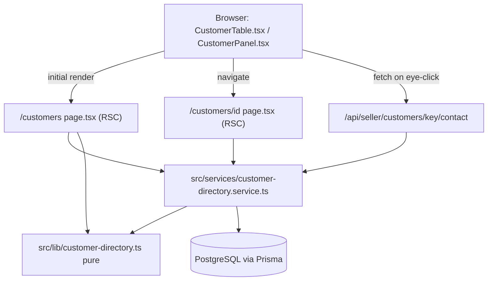
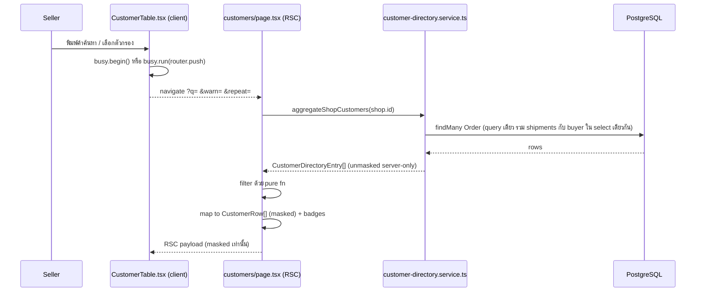
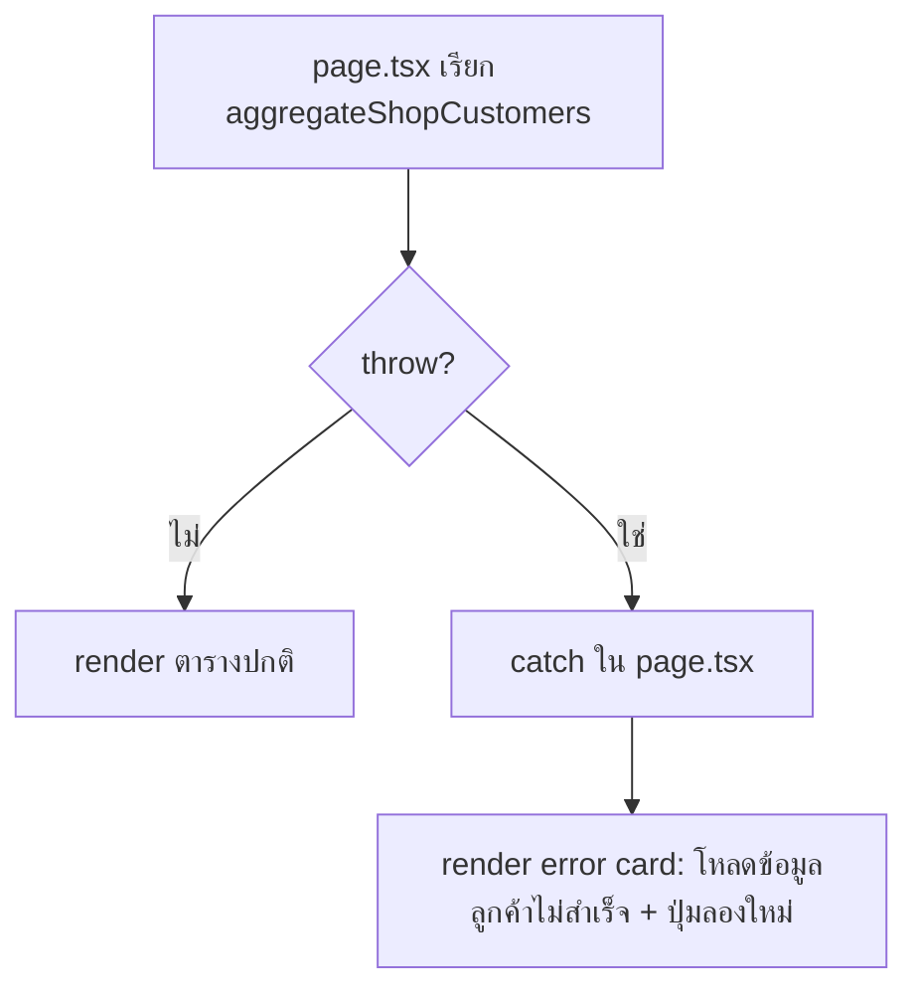

> **โมดูล:** M57-CustomerProfileRisk · **ประเภท:** System Design Spec (SDS) · **เวอร์ชัน:** 1.0 · **วันที่:** 2026-08-24 · **สถานะ:** Draft · **เจ้าของ:** SA

# SDS: หน้าโปรไฟล์ลูกค้า + สัญญาณความเสี่ยง

---

## 1. บทนำ

ออกแบบ implementation ของ TFR-001..010 ใน SRS — ให้ DEV เริ่มเขียนได้ทันทีโดยไม่ต้องตัดสินใจ shape ของ query/type ใหม่ · ขอบเขต: Next.js App Router (RSC + 1 Route Handler) ทั้งหมด ไม่มี service ภายนอก

---

## 2. Architecture Overview

ยึด **lib/service split เดิมของโปรเจกต์** เป๊ะ (เหมือน `customer-behavior.ts` + `.service.ts`): pure function ที่ไม่แตะ prisma อยู่ `src/lib/` · I/O อยู่ `src/services/` · หน้า RSC เรียก service ตรง ๆ ไม่มี API layer เพิ่มสำหรับการอ่าน — ยกเว้นจุดเดียวที่ต้อง "อ่านทีละแถวหลัง client กด" ซึ่งจำเป็นต้องเป็น Route Handler จริง

---

## 3. Component Design

| Component | หน้าที่ | Dependency |
|---|---|---|
| `src/lib/customer-directory.ts` **(ใหม่)** | types (`CustomerDirectoryEntry`, `CustomerDirectoryOrder`) + pure fn (`matchesCustomerQuery`, `matchesRepeatFilter`, `findEntryByKey`, `avgPerOrder`, `maskContact`) | ไม่มี — pure |
| `src/services/customer-directory.service.ts` **(ใหม่)** | `aggregateShopCustomers(shopId)` · `resolveCustomerByKey(shopId, key)` | Prisma, `customer-directory.ts`, `customer-behavior.ts`, `order-revenue.ts`, `customer-row-key.ts` |
| `customers/page.tsx` (แก้) | อ่าน searchParams → service → กรอง → mask → error boundary | service + lib + `getT()` + `resolveOrderVocab` |
| `customers/components/CustomerTable.tsx` (แก้ใหญ่) | URL-query filter UI, `onRowClick`, eye-reveal, risk icons | `useRouter`/`useSearchParams`, `useListBusy`, `CustomerBehaviorBadges` |
| `customers/[id]/page.tsx` **(ใหม่)** | resolve key + orchestrate โปรไฟล์ (server component ล้วน ไม่มี client state) | service, `getBuyerReputation`, `getT()`, `resolveOrderVocab`, `shopShipsGoods` |
| `customers/[id]/loading.tsx` **(ใหม่)** | skeleton mirror โครงจริง | — |
| `customers/[id]/components/CustomerProfileHeader.tsx` **(ใหม่)** | avatar+ชื่อ+เบอร์+ปุ่มลัด+สรุปตัวเลข+risk 2 ชั้น+ที่อยู่ | `CustomerBehaviorBadges`, `BuyerReputationRow` |
| `customers/[id]/components/CustomerProfileOrders.tsx` **(ใหม่)** | รายการออเดอร์ + pagination | `TablePagination`, `ORDER_STATUS_META` |
| `src/components/safepay/CustomerBehaviorBadges.tsx` **(ใหม่)** | 2 named export (`CustomerBehaviorIcons`/`CustomerBehaviorPills`) — markup กลางที่เดิมซ้ำ 2 ที่ | `Icon`, `CustomerBadge` |
| `src/app/api/seller/customers/[key]/contact/route.ts` **(ใหม่)** | GET คืนเบอร์เต็ม | service, `requireActiveShop`, `sessionUserId` |

---

## 4. Data Flow

### 4.1 โหลด `/customers` พร้อมตัวกรอง

### 4.2 กรณีล้มเหลว: DB ล่มระหว่างโหลด

🛑 **ต้อง distinct จาก empty-state เดิม** — ของเดิม `catch { orders = [] }` แล้วส่ง `[]` เข้า `CustomerTable` ทำให้ผู้ใช้เห็น "ยังไม่มีลูกค้า" ทั้งที่ฐานล่ม **แก้โดยไม่ catch ใน service เลย** ปล่อย exception ไหลถึง `page.tsx` แล้ว catch ตรงนั้นเพื่อ render UI คนละแบบ

---

## 5. Integration Points

| จุดเชื่อม | Contract | ความเสี่ยงเมื่อล่ม |
|---|---|---|
| `buyer-reputation.service.ts::getBuyerReputation` | function call | ตามโค้ดจริงไม่ throw (คืน `null` เสมอ) แต่ต้อง try/catch ครอบรวมกับ `resolveCustomerByKey` ใน page เดียวกันอยู่ดี |
| `/api/seller/customers/[key]/contact` | REST GET, JSON | client ต้องมี error state **ต่อแถว** (ปุ่ม eye กลับเป็น idle + toast) ไม่ใช่ throw ที่ไม่ถูกจับ |

**ไม่มี retry อัตโนมัติ** (read-only — ผู้ใช้กดใหม่เองได้) สอดคล้อง pattern `useListBusy`

---

## 6. Technical Decisions

### TD-001: split pure/I·O ตาม convention เดิม (ไม่สร้าง pattern ใหม่)
**ตัดสินใจ:** `customer-directory.ts` (pure) + `.service.ts` (I/O) แยกไฟล์
**เหตุผล:** ตรงกับ `customer-behavior` และ `buyer-reputation` ที่มีอยู่แล้ว ⇒ `matchesCustomerQuery`/`avgPerOrder` เทสได้โดยไม่ต้อง mock Prisma
**ตัดทิ้ง:** รวมทุกอย่างใน service ไฟล์เดียว — ขัด convention ทั่วโปรเจกต์

### TD-002: `resolveCustomerByKey` เป็นจุดเดียวที่ทั้ง list/profile/contact-API เรียก
**ตัดสินใจ:** ไม่มี logic แยก resolve `g-`/`c-`/`u-` ที่ page หรือ route เขียนเอง
**เหตุผล:** BR-CUSTP-05 บังคับตรง ๆ — ป้องกัน dedupe ไม่ตรงกันระหว่างหน้า
**ตัดทิ้ง:** endpoint แยกสำหรับ `c-`/`u-` ที่ query ตรง id ได้เร็วกว่า — ตัดเพราะได้ 2 code path ที่ต้อง sync กัน แลกกับ perf ที่ยังไม่จำเป็น (413 ออเดอร์)
**ผลกระทบ:** ทุก key type มี cost เท่ากัน (full aggregate) — ยอมรับตาม NFR

### TD-003: `codRefunded` เป็น "independent counter บรรทัดแรกของ loop" — 🛑 เลื่อนออก (มติ D-1)
**ตัดสินใจ:** 1 บรรทัดใหม่ที่**ไม่มี `continue`** วางก่อน logic เดิมทั้งหมดของ `summarizeCustomerBehavior()`/`summarizeBuyerReputation()`
**เหตุผล:** พิสูจน์ zero-regression ได้ **ด้วยการอ่านโค้ด** ไม่ต้องพึ่งเทสอย่างเดียว — เพราะไม่แตะ branch เดิมแม้แต่บรรทัดเดียว
**ตัดทิ้ง:** แทรกเป็น tier ใหม่ระหว่าง `returned` กับ `cancelled` — **ละเมิด AC โดยตรง** เพราะจะทำให้ออเดอร์ `cod_refund` ที่เคยถูกนับเป็น `completed` หายไป
**ผลกระทบ:** ออเดอร์ 1 ใบถูกนับได้ทั้ง `completed`/`cancelledTotal` **และ** `codRefunded` พร้อมกัน (ไม่ mutually exclusive) — เป็นความหมายที่ถูก เพราะ "มีการขอเงินคืน COD" เป็นข้อเท็จจริงอิสระจากสถานะออเดอร์

### TD-004: `CustomerBehaviorBadges.tsx` — รวม markup ที่ซ้ำอยู่แล้ว 2 ที่ ไม่ใช่สร้างของใหม่
**ตัดสินใจ:** สกัด JSX จาก `OrdersTable.tsx:422-434` (icon circle) และ `CustomerPanel.tsx:881-895` (label pill) เป็น 2 named export แล้ว refactor ทั้ง 2 ไฟล์เดิมให้เรียกใช้ พร้อม 2 จุดใหม่
**เหตุผล:** UX spec สั่งชัดว่าห้ามสร้างรูปแบบใหม่ — จะมี **4 จุด** ที่ต้องแสดงผลเหมือนกันเป๊ะ ปล่อย copy-paste ต่อจะซ้ำรอยบั๊ก `CANCELLED_BY_BUYER` (2026-08-11) ที่ต้องไล่แก้ 2 ไฟล์พร้อมกัน
**ตัดทิ้ง:** copy JSX เข้าจุดใหม่ 2 จุดโดยไม่แตะไฟล์เดิม — เพิ่มจุดซ้ำจาก 2→4 แทนที่จะลดเหลือ 1
**ผลกระทบ:** commit นี้ต้องแตะ `OrdersTable.tsx`/`CustomerPanel.tsx` เพิ่ม (mechanical refactor — diff เป็นแค่การย้าย JSX ก้อนเดิมออกไปเรียกผ่าน prop ไม่เปลี่ยน DOM output)

### TD-005: contact-reveal เป็น Route Handler ไม่ใช่ Server Action
**ตัดสินใจ:** `GET /api/seller/customers/[key]/contact` (Route Handler)
**เหตุผล:** ตรงกับ convention ทั้งโปรเจกต์ (ทุก client-fetch สำหรับ PII ผ่าน `/api/seller/*`) + ควบคุม `cache-control` ตรงไปตรงมา + **ได้ rate-limit จาก `guardApi` ใน `proxy.ts` ฟรี** (Server Action ไม่ผ่าน `pathname.startsWith('/api')` check ของ proxy)

### TD-006: `orders/page.tsx` ต้อง extend `statByCustomer` ด้วย query เพิ่ม 1 ตัว (compile-forced) — 🛑 ตกไปพร้อม TD-003
**ตัดสินใจ:** เพิ่ม query ขนานกับ `returnedRows` เดิม (ใน `Promise.all` เดียวกัน) แล้วเติม `codRefunded` เข้า map + object literal ที่ `OrdersTable.tsx:387-396`
**เหตุผล:** `CustomerBehavior` เป็น type เดียวที่ `customerBadges()` รับ — field ใหม่ที่ไม่ optional ทำให้ TS compile ไม่ผ่านจนกว่าจะเติม ⇒ เป็น **compile-forced side effect ไม่ใช่ scope creep โดยสมัครใจ**
**ตัดทิ้ง:** ทำ `codRefunded?: number` (optional) เพื่อไม่ต้องแตะ `/orders` — ตัดเพราะ `/orders` จะแสดง badge ไม่ครบเทียบกับ `/customers`/`CustomerPanel` สำหรับลูกค้าคนเดียวกัน (ขัดหลัก "ตัวเลข/badge เดียวกันต้องมาจาก symbol เดียว")
**ผลกระทบ:** `/orders` ได้ badge ใหม่ท้ายชื่อลูกค้าไปด้วยอัตโนมัติ — **บันทึกไว้ให้ Controller ทราบล่วงหน้า ไม่ใช่เซอร์ไพรส์ตอน review**

### TD-007: ที่อยู่ใช้ `shopShipsGoods()` เดิม ไม่เขียนเงื่อนไขใหม่
**ตัดสินใจ:** section ที่อยู่ render เมื่อ `shopShipsGoods(shop.vertical) === true` เท่านั้น
**เหตุผล:** SSOT ที่มีอยู่แล้วใน `src/lib/shipping-address-status.ts` ตอบคำถามเดียวกันเป๊ะ (และ fail-safe ไปทางเข้มกว่าเมื่อเจอค่าที่ไม่รู้จัก)
**ตัดทิ้ง:** เขียน `vertical === 'ONLINE_SALES'` เอง — เสี่ยง drift วันที่มี vertical ที่ 4

---

## 7. Traceability

| SRS | SDS Element |
|---|---|
| TFR-001 | customers/page.tsx + Flow 4.1 |
| TFR-002 | TD-005 + API.md |
| TFR-004 | TD-002 |
| TFR-006 | TD-004 |
| TFR-009 | TD-003, TD-006 |
| NFR Availability | Flow 4.2 |

---

## 8. ลำดับการ build ที่แนะนำ

1. `src/lib/customer-directory.ts` + `src/services/customer-directory.service.ts` — **ฐานราก ทุกอย่างพึ่งพา**
2. ~~`iship/status.ts` → `customer-behavior.ts` + `buyer-reputation.ts` (`codRefunded`) → i18n~~ **ตัดออกตามมติ D-1 (PRD §0)** — `cod_refund` ไม่เคยเกิดบน prod เลย · TD-003 เก็บไว้เป็นสเปกพร้อมใช้ ไม่ต้องทำในรอบนี้
3. ~~`orders/page.tsx` + `OrdersTable.tsx` (compile-forced จาก #2)~~ **ตกไปพร้อม #2** — TD-006 ไม่มีผลแล้ว เพราะไม่มี field ใหม่ที่บังคับให้ TS แดง ⇒ **รอบนี้ไม่แตะ `orders/page.tsx` เลย**
4. `CustomerBehaviorBadges.tsx` + refactor `OrdersTable.tsx`/`CustomerPanel.tsx` ให้เรียกใช้ *(ยังทำ — TD-004 ไม่ได้ผูกกับ `codRefunded`; `OrdersTable.tsx` ถูกแตะเฉพาะการย้าย markup ไม่ใช่เพิ่ม field)*
5. `src/app/api/seller/customers/[key]/contact/route.ts`
6. `customers/page.tsx` + `CustomerTable.tsx` + `data.ts` — **ลิสต์ก่อน** (ง่ายกว่า ทดสอบ resolve ได้ก่อนทำโปรไฟล์)
7. `customers/[id]/page.tsx` + `loading.tsx` + components ย่อย
8. เชื่อมลิงก์: `CustomerPanel.tsx` · `orders/[token]/page.tsx` + `CustomerDetails.tsx`
9. เอกสาร: `docs/SRS.md` sync + 00032 superseded notice
