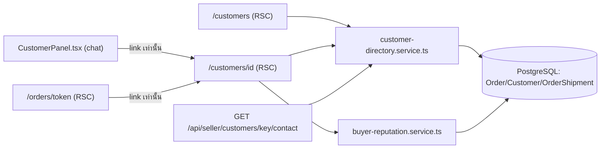
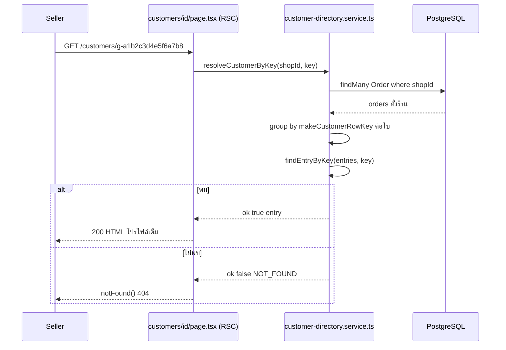

> **โมดูล:** M57-CustomerProfileRisk
> **ประเภทเอกสาร:** Software Requirements Specification (SRS) — TECHNICAL
> **เวอร์ชัน:** 1.0 · **วันที่:** 2026-08-24 · **สถานะ:** Draft · **เจ้าของ:** SA

# SRS: หน้าโปรไฟล์ลูกค้า + สัญญาณความเสี่ยง

---

## 1. บทนำ

### 1.1 วัตถุประสงค์
กำหนดสเปกเชิงเทคนิคของ (1) หน้า `/customers` เดิมให้ค้นหา/กรองได้จริงฝั่ง server (2) หน้าใหม่ `/customers/[id]` (3) endpoint เปิดเผยเบอร์เต็มแบบ on-demand (4) การเพิ่มสัญญาณ `codRefunded` โดยไม่เปลี่ยนค่า field เดิม — ผู้อ่านคือ DEV/QA

### 1.2 ขอบเขตเชิงระบบ

**ในขอบเขต:** `src/lib/customer-directory.ts` (ใหม่, pure) · `src/services/customer-directory.service.ts` (ใหม่, I/O) · หน้า `/customers` + `/customers/[id]` · `GET /api/seller/customers/[key]/contact` · component กลาง `CustomerBehaviorBadges.tsx` · ลิงก์ 3 จุด

🛑 **ถูกตัดออกระหว่างทาง (มติ D-1, PRD §0):** ส่วนขยาย `codRefunded` ใน `customer-behavior.ts`/`buyer-reputation.ts`/`iship/status.ts` + i18n key ใหม่ + การแก้ `orders/page.tsx`/`OrdersTable.tsx` แบบ compile-forced — TFR-009 เก็บไว้เป็นสเปกพร้อมใช้ **ห้าม implement ในรอบนี้**

**นอกขอบเขต:** ไม่มี migration/ตาราง/คอลัมน์ใหม่ · ไม่แก้ตาราง `/orders` (list) · ไม่มีชั้นสิทธิ์พนักงาน · ไม่มีตัวกรองช่วงเวลา · ไม่แตะ `RETURNED_CARRIER_STATUSES`/`PROBLEM_CARRIER_STATUSES` · **ไม่แตะ `CustomerOrderEvidence`/`BuyerOrderEvidence`** (input type — `codRefunded` derive จาก `activeShipmentCarrierStatus` ที่มีอยู่แล้ว)

### 1.3 นิยาม

| คำ | ความหมาย |
|---|---|
| **CustomerDirectoryEntry** | ลูกค้า 1 คนหลัง group ด้วย `makeCustomerRowKey` — **unmasked, server-internal เท่านั้น** |
| **CustomerRow** | รูปแบบที่ mask แล้ว ปลอดภัยส่งลง client (type เดิมจาก 00014) |
| **Active shipment (behavior)** | shipment ล่าสุดที่ `status !== 'CANCELLED'` ของออเดอร์ใบนั้น — นิยามเดิมของ `customer-behavior.service.ts` |

---

## 2. ภาพรวมสถาปัตยกรรม

| Component | หน้าที่ |
|---|---|
| `src/lib/customer-directory.ts` | pure: types + `matchesCustomerQuery` / `matchesRepeatFilter` / `findEntryByKey` / `avgPerOrder` / `maskContact` — ไม่แตะ prisma |
| `src/services/customer-directory.service.ts` | I/O: `aggregateShopCustomers(shopId)` · `resolveCustomerByKey(shopId, key)` |
| `customers/page.tsx` | RSC: อ่าน `searchParams` → เรียก service → กรอง → mask → render |
| `customers/[id]/page.tsx` | RSC: resolve key → render โปรไฟล์เต็ม |
| `/api/seller/customers/[key]/contact` | Route Handler (nodejs): คืนเบอร์เต็มทีละแถว |
| `src/components/safepay/CustomerBehaviorBadges.tsx` | markup กลางของป้ายพฤติกรรม (ใช้ร่วม 4 จอ) |
| ~~`src/lib/iship/status.ts`~~ | ~~เพิ่ม `isCodRefundCarrierStatus()`~~ — **ตัดออกตามมติ D-1** |

---

## 3. ข้อกำหนดเชิงฟังก์ชันเชิงเทคนิค

### TFR-001: Server-side search/filter ของ `/customers`
**Trace:** FR-001/002/003, BR-CUSTP-13/14

`customers/page.tsx` อ่าน `searchParams.q/warn/repeat` → เรียก `aggregateShopCustomers(shopId)` (query เดียว, unmasked) → กรองด้วย pure fn (`matchesCustomerQuery` เทียบ **raw contact/ชื่อ ก่อน mask** · `matchesRepeatFilter` · `hasBehaviorWarning(customerBadges(...))`) → map เป็น `CustomerRow[]` (masked) ก่อนส่งเข้า client

**Postcondition:** flight payload ไม่มี raw contact หลุดเลย
**Edge:** ผลกรองว่าง → ส่ง flag `filteredEmpty` แยกจาก `noCustomersAtAll` (คำนวณจาก `entries.length` ก่อน/หลังกรอง) ให้ client แสดงข้อความถูกแบบ

### TFR-002: เปิดเผยเบอร์เต็มทีละแถว (on-demand reveal)
**Trace:** FR-004, BR-CUSTP-02/14

ปุ่ม eye → `fetch('/api/seller/customers/' + encodeURIComponent(key) + '/contact')` → route handler เรียก `resolveCustomerByKey()` (ฟังก์ชันเดียวกับหน้าโปรไฟล์) → `{ contact }`

**Postcondition:** เบอร์เต็มไม่เคยอยู่ใน HTML/flight payload ตั้งต้นของ `/customers`
**Edge:** key ไม่ผูกกับร้านนี้ → **404 เหมือนกับ "ไม่มีจริง"** (กัน enumeration — §8)

### TFR-003: เบอร์เต็มในหน้าโปรไฟล์
**Trace:** FR-005 — ไม่ mask ตั้งแต่ต้น (`CustomerProfile.contactFull`)

### TFR-004: Resolve key 3 รูปแบบด้วยฟังก์ชันเดียวทั้งระบบ
**Trace:** FR-006/007, BR-CUSTP-04/05

`resolveCustomerByKey(shopId, key)` เรียก `aggregateShopCustomers(shopId)` (query เดียวกับลิสต์ทุกประการ) แล้ว `findEntryByKey(entries, key)` — 🛑 **ไม่มี logic แยกสำหรับ `g-`** เพราะ `key` ของทุก entry ถูกคำนวณด้วย `makeCustomerRowKey` ที่จุดเดียวกันตอน build aggregate อยู่แล้ว **เทียบสตริงตรง ๆ พอ ไม่ต้อง reverse hash**

**Edge (สืบทอดจาก 00014 ไม่ใช่บั๊กใหม่):** `key === 'guest-unknown'` (fallback เมื่อไม่มี contact เลย) match ได้หลายคนพร้อมกัน ⇒ ทางเข้าที่ 3 (order detail) ต้อง **ไม่ render ลิงก์** เมื่อ key เป็นค่านี้ (TFR-008)

### TFR-005: เนื้อหาโปรไฟล์ + ยอดเฉลี่ย/จำนวนยกเลิก
**Trace:** FR-008/009, BR-CUSTP-06/09

`avgPerOrder(entry)` = `entry.revenueOrderCount === 0 ? null : entry.totalSpent / entry.revenueOrderCount` — `revenueOrderCount` นับจาก `countsAsRevenue(o)` **ตัวเดียวกับที่ทำ `totalSpent`** ⇒ ตัวหาร/ตัวตั้งมาจากชุดเดียวกันเสมอ · `cancelledTotal` มาจาก `summarizeCustomerBehavior` ตรง ๆ ไม่บวกลบเอง
**Edge:** `revenueOrderCount === 0` → UI แสดง `—` (บังคับด้วย type `number | null`)

### TFR-006: การ์ดความเสี่ยง 2 ชั้น — reuse
**Trace:** FR-010, BR-CUSTP-10/12

แยก markup ที่ซ้ำอยู่แล้ว 2 ที่ (`OrdersTable.tsx:422-434` icon-only · `CustomerPanel.tsx:881-895` pill) ออกเป็น `src/components/safepay/CustomerBehaviorBadges.tsx` (2 named export) แล้ว refactor 2 ไฟล์เดิมให้เรียกใช้ + 2 จุดใหม่เรียกตัวเดียวกัน — **เหตุผล: กัน "4 จุดพูดคนละภาษา" ก่อนที่มันจะเกิด**
ชั้นที่ 2: import `BuyerReputationRow.tsx` ตรง ๆ (ไม่แก้ตัว component) เรียกเมื่อ `entry.customerId != null`

### TFR-007: ปุ่มเปิดแชทผูกกับ `Order.conversationId` จริง
**Trace:** FR-011, BR-CUSTP-07

`conversationId` select ตรงจาก `Order` (ไม่ join ผ่าน Customer/contact) · ปุ่มต่อออเดอร์ = ค่าของใบนั้นตรง ๆ · ปุ่มหัวโปรไฟล์ = `entry.orders.find(o => o.conversationId != null)?.conversationId` (orders เรียง desc อยู่แล้ว = ใบล่าสุดที่มีค่าชนะ)

### TFR-008: ทางเข้า 3 จุด
**Trace:** FR-012, BR-CUSTP-08

1. `CustomerTable.tsx` — `DataTable.onRowClick` (desktop, มี guard `closest('button,a,...')` ในตัวแล้ว) + stretched-link (mobile card)
2. `CustomerPanel.tsx` — เพิ่มลิงก์ "ดูโปรไฟล์เต็ม" เมื่อ `data.customer != null` → `/customers/c-{id}` (ลบคอมเมนต์ค้าง)
3. `orders/[token]/page.tsx` — คำนวณ `profileKey = makeCustomerRowKey(...)` ส่ง prop `profileKey: profileKey === 'guest-unknown' ? null : profileKey` เข้า `CustomerDetails.tsx` — render ลิงก์เมื่อไม่ null เท่านั้น
4. `/orders` (list) — **ไม่แตะ**

### TFR-009: สัญญาณ `codRefunded` — independent counter
**Trace:** FR-013, BR-CUSTP-12
🛑 **เลื่อนออกจากรอบนี้ตามมติ D-1 (PRD §0) — ห้าม implement** ดู §12

- `iship/status.ts` เพิ่ม `isCodRefundCarrierStatus(code)` (**ไม่แตะ** `PROBLEM_CARRIER_STATUSES`/`RETURNED_CARRIER_STATUSES` — `cod_refund` ยังอยู่ในกอง PROBLEM เหมือนเดิม เพราะตอบคนละคำถาม)
- `customer-behavior.ts`: เพิ่ม `codRefunded: number` ใน type + `EMPTY` · ใน loop เพิ่ม **บรรทัดแรกสุดก่อน logic เดิมทั้งหมด** `if (isCodRefundCarrierStatus(o.activeShipmentCarrierStatus)) codRefunded += 1` — **ไม่มี `continue`** ไม่แตะ branch เดิมแม้แต่บรรทัดเดียว ⇒ พิสูจน์ได้จากการอ่านโค้ดว่า `orders/completed/cancelledByBuyer/cancelledTotal/returnedParcels/problemOrders` ให้ค่าเดิมทุกประการ
- `CustomerBadge['key']` เพิ่ม `'COD_REFUND'` · `customerBadges()` เพิ่ม branch ท้ายสุด tone `warning` icon `cash-banknote-off`
- i18n: `badgeCodRefund` — **ถ้อยคำยึด `CARRIER_STATUS.cod_refund.text` ("รายการขอเงินคืน") เป๊ะ ไม่ใส่คำกล่าวหาเพิ่ม**
- `buyer-reputation.ts`: pattern เดียวกันเป๊ะ ไม่แตะ `shipped/returned/cancelledByBuyer/received/returnRate/riskLevel`
- `customer-behavior.service.ts` / `buyer-reputation.service.ts` — **ไม่ต้องแก้** (forward evidence เข้า `summarize*()` ตรง ๆ)
- `orders/page.tsx` + `OrdersTable.tsx` — **ต้องแก้** เพราะ manual-construct object รูป `CustomerBehavior` (compile error ถ้าไม่เติม) → SDS TD-006

### TFR-010: เอกสาร — ปิดสถานะ 00032
**Trace:** FR-014, BR-CUSTP-15 — งานเอกสารล้วน

---

## 4. ส่วนต่อประสาน

| Method | Path | Auth |
|---|---|---|
| GET | `/api/seller/customers/[key]/contact` | NextAuth session + `requireActiveShop` |

**ไม่มี endpoint อื่น** — หน้าลิสต์/โปรไฟล์เป็น RSC ล้วน รายละเอียดเต็ม → `API.md`

### Sequence: เปิดโปรไฟล์จาก guest key (`g-`)

---

## 5. ข้อกำหนดด้านข้อมูล

**ไม่มี migration** — ยืนยันกับ `prisma/schema.prisma` แล้วว่า field ที่ต้องใช้มีครบ (`Order.conversationId`, `Order.shippingAddress`, `Customer.phone`) รายละเอียด → `DATABASE.md`

---

## 6. ข้อกำหนดที่ไม่ใช่ฟังก์ชัน

| ด้าน | ข้อกำหนด | เป้าหมายที่วัดได้ |
|---|---|---|
| **Performance** | `aggregateShopCustomers()` = **query เดียว** ต่อการเปิดหน้าใด ๆ (shipments กับ buyer อยู่ใน select เดียวกัน ไม่มี query เสริม) | ร้านใหญ่สุด 413 ออเดอร์/397 ลูกค้า — ยอมรับได้ · **เพดานที่ยอมรับ ~2,000 ออเดอร์ต่อร้าน** ก่อนควรพิจารณา pagination ฝั่ง server |
| **Availability** | DB ล้ม → **ต้องไม่แสดงเหมือน "ไม่มีลูกค้า"** | ทั้ง 3 จุด (2 page + 1 route) ต้อง try/catch แล้ว render error state ที่แยกจาก empty state ชัดเจน — 🛑 **ทั้ง "500 เงียบ" และ "0 ลูกค้าปลอม" ผิดเท่ากัน** |
| **Security** | เบอร์เต็ม on-demand เท่านั้น + ตรวจ shop ownership ทุก request | `contact` ไม่ปรากฏใน flight payload ตั้งต้น · 404 เมื่อ key ไม่ผูกกับ shop |
| **Observability** | route handler `console.error` เมื่อเจอ exception ที่ไม่คาดคิด | ≥1 บรรทัดต่อ 500 |
| **Maintainability** | ห้ามมี group orders-by-customer ซ้ำ 2 จุด | `makeCustomerRowKey` ใน `src/app/` ต้องเจอเฉพาะที่ควรเจอ |

---

## 7. ข้อจำกัดและการพึ่งพา

- `g-` key เป็น one-way hash — resolve ได้เฉพาะทางคำนวณซ้ำ (ห้าม reverse)
- ห้ามแตะ `RETURNED_CARRIER_STATUSES`/`PROBLEM_CARRIER_STATUSES` (เทส `[blocker]` ปักหมุดว่าห้ามทับกัน)
- ห้ามแตะ `CustomerOrderEvidence`/`BuyerOrderEvidence` (input type)

| Dependency | ความเสี่ยง |
|---|---|
| `makeCustomerRowKey` (00014) | ถ้าเปลี่ยน priority ในอนาคต (00042 multi-phone) ต้องทบทวน resolve ทั้งระบบพร้อมกัน |
| `getBuyerReputation` (00055) | **ไม่มี shopId ใน query โดยตั้งใจ** — profile page ต้องไม่เพิ่ม filter shopId เอง |
| `shopShipsGoods()` (`lib/shipping-address-status.ts`) | SSOT ของ "vertical มีแกนที่อยู่จัดส่งไหม" — ใช้ตัดสิน render section ที่อยู่ **แทนการเขียน `vertical === 'ONLINE_SALES'` เอง** |

---

## 8. ความเสี่ยงเชิงสถาปัตยกรรม

| ความเสี่ยง | แนวทาง |
|---|---|
| endpoint contact ใช้ query cost เท่ากับโหลดทั้งหน้าลิสต์ ต่อการกด 1 ครั้ง | ยอมรับในสเกลปัจจุบัน — ถ้าจำเป็นค่อยทำ resolver แบบ lean ทีหลัง (ไม่ over-engineer ตอนนี้) |
| **cross-shop enumeration ผ่าน 404 เดียวกันทั้ง 2 เหตุผล** | **ตั้งใจ ไม่ใช่ gap** — กันไม่ให้แยกได้ว่า "มีลูกค้ารายนี้ในร้านอื่น" กับ "ไม่มีเลย" จาก status code |
| 🛑 `customer-behavior.service.ts` (`where:{status:{not:'CANCELLED'}}`, **ไม่กรอง `isDryRun`**) กับ `buyer-reputation.service.ts` (`status:'CREATED', isDryRun:false`) นิยาม "active shipment" **ต่างกันอยู่ก่อนแล้ว** | **นอกขอบเขต 00057** — เป็นความไม่ตรงกันที่มีอยู่ก่อน บันทึกเป็น observation สำหรับ backlog · **ห้าม dev ของฟีเจอร์นี้ "แก้ไปด้วย"** เพราะจะขยาย blast radius เกินที่ BRD อนุมัติ |

---

## 9. Traceability

| BRD FR | TFR | Component |
|---|---|---|
| FR-001/002/003 | TFR-001 | customer-directory.ts + page.tsx |
| FR-004 | TFR-002 | contact API route |
| FR-005 | TFR-003 | customers/[id]/page.tsx |
| FR-006/007 | TFR-004 | customer-directory.service.ts |
| FR-008/009 | TFR-005 | customer-directory.ts + profile components |
| FR-010 | TFR-006 | CustomerBehaviorBadges.tsx + BuyerReputationRow.tsx |
| FR-011 | TFR-007 | customer-directory.ts + profile page |
| FR-012 | TFR-008 | CustomerPanel / CustomerDetails / CustomerTable |
| FR-013 | TFR-009 | customer-behavior / buyer-reputation / iship-status |
| FR-014 | TFR-010 | docs |

---

## 10. Error Handling & Cross-file Error Mapping

🛑 **ยืนยันจากโค้ดจริงแล้ว: ฟีเจอร์นี้ไม่มี custom `class XError extends Error` ใหม่แม้แต่ตัวเดียว** ทุกจุดใช้ **typed return value** แทน throw

| แหล่งที่มา | รูปแบบผลลัพธ์ | ผู้เรียกที่ต้องแปลงเป็น HTTP/UI |
|---|---|---|
| `resolveCustomerByKey(shopId, key)` | `{ ok: true; entry } \| { ok: false; reason: 'NOT_FOUND' }` | page → `notFound()` (404) · route → 404 JSON |
| `requireActiveShop(session)` (มีอยู่แล้ว) | `ActiveShop \| null` | page → การ์ด "ยังไม่มีร้านค้า" เดิม · route → 404 JSON |
| ไม่มี session | `null` | route → 401 (page ใช้ layout guard เดิมของ `(paces)`) |
| **Unexpected exception** (DB ล่ม) | **throw — ไม่จับใน service** | page ลิสต์ → error state การ์ด (**ไม่ใช่ `customers=[]`**) · page โปรไฟล์ → error state (**ไม่ใช่ `notFound()`** — DB ล่มกับไม่พบ key คนละเหตุการณ์ ห้ามให้ผู้ใช้เห็นเป็น 404 เหมือนกัน) · route → `console.error` + 500 |

**ทำไมไม่มีตารางแบบ `OutOfStockError → 400`:** ฟีเจอร์นี้เป็น read-only ล้วน ไม่มี business-rule violation ที่ต้อง reject การกระทำ ⇒ ใช้ discriminated union (`{ok, reason}`) ตาม pattern `ShopForRequest` ใน `shop-context.ts` ซึ่ง TS บังคับ narrow `ok` ก่อนอ่าน `entry` = กัน "ลืม catch" ตั้งแต่ compile time

---

## 11. งานที่ต้อง sync `docs/SRS.md` (HR11)

1. **API reference** — เพิ่มแถว `GET /api/seller/customers/{key}/contact` ให้ตรงกับ `API.md` ทุกประการ (ห้ามคัดลอกแล้วเขียนคำอธิบายใหม่ที่เพี้ยน)
2. **Data model** — เพิ่ม `CustomerBehavior.codRefunded` และ `BuyerReputation.codRefunded` พร้อมคำอธิบายว่าไม่รวมเข้า `returnedParcels`/`problemOrders`
3. **Route inventory** — เพิ่ม `/customers/[id]` พร้อมระบุว่า **`[id]` เป็น opaque key ไม่ใช่ `Customer.id`** (กันคนถัดไปเข้าใจผิด)

---

## 12. Open Questions

| # | เรื่อง | สถานะ |
|---|---|---|
| 1 | 🛑 **`cod_refund` ไม่เคยเกิดบน prod เลย** (0/427 พัสดุ · 0/1,026 เหตุการณ์ · 0/17 payload ดิบ ตลอด 24 วัน) ⇒ TFR-009 ทั้งข้อจะสร้างป้ายที่ยังไม่มีวันปรากฏ | ✅ **ปิดแล้ว 2026-08-24 — มติ D-1: ตัด TFR-009 ออกจากรอบนี้** · ตัวเฝ้ามีอยู่แล้วผ่าน `ShipmentEvidence` (`EVIDENCE_CARRIER_STATUSES` ครอบ `cod_refund` อยู่แล้ว) **ไม่ต้องเขียนโค้ดเพิ่มแม้แต่บรรทัดเดียว** |
| 2 | ไอคอน `cash-banknote-off` ยังไม่ยืนยันว่ามีในชุด tabler จริง | ✅ ตกไปพร้อม D-1 — ไม่ต้องเช็คแล้วในรอบนี้ |
| 3 | ตำแหน่งลิงก์ "ดูโปรไฟล์เต็ม" ใน `CustomerPanel.tsx` | ควรผ่านตา ux อีกรอบก่อน merge (ไม่บล็อก) |
