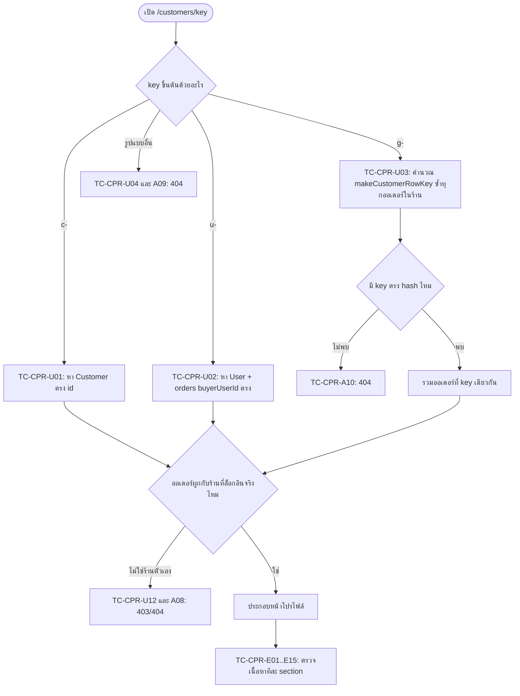

> **โมดูล:** M57-CustomerProfileRisk
> **ประเภทเอกสาร:** Test Case
> **เวอร์ชัน:** 1.0
> **วันที่จัดทำ:** 2026-08-24
> **สถานะ:** Draft
> **เจ้าของเอกสาร:** QA

# Test Case: หน้าโปรไฟล์ลูกค้า + สัญญาณความเสี่ยง (Customer Profile & Risk)

---

## 1. Overview

ชุดทดสอบนี้ครอบ 2 จอ: `/customers` (ปรับของเดิม — ค้นหา/กรองฝั่ง server, ปุ่มเปิดเผยเบอร์ทีละแถว) และ `/customers/[id]` (จอใหม่ — โปรไฟล์ลูกค้า) ตาม BRD `FR-001`..`FR-014` ทุกข้อ + Business Rules `BR-CUSTP-01`..`BR-CUSTP-15`

**ประเภทเทส:**
- **Unit (Vitest, `[blocker]`)** — ฟังก์ชันบริสุทธิ์ที่ตัดสินตัวเลข/สัญญาณ — ต้องพิสูจน์ด้วย mutation ทุกตัวก่อน merge
- **API/Server (integration)** — จุดที่ตรวจสิทธิ์ข้ามร้าน + resolve key
- **Browser QA (Playwright)** — happy path + negative path ที่ static ตรวจไม่ได้ (`e2e/customer-profile-risk.spec.ts`)
- **Security** — ตรวจ flight payload/view-source แบบมีขั้นตอนที่ทำตามได้จริง
- **Cross-cutting** — 3 ทางเข้า / ห้ามแตะ `/orders` / เอกสาร 00032

**นอกขอบเขต:** ทุกข้อใน BRD §5 (Out of Scope)

**สภาพแวดล้อม:** `http://seller.deepth.local:4000` (ต้องมี 2 บัญชีร้านต่างกันสำหรับเคสข้ามร้าน) — ทุกเคสเริ่มต้นสถานะ **`PENDING`**

🛑 **เคสกลุ่ม `cod_refund` (TC-CPR-U07, U08, U09, U11, D08) ถูกเลื่อนออกจากรอบนี้แล้ว — อย่ารัน อย่านับเป็นหนี้**

มติ D-1 (2026-08-24, PRD §0): `carrierStatus = 'cod_refund'` **ไม่เคยเกิดบน prod เลยสักแถว** (0/427 พัสดุ · 0/1,026 เหตุการณ์ · 0/17 payload ดิบ) ⇒ ตัด FR-013 ทั้งข้อออก เคสเหล่านี้จึงไม่มีโค้ดให้ทดสอบในรอบนี้ **เก็บไว้เป็นสเปกพร้อมใช้สำหรับวันที่ใบแรกโผล่**

| TC | สถานะในรอบนี้ |
|---|---|
| TC-CPR-U07 · U08 · U09 | **N/A — เลื่อนออก** (ไม่มี field `codRefunded` ให้เทส) |
| TC-CPR-U10 (`issue` ห้ามนับเป็นสัญญาณลูกค้า) | ✅ **ยังต้องรัน** — เป็นกฎที่มีผลอยู่แล้ววันนี้ ไม่ได้ผูกกับ `codRefunded` |
| TC-CPR-U11 (regression ชุด carrier status) | ✅ **ยังต้องรัน** — พิสูจน์ว่ารอบนี้ไม่ได้ไปแตะชุดที่ห้ามแตะ |
| TC-CPR-D08 (ถ้อยคำป้าย) | **N/A — เลื่อนออก** |

**ตัวเฝ้าที่แทนที่:** `cod_refund` อยู่ใน `EVIDENCE_CARRIER_STATUSES` อยู่แล้ว และ `iship.service.ts:2011` เรียก `shouldCaptureEvidence()` ⇒ ใบแรกที่เกิดจะถูกเก็บ payload ดิบลง `ShipmentEvidence` เอง — **ไม่ต้องเขียนโค้ดเฝ้าเพิ่ม** วันนั้นให้เปิด payload ใบจริงดูก่อนตั้งชื่อป้าย

---

## 2. Test Scenarios

### 2.1 Unit — `[blocker]` (Vitest, pure function)

🛑 ทุกแถวต้องพิสูจน์ด้วย **mutation** ที่ระบุจริง (กลับตรรกะแล้วรันเทส → ต้องแดง) ไม่ใช่แค่เขียนเทสแล้วมันเขียวตอนแรก — บทเรียน `mutation-silence-means-weak-corpus.md` เกิดซ้ำมาแล้ว 2 ครั้งในวันเดียวจากชุดข้อมูลทดสอบที่ไม่มี input ที่ทำให้บั๊กโผล่ ทุกแถวจึงมีคอลัมน์ "fixture ต้องมี" กำกับ

| TC | โมดูล/ฟังก์ชัน | เคส | Fixture ต้องมี | mutation ที่ต้องทำให้แดง | Expected | Trace |
|---|---|---|---|---|---|---|
| TC-CPR-U01 | resolver คีย์ (shared function — ต้องเป็นตัวเดียวกับที่ลิสต์ใช้) | key `c-{customerId}` resolve ตรงกับ `Customer.id` | ร้านมีลูกค้า ≥2 คน คนละ `Customer.id` | สลับ `customerId` เป็น `buyerUserId` ในเงื่อนไข match | ได้ orders ของ `Customer.id` นั้นเท่านั้น | FR-006, BR-CUSTP-04 |
| TC-CPR-U02 | resolver เดียวกับ U01 | key `u-{buyerUserId}` resolve กับ orders ที่ `buyerUserId` ตรง (ไม่มี `Customer` ผูก) | ลูกค้า 1 คนที่เป็นสมาชิกแต่ `customerId=null` ทุกออเดอร์ | ลืม exclude ออเดอร์ที่มี `customerId` แล้ว (ทำให้ `u-` กวาดออเดอร์ที่ควรอยู่ใต้ `c-` มาด้วย) | ได้เฉพาะออเดอร์ที่ `buyerUserId` ตรงและ `customerId=null` | FR-006 |
| TC-CPR-U03 | resolver เดียวกับ U01 | key `g-{hash}` resolve **ด้วยการคำนวณ `makeCustomerRowKey` ซ้ำของทุกออเดอร์ในร้านแล้วหา match** ไม่ decode hash | guest 2 คนที่ไม่มีทั้ง `customerId`/`buyerUserId` เบอร์/อีเมลต่างกัน (hash ต่างกัน) | เปลี่ยนให้ resolver ลองถอด hash ตรง ๆ แทนการวนคำนวณซ้ำ | ได้ orders ของ guest ที่ hash ตรงเท่านั้น | FR-007, BR-CUSTP-05 |
| TC-CPR-U04 | resolver เดียวกับ U01 | key format ผิด → คืนค่า "ไม่พบ" | `x-abc123`, `''`, `c` (ไม่มี `-`) | ลบเงื่อนไข prefix check แล้วปล่อยให้ตกไปเป็น `g-` เงียบ ๆ | คืน not-found ทุกกรณี (route ชั้นบนแปลงเป็น `notFound()`) | FR-006 |
| TC-CPR-U05 | ยอดเฉลี่ยต่อบิล (pure function ที่ต้องสกัดออกมาให้เทสได้ — วางคู่ `countsAsRevenue`) | `เฉลี่ย = totalSpent(countsAsRevenue) ÷ count(countsAsRevenue)` | ลูกค้า **คนเดียว** 3 ออเดอร์: 2 ใบ `CONFIRMED` (฿1,000 + ฿2,000) + 1 ใบ `CANCELLED` (฿5,000) — **ต้องมีทั้งสองชนิดในคนเดียวกัน** ไม่งั้นสลับตัวหารแล้วผลเท่าเดิม | สลับตัวหารจาก `count(countsAsRevenue)=2` เป็น `totalOrders=3` | ถูก = `฿1,500` (3000÷2) · บั๊ก = `฿1,000` (3000÷3) — assert `1500` ต้องแดงถ้าได้ `1000` | FR-009, BR-CUSTP-09 |
| TC-CPR-U06 | ฟังก์ชันเดียวกับ U05 | ตัวหารเป็น 0 → คืน `null`/sentinel ที่จอแปลเป็น `—` | ลูกค้าที่มีแต่ออเดอร์ `CANCELLED` ล้วน | เอา guard `divisor === 0` ออก ปล่อยให้หารตรง ๆ | คืน `null` (ไม่ใช่ `NaN`/`Infinity`/`0`) — assert `Number.isNaN(result) === false` ควบคู่ `result === null` | FR-009 |
| TC-CPR-U07 | `src/lib/customer-behavior.ts` | เพิ่ม field `codRefunded` — ค่าเดิม `returnedParcels`/`problemOrders` ต้องเท่าเดิมทุกประการ | fixture เดิมของ `customer-behavior.test.ts` + เพิ่ม 1 ใบที่ carrier status `cod_refund` **ของลูกค้าคนเดียวกับที่มี `return` อยู่แล้ว** (ต้องคนเดียวกันจึงจะเห็นว่าถังไม่ปน) | เปลี่ยนเงื่อนไขใน loop ให้จับ `'cod_refund'` เข้าถัง `returnedParcels` ด้วย | `returnedParcels` นับเฉพาะ `return`/`return_success` · `codRefunded` แยกถัง · `problemOrders` ไม่ขยับ | FR-013, BR-CUSTP-12 |
| TC-CPR-U08 | `src/lib/buyer-reputation.ts` | เพิ่ม `codRefunded` คู่กัน (cross-shop) — `returned`/`riskLevel` ไม่เปลี่ยน | ลูกค้าที่มีทั้ง `return_success` 1 ใบ และ `cod_refund` 1 ใบ ตั้งค่าให้ผลต่างกันชัดถ้าปนถัง (`returned=2` vs `returned=1`) | เปลี่ยนให้ `cod_refund` เข้าเงื่อนไข `isReturnedCarrierStatus` | `returned=1`, `codRefunded=1`, `riskLevel` คำนวณจาก `returned=1` เท่านั้น | FR-013, BR-CUSTP-12 |
| TC-CPR-U09 | `customerBadges()` | ป้ายใหม่ขึ้นแยกจาก `RETURNED` badge — เกิดพร้อมกันได้ทั้งคู่ | ลูกค้าที่มีทั้ง `returnedParcels=1` และ `codRefunded=1` | ยัดเงื่อนไขป้ายใหม่เข้า block ของ `RETURNED` เดิม (นับรวมเป็นป้ายเดียว) | ได้ป้าย **2 ใบแยกกัน** tone `warning` ทั้งคู่ | FR-013, BR-CUSTP-10 |
| TC-CPR-U10 | สัญญาณลูกค้าทั้ง 2 โมดูล | `issue` **ไม่ถูกนับเป็นสัญญาณลูกค้าเลย** | ลูกค้าที่มีออเดอร์ carrier status `issue` เท่านั้น (ไม่มี `return`/`cod_refund`) | เปลี่ยนให้ `issue` ตกเข้า `returnedParcels` หรือ `codRefunded` | ทุก field สัญญาณเป็น 0/ว่าง/`NONE` | FR-013, BR-CUSTP-12 |
| TC-CPR-U11 | รีเกรสชัน `RETURNED_CARRIER_STATUSES` / `PROBLEM_CARRIER_STATUSES` | สองชุดไม่ทับกัน หลังเพิ่ม `codRefunded` | ใช้ชุดที่มีอยู่ ไม่เพิ่ม fixture | (ไม่ใช่ mutation ของงานนี้) เกณฑ์: รันก่อน/หลังต้องเขียวเท่ากัน — แดง = 00057 ไปแตะไฟล์ที่ไม่ควรแตะ | `npx vitest run src/lib/iship/ src/lib/__tests__/shipment-evidence.test.ts` เขียวเท่าเดิม | FR-013 |
| TC-CPR-U12 | endpoint เปิดเผยเบอร์เต็ม (service/route) | ร้าน B เรียกด้วย key ของลูกค้าที่สั่งกับร้าน A เท่านั้น | 2 ร้าน (A, B) คนละ `ShopMember` · ลูกค้า X มีออเดอร์กับร้าน A ใบเดียว (มีเบอร์จริง) | ลบ `where: { shopId }` ออกจาก query ที่ตรวจสิทธิ์ | ร้าน B ได้ 403/404 · ร้าน A ด้วย key เดียวกันได้เบอร์เต็มปกติ (เทสคู่บวก-ลบในไฟล์เดียว) | FR-004, Scenario 3 |

**หมายเหตุสำหรับ dev:** TC-CPR-U01..U06 อ้างถึงฟังก์ชันที่ **ยังไม่ถูกสกัดเป็น pure function** — ถ้า implement เป็นโค้ดฝังใน RSC `page.tsx` โดยตรง ให้ถือว่าเคสเหล่านี้ **ยังทำไม่ได้จริง** และต้องรายงานเป็นช่องโหว่ ไม่ใช่ข้ามเงียบ ๆ (`ui-boolean-needs-a-testable-home.md`)

---

### 2.2 Server/API — ค้นหา/กรอง + resolve key + ความปลอดภัยข้ามร้าน

| TC | เคส | Precondition | Steps | Expected | Trace |
|---|---|---|---|---|---|
| TC-CPR-A01 | ค้นหาเบอร์เต็ม 10 หลักต้องเจอ | ลูกค้าเบอร์ `0891234567` เคยสั่งซื้อ | เปิด `/customers` → พิมพ์ `0891234567` → รอผล | เจอแถวนั้นเสมอ (URL sync `?q=0891234567`) | FR-001 |
| TC-CPR-A02 | ค้นหาเทียบข้อมูลจริงก่อน mask ไม่ใช่ filter บน array ที่ mask แล้ว | เหมือน A01 | DevTools → Network: เปลี่ยน `?q=` แล้วต้องมี request ใหม่ไป server + code review ว่าไม่มี client filter บนฟิลด์ `contact` | ผลลัพธ์เปลี่ยนผ่าน server request ทุกครั้ง | FR-001 |
| TC-CPR-A03 | ตัวกรอง "มีสัญญาณเตือน" ใช้ `hasBehaviorWarning()` ตรง ๆ | ร้านมีลูกค้า ≥1 คนมีป้ายเตือน และ ≥1 คนไม่มี | เลือกตัวกรอง | เหลือเฉพาะแถวที่มีป้ายเตือนจริง | FR-002 |
| TC-CPR-A04 | ไม่มีลูกค้าตรงเงื่อนไข → ข้อความอธิบาย | ร้านที่ไม่มีลูกค้ามีป้ายเตือนเลย | เลือกตัวกรอง | `ไม่พบลูกค้าที่ตรงกับตัวกรองนี้` + ปุ่ม `ล้างตัวกรอง` | FR-002 |
| TC-CPR-A05 | ชิป "ซื้อซ้ำ" = `totalOrders >= 2` | X มี 2 ออเดอร์ (นับทุกสถานะ), Y มี 1 | กดชิป "ซื้อซ้ำ" | เหลือแค่ X | FR-003 |
| ~~TC-CPR-A06~~ | ~~"ยังซื้อครั้งแรก"~~ — **ยกเลิก 2026-08-25** ชิปนี้ถูกตัดทิ้ง (บนข้อมูลจริงคือลูกค้าเกือบทั้งหมด กรองแล้วแทบไม่ได้อะไร) แทนด้วย TC-CPR-U17 | — | — | — | FR-003 |
| TC-CPR-A07 | ชิป 4 ตัว ไม่มีตัวกรองช่วงเวลา | — | ดูแถบชิปในหน้า | เห็นชิป 4 ตัว (ทั้งหมด/ต้องเฝ้าระวัง/เคยตีกลับกับร้านนี้/ซื้อซ้ำ) ไม่มีชิปอิงช่วงเวลา | FR-003, BR-CUSTP-13 |
| TC-CPR-A08 | ปุ่มแสดงเบอร์เรียก endpoint ตรวจสิทธิ์ซ้ำ (browser-level ของ U12) | ร้าน B ล็อกอิน รู้ key ของลูกค้าร้าน A | ยิง request ไป endpoint พร้อม key ของลูกค้าร้าน A ตรง ๆ | 403/404 ไม่คืนเบอร์ | FR-004, Scenario 3 |
| TC-CPR-A09 | `/customers/{key}` format ผิด → 404 จริง | — | เปิด `/customers/x-invalid123`, `/customers/c-` | หน้า 404 ของ Next ไม่ใช่หน้าขาว/500 | FR-006 |
| TC-CPR-A10 | `g-` key ที่ไม่ตรงลูกค้ารายใด → 404 | hash ปลอม | เปิด `/customers/g-{hash ปลอม}` | 404 | FR-007 |
| TC-CPR-A11 | ฐานล่มต้องไม่แสดงเหมือน "ร้านยังไม่มีลูกค้า" | จำลอง DB error (mock prisma throw) | เปิด `/customers` ขณะ DB ล่ม | สถานะ error ที่แยกจาก empty-state ชัดเจน (ข้อความ/ไอคอนคนละแบบ) | §6.3 |

---

### 2.3 Browser QA — Happy Path (Playwright `e2e/customer-profile-risk.spec.ts`)

| TC | เคส | Steps | Expected | Trace |
|---|---|---|---|---|
| TC-CPR-E01 | เบอร์เต็มแสดงในหัวโปรไฟล์ | เปิด `/customers` → กดแถว → ดูหัวโปรไฟล์ | เห็นเบอร์เต็ม 10 หลัก ไม่ mask | FR-005 |
| TC-CPR-E02 | หัวโปรไฟล์ครบองค์ประกอบ | เปิดโปรไฟล์สมาชิกที่มี username | ชื่อ · avatar/initial · เบอร์เต็ม · ลิงก์ `/u/{username}` · "ลูกค้าตั้งแต่ {วันที่ออเดอร์แรก}" | FR-008 |
| TC-CPR-E03 | soft-deleted user → ไม่มีลิงก์ `/u/{username}` | เปิดโปรไฟล์ลูกค้าที่ `deletedAt` ตั้งแล้ว | ข้อมูลปกติแต่ไม่มีลิงก์โปรไฟล์สาธารณะ | FR-008, BR-CUST-08 (00014) |
| TC-CPR-E04 | สรุปตัวเลขครบ 5 ค่า | เปิดโปรไฟล์ลูกค้าที่มีออเดอร์ผสม | ยอดซื้อสะสม · เฉลี่ยต่อบิล · จำนวนออเดอร์ · จำนวนยกเลิก · ซื้อล่าสุด ตรงกับ DB | FR-008 |
| TC-CPR-E05 | รายการออเดอร์กดเข้าดูได้ | กดแถวออเดอร์ | ไป `/orders/{publicToken}` ของใบนั้น | FR-008 |
| TC-CPR-E06 | ปุ่ม "โทร" | กดปุ่ม | `href` เป็น `tel:` ด้วยเบอร์เต็ม | FR-008 |
| TC-CPR-E07 | ป้ายปุ่มสร้างออเดอร์ผันตาม vertical | เปิดโปรไฟล์ในร้าน `ONLINE_SALES` / `SERVICE_QUEUE` / `LODGING` | ป้ายตรงกับ `ORDER_VOCAB` ของ vertical นั้น ไม่ใช่คำ hardcode เดียวทุกร้าน | FR-008 |
| TC-CPR-E08 | ที่อยู่ล่าสุดจากออเดอร์ล่าสุด**ที่มีที่อยู่** | ลูกค้ามี 3 ออเดอร์ ใบล่าสุดไม่มีที่อยู่ ใบก่อนหน้ามี | แสดงที่อยู่จากใบที่มีที่อยู่ล่าสุด | FR-008 |
| TC-CPR-E09 | ยอดเฉลี่ยต่อบิล browser-level ยืนยัน U05 | เปิดโปรไฟล์ลูกค้า fixture เดียวกับ U05 | ตัวเลขบนจอ `฿1,500` | FR-009 |
| TC-CPR-E10 | การ์ดความเสี่ยง 2 ชั้นแสดงเมื่อมีสัญญาณ | เปิดโปรไฟล์ลูกค้าที่มีทั้ง 2 ชั้น | เห็นบล็อก `border-s-3 border-warning` เรียงร้านนี้ → ทั้งระบบ tone `warning` ทั้งหมด | FR-010 |
| TC-CPR-E11 | ไม่มีสัญญาณเลย → ไม่แสดงการ์ดทั้งก้อน | เปิดโปรไฟล์ลูกค้าใหม่ | ไม่มี section การ์ดความเสี่ยง (ไม่ใช่การ์ดว่าง) | FR-010 |
| TC-CPR-E12 | ปุ่มแชทต่อออเดอร์ไป `conversationId` ตรง | กดปุ่มแชทที่แถวออเดอร์ที่มี `conversationId` | ไป `/inbox/{conversationId}` ของใบนั้น | FR-011 |
| TC-CPR-E13 | ออเดอร์ `conversationId=null` → ไม่มีปุ่มแชท | ดูแถวออเดอร์นั้น | ไม่มีปุ่มเลย (ไม่ใช่ disabled สีเทา) | FR-011 |
| TC-CPR-E14 | ปุ่มแชทหัวโปรไฟล์ไปเธรดของออเดอร์ล่าสุด**ที่มี** `conversationId` | ลูกค้ามี 3 ออเดอร์ ใบล่าสุดไม่มีเธรด ใบก่อนหน้ามี | ไปเธรดของใบที่มี `conversationId` ล่าสุด | FR-011 |
| TC-CPR-E15 | ไม่มีออเดอร์ใบไหนมีเธรดเลย → ปุ่มหัวโปรไฟล์ไม่แสดง | เปิดโปรไฟล์ | ไม่มีปุ่ม "เปิดแชท" (known gap ที่ BRD ยอมรับ ไม่ fallback เดา) | FR-011 |

---

### 2.4 Browser QA — Negative / Edge

| TC | เคส | Steps | Expected | Trace |
|---|---|---|---|---|
| TC-CPR-E16 | ลูกค้าที่ยกเลิกทุกใบ | เปิดโปรไฟล์ลูกค้าที่มี 3 ออเดอร์ ยกเลิกหมด | ยอดซื้อสะสม `฿0` · เฉลี่ยต่อบิล `—` (ไม่ใช่ `NaN`/`฿0`) · ยกเลิก `3` · ป้าย "ยกเลิก 3 รายการ" · แถวยังอยู่ในลิสต์ | Scenario 4, FR-009 |
| TC-CPR-E17 | vertical ไม่มีแกนที่อยู่จัดส่ง | เปิดโปรไฟล์ในร้านนั้น | ไม่มี section "ที่อยู่ล่าสุด" ทั้งก้อน | FR-008 |
| TC-CPR-E18 | มีแกนที่อยู่แต่ยังไม่เคยมีที่อยู่ | เปิดโปรไฟล์ | empty-state บรรทัดเดียว `ยังไม่มีที่อยู่จัดส่ง` (section ยังอยู่) | UX spec Edge states |
| TC-CPR-E19 | guest resolve ผ่าน hash (`g-`) | กดแถวลูกค้าที่สั่งด้วยเบอร์ผิดรูปแบบ | โปรไฟล์เปิดสำเร็จ แสดงออเดอร์ที่ hash เดียวกัน ไม่มีลิงก์โปรไฟล์สาธารณะ ปุ่มลัด/สรุปทำงานปกติ | Scenario 2 |
| TC-CPR-E20 | ไม่มีเบอร์เลย (`contact === '—'`) | ดูแถวลูกค้า email-only | ไม่มีปุ่ม "แสดงเบอร์เต็ม" render เลย | FR-004 |
| TC-CPR-E21 | ชื่อยาว 34+ ตัวอักษรไม่ดันกล่องหลุดขอบจอ | **Fixture บังคับ:** ลูกค้าชื่อ `นายสมชาย ใจดีมากเหลือเกินจนเพื่อนบ้านทุกคนต่างประทับใจไม่รู้ลืม` (≥34 ตัวอักษร นับด้วย `.length` จริงตอน seed) → เปิดทั้ง 2 จอที่ 375/768/1440px | ชื่อถูก `truncate` · ไม่มี horizontal scroll ทั้งหน้า (บทเรียน prod 2026-08-07, 2026-08-12) | §6.5 |
| TC-CPR-E22 | ตัวเลข 0 / หลักล้านไม่ล้นคอลัมน์ | ดูคอลัมน์ยอดซื้อสะสมของลูกค้า `฿0` และลูกค้ายอดหลักล้าน | `฿0` แสดงจริง (ไม่ซ่อนแถว) · หลักล้านไม่ล้นคอลัมน์ (`tabular-nums`) | UX spec Edge states |

---

### 2.5 Browser QA — Mobile-only (static ตรวจไม่ได้)

| TC | เคส | Steps | Expected | Trace |
|---|---|---|---|---|
| TC-CPR-M01 | แถวคลิกได้ทั้งแถว แต่ปุ่มข้างในไม่ trigger navigate ซ้อน | 375px: กดปุ่ม "แสดงเบอร์เต็ม" ในแถว | เบอร์เปิดเผย **โดยไม่มีการนำทางไปหน้าโปรไฟล์พร้อมกัน** | FR-012, UX spec |
| TC-CPR-M02 | แผงโหลดทับเฉพาะพื้นที่ผลลัพธ์ | เลือกตัวกรองขณะเลื่อนดูรายการ | `ListBusyOverlay` ทับเฉพาะแถว/ตาราง — ช่องค้นหา + dropdown ยังกดได้ทันที | UX spec |
| TC-CPR-M03 | ช่องค้นหาพิมพ์ตามนิ้วทัน | พิมพ์คำยาวต่อเนื่องเร็ว ๆ | ตัวอักษรปรากฏทันที ไม่หน่วง ไม่ตกหล่น (ใช้ `begin()` ไม่ใช่ `run()`) | UX spec |
| TC-CPR-M04 | ปุ่มแสดงเบอร์บนมือถือ 44px | inspect element วัด box size | `size-11` (44×44px) จริง ไม่ใช่ไอคอนเล็กในกล่องใหญ่ | UX spec |
| TC-CPR-M05 | ปุ่มบนการ์ดใบแรกไม่โดนหัว sticky บัง | เลื่อนจนหัวการ์ดใบแรกอยู่ใต้ `SellerMobileHeader` พอดี แล้วกดปุ่ม | กดติดปกติ ไม่มีส่วนใดถูกซ่อนใต้ header | `seller-action-placement.md` §5.1 |
| TC-CPR-M06 | หัวโปรไฟล์มือถือ: ปุ่มลัด 3 ปุ่มไม่ล้นขอบจอ | เปิด `/customers/[id]` ที่ 375px (ทดสอบคู่กับ E21 ชื่อยาว) | ปุ่มไม่ตกบรรทัดแปลก ๆ ไม่ล้นขอบจอ | UX spec |

---

### 2.6 Desktop / Layout

| TC | เคส | Steps | Expected | Trace |
|---|---|---|---|---|
| TC-CPR-L01 | 1440px คอลัมน์ขวาไม่ว่าง | เปิด `/customers/[id]` ที่ 1440px | เลย์เอาต์ 70/30 ไม่มีพื้นที่ขวาว่าง ~55% แบบ single-column | UX spec, Anti-slop #9 |
| TC-CPR-L02 | เดสก์ท็อป: แถวคลิกได้ผ่าน `onRowClick` | คลิกพื้นที่ว่างในแถว | ไปหน้าโปรไฟล์ | UX spec |
| TC-CPR-L03 | 768px: ค้นหา+ตัวกรองอยู่แถวเดียว | เปิด `/customers` ที่ 768px | ช่องค้นหา + dropdown 2 ตัวอยู่แถวเดียว | UX spec |

---

### 2.7 Security — flight payload / view-source

**TC-CPR-S01 — เบอร์เต็มต้องไม่ปรากฏใน flight payload/HTML ตั้งต้นของหน้าลิสต์**

- **Trace:** FR-004, §6.4
- **Precondition:** ร้านมีลูกค้า ≥2 แถวที่ยังไม่กดปุ่ม "แสดงเบอร์เต็ม" เลย
- **Steps:**
  1. เปิด `/customers` (ยังไม่กดปุ่มแถวไหน)
  2. DevTools → **Network** → reload → เลือก request เอกสารหลัก (`document`) → tab **Response** → `Cmd+F` ค้นหาเบอร์เต็ม 10 หลักของลูกค้าที่รู้ค่าจริง
  3. ทำซ้ำกับ **ทุก request ที่มี query `_rsc=`** (Next App Router ส่ง RSC payload แยกตอน navigate — ต้องเช็คด้วย ไม่ใช่แค่ document แรก)
  4. **View Page Source** → ค้นหาเบอร์เต็มเดียวกัน
  5. Clear Network log → กดปุ่ม "แสดงเบอร์เต็ม" ของ **แถวเดียว** → ดูว่ามี request ใหม่ยิงออกไป **ตอนกดปุ่มเท่านั้น** และ response คืนเบอร์เต็ม **เฉพาะแถวที่ขอ**
- **Expected:** ไม่พบเบอร์เต็มที่ไหนเลยในขั้นตอน 2–4 สำหรับแถวที่ยังไม่กดเปิดเผย — พบได้เฉพาะ 4 ตัวท้าย (mask); ขั้นตอน 5 ต้องเห็น request แยกเกิดตอนกดปุ่มเท่านั้น

**TC-CPR-S02 — ข้ามร้าน = ตัวเลขรวมเท่านั้น**

- **Trace:** BR-CUSTP-11, §3.3
- **Precondition:** ลูกค้าคนเดียวกัน (เบอร์เดียวกัน) เคยสั่งทั้งร้าน A และ B
- **Steps:** Login ร้าน A → เปิดโปรไฟล์ลูกค้ารายนี้ → DevTools → Network → ตรวจ **response ดิบ** ของ endpoint ที่คืนแถบ "ทั้งระบบ" (ไม่ใช่แค่ดูหน้าจอ) → ค้นหาชื่อร้าน B หรือ token/id ของออเดอร์ร้าน B
- **Expected:** แถบแสดงตัวเลขรวมเท่านั้น — response ไม่มี field ที่ระบุร้าน/เลขออเดอร์ของร้านอื่นเลยแม้ใน raw JSON

---

### 2.8 Cross-cutting

| TC | เคส | Steps | Expected | Trace |
|---|---|---|---|---|
| TC-CPR-D01 | ทางเข้า 1: แถวในลิสต์ | กดแถวใน `/customers` | ไปโปรไฟล์ของแถวนั้น | FR-012 |
| TC-CPR-D02 | ทางเข้า 2: `CustomerPanel.tsx` ในแชท | เปิดห้องแชทที่มีลูกค้าผูก | เห็นลิงก์ "ดูโปรไฟล์เต็ม" และ **คอมเมนต์เดิมที่เขียนว่าหน้านี้ยังไม่มีอยู่จริงถูกลบแล้ว** (grep ต้องไม่เจอ) | FR-012 |
| TC-CPR-D03 | ทางเข้า 3: หน้ารายละเอียดออเดอร์ | เปิด `/orders/[token]` | เห็นลิงก์ไปโปรไฟล์ลูกค้าของใบนั้น | FR-012 |
| TC-CPR-D04 | ตาราง `/orders` ไม่ถูกแตะ | ตรวจ diff ของ `orders/components/OrdersTable.tsx`/`OrdersList.tsx` | ไม่มีการแก้เพื่อเพิ่มลิงก์โปรไฟล์ในรอบนี้ | FR-012 |
| TC-CPR-D05 | เอกสาร 00032 ถูกทำเครื่องหมาย superseded | เปิด `00032/PRD.md` และ `BRD.md` | มีหมายเหตุ superseded by 00055+00057 พร้อมลิงก์กลับ · ระบุ `CustomerNote`/`shopsInvolved` เป็น candidate อนาคต | FR-014 |
| TC-CPR-D06 | คำนามผันผ่าน `ORDER_VOCAB` เท่านั้น | grep คำผัน hardcode ในไฟล์ใหม่ของฟีเจอร์นี้ | ไม่พบคำผัน hardcode — ทุกจุดเรียกผ่าน `ORDER_VOCAB` | BR-CUSTP-03 |
| TC-CPR-D07 | สัญญาณ 2 ชั้น reuse ของเดิม ไม่มี markup ใหม่ | code review import ของหน้าโปรไฟล์ | `customerBadges()` และ `BuyerReputationRow` import จากของเดิมตรง ๆ ไม่มี markup ก้อนใหม่ที่ทำหน้าที่เดียวกัน | FR-010 |
| TC-CPR-D08 | ถ้อยคำป้าย `cod_refund` ไม่กล่าวหาเกินข้อมูล | เปิดโปรไฟล์ลูกค้าที่มีสถานะนี้ (ต้องแต่ง fixture — prod ไม่เคยมี) | ข้อความสื่อว่า "มีรายการขอเงินคืน" ไม่ใช่ "ลูกค้าปฏิเสธรับพัสดุ" | FR-013, HR16 |

---

## 2.9 รอบแก้ UI 2026-08-25 — สถิติความน่าเชื่อถือ (FR-003 ฉบับแก้ · FR-015 · FR-016)

### Unit `[blocker]`

| TC | เคส | Fixture ต้องมี | mutation ที่ต้องทำให้แดง | Trace |
|---|---|---|---|---|
| TC-CPR-U13 | `aggregateCustomerStats` คิดอัตราจากฐาน **จำนวนใบที่เปิดพัสดุ** ไม่ใช่จำนวนลูกค้า | ลูกค้า ≥2 คนที่ `shipped` **ไม่เท่ากัน** (เช่น 6 กับ 4) ไม่งั้นสลับตัวหารเป็น `rows.length` จะให้ผลเท่ากันโดยบังเอิญ | เปลี่ยนตัวหารเป็น `rows.length` | FR-015 |
| TC-CPR-U14 | ฐาน < 3 ใบ → อัตราเป็น `null` ไม่ใช่ 0/100% | ร้านที่เปิดพัสดุใบเดียวแล้วตีกลับ | ถอด guard `shipped >= MIN_SHIPPED_FOR_RATE` | FR-015 |
| TC-CPR-U15 | ไม่มีลูกค้าเลย → ทุกค่า 0 และอัตรา `null` (ไม่หารด้วย 0) | อาร์เรย์ว่าง | — (assert `Number.isNaN` เป็น false ด้วย) | FR-015 |
| TC-CPR-U16 | `watchCount` นับจาก**ธงที่ผู้เรียกส่งมา** ไม่คำนวณเกณฑ์เองซ้ำ | แถวที่ "ตัวเลขดูแย่แต่ธงเป็น false" (`returned: 3, riskLevel: HIGH, hasWarning: false`) — ขาดเคสนี้แล้ว mutation จะเงียบ | เปลี่ยนไปนับ `riskLevel !== 'NONE'` เอง | FR-003, FR-015 |
| TC-CPR-U17 | `matchesCustomerFilter` — `warn` ใช้ธง · `returned` เจาะจงตีกลับ · `repeat` ≥2 | ต้องมีเคสที่ **มีธงเตือนแต่ไม่เคยตีกลับ** เพื่อพิสูจน์ว่า `returned ≠ warn` | สลับเงื่อนไข `repeat` กับ `returned` | FR-003 |
| TC-CPR-U18 | `parseCustomerFilter` fail-closed | ค่าเก่า `first` (จาก bookmark ยุคดรอปดาวน์) ต้องตกเป็น `all` | ถอด allow-list ให้รับทุกค่า | FR-003 |

### Browser QA — เคสที่ static ตรวจไม่ได้เลย (ยังไม่เคยรัน)

| TC | เคส | Expected |
|---|---|---|
| TC-CPR-M07 | ชิปกรองเลื่อนแนวนอนบนมือถือ 375px | เลื่อนแถบชิปได้ **แต่ทั้งหน้าต้องไม่เลื่อนข้าง** (`-mx-4 px-4` + `overflow-x-auto` ที่แถบเท่านั้น) |
| TC-CPR-M08 | tap target ของชิป | วัดด้วย DevTools ต้อง ≥44px (`min-h-11`) — ของเดิมใน mockup 31.5px ตกเกณฑ์ |
| TC-CPR-M09 | แถบสัดส่วนตอนค่าสุดขั้ว | ลูกค้าที่มีใบเดียวรับของแล้ว = เขียวเต็ม 100% ต้องไม่ดูเหมือนแถบพัง · ลูกค้าที่ตีกลับ 100% ต้องยังอ่านออก |
| TC-CPR-M10 | ชื่อยาว 34 ตัวอักษร + แถบ + ยอดเงินคอลัมน์ขวา ในแถวเดียว | ไม่มี horizontal scroll ทั้งหน้า · ยอดเงินไม่ถูกบีบจนตัวเลขตัด (`shrink-0`) |
| TC-CPR-M11 | การ์ดสถิติ 4 ใบบนมือถือ | เลื่อนถึงลูกค้าคนแรกได้เร็วกว่าเดิมชัดเจน (เดิม 5 ใบเต็มความกว้าง ≈ 4–5 หน้าจอ) |
| TC-CPR-M12 | หน้า Details บนมือถือ | **การ์ด "ความน่าเชื่อถือ" ต้องมาก่อนตารางออเดอร์** (`order-1`/`order-2`) |
| TC-CPR-A12 | ลูกค้าที่ไม่มี `customerId` | แถบขึ้น `ยังไม่มีประวัติข้ามร้าน` — **ไม่ใช่** `ยังไม่เคยเปิดพัสดุ` (คนละความหมาย คนละสิ่งที่ผู้ขายทำต่อ) |
| TC-CPR-A13 | ป้ายกำกับขอบเขต | หัวคอลัมน์มี `(ทั้งระบบ)` · ชิปเขียนว่า `เคยตีกลับกับร้านนี้` · การ์ดสถิติเขียน `(ร้านนี้)` — ไม่มีจุดไหนปล่อยให้เดา |

---

## 3. Traceability Matrix

| AC / FR ใน BRD | Test Case | ครอบคลุม |
|---|---|---|
| FR-001 | TC-CPR-A01, A02 | Yes |
| FR-002 | TC-CPR-A03, A04 | Yes |
| FR-003 | TC-CPR-A05, A06, A07 | Yes |
| FR-004 | TC-CPR-U12, A08, S01, E20 | Yes |
| FR-005 | TC-CPR-E01 | Yes |
| FR-006 | TC-CPR-U01, U02, U03, U04, A09 | Yes |
| FR-007 | TC-CPR-U03, A10, E19 | Yes |
| FR-008 | TC-CPR-E02–E08 | Yes |
| FR-009 | TC-CPR-U05, U06, E09, E16 | Yes |
| FR-010 | TC-CPR-E10, E11, D07 | Yes |
| FR-011 | TC-CPR-E12, E13, E14, E15 | Yes |
| FR-012 | TC-CPR-D01, D02, D03, D04, M01 | Yes |
| FR-013 | TC-CPR-U07, U08, U09, U10, U11, D08 | Yes |
| FR-014 | TC-CPR-D05 | Yes |
| BR-CUSTP-03 | TC-CPR-D06 | Yes |
| BR-CUSTP-11 | TC-CPR-S02 | Yes |
| BR-CUSTP-13 | TC-CPR-A07 | Yes |
| §6.3 (error ≠ empty) | TC-CPR-A11 | Yes |
| §6.5 (ชื่อยาว/ตัวเลข) | TC-CPR-E21, E22 | Yes |

> ทุก AC/FR ใน BRD ปรากฏในตารางนี้แล้ว — ไม่มี AC ที่ไม่มี TC ครอบคลุม

---

## 4. Flow

---

## 5. ผลล่าสุด

| Run | วันที่ | ผล | ผู้ทดสอบ |
|-----|--------|-----|---------|
| 1 | 2026-08-24 | **PENDING ทุกเคส** — เอกสารนี้เขียนก่อนเริ่ม implement (Documentation-First, HR11) ยังไม่มีโค้ดให้ทดสอบ | — |

> 🛑 ไม่มีเคสไหนถูก mark ว่าผ่านแล้ว และไม่มีเคสไหนเขียนว่า "ยังไม่มีวิธี repro" — ทุกเคสมีขั้นตอนที่ทำตามได้จริงครบ

---

## 6. Open Questions ที่ต้องปิดก่อนเทสบางกลุ่มจะทำได้จริง

| # | เรื่อง | กระทบเคส | สถานะ |
|---|---|---|---|
| 1 | 🛑 **`cod_refund` ไม่เคยเกิดบน prod เลย** (0/427 พัสดุ · 0/1,026 เหตุการณ์ · 0/17 payload ดิบ ตลอด 24 วัน) ⇒ ป้ายที่สร้างจะไม่มีวันปรากฏจริง และยืนยันความหมายจากข้อมูลไม่ได้ตามที่ BRD FR-013 ตั้งเงื่อนไขไว้เอง | U07, U08, U09, U10, D08 | **รอ user เคาะ** — ตัด / ทำตามเดิม / เปลี่ยนเป้า |
| 2 | ไอคอนป้ายใหม่ (`cash-banknote-off`?) ยังไม่ยืนยันว่ามีในชุด tabler จริง | D08 | รอเช็ค (HR12 บังคับ) |
| 3 | รูปแบบ request/response ของ endpoint เปิดเผยเบอร์เต็ม | U12, A08, S01 | รอ SRS/API |
| 4 | Aggregation logic ต้องถูกสกัดเป็น shared function จริงก่อนเทส resolver จะเขียนได้ | U01–U06 | รอ implement |
| 5 | `/orders/new` รองรับ query param prefill ลูกค้าหรือไม่ | E07 | ยังไม่ยืนยัน |

**หลักฐานประกอบข้อ 1 (จาก prod 2026-08-24):** เส้นทาง "ลูกค้าไม่รับของ" ที่เกิดจริงถูกบันทึกเป็น `issue` → `return` → `return_success` โดย `statusDesc` เขียนตรง ๆ ว่า `ผู้รับปฎิเสธรับสินค้า` / `ผู้รับปฏิเสธการชําระเงินปลายทาง` (**7 จาก 12 ใบตีกลับ**) และ **ไม่มีพัสดุใบไหนเลยที่ผ่าน `delivered` ก่อนตีกลับ** (0/12) ⇒ ป้าย `ตีกลับ N รายการ` ที่มีอยู่แล้วคือสัญญาณ "ลูกค้าไม่รับของ" ในระบบนี้อยู่แล้ว
