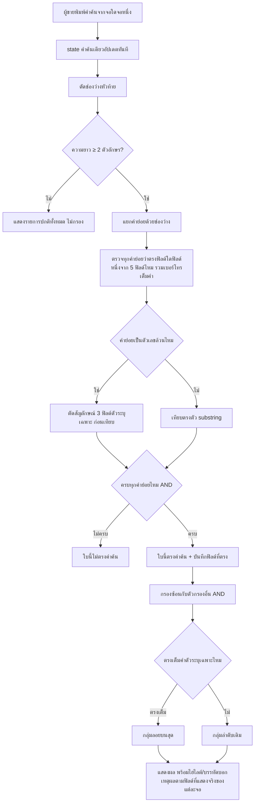
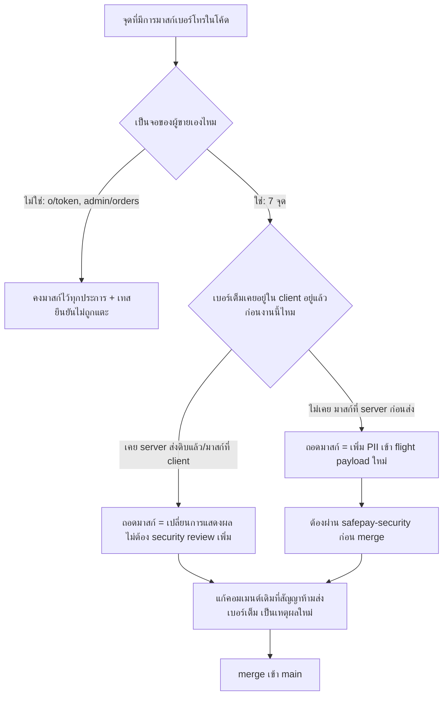

> **โมดูล:** M00058-OrderListSearch
> **ประเภทเอกสาร:** Business Requirements Document (BRD) - NON-TECHNICAL
> **เวอร์ชัน:** 1.1
> **วันที่จัดทำ:** 2026-08-24
> **สถานะ:** Draft — decision D-1..D-14 ล็อกแล้ว รอ user review ก่อน implement
> **เจ้าของเอกสาร:** BA (ดู [[Feature-Docs-Ownership]])

# BRD: ค้นหาในหน้ารายการคำสั่งซื้อ + เลิกปิดบังเบอร์โทรฝั่งผู้ขาย (Business Requirements Document)

---

## 1. บทนำ

### 1.1 วัตถุประสงค์ของเอกสาร

เอกสารนี้มีวัตถุประสงค์เพื่อ:
1. อธิบายความต้องการเชิงหน้าที่ของการรวมช่องค้นหา 2 กล่องที่แยกกันจริงในปัจจุบันให้เป็นตรรกะเดียว และการถอดฟังก์ชันมาสก์เบอร์โทรที่กระจายอยู่ 7 จุดคนละสูตร โดยยึดมติที่ user ล็อกไว้แล้ว D-1..D-14
2. กำหนดขอบเขตของก้อนงานหลัก พร้อมรหัสอ้างอิง `FR-OLS-*`/`BR-OLS-*`
3. ระบุจุดที่ต้องแก้ไขจริงพร้อม path:line ที่ตรวจสอบได้ (ยืนยันจากการเปิดโค้ดจริงทุกจุด ไม่ใช่คำว่า "ทุกจุด" ลอย ๆ)
4. แยกให้ชัดว่าจุดไหนเป็นการค้นหา (D-1..D-12) และจุดไหนเป็นการถอดมาสก์ PII (D-13/D-14) — สองเรื่องนี้เกี่ยวโยงกันแต่มีเกณฑ์ตรวจรับต่างกัน (D-14 มีเกณฑ์ผ่าน `safepay-security`)

### 1.2 ขอบเขตของระบบ

**ระบบค้นหาในหน้ารายการคำสั่งซื้อ + เลิกปิดบังเบอร์โทรฝั่งผู้ขาย** ประกอบด้วย 2 ส่วน: (ก) ส่วนขยายของหน้า `/seller/orders` ที่แทนที่ตรรกะค้นหาแยกกัน 2 ชุดปัจจุบันด้วยฟังก์ชันเดียว และ (ข) การถอดฟังก์ชันมาสก์เบอร์โทร (`maskContact`/`maskPhone`) ออกจาก 7 จุดที่เป็นจอฝั่งผู้ขาย ไม่มีตารางใหม่ ไม่มีฟิลด์ใหม่บนฐานข้อมูล ไม่มี API ใหม่

**เข้าสู่ระบบ (Input):**
- คำค้นที่ผู้ขายพิมพ์ (ต้องเป็นค่าเดียวกันทั้งสองจอ)
- ข้อมูลออเดอร์/ลูกค้าทั้งร้านที่ client มีอยู่แล้ว หรือได้รับผ่าน RSC boundary ในแต่ละหน้า

**ออกจากระบบ (Output):**
- รายการออเดอร์ที่กรองแล้วพร้อมไฮไลต์/บรรทัดบอกเหตุผล
- URL ที่มี `?q=` สะท้อนคำค้นล่าสุดเสมอ
- เบอร์โทรลูกค้าเต็มค่า (ไม่ปิดบัง) ใน 7 จอฝั่งผู้ขาย — คงปิดบังไว้เหมือนเดิมในจอฝั่งผู้ซื้อ/แอดมิน

**ระบบที่เกี่ยวข้อง:**
- `src/app/(paces)/seller/(dashboard)/orders/{page.tsx,components/OrdersList.tsx,components/OrdersTable.tsx,components/data.ts}`
- `src/lib/order-search.ts` (ใหม่, SSOT ค้นหา)
- `src/app/(paces)/seller/(dashboard)/customers/page.tsx` + `components/CustomerTable.tsx`
- `src/app/(paces)/seller/(dashboard)/dashboard/page.tsx`
- `src/app/(paces)/seller/(dashboard)/reviews/page.tsx`
- `src/app/(paces)/seller/(dashboard)/bookings/[token]/page.tsx`
- `src/app/(paces)/seller/(dashboard)/orders/new/components/CustomerSelectBlock.tsx`
- `src/app/(paces)/seller/(chat)/inbox/[conversationId]/{page.tsx,components/CustomerPanel.tsx}` + `src/lib/phone-mask.ts`
- (ไม่แตะ) `src/app/(paces)/admin/(dashboard)/orders/page.tsx`, `src/app/(marketing)/o/[token]/guest-order-data.ts` + `src/lib/order-pii-mask.ts`

### 1.3 กลุ่มผู้ใช้งาน

| กลุ่มผู้ใช้ | บทบาท | สิทธิ์การใช้งาน |
|-----------|--------|----------------|
| **พนักงาน/แอดมินร้าน** | ค้นหาออเดอร์ + ดูข้อมูลลูกค้าใน 7 จอ | เห็นเบอร์เต็มไม่ปิดบังในทุกจอที่มีสิทธิ์เข้าถึงอยู่แล้ว ไม่มีสิทธิ์ใหม่เพิ่ม |
| **เจ้าของร้าน/แอดมิน (เดสก์ท็อป)** | จัดการออเดอร์/ลูกค้าจำนวนมากพร้อมตัวกรอง | ค้นหาได้ผลตรงกับมือถือทุกประการ เห็นเบอร์เต็มสม่ำเสมอทุกจอ |
| **ผู้ซื้อ** | ดูออเดอร์ของตัวเองที่ `/o/[token]` | ยังคงเห็นเบอร์ตัวเองถูกปิดบังบางส่วนเหมือนเดิม (ไม่ได้รับผลจากงานนี้) |
| **แอดมินแพลตฟอร์ม** | ดูหน้า `/admin/orders` | ยังคงเห็นเบอร์ลูกค้าร้านถูกปิดบังเหมือนเดิม (ไม่ได้รับผลจากงานนี้) |

---

## 2. ความต้องการหลัก (Functional Requirements)

### 2.1 ฟิลด์ที่ค้นหาได้ (D-2)

#### FR-OLS-01: ค้นหาครอบคลุม 5 ประเภทข้อมูล

**User Story:**
> ในฐานะพนักงาน/แอดมินร้าน ฉันต้องการค้นหาออเดอร์ด้วยเลขออเดอร์, ชื่อผู้ซื้อ, เบอร์โทร, เลขพัสดุ, หรือชื่อสินค้าในใบ

**Acceptance Criteria:**
- [ ] คำค้นตรงกับ "เลขออเดอร์ที่ผู้ขายเห็นบนจอ" = ผลจาก `formatOrderNo(order.publicToken, order.createdAtISO)` (`src/lib/order-no.ts:16-23`)
- [ ] คำค้นตรงกับ "ชื่อผู้ซื้อ" = `order.buyerName` หรือ `order.buyerUsername`
- [ ] คำค้นตรงกับ "เบอร์โทร" = `order.buyerPhone` เต็มค่า (ค่านี้เป็นค่าดิบอยู่แล้วที่ `orders/page.tsx:364-366` ไม่ต้องแก้ไขเพิ่มสำหรับหน้านี้โดยเฉพาะ — ดู FR-OLS-11 สำหรับ 6 หน้าอื่น) — ถ้าเป็น `null` ถือว่าฟิลด์นี้ไม่ตรงกับคำค้นใด ๆ
- [ ] คำค้นตรงกับ "เลขพัสดุ" = `order.shipment?.trackingNo` (ค่าที่ resolve แล้วจาก `orders/page.tsx:249-285`)
- [ ] คำค้นตรงกับ "ชื่อสินค้า" = `order.items[].name` ข้อใดข้อหนึ่ง
- [ ] ที่อยู่จัดส่ง, หมายเหตุ, ช่องทางการขาย ไม่อยู่ในฟิลด์ที่ค้นหาได้

### 2.2 ฟังก์ชันค้นหาเดียว (SSOT) ทั้งสองจอเรียกใช้ร่วมกัน (D-3)

#### FR-OLS-02: `src/lib/order-search.ts` เป็นแหล่งเดียวของตรรกะการจับคู่

**User Story:**
> ในฐานะเจ้าของร้าน ฉันต้องการให้คำค้นเดียวกันให้ผลเหมือนกันไม่ว่าจะพิมพ์จากมือถือหรือเดสก์ท็อป

**Acceptance Criteria:**
- [ ] มีฟังก์ชันบริสุทธิ์ใหม่ใน `src/lib/order-search.ts` — ไม่มี logic จับคู่คำค้นเขียนซ้ำที่อื่น
- [ ] ค่าคำค้นเป็น state เดียวที่ควบคุมทั้งสองจอ — ไม่ใช่ `OrdersList.search` กับ `OrdersTable` internal `globalFilter` แยกกันเหมือนปัจจุบัน (ทั้งสอง component mount พร้อมกันเสมอในทุก viewport สลับด้วย `hidden lg:block`/`lg:hidden` ที่ `OrdersList.tsx:515,559`)
- [ ] `globalFilterFn:'includesString'` ที่ `OrdersTable.tsx:756` ถูกถอดออก — กรองด้วย SSOT ก่อนป้อนเข้า `data` ของตาราง
- [ ] ตรรกะเขียนมือปัจจุบันใน `OrdersList.tsx:427-438` ถูกแทนที่ด้วยการเรียก SSOT ทั้งหมด
- [ ] มีเทสพิสูจน์ด้วย mutation ว่าทั้งสองจุดเรียกเรียกฟังก์ชันเดียวกันจริง ตาม `docs/conventions/rule-must-be-enforced-not-described.md`

### 2.3 กติกาการจับคู่คำค้น (D-5, D-6, D-10, D-11)

#### FR-OLS-03: แยกคำด้วยช่องว่าง — ทุกคำต้องตรง (AND) คนละคำตรงคนละฟิลด์ได้

**Acceptance Criteria:**
- [ ] คำค้นถูกตัดช่องว่างหัวท้ายก่อนเสมอ แล้วแยกด้วยช่องว่างเป็นคำย่อย
- [ ] ออเดอร์ตรงกับคำค้นทั้งก้อน ก็ต่อเมื่อคำย่อยทุกคำตรงกับข้อมูลบางฟิลด์อย่างน้อย 1 ฟิลด์
- [ ] การเทียบเป็น substring case-insensitive
- [ ] คำย่อยหนึ่งคำถือว่าตรงฟิลด์ `items` ถ้าเป็น substring ของชื่อสินค้ารายการใดรายการหนึ่ง (OR ข้ามรายการ)

#### FR-OLS-04: คำค้นตัวเลขล้วนตัดสัญลักษณ์ก่อนเทียบ

**Acceptance Criteria:**
- [ ] คำย่อยเป็น "ตัวเลขล้วน" เมื่อไม่มีตัวอักษรไทย/อังกฤษปนอยู่เลย
- [ ] คำย่อยตัวเลขล้วน เทียบกับ 3 ฟิลด์ตัวระบุเฉพาะโดยตัดอักขระที่ไม่ใช่ตัวเลขออกทั้งสองฝั่งก่อน
- [ ] ฟิลด์ชื่อผู้ซื้อ/ชื่อสินค้า ไม่ใช้กติกาตัดสัญลักษณ์นี้
- [ ] คำย่อยที่มีตัวอักษรปนแม้ตัวเดียว ห้ามผ่านกติกาตัดสัญลักษณ์เด็ดขาด

#### FR-OLS-05: ขั้นต่ำ 2 ตัวอักษรถึงเริ่มกรอง

**Acceptance Criteria:**
- [ ] คำค้นความยาว 0-1 ตัวอักษร (หลังตัดช่องว่างหัวท้าย) → ไม่กรอง
- [ ] คำค้นช่องว่างล้วน → ไม่กรอง

#### FR-OLS-07: ผลลัพธ์ตรงเต็มค่าตัวระบุเฉพาะลอยขึ้นบนสุด

**Acceptance Criteria:**
- [ ] คำค้นทั้งก้อนเท่ากับค่าเต็มของ 1 ใน 3 ฟิลด์ตัวระบุเฉพาะพอดี (case-insensitive, digit-stripped เมื่อเป็นตัวเลขล้วน) → จัดกลุ่ม "ตรงเต็ม"
- [ ] แบ่งผลลัพธ์เป็น 2 กลุ่มแบบ stable partition — แต่ละกลุ่มคงลำดับเดิม
- [ ] ไม่ใช้กับชื่อผู้ซื้อ/ชื่อสินค้า
- [ ] ไม่มีคะแนนความใกล้เคียงใด ๆ

### 2.4 ทำงานร่วมกับตัวกรองอื่น + ผลว่างต้องบอกเหตุผล (D-4)

#### FR-OLS-06: AND กับตัวกรองที่เปิดอยู่ + ข้อความ "พบ N ใบในทั้งร้าน" เมื่อผลว่าง

**Acceptance Criteria:**
- [ ] คำค้นกรองซ้อนกับตัวกรองอื่นแบบ AND
- [ ] ผลลัพธ์ว่างขณะมีคำค้น → คำนวณ N = ตรงคำค้นเมื่อไม่นับตัวกรองอื่น
- [ ] N > 0 → แสดง "ไม่พบในตัวกรองนี้ · พบ N ใบในทั้งร้าน" พร้อมทางไปดูที่คงคำค้นไว้
- [ ] N = 0 → แสดงว่าไม่พบคำค้นนี้ในร้านเลย
- [ ] แก้ช่องว่างที่ `OrdersList.tsx:786-795` ที่ปัจจุบันไม่แสดงปุ่มใด ๆ เมื่อผลว่างขณะมีคำค้น

### 2.5 บอกเหตุผลที่ตรง (D-7)

#### FR-OLS-08: ไฮไลต์คำที่ตรงในฟิลด์ที่แสดงอยู่ + บรรทัด "ตรงกับ: ..." สำหรับฟิลด์ที่ไม่ได้แสดง

**Acceptance Criteria:**
- [ ] มือถือ (`OrderCard.tsx`): ฟิลด์ที่แสดงอยู่แล้ว (เลขออเดอร์, ชื่อผู้ซื้อ, เลขพัสดุ, ชื่อสินค้ารายการแรก) ไฮไลต์เมื่อตรง
- [ ] มือถือ: เบอร์โทร (ไม่แสดงบนการ์ด — ยืนยันแล้วว่า `OrderCard.tsx` ไม่มีการอ้างถึง `buyerPhone`) เมื่อตรง ต้องมีบรรทัด "ตรงกับ: เบอร์โทร {ค่า}"
- [ ] เดสก์ท็อป (`OrdersTable.tsx`): ฟิลด์ที่แสดงอยู่แล้ว (เลขออเดอร์, ชื่อผู้ซื้อ, เบอร์โทรใต้ชื่อที่ `OrdersTable.tsx:438`, เลขพัสดุ) ไฮไลต์เมื่อตรง
- [ ] เดสก์ท็อป: ชื่อสินค้า (ไม่แสดงในตาราง — ยืนยันแล้วว่าไม่มี items column ใน `OrdersTable.tsx`) เมื่อตรง ต้องมีบรรทัด "ตรงกับ: สินค้า {ชื่อ}"
- [ ] ชื่อสินค้าที่ตรงซ้ำหลายรายการในใบเดียวกัน → บรรทัดแสดงชื่อไม่ซ้ำ (dedupe)

### 2.6 คำค้นอยู่ใน URL (D-8)

#### FR-OLS-09: sync `?q=` แบบหน่วง โดยช่องพิมพ์ยัง controlled ทุกตัวอักษร

**Acceptance Criteria:**
- [ ] ช่องพิมพ์ controlled อัปเดตทุกตัวอักษรทันที (ไม่ใช้กลไกหน่วงกับ state ที่ผูกกับช่อง input — เหตุผลเดียวกับคอมเมนต์ที่ `OrdersList.tsx:600-601`)
- [ ] เขียนลง `?q=` หน่วง ~400ms ด้วย `history.replaceState`
- [ ] เปิดหน้าด้วย URL ที่มี `?q=` อยู่แล้ว → ช่องค้นหาแสดงค่านั้นทันที
- [ ] `?q=` ทำงานร่วมกับ `?status=`/`?stage=`/`?appt=`/`?apptDay=` โดยไม่ล้างกัน

### 2.7 ขอบเขต client-side + วัดผลจริง (D-9, D-12)

#### FR-OLS-10: กรองฝั่ง client ล้วน พร้อมวัดประสิทธิภาพจริงก่อนปิดงาน

**Acceptance Criteria:**
- [ ] ไม่มีการเรียก API ใหม่สำหรับการค้นหานี้
- [ ] วัดเวลาที่ใช้กรองด้วยข้อมูลจริงของร้านที่มีออเดอร์มากที่สุดในระบบ
- [ ] บันทึกจำนวนออเดอร์ที่วัด + เวลาที่ใช้จริง (ms) พร้อมเงื่อนไขย้ายฝั่งเซิร์ฟเวอร์ที่ชัดเจน — ห้ามระบุลอย ๆ

### 2.8 เลิกปิดบังเบอร์โทรลูกค้าในทุกจอที่เป็นของผู้ขาย (D-13)

#### FR-OLS-11: ถอดฟังก์ชันมาสก์เบอร์โทรออกจาก 7 จุด

**User Story:**
> ในฐานะเจ้าของร้าน ฉันต้องการเห็นเบอร์โทรลูกค้าของตัวเองเต็มค่าสม่ำเสมอในทุกหน้าจอที่เป็นของฉัน

**Acceptance Criteria:**
- [ ] `src/app/(paces)/seller/(dashboard)/orders/page.tsx:53,350` — ฟังก์ชัน `maskContact()` เลิกปิดบัง คืนค่า `o.buyerContact` เต็ม (ฟิลด์ `buyer` ใน `OrderRow`) — หมายเหตุ: `buyerPhone` ของหน้านี้เป็นค่าดิบอยู่แล้วตั้งแต่ 2026-06-15 ไม่ต้องแก้เพิ่ม จุดนี้แก้เพื่อให้ `buyer`/`buyerPhone` สอดคล้องกัน
- [ ] `src/app/(paces)/seller/(dashboard)/customers/page.tsx:33,119` — ฟังก์ชัน `maskContact()` เลิกปิดบัง คืนค่าเต็มลงฟิลด์ `contact` — ผลพลอยได้: ช่องค้นหาที่มีอยู่แล้วใน `CustomerTable.tsx:131-168` (`globalFilterFn:'includesString'` ที่บรรทัด 146, เทียบกับคอลัมน์ `contact` ที่ `CustomerTable.tsx:95`) ค้นด้วยเบอร์จริงเจอทันทีโดยไม่ต้องแก้โค้ดค้นหาเพิ่ม
- [ ] `src/app/(paces)/seller/(dashboard)/dashboard/page.tsx:103,445` — ฟังก์ชัน `maskContact()` (คอมเมนต์อ้างอิงงานเดิม "S5-pdpafix") เลิกปิดบัง คืนค่าเต็มลงฟิลด์ `buyerLabel` ของ `recentOrders`
- [ ] `src/app/(paces)/seller/(dashboard)/reviews/page.tsx:26,83` — ฟังก์ชัน `maskContact()` เลิกปิดบัง
- [ ] `src/app/(paces)/seller/(dashboard)/bookings/[token]/page.tsx:28,80` — ฟังก์ชัน `maskPhone()` เลิกปิดบัง
- [ ] `src/app/(paces)/seller/(dashboard)/orders/new/components/CustomerSelectBlock.tsx:149,260` — ฟังก์ชัน `maskContact` (client component) เลิกปิดบัง — จุดนี้เป็นการเปลี่ยนการแสดงผลล้วน ๆ (เบอร์เต็มอยู่ใน client memory อยู่แล้วก่อนหน้านี้ เพราะมาสก์เกิดที่ client ไม่ใช่ RSC boundary) ไม่ต้องผ่าน `safepay-security` เพิ่มเติมสำหรับจุดนี้โดยเฉพาะ
- [ ] `src/app/(paces)/seller/(chat)/inbox/[conversationId]/page.tsx:645` (`maskPhone()` จาก `src/lib/phone-mask.ts`) — เลิกปิดบัง ส่ง `linkedCustomer.phone` เต็มค่าแทน `phoneMasked`
- [ ] **คอมเมนต์ที่สัญญาไว้ว่า "ห้ามส่งเบอร์เต็ม" ที่ `CustomerPanel.tsx:33,140` ต้องถูกแก้เป็นเหตุผลใหม่** (อธิบายว่าทำไมตอนนี้ส่งเบอร์เต็มได้ — ผู้ขายเป็นเจ้าของข้อมูลลูกค้าตัวเอง) — ห้ามลบคอมเมนต์ทิ้งเงียบ ๆ โดยไม่อธิบาย และต้องปรับ type `customer: { id: string; phoneMasked: string }` ให้สื่อความถูกต้อง (ไม่ใช้ชื่อ `phoneMasked` ต่อเมื่อค่าที่ส่งไม่ได้ mask แล้ว)
- [ ] `src/lib/phone-mask.ts` (`maskPhone`) — ถ้าไม่มีผู้เรียกเหลืออยู่หลังงานนี้ (เฉพาะจุดที่ `inbox/[conversationId]/page.tsx:645` เป็นผู้เรียกเดียวที่ยืนยันแล้ว) ให้ประเมินว่าจะลบไฟล์หรือคงไว้เผื่อผู้เรียกอื่นในอนาคต — ไม่ใช่ AC บังคับ เป็นการตัดสินใจระดับ implementation

#### FR-OLS-12: จอที่ไม่ใช่ของผู้ขายยังคงปิดบังเบอร์เหมือนเดิม

**User Story:**
> ในฐานะผู้ดูแลความเป็นส่วนตัวของแพลตฟอร์ม ฉันต้องการมั่นใจว่าการถอดมาสก์ฝั่งผู้ขายจะไม่ลามไปกระทบจอที่ผู้ซื้อหรือแอดมินเห็น

**Acceptance Criteria:**
- [ ] `src/app/(marketing)/o/[token]/guest-order-data.ts` และ `src/lib/order-pii-mask.ts` (feature 00041, BR-BOE-02/03) **ไม่ถูกแก้ไข** — เบอร์โทรที่ผู้ซื้อเห็นบนหน้าออเดอร์สาธารณะยังคงแสดง 3 หลักท้าย (`•••-•••-891`) เหมือนเดิมทุกประการ
- [ ] `src/app/(paces)/admin/(dashboard)/orders/page.tsx:43,122` (ฟังก์ชัน `maskContact()` ที่มีสูตรเดียวกับ 6 จุดที่ถอด) **ไม่ถูกแก้ไข** — แอดมินยังคงเห็นฟิลด์ `buyerContactMasked` ที่ปิดบังเหมือนเดิม
- [ ] มีเทสหรือขั้นตอนตรวจสอบหลังงานเสร็จที่ยืนยันชัดเจนว่า 2 จุดนี้ยังคงปิดบังอยู่ (ไม่ใช่แค่ไม่มีใน diff — เพราะการลืมแตะก็ให้ผลเหมือนกับ "ยังปิดบังอยู่" แต่ต้องพิสูจน์ได้ว่าตั้งใจ ไม่ใช่บังเอิญไม่ได้แตะ)

### 2.9 Security Review สำหรับจอที่เพิ่ม PII เข้า flight payload ใหม่ (D-14)

#### FR-OLS-13: จำแนกแต่ละจุดเป็น "เปลี่ยนการแสดงผล" หรือ "เพิ่ม PII ใหม่" แล้วผ่าน `safepay-security` เฉพาะกลุ่มหลัง

**User Story:**
> ในฐานะผู้ดูแลความปลอดภัยของระบบ ฉันต้องการให้จุดที่เพิ่มการส่งข้อมูล PII เข้า client ใหม่ (ที่ไม่เคยส่งมาก่อน) ถูกประเมินความเสี่ยงก่อน merge ไม่ใช่ถูกมองว่าเป็นแค่การเปลี่ยนตัวอักษรที่แสดงผล

**Acceptance Criteria:**
- [ ] จำแนก 7 จุดของ FR-OLS-11 เป็น 2 กลุ่มตามที่มาของเบอร์เต็ม:
  - **กลุ่ม "เปลี่ยนการแสดงผลเฉย ๆ"** (เบอร์เต็มอยู่ใน client อยู่แล้วก่อนงานนี้): `orders/page.tsx` (`buyerPhone` เป็นค่าดิบอยู่แล้ว) และ `CustomerSelectBlock.tsx` (มาสก์ที่ client component)
  - **กลุ่ม "เพิ่ม PII เข้า flight payload ใหม่"** (server component ส่งค่าดิบข้าม RSC boundary เป็นครั้งแรก): `customers/page.tsx`, `dashboard/page.tsx`, `reviews/page.tsx`, `bookings/[token]/page.tsx`, `inbox/[conversationId]/page.tsx`
- [ ] ทุกจุดในกลุ่ม "เพิ่ม PII เข้า flight payload ใหม่" ต้องผ่านการตรวจสอบของ `safepay-security` ก่อน merge เข้า main
- [ ] จุดในกลุ่ม "เปลี่ยนการแสดงผลเฉย ๆ" ไม่บังคับต้องผ่าน `safepay-security` แยก (แต่ยังต้องผ่าน `safepay-ux`/review ปกติทุกจุดตาม Hard Rule 8)
- [ ] ผลการ review ต้องถูกบันทึกไว้เป็นหลักฐาน (เช่น ในเอกสารสรุปงานหรือ commit message) ว่าผ่านแล้วจริง ไม่ใช่แค่อ้างว่า "ผ่านแล้ว" โดยไม่มีร่องรอย

---

## 3. Acceptance Criteria สรุป

### 3.1 ฟิลด์ที่ค้นหาได้

**เมื่อระบบทำงานถูกต้อง:**
- ✅ ค้นหาได้ทั้ง 5 ประเภท รวมเบอร์โทรที่เป็นค่าเต็มไม่ปิดบัง
- ✅ ที่อยู่/หมายเหตุ/ช่องทางไม่อยู่ในผลค้นหา

### 3.2 ตรรกะเดียว ทั้งสองจอ

**เมื่อระบบทำงานถูกต้อง:**
- ✅ คำค้นเดียวกันให้ผลเหมือนกันทุกประการทั้งมือถือและเดสก์ท็อป
- ✅ ไม่มี state คำค้นแยกกันต่อ breakpoint

### 3.3 การจับคู่คำค้น

**เมื่อระบบทำงานถูกต้อง:**
- ✅ AND ข้ามคำย่อย substring case-insensitive
- ✅ คำค้นตัวเลขล้วนตัดสัญลักษณ์ก่อนเทียบเฉพาะ 3 ฟิลด์ตัวระบุเฉพาะ
- ✅ ตรงเต็มค่าลอยขึ้นบนสุดแบบ stable partition ไม่มี fuzzy score
- ✅ ต่ำกว่า 2 ตัวอักษรไม่กรอง

### 3.4 ทำงานร่วมกับตัวกรองอื่น

**เมื่อระบบทำงานถูกต้อง:**
- ✅ ผลว่างเพราะตัวกรอง + มีคำค้น → แสดง N ใบในทั้งร้านพร้อมทางไปดู

### 3.5 บอกเหตุผลที่ตรง

**เมื่อระบบทำงานถูกต้อง:**
- ✅ ไฮไลต์/บรรทัด "ตรงกับ: ..." ตามฟิลด์ที่แสดงจริงของแต่ละจอ พร้อม dedupe

### 3.6 URL sync

**เมื่อระบบทำงานถูกต้อง:**
- ✅ `?q=` สะท้อนคำค้นล่าสุดเสมอ ไม่กระทบตัวกรองอื่น

### 3.7 ขอบเขตและการวัดผล

**เมื่อระบบทำงานถูกต้อง:**
- ✅ ไม่มีการเรียก API ใหม่ + มีตัวเลขวัดประสิทธิภาพจริง
- ✅ ขอบเขตเฉพาะ `/seller/orders`

### 3.8 การถอดมาสก์เบอร์โทรฝั่งผู้ขาย

**เมื่อระบบทำงานถูกต้อง:**
- ✅ 7 จุด (`orders`, `customers`, `dashboard`, `reviews`, `bookings`, `CustomerSelectBlock`, `inbox`) แสดงเบอร์เต็มสม่ำเสมอ
- ✅ คอมเมนต์ที่เคยสัญญาว่า "ห้ามส่งเบอร์เต็ม" ถูกแก้เป็นเหตุผลใหม่ ไม่ใช่ลบเงียบ ๆ
- ✅ `/customers` ค้นด้วยเบอร์จริงเจอ (ผลพลอยได้จากการถอดมาสก์)

### 3.9 ขอบเขตที่ยังคงปิดบัง + Security Review

**เมื่อระบบทำงานถูกต้อง:**
- ✅ `/o/[token]` และ `/admin/orders` ยังคงปิดบังเบอร์เหมือนเดิม 100% ไม่ถูกแตะ
- ✅ 5 จุดที่จัดเป็น "เพิ่ม PII ใหม่" ผ่าน `safepay-security` ก่อน merge พร้อมหลักฐาน

---

## 4. Business Flows (กระบวนการทำงาน)

### 4.1 Flow หลัก: การจับคู่คำค้นและจัดลำดับผล

### 4.2 Flow: ขอบเขตการถอดมาสก์เบอร์โทร

---

## 5. Use Case Scenarios (สถานการณ์การใช้งานจริง)

### Scenario 1: ค้นด้วยเบอร์โทรบนมือถือ (Best Case)

**ผู้เกี่ยวข้อง:** พนักงานร้าน

**เงื่อนไขเริ่มต้น:** มีออเดอร์ที่ `buyerPhone = "0812345678"` ไม่มีชื่อผู้ซื้อ

**ขั้นตอน:** พิมพ์ "081-234-5678" ในช่องค้นหาบนมือถือ

**ผลลัพธ์:** ตัดสัญลักษณ์แล้วเทียบตรงกัน — ออเดอร์ปรากฏพร้อมบรรทัด "ตรงกับ: เบอร์โทร 081-234-5678"

### Scenario 2: ค้นด้วยชื่อสินค้าบนเดสก์ท็อป (Best Case)

**ผู้เกี่ยวข้อง:** เจ้าของร้าน

**เงื่อนไขเริ่มต้น:** ออเดอร์มีสินค้าชื่อ "กาแฟดำ 250 มล." (รายการที่ 2 จาก 3)

**ขั้นตอน:** พิมพ์ "กาแฟดำ" บนเดสก์ท็อป

**ผลลัพธ์:** ออเดอร์ปรากฏพร้อมบรรทัด "ตรงกับ: สินค้า กาแฟดำ 250 มล."

### Scenario 3: ผลว่างเพราะตัวกรองสถานะบัง (Edge Case)

**เงื่อนไขเริ่มต้น:** ตัวกรอง "รอดำเนินการ" เปิดอยู่ มี 3 ใบตรงกับ "สมชาย" แต่สถานะ "ยืนยันแล้ว"

**ขั้นตอน:** พิมพ์ "สมชาย"

**ผลลัพธ์:** "ไม่พบในตัวกรองนี้ · พบ 3 ใบในทั้งร้าน" + ปุ่มไปดู → กดแล้วเจอ 3 ใบ

### Scenario 4: คำค้นสั้นกว่า 2 ตัวอักษร (Edge Case)

**ขั้นตอน:** พิมพ์ "ก" ตัวเดียว

**ผลลัพธ์:** รายการยังคงแสดงครบทั้งหมด ไม่มีการกรอง

### Scenario 5: เลขพัสดุที่มี 2 แหล่งในใบเดียวกัน (Edge Case)

**เงื่อนไขเริ่มต้น:** เคยแจ้งเลขเอง "TH1111" แล้วภายหลังเปิดผ่าน iShip สำเร็จ "TH2222"

**ขั้นตอน:** ค้น "TH1111"

**ผลลัพธ์:** ไม่เจอ (ค่าที่ resolve แล้วคือ "TH2222" เท่านั้น — พฤติกรรมเดิมของระบบ ไม่ใช่บั๊กใหม่) ค้น "TH2222" แทนแล้วเจอทันที

### Scenario 6: เลขออเดอร์ที่มีตัวอักษรปนกับตัวเลข (Edge Case)

**เงื่อนไขเริ่มต้น:** เลขออเดอร์ "DP25690751043FB1"

**ขั้นตอน:** พิมพ์ "51043FB1"

**ผลลัพธ์:** มีตัวอักษรปน → ไม่ตัดสัญลักษณ์ → เทียบตรงตัว → เจอ (เป็น substring)

### Scenario 7: ผู้ขายเปิดดูข้อมูลลูกค้าคนเดียวกันข้าม 3 หน้า (Best Case — D-13)

**ผู้เกี่ยวข้อง:** เจ้าของร้าน

**เงื่อนไขเริ่มต้น:** ลูกค้า "สมชาย" เบอร์ "0812345678" มีออเดอร์ 3 ใบ มีรีวิว 1 ใบ

**ขั้นตอน:**
1. เจ้าของร้านค้นเจอออเดอร์ที่ `/orders` เห็นเบอร์เต็ม "081-234-5678" ในบรรทัด "ตรงกับ:"
2. สลับไปหน้า `/customers` ค้นด้วยเบอร์เดียวกัน — เจอทันที (ก่อนหน้านี้ค้นไม่เจอเพราะ `contact` ถูกปิดบังไว้) เห็นเบอร์เต็มเหมือนกัน
3. เปิดหน้า `/reviews` ดูรีวิวของลูกค้าคนนี้ — เห็นเบอร์เต็มเหมือนกันอีกครั้ง

**ผลลัพธ์:** เบอร์แสดงเหมือนกันทุกหน้า ไม่มีจุดไหนปิดบังบางส่วนอีกต่อไป

### Scenario 8: ผู้ซื้อเปิดดูออเดอร์ตัวเองที่หน้าสาธารณะ (Zero-Regression — D-13/D-14)

**ผู้เกี่ยวข้อง:** ผู้ซื้อ

**เงื่อนไขเริ่มต้น:** ผู้ซื้อได้รับลิงก์ `/o/{token}`

**ขั้นตอน:** เปิดลิงก์ดูรายละเอียดออเดอร์

**ผลลัพธ์:** เบอร์โทรที่แสดงยังคงเป็น `•••-•••-891` (3 หลักท้าย) เหมือนก่อนงานนี้ทุกประการ — ไม่ได้รับผลจากการถอดมาสก์ฝั่งผู้ขาย

### Scenario 9: แอดมินเปิดดูหน้ารายการออเดอร์ (Zero-Regression — D-13/D-14)

**ผู้เกี่ยวข้อง:** แอดมินแพลตฟอร์ม

**ขั้นตอน:** เปิด `/admin/orders`

**ผลลัพธ์:** `buyerContactMasked` ยังคงปิดบังเหมือนเดิมทุกประการ ไม่ได้รับผลจากงานนี้

---

## 6. ความต้องการด้านคุณภาพ (Quality Requirements)

### 6.1 ความถูกต้องของข้อมูล
- ผลลัพธ์การค้นหาต้องตรงกัน 100% ระหว่างมือถือและเดสก์ท็อปเสมอ
- เบอร์โทรที่แสดงในทั้ง 7 จอฝั่งผู้ขายต้องเป็นค่าเดียวกันเป๊ะสำหรับลูกค้าคนเดียวกัน (มาจากแหล่งข้อมูลเดียวกัน `buyerContact`/`Customer.phone`)

### 6.2 ความรวดเร็ว
- การพิมพ์ในช่องค้นหาต้องไม่มีความหน่วงที่รู้สึกได้
- ต้องมีตัวเลขวัดประสิทธิภาพจริงก่อนปิดงาน

### 6.3 ความน่าเชื่อถือ
- กติกาการจับคู่ต้องคาดเดาได้เสมอ ไม่มีองค์ประกอบสุ่ม
- ฟังก์ชันค้นหาต้องมีเทสพิสูจน์ด้วย mutation

### 6.4 ความปลอดภัย
- **ไม่มีการเปลี่ยนสิทธิ์การเข้าถึงหน้าใด ๆ จากงานนี้** — การถอดมาสก์มีผลเฉพาะ "แสดงข้อมูลอย่างไร" ไม่ใช่ "ใครเข้าถึงได้"
- **จุดที่ D-14 จัดเป็น "เพิ่ม PII เข้า flight payload ใหม่" ต้องผ่าน `safepay-security` ก่อน merge เสมอ ไม่มีข้อยกเว้น**
- **หน้าที่ไม่ใช่ของผู้ขาย (`/o/[token]`, `/admin/orders`) ต้องไม่ถูกแตะเลยในงานนี้** — ต้องมีขั้นตอนตรวจยืนยันหลังงานเสร็จว่าไฟล์เหล่านี้ไม่มีการเปลี่ยนแปลง
- ไม่มีการเรียก API ใหม่จากส่วนค้นหา — ไม่มีความเสี่ยงด้านสิทธิ์การเข้าถึงใหม่จากส่วนนั้น

### 6.5 ความสะดวกในการใช้งาน (Usability)
- ผู้ขายต้องเข้าใจได้ทันทีว่าทำไมออเดอร์แต่ละใบถึงติดผลค้นหา
- ผู้ขายต้องเห็นข้อมูลลูกค้าเดียวกันสม่ำเสมอทุกหน้าจอที่เป็นของตัวเอง ไม่ต้องสงสัยว่าทำไมหน้านี้เห็นเต็มแต่อีกหน้าเห็นบางส่วน

---

## 7. ข้อจำกัด (Constraints)

### 7.1 ข้อจำกัดทางธุรกิจ
- ค้นหาได้เฉพาะ 5 ฟิลด์ตาม D-2 เท่านั้น
- ไม่มี fuzzy matching ในระบบนี้เด็ดขาดตาม D-10
- ขอบเขตค้นหาเฉพาะ `/seller/orders` เท่านั้น
- ขอบเขตถอดมาสก์เบอร์เฉพาะ 7 จุดที่ระบุตาม D-13 — ไม่ขยายไปหน้าอื่นที่อาจมีมาสก์แบบเดียวกันแต่ไม่ได้อยู่ในรายการ (ถ้าพบเพิ่มระหว่างพัฒนา ต้องกลับมาแจ้ง user ก่อนแตะ ไม่ใช่ตัดสินใจถอดเองเงียบ ๆ)

### 7.2 ข้อจำกัดทางเทคนิค
- ไม่มี pagination หรือ server-side query ใหม่
- ตรรกะการจับคู่ต้องมาจากแหล่งเดียว (`src/lib/order-search.ts`)
- งานนี้แตะ UI หลายหน้า — ต้องผ่าน `safepay-ux` gate (Hard Rule 8)
- **จุดที่ D-14 จัดเป็น "เพิ่ม PII ใหม่" ต้องผ่าน `safepay-security` ก่อน merge — ไม่ผ่านแล้ว merge ถือว่าละเมิดกระบวนการ**
- เทสที่ยืนยันตรรกะการจับคู่และการถอดมาสก์ ต้องพิสูจน์ด้วย mutation
- ต้องมีตัวเลขวัดประสิทธิภาพจริงบันทึกไว้ก่อนปิดงานตาม D-9
- คอมเมนต์ที่อ้างอิงกฎเดิม (เช่น "ห้ามส่งเบอร์เต็ม", "S5-pdpafix") ที่ถูกแก้พฤติกรรมในรอบนี้ ต้องถูกอัปเดตเป็นเหตุผลใหม่ ไม่ใช่ลบทิ้งเงียบ ๆ หรือปล่อยค้างให้อ่านผิดความหมาย

---

## 8. กฎทางธุรกิจ (Business Rules)

### 8.1 ฟิลด์ที่ค้นหาได้และแหล่งข้อมูล (D-2)

- **BR-OLS-01** ค้นหาได้เฉพาะ 5 ฟิลด์: เลขออเดอร์, ชื่อผู้ซื้อ, เบอร์โทร (เต็มค่า), เลขพัสดุ, ชื่อสินค้า
- **BR-OLS-02** ฟิลด์ `OrderRow.buyer` ไม่นับเป็นฟิลด์ "ชื่อผู้ซื้อ" ที่ค้นหาได้
- **BR-OLS-03** เลขพัสดุที่ค้นหาได้คือค่าเดียวที่ resolve แล้ว (iShip ชนะเมื่อมีทั้ง 2 แหล่ง)

### 8.2 ตรรกะเดียว (D-3)

- **BR-OLS-04** ตรรกะการจับคู่คำค้นต้องมาจากฟังก์ชันเดียว (`src/lib/order-search.ts`) เท่านั้น
- **BR-OLS-05** ค่าคำค้นต้องเป็น state เดียวที่ควบคุมทั้งสองจอพร้อมกัน

### 8.3 การจับคู่คำค้น (D-5, D-6, D-11)

- **BR-OLS-06** แยกคำด้วยช่องว่าง AND ข้ามคำ substring case-insensitive
- **BR-OLS-07** คำย่อยตัวเลขล้วนตัดสัญลักษณ์เฉพาะ 3 ฟิลด์ตัวระบุเฉพาะ
- **BR-OLS-08** คำย่อยที่มีตัวอักษรปน ห้ามผ่านกติกาตัดสัญลักษณ์เด็ดขาด
- **BR-OLS-09** ต้องมีความยาว ≥ 2 ตัวอักษรระบบจึงเริ่มกรอง

### 8.4 การจัดลำดับผลลัพธ์ (D-10)

- **BR-OLS-10** ตรงเต็มค่ากับ 1 ใน 3 ฟิลด์ตัวระบุเฉพาะ ลอยขึ้นบนสุดแบบ stable partition
- **BR-OLS-11** ห้ามมี fuzzy score เด็ดขาด

### 8.5 ทำงานร่วมกับตัวกรองอื่น (D-4)

- **BR-OLS-12** คำค้นกรองแบบ AND กับตัวกรองอื่นที่เปิดอยู่เสมอ
- **BR-OLS-13** ผลว่างขณะมีคำค้นต้องแสดง N ใบในทั้งร้านพร้อมทางไปดู

### 8.6 การบอกเหตุผลที่ตรง (D-7)

- **BR-OLS-14** ฟิลด์ที่แสดงอยู่บนจอนั้นเมื่อตรงคำค้น ต้องไฮไลต์
- **BR-OLS-15** ฟิลด์ที่ไม่ได้แสดงอยู่บนจอนั้น เมื่อตรงคำค้น ต้องมีบรรทัดบอกเหตุผลเพิ่ม พร้อม dedupe

### 8.7 URL sync (D-8)

- **BR-OLS-16** คำค้นต้องอยู่ใน `?q=` เสมอ หน่วง ~400ms — ช่องพิมพ์ไม่หน่วง

### 8.8 ขอบเขตและประสิทธิภาพ (D-9, D-12)

- **BR-OLS-17** งานนี้เป็นการกรองฝั่ง client ทั้งหมด ไม่มี API ใหม่
- **BR-OLS-18** ต้องมีตัวเลขวัดประสิทธิภาพจริงก่อนปิดงาน
- **BR-OLS-19** ขอบเขตเฉพาะ `/seller/orders` เท่านั้น

### 8.9 การถอดมาสก์เบอร์โทรฝั่งผู้ขาย (D-13)

- **BR-OLS-20** ฟังก์ชันมาสก์เบอร์โทรใน 7 จุดที่ระบุ (orders, customers, dashboard, reviews, bookings, CustomerSelectBlock, inbox) ต้องเลิกปิดบัง คืนค่าเต็มเสมอ
- **BR-OLS-21** คอมเมนต์ในโค้ดที่เคยประกาศว่า "ห้ามส่งเบอร์เต็ม" ต้องถูกแก้เป็นเหตุผลใหม่ที่ถูกต้อง ห้ามลบทิ้งเงียบ ๆ
- **BR-OLS-22** จอที่ไม่ใช่ของผู้ขาย (`/o/[token]`, `/admin/orders`) ต้องไม่ถูกแตะและยังคงปิดบังเบอร์เหมือนเดิมทุกประการ
- **BR-OLS-23** การถอดมาสก์ไม่ผูกกับสิทธิ์/แพ็กเกจใด ๆ ใหม่ — ผู้ที่มีสิทธิ์ดูหน้านั้นอยู่แล้วเห็นเบอร์เต็มทั้งหมด

### 8.10 Security Review (D-14)

- **BR-OLS-24** จุดที่เบอร์เต็มไม่เคยถูกส่งเข้า client มาก่อน (server component มาสก์ก่อนส่งข้าม RSC boundary) ต้องผ่าน `safepay-security` ก่อน merge
- **BR-OLS-25** จุดที่เบอร์เต็มอยู่ใน client อยู่แล้วก่อนงานนี้ (ค่าดิบถูกส่งแล้ว หรือมาสก์ที่ client component) ถือเป็นการเปลี่ยนการแสดงผลเฉย ๆ ไม่บังคับ `safepay-security` เพิ่ม
- **BR-OLS-26** ผลการ security review ต้องถูกบันทึกเป็นหลักฐานก่อนถือว่างานปิด

---

## 9. อภิธานศัพท์ (Glossary)

| คำศัพท์ | ความหมาย |
|---------|----------|
| **ฟังก์ชันค้นหาเดียว (SSOT)** | `src/lib/order-search.ts` — จุดเดียวที่ตัดสินว่าออเดอร์ตรงกับคำค้นหรือไม่ |
| **ตัวระบุเฉพาะ (Identifier Field)** | เลขออเดอร์, เลขพัสดุ, เบอร์โทร |
| **คำค้นตัวเลขล้วน (Numeric Token)** | คำย่อยที่ไม่มีตัวอักษรไทย/อังกฤษปนอยู่เลย |
| **N ใบในทั้งร้าน** | จำนวนออเดอร์ที่ตรงคำค้นเมื่อไม่นับตัวกรองอื่น |
| **บรรทัดบอกเหตุผลตรง** | ข้อความ "ตรงกับ: {ชื่อฟิลด์} {ค่า}" |
| **Stable Partition** | การแบ่งกลุ่มผลลัพธ์ 2 กลุ่มโดยรักษาลำดับเดิมภายในแต่ละกลุ่ม |
| **จอฝั่งผู้ขาย (Seller-Owned Surface)** | 7 จุดที่ผู้ขายเป็นเจ้าของข้อมูลลูกค้าโดยตรง |
| **จอที่ไม่ใช่ของผู้ขาย** | `/o/[token]` (ผู้ซื้อ) และ `/admin/orders` (แอดมิน) — ยังคงปิดบังเบอร์เหมือนเดิม |
| **การเพิ่ม PII เข้า flight payload** | การส่งข้อมูลที่ก่อนหน้านี้ client ไม่เคยได้รับเลย — ต้องผ่าน `safepay-security` |

---

## 10. สรุป

เอกสาร BRD นี้อธิบายความต้องการหลักของ **ระบบค้นหาในหน้ารายการคำสั่งซื้อ + เลิกปิดบังเบอร์โทรฝั่งผู้ขาย** แบบไม่ใช่เทคนิค

**จุดเด่นของระบบ:**
- รวมช่องค้นหาที่แยกกันจริง 2 กล่องให้เป็นตรรกะเดียว ผลลัพธ์ตรงกันเสมอ
- ค้นหาได้ครบ 5 ประเภทข้อมูล รวมเบอร์โทรที่เคยถูกปิดบังจนหาไม่เจอ
- เบอร์โทรลูกค้าแสดงเต็มค่าสม่ำเสมอในทุกจอฝั่งผู้ขาย (7 จุด) ขณะที่จอฝั่งผู้ซื้อ/แอดมินยังคงปิดบังไว้เหมือนเดิม
- จุดที่เพิ่ม PII เข้า flight payload ใหม่ผ่านการตรวจสอบความปลอดภัยก่อน merge เสมอ

**ผลลัพธ์ที่คาดหวัง:**
- 100% ของคำค้นให้ผลตรงกันระหว่างมือถือและเดสก์ท็อป
- 100% ของ 7 จอฝั่งผู้ขายแสดงเบอร์โทรลูกค้าเต็มค่าสม่ำเสมอ
- 0 เคสที่การถอดมาสก์ลามไปกระทบจอผู้ซื้อ/แอดมิน
- 0 เคสที่จุด "เพิ่ม PII ใหม่" ถูก merge โดยไม่ผ่าน `safepay-security`

---

**หมายเหตุ:**
สำหรับความต้องการทางธุรกิจระดับภาพรวม/personas/KPI/open questions ดู [[PRD]] ของโมดูลนี้
สำหรับ technical specification (architecture/API/data/NFR) ดู [[SRS]] · [[SDS]] · [[API]] · [[DATABASE]] ของโมดูลนี้

---

## ภาคผนวก A — แก้มติหลังพบงานคู่ขนานบน main (Q18, 2026-08-24)

**ทุกที่ในเอกสารนี้ที่เขียนว่า "7 จุด" ให้อ่านว่า "6 จุด"** — `/customers` ถูกถอดออกจาก
ขอบเขตของ D-13/FR-OLS-11/BR-OLS-20 และ AC §3.8

### เกิดอะไรขึ้น
ระหว่างที่งานนี้กำลังทำ มีคอมมิต `b96232ba` (feature 00057) ขึ้น `main` ในวันเดียวกัน
รื้อหน้า `/customers` ใหม่ทั้งหน้าโดยแก้ **ปัญหาเดียวกันเป๊ะ** ด้วยวิธีที่ต่างออกไป:

1. ย้ายค้นหา/กรองไป server (`?q=` `?warn=` `?repeat=`) — คอมมิตนั้นวิเคราะห์ต้นเหตุตรงกับ
   เอกสารนี้: *"ของเดิมกรอง array ที่ `contact` ถูก mask ไปแล้วตั้งแต่ RSC boundary ⇒
   ค้นเบอร์เต็มไม่มีทางเจอเลยโดยโครงสร้าง ไม่ว่าจะแก้ UI ยังไงก็ตาม"*
2. คงการปิดบังไว้บนจอ + `GET /api/seller/customers/[key]/contact` เปิดเบอร์ทีละแถวตอนกดปุ่ม
3. เหตุผลที่ไม่ฝังเบอร์เต็มมากับหน้า: *"เบอร์ของลูกค้าทุกคนในหน้าจะติดไปกับ flight payload
   และภาพหน้าจอที่ผู้ขายส่งต่อกันจะมีเบอร์ติดไปทั้งแผง"* — ตรงกับข้อทักท้วงที่ `safepay-ux`
   ยกมาในรอบออกแบบ

### เหตุผลของมติ
เป้าหมายของ D-13 คือ **"ค้นหาต้องเจอ"** ซึ่ง 00057 บรรลุแล้วและบรรลุที่ต้นเหตุกว่า
(ค้นกับค่าเต็มที่ server แทนที่จะเอาค่าเต็มมาไว้ที่ client) การเดินหน้าถอดมาสก์ทับ
จะลบดีไซน์ของเขาทิ้งโดยที่ git ไม่ฟ้อง conflict (คนละบรรทัด) — เป็นกรณีตรงตาม Hard Rule 17

### สิ่งที่ยังคงเดิม
6 จุดที่เหลือ (`orders`, `dashboard`, `reviews`, `bookings`, `CustomerSelectBlock`, `inbox`)
ยังถอดมาสก์ตาม D-13 · จอผู้ซื้อ/แอดมินยังปิดบังเหมือนเดิม · AC §3.9 ไม่เปลี่ยน

### หนี้ที่เปิดไว้
ยังไม่ได้ตัดสินว่าจะขยายแนวทางของ 00057 (ปิดบัง + ปุ่มเปิดทีละแถว) ไปยัง 6 จุดที่เหลือหรือไม่
— รอบนี้เลือกไม่ทำเพราะเป็นงานคนละขนาดและหน้า `/orders` ส่งเบอร์ดิบเข้า client
อยู่แล้วตั้งแต่ 2026-06-15 (ก่อนฟีเจอร์นี้) การรื้อจึงต้องแตะของเดิมด้วย
