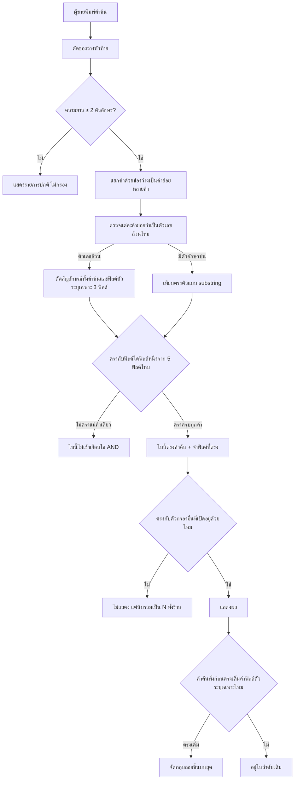
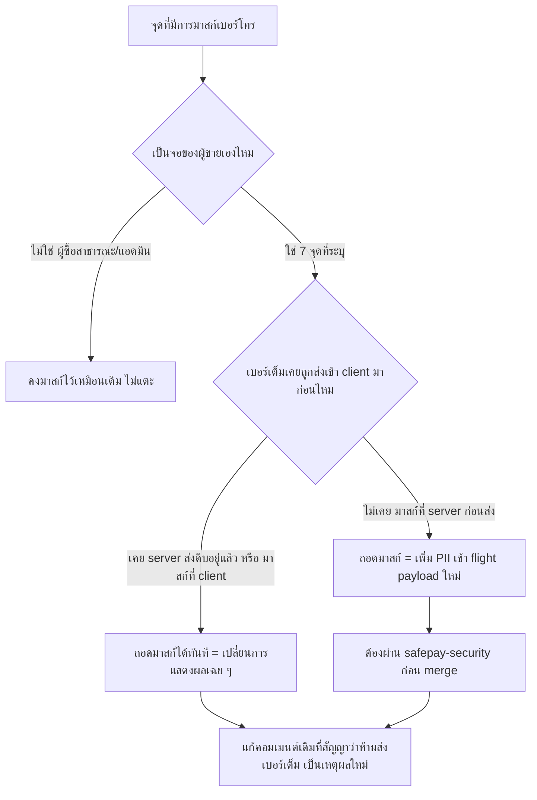

> **โมดูล:** M00058-OrderListSearch
> **ประเภทเอกสาร:** Product Requirements Document (PRD)
> **เวอร์ชัน:** 1.1
> **วันที่จัดทำ:** 2026-08-24
> **สถานะ:** Draft — decision D-1..D-14 ล็อกแล้วโดย user (ดู §10.2), รอ user review ก่อน implement
> **เจ้าของเอกสาร:** BA + PO + PM (ดู [[Feature-Docs-Ownership]])

# PRD: ค้นหาในหน้ารายการคำสั่งซื้อ + เลิกปิดบังเบอร์โทรฝั่งผู้ขาย

---

## Executive Summary

หน้ารายการคำสั่งซื้อของผู้ขาย (`/seller/orders`) มีช่องค้นหาอยู่แล้ว **2 กล่องที่แยกกันจริง** — กล่องบนมือถือเขียนมือค้นแค่ 4 ฟิลด์ ส่วนกล่องบนเดสก์ท็อปใช้กลไก global filter ของ TanStack Table ที่จับคู่ได้จริงแค่ชื่อผู้ซื้อ ผลคือผู้ขายพิมพ์คำค้นเดียวกันบนมือถือกับเดสก์ท็อปแล้วได้ผลลัพธ์ไม่ตรงกัน และค้นหาด้วยข้อมูลที่ตัวเองมีอยู่ในมือจริง ๆ — เบอร์โทร, เลขพัสดุ, ชื่อสินค้า — ไม่เจอเลยแม้ข้อมูลนั้นมีอยู่ในระบบ

ระหว่างสำรวจปัญหานี้พบเพิ่มว่า **การปิดบังเบอร์โทรลูกค้าฝั่งผู้ขายเองคือสาเหตุหนึ่งที่ทำให้ "ค้นแล้วไม่เจอ" ด้วย** — หน้า `/customers` มีช่องค้นหาที่เทียบกับคอลัมน์เบอร์ที่ถูกปิดบังไว้แล้วโดยตรง (`•••1234`) ทำให้ค้นด้วยเบอร์จริงไม่เจอเป็นบั๊กเดียวกับที่ `/orders` มีมาก่อนแก้ในรอบนี้ ยิ่งไปกว่านั้น ระบบมีฟังก์ชันมาสก์เบอร์แยกกันจริง **7 ชุด คนละสูตร** กระจายอยู่ 7 หน้าจอ (ออเดอร์, ลูกค้า, แดชบอร์ด, รีวิว, ใบจอง, แผงเลือกลูกค้าตอนสร้างออเดอร์, แผงลูกค้าในแชท) ทำให้ผู้ขายคนเดียวกันเห็นเบอร์ลูกค้าคนเดียวกันไม่เท่ากันในแต่ละหน้า — ทั้งที่ผู้ขายเป็นเจ้าของข้อมูลลูกค้าของตัวเอง การปิดบังฝั่งผู้ขายจึงไม่ได้ปกป้องใคร มีแต่ทำให้ค้นหาไม่เจอและข้อมูลไม่สอดคล้องกัน

ฟีเจอร์นี้จึงมี 2 ส่วนที่เกี่ยวโยงกัน: **(1)** รวมตรรกะค้นหาของหน้ารายการคำสั่งซื้อเป็นฟังก์ชันเดียว (SSOT) ที่ทั้งสองจอเรียกใช้ร่วมกัน ขยายให้ค้นได้ 5 ประเภทข้อมูล พร้อมกติกาที่คาดเดาได้เสมอและบอกเหตุผลว่าทำไมออเดอร์แต่ละใบถึงติดผลค้นหา และ **(2)** เลิกปิดบังเบอร์โทรลูกค้าในทุกจอที่เป็นของผู้ขายเอง (7 จุด) ให้เห็นเบอร์เต็มสม่ำเสมอทุกที่ ในขณะที่**ยังคงปิดบังไว้เหมือนเดิม**สำหรับจอที่ไม่ใช่เจ้าของร้าน — หน้าออเดอร์สาธารณะที่ผู้ซื้อเห็น (`/o/[token]`) และหน้าออเดอร์ฝั่งแอดมิน (ซึ่งเป็นคนละฝ่ายกับลูกค้าของร้าน) ส่วนที่แตะจอซึ่งไม่เคยส่งเบอร์ดิบเข้า client มาก่อน (แชท, รีวิว, ใบจอง) ต้องผ่าน `safepay-security` review ก่อน merge เพราะเป็นการเพิ่ม PII เข้า flight payload จริง ไม่ใช่แค่เปลี่ยนตัวอักษรบนจอ

---

## 1. Business Goals & KPIs

### 1.1 เป้าหมายทางธุรกิจ

| เป้าหมาย | รายละเอียด |
|----------|-----------|
| **ค้นแล้วเจอของที่มีอยู่จริงเสมอ** | ผู้ขายค้นด้วยข้อมูลที่ตัวเองมีอยู่ตอนนั้นแล้วต้องเจอออเดอร์นั้นเสมอถ้ามันมีอยู่จริง — รวมถึงเบอร์โทรที่ต้องไม่ถูกบล็อกด้วยการปิดบังข้อมูลที่ไม่จำเป็นอีกต่อไป |
| **ผลลัพธ์ตรงกันทุกจอ** | คำค้นเดียวกันต้องให้ผลเดียวกันไม่ว่าจะพิมพ์จากมือถือหรือเดสก์ท็อป |
| **ผู้ขายเห็นข้อมูลลูกค้าของตัวเองสม่ำเสมอทุกหน้าจอ** | เบอร์โทรลูกค้าคนเดียวกันต้องแสดงเหมือนกันไม่ว่าจะเปิดดูจากหน้าไหน (ออเดอร์/ลูกค้า/แดชบอร์ด/รีวิว/ใบจอง/แชท) โดยยังคงปิดบังไว้เหมือนเดิมสำหรับจอที่ไม่ใช่เจ้าของร้าน (ผู้ซื้อสาธารณะ, แอดมิน) |
| **ไม่ทิ้งผู้ใช้ไว้กับจอว่างเปล่าโดยไม่มีทางไป** | เมื่อคำค้นชนกับตัวกรองอื่นที่เปิดค้างอยู่จนผลว่าง ผู้ขายต้องรู้ว่า "หาไม่เจอเพราะตัวกรอง" ไม่ใช่ "ออเดอร์หายจากระบบ" |

### 1.2 ตัวชี้วัดความสำเร็จ (KPIs)

| KPI | คำอธิบาย | เป้าหมาย |
|-----|----------|---------|
| **ผลลัพธ์ตรงกันระหว่างมือถือ/เดสก์ท็อป** | เทียบชุดออเดอร์ที่ได้จากคำค้นเดียวกันทั้งสอง breakpoint | ตรงกัน 100% ทุกคำค้น |
| **อัตราการเจอเมื่อค้นด้วย 1 ใน 5 ฟิลด์ที่ประกาศ** | รวมกรณีเบอร์โทรที่เคยถูกปิดบังจนหาไม่เจอ | 100% ของกรณีที่ข้อมูลมีอยู่จริงในฟิลด์ที่ประกาศรองรับ |
| **ความสม่ำเสมอของเบอร์โทรข้าม 7 จอ** | เบอร์เดียวกันของลูกค้าคนเดียวกัน แสดงผลรูปแบบเดียวกัน (เต็ม ไม่ปิดบัง) ในทุกจอที่เป็นของผู้ขาย | 100% ของ 7 จุดที่ระบุ, 0 จุดหลุดไปกระทบจอผู้ซื้อ/แอดมิน |
| **การจัดการผลว่างที่มีตัวกรองอื่นค้าง** | สัดส่วนของกรณีที่ระบบบอกจำนวนจริงพร้อมทางไปดู แทนจอว่างเปล่า | 100% ของกรณีนี้ |
| **เวลาที่ใช้วัดประสิทธิภาพจริงก่อนปิดงาน** | จำนวนออเดอร์ที่ทดสอบ + เวลาที่วัดได้จริงต่อการพิมพ์ 1 ตัวอักษร | มีตัวเลขจริงอย่างน้อย 1 ชุด บันทึกไว้ก่อนปิดงาน |

### 1.3 ขอบเขตการส่งมอบ

งานนี้เป็น phase เดียว มี 2 ก้อนงานที่เกี่ยวโยงกันและต้อง ship พร้อมกัน: **(ก)** SSOT ค้นหาของหน้ารายการคำสั่งซื้อ (client-side ล้วน ไม่มี migration ไม่มี API ใหม่) และ **(ข)** ถอดฟังก์ชันมาสก์เบอร์โทรออกจาก 7 จุดที่เป็นจอฝั่งผู้ขาย (ไม่มี migration แต่ 3 จุดต้องผ่าน `safepay-security` review ก่อน merge เพราะเพิ่ม PII เข้า flight payload จริง) — สองก้อนนี้ผูกกันเพราะ (ก) คือสิ่งที่ทำให้เจอปัญหาการปิดบังที่ขวางการค้นหาอยู่ และ (ข) คือสิ่งที่ต้องปิดให้ครบถึงจะถือว่า "ค้นหาแล้วเจอ" เป็นจริงทั้งระบบของผู้ขาย ไม่ใช่แค่หน้าเดียว

---

## 2. User Personas (กลุ่มผู้ใช้งาน)

### 2.1 พนักงาน/แอดมินร้านที่รับสายลูกค้าแล้วต้องค้นออเดอร์ให้เร็วที่สุด (ส่วนใหญ่ใช้มือถือ)

**ข้อมูลพื้นฐาน:**
- พนักงานที่กำลังแพ็กของหรือรับสายลูกค้าอยู่ ใช้มือถือเปิดหน้า `/orders` ระหว่างคุยโทรศัพท์หรือแชทกับลูกค้า
- สิ่งที่มีอยู่ในมือตอนนั้นมักไม่ใช่ชื่อลูกค้า แต่เป็นเบอร์โทรที่จอโชว์ขึ้นมา หรือเลขพัสดุที่ลูกค้าอ่านให้ฟัง หรือชื่อสินค้าที่คุยกันอยู่ในแชท

**เป้าหมาย:**
- พิมพ์สิ่งที่มีอยู่ในมือตอนนั้นแล้วเจอออเดอร์ทันที ไม่ต้องเดาว่าต้องพิมพ์เป็นชื่ออะไร

**ความต้องการ:**
- ค้นหาด้วยเบอร์โทรได้แม้พิมพ์ไม่ตรงรูปแบบเป๊ะ และเบอร์ที่เห็นในผลค้นหาต้องเป็นเบอร์เต็มที่เอาไปโทรกลับได้จริง

**จุดปวด (Pain Points):**
- ปัจจุบันพิมพ์เบอร์โทรหรือเลขพัสดุแล้วไม่เจออะไรเลย ทั้งที่ออเดอร์นั้นอยู่ในระบบจริง

### 2.2 เจ้าของร้าน/แอดมินที่จัดการออเดอร์และลูกค้าจำนวนมากบนเดสก์ท็อป

**ข้อมูลพื้นฐาน:**
- ทำงานบนเดสก์ท็อปเป็นหลัก สลับไปมาระหว่างหน้าออเดอร์, ลูกค้า, แดชบอร์ด, รีวิว, ใบจอง เพื่อดูข้อมูลลูกค้าคนเดียวกันในบริบทต่าง ๆ

**เป้าหมาย:**
- เห็นเบอร์ลูกค้าคนเดียวกันเหมือนกันทุกหน้าที่เปิดดู ไม่ต้องสงสัยว่าทำไมหน้านี้เห็นเต็มแต่อีกหน้าเห็นแค่ 4 ตัวท้าย
- ค้นหาได้ผลเหมือนกับที่พนักงานหน้าร้านเห็นบนมือถือทุกประการ

**จุดปวด (Pain Points):**
- ปัจจุบันเห็นเบอร์ลูกค้าคนเดียวกันไม่เท่ากันในแต่ละหน้า (บางหน้าเต็ม บางหน้าปิดบัง 4 ตัวท้ายเท่านั้น) ทั้งที่ตัวเองเป็นเจ้าของข้อมูลลูกค้าคนนั้นอยู่แล้ว
- ตัวกรองสถานะที่เปิดค้างไว้บังผลค้นหาแบบไม่มีสัญญาณอะไรเลยว่ามีออเดอร์ตรงคำค้นอยู่ในร้าน

---

## 3. Business Requirements

### 3.1 ค้นหาครอบคลุม 5 ประเภทข้อมูลที่ผู้ขายใช้อ้างอิงถึงออเดอร์จริง (D-2)

**ความต้องการ:**
- ค้นหาต้องครอบคลุมข้อมูล 5 ประเภทที่ผู้ขายใช้อ้างอิงถึงออเดอร์ในชีวิตจริง: เลขออเดอร์ที่ผู้ขายเห็นบนจอ, ชื่อผู้ซื้อ, เบอร์โทร, เลขพัสดุ (ไม่ว่าจะมาจากทางไหน), ชื่อสินค้าที่อยู่ในใบสั่งซื้อ

**Business Rules:**
- ที่อยู่จัดส่ง, หมายเหตุ, และช่องทางการขาย **ไม่อยู่ในฟิลด์ที่ค้นหาได้**
- เลขพัสดุที่ค้นหาได้คือค่าที่ระบบตัดสินใจแสดงบนจอแล้ว (เมื่อมีทั้งพัสดุที่เปิดผ่านระบบขนส่งกลางและพัสดุที่ร้านแจ้งเลขเอง ระบบเลือกแสดงค่าเดียวตามลำดับความสำคัญที่มีอยู่แล้ว)
- เบอร์โทรที่ใช้ค้นหาต้องเป็นค่าเต็มไม่ถูกปิดบัง (ผูกกับ §3.8/D-13 — ปิดบังแล้วค้นด้วยเบอร์จริงจะไม่เจอ)

**เหตุผล:**
- ทั้ง 5 ประเภทคือข้อมูลที่ผู้ขายมีอยู่ในมือจริงเวลาคุยกับลูกค้า

### 3.2 ตรรกะค้นหาต้องเป็นแหล่งเดียวที่ทั้งสองจอเรียกใช้ร่วมกัน (D-3)

**ความต้องการ:**
- ไม่ว่าจะพิมพ์คำค้นจากมือถือหรือเดสก์ท็อป การตัดสินว่าออเดอร์ใบไหน "ตรง" กับคำค้นต้องมาจากจุดคำนวณเดียวกันเสมอ

**Business Rules:**
- ค่าคำค้นต้องเป็นสถานะเดียว ไม่ใช่สถานะแยกกันคนละก้อนต่อ breakpoint
- กติกาการจับคู่คำค้นต้องมาจากจุดเดียวเท่านั้น

**เหตุผล:**
- ตรรกะที่เขียนแยกกันคนละที่ค่อย ๆ เพี้ยนออกจากกันได้ทีละนิดโดยไม่มีใครสังเกต — เกิดขึ้นแล้วจริงทั้งกับช่องค้นหา 2 กล่องปัจจุบัน และกับฟังก์ชันมาสก์เบอร์โทร 7 ชุดที่แยกกันจนสูตรเพี้ยนไปคนละแบบ (ดู §3.8)

### 3.3 การจับคู่คำค้นต้องคาดเดาได้เสมอ ไม่ใช่การเดาความหมาย (D-5, D-6, D-10, D-11)

**ความต้องการ:**
- กติกาการจับคู่ต้องเป็นกฎที่ตายตัวและอธิบายได้

**Business Rules:**
- คำค้นถูกแยกด้วยช่องว่างเป็นหลายคำย่อย ทุกคำต้องตรงกับข้อมูลบางฟิลด์ของออเดอร์ใบนั้น (คนละคำตรงคนละฟิลด์ได้) การเทียบเป็นแบบ substring ไม่สนตัวพิมพ์เล็ก-ใหญ่
- เมื่อคำค้นย่อยเป็นตัวเลขล้วน ให้ตัดสัญลักษณ์ทั้งฝั่งคำค้นและฝั่งข้อมูลก่อนเทียบ — คำค้นที่มีตัวอักษรไทยหรืออังกฤษปนอยู่ ห้ามผ่านกติกานี้
- ออเดอร์ที่ตรงเต็มค่ากับตัวระบุเฉพาะ (เลขออเดอร์/เลขพัสดุ/เบอร์โทร) ต้องลอยขึ้นบนสุด ที่เหลือเรียงตามลำดับเดิม ห้ามมี fuzzy score
- ต้องพิมพ์อย่างน้อย 2 ตัวอักษรระบบจึงจะเริ่มกรอง

**เหตุผล:**
- ระบบที่ "บางทีเจอ บางทีไม่เจอ" ด้วยเหตุผลที่อธิบายไม่ได้จะทำให้ผู้ขายไม่ไว้ใจผลลัพธ์

### 3.4 ค้นหาต้องทำงานร่วมกับตัวกรองอื่นได้เสมอ ไม่ทิ้งผู้ใช้ไว้กับจอว่างเปล่า (D-4)

**ความต้องการ:**
- คำค้นต้องกรองซ้อนกับตัวกรองอื่นที่เปิดค้างอยู่ แต่เมื่อผลลัพธ์ว่างเปล่า ต้องบอกผู้ขายชัดเจนว่าเป็นเพราะตัวกรอง

**Business Rules:**
- ผลว่างขณะมีคำค้นและมีตัวกรองอื่นเปิดอยู่ ต้องแสดงจำนวนออเดอร์ที่ตรงกับคำค้นในทั้งร้านพร้อมทางไปดูผลลัพธ์นั้นได้จริง

**เหตุผล:**
- ปัจจุบันเมื่อพิมพ์คำค้นแล้วผลว่าง ระบบไม่แสดงปุ่มใด ๆ เลย เพราะคำค้นเป็น state ที่ไม่อยู่ใน URL

### 3.5 ต้องบอกเหตุผลว่าทำไมออเดอร์ใบนี้ถึงติดผลค้นหา (D-7)

**ความต้องการ:**
- เมื่อคำค้นตรงกับฟิลด์ที่แสดงอยู่บนจอนั้นอยู่แล้ว ต้องไฮไลต์ ถ้าตรงกับฟิลด์ที่ไม่ได้แสดงอยู่บนจอนั้น ต้องมีข้อความบอกชัดว่าตรงกับอะไร

**Business Rules:**
- การไฮไลต์/ข้อความบอกเหตุผลต้องพิจารณาตามสิ่งที่จอนั้น ๆ แสดงอยู่จริง

**เหตุผล:**
- ผู้ขายที่เห็นออเดอร์โผล่ในผลค้นหาโดยไม่รู้ว่าทำไม จะไม่ไว้ใจว่าช่องค้นหาทำงานถูกต้อง

### 3.6 คำค้นต้องอยู่ใน URL เพื่อแชร์/ย้อนกลับ/ทำงานร่วมกับปุ่มล้างตัวกรองได้ (D-8)

**ความต้องการ:**
- คำค้นต้องสะท้อนอยู่ใน URL เสมอ พิมพ์ยังต้องลื่นไม่มีการหน่วง

**Business Rules:**
- ช่องพิมพ์อัปเดตทุกตัวอักษรทันที ส่วนการเขียนค่าลง URL หน่วงได้เล็กน้อย

**เหตุผล:**
- แก้ช่องว่างที่ปุ่ม empty-state ปัจจุบันพาไปหน้าเดิมซ้ำแล้วยังว่างอยู่

### 3.7 ขอบเขตการรันในรอบนี้จำกัดฝั่ง client พร้อมมาตรการวัดผลก่อนขยาย (D-9, D-12)

**ความต้องการ:**
- รอบนี้ทำงานฝั่ง client ทั้งหมด จำกัดเฉพาะ `/seller/orders`

**Business Rules:**
- ก่อนปิดงานต้องวัดประสิทธิภาพจริง บันทึกตัวเลขจริงเป็นหนี้ที่มีเงื่อนไขชัดเจน

**เหตุผล:**
- ต้องรู้ล่วงหน้าด้วยตัวเลขจริงว่าเมื่อไรจะกลายเป็นคอขวด

### 3.8 เลิกปิดบังเบอร์โทรลูกค้าในทุกจอที่เป็นของผู้ขาย (D-13)

**ความต้องการ:**
- ผู้ขายต้องเห็นเบอร์โทรลูกค้าของตัวเองเป็นค่าเต็มสม่ำเสมอในทุกหน้าจอที่เป็นของผู้ขาย (ออเดอร์, ลูกค้า, แดชบอร์ด, รีวิว, ใบจอง, แผงเลือกลูกค้าตอนสร้างออเดอร์, แผงลูกค้าในแชท) — เลิกใช้ฟังก์ชันมาสก์เบอร์ที่กระจายอยู่ 7 จุดคนละสูตร

**Business Rules:**
- ทั้ง 7 จุดต้องคืนค่าเบอร์เต็ม ไม่ใช่สตริงที่ปิดบังบางส่วน
- คอมเมนต์ในโค้ดที่เคยประกาศไว้ว่า "ห้ามส่งเบอร์เต็ม" ต้องถูกแก้ไขเป็นเหตุผลใหม่ที่ถูกต้อง ไม่ใช่ลบทิ้งเงียบ ๆ โดยไม่อธิบาย เพราะคนที่มาอ่านโค้ดทีหลังจะเข้าใจผิดว่าเป็นข้อผิดพลาดที่หลุดผ่านมา ไม่ใช่การตัดสินใจที่ตั้งใจ
- **หน้าที่ไม่ใช่ของผู้ขาย (ผู้ซื้อสาธารณะที่ `/o/[token]`, และฝั่งแอดมิน) ยังคงปิดบังเบอร์ไว้เหมือนเดิมทุกประการ** — ต้องมี AC ที่บังคับได้ว่าจอเหล่านี้ยังปิดบังอยู่ ไม่ใช่แค่ AC ว่าจอผู้ขายเห็นเบอร์เต็ม เพื่อป้องกันการถอด mask ลามข้ามฝั่งไปโดยไม่มีอะไรจับ

**เหตุผล:**
- ผู้ขายเป็นเจ้าของข้อมูลลูกค้าของตัวเอง — การปิดบังฝั่งผู้ขายไม่ได้ปกป้องใคร มีแต่ทำให้ค้นหาไม่เจอ (`/customers` มีบั๊กนี้อยู่แล้วจริงในปัจจุบัน — ช่องค้นหาเทียบกับคอลัมน์ที่ถูกปิดบังไว้แล้ว) และทำให้ผู้ขายคนเดิมเห็นเบอร์ลูกค้าคนเดิมไม่เท่ากันในแต่ละหน้า
- ผู้ซื้อและแอดมินเป็นคนละฝ่ายจากเจ้าของร้าน การปิดบังตรงนั้นยังมีเหตุผลรองรับอยู่เหมือนเดิม (ผู้ซื้อไม่ควรเห็นเบอร์ตัวเองแบบเต็มบนหน้าสาธารณะที่คนอื่นอาจแอบดูจอได้, แอดมินไม่ใช่คู่ค้าที่ควรเห็น PII ของลูกค้าร้านโดยไม่จำเป็น)

### 3.9 ความเสี่ยง PII ของจอที่ไม่เคยส่งเบอร์ดิบเข้า client มาก่อน ต้องผ่าน security review (D-14)

**ความต้องการ:**
- การถอดมาสก์ในจอที่ไม่เคยส่งเบอร์เต็มเข้า client มาก่อน ต้องถูกพิจารณาว่าเป็นการ**เพิ่ม PII เข้า flight payload จริง** ไม่ใช่แค่การเปลี่ยนตัวอักษรที่แสดงบนจอ และต้องผ่านการตรวจสอบความปลอดภัยก่อน merge

**Business Rules:**
- จุดที่เบอร์เต็มถูกส่งเข้า client อยู่แล้วก่อนหน้านี้ (เช่น หน้าออเดอร์ที่ `buyerPhone` เป็นค่าดิบมาตั้งแต่ก่อนฟีเจอร์นี้) การถอดมาสก์ของฟิลด์อื่นในหน้าเดียวกันยังต้องพิจารณาแยกเป็นรายฟิลด์ ไม่ใช่ถือว่าทั้งหน้าปลอดภัยไปด้วย
- จุดที่มาสก์เกิดขึ้นที่ client component (ข้อมูลเต็มอยู่ใน client memory อยู่แล้วก่อนมาสก์) ถือเป็นการเปลี่ยนการแสดงผลล้วน ๆ ไม่ใช่การเพิ่ม PII ใหม่
- จุดที่มาสก์เกิดขึ้นที่ server component ก่อนส่งข้าม RSC boundary (ค่าที่ client ไม่เคยมีเลยก่อนหน้านี้) ถือเป็นการเพิ่ม PII เข้า flight payload จริง ต้องผ่าน `safepay-security` ก่อน merge

**เหตุผล:**
- ผลกระทบด้านความปลอดภัยของ "เปลี่ยนตัวอักษรที่แสดง" กับ "ส่งข้อมูลที่ไม่เคยส่งมาก่อน" ต่างกันโดยพื้นฐาน แม้หน้าตาโค้ดที่แก้จะดูคล้ายกัน (ลบการเรียกฟังก์ชันมาสก์ทิ้ง) ก็ตาม

---

## 4. Business Rules & Constraints

### 4.1 กฎทางธุรกิจหลัก

| กฎ | คำอธิบาย |
|----|----------|
| **ค้นหาได้ 5 ฟิลด์เท่านั้น** | เลขออเดอร์ / ชื่อผู้ซื้อ / เบอร์โทร (เต็ม) / เลขพัสดุ / ชื่อสินค้า |
| **ตรรกะเดียว ทั้งสองจอเรียกใช้ร่วมกัน** | ไม่มี state ค้นหาแยกกันต่อ breakpoint |
| **substring + AND ข้ามคำ + ไม่มี fuzzy** | ไม่มีคะแนนความใกล้เคียงในระบบนี้ |
| **ตัดสัญลักษณ์เฉพาะคำค้นตัวเลขล้วน** | คำค้นที่มีตัวอักษรปน ห้ามผ่านกติกานี้ |
| **ตรงเต็มค่าของตัวระบุเฉพาะลอยขึ้นบนสุด** | เฉพาะเลขออเดอร์/เลขพัสดุ/เบอร์โทร |
| **ขั้นต่ำ 2 ตัวอักษร** | ต่ำกว่านั้นไม่กรอง |
| **AND กับตัวกรองอื่น + ต้องบอกเหตุผลเมื่อผลว่าง** | ผลว่างเพราะตัวกรองต้องแยกจาก "ไม่มีออเดอร์นี้อยู่จริง" |
| **คำค้นอยู่ใน URL** | ทุกลิงก์ที่พาไปหน้ารายการต้องคงคำค้นได้ |
| **เบอร์โทรฝั่งผู้ขายไม่ปิดบัง 7 จุด** | ออเดอร์/ลูกค้า/แดชบอร์ด/รีวิว/ใบจอง/แผงเลือกลูกค้า/แผงลูกค้าในแชท |
| **เบอร์โทรฝั่งผู้ซื้อ/แอดมินยังคงปิดบัง** | `/o/[token]` และ `/admin/orders` ไม่ได้รับผลจากการถอดมาสก์นี้ |

### 4.2 ข้อจำกัดทางธุรกิจ

| ข้อจำกัด | รายละเอียด |
|---------|-----------|
| **ไม่มี full-text search ฝั่งฐานข้อมูล** | รอบนี้เป็นการกรองฝั่ง client ล้วน |
| **ไม่มี pagination/infinite-scroll ใหม่** | ใช้กลไก lazy-load ที่มีอยู่แล้ว |
| **ไม่มี saved search / คำค้นล่าสุด** | ไม่มีในรอบนี้ |
| **ไม่มี fuzzy/typo tolerance** | พิมพ์ผิดแม้ตัวเดียวจะไม่เจอ |
| **ไม่แตะฝั่งแอดมินหรือฝั่งผู้ซื้อ (ทั้งการค้นหาและการปิดบังเบอร์)** | ขอบเขตค้นหาเฉพาะ `/seller/orders`; ขอบเขตถอดมาสก์เฉพาะ 7 จุดที่ระบุ |
| **ไม่แก้ subscription/สิทธิ์การเห็นเบอร์** | การถอดมาสก์ไม่ผูกกับแพ็กเกจ/สิทธิ์ใด ๆ เพิ่มเติม — ผู้ขายที่มีสิทธิ์ดูหน้านั้นอยู่แล้วเห็นเบอร์เต็มทั้งหมด |

### 4.3 เหตุผลที่คำค้นจะไม่ตรง/ถูกข้าม

| เหตุผล | ผลที่เกิด |
|--------|-----------|
| คำค้น (หลังตัดช่องว่างหัวท้าย) สั้นกว่า 2 ตัวอักษร | ไม่กรอง แสดงรายการปกติทั้งหมด |
| คำค้นเป็นช่องว่างล้วน | เท่ากับไม่มีคำค้น |
| ออเดอร์ไม่มีข้อมูลในฟิลด์นั้น | ฟิลด์นั้นถือว่าไม่ตรงกับคำค้นเสมอ ไม่ error |
| คำค้นตัวเลขล้วนมีตัวอักษรปนแม้ตัวเดียว | ไม่ตัดสัญลักษณ์ |
| ผลว่างเพราะตัวกรองอื่นบังอยู่ | แสดงจำนวนที่เจอทั้งร้านพร้อมทางไปดูแทนจอว่าง |

---

## 5. Out of Scope (นอกขอบเขต)

| หัวข้อ | คำอธิบาย |
|--------|----------|
| **Pagination / server-side query ใหม่** | ยังคงดึงออเดอร์ทั้งร้านมาที่ client ครั้งเดียวเหมือนเดิม |
| **Full-text search ฝั่งฐานข้อมูล** | เป็นสิ่งที่หนี้ D-9 ระบุเงื่อนไขไว้สำหรับอนาคตเท่านั้น |
| **Saved search / ประวัติคำค้น** | ไม่มีในรอบนี้ |
| **Fuzzy matching / typo tolerance / คะแนนความใกล้เคียง** | ล็อกแล้วตาม D-10 |
| **ค้นหาที่อยู่จัดส่ง / หมายเหตุ / ช่องทางการขาย** | ตัดออกตาม D-2 |
| **หน้ารายการออเดอร์ฝั่งแอดมิน (`/admin/orders`)** | นอกขอบเขตตาม D-12 (ทั้งการค้นหาและการปิดบังเบอร์ — ยังคงปิดบังไว้เหมือนเดิม) |
| **หน้ารายการออเดอร์ฝั่งผู้ซื้อ / หน้าออเดอร์สาธารณะ (`(buyer-app)/orders`, `/o/[token]`)** | นอกขอบเขตตาม D-12 (ยังคงปิดบังเบอร์ไว้เหมือนเดิม — ใช้ `src/lib/order-pii-mask.ts` ตาม BR-BOE-02/03 ของ feature 00041 ต่อไป ไม่แตะ) |
| **การรวมตัวกรอง "ประเภท"/"ช่วงเวลา" ให้เป็น state เดียวข้าม breakpoint** | เฉพาะคำค้น (search query) เท่านั้นที่ต้องรวมเป็นสถานะเดียว |
| **การเปลี่ยนสิทธิ์/แพ็กเกจที่เกี่ยวกับการเห็นเบอร์โทร** | การถอดมาสก์ไม่ผูกกับ subscription tier ใด ๆ |

---

## 6. Risks & Mitigation (ความเสี่ยงและแนวทางแก้ไข)

### 6.1 ความเสี่ยงทางธุรกิจ

| ความเสี่ยง | ผลกระทบ | ระดับความรุนแรง | แนวทางแก้ไข |
|-----------|---------|-----------------|-------------|
| **ผลลัพธ์สองจอกลับมาไม่ตรงกันอีกในอนาคต** | ปัญหาเดิมกลับมาเกิดซ้ำ | กลาง | ฟังก์ชันบริสุทธิ์เดียว + เทสที่พิสูจน์ว่าทั้งสองจุดเรียกฟังก์ชันเดียวกันจริง |
| **การถอดมาสก์ลามไปถึงจอผู้ซื้อ/แอดมินโดยไม่ตั้งใจ** | ผู้ซื้อหรือบุคคลภายนอกเห็นเบอร์เต็มบนหน้าสาธารณะ/แอดมิน ซึ่งขัดกับเหตุผลด้าน privacy ที่ยังต้องคงไว้ | สูง | AC บังคับแยกชัดเจนว่าจอไหนถอด จอไหนคงไว้ (§3.8) + เทส/review ที่ตรวจ `/o/[token]` และ `/admin/orders` ยังปิดบังอยู่หลังงานนี้ |
| **ตัวกรองเดิมบังผลค้นหาโดยไม่มีสัญญาณ** | ผู้ขายเข้าใจผิดว่าออเดอร์หายจากระบบ | สูง | D-4 บังคับแสดงจำนวนที่เจอทั้งร้าน + ทางไปดูเสมอ |

### 6.2 ความเสี่ยงทางเทคนิค

| ความเสี่ยง | ผลกระทบ | แนวทางแก้ไข |
|-----------|---------|-------------|
| **การตัดสัญลักษณ์ของคำค้นตัวเลขล้วนใช้ผิดกับเลขออเดอร์ที่มีตัวอักษรปนอยู่** | ผลลัพธ์ที่ไม่คาดคิด | ต้องเทสเคสนี้ชัดเจนและมีคำอธิบายพฤติกรรมนี้เป็นลายลักษณ์อักษร |
| **โครงสร้าง state ปัจจุบันมี 2 ก้อนที่แยกกันจริง** | รวมไม่ครบจะยังมีคำค้นสองค่าอยู่ในหน้าเดียวกัน | ต้องยืนยันว่าเหลือค่าคำค้นเดียวจริง |
| **จุดที่มาสก์เกิดที่ server component ถูกถอดโดยไม่ผ่าน security review** | เพิ่ม PII เข้า flight payload โดยไม่มีใครประเมินความเสี่ยงก่อน | บังคับ `safepay-security` gate สำหรับจุดที่จัดเป็น "เพิ่มข้อมูลใหม่" ตาม D-14 |
| **คอมเมนต์เดิมที่สัญญาไว้ว่า "ห้ามส่งเบอร์เต็ม" ถูกลบทิ้งเงียบ ๆ โดยไม่มีคำอธิบายใหม่** | คนอ่านโค้ดทีหลังเข้าใจผิดว่าเป็นข้อผิดพลาดที่หลุดผ่านมา ไม่ใช่การตัดสินใจที่ตั้งใจ | บังคับแก้คอมเมนต์เป็นเหตุผลใหม่ ไม่ใช่ลบเฉย ๆ |
| **เกณฑ์วัดประสิทธิภาพเป็นคำพูดลอย ๆ** | หนี้ที่บันทึกไว้ไม่มีความหมาย | บังคับให้มีตัวเลขจริงก่อนปิดงานตาม D-9 |

---

## 7. Glossary (อภิธานศัพท์)

| คำศัพท์ | ความหมาย |
|---------|----------|
| **ฟังก์ชันค้นหาเดียว (SSOT ค้นหา)** | ฟังก์ชันบริสุทธิ์จุดเดียวที่ตัดสินว่าออเดอร์ใบไหนตรงกับคำค้น ทั้งมือถือและเดสก์ท็อปเรียกใช้ร่วมกัน |
| **ตัวระบุเฉพาะ (Identifier Field)** | เลขออเดอร์, เลขพัสดุ, เบอร์โทร — ใช้กติกา "ตรงเต็มค่าลอยขึ้นบนสุด" ได้ |
| **คำค้นตัวเลขล้วน (Numeric Token)** | คำค้นย่อยที่ไม่มีตัวอักษรไทย/อังกฤษปนอยู่เลย |
| **N ใบในทั้งร้าน** | จำนวนออเดอร์ที่ตรงกับคำค้นเมื่อไม่นับตัวกรองอื่น |
| **จอฝั่งผู้ขาย (Seller-Owned Surface)** | 7 จุดที่ผู้ขายเป็นเจ้าของข้อมูลลูกค้าโดยตรง — ต้องเห็นเบอร์เต็มไม่ปิดบัง |
| **จอที่ไม่ใช่ของผู้ขาย** | หน้าออเดอร์สาธารณะที่ผู้ซื้อเห็น (`/o/[token]`) และหน้าฝั่งแอดมิน — ยังคงปิดบังเบอร์เหมือนเดิม |
| **การเพิ่ม PII เข้า flight payload** | การส่งข้อมูลที่ก่อนหน้านี้ client ไม่เคยได้รับเลย (ตรงข้ามกับการเปลี่ยนการแสดงผลของข้อมูลที่ client มีอยู่แล้ว) — ต้องผ่าน `safepay-security` |

---

## 8. Success Metrics (ตัวชี้วัดความสำเร็จ)

| ตัวชี้วัด | ค่าที่คาดหวัง | วิธีวัด |
|----------|---------------|--------|
| **ผลลัพธ์ตรงกัน 2 จอ** | 100% ของคำค้นทดสอบ | เทสที่ป้อนคำค้นชุดเดียวกันเข้าทั้งสองจุดเรียกแล้วเทียบผลลัพธ์ |
| **ค้นเจอด้วยข้อมูลจริงทั้ง 5 ฟิลด์** | 100% ของกรณีที่ข้อมูลมีอยู่จริง | เทสเคสต่อฟิลด์ |
| **ความสม่ำเสมอของเบอร์โทร 7 จอ** | เบอร์เดียวกันแสดงเหมือนกันเต็มค่าทุกจอฝั่งผู้ขาย | เปิดทั้ง 7 หน้าด้วยลูกค้าคนเดียวกันแล้วเทียบ |
| **การไม่ลามของการถอดมาสก์** | `/o/[token]` และ `/admin/orders` ยังปิดบังเบอร์เหมือนเดิม 100% | เทส/ตรวจด้วยตาหลังงานเสร็จ |
| **การจัดการผลว่างเพราะตัวกรอง** | 0 เคสที่จอว่างเปล่าไม่มีคำอธิบาย | ทดสอบเปิดตัวกรองแล้วค้นหาสิ่งที่อยู่นอกสถานะนั้น |
| **ตัวเลขวัดประสิทธิภาพจริง** | มีตัวเลขจริงบันทึกไว้ก่อนปิดงาน | วัดด้วยร้านตัวอย่างที่มีออเดอร์มากที่สุด |

---

## 9. Dependencies & Assumptions

### 9.1 สิ่งที่ต้องพึ่งพา (Dependencies)

| ระบบ/ส่วนประกอบ | ความสัมพันธ์ |
|-----------------|-------------|
| **`OrdersList.tsx` / `OrdersTable.tsx`** | จุดที่ต้องแทนที่ตรรกะค้นหาด้วยการเรียก SSOT |
| **`data.ts` (`OrderRow` type)** | ฟิลด์ที่ต้องใช้มีครบแล้วในปัจจุบัน |
| **`src/lib/order-no.ts` (`formatOrderNo`)** | ใช้คำนวณเลขออเดอร์ที่แสดงบนจอ |
| **7 จุดที่มีฟังก์ชันมาสก์เบอร์แยกกัน** | `orders/page.tsx`, `customers/page.tsx`, `dashboard/page.tsx`, `reviews/page.tsx`, `bookings/[token]/page.tsx`, `orders/new/components/CustomerSelectBlock.tsx`, `inbox/[conversationId]/page.tsx` + `src/lib/phone-mask.ts` + `CustomerPanel.tsx` (คอมเมนต์ที่ต้องแก้) |
| **`src/lib/order-pii-mask.ts` (feature 00041)** | ต้องคงไว้ไม่แตะ — เป็นตัวที่ปิดบัง PII ฝั่ง `/o/[token]` |
| **`admin/(dashboard)/orders/page.tsx`** | ต้องคงไว้ไม่แตะ — มีฟังก์ชันมาสก์แบบเดียวกับ 7 จุดที่ถอด แต่ไม่อยู่ในขอบเขต |
| **`safepay-ux` gate (Hard Rule 8)** | งานนี้แตะ UI หลายหน้า |
| **`safepay-security`** | ต้อง review ก่อน merge สำหรับจุดที่ D-14 จัดว่า "เพิ่ม PII เข้า flight payload ใหม่" |

### 9.2 สมมติฐาน (Assumptions)

- **A-1:** จำนวนออเดอร์ต่อร้านในปัจจุบันน้อยพอที่การกรองฝั่ง client จะยังตอบสนองได้ทันที — ต้องพิสูจน์ด้วยตัวเลขจริงตาม D-9
- **A-2:** ฟิลด์ `OrderRow.buyer` ไม่ถือเป็นฟิลด์ "ชื่อผู้ซื้อ" ที่ D-2 ประกาศ — "ชื่อผู้ซื้อ" หมายถึง `buyerName`/`buyerUsername` เท่านั้น (ฟิลด์ `buyer` ยังคงมีอยู่ในโครงข้อมูลแต่หลัง D-13 จะไม่ถูกปิดบังแล้วเช่นกัน แม้จะไม่ถูกใช้เป็นฟิลด์ค้นหาแยกก็ตาม)
- **A-3:** เลขพัสดุที่ค้นหาได้คือค่าที่ resolve แล้ว ไม่ต้องสร้างกลไกผสาน 2 แหล่งเพิ่มเอง
- **A-4:** ตัวกรองอื่น (ประเภทออเดอร์, ช่วงเวลา, สถานะ) ยังคงสถาปัตยกรรมสถานะแยกตาม breakpoint เหมือนเดิม
- **A-5:** ผู้ขายทุกคนที่มีสิทธิ์เข้าถึงหน้าใดหน้าหนึ่งใน 7 จุดอยู่แล้ว (ตามสิทธิ์เดิมของระบบ — เจ้าของร้าน/พนักงานที่ได้รับเชิญ) ถือว่ามีสิทธิ์เห็นเบอร์เต็มของลูกค้าในหน้านั้นด้วย ไม่มีการแบ่งสิทธิ์ย่อยเพิ่มเติมสำหรับการเห็นเบอร์โดยเฉพาะ

---

## 10. Appendix

### 10.1 ตัวอย่าง User Journey

**Scenario: พนักงานรับสายลูกค้าแล้วค้นหาด้วยเบอร์โทรบนมือถือ**

1. ลูกค้าโทรเข้ามาถามสถานะพัสดุ พนักงานเห็นเบอร์ที่โทรเข้ามาบนหน้าจอมือถือ "081-234-5678"
2. พนักงานเปิดหน้า `/orders` บนมือถือ พิมพ์ "0812345678" ลงช่องค้นหา
3. ระบบตัดสัญลักษณ์แล้วเทียบ พบว่าตรงกัน — ออเดอร์ของลูกค้าคนนี้ปรากฏขึ้นทันที พร้อมบรรทัด "ตรงกับ: เบอร์โทร 081-234-5678"
4. พนักงานกดเข้าไปดูรายละเอียด แล้วสลับไปดูประวัติลูกค้าคนนี้ที่หน้า `/customers` — เห็นเบอร์เดียวกัน "081-234-5678" เต็มค่าเหมือนกันทุกประการ ไม่ใช่ "081-xxx-5678" ที่เคยเห็นก่อนหน้านี้

### 10.2 สรุปการตัดสินใจที่ล็อกแล้ว (D-1..D-14, user เคาะ 2026-08-24)

| # | Decision | สถานะ |
|---|----------|-------|
| D-1 | ปัญหาที่แก้ = ค้นแล้วไม่เจอทั้งที่มีข้อมูลอยู่ + สองจอให้ผลไม่ตรงกัน | ล็อก |
| D-2 | ค้นหาได้ 5 ฟิลด์: เลขออเดอร์ / ชื่อผู้ซื้อ / เบอร์โทร / เลขพัสดุ / ชื่อสินค้า | ล็อก — §3.1 |
| D-3 | ตรรกะเดียว (`src/lib/order-search.ts`) ทั้งสองจอเรียกใช้ร่วมกัน | ล็อก — §3.2 |
| D-4 | AND กับตัวกรอง + ผลว่างต้องบอกจำนวนทั้งร้าน | ล็อก — §3.4 |
| D-5 | แยกคำด้วยช่องว่าง AND ข้ามคำ substring case-insensitive | ล็อก — §3.3 |
| D-6 | คำค้นตัวเลขล้วนตัดอักขระที่ไม่ใช่ตัวเลขก่อนเทียบ | ล็อก — §3.3 |
| D-7 | ไฮไลต์/บรรทัดบอกเหตุผลตามฟิลด์ที่แสดง | ล็อก — §3.5 |
| D-8 | sync `?q=` หน่วง ~400ms ช่องพิมพ์ไม่หน่วง | ล็อก — §3.6 |
| D-9 | client-side + วัดผลจริง | ล็อก — §3.7 |
| D-10 | ตรงเต็มลอยบนสุด ห้าม fuzzy | ล็อก — §3.3 |
| D-11 | ขั้นต่ำ 2 ตัวอักษร | ล็อก — §3.3 |
| D-12 | ขอบเขตเฉพาะ `/seller/orders` | ล็อก — §3.7, §5 |
| D-13 | ฝั่งผู้ขายเลิกปิดบังเบอร์โทร 7 จุด — ฝั่งผู้ซื้อ/แอดมินยังปิดบังเหมือนเดิม | ล็อก — §3.8 |
| D-14 | จอที่ไม่เคยส่งเบอร์ดิบมาก่อนต้องผ่าน `safepay-security` ก่อน merge | ล็อก — §3.9 |

### 10.3 ภาพรวม flow การค้นหาและจัดลำดับผล

### 10.4 ภาพรวม flow ขอบเขตการถอดมาสก์เบอร์โทร (D-13/D-14)

---

**หมายเหตุ:**
เอกสารนี้เป็นการบันทึกความต้องการทางธุรกิจ (Business Requirements) โดยไม่มีรายละเอียดทางเทคนิค
สำหรับ Functional Requirements / User Story / Acceptance Criteria ดู [[BRD]] ของโมดูลนี้
สำหรับ technical specification ดู [[SRS]] ของโมดูลนี้
