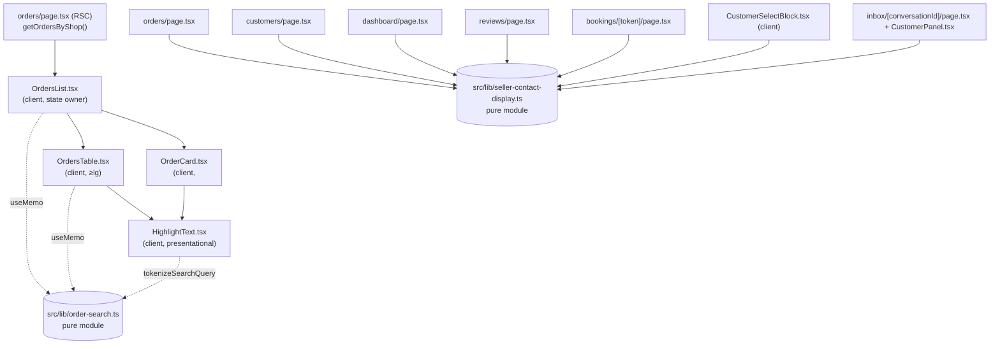
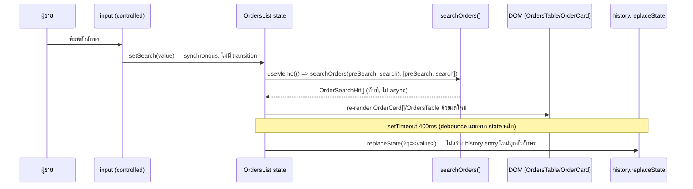
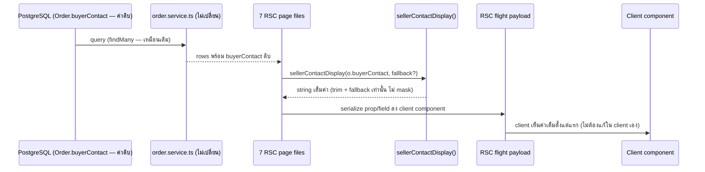

> **โมดูล:** M00058-OrderListSearch
> **ประเภทเอกสาร:** System Design Spec (SDS)
> **เวอร์ชัน:** 1.0
> **วันที่จัดทำ:** 2026-08-24
> **สถานะ:** Draft — เขียนจากโค้ดที่ implement เสร็จแล้ว
> **เจ้าของเอกสาร:** SA

# SDS: ค้นหาในหน้ารายการคำสั่งซื้อ + เลิกปิดบังเบอร์โทรฝั่งผู้ขาย (System Design Spec)

---

## 1. บทนำ & References

### 1.1 วัตถุประสงค์

เอกสารนี้บันทึก **การออกแบบที่ถูกเลือกใช้จริง** (as-built) ของฟีเจอร์ 00058 — เหตุผลของแต่ละการตัดสินใจ ทางเลือกที่ถูกตัดทิ้ง และกับดักที่เจอจริงระหว่างทำ (มีคอมเมนต์กำกับไว้ในโค้ดทุกจุด) ผู้อ่านคือ DEV ที่ต้องต่องานในอนาคต และ QA ที่ต้องออกแบบเทสตามสถาปัตยกรรมนี้

### 1.2 ขอบเขตการออกแบบ

ครอบคลุมทั้ง 2 ก้อนงาน: SSOT ค้นหา (client-side, ไม่มี DB/API) และ SSOT contact display (client-side + RSC boundary 7 จุด) — ไม่ครอบคลุมการออกแบบ UI/interaction ระดับ pixel (ดู `UX-Design-Spec.md`)

### 1.3 เอกสารอ้างอิง

| เอกสาร | ความสัมพันธ์ |
|--------|-------------|
| [[SRS]] ของโมดูลนี้ | TFR-001..010 ที่ design นี้ต้อง realize |
| [[BRD]] ของโมดูลนี้ | FR-OLS-01..13 |
| [[PRD]] ของโมดูลนี้ | D-1..D-14 |
| `docs/conventions/sibling-surface-parity.md` | เหตุผลเชิง convention ที่ตรรกะต้องเป็นแหล่งเดียว |
| `docs/conventions/rule-must-be-enforced-not-described.md` | เหตุผลที่ต้องมีเทสสแกนซอร์สแทนการเชื่อคอมเมนต์ |
| `docs/conventions/mutation-silence-means-weak-corpus.md` | เหตุผลที่ชุดข้อมูลทดสอบมีเคส "แปลก" เจตนา |

---

## 2. Architecture Overview

### 2.1 มุมมองสถาปัตยกรรม

ทั้งฟีเจอร์เป็น **client-side pure-function architecture** ซ้อนอยู่ใต้ Next.js 16 App Router (RSC) ที่มีอยู่แล้ว — ไม่ได้เพิ่ม layer ใหม่ (ไม่มี service layer ใหม่, ไม่มี API layer ใหม่) สถาปัตยกรรมยกแบบมาจาก `src/lib/order-date-filter.ts` ซึ่งเป็น SSOT ตัวกรองช่วงเวลาที่มีอยู่ก่อนแล้วในหน้าเดียวกัน ด้วยเหตุผลเดียวกันเป๊ะ: ต้องเรียกจากทั้งมือถือ (`OrdersList`) และเดสก์ท็อป (`OrdersTable`) ซึ่งเป็นคนละ React tree ที่ mount พร้อมกันแต่แสดงผลคนละอัน

### 2.2 มุมมองการ Deploy

ไม่มีการเปลี่ยนแปลง — deploy พร้อมกับ Next.js build ปกติ (ไม่มี migration ให้รันก่อน)

---

## 3. Component Design

| Component | หน้าที่ (Responsibility) | Dependency (Submodule / Stack / Store) |
|-----------|--------------------------|-----------------------------------------|
| **`src/lib/order-search.ts`** | ตัดสินการจับคู่คำค้น + จัดลำดับ — หน้าที่เดียว: pure function ไม่มี side effect | ไม่มี dependency ภายนอกยกเว้น `formatOrderNo` จาก `order-no.ts` |
| **`src/lib/seller-contact-display.ts`** | ตัดสิน "ข้อมูลติดต่อที่ผู้ขายเห็น" — หน้าที่เดียว: trim + fallback ไม่มี logic ปิดบัง | ไม่มี dependency |
| **`OrdersList.tsx`** | เจ้าของ state ของหน้า (`search`, `localStatus`, `typeFilter`, `dateFilter`) + orchestrate ตัวกรองทุกแกน + sync URL | `next/navigation`, `order-search.ts`, `OrdersTable`, `OrderCard`, `SellerEmptyState`, `ListBusyOverlay` |
| **`OrdersTable.tsx`** | render ตาราง TanStack + เรียก `searchOrders` เองอีกครั้งด้วยค่า `search`/`orders` ที่ได้รับจาก parent | `@tanstack/react-table`, `order-search.ts`, `HighlightText` |
| **`OrderCard.tsx`** | render การ์ด 1 ใบ, รับผลค้นหาที่คำนวณแล้วจาก parent (ไม่เรียก `searchOrders` เอง) | `HighlightText` |
| **`HighlightText.tsx`** | presentational-only — เน้นข้อความที่ตรงคำค้น | อ่าน tokenizer จาก `order-search.ts` (`tokenizeSearchQuery`, `isNumericSearchToken`, `searchDigitsOnly`) เพื่อไม่ให้ตรรกะการหาช่วงเพี้ยนจากตรรกะการกรอง |
| **`SellerEmptyState.tsx`** | presentational — เพิ่ม prop `actionButton` (คนละแบบกับ `action` ที่เป็น `<Link>`) สำหรับ action ที่ต้องล้าง React state ในหน้า | ไม่มี dependency ใหม่ |
| **7 RSC page files** | เรียก `sellerContactDisplay`/`sellerContactOrNull` ก่อนประกอบ prop/field ที่ส่งข้าม RSC boundary | `seller-contact-display.ts` |

---

## 4. Data Flow

### 4.1 Flow หลัก: ผู้ใช้พิมพ์คำค้น

**หมายเหตุสำคัญ:** ไม่มีขั้นตอนไหนที่ยิง network request — ทั้งหมดเป็นการคำนวณบนเครื่องผู้ใช้จาก `OrderRow[]` ที่โหลดมาครั้งเดียวตอน RSC render (หรือตอน `router.refresh()` เท่านั้น เช่นหลังยกเลิกออเดอร์)

### 4.2 Flow: ข้อมูลติดต่อฝั่งผู้ขาย ข้าม RSC boundary

**จุดที่ต้องแยกจากกันชัดเจน (D-14):** สำหรับ `CustomerSelectBlock.tsx` (จุดที่ 6) flow นี้ **ไม่มีขั้น RSC boundary ใหม่** — ค่า `contact` มาจาก `GET /api/orders/customers` (route ที่มีอยู่ก่อนแล้วและไม่เคย mask) เข้า client memory โดยตรง แล้ว `sellerContactDisplay` ถูกเรียกที่ **client component ตอน render** เท่านั้น (`CustomerSelectBlock.tsx:261`) — จึงจัดเป็น "เปลี่ยนการแสดงผล" ไม่ใช่ "เพิ่ม PII ใหม่" ตาม BR-OLS-25

---

## 5. Integration Points

| จุดเชื่อม | ประเภท | Protocol / Contract | ความเสี่ยงเมื่อล่ม |
|-----------|--------|----------------------|---------------------|
| **`GET /api/orders/customers`** | internal (มีอยู่ก่อนฟีเจอร์นี้ — ไม่แก้) | REST/JSON | ถ้า route นี้เริ่ม mask contact ในอนาคต จุดที่ 6 (`CustomerSelectBlock`) จะกลับไปแสดงค่าปิดบังทันทีโดยไม่มีอะไรฟ้อง เพราะ `sellerContactDisplay` แค่ trim ไม่ unmask |
| **`getOrdersByShop()`** | internal (มีอยู่ก่อน) | Prisma query (`src/services/order.service.ts:1488`) | ไม่มีการแบ่งหน้า — ยิ่งร้านมีออเดอร์เยอะ payload ยิ่งโต (ดู SRS §6) |

- **Timeout / Retry / Idempotency:** ไม่เกี่ยวข้อง — ไม่มี network call ใหม่จากฟีเจอร์นี้
- **สัญญา API เต็ม:** ดู `API.md` ของโมดูลนี้ (สรุปสั้น: ไม่มี endpoint ใหม่)

---

## 6. Technical Decisions

### TD-001: ค้นหาด้วยฟังก์ชันบริสุทธิ์ที่ป้อนเข้า `data` ของตาราง — ไม่ใช่ `globalFilterFn` ของ TanStack

- **ตัดสินใจ:** เขียน `searchOrders()` เป็น pure function ภายนอก แล้วป้อนผลลัพธ์เข้า `data` prop ของ `useReactTable` แทนการใช้ `globalFilterFn` built-in
- **เหตุผล:** `globalFilterFn: 'includesString'` ของ TanStack ไล่เฉพาะคอลัมน์ที่มี `accessor` และแปลงค่าเป็นสตริงด้วย `String(value)` ตรง ๆ — คอลัมน์ `items` เป็น `array` ของ `object` จึงกลายเป็น `"[object Object]"` ผลคือ **ค้นชื่อสินค้าไม่ได้เลย แต่พิมพ์คำว่า `object` แล้วตรงทุกใบ** (พิสูจน์แล้วจากโค้ดเดิมก่อนแก้ — คอมเมนต์ยืนยันที่ `OrdersTable.tsx:301-303`)
- **ทางเลือกที่ตัดทิ้ง:** เขียน custom `globalFilterFn` ที่ handle `items` เป็นพิเศษ — ถูกตัดเพราะยังต้องแก้ปัญหาเดิมคือ "มือถือกับเดสก์ท็อปเป็นคนละกลไก" (มือถือไม่ได้ใช้ TanStack เลย) ทำให้ยังต้องดูแล 2 ชุด logic คู่ขนานอยู่ดี
- **ผลกระทบ:** DEV ที่จะเพิ่มฟิลด์ค้นหาใหม่แก้ที่เดียว (`order-search.ts`) ทั้งสองจอได้ผลตรงกันโดยอัตโนมัติ — QA เขียนเทสที่ระดับ `order-search.ts` ครอบทั้งสองจอในเทสเดียว

### TD-002: State คำค้นเดียวที่ `OrdersList` ไม่ใช่แยกต่อ breakpoint

- **ตัดสินใจ:** `search` เป็น state เดียวที่ `OrdersList` ถือ ส่งเป็น prop ลง `OrdersTable` (`search`/`onSearchChange`) — `OrdersTable` ไม่มี local state ค้นหาของตัวเองอีกต่อไป
- **เหตุผล:** `OrdersList` และ `OrdersTable` (ผ่าน wrapper `hidden lg:block`/`lg:hidden`) **mount พร้อมกันเสมอทุก viewport** — ไม่ใช่ conditional render ตาม breakpoint จริง ๆ เพียงแค่ซ่อนด้วย CSS ดังนั้นถ้าให้แต่ละฝั่งถือ state ของตัวเอง จะมี state สองก้อนที่ไม่ sync กันจริง ๆ (ไม่ใช่แค่ "ดูเหมือนไม่ sync" — เป็นคนละ instance เลย) นี่คือรากของบั๊กเดิมที่มือถือค้นได้ 4 ฟิลด์ ส่วนเดสก์ท็อปค้นได้อีกชุด
- **ทางเลือกที่ตัดทิ้ง:** ใช้ URL (`?q=`) เป็น single source of truth แทน (อ่านทุก render ด้วย `useSearchParams()`) — ถูกตัดเพราะ controlled input ที่ผูกกับค่าที่เดินทางผ่าน router จะพิมพ์ตามนิ้วไม่ทัน (บทเรียนเดียวกับที่คอมเมนต์ `OrdersList.tsx:170-172` อธิบายไว้ — เขียนไว้อย่างชัดเจนว่าเคยพยายามแล้วพัง)
- **ผลกระทบ:** URL เป็นแค่ "จุดเริ่มต้น" (initial value ตอน mount) ไม่ใช่ source of truth ตลอดเวลา — ผลข้างเคียงคือ TD-007

### TD-003: การตัดสัญลักษณ์ (digit-stripping) จำกัดเฉพาะฟิลด์ตัวระบุเฉพาะ ไม่ใช้กับข้อความอิสระ

- **ตัดสินใจ:** `isNumericToken(token)` ตัดสินระดับ **คำค้น** (ทั้ง token ต้องเป็นตัวเลข+ตัวคั่นล้วน) ไม่ใช่ตัดสินระดับ **ตัวอักษร** ในทุกฟิลด์ — และแม้ token เป็นตัวเลขล้วน ก็เทียบกับฟิลด์ตัวหนังสือ (substring ตรงตัว) ก่อนเสมอ แล้วค่อย "เพิ่มสิทธิ์" ให้เทียบกับฟิลด์ตัวระบุเฉพาะแบบตัดสัญลักษณ์
- **เหตุผล:** ถ้าตัดสัญลักษณ์ทุกฟิลด์รวมถึงชื่อสินค้า/ชื่อผู้ซื้อ คำค้น `เสื้อ-ยืด` จะไปตรงกับ `เสื้อยืดสีขาว` ทั้งที่ผู้ใช้พิมพ์เครื่องหมายขีดเข้ามาเอง — ผลลัพธ์ที่ผู้ใช้อธิบายไม่ได้ว่าทำไมตรง (เทส `[blocker]` "เสื้อ-ยืด ต้องไม่ไปตรงกับ เสื้อยืดสีขาว" พิสูจน์กติกานี้)
- **ทางเลือกที่ตัดทิ้ง:** ตัดสัญลักษณ์ทุกฟิลด์เสมอ (ง่ายกว่า) — ถูกตัดด้วยเหตุผลข้างบน
- **ผลกระทบ:** ต้องรักษาความแตกต่างนี้ทุกครั้งที่เพิ่มฟิลด์ค้นหาใหม่ — ฟิลด์ใหม่ต้องตัดสินใจชัดว่าเป็น "ตัวระบุเฉพาะ" (เข้า `numericFieldsOf`) หรือ "ข้อความอิสระ" (เข้า `textFieldsOf` เท่านั้น)

### TD-004: บอกเหตุผลที่ตรงด้วยไฮไลต์ + auto-expand + สัญญาณภาพ แทนบรรทัดข้อความแยก (⚠️ deviate จาก BRD AC ที่ร่างไว้)

- **ตัดสินใจ:** ไม่มีบรรทัดข้อความ "ตรงกับ: {ฟิลด์} {ค่า}" แยกต่างหากตามที่ FR-OLS-08 ร่างไว้ ใช้ 3 สัญญาณแทน: (1) `<mark>` ไฮไลต์บนฟิลด์ที่แสดงอยู่แล้ว (2) auto-expand รายการที่ยุบไว้เมื่อของที่ตรงอยู่ในนั้น (3) ring/พื้นจางที่ทั้งใบเมื่อตรงเต็มค่า
- **เหตุผล (ทำไมของจริงต่างจากแผน):** BRD ร่าง AC นี้จากสมมติฐานว่า **มือถือไม่แสดงเบอร์บนการ์ด** และ **เดสก์ท็อปไม่มีคอลัมน์สินค้า** ("ยืนยันแล้วว่า `OrderCard.tsx` ไม่มีการอ้างถึง `buyerPhone`" ที่ BRD FR-OLS-08) — แต่ **D-13 (ในฟีเจอร์เดียวกัน) เปลี่ยนสมมติฐานนั้น**: เบอร์ถูกเพิ่มกลับเข้าไปในแถว meta ของการ์ด (`OrderCard.tsx:236-244`, คอมเมนต์ `OrderCard.tsx:180-184` อธิบายว่าเบอร์เคยถูกถอดออกตอน v11 redesign แล้วดึงกลับมา) และเดสก์ท็อปมีคอลัมน์ `items` แสดงชื่อสินค้าอยู่แล้ว (`OrdersTable.tsx:338-427`) ⇒ **ทั้ง 5 ฟิลด์ที่ประกาศค้นได้ กลายเป็นฟิลด์ที่แสดงอยู่บนจอทั้งสองจออยู่แล้วเสมอ** ไม่มีฟิลด์ไหนที่ "ตรงแต่ไม่แสดง" อีกต่อไป — บรรทัดข้อความแยกจึงไม่มีข้อมูลอะไรให้เพิ่ม
- **ทางเลือกที่ตัดทิ้ง:** ใส่บรรทัด "ตรงกับ: ..." ตาม BRD ตรง ๆ (ซ้ำซ้อนกับไฮไลต์ที่เห็นอยู่แล้ว)
- **ผลกระทบ:** **นี่คือ deviation จาก BRD AC ที่ต้องแจ้ง Controller/PO รับทราบ** — FR-OLS-08 AC ข้อ "บรรทัดตรงกับ: ..." ไม่ได้ implement ตามตัวอักษร แต่ intent (ผู้ใช้เข้าใจว่าทำไมใบนี้ติดผลค้นหา) ถูกตอบด้วยกลไกอื่นที่ครอบคลุมกว่า (เพราะมีสัญญาณแม้ตอนไม่มี match บนฟิลด์ identifier ก็ยังมี `<mark>` ให้เห็น) — QA ต้องปรับ test plan ให้ตรวจ "มีสัญญาณที่มองเห็นได้" ไม่ใช่ตรวจหาข้อความ "ตรงกับ:" ตรง ๆ

### TD-004b: `shortCode` ตรงแบบ "เต็มค่าเท่านั้น" — ปิดรูโหว่ในเหตุผลของ TD-004 (แก้หลังรีวิว)

- **ปัญหาที่พบตอนตรวจ TD-004:** ข้ออ้างของ TD-004 คือ "ทั้ง 5 ฟิลด์ที่ค้นได้ แสดงอยู่บนจอเสมอ
  จึงไม่ต้องมีบรรทัด `ตรงกับ:`" — แต่ `shortCode` (ที่ Controller เติมเข้ามาเองระหว่างทาง)
  **ไม่เคยถูกแสดงบนจอเลยสักที่** (grep `OrderCard.tsx`/`OrdersTable.tsx` = 0) ⇒ ค้นด้วยรหัสสั้น
  บางส่วนจะได้ใบที่โผล่มาโดยไม่มีอะไรถูกไฮไลต์ = ผลลัพธ์ที่ผู้ใช้อธิบายไม่ได้ ซึ่งเป็น
  อาการเดียวกับที่ TD-004 อ้างว่าไม่มีแล้ว
- **ตัดสินใจ:** บังคับให้ `shortCode` ตรงแบบเต็มค่าเท่านั้น (ไม่ใช่ substring) ⇒ ทุกครั้งที่ตรง
  จะเข้าเงื่อนไข `isExactIdentifierMatch` และได้ ring เป็นสัญญาณเสมอ **ไม่มีผลลัพธ์ที่ไร้คำอธิบาย
  เหลืออยู่เลย** ⇒ ข้ออ้างของ TD-004 กลับมาเป็นจริงทั้งหมด
- **เหตุผลที่ไม่เลือกทางอื่น:** (ก) ถอด `shortCode` ออกจากการค้นหา — เสียความสามารถที่ผู้ขาย
  ใช้จริง (ก็อปรหัสจากลิงก์ที่แชร์ในแชทกลับมาวาง) · (ข) เอา `shortCode` ขึ้นแสดงบนการ์ด —
  เพิ่มตัวเลขอีกชุดข้างเลขคำสั่งซื้อที่มีอยู่แล้ว ผู้ขายต้องแยกว่าอันไหนคืออะไร
- **ผูกด้วยเทส:** 2 เคส `[blocker]` (ตรงบางส่วนต้องไม่เจอ · ตรงเต็มค่าต้องได้ `isExactMatch`)
  พิสูจน์ด้วย mutation แล้ว (เปลี่ยนกลับเป็น `includes` → แดง 1 ข้อ)

### TD-005: `seller-contact-display.ts` เป็น trim+fallback ล้วน ไม่มี logic การตัดสินใจ — ป้องกันการถอดมาสก์ลามด้วยเทสสแกนซอร์ส

- **ตัดสินใจ:** ฟังก์ชันเรียบง่ายที่สุดเท่าที่จะทำได้ (ไม่มี branch, ไม่มี regex ปิดบัง) + คุมขอบเขตด้วยเทสที่ **สแกนซอร์สจริง** (`readFileSync` + regex) ว่าไฟล์นอกขอบเขตยังไม่เรียกฟังก์ชันนี้ และไฟล์ในขอบเขตไม่มี `mask*` function ของตัวเองเหลือ
- **เหตุผล:** ตาม `docs/conventions/rule-must-be-enforced-not-described.md` — "AC ที่เขียนไว้ ≠ AC ที่บังคับได้" คอมเมนต์เพียงอย่างเดียวไม่กันคนถัดไปแตะจอที่ไม่ควรแตะ ต้องมีด่านที่ fail เมื่อมีคนละเมิดจริง
- **ทางเลือกที่ตัดทิ้ง:** ใส่ parameter `role`/`scope` เข้าไปในฟังก์ชันแล้วให้ฟังก์ชันตัดสินเองว่าจะ mask ไหม — ถูกตัดเพราะจะกลับไปมีจุดตัดสินใจเดียวที่ต้องดูแลความถูกต้องของทุก caller (เสี่ยงเหมือนเดิม) แทนที่จะแยกไฟล์ตามขอบเขตอย่างสิ้นเชิง (คนละไฟล์ = คนละ import path = grep เจอง่าย)
- **ผลกระทบ:** เพิ่มไฟล์เทส (`seller-contact-display.test.ts`) ที่ผูกกับ **รายชื่อไฟล์แบบ hardcode** (`SELLER_FILES` array) — ถ้ามีจุดที่ 8 ในอนาคต ต้องเพิ่มในลิสต์นี้ด้วยมือ ไม่ใช่ auto-detect

### TD-006: sync `?q=` ด้วย `history.replaceState` หน่วง 400ms — ไม่ใช้ `router.replace`

- **ตัดสินใจ:** เขียน URL ตรงผ่าน Web API (`window.history.replaceState`) ใน `useEffect` แยกจาก state หลัก แทนการเรียก Next.js `router.replace`
- **เหตุผล:** `OrderRow[]` ทั้งร้านถูกโหลดมาที่ client แล้วตั้งแต่ RSC render แรก — การเรียก `router.replace`/`router.push` ทุกครั้งที่ URL เปลี่ยนจะสั่งให้ Next.js ดึง RSC flight payload ใหม่ทั้งก้อน (~500–800KB ที่ร้านใหญ่ตามที่คอมเมนต์ระบุ) เพื่อผลลัพธ์ที่คำนวณอยู่บนเครื่องอยู่แล้ว เป็นการสิ้นเปลืองที่ไม่จำเป็น
- **ทางเลือกที่ตัดทิ้ง:** `router.replace(url, { scroll: false })` — ถูกตัดด้วยเหตุผล perf ข้างบน; `pushState` แทน `replaceState` — ถูกตัดเพราะจะสร้าง history entry ทุกตัวอักษรที่พิมพ์ ทำให้ปุ่ม back ของเบราว์เซอร์ใช้งานไม่ได้จริง (ต้องกดย้อนสิบกว่าครั้งกว่าจะออกจากหน้า)
- **ผลกระทบ:** `search` state **ไม่ sync กลับจาก URL อัตโนมัติ** หลัง mount — ผลข้างเคียงตรงกับ TD-007/TD-002 (ทั้ง 3 ปัญหามีรากเดียวกัน: state กับ URL sync ทางเดียว ไม่ใช่ two-way binding)

### TD-007: กับดักที่เจอจริง #1 — ปุ่ม "ดูผลทั้งร้าน" ต้องล้างทั้ง React state และ URL พร้อมกัน

- **บริบท:** `localStatus`, `typeFilter`, `dateFilter` ถูก `useState()` ครั้งเดียวตอน mount (`localStatus` เริ่มจาก prop `activeStatus`, ส่วน `typeFilter`/`dateFilter` เริ่มจากค่าคงที่) แล้ว **ไม่เคย sync กลับจาก URL อีกเลย** (`OrdersList.tsx:118, 166, 175`) ขณะที่ `stage`/`appt`/`apptDay` อ่านจาก `searchParams` **ทุก render** (ไม่ใช่ `useState`)
- **บั๊กที่เกือบเกิด:** ถ้าปุ่ม "ดูผลทั้งร้าน (N)" เขียนแค่ `router.push(pathname)` (ล้าง URL อย่างเดียว) — `localStatus`/`typeFilter`/`dateFilter` ที่เป็น React state จะยังค้างค่าเดิม ผู้ใช้กดปุ่มแล้วยังเจอจอว่างใบเดิมเป๊ะ (URL เปลี่ยนแต่ผลลัพธ์บนจอไม่เปลี่ยนเลย)
- **ทางแก้ที่ implement จริง:** `clearFiltersKeepSearch()` (`OrdersList.tsx:264-269`) เรียกทั้ง `setLocalStatus('all')` + `setTypeFilter('')` + `setDateFilter('All')` (ล้าง state) **และ** `pushQuery({ status: null, stage: null, appt: null, apptDay: null })` (ล้าง URL param ที่อ่านสด) ในฟังก์ชันเดียว — คงคำค้น (`search`) ไว้ไม่แตะ
- **ฝั่งเดสก์ท็อป มีชั้นที่ 3 ต้องล้างเพิ่ม:** `OrdersTable` มี `columnFilters` ของ TanStack เอง (สถานะ/ขนส่ง/ช่วงเวลา) ซึ่งไม่ได้ผูกกับ React state ของ `OrdersList` เลย — callback ที่ `OrdersTable.tsx:1056-1061` ต้องเรียก `setColumnFilters([])` + `table.setPageIndex(0)` **ก่อน** เรียก `onClearFilters()` (=`clearFiltersKeepSearch`) — รวมเป็น **3 ระบบ state ที่ต้องล้างพร้อมกัน** (React state ของ `OrdersList`, URL params, TanStack `columnFilters`)

### TD-008: กับดักที่เจอจริง #2 — เบอร์ที่ก็อปมาพร้อมช่องว่างต้องอ่านเป็น "เลขก้อนเดียว" ไม่ใช่ "หลายคำ"

- **บริบท:** กติกาพื้นฐาน (D-5) คือแยกคำค้นด้วยช่องว่างแล้ว AND ทีละคำ — ใช้ได้ดีกับข้อความทั่วไป แต่เบอร์โทรที่ก็อปมาจากแชท/ที่จดไว้มักมีช่องว่างคั่น (`081 234 5678`)
- **บั๊กที่เกือบเกิด:** ถ้าใช้กติกา AND แยกคำตรง ๆ กับ `081 234 5678` จะได้ 3 token: `081`, `234`, `5678` — แต่ละ token AND กันแยกฟิลด์ได้ (ตาม D-5 ที่อนุญาต "คนละคำตรงคนละฟิลด์") ผลคือใบที่ **ไม่มีอะไรเกี่ยวกับเบอร์นี้เลย** แต่บังเอิญมี `081` ท้ายเบอร์อื่น, `234` อยู่ในชื่อ, `5678` อยู่ในเลขพัสดุ จะติดมาด้วย — เทสเคส **E** ในชุดข้อมูลทดสอบถูกสร้างขึ้นมาเฉพาะเพื่อพิสูจน์เรื่องนี้ (`order-search.test.ts:74-89`, comment อธิบายไว้ตรง ๆ)
- **ทางแก้ที่ implement จริง:** `tokenizeSearchQuery()` เช็ค **ก่อน** แยกคำ ว่าคำค้นทั้งก้อน (หลัง trim) เป็น "ตัวเลข+ตัวคั่นล้วน" (`isNumericToken(trimmed)`) หรือไม่ — ถ้าใช่ ถือเป็น **1 token เดียว** ไม่แยกตามช่องว่างเลย (`order-search.ts:139-143`)
- **ผลกระทบ:** ต้องคง `isNumericToken` ให้เป็น superset ที่ครอบคลุมตัวคั่นทั่วไปของเบอร์/เลขพัสดุ (`\s\-._()+`) — เพิ่มตัวคั่นใหม่ในอนาคตต้องอัปเดตทั้ง `isNumericToken` และตัวคั่นที่ `digitsOnly`/`searchDigitsOnly` ตัดออกให้สอดคล้องกัน (สองจุดนี้ต้องเดินไปด้วยกันเสมอ)

---

## 7. Traceability

| SRS Requirement (TFR/NFR) | SDS Element (component / decision / flow) | สถานะ |
|---------------------------|-------------------------------------------|-------|
| TFR-001 | `order-search.ts` / TD-001, TD-003, TD-008 | Done |
| TFR-002 | `OrdersList.tsx` state / TD-002 | Done |
| TFR-003 | `OrdersTable.tsx` / TD-001 | Done |
| TFR-004 | Flow 4.1 / `SellerEmptyState.tsx` / TD-007 | Done |
| TFR-005 | `HighlightText.tsx`, `OrderCard.tsx`, `OrdersTable.tsx` / TD-004 | Done (deviate — ดู TD-004) |
| TFR-006 | `OrdersList.tsx` effect / TD-006 | Done |
| TFR-007, TFR-008 | `seller-contact-display.ts` / Flow 4.2 / TD-005 | Done |
| TFR-009 | Flow 4.2 (ขอบเขตที่ไม่แตะ) | Done |
| TFR-010 | §5 Integration Points | Done |
| NFR-Security (BR-OLS-24) | Flow 4.2 | **Done** — `safepay-security` ตรวจแล้ว 2026-08-24 ไม่มี Critical/High · จำแนก PII รายจุดด้วย `git blame` (2 จุด = เปลี่ยนการแสดงผล · 5 จุด = เพิ่ม PII เข้า flight payload) · ด่านสิทธิ์ scope ด้วย `WHERE` ทุกจุด · ยืนยันไม่มี `dangerouslySetInnerHTML` และไม่ประกอบ regex จากคำค้น |

---

## 8. Known Issues (พบระหว่างอ่านโค้ดจริง — ไม่ใช่ blocker แต่ควรบันทึกไว้)

🛑 **สิ่งเหล่านี้ยืนยันจากการเปิดไฟล์จริง (`docs/conventions/value-fate-decided-at-write-site.md`) ไม่ใช่การเดา:**

1. **คอมเมนต์เก่าที่ยังโกหกพฤติกรรมปัจจุบัน (3 จุด):**
   - `orders/page.tsx:355` — `// buyerContact ยัง mask อยู่ใน field \`buyer\` ด้านบน — ไม่ลด PII boundary` — **เท็จ**: `buyer` field ที่บรรทัด 348 เรียก `sellerContactDisplay()` ซึ่งไม่ mask แล้ว คอมเมนต์นี้ไม่ถูกอัปเดตตอนแก้บรรทัด 348 (แม้บรรทัด 54 ของไฟล์เดียวกันจะมีคอมเมนต์ที่ถูกต้องแล้ว)
   - `dashboard/page.tsx:438` — `// mask ก่อนข้าม RSC boundary — ห้ามส่ง raw contact ไปยัง client payload (S5-pdpafix)` — **เท็จ**: ขัดกับคอมเมนต์ที่ถูกต้องกว่าที่บรรทัด 100 ของไฟล์เดียวกัน
   - `orders/components/data.ts:111` — `buyer: string // masked contact หรือ '—'` — type comment ไม่ตรงกับพฤติกรรมจริงอีกต่อไป
   - **ผลกระทบ:** ขัดกับ BR-OLS-21 บางส่วน (ต้องแก้คอมเมนต์เป็นเหตุผลใหม่ ไม่ใช่ปล่อยให้อ่านผิด) — 4/7 จุดแก้คอมเมนต์ถูกต้องแล้ว, 3 จุดยังตกหล่น
2. **ชื่อ field ไม่ตรงความหมาย:** `bookings/[token]/page.tsx:76` ยังใช้ชื่อ `guestContactMasked` แม้ค่าที่ส่งมาจาก `sellerContactOrNull()` ไม่ถูก mask แล้ว — ต่างจากจุดที่ 7 (`CustomerPanel.tsx`) ที่เปลี่ยนชื่อ field จาก `phoneMasked` → `phone` ไปแล้วพร้อมคอมเมนต์อธิบายเหตุผล (`CustomerPanel.tsx:143-148`) เป็นความไม่สม่ำเสมอระหว่าง 2 จุดที่ทำแบบเดียวกัน
3. **BR-OLS-24/26 (security review) ยังไม่พบหลักฐาน** — 5 จุด (`customers`, `dashboard`, `reviews`, `bookings`, `inbox`) ที่ BRD จัดเป็น "เพิ่ม PII เข้า flight payload ใหม่" ยังไม่พบไฟล์บันทึกผลการ review ของ `safepay-security` ใน `docs/20 - Features/00058 - Order List Search/`
4. **ตัวเลขวัดประสิทธิภาพ (ms) ยังไม่ถูกบันทึก** — มีแค่จำนวนแถวสูงสุด (421 ใบ/ร้าน) จาก `DATABASE.md` ไม่มี timing benchmark จริง — AC ของ BR-OLS-18 ยังไม่ครบ

---

## 9. สรุป (Summary)

เอกสาร SDS นี้กำหนดการออกแบบเชิงระบบของฟีเจอร์ 00058 ตามที่ implement จริง — สถาปัตยกรรมเป็น client-side pure-function ล้วน 2 โมดูล (`order-search.ts`, `seller-contact-display.ts`) ที่แชร์กันระหว่างมือถือ/เดสก์ท็อป และแชร์กันระหว่าง 7 RSC pages ตามลำดับ

**ลำดับการ build ที่ใช้จริง (เรียงตาม dependency):**
1. `src/lib/order-search.ts` + `src/lib/seller-contact-display.ts` (pure modules, เทสก่อน)
2. `HighlightText.tsx` (ใช้ tokenizer จากข้อ 1)
3. แก้ `OrdersList.tsx`/`OrdersTable.tsx`/`OrderCard.tsx`/`SellerEmptyState.tsx` (ต่อกับ SSOT ค้นหา)
4. แก้ 7 RSC page files (ต่อกับ SSOT contact display)

**Open Questions:**
- BR-OLS-18 (ms benchmark) และ BR-OLS-24/26 (security review evidence) ยังไม่ปิด — ดู §8
- deviation ของ FR-OLS-08 (TD-004) ต้องให้ PO/Controller รับทราบอย่างเป็นทางการว่า intent ถูกตอบด้วยกลไกอื่น ไม่ใช่ตามตัวอักษร AC
