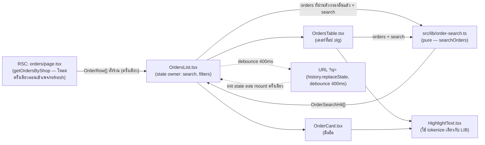
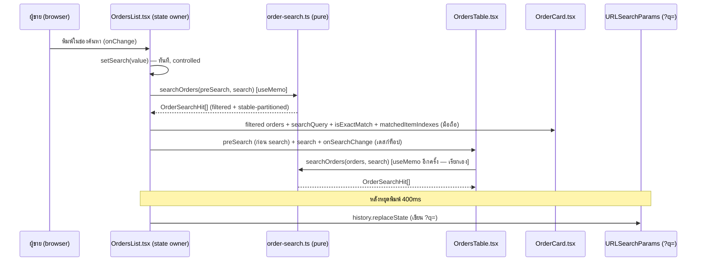

> **โมดูล:** M00058-OrderListSearch
> **ประเภทเอกสาร:** Software Requirements Specification (SRS) - TECHNICAL
> **เวอร์ชัน:** 1.0
> **วันที่จัดทำ:** 2026-08-24
> **สถานะ:** Draft — เขียนจากโค้ดที่ implement เสร็จแล้ว (ไม่ใช่จากแผน)
> **เจ้าของเอกสาร:** SA

# SRS: ค้นหาในหน้ารายการคำสั่งซื้อ + เลิกปิดบังเบอร์โทรฝั่งผู้ขาย (Software Requirements Specification — Technical)

---

## 1. บทนำ (Introduction)

### 1.1 วัตถุประสงค์ของเอกสาร

เอกสารนี้กำหนดข้อกำหนดเชิงเทคนิคของฟีเจอร์ 00058 ซึ่งประกอบด้วยสองก้อนงานที่ผูกกัน: **(ก)** รวมตรรกะค้นหาของหน้า `/seller/orders` (มือถือ + เดสก์ท็อป) ให้เป็นฟังก์ชันบริสุทธิ์เดียว (`src/lib/order-search.ts`) และ **(ข)** ถอดฟังก์ชันปิดบังเบอร์โทรลูกค้าออกจาก 7 จอฝั่งผู้ขาย (`src/lib/seller-contact-display.ts`) ผู้อ่านคือ DEV ที่ต้องเข้าใจ implementation ที่มีอยู่จริง และ QA ที่ต้องเขียนเทสอิงพฤติกรรมนี้ **เอกสารนี้เขียนจากการอ่านซอร์สโค้ดจริงหลัง implement เสร็จ ไม่ใช่จากแผนก่อนเขียนโค้ด**

### 1.2 ขอบเขตเชิงระบบ (System Scope)

ทั้งสองก้อนงานเป็น **client-side ล้วน** ภายใน route `/seller/orders` เท่านั้น ไม่มี service ใหม่ ไม่มี API route ใหม่ ไม่มี migration ระบบที่แตะ:

- **Component layer:** `OrdersList.tsx` (state owner + มือถือ), `OrdersTable.tsx` (เดสก์ท็อป), `OrderCard.tsx`, `HighlightText.tsx` (ใหม่), `SellerEmptyState.tsx`
- **Pure lib layer:** `src/lib/order-search.ts` (ใหม่), `src/lib/seller-contact-display.ts` (ใหม่)
- **RSC page layer (7 จุด):** `orders/page.tsx`, `customers/page.tsx`, `dashboard/page.tsx`, `reviews/page.tsx`, `bookings/[token]/page.tsx`, `orders/new/components/CustomerSelectBlock.tsx`, `(chat)/inbox/[conversationId]/page.tsx` + `CustomerPanel.tsx`

**นอกขอบเขตเทคนิค (ยืนยันแล้วว่าไม่ถูกแตะ):** `src/app/(paces)/admin/(dashboard)/orders/page.tsx` (`maskContact()` เดิม + `buyerContactMasked` ยังอยู่ครบ), `src/app/(marketing)/o/[token]/guest-order-data.ts` + `src/lib/order-pii-mask.ts` (ยังใช้ mask เดิมทุกประการ — พิสูจน์ด้วยเทส `[blocker]` ที่สแกนซอร์สจริงใน `seller-contact-display.test.ts`)

### 1.3 เอกสารอ้างอิง (References)

| เอกสาร | ความสัมพันธ์ |
|--------|-------------|
| [[PRD]] ของโมดูลนี้ | เป้าหมายธุรกิจ, D-1..D-14, KPI |
| [[BRD]] ของโมดูลนี้ | FR-OLS-01..13, BR-OLS-01..26, path:line ที่ต้องแก้ |
| `docs/SRS.md` §10.13/§10.14 | SRS ระดับระบบ — เอกสารนี้ไม่ขัดกับนิยามที่นั่น |
| `docs/conventions/sibling-surface-parity.md` | เหตุผลที่ตรรกะค้นหาต้องเป็นแหล่งเดียว |
| `docs/conventions/rule-must-be-enforced-not-described.md` | เหตุผลที่ต้องมีเทส `[blocker]` สแกนซอร์สกันการถอดมาสก์ลามข้ามฝั่ง |

### 1.4 นิยามและตัวย่อ (Definitions & Acronyms)

| คำ/ตัวย่อ | ความหมาย |
|-----------|----------|
| **SSOT ค้นหา** | `src/lib/order-search.ts` — จุดเดียวที่ตัดสินว่าออเดอร์ตรงกับคำค้นหรือไม่ |
| **SSOT contact display** | `src/lib/seller-contact-display.ts` — จุดเดียวที่ตัดสินว่าผู้ขายเห็นข้อมูลติดต่อลูกค้าแบบใด |
| **Identifier field** | เลขคำสั่งซื้อ / รหัสสั้น / เบอร์โทร / เลขพัสดุ — ฟิลด์ที่ใช้กติกา "ตรงเต็มค่าลอยบนสุด" ได้ |
| **Token** | คำย่อยที่ได้จากการแยกคำค้นด้วยช่องว่าง (`tokenizeSearchQuery`) |
| **Hit** | ผลลัพธ์การจับคู่ 1 ใบ (`OrderSearchHit<T>`) ประกอบด้วยออเดอร์ + `isExactMatch` + `matchedItemIndexes` |

---

## 2. ภาพรวมสถาปัตยกรรม (Architecture Overview)

### 2.1 บริบทระบบ (System Context)

### 2.2 องค์ประกอบหลัก (Components)

| Component | หน้าที่ | Submodule / Stack |
|-----------|---------|-------------------|
| **`src/lib/order-search.ts`** | ฟังก์ชันบริสุทธิ์ที่ตัดสินว่าออเดอร์ตรงคำค้นไหม + จัดลำดับ | pure TS, ไม่ import prisma/server-only |
| **`src/lib/seller-contact-display.ts`** | ฟังก์ชันบริสุทธิ์ที่คืนข้อมูลติดต่อเต็มค่าให้จอฝั่งผู้ขาย | pure TS |
| **`OrdersList.tsx`** | เจ้าของ state `search` ตัวเดียว, sync `?q=`, ส่ง `orders` ที่กรองแล้ว (ไม่รวม search) ให้ทั้งสอง breakpoint | React client component (Next.js 16 App Router) |
| **`OrdersTable.tsx`** | เรียก `searchOrders` เอง (ไม่รับ hits จาก parent) แล้วป้อนผลเข้า `data` ของ TanStack Table | React client + `@tanstack/react-table` |
| **`OrderCard.tsx`** | รับ `searchQuery`/`isExactSearchMatch`/`matchedItemIndexes` เป็น prop จาก `OrdersList` | React client |
| **`HighlightText.tsx`** | Presentational — เน้นช่วงข้อความที่ตรงคำค้น โดยใช้ tokenizer ตัวเดียวกับ `order-search.ts` | React client |
| **7 RSC page files** | เรียก `sellerContactDisplay`/`sellerContactOrNull` ก่อนส่งค่าลง `OrderRow`/prop อื่นข้าม RSC boundary | Next.js Server Component |

### 2.3 มุมมองการ Deploy (Deployment View)

ไม่มีการเปลี่ยนแปลง — ทั้งหมดรันใน Next.js server (RSC ที่มีอยู่แล้ว) + browser ของผู้ใช้ (client component เดิม) ไม่มี infra ใหม่, ไม่มี edge function ใหม่, ไม่มี background job

---

## 3. ข้อกำหนดเชิงฟังก์ชันเชิงเทคนิค (Technical Functional Requirements)

### TFR-001: SSOT การจับคู่คำค้น

- **Trace to:** FR-OLS-01, FR-OLS-02, FR-OLS-03, FR-OLS-04, FR-OLS-05, FR-OLS-07 (BRD)
- **คำอธิบายเชิงเทคนิค:**
  `searchOrders<T extends SearchableOrder>(orders: T[], query: string): OrderSearchHit<T>[]` (`src/lib/order-search.ts:208-225`) ทำงานเป็น pipeline:
  1. `isSearchActive(query)` — คืน `orders` ทั้งก้อนแบบไม่กรอง ถ้า `query.trim().length < ORDER_SEARCH_MIN_CHARS (=2)` (`order-search.ts:194-196, 34`)
  2. `tokenizeSearchQuery(query)` — ตัด trim หัวท้าย แล้ว: ถ้าทั้งก้อนเป็น "ตัวเลข+ตัวคั่น" (`isNumericToken`) ถือเป็น **1 token** เดียว ไม่ใช่แยกตามช่องว่าง; กรณีอื่นแยกด้วย `/\s+/` (`order-search.ts:139-143`)
  3. แต่ละ order ต้องผ่าน `tokenMatches(order, token)` **ทุก token** (AND) — token หนึ่งตัวตรงพอที่ฟิลด์ใดฟิลด์หนึ่งก็พอ (`order-search.ts:153-161, 215`)
  4. `tokenMatches` เทียบ 2 ชั้น: (a) substring case-insensitive กับ `textFieldsOf(order)` เสมอ (b) ถ้า token เป็นตัวเลขล้วน เพิ่มการเทียบกับ `numericFieldsOf(order)` แบบตัดสัญลักษณ์ทั้งสองฝั่งด้วย `digitsOnly()` — เป็น **สิทธิ์เพิ่ม ไม่ใช่สิทธิ์แทน** (comment ยืนยันที่ `order-search.ts:150-151`; เทส `[blocker]` "ตัวเลขในชื่อสินค้าต้องยังค้นด้วยตัวเลขได้")
  5. `matchedItemIndexes(order, tokens)` คำนวณดัชนีสินค้าที่ตรง (ทุก token ต้องตรงชื่อสินค้าชิ้นนั้น) สำหรับใช้กางรายการที่ยุบไว้
  6. `isExactIdentifierMatch(order, query)` (`order-search.ts:180-191`) ตัดสินจากคำค้น **ทั้งก้อน** (ไม่ใช่รายคำ) เทียบเต็มค่ากับ `orderNoOf(order)` / `order.id` / `order.shortCode` / `order.shipment?.trackingNo` (case-insensitive) หรือ เทียบ digit-stripped กับ `order.buyerPhone` เมื่อคำค้นทั้งก้อนเป็นตัวเลขล้วน
  7. ผลลัพธ์ทั้งหมด (`hits`) ถูก **stable-partition** เป็น 2 กลุ่ม: `isExactMatch === true` มาก่อน ที่เหลือคงลำดับเดิม (`order-search.ts:222-224`) — ไม่ใช่การ sort ใหม่ทั้งชุด
- **Precondition:** `orders` ที่ส่งเข้ามาต้องผ่านตัวกรองอื่น (สถานะ/พัสดุ/ประเภท/ช่วงเวลา) มาแล้ว — ฟังก์ชันนี้ไม่รู้จักตัวกรองเหล่านั้นเลย (AND เกิดจากลำดับการเรียก ไม่ใช่เงื่อนไขในฟังก์ชันนี้)
- **Postcondition:** จำนวน hit ที่คืนมา = จำนวนใบที่ผ่านทั้ง 2 เงื่อนไข (AND ตัวกรองอื่น + AND ทุก token); `isExactMatch`/`matchedItemIndexes` คำนวณสอดคล้องกับ token เดียวกับที่ใช้กรอง
- **Error / Edge cases:**
  - Order ที่ `buyerPhone: null` → ฟิลด์นั้นไม่ตรงกับ token ใด ๆ เสมอ ไม่ throw (เทส `[blocker]` "ใบที่ไม่มีเบอร์/พัสดุ/ชื่อต้องไม่ทำให้พัง")
  - Order ที่ `shipment: undefined` (ร้านไม่ใช่ ONLINE_SALES) → `numericFieldsOf`/`textFieldsOf` ข้าม field นี้ด้วย optional chaining (`order.shipment?.trackingNo ?? ''`)
  - เบอร์ที่ก็อปมาพร้อมช่องว่าง (`081 234 5678`) ต้องไม่ถูกหั่นเป็น 3 token แยก — ป้องกันด้วย `isNumericToken(trimmed)` ที่ `tokenizeSearchQuery` เช็คก่อนแยกคำ (ดู TD-008 ใน SDS)
  - คำค้นตัวหนังสือที่มีตัวคั่น (`เสื้อ-ยืด`) ต้อง **ไม่** ถูกตัดสัญลักษณ์ — เพราะ `isNumericToken` คืน `false` เมื่อมีตัวอักษรไทย/อังกฤษปน (`digits.length === token.replace(/[\s\-._()+]/g, '').length` เป็นเท็จ)

### TFR-002: State คำค้นเดียว ควบคุมทั้งสอง breakpoint

- **Trace to:** FR-OLS-02, FR-OLS-09
- **คำอธิบายเชิงเทคนิค:** `OrdersList.tsx` ประกาศ `const [search, setSearch] = useState(() => searchParams.get('q') ?? '')` (`OrdersList.tsx:174`) เป็นแหล่งความจริงเดียว ทั้ง `
` (ห่อ `OrdersTable`) และ `
` (มือถือ) mount พร้อมกันเสมอ สลับการมองเห็นด้วย CSS (`OrdersList.tsx:589, 638`) ไม่ใช่ conditional render — จึงไม่มี state ที่ต้อง sync ข้าม mount/unmount `search` และ `setSearch` (via `onSearchChange`) ถูกส่งลง `OrdersTable` เป็น prop (`OrdersList.tsx:595-596`) ส่วนมือถือใช้ `search`/`setSearch` ตรง (`OrdersList.tsx:680-687`)
- **Precondition:** ทั้งสองจอต้องอ่าน/เขียน `search` ตัวเดียวกัน — ห้าม component ลูกประกาศ state ค้นหาของตัวเองซ้ำ (ของเดิมที่เคยพังคือ `OrdersTable` มี `globalFilter` แยก — ถอดออกแล้ว)
- **Postcondition:** พิมพ์คำค้นจอไหน อีกจอ (ถ้าสลับไปดู) เห็นค่าเดียวกันทันที เพราะเป็น state เดียวกันจริง ไม่ใช่ sync
- **Error / Edge cases:** เปิดหน้าด้วย URL ที่มี `?q=` → `useState` initializer อ่านจาก `searchParams.get('q')` ครั้งเดียวตอน mount (ไม่ใช่ทุก render) — ถ้า URL เปลี่ยนหลัง mount (เช่นกด back) `search` **ไม่** sync กลับอัตโนมัติ (เป็นพฤติกรรมเดียวกับ `localStatus`/`typeFilter`/`dateFilter` ที่คอมเมนต์ `OrdersList.tsx:259-263` อธิบายไว้ — ดู TD-007 ใน SDS)

### TFR-003: ตารางเดสก์ท็อปป้อนผลค้นหาเข้า `data` ไม่ใช่ `globalFilterFn`

- **Trace to:** FR-OLS-02 (AC "`globalFilterFn:'includesString'` ถูกถอดออก")
- **คำอธิบายเชิงเทคนิค:** `OrdersTable.tsx:309-312` เรียก `const hits = useMemo(() => searchOrders(orders, search), [orders, search])` แล้ว `tableData = hits.map(h => h.order)` ถูกส่งเข้า `useReactTable({ data: tableData, ... })` (`OrdersTable.tsx:788-789`) ตัวกรองคอลัมน์ของ TanStack (`columnFilters` — สถานะ/ขนส่ง/ช่วงเวลา) ยังทำงานทับผลนี้อีกชั้นผ่าน `getFilteredRowModel()` ปกติ — เป็น AND ต่อจาก search โดยลำดับไม่มีผลต่อผลลัพธ์สุดท้าย
- **Precondition:** `columns` ที่อ่าน `searchQuery` (สำหรับ `HighlightText`) ต้องประกาศ **หลัง** `const searchQuery = isSearchActive(search) ? search : undefined` (`OrdersTable.tsx:312`) เพราะ cell renderer ปิด closure ทับตัวแปรนี้
- **Postcondition:** คอลัมน์ `items` (array of object) ค้นหาชื่อสินค้าได้จริงผ่าน `textFieldsOf`/`tokenMatches` ของ SSOT ไม่ใช่ `String(items)` ของ TanStack ที่เคยได้ `[object Object]`
- **Error / Edge cases:** การเปลี่ยน `search` reset หน้าตารางกลับ `pageIndex: 0` ที่จุดเรียก `onChange` ของ input โดยตรง (`table.setPageIndex(0)` ที่ `OrdersTable.tsx:864`) — ไม่ผ่าน `onPaginationChange` wrapper ปกติเพราะ input ค้นหาต้อง controlled แบบไม่หน่วง (เหตุผลเดียวกับ TFR-002)

### TFR-004: ผลว่างขณะมีคำค้น + ตัวกรองอื่นค้าง → บอกจำนวนทั้งร้าน

- **Trace to:** FR-OLS-06
- **คำอธิบายเชิงเทคนิค:** `wholeShopMatches = countMatchingOrders(orders, search)` (`OrdersList.tsx:485-488`) นับจาก `orders` **ดิบก่อนตัวกรองอื่นทุกตัว** (ตัวแปรชื่อ `orders` คือ prop ตั้งต้นของ `OrdersList` ไม่ใช่ `dayScoped`/`stageFiltered`/`preSearch`) แล้วส่งเข้าทั้ง `SellerEmptyState` (มือถือ, `OrdersList.tsx:891-912`) และ `OrdersTable` เป็น prop `wholeShopMatches` (`OrdersList.tsx:597`) ซึ่งส่งต่อเข้า `SellerEmptyState` ของตัวเอง (`OrdersTable.tsx:1043-1064`)
- **Precondition:** `countMatchingOrders` ต้องเรียก `searchOrders` ตัวเดียวกับที่กรองจริง (`order-search.ts:228-231`) — พิสูจน์ด้วยเทส `[blocker]` "นับด้วยเกณฑ์เดียวกับตัวกรอง"
- **Postcondition:**
  - `wholeShopMatches > 0` → ขึ้นข้อความ `ไม่พบในตัวกรอง[ที่เลือกไว้]... · พบ N รายการในทั้งร้าน` + ปุ่ม `actionButton` ที่เรียก `clearFiltersKeepSearch()` (มือถือ) หรือ inline callback ที่ล้าง `columnFilters` ของ TanStack ด้วย (เดสก์ท็อป, `OrdersTable.tsx:1056-1061`)
  - `wholeShopMatches === 0` → ไม่มีปุ่ม ไม่มีบรรทัดรอง (description เป็น `undefined`)
- **Error / Edge cases:** `clearFiltersKeepSearch()` (`OrdersList.tsx:264-269`) ต้องล้าง **ทั้ง React state** (`setLocalStatus('all')`, `setTypeFilter('')`, `setDateFilter('All')`) **และ URL** (`pushQuery({ status: null, stage: null, appt: null, apptDay: null })`) พร้อมกัน — ล้างแค่อย่างใดอย่างหนึ่งจะเจอจอว่างใบเดิมซ้ำ (ดู TD-007 ใน SDS)

### TFR-005: บอกเหตุผลที่ตรง — ไฮไลต์ + auto-expand + สัญญาณภาพ (ไม่ใช่บรรทัดข้อความแยก)

- **Trace to:** FR-OLS-08 (**หมายเหตุ: implementation จริงต่างจาก AC ที่ร่างไว้ — ดูรายละเอียดที่ SDS §6 TD-004**)
- **คำอธิบายเชิงเทคนิค:**
  - **ไฮไลต์:** `HighlightText` (`HighlightText.tsx`) รับ `text`/`query`/`inheritColor` แล้วเรียก `tokenizeSearchQuery(query)` + `isNumericSearchToken`/`searchDigitsOnly` (export จาก `order-search.ts`) เพื่อหาช่วงตำแหน่ง (`findRanges`) แล้ว `mergeRanges` รวมช่วงที่ทับกัน — render ด้วย `<mark className="bg-primary/15 ... text-primary-ink">` เรียกใช้ในทุกฟิลด์ที่แสดงบนจอทั้งสองจอ: เลขคำสั่งซื้อ, ชื่อผู้ซื้อ, เบอร์โทร, ชื่อสินค้า, เลขพัสดุ
  - **Auto-expand (มือถือ):** `OrderCard.tsx:149-152` ใช้ `hiddenMatchKey = (matchedItemIndexes ?? []).filter(i => i > 0).join(',')` เป็น dependency ของ `useEffect` ที่ `setExpanded(true)` — เป็น **ทางเดียวบังคับเปิด** ไม่มีทางบังคับปิด (กันไม่ให้ทับการกดย่อของผู้ใช้)
  - **Auto-expand (เดสก์ท็อป):** `OrdersTable.tsx:394-403` ใช้ `
` — เปลี่ยน `key` เพื่อ remount แทนการ control `open` โดยตรง (เหตุผลเดียวกัน)
  - **สัญญาณ "ตรงเต็มค่า":** มือถือ = `ring-1 ring-primary/30` บนการ์ด (`OrderCard.tsx:190`); เดสก์ท็อป = พื้นจาง `-mx-2 rounded bg-primary/5 px-2` บนแถบหัวกลุ่ม (`OrdersTable.tsx:1082-1086`)
  - **เบอร์โทร (มือถือ):** เดิม BRD คาดว่าการ์ดไม่แสดงเบอร์ ต้องมีบรรทัด "ตรงกับ: เบอร์โทร {ค่า}" แยก — **ของจริง**: D-13 ทำให้เบอร์แสดงบนการ์ดโดยตรงอยู่แล้ว (`OrderCard.tsx:236-244`, ควบคุมด้วย `hasPhone = Boolean(order.buyerPhone)`) จึงไม่ต้องมีบรรทัดแยกอีก — ไฮไลต์ตรงบนเบอร์ที่แสดงอยู่พอ
  - **ชื่อสินค้า (เดสก์ท็อป):** เดิม BRD คาดว่าตารางไม่มีคอลัมน์สินค้าแยก ต้องมีบรรทัด "ตรงกับ: สินค้า {ชื่อ}" — **ของจริง**: คอลัมน์ `items` แสดงชื่อสินค้าอยู่แล้ว (`OrdersTable.tsx:338-427`) ไฮไลต์ + auto-expand พอ ไม่มีบรรทัดแยกเช่นกัน
- **Precondition:** `matchedItemIndexes` ต้องคำนวณจาก token set เดียวกับที่กรอง (ไม่ recompute คนละเกณฑ์)
- **Postcondition:** ทุกฟิลด์ที่ประกาศค้นได้ (5 ฟิลด์) มีสัญญาณมองเห็นได้บนจอที่ใบนั้นแสดงอยู่แล้วเสมอ
- **Error / Edge cases:** `query` ว่าง/สั้นกว่า 2 ตัวอักษร → `HighlightText` คืน `<>{text}</>` เปล่า ๆ ไม่มี `<mark>` (`HighlightText.tsx:83`)

### TFR-006: คำค้นซิงก์กับ URL แบบหน่วง โดยช่องพิมพ์ไม่หน่วง

- **Trace to:** FR-OLS-09
- **คำอธิบายเชิงเทคนิค:** `onChange` ของ input เรียก `setSearch(e.target.value)` ตรง (นอก `startTransition`) เพื่อให้ controlled input พิมพ์ลื่น (`OrdersList.tsx:683-686`, `OrdersTable.tsx:861-865`) แยก `useEffect` ต่างหาก (`OrdersList.tsx:505-517`) `setTimeout(400ms)` แล้วเขียน `?q=` ด้วย `window.history.replaceState` (ไม่ใช่ `router.replace`) — เหตุผลบันทึกไว้ที่คอมเมนต์: หลีกเลี่ยงการดึง RSC flight payload ทั้งก้อนใหม่ทุกตัวอักษร (~500–800KB ที่ร้านใหญ่) และหลีกเลี่ยงการสร้าง history entry ทุกตัวอักษร
- **Precondition:** effect เทียบ `url !== window.location.pathname + window.location.search` ก่อนเขียน กัน replaceState ที่ไม่มีการเปลี่ยนแปลงจริง
- **Postcondition:** URL มี `?q=` ตรงกับคำค้นล่าสุดเสมอหลัง 400ms นิ่ง; ปุ่ม back ของเบราว์เซอร์ไม่ถูกเพิ่ม entry ทุกตัวอักษร
- **Error / Edge cases:** `search.trim()` ว่าง → ลบ `q` param ออกจาก URL แทนที่จะเซ็ตเป็นค่าว่าง (`OrdersList.tsx:508-509`)

### TFR-007: SSOT ข้อมูลติดต่อฝั่งผู้ขาย — คืนค่าเต็มเสมอ

- **Trace to:** FR-OLS-11
- **คำอธิบายเชิงเทคนิค:** 2 ฟังก์ชันบริสุทธิ์ (`seller-contact-display.ts:32-41`):
  - `sellerContactDisplay(contact, fallback='—')` — `(contact ?? '').trim() || fallback`
  - `sellerContactOrNull(contact)` — เหมือนกันแต่คืน `null` แทน fallback (สำหรับที่ต้องแยก "ไม่มี" ออกจาก "มีข้อความว่าง")
  ไม่มี logic การปิดบัง (ไม่มี `.repeat('•')`, ไม่มีการตัด substring) — เป็นแค่ trim + fallback
- **Precondition:** ไม่มี — pure function รับ `string | null | undefined`
- **Postcondition:** ค่าที่คืนไม่มีอักขระปิดบัง (`•`) ปนอยู่เลย ยกเว้นเป็นส่วนหนึ่งของ input ดิบ (ซึ่งไม่มีจริงในระบบ) — พิสูจน์ด้วยเทส `[blocker]` "ห้ามมีอักขระปิดบังโผล่ในผลลัพธ์"
- **Error / Edge cases:** `contact` เป็น `'   '` (ช่องว่างล้วน) → ถือว่าไม่มีข้อมูล คืน fallback/null เหมือนกัน (trim ก่อนเช็ค falsy)

### TFR-008: จุดเรียกทั้ง 7 — ต้องเลิกมี logic ปิดบังของตัวเอง

- **Trace to:** FR-OLS-11 (AC ระบุ path:line รายจุด)
- **คำอธิบายเชิงเทคนิค (verified 2026-08-24, line ปัจจุบันหลัง implement):**

| # | ไฟล์ | Import | จุดเรียก | ค่าที่ได้ |
|---|------|--------|----------|----------|
| 1 | `orders/page.tsx` | `:39` | `:348` `buyer: sellerContactDisplay(o.buyerContact)` | เต็มค่า — `buyerPhone` (`:364`) เต็มค่าอยู่แล้วตั้งแต่ 2026-06-15 ก่อนฟีเจอร์นี้ (ไม่ต้องแก้) |
| 2 | `customers/page.tsx` | `:29` | `:116` `contact: sellerContactDisplay(o.buyerContact)` | เต็มค่า — ผลพลอยได้: ช่องค้นหาเดิม (`CustomerTable.tsx:146` `globalFilterFn:'includesString'` เทียบคอลัมน์ `contact`) ค้นเบอร์จริงเจอทันที |
| 3 | `dashboard/page.tsx` | `:89` | `:439` `buyerLabel: sellerContactDisplay(o.buyerContact, t.dashboard.unknownContact)` | เต็มค่า |
| 4 | `reviews/page.tsx` | `:20` | `:80` `sellerContactDisplay(review.reviewerContact)` (fallback เมื่อไม่มีชื่อ/username) | เต็มค่า |
| 5 | `bookings/[token]/page.tsx` | `:24` (`sellerContactOrNull`) | `:76` `guestContactMasked: sellerContactOrNull(b.buyerContact)` | เต็มค่าหรือ `null` — **ชื่อ field ยังคงเป็น `guestContactMasked`** (ไม่ได้เปลี่ยนชื่อ แม้ค่าไม่ถูก mask แล้ว — ดู SDS §8 Known Issues) |
| 6 | `orders/new/components/CustomerSelectBlock.tsx` | `:27` | `:261` `sellerContactDisplay(c.contact)` | เต็มค่า — เป็น client component, `c.contact` มาจาก `GET /api/orders/customers` ซึ่งไม่เคย mask มาก่อน (verified: `src/app/api/orders/customers/route.ts` ไม่แตะไฟล์นี้เลย) จึงเป็นการเปลี่ยนการแสดงผลอย่างเดียวจริง |
| 7 | `(chat)/inbox/[conversationId]/page.tsx` + `CustomerPanel.tsx` | `:74` | `:646` `customer: linkedCustomer ? { id, phone: sellerContactDisplay(linkedCustomer.phone) } : null` | เต็มค่า — **type ของ `CustomerPanel` เปลี่ยนจาก `{ phoneMasked: string }` เป็น `{ phone: string }` แล้ว** (`CustomerPanel.tsx:149`) |

- **Precondition:** ทั้ง 7 ไฟล์ต้อง **ไม่มี** `function`/`const` ชื่อ `maskContact`/`maskPhone` ของตัวเองเหลืออยู่ — บังคับด้วยเทส `[blocker]` (regex `/(function|const)\s+mask(Contact|Phone)\b/`) และไม่มี `.repeat('•')` เหลืออยู่
- **Postcondition:** ค่าที่ส่งลง prop/field ที่ผู้ใช้เห็นเป็นค่าเต็มทั้งหมด
- **Error / Edge cases:** `src/lib/phone-mask.ts` (`maskPhone`) **ยังไม่ถูกลบ** — ยังมีผู้เรียกอื่นนอกขอบเขต 7 จุดนี้ (`activity.service.ts`, `reviewer-display.ts`, `order-pii-mask.ts`, `api/business/shops/[shopId]/invites/route.ts`, `api/account/otp-for-password/route.ts`) ยืนยันด้วย `grep -rl maskPhone src` (10 ไฟล์)

### TFR-009: ขอบเขตที่ยังปิดบัง — ห้ามลาม

- **Trace to:** FR-OLS-12
- **คำอธิบายเชิงเทคนิค:**
  - `src/app/(paces)/admin/(dashboard)/orders/page.tsx:43` ยังมี `const maskContact = (c) => { if (!c) return null; if (c.length <= 4) return c; ... }` ของตัวเองครบ, `:122` ยังคง `buyerContactMasked: o.buyerUserId ? null : maskContact(o.buyerContact)`
  - `src/app/(marketing)/o/[token]/guest-order-data.ts` ยังคง import จาก `@/lib/order-pii-mask` เท่านั้น ไม่มีการ import `seller-contact-display` เลย
- **Precondition:** ไม่มีไฟล์นอก `src/lib/**` หรือ `src/app/(paces)/seller/**` เรียก `seller-contact-display`
- **Postcondition:** พิสูจน์ด้วยเทส `[blocker]` 3 ตัวใน `seller-contact-display.test.ts` (สแกน source ตรง ไม่ใช่ยืนยันด้วยการอ่านโค้ดครั้งเดียว): (1) `guest-order-data.ts` ยัง match `order-pii-mask` และไม่ match `seller-contact-display`, (2) `admin/orders/page.tsx` ยัง match `buyerContactMasked` และไม่ match `seller-contact-display`, (3) `grep -rl "seller-contact-display" src` ต้องไม่มีไฟล์นอก `src/lib/` และ `src/app/(paces)/seller/`
- **Error / Edge cases:** ไม่มี

### TFR-010: ไม่มี API/query ใหม่ — client-side ล้วน

- **Trace to:** FR-OLS-10
- **คำอธิบายเชิงเทคนิค:** ดู `API.md` §1 — ไม่มี endpoint ใหม่ การค้นหาทั้งหมดทำงานบน `OrderRow[]` ที่ RSC ส่งมาให้ครั้งเดียวตอนโหลด/refresh หน้า (`getOrdersByShop()` — มีอยู่แล้วก่อนฟีเจอร์นี้, ไม่มีการแบ่งหน้า)
- **Precondition:** —
- **Postcondition:** Network tab ไม่มี request ใหม่เกิดขึ้นระหว่างพิมพ์คำค้น
- **Error / Edge cases:** ดู §6 (NFR Performance) สำหรับข้อมูลปริมาณจริงและเงื่อนไขที่ควรย้ายไปฝั่ง server

---

## 4. ข้อกำหนดส่วนต่อประสาน (Interface / API Specification)

### 4.1 API Endpoints

**ไม่มี endpoint ใหม่จากฟีเจอร์นี้เลย** — ดูรายละเอียดเต็มที่ `API.md` ของโมดูลนี้ (รวมเหตุผลและสิ่งที่ต้องเปลี่ยนถ้าย้ายไปค้นฝั่ง server ในอนาคต)

### 4.2 รายละเอียดต่อ Endpoint

ไม่มี — ดู §4.1

### 4.3 Events / Messaging (ถ้ามี)

ไม่มี — ไม่มี queue/webhook/realtime event เกี่ยวข้อง

### 4.4 Sequence ของ flow สำคัญ

---

## 5. ข้อกำหนดด้านข้อมูล (Data Requirements)

### 5.1 Data Model / Entities

**ไม่มีการเปลี่ยนแปลงฐานข้อมูล** — ดู `DATABASE.md` ของโมดูลนี้ ทุกฟิลด์ที่ค้นหาได้มาจาก `OrderRow` (client-side type, ประกอบที่ `orders/page.tsx` จาก `Order`/`OrderShipment`/`ShipmentTracking`/`OrderItem` ที่มีอยู่แล้ว)

| Type/Entity | คำอธิบาย | Owner |
|--------|----------|-------------|
| **`SearchableOrder`** (`order-search.ts:40-55`) | structural type แคบที่ `searchOrders` ต้องการ — ไม่ import `OrderRow` ตรง เพื่อให้เทสสร้างของปลอมได้ง่าย และหน้าอื่นในอนาคตหยิบไปใช้ได้โดยไม่ต้องมี 26 ฟิลด์ของ `OrderRow` | `src/lib/order-search.ts` |
| **`OrderSearchHit<T>`** (`order-search.ts:57-69`) | ผลลัพธ์ 1 ใบ: `{ order: T; isExactMatch: boolean; matchedItemIndexes: number[] }` | เดียวกัน |
| **`OrderRow`** (`orders/components/data.ts:40-185`) | client-side view model ของหน้ารายการ — ไม่มีฟิลด์ใหม่จากฟีเจอร์นี้ (ใช้ฟิลด์ที่มีอยู่แล้ว: `buyer`, `buyerPhone`, `publicToken`, `createdAtISO`, `shortCode`, `shipment.trackingNo`, `items[].name`) | `orders/components/data.ts` |

### 5.2 ความสัมพันธ์ (ERD)

ไม่มี ERD ใหม่ — ไม่มีตาราง/คอลัมน์ใหม่ (ยืนยันใน `DATABASE.md` §1: "ไม่มี migration · ไม่มีตารางใหม่ · ไม่มีคอลัมน์ใหม่ · ไม่มี index ใหม่ · ไม่มี enum ใหม่")

### 5.3 Migration / Data Lifecycle

ไม่มี — `Order.buyerContact` / `Customer.phone` เป็นค่าดิบในฐานข้อมูลมาตลอด การปิดบังเดิมเป็นการแปลงค่า **ตอนแสดงผล** เท่านั้น ไม่เคยมีการเก็บค่าที่ปิดบังแล้วลงฐาน ⇒ ไม่ต้อง backfill, ย้อนมติได้โดยไม่กระทบข้อมูล (แค่แก้ `seller-contact-display.ts` กลับไปมี logic ปิดบัง)

---

## 6. ข้อกำหนดที่ไม่ใช่ฟังก์ชัน (Non-Functional Requirements)

| ด้าน | ข้อกำหนด | เป้าหมายที่วัดได้ | สถานะการวัดจริง |
|------|----------|-------------------|-----------------|
| **Performance** | พิมพ์ในช่องค้นหาไม่มีความหน่วงที่รู้สึกได้ (BR-OLS-18) | ไม่ระบุตัวเลข ms ตายตัว — ต้องมีตัวเลขจริงบันทึกไว้ก่อนปิดงาน | 🛑 **บันทึกได้แค่บางส่วน:** จำนวนออเดอร์สูงสุดต่อร้าน = **421 ใบ** (ยืนยันจาก `DATABASE.md` §4, ข้อมูล prod 2026-08-24), รวมทั้งระบบ **541 ใบ** — **แต่ไม่พบตัวเลขเวลา (ms) ที่วัดจริงในไฟล์ใดเลย** ทั้ง repo และ feature docs — AC ของ BR-OLS-18 ("เวลาที่ใช้จริง (ms)") **ยังไม่ครบ** |
| **Scalability** | ไม่มี pagination ใหม่ ใช้ lazy-load เดิม (PAGE=8 ต่อรอบ) | รองรับได้จนกว่าจำนวนออเดอร์ต่อร้านโตพ้นเพดานที่ยอมรับได้ | เพดานที่แนะนำ (จาก `DATABASE.md` §4): ควรย้ายไปค้นฝั่ง server เมื่อ p95/p99 ของจำนวนออเดอร์ต่อร้านเริ่มเกินหลักพัน — ปัจจุบัน (max 421) ยังห่างมาก |
| **Availability** | ไม่มี dependency ภายนอกใหม่ | ไม่มีผลต่อ availability ของระบบ (client-side ล้วน) | N/A |
| **Security** | ไม่มีการเปลี่ยนสิทธิ์การเข้าถึงหน้าใด ๆ — เฉพาะ "แสดงข้อมูลอย่างไร" ไม่ใช่ "ใครเข้าถึงได้" (BR-OLS-23); 5 จุดจาก 7 (`customers`,`dashboard`,`reviews`,`bookings`,`inbox`) เพิ่ม PII เข้า flight payload ใหม่ ต้องผ่าน `safepay-security` (BR-OLS-24) | 100% ของ 5 จุดผ่าน review ก่อน merge พร้อมหลักฐาน (BR-OLS-26) | 🛑 **ยังไม่พบไฟล์หลักฐานการ review** ใน `docs/20 - Features/00058 - Order List Search/` — เป็น open item ที่ Controller ต้องปิดก่อนถือว่างานเสร็จ |
| **Observability** | ไม่มี logging/metric ใหม่ (client-side pure function) | — | N/A |
| **Maintainability** | ทุกตรรกะสำคัญต้องมีเทสพิสูจน์ด้วย mutation | 100% ของ business rule มีเทส `[blocker]` | ✅ `order-search.test.ts` 32 เทส (13 `[blocker]`) + `seller-contact-display.test.ts` 13 เทส (11 `[blocker]`) — ชุดข้อมูลทดสอบออกแบบมาเก็บเคสจริงจาก prod (เบอร์มีขีด/ไม่มีขีด, เบอร์พิมพ์เกิน 1 หลัก, เศษเบอร์กระจายคนละฟิลด์) |

---

## 7. ข้อจำกัดทางเทคนิคและการพึ่งพา (Technical Constraints & Dependencies)

### 7.1 ข้อจำกัดทางเทคนิค

- ต้องเป็น pure function ทั้งคู่ (`order-search.ts`, `seller-contact-display.ts`) — ห้าม import `prisma`/`server-only` เพราะถูกเรียกจากทั้ง client component ของมือถือและเดสก์ท็อป
- ห้ามมี fuzzy matching/scoring ใด ๆ (D-10) — การจัดลำดับเป็น stable partition แบบ boolean เท่านั้น
- คำค้นต้องเป็น controlled input ที่ไม่ผ่าน `startTransition`/debounce ที่ตัว state (จะพิมพ์ตามนิ้วไม่ทัน) — debounce ทำเฉพาะตอนเขียนกลับ URL

### 7.2 การพึ่งพาภายนอก/ภายใน

| Dependency | ประเภท | ความเสี่ยง |
|------------|--------|------------|
| **`src/lib/order-no.ts` (`formatOrderNo`)** | internal | เปลี่ยนสูตรเลขคำสั่งซื้อจะกระทบทั้งการค้นหาและการแสดงผล — ต้องคง deterministic (publicToken + createdAt) |
| **`@tanstack/react-table`** | 3rd-party lib | `data` ต้องเป็น array ที่คำนวณใหม่ทุกครั้งที่ `search`/`orders` เปลี่ยน (ผ่าน `useMemo`) — ถ้าลืม memo จะ re-render ทุก keystroke โดยไม่จำเป็น (ยังไม่พบปัญหานี้ในโค้ดปัจจุบัน) |
| **`GET /api/orders/customers`** | internal (มีอยู่ก่อน) | `CustomerSelectBlock.tsx` พึ่งพา route นี้ส่งค่า `contact` แบบไม่ mask อยู่แล้ว — ถ้าวันหนึ่งมีคน mask ที่ route นี้ การถอดมาสก์ที่ client component จะกลายเป็นไม่มีความหมาย (ต้องเช็คคู่กัน) |

### 7.3 สมมติฐานทางเทคนิค (Assumptions)

- จำนวนออเดอร์ต่อร้าน (ปัจจุบันสูงสุด 421 ใบ) ยังเล็กพอที่ `Array.prototype.filter`/`map` แบบ synchronous ใน `useMemo` จะไม่ทำให้ frame drop ที่รู้สึกได้ — **ไม่มีการวัด ms จริงยืนยันสมมติฐานนี้** (ดู §6)
- `OrderRow[]` ที่ RSC ส่งมาครบทุกฟิลด์ที่ต้องค้นหาอยู่แล้ว (ไม่ต้อง fetch เพิ่ม)

---

## 8. ความเสี่ยงเชิงสถาปัตยกรรม (Architectural Risks)

| ความเสี่ยง | ผลกระทบ | แนวทางลด |
|-----------|---------|----------|
| **ร้านที่มีออเดอร์เกิน 421 ใบเติบโตต่อไม่มีขีดจำกัด** | client-side filter ช้าลงจนรู้สึกได้ ไม่มี pagination กันไว้ | ตามเงื่อนไขที่ `DATABASE.md` §4 บันทึกไว้ — ย้ายไปค้นฝั่ง server เมื่อถึงเพดาน (ยังไม่กำหนดตัวเลขตายตัวเพราะไม่มี ms benchmark) |
| **คอมเมนต์เก่าที่อ้างพฤติกรรมมาสก์เดิมยังหลงเหลืออยู่บางจุด** (ดู SDS §8) | คนอ่านโค้ดทีหลังเข้าใจผิดว่ายังมีการปิดบังอยู่ ทั้งที่ค่าจริงเป็นเต็มแล้ว — ขัด BR-OLS-21 บางส่วน | ต้อง sweep คอมเมนต์ที่เหลือให้ตรงกับพฤติกรรมจริงในรอบถัดไป |
| **2 จุดจาก 5 ที่ต้องผ่าน `safepay-security` ยังไม่พบหลักฐานการ review** | ละเมิด BR-OLS-24/26 — เสี่ยงต่อการ merge PII เข้า flight payload โดยไม่มีใครประเมิน | Controller ต้องยืนยัน/บันทึกผล review ก่อนปิดงาน |

---

## 9. Traceability Matrix

| BRD FR-ID | SRS TFR-ID | Component | สถานะ |
|-----------|------------|-----------|-------|
| FR-OLS-01 | TFR-001 | `order-search.ts` | Done |
| FR-OLS-02 | TFR-001, TFR-002, TFR-003 | `order-search.ts`, `OrdersList.tsx`, `OrdersTable.tsx` | Done |
| FR-OLS-03 | TFR-001 | `order-search.ts` | Done |
| FR-OLS-04 | TFR-001 | `order-search.ts` | Done |
| FR-OLS-05 | TFR-001 | `order-search.ts` | Done |
| FR-OLS-06 | TFR-004 | `OrdersList.tsx`, `OrdersTable.tsx`, `SellerEmptyState.tsx` | Done |
| FR-OLS-07 | TFR-001 | `order-search.ts` | Done |
| FR-OLS-08 | TFR-005 | `HighlightText.tsx`, `OrderCard.tsx`, `OrdersTable.tsx` | Done (deviate — ดู SDS TD-004) |
| FR-OLS-09 | TFR-006 | `OrdersList.tsx` | Done |
| FR-OLS-10 | TFR-010 | — (ไม่มีโค้ดใหม่ฝั่งนี้) | Done |
| FR-OLS-11 | TFR-007, TFR-008 | `seller-contact-display.ts` + 7 จุด | Done (minor debt — ดู SDS §8) |
| FR-OLS-12 | TFR-009 | admin/orders, guest-order-data.ts | Done |
| FR-OLS-13 | TFR-007, TFR-008 | — (จำแนกกลุ่ม, ไม่ใช่โค้ด) | **Open — ยังไม่พบหลักฐาน security review** |

---

## 10. สรุป (Summary)

เอกสาร SRS นี้กำหนดข้อกำหนดเชิงเทคนิคของฟีเจอร์ 00058 ซึ่งอิง implementation ที่มีอยู่จริงบน branch `nr/order-list` ครบทั้ง 2 ก้อนงาน (SSOT ค้นหา + ถอดมาสก์เบอร์ 7 จุด)

**ขอบเขตที่ครอบคลุม:**
- SSOT ค้นหา 1 ฟังก์ชัน (`order-search.ts`) เรียกจากทั้งมือถือและเดสก์ท็อป
- SSOT contact display 1 ฟังก์ชัน (`seller-contact-display.ts`) เรียกจาก 7 จุดฝั่งผู้ขาย
- ไม่มี API/DB ใหม่ — client-side ล้วน

**ประเด็นที่ต้องตัดสินใจเพิ่ม (Open Questions):**
- ตัวเลขวัดประสิทธิภาพจริงเป็น ms (BR-OLS-18) ยังไม่ถูกบันทึก — มีแต่จำนวนแถวสูงสุด
- หลักฐานการผ่าน `safepay-security` ของ 5 จุดที่เพิ่ม PII (FR-OLS-13, BR-OLS-24/26) ยังไม่พบในเอกสาร
- คอมเมนต์เก่าที่อ้างพฤติกรรมมาสก์ใน `orders/page.tsx:355`, `dashboard/page.tsx:438`, `data.ts:111` ยังไม่ถูกอัปเดตให้ตรงกับพฤติกรรมจริง (ดูรายละเอียดที่ SDS §8)
