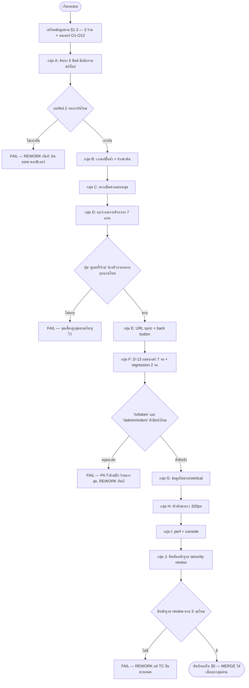

> **โมดูล:** M00058-OrderListSearch
> **ประเภทเอกสาร:** Test Case
> **เวอร์ชัน:** 1.0
> **วันที่จัดทำ:** 2026-08-24
> **สถานะ:** Draft — ยังไม่ได้รันสักเคส (สถานะเริ่มต้นของทุกเคสคือ "ยังไม่ทดสอบ")
> **เจ้าของเอกสาร:** QA (ดู [[Feature-Docs-Ownership]])

# Test Case: ค้นหาในหน้ารายการคำสั่งซื้อ + เลิกปิดบังเบอร์โทรฝั่งผู้ขาย

---

## 1. Overview

ชุดทดสอบนี้ครอบคลุม 2 ก้อนงานที่ผูกกันตาม [[BRD]]:

1. **ค้นหา** (`src/lib/order-search.ts` = SSOT) ที่หน้า `/seller/orders` — ทั้งการ์ดมือถือ
   (`OrdersList.tsx` + `OrderCard.tsx`) และตารางเดสก์ท็อป (`OrdersTable.tsx`) ต้องให้ผลตรงกันทุก
   ประการจากคำค้นเดียวกัน (D-1..D-12)
2. **ถอดมาสก์เบอร์โทร** ใน 7 จอฝั่งผู้ขาย (D-13) โดยยังคงปิดบังไว้เหมือนเดิมใน 2 จอที่ไม่ใช่ของ
   ผู้ขาย (`/o/[token]`, `/admin/orders`) — และตรวจสอบว่าจุดที่จัดเป็น "เพิ่ม PII เข้า flight
   payload ใหม่" ผ่าน `safepay-security` ตามที่ D-14 บังคับ (D-13/D-14)

**ประเภทการทดสอบ:** Functional (browser click-through) — ไม่ใช่ unit/regression อัตโนมัติ

**สภาพแวดล้อม:** dev server ที่ user รันเองที่ `http://seller.deepth.local:4000` (ห้าม localhost —
proxy.ts route ตาม subdomain) ข้อมูลทดสอบ seed ผ่าน Prisma ตาม §1.3 ด้านล่าง

> ⚠️ **รอบนี้ QA agent ไม่รัน browser QA เอง — user ตรวจด้วยตาเองตามนโยบายประจำโปรเจกต์**
> เอกสารนี้มีหน้าที่ **ออกแบบเคสให้ครบและกดตามได้จริง** เท่านั้น ทุกเคสด้านล่างมีสถานะเริ่มต้น
> "ยังไม่ทดสอบ" — ห้ามตีความว่า "ผ่าน" จนกว่าจะมีคนรันจริงและบันทึกผลใน §5

### 1.1 สิ่งที่ **เทสยูนิตครอบไว้แล้ว** — ไม่ต้องเทสซ้ำในนี้

`src/lib/__tests__/order-search.test.ts` (32 เคส) และ `src/lib/__tests__/seller-contact-display.test.ts`
(13 เคส) พิสูจน์ตรรกะบริสุทธิ์ล้วน (input → output ของฟังก์ชัน ไม่แตะ DOM) ครบแล้วสำหรับ:

- เกณฑ์ขั้นต่ำ 2 ตัวอักษร, ช่องว่างล้วนไม่กรอง
- การจับคู่เบอร์/เลขพัสดุ/เลขคำสั่งซื้อที่เก็บคนละรูปแบบ (มีขีด/ไม่มีขีด/ช่องว่างคั่น)
- AND ข้ามคำ, คนละคำตรงคนละฟิลด์, ช่องว่างหัวท้าย/ซ้อนกันไม่เปลี่ยนผล
- คำตัวหนังสือต้องไม่ถูกตัดสัญลักษณ์ (`เสื้อ-ยืด` ต้องไม่ตรง `เสื้อยืดสีขาว`)
- ตรงเต็มค่าลอยบนสุด + stable partition (รวมเคสชื่อผู้ซื้อ/สินค้าที่ตรงเป๊ะ **ไม่นับ** เป็นตรงเต็มค่า)
- ออเดอร์ข้อมูลไม่ครบ (ไม่พัง), ร้านไม่มีแกนพัสดุ (`shipment` เป็น `undefined`)
- ตัวนับ `countMatchingOrders` ใช้เกณฑ์เดียวกับตัวกรอง
- `sellerContactDisplay`/`sellerContactOrNull` คืนค่าเต็มเสมอ + ไม่มีอักขระปิดบังหลุดออกมา
- **สแกนซอร์สยืนยัน** `/o/[token]` และ `/admin/orders` ยังเรียก `order-pii-mask.ts`/`maskContact`
  เดิมอยู่ ไม่มีไฟล์นอกฝั่งผู้ขายเรียก `sellerContactDisplay`

ชุดทดสอบนี้จึงเน้นเฉพาะ **สิ่งที่ต้องกดบนหน้าจอจริงถึงจะเห็น**: การเรนเดอร์/ไฮไลต์ตำแหน่งจริงบน DOM,
parity ระหว่าง 2 breakpoint ที่เป็นคนละ component กัน, URL sync + ปุ่ม back, empty-state ที่ต้องกด
ปุ่มแล้วเห็นตัวกรองถูกล้างจริง, การกางรายการสินค้าอัตโนมัติ, สัญญาณภาพของ "ตรงเต็มค่า", และเบอร์เต็ม
ที่ต้องเห็นจริงบน 7 หน้าจอ (cross-screen consistency ที่ unit test มองไม่เห็นเพราะเป็นคนละไฟล์/คนละ
component)

### 1.2 ขอบเขต

**In scope:** `/orders` (มือถือ+เดสก์ท็อป), `/customers`, `/dashboard`, `/reviews`, `/bookings/[token]`,
`/orders/new` (แผงเลือกลูกค้า), แผงลูกค้าในห้องแชท (`/inbox/[conversationId]`)

**Out of scope:** fuzzy matching (ไม่มีในระบบ), saved search, pagination/server-side query ใหม่,
`(buyer-app)/orders`, การเปลี่ยนสิทธิ์/แพ็กเกจใด ๆ — ดู BRD §5/§7 สำหรับรายการเต็ม

### 1.3 ข้อมูลตั้งต้นที่ต้องเตรียม (Prisma seed หรือสร้างผ่าน UI)

ต้องมี **3 ร้าน** (`Shop.vertical` ต่างกัน) เพื่อครอบทุกแกน:

| ร้าน | vertical | ใช้ทดสอบ |
|------|----------|----------|
| **ร้าน A** (ร้านหลัก) | `ONLINE_SALES` | ค้นหาทุกฟิลด์ (มีแกนพัสดุ), หน้า `/orders` `/customers` `/dashboard` `/reviews` `/orders/new` `/inbox` |
| **ร้าน B** | `SERVICE_QUEUE` | ไม่มีคอลัมน์พัสดุ/แกนพัสดุ (TC-045/046) |
| **ร้าน C** | `LODGING` | หน้า `/bookings/[token]` (TC-037) |

**ออเดอร์ในร้าน A ต้องมีครบทุกแบบนี้** (สร้างผ่านฟอร์ม `/orders/new` หรือ Prisma `order.create`):

| # | ลักษณะ | ทำไมต้องมี |
|---|--------|-----------|
| O1 | `buyerPhone`/`buyerContact` เก็บแบบ **มีขีด** เช่น `081-234-5678` | TC-011 (พิมพ์ไม่มีขีดต้องเจอ) |
| O2 | `buyerPhone`/`buyerContact` เก็บแบบ **ไม่มีขีด** เช่น `0899999999` | TC-010 (พิมพ์มีขีดต้องเจอ) — prod มีข้อมูลทั้งสองแบบปนกันจริง |
| O3 | ชื่อผู้ซื้อ **ซ้ำกับใบอื่น** เป๊ะ (เช่น "สมชาย ใจดี" 2 ใบ) | TC-019 (ชื่อตรงเป๊ะห้ามลอยขึ้นบนสุด) |
| O4 | มีสินค้า **≥4 รายการ** ในใบเดียว โดยสินค้าที่ตรงคำค้นอยู่ที่ตำแหน่ง 3 ขึ้นไป (0-indexed ≥2) | TC-007/024 (auto-expand เดสก์ท็อป — ยุบที่ 2 รายการแรก) |
| O5 | มีสินค้า **≥3 รายการ** โดยสินค้าที่ตรงคำค้นอยู่ตำแหน่งที่ 2 ขึ้นไป | TC-007/008 (auto-expand มือถือ — ยุบที่ 1 รายการแรก) |
| O6 | เปิดพัสดุแล้ว มีเลขพัสดุจริง (เช่น `TH1234567890`) | TC-005/044 |
| O7 | **ไม่มี** `buyerPhone` เลย (null) | TC-043 |
| O8 | **ไม่มี**เลขพัสดุ (ยังไม่เปิดพัสดุ) | TC-044 |
| O9 | เลขคำสั่งซื้อ (โค้ด 8 หลักจาก `publicToken`) **มีตัวอักษรปนกับตัวเลข** (เช่นโค้ดลงท้าย `FB1`) | TC-012 |
| O10 | ชื่อผู้ซื้อยาว **≥34 ตัวอักษร** (ไม่มีวรรค เช่น `"ธนวัฒน์เศรษฐศิริกุลชัยรัตนากรบดินทร์เดชานุภาพ"`) | TC-047 |
| O11 | มีสินค้าชื่อยาว **≥34 ตัวอักษร** ไม่มีวรรค | TC-048 |
| O12 | อยู่ในสถานะ/กองพัสดุที่ต่างจาก O1–O11 อย่างน้อย 1 ใบ (เช่นสถานะ "ยกเลิก" หรือกอง "รอเลขพัสดุ") — ใช้ทดสอบ empty-state ที่เกิดจากตัวกรอง | TC-020–026 |

**ลูกค้าคนเดียวกัน** ต้องมีประวัติครบใน 3 จุดอย่างน้อย เพื่อเทียบเบอร์ข้าม 7 จอ (TC-040): มีออเดอร์
≥1 ใบ, มีรีวิว ≥1 ใบ, และมีห้องแชทที่ผูก `Customer` แล้ว (ผ่าน `ExternalContact`/`Customer.userId`)

**ร้าน B (SERVICE_QUEUE):** มีออเดอร์ประเภทคิวงานอย่างน้อย 2 ใบ พร้อมชื่อบริการที่ค้นหาได้

**ร้าน C (LODGING):** มีใบจอง (`Order.type='BOOKING'`) อย่างน้อย 1 ใบ ที่มี `buyerContact` เต็มค่า

---

## 2. Test Scenarios

### กลุ่ม A — ค้นหา 5 ฟิลด์ Happy Path (มือถือ + เดสก์ท็อป parity)

### TC-001: ค้นหาด้วยเลขคำสั่งซื้อเต็ม — มือถือ

- **Linked to:** FR-OLS-01, FR-OLS-08
- **Precondition:** ร้าน A มีออเดอร์ O1 ที่รู้เลขคำสั่งซื้อที่แสดงบนจอ (รูปแบบ `DP2569...`)
- **Steps:**
  1. เปิด `http://seller.deepth.local:4000/orders` บนหน้าจอ <1024px (มือถือ/แท็บเล็ต)
  2. พิมพ์เลขคำสั่งซื้อเต็มของ O1 ลงช่องค้นหาบนหัวสติกกี้
- **Expected Result:** เหลือการ์ดของ O1 ใบเดียว (หรือใบที่ตรงคำค้นเท่านั้น) · ตัวเลขคำสั่งซื้อบนมุมขวา
  บนของการ์ดถูกไฮไลต์พื้นน้ำเงินอ่อนตรงตำแหน่งที่พิมพ์

### TC-002: ค้นหาด้วยเลขคำสั่งซื้อเต็ม — เดสก์ท็อป (parity กับ TC-001)

- **Linked to:** FR-OLS-01, FR-OLS-02, FR-OLS-08
- **Precondition:** เหมือน TC-001
- **Steps:**
  1. เปิด `/orders` บนจอ ≥1280px
  2. พิมพ์คำค้น **เดียวกันเป๊ะ** กับ TC-001 ลงช่องค้นหาซ้ายบนของตาราง
- **Expected Result:** ชุดใบที่เหลือ **ตรงกับ TC-001 เป๊ะ** (จำนวนใบ, ใบไหนบ้าง) · เลขคำสั่งซื้อ
  (ลิงก์สีน้ำเงินที่แถบหัวกลุ่ม) ถูกไฮไลต์พื้นน้ำเงินอ่อนโดยตัวหนังสือยังเป็นสีน้ำเงินเดิม
  (ไม่ใช่สองเฉด — ดู TC-013)

### TC-003: ค้นหาด้วยชื่อผู้ซื้อ — มือถือ + เดสก์ท็อป

- **Linked to:** FR-OLS-01, FR-OLS-02, FR-OLS-08
- **Precondition:** ทราบชื่อผู้ซื้อของ O1
- **Steps:**
  1. พิมพ์ชื่อผู้ซื้อ (บางส่วนก็ได้ เช่น 3 ตัวอักษรแรก) บนมือถือ — บันทึกชุดผลลัพธ์
  2. พิมพ์คำเดียวกันบนเดสก์ท็อป — เทียบชุดผลลัพธ์
- **Expected Result:** ชุดออเดอร์ที่เจอ **เท่ากันทั้ง 2 จอ** · ชื่อผู้ซื้อถูกไฮไลต์ทั้งบนการ์ด (ใต้อวตาร)
  และบนตาราง (คอลัมน์ "ลูกค้า")

### TC-004: ค้นหาด้วยเบอร์โทรตรงเป๊ะ — มือถือ + เดสก์ท็อป

- **Linked to:** FR-OLS-01, FR-OLS-02, FR-OLS-08, FR-OLS-11 (ต้องเป็นเบอร์เต็ม)
- **Precondition:** ทราบเบอร์เต็มของ O1
- **Steps:**
  1. พิมพ์เบอร์เต็มของ O1 ตามที่เก็บในฐาน (เป๊ะทุกตัวอักษรรวมขีดถ้ามี) บนมือถือ
  2. พิมพ์คำเดียวกันบนเดสก์ท็อป
- **Expected Result:** เจอใบ O1 ทั้ง 2 จอ · **มือถือ**: เบอร์แสดงอยู่ในแถบ meta ใต้ชื่อผู้ซื้อ (คั่นด้วย
  จุด `·` กับช่องทาง/วิธีชำระ) และถูกไฮไลต์ · **เดสก์ท็อป**: เบอร์แสดงอยู่ใต้ชื่อผู้ซื้อในคอลัมน์
  "ลูกค้า" และถูกไฮไลต์ · เบอร์ที่เห็นเป็น**ค่าเต็ม ไม่มีจุด/ดาวปิดบังเลย**

### TC-005: ค้นหาด้วยเลขพัสดุ — มือถือ + เดสก์ท็อป

- **Linked to:** FR-OLS-01, FR-OLS-02, FR-OLS-08
- **Precondition:** O6 มีเลขพัสดุ
- **Steps:**
  1. พิมพ์เลขพัสดุเต็มของ O6 บนมือถือ
  2. พิมพ์คำเดียวกันบนเดสก์ท็อป
- **Expected Result:** เจอใบ O6 ทั้ง 2 จอ · เลขพัสดุถูกไฮไลต์ (มือถือ = บรรทัดพัสดุใต้รายการสินค้า,
  เดสก์ท็อป = ใต้บล็อก "จัดส่งโดย" ในคอลัมน์ที่อยู่จัดส่ง) — ปุ่มคัดลอกเลขพัสดุข้าง ๆ ยังกดได้ปกติ

### TC-006: ค้นหาด้วยชื่อสินค้าที่แสดงอยู่แล้ว (ไม่ได้ถูกยุบซ่อน)

- **Linked to:** FR-OLS-01, FR-OLS-02, FR-OLS-08
- **Precondition:** ใบใดใบหนึ่งมีสินค้าอยู่ในตำแหน่งที่ยังไม่ถูกยุบ (รายการแรกของมือถือ / 2 รายการแรก
  ของเดสก์ท็อป)
- **Steps:**
  1. พิมพ์ชื่อสินค้านั้น (บางส่วน) บนมือถือ แล้วบนเดสก์ท็อป
- **Expected Result:** เจอใบเดียวกันทั้ง 2 จอ · ชื่อสินค้าถูกไฮไลต์ในบรรทัดที่แสดงอยู่แล้วโดยไม่ต้องกด
  อะไรเพิ่ม

### TC-007: ค้นหาด้วยชื่อสินค้าที่ถูกยุบซ่อนอยู่ → กางอัตโนมัติ (เดสก์ท็อป)

- **Linked to:** FR-OLS-08 (ไม่ได้แสดงอยู่บนจอ → ต้องหาให้เจอ)
- **Precondition:** O4 (สินค้า ≥4 ชิ้น, ชิ้นที่ตรงคำค้นอยู่ตำแหน่ง 3 ขึ้นไป)
- **Steps:**
  1. เปิด `/orders` เดสก์ท็อป (ยังไม่พิมพ์คำค้น) — สังเกตว่าคอลัมน์ "รายการสินค้า" ของ O4 โชว์แค่ 2
     รายการแรก + ลิงก์ "ดูเพิ่มเติม (+N รายการ)"
  2. พิมพ์ชื่อสินค้าที่อยู่ในรายการที่ถูกยุบไว้ (ตำแหน่ง 3+)
- **Expected Result:** แถวของ O4 **กางรายการสินค้าที่ซ่อนไว้ออกมาเองทันที** (ไม่ต้องกด "ดูเพิ่มเติม")
  โดยสินค้าที่ตรงคำค้นถูกไฮไลต์อยู่ในนั้น

### TC-008: กางอัตโนมัติแล้ว กดย่อกลับเองต้องย่อได้จริง

- **Linked to:** FR-OLS-08 (ผลข้างเคียงของ auto-expand — ต้องไม่ล็อกผู้ใช้ไว้)
- **Precondition:** ต่อจาก TC-007 (แถวกางอัตโนมัติอยู่)
- **Steps:**
  1. คำค้นยังอยู่เหมือนเดิม (อย่าล้าง) — กดลิงก์ "ย่อรายการ" ที่แถว O4
- **Expected Result:** รายการยุบกลับเหลือ 2 รายการแรกจริง **และไม่เด้งกางกลับเอง** แม้คำค้นที่ทำให้มัน
  กางยังอยู่ในช่องค้นหา (ทดสอบซ้ำแบบเดียวกันบนมือถือกับ O5 — ยุบที่ 1 รายการแรก, ลิงก์ "ดูเพิ่มเติม/ย่อ")

### TC-009: หลายคำ AND ข้ามคนละฟิลด์

- **Linked to:** FR-OLS-03
- **Precondition:** O1 มีทั้งชื่อผู้ซื้อที่รู้จักและสินค้าที่รู้จัก
- **Steps:**
  1. พิมพ์ `<คำแรกของชื่อผู้ซื้อ> <คำหนึ่งจากชื่อสินค้า>` (คั่นด้วยช่องว่าง 1 ครั้ง) บนมือถือและเดสก์ท็อป
- **Expected Result:** เจอเฉพาะ O1 (ใบที่ตรงทั้งสองคำ) — ใบที่ตรงแค่คำใดคำหนึ่งไม่โผล่ ทั้ง 2 จอให้ผล
  เท่ากัน

### TC-010: เบอร์เก็บแบบไม่มีขีด พิมพ์แบบมีขีด → ต้องเจอ + ไฮไลต์ทั้งก้อน

- **Linked to:** FR-OLS-04, FR-OLS-08
- **Precondition:** O2 (`buyerContact` ไม่มีขีด เช่น `0899999999`)
- **Steps:**
  1. พิมพ์เบอร์แบบมีขีด (เช่น `089-999-9999`) บนมือถือและเดสก์ท็อป
- **Expected Result:** เจอ O2 ทั้ง 2 จอ · เบอร์ที่แสดงบนจอ (รูปแบบดิบที่เก็บไว้ ไม่มีขีด) **ถูกไฮไลต์
  ทั้งก้อน** (ไม่ใช่แค่บางส่วน — เพราะตำแหน่งตรงกันแบบเป๊ะเทียบไม่ได้เมื่อสัญลักษณ์ต่างกัน)

### TC-011: เบอร์เก็บแบบมีขีด พิมพ์แบบไม่มีขีด → ต้องเจอ + ไฮไลต์ทั้งก้อน

- **Linked to:** FR-OLS-04, FR-OLS-08
- **Precondition:** O1 (`buyerContact` มีขีด เช่น `081-234-5678`)
- **Steps:**
  1. พิมพ์เบอร์ไม่มีขีดล้วน (เช่น `0812345678`) บนมือถือและเดสก์ท็อป
- **Expected Result:** เจอ O1 ทั้ง 2 จอ · เบอร์ที่แสดง (รูปแบบมีขีด) **ถูกไฮไลต์ทั้งก้อน**

### TC-012: เลขคำสั่งซื้อมีตัวอักษรปน — พิมพ์ท่อนที่มีตัวอักษร ไม่ถูกตัดสัญลักษณ์

- **Linked to:** FR-OLS-04 (คำที่มีตัวอักษรปนห้ามผ่านกติกาตัดสัญลักษณ์)
- **Precondition:** O9 (โค้ด 8 หลักลงท้ายด้วยตัวอักษร เช่น `...51043FB1`)
- **Steps:**
  1. พิมพ์ท่อนท้ายที่มีทั้งตัวเลขและตัวอักษร เช่น `51043FB1` (หรือตัวพิมพ์เล็ก `51043fb1`) บนทั้ง
     2 จอ
- **Expected Result:** เจอ O9 (เทียบแบบ substring ตรงตัว case-insensitive) — ไม่ error ไม่พัง

### TC-013: ไฮไลต์บนเลขคำสั่งซื้อ (ลิงก์สีน้ำเงิน) ต้องไม่กลายเป็นสองเฉด — เดสก์ท็อป

- **Linked to:** FR-OLS-08 (คุณภาพภาพ — `inheritColor`)
- **Precondition:** พิมพ์คำค้นที่ตรงกับเลขคำสั่งซื้อ (ต่อจาก TC-002)
- **Steps:**
  1. สังเกตสีตัวหนังสือของเลขคำสั่งซื้อที่แถบหัวกลุ่มของตารางเดสก์ท็อป (ปกติเป็นลิงก์สีน้ำเงิน)
- **Expected Result:** ตัวหนังสือยังเป็นสีน้ำเงินเดียวกับลิงก์ปกติทั้งเส้น (ไม่มีบางตัวอักษรกลายเป็น
  น้ำเงินเข้ม/อ่อนกว่าเพื่อนบ้าน) — มีแค่ **พื้นหลัง** สี่เหลี่ยมจางรอบตัวอักษรที่ตรงคำค้นเท่านั้น
  ที่เปลี่ยน

---

### กลุ่ม B — เกณฑ์ขั้นต่ำ + ล้างคำค้น

### TC-014: พิมพ์ 1 ตัวอักษร — มือถือ

- **Linked to:** FR-OLS-05
- **Precondition:** —
- **Steps:**
  1. เปิด `/orders` มือถือ พิมพ์ตัวอักษรเดียว (เช่น `ก`) ลงช่องค้นหา
- **Expected Result:** รายการยังแสดง**ครบทุกใบเหมือนไม่ได้กรอง** · ใต้ช่องค้นหาขึ้นข้อความสีเทา
  "พิมพ์อีก 1 ตัวเพื่อค้นหา" (ไม่ใช่สีแดง/error)

### TC-015: พิมพ์ 1 ตัวอักษร — เดสก์ท็อป

- **Linked to:** FR-OLS-05
- **Precondition:** —
- **Steps:**
  1. เปิด `/orders` เดสก์ท็อป พิมพ์ตัวอักษรเดียวลงช่องค้นหา
- **Expected Result:** ตารางยังแสดงครบทุกแถวเหมือนไม่ได้กรอง · **ไม่มี**ข้อความเตือน "พิมพ์อีก N ตัว"
  บนเดสก์ท็อป (ข้อความนี้ออกแบบไว้เฉพาะช่องมือถือ) — ถือเป็นพฤติกรรมปกติ ไม่ใช่บั๊ก

### TC-016: ปุ่มล้างคำค้น (×) — มือถือ + ขนาดพื้นที่แตะ

- **Linked to:** FR-OLS-09 (ผลข้างเคียง — การล้างต้องอัปเดต URL ด้วย)
- **Precondition:** พิมพ์คำค้นใด ๆ ที่กรองผลอยู่แล้วบนมือถือ
- **Steps:**
  1. กดปุ่ม × ที่ขวาของช่องค้นหา
  2. (อุปกรณ์วัด) ตรวจขนาดพื้นที่กดได้ของปุ่มนี้ผ่าน DevTools (คลิกขวา → Inspect → ดู computed
     width/height ของปุ่ม ไม่ใช่ของไอคอนข้างใน)
- **Expected Result:** ช่องค้นหาว่าง, รายการกลับมาแสดงครบ, ปุ่มหายไป (เพราะช่องว่างแล้ว) · พื้นที่กดได้
  ของปุ่ม **≥44×44px** แม้ไอคอนกากบาทที่เห็นจะเล็กกว่านั้น

### TC-017: ปุ่มล้างคำค้น (×) — เดสก์ท็อป

- **Linked to:** FR-OLS-09
- **Precondition:** พิมพ์คำค้นใด ๆ บนเดสก์ท็อป
- **Steps:**
  1. กดปุ่ม × ในช่องค้นหาของตาราง
- **Expected Result:** ช่องค้นหาว่าง, ตารางกลับมาแสดงครบ, หน้าตาราง reset กลับหน้า 1 (pagination)

---

### กลุ่ม C — ตรงเต็มค่าลอยขึ้นบนสุด

### TC-018: เบอร์ตรงเต็มค่า → ลอยขึ้นบนสุด + สัญญาณภาพ

- **Linked to:** FR-OLS-07
- **Precondition:** จัดเรียงข้อมูลให้ O1 (เบอร์ที่จะพิมพ์) ไม่ได้อยู่แถวบนสุดของรายการปกติ (เช่น
  เป็นออเดอร์เก่าที่สุด)
- **Steps:**
  1. พิมพ์เบอร์เต็มของ O1 (ตรงเป๊ะ ไม่ใช่บางส่วน) บนมือถือ — สังเกตตำแหน่ง O1 ในรายการ
  2. ทำซ้ำบนเดสก์ท็อป
- **Expected Result:** **มือถือ:** การ์ด O1 มี **ring บาง ๆ สีน้ำเงิน** รอบขอบการ์ด และอยู่บนสุดของ
  รายการที่กรองแล้ว (ก่อนใบที่ตรงแบบไม่เต็มค่า ถ้ามี) · **เดสก์ท็อป:** แถบหัวกลุ่มของ O1 มี**พื้นหลัง
  จางสีน้ำเงิน** (`bg-primary/5`) และอยู่บนสุดของตาราง

### TC-019: ชื่อผู้ซื้อตรงเป๊ะ (ซ้ำกับใบอื่น) → ไม่ลอยขึ้นบนสุด

- **Linked to:** FR-OLS-07 (negative — ชื่อไม่ใช่ identifier)
- **Precondition:** O3 (2 ใบชื่อผู้ซื้อ "สมชาย ใจดี" เป๊ะ)
- **Steps:**
  1. พิมพ์ชื่อเต็ม "สมชาย ใจดี" (ตรงเป๊ะทั้งก้อน) บนมือถือและเดสก์ท็อป
- **Expected Result:** เจอทั้ง 2 ใบ แต่**ไม่มีใบไหนมี ring/พื้นหลังจาง** — ลำดับของทั้งคู่ยังคงเดิม
  ตามที่เคยเรียงอยู่ก่อนพิมพ์คำค้น (ไม่ถูกยกขึ้น)

---

### กลุ่ม D — ผลว่างเพราะตัวกรอง (D-4 — ความเสี่ยงสูงสุดของฟีเจอร์)

### TC-020: ตัวกรองสถานะ (แท็บ/ชิป) บังผล — มือถือ

- **Linked to:** FR-OLS-06
- **Precondition:** O12 (ใบที่ตรงคำค้นแต่คนละสถานะกับที่จะกรอง) — เลือกคำค้นที่ตรงกับใบซึ่งอยู่นอก
  สถานะ/กองที่กำลังจะเลือก
- **Steps:**
  1. เปิด `/orders` มือถือ กดชิปสถานะ/กองพัสดุใดชิปหนึ่งที่ **ไม่ใช่ "ทั้งหมด"**
  2. พิมพ์คำค้นที่ตรงกับใบซึ่งอยู่คนละกอง (จะไม่มีผลลัพธ์ในกองที่เลือกไว้)
  3. อ่านข้อความ empty state แล้วกดปุ่ม "ดูผลทั้งร้าน (N)"
- **Expected Result:** ก่อนกด: จอว่างพร้อมข้อความ "ไม่พบในตัวกรองที่เลือกไว้ · พบ N รายการในทั้งร้าน"
  (N > 0) และปุ่ม "ดูผลทั้งร้าน (N)" · หลังกด: **ชิปกลับไปที่ "ทั้งหมด" จริง** (ไม่ใช่แค่ URL เปลี่ยน)
  และเห็นใบที่ค้นหาปรากฏขึ้น (จำนวนที่เห็นตรงกับ N ที่ปุ่มบอกไว้) — คำค้นยังอยู่ในช่องเหมือนเดิม

### TC-021: ตัวกรองกองพัสดุ (stage chip) บังผล — มือถือ

- **Linked to:** FR-OLS-06
- **Precondition:** ร้าน A มีแกนกองพัสดุ (ONLINE_SALES) — เลือกใบที่ตรงคำค้นแต่อยู่คนละกอง
- **Steps:**
  1. กดชิปกองพัสดุใดกองหนึ่ง (เช่น "รอเลขพัสดุ") ที่ไม่ตรงกับใบเป้าหมาย
  2. พิมพ์คำค้นที่ตรงใบซึ่งอยู่คนละกอง แล้วกด "ดูผลทั้งร้าน"
- **Expected Result:** เหมือน TC-020 — ปุ่มกดแล้วชิปกองพัสดุกลับเป็น "ทั้งหมด" และเห็นผลลัพธ์จริง

### TC-022: ตัวกรองประเภทออเดอร์ (โมดัลตัวกรองมือถือ) บังผล

- **Linked to:** FR-OLS-06
- **Steps:**
  1. เปิดโมดัลตัวกรอง (ไอคอนช่องกรอง) → เลือก "ประเภทออเดอร์" ที่ไม่ตรงกับใบเป้าหมาย → กด "ดูผลลัพธ์"
  2. พิมพ์คำค้นที่ตรงใบซึ่งประเภทไม่ตรงกับที่เลือกไว้ แล้วกด "ดูผลทั้งร้าน"
- **Expected Result:** จอว่างพร้อม N ใบในทั้งร้าน ตามที่คาด · กดปุ่มแล้ว **เปิดโมดัลตัวกรองไปดูซ้ำ** —
  ต้องเห็นว่า "ประเภทออเดอร์" กลับไปเป็น "ทุกประเภท" แล้วจริง (ไม่ใช่แค่ผลลัพธ์โผล่แต่ค่าในโมดัลค้าง)

### TC-023: ตัวกรองช่วงเวลา (โมดัลตัวกรองมือถือ) บังผล

- **Linked to:** FR-OLS-06
- **Steps:**
  1. เปิดโมดัลตัวกรอง → เลือกช่วงเวลาที่ไม่ครอบคลุมใบเป้าหมาย (เช่น "7 วันล่าสุด" ขณะใบเป้าหมายเก่ากว่า)
  2. พิมพ์คำค้นที่ตรงใบเป้าหมาย แล้วกด "ดูผลทั้งร้าน"
- **Expected Result:** จอว่างพร้อม N ใบ ตามที่คาด · หลังกดปุ่ม เปิดโมดัลซ้ำต้องเห็นช่วงเวลากลับเป็น
  "ทั้งหมด"

### TC-024: ตัวกรองสถานะ (dropdown เดสก์ท็อป) บังผล

- **Linked to:** FR-OLS-06
- **Steps:**
  1. เดสก์ท็อป: เลือก dropdown "สถานะ" เป็นสถานะที่ไม่ตรงกับใบเป้าหมาย
  2. พิมพ์คำค้นที่ตรงใบเป้าหมาย แล้วกด "ดูผลทั้งร้าน (N)" ใน empty state
- **Expected Result:** จอว่างพร้อม N ใบ · หลังกดปุ่ม dropdown "สถานะ" กลับไปแสดง "สถานะ" เฉย ๆ (ค่า
  default ไม่มีตัวเลือกค้าง) และตารางแสดงผลลัพธ์จริง

### TC-025: ตัวกรองขนส่ง (dropdown เดสก์ท็อป) บังผล

- **Linked to:** FR-OLS-06
- **Precondition:** ร้าน A มีออเดอร์อย่างน้อย 2 ขนส่งต่างกัน (dropdown "ขนส่ง" โผล่เมื่อมี >1 ตัวเลือก)
- **Steps:**
  1. เลือก dropdown "ขนส่ง" เป็นขนส่งที่ไม่ตรงกับใบเป้าหมาย
  2. พิมพ์คำค้นที่ตรงใบเป้าหมาย แล้วกด "ดูผลทั้งร้าน"
- **Expected Result:** เหมือน TC-024 — ล้างค่า dropdown ขนส่งกลับเป็นค่าเริ่มต้นจริง

### TC-026: ตัวกรองช่วงเวลา (dropdown เดสก์ท็อป) บังผล

- **Linked to:** FR-OLS-06
- **Steps:**
  1. เลือกช่วงเวลาบนเดสก์ท็อปที่ไม่ครอบคลุมใบเป้าหมาย
  2. พิมพ์คำค้นที่ตรงใบเป้าหมาย แล้วกด "ดูผลทั้งร้าน"
- **Expected Result:** ล้างช่วงเวลากลับเป็น "ทั้งหมด" จริงหลังกดปุ่ม

### TC-027: ผลว่างจริง (N = 0) — ไม่มีปุ่ม/ข้อความ "ในทั้งร้าน" โผล่มาหลอก

- **Linked to:** FR-OLS-06 (negative)
- **Precondition:** ไม่มีตัวกรองใดเปิดอยู่ (สถานะ "ทั้งหมด")
- **Steps:**
  1. พิมพ์คำค้นที่ไม่มีอยู่จริงในร้านเลย (เช่นสตริงสุ่ม `zzqqxx999`) บนมือถือและเดสก์ท็อป
- **Expected Result:** ขึ้นข้อความ "ไม่พบ{ประเภทออเดอร์}ที่ตรงกับ ..." **โดยไม่มี**บรรทัด "พบ N รายการ
  ในทั้งร้าน" และ**ไม่มี**ปุ่ม "ดูผลทั้งร้าน" ปรากฏเลยทั้ง 2 จอ

---

### กลุ่ม E — URL sync + ปุ่ม back

### TC-028: พิมพ์แล้วรอ ~0.5 วิ → URL อัปเดตด้วย `?q=`

- **Linked to:** FR-OLS-09
- **Steps:**
  1. เปิด `/orders` (URL ไม่มี `?q=`) พิมพ์คำค้น 3-4 ตัวอักษรต่อเนื่องกันเร็ว ๆ (ไม่หยุด)
  2. ระหว่างพิมพ์ สังเกต address bar — ต้อง**ไม่กระตุกจนพิมพ์ไม่ทัน**
  3. หยุดพิมพ์ รอ ~0.5 วินาที แล้วดู URL
- **Expected Result:** ระหว่างพิมพ์ ตัวอักษรขึ้นในช่องค้นหาทันทีทุกตัวไม่มีสะดุด (URL ยังไม่เปลี่ยน
  ระหว่างนั้น) · หลังหยุดพิมพ์ ~400ms URL เปลี่ยนเป็น `.../orders?q=<คำค้น>` (เข้ารหัส URL ถูกต้อง)

### TC-029: ปุ่ม back ของเบราว์เซอร์ไม่ต้องกดหลายสิบครั้ง

- **Linked to:** FR-OLS-09 (`history.replaceState` ไม่ใช่ `pushState`)
- **Precondition:** เข้าหน้า `/orders` จากหน้าอื่น (เช่น `/dashboard`) มาก่อน
- **Steps:**
  1. ที่ `/orders` พิมพ์คำค้นยาว ๆ ทีละตัวอักษรช้า ๆ (ให้ debounce เขียน URL ทันหลายรอบ เช่น พิมพ์ 8-10
     ตัวอักษร เว้นจังหวะ >500ms ระหว่างคำ)
  2. กดปุ่ม back ของเบราว์เซอร์ **1 ครั้ง**
- **Expected Result:** กด back ครั้งเดียวออกจาก `/orders` ไปหน้าก่อนหน้าทันที (ไม่ต้องกดซ้ำหลายรอบ
  เพราะแต่ละตัวอักษรไม่ได้สร้าง history entry ของตัวเอง)

### TC-030: เปิดลิงก์ที่มี `?q=` มาใหม่ → เจอผลเดิม

- **Linked to:** FR-OLS-09
- **Precondition:** ทราบคำค้นที่ให้ผลลัพธ์ที่คาดเดาได้ (เช่นเลขคำสั่งซื้อของ O1)
- **Steps:**
  1. เปิดแท็บใหม่ พิมพ์ URL ตรง ๆ `http://seller.deepth.local:4000/orders?q=<คำค้นของ O1>`
- **Expected Result:** หน้าโหลดมาโดยช่องค้นหา**แสดงคำค้นนั้นทันที** (ไม่ต้องพิมพ์ซ้ำ) และรายการถูก
  กรองเหลือเฉพาะใบที่ตรงอยู่แล้วตั้งแต่โหลดครั้งแรก — ทดสอบทั้งเปิดบนหน้าจอมือถือและเดสก์ท็อป

### TC-031: สลับ breakpoint ระหว่างค้นหา → คำค้นต้องยังอยู่

- **Linked to:** FR-OLS-02 (state เดียว)
- **Steps:**
  1. เปิด `/orders` บนหน้าจอกว้าง ≥1280px พิมพ์คำค้นใด ๆ ที่กรองผลได้
  2. ย่อขนาดหน้าต่างเบราว์เซอร์ (หรือ DevTools responsive mode) ให้ต่ำกว่า 1024px โดย**ไม่รีโหลด
     หน้า**
- **Expected Result:** พอข้ามมาที่มุมมองมือถือ ช่องค้นหาบนหัวสติกกี้**แสดงคำค้นเดิม**และรายการที่กรอง
  ไว้เหมือนกับตอนอยู่บนเดสก์ท็อปทุกประการ (เพราะเป็น React state ก้อนเดียว ไม่ใช่ mount ใหม่คนละตัว)

---

### กลุ่ม F — D-13: ถอดมาสก์เบอร์โทร 7 จอ + คงปิดบัง 2 จอ

### TC-032: `/orders` มือถือ (การ์ด) — เบอร์เต็ม

- **Linked to:** FR-OLS-11
- **Precondition:** O1 มีเบอร์
- **Steps:**
  1. เปิด `/orders` มือถือ ไม่ต้องค้นหา — ดูการ์ดของ O1
- **Expected Result:** แถบ meta ใต้ชื่อผู้ซื้อแสดงเบอร์**เต็มค่า** ไม่มี `•` หรือดาวปิดบังเลยสักตัว

### TC-033: `/orders` เดสก์ท็อป (ตาราง) — เบอร์เต็ม

- **Linked to:** FR-OLS-11
- **Steps:**
  1. เปิด `/orders` เดสก์ท็อป — ดูคอลัมน์ "ลูกค้า" ของ O1
- **Expected Result:** บรรทัดใต้ชื่อผู้ซื้อแสดงเบอร์เต็มค่า

### TC-034: `/customers` — เบอร์เต็ม + ค้นด้วยเบอร์เต็มเจอ

- **Linked to:** FR-OLS-11, FR-OLS-01 (ผลพลอยได้)
- **Steps:**
  1. เปิด `/customers` — ดูคอลัมน์ติดต่อของลูกค้าที่ตรงกับ O1
  2. พิมพ์เบอร์เต็มของลูกค้าคนนั้นในช่องค้นหาของหน้า `/customers`
- **Expected Result:** คอลัมน์ติดต่อแสดงเบอร์เต็ม (ไม่ใช่ `•••1234`) **และ**การค้นหาด้วยเบอร์เต็มเจอ
  ลูกค้าคนนั้น (ก่อนหน้านี้ค้นไม่เจอเพราะคอลัมน์ถูกปิดบัง — regression check)

### TC-035: หน้าแรก `/dashboard` — รายการ "ออเดอร์ล่าสุด" เบอร์เต็ม

- **Linked to:** FR-OLS-11
- **Precondition:** O1 อยู่ใน 8 ออเดอร์ล่าสุดของร้าน
- **Steps:**
  1. เปิด `/dashboard` — ดูวิดเจ็ต "ออเดอร์ล่าสุด"
- **Expected Result:** ป้ายชื่อ/ติดต่อผู้ซื้อของ O1 แสดงเบอร์เต็ม

### TC-036: `/reviews` — เบอร์เต็มของผู้รีวิว

- **Linked to:** FR-OLS-11
- **Precondition:** มีรีวิวจากผู้ซื้อที่รีวิวแบบ guest (ไม่มีบัญชี — ใช้ `reviewerContact`)
- **Steps:**
  1. เปิด `/reviews` — ดูชื่อ/ติดต่อผู้รีวิวที่ไม่มีบัญชีสมาชิก
- **Expected Result:** แสดงเบอร์/ติดต่อเต็มค่า ไม่ปิดบัง

### TC-037: `/bookings/[token]` (ร้าน LODGING) — เบอร์เต็มของผู้เข้าพัก

- **Linked to:** FR-OLS-11
- **Precondition:** ร้าน C มีใบจองที่มี `buyerContact`
- **Steps:**
  1. เปิดใบจองของร้าน C ที่ `/bookings/[token]`
- **Expected Result:** ข้อมูลติดต่อผู้เข้าพักแสดงเต็มค่า

### TC-038: แผงเลือกลูกค้าตอนสร้างออเดอร์ (`/orders/new`) — เบอร์เต็ม

- **Linked to:** FR-OLS-11
- **Steps:**
  1. เปิด `/orders/new` (ร้าน A) พิมพ์ชื่อ/เบอร์บางส่วนของลูกค้าเดิมลงช่อง "ชื่อ-เบอร์ลูกค้า" จนดรอปดาวน์
     รายการลูกค้าเดิมโผล่ขึ้น
- **Expected Result:** แถวลูกค้าเดิมในดรอปดาวน์แสดงเบอร์เต็มค่า (ไม่ใช่รูปแบบ `081•••5678`)

### TC-039: แผงลูกค้าในห้องแชท (`CustomerPanel`) — เบอร์เต็ม

- **Linked to:** FR-OLS-11
- **Precondition:** มีห้องแชทที่ผูก `Customer` แล้ว (มีเบอร์)
- **Steps:**
  1. เปิด `/inbox/[conversationId]` ของห้องที่ผูกลูกค้าแล้ว → เปิดแผงข้อมูลลูกค้า (CustomerPanel)
- **Expected Result:** บรรทัด "เชื่อมกับบัญชีลูกค้าแล้ว · {เบอร์}" แสดงเบอร์เต็มค่า

### TC-040: เบอร์ลูกค้าคนเดียวกัน ต้องเหมือนกันทุกตัวอักษรทั้ง 7 จอ

- **Linked to:** FR-OLS-11, FR-OLS-02 (ความสม่ำเสมอ — cross-check รวม)
- **Precondition:** ลูกค้าคนเดียวกันตาม §1.3 (มีออเดอร์+รีวิว+ห้องแชทผูกไว้)
- **Steps:**
  1. เปิดครบทั้ง 7 จอ (TC-032 ถึง TC-039 ไม่รวม TC-037 ถ้าลูกค้าคนนี้ไม่ใช่ร้าน C) ของลูกค้าคนเดียวกัน
  2. คัดลอก/จดเบอร์ที่เห็นในแต่ละจอ
- **Expected Result:** เบอร์ที่เห็นใน**ทุกจอเหมือนกันเป๊ะทุกตัวอักษร** (รูปแบบเดียวกับที่เก็บในฐาน —
  ไม่มีจอไหนตัดบางส่วนหรือจัดรูปแบบต่างจากจออื่น)

### TC-041: [Regression] `/o/[token]` (จอผู้ซื้อสาธารณะ) — ยังปิดบังเบอร์เหมือนเดิม

- **Linked to:** FR-OLS-12
- **Precondition:** มีลิงก์ `/o/[token]` ของ O1 (เปิดจากปุ่ม "ดูลิงก์" ในหน้ารายละเอียดออเดอร์)
- **Steps:**
  1. เปิด `http://deepth.local:4000/o/<token>` ของ O1 (โดเมนหลัก ไม่ใช่ seller subdomain)
- **Expected Result:** เบอร์ที่แสดงยังคงเป็นรูปแบบปิดบัง 3 หลักท้าย (เช่น `•••-•••-891`)
  **เหมือนก่อนงานนี้ทุกประการ** — ไม่ใช่เบอร์เต็ม

### TC-042: [Regression] `/admin/orders` — ยังปิดบังเบอร์เหมือนเดิม

- **Linked to:** FR-OLS-12
- **Precondition:** มีบัญชีแอดมิน + O1 อยู่ในระบบ
- **Steps:**
  1. เข้าสู่ระบบที่ `http://admin.deepth.local:4000` เปิดหน้า `/orders`
- **Expected Result:** คอลัมน์ติดต่อผู้ซื้อของ O1 ยังคงปิดบัง (`buyerContactMasked` แบบ 4 ตัวท้าย)
  เหมือนก่อนงานนี้ทุกประการ

---

### กลุ่ม G — ข้อมูลไม่ครบ / ขอบเขต vertical

### TC-043: ออเดอร์ไม่มีเบอร์ — ไม่พัง ไม่ตรงคำค้นเบอร์ใด ๆ

- **Linked to:** FR-OLS-01 (edge)
- **Precondition:** O7 (`buyerPhone` = null)
- **Steps:**
  1. เปิดหน้ารายละเอียด/การ์ดของ O7 — ยืนยันไม่มีเบอร์แสดง (ไม่มีบรรทัดเบอร์บนการ์ดมือถือเลย ไม่ใช่
     บรรทัดว่าง)
  2. พิมพ์เบอร์ใด ๆ ที่ **ไม่ใช่**ของ O7 — ยืนยันว่า O7 ไม่โผล่มาปนกับผลลัพธ์
- **Expected Result:** ไม่มี error/หน้าขาว · O7 ไม่มีบรรทัดเบอร์บนการ์ด (ไม่ใช่ "—" ว่างเปล่า) และไม่
  ติดผลค้นหาเบอร์ของใบอื่นเลย

### TC-044: ออเดอร์ไม่มีเลขพัสดุ — ไม่พัง

- **Linked to:** FR-OLS-01 (edge)
- **Precondition:** O8 (ยังไม่เปิดพัสดุ)
- **Steps:**
  1. พิมพ์เลขพัสดุของ O6 (คนละใบ) — ยืนยันว่า O8 ไม่ติดผล
  2. ดูการ์ด/แถวของ O8 โดยตรง (ไม่ค้นหา)
- **Expected Result:** O8 แสดง "ไม่มีหมายเลขพัสดุ" (เดสก์ท็อป) / ไม่มีบล็อกพัสดุเลย (มือถือ) ไม่ error

### TC-045: ร้านคิวงาน (SERVICE_QUEUE) — ไม่มีคอลัมน์พัสดุ ค้นหายังทำงาน

- **Linked to:** FR-OLS-01, FR-OLS-02
- **Precondition:** ร้าน B (SERVICE_QUEUE)
- **Steps:**
  1. สลับร้าน active เป็นร้าน B เปิด `/orders` ทั้งมือถือและเดสก์ท็อป
  2. ยืนยันว่าไม่มีคอลัมน์/บรรทัด "ที่อยู่จัดส่ง"/"จัดส่งโดย" เลย และไม่มี dropdown "ขนส่ง"/ชิปกองพัสดุ
  3. พิมพ์ชื่อผู้ซื้อ/เบอร์ของออเดอร์คิวงานใบหนึ่ง
- **Expected Result:** ไม่มี error/หน้าขาว (พิสูจน์ว่า `shipment=undefined` ไม่ทำให้ UI พัง) · ค้นหาด้วย
  ชื่อ/เบอร์ยังกรองได้ปกติทั้ง 2 จอ

### TC-046: ร้านคิวงาน — ค้นด้วยชื่อบริการ (เทียบเท่าชื่อสินค้า)

- **Linked to:** FR-OLS-01
- **Precondition:** ร้าน B มีออเดอร์คิวงานที่มีชื่อบริการรู้จัก
- **Steps:**
  1. พิมพ์ชื่อบริการบางส่วนที่ร้าน B บนมือถือและเดสก์ท็อป
- **Expected Result:** เจอออเดอร์คิวงานที่ตรง ทั้ง 2 จอให้ผลตรงกัน

---

### กลุ่ม H — ตัวอักษรยาวผิดปกติที่ 320px (ป้องกันบั๊กที่เคยเกิดจริงบน prod 2026-08-12)

### TC-047: ชื่อลูกค้ายาว ≥34 ตัวอักษรที่ 320px — การ์ดต้องไม่หลุดขอบจอ

- **Linked to:** cross-cutting (mobile layout)
- **Precondition:** O10 (ชื่อผู้ซื้อยาวไม่มีวรรค ≥34 ตัวอักษร)
- **Steps:**
  1. เปิด `/orders` มือถือที่ viewport กว้าง **320px** (DevTools responsive: iPhone SE หรือกำหนดเอง 320)
  2. เลื่อนไปดูการ์ดของ O10 **โดยยังไม่ค้นหา** — ยืนยันไม่มี horizontal scroll ของทั้งหน้า
  3. พิมพ์คำค้นที่ตรงกับชื่อของ O10 (เพื่อให้ไฮไลต์ทำงานด้วย) — ยืนยันซ้ำว่ายังไม่หลุดขอบ
- **Expected Result:** ชื่อลูกค้าตัดขึ้นบรรทัดใหม่/`truncate` ภายในกรอบการ์ด **ไม่ดันการ์ดกว้างเกิน
  320px** และหน้าไม่มี scrollbar แนวนอน ทั้งก่อนและหลังพิมพ์คำค้น (ไฮไลต์ไม่ทำให้กรอบขยับ)

### TC-048: ชื่อสินค้ายาว ≥34 ตัวอักษรที่ 320px — ไม่หลุดขอบจอ

- **Linked to:** cross-cutting (mobile layout)
- **Precondition:** O11 (ชื่อสินค้ายาว ≥34 ตัวอักษรไม่มีวรรค)
- **Steps:**
  1. ที่ viewport 320px เปิดการ์ดของ O11 — ยืนยันไม่มี horizontal scroll
  2. พิมพ์คำค้นที่ตรงกับชื่อสินค้านั้น (ไฮไลต์ทำงาน) — ยืนยันซ้ำ
- **Expected Result:** ชื่อสินค้าขึ้นบรรทัดใหม่ตามที่ยาว (ตาม convention "ห้าม truncate ชื่อสินค้า")
  แต่**ไม่ดันกล่องรูปสินค้า/ทั้งการ์ดล้นขอบจอ** — ทดสอบซ้ำบนเดสก์ท็อปที่คอลัมน์ "รายการสินค้า" ด้วยว่า
  ไม่ดันตารางกว้างเกินจนต้องเลื่อนแนวนอน

---

### กลุ่ม I — Cross-cutting / Non-functional

### TC-049: ไม่มีอาการหน่วงที่สังเกตได้ขณะพิมพ์ (ร้านที่มีออเดอร์เยอะที่สุดในระบบ)

- **Linked to:** FR-OLS-10 (D-9 — ต้องมีตัวเลขจริงบันทึกไว้ก่อนปิดงาน)
- **Precondition:** เลือกร้านที่มีจำนวนออเดอร์มากที่สุดในระบบตอนทดสอบ (ถาม Controller/query DB นับ
  `Order` ต่อ `shopId`) — ถ้าไม่มีร้านไหนมีออเดอร์เยอะพอที่จะสังเกตความหน่วงได้ ให้บันทึกจำนวนออเดอร์
  ที่ทดสอบจริงไว้ใน §5 ด้วย (เพื่อให้ dev ใช้ตัดสินว่าต้อง seed เพิ่มก่อนสรุปตัวเลขไหม)
- **Steps:**
  1. เปิด `/orders` ของร้านนั้น (มือถือและเดสก์ท็อป) พิมพ์คำค้นต่อเนื่องกันเร็ว ๆ 5-6 ตัวอักษร
  2. สังเกตว่าตัวอักษรขึ้นในช่องตามการพิมพ์ทันที ไม่มีอาการค้าง/กระตุกระหว่างพิมพ์
- **Expected Result:** พิมพ์ลื่น ไม่รู้สึกหน่วง — ถ้าพบอาการหน่วงที่สังเกตได้ ให้บันทึกจำนวนออเดอร์และ
  ความรู้สึกหน่วง (ประมาณกี่วินาที) ไว้ใน §5 เพื่อส่งกลับให้ dev วัดเป็นตัวเลข ms ต่อไปตามที่ D-9
  บังคับ

### TC-050: Console สะอาดตลอด flow

- **Linked to:** cross-cutting (คุณภาพทั่วไป)
- **Precondition:** เปิด DevTools → Console ก่อนเริ่ม
- **Steps:**
  1. ทำซ้ำ flow หลัก: ค้นหา (5 ฟิลด์) → ล้างคำค้น → กดตัวกรองจนว่าง → กด "ดูผลทั้งร้าน" → เปิดทั้ง 7
     จอของ D-13 → สลับ breakpoint
- **Expected Result:** ไม่มี error สีแดงใน console ตลอด flow (warning ที่มีอยู่ก่อนงานนี้แล้วไม่นับ
  แต่ต้องไม่มี error/warning **ใหม่** ที่พูดถึง `order-search`/`seller-contact-display`/
  `HighlightText`/component ที่แก้ในรอบนี้)

---

### กลุ่ม J — Security review (D-14 — ตรวจเอกสาร ไม่ใช่คลิกหน้าจอ)

### TC-051: [เอกสาร] ยืนยันหลักฐาน `safepay-security` sign-off สำหรับ 5 จุดที่เพิ่ม PII ใหม่

- **Linked to:** FR-OLS-13
- **Precondition:** —
- **Steps:**
  1. ตรวจ commit message / เอกสารสรุปงานของ feature 00058 ว่ามีการอ้างผล review ของ `safepay-security`
     สำหรับ 5 จุด: `customers/page.tsx`, `dashboard/page.tsx`, `reviews/page.tsx`,
     `bookings/[token]/page.tsx`, `inbox/[conversationId]/page.tsx`
- **Expected Result:** พบหลักฐานการ review ที่ระบุชัดว่าผ่านแล้ว (ไม่ใช่แค่คำว่า "ผ่านแล้ว" ลอย ๆ
  ไม่มีที่มา) — ถ้าไม่พบหลักฐาน ต้องรายงานเป็น REWORK ทันที ไม่ถือว่างานนี้พร้อม merge แม้ TC อื่น
  ผ่านหมด (BR-OLS-24/26 บังคับไว้ตรง ๆ)

---

## 3. Traceability Matrix

| AC / FR ใน [[BRD]] | Test Case | ครอบคลุมหรือไม่ |
|---------------------|-----------|------------------|
| FR-OLS-01 (ค้นหา 5 ประเภทข้อมูล) | TC-001–006, 009–012, 043–046 | Yes |
| FR-OLS-02 (ตรรกะเดียว ทั้งสองจอ) | TC-001–013, 031, 040, 045, 046 | Yes |
| FR-OLS-03 (AND ข้ามคำ substring) | TC-009 (+ หน่วย: `order-search.test.ts`) | Yes |
| FR-OLS-04 (ตัวเลขล้วนตัดสัญลักษณ์) | TC-010, TC-011, TC-012 | Yes |
| FR-OLS-05 (ขั้นต่ำ 2 ตัวอักษร) | TC-014, TC-015 | Yes |
| FR-OLS-06 (AND กับตัวกรอง + N ในทั้งร้าน) | TC-020–027 | Yes |
| FR-OLS-07 (ตรงเต็มค่าลอยบนสุด) | TC-018, TC-019 | Yes |
| FR-OLS-08 (ไฮไลต์/บอกเหตุผล) | TC-001–007, 010, 011, 013 | Yes |
| FR-OLS-09 (URL `?q=` sync) | TC-016, 017, 028–030 | Yes |
| FR-OLS-10 (client-side + วัดผลจริง) | TC-049 | Yes (บันทึกตัวเลข ไม่ใช่ pass/fail เดี่ยว) |
| FR-OLS-11 (ถอดมาสก์ 7 จุด) | TC-032–040 | Yes |
| FR-OLS-12 (จอที่ไม่ใช่ผู้ขายยังปิดบัง) | TC-041, TC-042 | Yes |
| FR-OLS-13 (security review 5 จุด) | TC-051 | Yes |
| Cross-cutting (mobile layout, console) | TC-047, TC-048, TC-050 | Yes |

> ทุก FR ใน [[BRD]] §2 ปรากฏในตารางนี้และมี TC อย่างน้อย 1 รายการ — ไม่มี FR ที่ไม่มี TC ครอบคลุม

---

## 4. Flow (ถ้ามี)

---

## 5. ผลล่าสุด

| Run | วันที่ | ผล (Pass/Fail/Blocked) | ผู้ทดสอบ (Tester) |
|-----|--------|--------------------------|---------------------|
| — | — | ยังไม่ได้รัน — เอกสารนี้เพิ่งเขียนเสร็จ (2026-08-24) ทุกเคสอยู่ในสถานะ "ยังไม่ทดสอบ" | — |

---

## 6. สรุป (Summary)

เอกสาร Test Case นี้กำหนด **ชุดเคสทดสอบ 51 เคส** ของ **ค้นหาในหน้ารายการคำสั่งซื้อ + เลิกปิดบังเบอร์
โทรฝั่งผู้ขาย (feature 00058)** ที่ trace กลับ FR-OLS-01 ถึง FR-OLS-13 ใน [[BRD]] ครบทุกข้อ โดยตั้งใจ
**ไม่ทวนสอบ**สิ่งที่เทสยูนิต 45 เคส (`order-search.test.ts` + `seller-contact-display.test.ts`) พิสูจน์
ด้วยตรรกะบริสุทธิ์แล้ว — เน้นเฉพาะสิ่งที่ต้องกดบนเบราว์เซอร์จริงถึงจะเห็น: parity ระหว่าง 2 breakpoint
ที่เป็นคนละ component, การเรนเดอร์ไฮไลต์บน DOM จริง, empty-state ที่ต้องกดปุ่มแล้วพิสูจน์ว่าตัวกรอง
ถูกล้างจริงทุกแกน (7 แกนต่างที่เก็บ state คนละที่กัน — จุดเสี่ยงสูงสุดของฟีเจอร์นี้), URL sync บนเบราว์
เซอร์จริง, และเบอร์โทรที่ต้องเห็นเหมือนกันเป๊ะใน 7 หน้าจอฝั่งผู้ขาย ขณะที่ 2 จอที่ไม่ใช่ของผู้ขายต้อง
**ยังปิดบังเหมือนเดิมทุกประการ** (regression check ที่ร้ายแรงที่สุดถ้าพลาด — PII รั่วข้ามฝั่ง)

**จุดที่ต้องระวังเป็นพิเศษเมื่อรันจริง:**
- กลุ่ม D (ผลว่างเพราะตัวกรอง) มี **7 แกนตัวกรองที่เก็บ state คนละที่** (React state ของ `OrdersList`
  × URL params `?stage=`/`?appt=`/`?apptDay=` × TanStack `columnFilters` ของ `OrdersTable`) —
  ปุ่ม "ดูผลทั้งร้าน" ต้องล้างครบทุกแกนที่เกี่ยวข้องกับ breakpoint นั้นจริง ไม่ใช่แค่บางแกน
- กลุ่ม F (TC-041/042) คือ **regression ที่ร้ายแรงที่สุด** ถ้าหลุด — ต้องเปิดยืนยันด้วยตาเสมอ ห้ามข้าม
  แม้ diff จะดูเหมือนไม่ได้แตะไฟล์เหล่านั้น (ดู FR-OLS-12 — ต้องพิสูจน์ว่า "ตั้งใจไม่แตะ" ไม่ใช่แค่
  "บังเอิญไม่ได้แตะ")
- TC-051 เป็นเคสเดียวที่ตรวจ**เอกสาร** ไม่ใช่หน้าจอ — แต่บังคับเท่ากับเคสอื่นตาม BR-OLS-24/26

**Open Questions:**
- ยังไม่มีตัวเลขวัดประสิทธิภาพจริง (ms) ตามที่ D-9 บังคับให้บันทึกก่อนปิดงาน — TC-049 เป็นการเช็คด้วย
  ความรู้สึกเท่านั้น ต้องมีรอบวัดที่ query DB จริงและบันทึกตัวเลขก่อน merge
- ยังไม่ยืนยันว่ามีร้านใดในฐาน dev ที่มีจำนวนออเดอร์มากพอจะเห็นผลต่างด้าน perf ได้จริง — ถ้าไม่มี
  ต้อง seed เพิ่มก่อนสรุป NFR §6.2 ของ BRD
