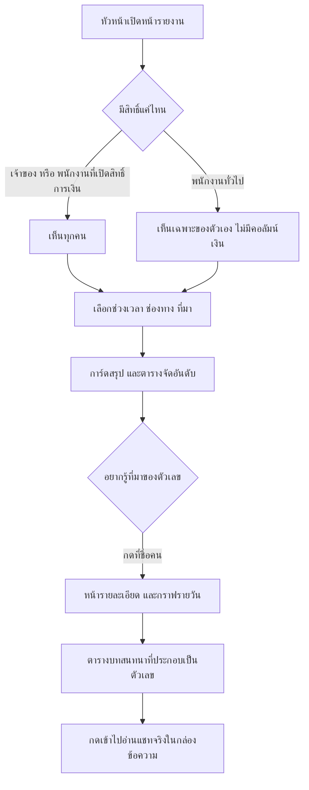
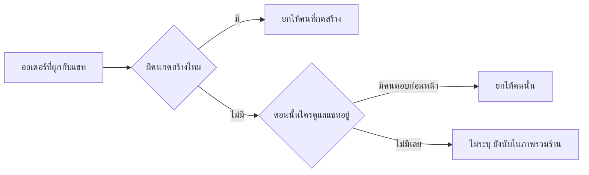

> **โมดูล:** M59-AgentPerformance
> **ประเภทเอกสาร:** Business Requirements Document (BRD) - NON-TECHNICAL
> **เวอร์ชัน:** 1.0
> **วันที่จัดทำ:** 2026-08-26
> **สถานะ:** Draft

# BRD: รายงานผลงานแอดมิน

---

## 1. บทนำ

หัวหน้าร้านที่มีแอดมินหลายคนทุกวันนี้ตอบคำถามว่า "ใครทำงานได้ดี" ไม่ได้เลย เพราะต้องไล่เปิดกล่องแชท
ทีละห้องแล้วนับเอง ซึ่งไม่มีใครทำจริง เอกสารนี้อธิบายว่า *ธุรกิจ* ต้องการอะไรจากหน้ารายงานใหม่
โดยไม่พูดถึงวิธีทำ (อยู่ใน SRS/SDS)

---

## 2. ความต้องการหลัก (Functional Requirements)

### FR-001 ดูภาพรวมของทีมในช่วงเวลาหนึ่ง
หัวหน้าเลือกช่วงเวลาแล้วเห็นทันทีว่าช่วงนั้นมีแชทกี่ห้อง ตอบเร็วแค่ไหน ปิดการขายได้กี่ห้อง เป็นเงินเท่าไร
พร้อมตัวเปรียบเทียบกับช่วงก่อนหน้าที่ยาวเท่ากัน

### FR-002 เทียบคนในทีม
ตารางหนึ่งตาราง หนึ่งแถวต่อหนึ่งคน เรียงตามคอลัมน์ไหนก็ได้ที่เป็นตัวเลข

### FR-003 เจาะดูรายคน
กดที่ชื่อ → เห็นตัวเลขของคนนั้น กราฟแนวโน้มรายวัน และ **รายการบทสนทนาจริงที่ประกอบเป็นตัวเลขนั้น**

### FR-004 กรองตามช่องทาง
ผลงานบน LINE กับบน Messenger เทียบกันตรง ๆ ไม่ได้ (ลูกค้าคนละกลุ่ม ความคาดหวังคนละแบบ)
จึงต้องกรองแยกได้ รวมถึงกรองว่ามาจากโฆษณาหรือทักเข้ามาเอง

### FR-005 เกณฑ์การตอบ (SLA)
กำหนดว่า "ตอบครั้งแรกภายใน 5 นาที" ถือว่าทัน แล้วรายงานเป็นเปอร์เซ็นต์
แชทที่ไม่มีใครตอบเลย **นับว่าไม่ทัน** ไม่ใช่ตัดออกจากการคำนวณ

### FR-006 สิทธิ์การเข้าถึง
- เจ้าของร้าน: เห็นทุกคน ทุกตัวเลข
- พนักงานที่เจ้าของเปิดสิทธิ์ข้อมูลการเงินให้แล้ว: เห็นทุกคน ทุกตัวเลข
- พนักงานที่ยังไม่ได้เปิดสิทธิ์: **เห็นเฉพาะของตัวเอง และไม่เห็นตัวเลขเงิน**

---

## 3. Acceptance Criteria สรุป

| ID | เกณฑ์ |
|---|---|
| AC-01 | เปิดหน้าโดยไม่ตั้งค่าอะไร → ได้ช่วง 7 วันล่าสุด |
| AC-02 | ลูกค้าพิมพ์ติดกัน 5 ใบก่อนมีคนตอบ → นับเป็นการรอ **1 ครั้ง** วัดจากใบแรก |
| AC-03 | บอทตอบก่อนคน → เวลาตอบต้องเป็นของคน ไม่ใช่ของบอท |
| AC-04 | แชทที่มีแต่บอทตอบ → ไม่นับว่า "มีคนตอบ" |
| AC-05 | แชทที่ไม่มีใครตอบ → ไม่เข้าตัวหารอัตราปิดการขาย แต่เข้าตัวหาร SLA และนับว่าไม่ทัน |
| AC-06 | ออเดอร์ที่ถูกยกเลิก → ไม่นับเป็นยอดขาย และไม่นับว่าปิดการขายได้ |
| AC-07 | แชทเดียวมี 3 ออเดอร์ → นับว่าปิดการขายได้ 1 แชท แต่คำสั่งซื้อ 3 ใบ |
| AC-08 | แชทที่ส่งต่อจาก A ไป B แล้วออเดอร์เกิดตอน B ดูแล → ยอดเป็นของ B |
| AC-09 | อัตราปิดการขายของทุกคน **ต้องไม่เกิน 100%** ในทุกกรณี |
| AC-10 | ไม่มีข้อมูลให้คำนวณ → แสดง "—" ห้ามแสดง 0 หรือ 0% |
| AC-11 | พนักงานที่ไม่มีสิทธิ์ พิมพ์ URL ของเพื่อนร่วมงาน → ถูกปฏิเสธ |
| AC-12 | ขอช่วงยาวเกิน 92 วัน → ระบบหั่นให้ **พร้อมบอกผู้ใช้** |

---

## 4. Business Flows

---

## 5. Use Case Scenarios

**UC-1 — หัวหน้าทบทวนทีมประจำสัปดาห์**
เปิดหน้ารายงานเช้าวันจันทร์ ช่วงตั้งต้นคือ 7 วันที่ผ่านมา เห็นว่าอัตราปิดการขายลดจากสัปดาห์ก่อน 8%
เรียงตารางตาม "อัตราปิดการขาย" น้อยไปมาก เห็นว่ามีคนหนึ่งตกลงชัดเจน กดเข้าไปดู พบว่าเวลาตอบครั้งแรก
โตขึ้นเท่าตัวในช่วงเดียวกัน แล้วกดดูรายการบทสนทนาเพื่อหาสาเหตุ

**UC-2 — แอดมินเช็คตัวเอง**
พนักงานเปิดหน้าเดียวกัน เห็นเฉพาะแถวของตัวเอง ไม่มีคอลัมน์ยอดขาย รู้ว่าเดือนนี้ตอบทันเกณฑ์ 88%

**UC-3 — ร้านที่ตอบจาก Business Suite**
หัวหน้าเปิดมาแล้วเห็นตัวเลขน้อยผิดปกติ พร้อมแถบเตือนว่ามีคำตอบ 240 ข้อความที่ระบบระบุตัวผู้ตอบไม่ได้
เพราะพิมพ์จากแอปของแพลตฟอร์มโดยตรง → เข้าใจว่าต้องให้ทีมย้ายมาตอบในระบบถึงจะวัดได้

---

## 6. ความต้องการด้านคุณภาพ

| ด้าน | เกณฑ์ |
|---|---|
| ความเร็ว | ช่วง 7 วัน โหลดเสร็จภายใน 1.5 วินาที (p95) |
| ความถูกต้อง | ตัวเลขบนการ์ดกับผลลัพธ์ที่กดเข้าไปดูต้องมาจากตัวกรองชุดเดียวกันเสมอ |
| ความซื่อสัตย์ | ไม่มีข้อมูล = "—" · ข้อมูลมาไม่ครบ = ต้องติดป้าย |
| การเข้าถึง | ใช้ได้บนมือถือ (การ์ดแทนตาราง) · ปุ่มมีพื้นที่นิ้ว ≥44px |

---

## 7. ข้อจำกัด

- ระบบไม่มีข้อมูล "เวลาทำการ" ⇒ เวลาตอบเป็นเวลานาฬิกาจริง ไม่หักช่วงร้านปิด
- ระบบไม่มีแนวคิด "ทีม/แผนก" ⇒ ตัวกรองทีมยังทำไม่ได้
- ออเดอร์ก่อน 2026-08-12 ไม่มีเธรดต้นทางผูกไว้ ⇒ ไม่ปรากฏในรายงาน

---

## 8. กฎทางธุรกิจ

ดู PRD §4 (BR-AP-01 … BR-AP-08) — ไม่ทำซ้ำที่นี่เพื่อไม่ให้มีสองฉบับที่เพี้ยนจากกัน

---

## 9. อภิธานศัพท์

ดู PRD §7

---

## 10. สรุป

ฟีเจอร์นี้ไม่สร้างข้อมูลใหม่เลย — มันแค่ตอบคำถามที่ข้อมูลเดิมตอบได้อยู่แล้วแต่ไม่มีใครถามได้
ความเสี่ยงหลักไม่ใช่เรื่องเทคนิค แต่คือการที่ตัวเลขถูกใช้ตัดสินคนโดยไม่เข้าใจว่ามันวัดอะไร
จึงเป็นเหตุผลที่ทุกการ์ดมีคำอธิบายกำกับ และไม่มีคะแนนรวมในเวอร์ชันนี้
