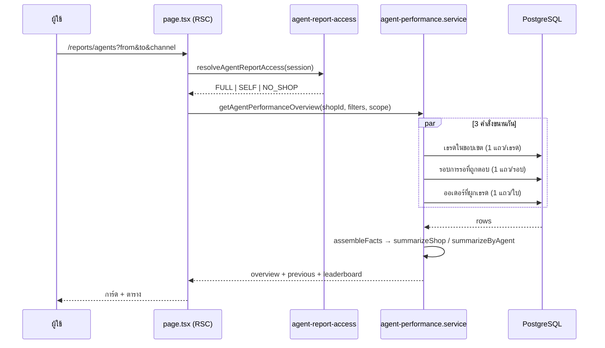
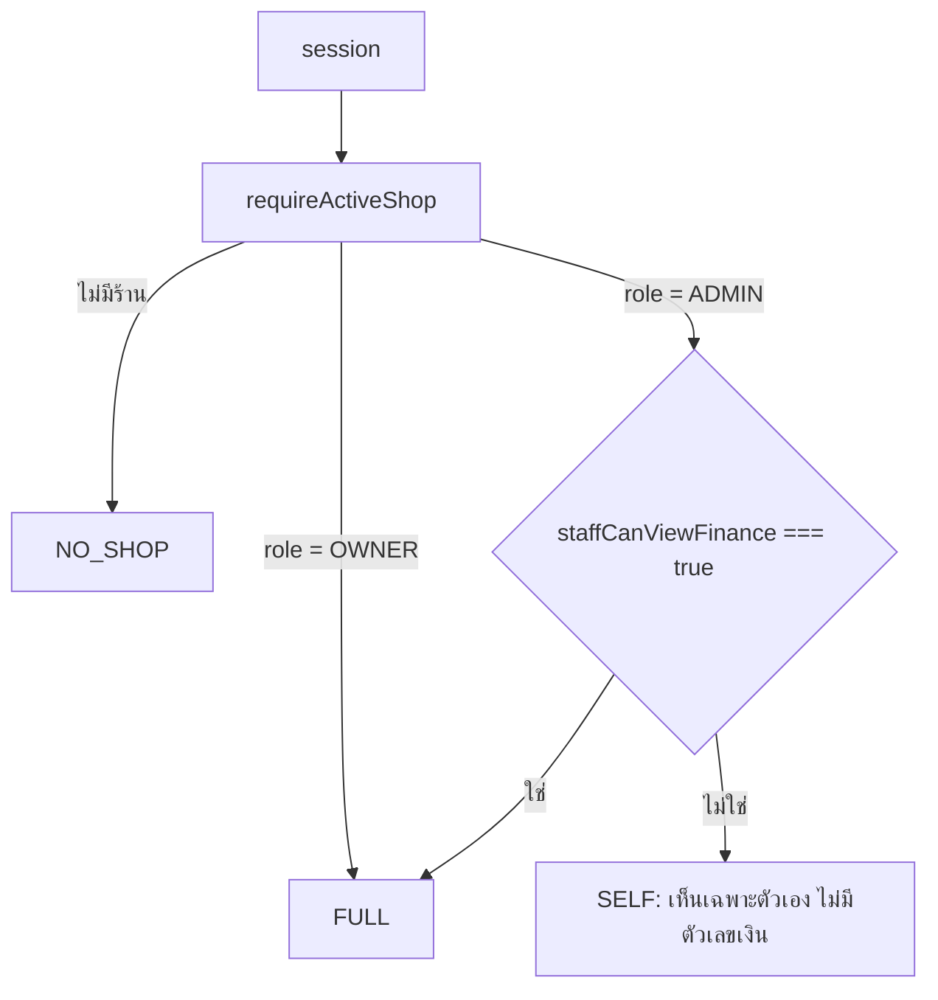

> **โมดูล:** M59-AgentPerformance
> **ประเภทเอกสาร:** Software Design Specification (SDS)
> **เวอร์ชัน:** 1.0
> **วันที่จัดทำ:** 2026-08-26

# SDS: รายงานผลงานแอดมิน

---

## 1. ไฟล์ที่เพิ่ม/แก้

### เพิ่ม — ชั้นสูตร (pure, ไม่แตะ DB)
| ไฟล์ | หน้าที่ |
|---|---|
| `src/lib/agent-performance.ts` | นิยามทุกตัวชี้วัด · จับคู่รอบการรอ · ยกเครดิต · จัดรูปหน่วยเวลา |
| `src/lib/agent-performance-sql.ts` | สูตรฉบับ SQL (window function) — ต้องตรงกับไฟล์บน |
| `src/lib/agent-sla.ts` | เกณฑ์ SLA + จุดเสียบค่าจากฐานข้อมูลในอนาคต |
| `src/lib/agent-report-query.ts` | แปลง query string → ตัวกรอง (ใช้ร่วม RSC/API) |

### เพิ่ม — ชั้นบริการ
| ไฟล์ | หน้าที่ |
|---|---|
| `src/services/agent-performance.service.ts` | 3 query + ประกอบร่าง + `getAgentPerformanceOverview` / `getAgentPerformance` / `getConversationBreakdown` |
| `src/services/agent-report-access.service.ts` | จุดตัดสินสิทธิ์เดียว + ตัดตัวเลขเงินที่ขอบ response |

### เพิ่ม — API
`src/app/api/seller/reports/agents/route.ts` · `[agentId]/route.ts` · `[agentId]/conversations/route.ts`

### เพิ่ม — หน้าจอ
`src/app/(paces)/seller/(dashboard)/reports/agents/` (page + loading + `components/`)
และ `[agentId]/` (page + loading + `components/`)

### แก้ของเดิม (เล็กที่สุดเท่าที่ทำได้)
| ไฟล์ | แก้อะไร |
|---|---|
| `src/lib/seller-menu.ts` | เพิ่มรายการเมนู `seller:reports-agents` + คีย์คำแปล |
| `src/lib/seller-menu.test.ts` | เพิ่ม slug ใหม่ใน contract (เป็นการ *เพิ่ม* เท่านั้น) |
| `src/i18n/dictionaries/{th,en}.ts` | เพิ่ม `menu.reportsAgents` (เทส `dictionaries.test.ts` บังคับ) |
| `prisma/schema.prisma` | `@@index([shopId, createdAt])` บน `Conversation` |
| `prisma/migrations/20260826090000_agent_performance_report_indexes/` | `CREATE INDEX IF NOT EXISTS` |

---

## 2. ทำไมแบ่งเป็น 2 ชั้น (สูตร TS + สูตร SQL)

โจทย์บังคับสองอย่างที่ดึงกันคนละทาง:
- §8 "ห้ามโหลดข้อความทั้งหมดขึ้นมาคำนวณ" ⇒ ต้องทำที่ฐานข้อมูล
- §13 "ความถูกต้องของตัวชี้วัดสำคัญกว่าหน้าตา" ⇒ ต้องมีที่ให้เทสจับ

ทางออกคือแพตเทิร์นที่โปรเจกต์นี้ใช้อยู่แล้วกับกองงานพัสดุ
(`order-stage.ts` ↔ `order-stage-sql.ts` ↔ `__tests__/order-stage-sql.test.ts`):
เขียนสูตรเป็น TypeScript ให้เทสจับ แล้วมี **ฉบับ SQL ที่ผูกด้วยเทสเทียบผล**

**สิ่งที่ทำเป็น SQL:** เฉพาะการย่อยข้อความ → รอบการรอ (ส่วนที่แพงจริง)
**สิ่งที่ทำเป็น TypeScript:** ทุกอย่างที่เป็น *นิยาม* (เข้าเกณฑ์ · ยกเครดิต · ตัวหาร · ค่าเฉลี่ย/ค่ากลาง)

⇒ พื้นที่ที่สองฉบับต้องตรงกันเหลือแค่ฟังก์ชันเดียว จึงคุมได้ด้วยเทสตัวเดียว

---

## 3. การไหลของข้อมูล



---

## 4. รายละเอียดของ query

### 4.1 `conv` CTE — ที่เดียวที่มีตัวกรอง
ทุก query JOIN ต่อจาก `conv` เสมอ ห้ามเขียน `WHERE` ของตัวเอง
**เหตุผล:** ถ้าต่างคนต่างกรอง วันหนึ่งการ์ดสรุปกับตารางจะกรองคนละชุด แล้วผู้ใช้กดเลข 12 เข้าไปเจอ 9
(บทเรียน Command Center 2026-08-04)

ตัวกรอง `source = 'DIRECT'` เขียนเป็น `IS NULL OR NOT IN (...)` — ค่า `NULL` ใน SQL ไม่เท่ากับอะไรเลย
รวมทั้งไม่เท่ากับตัวมันเอง เขียน `<> 'ADS'` เฉย ๆ จะทิ้งเธรดที่ทักเข้ามาเองทั้งหมด

### 4.2 การจับคู่รอบการรอ (`buildResponsePairsSql`)

```
grp = SUM(CASE WHEN เป็นคำตอบของคน THEN 1 ELSE 0 END)
      OVER (PARTITION BY เธรด ORDER BY createdAt, seq ROWS UNBOUNDED PRECEDING)
```
- ข้อความลูกค้าที่ยังไม่ถูกตอบทุกใบในรอบเดียวกันได้ `grp` เท่ากัน → `MIN(createdAt)` = ใบแรกที่รอ
- คำตอบที่ปิดรอบคือแถวที่ `grp = รอบ + 1` → คำตอบใบที่ 2,3 ของชุดเดียวกันไม่มีคู่ match จึงไม่ถูกนับซ้ำ
- รอบที่ยังไม่ถูกตอบหายไปเองจาก INNER JOIN (ไม่ใช่ 0 ไม่ใช่อนันต์)

### 4.3 เจ้าของเธรด ณ เวลาที่ออเดอร์เกิด
`LEFT JOIN LATERAL` หาคำตอบของคนใบล่าสุดที่ `createdAt <= order.createdAt`
ใช้ index `ChatMessage(conversationId, senderRole, createdAt)` ที่มีอยู่แล้ว

---

## 5. สิทธิ์



**ทำไมใช้ `Shop.staffCanViewFinance` ไม่ตั้งธงใหม่:** รายงานนี้แสดงยอดขายรายคน ซึ่งเป็นข้อมูลการเงิน
ระดับร้านชนิดเดียวกับที่ธงนั้นคุมอยู่แล้ว (`/expenses`, กำไร-ขาดทุนใน `/sales`)
การมีธงที่สองคุมของประเภทเดียวกันแปลว่าเจ้าของร้านต้องไปปิดสองที่ถึงจะปิดได้จริง = ช่องโหว่ที่หายาก

**`SELF` ไม่ใช่ "ปิดหน้า"** — ผลงานของตัวเองคือข้อมูลของเจ้าตัวเอง ซ่อนทั้งหน้าไม่ได้เพิ่มความปลอดภัย
แต่ทำให้พนักงานไม่มีทางรู้ว่าตัวเองตอบช้าหรือเร็ว

---

## 6. หน้าจอ

| ส่วน | Base (theme-copy ตาม Hard Rule 1/3) |
|---|---|
| โครงหน้า | `theme/paces/.../apps/ecommerce/(orders)/orders/page.tsx` |
| การ์ดสถิติ | `_shared/PacesStatCard.tsx` (← `ProductStats.tsx` ของธีม) |
| ตาราง | `customers/components/CustomerTable.tsx` (← `CustomerTable.tsx` ของธีม) |
| ดรอปดาวน์กรอง | `components/safepay/FilterDropdown.tsx` (← `ui/dropdowns/page.tsx`) |
| กราฟ | `theme/paces/.../widgets/charts/components/SalesReport.tsx` ผ่าน `ApexChart` wrapper (HR10) |
| ช่องวันที่ | `sales/components/SalesDateRange.tsx` |

**คลาสที่ตรวจแล้วว่า "ไม่มีอยู่จริงในธีม" และห้ามใช้ (เจอระหว่างทำงานนี้):**
`btn-light` (มีแค่ `.btn-light.active` ของ toolbar กราฟ) · `text-secondary-ink`
(`--color-secondary-ink` ไม่มี) · `stretched-link` (เป็นชื่อในคอมเมนต์ ของจริงคือ `absolute inset-0`)

---

## 7. การจัดการค่าที่ "ไม่มี"

| สถานการณ์ | ต้องได้ | ห้ามได้ |
|---|---|---|
| ไม่เคยถูกตอบ | `null` → "—" | `0 วิ` |
| ตัวหารเป็น 0 | `null` → "—" | `0%` |
| ไม่มีสิทธิ์เห็นเงิน | `null` + ซ่อนคอลัมน์ | `0` |
| มีคำตอบที่ระบุตัวไม่ได้ | แถบเตือนบอกจำนวน | เงียบ |
| ช่วงถูกหั่นเพราะเกินเพดาน | แถบเตือน | หั่นเงียบ |
| ตารางย่อยเกิน 100 แถว | บอกว่าแสดงกี่จาก | ตัดเงียบ |

---

## 8. ปริมาณข้อมูล — วัดจริงแล้ว (2026-08-27)

ก่อนหน้านี้หัวข้อนี้เป็น *การให้เหตุผล* ว่า "น่าจะเร็ว" — ตอนนี้เป็น **ตัวเลขที่วัดได้**

**ชุดทดสอบ** (`scripts/bench-agent-performance.ts`, ฐาน local เท่านั้น):
20,000 เธรด · **400,000 ข้อความ** · 8,888 ออเดอร์ · แอดมิน 5 คน — ทั้งหมดอยู่ใน **ร้านเดียว**
เทียบกับ prod ทั้งฐาน ณ 2026-08-20 ที่มี ChatMessage ~40,700 แถว ⇒ **หนักกว่าของจริงราว 10 เท่า
และกระจุกอยู่ที่ร้านเดียว** (prod กระจายหลายร้าน)

| ช่วง | เธรดในขอบเขต | หน้าภาพรวม | หน้ารายละเอียด |
|---|---|---|---|
| 7 วัน (ค่าตั้งต้น) | 1,168 | **~110–170 ms** | ~80–95 ms |
| 30 วัน | 5,009 | ~250–500 ms | ~260–320 ms |
| 92 วัน (เพดาน) | 15,352 | ~650–1,030 ms | ~850–1,300 ms |

⇒ **ช่วงที่ผู้ใช้เจอจริงทุกวัน (7 วัน) อยู่ระดับ 0.1 วินาที** ต่อให้ข้อมูลโต 10 เท่าของทั้งระบบวันนี้
และกองอยู่ร้านเดียว · เพดาน 92 วันแตะ 1 วินาที ซึ่งเป็นเหตุผลที่เพดานนั้นมีอยู่

**index ที่เพิ่ม (`Conversation(shopId, createdAt)`) ทำงานจริง** — ยืนยันด้วย `EXPLAIN ANALYZE`:
ช่วง 7 วัน (6% ของแถว) ใช้ `Bitmap Heap Scan` ผ่าน index · ช่วง 92 วัน (77% ของแถว) ตัวจัดแผน
เลือก `Seq Scan` เอง ซึ่ง**ถูกแล้ว** (อ่านเกือบทั้งตารางอยู่ดี)

---

## 9. ทางแก้ถ้าวันหนึ่งช้าจริง — แก้แล้ว 1 ข้อ · **ตัดทิ้ง 1 ข้อเพราะวัดแล้วไม่จริง**

**สัญญาณที่ใช้ตัดสิน** (ไม่ใช่ความรู้สึก): p95 ของ `GET /api/seller/reports/agents` เกิน 2 วินาที
หรือมีร้านที่ข้อความต่อ 92 วันเกิน ~400,000 แถว (= จุดที่วัดไว้ข้างบน)

| # | ทาง | สถานะ |
|---|---|---|
| 1 | ตัด query ซ้ำในหน้ารายละเอียด (เดิม 11 → 8) | ✅ **ทำแล้ว** — `getAgentDetailBundle()` · วัด A/B สลับรอบ 9 ครั้ง × 3 รอบ: **เร็วขึ้น 8–26% ทุกช่วง** |
| 2 | ~~index `ChatMessage(...) INCLUDE (...)`~~ | ❌ **ตัดทิ้ง — วัดแล้วช้าลง** 7 วัน 122→139 ms · 92 วัน 682→833 ms (index 29 MB บนตาราง 52 MB) เพราะ query อ่านข้อความ 77% ของตารางอยู่แล้ว `Seq Scan` จึงเร็วกว่าเสมอ |
| 3 | cache ระดับ (ร้าน + ตัวกรอง) TTL สั้น | ยังไม่ทำ — ทางที่ถูกต่อไปถ้าต้องเร็วขึ้นอีก |
| 4 | ตารางสรุปรายวัน | ยังไม่ทำ · ต้องคุยก่อน (พา "ตัวเลขสองชุดที่ไม่ตรงกัน" มาด้วยเสมอ) |

🛑 **บทเรียนจากข้อ 1 ที่ต้องบันทึกไว้:** รอบแรกผมตัด query ซ้ำโดย "โหลดช่วงปัจจุบันให้เสร็จก่อน
แล้วค่อยส่งต่อ" — ผลคือ **ช้าลง** ที่ช่วง 30 วัน (504 → 589 ms) เพราะ query ที่ "ซ้ำ" เดิมนั้น
วิ่ง**ขนานกัน**บนคนละ connection มันกิน CPU ของฐานเพิ่มจริง แต่ไม่ได้กินเวลาของผู้ใช้
⇒ **ลดจำนวน query ไม่ได้แปลว่าเร็วขึ้น ถ้าแลกมาด้วยการทิ้งการทำงานขนาน**
ตอนนี้ยิงช่วงปัจจุบันกับช่วงก่อนหน้าพร้อมกันแล้ว จึงได้ทั้งสองอย่าง

## 10. สิ่งที่จงใจไม่ทำ

- ไม่เพิ่มคอลัมน์ `assignedAgentId` บน `Conversation` — โจทย์ให้ *อ่าน* ความเป็นเจ้าของจากกลไกที่มี
  การเพิ่มคอลัมน์แปลว่าต้องมี UI มอบหมาย + backfill + กติกาว่าใครแก้ได้ = ฟีเจอร์คนละตัว
- ไม่ทำคะแนนรวม (โจทย์ §3 สั่งไว้)
- ไม่แตะหน้าอื่นเลยนอกจากเพิ่มรายการเมนู
