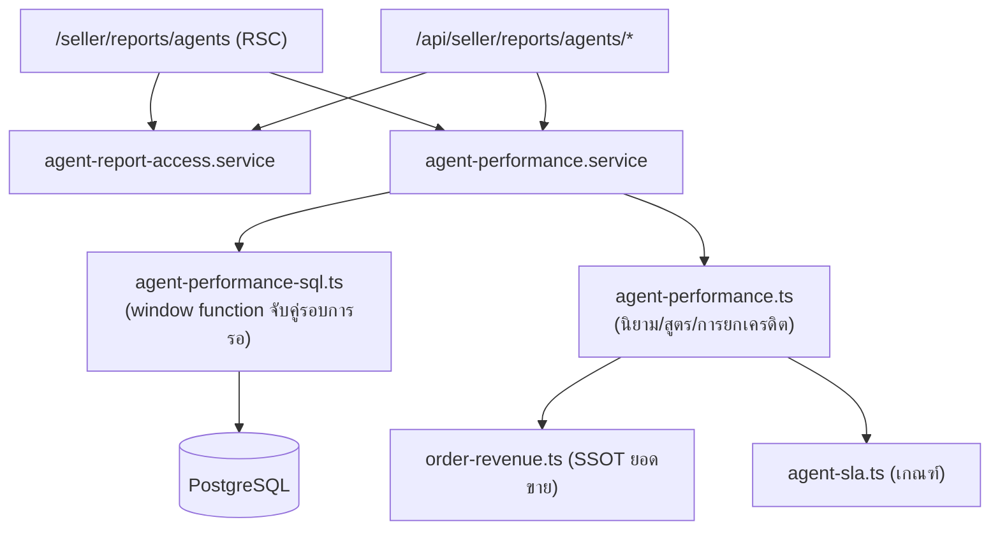

> **โมดูล:** M59-AgentPerformance
> **ประเภทเอกสาร:** Software Requirements Specification (SRS)
> **เวอร์ชัน:** 1.0
> **วันที่จัดทำ:** 2026-08-26

# SRS: รายงานผลงานแอดมิน

---

## 1. บทนำ

เอกสารนี้คือ **นิยามของทุกตัวเลข** บนรายงาน ถ้าหน้าจอกับเอกสารไม่ตรงกัน ให้ถือว่าหน้าจอผิด
ตัวสูตรที่บังคับใช้จริงอยู่ที่ `src/lib/agent-performance.ts` (ฟังก์ชันบริสุทธิ์ + เทสเป็นด่าน)

---

## 2. ภาพรวมสถาปัตยกรรม



**หลักที่ยึด:** ฐานข้อมูลย่อยข้อความให้เหลือ "1 แถวต่อรอบการรอ" · TypeScript ตัดสินความหมาย
⇒ ไม่มีการดึง `ChatMessage` ขึ้นมาที่แอป และสูตรทุกตัวมีที่ให้เทสจับ

---

## 3. ข้อกำหนดเชิงฟังก์ชันเชิงเทคนิค

### 3.1 ขอบเขตของช่วงเวลา (cohort)

**TFR-AP-01** เธรดอยู่ในขอบเขตเมื่อ `Conversation.createdAt ∈ [from, to)` (เที่ยงคืนเวลาไทย)

เหตุผลที่ตัดด้วย "เธรดถูกเปิดเมื่อไร" ไม่ใช่ "ข้อความเกิดเมื่อไร":
ถ้าตัดที่ข้อความ เธรดที่คร่อมขอบจะถูกตัดหัวทิ้ง แล้ว "เวลาตอบครั้งแรก" จะกลายเป็นเวลาตอบของ
รอบที่สองโดยไม่มีอะไรฟ้อง (ค่าต่ำกว่าความจริงเสมอ) และอัตราปิดการขายจะไม่ใช่อัตราของกลุ่มใด ๆ

**ผลข้างเคียงที่ยอมรับ:** ออเดอร์ที่เกิดวันนี้จากเธรดของเมื่อวาน นับเข้ากลุ่มของเมื่อวาน
⇒ ตัวเลขของช่วงล่าสุดยัง "ไม่นิ่ง" จนกว่าเธรดจะจบวงจร

**TFR-AP-02** ช่วงก่อนหน้า = ยาวเท่ากัน ต่อกันพอดี (`[from-span, from)`) — นิยามเดียวกับ `date-range.ts`

### 3.2 ใครนับเป็น "คำตอบของคน"

**TFR-AP-03**
```
senderRole = 'SHOP' AND autoReplyKind IS NULL AND senderUserId IS NOT NULL AND isDeleted = false
```
สองเงื่อนไขแรกคือเกณฑ์ `sentByHuman` ที่ `channel-chat.service.ts` ใช้อยู่แล้ว (บรรทัด 3360/3475)
เงื่อนไขที่สามเพิ่มเพราะรายงานนี้ต้องระบุตัวคนได้

**TFR-AP-04** คำตอบฝั่งร้านที่ `senderUserId IS NULL` (พิมพ์จาก Business Suite/แอปแพลตฟอร์ม)
**ต้องถูกนับแยกและแสดงบนหน้าจอ** ห้ามกลืนหาย

**TFR-AP-05** ข้อความขาเข้า = `senderRole='BUYER' AND isDeleted = false`
(ข้อความที่ลูกค้าถอนคืนไม่สร้างหน้าที่ต้องตอบ)

### 3.3 อัลกอริทึมเวลาตอบ

**TFR-AP-06** เดินข้อความของเธรดตามลำดับ `(createdAt, seq)` แล้ว:

| เจอ | สถานะ | ทำ |
|---|---|---|
| ข้อความลูกค้า | ยังไม่มีรอบค้าง | เปิดรอบ จำเวลาใบนั้น |
| ข้อความลูกค้า | มีรอบค้างอยู่ | ไม่ทำอะไร (พิมพ์รัว = รอรอบเดียว) |
| คำตอบของคน | มีรอบค้าง | ปิดรอบ บันทึกคู่ (askedAt, repliedAt, agent) |
| คำตอบของคน | ไม่มีรอบค้าง | ไม่นับ (ร้านทักเอง / ตอบต่อเนื่องใบที่ 2,3) |
| จบเธรด | ยังมีรอบค้าง | **ไม่มีคู่** (ไม่ใช่ 0 ไม่ใช่อนันต์) |

- **First Response Time** = `waitSec` ของคู่ที่ `pairNo = 1`
- **Average Response Time** = ค่าเฉลี่ยของ `waitSec` ทุกคู่
- **ช่วงที่ไม่ควรมีใครต้องตอบไม่เคยเข้าสูตร** — เวลาระหว่างที่ร้านตอบไปแล้วจนลูกค้าพิมพ์มาใหม่ ไม่ถูกวัด

**TFR-AP-07** แสดงค่าเฉลี่ยคู่กับค่ากลางเสมอ — ระบบไม่มีข้อมูลเวลาทำการ (ยืนยันแล้วว่า
`auto-reply-schedule.ts` เป็นเวลาทำงานของ *บอท* ซึ่งมักตั้งตรงข้ามกับเวลาที่คนอยู่) ⇒ ข้อความ
ที่เข้ามาตอนตีสองจะดันค่าเฉลี่ยเป็นชั่วโมง ค่ากลางเป็นตัวถ่วง

### 3.4 นิยาม "เข้าเกณฑ์" และ "ปิดการขายได้"

**TFR-AP-08 (qualified)** เธรดเข้าเกณฑ์เมื่อครบทั้ง 3 ข้อ:
1. มีข้อความจากลูกค้าอย่างน้อย 1 ใบ
2. มีคำตอบของคนอย่างน้อย 1 ครั้ง
3. `isSpam = false`

**ทำไมไม่ใช่ "เธรดทั้งหมด":** เธรดที่ไม่มีใครตอบเลยปิดการขายไม่ได้โดยสภาพ การเอามาหาร
ทำให้ทีมที่รับงานเยอะดูแย่ลงเพราะงานที่ไม่มีใครแตะ — เธรดกลุ่มนั้นไปโผล่ที่ SLA แทน ซึ่งเป็นที่ที่ควรเห็นมัน

**ทำไมไม่ใช้ `isHidden`:** ธงนั้น auto-unhide ตัวเองเมื่อลูกค้าทักใหม่ = สถานะชั่วคราวของกล่องข้อความ
ไม่ใช่คำตัดสินว่าไม่ใช่โอกาสขาย

**TFR-AP-09 (converted)** เธรดมีออเดอร์ที่ `countsAsRevenue` อย่างน้อย 1 ใบ → นับ **1 เธรด**
(ไม่ว่าจะมีกี่ใบ)

**TFR-AP-10** `Conversion Rate = converted / qualified × 100` · ตัวหารเป็น 0 → **`null`** ห้ามคืน 0

### 3.5 การยกเครดิตออเดอร์ (Attribution)

**TFR-AP-11** ลำดับการตัดสิน:

1. `Order.createdByUserId` → `basis = ORDER_ACTOR`
   *ระบบมีกลไก audit ที่ดีกว่า "เจ้าของเธรด" อยู่แล้ว — คอลัมน์นี้เขียนตอนกดสร้างจริง*
2. เจ้าของเธรด ณ เวลาที่ออเดอร์ถูกสร้าง = คนที่ตอบเป็นคนสุดท้าย **ก่อน** `Order.createdAt`
   → `basis = CONVERSATION_OWNER`
   *ใช้เมื่อข้อ 1 ว่าง ซึ่งเกิดกับออเดอร์ก่อน 2026-08-04 และออเดอร์ที่ระบบออกให้เอง (ปิดประมูล)*
3. ไม่เข้าทั้งสอง → `UNATTRIBUTED` — **ยังนับในภาพรวมร้าน** และต้องไม่หารเฉลี่ยไปให้ใคร

🛑 ข้อ 2 **ไม่ใช่ "ใครส่งข้อความล่าสุด"** — ข้อความล่าสุดมักเป็นของลูกค้าหรือบอท และต้องมองย้อนจาก
เวลาสร้างออเดอร์ ไม่ใช่จากปัจจุบัน (ไม่งั้นออเดอร์เมื่อวานเปลี่ยนเจ้าของทุกครั้งที่มีคนเข้าไปตอบวันนี้)

### 3.6 ขอบเขตรายคน

**TFR-AP-12** เธรดเป็นของแอดมิน A เมื่อ **A ตอบอย่างน้อย 1 ครั้ง** หรือ **A เป็นเจ้าของออเดอร์ในเธรดนั้น**

ข้อหลังไม่ใช่ของแถม: ถ้าไม่มี จะเกิดเคสที่ B คุยแต่ A เปิดบิล แล้ว A ได้ตัวตั้งโดยไม่มีตัวหาร
⇒ อัตราปิดการขายเกิน 100%

**ผลที่ต้องบอกบนหน้าจอ:** เธรดที่ช่วยกันตอบนับให้ทั้งคู่ ⇒ ผลรวมคอลัมน์ "แชท" > ภาพรวมร้านได้
ส่วนคอลัมน์ที่ผูกกับออเดอร์ยกให้คนเดียวเสมอ ⇒ ผลรวมตรงกับร้านพอดี

**TFR-AP-13** เวลาตอบรายคนนับเฉพาะรอบที่คนนั้นเป็นผู้ตอบ · SLA รายคนนับเฉพาะเธรดที่คนนั้นตอบครั้งแรก

### 3.6a เส้นทาง "ตอบแชท → เปิดบิล" (เพิ่ม 2026-08-27 ตามคำสั่งผู้ใช้)

**TFR-AP-13a** นอกจากคอลัมน์ที่ตอบว่า *"ใครได้เครดิต"* ต้องมีอีกกลุ่มที่ตอบว่า **"ใครมีส่วนในยอด"**:

| ค่า | นิยาม |
|---|---|
| `repliedConversations` | เธรดที่คนนี้ **ตอบเอง** อย่างน้อย 1 ครั้ง |
| `conversationsWithOrder` | ในนั้น มีบิลออกมากี่เธรด (ไม่สนว่าใครเปิด) |
| `conversationsWithClosedOrder` | ในนั้น ปิดการขายได้กี่เธรด (ไม่สนว่าใครได้เครดิต) |
| `ordersCreatedByOthers` | บิลบนเธรดที่เขาตอบ ซึ่ง **คนอื่น** เป็นเจ้าของเครดิต |

🛑 **ฐานคือเธรดที่ "ตอบเอง" เท่านั้น** ไม่ใช่ `owned` (ซึ่งรวมเธรดที่แค่ถูกยกเครดิตให้) —
ถ้าใช้ `owned` ตัวเลขขั้นแรกของกรวยจะโตจากเธรดที่เขาไม่เคยพิมพ์อะไรเลย

**เหตุผลที่ต้องมี — ข้อมูลจริงบังคับ** (BT Premium คลอง 4 ธัญบุรี · 30 วัน · วัด 2026-08-27):

| แอดมิน | ตอบแชท | มีบิล | ปิดได้ | เปิดบิลเอง | คนอื่นเปิดให้ |
|---|---:|---:|---:|---:|---:|
| ดรีม ดรีม | 523 | 45 | 22 | 51 | 1 |
| Deep Nattapat | 54 | 3 | 1 | **0** | **4** |

คนที่สองตอบแชท 54 ห้อง มีบิลออกมา 4 ใบ แต่เปิดเอง 0 ใบ ⇒ ถ้ารายงานมีแต่คอลัมน์เครดิต
เขาจะขึ้น `—` ทั้งแถว = อ่านได้ว่าไม่ได้สร้างมูลค่าอะไรเลย ทั้งที่เป็นคนคุยจนลูกค้าตัดสินใจ

**TFR-AP-13b** กรวยต้องลดหลั่นเสมอ: `ตอบแชท ≥ มีบิล ≥ ปิดได้` (มีเทสยืนยัน)

**TFR-AP-13c** ไม่ต้องเพิ่ม query — ข้อมูลอยู่ใน `ConversationFact.orders` ที่ประกอบไว้แล้ว

### 3.7 SLA

**TFR-AP-14** ตัวหาร = เธรดที่ *ต้องมีการตอบครั้งแรก* = มีข้อความลูกค้า + ไม่ใช่สแปม
**เธรดที่ไม่มีใครตอบอยู่ในตัวหารและนับว่าไม่ทัน** — ตัดออกเมื่อไร ทีมที่ปล่อยลูกค้าทิ้งจะได้ 100%

**TFR-AP-15** เกณฑ์อ่านจาก `resolveSlaConfig()` เท่านั้น ห้าม hardcode เลขในโค้ด query
ค่าตั้งต้น 300 วินาที · ขอบเป็น "เท่ากับก็ผ่าน" (`<=`)

### 3.8 ยอดขาย

**TFR-AP-16** ใช้ `revenueOrderWhere` / `countsAsRevenue` จาก `src/lib/order-revenue.ts` เท่านั้น
ฉบับ SQL (`revenueOrderSql`) derive รายชื่อ carrier status จากค่าคงที่ตัวเดียวกัน ห้ามพิมพ์เอง

**TFR-AP-17** เวลาปิดการขาย = ออเดอร์ที่นับเป็นยอดขาย **ใบแรก** − ข้อความลูกค้าใบแรก
(เรียงด้วย `Order.createdAt` ไม่ใช่ลำดับใน array — 00033 ให้ผู้ขายเลือกวันที่เองได้)

---

## 4. ข้อกำหนดส่วนต่อประสาน

ดู `API.md` — สรุป: `GET /api/seller/reports/agents`, `/{agentId}`, `/{agentId}/conversations`

---

## 5. ข้อกำหนดด้านข้อมูล

**ไม่มีตารางใหม่ ไม่มีคอลัมน์ใหม่** — ดู `DATABASE.md`
มีเพียง index เดียวที่เพิ่ม: `Conversation(shopId, createdAt)`

| ตาราง | ฟิลด์ที่ใช้ |
|---|---|
| `Conversation` | `id, shopId, createdAt, lastMessageAt, isSpam, channel, shopChannelId, referralSource, externalContactId, buyerUserId, alias` |
| `ChatMessage` | `conversationId, createdAt, seq, senderRole, senderUserId, autoReplyKind, isDeleted` |
| `Order` | `id, orderNo, conversationId, createdAt, createdByUserId, totalAmount, status` |
| `OrderShipment` | `orderId, status, isDryRun, direction, carrierStatus` (ผ่าน `revenueOrderSql`) |
| `ShopMember` / `Shop` / `User` | รายชื่อแอดมิน + ธงสิทธิ์ `staffCanViewFinance` |

---

## 6. ข้อกำหนดที่ไม่ใช่ฟังก์ชัน

| ID | ข้อกำหนด |
|---|---|
| NFR-AP-01 | 3 query ต่อคำขอ คงที่ ไม่ขึ้นกับจำนวนเธรด/ข้อความ (ไม่มี N+1) |
| NFR-AP-02 | ห้ามดึง `ChatMessage` ขึ้นมาที่แอปเพื่อคำนวณ — การย่อยเป็นรอบการรอเกิดที่ฐานข้อมูล |
| NFR-AP-03 | ช่วงที่ขอได้ ≤ 92 วัน · เกินแล้วต้องหั่นพร้อมแจ้งผู้ใช้ |
| NFR-AP-04 | ทุก response `cache-control: private, no-store` |
| NFR-AP-05 | ตัวเลขเงินถูกตัดที่ **ขอบของ response** เมื่อไม่มีสิทธิ์ ไม่ใช่แค่ไม่ render |

---

## 7. ข้อจำกัดทางเทคนิคและการพึ่งพา

- `Order.conversationId` ไม่ backfill ⇒ ออเดอร์ก่อน 2026-08-12 ไม่ปรากฏในรายงาน
- ไม่มีตาราง "การมอบหมายแชท" ⇒ "เจ้าของเธรด" เป็นค่าที่ derive ไม่ใช่ค่าที่บันทึกไว้
- ไม่มีเวลาทำการของร้าน ⇒ เวลาตอบเป็นเวลานาฬิกาจริง

---

## 8. ความเสี่ยงเชิงสถาปัตยกรรม

| ID | ความเสี่ยง | การรับมือ |
|---|---|---|
| R-1 | สูตรมี 2 ฉบับ (TS/SQL) แล้วเพี้ยนจากกัน | เทส parity ป้อน `VALUES` แล้วเทียบผลสองฝั่ง (`agent-performance-sql-parity.test.ts`) |
| R-2 | ปริมาณข้อมูลโตจนคำนวณสดไม่ไหว | เพดาน 92 วัน + แผนตารางสรุปรายวันใน SDS §9 (ยังไม่ทำ) |
| R-3 | ผู้ใช้ตีความตัวเลขผิด | ทุกการ์ดมี `note` อธิบายนิยาม + ไม่มีคะแนนรวม |

---

## 9. Traceability Matrix

| BRD | SRS | โค้ด | เทส |
|---|---|---|---|
| AC-02 | TFR-AP-06 | `computeResponsePairs` | เคส 2 |
| AC-03/04 | TFR-AP-03 | `isHumanAgentReply` | เคส 3 |
| AC-05 | TFR-AP-08/14 | `isQualifiedConversation`, `summarizeShop` | เคส 5, 12 |
| AC-06 | TFR-AP-16 | `countsAsRevenue` | เคส 7 |
| AC-07 | TFR-AP-09 | `isConvertedConversation` | เคส 8 |
| AC-08 | TFR-AP-11 | `attributeOrder` | เคส 9 |
| AC-09 | TFR-AP-12 | `summarizeByAgent` | เคส 9 (ข้อสุดท้าย) |
| — | TFR-AP-13a/b | `summarizeByAgent` (กรวย) | เคส 9b (4 ข้อ) |
| — | TFR-AP-08 (ตอบนอกระบบ) | `isAnsweredOutsideSystem` | เคส 5b (4 ข้อ) |
| AC-10 | TFR-AP-10 | `conversionRatePct`, `formatResponseDuration` | เคส 12 |
| AC-11 | FR-006 | `resolveAgentReportAccess` | (ยังไม่มีเทส — ดู TestCase §หนี้) |
| AC-12 | NFR-AP-03 | `parseReportQuery` | (ยังไม่มีเทส — ดู TestCase §หนี้) |

---

## 10. สรุป

สิ่งที่แพงที่สุดของฟีเจอร์นี้ไม่ใช่โค้ด แต่คือ **นิยาม** — ตัวหารของอัตราปิดการขาย เกณฑ์ว่าใครนับเป็น
"คนตอบ" และกติกาการยกเครดิต ทั้งสามข้อนี้เขียนผิดได้โดยที่ไม่มี `tsc`/build/lint ตัวไหนเห็น
จึงถูกแยกออกมาเป็นฟังก์ชันบริสุทธิ์ที่มีเทสและพิสูจน์ด้วย mutation ทุกข้อ
