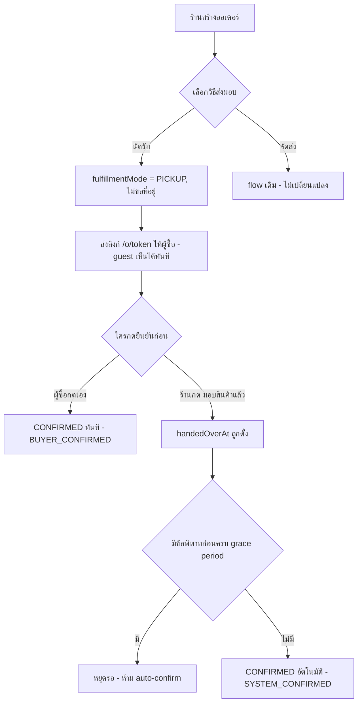
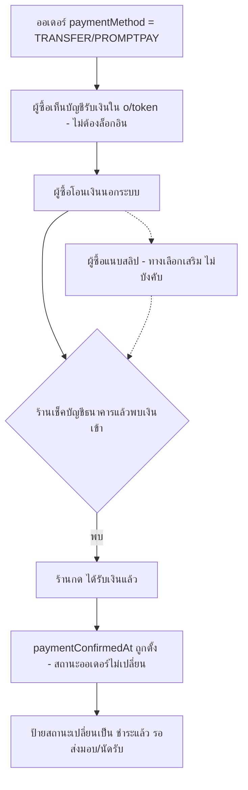

> **โมดูล:** M60-PickupBankTransfer
> **ประเภทเอกสาร:** Business Requirements Document (BRD) - NON-TECHNICAL
> **เวอร์ชัน:** 1.0
> **วันที่จัดทำ:** 2026-08-28
> **สถานะ:** Draft — รอมติ D-1..D-5 (ดู PRD §4.3 + §7.2 ของเอกสารนี้)
> **เจ้าของเอกสาร:** BA

# BRD: นัดรับสินค้า และ การชำระเงินแบบโอน (Business Requirements Document)

---

## 1. บทนำ

### 1.1 วัตถุประสงค์ของเอกสาร

เอกสารนี้มีวัตถุประสงค์เพื่อ:
1. อธิบายความต้องการที่ระบบต้องรองรับสำหรับร้าน `ONLINE_SALES` ที่ (ก) ให้ลูกค้านัดรับสินค้าเองแทนการจัดส่งผ่านขนส่ง และ (ข) รับชำระเงินผ่านการโอน/พร้อมเพย์แล้วยืนยันรับเงินในระบบ
2. กำหนดขอบเขตว่าฟีเจอร์นี้แตะระบบเดิมตรงไหนบ้าง (state machine ของออเดอร์, action-set ของหน้าออเดอร์, guest view, ตั้งค่าร้าน) และไม่แตะตรงไหน (ระบบมัดจำของร้านบริการ, ระบบนัดคิวงาน, payment gateway)
3. อธิบายเงื่อนไข/กฎทางธุรกิจของการปิดงานแบบใหม่ 2 เส้นทาง (นัดรับ, ยืนยันรับเงิน) ที่ต้องไม่เปิดช่องให้ Trust Score ถูกโกงง่ายกว่าเส้นทางที่มีอยู่แล้ว
4. สร้างความเข้าใจร่วมกันระหว่างทีมธุรกิจและทีมพัฒนา ก่อนเข้าสู่ขั้นตอน SRS/SDS ซึ่งต้องรอมติ D-1..D-5 (ดู §7.2) ก่อน

### 1.2 ขอบเขตของระบบ

**นัดรับสินค้า และ การชำระเงินแบบโอน** คือส่วนขยายของระบบ Simple OMS (`docs/SRS.md` FR-6) ที่เพิ่มวิธีส่งมอบสินค้าแบบ "นัดรับ" และกลไกยืนยันการรับเงินโอนฝั่งร้าน พร้อมหน้าตั้งค่าบัญชีรับเงินของร้าน

**เข้าสู่ระบบ (Input):**
- การเลือกวิธีส่งมอบ = "นัดรับ" ตอนสร้าง/แก้ไขออเดอร์ (ร้าน)
- การกดยืนยัน "ได้รับเงินแล้ว" และ "มอบสินค้าแล้ว" (ร้าน)
- การกดยืนยันรับของเอง หรือเปิดข้อพิพาท (ผู้ซื้อ — ทางเดิม)
- ข้อมูลบัญชีธนาคาร/พร้อมเพย์ของร้าน (ร้าน, ตั้งค่าครั้งเดียวใช้ซ้ำ)

**ออกจากระบบ (Output):**
- สถานะออเดอร์ที่ปิดถูกต้องตามพฤติกรรมจริง (`CONFIRMED` ผ่าน auto-confirm หรือ buyer-confirm)
- ป้ายสถานะการชำระเงินที่แยกความหมายชัดเจน (รอชำระ / ร้านยืนยันรับเงินแล้ว / รอตรวจสอบสลิป)
- หน้าออเดอร์สาธารณะที่แสดงบัญชีรับเงินของร้าน (guest-visible)

**ระบบที่เกี่ยวข้อง:**
- Simple OMS state machine (`src/services/order.service.ts`)
- Order Success Metrics / auto-confirm (feature 00039, `order-auto-confirm.service.ts`)
- Guest Order View (feature 00041, `guest-order-data.ts`)
- Trust Score (`trust-score.service.ts`)
- Service Payment Ledger (feature 00050, `OrderPayment`) — พิจารณาแล้วไม่นำมาใช้ตรง (ดู §7.2 D-2)

### 1.3 กลุ่มผู้ใช้งาน

| กลุ่มผู้ใช้ | บทบาท | สิทธิ์การใช้งาน |
|-----------|--------|----------------|
| **ร้าน (`Shop.vertical = ONLINE_SALES`)** | เจ้าของร้าน/พนักงานที่มีสิทธิ์แก้ไขออเดอร์ | เลือกวิธีส่งมอบ, ยืนยันรับเงิน, ยืนยันมอบของ, ตั้งค่าบัญชีรับเงินของร้าน |
| **ผู้ซื้อ (ล็อกอินแล้ว)** | เจ้าของออเดอร์ที่ผ่านด่าน claim/ownership เดิม | ยืนยันรับของเอง, เปิดข้อพิพาท, แนบสลิป (ทางเดิม) |
| **ผู้ซื้อ (ยังไม่ล็อกอิน / guest)** | ผู้ถือลิงก์ `/o/{token}` | ดูสถานะ, ยอดเงิน, บัญชีรับเงินของร้าน, ป้ายสถานะการชำระเงิน — **ไม่สามารถทำ action ใดที่ผูกตัวตน** |

---

## 2. ความต้องการหลัก (Functional Requirements)

### 2.1 นัดรับสินค้า (Pickup Fulfillment)

#### FR-PKP-01: เลือกวิธีส่งมอบเป็น "นัดรับ"

**User Story:**
> ในฐานะร้านค้าที่ขายผ่านแชท ฉันต้องการเลือก "นัดรับ" เป็นวิธีส่งมอบสินค้าตอนสร้าง/แก้ไขออเดอร์ เพื่อบันทึกธุรกรรมที่ลูกค้ามารับของเองให้ถูกต้องในระบบ แทนที่จะต้องกรอกเลขพัสดุปลอม

**Acceptance Criteria:**
- [ ] ร้านที่ `Shop.vertical = ONLINE_SALES` เห็นตัวเลือก "นัดรับ" คู่กับ "จัดส่ง" (ค่าเริ่มต้นเดิม) ในฟอร์มสร้าง/แก้ไขออเดอร์
- [ ] ร้านที่ `Shop.vertical = SERVICE_QUEUE` หรือ `LODGING` **ไม่เห็น** ตัวเลือกนี้ (มีระบบนัดหมาย/booking ของตัวเองอยู่แล้ว)
- [ ] เลือก "นัดรับ" แล้ว → `Order.fulfillmentMode = 'PICKUP'` โดยไม่สนใจว่ารายการสินค้าจะเป็นชนิดที่ปกติคำนวณเป็น `SHIPPED` หรือไม่ (override การคำนวณอัตโนมัติเดิม)
- [ ] เลือก "นัดรับ" แล้ว → ไม่มีการบังคับกรอกที่อยู่จัดส่ง ไม่ว่า `salesChannel` จะเป็นค่าใด
- [ ] แก้ไขวิธีส่งมอบทำได้เฉพาะขณะออเดอร์ยัง `PENDING` เท่านั้น (ตรงกับกฎแก้ไขออเดอร์อื่นทั้งหมดของระบบ)

**Business Flow:**
1. ร้านเปิดฟอร์มสร้าง/แก้ไขออเดอร์
2. เลือกวิธีส่งมอบ = "นัดรับ"
3. ระบบข้ามขั้นตอนกรอกที่อยู่จัดส่งไปเลย (ไม่แสดงเป็นช่องบังคับ)
4. บันทึกออเดอร์ — `fulfillmentMode='PICKUP'`

**Example:**
```
ร้าน "BT เคสมือถือ" (ONLINE_SALES) สร้างออเดอร์จากแชท Facebook
เลือกสินค้า: เคสมือถือ iPhone x1 (Product.fulfillmentMode=SHIPPED ปกติ)
เลือกวิธีส่งมอบ: นัดรับ
ผลลัพธ์: Order.fulfillmentMode = 'PICKUP' (ไม่ใช่ SHIPPED แม้สินค้าเป็นของที่ปกติต้องส่ง)
ไม่มีการขอที่อยู่จัดส่ง แม้ salesChannel = FACEBOOK (ไม่ใช่ STOREFRONT)
```

#### FR-PKP-02: ออเดอร์นัดรับไม่มี action พัสดุ

**User Story:**
> ในฐานะร้าน ฉันไม่ต้องการเห็นปุ่ม "แจ้งเลขพัสดุ"/"คัดลอกที่อยู่จัดส่ง" ในออเดอร์ที่ลูกค้ามารับเอง เพื่อไม่ให้สับสนกับออเดอร์ที่ต้องส่งจริง

**Acceptance Criteria:**
- [ ] หน้ารายละเอียดออเดอร์ของออเดอร์นัดรับ (ทุกสถานะ) ไม่มีปุ่ม/เมนู: แจ้งเลขพัสดุ, แก้ไขเลขพัสดุ, คัดลอกเลขพัสดุ, คัดลอกที่อยู่จัดส่ง
- [ ] แผงลูกค้าในกล่องแชทต้องไม่แสดงปุ่ม "สร้างพัสดุ" สำหรับออเดอร์นัดรับ (จุดนี้ปัจจุบันเขียนเป็น deny-list `!== 'NO_SHIPPING'` ซึ่งจะแสดงปุ่มผิด — ต้องแก้เป็น allow-list)
- [ ] ออเดอร์นัดรับไม่ปรากฏในตัวนับ/ตัวกรอง "รอเลขพัสดุ"/"พัสดุมีปัญหา" ของ Command Center และหน้า `/orders` (เพราะไม่มีพัสดุอยู่จริง)
- [ ] ออเดอร์นัดรับมีตัวกรอง/ป้ายสถานะของตัวเองแยกจากสถานะพัสดุ (เช่น "รอนัดรับ" / "มอบของแล้ว รอยืนยัน" / "เสร็จสิ้น")

#### FR-PKP-03: ร้านยืนยันว่ามอบสินค้าแล้ว

**User Story:**
> ในฐานะร้าน ฉันต้องการกดยืนยันว่าได้มอบสินค้าให้ลูกค้าที่มารับแล้ว เพื่อเริ่มกระบวนการปิดงาน โดยไม่ต้องรอให้ลูกค้ากดยืนยันเอง (ซึ่งส่วนใหญ่ไม่เคยล็อกอินเข้าระบบ)

**Acceptance Criteria:**
- [ ] ออเดอร์นัดรับที่ `PENDING` มีปุ่ม "มอบสินค้าแล้ว" (ตำแหน่งเดียวกับที่ปุ่มพัสดุ/COD เคยอยู่)
- [ ] กดปุ่มแล้ว → บันทึกเวลา (`handedOverAt`) — **สถานะออเดอร์ยังไม่เปลี่ยนเป็น `CONFIRMED` ทันที**
- [ ] กดซ้ำไม่ได้ (ปุ่มเปลี่ยนเป็นข้อความแสดงว่ารอครบกำหนด/รอผู้ซื้อยืนยัน)
- [ ] ร้านย้อนกลับการกด "มอบสินค้าแล้ว" ได้ ถ้ากดผิด (ยกเว้นออเดอร์ปิดไปแล้ว)

#### FR-PKP-04: ปิดงานอัตโนมัติหลัง grace period

**User Story:**
> ในฐานะระบบ ฉันต้องปิดออเดอร์ที่ร้านยืนยันมอบของแล้วให้เป็น CONFIRMED โดยอัตโนมัติหลังผ่านช่วงเวลาที่กำหนด เพื่อไม่ให้ออเดอร์ค้าง PENDING ตลอดไปเพราะผู้ซื้อไม่กลับมากดยืนยัน แต่ยังให้ผู้ซื้อมีสิทธิ์ทักท้วงก่อน

**Acceptance Criteria:**
- [ ] ออเดอร์ที่ `handedOverAt` ผ่านมาแล้วเกิน grace period (ค่าเริ่มต้นเสนอ 48 ชั่วโมง — รอยืนยัน) และไม่มีข้อพิพาทค้าง (`disputeOpenedAt` ไม่ว่าง + `disputeResolvedAt` ว่าง) → ระบบตั้งสถานะเป็น `CONFIRMED` อัตโนมัติ
- [ ] Event ที่บันทึกต้องระบุชัดว่าเป็นการปิดโดยระบบ ไม่ใช่การกระทำของผู้ซื้อ (mirror `SYSTEM_CONFIRMED` ของ feature 00039 พร้อม `reason` ใหม่ที่แยกจาก `AUTO_CONFIRM_DELIVERED`)
- [ ] ออเดอร์ที่มีข้อพิพาทค้าง **ต้องไม่** ถูกปิดอัตโนมัติ ไม่ว่าจะผ่าน grace period มานานแค่ไหน
- [ ] Job ที่ทำงานนี้ต้อง idempotent (รันซ้ำไม่สร้าง event ซ้ำ/ไม่เปลี่ยนอะไรเพิ่ม) — เช่นเดียวกับ `autoConfirmDelivered()` ของ feature 00039

#### FR-PKP-05: ผู้ซื้อยืนยันรับของเองได้ตลอดเวลา

**User Story:**
> ในฐานะผู้ซื้อ ฉันต้องการกดยืนยันว่าได้รับของแล้วได้ทันที โดยไม่ต้องรอให้ระบบปิดงานอัตโนมัติ

**Acceptance Criteria:**
- [ ] ผู้ซื้อ (ที่ผ่านด่าน ownership เดิมของระบบ) กดยืนยันรับของได้ตลอดเวลาที่ออเดอร์ยัง `PENDING` — ไม่ต้องรอให้ร้านกด "มอบสินค้าแล้ว" ก่อน
- [ ] กดแล้วออเดอร์ปิดทันที (`CONFIRMED`, event ระบุว่าผู้ซื้อเป็นคนกด) — ไม่ต้องรอ grace period

### 2.2 การยืนยันรับเงินโอน (Bank Transfer Payment Confirmation)

#### FR-PAY-01: ร้านยืนยัน "ได้รับเงินแล้ว"

**User Story:**
> ในฐานะร้าน ฉันต้องการกดยืนยันเองว่าได้รับเงินโอน/พร้อมเพย์แล้ว เพื่อให้ระบบบันทึกไว้ โดยไม่ต้องรอลูกค้าแนบสลิป (ซึ่งแทบไม่มีใครทำ)

**Acceptance Criteria:**
- [ ] ออเดอร์ที่ `paymentMethod ∈ {TRANSFER, PROMPTPAY, CASH}` มีปุ่ม "ได้รับเงินแล้ว" (mirror ปุ่ม "ได้รับเงินปลายทางแล้ว" ที่มีอยู่แล้วสำหรับ COD)
- [ ] กดแล้ว → บันทึก `paymentConfirmedAt`/`paymentConfirmedByUserId` — **ไม่เปลี่ยนสถานะออเดอร์**
- [ ] ร้านย้อนกลับการยืนยันได้ (mirror พฤติกรรม toggle ของ `codReceivedAt`)
- [ ] ออเดอร์ที่ `paymentMethod = COD` ยังใช้ `codReceivedAt` เดิม — ไม่ปนกับฟิลด์ใหม่นี้

#### FR-PAY-02: ป้ายสถานะการชำระเงิน 3 สถานะแยกกันชัดเจน

**User Story:**
> ในฐานะผู้ใช้ (ทั้งร้านและผู้ซื้อ) ฉันต้องการเห็นป้ายที่บอกชัดว่าเงินอยู่ในสถานะไหน เพื่อไม่สับสนระหว่าง "ยังไม่จ่าย" กับ "จ่ายแล้วแต่ร้านยังไม่เช็ค" กับ "ร้านยืนยันแล้ว"

**Acceptance Criteria:**
- [ ] ออเดอร์ที่ยังไม่มีการยืนยันใด ๆ และไม่มีสลิป → ป้าย "รอชำระ" (คงเดิม)
- [ ] ออเดอร์ที่ผู้ซื้อแนบสลิปแล้วแต่ร้านยังไม่กด "ได้รับเงินแล้ว" → ป้าย "รอตรวจสอบสลิป" (คงเดิม)
- [ ] ออเดอร์ที่ร้านกด "ได้รับเงินแล้ว" (`paymentConfirmedAt` ไม่ว่าง) และออเดอร์ยังไม่ `CONFIRMED` → ป้ายใหม่ (เช่น "ชำระแล้ว รอส่งมอบ/รอนัดรับ") — **ไม่ใช้สีเขียวของ "ชำระแล้ว" เดิม** ซึ่งสงวนไว้เฉพาะ `status=CONFIRMED` ตามหลัก Verified-Means-Green ที่ระบบยึดอยู่แล้ว
- [ ] ทุกจอที่เคยแสดงป้ายนี้ (หน้าออเดอร์ฝั่งร้าน, หน้า `/o/{token}` ฝั่งผู้ซื้อทั้ง guest และล็อกอินแล้ว) ต้องได้ป้ายชุดเดียวกันจากฟังก์ชันเดียวกัน — ห้ามคำนวณซ้ำคนละที่ (Hard Rule 16)

#### FR-PAY-03: ผู้ซื้อยังแนบสลิปได้ตามเดิม

**User Story:**
> ในฐานะผู้ซื้อ ฉันยังต้องการแนบสลิปเป็นหลักฐานได้ (ถ้าฉันบังเอิญล็อกอินอยู่แล้ว) เพื่อช่วยยืนยันการโอน

**Acceptance Criteria:**
- [ ] ทางเดิม (แนบสลิปที่ `/o/{token}`) ยังทำงานเหมือนเดิมทุกประการ ไม่มีการถอดออก
- [ ] แนบสลิปแล้ว **ไม่** ทำให้ `paymentConfirmedAt` ถูกตั้งค่าอัตโนมัติ — ยังต้องรอร้านกดยืนยันเอง (สลิปเป็นหลักฐานให้ร้านดูประกอบการตัดสินใจ ไม่ใช่ตัวขยับสถานะ)

### 2.3 บัญชีรับเงินของร้าน (Shop Bank Account)

#### FR-BANK-01: ตั้งค่าบัญชีรับเงินของร้าน

**User Story:**
> ในฐานะร้าน ฉันต้องการตั้งค่าบัญชีธนาคาร/พร้อมเพย์ที่ใช้รับเงินไว้ล่วงหน้า เพื่อให้ระบบแสดงให้ลูกค้าเห็นเองโดยไม่ต้องพิมพ์บอกทุกครั้งในแชท

**Acceptance Criteria:**
- [ ] หน้าตั้งค่าร้านมีส่วน "บัญชีรับเงิน" — กรอกธนาคาร, เลขบัญชี, ชื่อบัญชี, และ/หรือหมายเลขพร้อมเพย์
- [ ] บันทึกได้ 1 ชุดต่อร้าน (MVP — ไม่รองรับหลายบัญชี)
- [ ] เปลี่ยนบัญชีที่ตั้งไว้แล้วต้องยืนยันตัวตนซ้ำ (รหัสผ่านหรือ OTP ตามกลไกยืนยันตัวตนที่ระบบมีอยู่แล้ว)

#### FR-BANK-02: Snapshot บัญชีลงออเดอร์

**User Story:**
> ในฐานะระบบ ฉันต้องบันทึกบัญชีรับเงิน ณ เวลาที่สร้างออเดอร์ลงในออเดอร์นั้นโดยตรง เพื่อไม่ให้ออเดอร์เก่าแสดงบัญชีที่ร้านเพิ่งเปลี่ยนทีหลังซึ่งผู้ซื้อไม่เคยตกลงด้วย

**Acceptance Criteria:**
- [ ] ทุกออเดอร์ที่สร้างขึ้นขณะ `paymentMethod ∈ {TRANSFER, PROMPTPAY}` บันทึกสำเนาบัญชีรับเงินของร้าน ณ ขณะนั้นลงในออเดอร์ (ไม่อ้างอิงสดจากการตั้งค่าปัจจุบันของร้าน)
- [ ] ร้านเปลี่ยนบัญชีหลังจากออเดอร์ถูกสร้างแล้ว → ออเดอร์เก่ายังแสดงบัญชีเดิมที่บันทึกไว้ตอนสร้าง ไม่เปลี่ยนตาม

#### FR-BANK-03: ผู้ซื้อเห็นบัญชีก่อนล็อกอิน

**User Story:**
> ในฐานะผู้ซื้อที่ยังไม่ได้สมัครสมาชิก ฉันต้องการเห็นเลขบัญชีที่ต้องโอนเข้าทันทีที่เปิดลิงก์ออเดอร์ เพื่อจะได้โอนเงินได้เลยโดยไม่ต้องถามร้านซ้ำ

**Acceptance Criteria:**
- [ ] หน้า `/o/{token}` ของออเดอร์ที่ `paymentMethod ∈ {TRANSFER, PROMPTPAY}` แสดงบัญชีรับเงินของร้าน (ธนาคาร/เลขบัญชี/ชื่อบัญชี หรือหมายเลขพร้อมเพย์) **ให้ผู้ใช้ที่ยังไม่ล็อกอินเห็นด้วย** (guest view)
- [ ] ฟิลด์บัญชีรับเงินต้องถูกเพิ่มเข้า allow-list ของ `guest-order-data.ts` อย่างชัดเจน (ไม่ไหลตามฟิลด์อื่นโดยไม่ตั้งใจ)
- [ ] ออเดอร์ที่ `paymentMethod` ไม่ใช่โอนเงิน/พร้อมเพย์ (เช่น COD) ไม่แสดงส่วนนี้เลย

#### FR-BANK-04 (Should): ตรวจสอบเลขบัญชีกับฐานรายงานมิจฉาชีพ

**User Story:**
> ในฐานะทีมงาน Deep ฉันต้องการรู้ทันทีถ้าร้านตั้งเลขบัญชีที่เคยถูกรายงานว่าเป็นมิจฉาชีพมาก่อน เพื่อป้องกันไม่ให้ผู้ซื้อโอนเงินไปหาบัญชีที่มีประวัติไม่ดี

**Acceptance Criteria:**
- [ ] เมื่อร้านตั้ง/เปลี่ยนเลขบัญชี ระบบคำนวณ HMAC hash ของเลขบัญชี (คีย์เดียวกับที่ใช้ใน `ScamReportIdentifier`) แล้วเทียบกับฐาน `ScamReportIdentifier(type='BANK_ACCOUNT')`
- [ ] ถ้าพบว่าตรงกัน — **ไม่บล็อกการบันทึก** แต่แจ้งเตือนทีมงาน (ผ่านช่องทางที่ทีมงานใช้ตรวจสอบอยู่แล้ว)
- [ ] ไม่มีการแจ้งเตือนผิดพลาด (false positive) จากเลขบัญชีที่ format ต่างกัน — ต้อง normalize เลขบัญชีก่อน hash (ตัดช่องว่าง/ขีด เหมือนที่ `ScamReportIdentifier` ทำอยู่แล้ว)

---

## 3. Acceptance Criteria สรุป

### 3.1 นัดรับสินค้า

**เมื่อระบบทำงานถูกต้อง:**
- ✅ ร้าน `ONLINE_SALES` เลือก "นัดรับ" ได้ และออเดอร์ไม่มี action พัสดุ/ที่อยู่เลย
- ✅ ร้านกด "มอบสินค้าแล้ว" แล้วออเดอร์ปิดอัตโนมัติหลัง grace period ถ้าไม่มีข้อพิพาท
- ✅ ผู้ซื้อยังกดยืนยันเองได้ทันทีโดยไม่ต้องรอร้าน
- ✅ ออเดอร์ที่มีข้อพิพาทค้างไม่ถูกปิดอัตโนมัติไม่ว่ากรณีใด

### 3.2 การยืนยันรับเงินโอน

**เมื่อระบบทำงานถูกต้อง:**
- ✅ ร้านกด "ได้รับเงินแล้ว" ได้สำหรับออเดอร์โอนเงิน/พร้อมเพย์/เงินสด โดยไม่กระทบสถานะออเดอร์
- ✅ ป้ายสถานะการชำระเงินแยก 3 สถานะชัดเจน ไม่ปนกัน ไม่ใช้สีเขียวก่อนออเดอร์ CONFIRMED จริง

### 3.3 บัญชีรับเงินของร้าน

**เมื่อระบบทำงานถูกต้อง:**
- ✅ ร้านตั้งค่าบัญชีได้ 1 ครั้งแล้วใช้ซ้ำทุกออเดอร์
- ✅ ผู้ซื้อเห็นบัญชีที่ถูกต้องได้ทันทีแม้ยังไม่ล็อกอิน
- ✅ ออเดอร์เก่าไม่ได้รับผลกระทบเมื่อร้านเปลี่ยนบัญชีทีหลัง

---

## 4. Business Flows (กระบวนการทำงาน)

### 4.1 Flow หลัก: สร้างออเดอร์นัดรับ + ปิดงาน



### 4.2 Flow ยืนยันรับเงินโอน



---

## 5. Use Case Scenarios (สถานการณ์การใช้งานจริง)

### Scenario 1: Best Case — นัดรับ + โอนเงินล่วงหน้า ปิดงานอัตโนมัติ

**ผู้เกี่ยวข้อง:** ร้าน "BT เคสมือถือ", ผู้ซื้อ (ไม่เคยสมัครสมาชิก Deep)

**เงื่อนไขเริ่มต้น:**
- ร้านตั้งค่าบัญชีรับเงินไว้แล้ว
- ผู้ซื้อทักแชท Facebook สั่งเคสมือถือ

**ขั้นตอน:**
1. ร้านสร้างออเดอร์ เลือกวิธีส่งมอบ = นัดรับ, วิธีชำระ = โอนเงิน
2. ส่งลิงก์ให้ผู้ซื้อ — ผู้ซื้อเปิดดูโดยไม่ล็อกอิน เห็นยอดและเลขบัญชี
3. ผู้ซื้อโอนเงิน แจ้งร้านในแชท
4. ร้านกด "ได้รับเงินแล้ว"
5. ผู้ซื้อมารับของที่ร้าน — ร้านกด "มอบสินค้าแล้ว"
6. ผ่านไป 48 ชั่วโมงไม่มีข้อพิพาท

**ผลลัพธ์:**
- ออเดอร์ปิดเป็น `CONFIRMED` อัตโนมัติ นับเข้า Trust Score ของร้าน

### Scenario 2: ผู้ซื้อทักท้วงก่อนครบ grace period

**ผู้เกี่ยวข้อง:** ร้าน, ผู้ซื้อที่ล็อกอินอยู่

**เงื่อนไขเริ่มต้น:**
- ร้านกด "มอบสินค้าแล้ว" ไปแล้ว 10 ชั่วโมงก่อน

**ขั้นตอน:**
1. ผู้ซื้อพบว่าของไม่ตรงกับที่สั่ง — เปิดข้อพิพาท (`disputeOpenedAt` ถูกตั้ง)
2. เวลาผ่านไปครบ 48 ชั่วโมงตามกำหนด grace period

**ผลลัพธ์:**
- ระบบ**ไม่**ปิดออเดอร์อัตโนมัติ เพราะมีข้อพิพาทค้าง — ออเดอร์ยังคง `PENDING` รอทีมงาน/ร้านจัดการ

### Scenario 3: ร้านยืนยันรับเงินผิด แล้วต้องย้อนกลับ

**ผู้เกี่ยวข้อง:** ร้าน

**เงื่อนไขเริ่มต้น:**
- ร้านกด "ได้รับเงินแล้ว" ผิดออเดอร์

**ขั้นตอน:**
1. ร้านสังเกตเห็นว่ากดผิดใบ
2. ร้านกดย้อนกลับ (undo) การยืนยัน

**ผลลัพธ์:**
- `paymentConfirmedAt`/`paymentConfirmedByUserId` ถูกล้างกลับเป็นค่าว่าง ป้ายสถานะกลับไปเป็น "รอชำระ"/"รอตรวจสอบสลิป" ตามเดิม

---

## 6. ความต้องการด้านคุณภาพ (Quality Requirements)

### 6.1 ความถูกต้องของข้อมูล
- บัญชีรับเงินที่แสดงในแต่ละออเดอร์ต้องตรงกับที่บันทึกไว้ตอนสร้างออเดอร์เสมอ (snapshot) แม้ร้านจะเปลี่ยนบัญชีทีหลัง
- ป้ายสถานะการชำระเงิน/สถานะออเดอร์ ต้องคำนวณจากฟังก์ชันเดียว (SSOT) ในทุกจอที่แสดง — ห้ามคำนวณซ้ำคนละที่แล้วได้ผลต่างกัน

### 6.2 ความรวดเร็ว
- หน้า `/o/{token}` ของ guest ต้องไม่ช้าลงอย่างมีนัยสำคัญจากการเพิ่มข้อมูลบัญชีรับเงิน (เป็นข้อมูลระดับแถวเดียว ไม่ต้อง query เพิ่มรอบ)
- การเพิ่มกองสถานะของนัดรับต้องไม่เพิ่มจำนวน query ของหน้ารายการ `/orders` (ซึ่งเปิดทีละ 30–50 ใบ)

### 6.3 ความน่าเชื่อถือ
- Job ปิดงานอัตโนมัติของออเดอร์นัดรับต้อง idempotent — รันซ้ำไม่สร้างผลข้างเคียงซ้ำ
- ต้อง log ทุกครั้งที่ auto-confirm ทำงานสำเร็จ/ล้มเหลว (ตามแบบ `autoConfirmDelivered()` เดิม) ไม่ปล่อยให้ล้มเงียบ

### 6.4 ความปลอดภัย
- เปลี่ยนบัญชีรับเงินของร้านต้องผ่านการยืนยันตัวตนซ้ำ
- บัญชีรับเงินที่แสดงต่อ guest ต้องเป็นข้อมูลที่ร้านตั้งใจเผยแพร่เอง (ไม่ใช่ PII ที่ต้อง mask เหมือนเบอร์โทร/ที่อยู่ผู้ซื้อ)

### 6.5 ความสะดวกในการใช้งาน (Usability)
- ผู้ซื้อที่ไม่เคยล็อกอินต้องเห็นบัญชีรับเงินได้ทันทีที่เปิดลิงก์ — ไม่มีด่านใด ๆ ขวางการดูข้อมูลนี้
- ปุ่ม "ได้รับเงินแล้ว"/"มอบสินค้าแล้ว" ต้องอยู่ตำแหน่งเดียวกับปุ่มลักษณะเดียวกันที่มีอยู่แล้ว (เช่น "ได้รับเงินปลายทางแล้ว") เพื่อไม่ให้ผู้ใช้ต้องเรียนรู้ตำแหน่งใหม่

---

## 7. ข้อจำกัด (Constraints)

### 7.1 ข้อจำกัดทางธุรกิจ
- ทางเลือก "นัดรับ" เปิดเฉพาะร้าน `ONLINE_SALES` ในรอบนี้ (ไม่ขยายไป `SERVICE_QUEUE`/`LODGING` ซึ่งมี flow ของตัวเองอยู่แล้ว)
- ไม่มีระบบยืนยันเงินโอนจากบุคคลที่สาม (ธนาคาร/เกตเวย์) — ทุกการยืนยันเป็นการกล่าวอ้างของร้าน

### 7.2 ข้อจำกัดทางเทคนิค — เหตุผลเบื้องหลังมติ D-1 ถึง D-5

หัวข้อนี้อธิบายเหตุผลแบบเต็มของแต่ละมติที่เสนอไว้ใน PRD §4.3

**D-1 — ใครปิดงานนัดรับ / ผ่านกลไกไหน**

หลักฐานจากโค้ด: `trust-score.service.ts::calcOrderScore()` นับ `Order.status='CONFIRMED'` ทุกใบเข้าคะแนนร้านโดยไม่แยกว่าใครเป็นคนปิด. ข้อมูลจริง prod (`ONLINE_SALES` 504 ใบ) แสดงว่าการปิดงานส่วนใหญ่มาจากระบบ/ร้าน ไม่ใช่ผู้ซื้อกดเอง (COD settle ผ่าน iShip + auto-confirm ของพัสดุ ครองสัดส่วนสูงกว่าการยืนยันตรงของผู้ซื้อมาก) ในขณะที่การบังคับผู้ซื้อล็อกอินก่อนทำ action ใด ๆ พิสูจน์แล้วว่ามีอัตราการใช้งานต่ำมาก (กลไกแนบสลิปที่ต้องล็อกอิน = 0/504 ใบ)

**เสนอ:** ร้านกด "มอบสินค้าแล้ว" (`handedOverAt`) → auto-confirm หลัง grace period (เสนอ 48 ชม.) เว้นแต่มีข้อพิพาทค้าง — mirror กลไก `autoConfirmDelivered()` ของ feature 00039 ที่ใช้สัญญาณจากขนส่ง (`OrderShipment.deliveredAt`) + grace period 7 วัน + dispute-gate (`disputeOpenedAt`/`disputeResolvedAt`) ทุกประการ ต่างกันแค่สัญญาณเริ่มต้นเป็นการกดของร้านแทนสัญญาณจากขนส่ง

**เหตุผลที่ไม่เสนอให้ร้านกด CONFIRMED ตรง ๆ ทันที:** จะเป็นเส้นทางปิดงานเส้นแรกในระบบที่ไม่มีทั้งสัญญาณภายนอกยืนยัน (ต่างจาก COD ที่ iShip ยืนยัน) และไม่มีช่วงเวลาให้ผู้ซื้อทักท้วง (ต่างจาก auto-confirm พัสดุที่รอ 7 วัน) — เปิดช่องปั๊มยอด CONFIRMED ได้ง่ายที่สุดในบรรดาเส้นทางทั้งหมดที่มีอยู่ ขัดกับ G-3 ของ PRD

**ตัวเลข grace period 48 ชั่วโมง เป็นข้อเสนอเท่านั้น ต้องได้รับการยืนยัน**

**D-2 — เก็บ "ได้รับเงินแล้ว" ที่ไหน**

หลักฐานจากโค้ด: ระบบมีนิยาม "ได้เงินแล้ว" อยู่แล้ว 2 ที่ตาม Hard Rule 16 (ห้ามมีนิยามที่ 3 ที่ทับซ้อนกันโดยไม่ตั้งชื่อแยกชัด) — `Order.codReceivedAt` (COD, ใช้จริง 380 ครั้ง) และ `OrderPayment` ledger (feature 00050, ปัจจุบันมี 15 แถว/10 ออเดอร์ ทั้งหมดเป็น `SERVICE_QUEUE`, ถูกล็อกด้วยเงื่อนไข `vertical === 'SERVICE_QUEUE'` ที่ 4 จุดดึงข้อมูลฝั่ง UI และมีเทส `[blocker]` `src/lib/__tests__/service-queue-vertical-gate.test.ts` สแกนซอร์สยืนยันไว้ว่าเงื่อนไขเหล่านี้ต้องอยู่)

พิจารณาสองทาง:
1. **ปลดล็อก `OrderPayment` ให้ `ONLINE_SALES`** — ข้อดี: ได้โครงสร้าง audit trail เต็มรูป (ใครรับ/เมื่อไร/สลิปแนบได้/ยกเลิกได้แบบมีเหตุผล) ฟรีจากของที่มีอยู่แล้ว. ข้อเสีย: `OrderPayment` ออกแบบมาสำหรับโมเดล "มัดจำ+ยอดคงเหลือ" (`kind: DEPOSIT|BALANCE`) ของร้านบริการที่รับเงินหลายก้อน ซึ่งไม่ตรงกับ `ONLINE_SALES` ที่ปกติจ่ายเงินก้อนเดียว และต้องแก้ทั้งเงื่อนไข 4 จุด + เทส `[blocker]` ที่ล็อกไว้ (ความเสี่ยงทำของเดิมพัง)
2. **ฟิลด์ใหม่บน `Order` (`paymentConfirmedAt`/`paymentConfirmedByUserId`) mirror `codReceivedAt`** — ข้อดี: เล็กที่สุด, ไม่แตะจุดที่ถูกล็อกไว้แล้ว, รูปแบบพิสูจน์แล้วว่าใช้งานจริง 380 ครั้ง, ไม่มีความกำกวมกับ `OrderPayment` เพราะแยกกันคนละ `paymentMethod` เสมอ (`COD` ใช้ `codReceivedAt`, `TRANSFER/PROMPTPAY/CASH` ใช้ฟิลด์ใหม่ — ไม่มีออเดอร์ใดใช้ทั้งคู่พร้อมกัน). ข้อเสีย: ไม่มี audit trail หลายรายการ/เหตุผลการยกเลิกแบบ `OrderPayment`

**เสนอทางที่ 2** เพราะ ONLINE_SALES ไม่ต้องการโมเดลมัดจำหลายก้อน และการแตะจุดที่ถูกเทสล็อกไว้เพื่อการันตี "ไม่กระทบ ONLINE_SALES/LODGING" มีความเสี่ยงสูงกว่าประโยชน์ที่ได้

**D-3 — ใช้ `fulfillmentMode='PICKUP'` ค่าเดิมหรือค่าใหม่**

หลักฐานจากโค้ด: `order-action-set.ts` มี allow-list `hasShipping = fulfillmentMode === 'SHIPPED'` (ไม่ใช่ deny-list) — ค่าอื่นใดที่ไม่ใช่ `'SHIPPED'` (รวม `'PICKUP'`) จะไม่มี action พัสดุโดยอัตโนมัติอยู่แล้ว มีเทสยืนยันว่า `PICKUP` ให้ผลเหมือน `NO_SHIPPING` ทุกสถานะ. `shipping-address-status.ts::orderNeedsShippingAddress()` ก็ไม่ได้ตัดสินจาก `fulfillmentMode` เลย (ตัดสินจาก `shipsGoods`+`salesChannel`+รายการสินค้า). ข้อมูลจริง prod: ออเดอร์ที่ `fulfillmentMode='PICKUP'` มีอยู่ **0 ใบ** และร้าน `LODGING` มี **0 ร้าน** — การ reuse ไม่ชนข้อมูลของใครเลย

**เสนอ:** ใช้ค่าเดิม `'PICKUP'` ไม่สร้างค่าใหม่ เพราะ code path ที่มีอยู่ปฏิบัติกับมันถูกต้องตามที่ต้องการอยู่แล้ว (ยืนยันด้วยเทสที่มีอยู่ก่อน)

**ความเสี่ยงที่ต้องจัดการในขั้น SDS:** ค่านี้ปัจจุบันเขียนโดย `booking.service.ts` (feature 00017) เท่านั้น — คอมเมนต์ในโค้ดหลายจุดอ้างว่า "PICKUP มาจาก booking เท่านั้น" ต้องอัปเดตคอมเมนต์เหล่านี้ในคอมมิตเดียวกับที่เริ่มให้ ONLINE_SALES เขียนค่านี้ด้วย (ตาม `docs/conventions/value-fate-decided-at-write-site.md`) และต้อง grep หาจุดอ่าน `fulfillmentMode` ทั้งหมดซ้ำอีกครั้งก่อน implement จริง

**D-4 — ความสัมพันธ์กับ `salesChannel = STOREFRONT`**

หลักฐานจากโค้ด: `salesChannel` ("ขายที่ไหน") และ `fulfillmentMode` ("ส่งของยังไง") เป็นคนละแกนอยู่แล้ว — `STOREFRONT` มีผลแค่ยกเว้นการบังคับที่อยู่ (`orderNeedsShippingAddress` + `createOrder`/`updateOrder`) และตัดออกจากแผนที่ยอดขายรายจังหวัด (`dashboard.service.ts::getProvinceSales`) แต่**ไม่มีผลต่อการคำนวณ `fulfillmentMode`** เลย. ข้อมูลจริง prod: `STOREFRONT` ถูกใช้แค่ 6/504 ใบ ขณะที่ความต้องการ "นัดรับ" จริงส่วนใหญ่น่าจะมาจากออเดอร์ที่ขายผ่านแชท (`FACEBOOK` 498/504) แล้วนัดมารับทีหลัง

**เสนอ:** แยกเป็นคนละแกนอย่างชัดเจน — "นัดรับ" เป็นตัวเลือกอิสระที่เลือกได้ไม่ว่า `salesChannel` จะเป็นค่าใด (รวมถึง `FACEBOOK`) ไม่ผูกกับ/ไม่ derive จาก `STOREFRONT`. เพิ่มเติม: `getProvinceSales` ควรตัดออเดอร์นัดรับออกจากแผนที่ด้วยเหตุผลเดียวกับที่ตัด STOREFRONT (ไม่มีที่อยู่ผู้รับโดยธรรมชาติ)

**หมายเหตุ (นอกขอบเขตฟีเจอร์นี้):** ปัจจุบัน `STOREFRONT` + สินค้าที่ปกติต้องส่ง จะได้ `fulfillmentMode='SHIPPED'` (ไม่มีที่อยู่ แต่ยังมีปุ่ม "แจ้งเลขพัสดุ") ซึ่งเป็นช่องโหว่ที่มีอยู่ก่อนฟีเจอร์นี้ — บันทึกไว้เป็น known-gap แยก

**D-5 — บัญชีรับเงินของร้าน**

หลักฐานจากโค้ด: ไม่มีฟิลด์ใดในโมเดล `Shop` ที่เก็บบัญชีรับเงินเลย (grep ทั้ง repo เจอแต่ `ScamReportIdentifier.bankName` ซึ่งเป็นบัญชีที่ **ถูกรายงานว่าโกง** ไม่ใช่บัญชีของร้าน). `Shop` มี `address`/`latitude`/`longitude` อยู่แล้วซึ่งพอใช้เป็นจุดอ้างอิงนัดรับเบื้องต้นได้โดยไม่ต้องเพิ่มฟิลด์ใหม่

**เสนอ:**
- เก็บเป็นฟิลด์เดี่ยวบน `Shop` (ธนาคาร/เลขบัญชี/ชื่อบัญชี/พร้อมเพย์) ไม่ใช่ตารางใหม่ — ตรงกับรูปแบบที่ `Shop` เก็บค่าตั้งค่าเดี่ยวอื่น ๆ อยู่แล้ว และ MVP ไม่มีความต้องการหลายบัญชี
- Snapshot ลงออเดอร์ตอนสร้าง (ไม่ live-read จาก `Shop`) — ตรงกับ pattern ที่ระบบใช้อยู่แล้วกับข้อมูลที่ต้องคงที่ตามเวลา (`OrderShipment.senderSnapshot/receiverSnapshot`)
- แสดงผลใน guest view ผ่าน `guest-order-data.ts` allow-list — ไม่งั้นซ้ำปัญหาเดิมที่ผู้ซื้อเข้าถึงข้อมูลที่ต้องล็อกอินก่อนได้ 0%
- ตรวจ hash กับ `ScamReportIdentifier(type='BANK_ACCOUNT')` เป็นระดับ "Should" (แจ้งเตือน ไม่บล็อก) — ใช้โครงสร้าง HMAC ที่มีอยู่แล้ว ต้นทุนต่ำ ตรงกับ vision ป้องกันมิจฉาชีพของ Deep โดยตรง

### 7.3 หนี้ที่ฟีเจอร์นี้จะไปปลุก (พบระหว่างสำรวจ — ต้องจัดการในแผน)

| จุด | อาการที่จะเกิดทันทีที่มีออเดอร์นัดรับใบแรก |
|---|---|
| `deriveShippingStage()` / `buildShippingStageSql()` | ไม่เคยอ่าน `fulfillmentMode` เลย ⇒ ออเดอร์นัดรับที่ `PENDING` ตกกอง `AWAITING_PARCEL` ("รอเลขพัสดุ") ทั้งบนไทล์ Command Center และตัวกรอง `/orders?stage=` |
| `getShippingStageCounts()` | นับทุกออเดอร์ที่ไม่ `CANCELLED` โดยไม่กรอง `fulfillmentMode` ⇒ ตัวเลขไทล์โป่งขึ้นโดยไม่มีพัสดุจริงให้ทำ |
| `CustomerPanel.tsx` (แผงลูกค้าในแชท) | เขียนเป็น deny-list `!== 'NO_SHIPPING'` ⇒ ปุ่ม "สร้างพัสดุ" จะโผล่ในออเดอร์นัดรับ |
| `ShippingAddress.tsx` | การ์ดทั้งใบ `return null` เมื่อไม่ใช่ `SHIPPED` ⇒ ออเดอร์นัดรับไม่มีการ์ดใดบอกเรื่องการส่งมอบเลย ต้องออกแบบการ์ดใหม่มาแทน |
| `buyer-reputation.ts` / `/customers` | คำนวณจาก `hasShipment` ล้วน ⇒ ร้านที่ขายนัดรับล้วนเห็นข้อความ "ข้อมูลจะเริ่มขึ้นเองตั้งแต่พัสดุใบแรก" ค้างถาวร (คำสัญญาที่เป็นไปไม่ได้) |
| `dashboard.service.ts::getProvinceSales` | ออเดอร์นัดรับจะไปกองในถัง "ไม่ระบุจังหวัด" เหมือนที่ STOREFRONT เคยเป็นก่อนถูกตัดออก |

---

## 8. กฎทางธุรกิจ (Business Rules)

### 8.1 กฎการนัดรับ
- นัดรับเปิดเฉพาะ `Shop.vertical = ONLINE_SALES`
- ออเดอร์นัดรับไม่มี action พัสดุ/ที่อยู่ ไม่ว่าสถานะใด
- ปิดงานอัตโนมัติต้องหยุดทันทีที่มีข้อพิพาทค้าง ไม่มีข้อยกเว้น
- ผู้ซื้อกดยืนยันเองได้เสมอ ไม่ต้องรอร้านกด "มอบสินค้าแล้ว" ก่อน

### 8.2 กฎการยืนยันรับเงิน
- การยืนยันรับเงินเป็นสิทธิ์ของร้านเท่านั้น ไม่มีระบบอัตโนมัติยืนยันแทน (ต่างจาก COD ที่มี iShip)
- การยืนยันรับเงินไม่ผูกกับสถานะออเดอร์ — เป็นข้อมูลคนละแกน
- ผู้ซื้อแนบสลิปได้เสมอ แต่ไม่มีผลต่อสถานะใด ๆ โดยอัตโนมัติ

### 8.3 กฎบัญชีรับเงินของร้าน
- บัญชีที่แสดงในออเดอร์ = snapshot ตอนสร้างออเดอร์ ไม่ใช่ค่าปัจจุบัน
- เปลี่ยนบัญชีต้องยืนยันตัวตนซ้ำ
- บัญชีแสดงต่อ guest ได้เสมอเมื่อ `paymentMethod` เป็นโอนเงิน/พร้อมเพย์ — ไม่ต้องล็อกอิน

---

## 9. อภิธานศัพท์ (Glossary)

| คำศัพท์ | ความหมาย |
|---------|----------|
| **`handedOverAt`** | เวลาที่ร้านกดยืนยันว่ามอบสินค้าให้ผู้ซื้อในการนัดรับแล้ว (ฟิลด์ใหม่ที่เสนอ) |
| **`paymentConfirmedAt`/`paymentConfirmedByUserId`** | เวลา/ผู้ที่ร้านกดยืนยันว่าได้รับเงินโอน/พร้อมเพย์/เงินสดแล้ว (ฟิลด์ใหม่ที่เสนอ mirror `codReceivedAt`) |
| **`SYSTEM_CONFIRMED` (reason ใหม่)** | ชนิด event เดิมของระบบที่ใช้บันทึกการปิดงานโดยระบบอัตโนมัติ — ฟีเจอร์นี้เพิ่ม `reason` ใหม่ (เช่น `AUTO_CONFIRM_PICKUP`) แยกจาก `AUTO_CONFIRM_DELIVERED` เดิม |
| **Snapshot บัญชีรับเงิน** | สำเนาข้อมูลบัญชีธนาคาร/พร้อมเพย์ของร้าน ณ เวลาสร้างออเดอร์ ที่บันทึกลงในออเดอร์นั้นโดยตรง ไม่อ้างอิงค่าปัจจุบันของร้าน |
| **Guest view** | หน้า `/o/{token}` ที่ผู้ซื้อเห็นได้โดยไม่ต้องล็อกอิน (feature 00041) — ข้อมูลที่แสดงเป็น allow-list ที่กำหนดไว้ที่ `guest-order-data.ts` |

---

## 10. สรุป

เอกสาร BRD นี้อธิบายความต้องการหลักของ **นัดรับสินค้า และ การชำระเงินแบบโอน** แบบไม่ใช่เทคนิค

**จุดเด่นของระบบ:**
- ปิดช่องว่างที่พิสูจน์แล้วด้วยข้อมูลจริงบน prod: กลไกที่พึ่งพาผู้ซื้อล็อกอิน/แนบสลิปมีอัตราการใช้งาน 0% ขณะที่กลไกที่ร้านกดยืนยันเอง (mirror `codReceivedAt`) พิสูจน์แล้วว่าใช้งานจริง 380 ครั้ง — ฟีเจอร์นี้ออกแบบตามพฤติกรรมจริง ไม่ใช่ตามทฤษฎี
- นำ pattern ที่มีอยู่แล้วในระบบ (auto-confirm + grace period + dispute-gate ของ feature 00039) มาใช้ซ้ำแทนการคิดกลไกใหม่ ลดความเสี่ยงและความซับซ้อน

**ผลลัพธ์ที่คาดหวัง:**
- ออเดอร์นัดรับและออเดอร์โอนเงินที่เคยหลุดออกนอกระบบ (บันทึกในแชทล้วน ไม่มีประวัติใน Deep) มีที่ทางในระบบ นับเข้า Trust Score ได้อย่างถูกต้องและปลอดภัยจากการปั๊มยอด

---

**หมายเหตุ:**
สำหรับความต้องการทางธุรกิจระดับภาพรวม/personas/KPI ดู PRD ของโมดูลนี้
สำหรับ technical specification (architecture/API/data/NFR) ดู SRS ของโมดูลนี้ (ยังไม่จัดทำ — รอมติ D-1..D-5)
