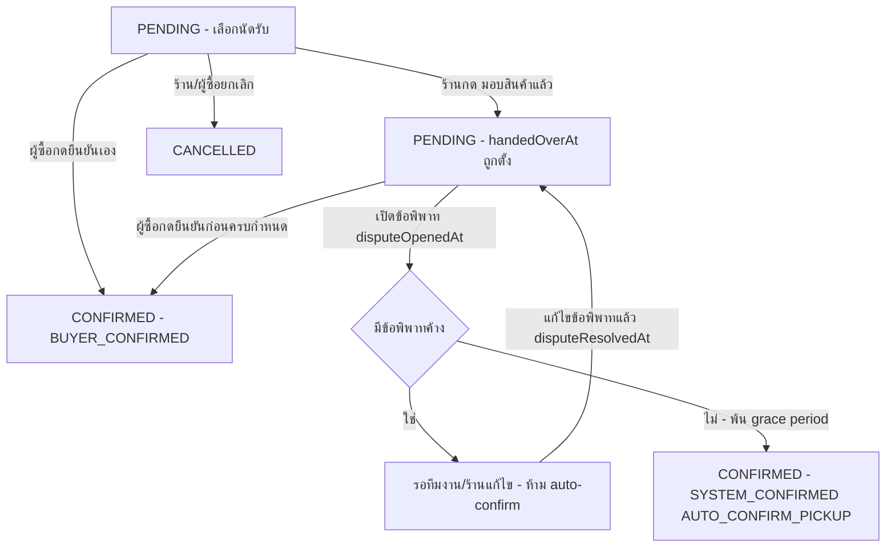

> **โมดูล:** M60-PickupBankTransfer
> **ประเภทเอกสาร:** Product Requirements Document (PRD)
> **เวอร์ชัน:** 1.0
> **วันที่จัดทำ:** 2026-08-28
> **สถานะ:** Requirements approved — user เคาะมติ D-1..D-5 ครบแล้ว 2026-08-28 (ดู §4.3)
> **เจ้าของเอกสาร:** BA + PO + PM

# PRD: นัดรับสินค้า และ การชำระเงินแบบโอน

---

## Executive Summary

ร้าน `ONLINE_SALES` วันนี้มีทางปิดออเดอร์ได้ 2 เส้นทางเท่านั้น: ส่งผ่านขนส่ง (iShip/manual tracking) แล้วรอผู้ซื้อยืนยัน หรือเก็บเงินปลายทาง (COD) แล้วรอขนส่งเคลียร์เงิน. ร้านที่ลูกค้ามารับสินค้าเองที่หน้าร้าน/นัดจุดส่งมอบ (นัดรับ) และร้านที่รับเงินผ่านการโอน/พร้อมเพย์ **ไม่มีเส้นทางที่ตรงกับพฤติกรรมจริงเลย** — ต้องฝืนกรอกเลขพัสดุปลอมเพื่อปิดออเดอร์ หรือปล่อยออเดอร์ค้าง `PENDING` ตลอดกาลเพราะไม่มีปุ่ม "ได้เงินแล้ว" ที่ใช้งานได้จริง (ระบบมีแค่บล็อกแนบสลิปฝั่งผู้ซื้อซึ่งข้อมูล prod ยืนยันว่า **ไม่เคยถูกใช้เลยสักครั้ง** — 0 จาก 504 ออเดอร์).

ฟีเจอร์นี้เพิ่ม 2 อย่างให้ร้าน `ONLINE_SALES`: (1) เลือก **"นัดรับ"** เป็นวิธีจัดส่งได้ตอนสร้าง/แก้ไขออเดอร์ — ออเดอร์ประเภทนี้ไม่มี action พัสดุ/ที่อยู่ และปิดงานผ่านกลไก "ร้านยืนยันว่ามอบของแล้ว + ช่วงเวลาให้ผู้ซื้อทักท้วง" แบบเดียวกับที่ระบบใช้อยู่แล้วกับพัสดุที่ขนส่งยืนยันว่าส่งถึง (feature 00039); (2) ปุ่ม **"ได้รับเงินแล้ว"** ฝั่งร้าน สำหรับออเดอร์ที่ชำระด้วยโอนเงิน/พร้อมเพย์/เงินสด (mirror ปุ่ม "ได้รับเงินปลายทางแล้ว" ที่ร้านกดจริงแล้ว 380 ครั้งบน prod) พร้อม**หน้าตั้งค่าบัญชีรับเงินของร้าน** ที่ผู้ซื้อเห็นได้ตั้งแต่ก่อนล็อกอิน (ปัจจุบันไม่มีที่เก็บบัญชีร้านเลยทั้งระบบ — หน้าออเดอร์เขียนแค่คำว่า "โอนเข้าบัญชี" ลอย ๆ).

คุณค่าธุรกิจ: เปิดทางให้ธุรกรรม "นัดรับ+โอนเงิน" ซึ่งเป็นพฤติกรรมจริงของร้านขายผ่านแชท (Facebook 498/504 ออเดอร์) ให้ปิดงานได้ถูกต้องในระบบ แทนที่จะหลุดออกไปนอกระบบ Deep โดยสิ้นเชิง — ซึ่งขัดกับ vision หลักของ Deep ที่ต้องการให้ **ทุกธุรกรรมมีประวัติที่ตรวจสอบได้**.

---

## 1. Business Goals & KPIs

### 1.1 เป้าหมายทางธุรกิจ

| เป้าหมาย | รายละเอียด |
|----------|-----------|
| **G-1: ปิดช่องว่างของ flow "นัดรับ+โอนเงิน"** | ธุรกรรมที่เกิดจริงนอกระบบ (ร้านนัดลูกค้ามารับของแล้วโอนเงินกันเอง) ให้มีที่ทางในระบบ Deep — มีประวัติ มีสถานะ นับเข้า Trust Score ได้ |
| **G-2: ลดออเดอร์ค้าง `PENDING` แบบไม่มีทางปิด** | ออเดอร์โอนเงินที่ผู้ซื้อไม่เคยล็อกอินมาแนบสลิป (0/504 บน prod) ต้องมีทางปิดที่ไม่ต้องพึ่งพฤติกรรมที่พิสูจน์แล้วว่าไม่เกิดขึ้นจริง |
| **G-3: ไม่เปิดช่องให้ร้านปั๊มยอด CONFIRMED ปลอม** | เส้นทางปิดงานใหม่ (นัดรับ, ยืนยันรับเงิน) ต้องไม่ทำให้ Trust Score / Completion Rate ถูกโกงได้ง่ายกว่าเส้นทางที่มีอยู่แล้ว |

### 1.2 ตัวชี้วัดความสำเร็จ (KPIs)

| KPI | คำอธิบาย/วิธีวัด | เป้าหมาย |
|-----|----------|---------|
| **การใช้งาน "นัดรับ"** | จำนวนออเดอร์ที่ตั้ง `fulfillmentMode = PICKUP` โดยร้าน `ONLINE_SALES` ต่อสัปดาห์ | > 0 ภายใน 2 สัปดาห์หลัง deploy (baseline ปัจจุบัน = 0 เพราะไม่มีทางเลือกนี้) |
| **การใช้งาน "ได้รับเงินแล้ว" (โอน)** | จำนวนครั้งที่ร้านกดยืนยันรับเงินโอน/พร้อมเพย์ เทียบกับจำนวนออเดอร์ `paymentMethod ∈ {TRANSFER, PROMPTPAY}` ทั้งหมดในช่วงเวลาเดียวกัน | > 50% ของออเดอร์โอนเงินใหม่ถูกยืนยันภายใน 7 วัน (เทียบกับ 0% ปัจจุบันของกลไกแนบสลิปฝั่งผู้ซื้อ) |
| **ออเดอร์ TRANSFER ค้าง PENDING เกิน 14 วัน** | สัดส่วนออเดอร์โอนเงินที่ยังไม่ปิดหลังผ่านไป 14 วัน | ลดลงเทียบกับ baseline ก่อน deploy |
| **อัตราข้อพิพาทของออเดอร์นัดรับ** | `disputeOpenedAt` ที่เกิดกับออเดอร์ `fulfillmentMode=PICKUP` / จำนวนออเดอร์นัดรับที่ auto-confirm ทั้งหมด | ไม่สูงกว่าอัตราข้อพิพาทของออเดอร์ที่ auto-confirm จากพัสดุ (feature 00039) อย่างมีนัยสำคัญ — ถ้าสูงกว่า = สัญญาณว่า grace period สั้นเกินไปหรือกลไกถูกใช้ในทางที่ผิด |

---

## 2. User Personas (กลุ่มผู้ใช้งาน)

### 2.1 ผู้ขาย — ร้านขายออนไลน์ผ่านแชท (`Shop.vertical = ONLINE_SALES`)

**ข้อมูลพื้นฐาน:**
- ขายผ่าน Facebook/LINE/Instagram เป็นหลัก (ข้อมูลจริง 2026-08-28: 498/504 ออเดอร์มาจากช่องทาง Facebook, STOREFRONT ใช้แค่ 6 ใบ)
- 96.4% ของออเดอร์ (486/504) เป็น COD — ใช้ขนส่งจริง; ส่วนน้อยนัดลูกค้ามารับเอง หรือรับโอนเงินก่อนส่ง

**เป้าหมาย:**
- ปิดออเดอร์ที่ลูกค้านัดมารับเองได้โดยไม่ต้องกรอกเลขพัสดุปลอมเพื่อ "หลอกระบบ" ให้ผ่าน state machine
- รับรู้ว่าเงินโอนเข้าบัญชีแล้วโดยไม่ต้องพึ่งลูกค้าแนบสลิป (ซึ่งพิสูจน์แล้วว่าแทบไม่มีใครทำ)

**ความต้องการ:**
- ทางเลือก "นัดรับ" ในฟอร์มสร้าง/แก้ไขออเดอร์ ที่ทำงานเหมือนออเดอร์ไม่ต้องจัดส่งอื่น ๆ (ไม่บังคับที่อยู่, ไม่มีปุ่มแจ้งเลขพัสดุ)
- ปุ่มกดยืนยันเองว่า "ได้รับเงินแล้ว" สำหรับออเดอร์โอนเงิน (เหมือนที่มีให้ COD อยู่แล้ว)
- ที่ตั้งค่าบัญชีธนาคาร/พร้อมเพย์ของร้าน ให้ระบบแสดงในหน้าออเดอร์แทนการบอกลูกค้าเองนอกระบบ

**จุดปวด (Pain Points):**
- ต้องกรอกเลขพัสดุมั่ว ๆ เพื่อปิดออเดอร์ที่ลูกค้ามารับเอง (ไม่มีทางเลือกอื่นในระบบวันนี้)
- ออเดอร์โอนเงินค้าง `PENDING` ไม่มีวันปิดเพราะรอลูกค้าแนบสลิปที่ไม่เคยแนบ
- ต้องพิมพ์เลขบัญชีในแชทเองทุกครั้ง — ไม่มีที่ที่ระบบจำไว้ให้

### 2.2 ผู้ซื้อ — คนที่นัดรับของ/โอนเงินให้ร้านที่ขายผ่านแชท

**ข้อมูลพื้นฐาน:**
- ส่วนใหญ่ไม่เคยสมัครสมาชิก Deep และไม่ล็อกอิน (ยืนยันจากข้อมูล prod: ทางแนบสลิปที่ต้องล็อกอิน ไม่มีใครใช้เลยสักครั้ง; feature 00041 เองก็บันทึกไว้ว่า flow บังคับล็อกอินทำให้ผู้ซื้อแทบไม่มีใครเข้ามาเลย ก่อนจะเปิด guest-view)
- เปิดลิงก์ `/o/{token}` จากแชทเพื่อเช็คยอด/วิธีโอน

**เป้าหมาย:**
- เห็นว่าต้องโอนเงินไปที่บัญชีไหน โดยไม่ต้องสมัครสมาชิก/ล็อกอินก่อน
- (ถ้าอยากยืนยันเอง) กดยืนยันว่ารับของแล้วได้เร็ว ไม่ต้องผ่านหลายขั้นตอน

**ความต้องการ:**
- ข้อมูลบัญชีโอนเงินของร้านต้องอยู่ในหน้าลิงก์ออเดอร์ ไม่ต้องถามในแชทแยก
- ถ้ากดยืนยันรับของเอง ต้องทำได้ง่าย — แต่ถ้าไม่กด ก็ต้องไม่ทำให้ตัวเองเสียประโยชน์ (เช่น ไม่มีใครดูแลข้อพิพาทถ้าของไม่ตรง)

**จุดปวด (Pain Points):**
- หน้าออเดอร์บอกแค่ "โอนเข้าบัญชี" โดยไม่มีเลขบัญชี — ต้องถามร้านซ้ำในแชท
- ถูกบังคับให้ล็อกอิน/สมัครสมาชิกก่อนจะทำอะไรได้เลย (ทั้งที่งานที่ต้องการแค่ "ดูเลขบัญชีแล้วโอน")

---

## 3. Business Requirements

### 3.1 นัดรับสินค้า (Pickup Fulfillment)

**ความต้องการ:**
- ร้าน `ONLINE_SALES` เลือก "นัดรับ" เป็นวิธีส่งมอบของออเดอร์ได้ตอนสร้าง/แก้ไขออเดอร์ (ขณะที่ยังแก้ไขได้ คือสถานะ `PENDING` เท่านั้น — เหมือนกฎแก้ไขออเดอร์อื่นทั้งหมด)
- ออเดอร์ที่เลือก "นัดรับ" ไม่ถูกขอที่อยู่จัดส่ง และไม่มีปุ่ม/เมนู "แจ้งเลขพัสดุ" ทุกจุดที่มีอยู่ในระบบวันนี้
- ร้านกดยืนยันได้เองว่า "มอบสินค้าให้ลูกค้าแล้ว" — ปิดออเดอร์ผ่านช่วงเวลาให้ผู้ซื้อทักท้วงได้ก่อน ไม่ปิดทันทีที่กด (ดูเหตุผลใน §4.3 D-1)
- ผู้ซื้อยังกดยืนยันได้เองเช่นเดิม (ปิดทันทีถ้ากดก่อนครบกำหนด)

**Business Rules:**
- ทางเลือก "นัดรับ" เปิดให้เฉพาะร้าน `Shop.vertical = ONLINE_SALES` เท่านั้น (ร้านบริการมีระบบนัดคิวงานของตัวเองอยู่แล้ว, ร้านที่พักมี booking flow ของตัวเองอยู่แล้ว — ไม่ทับซ้อน)
- ออเดอร์นัดรับต้องไม่ปรากฏในตัวนับ/รายงานที่นับ "พัสดุที่รอเข้ารับ" (`AWAITING_PICKUP` ของระบบจัดส่งเดิม — เป็นความหมายคนละเรื่องกัน ดู §7 Glossary) — ต้องมีตัวกรอง/หมวดของตัวเอง
- การปิดงานอัตโนมัติ (auto-confirm) ต้องหยุดทันทีถ้ามีข้อพิพาทค้าง (`Order.disputeOpenedAt` ไม่ว่าง และ `disputeResolvedAt` ยังว่าง) — ใช้กลไกเดียวกับพัสดุที่ auto-confirm จากขนส่ง (feature 00039, BR-OSM-03)

**เหตุผล:**
- ร้านขายผ่านแชทจำนวนมากนัดลูกค้ามารับของเอง (เช่น ขายในพื้นที่เดียวกัน, สินค้าราคาแพงที่ลูกค้าอยากเช็คของก่อนจ่าย) — วันนี้ไม่มีทางบันทึกธุรกรรมแบบนี้ในระบบเลย ทำให้ Deep พลาดโอกาสสร้างประวัติ/Trust Score จากธุรกรรมกลุ่มนี้ทั้งหมด

### 3.2 การยืนยันรับเงินโอน (Bank Transfer Payment Confirmation)

**ความต้องการ:**
- ร้านกดยืนยันเองได้ว่า "ได้รับเงินแล้ว" สำหรับออเดอร์ที่ `paymentMethod` เป็นโอนเงิน/พร้อมเพย์ (และแนะนำให้ครอบคลุมเงินสดด้วย — ดู §4.3 D-2)
- การยืนยันนี้ไม่ทำให้สถานะออเดอร์ (`PENDING`/`SHIPPED`/`CONFIRMED`) เปลี่ยนเอง — เป็นแกนคนละเรื่องกับการปิดงาน (ตรงกับหลักการที่ระบบใช้อยู่แล้วกับ COD: ได้เงินปลายทางแล้ว ไม่ได้แปลว่าลูกค้ารับของแล้ว)
- ป้ายสถานะการชำระเงินในหน้าออเดอร์ (ทั้งฝั่งร้านและฝั่งผู้ซื้อ) ต้องแยกให้ออกระหว่าง "รอชำระ" / "ร้านยืนยันว่าได้รับเงินแล้ว" / "รอตรวจสอบสลิป" (ผู้ซื้อแนบมาแต่ร้านยังไม่ยืนยัน) — 3 สถานะนี้ต้องไม่ปนกัน
- ร้านย้อนกลับ (undo) การยืนยันรับเงินได้ ถ้ากดผิด

**Business Rules:**
- ผู้ซื้อยังแนบสลิปได้ตามเดิม (ทางเดิม, ไม่ถอด) — เป็นหลักฐานเสริม ไม่ใช่ตัวขยับสถานะการชำระเงิน
- การยืนยันรับเงินเป็นการกระทำของ**ร้าน** เท่านั้น (พนักงานที่มีสิทธิ์แก้ออเดอร์) — ไม่ใช่ระบบอัตโนมัติ เพราะไม่มีสัญญาณจากภายนอก (ธนาคาร/เกตเวย์) ยืนยันเงินเข้าจริงเหมือนที่ COD มี iShip เป็นคนยืนยัน

**เหตุผล:**
- ข้อมูลจริงบน prod ชี้ชัดว่ากลไก "ผู้ซื้อแนบสลิป" ที่มีอยู่แล้วไม่เคยถูกใช้เลย (0/504) ในขณะที่กลไก "ร้านกดยืนยันเอง" (`codReceivedAt`) ถูกใช้จริง 380 ครั้ง — ต้องออกแบบตามพฤติกรรมที่พิสูจน์แล้วว่าเกิดขึ้นจริง ไม่ใช่ตามที่ควรจะเป็นในทางทฤษฎี

### 3.3 บัญชีรับเงินของร้าน (Shop Bank Account for Receiving Payment)

**ความต้องการ:**
- ร้านตั้งค่าบัญชีธนาคาร/พร้อมเพย์ที่ใช้รับเงินได้ในหน้าตั้งค่าร้าน
- ระบบสร้าง **QR พร้อมเพย์ที่ฝังยอดเงินของออเดอร์ใบนั้น** ให้ผู้ซื้อสแกนจ่ายได้ทันที (มติ D-5) — ผู้ซื้อไม่ต้องพิมพ์เลขบัญชีหรือยอดเงินเอง ซึ่งเป็นสองจุดที่โอนผิดบ่อยที่สุด
- ผู้ซื้อเห็นบัญชีนี้ในหน้าออเดอร์ (`/o/{token}`) เมื่อออเดอร์นั้นชำระด้วยโอนเงิน/พร้อมเพย์ — **เห็นได้แม้ยังไม่ได้ล็อกอิน** (มิฉะนั้นจะซ้ำปัญหาเดิมที่ทำให้ผู้ซื้อ 0% เข้าถึงกลไกที่ต้องล็อกอินก่อน)
- บัญชีที่แสดงในออเดอร์แต่ละใบ ต้องเป็นบัญชีที่ตกลงกันไว้ ณ เวลาที่สร้างออเดอร์ ไม่ใช่บัญชีปัจจุบันของร้าน ณ เวลาที่เปิดหน้าดู (กันกรณีร้านเปลี่ยนบัญชีทีหลังแล้วออเดอร์เก่าเห็นเลขบัญชีที่ไม่เคยตกลงกัน)

**Business Rules:**
- การเปลี่ยนบัญชีรับเงินของร้านต้องยืนยันตัวตนซ้ำ (เช่น รหัสผ่าน/OTP) — บัญชีธนาคารเป็นข้อมูลที่ถ้าถูกสวมสิทธิ์แก้ไข (account takeover) จะทำให้เงินของลูกค้าไหลไปผิดที่ทันที
- แนะนำ (ไม่บังคับ MVP): ตรวจเลขบัญชีใหม่กับฐานข้อมูล `ScamReportIdentifier` ที่ระบบมีอยู่แล้ว (เก็บเป็น HMAC hash — PDPA-compliant) — ถ้าตรง ไม่บล็อกแต่แจ้งเตือนทีมงาน เพราะเป็นกลไกป้องกันมิจฉาชีพที่มีต้นทุนต่ำมากและตรงกับ vision หลักของ Deep

**เหตุผล:**
- ระบบไม่มีที่เก็บบัญชีรับเงินของร้านเลยแม้แต่ฟิลด์เดียว — ทุกวันนี้ร้านต้องพิมพ์เลขบัญชีเองในแชท ซึ่งเป็นข้อมูลที่ไม่มีประวัติ ไม่มีการตรวจสอบ และเป็นช่องทางที่มิจฉาชีพเลียนแบบร้านจริงได้ง่ายที่สุด (ปลอมแชท/ปลอมบัญชี) — Deep มีเป้าหมายแก้ปัญหานี้อยู่แล้วตาม Vision Statement (PRD หลัก §1.1)

---

## 4. Business Rules & Constraints

### 4.1 กฎทางธุรกิจหลัก

| กฎ | คำอธิบาย |
|----|----------|
| **BR-PKP-01** | "นัดรับ" เปิดเฉพาะ `Shop.vertical = ONLINE_SALES` |
| **BR-PKP-02** | ออเดอร์นัดรับไม่มี action พัสดุ/ที่อยู่จัดส่งใด ๆ ทั้งสิ้น (ไม่ต่างจาก `NO_SHIPPING` ในแง่ UI) |
| **BR-PKP-03** | การปิดงานอัตโนมัติของออเดอร์นัดรับ ต้องหยุดเมื่อมีข้อพิพาทค้าง — ใช้เกณฑ์เดียวกับ BR-OSM-03 (feature 00039) |
| **BR-PAY-01** | การยืนยัน "ได้รับเงินแล้ว" เป็นสิทธิ์ของร้านเท่านั้น (ผู้มีสิทธิ์แก้ไขออเดอร์) |
| **BR-PAY-02** | การยืนยันรับเงิน ไม่ผูกกับ/ไม่เปลี่ยนสถานะออเดอร์อัตโนมัติ — เป็นแกนข้อมูลคนละแกนกับ "รับของแล้วหรือยัง" |
| **BR-BANK-01** | บัญชีรับเงินที่แสดงในออเดอร์ = บัญชี ณ เวลาสร้างออเดอร์ (snapshot) ไม่ใช่ค่าปัจจุบันของร้าน |
| **BR-BANK-02** | เปลี่ยนบัญชีรับเงินของร้านต้องยืนยันตัวตนซ้ำ |

### 4.2 ข้อจำกัดทางธุรกิจ

| ข้อจำกัด | รายละเอียด |
|---------|-----------|
| **ไม่มีสัญญาณภายนอกยืนยันเงินโอน** | ต่างจาก COD ที่มี iShip เป็นบุคคลที่สามยืนยันว่าเงินเข้าจริง การโอนเงินตรงไม่มีระบบใดยืนยันแทนร้าน — การยืนยันจึงเป็นการกล่าวอ้างของร้านเอง (self-report) ต้องยอมรับความเสี่ยงนี้อย่างเปิดเผย ไม่ใช่แสร้งว่าเทียบเท่าสัญญาณภายนอก |
| **ไม่มีสัญญาณภายนอกยืนยันการนัดรับ** | เช่นเดียวกับข้างต้น — "มอบสินค้าแล้ว" เป็นคำยืนยันของร้าน ไม่มีบุคคลที่สาม (ขนส่ง) ยืนยันเหมือนพัสดุ |
| **ผู้ซื้อส่วนใหญ่ไม่ล็อกอิน** | ทุก action ที่ผูกตัวตน (ยืนยันรับของเอง, แนบสลิป) ยังต้องผ่านด่าน login/claim ของระบบเดิม (feature 00015) ซึ่งพิสูจน์แล้วว่ามีอัตราการใช้งานต่ำมาก — ต้องออกแบบให้ระบบ "ทำงานได้แม้ผู้ซื้อไม่เคยล็อกอินเลย" |

### 4.3 มติที่เคาะแล้ว (Decision Log — D-1 ถึง D-5)

🛑 **ทั้ง 5 ข้อ user เคาะแล้ว 2026-08-28** — ถือเป็นข้อผูกพันของ SRS/SDS ห้ามตีความใหม่โดยไม่กลับมาถาม
เหตุผลเบื้องหลังแต่ละข้อดูที่ BRD §7.2

| # | มติ | หมายเหตุ |
|---|-----|---------|
| **D-1** | ✅ **ร้านกด "มอบของแล้ว" → ระบบปิดงานอัตโนมัติเมื่อครบ 48 ชั่วโมง** เว้นแต่มีข้อพิพาทค้าง | ผู้ซื้อกดยืนยันเองได้ตลอดเวลา (ปิดทันที) · **ไม่ให้ร้านกด `CONFIRMED` ตรง ๆ** · ตัวเลข 48 ชม. เป็นค่าที่เคาะแล้ว ต้องอยู่ใน SSOT ตัวเดียว ห้าม hardcode กระจาย |
| **D-2** | ✅ **ฟิลด์ใหม่บน `Order`** (`paymentConfirmedAt` + `paymentConfirmedByUserId`) mirror `codReceivedAt` | **ไม่ปลดล็อก `OrderPayment`/feature 00050 ให้ `ONLINE_SALES`** — เงื่อนไข `vertical === 'SERVICE_QUEUE'` ทั้ง 4 จุดและเทส `[blocker]` `service-queue-vertical-gate.test.ts` **ต้องไม่ถูกแตะ** |
| **D-3** | ✅ **ใช้ค่า `fulfillmentMode = 'PICKUP'` เดิม** ไม่สร้างค่าใหม่ | prod มีออเดอร์ `PICKUP` 0 ใบ และร้าน `LODGING` 0 ร้าน ⇒ ไม่ชนข้อมูลใคร · ต้องอัปเดตคอมเมนต์ที่อ้างว่า "PICKUP มาจาก booking เท่านั้น" ในคอมมิตเดียวกัน |
| **D-4** | ✅ **"นัดรับ" เป็นแกนอิสระจาก `salesChannel`** | เลือกนัดรับได้แม้ `salesChannel = FACEBOOK` — ไม่ผูก ไม่ derive จาก `STOREFRONT` |
| **D-5** | ✅ **บัญชีรับเงิน 1 ชุดต่อร้าน + snapshot ลงออเดอร์ + แสดงต่อ guest + สร้าง QR พร้อมเพย์ที่ฝังยอดเงิน** | ผู้ซื้อสแกนจ่ายได้เลยไม่ต้องพิมพ์เลข/ยอดเอง (ลดโอกาสโอนผิดยอด/ผิดบัญชี) · QR ต้องสร้างตามมาตรฐาน EMVCo ของพร้อมเพย์ · เปลี่ยนบัญชีต้องยืนยันตัวตนซ้ำ |

**มติเพิ่มเติมที่เคาะพร้อมกัน:** ปุ่ม "ได้รับเงินแล้ว" ครอบ **`TRANSFER` + `PROMPTPAY` + `CASH`** (ไม่ครอบ `COD` ซึ่งใช้ `codReceivedAt` เดิม)

---

## 5. Out of Scope (นอกขอบเขต)

| หัวข้อ | คำอธิบาย/ขอบเขต |
|--------|----------|
| **ตรวจสลิปอัตโนมัติ / OCR** | ไม่มีการอ่านยอดเงิน/เวลาโอนจากรูปสลิปด้วย AI หรือ third-party — การยืนยันเป็นการกดของคนล้วน ๆ |
| **Escrow / เก็บเงินไว้ก่อนส่งมอบ** | Deep ไม่ใช่ตัวกลางถือเงิน — เงินโอนตรงจากผู้ซื้อเข้าบัญชีร้านเสมอ ระบบแค่บันทึกว่า "ร้านยืนยันว่าได้รับแล้ว" |
| **Payment Gateway / ตัดบัตรผ่านระบบ** | ไม่มีการเชื่อมต่อ payment gateway ใด ๆ ในรอบนี้ — ยังเป็นการโอนเงินนอกระบบแล้วมายืนยันในระบบเหมือนเดิม |
| **ระบบมัดจำเต็มรูปแบบของ feature 00050** | ไม่นำ concept DEPOSIT/BALANCE แบบหลายก้อนเงินของร้านบริการมาใช้กับ `ONLINE_SALES` — ออเดอร์ขายของทั่วไปเป็นการชำระเงินก้อนเดียว ไม่มีมัดจำ |
| **ระบบนัดหมายเวลารับของแบบมีปฏิทิน** | "นัดรับ" ในฟีเจอร์นี้ไม่มีการเลือกวัน/เวลานัดผ่านปฏิทินเหมือนระบบคิวงาน (feature 00024) — เป็นแค่ทางเลือกวิธีส่งมอบ ("นัดรับ" vs "จัดส่ง") การนัดวัน/เวลาที่แท้จริงยังคุยกันนอกระบบผ่านแชทเหมือนเดิม |
| **หลายบัญชีธนาคารต่อร้าน / ตารางบัญชีแยก** | MVP เก็บบัญชีรับเงินได้ชุดเดียวต่อร้าน — ไม่รองรับสลับหลายบัญชีหรือเลือกบัญชีต่อออเดอร์ |
| **การตรวจสอบเลขบัญชีกับฐาน ScamReportIdentifier แบบบล็อกอัตโนมัติ** | มีแค่ระดับ "แจ้งเตือนทีมงาน" (Should, ไม่ Must) ไม่ใช่การบล็อกร้านไม่ให้ตั้งบัญชีที่ต้องสงสัย — การตัดสินใจสุดท้ายยังเป็นของทีมงาน |
| **แก้ไข logic `salesChannel = STOREFRONT` เดิม** | ช่องโหว่ที่พบระหว่างสำรวจ (STOREFRONT ไม่ทำให้ `fulfillmentMode` เปลี่ยนจาก `SHIPPED`) เป็นบั๊กที่มีอยู่ก่อนฟีเจอร์นี้ ไม่ใช่สิ่งที่ฟีเจอร์นี้ต้องแก้ — บันทึกไว้เป็น known-gap แยก |

---

## 6. Risks & Mitigation (ความเสี่ยงและแนวทางแก้ไข)

### 6.1 ความเสี่ยงทางธุรกิจ

| ความเสี่ยง | ผลกระทบ | ระดับความรุนแรง | แนวทางแก้ไข |
|-----------|---------|-----------------|-------------|
| **ร้านกดยืนยัน "มอบของแล้ว"/"ได้รับเงินแล้ว" ทั้งที่ยังไม่เกิดขึ้นจริง (ปั๊มยอด)** | Trust Score / Completion Rate ถูกโกงได้ง่ายขึ้น — กระทบความน่าเชื่อถือของทั้งแพลตฟอร์ม | สูง | ใช้กลไก grace period + สิทธิ์ทักท้วงของผู้ซื้อ (mirror feature 00039) แทนการปิดทันที; ตรวจสอบอัตราข้อพิพาทของออเดอร์นัดรับเทียบกับออเดอร์พัสดุปกติเป็นระยะ |
| **บัญชีรับเงินของร้านถูกสวมสิทธิ์แก้ไข (account takeover)** | เงินของลูกค้าที่โอนเข้าไปหลังจากนั้นไหลไปบัญชีมิจฉาชีพโดยตรง | สูง | บังคับยืนยันตัวตนซ้ำก่อนเปลี่ยนบัญชี + snapshot บัญชีลงออเดอร์ตอนสร้าง (ออเดอร์เก่าไม่ได้รับผลจากบัญชีที่เพิ่งเปลี่ยน) |
| **ผู้ซื้อโอนเงินผิดร้าน (ร้านปลอม/บัญชีปลอม)** | ผู้ซื้อสูญเงินโดยไม่มีทางเรียกคืน — ตรงข้ามกับ vision "ลดปัญหามิจฉาชีพ" ของ Deep | กลาง-สูง (ความเสี่ยงเดิมของโลกออนไลน์ ไม่ใช่ความเสี่ยงใหม่จากฟีเจอร์นี้ — แต่ฟีเจอร์นี้ทำให้บัญชีปรากฏใน "ระบบทางการ" ของ Deep จึงต้องรับผิดชอบมากกว่าการพิมพ์ในแชท) | ตรวจ hash เลขบัญชีกับ `ScamReportIdentifier` เมื่อร้านตั้ง/เปลี่ยนบัญชี (Should) + คงกลไกรายงานมิจฉาชีพเดิมที่มีอยู่แล้วให้ครอบคลุมถึงบัญชีที่ตั้งผ่านช่องทางนี้ |

### 6.2 ความเสี่ยงทางเทคนิค

| ความเสี่ยง | ผลกระทบ | แนวทางแก้ไข |
|-----------|---------|-------------|
| **ค่า `fulfillmentMode = 'PICKUP'` ถูกใช้ร่วมกับความหมายเดิม (การจองที่พัก)** | โค้ดจุดใดจุดหนึ่งที่สันนิษฐานผิดว่า `PICKUP` = การจองที่พักเสมอ อาจแตกเงียบ ๆ | สำรวจ (grep) ทุกจุดที่อ่าน `fulfillmentMode === 'PICKUP'` ให้ครบก่อน implement (SDS phase) และปรับ comment ที่อ้างว่า "PICKUP มาจาก booking เท่านั้น" ให้ตรงความจริงใหม่ ในคอมมิตเดียวกัน |
| **`getPaymentBadge()` ไม่รู้จักสถานะ "ร้านยืนยันรับเงินแล้วแต่ order ยังไม่ CONFIRMED"** | ป้ายสถานะการชำระเงินในหน้าจอ (ทั้งฝั่งร้านและผู้ซื้อ) จะยังขึ้น "รอชำระ"/"รอตรวจสอบสลิป" ทั้งที่ร้านยืนยันแล้ว | ขยาย `getPaymentBadge()` (SSOT เดียว — Hard Rule 16) ให้รับสถานะยืนยันรับเงินใหม่เข้าไปด้วย ไม่สร้างฟังก์ชันคำนวณป้ายซ้ำที่อื่น |
| **`deriveShippingStage()` ไม่เคยอ่าน `fulfillmentMode` เลย** | ออเดอร์นัดรับที่ยัง `PENDING` จะถูกจัดเข้า `AWAITING_PARCEL` ("รอเลขพัสดุ") ทั้งบนไทล์ Command Center และตัวกรอง `/orders?stage=` — พูดผิดกับผู้ขายทุกวัน | ต้องแก้ `deriveShippingStage()` (TS) และ `buildShippingStageSql()` (SQL คู่ขนาน) พร้อมกัน แล้วรันเทสเทียบสองฝั่ง |
| **Guest view (`guest-order-data.ts`) เป็น allow-list ที่ต้องเพิ่มฟิลด์ใหม่โดยตั้งใจ** | ถ้าลืมเพิ่มฟิลด์บัญชีรับเงิน/สถานะยืนยันรับเงินเข้า allow-list ผู้ซื้อที่ยังไม่ล็อกอินจะไม่เห็นข้อมูลเลย — ฟีเจอร์ใช้งานไม่ได้จริงสำหรับกลุ่มเป้าหมายหลัก | ต้องแก้ `guest-order-data.ts` ในคอมมิตเดียวกับ FR ที่เกี่ยวข้องเสมอ ระบุเป็น acceptance criteria ชัดเจน |

---

## 7. Glossary (อภิธานศัพท์)

| คำศัพท์ | ความหมาย |
|---------|----------|
| **นัดรับ (Pickup)** | วิธีส่งมอบสินค้าที่ผู้ซื้อมารับเองจากร้าน (หรือจุดนัดพบ) โดยไม่ผ่านขนส่ง — `Order.fulfillmentMode = 'PICKUP'` |
| **AWAITING_PICKUP (ของระบบพัสดุเดิม)** | 🛑 **คำพ้องรูปที่ต่างความหมาย** — เป็นสถานะไทม์ไลน์ของพัสดุที่ "ขนส่งยังไม่เข้ารับพัสดุจากร้าน" (`src/lib/order-stage.ts`) คนละเรื่องกับ "นัดรับ" ของฟีเจอร์นี้เลย ห้ามสับสน |
| **ยืนยันรับเงินแล้ว (Payment Confirmed by Seller)** | การกระทำของร้านที่ระบุว่าได้รับเงินโอน/พร้อมเพย์/เงินสดแล้ว — คนละแกนกับสถานะออเดอร์ |
| **มอบของแล้ว (Handed Over)** | การกระทำของร้านที่ระบุว่าได้ส่งมอบสินค้าให้ผู้ซื้อในการนัดรับแล้ว — จุดเริ่มนับ grace period ก่อน auto-confirm |
| **Grace Period** | ช่วงเวลาหลังร้านกด "มอบของแล้ว" ที่ผู้ซื้อยังทักท้วงได้ก่อนออเดอร์จะถูกปิดอัตโนมัติเป็น CONFIRMED |
| **Snapshot บัญชีรับเงิน** | บัญชีธนาคาร/พร้อมเพย์ที่บันทึกลงออเดอร์ ณ เวลาสร้าง — ไม่เปลี่ยนตามการตั้งค่าปัจจุบันของร้านภายหลัง |

---

## 8. Success Metrics (ตัวชี้วัดความสำเร็จ)

| ตัวชี้วัด | ค่าที่คาดหวัง | วิธีวัด |
|----------|---------------|--------|
| **ออเดอร์นัดรับถูกสร้าง** | > 0 ภายในสัปดาห์แรกหลัง deploy | นับ `Order` ที่ `fulfillmentMode='PICKUP'` และ `shop.vertical='ONLINE_SALES'` (แยกจาก LODGING เดิม) |
| **อัตราการปิดออเดอร์โอนเงิน** | ออเดอร์ใหม่ที่ `paymentMethod ∈ {TRANSFER, PROMPTPAY}` ปิดสถานะ (CONFIRMED) ได้ภายใน 14 วันเพิ่มขึ้นเทียบ baseline ก่อน deploy | เทียบ % ก่อน/หลัง deploy จากข้อมูล `Order` |
| **การใช้ปุ่ม "ได้รับเงินแล้ว"** | ถูกใช้จริงในสัปดาห์แรก (เทียบกับ 0 ครั้งของกลไกแนบสลิปเดิมตลอดอายุระบบ) | นับจำนวนครั้งที่ `paymentConfirmedAt` ถูกตั้งค่า |
| **อัตราข้อพิพาทของออเดอร์นัดรับ** | ไม่สูงกว่าอัตราข้อพิพาทของออเดอร์พัสดุที่ auto-confirm อย่างมีนัยสำคัญ | เทียบสัดส่วน `disputeOpenedAt` ของสองกลุ่ม |

---

## 9. Dependencies & Assumptions

### 9.1 สิ่งที่ต้องพึ่งพา (Dependencies)

| ระบบ/ส่วนประกอบ | ความสัมพันธ์ |
|-----------------|-------------|
| **`order-action-set.ts`** | ต้องรับรู้ `fulfillmentMode='PICKUP'` ที่เขียนโดยออเดอร์ขายของ (ปัจจุบันรองรับอยู่แล้วโดยพฤติกรรม — ต้องยืนยันซ้ำใน SDS) |
| **`shipping-address-status.ts`** | ตัวตัดสินว่าต้องกรอกที่อยู่หรือไม่ — ต้องเพิ่มเงื่อนไข "เลือกนัดรับ" เป็น input ใหม่ |
| **`order-stage.ts` + `order-stage-sql.ts`** | ตัวจัดกองสถานะพัสดุที่ไม่เคยอ่าน `fulfillmentMode` — ต้องเพิ่มกองของนัดรับ และแก้ทั้ง TS/SQL พร้อมกัน |
| **`order-auto-confirm.service.ts` (feature 00039)** | รูปแบบ auto-confirm + grace period + dispute-gate ที่มีอยู่แล้วสำหรับพัสดุ — ฟีเจอร์นี้เพิ่ม job คู่ขนานสำหรับออเดอร์นัดรับโดยใช้ตรรกะ dispute-gate เดียวกัน |
| **`trust-score.service.ts` (`calcOrderScore`)** | นับ `Order.status='CONFIRMED'` ทุกใบเข้าคะแนนโดยไม่แยกว่าใครเป็นคนปิด — เส้นทางปิดงานใหม่ทุกเส้นทางมีผลต่อคะแนนนี้โดยอัตโนมัติ ต้องออกแบบไม่ให้เปิดช่องโกงง่ายกว่าที่มีอยู่ |
| **`guest-order-data.ts` (feature 00041)** | allow-list ของข้อมูลที่ผู้ซื้อเห็นได้ก่อนล็อกอิน — ต้องเพิ่มฟิลด์บัญชีรับเงิน/สถานะยืนยันรับเงินที่นี่ |
| **`buyer-reputation.ts` / `/customers`** | คำนวณความน่าเชื่อถือของลูกค้าจาก `hasShipment` ล้วน — ร้านที่ขายนัดรับล้วนจะเห็นข้อความ "ข้อมูลจะเริ่มขึ้นเองตั้งแต่พัสดุใบแรก" ค้างถาวร ต้องตัดสินใจว่าจะขยายสัญญาณหรือเปลี่ยนข้อความ |
| **`ScamReportIdentifier` model** | โครงสร้าง HMAC hash ที่มีอยู่แล้วสำหรับ BANK_ACCOUNT — ใช้ตรวจสอบเลขบัญชีใหม่ของร้าน (Should) |
| **`docs/SRS.md` §1 FR-6** | เอกสาร FR ของ Simple OMS ปัจจุบันต้อง sync ตอนเขียน SRS ของฟีเจอร์นี้ (HR11) |

### 9.2 สมมติฐาน (Assumptions)

- Grace period ของการปิดงานนัดรับอัตโนมัติ = **48 ชั่วโมง** (user เคาะ 2026-08-28 · สั้นกว่า 7 วันของพัสดุ เพราะเป็นการรับมอบต่อหน้า ไม่ต้องรอขนส่ง) — ต้องอยู่ในค่าคงที่ SSOT ตัวเดียว ห้าม hardcode กระจาย
- ปุ่ม "ได้รับเงินแล้ว" ครอบคลุมทั้ง `TRANSFER`, `PROMPTPAY`, และ `CASH` (**user เคาะ 2026-08-28**) เพราะเป็นกลุ่ม "ร้านต้องยืนยันเอง ไม่มีบุคคลที่สามยืนยันแทน" เดียวกันทั้งหมด และ `CASH` ไม่มีกลไกยืนยันใด ๆ อยู่เลยในปัจจุบัน (ต่างจาก `COD` ที่มี `codReceivedAt`)
- MVP ไม่รองรับหลายบัญชีธนาคารต่อร้าน — ถ้าพบว่าร้านต้องการสลับบัญชีบ่อย จะพิจารณาย้ายไปตารางแยกใน Phase 2
- จุดนัดรับของสินค้า (สถานที่/เวลานัด) **ไม่มีฟิลด์เฉพาะใน MVP** — ใช้ที่อยู่ร้าน (`Shop.address` ที่มีอยู่แล้ว) เป็นค่าอ้างอิงเริ่มต้น ส่วนรายละเอียดนัดหมายจริงคุยกันในแชทเหมือนเดิม

---

## 10. Appendix

### 10.1 ตัวอย่าง User Journey

**Scenario: ร้านขายผ่าน Facebook นัดลูกค้ามารับของที่ร้าน + รับโอนเงินล่วงหน้า**

1. ร้านสร้างออเดอร์จากแชท Facebook เลือกวิธีส่งมอบ = "นัดรับ" และวิธีชำระเงิน = "โอนเงิน"
2. ระบบสร้างออเดอร์ (`fulfillmentMode='PICKUP'`, `status='PENDING'`) ไม่ขอที่อยู่จัดส่ง พร้อมแนบบัญชีรับเงินของร้าน (snapshot ณ ขณะนั้น) ลงในลิงก์ `/o/{token}`
3. ร้านส่งลิงก์ให้ลูกค้าทางแชท — ลูกค้าเปิดลิงก์โดยไม่ล็อกอิน เห็นยอดเงินและเลขบัญชีทันที
4. ลูกค้าโอนเงินนอกระบบ Deep แล้วแจ้งร้านในแชท
5. ร้านกด "ได้รับเงินแล้ว" ในหน้าออเดอร์ — ระบบบันทึก `paymentConfirmedAt`/`paymentConfirmedByUserId` (สถานะออเดอร์ยังเป็น `PENDING` เหมือนเดิม)
6. ลูกค้ามารับสินค้าที่ร้านตามนัด — ร้านกด "มอบสินค้าแล้ว" (`handedOverAt` ถูกตั้ง)
7. ผ่านไป 48 ชั่วโมงโดยไม่มีข้อพิพาท — ระบบปิดออเดอร์เป็น `CONFIRMED` อัตโนมัติ (event `SYSTEM_CONFIRMED`, reason `AUTO_CONFIRM_PICKUP`)
8. ออเดอร์นับเข้า Trust Score ของร้านตามปกติ

### 10.2 State Machine ของออเดอร์นัดรับ (เพิ่มเติมจาก state machine เดิม)

### 10.3 ความสัมพันธ์ของฟิลด์ใหม่กับของเดิม (เปรียบเทียบ)

| แกน | ของเดิม (COD/พัสดุ) | ของใหม่ (นัดรับ/โอนเงิน) |
|-----|---------------------|---------------------------|
| ยืนยันว่าได้เงินแล้ว | `Order.codReceivedAt` (ร้านกด หรือ iShip settle อัตโนมัติ) | `Order.paymentConfirmedAt` (ร้านกดเท่านั้น) |
| ยืนยันว่าส่งมอบของแล้ว | `OrderShipment.deliveredAt` (ขนส่งยืนยัน) + auto-confirm 7 วัน | `Order.handedOverAt` (ร้านกดเท่านั้น) + auto-confirm 48 ชม. (เสนอ) |
| ผู้ซื้อยืนยันเอง | มีอยู่แล้ว (ทางเดิม) | ใช้เส้นทางเดิม ไม่เปลี่ยน |

---

**หมายเหตุ:**
เอกสารนี้เป็นการบันทึกความต้องการทางธุรกิจ (Business Requirements) โดยไม่มีรายละเอียดทางเทคนิค
สำหรับ Functional Requirements / User Story / Acceptance Criteria ดู BRD ของโมดูลนี้
สำหรับ technical specification ดู SRS ของโมดูลนี้
