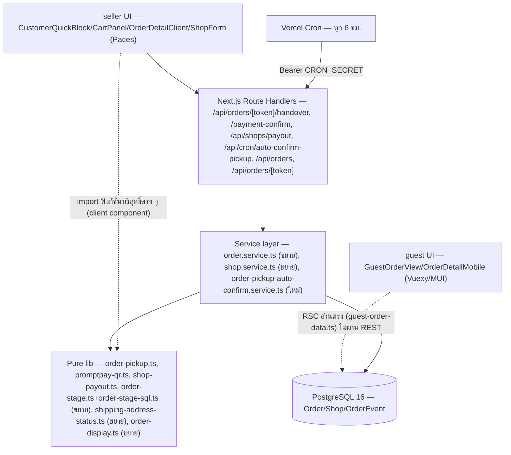
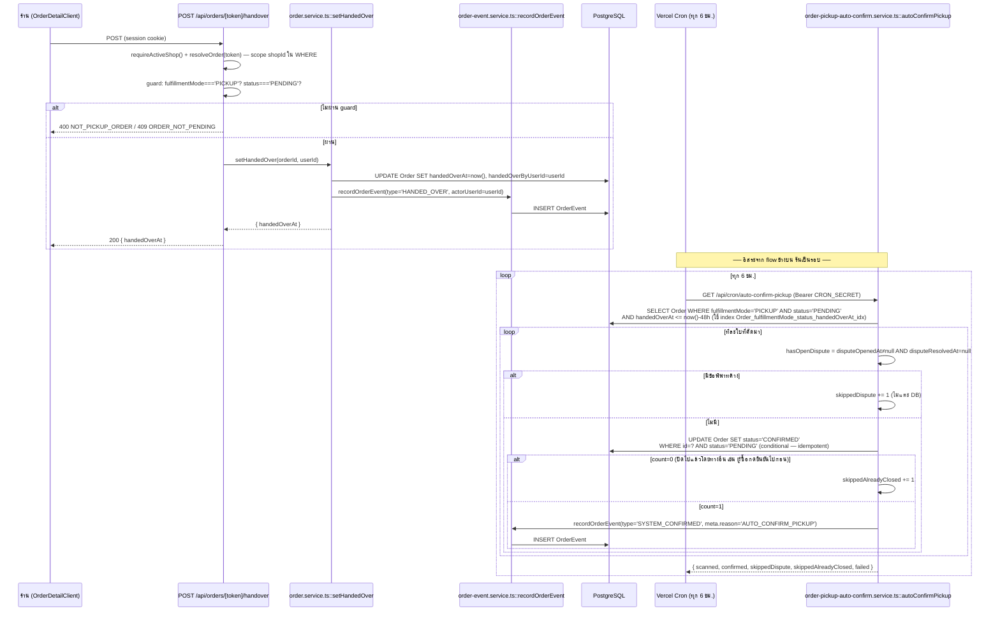
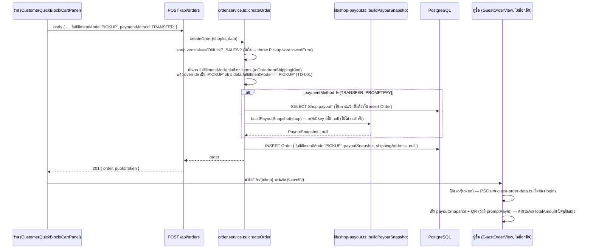

> **โมดูล:** M60-PickupBankTransfer
> **ประเภทเอกสาร:** System Design Spec (SDS)
> **เวอร์ชัน:** 1.0
> **วันที่จัดทำ:** 2026-08-28
> **สถานะ:** Draft — เขียนหลัง API.md/DATABASE.md/UX-Design-Spec.md/TestCase.md (Controller สั่งลำดับนี้) ต้อง**สอดคล้อง**กับทั้ง 4 ไฟล์ ไม่ใช่ทับ — SRS ของโมดูลนี้เขียนขนานโดย agent อื่น เอกสารนี้ยึด CONTRACT ที่ล็อกแล้ว (ดู §1.3) เป็นหลัก
> **เจ้าของเอกสาร:** SA

# SDS: นัดรับสินค้า และ การชำระเงินแบบโอน (System Design Spec)

---

## 1. บทนำ & References

### 1.1 วัตถุประสงค์

เอกสารนี้ออกแบบ **วิธี implement จริง** ของฟีเจอร์ 00060 — ไฟล์ที่ต้องแก้/สร้าง, ฟังก์ชัน/service ใหม่, ลำดับ commit ที่ปลอดภัย, และการตัดสินใจทางเทคนิคที่ผูกกับโค้ดจริงของ SafePay (ไม่ใช่ระบบ polyglot หลาย stack — repo นี้เป็น Next.js 16 monolith เดียว, Prisma/Postgres เดียว). ผู้อ่าน: `safepay-developer` (implement ตาม §3/§8), `safepay-qa` (ผูก TestCase.md เข้ากับ component จริง), `safepay-reviewer` (เทียบ diff กับ TD).

### 1.2 ขอบเขตการออกแบบ

**อยู่ในขอบเขต:** lib ใหม่ 3 ไฟล์ · service เดิม 2 ไฟล์ที่ขยาย (`order.service.ts`, `shop.service.ts`) + service ใหม่ 1 ไฟล์ (auto-confirm นัดรับ) · API route ใหม่ 4 เส้นทาง + แก้ของเดิม 2 เส้นทาง · RSC/client component ที่ระบุใน UX-Design-Spec.md (A1–A6, B7–B8) · แก้หนี้เดิม 6 จุดที่ BRD §7.3 ตีไว้ (ดู §7 ของเอกสารนี้)

**นอกขอบเขต:** ทุกอย่างใน PRD §5 (OCR สลิป, escrow, payment gateway, ระบบมัดจำ 00050, ปฏิทินนัดหมาย, หลายบัญชีต่อร้าน, บล็อกอัตโนมัติจาก `ScamReportIdentifier`) — ไม่มี component ใดของเอกสารนี้แตะสิ่งเหล่านี้

### 1.3 เอกสารอ้างอิง

| เอกสาร | ความสัมพันธ์ |
|--------|-------------|
| `PRD.md` §4.3 (มติ D-1..D-5) | ที่มาของทุกการตัดสินใจในเอกสารนี้ — ห้ามตีความใหม่ |
| `BRD.md` §2, §7.2 (เหตุผลเบื้องหลังมติ), §7.3 (หนี้ที่ฟีเจอร์นี้ปลุก) | ที่มาของ FR/AC ที่ทุก component ต้อง trace กลับได้ |
| `API.md` | สัญญา endpoint 8 ตัวที่ล็อกแล้ว (path/method/error code) — SDS ออกแบบ *ข้างในของ* endpoint เหล่านี้ ไม่เปลี่ยนสัญญา |
| `DATABASE.md` | schema 3 migration ที่ล็อกแล้ว (คอลัมน์/CHECK/index) — SDS อ้างอิงคอลัมน์เหล่านี้ตรง ๆ |
| `UX-Design-Spec.md` (A1–A6, B7–B8) | โครง UI/theme-source ที่ล็อกแล้ว — SDS ระบุว่า logic เบื้องหลังแต่ละจอเขียนที่ไฟล์ไหน |
| `TestCase.md` §1.1 (Contract ที่ล็อกแล้ว) + §2 | ชื่อฟิลด์/ค่าคงที่เดียวกับที่เอกสารนี้ใช้ — TC ต้อง map กลับ task ใน §8 ได้ |

---

## 2. Architecture Overview

### 2.1 มุมมองสถาปัตยกรรม

ไม่มี service แยก — ทุกอย่างอยู่ใน Next.js 16 App Router เดียว (nodejs runtime), เข้าถึง Postgres ผ่าน Prisma ทางเดียว ไม่มี RLS/DB trigger (ยึด convention เดิมของ repo: authorization ทั้งหมดอยู่ที่ `src/services/`). ฟีเจอร์นี้เพิ่ม **pure lib layer ใหม่ 3 ไฟล์** (ไม่แตะ DB), **ขยาย service layer เดิม 2 ไฟล์ + เพิ่มใหม่ 1 ไฟล์**, **API route ใหม่ 4 + แก้ของเดิม 2**, และ **UI layer ตาม UX-Design-Spec.md**



### 2.2 มุมมองการ Deploy

ไม่มีการเปลี่ยนแปลง topology — deploy บน Vercel เดิม (Hobby plan, `maxDuration` ต้องตั้งให้ `auto-confirm-pickup` route เหมือน `auto-confirm-delivered/route.ts:6` ซึ่งตั้ง `maxDuration=60`). Cron ใหม่ต้องเพิ่มใน `vercel.json` (`crons` array) — คนละ schedule จาก `auto-confirm-delivered` (รายวัน) เพราะ grace period สั้นกว่ามาก (48 ชม. เทียบ 7 วัน) จึงต้องรันถี่กว่า (**ทุก 6 ชม.** ตามที่ API.md §4.6 ระบุไว้แล้ว — ไม่ใช่การตัดสินใจใหม่ของเอกสารนี้ อ้างอิงเฉย ๆ)

---

## 3. Component Design

| Component | หน้าที่ (Responsibility) | Dependency |
|---|---|---|
| `src/lib/order-pickup.ts` (ใหม่) | ค่าคงที่ `PICKUP_AUTOCONFIRM_HOURS=48` (SSOT เดียว) + ฟังก์ชันบริสุทธิ์ `computeAutoConfirmDeadline(handedOverAt)` + `isPickupFulfillment(mode)` guard เล็ก ๆ | ไม่มี — pure module, ห้าม import prisma |
| `src/lib/promptpay-qr.ts` (ใหม่) | สร้าง payload EMVCo ของพร้อมเพย์ที่ฝังยอดเงิน (`buildPromptPayPayload({ promptPayId, amount })`) + validate รูปแบบ promptPayId (MOBILE 10 หลัก / NATIONAL_ID 13 หลัก) | ไม่มี — pure module, ไม่มี dependency ภายนอก (encode CRC16-CCITT เอง ตาม EMVCo spec) |
| `src/lib/shop-payout.ts` (ใหม่) | `PayoutSnapshot` TS type (SSOT เดียวคู่กับ `Order.payoutSnapshot` — mirror `OrderShipment`'s `senderSnapshot` TS type pattern), `THAI_BANKS` list, `buildPayoutSnapshot(shop)`, `normalizePayoutAccountNo()`, Valibot schema ของ `PATCH /api/shops/payout` body | import จาก `promptpay-qr.ts` (validate `payoutPromptPayId` รูปแบบเดียวกัน) |
| `src/lib/shipping-address-status.ts` (ขยาย) | เพิ่ม `deliveryOverride?: 'PICKUP'` เข้า `orderNeedsShippingAddress()` — short-circuit **ก่อน** `shipsGoods` (ตาม UX A1) | ไม่เพิ่ม dependency |
| `src/lib/order-display.ts` (ขยาย) | `getPaymentBadge()` เพิ่ม param `paymentConfirmedAt` + return field `tone` · เพิ่ม `isTransferLikePayment(paymentMethod)` (mirror `isCODPayment`) | ไม่เพิ่ม dependency |
| `src/lib/order-stage.ts` + `src/lib/order-stage-sql.ts` (ขยาย) | เพิ่ม branch "PICKUP → DONE" คู่ขนาน TS/SQL (ดู §7.1) | ไม่เพิ่ม dependency |
| `src/services/order.service.ts` (ขยาย) | `createOrder`/`updateOrder`: override `fulfillmentMode='PICKUP'` + เขียน `payoutSnapshot` · เพิ่ม `setHandedOver`/`clearHandedOver`/`setPaymentConfirmed`/`clearPaymentConfirmed` (mirror `setCodReceived:1335` แต่เพิ่ม `recordOrderEvent` ในตัวเอง — ดู TD-002) · `getShippingStageCounts:1830` เพิ่ม `fulfillmentMode` เข้า `select`+เข้า `deriveShippingStage()` call | Prisma, `order-event.service.ts::recordOrderEvent` |
| `src/services/shop.service.ts` (ขยาย) | `updateShopPayout(shopId, userId, data)` — reauth (password/OTP) + hash-check `ScamReportIdentifier` (best-effort, Should) + `shop.update` | `lib/password.ts::verifyPassword`, `lib/otp.ts::verifyOtp`, `lib/scam-identifier.ts::hashIdentifier` |
| `src/services/order-pickup-auto-confirm.service.ts` (ใหม่) | `autoConfirmPickup(now?)` — mirror `order-auto-confirm.service.ts::autoConfirmDelivered` เป๊ะ (conditional update, dispute-gate, per-row try/catch) ต่างที่คัดจาก `Order` ตรง ๆ ไม่ใช่ `OrderShipment` | Prisma, `order-event.service.ts::recordOrderEvent`, `lib/order-pickup.ts` |
| API routes (4 ใหม่ + 2 แก้) | ตาม `API.md` §4 ทุกประการ — SDS ไม่เปลี่ยนสัญญา แค่ระบุว่า route เรียก service ตัวไหน | service layer ข้างบน |
| UI components (A1–A6, B7–B8) | ตาม `UX-Design-Spec.md` — SDS ไม่ออกแบบ layout ซ้ำ แค่ระบุว่า component เรียก lib/service ตัวไหน (ดู §7.3) | lib/API ข้างบน |

---

## 4. Data Flow

### 4.1 Flow หลัก: ร้านกด "มอบสินค้าแล้ว" → auto-confirm 48 ชม.



### 4.2 Flow: สร้างออเดอร์นัดรับ + snapshot บัญชีรับเงิน



---

## 5. Integration Points

| จุดเชื่อม | ประเภท | Protocol/Contract | ความเสี่ยงเมื่อล่ม |
|---|---|---|---|
| `POST/DELETE /api/orders/[token]/handover`, `/payment-confirm` | internal | REST/JSON, session cookie | ปุ่มกดไม่ได้ — ไม่กระทบข้อมูลเดิม (idempotent conditional update) |
| `PATCH /api/shops/payout` | internal | REST/JSON, session + reauth | ตั้ง/เปลี่ยนบัญชีไม่ได้ — ออเดอร์เก่ายังอ่าน `payoutSnapshot` เดิมได้ปกติ (snapshot ไม่ผูกกับ endpoint นี้ ณ เวลาอ่าน) |
| `GET /api/cron/auto-confirm-pickup` | internal (server-to-server) | REST, `Authorization: Bearer CRON_SECRET` | ล่ม = ออเดอร์นัดรับค้าง `PENDING` เกิน 48 ชม. โดยไม่ปิดอัตโนมัติ — **ไม่ทำลายข้อมูล** รอบถัดไปจะจับใบที่ตกค้างเองเพราะเงื่อนไขคือ "เกิน" ไม่ใช่ "พอดี" (mirror `order-auto-confirm.service.ts:26` comment) |
| Postgres CHECK `Order_handedOver_requires_pickup_check`, `Order_payment_confirm_exclusive_check` | internal (DB-level safety net) | SQL CHECK constraint | ถ้า service layer มีบั๊กปล่อยให้เขียนค่าที่ขัดกัน → Postgres error 23514 (ไม่ใช่ silent data corruption) — service ต้อง catch แล้วแปลเป็นข้อความไทยไม่ให้ error ดิบขึ้นจอ (ดู TD-002 หมายเหตุ) |
| `ScamReportIdentifier` lookup (FR-BANK-04, Should) | internal | Prisma query, best-effort | ล่ม/ช้า → **ต้องไม่บล็อกการบันทึกบัญชี** (ครอบด้วย try/catch แยก ไม่ให้ throw ขึ้นไปถึง route) |

- **Timeout/Retry/Idempotency:** `autoConfirmPickup()` idempotent ผ่าน conditional `updateMany` (mirror `order-auto-confirm.service.ts:101`) — ไม่มี retry logic เพิ่มเพราะ cron รันซ้ำทุก 6 ชม. เองอยู่แล้ว
- **สัญญา API เต็ม:** ดู `API.md`

---

## 6. Technical Decisions

### TD-001: การ override `fulfillmentMode` ใน `createOrder`/`updateOrder`

- **ตัดสินใจ:** เพิ่ม parameter ใหม่ `data.fulfillmentMode?: 'PICKUP'` ใน `CreateOrderSchema`/`UpdateOrderSchema` (Valibot, `src/lib/validations.ts`) แล้วใน `createOrder()`/`updateOrder()` (`src/services/order.service.ts`) คำนวณ `fulfillmentMode` ตามตรรกะเดิมทั้งหมดก่อน (จาก `toOrderItemShippingKind()` ต่อรายการสินค้า) แล้ว **override ทับเป็นบรรทัดสุดท้าย** เมื่อ `data.fulfillmentMode === 'PICKUP'`:
  ```
  let fulfillmentMode = computeFromItems(items) // ตรรกะเดิม ไม่แตะ
  if (data.fulfillmentMode === 'PICKUP') {
    if (shop.vertical !== 'ONLINE_SALES') throw new PickupNotAllowedError()
    fulfillmentMode = 'PICKUP'
  }
  ```
- **เหตุผล:** BRD FR-PKP-01 AC #3 บังคับตรง ๆ ว่า override ต้อง "ไม่สนใจว่ารายการสินค้าจะเป็นชนิดที่ปกติคำนวณเป็น SHIPPED หรือไม่" — คำนวณตรรกะเดิมก่อนแล้วทับทีหลัง (แทนการ `if/else` แยกสาขา) ทำให้ diff เล็กที่สุดและไม่เสี่ยงพลาดเงื่อนไขย่อยของตรรกะเดิม (มี edge case เรื่อง `CUSTOM` items ที่ `shopShipsGoods` ตัดสินอยู่แล้ว — `src/lib/shipping-address-status.ts:33`)
- **ทางเลือกที่ตัดทิ้ง:** (1) สร้าง branch แยกทั้งก้อนตั้งแต่ต้นฟังก์ชัน (`if PICKUP { ... } else { computeFromItems }`) — ตัดทิ้งเพราะจะมีโค้ดสองชุดที่ต้องอัปเดตคู่กันตลอดไปทุกครั้งที่ตรรกะเดิมเปลี่ยน (2) เพิ่มค่า enum ใหม่แทน reuse `'PICKUP'` — ตัดทิ้งตามมติ D-3 ที่ยืนยันแล้วว่า code path ที่มีอยู่ (`order-action-set.ts:94` `hasShipping = fulfillmentMode === 'SHIPPED'`, allow-list ไม่ใช่ deny-list) ปฏิบัติกับ `'PICKUP'` ถูกต้องอยู่แล้ว
- **ผลกระทบ:** `updateOrder()` ต้องมี guard เพิ่มเติมตาม `Order_handedOver_requires_pickup_check` (DATABASE.md §5.1 Migration 1 comment บรรทัด 245-251) — ถ้าร้านแก้ `fulfillmentMode` ออกจาก `'PICKUP'` **หลังจาก** `handedOverAt` ถูกตั้งแล้ว ต้อง `SET handedOverAt=null, handedOverByUserId=null` ในทรานแซกชันเดียวกัน **ก่อน** เขียน `fulfillmentMode` ใหม่ ไม่งั้น Postgres ตอบ error 23514 ดิบ (ใน UI ปกติกรณีนี้ไม่ควรเกิดเพราะ UX A2 บังคับให้กดยกเลิก "มอบสินค้าแล้ว" ก่อนเปลี่ยนวิธีส่งมอบ แต่ service ต้องกันไว้เผื่อ client bug/แก้ผ่าน API ตรง ๆ)

### TD-002: `setHandedOver`/`setPaymentConfirmed` ต้องบันทึก `OrderEvent` เอง (ไม่ mirror `setCodReceived` ทั้งหมด)

- **ตัดสินใจ:** `setHandedOver`/`clearHandedOver`/`setPaymentConfirmed`/`clearPaymentConfirmed` (`src/services/order.service.ts`) เขียนโครง Prisma update เหมือน `setCodReceived` (`order.service.ts:1335-1347`) เป๊ะ **แต่เพิ่ม** เรียก `recordOrderEvent()` (`order-event.service.ts`) ภายในฟังก์ชันเดียวกัน (ในทรานแซกชันเดียวกับ `prisma.order.update` ผ่าน `$transaction`) เพื่อบันทึก `HANDED_OVER`/`HANDOVER_REVERTED`/`PAYMENT_CONFIRMED`/`PAYMENT_CONFIRM_REVERTED` ตามลำดับ
- **เหตุผล:** ยืนยันจากโค้ดจริงว่า `setCodReceived()` **ไม่ได้เรียก `recordOrderEvent()` เลย** (`order.service.ts:1335-1347` มีแค่ `prisma.order.update` บรรทัดเดียว) — mirror ทั้งหมดจะได้ปุ่มที่ไม่มี audit trail ซึ่งขัดกับ DATABASE.md §3.3 ที่นิยาม 4 event ใหม่ไว้ตรง ๆ ว่า "audit trail — ประวัติต้องเห็นทั้งการกดและการย้อนกลับ" (FR-PKP-03/FR-PAY-01) ธุรกรรมเงิน/การส่งมอบที่ไม่มีบุคคลที่สามยืนยัน (PRD §4.2 "self-report") ยิ่งต้องมีประวัติละเอียดกว่า COD ซึ่งมี iShip เป็นพยานอยู่แล้ว
- **ทางเลือกที่ตัดทิ้ง:** ให้ route handler เป็นคนเรียก `recordOrderEvent()` แยกหลังเรียก service (เหมือนที่ `order-auto-confirm.service.ts:116` เรียกเองใน service ก็จริง แต่ `cod-received/route.ts` ไม่เรียกเลยทั้ง route และ service) — ตัดทิ้งเพราะ route ควรเป็นชั้นบาง (thin — parse+guard+call service+format response ตาม `API.md §1` convention) การใส่ business logic เพิ่ม (เขียน event) ที่ route จะทำให้ทดสอบยากกว่า (ต้องเทส route แทนที่จะเทส service function บริสุทธิ์กว่า)
- **ผลกระทบ:** ต้องใช้ `prisma.$transaction([...])` หรือ interactive transaction แทน `prisma.order.update` เดี่ยว ๆ — เพิ่ม round-trip เล็กน้อยแต่ยอมรับได้ (การกดปุ่มเหล่านี้ไม่ใช่ hot path ความถี่สูง ตาม `DATABASE.md §6.3`)

### TD-003: `getPaymentBadge()` ขยาย return shape ให้มี `tone` — breaking change ที่ตั้งใจ

- **ตัดสินใจ:** เพิ่ม parameter ที่ 4 `paymentConfirmedAt: Date | string | null | undefined` และเพิ่ม field `tone: OrderStatusTone` เข้า return type `PaymentBadge` (เดิมมีแค่ `{ label, cls }` — ยืนยันจาก `order-display.ts:92-121`) ต้องอัปเดต **ทุก call site** ที่ import `getPaymentBadge` (grep ก่อน implement — ปัจจุบันมี call site อย่างน้อยในหน้า order detail ฝั่งร้าน) ให้ส่ง param ใหม่และรับ field ใหม่
- **เหตุผล:** UX-Design-Spec.md §B8 ระบุตรง ๆ ว่า "B7 ต้องเริ่มเรียก `getPaymentBadge()` เป็นครั้งแรกบนฝั่งผู้ซื้อ" ซึ่งเป็น MUI (`ORDER_STATUS_TONE_TO_MUI[tone]`, `order-display.ts:196-201`) — `cls` เป็น Tailwind/Paces class string ใช้กับ MUI ตรง ๆ ไม่ได้ ต้องมี `tone` เป็นสะพาน. การเช็คลำดับ `paymentConfirmedAt` ก่อน `slipFileId` (UX §B8 บรรทัด 486) ต้องเป็น branch ใหม่ที่แทรกก่อนบรรทัด `if (slipFileId) return ...` (`order-display.ts:111`)
- **ทางเลือกที่ตัดทิ้ง:** สร้างฟังก์ชันใหม่ `getPaymentBadgeWithTone()` แยกจาก `getPaymentBadge()` เดิม — ตัดทิ้งเพราะจะมีนิยาม "ป้ายสถานะการชำระเงิน" 2 ชุดที่ต้องแก้คู่กันตลอดไป ขัด Hard Rule 16 ตรง ๆ และ FR-PAY-02 AC บังคับว่า "ทุกจอ...ต้องได้ป้ายชุดเดียวกันจากฟังก์ชันเดียวกัน"
- **ผลกระทบ:** เป็น breaking change ของ signature — ทุก caller ต้อง compile error จนกว่าจะแก้ (TypeScript บังคับให้ครบ ไม่มี call site ไหนหลุดได้เงียบ ๆ) เลือก `tone: 'info'` สำหรับ "ร้านยืนยันรับเงินแล้ว" (ไม่เพิ่มค่าใหม่ใน `OrderStatusTone` ซึ่งคงที่ 4 ค่า `warning|info|success|danger` — `order-display.ts:149`) ตาม UX-Design-Spec.md §B8 "เหตุผล" — ลด blast radius ของ `ORDER_STATUS_TONE_TO_MUI` bridge ที่ import ทั้งสองสกิน

### TD-004: `deliveryOverride` input เข้า `orderNeedsShippingAddress()` แทนเขียนเงื่อนไขซ้ำ 3 จุด

- **ตัดสินใจ:** เพิ่ม param ใหม่ `deliveryOverride?: 'PICKUP'` เข้า input ของ `orderNeedsShippingAddress()` (`src/lib/shipping-address-status.ts:69`) แล้วเช็ค **เป็นบรรทัดแรกสุด** ก่อน `if (!input.shipsGoods) return false` (บรรทัด 76) ตามที่ UX A1 ระบุไว้ตรง ๆ:
  ```
  if (input.deliveryOverride === 'PICKUP') return false
  if (!input.shipsGoods) return false
  if (input.salesChannel === 'STOREFRONT') return false
  return input.items.some((kind) => kind === 'CUSTOM' || kind === 'SHIPPED')
  ```
- **เหตุผล:** ฟังก์ชันนี้มีคอมเมนต์เตือนตัวเองอยู่แล้ว (`shipping-address-status.ts:56-61`) ว่ากฎนี้ "เคยถูกเขียนซ้ำ 3 ที่" (`QuickForm` มือถือ/โมดัลแชท, `CartPanel` เดสก์ท็อป, `OrderCreateForm` ตอน submit) แล้วนิยามหลุด sync กันมาแล้วจริง — การเพิ่ม `deliveryOverride` เป็น parameter ของ SSOT ตัวเดียว (แทนที่ 3 จุดเรียกจะเขียน `if (selectedDelivery === 'PICKUP') { skip validation }` เอง) ทำให้ยังคงเป็น "เรียก SSOT ตัวเดียว" ตรงตาม `docs/conventions/one-value-many-entry-points.md` และ UX-Design-Spec.md §A1 สั่งห้ามตรง ๆ ("ห้ามเขียนเงื่อนไข 'ถ้าเลือกนัดรับ' ซ้ำที่ 3 จุดเรียกเหมือนที่เคยพลาดมาก่อน")
- **ทางเลือกที่ตัดทิ้ง:** ให้ทั้ง 3 จุดเรียก (`CustomerQuickBlock.tsx`, `CartPanel.tsx`, `createOrder`/`updateOrder`) เช็ค `fulfillmentMode==='PICKUP'` เองก่อนเรียกฟังก์ชันนี้ (เช่น `needsShipping = delivery==='PICKUP' ? false : orderNeedsShippingAddress(...)`) — ตัดทิ้งเพราะเป็นแพตเทิร์นเดียวกับที่เคยพลาดมาแล้ว 3 ครั้ง (2026-08-07, 2026-08-10 ตามคอมเมนต์ในไฟล์) คือ "เขียนเงื่อนไขห่อ SSOT" แทน "ส่งเข้า SSOT"
- **ผลกระทบ:** ทั้ง 3 จุดเรียก (`CustomerQuickBlock.tsx` บรรทัด ~346, `CartPanel.tsx` บรรทัด ~403, `order.service.ts::createOrder`/`updateOrder`) ต้องส่ง `deliveryOverride: selectedDelivery === 'PICKUP' ? 'PICKUP' : undefined` เข้าไปพร้อมกันในคอมมิตเดียว — ไม่มีจุดไหนตกหล่นได้เงียบเพราะ `orderNeedsShippingAddress` type บังคับ (optional param ไม่บังคับ compile error แต่ QA ต้องเทสทั้ง 3 จุดตาม TC-PKP-04)

### TD-005/006: reauth flow ของ `PATCH /api/shops/payout` — สองทาง (password/OTP) + แยก "ตั้งครั้งแรก" ออกจาก "เปลี่ยน"

- **ตัดสินใจ (TD-005 — วิธี reauth):** `updateShopPayout()` (`shop.service.ts`) รับ `reauth: { method:'PASSWORD', password } | { method:'OTP', code }` ตาม `API.md §4.5` แล้วเรียก `verifyPassword()` (`src/lib/password.ts:20`) หรือ `verifyOtp()` (`src/lib/otp.ts:155`) ตามชื่อฟังก์ชันจริงที่มีอยู่แล้วในระบบ (ทั้งคู่ยืนยันจากโค้ดจริง — ไม่ใช่ฟังก์ชันสมมติ) — ถ้า user ไม่มีทั้ง `passwordHash` และ `phone` เลย throw `PayoutReauthUnavailableError`
- **ตัดสินใจ (TD-006 — เมื่อไรต้อง reauth):** ตัดสินจาก `Shop.payoutUpdatedAt !== null` (มีค่ามาก่อนหน้านี้แล้ว = "เคยตั้ง" = ต้อง reauth) ไม่ใช่จาก field อื่นใด — ตรงกับ UX-Design-Spec.md §A6 "บันทึกครั้งแรก...กด 'บันทึก' ธรรมดา ไม่ต้องยืนยันตัวตนซ้ำ" เพราะ BR-BANK-02 พูดถึง "เปลี่ยน" ไม่ใช่ "ตั้งครั้งแรก" — API route (`payout/route.ts`) เช็คเงื่อนไขนี้ **ก่อน** เรียก service (ถ้าเป็นครั้งแรก ข้าม reauth block ทั้งหมด ไม่เรียก `verifyPassword`/`verifyOtp` เลย)
- **เหตุผล:** ทั้งสองฟังก์ชัน reauth มีอยู่แล้วในระบบและถูกทดสอบแล้วจากฟีเจอร์อื่น (seller auth reset-password flow) — reuse โดยตรงแทนสร้างกลไกใหม่ ลดความเสี่ยง ตรงกับ Hard Rule 16 (ไม่สร้างนิยามที่ 3 ของ "ยืนยันตัวตน")
- **ทางเลือกที่ตัดทิ้ง:** บังคับ reauth ทุกครั้งรวมถึงตั้งครั้งแรก — ตัดทิ้งเพราะ UX ยืนยันชัดว่าตั้งครั้งแรกไม่มีอะไรให้ "สวมสิทธิ์" (ยังไม่มีบัญชีเดิมให้สลับ) การบังคับ reauth ตั้งแต่ครั้งแรกเพิ่ม friction โดยไม่ลดความเสี่ยงจริง
- **ผลกระทบ:** route ต้อง query `Shop.payoutUpdatedAt` ก่อนตัดสินใจว่าจะ validate `reauth` field ใน body ไหม — `reauth` field ยัง "บังคับ" ตาม `API.md` schema เสมอ (client ส่งมาเสมอ) แต่ server **เพิกเฉยต่อมัน** เมื่อเป็นครั้งแรก (ไม่ผ่านเข้า `verifyPassword`/`verifyOtp`) เพื่อไม่ผูก client กับ 2 shape ของ request body

### TD-007: `deriveShippingStage()`/`buildShippingStageSql()` — เพิ่ม branch "PICKUP → DONE" คู่ขนาน (ไม่เพิ่มค่าใหม่ใน `ShippingStageKey`)

- **ตัดสินใจ:** เพิ่ม field ใหม่ `fulfillmentMode?: string | null` เข้า `ShippingStageInput` (`order-stage.ts:145-155`) และ `StageSqlColumns` (`order-stage-sql.ts:37-48`) แล้วเพิ่ม branch **เดียว** ในทั้งสองฝั่ง วางไว้ทันทีหลัง branch แรก (CANCELLED/RETURNED):
  ```ts
  // TS (order-stage.ts, หลังบรรทัด 175)
  if (o.fulfillmentMode === 'PICKUP') return 'DONE'
  ```
  ```sql
  -- SQL (order-stage-sql.ts, หลัง WHEN orderStatus IN ('CANCELLED','RETURNED') THEN 'DONE')
  WHEN ${c.fulfillmentMode} = 'PICKUP' THEN 'DONE'
  ```
  **ไม่เพิ่มค่าใหม่เข้า `ShippingStageKey` union** — ใช้ `'DONE'` ที่มีอยู่แล้ว
- **เหตุผล:** ยืนยันจากโค้ดจริง (`order-stage.ts:217-236`) ว่า `ALL_SHIPPING_STAGES`/`SHIPPING_STAGE_LABEL`/Command Center tile grid เป็น `Record<Exclude<ShippingStageKey,'DONE'>, ...>` — **ทุกค่าใน union (ยกเว้น `DONE`) จะกลายเป็นไทล์โดยอัตโนมัติ** เพราะ `SHIPPING_STAGE_KEYS_ALL` derive จาก union นี้ตรง ๆ ถ้าเพิ่มค่าใหม่ (เช่น `'PICKUP'`) จะได้ไทล์ที่ 7 โดยไม่ได้ตั้งใจ ขัดกับ UX-Design-Spec.md §A5 ที่ตัดสินใจแล้วว่า **"ไม่ควร" มีไทล์ที่ 7** (เหตุผล: ปริมาณน้อย, กริด 6 ไทล์เต็มพอดี 4+2 คอลัมน์, คนละคำถามกับพัสดุ) `DONE` มีคอมเมนต์ประกาศตัวเองอยู่แล้วว่า "จบแล้ว/ไม่ใช่งานค้าง — ไม่นับบนไทล์ และไม่ขึ้นในตัวกรอง" (`order-stage.ts:116-117`) ซึ่งตรงกับสิ่งที่ต้องการเป๊ะ: ออเดอร์นัดรับไม่มี "งานพัสดุ" ให้ตอบคำถามนี้เลย (BRD: "คนละคำถาม คนละหมวดจริง ๆ")
- **ทางเลือกที่ตัดทิ้ง:** เพิ่มค่าใหม่ `'PICKUP'` เข้า `ShippingStageKey` แล้วกันไม่ให้ Command Center render มันแยกต่างหาก (เช่น กรองออกตอน render tile grid) — ตัดทิ้งเพราะต้องแก้ทุกจุดที่ทำ `Record<ShippingStageKey,...>` แบบ exhaustive (`SHIPMENT_STAGE_DOT_INDEX`, `SHIPPING_STAGE_LABEL`, `ALL_SHIPPING_STAGES`) ทั้งที่ผลลัพธ์สุดท้ายต้องการแค่ "ไม่นับ" ซึ่ง `DONE` ทำได้อยู่แล้วโดยไม่ต้องแตะอะไรเลย — ยิ่งแก้เยอะยิ่งเสี่ยงพลาดจุดใดจุดหนึ่ง (คลาสเดียวกับ HR16 "ค่าที่ดูเหมือนต้องแยกแต่จริง ๆ ตอบคำถามเดิม")
- **ผลกระทบ:**
  - `getShippingStageCounts()` (`order.service.ts:1830-1868`) ต้องเพิ่ม `fulfillmentMode: true` เข้า `select` (บรรทัด 1836) และส่ง `fulfillmentMode: o.fulfillmentMode` เข้า `deriveShippingStage()` call (บรรทัด 1858) — เพราะฟังก์ชันนี้เรียก `deriveShippingStage()` โดยตรงในหน่วยความจำ (ไม่ใช่ SQL) การแก้ `deriveShippingStage()` เพียงอย่างเดียวไม่พอ ต้องแก้จุดเรียกด้วย (BRD §7.3 แยกบรรทัดนี้เป็นหนี้คนละจุดจาก `deriveShippingStage()` ด้วยเหตุผลนี้เอง)
  - `order-list.service.ts` (STAGE_COLUMNS ที่ประกอบ `buildShippingStageSql()`) ต้องเพิ่ม column alias ของ `o."fulfillmentMode"` เข้า `STAGE_COLUMNS`
  - เทส `order-stage-sql.test.ts` ต้องเพิ่มเคส (matrix ค่า `fulfillmentMode` ทุกแบบ) เพื่อยืนยัน parity — ตาม comment ของไฟล์เอง (`order-stage-sql.ts:19-21`) ว่ามีด่านเทียบสองฝั่งอยู่แล้ว

### TD-008: `PaymentReceivedCard.tsx` เป็นไฟล์ใหม่ ไม่ใช่แตกกิ่งใน `CodCard.tsx`

- **ตัดสินใจ:** สร้าง component ใหม่ `PaymentReceivedCard.tsx` (`src/app/(paces)/seller/(dashboard)/orders/[token]/components/`) คัดลอกโครงจาก `CodCard.tsx` เป็น base แล้วปรับ copy/icon/badge tone ตาม UX §A3 — ไม่ใส่ `if (paymentMethod !== 'COD')` เข้า `CodCard.tsx` เดิม
- **เหตุผล:** ยืนยันจาก UX-Design-Spec.md §A3 ตรง ๆ ว่า `CodCard.tsx` "ผูก copy คำว่า 'เก็บเงินปลายทาง'/'ปลายทาง' ไว้แน่นในคอมเมนต์และ prop names ที่จำเพาะ COD" และ `order-action-set.ts:50-51` มีคอมเมนต์เตือนตัวเองไว้แล้วว่า "pure module นี้ห้ามรู้จักรูปแบบข้อความวิธีชำระ" — แยกไฟล์รักษาหลักการเดียวกัน (component ที่พูดเรื่อง COD ไม่ควรมีกิ่ง if ที่พูดเรื่องอื่น)
- **ทางเลือกที่ตัดทิ้ง:** parameterize `CodCard.tsx` ให้รับ `variant: 'COD' | 'TRANSFER'` — ตัดทิ้งเพราะเพิ่มความซับซ้อนให้ component เดียวที่ยังต้องรองรับ breakpoint logic (`hidden lg:flex`) เดิมอยู่แล้ว การแยกไฟล์ทำให้ diff ของแต่ละไฟล์อ่านง่ายกว่าและลดความเสี่ยงที่แก้ COD แล้วกระทบ TRANSFER โดยไม่ตั้งใจ
- **ผลกระทบ:** `OrderDetailClient.tsx` ต้องมี prop ใหม่ `isTransferLikePayment: boolean` (mutually exclusive กับ `isCod` เพราะ `paymentMethod` มีค่าเดียวเสมอ — ยืนยันจากโค้ดจริงว่าปัจจุบันมีแค่ `isCod: boolean` ที่ prop-ไม่มี `isTransferLikePayment` เลย, `OrderDetailClient.tsx:156,197,484,506`) คำนวณผ่าน `isTransferLikePayment()` ฟังก์ชันใหม่ใน `order-display.ts` (mirror `isCODPayment:41`)

---

## 7. หนี้ที่ต้องแก้ไปพร้อมกัน (BRD §7.3 — ยืนยันกับโค้ดจริงทุกจุด)

> ตาม `docs/conventions/known-limitation-vs-unfinished.md` — หนี้เหล่านี้**กินเคสที่ฟีเจอร์นี้ถูกสร้างมาเพื่อแก้โดยตรง** (ออเดอร์นัดรับใบแรกที่เกิดขึ้นจะพังทันทีถ้าไม่แก้) จึงนับเป็น **ส่วนหนึ่งของฟีเจอร์ ไม่ใช่หนี้แยก** — ต้องอยู่ในคอมมิตชุดเดียวกับ A1/A5 ไม่ใช่ backlog แยก

| จุด | ยืนยันจากโค้ดจริง | สิ่งที่ต้องแก้ | Task ที่แก้ |
|---|---|---|---|
| `deriveShippingStage()` (`src/lib/order-stage.ts:167-207`) | อ่านแล้ว: ไม่มี field `fulfillmentMode` ใน `ShippingStageInput` เลย (`order-stage.ts:145-155`) — ออเดอร์นัดรับ `PENDING` (ไม่มี `hasShipment`, `status≠SHIPPED`) หล่นไปที่ `return 'AWAITING_PARCEL'` บรรทัดสุดท้าย (206) | TD-007 | U6 |
| `buildShippingStageSql()` (`src/lib/order-stage-sql.ts:67-92`) | อ่านแล้ว: `StageSqlColumns` ไม่มี `fulfillmentMode` — SQL คู่ขนานตกกอง `ELSE 'AWAITING_PARCEL'` เหมือนกัน (บรรทัด 90) | TD-007 | U6 |
| `getShippingStageCounts()` (`src/services/order.service.ts:1830-1868`) | อ่านแล้ว: `select` (บรรทัด 1835-1846) ไม่มี `fulfillmentMode` — เรียก `deriveShippingStage()` (บรรทัด 1858-1864) โดยไม่ส่ง field นี้เข้าไป แม้แก้ `deriveShippingStage()` แล้วจุดนี้จะยัง**ไม่**ได้ประโยชน์จนกว่าจะแก้ที่นี่ด้วย | TD-007 | U6 |
| `CustomerPanel.tsx` (`src/app/(paces)/seller/(chat)/inbox/[conversationId]/components/CustomerPanel.tsx`) | ยืนยันแล้วจากรายชื่อ grep ว่าไฟล์นี้ import `order-action-set` — BRD §7.3 ระบุ deny-list `!== 'NO_SHIPPING'` ต้องเปลี่ยนเป็น allow-list `=== 'SHIPPED'` (ให้ตรงกับ `order-action-set.ts:94` ที่ทำถูกอยู่แล้ว) | ใช้ allow-list เดียวกับ `hasShipping` | U7 |
| `ShippingAddress.tsx` (`src/app/(paces)/seller/(dashboard)/orders/[token]/components/ShippingAddress.tsx`) | ตาม UX §A2+A4: ไฟล์นี้ `return null` เมื่อ `fulfillmentMode` ไม่ใช่ `SHIPPED` (BRD §7.3 ยืนยันตรง ๆ) — ต้องเพิ่มสาขา `fulfillmentMode==='PICKUP'` แทนที่ `return null` | สร้างการ์ด "การนัดรับ" (A2+A4 รวม) | U8 |
| `dashboard.service.ts::getProvinceSales` | BRD §7.2 D-4 ยืนยันแล้วว่าเดิม `STOREFRONT` ถูกตัดออกจากแผนที่นี้อยู่แล้ว (precedent มีอยู่จริง) — ออเดอร์ `fulfillmentMode='PICKUP'` ต้องตัดออกด้วยเหตุผลเดียวกัน (ไม่มีที่อยู่ผู้รับโดยธรรมชาติ) | เพิ่มเงื่อนไข `fulfillmentMode !== 'PICKUP'` คู่กับเงื่อนไข `STOREFRONT` เดิม | U11 |
| `buyer-reputation.ts` / `/customers` | ตาม BRD §7.3 และ PRD §9.1 — คำนวณจาก `hasShipment` ล้วน ทำให้ร้านนัดรับล้วนเห็นข้อความ "ข้อมูลจะเริ่มขึ้นเองตั้งแต่พัสดุใบแรก" ค้างถาวร | **รอบนี้แก้แค่ข้อความ** (ไม่สัญญาว่าจะเริ่มขึ้นเองกับร้านที่ขายนัดรับล้วน) — ขยายสัญญาณเต็มรูปเป็น known-gap แยก (ตาม PRD instruction) | U12 |

---

## 8. ลำดับ Task ที่ commit ได้ทีละก้อน (U0..U13)

🛑 **U0–U2 เป็น migration — Hard Rule 15 บังคับแจ้ง user ก่อนรันทุกครั้ง** (`prisma migrate dev` local + คำเตือนว่า push `main` = migrate ขึ้น prod อัตโนมัติผ่าน `prisma migrate deploy` ใน build command) — ไฟล์ `.sql` อยู่ใน `DATABASE.md §5.1` แล้ว ห้าม hardcode timestamp ใหม่โดยไม่ grep ซ้ำตามที่เอกสารนั้นเตือนไว้

| # | Task | ไฟล์ที่แตะ | ขึ้นกับ | เทส `[blocker]` + mutation ที่พิสูจน์ | ผ่าน ux/impeccable? |
|---|---|---|---|---|---|
| **U0** | Migration 1 — `Order` เพิ่ม 4 คอลัมน์ + FK + CHECK×2 + index×2 | `prisma/schema.prisma`, `prisma/migrations/20260828100000_.../migration.sql` | — | ไม่มี (schema only) — verify ด้วย query นับแถวเดิมยังเป็น NULL ครบ 100% หลัง apply บน dev DB | ไม่ |
| **U1** | Migration 2 — `Shop` เพิ่ม 5 คอลัมน์ payout* + `Order.payoutSnapshot` | เหมือนบน (migration ที่ 2) | U0 (คนละ concern แต่รันหลังกันเพื่อ rollback แยกได้ตาม DATABASE.md §5.1) | ไม่มี | ไม่ |
| **U2** | Migration 3 — ขยาย `OrderEvent_type_check` +4 ค่า | migration ที่ 3 (DO $$ script) | U0 | extend `order-event.test.ts` [blocker]: insert `OrderEvent.type='HANDED_OVER'` ต้องสำเร็จ post-migration; mutation = ลบค่าออกจาก CHECK ต้องทำให้เทสแดง (23514) | ไม่ |
| **U3** | `src/lib/order-pickup.ts` (ใหม่) — `PICKUP_AUTOCONFIRM_HOURS=48`, `computeAutoConfirmDeadline()` | `order-pickup.ts` + `order-pickup.test.ts` | — | `[blocker]`: `computeAutoConfirmDeadline(handedOverAt)` ต้องคืน `handedOverAt+48h` เป๊ะ — mutation: เปลี่ยน `48` เป็น `24` ในไฟล์ต้องทำให้เทสแดง (พิสูจน์ว่าเทสอ่านค่าคงที่จริง ไม่ใช่ hardcode ผลลัพธ์คู่กัน) | ไม่ |
| **U4** | `src/lib/promptpay-qr.ts` (ใหม่) — EMVCo payload builder | `promptpay-qr.ts` + test | — | `[blocker]`: `buildPromptPayPayload({promptPayId:'0812345678', amount:1250})` ต้องคืน payload ที่ decode กลับได้ยอด `1250.00` ตรงเป๊ะ + CRC16 ถูกต้อง — mutation:สลับ tag ID ของยอดเงิน (54) กับ tag อื่น ต้องทำให้เทสแดง. 🛑 **spike ก่อนเขียนโค้ดจริง (บังคับ)**: สร้าง payload ตัวอย่างแล้วสแกนด้วยแอปธนาคารไทยจริงอย่างน้อย 1 แอป ยืนยันยอดขึ้นถูกก่อนถือว่า task นี้เสร็จ (`docs/conventions/external-payload-schema.md`) | ux (ต้อง QR ที่แอปธนาคารสแกนได้จริงก่อนต่อเข้า UI) |
| **U5** | `src/lib/shop-payout.ts` (ใหม่) — `PayoutSnapshot` type, `THAI_BANKS`, `buildPayoutSnapshot()`, `normalizePayoutAccountNo()`, Valibot schema | `shop-payout.ts` + test | U4 (import promptpay validate) | `[blocker]`: `buildPayoutSnapshot()` ไม่ใส่ key ที่เป็น `null` (ตาม DATABASE.md §3.1 "ไม่ใส่ null ทับ") — mutation: เปลี่ยนเป็นใส่ `null` ทับทุก key ต้องทำให้เทสแดง | ไม่ |
| **U6** | `deriveShippingStage()`/`buildShippingStageSql()`/`getShippingStageCounts()` — TD-007 | `order-stage.ts`, `order-stage-sql.ts`, `order.service.ts`, `order-list.service.ts` (STAGE_COLUMNS), เทส 3 ไฟล์ที่มีอยู่แล้ว (`order-stage.test.ts`, `order-stage-sql.test.ts`, `order-list.service.test.ts`) | U0 (ต้องมีคอลัมน์จริงให้ query แต่ field นี้ไม่ใช่คอลัมน์ใหม่ — `fulfillmentMode` มีอยู่แล้ว จึงไม่ต้องรอ migration จริง ๆ) | `[blocker]` เดิม (parity test TS vs SQL) ต้องเขียวหลังเพิ่ม matrix เคส `fulfillmentMode='PICKUP'` — mutation: ลบ branch ใหม่ออกจากฝั่งใดฝั่งหนึ่งต้องทำให้ parity test แดง | ไม่ |
| **U7** | `CustomerPanel.tsx` allow-list fix | `CustomerPanel.tsx` | — | `[blocker]` ใหม่หรือขยายของเดิม: สแกนซอร์สว่าใช้ `fulfillmentMode === 'SHIPPED'` ไม่ใช่ `!== 'NO_SHIPPING'` | ux (แม้เป็น server-side guard fix ก็ยังต้องผ่าน gate ตาม `feedback_ux_gate_no_exception_for_server_guards`) |
| **U8** | `order.service.ts::setHandedOver/clearHandedOver` + route `handover/route.ts` — TD-002 | `order.service.ts`, `src/app/api/orders/[token]/handover/route.ts` | U0, U3 | integration test: POST สำเร็จ → `handedOverAt`+`OrderEvent(HANDED_OVER)` ถูกสร้าง; DELETE → ทั้งคู่ล้าง + `OrderEvent(HANDOVER_REVERTED)`; mutation: ลบการเรียก `recordOrderEvent` ต้องทำให้เทสแดง (ยืนยันว่า TD-002 บังคับได้จริงไม่ใช่แค่เขียนไว้) | ไม่ (API เท่านั้น ยังไม่มี UI) |
| **U9** | `order.service.ts::setPaymentConfirmed/clearPaymentConfirmed` + route `payment-confirm/route.ts` — TD-002 | `order.service.ts`, `src/app/api/orders/[token]/payment-confirm/route.ts` | U0 | เหมือน U8 + เคส `PAYMENT_METHOD_NOT_ELIGIBLE` เมื่อยิงกับ COD | ไม่ |
| **U10** | `order-pickup-auto-confirm.service.ts` (ใหม่) + `cron/auto-confirm-pickup/route.ts` | ไฟล์ใหม่ 2 ไฟล์ | U0, U3, U8 | integration test มิเรอร์ `order-auto-confirm.service.ts` เดิม: (1) ปิดใบที่พ้น 48 ชม.ไม่มีข้อพิพาท (2) ข้ามใบที่มีข้อพิพาทค้าง (3) idempotent — รันซ้ำ `confirmed=0` รอบสอง; mutation: ลบเงื่อนไข `hasOpenDispute` ต้องทำให้เทสข้อ (2) แดง | ไม่ |
| **U11** | `createOrder`/`updateOrder` override `fulfillmentMode` + เขียน `payoutSnapshot` — TD-001 | `order.service.ts`, `src/lib/validations.ts` (schema), `src/app/api/orders/route.ts`, `src/app/api/orders/[token]/route.ts` | U1, U5 | integration test ตาม TC-PKP-03/04/05 (BRD trace) — mutation: ลบ override บรรทัดสุดท้ายต้องทำให้เทส TC-PKP-03 แดง (fulfillmentMode กลับไปเป็น SHIPPED) | ไม่ (backend เท่านั้น) |
| **U12** | `orderNeedsShippingAddress()` + 3 จุดเรียก — TD-004 | `shipping-address-status.ts`, `CustomerQuickBlock.tsx`, `CartPanel.tsx` | U11 | `[blocker]` เดิมของ `shipping-address-status.ts` ขยาย matrix เคส `deliveryOverride='PICKUP'` × `shipsGoods` ทุกค่า — mutation: ย้าย short-circuit ไปหลัง `shipsGoods` check ต้องทำให้เทสแดง | **ux** (แตะ UI 2 ไฟล์) |
| **U13** | `getPaymentBadge()` + `isTransferLikePayment()` — TD-003 | `order-display.ts` + ทุก call site ที่ grep เจอ | — | `[blocker]`: ลำดับ `paymentConfirmedAt` ก่อน `slipFileId` — mutation: สลับลำดับ 2 branch ต้องทำให้เทสแดง (เคสมีทั้งสลิปและ confirm พร้อมกัน) | ไม่ (pure lib) |
| **U14** | `PATCH /api/shops/payout` + `updateShopPayout()` — TD-005/006 | `shop.service.ts`, `src/app/api/shops/payout/route.ts` | U1, U5 | integration test: ครั้งแรกไม่ต้อง reauth, ครั้งที่สองต้อง reauth (ทั้ง PASSWORD/OTP ผิด/ถูก), ไม่มีทั้งสองทาง → `REAUTH_UNAVAILABLE`; mutation: ลบเช็ค `payoutUpdatedAt !== null` ต้องทำให้เทส "ครั้งแรกไม่ต้อง reauth" แดง | ไม่ |
| **U15** | A1 UI — ปุ่มคู่ "จัดส่ง/นัดรับ" | `CustomerQuickBlock.tsx`, `CartPanel.tsx` | U12 | browser QA เท่านั้น (UI toggle ล้วน) | **ux + `/impeccable critique`** |
| **U16** | A2+A4 UI — การ์ด "การนัดรับ" (`ShippingAddress.tsx` extend) + `order-action-set.ts` ขยาย input flags | `ShippingAddress.tsx`, `order-action-set.ts`, `order-action-set.test.ts`, `OrderDetailClient.tsx` | U8, U16 ไฟล์เดียวกับ U8 endpoint | `order-action-set.test.ts` เพิ่มเคส PICKUP × handedOver states; mutation ตามที่ไฟล์มีอยู่แล้ว | **ux + `/impeccable critique`** |
| **U17** | A3 UI — `PaymentReceivedCard.tsx` (ใหม่) — TD-008 | ไฟล์ใหม่ + `OrderDetailClient.tsx` | U9, U13 | browser QA | **ux + `/impeccable critique`** |
| **U18** | A5 UI — facet "วิธีส่งมอบ" ใน `/orders` + `MiniShipmentTimeline.tsx` สาขา PICKUP | `OrdersTable.tsx`/`OrderCard.tsx`, `MiniShipmentTimeline.tsx`, `order-list.service.ts` (query param `?fulfillment=`) | U6 | browser QA | **ux + `/impeccable critique`** |
| **U19** | A6 UI — การ์ด "บัญชีรับเงิน" ใน `/shop` | `ShopForm.tsx` + component ใหม่ (base `Bank.tsx`), `paces-swal.ts` variant ใหม่ | U14 | browser QA | **ux + `/impeccable critique`** |
| **U20** | B7+B8 UI — บล็อกบัญชี+QR ใน `GuestOrderView.tsx`/`OrderDetailMobile.tsx` + `guest-order-data.ts` allow-list | `GuestOrderView.tsx`, `OrderDetailMobile.tsx`, `guest-order-data.ts` | U4, U5, U13 | integration test: `guest-order-data.ts` คืน `payoutSnapshot`/ป้ายชำระเงินให้ session ที่ไม่ล็อกอิน — mutation: ลบฟิลด์ออกจาก allow-list ต้องทำให้เทสแดง | **ux + `/impeccable critique`** |
| **U21** | หนี้เดิม 2 จุดสุดท้าย — `dashboard.service.ts::getProvinceSales`, `buyer-reputation.ts` ข้อความ | `dashboard.service.ts`, `buyer-reputation.ts` | U11 | ยืนยันด้วย query ตัวอย่าง (ออเดอร์ PICKUP ไม่โผล่ในแผนที่จังหวัด) | ไม่ |

---

## 9. Traceability

| SRS/BRD Requirement | SDS Element | สถานะ |
|---|---|---|
| FR-PKP-01 (D-3, D-4) | TD-001, TD-004, U11, U12 | Draft |
| FR-PKP-02 | หนี้ §7 (`CustomerPanel.tsx`, `ShippingAddress.tsx`), U7, U8/U16 | Draft |
| FR-PKP-03 | TD-002, U8, U16 | Draft |
| FR-PKP-04 (D-1) | §4.1 sequence, TD-007 (คนละเรื่อง — ไม่ใช่พึ่งกัน), U3, U10 | Draft |
| FR-PKP-05 | ทางเดิมของผู้ซื้อ — ไม่แตะ (mirror ตาม PRD §3.1) | N/A — ไม่มีการเปลี่ยนแปลง |
| FR-PAY-01, FR-PAY-03 | TD-002, U9, U17 | Draft |
| FR-PAY-02 | TD-003, U13, U20 | Draft |
| FR-BANK-01, BR-BANK-02 | TD-005, TD-006, U14, U19 | Draft |
| FR-BANK-02 (snapshot) | §4.2 sequence, U11 | Draft |
| FR-BANK-03 | U20 (`guest-order-data.ts` allow-list) | Draft |
| FR-BANK-05 (D-5, QR) | U4, U20 | Draft |
| FR-BANK-04 (Should) | TD ไม่แยก — ฝังใน U14 (`updateShopPayout` best-effort hash-check) | Draft |
| BRD §7.3 (หนี้ทั้ง 6 จุด) | §7 ของเอกสารนี้, U6/U7/U8/U16/U21 | Draft |

---

## 10. Risks & Rollback

### 10.1 ความเสี่ยงทางเทคนิคที่ SDS นี้เพิ่มเข้ามา (นอกเหนือจาก DATABASE.md §5.3/PRD §6.2)

| ความเสี่ยง | ผลกระทบ | Mitigation |
|---|---|---|
| TD-003 เป็น breaking change ของ `getPaymentBadge()` — call site ที่ grep ไม่เจอ (เช่นไฟล์ที่ import แบบ dynamic) | build จะแดงทันทีถ้า TypeScript compile ผ่าน grep ไม่ครบ — **ไม่ใช่ silent failure** เพราะ TS บังคับ param/return ครบ | รัน `tsc --noEmit` เต็มโปรเจกต์หลัง U13 ก่อน commit ถัดไป — ไม่ใช่แค่ dev server |
| U6 (TD-007) แก้ 3 ไฟล์พร้อมกัน (`order-stage.ts`+`order-stage-sql.ts`+`order.service.ts`) — พลาดจุดใดจุดหนึ่งจะได้ parity เขียวแต่ Command Center ยังโป่งอยู่ (`getShippingStageCounts` เป็น TS ล้วน ไม่ผ่าน SQL parity test) | ไทล์นับผิดโดยไม่มี parity test จับ เพราะ parity test เทียบแค่ TS↔SQL ไม่เทียบกับ call site จริง | เพิ่ม integration test เฉพาะของ `getShippingStageCounts()` ที่สร้างออเดอร์ PICKUP จริงแล้วยืนยันว่าไม่ถูกนับในทุกกอง (ไม่ใช่แค่ unit test ของฟังก์ชันบริสุทธิ์) |
| U4 (promptpay-qr.ts) ถ้าข้าม spike สแกนจริงแล้วต่อเข้า UI (U20) ทันที — payload ผิดจุดใดจุดหนึ่ง (CRC/tag length) จะทำให้ QR สแกนไม่ขึ้นหรือขึ้นยอดผิด | ผู้ซื้อโอนผิดยอด/ผิดบัญชี — อันตรายที่สุดในฟีเจอร์นี้ (เป็นเงินจริง) | บังคับ spike เป็น task แยก (U4) **ก่อน** U20 เสมอ ตามที่ระบุในตาราง §8 — ห้ามข้าม |
| Migration 3 (U2) ใช้ `DO $$ ... $$` อ่านนิยามเดิมจากฐานแล้วต่อท้าย — ถ้า branch อื่น merge เข้ามาก่อนแล้วแก้ `OrderEvent_type_check` ด้วยชื่อ migration ที่มี timestamp ตามหลัง U2 | ค่าใหม่ของ branch อื่นอาจถูกทับ หรือ migration ของ 00060 รันไม่ผ่านเพราะ constraint เปลี่ยนไปแล้ว | grep `git log --all --name-only` ซ้ำก่อน implement จริงตามที่ DATABASE.md §5.1 เตือนไว้แล้ว — ไม่ใช่ความเสี่ยงใหม่ที่ SDS นี้สร้าง แค่ย้ำเพราะ U2 เป็น task แรก ๆ ที่เสี่ยงชนมากที่สุด |

### 10.2 Rollback

ยึด `DATABASE.md §5.2` เป็นหลัก (ลำดับ 1→2→3, deploy โค้ดเก่าก่อนเสมอ) — เพิ่มเติมสำหรับ service/UI layer ของเอกสารนี้:

- **U3–U7 (pure lib + hidden logic fix):** rollback ด้วย revert commit เดี่ยว ๆ ได้ปลอดภัย — ไม่มีข้อมูลผูกกับโค้ดชั้นนี้
- **U8–U10 (handover/payment-confirm/auto-confirm):** revert ได้แต่ **ต้อง deploy ก่อน rollback DB migration U0** เสมอ (`DATABASE.md §5.2` "ต้อง rollback โค้ดแอปพลิเคชันที่เขียน 4 event ใหม่ก่อนเสมอ") — ถ้า revert เฉพาะ route (ปิด endpoint) โดยไม่ rollback DB จะปลอดภัยกว่า (ข้อมูลที่กดไปแล้วยังอยู่ แค่กดใหม่ไม่ได้)
- **U11–U12 (`createOrder`/`updateOrder` override):** 🛑 **revert อันตรายกว่า deploy ใหม่** — ถ้ามีออเดอร์ `fulfillmentMode='PICKUP'` ที่สร้างไปแล้วก่อน revert แล้ว revert เอาโค้ดที่ปฏิบัติกับ `'PICKUP'` แบบ deny-list ทิ้งของ (ปุ่มพัสดุ, บังคับที่อยู่) มาแทนที่ ออเดอร์เหล่านั้นจะแตก UI (ขอที่อยู่ทั้งที่ไม่มี, โผล่ปุ่มแจ้งเลขพัสดุ) — **ห้าม revert task นี้เดี่ยว ๆ หลังมีข้อมูลจริงเกิดแล้ว** ต้องแก้ไปข้างหน้าแทน (roll-forward)
- **U15–U20 (UI):** revert ได้อิสระต่อ backend เสมอ — UI ที่หายไปไม่ทำให้ข้อมูลเสีย (ฟิลด์ยังอยู่ใน DB อ่านผ่าน Prisma Studio/SQL ได้ตรง ๆ ถ้าจำเป็น)

---

## 11. สรุป (Summary)

เอกสาร SDS นี้กำหนดการออกแบบเชิงระบบของ **นัดรับสินค้า และ การชำระเงินแบบโอน** ให้ DEV implement ตามลำดับ U0–U21 (§8), QA ผูก `TestCase.md` เข้ากับแต่ละ task ได้ตรง, และ DevOps รู้ล่วงหน้าว่ามี cron ใหม่ 1 ตัวต้องเพิ่มใน `vercel.json` — ทุก component trace กลับ BRD FR-ID ได้ (§9) และทุกการตัดสินใจอ้างอิงโค้ดจริงที่เปิดอ่านแล้ว (§6 TD-001..TD-008 อ้าง `path:symbol` ตรง ๆ ทุกข้อ)

**ลำดับการ build ที่แนะนำ:** U0→U2 (migration, แจ้ง user ก่อนรันทุกครั้ง) → U3→U5 (pure lib, ไม่มี UI) → U6→U7 (แก้หนี้เดิมที่ไม่ต้องรอ UI) → U8→U11 (backend service+API หลัก) → U12→U14 (backend ที่เหลือ) → U15→U20 (UI ทั้งหมด ผ่าน ux gate ทุก task) → U21 (หนี้เดิมส่วนที่เหลือ)

**Open Questions (ส่งต่อจาก UX-Design-Spec.md — ยังไม่ถูกเคาะในเอกสารนี้):**
1. สิทธิ์แก้ไขบัญชีรับเงิน — OWNER เท่านั้นหรือ ADMIN แก้ได้ด้วย (UX เสนอ OWNER-only, ยังไม่ใช่มติ user)
2. `authenticated buyer view (OrderDetailMobile.tsx)` อยู่ในขอบเขต U20 แล้วตามที่ Controller ตัดสินใน UX-Design-Spec.md §Open questions ข้อ 4 — ไม่ใช่คำถามเปิดอีกต่อไป ระบุไว้ที่นี่เพื่อไม่ให้ implement พลาดเป็น B7 อย่างเดียว

---

## 11. Controller review — แก้ TD-007 ก่อน implement (2026-08-28)

🛑 **TD-007 ที่เสนอว่า `deriveShippingStage()` คืน `'DONE'` เมื่อ `fulfillmentMode='PICKUP'` — ใช้ไม่ได้ ต้องเปลี่ยน**

**หลักฐาน:** `'DONE'` ไม่ได้เงียบอย่างที่เข้าใจ — มันมี **badge ของตัวเอง** อยู่ใน `STAGE_BADGE_OVERRIDE` (`src/lib/order-stage.ts` บล็อก `DONE:`):

```
DONE: { label: 'ส่งถึงแล้ว', cls: 'bg-success/15 text-success-ink', icon: 'circle-check-filled', tone: 'success' }
```

ที่มันไม่มีคำใน `SHIPPING_STAGE_LABEL` เป็นเพราะ record นั้นเป็นของ **ตัวกรอง `?stage=`** (คอมเมนต์ในไฟล์อธิบายไว้เอง) ไม่ได้แปลว่า `DONE` ไม่มีคำ ⇒ ถ้าออเดอร์นัดรับที่ยัง `PENDING` (ลูกค้ายังไม่มารับ ยังไม่มีใครมอบของ) ได้ stage เป็น `DONE` ทุก surface ที่วาด badge จาก stage จะขึ้น **"ส่งถึงแล้ว" สีเขียว**

ผิด 2 ชั้นพร้อมกัน:
1. **โกหกบนหน้าจอ** — ของยังอยู่ที่ร้าน ไม่มีการส่งอะไรทั้งนั้น
2. **ละเมิด Verified-Means-Green** — คอมเมนต์เหนือ `DONE` เขียนเหตุผลของสีเขียวไว้เองว่า *"เขียวได้เพราะขนส่งยืนยันแล้วว่าถึงปลายทาง + ไม่มีเงินค้าง — เป็นข้อเท็จจริงที่ตรวจสอบได้ ไม่ใช่การเดา"* ซึ่งออเดอร์นัดรับไม่มีขนส่งมายืนยันสักราย

เป็นคลาสเดียวกับที่โปรเจกต์นี้โดนซ้ำ ๆ: **ค่าที่ "ถูกตามชนิด" แต่ผิดความหมาย** และ `tsc`/build/เทสจะเขียวหมดเพราะ `'DONE'` เป็นสมาชิกที่ถูกต้องของ union

### สิ่งที่ต้องทำแทน

เพิ่มสมาชิกใหม่ใน `ShippingStageKey` ที่ **ไม่มีคำ ไม่มี badge ไม่มีไทล์ ไม่อยู่ในตัวกรอง** (เช่น `'NOT_SHIPPING'`) สำหรับ `fulfillmentMode !== 'SHIPPED'` โดย:
- `deriveShippingStage()` เช็ค `fulfillmentMode` **เป็นเงื่อนไขแรกสุด** (คู่กับ `CANCELLED`/`RETURNED` ที่อยู่บนสุดอยู่แล้ว) — และ `buildShippingStageSql()` ต้องแก้คู่กัน + รันเทส parity
- **ห้ามใส่ลงทั้ง `SHIPPING_STAGE_LABEL` และ `STAGE_BADGE_OVERRIDE`** — ถ้าไม่มีคำ ก็ไม่มีทางขึ้นคำผิด
- `ORDER_STAGE_META`/`STAGE_BADGE_OVERRIDE` เป็น record ที่ TypeScript บังคับ key ครบ ⇒ การเพิ่มสมาชิกใหม่จะทำให้ `tsc` ไล่ให้ทุกจุดที่ต้องรับมือกับค่านี้แสดงตัวออกมาเอง (นี่คือเหตุผลที่ต้องเพิ่มสมาชิก ไม่ใช่ยืมค่าเดิม)
- ป้ายที่ผู้ใช้เห็นสำหรับออเดอร์นัดรับมาจาก **`derivePickupStage()` เท่านั้น** (UX-Design-Spec A5) — คนละแกน คนละคำ

### เทส `[blocker]` ที่ต้องมี (พิสูจน์ด้วย mutation)
- ออเดอร์ `fulfillmentMode='PICKUP'` + `status='PENDING'` → `deriveShippingStage()` **ต้องไม่คืน `'DONE'`** และค่าที่คืนต้อง **ไม่มี key อยู่ใน `SHIPPING_STAGE_LABEL` และ `STAGE_BADGE_OVERRIDE`**
- mutation: เปลี่ยนให้คืน `'DONE'` → เทสต้องแดง · เติมคำลง `STAGE_BADGE_OVERRIDE` ให้ค่าใหม่ → เทสต้องแดง
- เทส parity TS↔SQL ต้องครอบเคส `PICKUP` ด้วย ไม่ใช่แค่เคสพัสดุ
