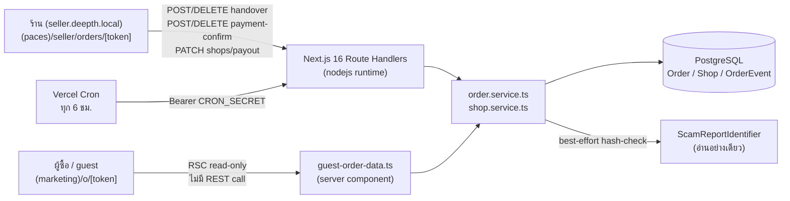
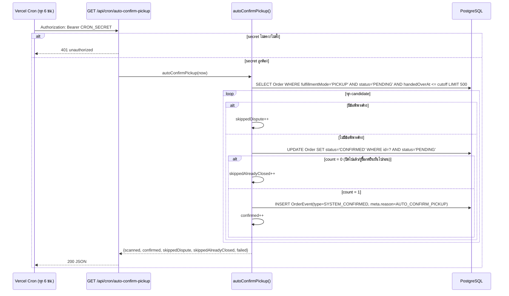
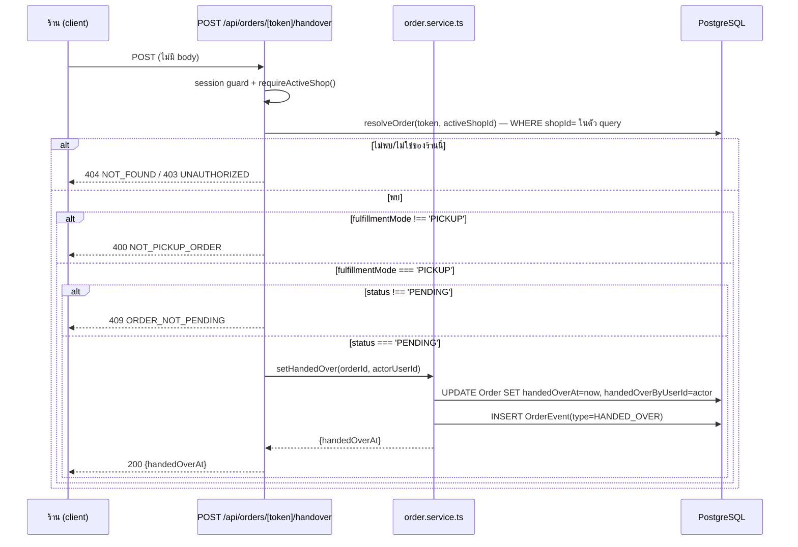
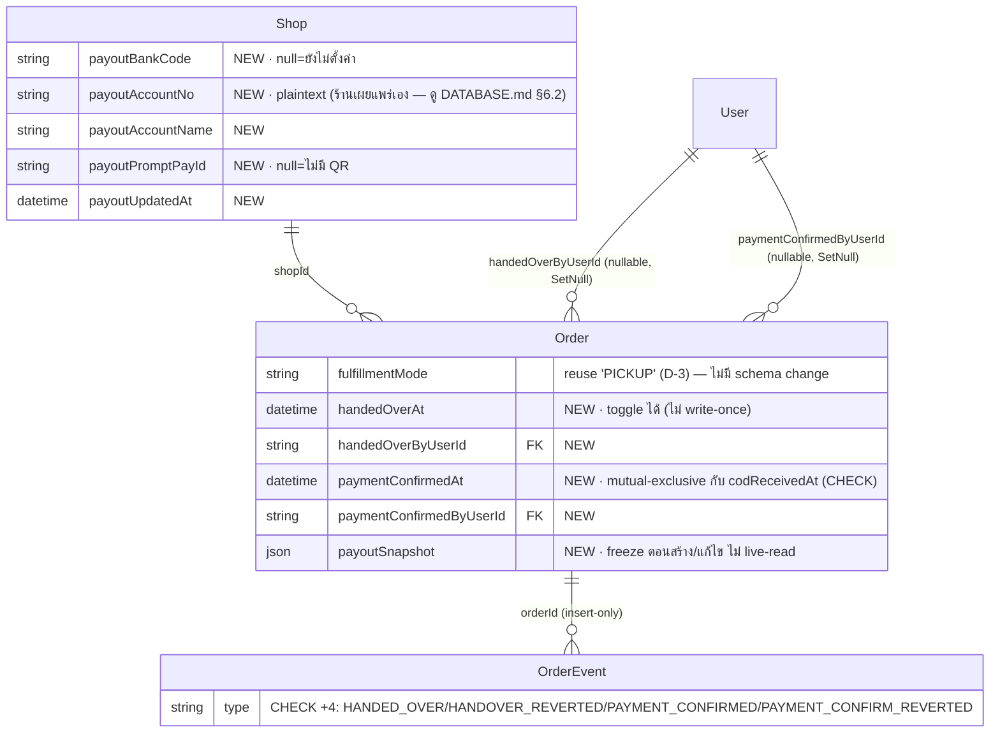

> **โมดูล:** M60-PickupBankTransfer
> **ประเภทเอกสาร:** Software Requirements Specification (SRS) — TECHNICAL
> **เวอร์ชัน:** 1.0
> **วันที่จัดทำ:** 2026-08-28
> **สถานะ:** Draft — เขียนจากมติ D-1..D-5 ที่ user เคาะแล้ว (PRD §4.3) + API.md/DATABASE.md/UX-Design-Spec.md ที่เขียนไว้ก่อนแล้ว (SDS ยังไม่เขียน — ตามลำดับที่ Controller สั่งเช่นเดียวกับ DATABASE.md)
> **เจ้าของเอกสาร:** SA (`safepay-planner`)

> 🛑 **หมายเหตุลำดับเอกสาร:** เหมือนที่ `DATABASE.md` ระบุไว้ — SDS ของโมดูลนี้ยังไม่เขียน เอกสารนี้จึง trace กลับได้ถึงระดับ **BRD FR-ID** เป็นหลัก และ**ต้องถูกอ่านซ้ำ**เมื่อ SDS เขียนเสร็จเพื่อยืนยันว่าไม่ขัดกัน (ระบุเป็น Open Question §9.4)

# SRS: นัดรับสินค้า และ การชำระเงินแบบโอน (Software Requirements Specification — Technical)

---

## 1. บทนำ (Introduction)

### 1.1 วัตถุประสงค์ของเอกสาร

เอกสารนี้แปลง BRD FR-PKP-01..05 / FR-PAY-01..03 / FR-BANK-01..05 ให้เป็นข้อกำหนดเชิงเทคนิคที่ implement ได้ตรง ๆ: สูตร/เงื่อนไข/ลำดับ branch ของ state machine, contract ของ endpoint (อ้าง `API.md` เป็นแหล่งจริง), โครงสร้างข้อมูล (อ้าง `DATABASE.md`), authorization matrix, validation rules, และกฎ snapshot/mutual-exclusivity ที่ยังไม่ได้เขียนไว้ที่ไหนแบบรวมศูนย์ ผู้อ่านหลักคือ DEV ที่ implement (`safepay-developer`), QA ที่เขียน test case (`safepay-qa`), และ reviewer (`safepay-reviewer`) ที่ต้องเช็คว่า service layer ตรงกับ contract นี้

### 1.2 ขอบเขตเชิงระบบ (System Scope)

ฟีเจอร์นี้เป็นส่วนขยายของ Simple OMS (`docs/SRS.md` §1 FR-6) — **ไม่สร้างระบบใหม่** แต่แตะจุดต่อไปนี้ในระบบเดิม:

**อยู่ในขอบเขต (แตะจริง):**
- `src/services/order.service.ts` — `VALID_TRANSITIONS` (ไม่เพิ่มค่าใหม่), `createOrder()`/`updateOrder()` (เพิ่มพารามิเตอร์ `deliveryOverride`), error class ใหม่ 3 ตัว
- `src/services/shop.service.ts` — ฟังก์ชันใหม่ `updateShopPayout()` (reauth + hash-check กับ `ScamReportIdentifier`)
- `src/lib/order-stage.ts` (`deriveShippingStage()`) + `src/lib/order-stage-sql.ts` (`buildShippingStageSql()`) — เพิ่ม branch ให้ `fulfillmentMode='PICKUP'` ไม่ตกไป `AWAITING_PARCEL`
- `src/lib/order-pickup.ts` (**ใหม่**) — SSOT ของค่าคงที่ grace period + ตัวช่วยตัดสิน pickup order + `derivePickupStage()`
- `src/lib/shipping-address-status.ts` (`orderNeedsShippingAddress()`) — เพิ่ม override สำหรับนัดรับ
- `src/app/(paces)/seller/(dashboard)/orders/[token]/components/order-action-set.ts` — ขยาย state matrix (flag ใหม่คู่กับ `isCodUnpaid`)
- `src/lib/order-display.ts` (`getPaymentBadge()`) — เพิ่มพารามิเตอร์ `paymentConfirmedAt` + คืน `tone` เพิ่ม (ดู UX-Design-Spec B8)
- `src/app/(marketing)/o/[token]/guest-order-data.ts` — เพิ่ม field เข้า allow-list (`payoutSnapshot`, สถานะยืนยันรับเงิน)
- `src/lib/promptpay-qr.ts` (**ใหม่**) — encode payload EMVCo พร้อมเพย์
- `src/lib/thai-banks.ts` (**ใหม่** — ชื่อไฟล์ตาม DATABASE.md Open Question #3, เจ้าของงานคือ SDS แต่ SRS ระบุ contract ที่ต้องมี)
- Vercel Cron ใหม่ 1 ตัว (`auto-confirm-pickup`, ทุก 6 ชม.) — มิเรอร์ `autoConfirmDelivered()` (feature 00039)

**อยู่นอกขอบเขต (ไม่แตะ — อ้าง BRD §5):**
- `OrderPayment` ledger (feature 00050) และเงื่อนไข `vertical === 'SERVICE_QUEUE'` ทั้ง 4 จุด + เทส `service-queue-vertical-gate.test.ts` — **ห้ามแตะเด็ดขาด** (มติ D-2)
- Escrow, payment gateway, OCR สลิป, ระบบมัดจำหลายก้อน, ปฏิทินนัดรับ, หลายบัญชีธนาคารต่อร้าน
- แก้ช่องโหว่เดิมของ `salesChannel='STOREFRONT'` ที่ยังคง `fulfillmentMode='SHIPPED'` โดยไม่มีที่อยู่ (known-gap แยก ตาม BRD §7.2 D-4 หมายเหตุ)

### 1.3 เอกสารอ้างอิง (References)

| เอกสาร | ความสัมพันธ์ |
|--------|-------------|
| `PRD.md` (00060) | เป้าหมายธุรกิจ, personas, มติ D-1..D-5 (§4.3) |
| `BRD.md` (00060) | FR-PKP/FR-PAY/FR-BANK ฉบับเต็ม + เหตุผลเบื้องหลังมติ (§7.2) + หนี้ที่ฟีเจอร์นี้ปลุก (§7.3) |
| `API.md` (00060) | API contract ฉบับสมบูรณ์ — เอกสารนี้**ไม่ลอก** request/response ซ้ำ อ้างอิงเป็นแหล่งจริงแทน |
| `DATABASE.md` (00060) | schema/migration/CHECK/ERD ฉบับสมบูรณ์ — เอกสารนี้อ้างอิงและขยายเฉพาะส่วนที่เป็นตรรกะ (ไม่ใช่ schema) |
| `UX-Design-Spec.md` (00060) | Layout/flow/edge state ที่ผูกกับตรรกะในเอกสารนี้ (A1–A6, B7–B8) |
| `docs/SRS.md` §1 FR-6 | Simple OMS เดิมที่ฟีเจอร์นี้ต่อยอด — ต้อง sync หลัง implement (ดู §11) |
| `docs/services/order-auto-confirm.service.ts` (feature 00039) | ต้นแบบที่ TFR-004 มิเรอร์ (grace period + dispute-gate + idempotent conditional update) |

### 1.4 นิยามและตัวย่อ (Definitions & Acronyms)

| คำ/ตัวย่อ | ความหมาย |
|-----------|----------|
| **นัดรับ (Pickup)** | `Order.fulfillmentMode = 'PICKUP'` — ผู้ซื้อมารับสินค้าเองจากร้าน ไม่ผ่านขนส่ง |
| **มอบของแล้ว (Handed Over)** | ร้านกดยืนยันว่าส่งมอบสินค้าแล้ว — เขียน `Order.handedOverAt`/`handedOverByUserId` |
| **ยืนยันรับเงินแล้ว (Payment Confirmed)** | ร้านกดยืนยันว่าได้รับเงินโอน/พร้อมเพย์/เงินสดแล้ว — เขียน `Order.paymentConfirmedAt`/`paymentConfirmedByUserId` |
| **Grace period** | 48 ชั่วโมงหลัง `handedOverAt` ที่ผู้ซื้อยังทักท้วงได้ก่อนระบบปิดงานอัตโนมัติ (`PICKUP_AUTOCONFIRM_HOURS`) |
| **Snapshot บัญชีรับเงิน** | `Order.payoutSnapshot` — สำเนาบัญชีของร้าน ณ เวลาสร้าง/แก้ไขออเดอร์ล่าสุด |
| **`ShippingStageKey`** | union ที่มีอยู่แล้วใน `order-stage.ts` (7 ค่า: `AWAITING_PARCEL`/`AWAITING_PICKUP`/`SHIPPING`/`AWAITING_COD`/`PROBLEM`/`RETURNED`/`DONE`) — ตอบคำถาม "ของอยู่ไหนในเส้นทางขนส่ง" |
| **`PickupStageKey`** (ใหม่) | union ใหม่ใน `order-pickup.ts` — ตอบคำถามคนละเรื่อง "ลูกค้ามารับหรือยัง" (§3.4) — **ไม่ใช่ค่าในตระกูล `ShippingStageKey`** |
| **Guest view** | หน้า `/o/{token}` ที่เห็นได้โดยไม่ล็อกอิน — ข้อมูลเป็น allow-list ที่ `guest-order-data.ts` (feature 00041) |
| **EMVCo** | มาตรฐาน payload ของ QR ชำระเงินที่พร้อมเพย์ใช้ — encode/decode ได้ด้วยไลบรารีมาตรฐาน ไม่ใช่รูปแบบเฉพาะของ Deep |

---

## 2. ภาพรวมสถาปัตยกรรม (Architecture Overview)

### 2.1 บริบทระบบ (System Context)



### 2.2 องค์ประกอบหลัก (Components)

| Component | หน้าที่ | Submodule / Stack |
|-----------|---------|-------------------|
| **Route Handlers** (`/api/orders/[token]/handover`, `/payment-confirm`, `/api/shops/payout`, `/api/cron/auto-confirm-pickup`) | Auth guard + Valibot parse + error-mapping ตาม `API.md` §5 | Next.js 16 App Router, nodejs runtime |
| **`order.service.ts`** | State transition, `createOrder`/`updateOrder` ที่รองรับ `deliveryOverride`, handover/payment-confirm toggle | TypeScript, Prisma |
| **`shop.service.ts`** | `updateShopPayout()` — reauth 2 ทาง + snapshot semantics + scam hash-check | TypeScript, Prisma |
| **`order-pickup.ts`** (ใหม่) | Pure module: ค่าคงที่ grace period, `isPickupOrder()`, `derivePickupStage()` | Pure TS (ห้าม import prisma) |
| **`promptpay-qr.ts`** (ใหม่) | Encode payload EMVCo จาก `promptPayId` + จำนวนเงิน | Pure TS |
| **auto-confirm-pickup job** | สแกน `Order` ที่ `fulfillmentMode='PICKUP'` พ้น grace period แล้วปิดงาน | มิเรอร์ `order-auto-confirm.service.ts` (feature 00039) |

### 2.3 มุมมองการ Deploy (Deployment View)

ไม่มี infrastructure ใหม่ — endpoint ใหม่ทั้งหมดรันบน Next.js route handler เดิม (nodejs runtime, deploy ผ่าน Vercel ตามปกติของโปรเจกต์). Cron job ใหม่ต้องเพิ่มรายการใน `vercel.json` (`crons`) ชี้ `GET /api/cron/auto-confirm-pickup` ทุก 6 ชั่วโมง — คนละ entry จาก `auto-confirm-delivered` เดิม (คนละตาราง คนละเงื่อนไข ตามที่ `DATABASE.md` §6.3 ระบุว่าไม่ควรรวม query) 🛑 การ deploy จะรัน `prisma migrate deploy` อัตโนมัติเมื่อ merge เข้า `main` (Hard Rule 15) — ไม่มีขั้นตอน migrate ด้วยมือบน prod

---

## 3. ข้อกำหนดเชิงฟังก์ชันเชิงเทคนิค (Technical Functional Requirements)

### 3.1 นัดรับสินค้า

#### TFR-001: เลือกวิธีส่งมอบเป็น "นัดรับ"
- **Trace to:** FR-PKP-01
- **คำอธิบายเชิงเทคนิค:**
  `CreateOrderSchema`/`UpdateOrderSchema` (`src/lib/validations.ts`) เพิ่มฟิลด์ optional `fulfillmentMode?: 'SHIPPED' | 'PICKUP'` (ตาม `API.md` §4.7/4.8 — ไม่ส่ง = พฤติกรรมเดิมทุกประการ, auto-derive จาก `toOrderItemShippingKind()` ต่อไป) `createOrder()`/`updateOrder()` (`src/services/order.service.ts`) รับค่านี้แล้ว:
  1. ถ้า `fulfillmentMode === 'PICKUP'` และ `shop.vertical !== 'ONLINE_SALES'` → `throw new PickupNotAllowedError()`
  2. ถ้า `fulfillmentMode === 'PICKUP'` และผ่านเงื่อนไข (1) → **override** ผลของ `toOrderItemShippingKind()`/การคำนวณอัตโนมัติเดิมทั้งหมด ตั้ง `Order.fulfillmentMode = 'PICKUP'` ตรง ๆ ไม่สนใจว่ารายการสินค้าจะปกติคำนวณเป็น `SHIPPED` หรือไม่ (ตาม FR-PKP-01 AC ข้อ 3)
  3. `orderNeedsShippingAddress()` (`src/lib/shipping-address-status.ts:69`) เพิ่มพารามิเตอร์ `deliveryOverride?: 'PICKUP'` ที่ **short-circuit คืน `false` ทันทีเป็นบรรทัดแรก** ก่อนแม้แต่ `if (!input.shipsGoods) return false` — เหตุผล: ฟังก์ชันนี้เป็น SSOT เดียวที่ `CustomerQuickBlock.tsx`/`CartPanel.tsx`/`createOrder()`/`updateOrder()` เรียกร่วมกัน ถ้าเขียนเงื่อนไข "ถ้าเลือกนัดรับ" ซ้ำที่ 3 จุดเรียกจะเกิดบั๊กคลาสเดียวกับที่ user เจอมาแล้ว 2 รอบ (2026-08-07, 2026-08-10 — บันทึกไว้ในหัวไฟล์เดียวกัน)
- **Precondition:** `shop.vertical === 'ONLINE_SALES'`; สำหรับ `updateOrder()` — `order.status === 'PENDING'` (ด่าน `OrderNotEditableError` เดิมครอบอยู่แล้ว ไม่ต้องเขียนซ้ำ)
- **Postcondition:** `Order.fulfillmentMode = 'PICKUP'`; ไม่มี `shippingAddress` ถูกบังคับ/บันทึก
- **Error / Edge cases:**
  - ร้านที่ไม่ใช่ `ONLINE_SALES` ส่ง `fulfillmentMode:'PICKUP'` มา (เช่น เรียก API ตรง ๆ ข้าม UI) → 400 `PICKUP_NOT_ALLOWED` — **ห้าม silent-fallback** เป็น `SHIPPED` (คลาสเดียวกับ `ProductNotInShopError` ที่ fail-closed เมื่อเจอ input ที่ UI จริงไม่มีวันส่งมา)
  - ออเดอร์ที่เคยกด "มอบสินค้าแล้ว" (`handedOverAt` ไม่ว่าง) แล้วร้านแก้ `fulfillmentMode` ออกจาก `PICKUP` — `updateOrder()` **ต้อง** `SET handedOverAt = NULL, handedOverByUserId = NULL` ในทรานแซกชันเดียวกันก่อนเปลี่ยนค่า มิฉะนั้นชน `Order_handedOver_requires_pickup_check` (`DATABASE.md` §5.1) และผู้ใช้เห็น Postgres error 23514 ดิบ — บันทึก `OrderEvent` `HANDOVER_REVERTED` ด้วยเหตุผล `meta.reason='FULFILLMENT_MODE_CHANGED'` เพื่อให้ประวัติไม่เงียบ

#### TFR-002: ออเดอร์นัดรับไม่มี action พัสดุ
- **Trace to:** FR-PKP-02
- **คำอธิบายเชิงเทคนิค:**
  1. `order-action-set.ts` (`getOrderActionSet()`) มีตัวตัดสิน `hasShipping = fulfillmentMode === 'SHIPPED'` อยู่แล้ว (**allow-list**, ยืนยันจากโค้ดจริง `order-action-set.ts:94`) — `'PICKUP'` ไม่เข้าเงื่อนไขนี้จึงไม่มี action พัสดุอัตโนมัติอยู่แล้วโดยไม่ต้องแก้ไฟล์นี้ (ตรงกับมติ D-3 ที่อ้างว่า `PICKUP` ให้ผลเหมือน `NO_SHIPPING` ทุกสถานะ)
  2. `CustomerPanel.tsx` (แผงลูกค้าในกล่องแชท) เขียนเป็น **deny-list** `fulfillmentMode !== 'NO_SHIPPING'` — ต้องเปลี่ยนเป็น **allow-list** `fulfillmentMode === 'SHIPPED'` มิฉะนั้นปุ่ม "สร้างพัสดุ" จะโผล่ผิดสำหรับออเดอร์นัดรับ (ตาม BRD §7.3 ที่ระบุจุดนี้ไว้ตรง ๆ)
  3. `deriveShippingStage()` (`src/lib/order-stage.ts:167`) และ `buildShippingStageSql()` (`src/lib/order-stage-sql.ts:67`) ต้องเพิ่มเงื่อนไข `fulfillmentMode === 'PICKUP'` เป็นเงื่อนไข**ที่สอง**ในลำดับ (ต่อจาก `CANCELLED`/`RETURNED`, ก่อนสาขา `hasShipment`) คืนค่าใหม่ที่ไม่ถูกนับในไทล์ใด — ดู §3.4 สำหรับ enum ที่เลือก
- **Precondition:** `order.fulfillmentMode === 'PICKUP'`
- **Postcondition:** ไม่มีปุ่ม/เมนู "แจ้งเลขพัสดุ"/"แก้ไขเลขพัสดุ"/"คัดลอกเลขพัสดุ"/"คัดลอกที่อยู่จัดส่ง"/"สร้างพัสดุ" ปรากฏที่จุดใดในระบบ; ออเดอร์นัดรับไม่ถูกนับในตัวนับ `getShippingStageCounts()`/ตัวกรอง `?stage=`
- **Error / Edge cases:** ถ้า `deriveShippingStage()`/`buildShippingStageSql()` ทั้งสองฝั่งไม่ sync กัน (ลำดับ branch ต่างกัน) — เทส `[blocker]` `order-stage-sql.test.ts` ที่มีอยู่แล้ว (มิเรอร์ทุกคอมบิเนชันผ่าน `VALUES`) ต้องขยายชุดทดสอบให้ครอบ `fulfillmentMode='PICKUP'` ด้วย ไม่ใช่แค่ค่าเดิม — ไม่งั้นสองฝั่งจะ drift แบบเงียบเหมือนที่คอมเมนต์ในไฟล์เตือนไว้ (บั๊กที่เคยเกิดจริงกับ `return_success`)

#### TFR-003: ร้านยืนยันว่ามอบสินค้าแล้ว
- **Trace to:** FR-PKP-03
- **คำอธิบายเชิงเทคนิค:**
  `POST /api/orders/[token]/handover` (contract เต็มที่ `API.md` §4.1): resolve order ผ่าน `resolveOrder()` (มิเรอร์ `cod-received/route.ts` — ownership scope ที่ query ด้วย `activeShopId`) แล้ว guard ตามลำดับ:
  1. `order.fulfillmentMode !== 'PICKUP'` → 400 `NOT_PICKUP_ORDER`
  2. `order.status !== 'PENDING'` → 409 `ORDER_NOT_PENDING`
  3. ผ่านทั้งสอง → `prisma.order.update({ data: { handedOverAt: new Date(), handedOverByUserId: actorUserId } })` + `recordOrderEvent(tx, { type: 'HANDED_OVER', actorUserId })` ในทรานแซกชันเดียวกัน (มิเรอร์ pattern `setCodReceived()`/`BUYER_CONFIRMED` ที่มีอยู่แล้ว)

  `DELETE /api/orders/[token]/handover`: guard `order.status !== 'PENDING'` → 409 `ORDER_ALREADY_CLOSED` (ถ้า auto-confirm ปิดไปแล้วก่อนกด undo — ป้องกัน race). ผ่านแล้ว `update({ handedOverAt: null, handedOverByUserId: null })` + event `HANDOVER_REVERTED` — **ไม่ต้องมี Sweet Alert ยืนยัน** (UX-Design-Spec A2 ระบุว่า undo คือการกู้คืนความผิดพลาด ไม่ใช่ action ทำลายล้าง มิเรอร์ `CodCard` undo ที่ไม่มี confirm เช่นกัน)
- **Precondition:** `order.fulfillmentMode === 'PICKUP'`; `order.status === 'PENDING'` (ทั้งกดและ undo)
- **Postcondition:** `handedOverAt`/`handedOverByUserId` ถูกตั้ง/ล้างเป็นคู่เสมอ; `OrderEvent` ใหม่ 1 แถวต่อการกระทำ; `Order.status` **ไม่เปลี่ยน**
- **Error / Edge cases:**
  - กดซ้ำ (ปุ่มควรถูกซ่อนแล้วที่ UI แต่ server ต้อง fail-closed เช่นกัน): กดครั้งที่สองไม่ throw error ใหม่ — เขียนทับ `handedOverAt` ด้วยเวลาใหม่ (idempotent ในความหมาย "ยืนยันซ้ำ") **แต่ยัง insert `OrderEvent` ใหม่ทุกครั้ง** เพราะ audit trail ต้องเห็นทุกครั้งที่กด (ต่างจาก auto-confirm ที่ conditional-update กันซ้ำเพราะเป็น cron ไม่ใช่ human action)
  - race ระหว่างร้านกด undo กับ cron ปิดงานพอดี: cron ใช้ conditional `updateMany({ where: { status: 'PENDING' } })` (TFR-004) — ถ้า undo มาถึงก่อน cron จะเห็น `handedOverAt=null` แล้วข้ามใบนี้ (ไม่ error); ถ้า cron ปิดไปก่อน undo จะเจอ `status !== 'PENDING'` → 409 ตามที่ออกแบบไว้แล้ว

#### TFR-004: ปิดงานอัตโนมัติหลัง grace period
- **Trace to:** FR-PKP-04
- **คำอธิบายเชิงเทคนิค:** ฟังก์ชันใหม่ `autoConfirmPickup(now = new Date())` มิเรอร์ `autoConfirmDelivered()` (`src/services/order-auto-confirm.service.ts:44`) **โครงสร้างเดียวกันทุกจุด** ต่างที่แหล่งข้อมูล:
  ```
  cutoff = now - PICKUP_AUTOCONFIRM_HOURS ชั่วโมง   // PICKUP_AUTOCONFIRM_HOURS = 48 (order-pickup.ts)
  candidates = SELECT * FROM Order
    WHERE fulfillmentMode = 'PICKUP'
      AND status = 'PENDING'                        -- ไม่ใช่ IN ('PENDING','SHIPPED') แบบพัสดุ
      AND handedOverAt IS NOT NULL AND handedOverAt <= cutoff
    ORDER BY handedOverAt ASC
    LIMIT MAX_PER_RUN
  ```
  🛑 **ต่างจาก `autoConfirmDelivered()` ตรงจุดเดียวที่สำคัญ:** พัสดุ query จาก `OrderShipment` (ตารางเล็กกว่า) ส่วนนัดรับต้อง query จาก `Order` ตรง ๆ (ไม่มี child table ให้พัสดุ) — index `Order_fulfillmentMode_status_handedOverAt_idx` (`DATABASE.md` §4) ถูกออกแบบมาเพื่อรองรับ query นี้โดยเฉพาะ ไม่ scan ทั้งตาราง
  🛑 **`status IN` เหลือแค่ `'PENDING'` เพราะพิสูจน์แล้วว่าออเดอร์นัดรับไปไม่ถึง `SHIPPED`**: `shipOrder()` (`src/services/order.service.ts:1036`) มีด่าน `if (order.fulfillmentMode !== "SHIPPED") throw new Error("ออเดอร์นี้ไม่ต้องจัดส่ง")` อยู่แล้ว — ออเดอร์ `fulfillmentMode='PICKUP'` จึงไม่มีทางถูกเปลี่ยนเป็น `SHIPPED` ผ่านเส้นทางนี้ (path เดียวที่เขียน `status='SHIPPED'` ในระบบ) — สถานะที่เป็นไปได้ของออเดอร์นัดรับจึงมีแค่ `PENDING → {CONFIRMED, CANCELLED}` เท่านั้น (ไม่ใช่ subset เต็มของ `VALID_TRANSITIONS.PENDING`)
  ทุก candidate: ข้ามถ้ามีข้อพิพาทค้าง (`disputeOpenedAt !== null && disputeResolvedAt === null` — ตรรกะเดียวกับ `autoConfirmDelivered()`) → `skippedDispute++`; ไม่งั้น conditional update `updateMany({ where: { id, status: 'PENDING' } })` → count=0 = `skippedAlreadyClosed++` (idempotent, ผู้ซื้อกดยืนยันเอง/ร้านยกเลิกไปก่อนพอดี); count=1 → `recordOrderEvent({ type: 'SYSTEM_CONFIRMED', actorUserId: null, meta: { reason: 'AUTO_CONFIRM_PICKUP', handedOverAt } })` → `confirmed++`. ล้มทีละใบ (`try/catch` ต่อ candidate, `console.error` ทุกครั้ง — ห้าม fail-silent ตามที่คอมเมนต์ต้นฉบับเตือนไว้) → `failed++`
- **Precondition:** เรียกจาก cron เท่านั้น (`Authorization: Bearer CRON_SECRET`, `API.md` §4.6)
- **Postcondition:** ออเดอร์ที่เข้าเงื่อนไขครบทุกใบเปลี่ยนเป็น `CONFIRMED`; `OrderEvent` type `SYSTEM_CONFIRMED` ใหม่ 1 แถวต่อใบที่ปิดสำเร็จ; รันซ้ำเวลาเดิมไม่สร้างผลข้างเคียงซ้ำ (idempotent ด้วย conditional update — ไม่ใช่การจำว่าเคยรันแล้ว)
- **Error / Edge cases:**
  - ข้อพิพาทถูกเปิดหลัง cron ผ่าน dispute-check ไปแล้วเสี้ยววินาที (race ที่ยอมรับได้): เหมือน `autoConfirmDelivered()` ทุกประการ — เป็นความเสี่ยงที่มีอยู่แล้วในระบบเดิม ไม่ใช่ของใหม่จากฟีเจอร์นี้
  - `MAX_PER_RUN` (มิเรอร์ค่า 500 ของ `autoConfirmDelivered()` หรือกำหนดแยกใน `order-pickup.ts` — เจ้าของงาน SDS) — ใบที่ตกรอบไม่หาย รอรอบถัดไป (cron ทุก 6 ชม. ทำให้ตกรอบช้าลงสูงสุด 6 ชม. เทียบกับพัสดุที่ cron รันวันละครั้ง)

#### TFR-005: ผู้ซื้อยืนยันรับของเองได้ตลอดเวลา
- **Trace to:** FR-PKP-05
- **คำอธิบายเชิงเทคนิค:** **ไม่มีโค้ดใหม่** — `confirmOrder()` (`src/services/order.service.ts:956`) ที่มีอยู่แล้วรองรับกรณีนี้โดยไม่ต้องแก้: มันเช็คแค่ `order.buyerUserId === buyerUserId` + `assertTransition(order.status, 'CONFIRMED')` ซึ่ง `VALID_TRANSITIONS.PENDING` มี `'CONFIRMED'` อยู่แล้ว (`order.service.ts:31`) — ไม่มีเงื่อนไขใดผูกกับ `fulfillmentMode` หรือ `handedOverAt` เลย จึงใช้งานได้ทันทีไม่ว่าร้านจะกด "มอบสินค้าแล้ว" ไปก่อนหรือยัง
- **Precondition:** `order.buyerUserId === buyerUserId` (ผ่านด่าน ownership เดิม); `order.status === 'PENDING'`
- **Postcondition:** `Order.status = 'CONFIRMED'`; `OrderEvent` type `BUYER_CONFIRMED`
- **Error / Edge cases:** ถ้าผู้ซื้อกดก่อนร้านกด "มอบสินค้าแล้ว" — ออเดอร์ปิดตรง โดยไม่มีขั้น "รอผู้ซื้อยืนยัน" คั่น (UX-Design-Spec A2 Edge states ระบุไว้ตรงกัน — ข้าม state ไม่ใช่บั๊ก)

### 3.2 การยืนยันรับเงินโอน

#### TFR-006: ร้านยืนยัน "ได้รับเงินแล้ว"
- **Trace to:** FR-PAY-01, FR-PAY-03
- **คำอธิบายเชิงเทคนิค:** `POST/DELETE /api/orders/[token]/payment-confirm` มิเรอร์ `setCodReceived()` (`order.service.ts:1335`) แบบตรงตัว — สร้างฟังก์ชันคู่ขนาน `setPaymentConfirmed(orderId, actorUserId, opts?: { clear?: boolean })`:
  ```ts
  return prisma.order.update({
    where: { id: orderId },
    data: opts?.clear
      ? { paymentConfirmedAt: null, paymentConfirmedByUserId: null }
      : { paymentConfirmedAt: new Date(), paymentConfirmedByUserId: actorUserId },
  })
  ```
  Guard ก่อนเรียก (inline ที่ route ตาม `API.md` §5): `paymentMethod ∉ {'TRANSFER','PROMPTPAY','CASH'}` (รวม `COD`) → 400 `PAYMENT_METHOD_NOT_ELIGIBLE` พร้อมข้อความชี้ไปปุ่ม COD เดิม (ห้ามให้ผู้ใช้งงว่าทำไมกดไม่ได้) — ใช้ pattern match เดียวกับ `isCODPayment()` (`order-display.ts`) เพื่อกันไม่ให้นิยาม "คือ COD ไหม" แตกเป็นสองชุด
- **Precondition:** `order.paymentMethod ∈ {TRANSFER, PROMPTPAY, CASH}` (case-insensitive/free-text ตามที่ `isCODPayment()` ใช้ regex อยู่แล้ว — ต้องตัดสินด้วย pattern เดียวกัน ไม่ใช่ equality ตรง ๆ เพราะ `paymentMethod` เป็น free string ที่ร้านพิมพ์เอง เช่น `"พร้อมเพย์ 081-234-5678"`)
- **Postcondition:** `paymentConfirmedAt`/`paymentConfirmedByUserId` ถูกตั้ง/ล้างเป็นคู่; **`Order.status` ไม่เปลี่ยน**; `OrderEvent` ใหม่ (`PAYMENT_CONFIRMED`/`PAYMENT_CONFIRM_REVERTED`)
- **Error / Edge cases:**
  - กดได้ **ทุกสถานะที่ไม่ใช่ `CANCELLED`** ต่างจาก `handover` ที่บังคับ `PENDING` เท่านั้น (UX-Design-Spec A3: "รับได้ตั้งแต่ PENDING" — ตาม user journey ที่โอนก่อนมารับของ; ต่างจาก COD ที่เงินเข้าตอนของถึงมือ) — ต้องเช็ค `order.status !== 'CANCELLED'` ไม่ใช่ `=== 'PENDING'`
  - DB CHECK `Order_payment_confirm_exclusive_check` (`paymentConfirmedAt IS NULL OR codReceivedAt IS NULL`, `DATABASE.md` §5.1) เป็น safety net ชั้นที่สอง — service layer ต้องกันไว้ตั้งแต่ guard แรก (COD ใช้ `codReceivedAt` เดิมเสมอ ไม่มีทางที่ `paymentMethod='COD'` จะเข้าเส้นทางนี้ได้) ถ้า SDS ออกแบบผิดจน service ตั้งทั้งสองพร้อมกัน จะได้ Postgres error 23514 แทนข้อมูลขัดแย้งเงียบ ๆ

#### TFR-007: ป้ายสถานะการชำระเงิน 3 สถานะแยกกันชัดเจน
- **Trace to:** FR-PAY-02
- **คำอธิบายเชิงเทคนิค:** ขยาย `getPaymentBadge()` (`src/lib/order-display.ts:92` — signature ปัจจุบัน `(status, paymentMethod, slipFileId) => { label, cls }`) เพิ่มพารามิเตอร์ที่ 4 `paymentConfirmedAt: Date | string | null | undefined` และคืนเพิ่ม `tone: OrderStatusTone` (จำเป็นเพราะ B7 ฝั่งผู้ซื้อเป็น Vuexy/MUI — ต้อง map ผ่าน `ORDER_STATUS_TONE_TO_MUI[tone]` คนละ token กับ `cls` ที่เป็น Paces class ตรง ๆ) ลำดับเงื่อนไขที่ **ต้องแทรกก่อนกิ่ง `slipFileId` เดิม**:
  ```ts
  if (status === 'CONFIRMED') return { label: 'ชำระแล้ว', cls: '...', tone: 'success' }   // เดิม
  if (status === 'CANCELLED') return { label: 'ยกเลิก', cls: '...', tone: 'warning' }       // เดิม (คงคลาส CANCELLED เดิม)
  if (isCODPayment(paymentMethod)) return { label: 'รอเก็บปลายทาง', cls: '...', tone: 'info' }  // เดิม
  // ── ใหม่: ต้องมาก่อน slipFileId เสมอ ──
  if (TRANSFER_LIKE.test(paymentMethod) && paymentConfirmedAt) {
    return { label: 'ร้านยืนยันรับเงินแล้ว', cls: 'badge bg-info/15 text-info-ink', tone: 'info' }
  }
  if (paymentMethod === 'TRANSFER' || paymentMethod === 'PROMPTPAY') {
    if (slipFileId) return { label: 'รอตรวจสอบสลิป', cls: '...', tone: 'info' }             // เดิม
    return { label: 'รอชำระ', cls: '...', tone: 'warning' }                                  // เดิม
  }
  return { label: 'ยังไม่ยืนยันการชำระ', cls: '...', tone: 'warning' }                        // เดิม
  ```
  🛑 **tone `info` ไม่ใช่ `success`** สำหรับ "ร้านยืนยันรับเงินแล้ว" — Verified-Means-Green สงวนไว้เฉพาะ `status===CONFIRMED` เพราะการยืนยันนี้เป็น self-report ของร้านเอง ไม่มีบุคคลที่สามยืนยัน (ตรงกับ UX-Design-Spec B8 และ BRD §4.2 ที่ยอมรับข้อจำกัดนี้ตรง ๆ) การใช้เขียวจะทำสัญญาณเขียวเฟ้อและสับสนกับ "ปิดงานแล้วจริง" — แม้ `CodCard.tsx` เดิม (ที่ mirror เรื่องโครง) จะใช้เขียวกับ "ได้รับเงินปลายทางแล้ว" ก็ **ห้าม mirror ตรงจุดนี้** (ux เลือกทำตาม Impeccable+BRD เหนือ precedent เดิม)
  🛑 `getPaymentBadge()` **วันนี้ยังไม่มีใครเรียกฝั่งผู้ซื้อเลย** — `OrderDetailMobile.tsx`/`GuestOrderView.tsx` ใช้ `resolveOrderStatusBadge`/`ORDER_STATUS_TONE_TO_MUI` คนละฟังก์ชัน ดังนั้น TFR นี้คือจุดแรกที่ SSOT ตัวนี้ถูกเรียกข้ามสกิน (Paces A3 + Vuexy B7) — เปลี่ยน return shape ของฟังก์ชันนี้จึงมี blast radius กว้างกว่าปกติ ต้อง grep ทุกจุดที่เรียก `getPaymentBadge(` ก่อน implement
- **Precondition:** —
- **Postcondition:** ทุกจอที่แสดงป้ายสถานะการชำระเงิน (A3 การ์ด Paces, B7/B8 การ์ด+badge Vuexy) เรียก `getPaymentBadge()` ตัวเดียวกัน — ไม่มีการคำนวณป้ายซ้ำที่ใดที่หนึ่ง (Hard Rule 16)
- **Error / Edge cases:** `paymentMethod` ที่เป็น free text ไม่ตรง enum เป๊ะ (เช่น `"พร้อมเพย์ 081-xxx"`) ต้อง match ด้วย pattern เดียวกับที่ใช้ตัดสิน `TRANSFER_LIKE` ใน TFR-006 — ห้ามสร้าง regex/nomenclature ที่สามของ "นี่คือการโอนไหม" (มีอยู่แล้ว 2 ชุด: `isCODPayment()`/`COD_PAYMENT_PATTERN` และเกณฑ์ TRANSFER/PROMPTPAY ที่ `getPaymentBadge()` ใช้ equality ตรง ๆ — TFR-006/TFR-007 ต้องใช้เกณฑ์เดียวกันทั้งคู่)

#### TFR-008: ผู้ซื้อยังแนบสลิปได้ตามเดิม
- **Trace to:** FR-PAY-03
- **คำอธิบายเชิงเทคนิค:** **ไม่มีโค้ดใหม่** — เส้นทางแนบสลิปเดิม (`POST /api/orders/[token]/slip`) ไม่ถูกแตะ ยังคง `slipFileId` เหมือนเดิมทุกประการ TFR นี้มีไว้เพื่อยืนยันว่า**ไม่มี side-effect ใหม่**เกิดขึ้น: การแนบสลิปต้อง**ไม่**เขียน `paymentConfirmedAt` โดยอัตโนมัติ (คนละ path, คนละ actor — สลิปมาจากผู้ซื้อ ส่วน `paymentConfirmedAt` เขียนได้จากร้านเท่านั้น)
- **Postcondition:** `slipFileId` ไม่ว่าง + `paymentConfirmedAt` ว่าง = สถานะ "รอตรวจสอบสลิป" (TFR-007) — เป็น state ที่ถูกต้อง ไม่ใช่ half-done

### 3.3 บัญชีรับเงินของร้าน

#### TFR-009: ตั้งค่าบัญชีรับเงินของร้าน + Snapshot ลงออเดอร์
- **Trace to:** FR-BANK-01, FR-BANK-02, BR-BANK-01
- **คำอธิบายเชิงเทคนิค:**
  **(A) ฝั่งตั้งค่า** — `PATCH /api/shops/payout` → `shop.service.ts::updateShopPayout(shopId, userId, data)` (sequence เต็มที่ `API.md` §6.1): reauth 2 ทาง (`PASSWORD` ผ่าน `verifyPassword()` จาก `src/lib/password.ts`, หรือ `OTP` ผ่านกลไก OTP เดิม) → ถ้าไม่มีทั้ง `passwordHash` และ `phone` → `throw new PayoutReauthUnavailableError()` (409) → reauth ผ่าน → best-effort `hashIdentifier('BANK_ACCOUNT', accountNo)` (`src/lib/scam-identifier.ts:34`) เทียบกับ `ScamReportIdentifier(type='BANK_ACCOUNT')` (ไม่บล็อก แค่แจ้งเตือนทีมงาน — FR-BANK-04 Should) → `shop.update({ payout*, payoutUpdatedAt: now })`
  🛑 **บันทึกครั้งแรก (ยังไม่เคยมีบัญชี) ไม่ต้อง reauth** — BR-BANK-02 พูดถึง "เปลี่ยน" ไม่ใช่ "ตั้งครั้งแรก" (UX-Design-Spec A6 ยืนยันตรงนี้) — service ต้องเช็ค `shop.payoutBankCode === null && shop.payoutAccountNo === null` (ยังไม่เคยตั้ง) เพื่อข้าม reauth guard เฉพาะกรณีนี้เท่านั้น
  **(B) ฝั่ง snapshot** — `createOrder()` เขียน `Order.payoutSnapshot` **ครั้งเดียวตอนสร้าง** เมื่อ `paymentMethod ∈ {TRANSFER, PROMPTPAY}` โดยอ่าน `Shop.payout*` ณ ขณะนั้นแล้ว freeze เป็น `{ bankCode?, accountNo?, accountName?, promptPayId? }` — **field ใดที่ `Shop.payout*` เป็น `null` ตอนนั้น ไม่ใส่ key นั้นเลย** (ไม่ใส่ `null` ทับ — ตาม `DATABASE.md` §3.1 หลักการเดียวกับ `docs/conventions/external-payload-schema.md`) `updateOrder()` **ต้อง re-snapshot ใหม่ทั้งก้อนถ้าเปลี่ยน `paymentMethod` เป็น `TRANSFER`/`PROMPTPAY` ระหว่างแก้ไข** (ไม่ใช่ freeze ตายตัวแบบ `OrderShipment.senderSnapshot` — ตรงกับ pattern ที่ `updateOrder()` re-snapshot `OrderItem.cost` อยู่แล้วเมื่อแก้ไขราคาทุน)
- **Precondition:** (A) `role === 'OWNER'` (ดู §4 Authorization Matrix); (B) `shop.vertical === 'ONLINE_SALES'` (การสร้างออเดอร์ TRANSFER/PROMPTPAY ของร้านอื่น vertical ไม่เกี่ยวกับฟีเจอร์นี้)
- **Postcondition:** (A) `Shop.payout*` + `payoutUpdatedAt` อัปเดต; ออเดอร์ที่มีอยู่ก่อนหน้าไม่เปลี่ยน (อ่านจาก snapshot ของตัวเอง) (B) `Order.payoutSnapshot` ตรงกับ `Shop.payout*` ณ เวลาที่ query ครั้งล่าสุด (create หรือ update ล่าสุดที่ paymentMethod เป็น TRANSFER/PROMPTPAY)
- **Error / Edge cases:**
  - เลขบัญชี/PromptPay ID ผิดรูปแบบ → 400 `VALIDATION_ERROR` จาก Valibot parse ที่ route (ก่อนเรียก service) — ดู §5 Validation Rules
  - ร้านยังไม่ตั้งบัญชีตอนสร้างออเดอร์ TRANSFER/PROMPTPAY → `payoutSnapshot = NULL` (ไม่ error — UI ต้อง fallback ตามที่ UX-Design-Spec B7 Edge states ระบุ: "ร้านยังไม่ได้แจ้งเลขบัญชี — ทักแชทกับร้าน")
  - `payoutAccountNo` ห้ามส่งผ่าน URL query string ที่ไหน (ต้องอยู่ใน request body เสมอ — `DATABASE.md` §6.2 ข้อ 5)

#### TFR-010: ผู้ซื้อเห็นบัญชีก่อนล็อกอิน
- **Trace to:** FR-BANK-03
- **คำอธิบายเชิงเทคนิค:** `guest-order-data.ts::buildGuestOrderData()` (`src/app/(marketing)/o/[token]/guest-order-data.ts:141`) เพิ่ม field `payoutSnapshot: OrderLike['payoutSnapshot']` เข้า `GuestOrderData` type และ `OrderLike` type **โดยตั้งใจทีละฟิลด์** (ไฟล์นี้เป็น allow-list — ฟิลด์ใหม่ไม่ไหลตามอัตโนมัติ) พร้อมสถานะที่ derive จาก `paymentConfirmedAt` (สำหรับป้าย TFR-007 ฝั่งผู้ซื้อ) — **field ที่ query เพิ่มต้องอยู่ใน `select`/`include` ของ `getOrderByToken()` ด้วย** (คนละไฟล์จาก `guest-order-data.ts`, ต้องแก้คู่กัน มิฉะนั้น `payoutSnapshot` จะเป็น `undefined` เงียบ ๆ ที่ runtime — TypeScript ไม่จับเพราะ `select` block กำหนด type ของตัวเอง)
- **Precondition:** ไม่มี (ทำงานได้แม้ผู้ใช้ไม่ล็อกอิน — เป็นเหตุผลทั้งหมดที่ TFR นี้มีอยู่)
- **Postcondition:** `payoutSnapshot`/สถานะยืนยันรับเงินปรากฏใน `GuestOrderData` เมื่อ `paymentMethod ∈ {TRANSFER, PROMPTPAY}` — ผู้ถือลิงก์ทุกคน (ล็อกอินหรือไม่) เห็นเหมือนกัน
- **Error / Edge cases:** ออเดอร์ COD/CASH — `payoutSnapshot` เป็น `null` อยู่แล้ว (ไม่เคยเขียน) ⇒ ฝั่งอ่านต้องไม่ render การ์ดบัญชีรับเงินเลย (UX-Design-Spec B7: "`paymentMethod ∉ {TRANSFER, PROMPTPAY}` ไม่ render การ์ดนี้เลย")

#### TFR-011: QR พร้อมเพย์ที่ฝังยอดเงินของออเดอร์
- **Trace to:** FR-BANK-05 (มติ D-5)
- **คำอธิบายเชิงเทคนิค:** `src/lib/promptpay-qr.ts` (ใหม่) — `buildPromptPayPayload(promptPayId: string, amount: number): string | null` encode payload ตามมาตรฐาน EMVCo ของพร้อมเพย์ (Tag 00=Payload Format Indicator, Tag 29=Merchant Account Info พร้อมเพย์ AID `A000000677010111`, Tag 54=Transaction Amount, Tag 63=CRC) **คำนวณจากยอดปัจจุบันของออเดอร์เสมอ** (`Order.totalAmount` ที่ query สด — **ไม่ใช่ค่าใน `payoutSnapshot`** ซึ่ง freeze แค่บัญชี ไม่ freeze ยอดเงิน) — เมื่อออเดอร์ถูกแก้ไขยอดทีหลัง QR ต้องเปลี่ยนตามทันที (FR-BANK-05 AC ข้อ 3)
  - `promptPayId` เป็น **มือถือ 10 หลัก** (ตรวจด้วย `MOBILE_PHONE_RE` — `^0[689][0-9]{8}$`) **หรือ เลขบัตรประชาชน 13 หลัก** (`NATIONAL_ID` — ไม่มี regex ที่มีอยู่แล้วในระบบสำหรับ 13 หลัก ต้องสร้างใหม่ในการ implement — เจ้าของงาน SDS)
  🛑 **fail-closed: encode ล้มเหลว = ไม่แสดง QR เลย** (คืน `null`, ไม่ throw) — ห้ามแสดง QR ที่อาจผิด (ตาม instruction ของ task นี้ที่อ้าง `docs/conventions/external-payload-schema.md`: ห้ามเดา schema ของระบบภายนอกแล้วปล่อยผ่าน)
- **Precondition:** `order.paymentMethod ∈ {TRANSFER, PROMPTPAY}` และ `payoutSnapshot.promptPayId` มีค่า (มาจาก snapshot ตอนสร้าง — ถ้าร้านตั้ง PromptPay หลังออเดอร์ถูกสร้างไปแล้ว ออเดอร์เก่าจะไม่มี QR เพราะ snapshot ไม่มีฟิลด์นั้น ตรงกับหลักการ snapshot ของ TFR-009)
- **Postcondition:** `/o/{token}` แสดง `<QRCodeSVG value={payload}>` เมื่อ encode สำเร็จ; ไม่มี block ว่าง/QR เสียเมื่อ encode ล้มเหลวหรือไม่มี `promptPayId`
- **Error / Edge cases:**
  - 🛑 **ต้องพิสูจน์ด้วยการสแกนจริง ก่อนถือว่า FR ผ่าน** (เงื่อนไขที่ Controller เพิ่ม) — payload ที่ encode ถูกต้องตามสเปกกระดาษไม่พอ ต้อง**สแกนด้วยแอปธนาคารไทยจริงอย่างน้อย 1 เจ้า แล้วยอดเงินขึ้นถูกต้อง** ก่อน mark FR-BANK-05 ว่าเสร็จ — บันทึกผลการสแกนไว้ใน `TestCase.md` (feature docs) พร้อมชื่อแอปธนาคารที่ทดสอบ, ไม่ใช่แค่ unit test ที่เทียบ payload string กับค่าคาดหวังที่เขียนเอง (คลาสเดียวกับ `docs/conventions/known-limitation-vs-unfinished.md` — เทสที่แต่งค่าเองยืนยันได้แค่ว่าโค้ดทำตามที่คนเขียนคิด ไม่ใช่ว่าคิดถูก)
  - `promptPayId` ผิดรูปแบบที่บันทึกไว้ก่อนฟีเจอร์นี้มี validation (ข้อมูลเก่า — ไม่มีเพราะเป็นฟิลด์ใหม่ทั้งหมด จึงไม่มีเคสนี้จริง)
  - ตั้งบัญชีธนาคารแต่ไม่ตั้งพร้อมเพย์: แสดงเฉพาะแถวธนาคาร+เลขบัญชี ไม่มี QR block เลย (ไม่ใช่กล่องเทาว่าง)

### 3.4 `derivePickupStage()` — SSOT ใหม่ของสถานะนัดรับ

🛑 **นี่คือฟังก์ชันใหม่ แยกจาก `deriveShippingStage()`/`ShippingStageKey` โดยเจตนา** — สองฟังก์ชันตอบคนละคำถาม (ตรงกับ UX-Design-Spec A5 ที่ปฏิเสธการเพิ่ม `ShippingStageKey` ตัวที่ 8): `deriveShippingStage()` ตอบว่า "ของอยู่ไหนในเส้นทางขนส่ง" ส่วนฟังก์ชันนี้ตอบว่า "ลูกค้ามารับหรือยัง" — ออเดอร์นัดรับ **ไม่มีพัสดุเลย** จึงไม่มีคำตอบที่มีความหมายในตระกูล `ShippingStageKey` (นอกจาก "ไม่ใช่เรื่องพัสดุ")

```ts
// src/lib/order-pickup.ts (ใหม่) — pure module, ห้าม import prisma
export const PICKUP_AUTOCONFIRM_HOURS = 48

export type PickupStageKey =
  | 'AWAITING_HANDOVER'   // ยังไม่กด "มอบสินค้าแล้ว"
  | 'AWAITING_BUYER_ACK'  // มอบของแล้ว รอ grace period / ผู้ซื้อยืนยัน
  | 'DISPUTED'            // มีข้อพิพาทค้างระหว่างรอ grace period
  | 'DONE'                // CONFIRMED แล้ว (ไม่ว่าทางไหน)

export function isPickupOrder(fulfillmentMode: string | null | undefined): boolean {
  return fulfillmentMode === 'PICKUP'
}

export function derivePickupStage(o: {
  status: string
  handedOverAt: Date | string | null
  disputeOpenedAt: Date | string | null
  disputeResolvedAt: Date | string | null
}): PickupStageKey {
  if (o.status === 'CONFIRMED' || o.status === 'CANCELLED') return 'DONE'
  const hasOpenDispute = o.disputeOpenedAt != null && o.disputeResolvedAt == null
  if (hasOpenDispute) return 'DISPUTED'
  return o.handedOverAt != null ? 'AWAITING_BUYER_ACK' : 'AWAITING_HANDOVER'
}
```

**ผลต่อ `deriveShippingStage()`/`buildShippingStageSql()` (TFR-002):** เมื่อ `fulfillmentMode === 'PICKUP'` ทั้งสองฟังก์ชันต้อง**ไม่**เดินเข้าสาขา `hasShipment`/`AWAITING_PARCEL` ปกติ — คืนค่า `ShippingStageKey` ตัวที่ไม่ถูกนับบนไทล์ใด (ผู้เขียนเอกสารนี้เสนอ**นำค่า `'DONE'` มาใช้ซ้ำ** เมื่อ `derivePickupStage()` คืน `'DONE'` ด้วย และเสนอค่าใหม่ `'AWAITING_PARCEL'` **ห้ามใช้** เด็ดขาดตามที่ UX ยืนยัน — enum value ที่แน่นอนสำหรับเคส `AWAITING_HANDOVER`/`AWAITING_BUYER_ACK`/`DISPUTED` เป็นการตัดสินใจของ SDS แต่ **ต้องไม่เป็น 1 ใน 6 ค่าเดิมที่มีไทล์อยู่แล้ว** — ตัวเลือกที่ปลอดภัยที่สุดคือคืน `'DONE'` เสมอสำหรับ pickup order ทุกสถานะ (ทำให้ `getShippingStageCounts()` ไม่ต้องแก้ตารางเลย เพราะ `DONE` ไม่ถูกนับ/ไม่ขึ้นตัวกรองอยู่แล้วตามคอมเมนต์ `SHIPPING_STAGE_LABEL` ปัจจุบัน) แล้วให้ facet "วิธีส่งมอบ" ใหม่ (`?fulfillment=PICKUP`, TFR-012) เป็นตัวกรองที่แท้จริงของนัดรับแทน

#### TFR-012: ตัวกรอง "วิธีส่งมอบ" ในหน้า `/orders`
- **Trace to:** BRD §7.3 (หนี้ที่ฟีเจอร์นี้ปลุก) + UX-Design-Spec A5
- **คำอธิบายเชิงเทคนิค:** เพิ่ม query param ใหม่ `?fulfillment=PICKUP|SHIPPED` (คนละแกนจาก `?stage=`/`?status=` เดิม) — `order-list.service.ts` (raw SQL column map) เพิ่ม mapping `fulfillmentMode: 'o."fulfillmentMode"'` ใน `WHERE` clause เมื่อมี param นี้ **ไม่กระทบ query pattern เดิม** (คนละ column, คนละ index — ไม่ต้อง index ใหม่ตาม `DATABASE.md` §4 เพราะ query หลัก `shopId+status+createdAt` ดึงแถวมาครบอยู่แล้ว การกรองด้วย `fulfillmentMode` เป็น equality บน column ที่ query กลับมาแล้ว)
- **Postcondition:** dropdown "วิธีส่งมอบ" ปรากฏเฉพาะร้าน `ONLINE_SALES`; ค่า default = ไม่กรอง (แสดงทั้งหมด); Command Center tile grid **ไม่ถูกแตะเลย**

---

## 4. Authorization Matrix

| Actor | เลือกวิธีส่งมอบ (สร้าง/แก้ไข ตอน `PENDING`) | กด "มอบสินค้าแล้ว" / undo | กด "ได้รับเงินแล้ว" / undo | ตั้ง/เปลี่ยนบัญชีรับเงิน (`PATCH /shops/payout`) | ดูบัญชีรับเงิน + QR ที่ `/o/{token}` |
|---|---|---|---|---|---|
| **OWNER** (`ShopMember.role='OWNER'`) | ✅ | ✅ | ✅ | ✅ | ✅ (เหมือนทุก actor — guest view) |
| **ADMIN** (`ShopMember.role='ADMIN'`, staff ที่ได้รับเชิญ) | ✅ (เท่ากับสิทธิ์แก้ไขออเดอร์ทั่วไปที่มีอยู่แล้ว — ไม่มีข้อจำกัดใหม่) | ✅ | ✅ | 🛑 **ต้องยืนยันจาก user** (ux เสนอ OWNER-only — ดู §8.1 Open Question) | ✅ |
| **ผู้ซื้อ (ล็อกอินแล้ว, `order.buyerUserId` ตรง)** | ❌ | ❌ | ❌ | ❌ | ✅ + กดยืนยันรับของเองได้ (TFR-005) + แนบสลิปได้ (TFR-008) |
| **ผู้ซื้อ / guest (ไม่ล็อกอิน)** | ❌ | ❌ | ❌ | ❌ | ✅ (guest view เต็มรูป — บัญชีรับเงิน + QR + สถานะ, ไม่มี mutation ใด) |
| **Cron (`CRON_SECRET`)** | ❌ | เขียนเฉพาะ `Order.status` ผ่าน `autoConfirmPickup()` — ไม่แตะ `handedOverAt` (มีอยู่แล้วก่อนหน้า) | ❌ | ❌ | ❌ |

**หมายเหตุ:** ทุกเส้นทางของร้าน (OWNER/ADMIN) ต้องผ่าน `requireActiveShop()` ก่อนเสมอ (session guard) แล้ว scope ด้วย `WHERE shopId = activeShopId` ที่ตัว query — **ไม่ใช่เช็คทีหลังจากผลลัพธ์** (ตาม `API.md` §2 "Token/Scope" และ pattern ที่ `resolveOrder()`/`cod-received/route.ts` ใช้อยู่แล้ว) การเช็ค ownership ที่ query จุดเดียวคือด่านที่กันร้าน A แก้ออเดอร์ของร้าน B ไม่ให้เกิดจากบั๊กที่ query ก่อนแล้วเช็คทีหลัง

---

## 5. Validation Rules

| ฟิลด์ | กฎ | ที่มา / เหตุผล |
|---|---|---|
| `fulfillmentMode` (body ของ `CreateOrderSchema`/`UpdateOrderSchema`) | `'SHIPPED' \| 'PICKUP'` — ไม่ส่ง = ไม่แตะพฤติกรรมเดิม | Valibot `optional(picklist(['SHIPPED', 'PICKUP']))` — ค่านอกลิสต์ถูก Valibot ปฏิเสธที่ชั้น parse ก่อนถึง service |
| `payoutBankCode` | ต้องอยู่ในรายชื่อธนาคารไทยที่รู้จัก (`src/lib/thai-banks.ts` ใหม่) — free text ที่ไม่ตรงลิสต์ = 400 | `DATABASE.md` §3.2 ระบุว่าไม่มี CHECK ระดับ DB — validate ที่ Valibot ชั้นเดียว (ตรงกับ convention ของฟิลด์ `Shop` อื่นทั้งหมด) |
| `payoutAccountNo` | normalize (ตัดช่องว่าง/ขีด) ก่อน validate/hash — เกณฑ์ความยาวตามธนาคารไทยทั่วไป (10-15 หลัก) | ต้อง normalize ก่อน `hashIdentifier()` มิฉะนั้น false positive/negative ต่อการเทียบกับ `ScamReportIdentifier` (`DATABASE.md` §3.2 ข้อ 2) |
| `payoutAccountName` | ≤100 ตัวอักษร, ไม่ว่าง | `API.md` §4.5 |
| `payoutPromptPayId` | `MOBILE_PHONE_RE` (`^0[689][0-9]{8}$`, ยืนยันจาก `src/lib/phone.ts:26`) **หรือ** เลขบัตร ปชช. 13 หลัก | ต้อง reuse `MOBILE_PHONE_RE` ตัวเดียวกับที่ระบบใช้ทั่วระบบ — **ห้ามเขียน regex เบอร์มือถือใหม่ที่นี่** (เกณฑ์เบอร์มือถือมี SSOT เดียวตามหัวไฟล์ `phone.ts` ที่เตือนไว้ชัดเจนว่ามี 2 เกณฑ์อยู่แล้วและห้ามเพิ่มเกณฑ์ที่ 3) |
| `reauth.method` (`PATCH /shops/payout`) | `'PASSWORD' \| 'OTP'` — ผู้ใช้ที่ไม่มีทั้ง `passwordHash` และ `phone` = 409 `REAUTH_UNAVAILABLE` (ห้ามอนุญาตให้บันทึกโดยไม่ reauth) | `API.md` §4.5, §6.1; TFR-009 |
| `Order.paymentMethod` ที่ทำให้เกิด `paymentConfirmedAt` ได้ | ต้อง match pattern `TRANSFER_LIKE` เดียวกับที่ TFR-006/TFR-007 ใช้ (ไม่ใช่ equality ตรง ๆ กับ 3 ค่า enum เฉย ๆ) เพราะ `paymentMethod` เป็น free string | ยืนยันจาก `isCODPayment()`/`COD_PAYMENT_PATTERN` ที่มีอยู่แล้วใน `order-display.ts` ใช้ regex ไม่ใช่ equality ด้วยเหตุผลเดียวกัน (ข้อมูลจริง: ใบ `TH140290UGSM3H` บันทึก `paymentMethod='CASH'` ทั้งที่เป็น COD จริง — free text ไม่ตรง enum เกิดขึ้นจริงบน prod) |

---

## 6. ข้อกำหนดส่วนต่อประสาน (Interface / API Specification)

> Contract เต็ม (request/response/error code ทุกตัว) อยู่ที่ **`API.md` §3-7 ของโมดูลนี้ — เอกสารนี้ไม่ลอกซ้ำ** เพื่อไม่ให้สอง source แตกกันเมื่อมีคนแก้ทีเดียว (Hard Rule 16) ส่วนนี้อ้างอิงเฉพาะ endpoint list + sequence ที่ไม่ได้อยู่ใน `API.md` (auto-confirm cron flow)

### 6.1 Endpoint List (สรุปจาก `API.md` §3)

| Method | Path | TFR ที่เกี่ยวข้อง |
|--------|------|----------|
| `POST`/`DELETE` | `/api/orders/[token]/handover` | TFR-003 |
| `POST`/`DELETE` | `/api/orders/[token]/payment-confirm` | TFR-006 |
| `PATCH` | `/api/shops/payout` | TFR-009 |
| `GET` | `/api/cron/auto-confirm-pickup` | TFR-004 |
| `POST` | `/api/orders`, `PATCH` | `/api/orders/[token]` | TFR-001 |

### 6.2 Sequence: `POST /api/cron/auto-confirm-pickup` (TFR-004)



### 6.3 Sequence: `POST /api/orders/[token]/handover` (TFR-003)



---

## 7. ข้อกำหนดด้านข้อมูล (Data Requirements)

> Schema/migration ฉบับเต็มอยู่ที่ **`DATABASE.md` §2-5 ของโมดูลนี้** — ส่วนนี้สรุปเฉพาะสิ่งที่ TFR ในเอกสารนี้ต้องอ้างอิงตรง ๆ

### 7.1 Data Model / Entities (สรุปจาก `DATABASE.md`)

| Entity | คอลัมน์ใหม่ | Owner store |
|--------|----------|-------------|
| `Order` | `handedOverAt`, `handedOverByUserId`, `paymentConfirmedAt`, `paymentConfirmedByUserId`, `payoutSnapshot` (JSONB) | PostgreSQL (Prisma) |
| `Shop` | `payoutBankCode`, `payoutAccountNo`, `payoutAccountName`, `payoutPromptPayId`, `payoutUpdatedAt` | PostgreSQL (Prisma) |
| `OrderEvent` | ไม่มีคอลัมน์ใหม่ — `type` (`TEXT`) ขยาย CHECK +4 ค่า | PostgreSQL (unmanaged CHECK) |

### 7.2 ERD



### 7.3 กฎ Snapshot (BR-BANK-01) — สรุปรวมที่ TFR-009/TFR-011 อ้างถึง

| อะไร | Snapshot หรือ Live-read | เหตุผล |
|---|---|---|
| บัญชี/พร้อมเพย์ที่แสดงในออเดอร์ (`payoutSnapshot`) | **Snapshot** — freeze ตอนสร้าง (`createOrder`), re-freeze ทั้งก้อนตอนแก้ไขถ้าเปลี่ยน `paymentMethod` เป็น TRANSFER/PROMPTPAY (`updateOrder`) | ร้านเปลี่ยนบัญชีทีหลังต้องไม่กระทบออเดอร์เก่าที่ผู้ซื้ออาจตกลงโอนไปแล้ว (BR-BANK-01) — mirror `OrderShipment.senderSnapshot`/`receiverSnapshot` |
| ยอดเงินใน QR พร้อมเพย์ | **Live-read** จาก `Order.totalAmount` ปัจจุบันเสมอ | FR-BANK-05 AC ข้อ 3 ระบุตรง ๆ ว่า "ยอดใน QR ต้องตรงกับยอดที่แสดงบนหน้าจอเสมอ — ออเดอร์ถูกแก้ยอดทีหลัง QR ต้องเปลี่ยนตาม" — คนละกฎกับบัญชี แม้อยู่ในฟีเจอร์เดียวกันและมาจาก `payoutSnapshot` เดียวกัน |

🛑 **สองแถวข้างบนขัดกันโดยตั้งใจ** (บัญชี=freeze, ยอด=live) — ต้องเขียนคอมเมนต์กำกับไว้ที่จุด implement จริง (`promptpay-qr.ts` หรือจุดประกอบ payload) ไม่งั้นคนถัดไปจะเห็นว่า "ทำไมอ่านค่าคนละที่กันในฟังก์ชันเดียวกัน" แล้วแก้ให้เหมือนกันทั้งคู่โดยไม่รู้ว่าเป็นความตั้งใจ (Hard Rule 16)

### 7.4 กฎกันชนกับ COD (`Order_payment_confirm_exclusive_check`)

`paymentConfirmedAt` และ `codReceivedAt` **ต้องไม่มีค่าพร้อมกัน** — บังคับ 2 ชั้น:
1. **Service layer:** guard ที่ TFR-006 (`PAYMENT_METHOD_NOT_ELIGIBLE` เมื่อ `paymentMethod` เป็น COD) — เป็นด่านหลักที่ผู้ใช้เห็นเป็นข้อความไทย
2. **DB CHECK** (`DATABASE.md` §5.1, `Order_payment_confirm_exclusive_check`) — safety net ที่ยิง Postgres error 23514 ถ้า service layer มีบั๊กที่ปล่อยให้ทั้งสองถูกตั้งพร้อมกัน (เช่น SDS ออกแบบ path ใหม่ที่ไม่ผ่าน guard เดิม)

**ที่มาของกฎ:** `paymentMethod='COD'` ใช้ `codReceivedAt` เดิมเสมอ (ก่อนฟีเจอร์นี้อยู่แล้ว), `paymentMethod ∈ {TRANSFER,PROMPTPAY,CASH}` ใช้ `paymentConfirmedAt` ใหม่เท่านั้น — ทั้งสองแยกกันด้วย `paymentMethod` ที่มีค่าเดียวต่อออเดอร์เสมอ จึงไม่มีเส้นทางที่ถูกต้องใดที่จะทำให้ทั้งคู่มีค่าพร้อมกัน (BRD §7.2 D-2 "ไม่มีออเดอร์ใดใช้ทั้งคู่พร้อมกัน")

---

## 8. ข้อกำหนดที่ไม่ใช่ฟังก์ชัน (Non-Functional Requirements)

| ด้าน | ข้อกำหนด | เป้าหมายที่วัดได้ |
|------|----------|-------------------|
| **Performance** | หน้า `/o/{token}` ของ guest ต้องไม่ช้าลงจากการเพิ่ม `payoutSnapshot` (BRD §6.2) | ไม่เพิ่ม query round-trip ใหม่ — `payoutSnapshot` เป็น scalar บน `Order` ที่ query อยู่แล้ว |
| **Scalability** | การเพิ่มกองสถานะนัดรับต้องไม่เพิ่มจำนวน query ของหน้า `/orders` (BRD §6.2) | `derivePickupStage()`/facet `?fulfillment=` คำนวณ/กรองจากคอลัมน์ที่ query มาแล้วในหน่วยความจำ/WHERE เดียวกัน ไม่ใช่ query แยก (ดู §3.4, TFR-012) |
| **Availability** | Migration เป็น additive ล้วน ไม่มี downtime (`DATABASE.md` §5.3 — `ALTER TABLE ADD COLUMN` แบบ nullable บน Postgres 11+ เป็น metadata-only) | 0 downtime ตอน deploy |
| **Security** | (1) เปลี่ยนบัญชีรับเงินต้อง reauth เสมอ (BR-BANK-02) (2) `payoutAccountNo` ต้องไม่หลุดเข้า flight payload ของหน้าที่ไม่เกี่ยวข้อง/log ที่ไม่จำเป็น (`DATABASE.md` §6.2) (3) ownership scope ที่ query เสมอ (§4) | grep `payoutAccountNo`/`payoutSnapshot` ทุกจุด `select` ก่อน merge — ต้องมีเหตุผลชัดว่าทำไม query นั้นต้องการฟิลด์นี้ |
| **Observability** | `autoConfirmPickup()` ต้อง log ทุกครั้งที่ล้มเหลว (ห้าม fail-silent — มิเรอร์ `autoConfirmDelivered()`) | `console.error` ต่อ candidate ที่ล้ม พร้อม `orderId` |
| **Maintainability** | `deriveShippingStage()`/`buildShippingStageSql()` ต้องมีเทส `[blocker]` เทียบผลสองฝั่งครอบคลุม `fulfillmentMode='PICKUP'` ด้วย (ไม่ใช่แค่ค่าเดิม 6 กอง) | ขยาย `order-stage-sql.test.ts` ที่มีอยู่แล้ว — ห้ามสร้างไฟล์เทสใหม่แยก |

---

## 9. ข้อจำกัดทางเทคนิคและการพึ่งพา (Technical Constraints & Dependencies)

### 9.1 ข้อจำกัดทางเทคนิค
- `Order.fulfillmentMode='PICKUP'` เป็นค่าที่ reuse จาก feature 00017 (booking/LODGING) — ทุก code path ที่เคยสันนิษฐานว่า `PICKUP` มาจาก booking เท่านั้น ต้องถูก grep หาซ้ำก่อน implement จริง (มติ D-3 ระบุความเสี่ยงนี้ไว้ตรง ๆ ใน BRD)
- `paymentMethod` เป็น free string ไม่มี DB enum — ทุกจุดที่ตัดสิน "นี่คือการโอนไหม" ต้องใช้ pattern เดียวกับ `isCODPayment()`/`COD_PAYMENT_PATTERN` ไม่ใช่ equality เปล่า ๆ (§5)
- `promptpay-qr.ts` ต้อง implement ตามมาตรฐาน EMVCo จริง — ไม่มีไลบรารีสำเร็จรูปในรีโปนี้ (grep แล้วไม่พบ) ต้องเลือก dependency ใหม่หรือ implement เอง (ตัดสินใจที่ SDS)

### 9.2 การพึ่งพาภายนอก/ภายใน

| Dependency | ประเภท | ความเสี่ยง |
|------------|--------|------------|
| **`order-auto-confirm.service.ts` (feature 00039)** | internal (pattern ต้นแบบ) | ถ้า `autoConfirmDelivered()` เปลี่ยน pattern ในอนาคต (เช่น เปลี่ยนวิธี idempotent) `autoConfirmPickup()` จะ drift จาก pattern เดิมถ้าไม่แก้คู่กัน — ไม่มี dependency เชิงโค้ดจริง (คนละไฟล์ คนละตาราง) มีแค่ dependency เชิง "ควรเหมือนกัน" |
| **`ScamReportIdentifier` (feature ที่มีอยู่แล้ว)** | internal, read-only | ต่ำ — best-effort, ไม่บล็อกการบันทึกแม้ query ล้ม |
| **Vercel Cron** | external (infra) | ถ้า cron ไม่ทำงาน (quota/config ผิด) ออเดอร์นัดรับค้าง `PENDING` เกิน 48 ชม. โดยไม่มีอะไรแจ้งเตือน — เหมือนความเสี่ยงเดิมของ `auto-confirm-delivered` cron ที่มีอยู่แล้ว ไม่ใช่ความเสี่ยงใหม่ |
| **`docs/SRS.md` §1 FR-6** | internal (เอกสาร) | เอกสารระบบต้อง sync หลัง implement (§11) — ไม่ sync = คนถัดไปอ่าน SRS หลักแล้วไม่รู้ว่ามี pickup/payment-confirm อยู่ |

### 9.3 สมมติฐานทางเทคนิค (Assumptions)
- `PICKUP_AUTOCONFIRM_HOURS = 48` เป็นค่าคงที่ hardcode ใน `order-pickup.ts` — ไม่ใช่ค่าตั้งค่าต่อร้าน (ตรงกับ PRD §9.2 "grace period ต้องอยู่ใน SSOT ตัวเดียว ห้าม hardcode กระจาย" — ตัวเดียวหมายถึง 1 ที่ในโค้ด ไม่ใช่ 1 ค่าต่อระบบทั้งหมดที่ตั้งค่าได้)
- `Order.paymentMethod` และ `Order.status` ยังคงเป็น `String` ไม่ใช่ Prisma enum (ตาม convention เดิมของ `schema.prisma` — comment ที่บรรทัด 48 ระบุตรง ๆ) — ฟีเจอร์นี้ไม่เปลี่ยน convention นี้

---

## 10. ความเสี่ยงเชิงสถาปัตยกรรม (Architectural Risks)

| ความเสี่ยง | ผลกระทบ | แนวทางลด |
|-----------|---------|----------|
| **`deriveShippingStage()`/`buildShippingStageSql()` แก้ไม่ครบทั้งสองฝั่ง** | ตัวนับบนไทล์กับตัวกรองในหน้า `/orders` ไม่ตรงกัน (บั๊กคลาสเดียวกับที่เคยเกิดจริงกับ `return_success`) | เทส `[blocker]` เทียบสองฝั่งทุกคอมบิเนชัน รวม `fulfillmentMode='PICKUP'` (§8 Maintainability) |
| **`orderNeedsShippingAddress()` override ถูกเขียนซ้ำที่ 3 จุดเรียกแทนที่จะแก้ SSOT** | บั๊กคลาสเดียวกับที่ user เจอมาแล้ว 2 รอบ (2026-08-07, 2026-08-10) — หน้าจอ "ขอ" ที่อยู่ทั้งที่ตัวบล็อกจริงไม่ได้บังคับ | short-circuit ต้องอยู่ที่ `orderNeedsShippingAddress()` บรรทัดแรกเท่านั้น (TFR-001) — reviewer grep `deliveryOverride`/`'PICKUP'` ทุกไฟล์ที่แก้ต้องเจอแค่จุดเดียวที่มีตรรกะ ที่เหลือแค่ส่ง parameter ผ่าน |
| **`Order.payoutSnapshot`/`payoutAccountNo` หลุดเข้า flight payload ของหน้าที่ไม่เกี่ยวข้อง** | ข้อมูลอ่อนไหวของร้าน (account takeover target) รั่วไปหน้าที่ไม่จำเป็น เช่น `/u/[username]`, หน้าค้นหาร้าน | grep ทุก `select`/`include` ที่มี `payoutAccountNo`/`payoutSnapshot` ก่อน merge — ต้องมีเหตุผลชัดว่าทำไม query นั้นต้องการ (`DATABASE.md` §6.2) |
| **`getPaymentBadge()` เปลี่ยน return shape (`+tone`) แต่มีผู้เรียกเดิมที่ destructure แค่ `{label, cls}`** | TypeScript จะไม่ error (structural typing ยอมรับ field เกิน) — เสี่ยงที่ผู้เรียกเดิมเงียบ ๆ ได้ field ใหม่ที่ไม่ได้ใช้ ไม่ใช่ break แต่เป็นจุดที่ reviewer ควรเห็นว่าทำไมมี field เกิน | ระบุใน commit message ว่า return shape เปลี่ยน + grep `getPaymentBadge(` ทุกจุดเรียกก่อน merge |
| **สถานะที่เป็นไปได้ของ pickup order สมมติผิด (คิดว่ามี SHIPPED)** | ถ้า SDS/dev เขียน query/UI ที่รองรับ `fulfillmentMode='PICKUP' AND status='SHIPPED'` (เคสที่พิสูจน์แล้วว่าเป็นไปไม่ได้ตาม TFR-004) จะเป็นโค้ดที่ไม่มีวันถูกเรียก — ไม่อันตรายแต่เป็น dead code ที่ทำให้อ่านยาก | อ้างอิง TFR-004 evidence (`shipOrder()` guard) เป็นข้อเท็จจริง ไม่ต้องเขียน branch สำหรับ `PICKUP + SHIPPED` |

---

## 11. ผลกระทบต่อ `docs/SRS.md` (เอกสารระบบ) — ต้อง sync หลัง implement (Hard Rule 11)

🛑 ตาม Hard Rule 11: งานที่แตะ data model/API/enum/validation ต้อง sync `docs/SRS.md` ด้วยเสมอ ไม่ใช่แค่ feature docs ครบ 7 ไฟล์ — รายการที่ต้องอัปเดตหลัง implement จริง (ยังไม่ทำตอนนี้ เพราะยังไม่มีโค้ดจริง — บันทึกไว้เป็น checklist สำหรับรอบ `stage:docs`/ปิดฟีเจอร์):

| จุดใน `docs/SRS.md` | สิ่งที่ต้องเพิ่ม |
|---|---|
| §1 FR-6 (Simple OMS) | เพิ่มอนุประโยคว่าร้าน `ONLINE_SALES` เลือก "นัดรับ" เป็นวิธีส่งมอบได้ + ปิดงานผ่าน handover+grace period |
| Data model (Prisma schema section) | `Order` +5 คอลัมน์, `Shop` +5 คอลัมน์, `OrderEvent.type` 21→25 ค่า (comment ที่ `schema.prisma:3739-3741` ต้องแก้ในคอมมิตเดียวกับ migration — `DATABASE.md` §3.3 เตือนไว้แล้วว่าเคยค้างมาก่อน) |
| API reference | เพิ่ม `POST/DELETE /api/orders/[token]/handover`, `POST/DELETE /api/orders/[token]/payment-confirm`, `PATCH /api/shops/payout`, `GET /api/cron/auto-confirm-pickup` เข้าตารางรวม |
| `CreateOrderSchema`/`UpdateOrderSchema` validation rules | คีย์ใหม่ `fulfillmentMode?: 'SHIPPED' \| 'PICKUP'` |
| Authorization matrix (ถ้ามีตารางรวมของทั้งระบบ) | สิทธิ์แก้บัญชีรับเงิน (รอ user เคาะ OWNER-only หรือรวม ADMIN — §4) |

---

## 12. Traceability Matrix

| BRD FR-ID | SRS TFR-ID | Component | สถานะ |
|-----------|------------|-----------|-------|
| FR-PKP-01 | TFR-001 | `order.service.ts`, `shipping-address-status.ts`, `validations.ts` | Draft |
| FR-PKP-02 | TFR-002 | `order-action-set.ts`, `CustomerPanel.tsx`, `order-stage.ts`, `order-stage-sql.ts` | Draft |
| FR-PKP-03 | TFR-003 | `order.service.ts`, `/api/orders/[token]/handover` | Draft |
| FR-PKP-04 | TFR-004 | `order-pickup.ts` (ใหม่), `/api/cron/auto-confirm-pickup` | Draft |
| FR-PKP-05 | TFR-005 | `order.service.ts::confirmOrder()` (ไม่มีโค้ดใหม่) | Draft |
| FR-PAY-01, FR-PAY-03 | TFR-006, TFR-008 | `order.service.ts`, `/api/orders/[token]/payment-confirm` | Draft |
| FR-PAY-02 | TFR-007 | `order-display.ts::getPaymentBadge()` | Draft |
| FR-BANK-01, FR-BANK-02, BR-BANK-01 | TFR-009 | `shop.service.ts`, `/api/shops/payout` | Draft |
| FR-BANK-03 | TFR-010 | `guest-order-data.ts` | Draft |
| FR-BANK-05 | TFR-011 | `promptpay-qr.ts` (ใหม่) | Draft |
| FR-BANK-04 (Should) | TFR-009 (ส่วน hash-check) | `scam-identifier.ts` (อ่านอย่างเดียว) | Draft |
| BRD §7.3 (หนี้ที่ปลุก) | TFR-012, §3.4 `derivePickupStage()` | `order-list.service.ts`, `order-pickup.ts` | Draft |

---

## 13. สรุป (Summary)

เอกสาร SRS นี้กำหนดข้อกำหนดเชิงเทคนิคของ **นัดรับสินค้า และ การชำระเงินแบบโอน** (feature 00060) ให้ DEV/QA/Reviewer นำไป implement/ทดสอบได้ตรงกับเจตนาธุรกิจใน PRD/BRD

**ขอบเขตที่ครอบคลุม:**
- 12 TFR ครอบ FR-PKP-01..05, FR-PAY-01..03, FR-BANK-01..05 ครบทุกข้อของ BRD
- SSOT ใหม่ 1 ตัว (`order-pickup.ts::derivePickupStage()`) ที่แยกจาก `deriveShippingStage()` โดยเจตนา
- Authorization matrix + Validation rules ที่ BRD/API.md/DATABASE.md ยังไม่ได้รวมไว้ในที่เดียว
- กฎ snapshot ที่ขัดกันโดยตั้งใจระหว่างบัญชี (freeze) กับยอดเงิน QR (live) — ต้องมีคอมเมนต์กำกับตอน implement
- ข้อพิสูจน์เชิงโค้ด 2 จุดที่ยืนยันแล้วว่าลดความเสี่ยงของแผน: `order-action-set.ts` เป็น allow-list อยู่แล้ว (ไม่ต้องแก้สำหรับ TFR-002) และ `shipOrder()` กัน `PICKUP` ไปเป็น `SHIPPED` อยู่แล้ว (ลดพื้นที่ทดสอบของ TFR-004)

**ประเด็นที่ต้องตัดสินใจเพิ่ม (Open Questions):**
1. 🛑 สิทธิ์แก้ไขบัญชีรับเงิน — OWNER-only (ตามที่ ux เสนอ) หรือรวม ADMIN ด้วย (§4) — **ต้องได้คำตอบจาก user ก่อน implement `PATCH /shops/payout`**
2. enum value ที่แน่นอนของ `ShippingStageKey` เมื่อ `fulfillmentMode='PICKUP'` — เอกสารนี้เสนอ `'DONE'` เสมอ (§3.4) แต่เป็นข้อเสนอ ไม่ใช่มติสุดท้าย — SDS ต้องยืนยันหรือเสนอทางอื่น
3. `payoutSnapshot` ใน guest view ต้องรอผลการสแกน QR จริงกับแอปธนาคาร (TFR-011) ก่อนถือว่า FR-BANK-05 เสร็จสมบูรณ์ — ไม่ใช่แค่ unit test ผ่าน
4. หลัง SDS ของโมดูลนี้เขียนเสร็จ ต้องกลับมาแก้ §12 Traceability ให้ trace กลับ SDS component แทน/เพิ่มเติมจาก BRD FR-ID (ตาม `DATABASE.md` Open Question #4 ที่ระบุเงื่อนไขเดียวกัน)
