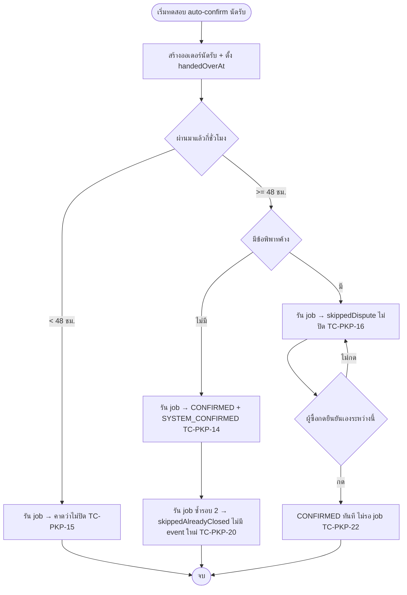
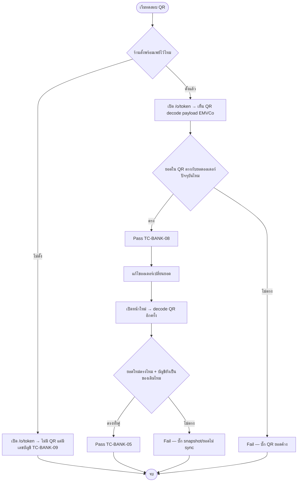

> **โมดูล:** M60-PickupBankTransfer
> **ประเภทเอกสาร:** Test Case
> **เวอร์ชัน:** 1.0
> **วันที่จัดทำ:** 2026-08-28
> **สถานะ:** Draft — 🛑 **เขียนก่อน implement (Doc-First, Hard Rule 11)** ยังไม่มีโค้ดให้ทดสอบจริง ยังไม่เคยรันสักเคส
> **เจ้าของเอกสาร:** QA (ดู [[Feature-Docs-Ownership]])

---

## 1. Overview

ชุดทดสอบนี้ครอบคลุมฟีเจอร์ **"นัดรับสินค้า และ การชำระเงินแบบโอน"** (feature 00060) — ส่วนขยายของ Simple OMS (`docs/SRS.md` FR-6) ที่เพิ่ม 3 กลุ่มความสามารถให้ร้าน `Shop.vertical = ONLINE_SALES`:

1. **นัดรับสินค้า (Pickup Fulfillment)** — `fulfillmentMode='PICKUP'`, ปุ่ม "มอบสินค้าแล้ว" (`handedOverAt`), ปิดงานอัตโนมัติหลัง grace period 48 ชม. พร้อม dispute-gate (mirror feature 00039)
2. **การยืนยันรับเงินโอน (Payment Confirmation)** — ปุ่ม "ได้รับเงินแล้ว" (`paymentConfirmedAt`/`paymentConfirmedByUserId`) ครอบ `TRANSFER|PROMPTPAY|CASH` (ไม่ครอบ `COD`), ป้ายสถานะการชำระเงิน 3 สถานะ
3. **บัญชีรับเงินของร้าน (Shop Bank Account)** — ตั้งค่า 1 ชุดต่อร้าน, snapshot ลงออเดอร์ตอนสร้าง, แสดงต่อ guest, QR พร้อมเพย์ฝังยอดเงิน (EMVCo)

ประเภทการทดสอบ: **functional + regression + integration + browser (E2E)**. เอกสารนี้เป็น **input ของรอบ implement** — ทุก TC ต้อง trace กลับ AC ใน [[BRD]] ได้

- **เอกสารต้นทาง:** [[BRD]] §2 (FR-PKP-01..05, FR-PAY-01..03, FR-BANK-01..05) ทุก scenario ใน §3 อ้างอิงกลับ AC เหล่านี้
- **ขอบเขตชุดทดสอบ (Scope):**
  - **In-scope:** ทุก AC ใน BRD §2, งานเดิมที่หนี้ถูกปลุกตาม BRD §7.3 (`deriveShippingStage`/`buildShippingStageSql`, `getShippingStageCounts`, `CustomerPanel.tsx`, `ShippingAddress.tsx`), เทส `[blocker]` ที่ต้องพิสูจน์ด้วย mutation, browser QA จุดที่ static ตรวจไม่ได้
  - **Out-of-scope:** ตรวจสลิปอัตโนมัติ/OCR, escrow, payment gateway, ระบบมัดจำ 00050 (`OrderPayment` — ต้องคง lock เดิม), ระบบปฏิทินนัดหมาย, หลายบัญชีต่อร้าน, การบล็อกอัตโนมัติจาก `ScamReportIdentifier` (Should เท่านั้น) — ทั้งหมดตาม PRD §5
- **สภาพแวดล้อม:** dev DB local (`.env.local` → Supabase local), subdomain จริง `http://deepth.local:4000` (buyer/guest) + `http://seller.deepth.local:4000` (ร้าน). **ห้ามรันกับ prod DB**

🛑 **สถานะเอกสาร ณ วันที่เขียน:** ฟีเจอร์ยังไม่ implement — SRS/SDS/API/DATABASE ของโมดูลนี้กำลังถูกเขียนขนานกัน (ดู CONTRACT ที่ล็อกแล้วใน §1.1). เอกสารนี้เขียนจาก PRD+BRD เท่านั้น **ยังไม่มีการรันเทสสักเคส** — ตาราง §5 ผลล่าสุด จึงว่างเปล่าโดยตั้งใจ

### 1.1 Contract ที่ล็อกแล้ว (อ้างอิงชื่อฟิลด์ตลอดเอกสารนี้)

ชื่อฟิลด์/ค่าคงที่ต่อไปนี้ถูกล็อกไว้แล้วสำหรับทุกสาย (SRS/SDS/API/DATABASE เขียนพร้อมกัน) — TestCase อ้างชื่อชุดนี้เท่านั้น ห้ามคิดชื่อใหม่:

- `Order.handedOverAt` · `Order.handedOverByUserId`
- `Order.paymentConfirmedAt` · `Order.paymentConfirmedByUserId`
- `Order.payoutSnapshot`
- `Shop.payoutBankCode` · `Shop.payoutAccountNo` · `Shop.payoutAccountName` · `Shop.payoutPromptPayId` · `Shop.payoutUpdatedAt`
- `OrderEvent.type` เพิ่ม 4 ค่า: `HANDED_OVER` · `HANDOVER_REVERTED` · `PAYMENT_CONFIRMED` · `PAYMENT_CONFIRM_REVERTED`
- auto-confirm อัตโนมัติใช้ event type เดิม `SYSTEM_CONFIRMED` + `meta.reason='AUTO_CONFIRM_PICKUP'` (แยกจาก `AUTO_CONFIRM_DELIVERED` ของ feature 00039)
- `fulfillmentMode='PICKUP'` (ค่าเดิม — ไม่สร้างค่าใหม่, D-3)
- Grace period = **48 ชั่วโมง** คงที่ (SSOT ต้องเป็นค่าคงที่ตัวเดียว เช่น `AUTO_CONFIRM_PICKUP_GRACE_MS` ใน `src/lib/order-stats.ts` — ชื่อจริงยืนยันกับ SDS ก่อนเขียนโค้ดเทส)
- ปุ่ม "ได้รับเงินแล้ว" ครอบ `paymentMethod ∈ {TRANSFER, PROMPTPAY, CASH}` **ไม่ครอบ `COD`** (COD ใช้ `codReceivedAt` เดิม)

---

## 2. Test Scenarios

> หมายเหตุการอ่าน: คอลัมน์ **ระดับ** = `unit` (ฟังก์ชันบริสุทธิ์ ไม่แตะ DB) / `integration` (service + DB จริงบน dev) / `browser` (Chrome DevTools MCP หรือ Playwright บน `*.deepth.local:4000`).
> ทุกเคสที่แตะ DB ต้องสร้างข้อมูลของตัวเองด้วย `id`/`token` ที่ generate ใหม่ (เช่น `test-00060-<uuid>`) แล้วลบเฉพาะแถวที่ตัวเองสร้างตอนจบ (Hard Rule 13 — **ห้าม** `deleteMany()` ไม่มี `where`, ห้าม `cleanDatabase()`)

### 2.1 กลุ่ม นัดรับสินค้า (FR-PKP-01..05)

#### TC-PKP-01: ร้าน `ONLINE_SALES` เห็นตัวเลือก "นัดรับ" ในฟอร์มสร้างออเดอร์

- **Linked to:** FR-PKP-01 (AC #1)
- **Precondition:** ร้านทดสอบ `Shop.vertical = ONLINE_SALES` มีอยู่แล้ว, ล็อกอิน seller แล้ว
- **Steps:**
  1. เปิด `/seller/orders/new` (หรือ path จริงตาม SDS)
  2. ดูส่วนเลือกวิธีส่งมอบ
- **Expected Result:** เห็นตัวเลือก "นัดรับ" คู่กับ "จัดส่ง" (ค่าเริ่มต้นเดิมยังเป็น "จัดส่ง")
- **ระดับ:** browser

#### TC-PKP-02: ร้าน `SERVICE_QUEUE`/`LODGING` ไม่เห็นตัวเลือก "นัดรับ"

- **Linked to:** FR-PKP-01 (AC #2)
- **Precondition:** ร้านทดสอบ 2 ร้าน — `vertical=SERVICE_QUEUE` และ `vertical=LODGING`
- **Steps:**
  1. เปิดฟอร์มสร้างออเดอร์ของร้าน `SERVICE_QUEUE`
  2. เปิดฟอร์มสร้างออเดอร์/ฟอร์มที่เทียบเท่าของร้าน `LODGING`
- **Expected Result:** ทั้งสองร้านไม่เห็นตัวเลือก "นัดรับ" เลย (มีระบบนัดคิวงาน/booking ของตัวเอง)
- **ระดับ:** browser + integration (ยิง API สร้างออเดอร์พร้อม `fulfillmentMode=PICKUP` ตรง ๆ กับร้านที่ไม่ใช่ `ONLINE_SALES` ต้องถูกปฏิเสธที่ server แม้ข้าม UI)

#### TC-PKP-03: เลือกนัดรับ → `fulfillmentMode='PICKUP'` override การคำนวณอัตโนมัติเดิม

- **Linked to:** FR-PKP-01 (AC #3) — ตรง Example ใน BRD §2.1
- **Precondition:** ร้าน `ONLINE_SALES` มีสินค้า `Product.fulfillmentMode=SHIPPED` (เช่น เคสมือถือ)
- **Steps:**
  1. สร้างออเดอร์เลือกสินค้าที่ปกติคำนวณเป็น `SHIPPED`
  2. เลือกวิธีส่งมอบ = "นัดรับ"
  3. บันทึกออเดอร์
- **Expected Result:** `Order.fulfillmentMode = 'PICKUP'` (ไม่ใช่ `SHIPPED`) แม้รายการสินค้าเป็นชนิดที่ปกติต้องส่ง
- **ระดับ:** integration

#### TC-PKP-04: เลือกนัดรับแล้ว ไม่บังคับที่อยู่จัดส่งไม่ว่า `salesChannel` ใด

- **Linked to:** FR-PKP-01 (AC #4), D-4 (นัดรับเป็นแกนอิสระจาก `salesChannel`)
- **Precondition:** ร้าน `ONLINE_SALES`
- **Steps:**
  1. สร้างออเดอร์ `salesChannel=FACEBOOK` เลือกนัดรับ โดย**ไม่กรอก**ที่อยู่จัดส่งเลย
  2. บันทึกออเดอร์
  3. ทำซ้ำกับ `salesChannel=STOREFRONT`
- **Expected Result:** บันทึกสำเร็จทั้งสองกรณี ไม่มี validation error เรื่องที่อยู่ — `orderNeedsShippingAddress()` ต้องคืน `false` เมื่อเลือกนัดรับไม่ว่า `salesChannel` เป็นอะไร
- **ระดับ:** unit (`shipping-address-status.ts`) + integration

#### TC-PKP-05: แก้วิธีส่งมอบเป็นนัดรับได้เฉพาะตอน `PENDING`

- **Linked to:** FR-PKP-01 (AC #5)
- **Precondition:** ออเดอร์ `status=SHIPPED` (จัดส่งปกติ) มีอยู่แล้ว
- **Steps:**
  1. เปิดหน้าแก้ไขออเดอร์ของออเดอร์ที่ `status=SHIPPED`
  2. พยายามเปลี่ยนวิธีส่งมอบเป็น "นัดรับ"
- **Expected Result:** ทำไม่ได้ — ฟอร์ม/ปุ่มแก้ไขวิธีส่งมอบไม่ปรากฏหรือถูกปฏิเสธที่ server (ตรงกับกฎแก้ไขออเดอร์อื่นทั้งหมด — เฉพาะ `PENDING`)
- **ระดับ:** browser + integration

#### TC-PKP-06: ออเดอร์นัดรับไม่มีปุ่ม "แจ้งเลขพัสดุ"/"คัดลอกที่อยู่จัดส่ง" ทุกสถานะ

- **Linked to:** FR-PKP-02 (AC #1)
- **Precondition:** ออเดอร์ `fulfillmentMode=PICKUP` ที่ `status=PENDING` และอีกใบที่ `status=CONFIRMED`
- **Steps:**
  1. เปิดหน้ารายละเอียดออเดอร์นัดรับที่ `PENDING`
  2. เปิดหน้ารายละเอียดออเดอร์นัดรับที่ `CONFIRMED`
- **Expected Result:** ทั้งสองหน้าไม่มีปุ่ม/เมนู: แจ้งเลขพัสดุ, แก้ไขเลขพัสดุ, คัดลอกเลขพัสดุ, คัดลอกที่อยู่จัดส่ง
- **ระดับ:** browser (visual) + unit (`order-action-set.ts` — เทสสแกน action set ที่คืนมาสำหรับ `PICKUP`)

#### TC-PKP-07: แผงลูกค้าในกล่องแชทไม่แสดงปุ่ม "สร้างพัสดุ" สำหรับออเดอร์นัดรับ

- **Linked to:** FR-PKP-02 (AC #2)
- **Precondition:** ออเดอร์นัดรับผูกกับเธรดแชทของร้าน
- **Steps:**
  1. เปิดกล่องแชทฝั่งร้าน เปิดเธรดที่ผูกกับออเดอร์นัดรับ
  2. ดูแผงลูกค้า (`CustomerPanel.tsx`)
- **Expected Result:** ไม่มีปุ่ม "สร้างพัสดุ" — **นี่คือเคสที่ BRD §7.3 เตือนไว้ว่า `CustomerPanel.tsx` เขียนเป็น deny-list `!== 'NO_SHIPPING'` ซึ่งจะโชว์ปุ่มผิดถ้าไม่แก้เป็น allow-list**
- **ระดับ:** browser + unit (สแกน component logic ว่าใช้ allow-list `fulfillmentMode === 'SHIPPED'` ไม่ใช่ deny-list)

#### TC-PKP-08: ออเดอร์นัดรับไม่ปรากฏในตัวนับ/ตัวกรอง "รอเลขพัสดุ"/"พัสดุมีปัญหา"

- **Linked to:** FR-PKP-02 (AC #3), BRD §7.3 (`deriveShippingStage`/`buildShippingStageSql`/`getShippingStageCounts`)
- **Precondition:** ร้านมีออเดอร์นัดรับ `PENDING` 1 ใบ + ออเดอร์จัดส่งปกติที่ยังไม่มีเลขพัสดุ 1 ใบ
- **Steps:**
  1. เปิด Command Center — ดูไทล์ "รอเลขพัสดุ"
  2. เปิด `/orders?stage=AWAITING_PARCEL`
- **Expected Result:** ทั้งไทล์และรายการกรองนับ/แสดงเฉพาะออเดอร์จัดส่งปกติ ไม่รวมออเดอร์นัดรับ
- **ระดับ:** unit (`order-stage.test.ts` เทียบ TS vs SQL) + integration + browser

#### TC-PKP-09: ออเดอร์นัดรับมีตัวกรอง/ป้ายสถานะของตัวเอง

- **Linked to:** FR-PKP-02 (AC #4)
- **Precondition:** ออเดอร์นัดรับ 3 ใบ — ยัง `PENDING` ไม่มี `handedOverAt`, `PENDING` มี `handedOverAt`, `CONFIRMED`
- **Steps:**
  1. เปิด `/orders` กรองด้วยป้ายนัดรับ (เช่น "รอนัดรับ" / "มอบของแล้ว รอยืนยัน" / "เสร็จสิ้น")
- **Expected Result:** ป้าย/ตัวกรองแยกออเดอร์ทั้ง 3 สถานะได้ถูกต้อง ไม่ปนกับสถานะพัสดุ
- **ระดับ:** browser + unit

#### TC-PKP-10: ร้านกด "มอบสินค้าแล้ว" — บันทึก `handedOverAt` โดยสถานะออเดอร์ไม่เปลี่ยน

- **Linked to:** FR-PKP-03 (AC #1, #2)
- **Precondition:** ออเดอร์นัดรับ `status=PENDING`, `handedOverAt=null`
- **Steps:**
  1. เปิดหน้าออเดอร์ กดปุ่ม "มอบสินค้าแล้ว"
- **Expected Result:** `Order.handedOverAt` ถูกตั้งเป็นเวลาปัจจุบัน, `handedOverByUserId` = ผู้กด, `OrderEvent` ใหม่ type `HANDED_OVER`, **`Order.status` ยังเป็น `PENDING`**
- **ระดับ:** integration

#### TC-PKP-11: กดปุ่ม "มอบสินค้าแล้ว" ซ้ำไม่ได้

- **Linked to:** FR-PKP-03 (AC #3)
- **Precondition:** ออเดอร์นัดรับที่ `handedOverAt` ถูกตั้งแล้ว
- **Steps:**
  1. เปิดหน้าออเดอร์เดิม — สังเกตปุ่ม
  2. ยิง API เดิมซ้ำตรง ๆ (ข้าม UI) เพื่อพิสูจน์ server-side guard
- **Expected Result:** UI แสดงข้อความสถานะ (รอครบกำหนด/รอผู้ซื้อยืนยัน) แทนปุ่ม; ยิง API ซ้ำต้องถูกปฏิเสธหรือ idempotent (ไม่สร้าง `OrderEvent HANDED_OVER` ซ้ำ ไม่เปลี่ยน `handedOverAt` เดิม)
- **ระดับ:** browser + integration

#### TC-PKP-12: ร้าน undo "มอบสินค้าแล้ว" ได้

- **Linked to:** FR-PKP-03 (AC #4)
- **Precondition:** ออเดอร์นัดรับที่ `handedOverAt` ถูกตั้ง, `status` ยัง `PENDING` (ยังไม่ปิด)
- **Steps:**
  1. กดปุ่ม undo/ยกเลิกการยืนยัน "มอบสินค้าแล้ว"
- **Expected Result:** `handedOverAt`/`handedOverByUserId` ถูกล้างกลับเป็น `null`, `OrderEvent` ใหม่ type `HANDOVER_REVERTED`, ปุ่ม "มอบสินค้าแล้ว" กลับมาให้กดใหม่ได้
- **ระดับ:** integration

#### TC-PKP-13: undo ไม่ได้ถ้าออเดอร์ปิดไปแล้ว

- **Linked to:** FR-PKP-03 (AC #4 — ข้อยกเว้น "ยกเว้นออเดอร์ปิดไปแล้ว")
- **Precondition:** ออเดอร์นัดรับที่ปิดเป็น `CONFIRMED` แล้ว (ไม่ว่าจาก auto-confirm หรือผู้ซื้อกดเอง)
- **Steps:**
  1. ยิง API undo "มอบสินค้าแล้ว" กับออเดอร์นี้
- **Expected Result:** ถูกปฏิเสธ (4xx) — `handedOverAt` ไม่ถูกล้าง, ไม่มี event ใหม่
- **ระดับ:** integration

#### TC-PKP-14: ปิดงานอัตโนมัติหลังครบ 48 ชม. ไม่มีข้อพิพาท

- **Linked to:** FR-PKP-04 (AC #1, #2)
- **Precondition:** ออเดอร์นัดรับ `handedOverAt = now - 49 ชั่วโมง`, `disputeOpenedAt=null`
- **Steps:**
  1. รัน job/service ปิดงานอัตโนมัติของนัดรับ (เทียบ `autoConfirmDelivered()` ของ 00039 — ชื่อฟังก์ชันจริงยืนยันกับ SDS)
- **Expected Result:** `Order.status = 'CONFIRMED'`, `OrderEvent` ใหม่ type `SYSTEM_CONFIRMED` + `meta.reason='AUTO_CONFIRM_PICKUP'`
- **ระดับ:** integration

#### TC-PKP-15: ยังไม่ครบ 48 ชม. → ไม่ปิด

- **Linked to:** FR-PKP-04 (AC #1 — ขอบล่าง)
- **Precondition:** ออเดอร์นัดรับ `handedOverAt = now - 47 ชั่วโมง 59 นาที`
- **Steps:**
  1. รัน job ปิดงานอัตโนมัติ
- **Expected Result:** ออเดอร์ยัง `PENDING` ไม่มี event ใหม่ — **นี่คือขอบเขต (boundary) ที่ต้องมี unit test แยกจาก "เกิน 48 ชม. พอดี"**
- **ระดับ:** integration + unit (คำนวณ cutoff)

#### TC-PKP-16: มีข้อพิพาทค้าง → ไม่ปิดอัตโนมัติไม่ว่าผ่านไปนานแค่ไหน (เคสขอบบังคับ)

- **Linked to:** FR-PKP-04 (AC #3), BR-PKP-03
- **Precondition:** ออเดอร์นัดรับ `handedOverAt = now - 30 วัน` (ผ่าน grace period มานานมาก), `disputeOpenedAt = now - 20 วัน`, `disputeResolvedAt = null`
- **Steps:**
  1. รัน job ปิดงานอัตโนมัติ
- **Expected Result:** ออเดอร์ยัง `PENDING` (หรือสถานะที่ dispute ค้างอยู่) — **ไม่ถูกปิดไม่ว่าเวลาผ่านไปนานแค่ไหน** — ผลลัพธ์ `skippedDispute` ต้องนับใบนี้ (mirror `AutoConfirmResult.skippedDispute` ของ 00039)
- **ระดับ:** integration (**เคสขอบที่บังคับต้องมี — ตาม requirement ข้อ 2 ของงาน**)

#### TC-PKP-17: เปิดข้อพิพาทหลังร้านกดมอบของแล้ว แต่ก่อนครบ grace period

- **Linked to:** FR-PKP-04 (AC #3), BRD Scenario 2
- **Precondition:** `handedOverAt = now - 10 ชั่วโมง`, `disputeOpenedAt=null`
- **Steps:**
  1. เปิดข้อพิพาท (`disputeOpenedAt` ถูกตั้ง)
  2. เดินเวลาไปจนครบ 48 ชั่วโมงนับจาก `handedOverAt`
  3. รัน job ปิดงานอัตโนมัติ
- **Expected Result:** **ไม่ปิด** แม้ผ่านไปครบ 48 ชม. แล้ว — ตรง BRD Scenario 2 เป๊ะ
- **ระดับ:** integration

#### TC-PKP-18: แก้ข้อพิพาทแล้ว นับ 48 ชม. ใหม่จากอะไร — **ช่องว่างของสเปกที่ต้องถามกลับ**

- **Linked to:** FR-PKP-04 (ไม่มี AC ที่ระบุตรง ๆ — PRD/BRD ไม่ได้เขียนพฤติกรรมนี้ไว้)
- **Precondition:** ออเดอร์นัดรับที่ `handedOverAt` ถูกตั้งแล้ว, มีข้อพิพาทเปิด-ปิดแล้ว (`disputeOpenedAt` ไม่ว่าง, `disputeResolvedAt` ถูกตั้งภายหลัง)
- **Steps:** (ยังทดสอบไม่ได้จนกว่าจะมีคำตอบ)
  1. แก้ไขข้อพิพาทให้เรียบร้อย (`disputeResolvedAt` ถูกตั้ง)
  2. ตรวจว่า cutoff ของ auto-confirm นับจากไหน
- **Expected Result:** 🛑 **ไม่มี — ต้องกลับไปถาม user/PO ก่อนเขียน SDS**: PRD §4.3 D-1 และ BRD §7.2 D-1 พูดถึงแค่ "มีข้อพิพาทค้าง → ห้ามปิด" แต่ไม่ได้ระบุว่าหลัง `disputeResolvedAt` ถูกตั้งแล้ว นาฬิกา 48 ชม. เดิม (`handedOverAt`) ยังนับต่อจากเดิม หรือต้องเริ่มนับใหม่จาก `disputeResolvedAt`. สองทางเลือกให้ผลต่างกันมาก (ตัวอย่าง: `handedOverAt` ผ่านมา 40 ชม. ก่อนเปิด dispute แล้ว dispute ใช้เวลาแก้ 5 วัน — ถ้านับจาก `handedOverAt` เดิม ออเดอร์จะปิดทันทีที่ dispute ถูก resolve เพราะเลย 48 ชม. ไปนานแล้ว ซึ่งอาจเร็วเกินไปสำหรับเคสที่เพิ่งแก้ปัญหาเสร็จ) — **ต้องได้คำตอบก่อน implement TC นี้จริง**
- **ระดับ:** integration (blocked — pending decision)

#### TC-PKP-19: undo แล้วกด "มอบสินค้าแล้ว" ใหม่ → นับ grace period ใหม่จากครั้งหลัง

- **Linked to:** FR-PKP-03 (AC #4) + FR-PKP-04 (AC #1) รวมกัน
- **Precondition:** ออเดอร์นัดรับที่กด "มอบสินค้าแล้ว" ครั้งแรกเมื่อ `now - 50 ชั่วโมง` แล้ว undo เมื่อ `now - 49 ชั่วโมง` แล้วกดใหม่เมื่อ `now - 1 ชั่วโมง`
- **Steps:**
  1. รัน job ปิดงานอัตโนมัติทันทีหลังกดใหม่ (เวลาผ่านไปแค่ 1 ชม. จากครั้งหลัง)
- **Expected Result:** **ไม่ปิด** เพราะยังไม่ครบ 48 ชม. นับจาก `handedOverAt` ปัจจุบัน (ครั้งหลัง) — ไม่ใช่นับจากครั้งแรกที่ถูก undo ไปแล้ว (ถ้านับจากครั้งแรกจะปิดผิดเวลา เพราะ 50 ชม. เกิน 48 ชม. ไปแล้ว)
- **ระดับ:** integration (**เคสขอบที่บังคับต้องมี**)

#### TC-PKP-20: Job ปิดงานอัตโนมัติ idempotent — รันซ้ำไม่สร้าง event ซ้ำ

- **Linked to:** FR-PKP-04 (AC #4)
- **Precondition:** ออเดอร์นัดรับ `handedOverAt = now - 49 ชั่วโมง` ยังไม่ปิด
- **Steps:**
  1. รัน job ครั้งที่ 1 — บันทึกจำนวน `OrderEvent` ของออเดอร์นี้ + `status`
  2. รัน job ครั้งที่ 2 ทันที (ก่อนมีอะไรเปลี่ยนแปลง)
  3. รัน job ครั้งที่ 3 (จำลอง cron วันถัดไปที่ยังสแกนใบนี้เพราะเงื่อนไข "ค้างเกิน" ไม่ใช่ "ครบพอดี")
- **Expected Result:** หลังรอบ 1: `status=CONFIRMED` + event `SYSTEM_CONFIRMED` 1 รายการ. หลังรอบ 2 และ 3: **ไม่มี event ใหม่**, `status` ไม่เปลี่ยน, ผลลัพธ์ของ job นับใบนี้เป็น `skippedAlreadyClosed` (mirror `AutoConfirmResult.skippedAlreadyClosed`)
- **ระดับ:** integration (**เคสขอบที่บังคับต้องมี — job รันซ้ำ**)

#### TC-PKP-21: ผู้ซื้อกดยืนยันเองก่อนร้านกด "มอบสินค้าแล้ว"

- **Linked to:** FR-PKP-05 (AC #1, #2)
- **Precondition:** ออเดอร์นัดรับ `status=PENDING`, `handedOverAt=null`
- **Steps:**
  1. ผู้ซื้อ (ผ่านด่าน ownership เดิม) เปิด `/o/{token}` กดยืนยันรับของ
- **Expected Result:** `status=CONFIRMED` ทันที, event ระบุว่าผู้ซื้อเป็นคนกด (`BUYER_CONFIRMED` หรือเทียบเท่า) — ไม่ต้องรอ `handedOverAt`/grace period เลย
- **ระดับ:** browser + integration

#### TC-PKP-22: ผู้ซื้อกดยืนยันเองหลังร้านกด "มอบสินค้าแล้ว" แต่ก่อนครบ 48 ชม. → ปิดทันที ไม่รอ job

- **Linked to:** FR-PKP-04 (AC #1) + FR-PKP-05 (AC #2) — **เคสขอบที่ต้องมีแน่ ๆ ตามที่ Controller ระบุ**
- **Precondition:** ออเดอร์นัดรับ `handedOverAt = now - 5 ชั่วโมง` (ยังไม่ครบ 48 ชม.), `status=PENDING`
- **Steps:**
  1. ผู้ซื้อเปิด `/o/{token}` กดยืนยันรับของด้วยตัวเอง
  2. ตรวจสถานะออเดอร์**ทันทีหลังกด** (ไม่รอ cron/job รอบถัดไป)
- **Expected Result:** `Order.status = 'CONFIRMED'` **ทันที** ในทรานแซกชันเดียวกับการกด — ไม่ต้องรอ job ปิดงานอัตโนมัติมาประมวลผลซ้ำ (job ที่รันภายหลังต้องเห็นใบนี้เป็น `skippedAlreadyClosed` ไม่ใช่ error)
- **ระดับ:** integration (**เคสขอบที่บังคับต้องมี — ปิดทันทีไม่รอ job**)

### 2.2 กลุ่ม การยืนยันรับเงินโอน (FR-PAY-01..03)

#### TC-PAY-01: ปุ่ม "ได้รับเงินแล้ว" ปรากฏสำหรับ `TRANSFER`/`PROMPTPAY`/`CASH`

- **Linked to:** FR-PAY-01 (AC #1)
- **Precondition:** ออเดอร์ 3 ใบ — `paymentMethod=TRANSFER`, `PROMPTPAY`, `CASH` ตามลำดับ
- **Steps:**
  1. เปิดหน้ารายละเอียดออเดอร์ทั้ง 3 ใบ
- **Expected Result:** ทั้ง 3 ใบมีปุ่ม "ได้รับเงินแล้ว" (mirror ตำแหน่งปุ่ม "ได้รับเงินปลายทางแล้ว" ของ COD)
- **ระดับ:** browser

#### TC-PAY-02: ออเดอร์ COD **ไม่มี** ปุ่ม "ได้รับเงินแล้ว" ตัวใหม่ — เคสขอบบังคับ

- **Linked to:** FR-PAY-01 (AC #4) — **เคสขอบที่ต้องมีแน่ ๆ ตามที่ Controller ระบุ**
- **Precondition:** ออเดอร์ `paymentMethod=COD`
- **Steps:**
  1. เปิดหน้ารายละเอียดออเดอร์
  2. ตรวจว่ามีปุ่มกี่ตัวที่เกี่ยวกับการยืนยันรับเงิน
- **Expected Result:** มีเฉพาะปุ่ม **"ได้รับเงินปลายทางแล้ว"** เดิม (`codReceivedAt`) เท่านั้น — **ไม่มี** ปุ่ม "ได้รับเงินแล้ว" ตัวใหม่ปรากฏซ้อนหรือแทนที่ และกดปุ่มเดิมแล้ว `paymentConfirmedAt` ต้อง**ไม่ถูกเขียน** (สองฟิลด์ไม่ปนกัน)
- **ระดับ:** browser + integration (ยิง `POST /api/orders/[token]/cod-received` กับออเดอร์ COD แล้วตรวจว่า `paymentConfirmedAt` ยัง `null`)

#### TC-PAY-03: กด "ได้รับเงินแล้ว" — บันทึกฟิลด์ใหม่ ไม่เปลี่ยนสถานะออเดอร์

- **Linked to:** FR-PAY-01 (AC #2)
- **Precondition:** ออเดอร์ `paymentMethod=TRANSFER`, `status=PENDING`, `paymentConfirmedAt=null`
- **Steps:**
  1. กดปุ่ม "ได้รับเงินแล้ว"
- **Expected Result:** `paymentConfirmedAt` ถูกตั้ง, `paymentConfirmedByUserId` = ผู้กด, `OrderEvent` ใหม่ type `PAYMENT_CONFIRMED`, **`Order.status` ยังเป็น `PENDING`** (ไม่ขยับ)
- **ระดับ:** integration

#### TC-PAY-04: ร้าน undo การยืนยันรับเงิน (Scenario 3 ของ BRD)

- **Linked to:** FR-PAY-01 (AC #3), BRD Scenario 3
- **Precondition:** ออเดอร์ที่ `paymentConfirmedAt` ถูกตั้งแล้ว (กดผิดใบ)
- **Steps:**
  1. กดปุ่มย้อนกลับ (undo)
- **Expected Result:** `paymentConfirmedAt`/`paymentConfirmedByUserId` ถูกล้างกลับเป็น `null`, `OrderEvent` ใหม่ type `PAYMENT_CONFIRM_REVERTED`, ป้ายสถานะกลับไปเป็น "รอชำระ"/"รอตรวจสอบสลิป" ตามเดิม
- **ระดับ:** integration

#### TC-PAY-05: ป้ายสถานะ "รอชำระ" — ไม่มีการยืนยัน ไม่มีสลิป

- **Linked to:** FR-PAY-02 (AC #1)
- **Precondition:** ออเดอร์ `paymentMethod=TRANSFER`, ไม่มีสลิปแนบ, `paymentConfirmedAt=null`
- **Steps:**
  1. เปิดหน้าออเดอร์ฝั่งร้าน และหน้า `/o/{token}` ฝั่งผู้ซื้อ
- **Expected Result:** ทั้งสองจอแสดงป้าย "รอชำระ" (คงเดิม)
- **ระดับ:** browser + unit (ฟังก์ชัน SSOT ป้ายสถานะ)

#### TC-PAY-06: ป้ายสถานะ "รอตรวจสอบสลิป" — ผู้ซื้อแนบสลิปแล้ว ร้านยังไม่กด

- **Linked to:** FR-PAY-02 (AC #2)
- **Precondition:** ออเดอร์ `paymentMethod=TRANSFER`, ผู้ซื้อแนบสลิปแล้ว, `paymentConfirmedAt=null`
- **Steps:**
  1. เปิดหน้าออเดอร์ฝั่งร้าน และหน้า `/o/{token}`
- **Expected Result:** ป้าย "รอตรวจสอบสลิป" (คงเดิม)
- **ระดับ:** browser + unit

#### TC-PAY-07: ป้ายสถานะใหม่ — ร้านยืนยันแล้วแต่ออเดอร์ยังไม่ `CONFIRMED` (ห้ามใช้สีเขียว)

- **Linked to:** FR-PAY-02 (AC #3) — 🛑 Verified-Means-Green
- **Precondition:** ออเดอร์ `paymentMethod=TRANSFER`, `paymentConfirmedAt` ถูกตั้ง, `status=PENDING`
- **Steps:**
  1. เปิดหน้าออเดอร์ฝั่งร้าน และหน้า `/o/{token}`
  2. ตรวจสีของป้าย (ผ่าน computed style ไม่ใช่ดูด้วยตาอย่างเดียว)
- **Expected Result:** ป้ายใหม่ (เช่น "ชำระแล้ว รอส่งมอบ/รอนัดรับ") **ไม่ใช้สีเขียวของ "ชำระแล้ว" เดิม** ซึ่งสงวนไว้เฉพาะ `status=CONFIRMED` — ต้องเป็นสีอื่น (เช่น info/warning ตาม design token)
- **ระดับ:** browser (**จุดที่ static ตรวจไม่ได้ — ต้องเปิดจริงแล้วอ่านสี**)

#### TC-PAY-08: ทุกจอแสดงป้ายชุดเดียวกันจากฟังก์ชันเดียวกัน (Hard Rule 16 — SSOT)

- **Linked to:** FR-PAY-02 (AC #4)
- **Precondition:** ออเดอร์ 3 สถานะการชำระ (รอชำระ/รอตรวจสอบสลิป/ยืนยันแล้ว) × ทั้งฝั่งร้าน + `/o/{token}` (guest และล็อกอินแล้ว)
- **Steps:**
  1. grep ซอร์สหาว่าทั้ง 3 จอ (`OrderSummary.tsx`/`BillingDetails.tsx` ฝั่งร้าน, guest view, buyer view) เรียกฟังก์ชันคำนวณป้ายตัวเดียวกัน (ขยาย `getPaymentBadge()` — ไม่สร้างฟังก์ชันใหม่คู่ขนาน)
  2. เปิดทั้ง 3 จอจริงเทียบป้าย/สีที่ได้
- **Expected Result:** ป้ายและสีตรงกันทุกจอ ไม่มีจอไหนคำนวณเองแยกต่างหาก
- **ระดับ:** unit (grep import) + browser

#### TC-PAY-09: แนบสลิปไม่ทำให้ `paymentConfirmedAt` ถูกตั้งอัตโนมัติ

- **Linked to:** FR-PAY-03 (AC #2)
- **Precondition:** ออเดอร์ `paymentMethod=TRANSFER`, `paymentConfirmedAt=null`
- **Steps:**
  1. ผู้ซื้อ (ล็อกอินแล้ว) แนบสลิปที่ `/o/{token}`
- **Expected Result:** สลิปถูกบันทึก (ทางเดิมทำงานปกติ) แต่ `paymentConfirmedAt` ยัง `null` — ต้องรอร้านกดยืนยันเอง
- **ระดับ:** integration

#### TC-PAY-10: ทางแนบสลิปเดิมยังทำงานเหมือนเดิมทุกประการ (regression)

- **Linked to:** FR-PAY-03 (AC #1)
- **Precondition:** ออเดอร์ `paymentMethod=TRANSFER`
- **Steps:**
  1. ผู้ซื้อแนบสลิปที่ `/o/{token}` (ทางเดิมก่อนฟีเจอร์นี้)
- **Expected Result:** พฤติกรรม/UI เดิมทั้งหมดไม่เปลี่ยน (regression check — ฟีเจอร์นี้ **ไม่ถอด** อะไรออกจากทางนี้)
- **ระดับ:** browser (regression)

### 2.3 กลุ่ม บัญชีรับเงินของร้าน (FR-BANK-01..05)

#### TC-BANK-01: ร้านตั้งค่าบัญชีรับเงินครั้งแรก

- **Linked to:** FR-BANK-01 (AC #1, #2)
- **Precondition:** ร้าน `ONLINE_SALES` ที่ยังไม่เคยตั้งบัญชี (`payoutBankCode=null` ฯลฯ)
- **Steps:**
  1. เปิดหน้าตั้งค่าร้าน ส่วน "บัญชีรับเงิน"
  2. กรอกธนาคาร, เลขบัญชี, ชื่อบัญชี, พร้อมเพย์
  3. บันทึก
- **Expected Result:** `Shop.payoutBankCode/payoutAccountNo/payoutAccountName/payoutPromptPayId/payoutUpdatedAt` ถูกบันทึก — 1 ชุดต่อร้าน (บันทึกซ้ำ = อัปเดตชุดเดิม ไม่ใช่เพิ่มแถวใหม่)
- **ระดับ:** browser + integration

#### TC-BANK-02: เปลี่ยนบัญชีที่ตั้งไว้แล้วต้องยืนยันตัวตนซ้ำ

- **Linked to:** FR-BANK-01 (AC #3), BR-BANK-02
- **Precondition:** ร้านมีบัญชีรับเงินตั้งไว้แล้ว
- **Steps:**
  1. เปิดหน้าตั้งค่าร้าน แก้เลขบัญชี
  2. บันทึกโดย**ไม่ผ่าน**ขั้นยืนยันตัวตนซ้ำ (จำลองข้าม UI ยิง API ตรง)
- **Expected Result:** ถูกปฏิเสธ (401/403) จนกว่าจะยืนยันตัวตนซ้ำสำเร็จ (รหัสผ่าน/OTP) — บัญชีเดิมยังไม่ถูกเปลี่ยน
- **ระดับ:** integration (**เคสความปลอดภัยสำคัญ**)

#### TC-BANK-03: Snapshot บัญชีลงออเดอร์ตอนสร้าง

- **Linked to:** FR-BANK-02 (AC #1)
- **Precondition:** ร้านตั้งบัญชี A ไว้ (`payoutAccountNo='1112223334'`)
- **Steps:**
  1. สร้างออเดอร์ `paymentMethod=TRANSFER`
  2. ตรวจ `Order.payoutSnapshot`
- **Expected Result:** `payoutSnapshot` มีสำเนาบัญชี A ครบ (ธนาคาร/เลขบัญชี/ชื่อบัญชี/พร้อมเพย์ ณ ขณะนั้น) — ไม่ใช่แค่ reference/FK ไปที่ `Shop`
- **ระดับ:** integration

#### TC-BANK-04: ร้านเปลี่ยนบัญชี → ออเดอร์เก่ายังโชว์บัญชีเดิม — เคสขอบบังคับ

- **Linked to:** FR-BANK-02 (AC #2), BR-BANK-01 — **เคสขอบที่ต้องมีแน่ ๆ ตามที่ Controller ระบุ**
- **Precondition:** ร้านตั้งบัญชี A แล้วสร้างออเดอร์ O1 (`payoutSnapshot`=บัญชี A)
- **Steps:**
  1. ร้านเปลี่ยนเป็นบัญชี B (ผ่านขั้นยืนยันตัวตนซ้ำ)
  2. เปิดหน้าออเดอร์ O1 อีกครั้ง (ทั้งฝั่งร้านและ `/o/{token}`)
  3. สร้างออเดอร์ใหม่ O2
- **Expected Result:** O1 ยังแสดงบัญชี A (ค่าเดิมที่ snapshot ไว้) ไม่เปลี่ยนตาม; O2 แสดงบัญชี B (ปัจจุบัน)
- **ระดับ:** integration (**เคสขอบที่บังคับต้องมี**)

#### TC-BANK-05: ยอดออเดอร์ถูกแก้หลังสร้าง → QR เปลี่ยนตามยอดใหม่ แต่บัญชียังเดิม — เคสขอบบังคับ

- **Linked to:** FR-BANK-05 (AC #3) — **เคสขอบที่ต้องมีแน่ ๆ ตามที่ Controller ระบุ**
- **Precondition:** ออเดอร์ `paymentMethod=PROMPTPAY`, `payoutSnapshot` มีพร้อมเพย์, ยอดตั้งต้น ฿500
- **Steps:**
  1. เปิดหน้าออเดอร์ อ่านค่ายอดเงินที่ฝังใน QR (decode payload EMVCo tag ยอดเงิน)
  2. แก้ไขออเดอร์เพิ่มสินค้า ยอดใหม่เป็น ฿750
  3. เปิดหน้าออเดอร์อีกครั้ง อ่านค่ายอดเงินใน QR ใหม่
- **Expected Result:** QR รอบแรกฝังยอด 500.00, QR รอบสองฝังยอด 750.00 (คำนวณจากยอดปัจจุบันของออเดอร์สด ไม่ใช่ค่าที่ generate ครั้งเดียวแล้วเก็บค้าง) — **หมายเลขพร้อมเพย์ที่ใช้ยังเป็นของ `payoutSnapshot` เดิม ไม่เปลี่ยนตามบัญชีปัจจุบันของร้าน**
- **ระดับ:** integration + unit (ฟังก์ชัน generate EMVCo payload — ทดสอบว่า tag ยอดเงินตรงกับ input)

#### TC-BANK-06: ผู้ซื้อเห็นบัญชีก่อนล็อกอิน (guest view)

- **Linked to:** FR-BANK-03 (AC #1, #2)
- **Precondition:** ออเดอร์ `paymentMethod=TRANSFER` มี `payoutSnapshot`
- **Steps:**
  1. เปิด `/o/{token}` ในเบราว์เซอร์ที่ **ไม่มี session ล็อกอินเลย** (incognito / เคลียร์คุกกี้)
- **Expected Result:** เห็นธนาคาร/เลขบัญชี/ชื่อบัญชีทันที — ไม่มีด่าน login ขวาง; ตรวจว่าฟิลด์บัญชีอยู่ใน allow-list ของ `guest-order-data.ts` อย่างชัดเจน (ไม่ไหลตามฟิลด์อื่นโดยไม่ตั้งใจ)
- **ระดับ:** browser (**จุดสำคัญที่สุดของฟีเจอร์นี้ตาม PRD — ต้องพิสูจน์ด้วยเซสชันที่ไม่ล็อกอินจริง ไม่ใช่แค่เดาจาก allow-list**)

#### TC-BANK-07: ออเดอร์ COD ไม่แสดงส่วนบัญชีรับเงินเลย

- **Linked to:** FR-BANK-03 (AC #3)
- **Precondition:** ออเดอร์ `paymentMethod=COD`
- **Steps:**
  1. เปิด `/o/{token}`
- **Expected Result:** ไม่มีส่วนแสดงบัญชีรับเงิน/QR เลย
- **ระดับ:** browser

#### TC-BANK-08: ร้านตั้งพร้อมเพย์ → QR แสดงและสแกนได้จริง (EMVCo)

- **Linked to:** FR-BANK-05 (AC #1, #2)
- **Precondition:** ร้านตั้ง `payoutPromptPayId` ไว้, ออเดอร์ `paymentMethod=PROMPTPAY` ยอด ฿123.45
- **Steps:**
  1. เปิด `/o/{token}` ดู QR
  2. สแกนด้วยแอปธนาคารจริง (หรือ decode ด้วยไลบรารี EMVCo แล้วตรวจ tag)
- **Expected Result:** payload เป็นมาตรฐาน EMVCo ของพร้อมเพย์ที่ถูกต้อง (Merchant Account Info tag ถูกต้อง, Transaction Amount tag = 123.45, CRC ถูกต้อง) — แอปธนาคารเปิดหน้าจ่ายเงินพร้อมยอด 123.45 โดยไม่ต้องพิมพ์เอง
- **ระดับ:** browser (**ต้องสแกนจริงด้วยแอปธนาคาร หรืออย่างน้อย decode ด้วยไลบรารีมาตรฐานยืนยัน CRC — static/unit ตรวจ format ผิดพลาดได้ไม่ครบ**) + unit (ฟังก์ชัน generate payload, ตรวจ CRC16 algorithm)

#### TC-BANK-09: ร้านไม่ได้ตั้งพร้อมเพย์ → ไม่แสดง QR เลย (ไม่โชว์ QR ว่าง) — เคสขอบบังคับ

- **Linked to:** FR-BANK-05 (AC #4) — **เคสขอบที่ต้องมีแน่ ๆ ตามที่ Controller ระบุ**
- **Precondition:** ร้านตั้งเฉพาะธนาคาร+เลขบัญชี (`payoutPromptPayId=null`), ออเดอร์ `paymentMethod=TRANSFER`
- **Steps:**
  1. เปิด `/o/{token}`
- **Expected Result:** **ไม่มี QR ปรากฏเลย** (ไม่ใช่ QR เปล่า/QR ที่สแกนไม่ออก/placeholder) แต่ยังเห็นเลขบัญชีธนาคารตามปกติ
- **ระดับ:** browser (**เคสขอบที่บังคับต้องมี**)

#### TC-BANK-10: QR แสดงต่อ guest ได้เช่นเดียวกับเลขบัญชี

- **Linked to:** FR-BANK-05 (AC #5)
- **Precondition:** ร้านตั้งพร้อมเพย์ไว้, ออเดอร์ `paymentMethod=PROMPTPAY`
- **Steps:**
  1. เปิด `/o/{token}` แบบไม่ล็อกอิน
- **Expected Result:** เห็น QR ทันที เหมือนเลขบัญชี — ไม่มีด่าน login
- **ระดับ:** browser

#### TC-BANK-11: ตรวจเลขบัญชีใหม่กับ `ScamReportIdentifier` (Should)

- **Linked to:** FR-BANK-04 (AC #1, #2)
- **Precondition:** มีแถว `ScamReportIdentifier(type='BANK_ACCOUNT', hash=HMAC('9999999999'))` อยู่แล้วในฐานทดสอบ
- **Steps:**
  1. ร้านตั้งบัญชีเลข `9999999999`
- **Expected Result:** บันทึกสำเร็จ (**ไม่บล็อก**) แต่มีการแจ้งเตือนทีมงานผ่านช่องทางที่กำหนด (ตรวจจาก log/DB flag ตาม SDS — ไม่ใช่ error กลับไปหาร้าน)
- **ระดับ:** integration

#### TC-BANK-12: ไม่มี false positive จาก format เลขบัญชีต่างกัน

- **Linked to:** FR-BANK-04 (AC #3)
- **Precondition:** แถว `ScamReportIdentifier` เก็บ hash ของเลข `999-999-9999` (มีขีด, normalize แล้ว)
- **Steps:**
  1. ร้านตั้งบัญชีเป็น `9999999999` (ไม่มีขีด/ช่องว่าง)
- **Expected Result:** ต้อง normalize ก่อน hash แล้วจับคู่ได้ถูกต้อง (ตรงกัน = แจ้งเตือน) — ทดสอบสลับกันด้วยว่าเลขบัญชี**ที่ต่างกันจริง**หลัง normalize ต้อง**ไม่**ถูกจับคู่ผิด (เช่น `12345678` ไม่ตรงกับ `1234567890`)
- **ระดับ:** unit (ฟังก์ชัน normalize + hash)

### 2.4 กลุ่ม cross-cutting / regression ที่ BRD §7.3 เตือนไว้

#### TC-CC-01: `getShippingStageCounts()` ไม่นับออเดอร์นัดรับปนกับพัสดุ

- **Linked to:** BRD §7.3 (`getShippingStageCounts()`) — งานเดิมที่ฟีเจอร์นี้ปลุกขึ้นมา
- **Precondition:** ร้านมีออเดอร์นัดรับ 5 ใบ (ไม่ `CANCELLED`) + ออเดอร์จัดส่งจริงที่ค้าง 3 ใบ
- **Steps:**
  1. เรียก `getShippingStageCounts()` เทียบก่อน/หลังมีออเดอร์นัดรับ
- **Expected Result:** ตัวเลขไทล์ไม่โป่งขึ้นจาก 5 ใบนัดรับที่ไม่มีพัสดุจริง
- **ระดับ:** unit + integration

#### TC-CC-02: `ShippingAddress.tsx` มีการ์ดใหม่แทนที่ `return null` สำหรับนัดรับ

- **Linked to:** BRD §7.3 (`ShippingAddress.tsx`)
- **Precondition:** ออเดอร์นัดรับ
- **Steps:**
  1. เปิดหน้ารายละเอียดออเดอร์
- **Expected Result:** มีการ์ดที่บอกเรื่องการนัดรับ (เช่น ที่อยู่ร้าน/สถานะ handedOver) แทนที่จะไม่มีการ์ดใดเลยเกี่ยวกับการส่งมอบ
- **ระดับ:** browser

#### TC-CC-03: `dashboard.service.ts::getProvinceSales` ไม่นับออเดอร์นัดรับปนในถัง "ไม่ระบุจังหวัด" แบบให้เข้าใจผิด

- **Linked to:** BRD §7.3 (`getProvinceSales`), D-4
- **Precondition:** ออเดอร์นัดรับ + ออเดอร์ STOREFRONT (ทั้งคู่ไม่มีที่อยู่)
- **Steps:**
  1. เปิดหน้า dashboard แผนที่ยอดขายรายจังหวัด
- **Expected Result:** ยอดรวมทั้งระบบยังถูกต้อง (ไม่หายไปจากยอดรวม) — พฤติกรรมการจัดกลุ่มออเดอร์ไม่มีที่อยู่ตรงกับที่ STOREFRONT เคยเป็น (ไม่ใช่ AC บังคับของฟีเจอร์นี้โดยตรง แต่เป็น regression check ตามที่ BRD เตือน)
- **ระดับ:** integration

#### TC-CC-04: คอมเมนต์ที่อ้างว่า "PICKUP มาจาก booking เท่านั้น" ถูกอัปเดตแล้วทุกจุด

- **Linked to:** D-3, `docs/conventions/value-fate-decided-at-write-site.md`
- **Precondition:** โค้ดหลัง implement
- **Steps:**
  1. `grep -rn "PICKUP" src/ --include="*.ts*"` แล้วอ่านทุกจุดที่มีคอมเมนต์อ้างที่มาของค่านี้
- **Expected Result:** ไม่มีคอมเมนต์ใดเหลือข้อความที่บอกว่า "PICKUP มาจาก booking เท่านั้น" ทั้งที่ `order.service.ts`/`createOrder`/`updateOrder` เขียนค่านี้ได้แล้วเช่นกัน
- **ระดับ:** unit (grep-based source scan)

#### TC-CC-05: `booking.service.ts` (feature 00017, LODGING) ไม่ได้รับผลกระทบจากการ reuse ค่า `PICKUP`

- **Linked to:** D-3 (ความเสี่ยงทางเทคนิคที่ PRD §6.2 เตือนไว้)
- **Precondition:** ร้าน `LODGING` ที่ยังมี booking flow เดิม
- **Steps:**
  1. สร้าง booking ผ่าน flow เดิมของ `LODGING`
- **Expected Result:** พฤติกรรมเดิมไม่เปลี่ยน แม้ตอนนี้ `ONLINE_SALES` ก็เขียนค่า `PICKUP` ได้เหมือนกัน (ต้องแยกกันด้วย `Shop.vertical` ไม่ใช่แยกกันด้วยค่า `fulfillmentMode`)
- **ระดับ:** integration (regression)

#### TC-CC-06: `OrderPayment`/feature 00050 lock เดิมไม่ถูกแตะ (D-2)

- **Linked to:** D-2, เทส `[blocker]` เดิม `service-queue-vertical-gate.test.ts`
- **Precondition:** โค้ดหลัง implement
- **Steps:**
  1. รัน `src/lib/__tests__/service-queue-vertical-gate.test.ts` เดิมที่มีอยู่ก่อนฟีเจอร์นี้
  2. grep ยืนยันว่าเงื่อนไข `vertical === 'SERVICE_QUEUE'` ทั้ง 4 จุดยังอยู่ครบ ไม่มีการเพิ่ม `'ONLINE_SALES'` เข้าไปในเงื่อนไขเหล่านั้น
- **Expected Result:** เทสเดิมยังเขียว ไม่มีจุดใดถูกแก้ให้ `ONLINE_SALES` เข้าถึง `OrderPayment` ได้
- **ระดับ:** unit (regression — บังคับตาม CONTRACT ที่ล็อกแล้ว)

#### TC-CC-07: `buyer-reputation.ts` / `/customers` ไม่ค้างคำสัญญาที่เป็นไปไม่ได้สำหรับร้านที่ขายนัดรับล้วน

- **Linked to:** BRD §7.3 (`buyer-reputation.ts`)
- **Precondition:** ร้านที่มีแต่ออเดอร์นัดรับ (ไม่มี `hasShipment` เลย)
- **Steps:**
  1. เปิด `/customers` ของร้านนี้
- **Expected Result:** 🛑 **ต้องยืนยันกับ SDS ว่าจะแก้ข้อความหรือขยายสัญญาณ** — ถ้ายังไม่แก้ในรอบนี้ (PRD ระบุว่า "ต้องตัดสินใจ" ไม่ใช่ acceptance criteria ที่บังคับ) ให้บันทึกเป็น known-gap ไม่ใช่ปล่อยให้ QA ตัดสินเอง ว่าเป็น pass/fail
- **ระดับ:** browser (เงื่อนไข pass ขึ้นกับคำตอบจาก SDS — ระบุไว้ใน §6 Open Questions)

---

## 3. Traceability Matrix

| AC / FR ใน [[BRD]] | Test Case | ครอบคลุมหรือไม่ |
|---------------------|-----------|------------------|
| FR-PKP-01 (AC #1 เห็นตัวเลือกนัดรับ) | TC-PKP-01 | Yes |
| FR-PKP-01 (AC #2 SERVICE_QUEUE/LODGING ไม่เห็น) | TC-PKP-02 | Yes |
| FR-PKP-01 (AC #3 override fulfillmentMode) | TC-PKP-03 | Yes |
| FR-PKP-01 (AC #4 ไม่บังคับที่อยู่) | TC-PKP-04 | Yes |
| FR-PKP-01 (AC #5 แก้ได้เฉพาะ PENDING) | TC-PKP-05 | Yes |
| FR-PKP-02 (AC #1 ไม่มีปุ่มพัสดุ) | TC-PKP-06 | Yes |
| FR-PKP-02 (AC #2 แผงลูกค้าแชท) | TC-PKP-07 | Yes |
| FR-PKP-02 (AC #3 ไม่ปนตัวนับพัสดุ) | TC-PKP-08, TC-CC-01 | Yes |
| FR-PKP-02 (AC #4 ตัวกรอง/ป้ายของตัวเอง) | TC-PKP-09 | Yes |
| FR-PKP-03 (AC #1 ปุ่มมอบสินค้าแล้ว) | TC-PKP-10 | Yes |
| FR-PKP-03 (AC #2 บันทึก handedOverAt ไม่เปลี่ยนสถานะ) | TC-PKP-10 | Yes |
| FR-PKP-03 (AC #3 กดซ้ำไม่ได้) | TC-PKP-11 | Yes |
| FR-PKP-03 (AC #4 undo ได้ / ยกเว้นปิดแล้ว) | TC-PKP-12, TC-PKP-13 | Yes |
| FR-PKP-04 (AC #1 ปิดอัตโนมัติหลัง 48 ชม.) | TC-PKP-14, TC-PKP-15 | Yes |
| FR-PKP-04 (AC #2 event ระบุระบบปิด) | TC-PKP-14 | Yes |
| FR-PKP-04 (AC #3 dispute ค้าง ห้ามปิด) | TC-PKP-16, TC-PKP-17 | Yes |
| FR-PKP-04 (AC #4 idempotent) | TC-PKP-20 | Yes |
| FR-PKP-05 (AC #1, #2 ผู้ซื้อยืนยันเองได้ตลอด) | TC-PKP-21, TC-PKP-22 | Yes |
| FR-PAY-01 (AC #1 ปุ่มปรากฏ) | TC-PAY-01 | Yes |
| FR-PAY-01 (AC #2 บันทึกไม่เปลี่ยนสถานะ) | TC-PAY-03 | Yes |
| FR-PAY-01 (AC #3 undo) | TC-PAY-04 | Yes |
| FR-PAY-01 (AC #4 COD ใช้ฟิลด์เดิม) | TC-PAY-02 | Yes |
| FR-PAY-02 (AC #1 ป้ายรอชำระ) | TC-PAY-05 | Yes |
| FR-PAY-02 (AC #2 ป้ายรอตรวจสอบสลิป) | TC-PAY-06 | Yes |
| FR-PAY-02 (AC #3 ป้ายใหม่ ห้ามเขียว) | TC-PAY-07 | Yes |
| FR-PAY-02 (AC #4 SSOT ทุกจอ) | TC-PAY-08 | Yes |
| FR-PAY-03 (AC #1 แนบสลิปยังทำงาน) | TC-PAY-10 | Yes |
| FR-PAY-03 (AC #2 แนบสลิปไม่ auto-confirm payment) | TC-PAY-09 | Yes |
| FR-BANK-01 (AC #1, #2 ตั้งค่า 1 ชุด) | TC-BANK-01 | Yes |
| FR-BANK-01 (AC #3 เปลี่ยนต้องยืนยันตัวตนซ้ำ) | TC-BANK-02 | Yes |
| FR-BANK-02 (AC #1 snapshot ตอนสร้าง) | TC-BANK-03 | Yes |
| FR-BANK-02 (AC #2 เปลี่ยนบัญชี ไม่กระทบออเดอร์เก่า) | TC-BANK-04 | Yes |
| FR-BANK-03 (AC #1, #2 guest เห็นบัญชี) | TC-BANK-06 | Yes |
| FR-BANK-03 (AC #3 COD ไม่แสดง) | TC-BANK-07 | Yes |
| FR-BANK-05 (AC #1 QR แสดงเมื่อมีพร้อมเพย์) | TC-BANK-08 | Yes |
| FR-BANK-05 (AC #2 payload มาตรฐาน EMVCo) | TC-BANK-08 | Yes |
| FR-BANK-05 (AC #3 ยอดตรงกับยอดปัจจุบันเสมอ) | TC-BANK-05 | Yes |
| FR-BANK-05 (AC #4 ไม่มีพร้อมเพย์ = ไม่มี QR) | TC-BANK-09 | Yes |
| FR-BANK-05 (AC #5 QR guest เห็นได้) | TC-BANK-10 | Yes |
| FR-BANK-04 (AC #1, #2 ตรวจ hash ScamReportIdentifier) | TC-BANK-11 | Yes |
| FR-BANK-04 (AC #3 normalize ก่อน hash) | TC-BANK-12 | Yes |
| BR-PKP-03 (dispute-gate เดียวกับ BR-OSM-03) | TC-PKP-16 | Yes |
| BR-BANK-01 (snapshot ไม่ใช่ค่าปัจจุบัน) | TC-BANK-04 | Yes |
| BR-BANK-02 (ยืนยันตัวตนซ้ำ) | TC-BANK-02 | Yes |
| BRD §7.3 หนี้เดิมที่ถูกปลุก (5 จุด) | TC-CC-01..07 | Yes |

> ทุก AC ใน [[BRD]] §2 ปรากฏในตารางนี้แล้ว. **TC-PKP-18 (นับ grace period ใหม่หลังแก้ dispute)** ไม่มี AC ให้ trace กลับตรง ๆ เพราะเป็น **ช่องว่างของสเปกที่ยังไม่มีคำตอบ** — ระบุไว้ใน §6 Open Questions แทนที่จะฝืนผูกกับ AC ที่ไม่มีอยู่จริง

---

## 4. Flow

> บังคับ: flow ใด ๆ ในหัวข้อนี้ต้องใช้ Mermaid เท่านั้น (Hard Rule เอกสาร §4 template)

### 4.1 Flow ทดสอบ auto-confirm + dispute-gate ของออเดอร์นัดรับ (ครอบ TC-PKP-14..20)

### 4.2 Flow ทดสอบ QR พร้อมเพย์ที่ฝังยอดเงิน (ครอบ TC-BANK-05, 08, 09)

---

## 5. เทส `[blocker]` ที่ต้องมี + จะพิสูจน์ด้วย mutation อะไร

🛑 หัวข้อนี้สำคัญที่สุดตามคำสั่งงาน (ดู `docs/conventions/mutation-silence-means-weak-corpus.md`) — ทุกเทส `[blocker]` ด้านล่างต้องเขียนคู่กับ **input ที่ทำให้บั๊กโผล่จริง** ไม่ใช่แค่ input ที่ทำให้เทสผ่าน. รูปแบบ: **[บรรทัด/ตรรกะที่ถูกกลับด้าน/ถูกถอด] → [เทสตัวไหนต้องแดง] → [ทำไมชุด input ต้องมีตัวอย่างที่ทำให้มันแดงได้จริง]**

### 5.1 `order-auto-confirm-pickup.service.test.ts` (หรือชื่อไฟล์ตาม SDS)

| # | Mutation ที่ต้องพิสูจน์ว่าเทสจับได้ | เทสที่ต้องแดง | เหตุผลที่ input ต้องทำให้บั๊กโผล่จริง |
|---|---|---|---|
| M-1 | ถอดเงื่อนไข `disputeOpenedAt !== null && disputeResolvedAt === null` ออก (เหลือไม่เช็ค dispute เลย) | TC-PKP-16 | ชุด input ต้องมีออเดอร์ที่ **ผ่าน grace period ไปนานมาก (30 วัน) และมี dispute ค้าง** — ถ้าชุดทดสอบมีแต่ dispute ที่เพิ่งเปิด (ยังไม่ครบ grace) เทสจะเขียวทั้งที่ mutation เปลี่ยนพฤติกรรมจริง เพราะยังไม่ครบ 48 ชม. อยู่ดี (เทสไม่ได้พิสูจน์อะไรเกี่ยวกับ dispute เลย) |
| M-2 | สลับเงื่อนไข cutoff จาก `handedOverAt <= cutoff` เป็น `handedOverAt >= cutoff` (กลับด้าน) | TC-PKP-14, TC-PKP-15 | ต้องมี**คู่**ทั้ง "47:59 ชม." (ต้องไม่ปิด) และ "49 ชม." (ต้องปิด) ในชุดเดียวกัน — ถ้ามีแค่เคสเดียว (เช่นมีแค่ 49 ชม.) mutation ที่กลับด้านจะยังทำให้เคสนั้นปิดพอดี (เพราะ >= กับ <= ที่ค่าห่างไกลจาก cutoff ให้ผลเหมือนกันได้บังเอิญ) — ต้องมีเคสที่ใกล้ cutoff มาก ๆ เพื่อให้ mutation เปลี่ยนผลจริง |
| M-3 | ลบ conditional-update guard (`updateMany({ where: { status: {in:[...]} }})` เปลี่ยนเป็น `update` ตรง ๆ ไม่เช็ค status ก่อน) | TC-PKP-20 | ชุด input ต้องมี **ออเดอร์ที่ปิดไปแล้วระหว่างรอบ (เช่นผู้ซื้อกดยืนยันเองพอดีก่อน job รอบ 2 รัน)** ไม่ใช่แค่รัน job ซ้ำกับข้อมูลนิ่ง — ถ้าไม่มีการเปลี่ยนสถานะคั่นกลางระหว่าง 2 รอบ mutation นี้จะไม่ต่างอะไรเลยเพราะ record เดิมยังเป็น PENDING ทั้งสองรอบ |
| M-4 | เปลี่ยน cutoff ให้คำนวณจาก `now` แทนที่จะเป็น `handedOverAt` ล่าสุด (นับจากครั้งแรกที่เคยกด ไม่ใช่ครั้งหลังสุดหลัง undo) | TC-PKP-19 | ชุด input ต้องมีเคสที่ **undo แล้วกดใหม่** โดยครั้งแรกเกิน 48 ชม.ไปแล้วแต่ครั้งหลังยังไม่ครบ — ถ้าชุดทดสอบมีแต่เคส "กดครั้งเดียวไม่เคย undo" mutation นี้จะไม่มีวันถูกจับได้เพราะ `handedOverAt` ล่าสุดกับค่าที่ถูกกดครั้งแรกเป็นค่าเดียวกันเสมอ |
| M-5 | ถอด `meta.reason='AUTO_CONFIRM_PICKUP'` ออก (ใช้ reason เดียวกับ `AUTO_CONFIRM_DELIVERED` ของ 00039 หรือไม่ใส่เลย) | TC-PKP-14 | เทสต้อง assert **ค่า `meta.reason` ตรงเป๊ะ** ไม่ใช่แค่ assert ว่า event ถูกสร้าง — ถ้าเทสเช็คแค่ `type==='SYSTEM_CONFIRMED'` โดยไม่เช็ค reason mutation นี้จะไม่ถูกจับ (นี่คือคลาสเดียวกับที่ retro 00033/00056 เจอซ้ำ ๆ: event type เดิมถูกยืม reason ใหม่ไม่ถูก assert) |

### 5.2 `order-action-set.test.ts` (ส่วนขยายสำหรับ `PICKUP`)

| # | Mutation | เทสที่ต้องแดง | เหตุผล |
|---|---|---|---|
| M-6 | แก้ allow-list ของแผงลูกค้าแชทกลับเป็น deny-list `!== 'NO_SHIPPING'` (ย้อนกลับบั๊กที่ BRD §7.3 เตือนไว้) | TC-PKP-07 | ชุด input ต้องมี **`fulfillmentMode='PICKUP'`** อยู่ในเทสจริง ไม่ใช่แค่ `NO_SHIPPING`/`SHIPPED` — deny-list `!== 'NO_SHIPPING'` กับ allow-list `=== 'SHIPPED'` ให้ผล**เหมือนกัน**สำหรับค่า `SHIPPED`/`NO_SHIPPING` ทั้งคู่ ต่างกันเฉพาะที่ `PICKUP` (และค่าอื่นในอนาคต) เท่านั้น — ถ้าไม่มีเคส `PICKUP` ในชุดทดสอบ mutation นี้จะไม่ถูกจับแม้จะเป็นบั๊กจริงตามที่ BRD ระบุไว้ตรง ๆ |
| M-7 | ลบเงื่อนไข `!== 'PENDING'` guard การแก้ไขวิธีส่งมอบ | TC-PKP-05 | ชุด input ต้องมีออเดอร์ที่ `status=SHIPPED`/`CONFIRMED` พยายามเปลี่ยนเป็นนัดรับ — ถ้าเทสมีแต่เคส `PENDING` (happy path) mutation นี้ไม่มีวันถูกจับ |

### 5.3 `payment-confirmation.service.test.ts`

| # | Mutation | เทสที่ต้องแดง | เหตุผล |
|---|---|---|---|
| M-8 | ขยาย allow-list ปุ่ม "ได้รับเงินแล้ว" ให้ครอบ `COD` ด้วย (ผิดจาก CONTRACT ที่ล็อกไว้) | TC-PAY-02 | ชุด input ต้องมี**ออเดอร์ COD จริง**พยายามยิง endpoint ยืนยันรับเงินตัวใหม่ — ถ้าชุดทดสอบทดสอบแต่ `TRANSFER/PROMPTPAY/CASH` (happy path 3 ตัวที่ต้องผ่าน) จะไม่มีวันจับได้ว่า `COD` รั่วเข้ามาด้วย |
| M-9 | เปลี่ยนให้กด "ได้รับเงินแล้ว" เขียน `status='CONFIRMED'` ไปด้วย (ผิด BR-PAY-02 — ผูกสถานะกับการยืนยันรับเงิน) | TC-PAY-03 | เทสต้อง assert **`status` ไม่เปลี่ยน** อย่างชัดเจนหลังกดปุ่ม ไม่ใช่แค่ assert ว่า `paymentConfirmedAt` ถูกตั้ง — เทสที่เช็คแค่ครึ่งเดียวจะเขียวทั้งที่ mutation นี้ทำลายหลักการสำคัญของฟีเจอร์ (สองแกนต้องเป็นอิสระจากกัน) |
| M-10 | ถอด normalize ก่อน hash ออกจาก `checkScamAccount()` | TC-BANK-12 | ชุด input ต้องมี**คู่**เลขบัญชีที่ format ต่างกันแต่ความหมายเดียวกัน (`999-999-9999` vs `9999999999`) **และ**คู่ที่ต่างกันจริงหลัง normalize (`12345678` vs `1234567890`) — ถ้ามีแค่คู่แรกอย่างเดียว เทสจะเขียวได้แม้ไม่มี normalize เลย (เพราะบังเอิญ hash ตรงกันโดยไม่รู้ว่าทำไม) ถ้ามีแค่คู่ที่สอง เทสจะไม่จับ false-negative ของ format ต่าง |

### 5.4 `guest-order-data.test.ts` (ส่วนขยาย)

| # | Mutation | เทสที่ต้องแดง | เหตุผล |
|---|---|---|---|
| M-11 | ลบฟิลด์บัญชีรับเงิน/QR ออกจาก allow-list ของ `guest-order-data.ts` | TC-BANK-06 | ชุด input ต้องเรียกฟังก์ชันจริงด้วยออเดอร์ `TRANSFER` ที่มี `payoutSnapshot` แล้ว **assert ว่าฟิลด์บัญชีปรากฏใน output ที่ derive จากฟังก์ชันนี้จริง** ไม่ใช่แค่ assert ว่าฟังก์ชันไม่ throw — allow-list ที่ไม่มีฟิลด์ใหม่จะยัง "ทำงานได้" (ไม่ error) แต่ข้อมูลหายเงียบ ๆ ตรงกับรูปแบบบั๊กที่ PRD §6.2 เตือนไว้เป๊ะ |
| M-12 | สลับ `payoutSnapshot` ของออเดอร์เป็น query สด `shop.payoutAccountNo` แทน (ทำลาย snapshot semantics) | TC-BANK-04 | ชุด input ต้อง**เปลี่ยนบัญชีของร้านหลังสร้างออเดอร์** แล้วเทียบค่าที่ guest เห็นกับค่า ณ ตอนสร้าง — ถ้าเทสอ่านบัญชีแค่ตอนสร้างออเดอร์ครั้งเดียวโดยไม่เปลี่ยนบัญชีทีหลังเลย mutation นี้จะไม่ถูกจับเพราะสองค่าบังเอิญเท่ากันตลอดการทดสอบ |

### 5.5 `promptpay-qr.test.ts` (EMVCo payload generator)

| # | Mutation | เทสที่ต้องแดง | เหตุผล |
|---|---|---|---|
| M-13 | เขียนยอดเงินลง QR แบบ hardcode ตอน generate ครั้งแรก แทนที่จะคำนวณจากยอดปัจจุบันทุกครั้งที่เปิดหน้า | TC-BANK-05 | ชุด input ต้อง**แก้ไขยอดออเดอร์หลังจาก generate/เปิดดู QR ไปแล้วอย่างน้อย 1 ครั้ง** แล้ว decode QR รอบสอง — ถ้าเทสสร้างออเดอร์แล้ว decode QR แค่ครั้งเดียวโดยไม่เคยแก้ยอด mutation นี้จะไม่ถูกจับเพราะยอดที่ hardcode กับยอดปัจจุบันบังเอิญตรงกันเสมอ (นี่คือ mutation ที่คลาสเดียวกับ CLAUDE.md บันทึกไว้ตรง ๆ ว่าเกิดขึ้นจริงกับ QR ยอดเปิดของฟีเจอร์อื่นมาก่อน) |
| M-14 | คำนวณ CRC16 ผิด (ตัด/ใส่ byte ผิดตำแหน่ง) | TC-BANK-08 | เทสต้องมี**ไลบรารี decode มาตรฐานอิสระ**ตรวจ CRC ไม่ใช่แค่ regex เช็ค format ผิวเผิน — ถ้าเทสเช็คแค่ว่า payload เป็น string ที่ขึ้นต้นด้วย `00020101` (tag มาตรฐาน) โดยไม่ตรวจ CRC จริง mutation นี้จะไม่ถูกจับทั้งที่แอปธนาคารจริงจะปฏิเสธ QR ทันที |
| M-15 | ไม่เช็คว่า `payoutPromptPayId` เป็น `null` ก่อน generate (generate QR เปล่า/พัง แทนที่จะไม่ generate เลย) | TC-BANK-09 | ชุด input ต้องมีเคส `payoutPromptPayId=null` โดยเฉพาะ (ไม่ใช่แค่เคสที่มีพร้อมเพย์ครบ) — ถ้าชุดทดสอบมีแต่เคส happy path ที่มีพร้อมเพย์ mutation นี้ไม่มีวันถูกจับ |

---

## 6. ผลล่าสุด

| Run | วันที่ | ผล (Pass/Fail/Blocked) | ผู้ทดสอบ (Tester) |
|-----|--------|--------------------------|---------------------|
| — | — | **ยังไม่เคยรัน — ฟีเจอร์ยังไม่ implement (Doc-First)** | — |

---

## 7. หัวข้อ browser QA — จุดที่ static/unit ตรวจไม่ได้

🛑 ตามคำสั่งงาน ระบุจุดที่ต้องเปิดเบราว์เซอร์จริงเท่านั้นถึงจะพิสูจน์ได้ (แม้ `tsc`/build/เทส unit ผ่านหมด ก็ยังพิสูจน์เรื่องเหล่านี้ไม่ได้):

1. **สีของป้ายสถานะการชำระเงินใหม่ (TC-PAY-07)** — ต้องเปิดจริงแล้วอ่าน `computed style` เทียบกับสีเขียวของ "ชำระแล้ว" เดิม เพราะ Verified-Means-Green เป็นกฎเรื่อง *การรับรู้ของผู้ใช้* ไม่ใช่แค่ class name ที่ถูกเขียนในโค้ด (class ผิดสีแต่ยัง compile ผ่านได้เสมอ)
2. **ปุ่ม "มอบสินค้าแล้ว"/"ได้รับเงินแล้ว" บนมือถือ (TC-PKP-10, TC-PAY-01, TC-PAY-02)** — ตำแหน่งปุ่มตาม Business Rule 6.5 ("ต้องอยู่ตำแหน่งเดียวกับปุ่มลักษณะเดียวกันที่มีอยู่แล้ว") วัดจาก layout จริงที่ breakpoint มือถือ ไม่ใช่จาก JSX — ความเสี่ยงเดียวกับที่เคยเกิดกับ `SellerBottomNav` full-screen ซ่อน FAB ทั้งก้อน (`docs/conventions/seller-action-placement.md`)
3. **QR พร้อมเพย์สแกนได้จริงด้วยแอปธนาคาร (TC-BANK-08)** — static เช็คได้แค่ format ผิวเผิน (ขึ้นต้นด้วย tag ที่ถูกต้อง) ไม่สามารถพิสูจน์ว่าแอปธนาคารจริง (K PLUS/SCB Easy ฯลฯ) อ่านแล้วเปิดหน้าจ่ายเงินพร้อมยอดถูกต้องหรือไม่ — ต้องสแกนจริงอย่างน้อย 1 รอบก่อนขึ้น prod
4. **guest view ไม่มี session ล็อกอินเลย (TC-BANK-06, TC-BANK-10)** — ต้องทดสอบด้วย incognito/เคลียร์คุกกี้จริง ไม่ใช่แค่อ่าน allow-list ในโค้ด เพราะเคยมีเคสจริงในระบบนี้ (feature 00041) ที่ allow-list ถูกเขียนไว้ถูกแต่ middleware/proxy ชั้นอื่นยังบล็อกอยู่
5. **ป้าย "รอนัดรับ"/"มอบของแล้ว รอยืนยัน"/"เสร็จสิ้น" ในตัวกรอง `/orders` บนมือถือ vs เดสก์ท็อป (TC-PKP-09)** — Command Center มือถือกับเดสก์ท็อปมี layout ต่างกัน (ดู CLAUDE.md บันทึกวันที่ 2026-08-04 เรื่องชิปสถานะพัสดุ) ต้องตรวจทั้งสอง breakpoint แยกกัน
6. **ความเร็วหน้า `/o/{token}` ของ guest หลังเพิ่มข้อมูลบัญชีรับเงิน (BRD §6.2)** — วัดจาก Network tab จริง (ไม่ใช่แค่นับจำนวน query ในโค้ด) เพราะ NFR ระบุว่า "ต้องไม่ช้าลงอย่างมีนัยสำคัญ"
7. **การ scroll/tap ของฟอร์มตั้งค่าบัญชีรับเงินที่ต้องยืนยันตัวตนซ้ำ (TC-BANK-02)** — ต้องทดสอบ flow OTP/รหัสผ่านจริงบนมือถือ (คีย์บอร์ดบัง input, modal/sheet ซ้อนกัน) ไม่ใช่แค่ยิง API ข้าม UI

---

## 8. สรุป (Summary)

เอกสาร Test Case นี้กำหนด **ชุดเคสทดสอบ 41 เคส** (TC-PKP × 22, TC-PAY × 10, TC-BANK × 12 — รวม TC-CC × 7) ของ **นัดรับสินค้า และ การชำระเงินแบบโอน** ที่ trace กลับ Acceptance Criteria ใน [[BRD]] ทุกข้อ (§3 Traceability Matrix) เพื่อให้มั่นใจว่าทุกข้อกำหนดเชิงธุรกิจถูกทดสอบครบก่อนขึ้น prod

**จุดเน้นของชุดทดสอบนี้:**
- เคสขอบ (edge case) ที่ Controller ระบุไว้ตรง ๆ ทั้ง 9 ข้อ ถูกครอบครบ (TC-PKP-16, 17, 19, 20, 22 / TC-PAY-02 / TC-BANK-04, 05, 09)
- ทุกเทส `[blocker]` (§5) เขียนคู่กับเหตุผลว่าทำไมชุด input ต้องมีตัวอย่างที่ทำให้ mutation แดงได้จริง — ไม่ใช่แค่คำอธิบาย mutation ลอย ๆ ตาม `docs/conventions/mutation-silence-means-weak-corpus.md`
- หัวข้อ browser QA (§7) แยกจุดที่ static/unit ตรวจไม่ได้ออกมาให้ชัด เพื่อไม่ให้ QA รอบ implement เข้าใจผิดว่า `tsc`+build เขียว = ฟีเจอร์ทำงานถูก

**Open Questions:**
1. **TC-PKP-18 (นับ grace period ใหม่หลังแก้ dispute):** PRD/BRD ไม่ได้ระบุว่าหลัง `disputeResolvedAt` ถูกตั้ง นาฬิกา 48 ชม. นับต่อจาก `handedOverAt` เดิม หรือเริ่มนับใหม่จาก `disputeResolvedAt` — ต้องถาม PO/user ก่อนเขียน SDS ของกลไกนี้ (ดูรายละเอียดเหตุผลที่ TC-PKP-18)
2. **TC-CC-07 (`buyer-reputation.ts` / `/customers` สำหรับร้านนัดรับล้วน):** PRD §9.1 ระบุว่า "ต้องตัดสินใจว่าจะขยายสัญญาณหรือเปลี่ยนข้อความ" แต่ไม่ได้เคาะมติเหมือน D-1..D-5 — ถ้า SDS ไม่ระบุ ให้ถือเป็น known-gap ที่บันทึกแยก ไม่ใช่ AC ที่ QA ต้อง fail หากยังไม่แก้
3. **ชื่อ constant SSOT ของ grace period 48 ชม. และชื่อฟังก์ชัน generate EMVCo payload** ยังไม่ยืนยันกับ SDS ที่กำลังเขียนขนาน — ตัวอย่างชื่อในเอกสารนี้ (`AUTO_CONFIRM_PICKUP_GRACE_MS` ฯลฯ) เป็นการอนุมานจากรูปแบบเดิมของระบบเท่านั้น ต้องอัปเดตให้ตรงกับ SDS ฉบับจริงก่อนเขียนโค้ดเทส
4. **แหล่งที่มาของช่องแจ้งเตือนทีมงานใน TC-BANK-11** (FR-BANK-04 เป็น Should) — BRD ไม่ได้ระบุช่องทางที่ชัดเจน ("ผ่านช่องทางที่ทีมงานใช้ตรวจสอบอยู่แล้ว") ต้องยืนยันกับ SDS ว่าเป็น log/Slack/DB flag ก่อนเขียนเทส integration จริง
