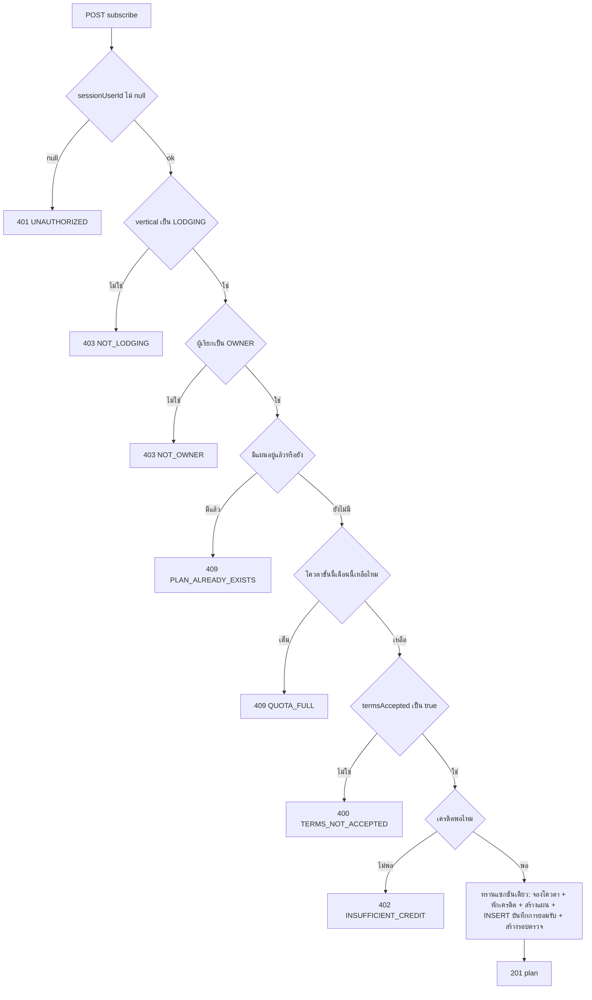
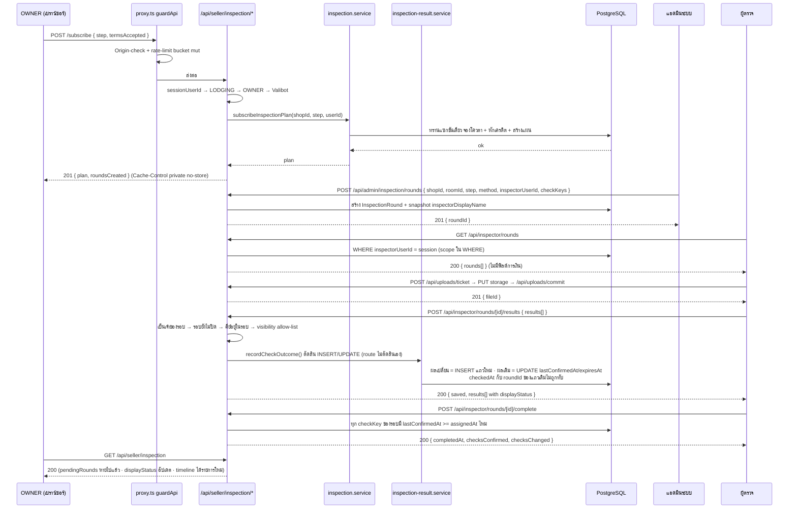
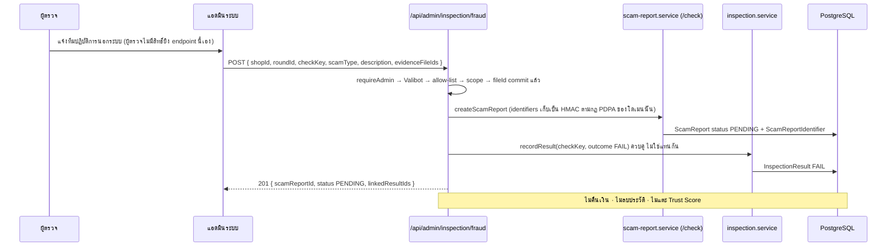

> **โมดูล:** M60-ShopInspection
> **ประเภทเอกสาร:** API Contract
> **เวอร์ชัน:** 1.0
> **วันที่จัดทำ:** 2026-08-29
> **สถานะ:** Draft
> **เจ้าของเอกสาร:** SA (ดู [[Feature-Docs-Ownership]])

# API Contract: แผนการตรวจสอบร้านค้า (Shop Inspection Plan)

---

## 1. Overview

API ชุดนี้เป็นสัญญาเชื่อมต่อของ **แผนการตรวจสอบร้านค้า** — บริการที่ร้านประเภทบ้านพัก (`LODGING`) ซื้อเพื่อให้ Deep ไปหาข้อเท็จจริงเกี่ยวกับร้านนั้นซ้ำ ๆ ตามรอบที่กำหนด แล้วนำผลตรวจไปแสดงบนโปรไฟล์สาธารณะ

**คำที่ห้ามใช้ในเอกสารนี้และในโค้ดที่ implement ตามเอกสารนี้** (อภิธานศัพท์ล็อกที่ `CONTEXT.md`):

| ห้ามใช้ | ใช้แทน | เหตุผล |
|---|---|---|
| ระดับ / Level / Tier | **ขั้นการตรวจสอบ** (step) | สงวน "Tier" ให้ Trust Tier ซึ่งเป็นคนละแกน ห้ามให้ผู้ซื้อเทียบข้ามกัน |
| แพ็กเกจ / Subscription / Package | **แผนการตรวจสอบ** (plan) | ชนกับ Business Package ซึ่งเป็นสินค้าคนละชิ้น |
| เกณฑ์ / มาตรฐาน / Criteria | **ข้อตรวจ** (check) | ข้อตรวจคือข้อเท็จจริงที่พิสูจน์ได้ ไม่ใช่คำตัดสินคุณภาพ |
| แอดมิน (เมื่อหมายถึงคนตรวจ) | **ผู้ตรวจ** (inspector) | ผู้ตรวจมีสิทธิ์เฉพาะงานตรวจที่ได้รับมอบหมาย ไม่ใช่สิทธิ์ทั่วระบบ |

- **เอกสารออกแบบต้นทาง:** [[SDS]] ของโมดูลนี้ — ทุก endpoint ต้อง trace กลับ component/decision ใน SDS ได้ (ตาราง §7)
- **Provider:** `apps/web` — Next.js 16 App Router, Route Handlers ใต้ `src/app/api/**` (TypeScript strict) + service layer ที่ `src/services/inspection*.service.ts`
- **Store:** PostgreSQL 16 ผ่าน Prisma (โมเดล `InspectionPlan` · `InspectionRound` · `InspectionResult` · `InspectionEvidence` · `InspectionIntakeQuota` · `InspectionTermsAcceptance` · คอลัมน์ `User.isInspector`) — ดู [[DATABASE]]
- **ผู้บริโภคสัญญานี้:** หน้าจอผู้ขายใต้ `(paces)/seller/**` · หน้าจอผู้ตรวจใต้ `(paces)/inspector/**` · หน้าจอแอดมินใต้ `(paces)/admin/**` — ทั้งหมดเป็น client component ในรีโปเดียวกัน ไม่มี 3rd-party consumer
- **Base URL (relative):** `/api` — เสิร์ฟจากทุก subdomain (main / `seller.*` / `admin.*`) โดย `src/proxy.ts` ไม่ rewrite path ที่ขึ้นต้นด้วย `/api`
- **Content-Type:** `application/json` ทั้งขาเข้าและขาออก — **ไม่มี endpoint ใดในโมดูลนี้รับ `multipart/form-data`** (ดู §3.4)
- **Convention ของ response:** ตามรีโปเดิม — สำเร็จคืน object ของ resource ตรง ๆ, ล้มเหลวคืน `{ "error": "<CODE>" }` หรือ `{ "error": { "code", "message" } }` ตามที่ระบุรายก้อนใน §5

---

## 2. Authentication

| รายการ | ค่า |
|--------|-----|
| **วิธี (Auth Method)** | NextAuth.js v4 — JWT session cookie (httpOnly) แยกตาม subdomain |
| **Header** | ไม่มี — เบราว์เซอร์แนบ cookie เอง (`getServerSession(authOptions)` ฝั่ง server) |
| **การอ่านตัวตน** | **ต้องใช้ `sessionUserId(session)` จาก `@/lib/session-user` เท่านั้น** คืน `string \| null` |
| **กรณีไม่ผ่าน** | `401` + `{ "error": "UNAUTHORIZED" }` พร้อมหัว `Cache-Control: private, no-store` |

**กติกาที่ห้ามผ่อน (ทุก endpoint ในเอกสารนี้):**

- **"มี session" ไม่เท่ากับ "รู้ว่าเป็นใคร"** — ห้ามเขียน `if (!session?.user)` แล้วตามด้วย `(session.user as { id: string }).id` แพตเทิร์นนี้ปล่อย `undefined` ไหลเข้า Prisma แล้วทั้งหน้าเป็น 500 (เกิดจริงบน prod 2026-08-11) ⇒ ใช้ `sessionUserId()` แล้วเช็ค `null` ก่อนเสมอ อ้าง `docs/conventions/session-exists-is-not-identity.md`
- **`Cache-Control: private, no-store, max-age=0, must-revalidate` ทุก response ทุกสถานะ** — payload ทั้งหมดในโมดูลนี้เป็นข้อมูลต่อผู้ใช้ (สถานะแผน · คิวงานของผู้ตรวจ · หลักฐานปิด) ใช้ helper `jsonNoStore()` จาก `@/lib/shop-api-guard` อ้าง memory `feedback_auth_api_cache_control`

### 2.1 ตารางสิทธิ์ (Authorization Matrix)

| ผู้เรียก | เงื่อนไข | เข้าถึงได้ |
|---|---|---|
| **OWNER ของร้าน** | เป็นเจ้าของ `Shop` นั้น และ `Shop.vertical === 'LODGING'` | `/api/seller/inspection` ทุกตัว (อ่าน + เขียน) |
| **ADMIN ของร้าน** (`ShopMember.role='ADMIN'`) | เป็นสมาชิกร้านนั้น | `GET /api/seller/inspection` เท่านั้น — mutation ทุกตัวได้ `403 NOT_OWNER` |
| **ผู้ตรวจ** (`User.isInspector === true`) | รอบตรวจนั้นมี `inspectorUserId === sessionUserId()` | `/api/inspector/**` เฉพาะรอบที่ตนถือ |
| **แอดมินระบบ** (`User.isAdmin === true`) | — | `/api/admin/inspection/**` |
| **สาธารณะ** | ไม่ล็อกอิน | ไม่มี endpoint ใดเลย (ดู §3.3) |

**สามข้อที่แยกขาดจากกัน ห้ามยุบรวม:**

1. `User.isInspector` **ไม่ใช่** `User.isAdmin` — ผู้ตรวจส่วนใหญ่เป็นบุคคลภายนอกที่จ้างรายครั้ง (FR-INS-024, PRD §3.8) การให้ `isAdmin` แทนคือการเปิดฐานทั้งระบบให้คนนอก
2. `isInspector === true` **ไม่ได้แปลว่าเห็นทุกรอบ** — ต้องผูกกับ `inspectorUserId` ของรอบนั้นเสมอ (AC-INS-24-2)
3. **ผู้ตรวจห้ามเห็นข้อมูลการเงินทุกชนิด** — ยอดเครดิต · ประวัติการชำระเงิน · `slipFileId` · ราคาแผน — ไม่ว่าจะเป็นร้านที่ตนได้รับมอบหมายหรือไม่ (AC-INS-24-3) ⇒ payload ของ `/api/inspector/**` **ไม่มีฟิลด์การเงินสักตัว** และห้ามเพิ่มภายหลังโดยไม่แก้เอกสารนี้

---

## 3. Endpoint List

### 3.1 ตารางรวม

| # | Method | Path | ผู้เรียก | คำอธิบาย |
|---|--------|------|---------|----------|
| 4.1 | `GET` | `/api/seller/inspection` | OWNER + ADMIN ร้าน | สถานะแผน + ผลปัจจุบันรายข้อ + ไทม์ไลน์รอบย้อนหลัง + คิว "รอผู้ตรวจเข้าตรวจ" |
| 4.2 | `POST` | `/api/seller/inspection/subscribe` | OWNER | สมัครแผนครั้งแรก |
| 4.3 | `POST` | `/api/seller/inspection/upgrade` | OWNER | เลื่อนขึ้นขั้นที่สูงกว่า |
| 4.4 | `POST` | `/api/seller/inspection/cancel` | OWNER | แจ้งยกเลิกแผน (มีผลสิ้นรอบบิล) |
| 4.5 | `POST` | `/api/seller/inspection/documents` | OWNER | ผูกไฟล์ที่อัปโหลดแล้วเข้ากับข้อตรวจ (หลักฐานปิด) |
| 4.6 | `GET` | `/api/inspector/rounds` | ผู้ตรวจ | คิวรอบตรวจที่ตนได้รับมอบหมาย |
| 4.7 | `GET` | `/api/inspector/rounds/[id]` | ผู้ตรวจเจ้าของรอบ | รายละเอียดรอบ + ข้อตรวจที่ต้องบันทึก |
| 4.8 | `POST` | `/api/inspector/rounds/[id]/results` | ผู้ตรวจเจ้าของรอบ | บันทึกผลตรวจรายข้อ (ยิงเป็นชุด) + แนบหลักฐาน |
| 4.9 | `POST` | `/api/inspector/rounds/[id]/complete` | ผู้ตรวจเจ้าของรอบ | ปิดรอบ |
| 4.10 | `GET` | `/api/admin/inspection/quota` | แอดมินระบบ | อ่านโควตารายเดือนต่อขั้น + ยอดที่ใช้ไปแล้ว |
| 4.11 | `PATCH` | `/api/admin/inspection/quota` | แอดมินระบบ | ตั้ง/แก้เพดานโควตา |
| 4.12 | `POST` | `/api/admin/inspection/rounds` | แอดมินระบบ | สร้างรอบตรวจ **นอกกำหนด** (ad-hoc) — เส้นทางหลักคือ cron สร้างให้ |
| 4.13 | `POST` | `/api/admin/inspection/fraud` | แอดมินระบบ | เส้นทางแยกเมื่อพบหลักฐานฉ้อโกง |
| 4.14 | `GET` | `/api/admin/inspection/rounds` | แอดมินระบบ | คิวรอบตรวจทั้งระบบ เรียง/กรองด้วย `dueAt` + ตัวชี้วัดงานค้าง |
| 4.15 | `POST` | `/api/admin/inspection/rounds/[id]/assign` | แอดมินระบบ | มอบหมายผู้ตรวจให้รอบที่ cron สร้างไว้ |

**รวม 15 endpoint** — ไม่มี `DELETE` สักตัวในโมดูลนี้โดยตั้งใจ: ประวัติรอบตรวจต้องคงอยู่ถาวรแม้ร้านลดขั้นหรือยกเลิกแผน (FR-INS-027) การมีปุ่มลบคือการเปิดทางให้ลบสิ่งที่กฎห้ามลบ

**หมายเหตุการแยก 4.12 ออกจาก 4.15:** contract รอบ 3 ย้ายการ *สร้าง* รอบไปให้ cron ⇒ งานประจำวันของแอดมินคือ **มอบหมายผู้ตรวจให้รอบที่มีอยู่แล้ว** (4.15) ไม่ใช่สร้างรอบเอง แต่การสร้างรอบนอกกำหนดยังต้องมีที่อยู่ (ร้านแก้ไขแล้วขอตรวจใหม่ตาม FR-INS-013 · ที่พักหลังใหม่ที่เพิ่งเพิ่มเข้าร้าน · รอบชดเชยที่ cron พลาด) ⇒ คงไว้ที่ 4.12 แต่ **ไม่ใช่เส้นทางหลักอีกต่อไป** — รวมสองอย่างนี้เป็น endpoint เดียวที่รับ payload สองรูปจะทำให้ "มอบหมาย" กับ "สร้าง" ใช้ด่านชุดเดียวกันทั้งที่ต้องการคนละชุด (4.15 ไม่ต้องตรวจ scope ของ `checkKeys` เพราะรอบมีอยู่แล้ว · 4.12 ต้องตรวจครบ)

### 3.2 กติกาที่ใช้ร่วมทุก endpoint

**ก. Valibot บังคับทุก input — ห้ามส่ง body ดิบเข้า Prisma**

ทุก request body และทุก query string ต้องผ่าน `v.safeParse(<Schema>, input)` จาก `src/lib/validations.ts` แล้วใช้ `parsed.output` เท่านั้น ห้ามส่ง `body` ทั้งก้อนหรือ spread เข้า `prisma.*.create/update`

เหตุผลที่ไม่ใช่แค่ style: `PATCH /api/users/me` เคยส่ง body ดิบเข้า `prisma.user.update` ⇒ ยิง `{"isAdmin": true}` เป็นแอดมินได้จริง (ปิดที่ `eb32a937`) โมดูลนี้เขียนคอลัมน์ที่ตัดสิน **สิ่งที่ผู้ซื้อเห็นบนโปรไฟล์สาธารณะ** ⇒ ช่องแบบเดียวกันแปลว่าร้านเขียนผลตรวจให้ตัวเองได้

Schema ที่ต้องเพิ่มใน `src/lib/validations.ts` (ชื่อเป็นสัญญา — SDS/DEV ห้ามตั้งชื่ออื่น):

| Schema | ใช้ที่ |
|---|---|
| `SubscribeInspectionSchema` | 4.2 |
| `UpgradeInspectionSchema` | 4.3 |
| `CancelInspectionSchema` | 4.4 |
| `SubmitInspectionDocumentSchema` | 4.5 |
| `RecordInspectionResultsSchema` | 4.8 |
| `CompleteInspectionRoundSchema` | 4.9 |
| `UpdateInspectionQuotaSchema` | 4.11 |
| `AssignInspectionRoundSchema` | 4.12 |
| `ReportInspectionFraudSchema` | 4.13 |

**ข. `checkKey` allow-list 18 ค่า และ `scope` ต้องตรงกับการมี/ไม่มี `roomId` (fail-closed)**

SSOT อยู่ในโค้ดที่ `src/lib/inspection/checks.ts` — **ห้ามพิมพ์คีย์ซ้ำที่อื่น ห้าม derive scope จากขั้น** (PRD §3.10 / AC-INS-29-1: ขอบเขตตัดสินจาก *สิ่งที่ข้อนั้นตรวจ* ไม่ใช่จาก *ขั้นที่ข้อนั้นอยู่*)

| checkKey | ขั้น | scope | วิธีตรวจตั้งต้น | อายุผล | ร้านส่งเอกสารเองได้ |
|---|---|---|---|---|---|
| `scam_db` | 1 | `SHOP` | `AUTO` | 1 วัน | ไม่ |
| `phone_identity` | 1 | `SHOP` | `AUTO` | 1 วัน | ไม่ |
| `account_age` | 1 | `SHOP` | `AUTO` | 1 วัน | ไม่ |
| `chat_response_speed` | 1 | `SHOP` | `AUTO` | 1 วัน | ไม่ |
| `complaints` | 1 | `SHOP` | `AUTO` | 1 วัน | ไม่ |
| `duplicate_listing` | 1 | `ROOM` | `AUTO` | 1 วัน | ไม่ |
| `id_card_selfie` | 2 | `SHOP` | `DOCUMENT` | 12 เดือน | ใช่ |
| `bank_account_name` | 2 | `SHOP` | `DOCUMENT` | 12 เดือน | ใช่ |
| `lease_right_document` | 2 | `ROOM` | `DOCUMENT` | 12 เดือน | ใช่ |
| `hotel_license` | 2 | `ROOM` | `DOCUMENT` | 12 เดือน | ใช่ |
| `video_tour` | 3 | `ROOM` | `VIDEO_CALL` | 6 เดือน | ไม่ |
| `operating_evidence` | 3 | `ROOM` | `VIDEO_CALL` | 90 วัน | ใช่ |
| `location_exists` | 4 | `ROOM` | `ONSITE` | 12 เดือน | ไม่ |
| `photos_match` | 4 | `ROOM` | `ONSITE` | 12 เดือน | ไม่ |
| `room_count` | 4 | `ROOM` | `ONSITE` | 12 เดือน | ไม่ |
| `facilities` | 4 | `ROOM` | `ONSITE` | 12 เดือน | ไม่ |
| `accessibility` | 4 | `ROOM` | `ONSITE` | 12 เดือน | ไม่ |
| `deep_photo_album` | 4 | `ROOM` | `ONSITE` | 12 เดือน | ไม่ |

รวม `SHOP` 7 ข้อ · `ROOM` 11 ข้อ

**ด่านที่ทุก endpoint ที่รับ `checkKey` ต้องผ่านตามลำดับนี้ ห้ามสลับ:**

1. `checkKey` อยู่ใน allow-list 18 ค่าหรือไม่ — ไม่อยู่ = `400 UNKNOWN_CHECK_KEY` (ห้ามเงียบ ห้าม ignore)
2. `scope` ของคีย์นั้นตรงกับการมี `roomId` หรือไม่ — `scope='SHOP'` แล้วส่ง `roomId` มา = `400 CHECK_SCOPE_MISMATCH` · `scope='ROOM'` แล้วไม่ส่ง `roomId` = `400 CHECK_SCOPE_MISMATCH` **เช็คทั้งสองทิศ ไม่ใช่ทิศเดียว**
3. `roomId` (ถ้ามี) เป็นห้องของร้านนั้นจริงหรือไม่ — ต้อง scope ใน `WHERE` (`prisma.room.findFirst({ where: { id, shopId } })`) ไม่ใช่ดึงมาแล้วเทียบทีหลัง — ไม่ตรง = `403 ROOM_NOT_IN_SHOP`

ทำไมด่าน 2 ต้องเป็นด่านจริง ไม่ใช่ความเชื่อ: ถ้ายอมให้ `scope='ROOM'` บันทึกโดยไม่มี `roomId` ผลตรวจของ "หลัง A" จะกลายเป็นผลระดับร้าน แล้ว **หลัง B และ C ที่ไม่มีใครเคยไปเห็นจะได้ป้าย "ผ่าน" ไปด้วย** ซึ่งคือรูที่ AC-INS-29-4 ห้ามไว้ตรงตัว และไม่มี `tsc`/build/เทสตัวไหนจับได้เพราะทั้งสองรูปแบบเป็นแถวที่ถูกต้องตามชนิดทุกตัวอักษร

**ค. `outcome` ที่เก็บมี 3 ค่า แต่สถานะที่ผู้ใช้เห็นมี 5 — เส้นแบ่งนี้ห้ามเลือน**

| ชั้น | ค่า | ที่มา |
|---|---|---|
| **เก็บใน DB** (`InspectionResult.outcome`) | `PASS` · `FAIL` · `NOT_APPLICABLE` | ผู้ตรวจ/ระบบอัตโนมัติเป็นคนเขียน |
| **แสดงต่อผู้ใช้** (`displayStatus` ใน response) | `PASS` · `FAIL` · `RECHECK_DUE` · `NO_DATA` · `NOT_APPLICABLE` | **server derive แล้วเท่านั้น** |

**`InspectionResult` เก็บ "ช่วงเวลาที่ผลเป็นค่านี้" ไม่ใช่ "เหตุการณ์การตรวจแต่ละครั้ง"** — **แถวใหม่เกิดเฉพาะตอนผลเปลี่ยน** การตรวจที่ได้ผลเหมือนเดิมคือการ **ต่ออายุแถวเดิม** ไม่ใช่การเพิ่มแถว

**ไม่มี unique constraint บนคู่ `(shopId, checkKey)` หรือ `(roomId, checkKey)` ทั้งเต็มรูปและ partial** — ถ้ามี ผลของช่วงก่อนหน้าจะถูกเขียนทับหายทันทีที่ผลเปลี่ยน ซึ่งขัด AC-INS-16-3 (ไทม์ไลน์ต้องแสดงรอบที่ผล `FAIL` ด้วย) และ AC-INS-27-1 (ห้ามลบประวัติ) — และมันจะหายโดยไม่มีคำสั่งลบสักบรรทัดให้ใครสังเกต

**ทำไมไม่ INSERT ทุกครั้งที่ตรวจ:** ข้อตรวจของขั้นที่ 1 รันทุกวัน ⇒ การเขียนแถวใหม่ทุกรอบจะได้ **365 บรรทัด "ผ่าน" ที่เหมือนกันทุกตัวอักษร ต่อปี ต่อข้อ** แล้วรอบที่มีความหมายจริง (วันที่ผลพลิก) จะจมหายไปในนั้น — ไทม์ไลน์คือตัวสินค้าของฟีเจอร์นี้ (FR-INS-016: ผู้ซื้อใช้ประเมินว่าร้านถูกตรวจสม่ำเสมอจริงไหม) การทำให้มันยาวขึ้นไม่ได้ทำให้มันบอกอะไรมากขึ้น

**สองคอลัมน์วันที่ที่ห้ามสลับกัน:**

| คอลัมน์ DB | ความหมาย | เปลี่ยนเมื่อไร |
|---|---|---|
| `checkedAt` | **วันที่ผลกลายเป็นค่านี้ครั้งแรก** | เขียนครั้งเดียวตอน insert แถว **ไม่เปลี่ยนอีกเลย** |
| `lastConfirmedAt` | **วันที่ยืนยันผลเดิมล่าสุด** | ทับใหม่ทุกครั้งที่ตรวจแล้วได้ผลเดิม |
| `expiresAt` | `lastConfirmedAt + ttlDays` ของข้อตรวจนั้น | **คำนวณใหม่ทุกครั้งที่ `lastConfirmedAt` ขยับ** |

`expiresAt` ผูกกับ `lastConfirmedAt` ไม่ใช่ `checkedAt` — ถ้าผูกกับ `checkedAt` ข้อที่ผลนิ่งมานาน (ซึ่งคือข้อที่สุขภาพดีที่สุด) จะหมดอายุทั้งที่เพิ่งตรวจเมื่อวาน แล้วขึ้น `RECHECK_DUE` ให้ร้านที่ไม่ได้ทำอะไรผิด

**"ผลปัจจุบัน" คำนวณตอนอ่าน ไม่ใช่ธงที่เก็บไว้:** แถวที่ `checkedAt` ใหม่สุดของคู่ `(shopId, roomId, checkKey)` นั้น

กติกา derive จาก **แถวล่าสุด** (SSOT อยู่ที่ `src/lib/inspection/result-status.ts` — ฟังก์ชันบริสุทธิ์ + เทสติดป้าย `[blocker]`):

- ไม่มีแถวสำหรับคู่ `(shopId, roomId, checkKey)` นั้นเลย → `NO_DATA`
- แถวล่าสุดมี `invalidatedAt !== null` → `RECHECK_DUE` (ร้านเปลี่ยนภาพประกาศ, FR-INS-028)
- แถวล่าสุด `outcome === 'PASS'` และ `expiresAt !== null` และ `expiresAt <= now` → `RECHECK_DUE` (FR-INS-012)
- นอกนั้น → ค่า `outcome` ของแถวล่าสุดตรง ๆ

**ห้าม derive จากแถวใดก็ตามที่ไม่ใช่แถวล่าสุด** — เช่นการหยิบ "แถวที่ `PASS` ล่าสุด" มาแสดงจะทำให้ข้อที่เพิ่งตรวจซ้ำแล้ว `FAIL` ยังโชว์ `PASS` ของปีที่แล้วต่อไป ซึ่งคือกฎ "ป้ายพูดความจริงเสมอ รวมถึงความจริงที่ร้านไม่อยากให้พูด" (PRD §4.1) ที่ระบุว่าแตะไม่ได้

**ชื่อฟิลด์ใน response ต้องสลับกันไม่ได้ด้วยตัวมันเอง** — สองวันที่นี้เป็นชนิดเดียวกัน (ISO string) และมักมีค่าเท่ากันในข้อมูลทดสอบ ⇒ ถ้าตั้งชื่อกลาง ๆ การต่อสายสลับกันจะผ่าน `tsc` ทุกตัวอักษร แล้วป้ายบนโปรไฟล์จะขึ้นวันที่เก่ากว่าความจริงโดยไม่มีอะไรฟ้อง (ผู้ซื้ออ่านว่าร้านถูกทิ้งไม่ตรวจมา 3 เดือน ทั้งที่ตรวจเมื่อวาน) — mapping ที่ผูกไว้ทั้งเอกสาร:

| ฟิลด์ใน response | มาจากคอลัมน์ | ใช้แสดงว่า |
|---|---|---|
| `lastCheckedAt` | `lastConfirmedAt` | "ตรวจล่าสุด {วันที่}" |
| `outcomeSince` | `checkedAt` | "ผลเป็นแบบนี้ตั้งแต่ {วันที่}" (ใช้ในไทม์ไลน์) |

**ห้าม client คำนวณ `displayStatus` เอง** และห้ามมี endpoint ไหนคืนแค่ `outcome` ดิบให้หน้าจอที่ต้องแสดงสถานะ — สองที่คำนวณคนละสูตรคือรูปร่างของบั๊กที่ `tsc` ไม่มีวันเห็น (Hard Rule 16) อาการที่ตามมาคือหน้าโปรไฟล์แสดง "ผ่าน" ให้ผลที่หมดอายุไปแล้ว ซึ่งคือกฎ "ป้ายพูดความจริงเสมอ" ที่ PRD §4.1 ระบุว่าแตะไม่ได้

**ห้ามยุบ `RECHECK_DUE` / `NO_DATA` / `NOT_APPLICABLE` เข้ากับ `FAIL` ในทุก response** (AC-INS-11-2) และตัวนับ "ข้อที่ตก" ถ้ามี ต้องนับเฉพาะ `FAIL` (AC-INS-11-3)

**ง. `guardApi` ครอบให้แล้ว — แต่ bucket ของผู้ตรวจไม่พอ ต้องเพิ่ม**

`src/proxy.ts::guardApi` ครอบทุก path ที่ขึ้นต้นด้วย `/api` อยู่แล้ว: Origin-check สำหรับ mutation (allowlist `*.deepthailand.app` / dev `*.deepth.local`) + rate-limit per-IP แยก bucket

bucket ที่มีอยู่วันนี้: `files` 600 · `upload` 300 · `mut` (auth 30 / unauth 100) · `get` (auth 120 / unauth 200)

| กลุ่ม endpoint | bucket ที่ตกไป | พอไหม |
|---|---|---|
| `/api/seller/inspection/**` (mutation) | `mut` 30/นาที | **พอ** — ผู้ขายกดสมัคร/อัปเกรด/ยกเลิกไม่กี่ครั้งต่อชีวิตของแผน; ผูกเอกสารมากสุดคือ 5 คีย์ที่ร้านส่งเองได้ ต่อ 1 ที่พัก |
| `/api/uploads/**` (ไฟล์หลักฐาน) | `upload` 300/นาที | **พอ** — ผู้ตรวจ onsite อัปโหลดอัลบั้ม 20 ภาพ = 40 request ยังห่างเพดานมาก |
| `/api/inspector/**` (mutation) | `mut` 30/นาที | **ไม่พอ ต้องเพิ่ม bucket** |

**เหตุผลที่ต้องเพิ่ม bucket `inspector`:** สัญญาของ 4.8 ออกแบบให้ยิง **เป็นชุด** (array สูงสุด 18 รายการต่อ 1 request) จึงกินโควตาแค่ 1 — ตัวเลข 30 พอสำหรับกระแสงานที่ตั้งใจไว้ **แต่มี 2 เคสที่ทำให้ทะลุแน่นอน และทั้งคู่เป็นเคสปกติไม่ใช่เคสสุดโต่ง:**

1. ผู้ตรวจ onsite ตรวจร้านที่มีที่พัก 5 หลัง = 5 รอบ ยิง 5 ครั้ง + ผูกหลักฐานรายภาพ + เปิดอ่านรอบสลับไปมา
2. งาน onsite ทำในพื้นที่สัญญาณอ่อน — request ล้มกลางทางแล้วผู้ตรวจกดใหม่คือพฤติกรรมปกติ ไม่ใช่การใช้งานผิด

การโดน `429` ตอนนี้มีราคาแพงกว่าปกติมาก เพราะผู้ตรวจ **ยืนอยู่หน้างานจริง** และงานที่ทำไปแล้วอาจหายครึ่ง ๆ กลาง ๆ — ซึ่งเป็นอาการเดียวกับที่เคยเกิดกับการแนบรูปกริด 24 ใบโดน 429 กลางชุด (บางใบขึ้นบางใบไม่ขึ้น) จนต้องเพิ่ม bucket `upload` มาแล้วครั้งหนึ่ง

**สัญญา:** เพิ่มใน `src/proxy.ts` — `isInspectorApi = isMutation && pathname.startsWith('/api/inspector/')` → `limit = 120`, `bucket = 'inspector'` การยกเพดานไม่เปิดช่องอะไรใหม่ เพราะทุก route ในกลุ่มนี้มีด่าน `isInspector` + `inspectorUserId` ของตัวเองครบก่อนแตะข้อมูล

**จ. error ใหม่ทุกตัวต้องมี route-catch จริง**

ตารางใน §5 ไม่ใช่รายการความตั้งใจ — ทุกโค้ดในตารางต้องมีบรรทัด `catch` ที่แมป error จาก service เป็น HTTP status นั้นจริง ๆ ในไฟล์ route มิฉะนั้นมันจะตกไป `500 INTERNAL_ERROR` แล้วผู้ใช้เห็น "เกิดข้อผิดพลาด ลองใหม่อีกครั้ง" กับสิ่งที่ไม่มีทางสำเร็จด้วยการลองใหม่ อ้าง memory `feedback_service_error_route_mapping`

**เกณฑ์ตรวจรับ (Reviewer):** สำหรับทุกโค้ดใน §5 ต้องชี้ได้ว่า *ไฟล์ไหน บรรทัดไหน* เป็นคนคืนสถานะนั้น — ชี้ไม่ได้ = ยังไม่เสร็จ ไม่ใช่หนี้ (อ้าง `docs/conventions/rule-must-be-enforced-not-described.md`)

**ฉ. ทุกครั้งที่รับเงิน ต้อง INSERT `InspectionTermsAcceptance` ในทรานแซกชันเดียวกับการหักเครดิต**

`InspectionTermsAcceptance` เป็นตาราง **append-only** ที่บันทึกว่าร้านรับทราบเงื่อนไขฉบับไหน ตอนจ่ายเท่าไร:

| คอลัมน์ | ความหมาย |
|---|---|
| `shopId` | ร้านที่รับทราบ |
| `acceptedAt` | เวลาที่กดยอมรับ |
| `step` | ขั้นที่กำลังจ่ายในครั้งนั้น |
| `priceSnapshotBaht` | ราคาที่แสดงให้ร้านเห็น ณ ตอนนั้น |
| `termsVersion` | เวอร์ชันของข้อความเงื่อนไขที่แสดง |

**ทำไมต้องเป็นตารางแยก ไม่ใช่ `InspectionPlan.termsAcceptedAt`:** AC-INS-10-3 บังคับให้แสดงเงื่อนไขและรับทราบซ้ำ **ทุกครั้งที่ชำระเงิน** (สมัคร · อัปเกรด · ต่ออายุ) แต่ช่องเดียวบน plan เก็บได้แค่ครั้งล่าสุด ⇒ คำถามที่ต้องตอบตอนร้านทักท้วงเรื่องไม่คืนเงินไม่ใช่ *"ยอมรับล่าสุดเมื่อไร"* แต่คือ **"ตอนจ่าย ฿599 เมื่อ 8 เดือนก่อน เห็นเงื่อนไขฉบับไหน ราคาเท่าไร"** — ซึ่งข้อมูลที่ถูกทับไปแล้วตอบไม่ได้ และมันคือช่วงเวลาเดียวที่หลักฐานชิ้นนี้มีค่า

**`InspectionPlan.termsAcceptedAt` ลดสถานะเป็น cache สำหรับอ่านเร็ว** — ใช้ได้เฉพาะการแสดงผลบนหน้าจอ (เช่น "รับทราบเงื่อนไขล่าสุด {วันที่}") **แหล่งความจริงคือ `InspectionTermsAcceptance`** ทุกคำถามเชิงหลักฐานต้องอ่านจากตารางนั้นเสมอ ห้ามอ้าง `termsAcceptedAt` เป็นหลักฐาน

**กฎที่ห้ามผ่อน:**

1. **INSERT เสมอ ห้าม update แถวเดิม** — ทับแถวเดิมคือการลบหลักฐานของการชำระเงินครั้งก่อนโดยไม่มีคำสั่งลบสักบรรทัด (คลาสเดียวกับที่ §3.2 ค ห้ามไว้กับ `InspectionResult`)
2. **อยู่ในทรานแซกชันเดียวกับการหักเครดิตและการสร้าง/อัปเดตแผน** — ถ้าแยกทรานแซกชัน จะมีสถานะที่ "หักเงินแล้วแต่ไม่มีหลักฐานการรับทราบ" ซึ่งเป็นสถานะที่แย่ที่สุดของทั้งเรื่อง (เก็บเงินไปแล้วพิสูจน์ไม่ได้ว่าบอกเงื่อนไข)
3. **`termsVersion` และ `priceSnapshotBaht` มาจาก server เท่านั้น ห้ามรับจาก client** — ทั้งสองค่าคือสิ่งที่หลักฐานชิ้นนี้ยืนยัน ถ้ารับจาก client ร้านส่งเวอร์ชัน/ราคาปลอมมาได้ แล้วหลักฐานจะกลายเป็นบันทึกสิ่งที่ร้านพิมพ์เอง ไม่ใช่สิ่งที่ระบบแสดง — เอกสารที่ฝ่ายหนึ่งกรอกเองไม่ใช่หลักฐานของอีกฝ่าย
4. **ครอบทุกทางที่รับเงิน ไม่ใช่แค่ 2 endpoint นี้** — 4.2 · 4.3 · และ **cron ต่ออายุรายเดือน ถ้ารอบนั้นมีการยืนยันซ้ำจากร้าน** ⇒ ตัวเขียนต้องเป็นฟังก์ชันเดียว (`recordTermsAcceptance()`) ที่ทั้งสามทางเรียก ไม่ใช่โค้ดที่ก็อปไปวางสามที่

**ช. รอบตรวจถูกสร้างโดย cron ล่วงหน้า ไม่ใช่โดยแอดมินตอนนึกได้**

`InspectionRound.dueAt` = กำหนดที่รอบนี้ต้องเสร็จ · cron สร้างรอบไว้ล่วงหน้าโดย `inspectorUserId = null` (ยังไม่มอบหมาย) สำหรับข้อตรวจที่ใกล้ `expiresAt`

| วิธีตรวจ | lead time (สร้างล่วงหน้าก่อน `expiresAt`) |
|---|---|
| `DOCUMENT` | 14 วัน |
| `VIDEO_CALL` | 14 วัน |
| `ONSITE` | 30 วัน |

`ONSITE` ได้ 30 วันเพราะต้องหาผู้ตรวจในพื้นที่ นัดวัน และเดินทาง — งานที่มีข้อจำกัดทางกายภาพต้องการเวลาตั้งต้นมากกว่างานที่ทำจากโต๊ะ (`AUTO` ไม่มี lead time เพราะ cron รายวันรันเองอยู่แล้ว ไม่ต้องมีใครมอบหมาย)

**จัดกลุ่มเป็นรอบตาม `(shopId, roomId, method)` — หนึ่งรอบต่อหนึ่งกลุ่ม ไม่ใช่หนึ่งรอบต่อหนึ่งข้อตรวจ** ข้อตรวจของขั้นที่ 4 มี 6 ข้อที่ผู้ตรวจเก็บได้ในการเดินทางครั้งเดียว ⇒ แตกเป็น 6 รอบจะได้คิวที่บอกว่าต้องไปที่เดิม 6 ครั้ง ซึ่งไม่ตรงกับงานจริงและทำให้ตัวชี้วัดงานค้างอ่านผิดเป็นเท่าตัว · การจัดกลุ่มนี้เข้ากันพอดีกับกฎ "หนึ่งรอบต่อหนึ่ง scope" ของ 4.12 เพราะ `roomId` เป็นส่วนหนึ่งของคีย์กลุ่มอยู่แล้ว

**ทำไม cron ต้องเป็นคนสร้าง ไม่ใช่ปล่อยให้แอดมินสร้างเอง:** ข้อของขั้นที่ 2–4 ขยับ `lastConfirmedAt` ได้ก็ต่อเมื่อมีรอบตรวจจริงเกิดขึ้น (§3.2 ค) ⇒ ถ้าไม่มีใครสร้างรอบก่อน `expiresAt` ข้อนั้นจะตกเป็น `RECHECK_DUE` ตามที่ FR-INS-012 กำหนด **ซึ่งถูกต้องตามกฎทุกตัวอักษร** แต่ผลคือร้านที่จ่ายเงินต่อเนื่องเห็นป้ายตัวเองค่อย ๆ ร่วงทีละข้อโดยไม่มีใครมาตรวจ — ความล้มเหลวแบบนี้ไม่มี error ไม่มี alert และกินเวลา 6–12 เดือนกว่าจะปรากฏ ซึ่งนานเกินกว่าที่ใครจะโยงกลับมาถึงสาเหตุ

**รอบที่ cron สร้างมี `inspectorUserId = null` และ `inspectorDisplayName` ยังว่าง** — ค่า snapshot ชื่อผู้ตรวจถูกเขียนตอน **มอบหมาย** (4.15) ไม่ใช่ตอนสร้าง

### 3.3 ทำไมไม่มี public endpoint

หน้าโปรไฟล์สาธารณะ (`/u/[username]` และ `/b/[slug]`) อ่านผลตรวจผ่าน **RSC / service call ตรง** ไม่ผ่าน HTTP endpoint ใด ๆ — เป็นการตัดสินใจ ไม่ใช่การยังไม่ได้ทำ:

1. **ลด attack surface** — endpoint สาธารณะที่รับ `shopId`/`roomId` คือช่องให้ทดสอบว่า id ไหนมีอยู่จริง และเป็นจุดที่ต้องเขียนด่าน "อย่าคืนหลักฐานปิด" ซ้ำอีกที่หนึ่ง ด่านที่เขียนซ้ำคือด่านที่วันหนึ่งจะไม่ตรงกัน
2. **กัน scrape** — ผลตรวจทั้งไดเรกทอรีถูกดูดเป็นชุดได้ทันทีถ้ามี endpoint ที่ไม่ต้องล็อกอิน ซึ่งขัดกับกฎ "อันดับในผลค้นหาซื้อไม่ได้" (PRD §4.1) โดยอ้อม — คนที่ดูดข้อมูลไปทำอันดับเองคือคนที่ทำสิ่งที่ Deep ประกาศว่าจะไม่ขาย
3. **หลักฐานปิดไม่มีทางหลุดผ่าน API ที่ไม่มีอยู่** — บัตรประชาชน โฉนด สัญญาเช่า สเตทเมนต์ (FR-INS-017) ไม่มีเส้นทางไหนที่คำขอจากคนนอกจะไปถึงได้เลย ไม่ต้องพึ่งความถูกต้องของด่านสักตัว

ฝั่ง RSC ต้องเรียก service ที่เลือกเฉพาะ `visibility === 'PUBLIC'` ที่ระดับ query และต้องไม่ส่ง `InspectionEvidence` ที่เป็น `PRIVATE` ข้าม server boundary เข้า flight payload ไม่ว่ากรณีใด (แพตเทิร์นเดียวกับที่ mask PII ที่ server boundary ใน `S-C1`)

### 3.4 หลักฐานและเอกสาร — ห้ามส่งไฟล์ผ่าน body

**ไม่มี endpoint ใดในโมดูลนี้รับตัวไฟล์** ทุก endpoint รับได้แค่ `fileId` ที่ commit เรียบร้อยแล้ว

เหตุผลที่เป็นข้อห้ามเด็ดขาด ไม่ใช่คำแนะนำ: Vercel จำกัด request body ที่ **4.5MB** และตอบ `413 FUNCTION_PAYLOAD_TOO_LARGE` **ก่อนถึงโค้ดเรา** ด้วย body ที่ไม่ใช่ JSON ⇒ client อ่านเหตุผลไม่ได้ แล้วตกไปข้อความ fallback "ลองใหม่อีกครั้ง" — โมดูลนี้อัปโหลดของที่ใหญ่ที่สุดในระบบ (อัลบั้มภาพ onsite, ภาพนิ่งจากวิดีโอคอล, สแกนโฉนด) ⇒ ถ้าใช้ body จะพังทุกใบตั้งแต่วันแรกโดยที่เพดานที่เขียนไว้ในโค้ดไม่มีผลจริงสักตัว อ้าง `docs/conventions/upload-body-size-limit.md`

**เส้นทางเดียวที่ถูกต้อง** (ใช้ `@/lib/upload-client` ทั้งฝั่งผู้ขายและฝั่งผู้ตรวจ ห้ามเขียน `fetch('/api/upload')` ใหม่ — มีเทส `[blocker]` สแกนซอร์สทั้ง `src/` ห้ามแพตเทิร์นเดิมกลับมา):

```mermaid
sequenceDiagram
    participant C as Client (ผู้ขาย / ผู้ตรวจ)
    participant T as POST /api/uploads/ticket
    participant S as Supabase Storage
    participant K as POST /api/uploads/commit
    participant I as POST /api/seller/inspection/documents<br/>หรือ /api/inspector/rounds/[id]/results

    C->>T: { purpose: 'DOCUMENT' หรือ 'IMAGE', name, size, mime }
    T-->>C: 201 { fileId, url, method: 'PUT', headers, ticket, maxSize }
    C->>S: PUT url (ไฟล์จริง — ไม่ผ่าน function ของเรา)
    S-->>C: 200
    C->>K: { ticket, name }
    K->>S: HEAD (อ่านขนาด/ชนิดจริง; ไม่ผ่านเกณฑ์ = ลบไฟล์ทิ้ง + 413)
    K-->>C: 201 { fileId, name, size, mime, kind }
    C->>I: { checkKey, roomId?, fileId, kind }
    I-->>C: 201 (ผูก fileId เข้ากับข้อตรวจ)
```

**ข้อบังคับของ endpoint ปลายทาง (4.5 และ 4.8):**

- รับได้แค่ `fileId` — ถ้าเจอ `Content-Type: multipart/form-data` ตอบ `415 UNSUPPORTED_MEDIA_TYPE` ทันที ไม่ต้องอ่าน body
- ต้องยืนยันว่า `fileId` มีอยู่จริงและถูก commit แล้ว (`getFileMeta`) — ไม่มี = `400 FILE_NOT_COMMITTED` เพราะ `fileId` ที่ client ส่งมาเป็นสตริงที่แต่งขึ้นได้เสมอ
- `visibility` **server เป็นคนตัดสิน ไม่รับจาก client** (ดู §4.5 / §4.8) — ค่า default ของโมเดลคือ `PRIVATE` และเส้นทางเดียวที่จะได้ `PUBLIC` คือชุดคีย์ที่ระบุไว้ในสัญญานี้เท่านั้น

---

## 4. Endpoint Detail

### 4.1 `GET /api/seller/inspection`

สถานะแผนการตรวจสอบของร้านปัจจุบัน + ผลตรวจรายข้อ (แยกระดับร้าน / รายที่พัก) + ไทม์ไลน์รอบตรวจย้อนหลัง + คิวรอบตรวจที่ยัง `assignedAt` แต่ยังไม่ `completedAt` — คิวนี้ **ผู้ขายเห็น สาธารณะไม่เห็น** (AC-INS-16 / PRD §3.6: เป็นสถานะกระบวนการทำงานของ Deep ไม่ใช่ข้อเท็จจริงเกี่ยวกับร้าน)

**"ผลปัจจุบันต่อข้อ" กับ "ไทม์ไลน์รอบย้อนหลัง" เป็นคนละก้อนใน response ห้ามยุบเป็นก้อนเดียว** — สองก้อนนี้ตอบคนละคำถาม (`shopResults`/`roomResults` ตอบว่า *วันนี้ข้อนี้เป็นอย่างไร* · `timeline` ตอบว่า *ร้านนี้ถูกตรวจมากี่ครั้งแล้ว และแต่ละครั้งได้อะไร*) และเพราะแถวใหม่เกิดเฉพาะตอนผลเปลี่ยน ข้อตรวจหนึ่งข้อจึงมีหลายแถวและมีจำนวนแถวไม่เท่ากับจำนวนรอบที่ตรวจ — ก้อนเดียวจะบังคับให้ client เดาเองว่าแถวไหนคือของปัจจุบัน และเดาเองว่ารอบไหนตรวจแล้วไม่มีแถว ซึ่งเป็นการย้ายสูตร derive ออกจาก server ไปอยู่ในหน้าจอ (§3.2 ค ห้ามไว้)

เปิดให้ทั้ง OWNER และ ADMIN ของร้าน (AC-INS-02-2 — ADMIN ดูได้ กดไม่ได้) ผู้ที่ไม่มีบทบาทใดในร้านได้ `403` (AC-INS-02-3)

**Request**

| ส่วน | ฟิลด์ | ชนิด | บังคับ | คำอธิบาย |
|------|-------|------|--------|----------|
| Query | `roomId` | `string (uuid)` | no | กรองผลตรวจ scope `ROOM` ให้เหลือหลังเดียว ไม่ส่ง = คืนทุกหลังของร้าน |

ไม่รับ `shopId` จาก client — derive จาก active shop context ของ session เท่านั้น (แพตเทิร์น DAL ownership S-C7 เดียวกับ `/api/wallet/topup`) รับ `shopId` เมื่อไร ผู้ขาย A จะอ่านสถานะแผนของผู้ขาย B ได้ทันที

**Response — Success (200)**

| ฟิลด์ | ชนิด | คำอธิบาย |
|-------|------|----------|
| `plan` | `object \| null` | `null` = ร้านนี้ยังไม่เคยสมัคร (ไม่ใช่ error) |
| `plan.step` | `1 \| 2 \| 3 \| 4` | ขั้นการตรวจสอบปัจจุบัน |
| `plan.status` | `'ACTIVE' \| 'LAPSED'` | `LAPSED` = พ้นแผนแล้ว (โปรไฟล์เป็นแถบสีกลาง แต่ไทม์ไลน์ยังอยู่) |
| `plan.termsAcceptedAt` | `string (ISO) \| null` | เวลาที่ OWNER รับทราบเงื่อนไขล่าสุด — **cache สำหรับแสดงผลเท่านั้น** แหล่งความจริงคือ `InspectionTermsAcceptance` (§3.2 ฉ) |
| `plan.lapsedReason` | `'RENEWAL_FAILED' \| 'OWNER_CANCELLED' \| null` | มีค่าเมื่อ `status === 'LAPSED'` เท่านั้น |
| `plan.effectiveAt` | `string (ISO) \| null` | มีค่าเมื่อ OWNER แจ้งยกเลิกแล้วแต่ยังไม่สิ้นรอบบิล |
| `canManage` | `boolean` | `true` เฉพาะ OWNER — client ใช้ปิดปุ่ม ไม่ใช่ด่านสิทธิ์ |
| `shopResults[]` | `array` | **ผลปัจจุบัน** scope `SHOP` 7 ข้อ (แถวล่าสุดต่อข้อ) |
| `roomResults[]` | `array` | `{ roomId, roomName, results[] }` **ผลปัจจุบัน** scope `ROOM` 11 ข้อ ต่อหลัง |
| `*.results[].checkKey` | `string` | หนึ่งใน 18 คีย์ |
| `*.results[].displayStatus` | `'PASS' \| 'FAIL' \| 'RECHECK_DUE' \| 'NO_DATA' \| 'NOT_APPLICABLE'` | derive ฝั่ง server (§3.2 ค) |
| `*.results[].lastCheckedAt` | `string (ISO) \| null` | **"ตรวจล่าสุด"** (จาก `lastConfirmedAt`) — **วันที่รายข้อ ห้ามใช้วันเดียวรวมทั้งขั้น** (AC-INS-14-2) |
| `*.results[].outcomeSince` | `string (ISO) \| null` | **"ผลเป็นแบบนี้ตั้งแต่"** (จาก `checkedAt`) |
| `*.results[].expiresAt` | `string (ISO) \| null` | `lastCheckedAt + ttlDays` — ไม่ใช่ `outcomeSince + ttlDays` |
| `*.results[].inspectorDisplayName` | `string \| null` | ชื่อผู้ตรวจของรอบที่ผลิตผลนี้ |
| `timeline[]` | `array` | **ประวัติทุกรอบตรวจที่ปิดแล้ว** เรียง `completedAt` ใหม่→เก่า ไม่จำกัดเฉพาะรอบล่าสุด (FR-INS-016) |
| `timeline[].roundId` | `string` | |
| `timeline[].step` / `.method` | `number` / `string` | |
| `timeline[].roomId` / `.roomName` | `string \| null` | |
| `timeline[].completedAt` | `string (ISO)` | |
| `timeline[].inspectorDisplayName` | `string` | snapshot ของรอบนั้น ไม่เปลี่ยนตามการแก้โปรไฟล์ผู้ตรวจภายหลัง (AC-INS-25-2) |
| `timeline[].changedResults[]` | `array` | `{ checkKey, outcome, outcomeSince }` — ข้อที่ **รอบนี้ทำให้ผลเปลี่ยน** (แถวที่ `roundId` = รอบนี้) |
| `timeline[].confirmedCheckKeys[]` | `string[]` | ข้อที่ **รอบนี้ตรวจแล้วได้ผลเดิม** (ยืนยัน ไม่ได้เปลี่ยน) |
| `pendingRounds[]` | `array` | `{ roundId, step, method, roomId, roomName, assignedAt, inspectorDisplayName }` — รอบที่ยังไม่ปิด |

**ทำไมไทม์ไลน์ต้องแยกสองก้อน:** เพราะแถวใหม่เกิดเฉพาะตอนผลเปลี่ยน (§3.2 ค) รอบที่ตรวจแล้วทุกอย่างเหมือนเดิมจะ **ไม่มีแถว `InspectionResult` เป็นของตัวเองเลยสักแถว** ⇒ ถ้าไทม์ไลน์แสดงเฉพาะแถวที่ผูกกับรอบ รอบนั้นจะขึ้นเป็นบรรทัดว่าง ซึ่งอ่านได้ว่า "ผู้ตรวจมาแล้วไม่ได้ทำอะไร" ทั้งที่ความจริงคือ "มาแล้วยืนยันว่าทุกอย่างยังเหมือนเดิม" — ซึ่งเป็นข้อความที่ผู้ซื้อต้องการอ่านมากที่สุดอย่างหนึ่ง

`confirmedCheckKeys` **derive ได้โดยไม่ต้องเพิ่มคอลัมน์ใหม่**: `round.checkKeys` ลบด้วยคีย์ที่ปรากฏใน `changedResults` — คีย์ที่อยู่ในรอบแต่ไม่ได้ผลิตแถวใหม่ คือคีย์ที่ผลไม่เปลี่ยน ตามนิยามตรงตัว

`changedResults[].outcome` เป็นค่าดิบ 3 ค่า ไม่ใช่ `displayStatus` โดยตั้งใจ — รายการในไทม์ไลน์คือ **บันทึกของสิ่งที่เกิดขึ้น ณ วันนั้น** การเอาไปคิดว่า "หมดอายุแล้ว" ไม่มีความหมาย เพราะรอบเก่าย่อมพ้นอายุเสมออยู่แล้ว ⇒ ถ้าส่ง `displayStatus` ให้ ไทม์ไลน์ทั้งเส้นจะกลายเป็น `RECHECK_DUE` ทุกบรรทัด

`changedResults[].outcomeSince` ในไทม์ไลน์จะเท่ากับวันที่ของรอบนั้นเสมอ (รอบนี้เป็นคนทำให้ผลเปลี่ยน) ⇒ **ห้ามใช้ `lastCheckedAt` ในไทม์ไลน์** เพราะค่านั้นเดินหน้าไปเรื่อย ๆ ตามการยืนยันครั้งถัด ๆ ไป ⇒ บรรทัดประวัติของเดือนกุมภาพันธ์จะแสดงวันที่ของเดือนสิงหาคม
| `intake` | `object` | `{ stepAvailable: number[], nextOpenAt: string \| null }` — ขั้นที่โควตาเดือนนี้ยังเปิดรับ (AC-INS-09-2: ต้องรู้ตั้งแต่เปิดหน้า ไม่ใช่ตอนกดจ่าย) |

**ห้ามมีฟิลด์ยอดเครดิต/สลิป/ราคาในก้อนนี้** — ยอดกระเป๋าอ่านจาก endpoint กระเป๋าเดิมที่มีด่านของตัวเอง

**Response — Error**

`401 UNAUTHORIZED` · `403 FORBIDDEN` (ไม่ใช่สมาชิกร้าน) · `403 NOT_LODGING` · `404 SHOP_NOT_FOUND` · `500 INTERNAL_ERROR`

**ตัวอย่าง JSON**

```json
// Response 200
{
  "plan": { "step": 3, "status": "ACTIVE", "termsAcceptedAt": "2026-08-20T04:11:00.000Z", "lapsedReason": null, "effectiveAt": null },
  "canManage": true,
  "shopResults": [
    {
      "checkKey": "scam_db",
      "displayStatus": "PASS",
      "lastCheckedAt": "2026-08-28T01:00:00.000Z",
      "outcomeSince": "2026-05-14T01:00:00.000Z",
      "expiresAt": "2026-08-29T01:00:00.000Z",
      "inspectorDisplayName": "ตรวจอัตโนมัติโดยระบบ"
    },
    { "checkKey": "bank_account_name", "displayStatus": "NO_DATA", "lastCheckedAt": null, "outcomeSince": null, "expiresAt": null, "inspectorDisplayName": null }
  ],
  "roomResults": [
    {
      "roomId": "0f2b6f5e-1c2a-4a77-9d1e-2b0a8c4d5e6f",
      "roomName": "บ้านริมเขา หลัง A",
      "results": [
        { "checkKey": "video_tour", "displayStatus": "RECHECK_DUE", "lastCheckedAt": "2026-02-11T08:00:00.000Z", "outcomeSince": "2026-02-11T08:00:00.000Z", "expiresAt": "2026-08-11T08:00:00.000Z", "inspectorDisplayName": "สมชาย ก." }
      ]
    }
  ],
  "timeline": [
    {
      "roundId": "7b31...",
      "step": 3,
      "method": "VIDEO_CALL",
      "roomId": "0f2b6f5e-1c2a-4a77-9d1e-2b0a8c4d5e6f",
      "roomName": "บ้านริมเขา หลัง A",
      "completedAt": "2026-02-11T08:30:00.000Z",
      "inspectorDisplayName": "สมชาย ก.",
      "changedResults": [{ "checkKey": "video_tour", "outcome": "PASS", "outcomeSince": "2026-02-11T08:00:00.000Z" }],
      "confirmedCheckKeys": ["operating_evidence"]
    }
  ],
  "pendingRounds": [
    { "roundId": "9a7c...", "step": 3, "method": "VIDEO_CALL", "roomId": "0f2b...", "roomName": "บ้านริมเขา หลัง A", "assignedAt": "2026-08-28T09:00:00.000Z", "inspectorDisplayName": "สมชาย ก." }
  ],
  "intake": { "stepAvailable": [1, 2], "nextOpenAt": "2026-09-01T00:00:00.000Z" }
}
```

**อ่านตัวอย่างข้างบนที่ `scam_db`:** `outcomeSince` = 14 พ.ค. · `lastCheckedAt` = 28 ส.ค. — แปลว่า *ข้อนี้เป็น "ผ่าน" มาตั้งแต่กลางเดือนพฤษภาคม และตรวจยืนยันครั้งล่าสุดเมื่อวาน* หน้าจอต้องใช้ `lastCheckedAt` กับป้าย "ตรวจล่าสุด" **ถ้าต่อสายสลับกันจะขึ้นว่า "ตรวจล่าสุด 14 พ.ค." ซึ่งบอกผู้ซื้อว่าร้านนี้ถูกทิ้งไม่ตรวจมา 3 เดือนครึ่ง ทั้งที่ระบบตรวจให้ทุกวัน** — ตัวอย่างในเอกสารนี้จึงจงใจให้สองค่าต่างกัน ห้ามแก้เป็นค่าเท่ากันเวลาก็อปไปทำ fixture เพราะ fixture ที่ค่าเท่ากันจะผ่านเทสทั้งที่ต่อสายสลับ

`video_tour` เป็นเคสตรงข้าม (สองค่าเท่ากัน = ตรวจครั้งแรกแล้วไม่เคยยืนยันซ้ำอีกเลยจนหมดอายุ ⇒ `RECHECK_DUE`)

---

### 4.2 `POST /api/seller/inspection/subscribe`

OWNER สมัครแผนการตรวจสอบครั้งแรก หักค่าตรวจจากกระเป๋าเครดิตร้าน (`SellerWallet`) — ไม่ใช้ช่องทางชำระเงินอื่น (AC-INS-08-1)

**ลำดับด่านบังคับ — ห้ามสลับ ห้ามข้าม:**



**ทำไมลำดับนี้สำคัญ ไม่ใช่แค่สวยงาม:**

- **`NOT_LODGING` ต้องมาก่อน `NOT_OWNER`** เพื่อไม่ให้ผู้ที่ไม่ใช่เจ้าของใช้ความต่างของ error แยกแยะว่าร้านนั้นเป็นประเภทอะไร และเพื่อให้ร้านประเภทอื่นที่ยิงตรงได้คำตอบที่ตรงกับความจริงเสมอ (การซ่อนปุ่มไม่ใช่การควบคุมสิทธิ์ — BR-LODG-03)
- **`QUOTA_FULL` ต้องมาก่อน `TERMS_NOT_ACCEPTED` และก่อนหักเงินเสมอ** — AC-INS-09-3 ห้ามรับสมัครแล้วปล่อยให้รอเงียบ ๆ ⇒ ห้ามหักเงินก่อนแล้วค่อยแจ้งว่าเต็ม
- **ไม่มีแถว `InspectionIntakeQuota` ของเดือน/ขั้นนั้น = โควตา 0 = ปิดรับ ⇒ ตอบ `409 QUOTA_FULL` ไม่ใช่ `500`** (fail-closed) แถวรายเดือนถูกสร้างโดย cron ที่คัดลอก `capacity` ของเดือนปัจจุบันไปเดือนถัดไป ⇒ **เดือนที่ cron ไม่ทำงานคือเดือนที่ไม่มีแถว** ถ้าโค้ดตีความว่า "ไม่มีเพดาน = ไม่จำกัด" ระบบจะเปิดรับไม่จำกัดพอดีในเดือนที่ไม่มีใครดูแล ซึ่งเป็นสิ่งที่ AC-INS-09-3 ห้ามตรงตัว และถ้าตีความเป็น error ระบบจะพ่น 500 ใส่ผู้ขายที่ไม่ได้ทำอะไรผิดเลย — ทั้งสองทางแย่กว่าการบอกตรง ๆ ว่าเดือนนี้ยังไม่เปิดรับ
- **บันทึกการยอมรับเงื่อนไข (`InspectionTermsAcceptance`) ต้อง INSERT ในทรานแซกชันเดียวกันนี้ด้วย** พร้อม `termsVersion` และ `priceSnapshotBaht` ที่ server เป็นคนกำหนด (§3.2 ฉ) — แยกออกไปเมื่อไรจะมีสถานะ "หักเงินแล้วแต่ไม่มีหลักฐานว่าบอกเงื่อนไข"
- **การจองโควตาต้องอยู่ทรานแซกชันเดียวกับการหักเครดิตและการสร้างแผน** — ถ้าอ่านโควตาแล้วค่อยเขียนทีหลัง คนสองคนที่กดพร้อมกันในวินาทีเดียวกันจะผ่านด่านทั้งคู่แล้วโควตาทะลุโดยไม่มีอะไรฟ้อง ⇒ ต้องเป็น conditional update ที่นับที่ระดับฐาน (แพตเทิร์นเดียวกับ `wallet.service` ที่หักเครดิตด้วย conditional `updateMany`)

**Request**

| ส่วน | ฟิลด์ | ชนิด | บังคับ | คำอธิบาย |
|------|-------|------|--------|----------|
| Body | `step` | `1 \| 2 \| 3 \| 4` | yes | ขั้นการตรวจสอบที่ต้องการ (`v.picklist([1,2,3,4])`) |
| Body | `termsAccepted` | `true` | yes | ต้องเป็น literal `true` เท่านั้น — `v.literal(true)` |

`termsAccepted` เป็น `v.literal(true)` ไม่ใช่ `v.boolean()` โดยตั้งใจ: `false` ที่ผ่าน schema แล้วไปตกที่ `if` ในโค้ดคือด่านที่ลบทิ้งได้โดยไม่มีอะไรแดง ส่วน literal ทำให้ `tsc` และ Valibot บังคับให้เอง

ไม่รับ `shopId` และไม่รับ `price` จาก client — ราคาอ่านจากฝั่ง server เท่านั้น (รับราคาจาก client = ร้านตั้งราคาค่าตรวจของตัวเองได้)

**Response — Success (201)**

| ฟิลด์ | ชนิด | คำอธิบาย |
|-------|------|----------|
| `plan.step` | `number` | |
| `plan.status` | `'ACTIVE'` | |
| `plan.termsAcceptedAt` | `string (ISO)` | cache — ตรงกับ `acceptance.acceptedAt` ของครั้งนี้ |
| `acceptance.acceptedAt` | `string (ISO)` | แถวที่เพิ่ง INSERT ใน `InspectionTermsAcceptance` |
| `acceptance.termsVersion` | `string` | เวอร์ชันเงื่อนไขที่ระบบแสดง (server กำหนด) |
| `acceptance.priceSnapshotBaht` | `number` | ราคาที่แสดงให้ร้านเห็นและหักจริง |
| `roundsCreated` | `number` | จำนวนรอบตรวจที่ถูกสร้างทันที (บางรอบยังไม่มีผู้ตรวจ รอมอบหมายที่ 4.15) |

คืน `acceptance` กลับมาให้ client เห็นด้วย เพราะเป็นสิ่งเดียวที่ยืนยันว่าหลักฐานถูกบันทึกแล้วจริง — ถ้าไม่คืน ฝั่งหน้าจอจะไม่มีทางแยก "บันทึกหลักฐานสำเร็จ" ออกจาก "หักเงินสำเร็จแต่หลักฐานหาย" ซึ่งเป็นสองสถานะที่ต่างกันมากและหน้าตาเหมือนกันทุกประการจากฝั่ง client

**Response — Error**

`401 UNAUTHORIZED` · `400 VALIDATION_ERROR` · `400 TERMS_NOT_ACCEPTED` · `402 INSUFFICIENT_CREDIT` · `403 NOT_LODGING` · `403 NOT_OWNER` · `409 PLAN_ALREADY_EXISTS` · `409 QUOTA_FULL` · `500 INTERNAL_ERROR`

**ตัวอย่าง JSON**

```json
// Request
{ "step": 3, "termsAccepted": true }

// Response 201
{
  "plan": { "step": 3, "status": "ACTIVE", "termsAcceptedAt": "2026-08-29T07:20:11.000Z" },
  "acceptance": { "acceptedAt": "2026-08-29T07:20:11.000Z", "termsVersion": "inspection-terms-2026-08", "priceSnapshotBaht": 599 },
  "roundsCreated": 2
}

// Response 409
{ "error": "QUOTA_FULL", "message": "ขั้นตรวจเห็นของจริงเปิดรับครบจำนวนของเดือนนี้แล้ว เปิดรับรอบถัดไป 1 ก.ย. 2569", "details": { "step": 3, "nextOpenAt": "2026-09-01T00:00:00.000Z" } }
```

`QUOTA_FULL` **ต้องคืน `nextOpenAt` เสมอ** — AC-INS-09-2 บังคับว่าข้อความปิดรับต้องบอกวันที่เปิดรับรอบถัดไป การตอบว่า "เต็มแล้ว" เฉย ๆ คือการปล่อยให้คนรอโดยไม่มีกำหนด ซึ่งเป็นสิ่งที่กฎข้อนี้ห้ามตรงตัว — รวมถึงกรณี "ไม่มีแถวโควตา" ที่ `nextOpenAt` คือวันแรกของเดือนถัดไปตามที่ cron จะสร้างแถวให้

---

### 4.3 `POST /api/seller/inspection/upgrade`

OWNER เลื่อนแผนขึ้นไปขั้นที่สูงกว่า — ด่านชุดเดียวกับ 4.2 ทุกข้อ บวกอีก 2 ข้อ

**Request**

| ส่วน | ฟิลด์ | ชนิด | บังคับ | คำอธิบาย |
|------|-------|------|--------|----------|
| Body | `step` | `2 \| 3 \| 4` | yes | ขั้นปลายทาง |
| Body | `termsAccepted` | `true` | yes | ต้องแสดงเงื่อนไขและรับทราบ**ซ้ำทุกครั้ง** (AC-INS-10-3) ไม่ใช่ครั้งเดียวตอนสมัคร |

**ด่านเพิ่มจาก 4.2:**

1. ต้องมีแผนอยู่แล้ว — ไม่มี = `404 PLAN_NOT_FOUND` (ไม่ใช่ 400: ทางแก้ของผู้ใช้คือไปกดสมัครก่อน ไม่ใช่แก้ข้อมูลที่ส่งมา)
2. `step` ปลายทางต้อง **มากกว่า** ขั้นปัจจุบันเท่านั้น — เท่ากันหรือน้อยกว่า = `409 INVALID_STEP_TRANSITION` การลดขั้นอยู่นอกขอบเขตรอบแรก (ยังไม่มีมติวิธีคิดส่วนต่าง — ดู §8 Open Questions) และ **ห้าม implement การลดขั้นแบบเงียบผ่าน endpoint นี้** เพราะการลดขั้นมีผลต่อสิ่งที่ผู้ซื้อเห็นบนโปรไฟล์ทันที

การอัปเกรดคือการรับเงินรอบใหม่ ⇒ **INSERT `InspectionTermsAcceptance` แถวใหม่เสมอ** (`step` = ขั้นปลายทาง · `priceSnapshotBaht` = ยอดที่หักจริงรอบนี้) ในทรานแซกชันเดียวกับการหักเครดิต — §3.2 ฉ · `InspectionPlan.termsAcceptedAt` ถูกเขียนทับด้วยเวลาปัจจุบัน ซึ่งไม่เป็นไรเพราะมันเป็น cache แถวหลักฐานของการอัปเกรดครั้งก่อน ๆ ยังอยู่ครบในตารางแยก

**Response — Success (200)** — โครงเดียวกับ 4.2 บวก `previousStep`

**Response — Error**

`401` · `400 VALIDATION_ERROR` · `400 TERMS_NOT_ACCEPTED` · `402 INSUFFICIENT_CREDIT` · `403 NOT_LODGING` · `403 NOT_OWNER` · `404 PLAN_NOT_FOUND` · `409 INVALID_STEP_TRANSITION` · `409 QUOTA_FULL` · `500`

```json
// Request
{ "step": 4, "termsAccepted": true }

// Response 200
{
  "plan": { "step": 4, "status": "ACTIVE", "termsAcceptedAt": "2026-08-29T07:31:00.000Z" },
  "acceptance": { "acceptedAt": "2026-08-29T07:31:00.000Z", "termsVersion": "inspection-terms-2026-08", "priceSnapshotBaht": 3900 },
  "previousStep": 3,
  "roundsCreated": 6
}
```

---

### 4.4 `POST /api/seller/inspection/cancel`

OWNER แจ้งยกเลิกแผน **มีผลเมื่อสิ้นสุดรอบบิลปัจจุบัน ไม่ใช่ทันที** (AC-INS-26-3) — ร้านจ่ายเงินของรอบนี้ไปแล้ว การตัดสิทธิ์กลางรอบคือการยึดของที่ซื้อไปแล้ว

**Request**

| ส่วน | ฟิลด์ | ชนิด | บังคับ | คำอธิบาย |
|------|-------|------|--------|----------|
| Body | `acknowledged` | `true` | yes | OWNER อ่านผลลัพธ์ที่จะเกิดขึ้นแล้ว (AC-INS-26-2) — `v.literal(true)` |

**สิ่งที่ endpoint นี้ต้อง**ไม่**ทำ (สามข้อนี้เป็นกฎที่แตะไม่ได้):**

1. **ห้ามลบ `InspectionRound` / `InspectionResult` / `InspectionEvidence` สักแถว** — FR-INS-027 ประวัติคงอยู่ถาวรแม้ยกเลิก
2. **ห้ามคืนเงิน** — ค่าตรวจไม่คืนไม่ว่ากรณีใด (AC-INS-13 / BR §8.7) endpoint นี้ไม่แตะกระเป๋าเครดิตเลย
3. **ห้ามแตะ Trust Score / Trust Tier / อันดับผลค้นหา** — แกนแยกขาด (FR-INS-020)

**Response — Success (200)**

| ฟิลด์ | ชนิด | คำอธิบาย |
|-------|------|----------|
| `plan.status` | `'ACTIVE'` | ยังคง `ACTIVE` จนสิ้นรอบบิล — client ต้องอ่าน `effectiveAt` ไม่ใช่เดาจาก status |
| `plan.effectiveAt` | `string (ISO)` | เวลาที่แผนจะกลายเป็น `LAPSED` |
| `plan.lapsedReason` | `'OWNER_CANCELLED'` | เขียนตั้งแต่ตอนแจ้งยกเลิก ไม่ใช่รอตอนสิ้นรอบ |
| `notice` | `string` | ข้อความไทยที่ผู้ใช้เห็น |

**`lapsedReason` ต้องถูกเซ็ตเป็น `OWNER_CANCELLED` ใน request เดียวกับที่แจ้งยกเลิก** ไม่ใช่ให้ตัวตัดรอบบิลเดาเอาเองตอนสิ้นรอบ — ค่านี้มี 2 ค่าที่แยกกันด้วย *เจตนา* ไม่ใช่ด้วย *อาการ*: `OWNER_CANCELLED` (เจ้าของตั้งใจเลิก) กับ `RENEWAL_FAILED` (เครดิตไม่พอตอนตัดรอบ) ⇒ ถ้าไม่บันทึกตอนนี้ ตัวตัดรอบบิลจะเห็นแค่ว่า "แผนนี้ไม่ต่ออายุ" แล้วเขียน `RENEWAL_FAILED` ให้คนที่ตั้งใจยกเลิก ซึ่งแปลว่าเราจะบอกร้านว่าเขาค้างชำระทั้งที่เขาไม่ได้ค้าง (มิเรอร์แพตเทิร์นของ `Shop.packageLockReason` ที่แยกเหตุผลด้วยวิธีเดียวกัน)

**`lapsedReason` ไม่ใช่สิ่งที่ผู้ซื้อเห็น** — โปรไฟล์สาธารณะแสดงแค่แถบสีกลางพร้อมข้อความว่าร้านนี้ไม่ได้อยู่ในแผนแล้วและวันที่ข้อมูลล่าสุด (FR-INS-019) การบอกสาธารณะว่า "เพราะจ่ายเงินไม่ผ่าน" คือถ้อยคำเชิงลงโทษกับร้านที่ไม่ได้ทำผิดอะไร ซึ่ง PRD §4.1 สงวนโทนนั้นไว้ให้กรณีมิจฉาชีพจริงเท่านั้น

**Response — Error**

`401` · `400 VALIDATION_ERROR` · `403 NOT_LODGING` · `403 NOT_OWNER` · `404 PLAN_NOT_FOUND` · `409 PLAN_ALREADY_CANCELED` · `500`

```json
// Request
{ "acknowledged": true }

// Response 200
{
  "plan": { "status": "ACTIVE", "effectiveAt": "2026-09-19T17:00:00.000Z", "lapsedReason": "OWNER_CANCELLED" },
  "notice": "แผนการตรวจสอบจะสิ้นสุดวันที่ 20 ก.ย. 2569 หลังจากนั้นโปรไฟล์จะแสดงว่าไม่ได้อยู่ในแผนการตรวจสอบแล้ว ประวัติรอบตรวจเดิมยังแสดงอยู่ครบ และค่าตรวจที่ชำระไปแล้วไม่มีการคืนเงิน"
}
```

ข้อความนี้ต้องมาจาก **ที่เดียว** กับข้อความที่แสดงในกล่องยืนยันก่อนกด (Hard Rule 16) — สองที่เขียนเองจะกลายเป็นสองคำสัญญาที่ไม่เท่ากันในจอเดียว

---

### 4.5 `POST /api/seller/inspection/documents`

OWNER ผูก **ไฟล์ที่อัปโหลดและ commit เรียบร้อยแล้ว** เข้ากับข้อตรวจหนึ่งข้อ เพื่อให้ผู้ตรวจใช้พิจารณา

**ไม่รับไฟล์ผ่าน body** — client ต้องเดินเส้นทาง ticket → PUT → commit ของ `@/lib/upload-client` ก่อน แล้วส่งมาแค่ `fileId` (เหตุผลเต็มที่ §3.4)

**Request**

| ส่วน | ฟิลด์ | ชนิด | บังคับ | คำอธิบาย |
|------|-------|------|--------|----------|
| Body | `checkKey` | `string` | yes | ต้องอยู่ในกลุ่ม "ร้านส่งเอกสารเองได้" 5 คีย์ (§3.2 ข) |
| Body | `roomId` | `string (uuid)` | ตามคีย์ | บังคับเมื่อ scope เป็น `ROOM` · ห้ามส่งเมื่อ scope เป็น `SHOP` |
| Body | `fileId` | `string` | yes | จาก `POST /api/uploads/commit` |
| Body | `kind` | `'DOCUMENT' \| 'PHOTO'` | yes | ห้ามรับ `VIDEO_STILL` / `GEO` — สองชนิดนี้ผลิตโดยผู้ตรวจเท่านั้น |

**`visibility` ไม่รับจาก client และไม่มีทางเป็นอย่างอื่นนอกจาก `PRIVATE`** — ทุกอย่างที่ร้านส่งมาเองในกลุ่มนี้คือบัตรประชาชน เซลฟี่ โฉนด สัญญาเช่า ใบอนุญาต สเตทเมนต์ ซึ่ง FR-INS-017 ระบุว่าห้ามปรากฏบนโปรไฟล์สาธารณะไม่ว่ารูปแบบใด ⇒ ถ้าเปิดให้ client ส่ง `visibility` มาได้ ทางที่ข้อมูลจะหลุดคือ **คำขอเดียวที่พิมพ์ `"PUBLIC"`** ไม่ใช่ช่องโหว่ที่ต้องหาให้เจอ

**ด่านตามลำดับ:** auth → LODGING → OWNER → มีแผนอยู่ → `checkKey` อยู่ใน allow-list → คีย์นี้ร้านส่งเองได้ไหม (`CHECK_NOT_SELLER_SUPPLIED`) → scope ตรงกับ `roomId` ทั้งสองทิศ → `roomId` เป็นห้องของร้านนี้จริง (scope ใน `WHERE`) → `fileId` commit แล้วจริง

**Response — Success (201)**

| ฟิลด์ | ชนิด | คำอธิบาย |
|-------|------|----------|
| `evidenceId` | `string` | |
| `checkKey` | `string` | |
| `roomId` | `string \| null` | |
| `visibility` | `'PRIVATE'` | คงที่เสมอสำหรับ endpoint นี้ |

**Response — Error**

`401` · `400 VALIDATION_ERROR` · `400 UNKNOWN_CHECK_KEY` · `400 CHECK_SCOPE_MISMATCH` · `400 FILE_NOT_COMMITTED` · `403 NOT_LODGING` · `403 NOT_OWNER` · `403 ROOM_NOT_IN_SHOP` · `403 CHECK_NOT_SELLER_SUPPLIED` · `404 PLAN_NOT_FOUND` · `415 UNSUPPORTED_MEDIA_TYPE` · `500`

```json
// Request
{ "checkKey": "lease_right_document", "roomId": "0f2b6f5e-1c2a-4a77-9d1e-2b0a8c4d5e6f", "fileId": "b1e7...pdf", "kind": "DOCUMENT" }

// Response 201
{ "evidenceId": "e33c...", "checkKey": "lease_right_document", "roomId": "0f2b6f5e-1c2a-4a77-9d1e-2b0a8c4d5e6f", "visibility": "PRIVATE" }
```

---

### 4.6 `GET /api/inspector/rounds`

คิวรอบตรวจของผู้ตรวจที่ล็อกอินอยู่

**ด่านสองชั้นที่ต้องผ่านก่อนแตะข้อมูลใด ๆ:** `sessionUserId()` ไม่เป็น `null` → `User.isInspector === true` (ไม่ใช่ = `403 NOT_INSPECTOR`)

**การ scope ต้องอยู่ใน `WHERE` ไม่ใช่กรองทีหลัง:**

```
prisma.inspectionRound.findMany({ where: { inspectorUserId: <sessionUserId>, completedAt: null }, ... })
```

**ห้ามเขียนเป็น `findMany({ where: { completedAt: null } })` แล้ว `.filter()` ในโค้ด** — สองรูปแบบให้ผลเหมือนกันในเทสที่มีข้อมูลชุดเล็ก แต่รูปแบบหลังคือคำสั่งที่ **ดึงคิวงานของผู้ตรวจทุกคนทั้งระบบออกมาจากฐานจริง ๆ** ก่อนตัด ⇒ ข้อมูลร้านของคนอื่นเดินทางออกจากฐานมาถึงหน่วยความจำของ process แล้ว และเหลือแค่บรรทัด `.filter()` บรรทัดเดียวกั้นไม่ให้ถึงคนนอก การลบบรรทัดนั้นทิ้งโดยไม่ตั้งใจไม่มี `tsc` ตัวไหนเห็น (AC-INS-24-2)

**Request**

| ส่วน | ฟิลด์ | ชนิด | บังคับ | คำอธิบาย |
|------|-------|------|--------|----------|
| Query | `status` | `'OPEN' \| 'DONE'` | no | ค่าเริ่มต้น `OPEN` (`completedAt IS NULL`) |

**Response — Success (200)**

| ฟิลด์ | ชนิด | คำอธิบาย |
|-------|------|----------|
| `rounds[].id` | `string` | |
| `rounds[].step` | `1..4` | |
| `rounds[].method` | `'AUTO' \| 'DOCUMENT' \| 'VIDEO_CALL' \| 'ONSITE'` | |
| `rounds[].shopName` | `string` | ชื่อร้าน (ข้อมูลที่จำเป็นต่องานตรวจ) |
| `rounds[].roomName` | `string \| null` | |
| `rounds[].assignedAt` | `string (ISO)` | |
| `rounds[].checkKeys[]` | `string[]` | ข้อตรวจที่รอบนี้ต้องบันทึกผล |

**ฟิลด์ที่ห้ามมีในก้อนนี้เด็ดขาด:** ยอดเครดิต · ประวัติชำระเงิน · `slipFileId` · ราคาแผน · เบอร์/อีเมลของเจ้าของร้านที่ไม่จำเป็นต่อการตรวจข้อนั้น (AC-INS-24-3)

**Response — Error:** `401 UNAUTHORIZED` · `403 NOT_INSPECTOR` · `500`

```json
// Response 200
{
  "rounds": [
    { "id": "9a7c...", "step": 3, "method": "VIDEO_CALL", "shopName": "บ้านพักริมเขา", "roomName": "หลัง A", "assignedAt": "2026-08-28T09:00:00.000Z", "checkKeys": ["video_tour", "operating_evidence"] }
  ]
}
```

---

### 4.7 `GET /api/inspector/rounds/[id]`

รายละเอียดรอบตรวจหนึ่งรอบ + ข้อตรวจที่ต้องบันทึก + หลักฐานที่ร้านส่งมาแล้ว

**ด่านความเป็นเจ้าของรอบต้องอยู่ก่อนการอ่านข้อมูลใด ๆ ของร้าน** — query แรกที่ยิงต้องเป็น

```
prisma.inspectionRound.findFirst({ where: { id, inspectorUserId: <sessionUserId> } })
```

ไม่เจอ = `403 ROUND_NOT_ASSIGNED` **ห้ามดึงรอบด้วย `id` เปล่าแล้วค่อยเทียบ `inspectorUserId` ทีหลัง** และ **ห้ามแยก `404` ออกจาก `403`** ในกรณีนี้ เพราะการตอบ `404` เฉพาะรอบที่ไม่มีจริง แปลว่าใครก็ตามที่มี `isInspector` เดา id ไปเรื่อย ๆ จะรู้ได้ว่ารอบไหนมีอยู่จริงบ้าง

**Request**

| ส่วน | ฟิลด์ | ชนิด | บังคับ | คำอธิบาย |
|------|-------|------|--------|----------|
| Path Param | `id` | `string (uuid)` | yes | `InspectionRound.id` |

**Response — Success (200)**

| ฟิลด์ | ชนิด | คำอธิบาย |
|-------|------|----------|
| `round` | `object` | โครงเดียวกับ 4.6 หนึ่งรายการ |
| `shop` | `object` | `{ shopName, verticalLabel }` เท่านั้น |
| `room` | `object \| null` | `{ id, name, listingImages[], declaredRoomCount, declaredFacilities[], lat, lng }` — ข้อมูล "ที่ประกาศไว้" ที่ผู้ตรวจต้องใช้เทียบกับของจริง |
| `checks[]` | `array` | `{ checkKey, label, scope, currentDisplayStatus, evidence[] }` |
| `checks[].evidence[]` | `array` | `{ evidenceId, kind, visibility, fileId, uploadedBy }` — หลักฐานที่ร้านส่งมา |

`room.listingImages` มีอยู่เพื่อ `photos_match` โดยเฉพาะ — ผู้ตรวจต้องเห็นภาพประกาศปัจจุบันขณะยืนอยู่หน้างาน ไม่ใช่ต้องสลับแอปไปเปิดโปรไฟล์เอง

**Response — Error:** `401` · `403 NOT_INSPECTOR` · `403 ROUND_NOT_ASSIGNED` · `500`

---

### 4.8 `POST /api/inspector/rounds/[id]/results`

บันทึกผลตรวจรายข้อ + แนบหลักฐาน — **ยิงเป็นชุดใน request เดียว**

**ทำไมเป็นชุด ไม่ใช่ทีละข้อ:** รอบ onsite มีได้ถึง 6 ข้อ และผู้ตรวจบันทึกทั้งรอบหลังจบงาน การยิงทีละข้อทำให้เกิดสถานะ "บันทึกไปแล้ว 4 จาก 6 แล้วเน็ตหลุด" ซึ่งคือสถานะที่แก้ยากที่สุดสำหรับคนที่ยืนอยู่หน้างาน (อาการเดียวกับที่เคยเกิดตอนแนบรูปกริดแล้วบางใบขึ้นบางใบไม่ขึ้น) — และมันคือเหตุผลที่ bucket `mut` 30/นาทีพอสำหรับสัญญานี้ แต่จะไม่พอทันทีถ้าใครเปลี่ยนไปเป็นการยิงรายข้อ (§3.2 ง)

**Request**

| ส่วน | ฟิลด์ | ชนิด | บังคับ | คำอธิบาย |
|------|-------|------|--------|----------|
| Path Param | `id` | `string (uuid)` | yes | |
| Body | `results[]` | `array` | yes | 1–18 รายการ (`v.pipe(v.array(...), v.minLength(1), v.maxLength(18))`) |
| Body | `results[].checkKey` | `string` | yes | ต้องอยู่ใน `round.checkKeys` ของรอบนี้ |
| Body | `results[].outcome` | `'PASS' \| 'FAIL' \| 'NOT_APPLICABLE'` | yes | **สามค่าเท่านั้น** — `RECHECK_DUE`/`NO_DATA` เป็นสถานะที่ derive ไม่ใช่ค่าที่เขียนได้ |
| Body | `results[].note` | `string` (≤ 2000) | no | บันทึกภายใน ไม่แสดงสาธารณะ |
| Body | `results[].evidence[]` | `array` | no | หลักฐานของข้อนั้น |
| Body | `results[].evidence[].kind` | `'PHOTO' \| 'VIDEO_STILL' \| 'DOCUMENT' \| 'GEO'` | yes | |
| Body | `results[].evidence[].fileId` | `string` | ตาม kind | บังคับทุก kind ยกเว้น `GEO` |
| Body | `results[].evidence[].lat` / `.lng` | `number` | ตาม kind | บังคับเมื่อ `kind === 'GEO'` เท่านั้น |

**`roomId` ไม่รับจาก body** — อ่านจาก `InspectionRound.roomId` ของรอบนั้น รับจาก client เมื่อไรก็แปลว่าผู้ตรวจที่ได้รับมอบหมายให้ตรวจหลัง A เขียนผลลง **หลัง B ที่ตัวเองไม่เคยไปเห็น** ได้ ซึ่งเป็นรูเดียวกับที่ AC-INS-29-5 ห้ามไว้ แค่มาทางฝั่งเขียนแทนที่จะมาทางฝั่งอ่าน

**`visibility` server ตัดสิน ไม่รับจาก client — fail-closed:**

| เงื่อนไข | visibility |
|---|---|
| `kind === 'DOCUMENT'` | `PRIVATE` **เสมอ ไม่มีข้อยกเว้น** |
| `kind === 'PHOTO'` และ `checkKey === 'deep_photo_album'` | `PUBLIC` (อัลบั้มที่ Deep ถ่ายเอง — AC-INS-15-2) |
| `kind === 'VIDEO_STILL'` และ `checkKey === 'video_tour'` | `PUBLIC` (ภาพนิ่งจากวิดีโอคอล — AC-INS-15-1) |
| `kind === 'GEO'` และ `checkKey === 'location_exists'` | `PUBLIC` (พิกัดที่ผู้ตรวจไปยืน — AC-INS-15-2) |
| อื่น ๆ ทั้งหมด | `PRIVATE` |

ตารางนี้เป็น **allow-list** ไม่ใช่ deny-list โดยตั้งใจ: คีย์ใหม่ที่ใครเพิ่มในอนาคตแล้วลืมพิจารณาเรื่องนี้ จะตกไป `PRIVATE` เอง ซึ่งเป็นด้านที่ผิดแล้วแก้ได้ ตรงข้ามกับ deny-list ที่ลืมแล้วหลักฐานปิดขึ้นหน้าสาธารณะ ถ้า `kind === 'DOCUMENT'` ถูกส่งมาคู่กับคีย์ที่อยู่ในกลุ่ม `PUBLIC` ให้ตอบ `400 EVIDENCE_VISIBILITY_FORBIDDEN` แทนที่จะเงียบ ๆ ลดเป็น `PRIVATE` — เพราะนั่นแปลว่าฝั่งเรียกเข้าใจผิดบางอย่าง และการกลืนไว้จะทำให้ไม่มีใครรู้

**พฤติกรรมการเขียน — ตัวตัดสิน UPDATE/INSERT อยู่ที่ service ตัวเดียว route ห้ามตัดสินเอง**

route ทำได้แค่ผ่านด่านสิทธิ์/สโคป แล้วส่งผลแต่ละข้อเข้า **`recordCheckOutcome()`** ใน `src/services/inspection-result.service.ts` — **ห้าม route เขียน `prisma.inspectionResult.create/update` เอง และห้ามเขียนเงื่อนไข "ผลเปลี่ยนไหม" ซ้ำในไฟล์ route**

เหตุผลที่เป็นข้อบังคับ ไม่ใช่การจัดระเบียบ: ตรรกะนี้จะถูกเรียกจาก **อย่างน้อย 3 ทาง** — endpoint นี้ · cron ของขั้นที่ 1 ที่รันทุกวัน · เส้นทางฉ้อโกง (4.13) ⇒ ถ้าแต่ละทางตัดสินเอง วันหนึ่งทางหนึ่งจะ INSERT ทุกครั้งขณะที่อีกทาง UPDATE แล้วไทม์ไลน์ของข้อตรวจกลุ่มหนึ่งจะยาวผิดปกติเทียบกับอีกกลุ่ม โดยที่ทั้งสองฝั่ง "ถูก" ในตัวเอง (Hard Rule 16 — ไม่มี gate ไหนตรวจความหมาย)

`recordCheckOutcome()` ตัดสินตามตารางนี้:

| เงื่อนไข | พฤติกรรม |
|---|---|
| ไม่มีแถวของคู่ `(shopId, roomId, checkKey)` เลย | **INSERT** — `checkedAt = lastConfirmedAt = now` · `roundId` = รอบนี้ |
| มีแถวล่าสุดอยู่ และ **`outcome` ที่ส่งมา ต่างจากแถวล่าสุด** | **INSERT แถวใหม่** — `checkedAt = lastConfirmedAt = now` · `roundId` = รอบนี้ · **ไม่แตะแถวเก่าเลยสักคอลัมน์** |
| มีแถวล่าสุดอยู่ และ **`outcome` เหมือนเดิม** | **UPDATE แถวล่าสุด** — เขียนแค่ `lastConfirmedAt = now` และ `expiresAt = now + ttlDays` · **`checkedAt` และ `roundId` คงเดิม** |
| ผู้ตรวจส่งซ้ำในรอบเดียวกันเพื่อแก้ที่กรอกผิด | ปฏิบัติตาม 3 แถวข้างบนตามปกติ (ผลต่างจากแถวล่าสุด = INSERT · เหมือน = UPDATE) |
| รอบ `completedAt !== null` | `409 ROUND_ALREADY_COMPLETED` — **ล็อกถาวร แก้ไม่ได้อีก** ตรวจก่อนเรียก service |

**`checkedAt` และ `roundId` ของแถวเดิมห้ามถูกทับตอนยืนยัน** — สองค่านี้คือคำตอบของ "ผลเป็นแบบนี้ตั้งแต่เมื่อไร และรอบไหนเป็นคนตัดสิน" ถ้าทับ ไทม์ไลน์จะสูญเสียจุดที่ผลพลิก (ซึ่งเป็นบรรทัดเดียวที่มีความหมายในเส้นนั้น) และป้าย "ผ่านมาตั้งแต่ 3 เดือนก่อน" จะกลายเป็น "ผ่านตั้งแต่เมื่อวาน" ทุกวัน

**ทำไมล็อกหลังปิดรอบ:** รอบที่ปิดแล้วคือรายการที่ปรากฏบนไทม์ไลน์สาธารณะไปแล้ว (FR-INS-016) การแก้ย้อนหลังได้แปลว่าประวัติที่ผู้ซื้อใช้ประเมิน "ความสม่ำเสมอของการตรวจ" เปลี่ยนได้หลังจากที่เขาอ่านไปแล้ว — ถ้าผลผิดจริงต้องมอบหมายรอบใหม่ (4.12) ให้เห็นในประวัติว่ามีการตรวจซ้ำ ไม่ใช่ทำให้รอบเก่ากลายเป็นอย่างอื่นเงียบ ๆ

**`invalidatedAt` ไม่ใช่ตัวบอกว่า "มีผลใหม่มาแทน"** — ใช้เฉพาะกรณี FR-INS-028 (ร้านเปลี่ยนภาพประกาศ ⇒ `photos_match` ตกเป็น `RECHECK_DUE` ทันทีในการบันทึกครั้งเดียวกับที่ร้านอัปโหลดภาพใหม่) endpoint นี้ **ห้ามเขียน `invalidatedAt` ลงแถวใด ๆ**

**เทส `[blocker]` ที่ต้องมีคู่กับ `recordCheckOutcome()`** (พิสูจน์ด้วย mutation ทุกตัว — เอาบรรทัดที่บังคับออกแล้วต้องแดง):

1. ผลเหมือนเดิม 3 ครั้งติด → มีแถวเดียว · `checkedAt` ไม่ขยับ · `lastConfirmedAt` ขยับทุกครั้ง · `expiresAt` ขยับตาม
2. `PASS → FAIL → PASS` → ได้ 3 แถว และแถวแรกยังมี `checkedAt`/`roundId` เดิมครบ
3. ผลเหมือนเดิมแต่คนละรอบ → `roundId` ของแถวยังเป็นรอบแรก ไม่ใช่รอบที่เพิ่งยืนยัน

**ชุด input ของเทสข้อ 1 ต้องมีการยืนยันอย่างน้อย 3 ครั้ง ไม่ใช่ 2** — ถ้ามีแค่ 2 ครั้ง การเขียนโค้ดผิดเป็น "INSERT ทุกครั้ง" กับ "UPDATE ทุกครั้ง" ยังแยกออกจากกันได้ก็จริง แต่ความผิดพลาดที่น่าจะเกิดจริงกว่าคือ "ยืนยันครั้งแรกทำถูก ครั้งถัด ๆ ไปพลาด" ซึ่งชุด 2 ครั้งจับไม่ได้ — mutation ที่เงียบแปลว่าชุดข้อมูลอ่อน ไม่ใช่ว่า mutation ไม่เกี่ยว

**`checkedAt` · `lastConfirmedAt` · `occurredAt` ห้ามรับจาก client** — เป็นเวลาจริงที่บันทึกเสมอ ประวัติคือหลักฐาน (กติกาเดียวกับ `OrderEvent.occurredAt` ใน 00033)

**การเขียนทั้งชุดต้องอยู่ทรานแซกชันเดียว** — สำเร็จบางส่วนคือสถานะที่ผู้ตรวจมองไม่ออกว่าต้องยิงซ้ำข้อไหน

**Response — Success (200)**

| ฟิลด์ | ชนิด | คำอธิบาย |
|-------|------|----------|
| `saved` | `number` | จำนวนผลที่บันทึก |
| `results[]` | `array` | `{ checkKey, outcome, displayStatus, changed, lastCheckedAt, outcomeSince, expiresAt, evidenceIds[] }` |
| `results[].changed` | `boolean` | `true` = ผลเปลี่ยน (เกิดแถวใหม่) · `false` = ยืนยันผลเดิม |

`changed` มีไว้ให้หน้าจอฝั่งผู้ตรวจยืนยันกลับว่า *สิ่งที่เพิ่งบันทึกถูกตีความอย่างไร* — ผู้ตรวจที่ตั้งใจแก้ผลแล้วเห็น `changed: false` จะรู้ทันทีว่าตัวเองเลือก outcome เดิมโดยไม่ตั้งใจ ซึ่งเป็นความผิดพลาดที่ถ้าไม่บอกตอนนี้จะไม่มีใครเจออีกเลย (แถวไม่เพิ่ม ไทม์ไลน์ไม่ขยับ ไม่มีอะไรผิดปกติให้สังเกต)

คืน `displayStatus` กลับมาด้วยเสมอ (แม้เพิ่งบันทึกจึงยังไม่มีทางหมดอายุ) เพื่อให้หน้าจอฝั่งผู้ตรวจใช้ค่าจากสูตรเดียวกับหน้าอื่น ไม่ใช่แปลง `outcome` เองในหน้านั้น

**Response — Error**

`401` · `400 VALIDATION_ERROR` · `400 UNKNOWN_CHECK_KEY` · `400 CHECK_NOT_IN_ROUND` · `400 EVIDENCE_VISIBILITY_FORBIDDEN` · `400 FILE_NOT_COMMITTED` · `403 NOT_INSPECTOR` · `403 ROUND_NOT_ASSIGNED` · `409 ROUND_ALREADY_COMPLETED` · `415 UNSUPPORTED_MEDIA_TYPE` · `500`

```json
// Request
{
  "results": [
    {
      "checkKey": "video_tour",
      "outcome": "PASS",
      "note": "สุ่มขอมุมห้องนอนชั้น 2 และสระ ผู้ขายหมุนกล้องให้ครบระหว่างคอล",
      "evidence": [
        { "kind": "VIDEO_STILL", "fileId": "s1a2...jpg" },
        { "kind": "VIDEO_STILL", "fileId": "s3b4...jpg" }
      ]
    },
    { "checkKey": "operating_evidence", "outcome": "FAIL", "note": "หลักฐานการเข้าพักย้อนหลัง 90 วันไม่ครบ" }
  ]
}

// Response 200
{
  "saved": 2,
  "results": [
    {
      "checkKey": "video_tour",
      "outcome": "PASS",
      "displayStatus": "PASS",
      "changed": false,
      "lastCheckedAt": "2026-08-29T08:02:00.000Z",
      "outcomeSince": "2026-02-11T08:00:00.000Z",
      "expiresAt": "2027-02-28T08:02:00.000Z",
      "evidenceIds": ["ev1...", "ev2..."]
    },
    {
      "checkKey": "operating_evidence",
      "outcome": "FAIL",
      "displayStatus": "FAIL",
      "changed": true,
      "lastCheckedAt": "2026-08-29T08:02:00.000Z",
      "outcomeSince": "2026-08-29T08:02:00.000Z",
      "expiresAt": null,
      "evidenceIds": []
    }
  ]
}
```

ตัวอย่างนี้จงใจให้เห็นทั้งสองพฤติกรรมในคำขอเดียว: `video_tour` ยัง `PASS` เหมือนรอบก่อน ⇒ `changed: false` และ `outcomeSince` ยังเป็น 11 ก.พ. (ไม่มีแถวใหม่ ไทม์ไลน์ไม่ยาวขึ้น) ส่วน `operating_evidence` พลิกจาก `PASS` เป็น `FAIL` ⇒ `changed: true` และ `outcomeSince` = วันนี้ (เกิดแถวใหม่ ไทม์ไลน์ได้บรรทัดที่มีความหมายเพิ่มมาหนึ่งบรรทัด)

`expiresAt` ของข้อที่ `FAIL` เป็น `null` — อายุผลตรวจมีความหมายเฉพาะกับผลที่ `PASS` (ของที่ยืนยันแล้วย่อมเก่าลงได้) ส่วน `FAIL` ไม่หมดอายุเป็นอย่างอื่นด้วยตัวเอง ต้องมีรอบตรวจใหม่มาพลิกเท่านั้น

`outcome: 'FAIL'` **ไม่ทำให้แผนถูกยกเลิกหรือลดขั้น** (AC-INS-13-1) และ **ไม่ทำให้ข้ออื่นในรอบเดียวกันเปลี่ยนสถานะ** (AC-INS-13-2) — endpoint นี้แตะเฉพาะข้อที่ส่งมาเท่านั้น

---

### 4.9 `POST /api/inspector/rounds/[id]/complete`

ปิดรอบตรวจ — ตั้ง `completedAt` แล้วรอบหลุดจากคิว `OPEN` และหายจาก `pendingRounds` ของ 4.1

**ด่าน:** auth → `isInspector` → เป็นเจ้าของรอบ (`ROUND_NOT_ASSIGNED`) → ยังไม่เคยปิด (`409 ROUND_ALREADY_COMPLETED`) → **ทุก `checkKey` ใน `round.checkKeys` ถูกส่งผลเข้ามาแล้วในรอบนี้** ไม่ครบ = `409 RESULTS_INCOMPLETE` พร้อมรายชื่อคีย์ที่ยังขาด

**เกณฑ์ "ถูกส่งผลแล้ว" ต้องเป็น `lastConfirmedAt >= round.assignedAt` ห้ามเป็น "มีแถวที่ `roundId` = รอบนี้"** — ตั้งแต่ contract เปลี่ยนเป็น "เขียนแถวใหม่เฉพาะตอนผลเปลี่ยน" (§3.2 ค) การบันทึกที่ได้ผลเดิมจะ **ไม่ผลิตแถวที่ผูกกับรอบนี้เลย** ⇒ ถ้าใช้เกณฑ์เดิม รอบที่ผู้ตรวจทำงานครบทุกข้อแต่ทุกอย่างเหมือนเดิม (ซึ่งเป็นกรณีที่พบบ่อยที่สุดของขั้นที่ 1 และ 4) จะ **ปิดไม่ได้ตลอดกาล** โดยที่หน้าจอบอกว่า "ยังบันทึกผลไม่ครบ" ทั้งที่ผู้ตรวจเพิ่งกดครบทุกข้อไปเมื่อกี้ — เป็นทางตันที่ผู้ตรวจแก้เองไม่ได้และจะรายงานเข้ามาว่า "ปุ่มปิดรอบเสีย"

เกณฑ์นี้ครอบทั้งสองพฤติกรรมพร้อมกัน เพราะทั้ง INSERT และ UPDATE เขียน `lastConfirmedAt = now` เหมือนกัน และ `now` ย่อมหลัง `assignedAt` เสมอ

ด่านสุดท้ายมีเพื่อกันสถานะที่แย่ที่สุดของฟีเจอร์นี้: รอบที่ปิดแล้วแต่มีข้อที่ไม่มีใครตอบ ⇒ ข้อนั้นค้างเป็น `NO_DATA` ตลอดไปโดยไม่มีคิวไหนพามันกลับมา และไม่มีใครเห็นเพราะ `NO_DATA` เป็นสถานะปกติที่หน้าจอไม่ร้อง (AC-INS-29-4 ทำให้ `NO_DATA` เป็นสถานะที่ "ถูกต้อง" อยู่แล้วสำหรับหลังที่ยังไม่ตรวจ) ⇒ ความผิดพลาดจะไม่มีวันถูกรายงาน

**ผู้ตรวจปิดรอบไม่ได้ ถ้า `round.method === 'AUTO'`** — รอบอัตโนมัติปิดโดย cron ไม่ใช่โดยคน (`403 ROUND_NOT_ASSIGNED` เพราะรอบ AUTO ไม่มี `inspectorUserId` อยู่แล้ว จึงตกด่านเดิมเอง ไม่ต้องเพิ่มด่านใหม่)

**Request**

| ส่วน | ฟิลด์ | ชนิด | บังคับ | คำอธิบาย |
|------|-------|------|--------|----------|
| Path Param | `id` | `string (uuid)` | yes | |
| Body | `summary` | `string` (≤ 2000) | no | บันทึกสรุปภายใน ไม่แสดงสาธารณะ |

**Response — Success (200):** `{ "roundId", "completedAt", "checksConfirmed", "checksChanged" }`

แยกสองตัวนับด้วยเหตุผลเดียวกับ `changed` ใน 4.8 — `checksChanged: 0` เป็นผลลัพธ์ปกติและดีของรอบที่ทุกอย่างยังเหมือนเดิม ไม่ใช่สัญญาณว่าอะไรพลาด ตัวนับรวมตัวเดียวจะทำให้แยกสองความหมายนี้ไม่ออก

**Response — Error:** `401` · `400 VALIDATION_ERROR` · `403 NOT_INSPECTOR` · `403 ROUND_NOT_ASSIGNED` · `409 ROUND_ALREADY_COMPLETED` · `409 RESULTS_INCOMPLETE` · `500`

```json
// Response 409
{ "error": "RESULTS_INCOMPLETE", "message": "ยังบันทึกผลไม่ครบทุกข้อของรอบนี้", "details": { "missing": ["room_count", "accessibility"] } }
```

---

### 4.10 `GET /api/admin/inspection/quota`

แอดมินระบบอ่านเพดานโควตารับสมัครรายเดือนต่อขั้น + ยอดที่ใช้ไปแล้วจริง

**ด่าน:** `requireAdmin()` จาก `@/lib/auth` (แพตเทิร์นเดียวกับ `/api/admin/topups`) ไม่ผ่าน = `403 FORBIDDEN`

**Request**

| ส่วน | ฟิลด์ | ชนิด | บังคับ | คำอธิบาย |
|------|-------|------|--------|----------|
| Query | `year` | `int` | no | ค่าเริ่มต้น = ปีปัจจุบัน (ค.ศ.) |
| Query | `month` | `int (1-12)` | no | ค่าเริ่มต้น = เดือนปัจจุบัน |

`year`/`month` คิดตาม **เวลาไทย** ไม่ใช่ UTC — ต้องใช้ helper เดียวกับที่ `/sales` และ `/orders` ใช้ (`thaiDayKey()` family) ไม่ใช่ตัดวันด้วย UTC เอง มิฉะนั้นโควตาของเดือนจะเปิด/ปิดเหลื่อมไป 7 ชั่วโมง ซึ่งเป็นบั๊กที่เคยมีอยู่จริงในหน้ายอดขายมาก่อน (แก้ไปแล้วใน 00033)

**Response — Success (200)**

| ฟิลด์ | ชนิด | คำอธิบาย |
|-------|------|----------|
| `year` / `month` | `number` | |
| `quotas[].step` | `1..4` | |
| `quotas[].capacity` | `number` | เพดานของขั้นนั้นในเดือนนั้น — **ไม่มีแถว = คืน `0` ไม่ใช่ `null`** |
| `quotas[].used` | `number` | นับจาก `InspectionPlan` ที่เข้าขั้นนั้นในเดือนนี้ |
| `quotas[].remaining` | `number` | `max(0, capacity - used)` |
| `quotas[].seeded` | `boolean` | `false` = ยังไม่มีแถวของเดือนนี้ (cron ยังไม่ทำงาน หรือแอดมินยังไม่ตั้ง) |

**`capacity` เป็น `number` ไม่ใช่ `number \| null`** — เดือนที่ยังไม่มีแถวคืน `0` (ปิดรับ) และบอกความจริงว่า "ยังไม่ถูกตั้ง" ผ่าน `seeded: false` แยกกัน ถ้าปล่อยให้ `capacity` เป็น `null` ได้ ทุกจุดที่เอาไปคำนวณต้องจำว่า `null` แปลว่าอะไร แล้ววันหนึ่งจะมีที่หนึ่งตีความว่า "ไม่จำกัด" — `seeded` ตอบคำถาม "ตั้งหรือยัง" ส่วน `capacity` ตอบคำถาม "รับได้กี่ร้าน" สองคำถามที่ไม่ควรใช้ช่องเดียวกัน

**Response — Error:** `401` · `403 FORBIDDEN` · `400 VALIDATION_ERROR` · `500`

---

### 4.11 `PATCH /api/admin/inspection/quota`

ตั้ง/แก้เพดานโควตาของขั้นหนึ่งในเดือนหนึ่ง

**Request**

| ส่วน | ฟิลด์ | ชนิด | บังคับ | คำอธิบาย |
|------|-------|------|--------|----------|
| Body | `year` | `int` | yes | |
| Body | `month` | `int (1-12)` | yes | |
| Body | `step` | `1 \| 2 \| 3 \| 4` | yes | |
| Body | `capacity` | `int (>= 0)` | yes | `0` = ปิดรับขั้นนี้ทั้งเดือน (ไม่ใช่ "ไม่จำกัด") |

endpoint นี้เป็น upsert ของแถว `InspectionIntakeQuota` — เดือนที่ยังไม่มีแถวจะถูกสร้างขึ้นตรงนี้ได้ (นอกเหนือจาก cron ที่คัดลอก `capacity` ของเดือนปัจจุบันไปเดือนถัดไปให้เอง)

**`capacity` ไม่มีค่าที่แปลว่า "ไม่จำกัด" โดยตั้งใจ** — AC-INS-09-3 ห้ามรับสมัครแบบไม่จำกัดแล้วปล่อยให้รอคิวเงียบ ๆ ถ้าเปิดช่อง `null = ไม่จำกัด` ไว้ในสัญญา วันที่มีคนตั้งค่านั้นคือวันที่กฎข้อนี้ถูกปิดโดยไม่ต้องแก้โค้ดสักบรรทัด

**ลด `capacity` ให้ต่ำกว่า `used` ปัจจุบันทำได้** (ทีมอาจกำลังคนหด) แต่ **ห้ามยกเลิกแผนที่รับไปแล้วย้อนหลัง** — ร้านที่จ่ายเงินไปแล้วยังอยู่ในแผน ผลคือเดือนนั้นปิดรับเพิ่มทันที response ต้องคืน `overCommitted: true` ให้แอดมินเห็นตรง ๆ ว่ารับเกินไปแล้วเท่าไร ไม่ใช่ยอมรับเงียบ ๆ

**การแก้ `capacity` ของเดือนปัจจุบันไม่ย้อนไปแก้เดือนถัดไปที่ cron สร้างไว้แล้ว** — cron คัดลอกค่า ณ ตอนที่มันทำงาน ไม่ได้อ้างอิงสด ⇒ แอดมินที่ลดโควตาปลายเดือนต้องแก้เดือนถัดไปด้วยตัวเองอีกครั้ง (response คืน `nextMonthCapacity` มาให้เห็นว่าเดือนหน้าตั้งไว้เท่าไร จะได้ไม่ต้องเดา)

**Response — Success (200):** `{ "year", "month", "step", "capacity", "used", "remaining", "overCommitted", "nextMonthCapacity" }`

**Response — Error:** `401` · `403 FORBIDDEN` · `400 VALIDATION_ERROR` · `400 QUOTA_INVALID` (capacity ติดลบ / step นอกช่วง / เดือนที่ผ่านไปแล้ว) · `500`

---

### 4.12 `POST /api/admin/inspection/rounds`

แอดมินสร้างรอบตรวจ **นอกกำหนด** (ad-hoc) — สร้าง `InspectionRound` หนึ่งแถว

**นี่ไม่ใช่เส้นทางหลักอีกต่อไป** เส้นทางหลักคือ cron สร้างรอบล่วงหน้าตาม `dueAt` (§3.2 ช) แล้วแอดมินมอบหมายผู้ตรวจที่ 4.15 · endpoint นี้เหลือไว้สำหรับกรณีที่รอบไม่ได้เกิดจากกำหนดเวลา:

- ร้านแก้ไขสิ่งที่เคย `FAIL` แล้วขอตรวจใหม่ (FR-INS-013 — ผลไม่ผ่านไม่ยกเลิกแผน ร้านมีสิทธิ์แก้แล้วขอตรวจซ้ำ)
- ที่พักหลังใหม่ที่เพิ่งเพิ่มเข้าร้านที่อยู่ในแผนอยู่แล้ว (ข้อ scope `ROOM` ของหลังนั้นยังเป็น `NO_DATA` ทั้งชุด)
- รอบชดเชยที่ cron พลาดหรือหยุดทำงานไปช่วงหนึ่ง

`inspectorUserId` เป็น **optional** ในที่นี้ — สร้างทิ้งไว้ให้ไปมอบหมายทีหลังที่ 4.15 ได้ เหมือนรอบที่ cron สร้าง

**Request**

| ส่วน | ฟิลด์ | ชนิด | บังคับ | คำอธิบาย |
|------|-------|------|--------|----------|
| Body | `shopId` | `string (uuid)` | yes | รับจาก body ได้ เพราะผู้เรียกเป็นแอดมินระบบ (ต่างจาก endpoint ผู้ขายโดยสิ้นเชิง) |
| Body | `roomId` | `string (uuid)` | ตามข้อตรวจ | บังคับเมื่อ `checkKeys` มีคีย์ scope `ROOM` แม้แต่ข้อเดียว |
| Body | `step` | `1..4` | yes | |
| Body | `method` | `'DOCUMENT' \| 'VIDEO_CALL' \| 'ONSITE'` | yes | **ห้ามรับ `AUTO`** — รอบอัตโนมัติสร้างโดย cron เท่านั้น (`400 VALIDATION_ERROR`) |
| Body | `inspectorUserId` | `string (uuid)` | no | ถ้าส่งมาต้องเป็นผู้ใช้ที่ `isInspector === true` — ไม่ส่ง = สร้างเป็นรอบที่ยังไม่มอบหมาย |
| Body | `checkKeys[]` | `string[]` | yes | 1–18 คีย์จาก allow-list |
| Body | `dueAt` | `string (ISO)` | no | กำหนดเสร็จ — ไม่ส่ง = ใช้ lead time ตามวิธีตรวจ (§3.2 ช) นับจากตอนนี้ |

**ด่านตามลำดับ:** `requireAdmin()` → ร้านมีอยู่และเป็น `LODGING` (`403 NOT_LODGING`) → ร้านมีแผน `ACTIVE` (`404 PLAN_NOT_FOUND`) → ถ้าส่ง `inspectorUserId` มา ต้องมีอยู่และ `isInspector === true` (`400 INSPECTOR_NOT_FOUND`) → ทุกคีย์อยู่ใน allow-list (`400 UNKNOWN_CHECK_KEY`) → **ทุกคีย์ที่ scope เป็น `ROOM` ต้องมี `roomId`** และทุกคีย์ที่ scope เป็น `SHOP` ต้องไม่ปะปนมาในรอบที่มี `roomId` (`400 CHECK_SCOPE_MISMATCH`) → `roomId` เป็นห้องของ `shopId` นั้นจริง (`403 ROOM_NOT_IN_SHOP`)

**ห้ามผสมคีย์ scope `SHOP` กับ `ROOM` ในรอบเดียว** — รอบที่ปนกันจะทำให้ผลบางข้อของรอบนั้นควรผูกร้าน บางข้อควรผูกหลัง แล้ว 4.8 ซึ่งอ่าน `roomId` จากตัวรอบจะเขียน `roomId` ลงไปทั้งชุด ⇒ ผลระดับร้านกลายเป็นผลของหลังเดียว (หรือกลับกัน) โดยไม่มีอะไรฟ้อง — ที่หนึ่งรอบต่อหนึ่ง scope จึงเป็นข้อบังคับ ไม่ใช่ข้อแนะนำ

**`inspectorDisplayName` เป็น snapshot ณ เวลามอบหมาย ไม่ใช่ join สด** — AC-INS-25-2 ระบุว่ารอบเก่าต้องคงชื่อผู้ตรวจเดิมไว้แม้เปลี่ยนตัวผู้ตรวจภายหลัง ⇒ ถ้าอ่านชื่อสดจาก `User` ทุกครั้ง ชื่อในไทม์ไลน์ทั้งประวัติจะเปลี่ยนตามการแก้โปรไฟล์ของคน ๆ เดียว

**Response — Success (201):** `{ "roundId", "step", "method", "shopId", "roomId", "inspectorDisplayName", "assignedAt", "dueAt", "checkKeys" }`

`inspectorDisplayName` และ `assignedAt` เป็น `null` เมื่อสร้างโดยไม่ระบุผู้ตรวจ

**Response — Error:** `401` · `403 FORBIDDEN` · `400 VALIDATION_ERROR` · `400 UNKNOWN_CHECK_KEY` · `400 CHECK_SCOPE_MISMATCH` · `400 INSPECTOR_NOT_FOUND` · `403 NOT_LODGING` · `403 ROOM_NOT_IN_SHOP` · `404 SHOP_NOT_FOUND` · `404 PLAN_NOT_FOUND` · `500`

---

### 4.13 `POST /api/admin/inspection/fraud`

เส้นทางแยกเมื่อพบหลักฐานฉ้อโกงระหว่างการตรวจ — **ไม่ใช่การบันทึก `outcome: 'FAIL'`** (FR-INS-023, PRD §3.9)

**ทำไมต้องเป็น endpoint แยก ไม่ใช่ธงบน 4.8:** `FAIL` แปลว่า "ตรวจแล้วข้อเท็จจริงไม่ตรงตามที่ประกาศ" ซึ่งเป็นเรื่องภายในของแผนการตรวจสอบ และ AC-INS-18 บังคับว่าห้ามขึ้นคำว่า "ไม่ผ่าน" ต่อสาธารณะ ⇒ ถ้าฉ้อโกงถูกบันทึกเป็น `FAIL` ผลคือ **ไม่มีใครนอกทีมเห็นอะไรเลย** ซึ่งตรงข้ามกับกฎ "สัญญาณอันตรายฟรีเสมอสำหรับทุกร้าน" (PRD §4.1) ที่บอกว่าความเสี่ยงต้องถูกพูด ไม่ใช่ถูกเก็บ ⇒ สองสิ่งนี้เดินคนละทางตั้งแต่ต้น ถ้าใช้ทางเดียวกันจะต้องมี `if` สักตัวคอยแยก และ `if` ตัวนั้นคือที่ที่ความผิดพลาดจะไปซ่อน

**สิ่งที่ endpoint นี้ทำ (สองอย่าง ต้องเกิดคู่กันเสมอ — AC-INS-23-2):**

1. สร้างรายการเข้าสู่ฐานมิจฉาชีพที่ `/check` (`ScamReport` + `ScamReportIdentifier`) ผ่าน service ของโดเมนนั้น **ไม่ใช่เขียนตารางตรงจากที่นี่** — ตัวระบุ (เบอร์ / ชื่อ / เลขบัตร / บัญชีธนาคาร) ต้องเก็บเป็น HMAC ตามกฎ PDPA ที่โดเมนนั้นบังคับไว้แล้ว การเขียนตรงจะข้ามกฎนั้นไปทั้งชุด
2. บันทึก `InspectionResult` ของข้อที่เกี่ยวข้องเป็น `FAIL` ตามปกติควบคู่กัน (ไม่ใช่แทนกัน)

**สิ่งที่ endpoint นี้ต้องไม่ทำ:** ไม่คืนเงิน (AC-INS-23-3) · ไม่ลบประวัติรอบตรวจ · ไม่แตะ Trust Score

**Request**

| ส่วน | ฟิลด์ | ชนิด | บังคับ | คำอธิบาย |
|------|-------|------|--------|----------|
| Body | `shopId` | `string (uuid)` | yes | |
| Body | `roundId` | `string (uuid)` | no | รอบที่พบเรื่อง (ถ้าพบระหว่างรอบ) |
| Body | `checkKey` | `string` | no | ข้อที่พบเรื่อง ต้องอยู่ใน allow-list ถ้าส่งมา |
| Body | `roomId` | `string (uuid)` | ตามคีย์ | ตามกฎ scope เดิม |
| Body | `scamType` | `'TRANSFER_NO_DELIVERY' \| 'ITEM_NOT_AS_DESCRIBED' \| 'FAKE_INVESTMENT' \| 'OTHER'` | yes | ค่าเดียวกับโดเมน `/check` เดิม ห้ามตั้งชุดใหม่ |
| Body | `description` | `string` (≥ 20) | yes | |
| Body | `evidenceFileIds[]` | `string[]` | yes | อย่างน้อย 1 (โดเมน `/check` บังคับอยู่แล้ว) — `fileId` ที่ commit แล้วเท่านั้น |
| Body | `identifiers[]` | `array` | no | `{ type: 'PHONE' \| 'NAME' \| 'NATIONAL_ID' \| 'BANK_ACCOUNT', value, bankName? }` |

**Response — Success (201):** `{ "scamReportId", "status": "PENDING", "linkedResultIds": [...] }`

`status` เป็น `PENDING` เสมอ — รายงานเข้าคิวรีวิวของโดเมน `/check` ตามกระบวนการเดิม **ห้ามให้ endpoint นี้ approve เอง** แม้ผู้เรียกเป็นแอดมิน เพราะการเข้าฐานมิจฉาชีพมีผลต่อร้านนั้นทั้งแพลตฟอร์ม และคนที่พบเรื่องกับคนที่อนุมัติต้องไม่ใช่คนเดียวกัน (หลักเดียวกับที่แอดมินที่มีร้านอนุมัติคำขอเติมเงินของตัวเองไม่ได้)

**Response — Error:** `401` · `403 FORBIDDEN` · `400 VALIDATION_ERROR` · `400 UNKNOWN_CHECK_KEY` · `400 CHECK_SCOPE_MISMATCH` · `400 FILE_NOT_COMMITTED` · `403 ROOM_NOT_IN_SHOP` · `404 SHOP_NOT_FOUND` · `500`

---

### 4.14 `GET /api/admin/inspection/rounds`

คิวรอบตรวจทั้งระบบสำหรับทีมปฏิบัติการ — เรียง/กรองด้วย `dueAt` และแยก "ยังไม่มอบหมาย" ออกจาก "มอบหมายแล้วยังไม่เสร็จ" ได้

**Request**

| ส่วน | ฟิลด์ | ชนิด | บังคับ | คำอธิบาย |
|------|-------|------|--------|----------|
| Query | `assignment` | `'UNASSIGNED' \| 'ASSIGNED' \| 'ALL'` | no | ค่าเริ่มต้น `ALL` |
| Query | `overdueOnly` | `boolean` | no | `true` = เฉพาะรอบที่ `dueAt < now` และ `completedAt IS NULL` |
| Query | `step` | `1..4` | no | |
| Query | `method` | `'AUTO' \| 'DOCUMENT' \| 'VIDEO_CALL' \| 'ONSITE'` | no | |
| Query | `shopId` | `string (uuid)` | no | |
| Query | `limit` / `cursor` | `int` / `string` | no | ค่าเริ่มต้น 50 — คิวโตได้ไม่จำกัด ห้ามคืนทั้งตาราง |

**เรียงตาม `dueAt` เก่า→ใหม่เป็นค่าเริ่มต้น** ไม่ใช่ `createdAt` — คิวงานที่เรียงตามเวลาที่สร้างจะทำให้รอบ `ONSITE` ที่สร้างล่วงหน้า 30 วันลอยขึ้นหัวคิวเหนือรอบ `DOCUMENT` ที่เหลืออีก 2 วัน ทั้งที่อันหลังใกล้พลาดกำหนดกว่า

**Response — Success (200)**

| ฟิลด์ | ชนิด | คำอธิบาย |
|-------|------|----------|
| `rounds[]` | `array` | `{ roundId, shopId, shopName, roomId, roomName, step, method, checkKeys[], dueAt, assignedAt, completedAt, inspectorUserId, inspectorDisplayName, isOverdue }` |
| `nextCursor` | `string \| null` | |
| `backlog[]` | `array` | **ตัวชี้วัดงานค้าง แยกตามขั้นและวิธีตรวจ** |
| `backlog[].step` | `1..4` | |
| `backlog[].method` | `string` | |
| `backlog[].overdueUnassigned` | `number` | เลยกำหนดแล้วและ **ยังไม่มีใครกดมอบหมาย** |
| `backlog[].overdueAssigned` | `number` | เลยกำหนดแล้ว **มอบหมายแล้วแต่ผู้ตรวจยังไม่ปิดรอบ** |
| `backlog[].dueSoon` | `number` | ยังไม่เลยกำหนด แต่เหลือไม่เกิน 7 วัน |

**`backlog` ต้องแยก `overdueUnassigned` ออกจาก `overdueAssigned` — ตัวเลขรวมตัวเดียวใช้ไม่ได้** สองค่านี้บอกปัญหาคนละอย่างและมีทางแก้คนละทาง:

- `overdueUnassigned` สูง = **ไม่มีคนกดมอบหมาย** (คิวตันที่โต๊ะแอดมิน) — แก้ด้วยคนในทีมปฏิบัติการ
- `overdueAssigned` สูง = **มอบหมายแล้วแต่ผู้ตรวจทำไม่ทัน** (กำลังผู้ตรวจไม่พอ หรือผู้ตรวจคนนั้นหายไป) — แก้ด้วยการหาผู้ตรวจเพิ่ม/เปลี่ยนตัว หรือลดโควตารับสมัครที่ 4.11

ตัวเลขรวมตัวเดียวจะทำให้ทีมแก้ผิดทาง (จ้างผู้ตรวจเพิ่มทั้งที่ปัญหาคือไม่มีใครกดปุ่ม หรือกลับกัน) และ **การแยกตามขั้น/วิธีตรวจสำคัญพอกัน** เพราะ `ONSITE` ตันด้วยเหตุผลทางภูมิศาสตร์ที่ `DOCUMENT` ไม่มีวันเจอ

**Response — Error:** `401` · `403 FORBIDDEN` · `400 VALIDATION_ERROR` · `500`

```json
// Response 200
{
  "rounds": [
    {
      "roundId": "c19f...",
      "shopId": "a44e...",
      "shopName": "บ้านพักริมเขา",
      "roomId": "0f2b...",
      "roomName": "หลัง A",
      "step": 4,
      "method": "ONSITE",
      "checkKeys": ["location_exists", "photos_match", "room_count", "facilities", "accessibility", "deep_photo_album"],
      "dueAt": "2026-09-10T17:00:00.000Z",
      "assignedAt": null,
      "completedAt": null,
      "inspectorUserId": null,
      "inspectorDisplayName": null,
      "isOverdue": false
    }
  ],
  "nextCursor": null,
  "backlog": [
    { "step": 4, "method": "ONSITE", "overdueUnassigned": 6, "overdueAssigned": 1, "dueSoon": 4 },
    { "step": 2, "method": "DOCUMENT", "overdueUnassigned": 0, "overdueAssigned": 9, "dueSoon": 12 }
  ]
}
```

อ่านตัวอย่าง `backlog` ข้างบน: ขั้น 4 ตันเพราะ **ไม่มีคนกดมอบหมาย 6 รอบ** ส่วนขั้น 2 ตันเพราะ **ผู้ตรวจค้างงาน 9 รอบ** — สองบรรทัดนี้สั่งให้ทีมทำคนละเรื่องกันโดยสิ้นเชิง ถ้ายุบเป็น "งานค้าง 16 รอบ" ตัวเลขเดียว จะไม่มีใครรู้ว่าต้องเริ่มตรงไหน

---

### 4.15 `POST /api/admin/inspection/rounds/[id]/assign`

มอบหมายผู้ตรวจให้รอบที่มีอยู่แล้ว (รอบที่ cron สร้างตาม `dueAt` หรือรอบ ad-hoc ที่สร้างไว้โดยไม่ระบุผู้ตรวจ) — **นี่คือเส้นทางหลักของงานประจำวันฝั่งแอดมิน**

**Request**

| ส่วน | ฟิลด์ | ชนิด | บังคับ | คำอธิบาย |
|------|-------|------|--------|----------|
| Path Param | `id` | `string (uuid)` | yes | `InspectionRound.id` |
| Body | `inspectorUserId` | `string (uuid)` | yes | ต้องเป็นผู้ใช้ที่ `isInspector === true` |
| Body | `reassign` | `boolean` | no | ค่าเริ่มต้น `false` — ต้องส่ง `true` เท่านั้นถึงจะเปลี่ยนตัวผู้ตรวจของรอบที่มอบหมายไปแล้วได้ |

**ด่านตามลำดับ:** `requireAdmin()` → รอบมีอยู่ (`404 ROUND_NOT_FOUND`) → รอบยังไม่ปิด (`409 ROUND_ALREADY_COMPLETED`) → `method !== 'AUTO'` (`400 VALIDATION_ERROR` — รอบอัตโนมัติไม่มีคนตรวจ) → `inspectorUserId` มีอยู่และ `isInspector === true` (`400 INSPECTOR_NOT_FOUND`) → ถ้ารอบมี `inspectorUserId` อยู่แล้วและ `reassign !== true` (`409 ROUND_ALREADY_ASSIGNED`)

**ทำไม `reassign` ต้องเป็นธงที่ส่งมาโดยตั้งใจ ไม่ใช่ทับเงียบ ๆ:** การมอบหมายทับคือการดึงงานออกจากมือผู้ตรวจที่อาจกำลังเดินทางไปที่นั้นอยู่แล้ว (`ONSITE` มี lead time 30 วัน ⇒ มีเวลาให้เขานัดหมายไปแล้วจริง ๆ) ⇒ ถ้ากดพลาดแล้วทับได้ทันที ผู้ตรวจคนแรกจะพบว่ารอบหายจากคิวตัวเองโดยไม่มีคำอธิบาย

**`inspectorDisplayName` ถูก snapshot ตรงนี้** (ไม่ใช่ตอนสร้างรอบ ไม่ใช่ join สด) — AC-INS-25-2 ระบุว่ารอบเก่าต้องคงชื่อผู้ตรวจเดิมแม้เปลี่ยนตัวภายหลัง ⇒ ถ้าอ่านชื่อสดจาก `User` ทุกครั้ง ชื่อในไทม์ไลน์ทั้งประวัติจะเปลี่ยนตามการแก้โปรไฟล์ของคนเดียว · **การ `reassign` เขียนทับ snapshot ของรอบที่ยังไม่ปิดได้ ไม่ขัด AC-INS-25-2** เพราะกฎนั้นคุ้มครองรอบที่ **ปิดแล้ว** และปรากฏบนไทม์ไลน์สาธารณะไปแล้ว ส่วนรอบที่ยังไม่ปิดยังไม่มีใครนอกทีมเห็น

**Response — Success (200):** `{ "roundId", "inspectorUserId", "inspectorDisplayName", "assignedAt", "dueAt", "reassignedFrom" }`

`reassignedFrom` = `inspectorDisplayName` เดิม (หรือ `null` ถ้าเป็นการมอบหมายครั้งแรก) — คืนกลับมาเพื่อให้หน้าจอยืนยันกับแอดมินว่าเพิ่งดึงงานออกจากมือใคร

**Response — Error:** `401` · `403 FORBIDDEN` · `400 VALIDATION_ERROR` · `400 INSPECTOR_NOT_FOUND` · `404 ROUND_NOT_FOUND` · `409 ROUND_ALREADY_ASSIGNED` · `409 ROUND_ALREADY_COMPLETED` · `500`

```json
// Request
{ "inspectorUserId": "7c2d...", "reassign": false }

// Response 200
{ "roundId": "c19f...", "inspectorUserId": "7c2d...", "inspectorDisplayName": "สมชาย ก.", "assignedAt": "2026-08-29T09:15:00.000Z", "dueAt": "2026-09-10T17:00:00.000Z", "reassignedFrom": null }
```

**หมายเหตุ `404 ROUND_NOT_FOUND` ที่นี่ต่างจาก `403 ROUND_NOT_ASSIGNED` ของฝั่งผู้ตรวจโดยตั้งใจ** — แอดมินระบบเห็นรอบทุกรอบอยู่แล้ว การบอกว่า "ไม่มีรอบนี้" จึงไม่เปิดเผยอะไรที่เขาไม่มีสิทธิ์รู้ ต่างจาก 4.7 ที่การแยกสองกรณีออกจากกันจะทำให้ผู้ตรวจเดา id ไล่ไปเรื่อย ๆ แล้วรู้ว่ารอบไหนมีอยู่จริง

---

## 5. Error Code Table

โครง error response มาตรฐาน — endpoint ทั้งหมดในโมดูลนี้คืนรูปนี้:

```json
{
  "error": "QUOTA_FULL",
  "message": "ขั้นตรวจเห็นของจริงเปิดรับครบจำนวนของเดือนนี้แล้ว เปิดรับรอบถัดไป 1 ก.ย. 2569",
  "details": { "step": 3, "nextOpenAt": "2026-09-01T00:00:00.000Z" }
}
```

`error` = โค้ดคงที่สำหรับโค้ดฝั่ง client ตัดสินใจ · `message` = ภาษาไทยพร้อมแสดง toast ได้ทันที · `details` = ข้อมูลที่ client ต้องใช้ประกอบหน้าจอ (มีเฉพาะบางโค้ด)

**`message` ต้องบอก "ทางออก" ไม่ใช่แค่ "อาการ"** — ข้อความที่เขียนเหมือนกันหมดทุกกรณีคือคำเชิญให้ผู้ใช้กดสิ่งที่ไม่มีวันสำเร็จซ้ำ ๆ (บทเรียนจาก iShip 2026-08-06 ที่ "เครดิตไม่พอ" ถูกจัดเป็น error ที่ retry ได้ แล้วจอเชิญให้กดวน 3-4 ครั้งทั้งที่ไม่มีทางผ่าน)

| Error Code | HTTP | เงื่อนไข | ข้อความไทยที่ผู้ใช้เห็น |
|------------|------|----------|----------------------|
| `UNAUTHORIZED` | 401 | `sessionUserId()` คืน `null` | กรุณาเข้าสู่ระบบก่อน |
| `VALIDATION_ERROR` | 400 | Valibot ไม่ผ่าน | ข้อมูลไม่ถูกต้องหรือไม่ครบถ้วน |
| `FORBIDDEN` | 403 | ไม่ใช่สมาชิกร้าน / ไม่ใช่แอดมินระบบ | ไม่มีสิทธิ์เข้าถึงส่วนนี้ |
| `NOT_LODGING` | 403 | `Shop.vertical !== 'LODGING'` | แผนการตรวจสอบเปิดให้เฉพาะร้านประเภทบ้านพักในรอบแรก |
| `NOT_OWNER` | 403 | เป็นสมาชิกร้านแต่ไม่ใช่ OWNER | เฉพาะเจ้าของร้านเท่านั้นที่จัดการแผนการตรวจสอบได้ |
| `SHOP_NOT_FOUND` | 404 | ไม่พบร้าน | ไม่พบร้านค้า |
| `PLAN_NOT_FOUND` | 404 | ร้านยังไม่เคยสมัคร | ร้านนี้ยังไม่ได้อยู่ในแผนการตรวจสอบ กรุณาสมัครก่อน |
| `PLAN_ALREADY_EXISTS` | 409 | สมัครซ้ำทั้งที่มีแผนแล้ว | ร้านนี้อยู่ในแผนการตรวจสอบอยู่แล้ว หากต้องการขั้นที่สูงขึ้นให้ใช้การอัปเกรด |
| `PLAN_ALREADY_CANCELED` | 409 | ยกเลิกซ้ำ | แจ้งยกเลิกแผนไว้แล้ว จะมีผลเมื่อสิ้นสุดรอบบิลปัจจุบัน |
| `INVALID_STEP_TRANSITION` | 409 | อัปเกรดไปขั้นที่เท่ากันหรือต่ำกว่า | เลือกได้เฉพาะขั้นที่สูงกว่าขั้นปัจจุบัน |
| `QUOTA_FULL` | 409 | โควตาขั้นนั้นของเดือนนี้เต็ม **หรือไม่มีแถวโควตาของเดือนนั้น** (fail-closed) | ขั้นนี้เปิดรับครบจำนวนของเดือนนี้แล้ว เปิดรับรอบถัดไป {วันที่} |
| `QUOTA_INVALID` | 400 | `capacity` ติดลบ / step นอกช่วง / เดือนที่ผ่านไปแล้ว | ค่าโควตาที่ระบุไม่ถูกต้อง |
| `TERMS_NOT_ACCEPTED` | 400 | `termsAccepted !== true` | ต้องรับทราบเงื่อนไขค่าตรวจไม่คืนเงินและเงื่อนไขกรณีพบหลักฐานฉ้อโกงก่อน |
| `INSUFFICIENT_CREDIT` | 402 | เครดิตในกระเป๋าร้านไม่พอ | ยอดเงินในกระเป๋าร้านไม่พอ กรุณาเติมเงินก่อนสมัคร |
| `UNKNOWN_CHECK_KEY` | 400 | `checkKey` ไม่อยู่ใน allow-list 18 ค่า | ไม่รู้จักข้อตรวจที่ระบุ |
| `CHECK_SCOPE_MISMATCH` | 400 | scope ของคีย์ไม่ตรงกับการมี/ไม่มี `roomId` (ตรวจสองทิศ) | ข้อตรวจนี้ไม่ตรงกับสิ่งที่ระบุ (ข้อของร้าน/ข้อของที่พักรายหลัง) |
| `ROOM_NOT_IN_SHOP` | 403 | `roomId` ไม่ใช่ห้องของร้านนั้น | ไม่พบที่พักหลังนี้ในร้าน |
| `CHECK_NOT_SELLER_SUPPLIED` | 403 | ร้านส่งเอกสารให้ข้อที่ผู้ตรวจเป็นผู้ผลิตหลักฐาน | ข้อตรวจนี้ผู้ตรวจของ Deep เป็นผู้เก็บหลักฐานเอง |
| `CHECK_NOT_IN_ROUND` | 400 | `checkKey` ไม่อยู่ใน `round.checkKeys` | ข้อตรวจนี้ไม่ได้อยู่ในรอบที่ได้รับมอบหมาย |
| `NOT_INSPECTOR` | 403 | `User.isInspector !== true` | บัญชีนี้ไม่ใช่ผู้ตรวจ |
| `ROUND_NOT_ASSIGNED` | 403 | รอบไม่ใช่ของผู้ตรวจคนนี้ **หรือไม่มีอยู่จริง** (รวมสองกรณีโดยตั้งใจ) | ไม่พบรอบตรวจที่คุณได้รับมอบหมาย |
| `ROUND_ALREADY_COMPLETED` | 409 | ปิดรอบซ้ำ **หรือพยายามบันทึก/แก้ผลของรอบที่ปิดไปแล้ว** (ล็อกถาวร) | รอบตรวจนี้ปิดไปแล้ว หากผลไม่ถูกต้องต้องเปิดรอบตรวจใหม่ |
| `RESULTS_INCOMPLETE` | 409 | ปิดรอบทั้งที่ยังบันทึกผลไม่ครบ | ยังบันทึกผลไม่ครบทุกข้อของรอบนี้ |
| `INSPECTOR_NOT_FOUND` | 400 | `inspectorUserId` ไม่มีอยู่หรือไม่ใช่ผู้ตรวจ | ไม่พบผู้ตรวจที่ระบุ |
| `ROUND_NOT_FOUND` | 404 | แอดมินอ้าง `roundId` ที่ไม่มีอยู่ (ฝั่งแอดมินเท่านั้น — ฝั่งผู้ตรวจใช้ `ROUND_NOT_ASSIGNED`) | ไม่พบรอบตรวจที่ระบุ |
| `ROUND_ALREADY_ASSIGNED` | 409 | มอบหมายทับรอบที่มีผู้ตรวจแล้วโดยไม่ส่ง `reassign: true` | รอบนี้มอบหมายให้ {ชื่อ} ไปแล้ว หากต้องการเปลี่ยนตัวให้ยืนยันอีกครั้ง |
| `EVIDENCE_VISIBILITY_FORBIDDEN` | 400 | ชนิดหลักฐานขัดกับข้อตรวจ (เช่น `DOCUMENT` กับคีย์กลุ่มสาธารณะ) | ชนิดหลักฐานไม่ตรงกับข้อตรวจนี้ |
| `FILE_NOT_COMMITTED` | 400 | `fileId` ไม่มีอยู่จริงในที่เก็บ | ไฟล์แนบยังอัปโหลดไม่สำเร็จ กรุณาลองแนบใหม่ |
| `UNSUPPORTED_MEDIA_TYPE` | 415 | ส่ง `multipart/form-data` | รูปแบบคำขอไม่ถูกต้อง |
| `RATE_LIMITED` | 429 | `guardApi` ตัด (คืนโดย proxy ไม่ใช่ route) | คำขอถี่เกินไป กรุณารอสักครู่ |
| `INTERNAL_ERROR` | 500 | อื่น ๆ | เกิดข้อผิดพลาด กรุณาลองใหม่อีกครั้ง |

**รวม 31 error code**

**หมายเหตุ `403` ที่ใช้แทน `404` โดยตั้งใจ 2 จุด** (`ROUND_NOT_ASSIGNED`, `ROOM_NOT_IN_SHOP`) — การแยก "ไม่มีของชิ้นนี้" ออกจาก "มีแต่ไม่ใช่ของคุณ" คือการยืนยันการมีอยู่ของทรัพยากรให้คนที่ไม่มีสิทธิ์ ซึ่งในโมดูลนี้แปลว่าเดา id ไปเรื่อย ๆ แล้วรู้ว่าร้านไหนอยู่ในแผน/มีที่พักกี่หลัง

**หมายเหตุ `402` สำหรับ `INSUFFICIENT_CREDIT`** — ตรงกับที่ `/api/inventory/subscribe` ใช้อยู่แล้ว ห้ามเปลี่ยนเป็น `400` เพราะ client ที่เขียนไว้แล้วแยก "ต้องไปเติมเงิน" ออกจาก "แก้ข้อมูลที่กรอก" ด้วยสถานะนี้

**สิ่งที่ต้องไม่ log ในทุก `catch`** (RC-8 + PDPA): `fileId` ของหลักฐาน · เนื้อหา `description` ของรายงานฉ้อโกง · `identifiers[].value` · ยอดเงิน — log ได้เฉพาะ `shopId` / `roundId` ซึ่งเป็น reference ภายในที่ไม่ระบุตัวบุคคล

---

## 6. Sequence

### 6.1 สมัครแผนแล้วผู้ตรวจดำเนินรอบจนจบ



### 6.2 เส้นทางแยกเมื่อพบหลักฐานฉ้อโกง



---

## 7. Traceability

| Endpoint | SDS Component / Decision | BRD FR |
|----------|--------------------------|--------|
| `GET /api/seller/inspection` | InspectionReadService · result-status derive (§3.2 ค) · แยกผลปัจจุบันจากไทม์ไลน์ | FR-INS-002, FR-INS-011, FR-INS-014, FR-INS-016, FR-INS-029 |
| `POST /api/seller/inspection/subscribe` | InspectionPlanService · quota reservation + `recordTermsAcceptance()` ในทรานแซกชันเดียว | FR-INS-001, FR-INS-002, FR-INS-007, FR-INS-008, FR-INS-009, FR-INS-010 |
| `POST /api/seller/inspection/upgrade` | InspectionPlanService · step transition guard + `recordTermsAcceptance()` | FR-INS-007, FR-INS-010 |
| `POST /api/seller/inspection/cancel` | InspectionPlanService · end-of-cycle · `lapsedReason='OWNER_CANCELLED'` | FR-INS-019, FR-INS-026, FR-INS-027 |
| `POST /api/seller/inspection/documents` | InspectionEvidenceService · direct-upload (§3.4) | FR-INS-004, FR-INS-017 |
| `GET /api/inspector/rounds` | InspectorQueueService · scope ใน WHERE | FR-INS-024 |
| `GET /api/inspector/rounds/[id]` | InspectorQueueService · ownership guard | FR-INS-024, FR-INS-028 |
| `POST /api/inspector/rounds/[id]/results` | InspectionResultService · insert-always (ไม่มี unique) · update ได้เฉพาะรอบที่ยังไม่ปิด · visibility allow-list | FR-INS-011, FR-INS-013, FR-INS-015, FR-INS-025, FR-INS-027, FR-INS-029 |
| `POST /api/inspector/rounds/[id]/complete` | InspectionResultService · completeness guard | FR-INS-016, FR-INS-027 |
| `GET /api/admin/inspection/quota` | IntakeQuotaService · `capacity` ไม่มีค่า "ไม่จำกัด" | FR-INS-009 |
| `PATCH /api/admin/inspection/quota` | IntakeQuotaService · upsert แถวรายเดือน (คู่กับ cron ที่คัดลอก `capacity`) | FR-INS-009 |
| `POST /api/admin/inspection/rounds` | InspectionAssignmentService · ad-hoc create · one-round-one-scope | FR-INS-013, FR-INS-024, FR-INS-029 |
| `GET /api/admin/inspection/rounds` | InspectionQueueService · เรียงด้วย `dueAt` · ตัวชี้วัดงานค้างแยกสาเหตุ | FR-INS-009, FR-INS-012 |
| `POST /api/admin/inspection/rounds/[id]/assign` | InspectionAssignmentService · snapshot `inspectorDisplayName` | FR-INS-024, FR-INS-025 |
| — (cron) | RoundSchedulerJob · `dueAt` + lead time (§3.2 ช) | FR-INS-012, FR-INS-003, FR-INS-006 |
| `POST /api/admin/inspection/fraud` | FraudEscalationService → scam-report domain | FR-INS-021, FR-INS-023 |
| — (ไม่มี endpoint) | RSC read path บน `/u/[username]` และ `/b/[slug]` (§3.3) | FR-INS-014..FR-INS-019 |
| ทุก endpoint | `guardApi` (CSRF + rate limit) + `sessionUserId()` + `jsonNoStore()` | FR-INS-002, FR-INS-024 |
| ไม่มี endpoint ใดแตะ | Trust Score / Trust Tier / ลำดับผลค้นหา | FR-INS-020 (พิสูจน์โดยการไม่มีจุดเชื่อม) |

---

## 8. สรุป (Summary)

เอกสาร API Contract นี้กำหนดสัญญาการเชื่อมต่อของ **แผนการตรวจสอบร้านค้า (M60-ShopInspection)** จำนวน **15 endpoint** แบ่งเป็นฝั่งร้าน 5 · ฝั่งผู้ตรวจ 4 · ฝั่งแอดมินระบบ 6 และ **ไม่มี public endpoint โดยเจตนา** (§3.3) พร้อมตาราง error 31 โค้ดใน §5 ที่ DEV ใช้ implement และ QA ใช้วางแผน negative case

กติกาที่ทุก endpoint ต้องเคารพร่วมกันอยู่ที่ §3.2 — Valibot ทุก input · allow-list 18 คีย์ + ตรวจ scope สองทิศ · `displayStatus` derive ฝั่ง server ที่เดียว · bucket rate-limit ใหม่สำหรับผู้ตรวจ · error ทุกตัวต้องมี route-catch จริง

### Open Questions

**ก. ค่าที่ยังไม่มีมติ (จาก BRD §7.1 — ห้าม hardcode เป็นค่าคงที่ถาวรจนกว่าจะเคาะ)**

1. ราคาค่าแผนรายขั้นและค่าแรกเข้าของขั้นที่ 4 (PRD §10.2 ประกาศตัวเองว่าเป็นร่าง) — `INSUFFICIENT_CREDIT` จึงยังไม่มีตัวเลขจริงให้เทียบ
2. จำนวนโควตารับสมัครต่อเดือนต่อขั้น — 4.11 รับค่าได้แล้ว แต่ค่าตั้งต้นยังไม่มี ⇒ **ทุกขั้นจะปิดรับทั้งหมดจนกว่าแอดมินจะตั้งค่าครั้งแรก** (fail-closed ตาม §4.2) ⇒ ต้องมีขั้นตอนตั้งโควตาอยู่ใน checklist ก่อนเปิดใช้งานจริง ไม่งั้นฟีเจอร์จะ ship ไปแล้วไม่มีใครสมัครได้เลยสักร้าน โดยที่หน้าจอตอบว่า "เต็มแล้ว" ซึ่งเป็นคำตอบที่ทำให้ไม่มีใครเอะใจไปสืบต่อ
3. จำนวนวันผ่อนผันเมื่อเครดิตไม่พอตัดรอบบิล (AC-INS-08-3)
4. วิธีคิดส่วนต่างตอนอัปเกรด (AC-INS-07-3) — 4.3 จึงยังไม่ระบุว่าหักเท่าไร

**ข. จุดที่ contract ที่ล็อกมาแล้วไม่พอ — ต้องตัดสินก่อน DATABASE.md ปิด**

5. **`InspectionPlan.status` มีแค่ `ACTIVE | LAPSED` แต่ต้องการที่เก็บของ "กำลังจะหมด"** — AC-INS-26-3 บอกว่ายกเลิกมีผลสิ้นรอบบิล และ AC-INS-08-3 บอกว่าค้างชำระต้องเห็นจำนวนวันที่เหลือ ⇒ ทั้งสองกรณีคือ "ยังใช้ได้อยู่แต่กำลังจะไม่ได้" ซึ่งเก็บใน 2 ค่านี้ไม่ได้ **สัญญาใน 4.1/4.4 จึงคืน `effectiveAt` แยกออกมา** และต้องมีคอลัมน์รองรับ (ข้อเสนอ: `canceledAt` + `currentPeriodEnd` + `graceUntil` โดยคง enum เดิมไว้ ไม่เพิ่มค่าที่สาม เพื่อไม่ให้โค้ดที่เขียนเป็น binary `status === 'ACTIVE' ? A : B` ตกเข้ากิ่งผิดเงียบ ๆ — บทเรียนเดียวกับตอนเพิ่ม vertical ค่าที่สามใน 00028) · `lapsedReason` แก้ปัญหาคนละข้อ (บอก *เพราะอะไร* หลังจบแล้ว ไม่ได้บอก *เมื่อไรจะจบ*)
6. **`InspectionResult` = "แถวใหม่เฉพาะตอนผลเปลี่ยน" (contract รอบ 2, 2026-08-29) — DATABASE.md ต้องมี `lastConfirmedAt DateTime` และต้องไม่มี unique ทั้งเต็มรูปและ partial บน `(shopId, checkKey)` / `(roomId, checkKey)`** สิ่งที่ต้องมีแทนคือ index สำหรับคิวรี "แถวล่าสุดต่อข้อ" ซึ่งเป็นคิวรีที่ 4.1 ยิงทุกครั้ง (`(shopId, checkKey, checkedAt DESC)` และ `(roomId, checkKey, checkedAt DESC)`) และ index รองรับด่านปิดรอบใน 4.9 ที่กรองด้วย `lastConfirmedAt` — **ถ้าไม่มี index ชุดนี้ หน้าสถานะของร้านที่ตรวจมาหลายปีจะช้าลงเรื่อย ๆ** (ช้าน้อยกว่าเดิมมากแล้วหลัง contract รอบ 2 เพราะแถวโตตามจำนวนครั้งที่ผลพลิก ไม่ใช่ตามจำนวนวัน แต่ยังโตอยู่) · จุดที่ต้องตัดสินเพิ่ม: **`checkedAt` ซ้ำกันเป๊ะได้ไหม** ถ้าสองรอบบันทึกในวินาทีเดียวกัน "แถวล่าสุด" จะกำกวม (ข้อเสนอ: tie-break ด้วย `id` หรือ `createdAt` และเขียนกฎนี้ลง `result-status.ts` ให้เป็นสูตรเดียวกับที่ SQL ใช้)
6ก. **ttlDays ต้องอยู่ใน `checks.ts` ที่เดียวกับ allow-list 18 คีย์** — `expiresAt = lastConfirmedAt + ttlDays` ถูกคำนวณทั้งใน `recordCheckOutcome()` และใน cron ของขั้นที่ 1 ⇒ ถ้าตัวเลขอายุถูกพิมพ์ซ้ำสองที่ วันหนึ่งจะไม่ตรงกันแล้วข้อตรวจกลุ่มหนึ่งหมดอายุเร็วกว่าที่เอกสารบอก โดยไม่มี gate ไหนเห็น (Hard Rule 16) — ตาราง §3.2 ข มีคอลัมน์ "อายุผล" อยู่แล้ว ต้องเป็นภาพสะท้อนของค่าในโค้ด ไม่ใช่ค่าที่เขียนคู่ขนานกัน
6ข. ~~ต้องตัดสินว่าใครเป็นคน "ยืนยัน" ข้อตรวจของขั้นที่ 2–4 ระหว่างรอบ~~ **ปิดแล้ว (contract รอบ 3)** — เจ้าของคือ cron ที่สร้างรอบล่วงหน้าตาม `dueAt` + lead time (§3.2 ช) · มองเห็นได้ที่ 4.14 (`backlog` แยกสาเหตุ) · มอบหมายที่ 4.15 · สิ่งที่ยังต้องตัดสินคือ **เกณฑ์แจ้งเตือนทีมเมื่อ `backlog` โต** เพราะตัวเลขที่ไม่มีใครดูมีค่าเท่ากับไม่มีตัวเลข — และคลาสความล้มเหลวนี้ (ป้ายค่อย ๆ ร่วงโดยไม่มี error) คือคลาสที่ dashboard เฉย ๆ จับไม่ทันอยู่ดีถ้าไม่มีใครเปิดดู

7. ~~`termsAcceptedAt` ช่องเดียวบน plan เก็บได้แค่ครั้งล่าสุด~~ **ปิดแล้ว (contract รอบ 3)** — `InspectionTermsAcceptance` เป็นตาราง append-only ที่บันทึก `step` · `priceSnapshotBaht` · `termsVersion` ต่อการชำระเงินหนึ่งครั้ง (§3.2 ฉ) · `InspectionPlan.termsAcceptedAt` เหลือสถานะเป็น cache · สิ่งที่ยังต้องตัดสิน: **`termsVersion` ผูกกับอะไร** (ข้อเสนอ: คีย์ของไฟล์ข้อความเงื่อนไขในรีโป เช่น `inspection-terms-2026-08` เพื่อให้ย้อนอ่านข้อความฉบับนั้นได้จริงจาก git ไม่ใช่แค่เลขที่อ้างถึงอะไรไม่ได้ — เวอร์ชันที่ชี้กลับไปหาข้อความไม่ได้ มีค่าเท่ากับไม่มีเวอร์ชัน)

8. **`InspectionEvidence` ต้องรองรับ `kind='GEO'` ที่ไม่มีไฟล์** — §4.8 รับ `lat`/`lng` แทน `fileId` ⇒ ทั้งสองฟิลด์ต้อง nullable และต้องมี CHECK ระดับฐานว่า "มี `fileId` หรือมีคู่พิกัด อย่างใดอย่างหนึ่ง" ไม่ใช่ปล่อยให้เป็นแถวที่ว่างทั้งคู่ได้
9. **`InspectionRound.roomId` เดียวต่อรอบ = ร้าน 5 หลังต้องมอบหมาย 5 รอบ** แม้ผู้ตรวจเดินทางไปครั้งเดียว — สัญญานี้ยอมรับข้อนี้โดยตั้งใจ (§4.12 ห้ามผสม scope ในรอบเดียว) แต่ต้องยืนยันกับทีมปฏิบัติการว่าการนับ "รอบ" แบบนี้ตรงกับวิธีคิดค่าแรงผู้ตรวจ มิฉะนั้นตัวเลขในรายงานจะแปลว่าคนละอย่างกับที่ทีมเข้าใจ
10. **ใครเป็นคนตัดสิน `NOT_APPLICABLE` ของ `hotel_license`** — AC-INS-04-3 บอกว่าที่พักที่ไม่เข้าข่ายต้องมีใบอนุญาตต้องได้สถานะนี้ ไม่ใช่ `NO_DATA` สัญญาปัจจุบันให้ผู้ตรวจเป็นคนบันทึก (`outcome: 'NOT_APPLICABLE'` ใน 4.8) ⇒ แปลว่าต้องมีรอบตรวจเกิดขึ้นก่อน ที่พักที่ยังไม่เคยมีรอบจะค้างเป็น `NO_DATA` ซึ่งอ่านได้ว่า "ยังไม่ตรวจ" ไม่ใช่ "ไม่เกี่ยว" — ถูกต้องตามนิยามแต่ต้องยืนยันว่าหน้าจอสื่อความต่างนี้ได้จริง
11. **`User.isInspector` เป็น boolean ตัวเดียว** — ไม่มีการแยกว่าใครทำ `ONSITE` ได้บ้าง (ซึ่งเป็นงานที่ต้องเดินทางและมีต้นทุนสูงสุด) 4.12 จึงยอมให้แอดมินมอบหมายผู้ตรวจคนไหนก็ได้ให้รอบไหนก็ได้ ถ้าธุรกิจต้องการจำกัดตามพื้นที่/ความสามารถ ต้องเพิ่มก่อนขึ้น prod ไม่ใช่หลัง
