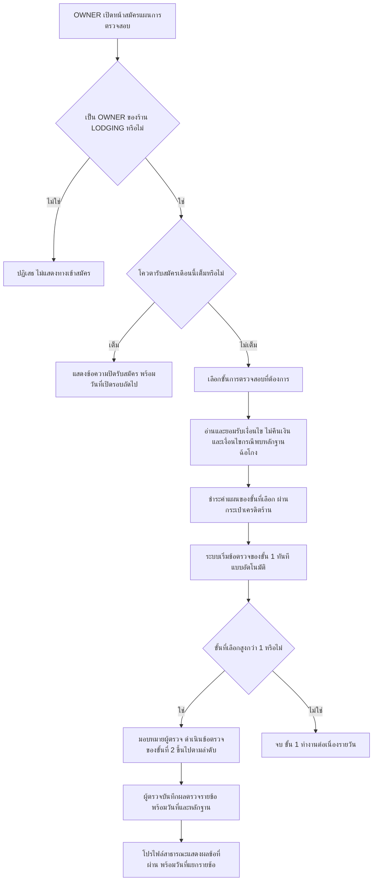
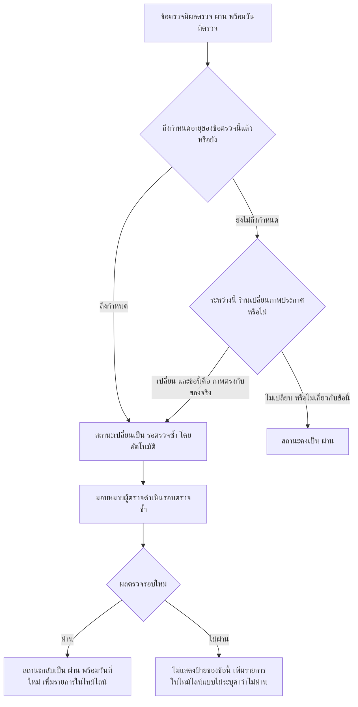
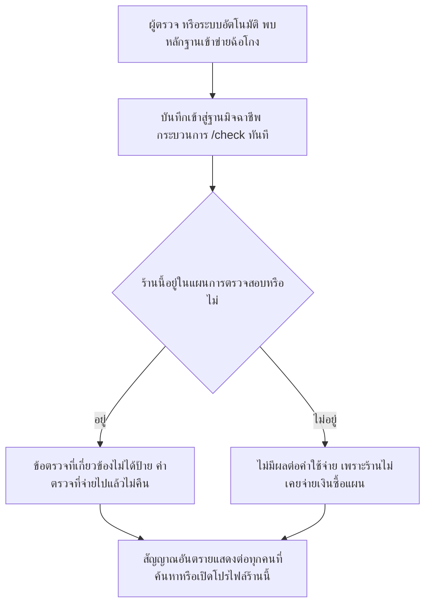

> **โมดูล:** M60-ShopInspection
> **ประเภทเอกสาร:** Business Requirements Document (BRD) - NON-TECHNICAL
> **เวอร์ชัน:** 1.0
> **วันที่จัดทำ:** 2026-08-28
> **สถานะ:** Draft
> **เจ้าของเอกสาร:** BA (ดู [[Feature-Docs-Ownership]])

# BRD: แผนการตรวจสอบต่อเนื่องหน้าร้าน (Shop Inspection Plan) (Business Requirements Document)

---

## 1. บทนำ

### 1.1 วัตถุประสงค์ของเอกสาร

เอกสารนี้มีวัตถุประสงค์เพื่อ:
1. อธิบายความต้องการทางธุรกิจของ "แผนการตรวจสอบต่อเนื่อง" (Shop Inspection Plan) ซึ่งเป็นบริการที่ร้านค้าจ่ายค่าแรงให้ Deep ไปหาข้อเท็จจริงเกี่ยวกับร้านและที่พักของตนอย่างต่อเนื่อง แล้วนำผลไปแสดงบนโปรไฟล์สาธารณะ
2. กำหนดขอบเขตการทำงานรอบแรก คือ ร้านค้าประเภทบ้านพัก (vertical `LODGING`) เท่านั้น และกำหนดข้อจำกัดที่เจตนาวางไว้ (ผูกกับร้าน ไม่ใช่ผูกกับบุคคล)
3. อธิบายเงื่อนไขและกฎทางธุรกิจที่ป้องกันไม่ให้แผนการตรวจสอบกลายเป็น "ป้ายที่ซื้อได้" แทนที่จะเป็น "ผลตรวจที่ได้จากการตรวจจริง"
4. สร้างความเข้าใจร่วมกันระหว่างทีมธุรกิจและทีมพัฒนาว่าอะไรคือสิ่งที่เงินซื้อได้ และอะไรคือสิ่งที่ต้องฟรีและใช้กับทุกร้านเสมอ

### 1.2 ขอบเขตของระบบ

**แผนการตรวจสอบต่อเนื่อง** คือบริการที่ร้านค้าประเภทบ้านพักสมัครและจ่ายเงินเพื่อให้ Deep ดำเนินการตรวจสอบข้อเท็จจริงเกี่ยวกับร้าน เจ้าของร้าน และที่พักอย่างต่อเนื่องตามรอบเวลาที่กำหนด แล้วแสดงผลตรวจเป็นรายข้อบนโปรไฟล์สาธารณะของร้าน **ร้านซื้อ "การตรวจ" ไม่ได้ซื้อ "ป้าย" — ป้ายที่ปรากฏบนโปรไฟล์เกิดจากผลตรวจที่ผ่านจริงเท่านั้น**

**เข้าสู่ระบบ (Input):**
- คำขอสมัคร/อัปเกรดขั้นการตรวจสอบจากเจ้าของร้าน (OWNER)
- เอกสารและหลักฐานที่ร้านส่งให้ผู้ตรวจ (บัตรประชาชน เซลฟี่ เอกสารสิทธิ์ปล่อยเช่า ฯลฯ)
- การนัดหมายวิดีโอคอลนำชมและการลงพื้นที่จริงของผู้ตรวจ
- ผลตรวจที่ผู้ตรวจบันทึกต่อข้อตรวจในแต่ละรอบ
- สัญญาณอัตโนมัติจากระบบภายใน (ฐานมิจฉาชีพ การยืนยันตัวตน อายุบัญชี ความเร็วตอบแชท ข้อร้องเรียน การประกาศซ้ำ)
- เหตุการณ์ "ร้านเปลี่ยนภาพประกาศที่พัก" ที่เกิดขึ้นนอกกระบวนการตรวจ

**ออกจากระบบ (Output):**
- สถานะผลตรวจรายข้อ (5 สถานะ) พร้อมวันที่ของแต่ละข้อ
- การแสดงผลบนโปรไฟล์สาธารณะของร้าน (รายการข้อตรวจ ภาพนิ่งจากวิดีโอคอล อัลบั้มที่ Deep ถ่ายเอง พิกัด ชื่อผู้ตรวจ ไทม์ไลน์ย้อนหลัง)
- สัญญาณอันตรายที่บันทึกในฐานมิจฉาชีพ (แยกเส้นทาง ไม่ผูกกับการซื้อแผน)
- ประวัติการเรียกเก็บเงินค่าตรวจและค่ารักษาแผนผ่านกระเป๋าเครดิตร้าน

**ระบบที่เกี่ยวข้อง:**
- โปรไฟล์สาธารณะร้านค้า (`/u/[username]`, `/b/[slug]`)
- กระเป๋าเครดิตร้าน (Seller Wallet) และรอบบิล 30 วันที่มีอยู่แล้ว
- ฐานมิจฉาชีพ / กระบวนการ `/check`
- ระบบยืนยันตัวตนและ Trust Score (เชื่อมในแง่ "ต้องไม่กระทบ" เท่านั้น — ดู Business Rule 8.1)
- ระบบสิทธิ์ผู้ใช้ตามบทบาทร้าน (OWNER / ADMIN)

### 1.3 กลุ่มผู้ใช้งาน

| กลุ่มผู้ใช้ | บทบาท | สิทธิ์การใช้งาน |
|-----------|--------|----------------|
| **เจ้าของร้านบ้านพัก (OWNER)** | ผู้สมัครและดูแลแผนการตรวจสอบของร้านตนเอง | สมัคร / อัปเกรดขั้นการตรวจสอบ / ส่งเอกสาร / ชำระเงิน / ยกเลิกแผน / ดูสถานะและไทม์ไลน์ทั้งหมดของร้าน |
| **ผู้ช่วยร้าน (ADMIN — `ShopMember` role=ADMIN)** | ผู้ช่วยดูแลร้านที่ไม่ใช่เจ้าของ | ดูสถานะและไทม์ไลน์ของแผนการตรวจสอบเท่านั้น ไม่มีสิทธิ์สมัคร/อัปเกรด/ยกเลิก/ส่งเอกสาร/ชำระเงิน |
| **ผู้ตรวจ (Inspector)** | บุคคลภายนอกที่ Deep มอบหมายให้ดำเนินข้อตรวจของขั้นที่ 2-4 | เข้าถึงเฉพาะข้อมูลของร้านที่ตนได้รับมอบหมาย บันทึกผลตรวจและหลักฐานรายข้อ ไม่เห็นสลิปเงิน/ข้อมูลการเงินของร้าน ไม่เห็นข้อมูลร้านอื่นที่ไม่ได้รับมอบหมาย |
| **ทีมปฏิบัติการ Deep** | ผู้ดูแลกระบวนการตรวจสอบในภาพรวม | กำหนดโควตารับสมัครต่อเดือน มอบหมายผู้ตรวจ ดูแลฐานมิจฉาชีพและกระบวนการ `/check` เข้าถึงหลักฐานปิดของทุกร้านตามความจำเป็นของงาน |
| **ผู้เยี่ยมชม/ผู้ซื้อ (สาธารณะ)** | บุคคลทั่วไปที่เปิดดูโปรไฟล์ร้าน | เห็นเฉพาะผลตรวจที่ผ่านพร้อมวันที่ ภาพนิ่ง อัลบั้ม พิกัด ชื่อผู้ตรวจ และไทม์ไลน์ย้อนหลัง ไม่เห็นหลักฐานปิดหรือสถานะ "รอผู้ตรวจเข้าตรวจ" |

---

## 2. ความต้องการหลัก (Functional Requirements)

### 2.1 คุณสมบัติร้านที่มีสิทธิ์สมัครและบทบาทที่ดำเนินการได้

#### FR-INS-001: ร้านค้าที่มีสิทธิ์สมัครแผนการตรวจสอบ

**User Story:**
> ในฐานะเจ้าของร้านบ้านพักที่ใช้บัญชีส่วนบุคคล (PERSONAL) ฉันต้องการสมัครแผนการตรวจสอบต่อเนื่องได้โดยไม่ต้องซื้อแพ็กเกจธุรกิจก่อน เพื่อให้ร้านของฉันมีผลตรวจแสดงบนโปรไฟล์สาธารณะเหมือนร้านที่จดทะเบียนธุรกิจ

**Acceptance Criteria:**
- [ ] AC-INS-01-1: ระบบอนุญาตให้สมัครแผนการตรวจสอบได้เฉพาะร้านที่มีประเภทร้าน (vertical) เป็น "บ้านพัก" (`LODGING`) เท่านั้นในรอบแรก ร้านประเภทอื่นไม่มีปุ่ม/ทางเข้าสมัคร
- [ ] AC-INS-01-2: ร้านที่เป็นบัญชีส่วนบุคคล (PERSONAL) สมัครแผนการตรวจสอบได้โดยไม่ต้องมี Business Package และไม่มีข้อความใดบังคับให้ซื้อ Business Package ก่อนสมัคร
- [ ] AC-INS-01-3: แผนการตรวจสอบผูกกับ "ร้าน" หนึ่งร้าน ไม่ใช่ผูกกับบัญชีผู้ใช้ — ผู้ใช้ที่มีหลายร้านต้องสมัครแยกทีละร้าน และผลตรวจของร้านหนึ่งไม่ปรากฏบนโปรไฟล์ของอีกร้านหนึ่ง แม้เจ้าของเป็นคนเดียวกัน

#### FR-INS-002: บทบาทที่มีสิทธิ์ดำเนินการต่อแผนการตรวจสอบ

**User Story:**
> ในฐานะผู้ช่วยร้าน (ADMIN) ฉันต้องการดูสถานะแผนการตรวจสอบของร้านได้ เพื่อรับทราบความคืบหน้า แต่ไม่ต้องการให้ตัวเองสามารถสมัคร/ยกเลิก/จ่ายเงินแทนเจ้าของร้านโดยไม่ได้รับอนุญาต

**Acceptance Criteria:**
- [ ] AC-INS-02-1: การสมัคร การอัปเกรดขั้นการตรวจสอบ การส่งเอกสารหลักฐาน การชำระเงิน และการยกเลิกแผนการตรวจสอบ ทำได้เฉพาะผู้ใช้ที่มีบทบาท OWNER ของร้านนั้นเท่านั้น
- [ ] AC-INS-02-2: ผู้ใช้ที่มีบทบาท ADMIN ของร้าน เห็นหน้าจอสถานะแผนการตรวจสอบและไทม์ไลน์ได้ แต่ปุ่มสมัคร/อัปเกรด/ส่งเอกสาร/ชำระเงิน/ยกเลิก ถูกปิดใช้งานหรือไม่แสดงให้ ADMIN
- [ ] AC-INS-02-3: ผู้ใช้ที่ไม่มีบทบาทใดในร้านนั้นเลย (ไม่ใช่ OWNER หรือ ADMIN) ไม่สามารถเข้าถึงหน้าจอจัดการแผนการตรวจสอบของร้านนั้นได้ในทุกกรณี

### 2.2 บันไดขั้นการตรวจสอบ 4 ขั้น

#### FR-INS-003: ขั้นการตรวจสอบที่ 1 — ตรวจต่อเนื่องอัตโนมัติ

**User Story:**
> ในฐานะเจ้าของร้าน ฉันต้องการให้ร้านของฉันถูกตรวจสัญญาณพื้นฐานทุกวันโดยอัตโนมัติ เพื่อให้ผลตรวจของฉันเป็นปัจจุบันเสมอโดยไม่ต้องรอคิวผู้ตรวจ

**Acceptance Criteria:**
- [ ] AC-INS-03-1: ขั้นการตรวจสอบที่ 1 ประกอบด้วยข้อตรวจ 6 ข้อ ได้แก่ (1) ตรวจฐานมิจฉาชีพ (2) ยืนยันเบอร์โทร/ตัวตนขั้นต้น (3) อายุบัญชี (4) ที่พักไม่ถูกประกาศซ้ำโดยบัญชีอื่นบน Deep (5) ความเร็วตอบแชท (6) ข้อร้องเรียน
- [ ] AC-INS-03-2: ข้อตรวจทั้ง 6 ข้อของขั้นที่ 1 ดำเนินการโดยอัตโนมัติ (ไม่ต้องรอผู้ตรวจ) และรันซ้ำทุกวันตราบเท่าที่ร้านยังอยู่ในแผนการตรวจสอบ
- [ ] AC-INS-03-3: ขั้นการตรวจสอบที่ 1 เป็นขั้นต่ำสุดที่ทุกร้านที่สมัครแผนการตรวจสอบต้องมี ไม่มีทางเลือกให้ข้ามขั้นนี้ไปซื้อขั้นที่สูงกว่าโดยไม่มีขั้นที่ 1

#### FR-INS-004: ขั้นการตรวจสอบที่ 2 — ตรวจเอกสาร

**User Story:**
> ในฐานะเจ้าของร้าน ฉันต้องการให้ผู้ตรวจยืนยันตัวตนและสิทธิ์การปล่อยเช่าของฉันจากเอกสารจริง เพื่อให้ผลตรวจของฉันมีน้ำหนักมากกว่าการตรวจอัตโนมัติเพียงอย่างเดียว

**Acceptance Criteria:**
- [ ] AC-INS-04-1: ขั้นการตรวจสอบที่ 2 มีอายุผลตรวจ 12 เดือนนับจากวันที่ผู้ตรวจบันทึกผลผ่าน
- [ ] AC-INS-04-2: ขั้นการตรวจสอบที่ 2 ประกอบด้วยข้อตรวจอย่างน้อย: บัตรประชาชนคู่กับภาพเซลฟี่ตรงกับบุคคลเดียวกัน, ชื่อบัญชีรับเงินตรงกับชื่อเจ้าของร้าน, เอกสารสิทธิ์ปล่อยเช่า (โฉนดหรือสัญญาเช่าหรือหนังสือมอบอำนาจ อย่างใดอย่างหนึ่ง), ใบอนุญาตประกอบกิจการโรงแรมกรณีที่พักเข้าข่ายต้องมีใบอนุญาตตามกฎหมาย
- [ ] AC-INS-04-3: ข้อตรวจ "ใบอนุญาตประกอบกิจการโรงแรม" ของร้านที่ไม่เข้าข่ายต้องมีใบอนุญาตตามกฎหมาย ต้องแสดงสถานะ "ไม่เกี่ยวกับร้านประเภทนี้" ไม่ใช่ "ยังไม่มีข้อมูล" หรือ "ไม่ผ่าน"

#### FR-INS-005: ขั้นการตรวจสอบที่ 3 — ตรวจเห็นของจริง

**User Story:**
> ในฐานะเจ้าของร้าน ฉันต้องการให้ผู้ตรวจเห็นที่พักของฉันสด ๆ ผ่านวิดีโอคอล เพื่อให้ผู้ซื้อมั่นใจว่าที่พักมีอยู่จริงโดยไม่ต้องรอให้ผู้ตรวจเดินทางไปถึงที่

**Acceptance Criteria:**
- [ ] AC-INS-05-1: ขั้นการตรวจสอบที่ 3 มีอายุผลตรวจ 6 เดือน และต้องมีหลักฐานการเปิดใช้งานจริงย้อนหลัง 90 วันประกอบผลตรวจ
- [ ] AC-INS-05-2: ขั้นการตรวจสอบที่ 3 ประกอบด้วยข้อตรวจ: วิดีโอคอลนำชมที่พักแบบสดโดยผู้ตรวจสุ่มขอให้ร้านหมุนกล้องไปยังมุมที่ผู้ตรวจเลือกเองระหว่างคอล (ไม่ใช่มุมที่ร้านเตรียมไว้ล่วงหน้าเท่านั้น) และหลักฐานการเข้าพักย้อนหลัง
- [ ] AC-INS-05-3: การนำชมที่ไม่มีการสุ่มขอมุมระหว่างคอลจากผู้ตรวจ ไม่นับเป็นการตรวจผ่านข้อ "วิดีโอคอลนำชมสด" ของขั้นที่ 3

#### FR-INS-006: ขั้นการตรวจสอบที่ 4 — ตรวจถึงที่

**User Story:**
> ในฐานะเจ้าของร้าน ฉันต้องการให้ผู้ตรวจของ Deep เดินทางไปยืนที่ที่พักของฉันจริงและถ่ายภาพเอง เพื่อให้ผลตรวจของฉันเป็นขั้นสูงสุดที่ผู้ซื้อเชื่อถือได้มากที่สุด

**Acceptance Criteria:**
- [ ] AC-INS-06-1: ขั้นการตรวจสอบที่ 4 มีอายุผลตรวจ 12 เดือน และต้องมีการทวนข้อตรวจของขั้นที่ 3 (วิดีโอคอล/หลักฐานเข้าพัก) ซ้ำทุก 3 เดือนตลอดระยะเวลาที่ร้านอยู่ในขั้นนี้
- [ ] AC-INS-06-2: ขั้นการตรวจสอบที่ 4 ประกอบด้วยข้อตรวจ: ผู้ตรวจไปยืนที่สถานที่จริง, ที่พักมีอยู่จริงตรงตามพิกัดที่ร้านระบุ, ภาพประกาศตรงกับสภาพของจริง, จำนวนและประเภทห้องตรงตามที่ประกาศ, สิ่งอำนวยความสะดวกที่ประกาศไว้มีอยู่จริง, ที่พักเข้าถึงได้จริงตามที่ประกาศ, และอัลบั้มภาพที่ผู้ตรวจของ Deep ถ่ายเองในที่เกิดเหตุ
- [ ] AC-INS-06-3: หากรอบทวนข้อตรวจของขั้นที่ 3 ทุก 3 เดือนไม่เกิดขึ้นภายในกำหนด ข้อตรวจที่เกี่ยวข้องต้องเปลี่ยนสถานะเป็น "รอตรวจซ้ำ" แม้ผลตรวจของขั้นที่ 4 เองจะยังไม่ครบ 12 เดือนก็ตาม

#### FR-INS-007: การซื้อขั้นที่สูงกว่าต้องรวมขั้นที่ต่ำกว่าเสมอ

**User Story:**
> ในฐานะทีมธุรกิจ ฉันต้องการให้ร้านที่ซื้อขั้นการตรวจสอบสูง ต้องมีข้อตรวจของขั้นที่ต่ำกว่าครบด้วยเสมอ เพื่อไม่ให้เกิดกรณีร้านมีผลตรวจขั้น 4 แต่ไม่เคยผ่านการตรวจฐานมิจฉาชีพของขั้น 1

**Acceptance Criteria:**
- [ ] AC-INS-07-1: ร้านที่สมัครขั้นการตรวจสอบที่ N (N = 2, 3 หรือ 4) จะถูกดำเนินข้อตรวจของขั้นที่ 1 ถึง N ทุกขั้นพร้อมกัน ไม่มีทางเลือกให้ซื้อเฉพาะขั้นบนโดยข้ามขั้นล่าง
- [ ] AC-INS-07-2: ร้านอยู่ที่ขั้นการตรวจสอบเดียวในเวลาหนึ่ง และจ่ายค่าแผนของขั้นนั้นเพียงราคาเดียว ไม่ใช่จ่ายซ้อนราคาของทุกขั้นรวมกัน
- [ ] AC-INS-07-3: ร้านที่อยู่ในขั้นการตรวจสอบที่ N อยู่แล้ว และอัปเกรดไปขั้นที่สูงกว่า ไม่ต้องจ่ายซ้ำค่าตรวจของข้อตรวจที่จ่ายไปแล้วและยังไม่หมดอายุ (วิธีคิดส่วนต่างรอเคาะ)

### 2.3 การสมัคร การชำระเงิน และเงื่อนไข

#### FR-INS-008: ขั้นตอนการสมัครและชำระเงิน

**User Story:**
> ในฐานะเจ้าของร้าน ฉันต้องการรู้ชัดเจนว่าฉันกำลังจ่ายเงินให้ Deep ไปตรวจสอบข้อเท็จจริง ไม่ใช่จ่ายเงินเพื่อซื้อป้าย ก่อนที่ฉันจะกดยืนยันจ่ายเงิน

**Acceptance Criteria:**
- [ ] AC-INS-08-1: การชำระค่าตรวจและค่ารักษาแผนหักผ่านกระเป๋าเครดิตร้าน (Seller Wallet) ที่มีอยู่แล้วในระบบ ไม่ใช้ช่องทางชำระเงินอื่น
- [ ] AC-INS-08-2: ค่ารักษาแผนรายเดือนคิดตามรอบบิล 30 วันเดียวกับที่ระบบอื่นของร้านใช้อยู่แล้ว
- [ ] AC-INS-08-3: หากยอดเครดิตในกระเป๋าร้านไม่พอชำระค่ารักษาแผนเมื่อถึงรอบ ระบบต้องแสดงสถานะให้ OWNER เห็นว่าค้างชำระ พร้อมจำนวนวันที่เหลือก่อนแผนถูกปรับเป็นสถานะยกเลิก (จำนวนวันผ่อนผันรอเคาะ)

#### FR-INS-009: โควตารับสมัครต่อเดือน

**User Story:**
> ในฐานะทีมปฏิบัติการ Deep ฉันต้องการจำกัดจำนวนร้านที่รับเข้าแผนการตรวจสอบต่อเดือน เพื่อให้ผู้ตรวจดำเนินการได้ทันตามคุณภาพที่รับปากไว้

**Acceptance Criteria:**
- [ ] AC-INS-09-1: ระบบมีค่ากำหนดโควตาจำนวนร้านใหม่ที่รับสมัครแผนการตรวจสอบได้ต่อเดือน (จำนวนตัวเลขรอเคาะ)
- [ ] AC-INS-09-2: เมื่อโควตาของเดือนนั้นเต็ม หน้าสมัครแสดงข้อความปิดรับสมัครชั่วคราวพร้อมวันที่ที่จะเปิดรับรอบถัดไป โดยไม่ปิดกั้นการเข้าถึงหน้าจอสถานะของร้านที่สมัครไปแล้ว
- [ ] AC-INS-09-3: ระบบห้ามรับสมัครแบบไม่จำกัดจำนวนแล้วปล่อยให้ร้านรอคิวเงียบ ๆ โดยไม่แจ้งวันที่คาดว่าจะเริ่มดำเนินการ

#### FR-INS-010: การแสดงเงื่อนไขไม่คืนเงินและเงื่อนไขฉ้อโกงก่อนกดจ่าย

**User Story:**
> ในฐานะเจ้าของร้าน ฉันต้องการเห็นชัดเจนก่อนกดจ่ายเงินว่าค่าตรวจไม่คืนเงิน และหากผู้ตรวจพบหลักฐานฉ้อโกงระหว่างตรวจจะเกิดอะไรขึ้น เพื่อให้ฉันตัดสินใจโดยรู้ข้อมูลครบ

**Acceptance Criteria:**
- [ ] AC-INS-10-1: หน้าจอยืนยันการชำระเงินของทุกขั้นการตรวจสอบต้องแสดงข้อความอย่างน้อย 2 ประเด็นก่อนปุ่มยืนยันจ่ายเงินเสมอ: (1) ค่าตรวจไม่คืนเงินไม่ว่าผลตรวจจะเป็นอย่างไร (2) หากพบหลักฐานฉ้อโกงระหว่างการตรวจ ร้านจะถูกนำเข้าสู่กระบวนการฐานมิจฉาชีพแยกต่างหาก
- [ ] AC-INS-10-2: ปุ่มยืนยันจ่ายเงินต้องกดไม่ได้จนกว่า OWNER จะรับทราบเงื่อนไขทั้งสองข้อ (เช่น ผ่านการติ๊กยอมรับ)
- [ ] AC-INS-10-3: ข้อความเงื่อนไขนี้ต้องปรากฏซ้ำทุกครั้งที่มีการชำระเงินรอบใหม่ (สมัครครั้งแรก อัปเกรดขั้น ต่ออายุ) ไม่ใช่แสดงครั้งเดียวตอนสมัครครั้งแรกแล้วข้ามไปตลอดกาล

### 2.4 ผลตรวจและสถานะ

#### FR-INS-011: สถานะผลตรวจ 5 สถานะต่อข้อตรวจ

**User Story:**
> ในฐานะผู้เยี่ยมชมโปรไฟล์ร้าน ฉันต้องการรู้ว่าข้อตรวจแต่ละข้อ "ผ่าน" จริงหรือแค่ "ยังไม่เคยตรวจ" เพื่อไม่ให้ฉันเข้าใจผิดว่าร้านมีปัญหาทั้งที่ยังไม่เคยถูกตรวจข้อนั้นเลย

**Acceptance Criteria:**
- [ ] AC-INS-11-1: ทุกข้อตรวจในทุกขั้นการตรวจสอบมีสถานะได้ 1 ใน 5 ค่าเท่านั้น: ผ่าน / ไม่ผ่าน / รอตรวจซ้ำ / ยังไม่มีข้อมูล / ไม่เกี่ยวกับร้านประเภทนี้
- [ ] AC-INS-11-2: สถานะ "รอตรวจซ้ำ", "ยังไม่มีข้อมูล" และ "ไม่เกี่ยวกับร้านประเภทนี้" ต้องแสดงผลและเก็บบันทึกแยกจากสถานะ "ไม่ผ่าน" อย่างชัดเจน ห้ามยุบรวมทั้งสามสถานะนี้เข้ากับ "ไม่ผ่าน" ไม่ว่าจะในหน้าจอใดก็ตาม
- [ ] AC-INS-11-3: การนับสัดส่วน "ข้อที่ตก" ของร้าน (ถ้ามีการนับในหน้าจอใด) ต้องนับเฉพาะข้อที่มีสถานะ "ไม่ผ่าน" เท่านั้น ข้อที่เป็น "รอตรวจซ้ำ", "ยังไม่มีข้อมูล" หรือ "ไม่เกี่ยวกับร้านประเภทนี้" ต้องไม่ถูกนับรวมเป็นข้อที่ตก

#### FR-INS-012: การหมดอายุผลตรวจเปลี่ยนเป็น "รอตรวจซ้ำ" อัตโนมัติ

**User Story:**
> ในฐานะผู้เยี่ยมชมโปรไฟล์ร้าน ฉันไม่ต้องการเห็นคำว่า "ผ่าน" ของข้อตรวจที่ตรวจมาเป็นปีแล้วและไม่เคยถูกตรวจซ้ำเลย

**Acceptance Criteria:**
- [ ] AC-INS-12-1: เมื่อข้อตรวจใดพ้นอายุผลตรวจตามขั้นของมัน (ขั้น 1 = ทุกวัน, ขั้น 2 = 12 เดือน, ขั้น 3 = 6 เดือน, ขั้น 4 = 12 เดือน) สถานะของข้อนั้นต้องเปลี่ยนเป็น "รอตรวจซ้ำ" โดยอัตโนมัติ ไม่ต้องรอผู้ตรวจเข้ามาเปลี่ยนสถานะเอง
- [ ] AC-INS-12-2: ข้อตรวจที่มีสถานะ "รอตรวจซ้ำ" ต้องไม่แสดงเป็น "ผ่าน" ในหน้าจอสาธารณะไม่ว่าในรูปแบบใด (ป้าย ไอคอน ข้อความ)
- [ ] AC-INS-12-3: การเปลี่ยนสถานะเป็น "รอตรวจซ้ำ" เพราะพ้นอายุ ไม่ลบผลตรวจและวันที่ของรอบก่อนหน้าออกจากไทม์ไลน์

#### FR-INS-013: ผลตรวจไม่ผ่านไม่ทำให้แผนการตรวจสอบถูกยกเลิกหรือปรับลดขั้นอัตโนมัติ

**User Story:**
> ในฐานะเจ้าของร้าน ฉันต้องการให้ข้อตรวจข้อใดข้อหนึ่งที่ไม่ผ่านไม่ทำให้แผนการตรวจสอบทั้งหมดของฉันถูกยกเลิกไปเอง เพื่อให้ฉันมีโอกาสแก้ไขและรอตรวจซ้ำในรอบถัดไป

**Acceptance Criteria:**
- [ ] AC-INS-13-1: ข้อตรวจข้อใดข้อหนึ่งมีสถานะ "ไม่ผ่าน" ต้องไม่ทำให้สถานะแผนการตรวจสอบของร้านเปลี่ยนเป็นยกเลิกหรือถูกลดขั้นโดยอัตโนมัติ
- [ ] AC-INS-13-2: ข้อตรวจอื่นในรอบเดียวกันที่มีผลตรวจ "ผ่าน" ยังคงแสดงผล "ผ่าน" ตามปกติ แม้มีข้อตรวจอื่นในรอบเดียวกันไม่ผ่าน

### 2.5 การแสดงผลบนโปรไฟล์สาธารณะ

#### FR-INS-014: รายการข้อตรวจพร้อมวันที่แยกรายข้อ

**User Story:**
> ในฐานะผู้เยี่ยมชมโปรไฟล์ร้าน ฉันต้องการรู้ว่าข้อตรวจแต่ละข้อถูกตรวจเมื่อไหร่ ไม่ใช่เห็นวันที่เดียวรวมทั้งป้าย เพราะบางข้ออาจตรวจมานานแล้วในขณะที่บางข้อเพิ่งตรวจ

**Acceptance Criteria:**
- [ ] AC-INS-14-1: โปรไฟล์สาธารณะแสดงรายการข้อตรวจทุกข้อของทุกขั้นที่ร้านมี พร้อมวันที่ผลตรวจล่าสุดของแต่ละข้อแยกกันเป็นรายข้อ
- [ ] AC-INS-14-2: ห้ามมีการแสดงวันที่เดียวใช้ร่วมกันแทนทั้งป้ายหรือทั้งขั้นการตรวจสอบ เมื่อข้อตรวจภายในขั้นเดียวกันมีวันที่ตรวจต่างกันจริง

#### FR-INS-015: ภาพนิ่งจากวิดีโอคอล อัลบั้มที่ Deep ถ่ายเอง พิกัด และชื่อผู้ตรวจ

**User Story:**
> ในฐานะผู้เยี่ยมชมโปรไฟล์ร้าน ฉันต้องการเห็นหลักฐานภาพจริงที่ Deep เก็บมาเอง ไม่ใช่แค่คำว่า "ผ่าน" ลอย ๆ เพื่อให้ฉันมั่นใจในการตัดสินใจ

**Acceptance Criteria:**
- [ ] AC-INS-15-1: ข้อตรวจของขั้นที่ 3 ที่ผ่าน แสดงภาพนิ่งที่แคปจากวิดีโอคอลนำชมประกอบผลตรวจบนโปรไฟล์สาธารณะ
- [ ] AC-INS-15-2: ข้อตรวจของขั้นที่ 4 ที่ผ่าน แสดงอัลบั้มภาพที่ผู้ตรวจของ Deep ถ่ายเองในสถานที่จริง พร้อมพิกัดที่ผู้ตรวจไปยืนตรวจ และชื่อผู้ตรวจที่ดำเนินการรอบนั้น
- [ ] AC-INS-15-3: ชื่อผู้ตรวจต้องปรากฏคู่กับผลตรวจของขั้นที่ 2, 3 และ 4 ทุกรอบบนโปรไฟล์สาธารณะ ไม่มีรอบใดที่แสดงผลตรวจโดยไม่ระบุผู้ตรวจ

#### FR-INS-016: ไทม์ไลน์ทุกรอบตรวจย้อนหลังพร้อมภาพของแต่ละรอบ

**User Story:**
> ในฐานะผู้เยี่ยมชมโปรไฟล์ร้าน ฉันต้องการดูประวัติการตรวจย้อนหลังทั้งหมด ไม่ใช่แค่ผลล่าสุด เพื่อประเมินว่าร้านนี้ถูกตรวจสอบอย่างสม่ำเสมอจริงหรือไม่

**Acceptance Criteria:**
- [ ] AC-INS-16-1: โปรไฟล์สาธารณะแสดงไทม์ไลน์ของทุกรอบตรวจที่เคยเกิดขึ้นกับร้านนี้ เรียงตามเวลา ไม่จำกัดเฉพาะรอบล่าสุด
- [ ] AC-INS-16-2: แต่ละรายการในไทม์ไลน์แสดงภาพประกอบของรอบนั้น (ภาพนิ่งจากวิดีโอคอลหรืออัลบั้มที่ Deep ถ่ายเอง แล้วแต่ขั้น) ไม่ใช่ข้อความอย่างเดียว
- [ ] AC-INS-16-3: รอบตรวจที่ผลออกมา "ไม่ผ่าน" ก็ต้องปรากฏในไทม์ไลน์ (เพื่อความครบถ้วนของประวัติ) แต่ต้องไม่มีคำว่า "ไม่ผ่าน" ปรากฏเป็นข้อความบนหน้าจอสาธารณะ ให้แสดงในลักษณะที่เป็นกลาง (เช่น รอบตรวจที่ยังไม่มีป้ายให้ในข้อนั้น)

#### FR-INS-017: ข้อมูลที่ปกปิดจากสาธารณะเสมอ

**User Story:**
> ในฐานะเจ้าของร้าน ฉันต้องการมั่นใจว่าเอกสารส่วนตัวที่ฉันส่งให้ Deep (บัตรประชาชน โฉนด บัญชีธนาคาร) จะไม่ถูกเปิดเผยต่อสาธารณะ

**Acceptance Criteria:**
- [ ] AC-INS-17-1: บัตรประชาชน ภาพเซลฟี่ โฉนด สัญญาเช่า ข้อมูลบัญชีธนาคาร และสเตทเมนต์ ต้องไม่ปรากฏบนโปรไฟล์สาธารณะไม่ว่าในรูปแบบใด (รูปภาพ ลิงก์ ข้อความสรุป) — ผู้เยี่ยมชมเห็นได้เพียงผลว่าข้อตรวจที่เกี่ยวข้องผ่านเมื่อวันที่ใด
- [ ] AC-INS-17-2: สถานะ "รอผู้ตรวจเข้าตรวจ" (คิวรอที่ยังไม่มีผลตรวจ) ไม่แสดงบนโปรไฟล์สาธารณะ แสดงให้เห็นได้เฉพาะ OWNER และ ADMIN ของร้านนั้น และผู้ตรวจ/ทีมปฏิบัติการที่เกี่ยวข้องเท่านั้น

#### FR-INS-018: ผลตรวจไม่ผ่านไม่มีป้ายและไม่มีคำว่า "ไม่ผ่าน" บนหน้าสาธารณะ

**User Story:**
> ในฐานะเจ้าของร้าน ฉันต้องการให้ข้อตรวจที่ยังไม่ผ่านของฉันไม่แสดงเป็นข้อความลงโทษบนหน้าโปรไฟล์ เพื่อไม่ให้ผู้ซื้อเข้าใจผิดว่าร้านฉันมีปัญหาความน่าเชื่อถือแบบเดียวกับร้านมิจฉาชีพ

**Acceptance Criteria:**
- [ ] AC-INS-18-1: ข้อตรวจที่มีสถานะ "ไม่ผ่าน" ต้องไม่มีป้ายหรือไอคอนยืนยันแสดงประกอบข้อนั้นบนโปรไฟล์สาธารณะ
- [ ] AC-INS-18-2: ไม่มีคำว่า "ไม่ผ่าน" หรือคำพ้องความหมายเชิงลงโทษปรากฏเป็นข้อความบนหน้าโปรไฟล์สาธารณะสำหรับข้อตรวจของแผนการตรวจสอบ
- [ ] AC-INS-18-3: สีแดงหรือถ้อยคำเชิงลงโทษ (เช่น คำเตือน, สัญลักษณ์อันตราย) สงวนไว้ใช้เฉพาะกับสัญญาณจากฐานมิจฉาชีพเท่านั้น ห้ามใช้กับข้อตรวจของแผนการตรวจสอบที่ไม่ผ่าน

#### FR-INS-019: แถบเทาเมื่อพ้นสถานะแผนการตรวจสอบ

**User Story:**
> ในฐานะผู้เยี่ยมชมโปรไฟล์ร้าน ฉันต้องการรู้ว่าร้านนี้เคยผ่านการตรวจแต่ตอนนี้ไม่ได้อยู่ในแผนแล้ว เพื่อไม่ให้ฉันเข้าใจว่าข้อมูลที่เห็นเป็นปัจจุบัน

**Acceptance Criteria:**
- [ ] AC-INS-19-1: เมื่อร้านหยุดจ่ายค่ารักษาแผนเกินระยะผ่อนผัน หรือ OWNER กดยกเลิกแผนการตรวจสอบ พื้นที่แสดงผลของแผนการตรวจสอบบนโปรไฟล์สาธารณะเปลี่ยนเป็นแถบสีเทา
- [ ] AC-INS-19-2: แถบสีเทาแสดงข้อความ "ไม่ได้อยู่ในแผนการตรวจสอบต่อเนื่องแล้ว" พร้อมวันที่ของข้อมูลล่าสุดที่เคยตรวจ (วันที่ผลตรวจล่าสุดก่อนพ้นสถานะ)
- [ ] AC-INS-19-3: ไทม์ไลน์รอบตรวจทั้งหมดที่เคยเกิดขึ้นก่อนหน้ายังคงแสดงอยู่ครบ ไม่ถูกลบหรือซ่อนเมื่อร้านพ้นสถานะแผนการตรวจสอบ

### 2.6 ผลกระทบต่อ Trust Score และสัญญาณอันตรายฟรี

#### FR-INS-020: แผนการตรวจสอบไม่มีผลต่อ Trust Score, Trust Tier และลำดับผลค้นหา

**User Story:**
> ในฐานะทีมธุรกิจ ฉันต้องการให้แผนการตรวจสอบเป็นบริการเสริมที่ไม่แทรกแซงระบบความน่าเชื่อถือหลักของแพลตฟอร์ม เพื่อรักษาความเป็นกลางของ Trust Score

**Acceptance Criteria:**
- [ ] AC-INS-20-1: การสมัคร อัปเกรดขั้น หรือมีผลตรวจผ่านของแผนการตรวจสอบ ต้องไม่เปลี่ยนค่า Trust Score หรือ Trust Tier ของร้านไม่ว่าทางใด
- [ ] AC-INS-20-2: การยกเลิกหรือมีผลตรวจไม่ผ่านของแผนการตรวจสอบ ต้องไม่ลดค่า Trust Score หรือ Trust Tier ของร้าน
- [ ] AC-INS-20-3: ลำดับการแสดงผลร้านในผลการค้นหาหรือหน้ารายการร้านต้องไม่เปลี่ยนแปลงเพราะการซื้อ อัปเกรด หรือยกเลิกแผนการตรวจสอบ — ร้านไม่สามารถซื้อลำดับผลค้นหาได้ผ่านฟีเจอร์นี้

#### FR-INS-021: สัญญาณอันตรายฟรีใช้กับทุกร้านเสมอ

**User Story:**
> ในฐานะผู้ซื้อ ฉันต้องการได้รับคำเตือนเมื่อร้านที่ฉันกำลังจะซื้อของอยู่ในฐานมิจฉาชีพ ไม่ว่าร้านนั้นจะจ่ายเงินให้ Deep ตรวจสอบหรือไม่ก็ตาม

**Acceptance Criteria:**
- [ ] AC-INS-21-1: การตรวจพบว่าร้านตรงกับข้อมูลในฐานมิจฉาชีพ ต้องแสดงสัญญาณอันตรายบนโปรไฟล์ร้านและ/หรือผลการค้นหา โดยไม่ขึ้นกับว่าร้านนั้นสมัครแผนการตรวจสอบหรือไม่
- [ ] AC-INS-21-2: ร้านที่ไม่ได้สมัครแผนการตรวจสอบเลย ต้องได้รับการตรวจสัญญาณอันตรายในระดับเดียวกับข้อตรวจ "ฐานมิจฉาชีพ" ของขั้นการตรวจสอบที่ 1 (ในแง่ที่ว่าถูกตรวจอยู่เสมอ ไม่ใช่ต้องจ่ายเงินก่อนถึงจะถูกตรวจ)
- [ ] AC-INS-21-3: เงินที่ร้านจ่ายซื้อแผนการตรวจสอบ ไม่ใช่การซื้อการยกเว้นจากสัญญาณอันตราย และไม่มีทางที่การจ่ายเงินจะทำให้สัญญาณอันตรายที่ตรวจพบจริงถูกซ่อนหรือลดระดับลง

#### FR-INS-022: ไม่ยึดสิ่งที่ร้านมีอยู่แล้วฟรีคืน

**User Story:**
> ในฐานะเจ้าของร้านที่เคยผ่านการยืนยันตัวตนขั้นพื้นฐานมาก่อนแล้ว ฉันไม่ต้องการให้สถานะยืนยันตัวตนเดิมของฉันถูกถอดออกเพียงเพราะฉันไม่ได้สมัครหรือยกเลิกแผนการตรวจสอบ

**Acceptance Criteria:**
- [ ] AC-INS-22-1: สถานะ ป้าย หรือข้อมูลที่ร้านมีอยู่แล้วบนโปรไฟล์ก่อนสมัครแผนการตรวจสอบ (เช่น ป้ายยืนยันตัวตนเดิม ยอดออเดอร์ รีวิว) ต้องไม่ถูกถอดหรือซ่อนไปเพราะร้านไม่ซื้อหรือยกเลิกแผนการตรวจสอบ
- [ ] AC-INS-22-2: การยกเลิกแผนการตรวจสอบมีผลเฉพาะต่อการแสดงผลของแผนการตรวจสอบเอง (เปลี่ยนเป็นแถบเทา) ไม่กระทบต่อองค์ประกอบอื่นของโปรไฟล์สาธารณะที่ไม่เกี่ยวข้องกับแผนนี้

### 2.7 การพบหลักฐานฉ้อโกงระหว่างการตรวจ

#### FR-INS-023: เส้นทางแยกเมื่อพบหลักฐานฉ้อโกง

**User Story:**
> ในฐานะทีมปฏิบัติการ Deep ฉันต้องการให้ผู้ตรวจที่พบหลักฐานฉ้อโกงระหว่างการตรวจ ส่งเรื่องเข้าสู่กระบวนการจัดการมิจฉาชีพทันที แทนที่จะบันทึกเป็นแค่ "ข้อตรวจไม่ผ่าน" ธรรมดา

**Acceptance Criteria:**
- [ ] AC-INS-23-1: เมื่อผู้ตรวจหรือระบบอัตโนมัติพบหลักฐานที่เข้าข่ายฉ้อโกงระหว่างกระบวนการตรวจ (ไม่ว่าจะเป็นข้อตรวจของขั้นใด) ระบบต้องบันทึกเข้าสู่กระบวนการฐานมิจฉาชีพ / `/check` แยกต่างหากจากผลตรวจปกติของข้อนั้น
- [ ] AC-INS-23-2: กรณีนี้ต้องไม่ถูกบันทึกเป็นเพียงสถานะ "ไม่ผ่าน" ของข้อตรวจข้อเดียวเท่านั้น ต้องมีการส่งสัญญาณอันตรายตามกลไกเดียวกับ FR-INS-021 ควบคู่กันไปด้วย
- [ ] AC-INS-23-3: การพบหลักฐานฉ้อโกงไม่ก่อให้เกิดสิทธิ์ขอคืนเงินค่าตรวจที่จ่ายไปแล้ว (ดู Business Rule 8.7)

### 2.8 บทบาทผู้ตรวจ

#### FR-INS-024: บทบาทผู้ตรวจแยกจากแอดมินระบบ

**User Story:**
> ในฐานะทีมปฏิบัติการ Deep ฉันต้องการให้ผู้ตรวจซึ่งเป็นบุคคลภายนอกเห็นได้เฉพาะข้อมูลของร้านที่ตนได้รับมอบหมายเท่านั้น เพื่อป้องกันการรั่วไหลข้อมูลร้านอื่นและข้อมูลการเงิน

**Acceptance Criteria:**
- [ ] AC-INS-24-1: บทบาทผู้ตรวจเป็นบทบาทที่แยกจากบทบาทแอดมินระบบ (ทีมปฏิบัติการ Deep) อย่างชัดเจน ไม่ใช่สิทธิ์ระดับเดียวกัน
- [ ] AC-INS-24-2: ผู้ตรวจเข้าถึงได้เฉพาะข้อมูลของร้านที่ตนได้รับมอบหมายให้ดำเนินการตรวจในรอบนั้นเท่านั้น ไม่เห็นรายชื่อหรือข้อมูลของร้านอื่นที่ตนไม่ได้รับมอบหมาย
- [ ] AC-INS-24-3: ผู้ตรวจไม่มีสิทธิ์เข้าถึงข้อมูลการเงินของร้าน (ยอดเครดิต ประวัติการชำระเงิน สลิป) ไม่ว่าจะเป็นร้านที่ตนได้รับมอบหมายหรือไม่ก็ตาม

#### FR-INS-025: ชื่อผู้ตรวจแสดงคู่กับผลตรวจเสมอ

**User Story:**
> ในฐานะผู้เยี่ยมชมโปรไฟล์ร้าน ฉันต้องการรู้ว่าใครเป็นคนตรวจ เพื่อให้ผลตรวจมีความรับผิดชอบที่ตรวจสอบย้อนกลับได้

**Acceptance Criteria:**
- [ ] AC-INS-25-1: ทุกผลตรวจของขั้นที่ 2, 3 และ 4 ที่แสดงบนโปรไฟล์สาธารณะต้องระบุชื่อผู้ตรวจที่ดำเนินการรอบนั้นกำกับไว้เสมอ (ตรงกับ AC-INS-15-3 แต่ยืนยันในระดับกฎบทบาท)
- [ ] AC-INS-25-2: หากผู้ตรวจของรอบใดถูกเปลี่ยน (ผู้ตรวจคนใหม่มาแทนคนเดิม) ระเบียนไทม์ไลน์เก่ายังคงแสดงชื่อผู้ตรวจเดิมของรอบนั้น ไม่ถูกเขียนทับด้วยชื่อผู้ตรวจคนใหม่

### 2.9 การยกเลิกและการเก็บรักษาประวัติ

#### FR-INS-026: การยกเลิกแผนการตรวจสอบ

**User Story:**
> ในฐานะเจ้าของร้าน ฉันต้องการยกเลิกแผนการตรวจสอบได้เมื่อไม่ต้องการต่อแล้ว โดยรู้ล่วงหน้าว่าผลจะเป็นอย่างไรกับโปรไฟล์ของฉัน

**Acceptance Criteria:**
- [ ] AC-INS-26-1: มีเฉพาะ OWNER เท่านั้นที่กดยกเลิกแผนการตรวจสอบของร้านตนเองได้ (สอดคล้อง AC-INS-02-1)
- [ ] AC-INS-26-2: ก่อนยืนยันยกเลิก ระบบต้องแสดงผลลัพธ์ที่จะเกิดขึ้นให้ OWNER อ่านก่อน (โปรไฟล์จะเปลี่ยนเป็นแถบเทา ไทม์ไลน์เดิมยังอยู่ ค่าที่จ่ายไปแล้วไม่คืน)
- [ ] AC-INS-26-3: การยกเลิกมีผลตั้งแต่สิ้นสุดรอบบิลปัจจุบัน ไม่ใช่ตัดสิทธิ์ทันทีกลางรอบที่จ่ายเงินไปแล้ว (ระยะเวลาที่แน่นอนรอเคาะ)

#### FR-INS-027: การเก็บรักษาประวัติรอบตรวจถาวร

**User Story:**
> ในฐานะทีมธุรกิจ ฉันต้องการให้ประวัติการตรวจทุกรอบของทุกร้านถูกเก็บไว้ถาวร แม้ร้านจะลดขั้นหรือยกเลิกแผนไปแล้ว เพื่อรักษาความโปร่งใสของระบบ

**Acceptance Criteria:**
- [ ] AC-INS-27-1: ประวัติรอบตรวจ (ผลตรวจ วันที่ ชื่อผู้ตรวจ หลักฐานที่เกี่ยวข้อง) ต้องไม่ถูกลบเมื่อร้านลดขั้นการตรวจสอบ หรือยกเลิกแผนการตรวจสอบ
- [ ] AC-INS-27-2: แม้โปรไฟล์สาธารณะจะเปลี่ยนเป็นแถบเทาตาม FR-INS-019 ไทม์ไลน์ประวัติเก่ายังคงเข้าถึงได้ตาม AC-INS-19-3
- [ ] AC-INS-27-3: การลดขั้นการตรวจสอบ (เช่น จากขั้น 4 กลับไปขั้น 2) ไม่ลบผลตรวจและประวัติของขั้น 3 และ 4 ที่เคยมี — แสดงเป็นประวัติที่ไม่ทำงานต่อ (ไม่ตรวจซ้ำ) แต่ไม่ถูกลบ

#### FR-INS-028: กฎอุดรูรั่วเรื่องภาพประกาศ

**User Story:**
> ในฐานะทีมธุรกิจ ฉันต้องการให้ข้อตรวจ "ภาพตรงกับของจริง" ตกเป็นรอตรวจซ้ำทันทีที่ร้านเปลี่ยนภาพประกาศ เพื่อป้องกันร้านที่ผ่านการตรวจแล้วสลับภาพเป็นภาพที่ไม่เคยถูกตรวจ

**Acceptance Criteria:**
- [ ] AC-INS-28-1: เมื่อร้านแก้ไขหรืออัปโหลดภาพประกาศที่พักใหม่ ข้อตรวจ "ภาพประกาศตรงกับของจริง" ของขั้นที่ 4 ต้องเปลี่ยนสถานะเป็น "รอตรวจซ้ำ" ทันทีในการบันทึกครั้งเดียวกัน ไม่ใช่รอรอบตรวจถัดไปตามอายุปกติ
- [ ] AC-INS-28-2: การเปลี่ยนสถานะนี้เกิดกับข้อตรวจ "ภาพประกาศตรงกับของจริง" เท่านั้น ไม่กระทบสถานะของข้อตรวจอื่นในรอบเดียวกัน
- [ ] AC-INS-28-3: เมื่อข้อตรวจนี้อยู่ในสถานะ "รอตรวจซ้ำ" เพราะเปลี่ยนภาพ โปรไฟล์สาธารณะยังคงแสดงอัลบั้มภาพที่ Deep ถ่ายเองของรอบก่อนหน้าคู่กับภาพใหม่ของร้านเสมอ เพื่อให้ผู้เยี่ยมชมเปรียบเทียบได้ด้วยตนเอง

---

### 2.10 ขอบเขตของผลตรวจต่อที่พักหลายหลัง

#### FR-INS-029: ขอบเขตผลตรวจผูกตามสิ่งที่ข้อนั้นตรวจ

**User Story:**
> ในฐานะผู้เยี่ยมชมที่กำลังจะจองบ้านพักหลังหนึ่ง ฉันต้องการรู้ว่า Deep ตรวจ **หลังที่ฉันกำลังจะจอง** จริงหรือไม่ ไม่ใช่ตรวจหลังอื่นของร้านเดียวกันแล้วเหมาว่าทุกหลังผ่าน

**Acceptance Criteria:**
- [ ] AC-INS-29-1: ขอบเขตของผลตรวจตัดสินจากสิ่งที่ข้อตรวจนั้นตรวจ ไม่ใช่จากขั้นที่ข้อตรวจนั้นอยู่
- [ ] AC-INS-29-2: ข้อตรวจที่ตรวจตัวร้านหรือตัวเจ้าของ ผูกกับร้าน ใช้ร่วมกับที่พักทุกหลังของร้านนั้นได้ ได้แก่: ฐานมิจฉาชีพ, ยืนยันเบอร์โทร/ตัวตนขั้นต้น, อายุบัญชี, ความเร็วตอบแชท, ข้อร้องเรียน, บัตรประชาชนคู่เซลฟี่, ชื่อบัญชีรับเงินตรงกับเจ้าของ
- [ ] AC-INS-29-3: ข้อตรวจที่ตรวจตัวสถานที่ ผูกกับที่พักรายหลัง ได้แก่: ที่พักไม่ถูกประกาศซ้ำโดยบัญชีอื่น, เอกสารสิทธิ์ปล่อยเช่า, ใบอนุญาตประกอบกิจการโรงแรม, วิดีโอคอลนำชมสด, หลักฐานการเปิดให้บริการจริง, สถานที่มีอยู่จริงตามพิกัด, ภาพประกาศตรงกับของจริง, จำนวนและประเภทห้อง, สิ่งอำนวยความสะดวก, การเข้าถึงได้จริง, อัลบั้มภาพที่ Deep ถ่ายเอง
- [ ] AC-INS-29-4: ที่พักหลังที่ยังไม่เคยถูกตรวจในข้อที่ผูกรายหลัง ต้องแสดงสถานะ "ยังไม่มีข้อมูล" สำหรับข้อนั้น ห้ามสืบทอดผลตรวจ "ผ่าน" จากที่พักหลังอื่นของร้านเดียวกัน และห้ามแสดงเป็น "ไม่ผ่าน"
- [ ] AC-INS-29-5: ข้อตรวจที่ผูกรายหลังต้องมีรอบตรวจ วันที่ ผู้ตรวจ และหลักฐานของตัวเองแยกตามที่พักแต่ละหลัง ไม่ใช้ระเบียนร่วมกันข้ามหลัง

**Example:**
```
ร้าน "บ้านพักริมเขา" มีที่พัก 3 หลัง (A, B, C) ซื้อขั้นการตรวจสอบที่ 4
ผู้ตรวจไปตรวจถึงที่เฉพาะหลัง A และนำชมทางวิดีโอเฉพาะหลัง A

หลัง A → ข้อที่ผูกร้าน: ผ่าน · ข้อที่ผูกรายหลัง: ผ่าน
หลัง B → ข้อที่ผูกร้าน: ผ่าน · ข้อที่ผูกรายหลัง: ยังไม่มีข้อมูล
หลัง C → ข้อที่ผูกร้าน: ผ่าน · ข้อที่ผูกรายหลัง: ยังไม่มีข้อมูล

หลัง B และ C ต้องไม่แสดงว่า "ไม่ผ่าน" และต้องไม่แสดงว่า "ผ่าน"
```

---

## 3. Acceptance Criteria สรุป

### 3.1 บันไดขั้นการตรวจสอบ

**เมื่อระบบทำงานถูกต้อง:**
- ✅ ร้านที่สมัครขั้นใด ได้รับข้อตรวจของทุกขั้นที่ต่ำกว่าครบเสมอ (FR-INS-007)
- ✅ ข้อตรวจของขั้น 1 ทำงานอัตโนมัติทุกวันโดยไม่ต้องรอผู้ตรวจ (FR-INS-003)
- ✅ ข้อตรวจของขั้น 3 มีการสุ่มขอมุมระหว่างวิดีโอคอลจริง ไม่ใช่แค่คลิปที่ร้านเตรียมไว้ (FR-INS-005)
- ✅ ข้อตรวจของขั้น 4 มีการทวนข้อตรวจของขั้น 3 ทุก 3 เดือน (FR-INS-006)

### 3.2 สถานะผลตรวจและความถูกต้องของข้อมูล

**เมื่อผลตรวจพ้นอายุ หรือข้อมูลต้นทางเปลี่ยน:**
- ✅ สถานะเปลี่ยนเป็น "รอตรวจซ้ำ" อัตโนมัติ ไม่แสดง "ผ่าน" ค้างไว้ (FR-INS-012)
- ✅ ข้อตรวจภาพประกาศตกเป็น "รอตรวจซ้ำ" ทันทีที่ร้านเปลี่ยนภาพ (FR-INS-028)
- ✅ สามสถานะ "รอตรวจซ้ำ"/"ยังไม่มีข้อมูล"/"ไม่เกี่ยวกับร้านประเภทนี้" ไม่ถูกยุบรวมกับ "ไม่ผ่าน" ในทุกหน้าจอ (FR-INS-011)

### 3.3 การแสดงผลบนโปรไฟล์สาธารณะ

**เมื่อผู้เยี่ยมชมเปิดโปรไฟล์ร้านที่มีแผนการตรวจสอบ:**
- ✅ เห็นวันที่แยกรายข้อตรวจ ไม่ใช่วันเดียวรวมทั้งป้าย (FR-INS-014)
- ✅ เห็นภาพนิ่ง/อัลบั้ม/พิกัด/ชื่อผู้ตรวจของข้อตรวจที่เกี่ยวข้อง (FR-INS-015)
- ✅ เห็นไทม์ไลน์ทุกรอบตรวจย้อนหลังพร้อมภาพ (FR-INS-016)
- ✅ ไม่เห็นหลักฐานปิดและไม่เห็นสถานะ "รอผู้ตรวจเข้าตรวจ" (FR-INS-017)
- ✅ ไม่เห็นคำว่า "ไม่ผ่าน" หรือป้ายของข้อที่ไม่ผ่าน (FR-INS-018)

### 3.4 ความเป็นกลางต่อ Trust Score และสัญญาณอันตรายฟรี

**เมื่อร้านซื้อ ไม่ซื้อ หรือยกเลิกแผนการตรวจสอบ:**
- ✅ Trust Score, Trust Tier และลำดับผลค้นหาไม่เปลี่ยนแปลงในทุกกรณี (FR-INS-020)
- ✅ สัญญาณอันตรายจากฐานมิจฉาชีพยังคงทำงานกับร้านที่ไม่ได้ซื้อแผนเหมือนร้านที่ซื้อ (FR-INS-021)
- ✅ สิ่งที่ร้านมีอยู่แล้วฟรีก่อนหน้าไม่ถูกยึดคืนเพราะไม่ซื้อหรือยกเลิกแผน (FR-INS-022)

### 3.5 ขอบเขตผลตรวจต่อที่พักหลายหลัง

**เมื่อร้านมีที่พักมากกว่าหนึ่งหลัง:**
- ✅ ข้อที่ตรวจตัวร้าน/เจ้าของใช้ร่วมทุกหลัง · ข้อที่ตรวจสถานที่ปรากฏเฉพาะหลังที่ตรวจจริง (FR-INS-029)
- ✅ หลังที่ยังไม่ถูกตรวจแสดง "ยังไม่มีข้อมูล" ไม่ใช่สืบทอด "ผ่าน" และไม่ใช่ "ไม่ผ่าน" (FR-INS-029)

---

## 4. Business Flows (กระบวนการทำงาน)

### 4.1 Flow หลัก: การสมัครและเริ่มดำเนินการตรวจ



### 4.2 Flow ย่อย: การเปลี่ยนสถานะผลตรวจตามอายุและการเปลี่ยนภาพประกาศ



### 4.3 Flow ย่อย: เส้นทางเมื่อพบหลักฐานฉ้อโกงระหว่างการตรวจ



---

## 5. Use Case Scenarios (สถานการณ์การใช้งานจริง)

### Scenario 1: บ้านพักใหม่ไม่เคยมีออเดอร์ สมัครขั้นการตรวจสอบที่ 3

**ผู้เกี่ยวข้อง:** OWNER (บัญชี PERSONAL), ผู้ตรวจ

**เงื่อนไขเริ่มต้น:**
- ร้าน vertical `LODGING` เพิ่งเปิด ยังไม่เคยมีออเดอร์บน Deep เลย และยังไม่เคยสมัครแผนการตรวจสอบ

**ขั้นตอน:**
1. OWNER เข้าเมนูแผนการตรวจสอบ เลือกขั้นการตรวจสอบที่ 3
2. อ่านและยอมรับเงื่อนไขไม่คืนเงิน + เงื่อนไขกรณีพบหลักฐานฉ้อโกง แล้วชำระค่าแผนของขั้นที่ 3 ผ่านกระเป๋าเครดิตร้าน
3. ระบบเริ่มข้อตรวจของขั้น 1 ทันทีแบบอัตโนมัติ
4. ผู้ตรวจดำเนินข้อตรวจของขั้น 2 (เอกสาร) จนครบและบันทึกผลผ่าน
5. ผู้ตรวจนัดวิดีโอคอลนำชม สุ่มขอมุมเพิ่มระหว่างคอล และขอหลักฐานการเข้าพักย้อนหลัง 90 วัน
6. ผู้ตรวจบันทึกผลผ่านทุกข้อของขั้น 3 พร้อมวันที่และภาพนิ่งจากวิดีโอคอล

**ผลลัพธ์:**
- โปรไฟล์สาธารณะของร้านแสดงรายการข้อตรวจของขั้น 1-3 ที่ผ่าน พร้อมวันที่แยกรายข้อ ภาพนิ่งจากวิดีโอคอล และชื่อผู้ตรวจ
- Trust Score, Trust Tier และลำดับผลค้นหาของร้านไม่เปลี่ยนแปลง แม้ร้านไม่เคยมีออเดอร์มาก่อน

### Scenario 2: ร้านซื้อขั้นการตรวจสอบที่ 4 แต่ผู้ตรวจพบจำนวนห้องไม่ตรงประกาศ

**ผู้เกี่ยวข้อง:** OWNER, ผู้ตรวจ

**เงื่อนไขเริ่มต้น:**
- ร้านสมัครและชำระเงินขั้นการตรวจสอบที่ 4 แล้ว กำลังรอผู้ตรวจลงพื้นที่จริง

**ขั้นตอน:**
1. ผู้ตรวจเดินทางไปยังพิกัดที่ร้านระบุ ยืนยันว่าที่พักมีอยู่จริงตรงตามพิกัด
2. ผู้ตรวจนับจำนวนและประเภทห้องเทียบกับที่ประกาศไว้ พบว่าจำนวนห้องจริงน้อยกว่าที่ประกาศ
3. ผู้ตรวจบันทึกข้อ "จำนวนและประเภทห้องตรงตามประกาศ" เป็นสถานะ "ไม่ผ่าน" พร้อมหลักฐาน
4. ผู้ตรวจบันทึกข้อตรวจอื่นของขั้น 4 (สถานที่จริงตามพิกัด, สิ่งอำนวยความสะดวก, การเข้าถึงได้จริง, อัลบั้มภาพที่ถ่ายเอง) เป็นสถานะ "ผ่าน" ตามที่ตรวจพบจริง

**ผลลัพธ์:**
- โปรไฟล์สาธารณะแสดงเฉพาะข้อที่มีสถานะ "ผ่าน" ไม่มีป้ายของข้อ "จำนวนและประเภทห้องตรงตามประกาศ" และไม่มีคำว่า "ไม่ผ่าน" ปรากฏบนหน้าโปรไฟล์
- แผนการตรวจสอบของร้านยังคงอยู่ในขั้น 4 ต่อ ไม่ถูกยกเลิกหรือปรับลดขั้นอัตโนมัติเพราะมีข้อตรวจข้อเดียวไม่ผ่าน
- ค่าตรวจของรอบนี้ที่จ่ายไปแล้วไม่คืน เนื่องจากค่าแรงการตรวจเกิดขึ้นแล้วไม่ว่าผลจะเป็นอย่างไร

### Scenario 3: ร้านผ่านขั้น 4 แล้วเปลี่ยนภาพประกาศหลังจากนั้น 2 สัปดาห์

**ผู้เกี่ยวข้อง:** OWNER

**เงื่อนไขเริ่มต้น:**
- ร้านผ่านครบทุกข้อของขั้น 1-4 รวมถึงข้อ "ภาพประกาศตรงกับของจริง" (สถานะ ผ่าน)

**ขั้นตอน:**
1. หลังผ่านการตรวจ 2 สัปดาห์ OWNER แก้ไข/อัปโหลดภาพประกาศที่พักใหม่แทนภาพเดิม
2. ระบบตรวจพบการเปลี่ยนแปลงภาพประกาศทันที

**ผลลัพธ์:**
- ข้อตรวจ "ภาพประกาศตรงกับของจริง" เปลี่ยนสถานะเป็น "รอตรวจซ้ำ" ทันที โดยข้อตรวจอื่นของขั้น 4 ไม่เปลี่ยนแปลง
- โปรไฟล์สาธารณะยังคงแสดงอัลบั้มภาพที่ Deep ถ่ายเองของรอบก่อนหน้าคู่กับภาพใหม่ของร้าน เพื่อให้ผู้เยี่ยมชมเปรียบเทียบเองได้
- ระบบมอบหมายผู้ตรวจให้เข้าตรวจซ้ำเฉพาะข้อนี้ในรอบถัดไป

### Scenario 4: ร้านเลิกต่ออายุแผนการตรวจสอบ

**ผู้เกี่ยวข้อง:** OWNER

**เงื่อนไขเริ่มต้น:**
- ร้านอยู่ในแผนการตรวจสอบขั้น 2 ครบกำหนดรอบบิล แต่ OWNER กดยกเลิกแผน (ไม่ชำระค่ารักษาแผนรอบใหม่)

**ขั้นตอน:**
1. OWNER กดยกเลิกแผนการตรวจสอบ อ่านผลลัพธ์ที่ระบบแจ้งล่วงหน้าแล้วยืนยัน
2. ระบบหยุดข้อตรวจอัตโนมัติของขั้น 1 และหยุดมอบหมายผู้ตรวจรอบใหม่ของขั้น 2 เมื่อสิ้นสุดรอบบิลปัจจุบัน

**ผลลัพธ์:**
- พื้นที่แสดงผลแผนการตรวจสอบบนโปรไฟล์สาธารณะเปลี่ยนเป็นแถบเทา แสดงข้อความ "ไม่ได้อยู่ในแผนการตรวจสอบต่อเนื่องแล้ว" พร้อมวันที่ของผลตรวจล่าสุดก่อนยกเลิก
- ไทม์ไลน์รอบตรวจเก่าทั้งหมดของขั้น 1 และ 2 ยังคงแสดงอยู่ครบ ไม่ถูกลบ
- Trust Score และ Trust Tier ของร้านไม่เปลี่ยนแปลง

### Scenario 5: ร้านไม่เคยซื้อแผนการตรวจสอบเลย แล้วระบบพบว่าอยู่ในฐานมิจฉาชีพ

**ผู้เกี่ยวข้อง:** ร้านค้าใด ๆ (ไม่จำกัดเฉพาะ vertical `LODGING`), ทีมปฏิบัติการ Deep

**เงื่อนไขเริ่มต้น:**
- ร้านไม่เคยสมัครแผนการตรวจสอบต่อเนื่องเลย

**ขั้นตอน:**
1. ระบบตรวจพบหรือได้รับรายงานว่าร้านนี้ตรงกับข้อมูลในฐานมิจฉาชีพ
2. ระบบบันทึกสัญญาณอันตรายทันที โดยไม่ต้องรอให้ร้านสมัครแผนการตรวจสอบก่อน

**ผลลัพธ์:**
- สัญญาณอันตรายแสดงต่อผู้ที่ค้นหาหรือเปิดโปรไฟล์ร้านนี้ทุกคน โดยไม่ขึ้นกับสถานะการซื้อแผนการตรวจสอบของร้าน
- ร้านนี้ไม่มีพื้นที่แสดงผล "ตรวจแล้ววันนี้ สะอาด" เพราะไม่เคยซื้อแผน แต่สัญญาณอันตรายยังคงทำงานเต็มรูปแบบ ยืนยันว่าเงินไม่ได้เป็นเงื่อนไขของการเตือนภัย

---

## 6. ความต้องการด้านคุณภาพ (Quality Requirements)

### 6.1 ความถูกต้องของข้อมูล
- ห้ามแสดงสถานะ "ผ่าน" กับข้อตรวจที่พ้นอายุผลตรวจของขั้นนั้นแล้ว ต้องเปลี่ยนเป็น "รอตรวจซ้ำ" เสมอ (อ้าง FR-INS-012)
- สถานะ 5 แบบต้องแสดงผลแยกกันชัดเจนในทุกหน้าจอที่เกี่ยวข้อง ห้ามยุบรวมกันเพื่อความง่ายในการแสดงผล (อ้าง FR-INS-011)

### 6.2 ความรวดเร็ว
- การเปลี่ยนสถานะข้อตรวจ "ภาพประกาศตรงกับของจริง" เป็น "รอตรวจซ้ำ" เมื่อร้านเปลี่ยนภาพ ต้องเกิดขึ้นทันทีในการบันทึกครั้งเดียวกับที่ร้านอัปโหลดภาพใหม่ ไม่ใช่รอรอบตรวจสอบเป็นระยะถัดไป (อ้าง FR-INS-028)
- ข้อความปิดรับสมัครเมื่อโควตาเต็มต้องแสดงทันทีที่ OWNER เปิดหน้าสมัคร ไม่ปล่อยให้กดจ่ายเงินไปก่อนแล้วค่อยแจ้งว่าเต็มโควตาภายหลัง (อ้าง FR-INS-009)

### 6.3 ความน่าเชื่อถือ
- ผลตรวจของขั้น 2, 3, 4 ทุกรอบต้องมีชื่อผู้ตรวจกำกับเสมอ ไม่มีรอบใดที่ผลตรวจไม่ระบุตัวผู้รับผิดชอบ (อ้าง FR-INS-025)
- ไทม์ไลน์ประวัติรอบตรวจต้องคงอยู่ถาวรแม้ร้านลดขั้นหรือยกเลิกแผน เพื่อให้ผู้ซื้อตรวจสอบย้อนหลังความสม่ำเสมอของการตรวจได้จริง ไม่ใช่แค่ผลล่าสุด (อ้าง FR-INS-027)

### 6.4 ความปลอดภัย
- หลักฐานปิด (บัตรประชาชน เซลฟี่ โฉนด สัญญาเช่า ข้อมูลบัญชีธนาคาร สเตทเมนต์) เข้าถึงได้เฉพาะผู้ตรวจที่ได้รับมอบหมายต่อร้านนั้นและทีมปฏิบัติการ Deep เท่านั้น ห้ามปรากฏบนโปรไฟล์สาธารณะไม่ว่าในรูปแบบใด (อ้าง FR-INS-017)
- ผู้ตรวจซึ่งเป็นบุคคลภายนอก ต้องไม่มีทางเข้าถึงข้อมูลการเงินของร้านหรือข้อมูลของร้านอื่นที่ไม่ได้รับมอบหมาย (อ้าง FR-INS-024)

### 6.5 ความสะดวกในการใช้งาน (Usability)
- ทุกหน้าจอที่แสดงผลตรวจต้องสื่อสารชัดเจนว่าผลตรวจเป็น "ข้อเท็จจริง ณ วันที่ตรวจ" ไม่ใช่การรับประกันคุณภาพหรือรับประกันอนาคต เพื่อป้องกันผู้ซื้อตีความผิดว่าเป็นการควบคุมคุณภาพของ Deep
- เงื่อนไขไม่คืนเงินและเงื่อนไขกรณีพบหลักฐานฉ้อโกงต้องอ่านเข้าใจได้ในหน้าจอเดียวก่อนกดจ่ายเงิน ไม่ต้องเปิดเอกสารแยกเพิ่มเติม (อ้าง FR-INS-010)

---

## 7. ข้อจำกัด (Constraints)

### 7.1 ข้อจำกัดทางธุรกิจ
- ขอบเขตรอบแรกจำกัดเฉพาะร้านค้าประเภทบ้านพัก (vertical `LODGING`) เท่านั้น ร้านประเภทอื่นยังไม่มีสิทธิ์สมัครแผนการตรวจสอบในรอบนี้
- แผนการตรวจสอบผูกกับ "ร้าน" หนึ่งร้านเสมอ ไม่ใช่ผูกกับบุคคล ร้านหลายแห่งของเจ้าของคนเดียวต้องสมัครและจ่ายแยกกัน
- ราคาค่าแผนของแต่ละขั้น ค่าแรกเข้าของขั้นที่ 4 จำนวนโควตารับสมัครต่อเดือน และระยะเวลาผ่อนผันก่อนยกเลิกแผนเพราะค้างชำระ ยังไม่ได้กำหนด (รอเคาะ)
- แผนการตรวจสอบเป็นบริการที่แยกขาดจากระบบ Trust Score/Trust Tier และการจัดลำดับผลค้นหาโดยเจตนา ห้ามนำมาผูกกันในอนาคตโดยไม่ผ่านการตัดสินใจทางธุรกิจใหม่

### 7.2 ข้อจำกัดทางเทคนิค
- ต้องมีกลไกเก็บภาพนิ่งจากวิดีโอคอล อัลบั้มภาพที่ผู้ตรวจถ่ายเอง และพิกัด โดยผูกกับรอบตรวจแต่ละรอบแยกจากกัน เพื่อรองรับการแสดงไทม์ไลน์ย้อนหลังทุกรอบ
- ต้องรองรับการเชื่อมต่อกับกระเป๋าเครดิตร้าน (Seller Wallet) และรอบบิล 30 วันที่มีอยู่แล้วในระบบ โดยไม่สร้างช่องทางชำระเงินใหม่
- ต้องรองรับสิทธิ์การเข้าถึงข้อมูลแยกตามบทบาทผู้ตรวจ ซึ่งเป็นบุคคลภายนอกที่ไม่ใช่แอดมินระบบเดิม โดยจำกัดขอบเขตการมองเห็นเฉพาะร้านที่ได้รับมอบหมาย

---

## 8. กฎทางธุรกิจ (Business Rules)

### 8.1 กฎความเป็นกลางต่อ Trust Score และผลการค้นหา
- แผนการตรวจสอบต่อเนื่องไม่มีผลต่อ Trust Score หรือ Trust Tier ของร้านไม่ว่ากรณีใด ไม่ว่าจะสมัคร อัปเกรด ยกเลิก หรือมีผลตรวจไม่ผ่าน
- ลำดับผลการค้นหาซื้อไม่ได้ผ่านแผนการตรวจสอบ การสมัครหรืออัปเกรดขั้นการตรวจสอบไม่มีผลเปลี่ยนลำดับที่ร้านปรากฏในผลการค้นหา

### 8.2 กฎสัญญาณอันตรายฟรี
- สัญญาณอันตราย (เช่น การตรงกับฐานมิจฉาชีพ) ใช้กับทุกร้านเสมอ และเป็นบริการฟรี ไม่ขึ้นกับการซื้อแผนการตรวจสอบ
- ร้านที่ไม่ซื้อแผนการตรวจสอบแล้วถูกพบว่าอยู่ในฐานมิจฉาชีพ ต้องได้รับการแสดงสัญญาณอันตรายเช่นเดียวกับร้านที่ซื้อแผน ระบบต้องไม่เงียบเรื่องนี้
- สิ่งที่เงินซื้อได้คือการแสดงผลว่า "ตรวจแล้ววันนี้ สะอาด" (ผลตรวจเชิงบวกที่ยืนยันด้วยรอบตรวจจริง) ไม่ใช่การซื้อการปิดปากหรือการยกเว้นจากสัญญาณอันตราย

### 8.3 กฎการไม่ยึดคืนสิ่งที่ร้านมีอยู่แล้วฟรี
- สิ่งที่ร้านมีอยู่แล้วก่อนสมัครแผนการตรวจสอบ (เช่น ป้ายยืนยันตัวตนเดิม สถิติร้าน) ต้องไม่ถูกยึดคืนหรือซ่อนไปเพียงเพราะร้านไม่สมัครหรือยกเลิกแผนการตรวจสอบ

### 8.4 กฎอายุผลตรวจและการยกเลิก
- ผลตรวจของแต่ละข้อมีอายุตามขั้น: ขั้น 1 ทุกวัน, ขั้น 2 = 12 เดือน, ขั้น 3 = 6 เดือน (พร้อมหลักฐานเข้าพัก 90 วัน), ขั้น 4 = 12 เดือน โดยต้องทวนข้อตรวจของขั้น 3 ซ้ำทุก 3 เดือน
- เมื่อข้อตรวจใดพ้นอายุ สถานะเปลี่ยนเป็น "รอตรวจซ้ำ" โดยอัตโนมัติ ไม่ใช่คงค้างเป็น "ผ่าน"
- เมื่อร้านเลิกจ่ายค่ารักษาแผนหรือยกเลิกแผน โปรไฟล์เปลี่ยนเป็นแถบเทา แสดงข้อความ "ไม่ได้อยู่ในแผนการตรวจสอบต่อเนื่องแล้ว" พร้อมวันที่ของข้อมูลล่าสุด
- ประวัติรอบตรวจทั้งหมดไม่ถูกลบ แม้ร้านจะลดขั้นการตรวจสอบหรือยกเลิกแผนไปแล้ว

### 8.5 กฎลักษณะของข้อตรวจ
- ทุกข้อตรวจเป็นการยืนยันข้อเท็จจริง ณ วันที่ตรวจ (เช่น "มีอยู่จริง" "ตรงตามประกาศ") ไม่ใช่การตัดสินคุณภาพ (เช่น "สวยหรือไม่" "คุ้มค่าหรือไม่")
- สีแดงหรือถ้อยคำเชิงลงโทษสงวนไว้เฉพาะสัญญาณเรื่องมิจฉาชีพเท่านั้น ห้ามใช้กับข้อตรวจของแผนการตรวจสอบที่มีสถานะ "ไม่ผ่าน"

### 8.6 กฎเรื่องภาพประกาศ
- เมื่อร้านเปลี่ยนภาพประกาศเมื่อไร ข้อตรวจ "ภาพประกาศตรงกับของจริง" ต้องตกเป็นสถานะ "รอตรวจซ้ำ" โดยอัตโนมัติทันที
- ภาพที่ผู้ตรวจของ Deep ถ่ายเองต้องแสดงคู่กับภาพประกาศปัจจุบันของร้านเสมอ เพื่อให้ผู้เยี่ยมชมเปรียบเทียบได้ด้วยตนเอง

### 8.7 กฎเรื่องเงินและการดำเนินงาน
- ค่าตรวจต่อรอบจ่ายครั้งเดียวและไม่คืนเงินไม่ว่าผลตรวจจะเป็นอย่างไร เพราะค่าแรงของการตรวจเกิดขึ้นไปแล้ว
- ค่ารักษาแผนเรียกเก็บรายเดือนตามรอบบิล 30 วันที่มีอยู่แล้ว ผ่านกระเป๋าเครดิตร้าน
- เมื่อผู้ตรวจพบหลักฐานฉ้อโกงระหว่างการตรวจ กรณีนั้นถูกส่งเข้ากระบวนการฐานมิจฉาชีพ / `/check` แยกต่างหากจากผลตรวจปกติ และไม่ก่อให้เกิดสิทธิ์คืนเงิน
- ต้องมีโควตารับสมัครต่อเดือน และเมื่อโควตาเต็มต้องปิดรับสมัครพร้อมแจ้งวันที่เปิดรับรอบถัดไปเสมอ ห้ามรับสมัครไม่จำกัดจำนวนแล้วปล่อยให้รอคิวโดยไม่มีกำหนด
- ผลตรวจไม่ผ่านของข้อใดข้อหนึ่ง ทำให้ร้านได้ผลตรวจเท่าที่ผ่านจริงเท่านั้น ไม่มีป้ายในข้อที่ตก และห้ามแสดงคำว่า "ไม่ผ่าน" บนโปรไฟล์สาธารณะ

### 8.8 กฎเรื่องสิทธิ์และบทบาท
- มีเฉพาะผู้ใช้ที่มีบทบาท OWNER ของร้านเท่านั้นที่สมัคร อัปเกรด ส่งเอกสาร ชำระเงิน หรือยกเลิกแผนการตรวจสอบได้
- ผู้ใช้ที่มีบทบาท ADMIN ของร้านดูสถานะและไทม์ไลน์ได้ แต่ไม่มีสิทธิ์ดำเนินการใด ๆ ข้างต้น
- บทบาทผู้ตรวจแยกจากแอดมินระบบโดยสมบูรณ์ ผู้ตรวจเป็นบุคคลภายนอกที่เห็นได้เฉพาะข้อมูลของร้านที่ตนได้รับมอบหมาย ห้ามเห็นสลิปเงินหรือข้อมูลร้านอื่น
- ชื่อผู้ตรวจต้องแสดงคู่กับผลตรวจบนโปรไฟล์สาธารณะเสมอในทุกรอบของขั้น 2, 3 และ 4

### 8.9 กฎขอบเขตผลตรวจต่อที่พักหลายหลัง
- ขอบเขตของผลตรวจผูกตาม **สิ่งที่ข้อนั้นตรวจ** ไม่ใช่ตามขั้นที่ข้อนั้นอยู่
- ข้อที่ตรวจตัวร้าน/เจ้าของ (ฐานมิจฉาชีพ ตัวตน บัญชีรับเงิน ความเร็วตอบแชท ข้อร้องเรียน อายุบัญชี) ผูกกับร้าน
- ข้อที่ตรวจตัวสถานที่ (เอกสารสิทธิ์ปล่อยเช่า ใบอนุญาตโรงแรม การประกาศซ้ำ วิดีโอคอลนำชม หลักฐานการเปิดจริง และข้อตรวจถึงที่ทั้งหมด) ผูกกับที่พักรายหลัง ห้ามให้ผลของหลังหนึ่งครอบไปถึงหลังอื่น
- ที่พักที่ยังไม่เคยถูกตรวจในข้อที่ผูกรายหลัง แสดง "ยังไม่มีข้อมูล" เสมอ ไม่ใช่ "ไม่ผ่าน"

---

## 9. อภิธานศัพท์ (Glossary)

| คำศัพท์ | ความหมาย |
|---------|----------|
| **แผนการตรวจสอบ** | บริการที่ร้านค้าจ่ายเงินให้ Deep ดำเนินการตรวจสอบข้อเท็จจริงเกี่ยวกับร้านอย่างต่อเนื่องตามรอบเวลาที่กำหนด (ห้ามเรียกว่า "แพ็กเกจ") |
| **ขั้นการตรวจสอบ** | บันไดของแผนการตรวจสอบ มี 4 ขั้น (1 ตรวจต่อเนื่องอัตโนมัติ, 2 ตรวจเอกสาร, 3 ตรวจเห็นของจริง, 4 ตรวจถึงที่) ขั้นบนรวมข้อตรวจของขั้นล่างเสมอ (ห้ามเรียกว่า "ระดับ" หรือ "Level/Tier") |
| **ข้อตรวจ** | รายการย่อยหนึ่งรายการภายในขั้นการตรวจสอบที่มีผลตรวจของตัวเองแยกจากข้ออื่น (เช่น "ยืนยันเบอร์โทร" หรือ "ภาพประกาศตรงกับของจริง") |
| **ผลตรวจ** | สถานะของข้อตรวจหนึ่งข้อ ณ เวลาหนึ่ง มี 5 ค่า: ผ่าน / ไม่ผ่าน / รอตรวจซ้ำ / ยังไม่มีข้อมูล / ไม่เกี่ยวกับร้านประเภทนี้ |
| **รอบตรวจ** | การดำเนินการตรวจครั้งหนึ่งของข้อตรวจหนึ่งข้อหรือชุดข้อตรวจ ซึ่งให้ผลตรวจและวันที่ใหม่ บันทึกเป็นรายการในไทม์ไลน์ |
| **ผู้ตรวจ** | บุคคลที่ Deep มอบหมายให้ดำเนินข้อตรวจของขั้น 2-4 เป็นบทบาทแยกจากแอดมินระบบ |
| **หลักฐาน** | ข้อมูลหรือสื่อที่ใช้ยืนยันผลตรวจของข้อตรวจหนึ่งข้อ เช่น เอกสารสิทธิ์ปล่อยเช่า ภาพนิ่งจากวิดีโอคอล อัลบั้มภาพที่ผู้ตรวจถ่ายเอง แบ่งเป็นหลักฐานปิด (ไม่แสดงสาธารณะ) และหลักฐานสาธารณะ (แสดงได้) |
| **ฐานมิจฉาชีพ** | ฐานข้อมูลรายชื่อ/ข้อมูลที่ Deep ใช้ตรวจสอบว่าร้านหรือบุคคลเข้าข่ายมิจฉาชีพหรือไม่ ทำงานฟรีกับทุกร้าน ไม่ขึ้นกับแผนการตรวจสอบ |
| **/check** | กระบวนการจัดการกรณีพบหลักฐานฉ้อโกง แยกเส้นทางจากผลตรวจปกติของแผนการตรวจสอบ |
| **สัญญาณอันตราย** | ข้อมูลเตือนภัยที่แสดงเมื่อร้านตรงกับฐานมิจฉาชีพหรือเข้าข่ายฉ้อโกง ใช้ฟรีกับทุกร้าน แยกขาดจากผลตรวจของแผนการตรวจสอบ |
| **OWNER** | บทบาทเจ้าของร้าน มีสิทธิ์สูงสุดในการจัดการแผนการตรวจสอบของร้านนั้น |
| **ADMIN (ของร้าน)** | บทบาทผู้ช่วยร้าน เห็นสถานะแผนการตรวจสอบได้แต่ไม่มีสิทธิ์ดำเนินการ |
| **LODGING** | ประเภทร้านค้า "บ้านพัก" ซึ่งเป็นขอบเขตรอบแรกของแผนการตรวจสอบต่อเนื่อง |

---

## 10. สรุป

เอกสาร BRD นี้อธิบายความต้องการหลักของ **แผนการตรวจสอบต่อเนื่องหน้าร้าน (Shop Inspection Plan)** แบบไม่ใช่เทคนิค

**จุดเด่นของระบบ:**
- ร้านซื้อ "การตรวจ" ไม่ใช่ "ป้าย" — ป้ายทุกใบเกิดจากผลตรวจที่ผ่านจริงเท่านั้น
- บันได 4 ขั้นออกแบบให้ขั้นบนกินขั้นล่างเสมอ ป้องกันการซื้อความน่าเชื่อถือขั้นสูงโดยไม่มีการตรวจพื้นฐานรองรับ
- สัญญาณอันตรายจากฐานมิจฉาชีพเป็นบริการฟรีที่ใช้กับทุกร้านเสมอ ไม่ผูกกับการจ่ายเงิน จึงไม่มีทางที่เงินจะซื้อการปิดปากได้
- ผลตรวจทุกข้อผูกกับวันที่ ผู้ตรวจ และหลักฐานที่ตรวจสอบย้อนกลับได้ ป้องกันการแสดงผลข้อมูลเก่าเป็นข้อมูลปัจจุบัน

**ผลลัพธ์ที่คาดหวัง:**
- ร้านค้าประเภทบ้านพักที่ผ่านการตรวจสอบมีข้อมูลข้อเท็จจริงที่ตรวจสอบย้อนกลับได้บนโปรไฟล์สาธารณะ เพิ่มความมั่นใจให้ผู้ซื้อโดยไม่กระทบความเป็นกลางของ Trust Score
- ทุกร้าน ไม่ว่าจะซื้อแผนการตรวจสอบหรือไม่ ยังคงได้รับการป้องกันจากสัญญาณอันตรายในระดับเดียวกัน

---

**หมายเหตุ:**
สำหรับความต้องการทางธุรกิจระดับภาพรวม/personas/KPI ดู [[PRD]] ของโมดูลนี้
สำหรับ technical specification (architecture/API/data/NFR) ดู [[SRS]] ของโมดูลนี้
