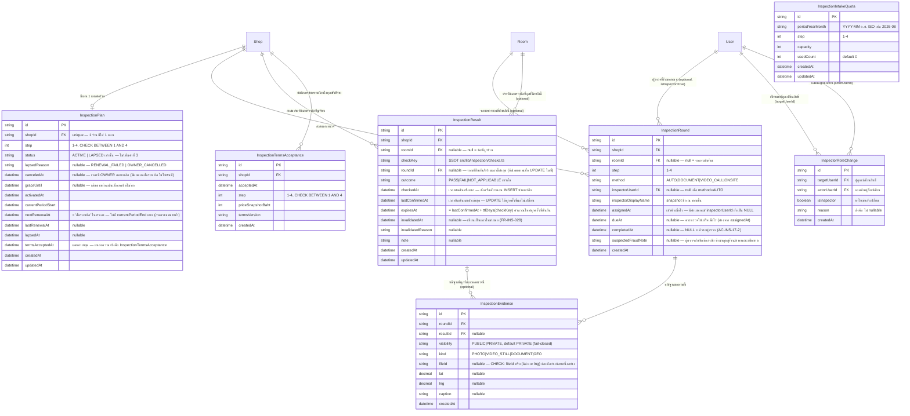

> **โมดูล:** M60-ShopInspection
> **ประเภทเอกสาร:** DATABASE Design
> **เวอร์ชัน:** 1.5 (รอบสุดท้ายจริง ๆ) — แก้ตาม feedback ของ Controller 5 รอบหลัง draft 1.0 (ดู §8 ประวัติการแก้)
> **วันที่จัดทำ:** 2026-08-29
> **สถานะ:** Draft — รอ user review ก่อน implement
> **เจ้าของเอกสาร:** SA (`safepay-database`)

# DATABASE: แผนการตรวจสอบร้านค้า (Shop Inspection Plan)

---

## 1. Overview

โมดูลนี้เพิ่มโครงสร้างข้อมูลสำหรับ "แผนการตรวจสอบต่อเนื่อง" — สินค้าที่ร้าน LODGING ซื้อเพื่อให้ Deep ไปตรวจสอบข้อเท็จจริงของร้าน/ที่พักซ้ำ ๆ ตามรอบ แล้วนำผลไปแสดงบนโปรไฟล์สาธารณะ เป็นแกนความน่าเชื่อถือที่**เป็นอิสระจาก Trust Score โดยสมบูรณ์** (ดู PRD §4.1, D-1/D-6) จึงไม่มีคอลัมน์หรือ trigger ใดในโมดูลนี้แตะสูตร Trust Score เลย

- **เอกสารต้นทาง:** PRD.md + BRD.md ของโมดูล M60-ShopInspection (ยังไม่มี SRS/SDS แยก — โมดูลนี้อยู่ในสถานะ Draft รอ user review ตาม Hard Rule 11 เอกสาร DATABASE ฉบับนี้จึงอ้างอิง FR/AC ของ BRD โดยตรง)
- **Store:** PostgreSQL 16 (Supabase) ผ่าน Prisma ORM — ตารางเดียวกับระบบหลักทั้งหมด ไม่มี store แยก
- **Engine/Charset:** InnoDB ไม่เกี่ยวข้อง (Postgres) — encoding UTF8 ตามฐานเดิม
- **หลักการออกแบบที่ยึดตลอดเอกสารนี้:** โมดูลนี้เป็น **additive ล้วน** — ไม่แก้/ไม่ลบคอลัมน์เดิมของ `Shop`/`Room`/`User`/`SellerWallet` เพิ่มเฉพาะตารางใหม่ **7 ตาราง** + คอลัมน์ใหม่ 1 คอลัมน์บน `User` (ที่มีข้อมูลอยู่แล้ว — ตารางอื่นทั้งหมดเป็นตารางใหม่ล้วนจึงไม่นับเป็น "แก้ตารางเดิม")
- **โมเดลที่ 7 (เพิ่มรอบ 5): `InspectorRoleChange`** (append-only audit log ของการตั้ง/ถอดสิทธิ์ผู้ตรวจ) + `InspectionRound.suspectedFraudNote` (ที่ผู้ตรวจบันทึกข้อสงสัยฉ้อโกงได้ แต่**ห้ามหลุดสู่ฝั่งร้าน/สาธารณะเด็ดขาด**) — ดู §3.2, §3.7
- **มิเรอร์แบบแผนเดิม:** `InspectionPlan` มิเรอร์โครง `InventoryEntitlement` (feature 00003/00009) แทบทุกฟิลด์โดยตั้งใจ — ทีมคุ้นรูปแบบ `status/activatedAt/currentPeriodStart/nextRenewalAt/lastRenewalAt` อยู่แล้ว และ cron ใช้ query pattern เดียวกันได้ทันที (`@@index([status, nextRenewalAt])`)
- **🛑 `InspectionResult` = ผสม insert/update ตามว่าผลเปลี่ยนหรือไม่ (แก้ 2 รอบจาก draft 1.0):** ตรวจแล้ว **ผลเหมือนแถวล่าสุด** → `UPDATE` เลื่อน `lastConfirmedAt`/`expiresAt` ในที่ (ไม่สร้างแถวใหม่) · ตรวจแล้ว **ผลต่างจากแถวล่าสุด** (หรือแถวเดิมกำลัง invalidated) → `INSERT` แถวใหม่ — เหตุผล: append-only ล้วนตามที่เคยแก้ไว้ (draft 1.1) ทำให้ข้อตรวจที่ต้องตรวจทุกวัน (ขั้น 1) มี "ผ่าน" ซ้ำ 365 บรรทัด/ปีกลบรอบที่มีความหมายจริง — **ไทม์ไลน์คือตัวสินค้าของฟีเจอร์นี้ (AC-INS-16) ถ้าอ่านไม่ได้ก็ไม่เหลืออะไร** ดูรายละเอียดเต็มใน §3.3
- **โมเดลใหม่ที่เพิ่มในรอบ 3:** `InspectionTermsAcceptance` (append-only แท้ ๆ — บันทึกทุกครั้งที่ OWNER รับทราบเงื่อนไขก่อนจ่ายเงิน ดู §3.6) + `InspectionPlan.canceledAt`/`graceUntil` (บันทึกช่วงเปลี่ยนผ่านก่อนพ้นสถานะ ดู §3.1)
- **🛑 `InspectionRound.dueAt` (เพิ่มรอบ 4 — ปิดปัญหา "ฟีเจอร์เสื่อมเองเงียบ ๆ"):** เดิมไม่มีอะไรในระบบที่ *ทำให้* การตรวจต่อเนื่องของขั้น 2-4 เกิดขึ้นจริง — ขั้น 1 มี cron ขยับผลให้เองทุกวัน แต่ขั้น 2-4 ต้องพึ่งรอบตรวจจริงที่เป็นงานมอบหมายด้วยมือ ⇒ ร้านที่จ่ายเงินต่อเนื่องจะเห็นป้ายตกเป็น "รอตรวจซ้ำ" ทีละข้อโดยไม่มีใครมาตรวจซ้ำเลย ทั้งที่โค้ดถูกทุกบรรทัด — cron ต้องสร้างคิวงานล่วงหน้าเองแทน ดู §3.2

---

## 2. ERD



> `InspectionIntakeQuota` ไม่มีเส้นความสัมพันธ์ในไดอะแกรม — เป็นตารางค่ากำหนดระดับระบบ (ไม่มี FK ไปร้านใด) อ้างอิงจาก service layer ด้วยคู่คีย์ `(periodYearMonth, step)` เท่านั้น จึงไม่ปรากฏเป็นเส้นเชื่อมกับ entity อื่น

---

## 3. Tables

### 3.1 `InspectionPlan` (PostgreSQL — Supabase)

สถานะแผนการตรวจสอบของร้านหนึ่งร้าน (1:1 กับ `Shop`) — มิเรอร์ `InventoryEntitlement` ทุกฟิลด์เวลาโดยตั้งใจ (ดู §1)

| Column | Type | Null | Default | Key |
|--------|------|------|---------|-----|
| `id` | `uuid` | NO | `gen_random_uuid()` | PK |
| `shopId` | `uuid` | NO | — | FK → `Shop.id`, **UNIQUE** |
| `step` | `int` | NO | — | CHECK `step BETWEEN 1 AND 4` |
| `status` | `text` (enum `InspectionPlanStatus`) | NO | `'ACTIVE'` | IDX — `ACTIVE \| LAPSED` **เท่านั้น ห้ามเพิ่มค่าที่ 3** |
| `lapsedReason` | `text` | YES | `NULL` | ค่า `"RENEWAL_FAILED"` \| `"OWNER_CANCELLED"` — String ตาม convention โปรเจกต์ (เทียบ `Shop.packageLockReason`) ไม่มี DB CHECK บังคับรายชื่อ |
| `canceledAt` | `timestamptz` | YES | `NULL` | **(เพิ่มรอบแก้นี้)** เวลาที่ OWNER กดยกเลิก |
| `graceUntil` | `timestamptz` | YES | `NULL` | **(เพิ่มรอบแก้นี้)** เส้นตายผ่อนผันเมื่อเครดิตไม่พอ |
| `activatedAt` | `timestamptz` | NO | — | — |
| `currentPeriodStart` | `timestamptz` | NO | — | — |
| `nextRenewalAt` | `timestamptz` | NO | — | IDX |
| `lastRenewalAt` | `timestamptz` | YES | `NULL` | — |
| `lapsedAt` | `timestamptz` | YES | `NULL` | — |
| `termsAcceptedAt` | `timestamptz` | NO | — | — |
| `createdAt` | `timestamptz` | NO | `now()` | — |
| `updatedAt` | `timestamptz` | NO | `now()` (auto) | — |

**หมายเหตุการออกแบบ:**
- `shopId @unique` บังคับ 1 ร้าน = 1 แผนเดียว ตรงกับ FR-INS-001/AC-INS-01-3
- `step` เก็บ **ขั้นปัจจุบัน** เพียงค่าเดียว (AC-INS-07-2) — ประวัติการเปลี่ยนขั้นสร้างจาก `InspectionRound.step` ที่สะสมไปเรื่อย ๆ แทน
- **`lapsedReason`:** `status='LAPSED'` เพียงอย่างเดียวไม่พอ เพราะรวม 2 เหตุการณ์ที่ BRD แยกกันไว้เป็นคนละเรื่อง — "ค้างชำระเกินผ่อนผัน" (`RENEWAL_FAILED`) กับ "OWNER กดยกเลิกเอง" (FR-INS-026, `OWNER_CANCELLED`) มีไว้เพื่อ KPI (PRD §1.2) + หน้าจอฝั่งร้านเห็นเหตุผลที่ถูกต้อง — **หน้าโปรไฟล์สาธารณะยังคงแสดงข้อความเดียวกันทั้งสองกรณี** (FR-INS-019/AC-INS-19-2) คอลัมน์นี้จึงมีผลเฉพาะฝั่งร้าน+รายงานภายใน
- **🛑 `canceledAt`/`graceUntil` (เพิ่มรอบแก้สุดท้ายตามข้อทักของ API agent) — AC ที่เขียนไว้แล้วในเอกสารรอบก่อนบังคับไม่ได้จริงถ้าไม่มี 2 คอลัมน์นี้:**
  - **`canceledAt`** — AC-INS-26-3 ระบุว่า "การยกเลิกมีผลตั้งแต่สิ้นสุดรอบบิลปัจจุบัน ไม่ใช่ตัดสิทธิ์ทันทีกลางรอบที่จ่ายเงินไปแล้ว" ⇒ ต้องมีที่เก็บว่า "OWNER กดยกเลิกแล้ว แต่ยังไม่ถึงเวลาพ้นสถานะ" แยกจาก `status` — ระหว่าง `canceledAt` ถึง `nextRenewalAt` **`status` ยังเป็น `ACTIVE` และป้ายบนโปรไฟล์ยังแสดงปกติทุกประการ** (ไม่มีสถานะกึ่งกลางใหม่ — ดูเหตุผลด้านล่างว่าทำไมไม่เพิ่มค่า enum ที่ 3)
  - **`graceUntil`** — AC-INS-08-3 ระบุว่าต้อง "แสดงสถานะให้ OWNER เห็นว่าค้างชำระ พร้อมจำนวนวันที่เหลือก่อนแผนถูกปรับเป็นสถานะยกเลิก" ⇒ ต้องมีเส้นตายที่คำนวณไว้ล่วงหน้าให้ UI อ่านนับถอยหลังได้ตรง ๆ ไม่ใช่คำนวณสดจาก "จำนวนวันผ่อนผัน" (ค่าคงที่ที่ยัง "รอเคาะ" ตาม BRD §7.1) ทุกครั้งที่ query
  - **state machine ของ cron `/api/cron/inspection-lifecycle` เมื่อ ACTIVE + `nextRenewalAt <= now()`:** (1) ถ้า `canceledAt IS NOT NULL` → เปลี่ยนเป็น `status='LAPSED', lapsedReason='OWNER_CANCELLED', lapsedAt=now()` ทันที ไม่พยายามหักเครดิต (2) ไม่งั้นพยายามหักเครดิตรอบใหม่ — สำเร็จ → เลื่อน `nextRenewalAt += 30 วัน`, `lastRenewalAt=now()`, ล้าง `graceUntil=NULL` (3) หักไม่สำเร็จและ `graceUntil IS NULL` (ล้มเหลวครั้งแรก) → ตั้ง `graceUntil = now() + graceDays` เท่านั้น **`status` ยังคง `ACTIVE`** (4) หักไม่สำเร็จและ `graceUntil` ผ่านไปแล้ว → เปลี่ยนเป็น `status='LAPSED', lapsedReason='RENEWAL_FAILED', lapsedAt=now()` (5) หักไม่สำเร็จแต่ยังไม่ถึง `graceUntil` → ไม่ทำอะไรเพิ่ม (แถวนี้ยังมี `nextRenewalAt` เดิมค้างอยู่ในอดีต จึงถูก cron จับซ้ำทุกวันโดยอัตโนมัติผ่าน index เดิม — **ไม่ต้องเพิ่ม index แยกสำหรับ `graceUntil`** ดู §4)
  - **🛑 ห้ามเพิ่มค่าที่สามใน `InspectionPlanStatus`:** "ยกเลิกแล้วแต่ยังไม่หมดรอบ" คือ `status='ACTIVE' AND canceledAt IS NOT NULL` ไม่ใช่สถานะใหม่ — เพิ่มค่าที่ 3 จะบังคับให้ทุก query/UI ที่เคยเช็คแค่ `status==='ACTIVE'` ต้องถูกไล่แก้ทั้งระบบ (คลาสเดียวกับ `docs/conventions/enum-value-removal.md`/`vocab_substitution` — เพิ่มค่าที่ N มักเงียบกว่าเพิ่มค่าที่ 2 เพราะโค้ดเดิมมองว่า "ครบละ" ไปแล้ว)
  - **🛑 ห้ามเพิ่ม `currentPeriodEnd`:** มีค่าเดียวกับ `nextRenewalAt` ที่มีอยู่แล้วเป๊ะ — "วันที่รอบบิลปัจจุบันสิ้นสุด" กับ "วันที่ต้องต่ออายุครั้งถัดไป" คือวันเดียวกันในระบบนี้ (ไม่มี concept "สิ้นรอบแต่ยังไม่ถึงกำหนดต่ออายุ" แยกกัน) สองคอลัมน์ความหมายเดียวกันคือรูปแบบของบั๊กที่ **Hard Rule 16 ห้ามไว้ตรง ๆ** (นิยามที่ชนกันของค่าเดียวกัน — คนหนึ่งอ่าน `nextRenewalAt` อีกคนอ่าน `currentPeriodEnd` แล้ว sync กันไม่ทันเมื่อ cron แก้ค่าใดค่าหนึ่งแล้วลืมอีกค่า)
- `termsAcceptedAt` เป็น **แคชค่าล่าสุดเพื่ออ่านเร็ว** — 🛑 **แหล่งความจริงคือตาราง `InspectionTermsAcceptance` (§3.6) ไม่ใช่คอลัมน์นี้** เขียนทับทุกครั้งที่มีการจ่ายเงินรอบใหม่คู่กับการ `INSERT` แถวใน `InspectionTermsAcceptance` เสมอในทรานแซกชันเดียวกัน — ถ้าสองที่นี้ไม่ sync กัน (เช่น service เขียนคอลัมน์นี้แต่ลืม insert ตาราง) ฝ่ายพิพาทจะหาหลักฐานราคา ณ วันนั้นไม่เจอ (ดู §3.6)

### 3.2 `InspectionRound` (PostgreSQL — Supabase)

การตรวจหนึ่งครั้ง — เป็นทั้ง **ตัวมอบหมายงาน** (`completedAt IS NULL` = คิวรอผู้ตรวจ, สถานะภายในที่ AC-INS-17-2 ห้ามให้ผู้ซื้อเห็น) และ **ภาชนะของหลักฐาน** ต่อรอบ

| Column | Type | Null | Default | Key |
|--------|------|------|---------|-----|
| `id` | `uuid` | NO | `gen_random_uuid()` | PK |
| `shopId` | `uuid` | NO | — | FK → `Shop.id`, IDX |
| `roomId` | `uuid` | YES | `NULL` | FK → `Room.id`, IDX (null = รอบระดับร้าน) |
| `step` | `int` | NO | — | CHECK `step BETWEEN 1 AND 4` |
| `method` | `text` (enum `InspectionMethod`) | NO | — | — |
| `inspectorUserId` | `uuid` | **YES** | `NULL` | FK → `User.id`, IDX — 🛑 **ยืนยันแล้วว่า nullable อยู่แล้วตั้งแต่ draft 1.0** (ตามที่ Controller ขอให้ยืนยันในรอบ 4) จำเป็นเพราะ (1) `method='AUTO'` ไม่มีผู้ตรวจมนุษย์ (2) **รอบที่ cron สร้างล่วงหน้าแบบยังไม่มอบหมาย** (เพิ่มรอบ 4 — ดูด้านล่าง) ก็ไม่มีค่านี้เช่นกันจนกว่าแอดมินจะมอบหมายจริง |
| `inspectorDisplayName` | `text` | NO | — | — |
| `assignedAt` | `timestamptz` | NO | — | — |
| `dueAt` | `timestamptz` | YES | `NULL` | **(เพิ่มรอบ 4)** IDX (ร่วมกับ completedAt — คิวงานค้าง) |
| `completedAt` | `timestamptz` | YES | `NULL` | IDX (queue query, ร่วมกับ dueAt) |
| `suspectedFraudNote` | `text` | YES | `NULL` | **(เพิ่มรอบ 5)** 🛑 ห้ามหลุดสู่ฝั่งร้าน/สาธารณะเด็ดขาด — ดูรายละเอียดด้านล่าง; IDX แบบ partial (ดู §4) |
| `createdAt` | `timestamptz` | NO | `now()` | — |

**หมายเหตุการออกแบบ:**
- `inspectorDisplayName` เป็น **snapshot ชื่อ ณ รอบนั้น ไม่ใช่ live join กับ `User.displayName`** — AC-INS-25-2 บังคับว่าถ้าผู้ตรวจของรอบเก่าถูกเปลี่ยน ระเบียนไทม์ไลน์เก่าต้องยังแสดงชื่อผู้ตรวจเดิม (คลาสเดียวกับ `docs/conventions/value-fate-decided-at-write-site.md`)
- `method='AUTO'` ใช้กับข้อตรวจของขั้นที่ 1 เท่านั้น — `inspectorUserId=NULL` แต่ `inspectorDisplayName` ยังต้องมีค่า (เช่น `"ระบบตรวจอัตโนมัติ"`) เพราะคอลัมน์เป็น `NOT NULL`
- `roomId` nullable สะท้อนขอบเขตผลตรวจตาม D-16/FR-INS-029
- onDelete: `shop`=`Cascade` (ตาม convention โปรเจกต์) · `room`=`Restrict` (เหมือน `Order.room`/BR-LODG-06) · `inspectorUser`=`SetNull` (เหมือน `Housekeeper` ไม่ผูก `User` แน่น)

**🛑 `dueAt` (เพิ่มรอบ 4) — ปัญหาที่ทำให้ต้องมีคอลัมน์นี้: "ไม่มีอะไรในระบบที่ทำให้การตรวจต่อเนื่องของขั้น 2-4 เกิดขึ้นจริง":**

ขั้น 1 มี cron ขยับ `lastConfirmedAt`/`expiresAt` ให้เองทุกวันผ่านกติกา insert/update ของ §3.3 — แต่ข้อตรวจของขั้น 2-4 ขยับได้ **ต่อเมื่อมีรอบตรวจจริง** ซึ่งเป็นงานที่ต้องมีคนมอบหมายและมีผู้ตรวจไปทำ ไม่มีกลไกอัตโนมัติใดสร้างงานนั้นขึ้นมาเอง ⇒ **ร้านที่จ่ายเงินต่อเนื่องปกติทุกเดือนจะเห็นป้ายของตัวเองตกเป็น "รอตรวจซ้ำ" ทีละข้อไปเรื่อย ๆ โดยไม่มีใครมาตรวจซ้ำให้เลย** (`expiresAt` ผ่านไปเงียบ ๆ ไม่มีใครสร้างงานให้ทัน) — ฟีเจอร์เสื่อมสภาพเองภายใน 6-12 เดือนหลังเปิดขาย ทั้งที่ทุกบรรทัดของ §3.1-§3.3 ถูกต้องตามสเปกทุกประการ (คลาสเดียวกับ `feedback_default_off_switch_nobody_knows` — ของที่ควรทำงานต่อเนื่องแต่ไม่มีตัวจุดชนวน)

**แก้ด้วยหน้าที่ใหม่ของ cron `/api/cron/inspection-lifecycle`:** สแกนหาข้อตรวจ (จาก `InspectionResult` แถวล่าสุดตาม tie-break ของ §3.3) ที่ `outcome='PASS'` และ `expiresAt` จะถึงภายใน **14 วันข้างหน้า** ของแผนที่ `status='ACTIVE'` และขั้น ≥ 2 — ถ้ายังไม่มีรอบตรวจที่ `completedAt IS NULL` ครอบคลุมคู่ `(shopId, roomId, step, method)` นั้นอยู่แล้ว (ดัชนี idempotent ด้านล่าง) ให้ `INSERT InspectionRound` ใหม่: `inspectorUserId=NULL` (ยังไม่มอบหมาย รอแอดมินมากดมอบหมายทีหลัง), `inspectorDisplayName='รอมอบหมาย'` (ค่าชั่วคราวจนกว่าจะมอบหมายจริง แล้วค่อยเขียนทับด้วยชื่อผู้ตรวจตัวจริงตอนมอบหมาย — **ไม่ใช่ snapshot สุดท้าย** จนกว่าจะมีคนตรวจจริง), `assignedAt=now()` (เข้าคิวแล้ว แม้ยังไม่มีผู้ตรวจตัวจริง — ดูหมายเหตุด้านล่าง), `dueAt=expiresAt` (ของข้อที่ใกล้หมดอายุที่สุดในกลุ่มนี้), `completedAt=NULL`
- **🛑 `dueAt` ≠ `assignedAt` — สับสนกันง่ายมากเพราะเป็น `timestamptz` คู่กันทั้งคู่:** `assignedAt` = "งานนี้เข้าคิว/ถูกสร้างเมื่อไร" (มีค่าเสมอตั้งแต่แถวถูกสร้าง ไม่ว่าจะมีผู้ตรวจแล้วหรือยัง) ส่วน `dueAt` = "ควรตรวจให้เสร็จภายในเมื่อไร" (เพดานเวลาที่ผูกกับ `expiresAt` ของข้อตรวจ ไม่ใช่เวลาที่งานเข้าคิว) — สลับสองฟิลด์นี้ในโค้ด UI จะทำให้แอดมินเห็น "งานเข้าคิวมื่อไร" เป็น "ต้องเสร็จเมื่อไร" หรือกลับกัน ซึ่งเป็นข้อมูลที่ใช้ตัดสินใจจัดคิวงานจริง
- **`assignedAt` ยังคงมีค่าเสมอ (`NOT NULL`) แม้เป็นรอบที่ cron สร้างแบบยังไม่มอบหมาย** — ตีความว่า "เข้าคิวเมื่อไร" ไม่ใช่ "มีผู้ตรวจตัวจริงมอบหมายเมื่อไร" เพื่อไม่ต้องเปลี่ยน constraint เดิม (Controller ไม่ได้สั่งให้เปลี่ยน `assignedAt` เป็น nullable — สั่งแค่ยืนยัน `inspectorUserId` nullable และเพิ่ม `dueAt`) — ตอนแอดมินมอบหมายผู้ตรวจจริงภายหลัง แค่ `UPDATE inspectorUserId`/`inspectorDisplayName` ไม่ต้องแตะ `assignedAt` อีก
- **Idempotent:** เงื่อนไข "มีรอบที่ `completedAt IS NULL` ของ `(shopId, roomId, step, method)` นี้อยู่แล้ว = ข้าม" กันไม่ให้ cron สร้างรอบซ้ำซ้อนทุกวันสำหรับข้อที่ยังไม่หมดอายุจริงแต่ใกล้ครบ 14 วันซ้ำหลายรอบ
- **ขอบเขตของ "งานมอบหมาย" คือ `(shopId, roomId, step, method)` ไม่ใช่รายข้อ (`checkKey`)** เพราะ `InspectionRound` ไม่มีคอลัมน์ `checkKey` ของตัวเอง (checkKey อยู่ที่ `InspectionResult` เท่านั้น) — 1 รอบตรวจครอบคลุมได้หลายข้อตรวจพร้อมกันตามธรรมชาติของงาน (เช่น ผู้ตรวจนัดวิดีโอคอลครั้งเดียวตรวจได้ทั้งข้อ "นำชมสด" และ "หลักฐานเปิดใช้งานจริง" ของขั้น 3 ในนัดเดียว) — ตรงกับที่ §3.2 ออกแบบไว้ตั้งแต่ draft 1.0 อยู่แล้ว ไม่ต้องเพิ่มคอลัมน์ใหม่

**🛑 `suspectedFraudNote` (เพิ่มรอบ 5) — ทำไมต้องมีช่องนี้ และทำไมมันอันตราย:**

ผู้ตรวจ (โดยเฉพาะผู้ตรวจท้องถิ่นที่จ้างเป็นรายครั้งสำหรับขั้น 4 — บุคคลภายนอกตาม §3.8 ของ PRD) อาจเจอสัญญาณที่น่าสงสัยว่าเป็นการฉ้อโกงระหว่างตรวจ (เช่น สถานที่ไม่ตรงกับที่อ้าง เจ้าของปฏิเสธไม่ให้เห็นเอกสารบางส่วน) — **แต่การตัดสินว่าเข้าข่ายฉ้อโกงจริงและนำชื่อเข้าฐาน `/check` ต้องเป็นสิทธิ์ของแอดมินเท่านั้น** ไม่ใช่การตัดสินหน้างานของคนนอก (การใส่ชื่อคนเข้าฐานมิจฉาชีพย้อนกลับยาก กระทบชื่อเสียง/การขายของร้านจริง — ไม่ควรให้บุคคลภายนอกที่ไม่ได้ผ่านกระบวนการตรวจสอบสองชั้นเป็นคนกดเข้าฐานได้เอง) — แต่ถ้า**ไม่มี**ช่องให้บันทึกเลย สิ่งที่ผู้ตรวจเห็นหน้างานจะหายไปพร้อมตัวเขา ไม่มีใครสืบทวนได้อีก ⇒ `suspectedFraudNote` คือทางออก: **บันทึกได้ ไม่ตัดสิน** — แยกขั้นตอน "เห็น" ออกจากขั้นตอน "ตัดสิน" อย่างเด็ดขาดที่ระดับ schema (คอลัมน์นี้ไม่มีกลไกอัตโนมัติใดที่เขียนเข้าฐาน `/check` เอง ต้องผ่านแอดมินอ่านแล้วตัดสินใจเสมอ)

🛑 **ห้ามหลุดสู่ฝั่งร้านและฝั่งสาธารณะเด็ดขาด — เหตุผล:** ข้อความในคอลัมน์นี้คือ**ข้อสงสัยที่ยังไม่ถูกตัดสิน** การเปิดเผยก่อนตัดสินคือการกล่าวหาที่ยังพิสูจน์ไม่ได้ และถ้าร้านที่ถูกสงสัยเห็นก่อน **หลักฐานสามารถถูกทำลายหรือปรับแต่งให้สอดคล้องได้ทันที** ทำให้การตรวจสอบจริงในภายหลัง (ถ้าแอดมินตัดสินใจสืบต่อ) เสียหายไปด้วย ระดับความลับนี้**เข้มกว่า** `InspectionEvidence.visibility='PRIVATE'` เสียอีก — หลักฐานปิดทั่วไป (บัตรประชาชน โฉนด) เป็นสิ่งที่ร้าน**ส่งมาเอง**จึงมีเหตุผลให้ร้านอาจเห็นข้อมูลของตัวเองได้ในบางบริบท แต่ `suspectedFraudNote` เป็นสิ่งที่**พูดถึงร้าน**โดยที่ร้านไม่รู้ตัว ร้านต้อง**ไม่มีทางเห็นได้เลยไม่ว่าทางใด** จนกว่า (ถ้ามี) กระบวนการ `/check` แยกต่างหากจะเริ่มอย่างเป็นทางการ (ซึ่งมีขั้นตอนของตัวเองอยู่แล้วนอกเหนือคอลัมน์นี้)

- **ความเสี่ยงจุดที่ต้องระวังที่สุด:** `InspectionRound` เป็นตารางที่**มีความชอบธรรมให้ฝั่งร้านเห็นบางส่วนอยู่แล้ว** (AC-INS-17-2 อนุญาตให้ OWNER/ADMIN ของร้านเห็นสถานะคิว "รอผู้ตรวจเข้าตรวจ") ⇒ **ทุก serializer ที่ส่งข้อมูล `InspectionRound` ไปยังหน้าจอฝั่งร้านต้องเป็น allow-list ของฟิลด์ ไม่ใช่ deny-list** และต้อง**ไม่มีจุดไหนเลยที่ `select *`/serialize ทั้งแถวไปยังฝั่งร้าน** (สอดคล้องกับข้อห้าม "ห้าม `select *` กับตารางข้อมูลอ่อนไหวในตัวอย่าง query" ที่กำหนดไว้กับ SA agent ทุกตัวในโปรเจกต์นี้อยู่แล้ว) — ถ้าใครเผลอ `SELECT *` หรือ spread ทั้ง object ไปให้ฝั่งร้านสักจุดเดียว คอลัมน์นี้จะรั่วทันทีโดยไม่มี error ไม่มี type ผิด (ตรงกับคลาสบั๊ก PII ที่โปรเจกต์นี้เจอมาแล้วหลายรอบ — `feedback_rsc_pii_neutralize_at_source`)
- **ผู้เข้าถึงได้:** เฉพาะแอดมินแพลตฟอร์ม (`User.isAdmin=true`) เท่านั้น — ไม่ใช่แม้แต่ OWNER/ADMIN ของร้าน ไม่ใช่แม้แต่ผู้ตรวจคนอื่นที่ไม่เกี่ยวข้อง

**🛑 index สำหรับหา "รอบที่มีข้อสงสัยแต่ยังไม่มีใครตัดสิน" — ทำไมต้องเป็น partial index แยก ไม่ใช้ `dueAt` เดิม:**

ความเร่งด่วนของแถวกลุ่มนี้**ไม่ผูกกับ `dueAt`** (ซึ่งวัด "ข้อตรวจใกล้หมดอายุ") — ข้อสงสัยฉ้อโกงเร่งด่วนตามธรรมชาติของมันเอง ไม่เกี่ยวกับว่าข้อตรวจนั้นจะหมดอายุเมื่อไหร่ ถ้าเรียงแผงแอดมินด้วย `dueAt` อย่างเดียว แถวที่มีข้อสงสัยฉ้อโกง (ซึ่ง `dueAt` อาจเป็น NULL หรือไกลมาก เพราะรอบนั้นอาจเป็นรอบตรวจถึงที่ปกติที่บังเอิญเจอสิ่งผิดปกติ ไม่ใช่รอบที่ถูกสร้างเพราะใกล้หมดอายุ) **จะจมอยู่ล่างสุดของคิว** ทั้งที่ควรถูกอ่านก่อนสิ่งอื่นทั้งหมด — ต้องมี index ของตัวเอง:
```sql
CREATE INDEX "InspectionRound_unresolved_fraud_note_idx"
  ON "InspectionRound" ("createdAt")
  WHERE "suspectedFraudNote" IS NOT NULL;
```
เป็น partial index (unmanaged SQL) เพราะเงื่อนไขนี้เกิดขึ้น**น้อยมาก**เทียบกับจำนวนรอบตรวจทั้งหมด (ส่วนใหญ่ไม่มีข้อสงสัยฉ้อโกงเลย) — partial index ทำให้ query "แผงแอดมิน: รอบที่มีข้อสงสัยรอตัดสิน" เร็วคงที่ไม่ว่าตาราง `InspectionRound` จะโตแค่ไหน (ต่างจาก index เต็มตารางที่ต้องแบกน้ำหนักของแถวปกติหลายหมื่นแถวไปด้วยทั้งที่ไม่เกี่ยวข้อง)

🛑 **ข้อจำกัดที่ต้องบันทึกไว้ตรงไปตรงมา:** contract รอบนี้มีแค่ `suspectedFraudNote String?` **ไม่มีคอลัมน์ระบุว่า "แอดมินตัดสินแล้วหรือยัง/ผลตัดสินเป็นอย่างไร"** — เอกสารนี้ตีความ "ยังไม่มีใครตัดสิน" ในทางปฏิบัติเป็น `suspectedFraudNote IS NOT NULL` ทั้งหมด (คือทุกแถวที่มีข้อความในนี้ถือเป็น "ต้องมีคนอ่าน" เสมอ ไม่มีสถานะ "อ่านแล้ว/ปัดตกแล้ว" ในตารางนี้) — ถ้าแอดมินตรวจแล้วเห็นว่าไม่ใช่เรื่องจริง ไม่มีกลไกใน schema นี้ที่จะ "เคลียร์" แถวออกจากคิวได้ (จะค้างอยู่ใน partial index ตลอดไป) เป็น **open question สำหรับ SDS** ว่าจะเพิ่ม `reviewedAt`/`reviewedByUserId` ในรอบถัดไปหรือไม่ — ไม่ได้เพิ่มเองในเอกสารนี้เพราะ contract ของรอบนี้ระบุแค่ 1 คอลัมน์ (ดู §8 Open Questions)

### 3.3 `InspectionResult` (PostgreSQL — Supabase) — 🛑 ผสม insert/update, แก้ 2 รอบจาก draft 1.0

**ประวัติของ "ช่วงที่ผลคงที่" (episode)** ของข้อตรวจ 1 ข้อ ต่อร้าน (หรือต่อที่พัก 1 หลัง) — หนึ่งคู่ `(scope, checkKey)` (`scope` = `shopId` เมื่อ `roomId IS NULL` หรือ `roomId` เมื่อมีค่า) มีได้**หลายแถว** แต่จำนวนแถวเท่ากับ **จำนวนครั้งที่ผลเปลี่ยนจริง** ไม่ใช่จำนวนครั้งที่ตรวจ

| Column | Type | Null | Default | Key |
|--------|------|------|---------|-----|
| `id` | `uuid` | NO | `gen_random_uuid()` | PK — ใช้เป็น tie-break ลำดับที่ 2 (ดูด้านล่าง) |
| `shopId` | `uuid` | NO | — | FK → `Shop.id`, IDX (ร่วมกับ checkKey/checkedAt/id — ดู §4) |
| `roomId` | `uuid` | YES | `NULL` | FK → `Room.id`, IDX (null = ข้อผูกร้าน) |
| `checkKey` | `text` | NO | — | ค่าคงที่จาก `src/lib/inspection/checks.ts` (18 ค่า, ดู §3.8) |
| `roundId` | `uuid` | YES | `NULL` | FK → `InspectionRound.id` — รอบที่ยืนยัน/สร้างแถวนี้**ล่าสุด** (`UPDATE` เปลี่ยนค่านี้ได้ทุกครั้งที่มีรอบใหม่มายืนยันผลเดิม); `NULL` เมื่อแถวนี้เป็นแถว invalidate สังเคราะห์จากเหตุการณ์เปลี่ยนภาพ |
| `outcome` | `text` (enum `InspectionOutcome`) | NO | — | `PASS \| FAIL \| NOT_APPLICABLE` **เท่านั้น** |
| `checkedAt` | `timestamptz` | NO | — | 🛑 **เวลาที่ผลนี้ถูกตัดสินครั้งแรก — ตั้งครั้งเดียวตอน `INSERT` ห้ามแก้อีกเลยตลอดอายุแถว** |
| `lastConfirmedAt` | `timestamptz` | NO | — | **(เพิ่มรอบแก้นี้)** เวลายืนยันผลเดิมล่าสุด — `UPDATE` ได้ทุกครั้งที่ผลไม่เปลี่ยน (เท่ากับ `checkedAt` ตอน `INSERT` แรก) |
| `expiresAt` | `timestamptz` | YES | `NULL` | 🛑 **= `lastConfirmedAt + ttlDays(checkKey)` ไม่ใช่นับจาก `checkedAt`** — คำนวณใหม่ทุกครั้งที่ยืนยัน (ทั้งตอน INSERT แรกและ UPDATE ยืนยันซ้ำ) |
| `invalidatedAt` | `timestamptz` | YES | `NULL` | — |
| `invalidatedReason` | `text` | YES | `NULL` | — |
| `note` | `text` | YES | `NULL` | — |
| `createdAt` | `timestamptz` | NO | `now()` | — |
| `updatedAt` | `timestamptz` | NO | `now()` (auto) | — |

**🛑 `outcome` เก็บแค่ 3 ค่า — สองสถานะที่เหลือเป็น derived state ห้ามเก็บเป็นคอลัมน์ (ไม่เปลี่ยนตลอด 3 รอบแก้):**

| สถานะที่ผู้ใช้เห็น | มาจาก |
|---|---|
| ผ่าน | แถวล่าสุดของคู่ `(scope, checkKey)` มี `outcome='PASS'` และยังไม่หมดอายุ/ไม่ถูก invalidate |
| ไม่ผ่าน | แถวล่าสุดมี `outcome='FAIL'` |
| ไม่เกี่ยวกับร้านประเภทนี้ | แถวล่าสุดมี `outcome='NOT_APPLICABLE'` |
| **รอตรวจซ้ำ** (derived) | แถวล่าสุดมี `outcome='PASS'` **และ** (`expiresAt < now()` **หรือ** `invalidatedAt IS NOT NULL`) |
| **ยังไม่มีข้อมูล** (derived) | **ไม่มีแถวใดเลย** สำหรับคู่ `(scope, checkKey)` นั้น |

#### 🛑 กติกาการเขียน — insert เมื่อผลเปลี่ยน / update ในที่เมื่อผลเดิม (แก้จาก append-only ล้วนของ draft 1.1)

draft 1.1 (รอบก่อน) ให้ `INSERT` แถวใหม่**ทุกครั้ง**ที่ตรวจ (append-only ล้วน) เพื่อปิดช่องโหว่ประวัติหายจาก draft 1.0 — แต่ Controller ชี้ว่านี่สร้างปัญหาใหม่: **ข้อตรวจของขั้น 1 ต้องตรวจทุกวัน ⇒ ไทม์ไลน์ของข้อ `scam_db` จะมีบรรทัด "ผ่าน" เหมือนกันเป๊ะ 365 บรรทัด/ปี กลบรอบที่มีความหมายจริงจนหมด — ไทม์ไลน์คือตัวสินค้าของฟีเจอร์นี้ (AC-INS-16) ถ้าอ่านไม่ได้ก็ไม่เหลืออะไร** (ยืนยันด้วยตัวเลขจริงที่คำนวณไว้ใน draft 1.1 §6: ~226,000 แถว/ปี ~97% มาจากขั้น 1 อย่างเดียว)

**แก้แล้ว — ทุกครั้งที่มีเหตุการณ์ตรวจใหม่ (จากรอบตรวจจริงหรือ cron อัตโนมัติของขั้น 1) service layer ทำตามลำดับนี้เสมอ** (แนะนำห่อด้วยทรานแซกชัน/`SELECT ... FOR UPDATE` กันสอง process แข่งกันเขียนคู่คีย์เดียวกันพร้อมกัน — วินัยเดียวกับที่ §3.5 ใช้กัน race ของโควตา):

1. หา **แถวล่าสุด** ของคู่ `(scope, checkKey)` ด้วย `ORDER BY "checkedAt" DESC, "id" DESC LIMIT 1`
2. **ไม่พบแถวเลย** (ยังไม่เคยตรวจข้อนี้มาก่อน) → `INSERT` แถวใหม่: `checkedAt = lastConfirmedAt = now()`, `expiresAt = now() + ttlDays(checkKey)`, `invalidatedAt = NULL`
3. **พบแถว และ `outcome` ใหม่เท่ากับเดิม และแถวนั้น `invalidatedAt IS NULL`** → **`UPDATE` แถวเดิมในที่**: เลื่อน `lastConfirmedAt = now()`, คำนวณ `expiresAt = now() + ttlDays(checkKey)` ใหม่, อัปเดต `roundId` เป็นรอบที่เพิ่งยืนยัน — **ห้ามแก้ `checkedAt`**
4. **พบแถว และ (`outcome` ใหม่ต่างจากเดิม หรือแถวเดิมกำลัง `invalidatedAt IS NOT NULL`)** → `INSERT` แถวใหม่ (episode ใหม่): `checkedAt = lastConfirmedAt = now()`, `expiresAt = now() + ttlDays(checkKey)`, `invalidatedAt = NULL` — เหตุผลที่ "แถวเดิมกำลัง invalidated" ต้อง `INSERT` แม้ `outcome` จะเหมือนเดิม: **การหลุดจากสถานะ invalidated คือเหตุการณ์ที่มีความหมายเอง** (เช่น ตรวจซ้ำแล้วยืนยันว่าภาพใหม่ตรงกับของจริงหลังร้านเปลี่ยนภาพ) ต้องมีร่องรอยของตัวเองในไทม์ไลน์ ไม่ใช่แค่ "ยืนยันซ้ำ"
5. **`invalidatedAt` (เคสเปลี่ยนภาพ, FR-INS-028)** → ยังเป็น `INSERT` แถวใหม่เสมอ (เข้าเงื่อนไขข้อ 4 อยู่แล้วในทางปฏิบัติ เพราะเป็นเหตุการณ์จริงที่ต้องเห็นในไทม์ไลน์ ไม่ใช่แค่การยืนยันซ้ำ) — ดูรายละเอียดด้านล่าง

**🛑 `ttlDays(checkKey)` มาจาก metadata ของแต่ละ `checkKey` ใน `src/lib/inspection/checks.ts`** (SSOT เดียวกับ §3.8) — ค่าตามตาราง §3.2 ของ PRD: ขั้น 1 = 1 วัน, ขั้น 2 = 365 วัน, ขั้น 3 (นำชม) = ~182 วัน / (หลักฐานเปิดจริง) = 90 วัน, ขั้น 4 (ตรวจถึงที่) = 365 วัน / (ทวนขั้น 3) = 90 วัน — ไม่ hardcode ในเอกสารนี้เพราะเป็นค่าคงที่ระดับแอปเหมือน `checkKey` เอง

**🛑 tie-break `ORDER BY "checkedAt" DESC, "id" DESC` เป็น SSOT — ต้องเป็นสูตรเดียวกันเป๊ะทั้งฝั่ง TypeScript (Prisma `orderBy: [{checkedAt:'desc'},{id:'desc'}]`) และฝั่ง SQL ดิบ (cron/reporting query) ทุกจุดที่ต้องหา "แถวล่าสุด"** — เหตุผล: cron ของขั้น 1 เขียนหลายข้อของร้านเดียวกันในทรานแซกชันเดียว (`now()` เดียวกันในทรานแซกชัน Postgres) ⇒ **`checkedAt` เท่ากันเป๊ะในหลายแถวเป็นเรื่องปกติของระบบนี้ ไม่ใช่ edge case ที่หายาก** ถ้าฝั่งหนึ่งลืม `id DESC` (เช่น query ใหม่ที่เขียนทีหลังโดยคนละคน) จะเลือกคนละแถวเป็น "ปัจจุบัน" เมื่อชนวินาที — เขียนเป็นค่าคงที่/helper กลางไว้จุดเดียวใน SDS ไม่ใช่พิมพ์ `ORDER BY` ซ้ำมือทุกจุดที่เรียก

**ผลลัพธ์ที่ต้องเขียนกำกับ:**
- **ไทม์ไลน์ = จุดที่ผลเปลี่ยนจริงเท่านั้น** — ตรงกับสิ่งที่ผู้ซื้ออยากอ่าน ("ร้านนี้เคยไม่ผ่านข้อไหนบ้างเมื่อไหร่") ไม่ใช่ log การรันซ้ำรายวัน
- ประวัติยังครบตาม AC-INS-16-3/AC-INS-27-1 เพราะทุกครั้งที่ผลเปลี่ยน (รวมรอบที่ FAIL) ยังคง `INSERT` แถวของตัวเองเสมอ ไม่มีการเขียนทับ
- 🛑 **ป้ายบนโปรไฟล์ที่บอก "ตรวจล่าสุดเมื่อไร" ต้องอ่านจาก `lastConfirmedAt` ไม่ใช่ `checkedAt`** — สองฟิลด์นี้สลับกันง่ายมากเพราะชื่อคล้ายกันและเป็น `timestamptz` ทั้งคู่: ข้อตรวจที่ผลคงที่มานาน (เช่น 8 เดือนไม่มีอะไรเปลี่ยน) จะมี `checkedAt` เป็นวันที่เก่ามาก — ถ้า UI ดันไปอ่าน `checkedAt` มาโชว์เป็น "ตรวจล่าสุดเมื่อ" จะ**โกหกผู้ใช้ทันที**ว่าร้านนี้ไม่ได้ถูกตรวจมา 8 เดือนแล้ว ทั้งที่จริงถูกยืนยันซ้ำทุกวันและ `lastConfirmedAt` เพิ่งอัปเดตเมื่อวานนี้เอง — SDS/frontend ต้องตั้งชื่อ prop/field ให้สื่อความหมายชัด (เช่น `lastConfirmedLabel` ไม่ใช่ `checkedLabel`) กันคนหยิบผิดฟิลด์
- ✓ **ปิด open question เดิมเรื่อง cron รันซ้ำวันเดียวกัน** (draft 1.1 §8 ข้อ 2) — รันซ้ำ = ผลเหมือนเดิม = เข้าเงื่อนไขข้อ 3 ข้างบน (`UPDATE` idempotent) ไม่ใช่แถวใหม่ ไม่มีปัญหาแถวซ้ำซ้อนอีกต่อไป — เป็นเหตุผลเพิ่มอีกข้อที่สนับสนุนท่านี้ นอกเหนือจากเรื่องไทม์ไลน์ที่เป็นเหตุผลหลัก

**Query pattern สำหรับ "ผลปัจจุบันของข้อผูกร้านทั้งหมดของร้าน X" (หน้าโปรไฟล์สาธารณะ/แดชบอร์ดร้าน):**
```sql
SELECT DISTINCT ON ("shopId", "checkKey") *
FROM "InspectionResult"
WHERE "shopId" = $1 AND "roomId" IS NULL
ORDER BY "shopId", "checkKey", "checkedAt" DESC, "id" DESC;
```

**Query pattern สำหรับ "ผลปัจจุบันของข้อผูกที่พัก ของที่พักหลัง Y":**
```sql
SELECT DISTINCT ON ("shopId", "roomId", "checkKey") *
FROM "InspectionResult"
WHERE "roomId" = $1
ORDER BY "shopId", "roomId", "checkKey", "checkedAt" DESC, "id" DESC;
```

**🛑 `shopId` ต้องเป็นคีย์แรกใน `DISTINCT ON` เสมอ (บังคับตามคำสั่งของ Controller):** สำหรับ query ที่กรองด้วย `roomId = $1` ค่าเดียว ความเสี่ยงข้ามร้านไม่มีจริงทางคณิตศาสตร์อยู่แล้ว (1 ที่พัก = 1 ร้านเสมอ ไม่เหมือน `Customer` ที่เป็น global entity) — แต่สำหรับ **query ที่สแกนข้อผูกร้าน (`roomId IS NULL`) ข้ามหลายร้านพร้อมกัน** (เช่น cron สแกนหา "รอตรวจซ้ำ" ทั้งระบบ — ดูด้านล่าง) ถ้า `DISTINCT ON` ไม่มี `shopId` เป็นคีย์แรก แถวของ **คนละร้าน** ที่บังเอิญมี `roomId IS NULL` เหมือนกันหมดจะถูกเข้าใจว่าเป็นกลุ่มเดียวกัน แล้วเลือกแถวล่าสุดของ**ร้านใดร้านหนึ่งเพียงร้านเดียว**มาแทนทุกร้าน — คลาสบั๊กเดียวกับที่โปรเจกต์นี้เคยเจอกับ `Customer.phone` (`feedback_distinct_on_needs_shop_key`) เพียงแต่ตัวการที่นี่คือ `NULL` แทน "ค่าเดียวกันข้ามร้าน"

**Query pattern สำหรับ cron "สแกนหาผลที่หมดอายุทั้งระบบ" (`/api/cron/inspection-lifecycle`):**
```sql
WITH latest AS (
  SELECT DISTINCT ON ("shopId", "roomId", "checkKey") *
  FROM "InspectionResult"
  ORDER BY "shopId", "roomId", "checkKey", "checkedAt" DESC, "id" DESC
)
SELECT * FROM latest
WHERE outcome = 'PASS' AND "expiresAt" < now();
```
**หมายเหตุ:** การกรอง `outcome`/`expiresAt` ต้องเกิด**หลัง**ขั้นตอน dedup (`latest` CTE) เสมอ ไม่งั้นแถวเก่าที่ถูกแทนที่ไปแล้ว (เช่นเคยผ่านแล้วหมดอายุ แต่ภายหลังมีรอบใหม่ให้ผล FAIL) จะโดนนับเป็น "รอตรวจซ้ำ" ทั้งที่สถานะจริงตอนนี้คือ "ไม่ผ่าน" ไปแล้ว — index `(outcome, expiresAt)` บนตารางดิบจึงใช้ไม่ได้กับ query รูปแบบนี้ (ตัดออกจากแผน — ดู §4)

#### FR-INS-028 (เปลี่ยนภาพประกาศ) — เขียนแถวใหม่เสมอ

การ invalidate ข้อ `photos_match` เมื่อร้านเปลี่ยนภาพประกาศ: `INSERT` แถวใหม่คู่ `(roomId=X, checkKey='photos_match')` โดย copy `outcome` จากแถวล่าสุดมา (ปกติคือ `'PASS'`), ตั้ง `checkedAt = lastConfirmedAt = now()` (เวลาที่เกิดเหตุการณ์เปลี่ยนภาพ — ทำให้แถวนี้กลายเป็น "แถวล่าสุด" ตาม tie-break ทันที), `expiresAt = now() + ttlDays('photos_match')`, `invalidatedAt = now()`, `invalidatedReason = 'ROOM_IMAGES_CHANGED'`, `roundId = NULL` (ไม่ได้เกิดจากรอบตรวจจริง เป็น event ที่ระบบสร้างเอง) — เขียนในทรานแซกชันเดียวกับที่อัปเดต `Room.images` (AC-INS-28-1) แถวเก่าที่เคยเป็น "แถวล่าสุด" ก่อนหน้ายังคงอยู่ครบ ไม่ถูกแตะเลย

### 3.4 `InspectionEvidence` (PostgreSQL — Supabase)

หลักฐานที่ผู้ตรวจ (หรือระบบอัตโนมัติ) เก็บกลับมาจากรอบตรวจหนึ่งรอบ

| Column | Type | Null | Default | Key |
|--------|------|------|---------|-----|
| `id` | `uuid` | NO | `gen_random_uuid()` | PK |
| `roundId` | `uuid` | NO | — | FK → `InspectionRound.id`, IDX |
| `resultId` | `uuid` | YES | `NULL` | FK → `InspectionResult.id`, IDX (null = หลักฐานทั่วไปของรอบ ไม่ผูกข้อใดข้อเดียว) |
| `visibility` | `text` (enum `InspectionEvidenceVisibility`) | NO | **`'PRIVATE'`** | IDX (ร่วมกับ roundId) |
| `kind` | `text` (enum `InspectionEvidenceKind`) | NO | — | — |
| `fileId` | `text` | YES | `NULL` | storage fileId — ดู CHECK ด้านล่าง |
| `lat` | `decimal(9,6)` | YES | `NULL` | ดู CHECK ด้านล่าง |
| `lng` | `decimal(9,6)` | YES | `NULL` | ดู CHECK ด้านล่าง |
| `caption` | `text` | YES | `NULL` | — |
| `createdAt` | `timestamptz` | NO | `now()` | — |

**🛑 `default('PRIVATE')` คือ fail-closed — ห้ามแก้เป็น `PUBLIC`:** หลักฐานปิด (บัตรประชาชน โฉนด บัญชีธนาคาร) กับหลักฐานสาธารณะ (ภาพที่พัก) ใช้ตาราง **เดียวกัน** แยกกันด้วยคอลัมน์นี้เพียงคอลัมน์เดียว ถ้า default เป็น PUBLIC แล้วโค้ดจุดใดจุดหนึ่งลืมส่งค่า → บัตรประชาชน/สเตทเมนต์รั่วสู่สาธารณะทันที (BRD §6.2 ความเสี่ยงทางเทคนิคข้อ 2)

**🛑 CHECK constraint ใหม่ (เพิ่มรอบแก้สุดท้ายตามข้อทักของ API agent):**
```sql
ALTER TABLE "InspectionEvidence" ADD CONSTRAINT "InspectionEvidence_has_content_check"
  CHECK ("fileId" IS NOT NULL OR ("lat" IS NOT NULL AND "lng" IS NOT NULL));
```
`kind='GEO'` ไม่มี `fileId` (มีแค่พิกัด) ส่วน `kind` อื่น (`PHOTO`/`VIDEO_STILL`/`DOCUMENT`) มี `fileId` แต่ไม่จำเป็นต้องมีพิกัด — ทั้งสองฟิลด์จึงต้อง nullable ทั้งคู่ (ไม่เปลี่ยนจาก draft ก่อนหน้า) **แต่ต้องมีอย่างน้อยหนึ่งอย่างเสมอ** เพราะหลักฐานที่ไม่มีทั้งไฟล์และพิกัดคือแถวเปล่าที่ไม่ควรมีอยู่ในตารางนี้เลย (ไม่มีอะไรให้แสดง/ตรวจสอบ)
- `resultId` ชี้ไปยัง **แถวใดแถวหนึ่งโดยเฉพาะ** ของประวัติ `InspectionResult` — หลักฐานของรอบหนึ่งจึงผูกกับ**ผลตรวจของรอบนั้นโดยตรง** ตรงกับความต้องการของ AC-INS-15-1/15-2 พอดี แม้รอบนั้นจะเป็นรอบที่ "แค่ยืนยันผลเดิม" (ไม่มีแถว `InspectionResult` ใหม่เกิดขึ้น ตาม §3.3 กติกาข้อ 3) หลักฐานก็ยังผูก `resultId` ไปยังแถวเดิมที่เพิ่งถูก `UPDATE` ได้ตามปกติ (id ไม่เปลี่ยนตอน `UPDATE`)
- `kind='GEO'` ไม่มี `fileId` — ใช้ `lat`/`lng` เก็บพิกัดที่ผู้ตรวจไปยืนตรวจ (AC-INS-15-2)

### 3.5 `InspectionIntakeQuota` (PostgreSQL — Supabase)

โควตารับสมัครใหม่รายเดือนต่อขั้น (FR-INS-009) — ตารางค่ากำหนดระดับระบบ ไม่มี FK ไปร้านใด

| Column | Type | Null | Default | Key |
|--------|------|------|---------|-----|
| `id` | `uuid` | NO | `gen_random_uuid()` | PK |
| `periodYearMonth` | `text` | NO | — | ส่วนหนึ่งของ `@@unique` — รูปแบบ `"YYYY-MM"` ค.ศ. ISO เช่น `"2026-08"` |
| `step` | `int` | NO | — | ส่วนหนึ่งของ `@@unique` |
| `capacity` | `int` | NO | — | — |
| `usedCount` | `int` | NO | `0` | — |
| `createdAt` | `timestamptz` | NO | `now()` | — |
| `updatedAt` | `timestamptz` | NO | `now()` (auto) | — |

`@@unique([periodYearMonth, step])` — คู่คีย์นี้เป็นทั้งตัวกันซ้ำและตัว lookup หลักของ service layer

**วิธีนับที่กัน race:** ใช้ `updateMany` แบบมีเงื่อนไข `WHERE periodYearMonth = $1 AND step = $2 AND usedCount < capacity` แล้วเช็คจำนวนแถวที่ถูกอัปเดต (conditional update แบบเดียวกับ `wallet.service`) — **ห้าม** read-then-write แยกคำสั่ง

**🛑 "ไม่มีแถว = โควตา 0 = ปิดรับ" (fail-closed ไม่ใช่ "ไม่จำกัด"):** แถวของเดือน/ขั้นที่ยังไม่เคยถูกสร้างต้องถือว่า **โควตา = 0** ตาม AC-INS-09-3

**🛑 หน้าที่ของ cron `/api/cron/inspection-lifecycle`: สร้างแถวของเดือนถัดไปล่วงหน้า** — ทุกวันที่ cron รัน (`"0 16 * * *"`) เช็คว่ามีแถว `(periodYearMonth=เดือนถัดไป, step)` ครบทั้ง 4 ขั้นหรือยัง ถ้ายังไม่มี สร้างโดย**คัดลอก `capacity` ของเดือนปัจจุบัน** (`usedCount` เริ่มที่ 0 เสมอ) เป็น **upsert แบบ idempotent** (`ON CONFLICT (periodYearMonth, step) DO NOTHING`)

**เหตุผล:** ถ้าไม่มีงานนี้ ทีมปฏิบัติการลืมสร้างแถวครั้งเดียว = **ทุกขั้นการตรวจสอบปิดรับสมัครเงียบ ๆ ทันทีที่ขึ้นเดือนใหม่** โดยไม่มีอะไรฟ้อง — คลาสเดียวกับ "default ปิดที่ไม่มีใครรู้ว่ามีสวิตช์" (`feedback_default_off_switch_nobody_knows`)

### 3.6 `InspectionTermsAcceptance` (PostgreSQL — Supabase) — โมเดลใหม่ เพิ่มรอบแก้สุดท้าย

บันทึก**ทุกครั้ง**ที่ OWNER รับทราบเงื่อนไข "ไม่คืนเงิน + เส้นทางกรณีพบหลักฐานฉ้อโกง" ก่อนกดจ่ายเงิน (AC-INS-10-1/10-2) — **append-only แท้ ๆ ห้ามลบห้ามแก้** เหตุผลเดียวกับ `InspectionResult`

| Column | Type | Null | Default | Key |
|--------|------|------|---------|-----|
| `id` | `uuid` | NO | `gen_random_uuid()` | PK |
| `shopId` | `uuid` | NO | — | FK → `Shop.id`, IDX (ร่วมกับ acceptedAt) |
| `acceptedAt` | `timestamptz` | NO | — | IDX |
| `step` | `int` | NO | — | CHECK `step BETWEEN 1 AND 4` (มิเรอร์ CHECK เดียวกับ `InspectionPlan.step`/`InspectionRound.step` เพื่อความสม่ำเสมอ) |
| `priceSnapshotBaht` | `int` | NO | — | — |
| `termsVersion` | `text` | NO | — | — |
| `createdAt` | `timestamptz` | NO | `now()` | — |

`@@index([shopId, acceptedAt])`

**เหตุผลที่ต้องมีตารางนี้ (ทำไม `InspectionPlan.termsAcceptedAt` ช่องเดียวไม่พอ):** FR-INS-010/AC-INS-10-3 บังคับว่าต้องแสดงและให้รับทราบเงื่อนไขนี้**ทุกครั้งที่มีการชำระเงินรอบใหม่** (สมัครครั้งแรก / อัปเกรดขั้น / ต่ออายุ) — แต่ `InspectionPlan.termsAcceptedAt` เป็นคอลัมน์เดียวเก็บได้แค่**ค่าล่าสุด** เขียนทับทุกครั้ง ⇒ **พิสูจน์ย้อนหลังไม่ได้ว่าร้านรับทราบตอนอัปเกรดขั้น 2→3 เมื่อไหร่ หรือรับทราบราคาเท่าไหร่ตอนนั้น** ซึ่งเป็นเอกสารที่ต้องใช้พอดีตอนร้านทักท้วงเรื่อง "ไม่คืนเงิน" (สถานการณ์ที่ BRD ออกแบบเงื่อนไขนี้ไว้ป้องกันตั้งแต่ต้น — AC-INS-23-3/§8.7)
- `priceSnapshotBaht` เก็บเพราะ **ราคาจะเปลี่ยนในอนาคต** (PRD §10.2 ราคาตั้งต้นยังเป็นร่าง "รอเคาะ") ตอนเกิดข้อพิพาทต้องตอบให้ได้ว่า "วันที่ร้านกดจ่าย ระบบแสดงราคาเท่าไหร่ตอนนั้น" ไม่ใช่ราคาปัจจุบัน — มิเรอร์หลักการ snapshot เดียวกับ `Order.shippingAddress`/`OrderItem.cost` ที่โปรเจกต์นี้ใช้ประจำ (ค่าที่ผูกกับเวลาเฉพาะเจาะจง ต้อง snapshot ที่จุดเขียน ไม่ใช่ query สดจากราคาปัจจุบัน)
- `termsVersion` เผื่ออนาคตที่ข้อความเงื่อนไขเปลี่ยน (เพิ่ม/แก้ข้อ) — จะได้รู้ว่าร้านรับทราบเงื่อนไขเวอร์ชันไหน ไม่ใช่แค่ "รับทราบแล้ว" ลอย ๆ
- `InspectionPlan.termsAcceptedAt` **คงไว้** เป็นค่าล่าสุดเพื่ออ่านเร็ว (ไม่ต้อง join ทุกครั้งที่แค่อยากรู้ "รับทราบครั้งล่าสุดเมื่อไหร่") แต่ 🛑 **แหล่งความจริง (source of truth) คือตารางนี้เสมอ** — service layer ต้อง `INSERT` แถวใหม่ที่นี่ **และ** `UPDATE InspectionPlan.termsAcceptedAt` ในทรานแซกชันเดียวกันทุกครั้ง ห้ามเขียนที่ใดที่หนึ่งแล้วลืมอีกที่ (ไม่งั้นสอง state จะไม่ sync กันแล้วไม่มีใครรู้ว่าอันไหนถูก)
- ไม่มี `updatedAt` โดยเจตนา — ตารางนี้ไม่มีการ `UPDATE` แถวใดเลยตลอดชีพ (append-only แท้ แตกต่างจาก `InspectionResult` ที่ยัง `UPDATE` ได้ในกรณียืนยันซ้ำ)

### 3.7 `InspectorRoleChange` (PostgreSQL — Supabase) — โมเดลที่ 7 เพิ่มรอบ 5

audit log **append-only แท้ ๆ** (เหมือน `InspectionTermsAcceptance`) บันทึกทุกครั้งที่มีการตั้ง/ถอด `User.isInspector` ผ่าน `PATCH /api/admin/users/[id]/inspector`

| Column | Type | Null | Default | Key |
|--------|------|------|---------|-----|
| `id` | `uuid` | NO | `gen_random_uuid()` | PK |
| `targetUserId` | `uuid` | NO | — | FK → `User.id`, IDX (ร่วมกับ createdAt) — ผู้ถูกเปลี่ยนสิทธิ์ |
| `actorUserId` | `uuid` | NO | — | FK → `User.id` — แอดมินผู้สั่งเปลี่ยน |
| `isInspector` | `boolean` | NO | — | ค่า**ใหม่**หลังเปลี่ยน (ไม่ใช่ค่าก่อนเปลี่ยน — ดูเหตุผลด้านล่าง) |
| `reason` | `text` | **NO** | — | 🛑 **บังคับ ไม่ nullable** |
| `createdAt` | `timestamptz` | NO | `now()` | — |

`@@index([targetUserId, createdAt])`

**เหตุผลที่ต้องมีตารางนี้:** `User.isInspector` (§1) เป็นแค่คอลัมน์บูลีนสถานะปัจจุบัน — ไม่มีที่เก็บว่า **ใครเป็นคนตั้ง/ถอดสิทธิ์นี้ให้ใคร เมื่อไหร่ ด้วยเหตุผลอะไร** ทั้งที่สิทธิ์ผู้ตรวจเป็นสิทธิ์ที่กระทบความเป็นส่วนตัวของร้านอื่นโดยตรง (AC-INS-24-2/24-3 — ผู้ตรวจเห็นข้อมูลร้านที่ได้รับมอบหมาย) การให้/ถอดสิทธิ์นี้จึงต้องมีร่องรอยตรวจสอบย้อนกลับได้เสมอว่าใครอนุมัติ ไม่ต่างจาก audit log สิทธิ์แอดมินทั่วไป — เขียนในทรานแซกชันเดียวกับ `UPDATE User.isInspector` เสมอ (dual-write pattern เดียวกับ §3.6)
- เก็บ **ค่าใหม่ (`isInspector`) ไม่ใช่ค่าก่อนเปลี่ยน** เพราะแถวก่อนหน้าของ `targetUserId` เดียวกัน (เรียงตาม `createdAt`) คือค่าก่อนเปลี่ยนอยู่แล้วโดยปริยาย — ไม่ต้องเก็บซ้ำสองคอลัมน์ที่บอกสิ่งเดียวกัน (คลาสเดียวกับเหตุผลที่ไม่เพิ่ม `currentPeriodEnd` ใน §3.1 — HR16)
- 🛑 **`reason` ต้อง `NOT NULL`:** audit log ที่บอกแค่ "ใครตั้งให้ใครเมื่อไร" ตอบไม่ได้ว่า **ทำไม** ซึ่งเป็นคำถามแรกที่ถูกถามเสมอเวลาตรวจสอบย้อนหลัง (เช่น ทำไมผู้ตรวจคนนี้ถูกถอดสิทธิ์กะทันหัน) — และช่องที่ประกาศเป็น "ไม่บังคับ" ในระบบจริงจะว่างเสมอ (ไม่มีใครกรอกฟิลด์ optional ที่ไม่ต้องกรอก) ทำให้ audit log กลายเป็นข้อมูลที่มีแต่ "อะไร" ไม่มี "ทำไม" — บังคับที่ระดับ DB (`NOT NULL`) ไม่ใช่แค่ validation ฝั่ง UI เพื่อกันเส้นทางเขียนอื่นที่อาจข้าม UI (เช่น สคริปต์ภายใน) เขียนแถวว่างเปล่าเข้ามาได้
- onDelete ของทั้ง `targetUserId` และ `actorUserId` = **`Restrict`** (ต่างจาก convention `Cascade` ทั่วไปของ relation ไป `Shop` ในโปรเจกต์นี้โดยเจตนา) — เหตุผล: audit log ต้องรอดจากการที่ตัวบุคคลถูกลบ ถ้า `Cascade` แล้วบัญชีแอดมิน/ผู้ตรวจถูกลบ (ไม่ว่าจงใจปิดบังร่องรอยหรือลบตามกระบวนการปกติ) ประวัติการให้สิทธิ์จะหายไปพร้อมกัน ซึ่งขัดจุดประสงค์ของตารางนี้โดยตรง — ในทางปฏิบัติแทบไม่มีผลเพราะ `User` ของโปรเจกต์นี้ **ห้าม physical DELETE อยู่แล้ว** (soft-delete เท่านั้น ตามคอมเมนต์ที่ `User.deletedAt`) แต่ตั้งเป็น `Restrict` ไว้เป็นเกราะสองชั้น ให้ล้มเสียงดังถ้ามีใครพยายาม hard-delete แทนที่จะเงียบ ๆ ทำลายหลักฐาน

### 3.8 การไม่เก็บ `checkKey` เป็นตาราง — ทำไม

นิยามข้อตรวจ (`checkKey` และ metadata ของมัน — ชื่อไทยที่แสดง, ผูกร้าน/ผูกที่พัก, อยู่ในขั้นไหน, `ttlDays`) **ไม่ใช่ตารางในฐานข้อมูล** เป็น SSOT ในโค้ดที่ `src/lib/inspection/checks.ts` มี 18 คีย์คงที่:

- ผูกร้าน (7): `scam_db` · `phone_identity` · `account_age` · `chat_response_speed` · `complaints` · `id_card_selfie` · `bank_account_name`
- ผูกที่พักรายหลัง (11): `duplicate_listing` · `lease_right_document` · `hotel_license` · `video_tour` · `operating_evidence` · `location_exists` · `photos_match` · `room_count` · `facilities` · `accessibility` · `deep_photo_album`

เหตุผลที่ไม่ทำตาราง lookup: `checkKey` เป็น **ค่าคงที่ที่แอปกำหนดเอง** ไม่ใช่ข้อมูลที่ผู้ใช้สร้าง/แก้ไขได้ — มิเรอร์รูปแบบเดียวกับ `Shop.categories`/`Room.facilities` ที่เป็น `String[]`/validate ที่ app layer อยู่แล้วในฐานนี้ การทำตาราง lookup จะเพิ่ม JOIN โดยไม่ได้อะไรเพิ่ม

---

## 4. Indexes

| Table | Columns | Type | Rationale (query pattern ที่รองรับ) |
|-------|---------|------|--------------------------------------|
| `InspectionPlan` | `(shopId)` | UNIQUE | จุดเข้าเดียวของ 1:1 shop↔plan |
| `InspectionPlan` | `(status, nextRenewalAt)` | BTREE composite | cron สแกนรายวันหาแผนที่ถึงรอบตัดเครดิต **และ** แผนที่อยู่ในช่วงผ่อนผัน (`graceUntil` ตั้งค่าแล้วแต่ยังไม่ผ่าน) — ทั้งสองเคสยังมี `nextRenewalAt <= now()` ค้างอยู่ในอดีตจนกว่าจะ resolve จึงถูก index เดิมจับซ้ำได้ทุกวันโดยอัตโนมัติ **ไม่ต้องเพิ่ม index แยกสำหรับ `graceUntil`** (ดูเหตุผลเต็มใน §3.1) |
| `InspectionRound` | `(shopId, completedAt)` | BTREE composite | หน้าสถานะของร้าน + แผงแอดมิน หา "คิวรอผู้ตรวจ" (`completedAt IS NULL`) — AC-INS-17-2 |
| `InspectionRound` | `(roomId)` | BTREE | ไทม์ไลน์/ประวัติของที่พักรายหลัง |
| `InspectionRound` | `(inspectorUserId, completedAt)` | BTREE composite | รายการงานของผู้ตรวจคนหนึ่ง — **ต้อง scope ใน `WHERE` เสมอ** เพื่อบังคับ AC-INS-24-2 ที่ชั้น query |
| `InspectionRound` | `(completedAt, dueAt)` | BTREE composite | **(เพิ่มรอบ 4)** แผงแอดมินหา "รอบที่เลยกำหนดแล้วยังไม่เสร็จ" ทั้งระบบ: `WHERE completedAt IS NULL AND dueAt < now()` — `completedAt IS NULL` เป็นตัวกรองหลักที่คัดกรองแรงที่สุด (ส่วนใหญ่ของแถวคือ `completedAt` มีค่าแล้ว) แล้วค่อยกรอง/เรียงด้วย `dueAt` ภายในกลุ่มนั้น — ถ้าไม่มี index นี้ ปัญหาที่ `dueAt` ถูกสร้างขึ้นมาแก้ (คิวงานกองเงียบ ๆ) จะย้ายไปเป็น "แอดมินมองไม่เห็นว่ากองอยู่" แทน |
| `InspectionRound` | `(shopId, roomId, step, completedAt)` | BTREE composite | **(เพิ่มรอบ 4)** ด่าน idempotent ของ cron — เช็ค "มีรอบที่ `completedAt IS NULL` ของคู่ `(shopId, roomId, step, method)` นี้อยู่แล้วหรือยัง" ก่อนสร้างรอบใหม่ กันสร้างซ้ำซ้อนทุกวันที่ cron รันในช่วง 14 วันก่อนหมดอายุ |
| `InspectionRound` | `(createdAt)` WHERE `suspectedFraudNote IS NOT NULL` | **Partial BTREE (unmanaged SQL)** | **(เพิ่มรอบ 5)** แผงแอดมินหา "รอบที่มีข้อสงสัยฉ้อโกงรอตัดสิน" — ไม่ผูกกับ `dueAt` เพราะความเร่งด่วนคนละแกน (ดู §3.2) เป็น partial เพราะเงื่อนไขนี้เกิดน้อยมากเทียบกับแถวทั้งหมด |
| `InspectionResult` | `(shopId, checkKey, checkedAt DESC, id DESC)` | BTREE composite | 🛑 **เพิ่ม `id DESC` ต่อท้ายในรอบแก้นี้** — หา "แถวล่าสุด" ของข้อผูกร้านด้วย `DISTINCT ON`/`findFirst` ที่ `ORDER BY checkedAt DESC, id DESC` (§3.3) ทั้ง read-path (แสดงผล) และ write-path (เช็คว่าจะ UPDATE หรือ INSERT) ใช้ index เดียวกันนี้ — ไม่ต้อง sort เพิ่มเพราะลำดับ index ตรงกับ `ORDER BY` พอดีรวมทั้ง tie-break |
| `InspectionResult` | `(roomId, checkKey, checkedAt DESC, id DESC)` | BTREE composite | เช่นเดียวกันสำหรับข้อผูกที่พักหลังเดียว |
| `InspectionResult` | `(roundId)` | BTREE | join จากรอบตรวจไปหาผลที่รอบนั้นยืนยัน/สร้าง |
| `InspectionEvidence` | `(roundId, visibility)` | BTREE composite | หน้าโปรไฟล์สาธารณะ query หลักฐานของรอบนั้นเฉพาะ `visibility='PUBLIC'` |
| `InspectionEvidence` | `(resultId)` | BTREE | หน้าโปรไฟล์สาธารณะ query หลักฐานที่ผูกกับแถวผลตรวจแถวใดแถวหนึ่งโดยเฉพาะ |
| `InspectionTermsAcceptance` | `(shopId, acceptedAt)` | BTREE composite | ตามที่ Controller ระบุ — ใช้ทั้ง lookup ประวัติการรับทราบเงื่อนไขของร้าน (ฝ่ายพิพาท/รายงาน) และหา "ครั้งล่าสุด" (`ORDER BY acceptedAt DESC LIMIT 1`) |
| `InspectionIntakeQuota` | `(periodYearMonth, step)` | UNIQUE | lookup หลักของทุก read/write ของโควตา + จุดกันซ้ำ + จุด `ON CONFLICT` ของ upsert สร้างแถวเดือนถัดไป |
| `InspectorRoleChange` | `(targetUserId, createdAt)` | BTREE composite | **(เพิ่มรอบ 5)** ตามที่ Controller ระบุ — ประวัติการเปลี่ยนสิทธิ์ผู้ตรวจของบุคคลหนึ่ง เรียงตามเวลา (หน้าแอดมิน "ประวัติสิทธิ์ของผู้ใช้นี้") |

**🛑 ไม่ใช้ (ตัดสินใจแล้ว ไม่ใช่ลืม):** `InspectionResult (outcome, expiresAt)` บนตารางดิบ — การกรอง `outcome`/`expiresAt` ต้องเกิด**หลัง**ขั้นตอน dedup (`DISTINCT ON` หาแถวล่าสุดก่อนเสมอ — ดู §3.3) ดัชนีบนคอลัมน์ดิบจึงช่วย query รูปแบบนี้ไม่ได้ · `InspectionPlan (graceUntil)` — ไม่จำเป็นเพราะ index `(status, nextRenewalAt)` เดิมครอบคลุมอยู่แล้ว (เหตุผลใน §3.1/แถวบนของตารางนี้)

---

## 5. Migration Plan

### 5.1 ลำดับการ Migrate

ทั้งหมดอยู่ใน migration ไฟล์เดียว `20260829120000_shop_inspection_plan` (additive ล้วน) — ลำดับภายในไฟล์:

| ลำดับ | การเปลี่ยนแปลง | Store | หมายเหตุ (dependency) |
|-------|----------------|--------|------------------------|
| 1 | สร้าง enum `InspectionPlanStatus`, `InspectionMethod`, `InspectionOutcome`, `InspectionEvidenceVisibility`, `InspectionEvidenceKind` | Postgres (Prisma-managed) | ไม่มี dependency |
| 2 | เพิ่มคอลัมน์ `User.isInspector Boolean NOT NULL DEFAULT false` | Postgres (Prisma-managed) | ไม่มี dependency |
| 3 | สร้างตาราง `InspectionPlan` (รวม `lapsedReason`, `canceledAt`, `graceUntil`) + FK `shopId → Shop.id` + CHECK `step BETWEEN 1 AND 4` (raw SQL) + index `(status, nextRenewalAt)` | Postgres | ต้องมี `Shop` |
| 4 | สร้างตาราง `InspectionRound` (รวม `dueAt` จากรอบ 4 และ `suspectedFraudNote` จากรอบ 5) + FK `shopId/roomId/inspectorUserId` + CHECK `step BETWEEN 1 AND 4` (raw SQL) + index Prisma-managed 5 ตัว + **partial index ของ `suspectedFraudNote` 1 ตัว (raw SQL, เพิ่มรอบ 5)** | Postgres | ต้องมี `Shop`/`Room`/`User` |
| 5 | สร้างตาราง `InspectionResult` (รวม `lastConfirmedAt`) + FK `shopId/roomId/roundId` + index composite ทั้ง 3 ตัวใน §4 (🛑 Prisma-managed ธรรมดา `@@index([shopId, checkKey, checkedAt(sort: Desc), id(sort: Desc)])` — ไม่ต้อง raw SQL) | Postgres | ต้องมีลำดับ 4 ก่อน |
| 6 | สร้างตาราง `InspectionEvidence` + FK `roundId/resultId` + index ตาม §4 + **CHECK `fileId IS NOT NULL OR (lat IS NOT NULL AND lng IS NOT NULL)` (raw SQL)** | Postgres | ต้องมีลำดับ 4, 5 ก่อน |
| 7 | สร้างตาราง `InspectionTermsAcceptance` + FK `shopId → Shop.id` + CHECK `step BETWEEN 1 AND 4` (raw SQL) + index `(shopId, acceptedAt)` | Postgres | ต้องมี `Shop` |
| 8 | **(ใหม่ทั้งตาราง เพิ่มรอบ 5) สร้างตาราง `InspectorRoleChange`** + FK `targetUserId/actorUserId → User.id` (onDelete `Restrict` ทั้งคู่ — ดู §3.7) + index `(targetUserId, createdAt)` (Prisma-managed) | Postgres | ต้องมี `User` |
| 9 | สร้างตาราง `InspectionIntakeQuota` + unique `(periodYearMonth, step)` | Postgres | ไม่มี dependency กับตารางอื่น |
| 10 | เพิ่ม cron endpoint `/api/cron/inspection-lifecycle` ใน `vercel.json` (`"0 16 * * *"`) — หน้าที่: (a) ตัดเครดิตรอบ 30 วัน + จัดการ state machine `canceledAt`/`graceUntil`/`status`/`lapsedReason` ตาม §3.1 (b) รันข้อตรวจอัตโนมัติของขั้น 1 รายวันด้วยกติกา insert/update ตาม §3.3 (c) สร้างแถว `InspectionIntakeQuota` ของเดือนถัดไปแบบ upsert idempotent (d) สร้าง `InspectionRound` ที่ยังไม่มอบหมายล่วงหน้า lead time 14 วันสำหรับข้อของขั้น 2-4 ที่ใกล้หมดอายุ แบบ idempotent ตาม §3.2 | Vercel config + application code | ช่องเวลาว่าง `16` UTC |

**🛑 unmanaged SQL รวมทั้งหมด 5 รายการ (4 CHECK + 1 partial index ใหม่ของรอบนี้):** CHECK — `InspectionPlan.step`, `InspectionRound.step`, `InspectionTermsAcceptance.step` (รูปแบบเดียวกัน `BETWEEN 1 AND 4`) และ `InspectionEvidence` (`fileId`/`lat`/`lng` ต้องมีอย่างน้อยหนึ่งอย่าง) — ทุกตัวอยู่บนตารางใหม่ล้วน ไม่มีข้อมูลเดิม จึงไม่ต้องกังวลเรื่อง collision ตาม `docs/conventions/migration-check-constraint-additive.md` · Partial index — `InspectionRound_unresolved_fraud_note_idx` (`WHERE suspectedFraudNote IS NOT NULL`, §4) — **ต้องเขียน `DROP INDEX` เองถ้า rollback** เพราะ Prisma ไม่รู้จัก partial index (กลับมาเป็นเงื่อนไขเดียวกับที่เคยมีตอน draft 1.0 ก่อนถูกถอดออกในรอบ 2 — ครั้งนี้จำเป็นจริงเพราะเป็น partial ไม่ใช่ unique composite ธรรมดา)

### 5.2 Rollback

- ลำดับ 1-9 เป็น `CREATE`/`ALTER ADD COLUMN` ล้วน — rollback คือ `DROP TABLE`/`DROP COLUMN` ย้อนลำดับ (9→1) ปลอดภัย **ตราบใดที่ยังไม่มีข้อมูลจริงเขียนเข้าตารางเหล่านี้**
- **หลังเปิดขายจริงแล้ว:** rollback แบบ drop table **ไม่ใช่ทางเลือกที่ปลอดภัยอีกต่อไป** เพราะ BRD (FR-INS-027, AC-INS-27) บังคับว่าประวัติรอบตรวจ**และ**การรับทราบเงื่อนไข (`InspectionTermsAcceptance` — หลักฐานทางกฎหมาย/ข้อพิพาท) **และ**ประวัติสิทธิ์ผู้ตรวจ (`InspectorRoleChange`) ห้ามถูกลบไม่ว่ากรณีใด — ถ้าจำเป็นต้อง rollback ต้อง `pg_dump` ตารางทั้ง 7 ก่อน ไม่ใช่ `DROP` ตรง ๆ
- คอลัมน์ `User.isInspector`, `InspectionPlan.lapsedReason`/`canceledAt`/`graceUntil`, `InspectionRound.dueAt`/`suspectedFraudNote` มี default/nullable ที่ปลอดภัยทั้งหมด — rollback คือ `DROP COLUMN` ตรง ๆ — 🛑 **ยกเว้น `suspectedFraudNote`: ถ้ามีข้อมูลจริงอยู่ในคอลัมน์นี้ตอน rollback ต้อง `pg_dump` แถวที่เกี่ยวข้องก่อนเสมอ** (ข้อสงสัยฉ้อโกงที่ยังไม่ได้ตัดสินไม่ควรหายไปเฉย ๆ จากการ rollback schema)
- index composite ทั้ง 3 ตัวของ `InspectionResult` (รวม `id DESC`) และ index ของ `InspectorRoleChange` เป็น Prisma-managed ธรรมดา `prisma migrate` จัดการเองได้ทั้งชุด — ไม่มีขั้นตอนพิเศษ
- **CHECK constraint 4 ตัว + partial index 1 ตัว** (§5.1) ต้อง `DROP CONSTRAINT`/`DROP INDEX` ด้วยมือถ้า rollback เพราะเป็น raw SQL ทั้งหมด — ไม่มี Prisma migration ไหนรู้จักมันโดยอัตโนมัติ

### 5.3 ผลกระทบ (Impact)

- **Downtime:** ไม่มี — ทุกการเปลี่ยนแปลงเป็น `CREATE TABLE`/`ADD COLUMN ... DEFAULT` non-blocking
- **Lock ตารางใหญ่:** คอลัมน์ใหม่บนตารางเดิม (`User.isInspector`) ใช้ `DEFAULT` คงที่ = metadata-only ไม่ rewrite แถวเดิม ไม่มี lock ยาว
- **ข้อมูลเดิม:** ไม่มีตารางเดิมถูกแก้ค่า
- **Backward compatibility:** โค้ดเดิมทั้งหมดทำงานต่อได้ปกติ ไม่มีการเปลี่ยนความหมายของคอลัมน์/ตารางเดิมเลย

---

## 6. Retention / ข้อควรระวัง

- **Data Retention:**
  - `InspectionRound`/`InspectionEvidence`/`InspectionTermsAcceptance`/`InspectorRoleChange` เป็น **append-only ตลอดชีพ** (ไม่มี `UPDATE`/`DELETE` เลยแม้แต่ครั้งเดียวตลอดชีพ) — ไม่มี retention job ลบทิ้ง — 🛑 **ข้อยกเว้นเดียว: `InspectionRound.suspectedFraudNote` เป็นคอลัมน์เดียวในตารางนี้ที่ *อาจ* ต้องแก้ได้ในอนาคต** (ถ้า SDS ตัดสินใจเพิ่มกลไก "เคลียร์" ในรอบถัดไปตาม open question §8) — ปัจจุบัน contract รอบนี้ยังไม่มีกลไกนั้น จึงยังนับเป็น insert-then-freeze เหมือนคอลัมน์อื่นของตารางนี้
  - `InspectionResult` เป็น **ผสม insert/update** (ดู §3.3) — แถวเก่าที่ episode จบไปแล้ว (ถูกแทนที่ด้วยแถวใหม่ตอนผลเปลี่ยน) จะไม่ถูกแตะอีกเลย ส่วนแถว "active" (episode ปัจจุบัน) ถูก `UPDATE` ซ้ำเรื่อย ๆ จนกว่าผลจะเปลี่ยน — ไม่มีแถวไหนถูกลบ ตรงตาม FR-INS-027

  - **🛑 ปรับประมาณการปริมาณข้อมูลใหม่รอบที่ 3 — ลดจากหลักแสนที่คำนวณไว้ใน draft 1.1 (~226,000 แถว/ปี) เหลือหลักพันหรือต่ำกว่าตามที่ Controller คาดไว้:**

    **แถวเริ่มต้น (one-time, ไม่ใช่ต่อปี):** ทุกคู่ `(scope, checkKey)` ที่เคยถูกตรวจอย่างน้อย 1 ครั้งได้ `INSERT` แรก 1 แถวเสมอ (ไม่ว่าจะยืนยันซ้ำกี่ครั้งก็ไม่เพิ่มแถวถ้าผลไม่เปลี่ยน) — ที่ 100 ร้าน × ที่พักเฉลี่ย 3 หลัง/ร้าน สมัครครบทุกขั้น: 100×7 (ผูกร้าน) + 300×11 (ผูกที่พัก) = **~4,000 แถวตลอดชีพ** (เพดานบนเมื่อ adoption เต็มที่ — เกิดครั้งเดียวตอนแต่ละร้าน/ที่พักเริ่มถูกตรวจข้อนั้นเป็นครั้งแรก ไม่ใช่ทุกปี)

    **แถวเพิ่มเติมต่อปี (เกิดเฉพาะตอนผลเปลี่ยนจริง หรือ invalidate จากเปลี่ยนภาพ):**

    | แหล่งที่มา | สมมติฐาน (ไม่มีข้อมูล baseline จริง — PRD §1.2 ยอมรับตรง ๆ) | ประมาณ/ปี |
    |---|---|---|
    | ผลเปลี่ยนจริง (PASS↔FAIL) ของข้อผูกร้าน | ~5% ของ 700 คู่ flip/ปี (สมมติฐานอนุรักษ์นิยม ไม่ใช่ตัวเลขวัดจริง) | ~35 |
    | ผลเปลี่ยนจริงของข้อผูกที่พัก | ~5% ของ 3,300 คู่ flip/ปี | ~165 |
    | เปลี่ยนภาพประกาศ (FR-INS-028, เฉพาะ `photos_match`) | ร้านแก้ภาพเฉลี่ย ~1-2 ครั้ง/หลัง/ปี × 300 หลัง | ~300-600 |
    | **รวมโดยประมาณ** | | **~500-800 แถว/ปี** ที่ 100 ร้านเต็ม adoption |

    🛑 **ตัวเลข "5% flip rate"/"1-2 ครั้ง/ปี" เป็น**สมมติฐานประกอบภาพประมาณการเท่านั้น ไม่ใช่ข้อมูลวัดจริง** (ยังไม่มีร้านสมัครสักร้าน ณ วันที่เขียนเอกสารนี้) — ตัวเลขจริงอาจสูง/ต่ำกว่านี้ได้มาก แต่**อยู่คนละคณิตศาสตร์กับ draft 1.1 โดยสิ้นเชิง**: draft 1.1 นับ "จำนวนครั้งที่ตรวจ" (365/ปี/ข้อสำหรับขั้น 1) ส่วนตอนนี้นับ "จำนวนครั้งที่ผลเปลี่ยน" ซึ่งเป็นเหตุการณ์ที่เกิดยากกว่ามาก โดยธรรมชาติแล้วจะอยู่ในหลักร้อยถึงพันเสมอไม่ว่าสมมติฐานจะคลาดเคลื่อนแค่ไหน — ✓ **ปิด open question เดิมเรื่อง archive/partition** (draft 1.1 §8 ข้อ 1) เพราะแม้ 10 ปีติดต่อกันที่อัตรานี้ก็ยังเป็นหลักหมื่นเท่านั้น ไม่ถึงระดับที่ Postgres ต้อง partition

    **`InspectionTermsAcceptance`:** เกิด 1 แถวต่อ **เหตุการณ์ชำระเงินเชิงโต้ตอบ** (สมัครครั้งแรก / อัปเกรดขั้น / ต่ออายุด้วยมือหลังพ้นสถานะ — ไม่ใช่ทุกรอบตัดเครดิตอัตโนมัติ 30 วัน) — ที่ 100 ร้าน ประมาณ 100-300 แถวตลอดปีแรก (สมัครครั้งแรกทุกร้าน + อัปเกรดบางส่วน) แล้วเพิ่มช้าลงปีถัดไป ปริมาณเล็กมากเทียบตารางอื่น ไม่ต้องมี retention job

    **`InspectorRoleChange`:** เกิด 1 แถวต่อการตั้ง/ถอดสิทธิ์ผู้ตรวจ 1 ครั้ง — จำนวนผู้ตรวจทั้งระบบ (ภายใน + ท้องถิ่นที่จ้างรายครั้ง) คาดว่าอยู่ในหลักสิบคนตลอดปีแรก แต่ละคนอาจถูกเปลี่ยนสิทธิ์ไม่กี่ครั้งตลอดอายุงาน ⇒ ปริมาณเล็กมาก (หลักสิบถึงหลักร้อยแถว/ปี) เล็กกว่าทุกตารางอื่นในโมดูลนี้ ไม่ต้องมี retention job

  - `InspectionIntakeQuota` โตช้ามาก (4 แถว/เดือน + แถวที่ cron สร้างล่วงหน้า) ไม่ต้องมี retention job

- **PII / ข้อมูลอ่อนไหว:**
  - `InspectionEvidence.fileId` เมื่อ `kind='DOCUMENT'` และ `visibility='PRIVATE'` อาจชี้ไปยังบัตรประชาชน/โฉนด/สเตทเมนต์ธนาคาร — ต้อง **ไม่มี query ใดใน public profile service ที่ query `InspectionEvidence` โดยไม่กรอง `visibility='PUBLIC'`** (index `(roundId, visibility)` ออกแบบมาเพื่อบังคับ pattern นี้)
  - `InspectionEvidence.lat`/`lng` แสดงสาธารณะได้เฉพาะเมื่อ `visibility='PUBLIC'` เท่านั้น (AC-INS-15-2)
  - `InspectionRound.inspectorUserId` เป็นบุคคลภายนอกในบางกรณี — ห้าม serialize ข้อมูลอื่นของ `User` แถวนั้นออกไปยัง endpoint สาธารณะ มีแต่ `inspectorDisplayName` (snapshot string) เท่านั้นที่โผล่ได้
  - 🛑 **`InspectionRound.suspectedFraudNote` — ระดับความอ่อนไหวสูงสุดของทั้งโมดูล ต้องเข้มกว่า `InspectionEvidence.visibility='PRIVATE'`:** ห้ามหลุดสู่ฝั่งร้าน (OWNER/ADMIN ของร้านที่ถูกสงสัย) และฝั่งสาธารณะเด็ดขาดไม่ว่าทางใด — เข้าถึงได้เฉพาะแอดมินแพลตฟอร์ม (`isAdmin=true`) เท่านั้น เนื่องจาก `InspectionRound` มีความชอบธรรมให้ฝั่งร้านเห็นบางส่วนอยู่แล้ว (AC-INS-17-2) **ทุก serializer ที่ส่งข้อมูล `InspectionRound` ไปฝั่งร้านต้องเป็น allow-list ของฟิลด์ ไม่ใช่ deny-list และห้าม `select *`/spread ทั้งแถวไปให้ฝั่งร้านเด็ดขาด** (ดูรายละเอียดเต็ม + เหตุผลใน §3.2)
  - `InspectionPlan.lapsedReason`/`canceledAt`/`graceUntil` เป็นข้อมูลภายใน (ฝั่งร้าน+รายงาน) — ต้องไม่รั่วไปหน้าสาธารณะ
  - `InspectionTermsAcceptance.priceSnapshotBaht` เป็นข้อมูลราคาภายใน/หลักฐานพิพาท — ไม่มีเหตุผลต้องแสดงสาธารณะ แต่ไม่ใช่ PII ระดับสูง (เทียบเท่าราคาสินค้าทั่วไปที่โปรเจกต์แสดงอยู่แล้ว)
  - `InspectorRoleChange` (`targetUserId`/`actorUserId`/`reason`) เป็นข้อมูลแอดมินภายในล้วน — ไม่มีเหตุผลใดที่ต้องแสดงต่อร้านหรือสาธารณะเลย ควรจำกัดเฉพาะหน้าแอดมินที่ต้องมี `isAdmin=true` เท่านั้น
- **Performance:**
  - ความเสี่ยง hot row: **ต่ำ** — `InspectionResult.UPDATE` เกิดกระจายไปคนละแถวตาม `(scope, checkKey)` (เช่น 100 ร้าน × 6 checkKey ของขั้น 1 = 600 แถวที่ต่างกัน ถูก `UPDATE` วันละ 1 ครั้งต่อแถว) ไม่มีแถวเดียวที่รับ concurrent write จากหลาย process พร้อมกัน — ต่างจากแพตเทิร์น "hot row" ทั่วไป (เช่น counter กลางที่ทุกคนแย่งกันเขียน)
  - ตารางใหญ่ที่ต้องเฝ้าดู: ไม่มีตารางไหนน่ากังวลอีกต่อไปด้วยตัวเลขใหม่ (§6 ข้างบน) — `InspectionRound` ยังเป็นตารางที่โตเร็วสุด (จากขั้น 1 รายวัน ~36,500 แถว/ปีที่ 100 ร้าน ตามที่เคยประเมินไว้ตั้งแต่ draft 1.0) **บวกส่วนเพิ่มจากรอบ 4** — รอบที่ cron สร้างล่วงหน้าสำหรับขั้น 2-4 ที่ใกล้หมดอายุ อยู่ในอันดับเดียวกับตัวเลข "ผลเปลี่ยนจริง/invalidate" ที่ประเมินไว้ข้างบน (~500-800/ปีที่ 100 ร้าน) เพราะเป็นเหตุการณ์คู่กัน (ทุกครั้งที่ข้อตรวจใกล้หมดอายุจริง = ต้องมีรอบมาปิดงานนั้นพอดี ยกเว้นกรณี idempotent กันซ้ำเมื่อ cron รันหลายวันติดในช่วง lead time 14 วันเดียวกัน) — **รวมทั้งตารางยังอยู่ในระดับที่ Postgres จัดการได้สบาย** ไม่ต้อง partition ในอนาคตอันใกล้ ตัวเลขจากขั้น 1 ยังคงเป็นตัวครอบงำหลักเหมือนเดิม
- **Consistency ข้าม store:** ไม่มี — ทุกตารางอยู่ Postgres เดียวกัน

---

## 7. Traceability

| Table | BRD FR/AC | สถานะ |
|-------|-----------|-------|
| `InspectionPlan` (รวม `lapsedReason`, `canceledAt`, `graceUntil`) | FR-INS-001, FR-INS-002, FR-INS-007, FR-INS-008 (AC-INS-08-3), FR-INS-010, FR-INS-019, FR-INS-026 (AC-INS-26-3), PRD §1.2 (KPI retention) | Draft |
| `InspectionRound` (รวม `dueAt`, `suspectedFraudNote`) | FR-INS-003..006 (method/step), FR-INS-017 (AC-INS-17-2), FR-INS-024, FR-INS-025, FR-INS-012 (AC-INS-12-1 — เดิม derive สถานะได้อัตโนมัติ แต่ยังไม่มีกลไกสร้างงานให้คนมาตรวจซ้ำจริงจนกว่าจะเพิ่ม `dueAt`+cron รอบ 4), FR-INS-023 (AC-INS-23-1 — `suspectedFraudNote` คือช่องบันทึกของผู้ตรวจก่อนเข้าสู่เส้นทางแยกที่ FR-INS-023 อธิบาย) | Draft |
| `InspectionResult` (insert/update ผสม) | FR-INS-011, FR-INS-012, FR-INS-013, FR-INS-014, FR-INS-016 (AC-INS-16-1/16-3), FR-INS-018, FR-INS-020, FR-INS-021, FR-INS-027 (AC-INS-27-1), FR-INS-028, FR-INS-029 | Draft |
| `InspectionEvidence` (รวม CHECK เนื้อหา) | FR-INS-015, FR-INS-016, FR-INS-017 (หลักฐานปิด) | Draft |
| `InspectionTermsAcceptance` | FR-INS-010 (AC-INS-10-1/10-2/10-3), §8.7 (ค่าตรวจไม่คืน — เอกสารอ้างอิงข้อพิพาท) | Draft |
| `InspectionIntakeQuota` | FR-INS-009 | Draft |
| `User.isInspector` | FR-INS-024 (บทบาทผู้ตรวจแยกจากแอดมิน) | Draft |
| `InspectorRoleChange` | FR-INS-024 (AC-INS-24-1 — บทบาทผู้ตรวจแยกจากแอดมิน จึงต้องมี audit ว่าใครให้สิทธิ์นี้กับใคร) — endpoint `PATCH /api/admin/users/[id]/inspector` ตาม API.md | Draft |

---

## 8. ประวัติการแก้ / Open Questions

### เวอร์ชัน 1.1 (2026-08-29) — รอบ 1 หลัง review draft 1.0

3 ข้อที่เคยเป็น "จุดที่คิดว่า contract มีปัญหา" ใน draft 1.0 — ปิดหมด: (1) `InspectionResult` เปลี่ยนเป็น append-only ล้วน (ภายหลังพบว่ายังไม่ใช่ท่าสุดท้าย — ดูเวอร์ชัน 1.3) (2) เพิ่ม `InspectionPlan.lapsedReason` (3) `InspectionIntakeQuota` ยืนยัน fail-closed + เพิ่มหน้าที่ cron สร้างแถวเดือนถัดไป

### เวอร์ชัน 1.2 (2026-08-29) — รอบ 2: แก้ append-only ล้วนที่ทำลายไทม์ไลน์

Controller ชี้ว่า append-only ล้วนของเวอร์ชัน 1.1 ทำให้ข้อตรวจที่ต้องตรวจทุกวัน (ขั้น 1) มี "ผ่าน" ซ้ำ 365 บรรทัด/ปี กลบรอบที่มีความหมายจริง (ไทม์ไลน์คือตัวสินค้าของฟีเจอร์นี้ — AC-INS-16) — แก้เป็นกติกาผสม: เพิ่ม `lastConfirmedAt`, นิยาม `checkedAt`=ตัดสินครั้งแรก (immutable) vs `lastConfirmedAt`=ยืนยันล่าสุด (updatable), `expiresAt = lastConfirmedAt + ttlDays`, เขียนแถวใหม่เฉพาะตอนผลเปลี่ยน/invalidate ยืนยันซ้ำแล้ว `UPDATE` ในที่ — ดูรายละเอียดเต็มใน §3.3 (เนื้อหาเดิมของเวอร์ชันนี้ถูกรวมเข้ากับเวอร์ชัน 1.3 ด้านล่างในเอกสารฉบับสุดท้าย เพราะ Controller ส่ง feedback รอบ 3 มาก่อนที่จะแยก commit)

### เวอร์ชัน 1.3 (2026-08-29, สุดท้าย) — รอบ 3: 4 ช่องโหว่จาก API agent

API agent (ผู้บริโภคเอกสารนี้ต่อ) ทักกลับ 4 ข้อที่เป็นช่องโหว่จริงต่อการ implement — ปิดทั้งหมด:

1. ✓ **`InspectionPlan` เพิ่ม `canceledAt`/`graceUntil`** — AC-INS-26-3 (ยกเลิกมีผลตอนสิ้นรอบบิล ไม่ใช่ทันที) และ AC-INS-08-3 (ต้องบอกจำนวนวันผ่อนผันที่เหลือ) บังคับไม่ได้จริงถ้าไม่มี 2 คอลัมน์นี้ — **ปฏิเสธ 2 ข้อเสนอที่จะทำให้ schema แย่ลง:** ไม่เพิ่มค่าที่ 3 ใน `InspectionPlanStatus` (ยกเลิกแล้วรอหมดรอบ = `ACTIVE + canceledAt != null` ไม่ใช่สถานะใหม่) และไม่เพิ่ม `currentPeriodEnd` (ค่าเดียวกับ `nextRenewalAt` เป๊ะ — สองคอลัมน์ความหมายเดียวกันคือบั๊กที่ HR16 ห้าม) — ดู §3.1
2. ✓ **เพิ่มโมเดล `InspectionTermsAcceptance` (append-only)** — `InspectionPlan.termsAcceptedAt` เก็บได้แค่ค่าล่าสุด พิสูจน์ย้อนหลังไม่ได้ว่าร้านรับทราบเงื่อนไข+ราคาตอนไหน ทั้งที่ AC-INS-10-3 บังคับรับทราบซ้ำทุกรอบจ่ายเงิน และเป็นเอกสารที่ต้องใช้พอดีตอนร้านทักท้วงเรื่องไม่คืนเงิน — ดู §3.6
3. ✓ **`InspectionEvidence` เพิ่ม CHECK** — `fileId IS NOT NULL OR (lat IS NOT NULL AND lng IS NOT NULL)` กันแถวเปล่าที่ไม่มีทั้งไฟล์และพิกัด — ดู §3.4
4. ✓ **Tie-break `ORDER BY checkedAt DESC, id DESC` เป็น SSOT บังคับทั้ง TS และ SQL** — cron ขั้น 1 เขียนหลายข้อในทรานแซกชันเดียว ⇒ `checkedAt` ซ้ำกันเป็นเรื่องปกติ ไม่ใช่ edge case — ดู §3.3, §4 (เพิ่ม `id DESC` ต่อท้าย index composite ทั้ง 2 ตัวของ `InspectionResult`)

### เวอร์ชัน 1.4 (2026-08-29, สุดท้ายจริง) — รอบ 4: ปิดปัญหา "ฟีเจอร์เสื่อมเองเงียบ ๆ"

**ยืนยันครบ:** รอบ 3 ทั้ง 4 ข้อ (`canceledAt`/`graceUntil` บน `InspectionPlan` §3.1 · โมเดล `InspectionTermsAcceptance` §3.6 · CHECK ของ `InspectionEvidence` §3.4 · tie-break `checkedAt DESC, id DESC` ทั้ง query pattern และ index §3.3/§4) **อยู่ในเอกสารฉบับนี้ครบทุกข้อ** ไม่มีข้อไหนตกหล่นจากรอบก่อน

รอบนี้แก้ 1 ช่องโหว่ที่ Controller เห็นเอง (ไม่ใช่จาก agent อื่นทัก):

1. ✓ **เพิ่ม `InspectionRound.dueAt DateTime?`** — ปัญหาที่พบ: ไม่มีกลไกใดในระบบที่ *ทำให้* การตรวจต่อเนื่องของขั้น 2-4 เกิดขึ้นจริง (ขั้น 1 มี cron ขยับให้เองทุกวัน แต่ขั้น 2-4 พึ่งรอบตรวจจริงที่ต้องมีคนมอบหมาย ⇒ ร้านที่จ่ายเงินต่อเนื่องจะเห็นป้ายตกเป็น "รอตรวจซ้ำ" ทีละข้อโดยไม่มีใครมาตรวจ ฟีเจอร์เสื่อมเองเงียบ ๆ หลัง 6-12 เดือนทั้งที่โค้ดถูกทุกบรรทัด) — แก้ด้วยหน้าที่ใหม่ของ cron: สร้าง `InspectionRound` ที่ยังไม่มอบหมายล่วงหน้า lead time 14 วัน แบบ idempotent ดู §3.2
2. ✓ **ยืนยัน `inspectorUserId` nullable อยู่แล้วตั้งแต่ draft 1.0** ตามที่ Controller ขอให้ยืนยัน — เขียนกำกับเหตุผลที่ 2 (รอบที่ cron สร้างล่วงหน้ายังไม่มีผู้ตรวจ) เพิ่มเข้าไปในคอมเมนต์ด้วย ดู §3.2
3. ✓ **เพิ่ม index 2 ตัว** สำหรับคิวงานค้าง `(completedAt, dueAt)` และด่าน idempotent ของ cron `(shopId, roomId, step, completedAt)` ดู §4
4. ✓ **ปรับประมาณการปริมาณข้อมูลของ `InspectionRound`** เพิ่มส่วนที่มาจากรอบที่ cron สร้างของขั้น 2-4 ดู §6

**การตัดสินใจย่อยที่ไม่ได้ถูกสั่งตรง ๆ แต่ต้องตัดสินเพื่อให้ schema สมบูรณ์:** `assignedAt` **ไม่เปลี่ยนเป็น nullable** — ตีความใหม่เป็น "เข้าคิวเมื่อไร" (มีค่าเสมอตั้งแต่แถวถูกสร้าง แม้ยังไม่มีผู้ตรวจตัวจริง) แยกจาก `dueAt` ("ควรเสร็จเมื่อไร") และแยกจาก "มีผู้ตรวจตัวจริงเมื่อไร" (ไม่มีคอลัมน์แยกสำหรับสิ่งนี้ — ดูได้จาก `inspectorUserId IS NOT NULL` เอง) — เลือกท่านี้เพราะ Controller ไม่ได้สั่งให้แก้ constraint เดิม และการเปลี่ยน `NOT NULL` เป็น `nullable` ของคอลัมน์ที่มีอยู่แล้วเป็นการเปลี่ยนโครงสร้างที่มีความเสี่ยงมากกว่าการตีความความหมายใหม่โดยไม่แก้ type

### เวอร์ชัน 1.5 (2026-08-29, รอบสุดท้ายจริง ๆ) — รอบ 5: หนี้ 2 อย่างจาก API.md

**ยืนยันครบ:** รอบ 4 ทั้งหมด (`InspectionRound.dueAt`, ยืนยัน `inspectorUserId` nullable, index คิวงานค้าง+idempotent, ปรับประมาณการปริมาณข้อมูล) **อยู่ในเอกสารฉบับนี้ครบ** ไม่มีข้อไหนตกหล่น

รอบนี้ปิดหนี้ 2 อย่างที่ API agent ส่งต่อมาจาก API.md:

1. ✓ **เพิ่ม `InspectionRound.suspectedFraudNote String?`** — ผู้ตรวจ (โดยเฉพาะคนนอกที่จ้างรายครั้งของขั้น 4) บันทึกข้อสงสัยฉ้อโกงได้ แต่**แอดมินเป็นคนตัดสิน**ว่าจะเข้าฐาน `/check` หรือไม่ (การใส่ชื่อคนเข้าฐานมิจฉาชีพย้อนกลับยากและกระทบคนจริง ไม่ควรเป็นการตัดสินหน้างานของคนนอก) — 🛑 **ห้ามหลุดสู่ฝั่งร้านและฝั่งสาธารณะเด็ดขาด** (ข้อสงสัยที่ยังไม่ถูกตัดสิน การเปิดเผยคือการกล่าวหา และร้านเห็นก่อน = หลักฐานถูกทำลายได้) เพิ่ม partial index (unmanaged SQL) หา "รอบที่มีข้อสงสัยแต่ยังไม่มีใครตัดสิน" แยกจาก `dueAt` เพราะความเร่งด่วนคนละแกน — ดู §3.2
2. ✓ **เพิ่มโมเดลที่ 7: `InspectorRoleChange`** (append-only audit) — `id · targetUserId · actorUserId · isInspector · reason (NOT NULL) · createdAt` + index `[targetUserId, createdAt]` เกิดจาก `PATCH /api/admin/users/[id]/inspector` เขียนในทรานแซกชันเดียวกับ `User.isInspector` — `reason` บังคับเพราะ audit ที่บอกแค่ "ใคร/เมื่อไร" ตอบไม่ได้ว่า "ทำไม" และช่องไม่บังคับจะว่างเสมอ — ดู §3.7

### Open Questions ที่ยังเหลืออยู่ (ไม่ใช่ contract ผิด — เป็นรายละเอียด implementation ที่ SDS ควรพิจารณาต่อ)

1. **`InspectionTermsAcceptance`/`InspectionPlan.termsAcceptedAt` เป็น dual-write** (ต้องเขียน 2 ที่ในทรานแซกชันเดียวกันทุกครั้ง) — schema เปิดช่องให้สอง state ไม่ sync กันได้ถ้า service layer เขียนไม่ครบ (ไม่มี DB constraint บังคับความสอดคล้องข้ามตารางแบบนี้ได้จริงใน Postgres โดยไม่ใช้ trigger) — เป็นวินัยของโค้ด ไม่ใช่ปัญหา schema แต่ควรมีเทส `[blocker]` ผูกไว้ตอน implement — 🛑 **เดียวกันกับ dual-write ของ `InspectorRoleChange`+`User.isInspector` ที่เพิ่มเข้ามารอบนี้** (ควรมีเทส `[blocker]` คู่เดียวกันด้วย)
2. **`InspectionResult` write-path มี race window ระหว่าง "หาแถวล่าสุด" กับ "ตัดสิน UPDATE/INSERT"** — แนะนำให้ห่อด้วยทรานแซกชัน/`SELECT ... FOR UPDATE` แล้ว (§3.3) แต่รายละเอียด implementation (isolation level, retry strategy) เป็นเรื่องของ SDS/service layer ไม่ใช่ schema
3. **ค่า "14 วัน lead time" ของรอบ 4 เป็นค่าตั้งต้นที่ยังไม่มีมติราคายืนยัน** เหมือนกับตัวเลขอื่น ๆ ที่ BRD ทำเครื่องหมาย "รอเคาะ" (โควตา, จำนวนวันผ่อนผัน) — ไม่ควร hardcode ถาวรจนกว่าจะมีมติแยกต่างหาก เป็นค่าคงที่ระดับแอปที่ควรอยู่ใน SSOT เดียวกับ `ttlDays`
4. **ใครมอบหมายผู้ตรวจให้กับรอบที่ cron สร้างล่วงหน้า และมีแจ้งเตือนอะไรบ้าง** — schema รองรับสถานะ "รอมอบหมาย" ได้แล้ว (`inspectorUserId=NULL`) แต่ flow การแจ้งเตือนแอดมิน/มอบหมายงานเป็นเรื่องของ SDS ไม่ใช่ schema
5. **`InspectionRound.suspectedFraudNote` ไม่มีกลไก "เคลียร์" ในตัว** — contract รอบนี้มีแค่คอลัมน์บันทึกข้อความ ไม่มี `reviewedAt`/`reviewedByUserId`/สถานะตัดสินใด ๆ ⇒ ทุกแถวที่มีค่านี้จะค้างอยู่ใน partial index "รอตัดสิน" ตลอดไปแม้แอดมินจะอ่านและปัดตกไปแล้ว — ต้องตัดสินใจในรอบ SDS ถัดไปว่าจะเพิ่มกลไกติดตามสถานะหรือไม่ (ดูรายละเอียดที่ §3.2)

---

## 9. สรุป (Summary)

เอกสาร DATABASE นี้กำหนดโครงสร้างข้อมูลของ **แผนการตรวจสอบร้านค้า (Shop Inspection Plan)** — **7 ตารางใหม่** (`InspectionPlan`, `InspectionRound`, `InspectionResult`, `InspectionEvidence`, `InspectionTermsAcceptance`, `InspectionIntakeQuota`, `InspectorRoleChange`) + คอลัมน์ใหม่ 1 คอลัมน์บน `User` (`isInspector`) + enum ใหม่ 5 ตัว ทั้งหมดเป็น additive ไม่แตะโมเดลเดิม

**ผ่านการแก้ 5 รอบจาก feedback ของ Controller หลัง review draft 1.0** (สรุปเต็มใน §8): รอบ 1 ปิด 3 ช่องโหว่แรก (append-only เบื้องต้น, `lapsedReason`, quota fail-closed) → รอบ 2 แก้ append-only ล้วนที่ทำลายไทม์ไลน์ด้วยกติกา insert-เมื่อเปลี่ยน/update-เมื่อเดิม (`lastConfirmedAt`) → รอบ 3 ปิด 4 ช่องโหว่ที่ API agent ทักกลับ (`canceledAt`/`graceUntil`, โมเดล `InspectionTermsAcceptance`, CHECK ของ `InspectionEvidence`, tie-break `id DESC`) → รอบ 4 ปิดปัญหา "ฟีเจอร์เสื่อมเองเงียบ ๆ" ของขั้น 2-4 ด้วย `InspectionRound.dueAt` + cron สร้างคิวงานล่วงหน้า → รอบ 5 ปิดหนี้จาก API.md (`InspectionRound.suspectedFraudNote` ที่ห้ามหลุดสู่ร้าน/สาธารณะเด็ดขาด + โมเดลที่ 7 `InspectorRoleChange` audit log)

ก่อนรัน `npx prisma migrate dev` จริงต้องมี user review ผ่าน PRD/BRD ก่อนตาม Hard Rule 11 (Doc-First) เนื่องจากทั้งสองฉบับยังอยู่สถานะ Draft

**Open Questions:** ดู §8 ท้ายเอกสาร (5 ข้อที่เหลือเป็นวินัยการ implement ไม่ใช่ปัญหา contract)
