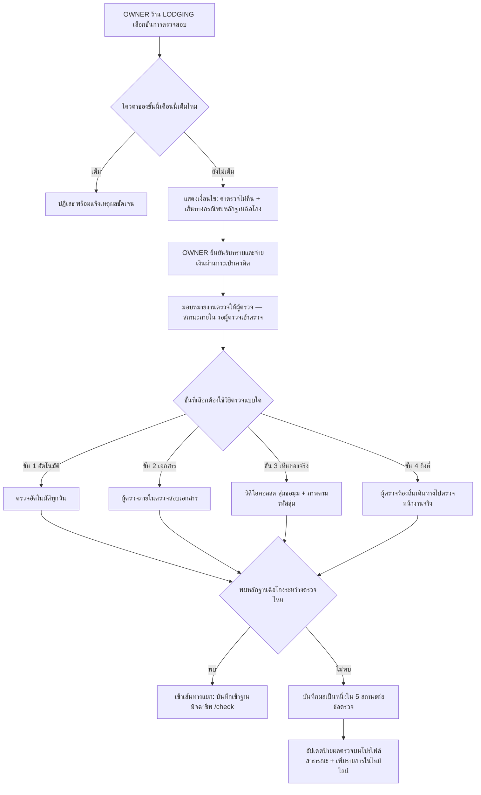
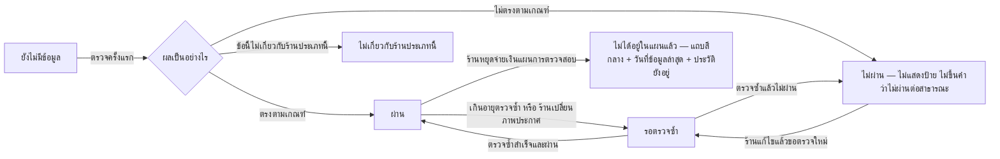

> **โมดูล:** M60-ShopInspection
> **ประเภทเอกสาร:** Product Requirements Document (PRD)
> **เวอร์ชัน:** 1.0
> **วันที่จัดทำ:** 2026-08-28
> **สถานะ:** Draft — รอ user review ก่อน implement; ราคาที่ระบุใน §10.2 เป็นตัวเลขร่างเพื่อวางแผนธุรกิจเท่านั้น ยังไม่ใช่มติราคาสุดท้าย
> **เจ้าของเอกสาร:** BA + PO + PM (ดู [[Feature-Docs-Ownership]])

# PRD: แผนการตรวจสอบร้านค้า (Shop Inspection Plan)

---

## Executive Summary

Deep พบลูกค้ากลุ่มหนึ่งที่ยังไม่เคยมีคำตอบให้: ร้านค้าที่ขายผ่านช่องทางอื่นอยู่แล้ว (โซเชียลมีเดีย/แพลตฟอร์มอื่น) และไม่ต้องการมาสร้างคำสั่งซื้อบน Deep ซ้ำ ๆ เพื่อสะสมความน่าเชื่อถือ แต่ต้องการให้ Deep ไปตรวจสอบข้อเท็จจริงของร้านจากโลกจริงแล้วนำผลมาแสดงบนโปรไฟล์สาธารณะให้ผู้ซื้อค้นดูได้ — คนละกลไกจากระบบ Trust Score เดิมที่สะสมจากประวัติออเดอร์บนแพลตฟอร์ม

ฟีเจอร์นี้เปิดขาย **"แผนการตรวจสอบต่อเนื่อง"** ให้ร้านค้า: ร้านจ่ายค่าแรงให้ Deep ไปหาข้อเท็จจริง ไม่ใช่จ่ายเพื่อซื้อป้าย — ป้ายที่ปรากฏบนโปรไฟล์เป็นผลลัพธ์จากการตรวจ ไม่ใช่ผลลัพธ์จากการจ่ายเงิน (เทียบเคียงรูปแบบมิชลิน/ISO: จ่ายค่าตรวจ ผ่านถึงได้ตรา ไม่ผ่านจ่ายไปก็ไม่ได้ตรา) หลักการนี้เป็นแกนของทั้งฟีเจอร์และกำหนดกฎทุกข้อที่ตามมา โดยเฉพาะกฎที่ว่าสัญญาณอันตราย (เช่นพบชื่ออยู่ในฐานมิจฉาชีพ) ต้องแสดงฟรีเสมอไม่ว่าร้านจะจ่ายเงินหรือไม่

รอบแรกเปิดให้เฉพาะร้านประเภท **บ้านพัก (LODGING)** เท่านั้น และผูกสิทธิ์กับ**ร้าน (Shop)** ไม่ใช่กับบัญชีบุคคล — ร้านประเภทบุคคล (PERSONAL) สมัครได้โดยไม่ต้องมี Business Package การตรวจสอบแบ่งเป็นบันได 4 ขั้น เก็บเงินตามขั้นที่ร้านอยู่ ขั้นที่สูงกว่าครอบคลุมข้อตรวจของขั้นที่ต่ำกว่าทั้งหมดและตรวจถี่ขึ้น ตั้งแต่ตรวจอัตโนมัติต่อเนื่องทุกวัน ไปจนถึงผู้ตรวจของ Deep เดินทางไปยืนที่หน้างานจริง ระบบใช้วิธีตรวจทางไกล (วิดีโอคอลนำชมสดที่สุ่มขอมุมกลางคอล + ภาพถ่ายตามรหัสสุ่ม) เป็นแกนหลักของขั้นกลาง ทำให้ขายได้ทั่วประเทศโดยไม่ต้องรอจัดคิวผู้ตรวจตามจังหวัด

ฟีเจอร์นี้เป็นแกนความน่าเชื่อถือที่**เป็นอิสระจาก Trust Score/Trust Tier โดยสมบูรณ์** ไม่แก้สูตร ไม่กระทบร้านเดิม แสดงผลแยกบล็อกแยกคำกันชัดเจนบนหน้าจอ และไม่ขายเฉพาะข้อดี — ระบบต้องพูดความจริงเสมอแม้เป็นความจริงที่ร้านไม่อยากให้พูด (บัญชีเกินอายุตรวจ, เลิกจ่ายเงิน, ประวัติรอบตรวจเก่าที่ไม่ผ่าน) เพราะคุณค่าทั้งหมดของแผนนี้อยู่ที่ความน่าเชื่อของป้าย ไม่ใช่จำนวนร้านที่ติดป้าย

**ข้อควรทราบสำคัญ:** ฟีเจอร์นี้ขายจริงไม่ได้จนกว่าฟีเจอร์ `00061 — ไดเรกทอรีสาธารณะ` จะขึ้นระบบ (ดู §9.1) เพราะคำโฆษณาหลักคือ "ให้ผู้ซื้อค้นเจอ" — ถ้าเปิดขายก่อนมีที่ให้ค้น คำโฆษณานั้นจะเป็นเท็จ

---

## 1. Business Goals & KPIs

### 1.1 เป้าหมายทางธุรกิจ

| เป้าหมาย | รายละเอียด |
|----------|-----------|
| **เปิดแหล่งรายได้ใหม่ที่ไม่พึ่งพาปริมาณออเดอร์บน Deep** | ร้านที่ขายผ่านช่องทางอื่นอยู่แล้วสามารถซื้อความน่าเชื่อถือที่ตรวจสอบได้โดยไม่ต้องย้ายการขายมาไว้บน Deep — เปิดตลาดลูกค้ากลุ่มใหม่ที่ Trust Score เดิมเข้าไม่ถึง |
| **สร้างมาตรฐานการรับรองที่น่าเชื่อกว่าคำโฆษณาของร้านเอง** | ผลตรวจมาจากบุคคลที่สามที่เป็นกลาง (Deep) ตรวจข้อเท็จจริงที่พิสูจน์ได้ ไม่ใช่คำกล่าวอ้างของร้าน — ยกระดับความน่าเชื่อถือของทั้งแพลตฟอร์ม |
| **วางรากฐานที่ขยายไปยังประเภทร้านอื่นได้ในอนาคต** | เริ่มที่ LODGING เพื่อพิสูจน์โมเดล (บันไดขั้น, วิธีตรวจทางไกล, กฎความโปร่งใส) ก่อนขยายไปประเภทร้านอื่นในเฟสถัดไป |
| **รักษาความน่าเชื่อถือของ Trust Score เดิมไว้ไม่ให้ถูกปนเปื้อน** | แผนการตรวจสอบต้องไม่กลายเป็นทางลัดให้ร้านซื้อคะแนนความน่าเชื่อถือ — ต้องเป็นแกนคู่ขนานที่แยกจากกันอย่างชัดเจนตลอดไป |

### 1.2 ตัวชี้วัดความสำเร็จ (KPIs)

| KPI | คำอธิบาย | เป้าหมาย |
|-----|----------|---------|
| **จำนวนร้าน LODGING ที่สมัครแผนการตรวจสอบ** | นับร้านที่มีแผนการตรวจสอบสถานะ active อย่างน้อย 1 ขั้น | มีร้านสมัครจริงหลัง 00061 ขึ้นระบบ (baseline วัดหลังเปิดขาย) |
| **อัตราการต่ออายุ (retention) ต่อขั้น** | สัดส่วนร้านที่ยังจ่ายต่อหลังครบรอบ 30 วัน เทียบต่อขั้นการตรวจสอบ | ติดตามเป็นรายเดือน ไม่มีเป้าตายตัวในรอบแรก (ไม่มีข้อมูล baseline) |
| **สัดส่วนผลตรวจ "ผ่าน" ต่อรอบตรวจ** | ผ่าน / (ผ่าน + ไม่ผ่าน) ต่อขั้น แยกตามรอบตรวจ | ใช้เฝ้าดูคุณภาพกระบวนการตรวจ ไม่ใช่ตัวชี้วัดธุรกิจโดยตรง |
| **สัญญาณอันตรายที่แจ้งฟรีโดยไม่ขึ้นกับสถานะการจ่ายเงิน** | จำนวนครั้งที่ระบบแสดงคำเตือนความเสี่ยง (เช่น พบในฐานมิจฉาชีพ) แก่ร้านที่ไม่ได้จ่ายเงิน | 100% ของกรณีที่ตรวจพบ — ต้องเป็น 0 เคสที่ถูกซ่อนเพราะร้านไม่จ่าย |

### 1.3 ขอบเขตการส่งมอบ

รอบแรกจำกัดที่ประเภทร้าน **LODGING (บ้านพัก)** เท่านั้น และเป็นฟีเจอร์เชิงพาณิชย์ที่ **พึ่งพาฟีเจอร์ `00061` (ไดเรกทอรีสาธารณะ)** ในการส่งมอบคุณค่าให้ครบตามคำโฆษณา — ทีมพัฒนาสามารถสร้างระบบสมัครแผน/ตรวจสอบ/แสดงผลบนโปรไฟล์ได้ก่อน 00061 แต่ **ห้ามเปิดขายเชิงพาณิชย์จนกว่า 00061 จะพร้อม** เว้นแต่จะปรับคำโฆษณาให้ตรงกับความจริงของสิ่งที่มีอยู่ ณ ขณะนั้น (ดูความเสี่ยงและทางเลือกสำรองใน §6.1 และ §9.1)

---

## 2. User Personas (กลุ่มผู้ใช้งาน)

### 2.1 เจ้าของร้านบ้านพักที่ขายผ่านช่องทางอื่นอยู่แล้ว

**ข้อมูลพื้นฐาน:**
- เจ้าของ/ผู้ดูแลร้านบ้านพัก (โฮมสเตย์ วิลล่า รีสอร์ตขนาดเล็ก) ที่มีช่องทางขาย/รับจองอยู่แล้วนอกแพลตฟอร์ม Deep (โซเชียลมีเดีย เว็บไซต์ของตัวเอง แพลตฟอร์มจองอื่น)
- อาจเป็นบัญชีร้านประเภทบุคคล (PERSONAL) หรือธุรกิจ (BUSINESS) ก็ได้ ไม่จำเป็นต้องมี Business Package

**เป้าหมาย:**
- อยากมีที่พิสูจน์ตัวตน/ที่พักของตัวเองให้ผู้ซื้อที่ยังไม่รู้จักร้านเชื่อใจได้ โดยไม่ต้องย้ายการขายทั้งหมดมาอยู่บน Deep

**ความต้องการ:**
- สมัครให้บุคคลที่สามที่น่าเชื่อถือ (Deep) มาตรวจสอบข้อเท็จจริงของร้าน/ที่พักตามระดับความเข้มที่เลือกได้เอง จ่ายเท่าที่ต้องการความน่าเชื่อถือ
- ผลตรวจที่ผ่านต้องแสดงต่อสาธารณะในที่ที่ผู้ซื้อค้นหาเจอ

**จุดปวด (Pain Points):**
- ระบบความน่าเชื่อถือที่มีอยู่เดิม (Trust Score) ต้องใช้ประวัติออเดอร์บน Deep สะสม ซึ่งร้านกลุ่มนี้ไม่มีและไม่อยากมี เพราะขายอยู่ที่อื่นแล้ว
- ไม่มีช่องทางใดที่บุคคลที่สามมาตรวจสอบข้อเท็จจริงให้แล้วนำไปแสดงต่อผู้ซื้อได้อย่างเป็นระบบ

### 2.2 ผู้ซื้อ/ผู้เข้าพักที่ค้นหาที่พักก่อนตัดสินใจจอง

**ข้อมูลพื้นฐาน:**
- ผู้ที่กำลังค้นหาที่พักผ่านโปรไฟล์สาธารณะของร้าน อาจไม่เคยมีประวัติซื้อขายกับร้านนั้นมาก่อนเลย

**เป้าหมาย:**
- อยากรู้ว่าที่พักที่เห็นในภาพประกาศมีอยู่จริง ตรงกับที่โฆษณา และร้านไม่ได้อยู่ในกลุ่มเสี่ยงมิจฉาชีพ ก่อนโอนเงินจอง

**ความต้องการ:**
- เห็นหลักฐานที่พิสูจน์ได้ (ภาพที่ Deep ถ่ายเอง วันที่ตรวจ ชื่อผู้ตรวจ) ไม่ใช่แค่คำโฆษณาของร้านเอง
- เห็นความจริงทั้งหมดรวมถึงด้านลบ (ร้านเลิกจ่ายแผนแล้ว/ผลตรวจเก่าที่ไม่ผ่าน) ไม่ถูกปิดบัง

**จุดปวด (Pain Points):**
- แยกไม่ออกว่าภาพประกาศของร้านเป็นของจริงหรือภาพที่หามาจากที่อื่น จนกว่าจะโอนเงินไปแล้ว

### 2.3 ผู้ตรวจของ Deep (บทบาทใหม่)

**ข้อมูลพื้นฐาน:**
- บุคลากรที่ทำหน้าที่ตรวจสอบข้อเท็จจริงของร้าน แบ่งเป็นผู้ตรวจภายในของ Deep (ตรวจทางไกลผ่านวิดีโอคอล/เอกสาร) และผู้ตรวจท้องถิ่นที่จ้างเป็นรายครั้งสำหรับขั้นสูงสุดที่ต้องไปถึงหน้างานจริง
- เป็นบทบาทที่แยกจากแอดมินของระบบ โดยเฉพาะผู้ตรวจท้องถิ่นซึ่งเป็นบุคคลภายนอก

**เป้าหมาย:**
- ตรวจสอบข้อเท็จจริงได้ครบตามเกณฑ์ของแต่ละขั้น บันทึกหลักฐานได้ถูกต้อง โดยไม่ต้องเข้าถึงข้อมูลที่ไม่เกี่ยวกับงานของตน

**ความต้องการ:**
- เห็นเฉพาะข้อมูลร้านที่ตนได้รับมอบหมายให้ตรวจ ไม่เห็นสลิปการชำระเงินหรือข้อมูลร้านอื่น

**จุดปวด (Pain Points):**
- (ที่ต้องป้องกันไม่ให้เกิด) ถ้าสิทธิ์ไม่แยกจากแอดมิน ผู้ตรวจท้องถิ่นซึ่งเป็นบุคคลภายนอกจะเห็นข้อมูลการเงิน/ข้อมูลร้านอื่นที่ไม่เกี่ยวข้อง เป็นความเสี่ยงด้านความเป็นส่วนตัวโดยตรง

### 2.4 แอดมิน/ทีมปฏิบัติการ (Admin/Ops)

**ข้อมูลพื้นฐาน:**
- ทีมภายในที่ดูแลภาพรวมแผนการตรวจสอบ จัดการโควตารับสมัครรายเดือน มอบหมายงานให้ผู้ตรวจ และจัดการกรณีพบหลักฐานฉ้อโกงระหว่างการตรวจ

**เป้าหมาย:**
- ควบคุมปริมาณงานตรวจให้ไม่เกินกำลังคนที่มี และดูแลให้ทุกกฎที่แตะไม่ได้ (§4.1) ถูกบังคับใช้จริงในทุกกรณี

**ความต้องการ:**
- เห็นโควตาคงเหลือต่อขั้นต่อเดือน ปิดรับสมัครอัตโนมัติเมื่อเต็มพร้อมข้อความแจ้งชัดเจนต่อผู้ใช้
- เมื่อพบหลักฐานฉ้อโกงระหว่างการตรวจ ต้องมีเส้นทางนำเข้าสู่ฐานมิจฉาชีพที่ `/check` แยกจากขั้นตอนปกติของแผนการตรวจสอบ

**จุดปวด (Pain Points):**
- ถ้าไม่มีเพดานโควตาที่บังคับใช้จริง ทีมตรวจจะรับงานเกินกำลังจนค้างงานตรวจเป็นจำนวนมากโดยไม่มีใครรู้ล่วงหน้า

---

## 3. Business Requirements

### 3.1 สมัครแผนการตรวจสอบต่อเนื่อง ผูกกับร้านไม่ใช่กับคน

**ความต้องการ:**
- ระบบต้องให้ร้านค้าประเภท LODGING สมัครแผนการตรวจสอบต่อเนื่องได้ โดยสิทธิ์และสถานะของแผนผูกกับตัวร้าน (Shop) ไม่ใช่ผูกกับบัญชีบุคคลที่สมัคร
- ร้านประเภทบุคคล (PERSONAL) ต้องสมัครได้เช่นเดียวกับร้านธุรกิจ (BUSINESS) โดยไม่ต้องมี Business Package ก่อน

**Business Rules:**
- แผนการตรวจสอบเป็นสินค้าที่แยกอิสระจาก Business Package และจาก Trust Score/Trust Tier โดยสมบูรณ์ — สมัครได้โดยไม่ต้องพึ่งพาสถานะอื่นของร้าน
- เมื่อร้านเปลี่ยนเจ้าของหรือเปลี่ยนสถานะภายใน แผนการตรวจสอบยังผูกกับร้านเดิม ไม่ย้ายตามบุคคล

**เหตุผล:**
- กลุ่มเป้าหมายหลักคือร้านที่ขายผ่านช่องทางอื่นอยู่แล้วและไม่ต้องการพึ่งพาประวัติออเดอร์บน Deep — การผูกกับร้านทำให้ผลตรวจเป็นคุณสมบัติของ "ร้าน/ที่พัก" ที่ผู้ซื้อกำลังจะทำธุรกรรมด้วย ไม่ใช่ของบุคคลที่บังเอิญเป็นคนกดสมัคร

### 3.2 บันได 4 ขั้นการตรวจสอบ — เก็บเงินทุกขั้น ขั้นบนครอบคลุมขั้นล่างเสมอ

**ความต้องการ:**
- ระบบต้องเปิดให้ร้านเลือกสมัครได้ 4 ขั้นการตรวจสอบ โดยแต่ละขั้นมีชื่อที่บอกสิ่งที่ตรวจ (ไม่ใช่ตัวเลขอันดับ) และร้านจ่ายค่าตรวจตามขั้นที่ตนอยู่ ณ ขณะนั้น

**Business Rules:**

| ขั้นการตรวจสอบ | ข้อที่ตรวจเพิ่มจากขั้นก่อนหน้า | ความถี่การตรวจซ้ำ |
|---|---|---|
| **ขั้นที่ 1 — ตรวจต่อเนื่องอัตโนมัติ** | ตรวจสอบฐานมิจฉาชีพ, ยืนยันเบอร์โทร/ตัวตนขั้นต้น, อายุบัญชี, ที่พักไม่ถูกประกาศซ้ำโดยบัญชีอื่น, ความเร็วในการตอบแชท, ข้อร้องเรียนที่เข้ามา | ทุกวัน |
| **ขั้นที่ 2 — ตรวจเอกสาร** | เพิ่ม: บัตรประชาชน, ชื่อบัญชีรับเงินตรงกับเจ้าของ, เอกสารสิทธิ์ในการปล่อยเช่า, ใบอนุญาตที่เกี่ยวข้อง | ทุก 12 เดือน |
| **ขั้นที่ 3 — ตรวจเห็นของจริง** | เพิ่ม: วิดีโอคอลนำชมสดแบบสุ่มขอมุมระหว่างคอล, หลักฐานการเปิดให้บริการจริง | นำชมสด: ทุก 6 เดือน · หลักฐานการเปิดให้บริการจริง: ทุก 90 วัน |
| **ขั้นที่ 4 — ตรวจถึงที่** | เพิ่ม: ผู้ตรวจของ Deep เดินทางไปยืนตรวจ ณ สถานที่จริง, นับ/วัดสิ่งของจริงหน้างาน, อัลบั้มภาพที่ Deep ถ่ายเอง | ตรวจถึงที่: ทุก 12 เดือน · ทวนสอบข้อของขั้นที่ 3 ซ้ำ: ทุก 3 เดือน |

- ร้านอยู่ที่ขั้นเดียวในเวลาหนึ่ง — ขั้นที่สูงกว่ารวมข้อตรวจของทุกขั้นที่ต่ำกว่าไว้ในตัว ร้านไม่ต้องจ่ายซ้อนหลายขั้นพร้อมกัน
- การเลื่อนขั้นสูงขึ้นไม่ล้างผลตรวจของขั้นก่อนหน้าที่เคยผ่านแล้วทิ้ง — ยังเป็นส่วนหนึ่งของประวัติ

**เหตุผล:**
- ชื่อขั้นที่บอกสิ่งที่ตรวจ (แทนตัวเลขอันดับ) ทำให้ผู้ซื้อเข้าใจได้ทันทีว่าร้านนี้ผ่านการตรวจแบบไหนโดยไม่ต้องแปลความหมายของตัวเลข และเลี่ยงการปะปนกับคำว่า "ระดับ" ที่สงวนไว้ให้ Trust Tier
- ความถี่ที่ต่างกันตามขั้นสะท้อนต้นทุนจริง — ขั้นที่ใช้กำลังคน (3-4) ตรวจถี่กว่าไม่ได้เพราะจำกัดด้วยเวลาคน ขณะที่ขั้นอัตโนมัติตรวจได้ทุกวันโดยไม่มีต้นทุนเพิ่ม

### 3.3 วิธีตรวจสอบทางไกลที่ทำให้ขายได้ทั่วประเทศ

**ความต้องการ:**
- ระบบต้องรองรับการตรวจสอบ "เห็นของจริง" (ขั้นที่ 3) ผ่านช่องทางทางไกล โดยไม่ต้องส่งผู้ตรวจไปถึงสถานที่จริง เพื่อให้ขายได้ทั่วประเทศโดยไม่ต้องรอจัดคิวตามจังหวัด

**Business Rules:**
- การนำชมต้องเป็น **วิดีโอคอลสดเท่านั้น** — ผู้ตรวจสุ่มขอมุมกล้องระหว่างการคอลสด ห้ามรับวิดีโอที่อัดไว้ล่วงหน้ามาแทน เพราะพิสูจน์ความเป็นปัจจุบันของสถานที่ไม่ได้
- ต้องมีการถ่ายภาพประกอบตามรหัสสุ่มที่ Deep ออกให้ในแต่ละรอบตรวจ เพื่อยืนยันว่าภาพถูกถ่ายในช่วงเวลาที่ตรวจจริง ไม่ใช่ภาพเก่า
- ผู้ตรวจท้องถิ่นที่จ้างเป็นรายครั้งใช้เฉพาะขั้นที่ 4 (ตรวจถึงที่) เท่านั้น — ขั้นที่ 3 ไม่ต้องใช้บุคคลในพื้นที่

**เหตุผล:**
- โมเดลผู้ตรวจประจำจังหวัดจะจำกัดการขยายตัวของธุรกิจตามความพร้อมของทีมตรวจในแต่ละพื้นที่ การตรวจทางไกลด้วยวิดีโอคอลสด + รหัสภาพสุ่มทำให้ขยายไปทั่วประเทศได้ทันทีโดยต้นทุนต่ำกว่าการส่งคนไปหน้างานทุกครั้ง ในขณะที่ยังคงพิสูจน์ความเป็นจริงและความเป็นปัจจุบันของหลักฐานได้

### 3.4 ผลตรวจ 5 สถานะ และป้ายที่พูดความจริงเสมอ

**ความต้องการ:**
- ทุกข้อตรวจของทุกขั้นต้องรายงานผลเป็นหนึ่งใน 5 สถานะ และป้ายที่แสดงต่อสาธารณะต้องสะท้อนความจริงล่าสุดเสมอ รวมถึงความจริงที่ร้านไม่อยากให้แสดง

**Business Rules:**
- สถานะผลตรวจมี 5 แบบ: **ผ่าน / ไม่ผ่าน / รอตรวจซ้ำ / ยังไม่มีข้อมูล / ไม่เกี่ยวกับร้านประเภทนี้** — สามสถานะหลัง (รอตรวจซ้ำ, ยังไม่มีข้อมูล, ไม่เกี่ยวกับร้านประเภทนี้) **ห้ามยุบรวมเข้ากับ "ไม่ผ่าน"** เพราะมีความหมายต่างกันโดยสิ้นเชิง
- ผลตรวจที่เกินอายุการตรวจซ้ำตามตารางใน §3.2 ต้องเปลี่ยนสถานะเป็น "รอตรวจซ้ำ" โดยอัตโนมัติ ไม่ใช่ยังคงแสดง "ผ่าน" ต่อไปทั้งที่ข้อมูลอาจล้าสมัยแล้ว
- เมื่อร้านเปลี่ยนภาพประกาศ ข้อตรวจที่เกี่ยวกับ "ภาพตรงกับสถานที่จริง" ต้องตกกลับเป็น "รอตรวจซ้ำ" โดยอัตโนมัติทันที ไม่ต้องรอครบรอบความถี่ตามปกติ
- เมื่อร้านหยุดจ่ายเงินให้แผนการตรวจสอบ ป้ายต้องเปลี่ยนเป็นสถานะที่บอกตรง ๆ ว่าไม่ได้อยู่ในแผนแล้ว (แถบสีเป็นกลาง ไม่ใช่สีที่สื่อการลงโทษ) พร้อมระบุวันที่ข้อมูลล่าสุด — ประวัติผลตรวจของรอบก่อนหน้าต้องยังคงอยู่ ไม่ถูกลบทิ้ง
- ผลตรวจ "ไม่ผ่าน" **ไม่แสดงต่อสาธารณะเป็นคำว่า "ไม่ผ่าน"** — ร้านที่ตรวจไม่ผ่านจะไม่มีป้ายปรากฏ (ดูรายละเอียดเพิ่มเติมใน §3.9 และ §4.3)

**เหตุผล:**
- คุณค่าทั้งหมดของแผนการตรวจสอบอยู่ที่ความน่าเชื่อของป้าย — ถ้าป้ายแสดงข้อมูลเก่าที่ไม่ทันสมัยหรือซ่อนความจริงที่ร้านไม่อยากให้เห็น ผู้ซื้อจะเลิกเชื่อป้ายทั้งระบบในที่สุด ซึ่งทำลายมูลค่าของสินค้าที่ขายอยู่โดยตรง

### 3.5 หลักฐานสาธารณะและหลักฐานปิด

**ความต้องการ:**
- ระบบต้องแยกหลักฐานที่เก็บระหว่างการตรวจออกเป็น 2 ชั้นการมองเห็นอย่างชัดเจน: หลักฐานที่แสดงต่อสาธารณะได้ และหลักฐานที่ต้องปิดเสมอ

**Business Rules:**
- **หลักฐานสาธารณะ** (แสดงต่อผู้ซื้อได้): ภาพที่ Deep ถ่ายเอง, ภาพนิ่งที่ตัดจากวิดีโอคอลนำชมสด, พิกัดสถานที่, ชื่อผู้ตรวจ, วันที่ตรวจ
- **หลักฐานปิด** (ห้ามแสดงต่อสาธารณะ แสดงได้แค่ผลลัพธ์ว่า "ตรวจแล้วผ่าน"): บัตรประชาชน, ภาพเซลฟี่ยืนยันตัวตน, โฉนดที่ดิน/สัญญาเช่า, เลขบัญชีธนาคาร, สเตทเมนต์ธนาคาร

**เหตุผล:**
- ข้อมูลอ่อนไหวส่วนบุคคล (เอกสารยืนยันตัวตน การเงิน) มีไว้เพื่อให้ Deep ใช้ตรวจสอบเท่านั้น การเปิดเผยต่อสาธารณะสร้างความเสี่ยงต่อร้านโดยไม่จำเป็น ในขณะที่ภาพสถานที่/หน้างานเป็นสิ่งที่ต้องเปิดเผยเพื่อให้ผู้ซื้อเชื่อได้จริงว่าที่พักมีอยู่จริง

### 3.6 ไทม์ไลน์ผลตรวจสอบย้อนหลังที่ผู้ซื้อเห็น

**ความต้องการ:**
- โปรไฟล์สาธารณะของร้านต้องแสดงไทม์ไลน์ผลตรวจสอบทุกรอบที่ผ่านมา พร้อมภาพหลักฐานของแต่ละรอบ

**Business Rules:**
- ไทม์ไลน์ต้องแสดงทุกรอบตรวจ ไม่ใช่แค่รอบล่าสุด รวมถึงรอบที่ผลเป็น "ไม่ผ่าน" หรือช่วงที่ร้านหยุดจ่ายเงิน (ตาม §3.4)
- ผู้ซื้อ **ไม่เห็น** สถานะ "รอผู้ตรวจเข้าตรวจ" — สถานะนี้เป็นข้อมูลภายในสำหรับร้านและทีมปฏิบัติการเท่านั้น เพราะเป็นสถานะกระบวนการทำงานของ Deep ไม่ใช่ข้อเท็จจริงเกี่ยวกับร้าน

**เหตุผล:**
- ประวัติที่มองเห็นได้ครบทุกรอบคือสิ่งที่ทำให้ป้ายน่าเชื่อถือกว่าคำโฆษณาทั่วไป — ร้านไม่สามารถ "ล้างประวัติ" ผลตรวจที่ไม่ดีทิ้งได้ ขณะที่สถานะกระบวนการภายใน (เช่นกำลังรอคิวผู้ตรวจ) ไม่มีความหมายต่อการตัดสินใจของผู้ซื้อและอาจสร้างความสับสนโดยไม่จำเป็น

### 3.7 โควตารับสมัครต่อเดือน

**ความต้องการ:**
- ระบบต้องจำกัดจำนวนร้านที่รับเข้าแผนการตรวจสอบต่อเดือนได้ตามกำลังของทีมตรวจ

**Business Rules:**
- แต่ละขั้น (โดยเฉพาะขั้นที่ต้องใช้กำลังคน — ขั้นที่ 3 และ 4) ต้องมีเพดานจำนวนร้านที่รับสมัครใหม่ได้ต่อเดือน
- เมื่อโควตาเต็ม ระบบต้องปิดรับสมัครและ**บอกตรง ๆ ว่าเต็มแล้ว** — ห้ามรับสมัครแบบไม่จำกัดแล้วปล่อยให้งานค้างเงียบ ๆ โดยไม่แจ้งผู้สมัคร

**เหตุผล:**
- ขั้นที่ 3-4 ผูกกับเวลาของผู้ตรวจจริง ไม่ใช่ทรัพยากรที่ขยายได้ไม่จำกัดเหมือนระบบอัตโนมัติ การรับสมัครเกินกำลังจะทำให้คิวตรวจยืดยาวจนร้านที่จ่ายเงินไปแล้วไม่ได้รับบริการตามที่คาดหวัง ซึ่งทำลายความน่าเชื่อถือของสินค้าโดยตรง

### 3.8 สิทธิ์การจัดการแผนและบทบาทผู้ตรวจ

**ความต้องการ:**
- ระบบต้องจำกัดว่าใครในร้านมีสิทธิ์สมัคร/ยกเลิก/ส่งเอกสารให้แผนการตรวจสอบได้ และแยกบทบาทผู้ตรวจออกจากบทบาทแอดมินอย่างชัดเจน

**Business Rules:**
- เฉพาะ **OWNER** ของร้านเท่านั้นที่สมัคร ยกเลิก หรือส่งเอกสารให้แผนการตรวจสอบได้ในรอบแรก — ไม่มีการกระจายสิทธิ์นี้ให้บทบาทอื่นในร้าน
- บทบาท **ผู้ตรวจ** เป็นบทบาทแยกจากแอดมินของระบบ โดยเฉพาะผู้ตรวจท้องถิ่นซึ่งเป็นบุคคลภายนอก — ผู้ตรวจต้อง**ห้ามเห็น**สลิปการชำระเงินหรือข้อมูลของร้านอื่นที่ตนไม่ได้รับมอบหมาย

**เหตุผล:**
- แผนการตรวจสอบมีผลต่อภาพลักษณ์สาธารณะและมีค่าใช้จ่ายต่อเนื่อง จำกัดสิทธิ์ไว้ที่ OWNER ลดความเสี่ยงที่พนักงานร้านจะสมัคร/ยกเลิกโดยไม่ได้รับอนุมัติจากเจ้าของจริง
- ผู้ตรวจท้องถิ่นเป็นบุคคลภายนอกที่ไม่ใช่พนักงาน Deep การให้เห็นข้อมูลการเงินหรือข้อมูลร้านอื่นเป็นความเสี่ยงด้านความเป็นส่วนตัวที่ไม่จำเป็นต่องานตรวจของตน

### 3.9 การยกเลิก การไม่คืนเงิน และเส้นทางกรณีพบหลักฐานฉ้อโกง

**ความต้องการ:**
- ระบบต้องกำหนดกฎการยกเลิก/การคืนเงินที่ชัดเจน และแยกเส้นทางการจัดการกรณีที่พบหลักฐานฉ้อโกงระหว่างการตรวจออกจากกระบวนการตรวจปกติ

**Business Rules:**
- ค่าตรวจที่จ่ายไปแล้ว **ไม่คืน** ไม่ว่าผลตรวจจะเป็นอย่างไร
- ตรวจไม่ผ่าน = ไม่มีป้ายปรากฏต่อสาธารณะ **และไม่ขึ้นคำว่า "ไม่ผ่าน"** ให้บุคคลทั่วไปเห็น (ต่างจากกรณีพบหลักฐานฉ้อโกง ซึ่งเข้าเส้นทางที่ §4.3/§4.1 ข้อ 2 ครอบคลุมไว้ต่างหาก)
- หากระหว่างการตรวจพบหลักฐานการฉ้อโกง (ไม่ใช่แค่ "ตรวจไม่ผ่าน" ตามเกณฑ์ปกติ) ต้องมีเส้นทางแยกที่นำข้อมูลเข้าสู่ฐานมิจฉาชีพที่ `/check` — เส้นทางนี้เป็นคนละกระบวนการจากการให้ผลตรวจ "ไม่ผ่าน" ตามปกติ
- ร้านต้องเห็นและรับทราบเงื่อนไขทั้งสองข้อข้างต้น (ไม่คืนเงิน + เส้นทางกรณีพบหลักฐานฉ้อโกง) **ก่อนกดจ่ายเงิน** ทุกครั้ง

**เหตุผล:**
- ค่าตรวจเป็นค่าแรงของกระบวนการตรวจสอบซึ่งเกิดขึ้นแล้วไม่ว่าผลจะออกมาเป็นอย่างไร — สอดคล้องกับหลักการ "ขายการตรวจ ไม่ใช่ขายป้าย" ที่วางไว้ตั้งแต่ต้น
- การพบหลักฐานฉ้อโกงเป็นเรื่องที่กระทบผู้ใช้ทั้งแพลตฟอร์ม ไม่ใช่แค่เรื่องภายในของแผนการตรวจสอบ จึงต้องมีเส้นทางที่เชื่อมกับกลไกป้องกันมิจฉาชีพระดับแพลตฟอร์ม (`/check`) — และร้านต้องรับทราบความเสี่ยงนี้ล่วงหน้าก่อนตัดสินใจจ่ายเงิน เพื่อความโปร่งใส

---

### 3.10 ขอบเขตของผลตรวจ — ผูกตามสิ่งที่ข้อนั้นตรวจ

**ความต้องการ:**
- ร้านบ้านพักหนึ่งร้านมีที่พักได้หลายหลัง และอาจอยู่คนละจังหวัด ระบบต้องกำหนดชัดเจนว่าผลตรวจแต่ละข้อครอบคลุมแค่ไหน มิฉะนั้นการตรวจที่พักหลังเดียวจะทำให้ทุกหลังในร้านนั้นได้ป้ายไปด้วย ทั้งที่ไม่มีใครเคยไปเห็น

**Business Rules:**
- **ขอบเขตของผลตรวจตัดสินจาก "สิ่งที่ข้อนั้นตรวจ" ไม่ใช่จาก "ขั้นที่ข้อนั้นอยู่"** — ข้อที่ตรวจตัวร้านหรือตัวเจ้าของ ผูกกับร้าน · ข้อที่ตรวจตัวสถานที่ ผูกกับที่พักรายหลัง

| ผูกกับร้าน (ใช้ร่วมทุกหลัง) | ผูกกับที่พักรายหลัง |
|---|---|
| ฐานมิจฉาชีพ · ยืนยันเบอร์โทร/ตัวตนขั้นต้น · อายุบัญชี · ความเร็วตอบแชท · ข้อร้องเรียน · บัตรประชาชนคู่เซลฟี่ · ชื่อบัญชีรับเงินตรงกับเจ้าของ | ที่พักไม่ถูกประกาศซ้ำโดยบัญชีอื่น · เอกสารสิทธิ์ปล่อยเช่า · ใบอนุญาตประกอบกิจการโรงแรม · วิดีโอคอลนำชมสด · หลักฐานการเปิดให้บริการจริง · สถานที่มีอยู่จริงตามพิกัด · ภาพประกาศตรงกับของจริง · จำนวนและประเภทห้อง · สิ่งอำนวยความสะดวก · การเข้าถึงได้จริง · อัลบั้มภาพที่ Deep ถ่ายเอง |

- ที่พักหลังที่ยังไม่เคยถูกตรวจในข้อที่ผูกรายหลัง ต้องแสดงสถานะ "ยังไม่มีข้อมูล" **ห้ามสืบทอดผลตรวจ "ผ่าน" จากหลังอื่นของร้านเดียวกัน และห้ามแสดงเป็น "ไม่ผ่าน"**
- ร้านที่ต้องการให้ที่พักหลายหลังมีผลตรวจครบ ต้องขอตรวจข้อที่ผูกรายหลังแยกทีละหลัง โดยแต่ละหลังมีรอบตรวจ วันที่ และหลักฐานของตัวเองแยกจากกัน

**เหตุผล:**
- การผูกตามขั้นทำให้เกิดรูที่อธิบายไม่ได้ — โฉนดของบ้านหลัง A ไม่ได้พิสูจน์อะไรเกี่ยวกับบ้านหลัง B เลย และการนำชมทางวิดีโอหลังเดียวก็ไม่ได้บอกอะไรเกี่ยวกับอีก 4 หลัง การผูกตามสิ่งที่ตรวจจึงเป็นกติกาเดียวที่อธิบายตัวเองได้โดยไม่ต้องจำว่าขั้นไหนผูกอะไร
- ผลข้างเคียงที่ต้องยอมรับ: **ขั้นที่ 2 และ 3 กลายเป็นงานที่โตตามจำนวนที่พัก** ไม่ใช่งานคงที่ต่อร้าน ⇒ ร้านที่มีหลายหลังจะมีต้นทุนตรวจสูงกว่าร้านหลังเดียว ซึ่งสะท้อนต้นทุนจริงและต้องสะท้อนในราคาด้วย (ราคายังไม่เคาะ ดู §10.2)
- สถานะ "ยังไม่มีข้อมูล" ที่ออกแบบไว้แล้วใน §3.4 รองรับกรณีนี้พอดี — หลังที่ยังไม่เคยตรวจไม่ใช่หลังที่มีปัญหา

---

## 4. Business Rules & Constraints

### 4.1 กฎทางธุรกิจหลัก (แตะไม่ได้)

| กฎ | คำอธิบาย |
|----|----------|
| **แกนอิสระจาก Trust Score/Trust Tier โดยสมบูรณ์** | ระบบตรวจสอบนี้ไม่แก้สูตรคำนวณ Trust Score ไม่กระทบร้านเดิม เป็นแกนความน่าเชื่อถือคนละบล็อกคนละคำบนหน้าจอเสมอ ไม่มีจุดใดที่ผลตรวจแปลงเป็นคะแนน Trust Score หรือในทางกลับกัน |
| **สัญญาณอันตรายฟรีเสมอสำหรับทุกร้าน** | คำเตือนความเสี่ยง (เช่น พบชื่อในฐานมิจฉาชีพ) ไม่ใช่สินค้าที่ต้องจ่ายเงินถึงจะเห็น — ใช้กับทุกร้านไม่ว่าจะจ่ายแผนการตรวจสอบหรือไม่ Deep ห้ามรับเงินเพื่อแลกกับการไม่พูดความเสี่ยงเด็ดขาด |
| **อันดับในผลค้นหาซื้อไม่ได้** | การสมัครแผนการตรวจสอบหรือจ่ายเงินขั้นสูงไม่มีผลต่อลำดับการแสดงผลในผลค้นหาของไดเรกทอรีสาธารณะ |
| **ไม่ยึดสิทธิ์ฟรีเดิมของร้านแม้แต่ข้อเดียว** | สิ่งที่ร้านมีสิทธิ์ใช้ฟรีอยู่แล้ววันนี้ (ก่อนมีฟีเจอร์นี้) ต้องยังใช้ได้ฟรีเหมือนเดิมทุกประการ ไม่มีการย้ายของฟรีเดิมไปอยู่หลังกำแพงการจ่ายเงินของแผนนี้ |
| **ป้ายพูดความจริงเสมอ รวมถึงความจริงที่ร้านไม่อยากให้พูด** | ผลตรวจเกินอายุ = แสดง "รอตรวจซ้ำ" ไม่ใช่คงป้าย "ผ่าน" ต่อไป · เลิกจ่ายเงิน = แถบสีกลาง + ข้อความชัดเจนว่าไม่ได้อยู่ในแผนแล้ว + วันที่ข้อมูลล่าสุด · ประวัติรอบตรวจเก่าไม่ถูกลบทิ้งไม่ว่ากรณีใด |
| **ตรวจข้อเท็จจริงที่พิสูจน์ได้ ไม่ตัดสินคุณภาพ** | ทุกข้อตรวจต้องเป็นข้อเท็จจริงที่ยืนยันได้ด้วยหลักฐาน (เอกสาร ภาพ วิดีโอคอล) ถ้อยคำอาจให้ความรู้สึกแบบมาตรฐานคุณภาพได้ แต่ Deep ไม่รับความรับผิดชอบแบบผู้ตัดสินคุณภาพที่พัก |
| **สงวนโทนสีเตือนภัย/ถ้อยคำลงโทษให้กรณีมิจฉาชีพจริงเท่านั้น** | สีแดงหรือถ้อยคำที่ฟังดูเป็นการลงโทษใช้ได้เฉพาะกับกรณีพบหลักฐานฉ้อโกงจริงเท่านั้น ร้านที่เลิกจ่ายเงินแผนการตรวจสอบไม่ได้ทำผิดอะไร ต้องไม่ถูกแสดงในโทนเดียวกับร้านที่พบหลักฐานฉ้อโกง |

### 4.2 ข้อจำกัดทางธุรกิจ

| ข้อจำกัด | รายละเอียด |
|---------|-----------|
| **ขอบเขตรอบแรกจำกัดที่ประเภทร้าน LODGING เท่านั้น** | ร้านประเภทอื่นสมัครแผนการตรวจสอบนี้ไม่ได้ในรอบแรก (ดู §5 Out of Scope) |
| **ผูกกับร้าน ไม่ใช่กับบุคคล** | สิทธิ์และสถานะของแผนเป็นของ Shop ไม่ย้ายตามผู้ใช้ที่สมัคร |
| **ไม่ต้องมี Business Package ก็สมัครได้** | ร้านประเภทบุคคล (PERSONAL) สมัครแผนการตรวจสอบได้โดยตรง ไม่ใช่สิทธิพิเศษของร้าน Business เท่านั้น |
| **สิทธิ์การจัดการจำกัดที่ OWNER เท่านั้นในรอบแรก** | ไม่มีระบบกระจายสิทธิ์ตามบทบาท (role-based) ให้พนักงานร้านคนอื่นในรอบแรก |
| **ค่าตรวจไม่คืนไม่ว่ากรณีใด** | รวมถึงกรณีตรวจไม่ผ่าน — ผู้สมัครต้องรับทราบเงื่อนไขนี้ก่อนจ่ายเงินเสมอ |
| **ขั้นที่ 3-4 จำกัดด้วยกำลังคนของทีมตรวจ** | ต้องมีโควตารับสมัครรายเดือน ไม่ใช่ทรัพยากรที่ขยายได้ไม่จำกัดเหมือนขั้นอัตโนมัติ |
| **ข้อตรวจที่ตรวจสถานที่ ครอบเฉพาะหลังที่ไปตรวจ** | ร้านที่มีที่พักหลายหลังต้องขอตรวจข้อกลุ่มนี้แยกรายหลัง หลังที่ยังไม่ตรวจแสดง "ยังไม่มีข้อมูล" ⇒ งานตรวจขั้นที่ 2-4 โตตามจำนวนที่พัก (ดู §3.10) |
| **ผู้ซื้อไม่เห็นสถานะกระบวนการภายใน** | สถานะ "รอผู้ตรวจเข้าตรวจ" เป็นข้อมูลภายในของร้าน/ทีมปฏิบัติการเท่านั้น ไม่แสดงต่อสาธารณะ |

### 4.3 เหตุผลที่ผลตรวจไม่ใช่ "ผ่าน"

| สถานะ | เมื่อใช้ | ผลต่อป้ายสาธารณะ |
|-------|---------|-------------------|
| **ผ่าน** | ตรวจครบตามเกณฑ์ของข้อนั้นแล้วและยังอยู่ในอายุการตรวจซ้ำ | แสดงเป็นข้อที่ผ่านการตรวจสอบ พร้อมหลักฐานสาธารณะ (ถ้ามี) |
| **ไม่ผ่าน** | ตรวจแล้วพบว่าข้อเท็จจริงไม่ตรงตามเกณฑ์ (ไม่ใช่หลักฐานฉ้อโกง — กรณีฉ้อโกงเข้าเส้นทางแยกตาม §3.9) | ไม่มีป้ายปรากฏ ไม่ขึ้นคำว่า "ไม่ผ่าน" ต่อสาธารณะ (ดู §3.9) |
| **รอตรวจซ้ำ** | ผลตรวจเดิมเกินอายุตามความถี่ใน §3.2 หรือมีการเปลี่ยนแปลงที่ต้องตรวจใหม่ (เช่น เปลี่ยนภาพประกาศ) | แสดงสถานะ "รอตรวจซ้ำ" พร้อมวันที่ตรวจล่าสุด — ไม่ใช่ "ไม่ผ่าน" |
| **ยังไม่มีข้อมูล** | ยังไม่เคยมีการตรวจข้อนั้นเลย (เช่น ร้านเพิ่งสมัครขั้นต่ำ ยังไม่ถึงขั้นที่มีข้อตรวจนี้) | แสดงว่ายังไม่มีข้อมูล ไม่ตีความเป็นผลลบ |
| **ไม่เกี่ยวกับร้านประเภทนี้** | ข้อตรวจนั้นไม่มีความหมายกับร้านประเภทที่กำลังพิจารณา | ไม่แสดงเป็นข้อที่ขาด ไม่นับรวมในสัดส่วนผ่าน/ไม่ผ่าน |

---

## 5. Out of Scope (นอกขอบเขต)

สิ่งที่ระบบนี้ **ไม่รองรับ** หรือ **ไม่รับผิดชอบ** ในรอบแรก:

| หัวข้อ | คำอธิบาย |
|--------|----------|
| **ร้านประเภทอื่นนอกเหนือจาก LODGING** | รอบแรกจำกัดเฉพาะร้านบ้านพัก — ร้านขายออนไลน์ (ONLINE_SALES) และร้านบริการ/คิวงาน (SERVICE_QUEUE) ยังไม่รองรับแผนการตรวจสอบนี้ |
| **ไดเรกทอรีสาธารณะและ SEO** | การทำให้ผู้ซื้อ "ค้นเจอ" ร้านที่ผ่านการตรวจเป็นฟีเจอร์แยก (`00061 — ไดเรกทอรีสาธารณะ`) — ฟีเจอร์นี้รับผิดชอบเฉพาะการสมัคร/ตรวจสอบ/แสดงผลบนโปรไฟล์ของร้านเท่านั้น |
| **การเชื่อมโยงกับ Trust Score** | ผลตรวจไม่มีผลต่อคะแนน Trust Score หรือ Trust Tier ในทางใดทางหนึ่งทั้งสิ้น (ดู §4.1) |
| **ระบบชำระเงินใหม่ (payment gateway)** | ใช้กระเป๋าเครดิตของร้าน (SellerWallet) และการอัปโหลดสลิปที่มีอยู่แล้วในระบบเดิม ไม่สร้างช่องทางชำระเงินใหม่ |
| **ระบบสิทธิ์แบบกระจายตามบทบาทฝั่งร้าน (role-based permission)** | รอบแรกจำกัดสิทธิ์การจัดการแผนไว้ที่ OWNER เท่านั้น (ดู §3.8, §4.2) — การกระจายสิทธิ์ให้บทบาทอื่นในร้านเป็นเรื่องของเฟสถัดไป |
| **การตัดสินคุณภาพของที่พัก** | ระบบตรวจเฉพาะข้อเท็จจริงที่พิสูจน์ได้ (มีอยู่จริง ตรงกับภาพ เอกสารถูกต้อง) ไม่ประเมินความสวยงาม ความสะอาด หรือคุณภาพการบริการ |

---

## 6. Risks & Mitigation (ความเสี่ยงและแนวทางแก้ไข)

### 6.1 ความเสี่ยงทางธุรกิจ

| ความเสี่ยง | ผลกระทบ | ระดับความรุนแรง | แนวทางแก้ไข |
|-----------|---------|-----------------|-------------|
| **ผู้ซื้อสับสนระหว่างแกน Trust Score/Trust Tier กับแกนแผนการตรวจสอบ** | ผู้ซื้อเข้าใจผิดว่าป้ายผลตรวจคือส่วนหนึ่งของคะแนนความน่าเชื่อถือเดิม หรือในทางกลับกัน ทำให้ตัดสินใจผิดพลาด | กลาง | จัดวางแยกบล็อกแยกคำบนหน้าจอสาธารณะอย่างชัดเจนตั้งแต่การออกแบบ (ดู §4.1) ไม่ใช้คำศัพท์ร่วมกัน |
| **ร้านใหม่ที่จ่ายแพงสุด (ขั้นที่ 4) ยังขึ้น Trust Tier ต่ำสุด** เพราะไม่มีประวัติออเดอร์บน Deep | ร้านที่ลงทุนสูงสุดกับแผนการตรวจสอบอาจรู้สึกว่าไม่คุ้มค่าเพราะยังโชว์ Trust Tier ระดับเริ่มต้นอยู่ดี | กลาง | บรรเทาด้วยการจัดวางตำแหน่งบนหน้าจอเท่านั้น — **ไม่ให้แต้ม Trust Score พิเศษเพื่อชดเชย** เพราะขัดกับกฎ "แกนอิสระจาก Trust Score" ใน §4.1 โดยตรง |
| **ขั้นที่ 3-4 ผูกกับเวลาของคน ขายแบบไม่จำกัดจำนวนไม่ได้** | หากรับสมัครเกินกำลังทีมตรวจ จะเกิดคิวค้างและร้านที่จ่ายเงินไปแล้วไม่ได้รับบริการตามคาด | สูง | โควตารับสมัครรายเดือนต่อขั้น (§3.7) พร้อมข้อความแจ้งชัดเจนเมื่อเต็ม |
| **ความรับผิดหากร้านที่เคยตรวจผ่านโกงลูกค้าในภายหลัง** | ผู้ซื้อที่เชื่อป้ายแล้วถูกโกง อาจเข้าใจว่า Deep รับประกันความประพฤติของร้านตลอดไป | สูง | รับรองเฉพาะข้อเท็จจริง ณ วันที่ตรวจเท่านั้น ไม่รับรองอนาคตหรือคุณภาพการให้บริการ — ต้องเขียนถ้อยคำนี้ให้ชัดเจนบนหน้าจอทุกจุดที่แสดงป้ายผลตรวจ ไม่ใช่แค่ในเอกสารกฎหมาย |

### 6.2 ความเสี่ยงทางเทคนิค

| ความเสี่ยง | ผลกระทบ | แนวทางแก้ไข |
|-----------|---------|-------------|
| **รอบตัดเครดิตอัตโนมัติ (30 วัน) ผิดจังหวะ** | ร้านที่จ่ายเงินแล้วถูกระบบเข้าใจผิดว่าหยุดจ่าย ทำให้ป้ายเปลี่ยนเป็นสถานะ "ไม่ได้อยู่ในแผน" ทั้งที่ยังมีเครดิตอยู่ | ต้องมี buffer เวลาที่ชัดเจนระหว่างรอบตัดเครดิตกับการเปลี่ยนสถานะป้ายสาธารณะ ทดสอบกรณีขอบ (edge case) ของรอบวันที่ก่อนเปิดใช้งานจริง |
| **หลักฐานปิดถูกแสดงต่อสาธารณะโดยไม่ตั้งใจ** | ข้อมูลอ่อนไหว (บัตรประชาชน สเตทเมนต์) รั่วไหลสู่สาธารณะ สร้างความเสียหายร้ายแรงต่อร้านและความน่าเชื่อถือของ Deep | ต้องแยกชั้นการมองเห็นระหว่างหลักฐานสาธารณะ/ปิดตั้งแต่ขั้นออกแบบ (§3.5) และมีการทดสอบเฉพาะเจาะจงว่าหลักฐานปิดไม่รั่วไปยังหน้าจอสาธารณะไม่ว่าทางใด |
| **ผู้ตรวจท้องถิ่นเข้าถึงข้อมูลนอกเหนือจากงานที่ได้รับมอบหมาย** | บุคคลภายนอกเห็นข้อมูลการเงินหรือข้อมูลร้านอื่นที่ไม่เกี่ยวข้อง เป็นความเสี่ยงด้านความเป็นส่วนตัวและความไว้วางใจ | สิทธิ์ของบทบาทผู้ตรวจต้องจำกัดเฉพาะร้าน/งานที่ได้รับมอบหมายเท่านั้น และห้ามเห็นข้อมูลการชำระเงินโดยเด็ดขาด (§3.8) |

---

## 7. Glossary (อภิธานศัพท์)

| คำศัพท์ | ความหมาย |
|---------|----------|
| **แผนการตรวจสอบ (Inspection Plan)** | สินค้าที่ร้านสมัครเพื่อให้ Deep ตรวจสอบข้อเท็จจริงต่อเนื่อง ผูกกับร้าน ไม่ใช่กับบุคคล — ห้ามเรียกว่า "แพ็กเกจ" |
| **ขั้นการตรวจสอบ (Inspection Step)** | หนึ่งใน 4 ขั้นความเข้มของการตรวจ (ตรวจต่อเนื่องอัตโนมัติ / ตรวจเอกสาร / ตรวจเห็นของจริง / ตรวจถึงที่) ชื่อขั้นบอกสิ่งที่ตรวจ ไม่ใช่ตัวเลขอันดับ — ห้ามเรียกว่า "ระดับ" (คำนี้สงวนให้ Trust Tier) |
| **ผลตรวจ (Inspection Result)** | ผลลัพธ์ของการตรวจแต่ละข้อในแต่ละรอบ มี 5 สถานะ: ผ่าน / ไม่ผ่าน / รอตรวจซ้ำ / ยังไม่มีข้อมูล / ไม่เกี่ยวกับร้านประเภทนี้ |
| **ป้ายผลตรวจสอบ (Inspection Badge)** | สิ่งที่แสดงต่อสาธารณะบนโปรไฟล์ร้าน มาจากผลตรวจที่ผ่านเท่านั้น เป็นอิสระจากระบบ Verification Badge/Achievement Badge เดิม |
| **หลักฐานสาธารณะ (Public Evidence)** | หลักฐานที่แสดงต่อผู้ซื้อได้ เช่น ภาพที่ Deep ถ่ายเอง ภาพนิ่งจากวิดีโอคอล พิกัด ชื่อผู้ตรวจ วันที่ตรวจ |
| **หลักฐานปิด (Private Evidence)** | หลักฐานที่ห้ามแสดงต่อสาธารณะ เช่น บัตรประชาชน เซลฟี่ยืนยันตัวตน โฉนด/สัญญาเช่า บัญชีธนาคาร สเตทเมนต์ — แสดงได้เฉพาะผลลัพธ์ว่าตรวจแล้วผ่าน |
| **ผู้ตรวจ (Inspector)** | บทบาทที่ทำหน้าที่ตรวจสอบข้อเท็จจริงของร้าน แยกจากแอดมิน แบ่งเป็นผู้ตรวจภายในของ Deep (ตรวจทางไกล) และผู้ตรวจท้องถิ่น (จ้างรายครั้งสำหรับขั้นที่ 4) |
| **การตรวจทางไกล (Remote Inspection)** | วิธีตรวจ "เห็นของจริง" ของขั้นที่ 3 ผ่านวิดีโอคอลนำชมสดที่สุ่มขอมุมกลางคอล ร่วมกับภาพถ่ายตามรหัสสุ่มที่ Deep ออกให้ |
| **โควตารับสมัคร (Monthly Intake Quota)** | เพดานจำนวนร้านใหม่ที่รับเข้าแผนการตรวจสอบต่อเดือนในแต่ละขั้น ปิดรับเมื่อเต็มพร้อมแจ้งชัดเจน |
| **ฐานมิจฉาชีพ (`/check`)** | ฐานข้อมูลที่มีอยู่แล้วของแพลตฟอร์ม ใช้เป็นข้อตรวจของขั้นที่ 1 และเป็นปลายทางของเส้นทางกรณีพบหลักฐานฉ้อโกงระหว่างการตรวจ |

---

## 8. Success Metrics (ตัวชี้วัดความสำเร็จ)

เมื่อระบบทำงานได้ดี ควรมีผลลัพธ์ดังนี้:

| ตัวชี้วัด | ค่าที่คาดหวัง | วิธีวัด |
|----------|---------------|--------|
| **แยกแกนความน่าเชื่อถือได้ชัดเจน** | ไม่มีจุดใดในระบบที่ผลตรวจแปลงเป็นคะแนน Trust Score หรือในทางกลับกัน | ตรวจสอบโค้ด/หน้าจอทุกจุดที่แสดงทั้งสองแกนร่วมกัน — ต้องแยกบล็อกแยกคำเสมอ |
| **สัญญาณอันตรายไม่เคยถูกซ่อนเพราะเงื่อนไขการจ่ายเงิน** | 0 เคสที่ร้านไม่จ่ายเงินแล้วคำเตือนความเสี่ยงไม่แสดง | สุ่มตรวจร้านที่ไม่ได้สมัครแผนแต่พบในฐานมิจฉาชีพ ต้องเห็นคำเตือนเหมือนร้านที่จ่ายเงิน |
| **ป้ายไม่เคยแสดงข้อมูลเกินอายุโดยไม่แจ้ง** | ผลตรวจที่เกินความถี่ตรวจซ้ำตาม §3.2 เปลี่ยนเป็น "รอตรวจซ้ำ" อัตโนมัติทุกกรณี ไม่มีเคสค้างเป็น "ผ่าน" เกินอายุ | ทดสอบเคสที่ผลตรวจใกล้ครบกำหนดตรวจซ้ำในแต่ละขั้น |
| **ประวัติรอบตรวจไม่เคยถูกลบ** | ร้านที่หยุดจ่ายเงินหรือตรวจไม่ผ่านยังมีประวัติรอบตรวจก่อนหน้าปรากฏในไทม์ไลน์สาธารณะครบถ้วน | ทดสอบยกเลิกแผนแล้วตรวจสอบว่าไทม์ไลน์เดิมยังอยู่ |
| **โควตารับสมัครบังคับใช้จริง** | เมื่อโควตาของขั้นใดเต็ม ระบบปฏิเสธการสมัครใหม่พร้อมข้อความแจ้งเหตุผล ไม่ใช่รับไว้เงียบ ๆ | ทดสอบสมัครจนครบโควตาแล้วสมัครเพิ่มอีกหนึ่งราย |

---

## 9. Dependencies & Assumptions

### 9.1 สิ่งที่ต้องพึ่งพา (Dependencies)

| ระบบ/ส่วนประกอบ | ความสัมพันธ์ |
|-----------------|-------------|
| **ฟีเจอร์ `00061` — ไดเรกทอรีสาธารณะ + SEO** | **ต้องขึ้นระบบก่อนเปิดขายเชิงพาณิชย์จริง** เพราะคำโฆษณาหลักของแผนการตรวจสอบคือ "ให้ผู้ซื้อค้นเจอ" — ถ้าขายก่อนมีที่ให้ค้น คำโฆษณานั้นเป็นเท็จ ทางเลือกสำรองคือปล่อยฟีเจอร์นี้ก่อนได้ถ้าปรับคำโฆษณาให้ตรงกับความจริง ณ ขณะนั้น (เช่น "ผลตรวจแสดงบนโปรไฟล์ร้าน" แทน "ให้ผู้ซื้อค้นเจอ") |
| **ฐานข้อมูลมิจฉาชีพที่ `/check`** | ใช้เป็นข้อตรวจของขั้นที่ 1 (ตรวจฐานมิจฉาชีพ) และเป็นปลายทางของเส้นทางกรณีพบหลักฐานฉ้อโกงระหว่างการตรวจ (§3.9) |
| **ระบบยืนยันตัวตนเดิม (Verification L1/L2/L3)** | ใช้เป็นฐานของข้อตรวจในขั้นที่ 1 (ยืนยันเบอร์โทร/ตัวตนขั้นต้น) และขั้นที่ 2 (บัตรประชาชน) — ไม่สร้างระบบยืนยันตัวตนใหม่ซ้ำซ้อน |
| **กระเป๋าเครดิตของร้าน (SellerWallet) และการอัปโหลดสลิปที่มีอยู่แล้ว** | ใช้เป็นวิธีชำระเงินของแผนการตรวจสอบ ไม่สร้างช่องทางชำระเงินใหม่ |
| **กลไกตัดเครดิตอัตโนมัติรอบ 30 วัน (ที่มีอยู่แล้วจาก Inventory Add-on)** | ใช้รูปแบบเดียวกันสำหรับตัดเครดิตค่าแผนการตรวจสอบตามขั้นที่ร้านสมัคร |
| **`safepay-ux` gate (Hard Rule 8)** | งานนี้แตะ UI สาธารณะ (โปรไฟล์ร้าน ไทม์ไลน์ผลตรวจ) และ UI ฝั่งร้าน (สมัครแผน) — ต้องผ่าน `safepay-ux` ออก Design Spec ก่อนแตะโค้ดฝั่งหน้าจอ |

### 9.2 สมมติฐาน (Assumptions)

- **A-1:** ร้าน LODGING ที่เป็นกลุ่มเป้าหมายมีช่องทางขายอื่นอยู่แล้วและไม่ต้องพึ่งพาประวัติออเดอร์บน Deep เพื่อพิสูจน์ตัวตน — ฉะนั้นแผนนี้ต้องยืนได้ด้วยตัวเองโดยไม่ต้องพึ่งพา Trust Score
- **A-2:** จำนวนร้านที่สมัครขั้นที่ 3-4 ในช่วงแรกไม่เกินกำลังของทีมตรวจสอบภายใน/ผู้ตรวจท้องถิ่นที่มีอยู่ — โควตารายเดือนเพียงพอควบคุมสถานการณ์จนกว่าจะขยายทีม
- **A-3:** ผู้ซื้อที่เห็นป้ายผลตรวจสามารถแยกความหมายจาก Trust Tier ได้เมื่อวางแยกบล็อกกันชัดเจนบนหน้าจอ โดยไม่ต้องมีคำอธิบายซับซ้อนเพิ่มเติม
- **A-4:** ราคาตั้งต้นที่ระบุในเอกสารนี้ (§10.2) เป็นเพียงตัวเลขร่างเพื่อวางแผนธุรกิจ ยังไม่ใช่มติราคาสุดท้าย — การพัฒนาไม่ควร hardcode ตัวเลขราคาจากเอกสารนี้จนกว่าจะมีมติยืนยันแยกต่างหาก

---

## 10. Appendix

### 10.1 ตัวอย่าง User Journey

**Scenario A: เจ้าของร้านบ้านพักสมัครขั้นที่ 3 (ตรวจเห็นของจริง) แล้วภาพประกาศเปลี่ยนภายหลัง**

1. เจ้าของร้านบ้านพัก (บัญชี PERSONAL) ที่ขายผ่านโซเชียลมีเดียอยู่แล้ว เข้ามาสมัครแผนการตรวจสอบขั้นที่ 3 บนโปรไฟล์ร้านของตน
2. ระบบยืนยันว่าร้านนี้เป็นประเภท LODGING และโควตารับสมัครของขั้นที่ 3 ในเดือนนี้ยังไม่เต็ม — อนุมัติให้จ่ายเงินได้
3. ก่อนกดจ่ายเงิน ระบบแสดงเงื่อนไข "ค่าตรวจไม่คืน" และ "เส้นทางกรณีพบหลักฐานฉ้อโกง" ให้เจ้าของร้านอ่านและยืนยันรับทราบ
4. เจ้าของร้านจ่ายเงินสำเร็จผ่านกระเป๋าเครดิต ระบบมอบหมายงานตรวจให้ผู้ตรวจภายในของ Deep (สถานะภายใน "รอผู้ตรวจเข้าตรวจ" — ร้านและผู้ซื้อยังไม่เห็นอะไรเปลี่ยนแปลงบนหน้าโปรไฟล์)
5. ผู้ตรวจนัดวิดีโอคอลนำชมสดกับเจ้าของร้าน ระหว่างคอลสุ่มขอให้ถ่ายมุมห้องนอน/สระว่ายน้ำ พร้อมให้ถ่ายภาพตามรหัสสุ่มที่ระบบออกให้
6. ผลตรวจออกมาเป็น "ผ่าน" ทุกข้อของขั้นที่ 1-3 — โปรไฟล์สาธารณะของร้านแสดงป้ายผลตรวจขั้นที่ 3 พร้อมภาพหลักฐานและวันที่ตรวจ
7. หนึ่งเดือนถัดมา เจ้าของร้านเปลี่ยนภาพประกาศห้องพักเป็นภาพชุดใหม่ — ระบบตรวจพบการเปลี่ยนแปลงและตั้งข้อ "ภาพตรงกับสถานที่จริง" กลับเป็น "รอตรวจซ้ำ" โดยอัตโนมัติทันที โดยไม่ต้องรอครบ 6 เดือน
8. ผู้ซื้อที่เปิดดูโปรไฟล์ร้านเห็นป้ายผลตรวจเดิมพร้อมข้อบ่งชี้ว่ามีหัวข้อหนึ่งอยู่ระหว่างรอตรวจซ้ำ — ไม่ใช่ป้าย "ผ่านทั้งหมด" อีกต่อไปจนกว่าจะตรวจใหม่

**Scenario B: ร้านหยุดจ่ายเงินแผนการตรวจสอบ**

1. ร้านที่เคยผ่านการตรวจขั้นที่ 2 มาแล้ว 1 ปี ตัดสินใจไม่ต่ออายุแผนการตรวจสอบในรอบตัดเครดิตถัดไป
2. ระบบตรวจพบว่าไม่มีการชำระเงินต่อ เปลี่ยนป้ายบนโปรไฟล์สาธารณะเป็นแถบสีกลาง (ไม่ใช่สีแดง) พร้อมข้อความว่าร้านนี้ไม่ได้อยู่ในแผนการตรวจสอบแล้ว และระบุวันที่ข้อมูลล่าสุดที่เคยตรวจ
3. ไทม์ไลน์ผลตรวจของรอบก่อนหน้ายังคงปรากฏครบถ้วนในหน้าโปรไฟล์ ผู้ซื้อยังเห็นได้ว่าร้านนี้เคยผ่านการตรวจขั้นที่ 2 เมื่อใด พร้อมหลักฐานของรอบนั้น

### 10.2 ราคาตั้งต้น (ร่าง — รอเคาะ ยังไม่ใช่มติ)

> ตัวเลขในตารางนี้เป็น **ร่างเพื่อวางแผนธุรกิจเท่านั้น ยังไม่ใช่มติราคาสุดท้าย** ห้าม implement เป็นค่าคงที่ถาวรจนกว่าจะมีมติยืนยันแยกต่างหาก

| ขั้นการตรวจสอบ | ราคา (ร่าง) |
|---|---|
| ขั้นที่ 1 — ตรวจต่อเนื่องอัตโนมัติ | ฿99/เดือน |
| ขั้นที่ 2 — ตรวจเอกสาร | ฿299/เดือน |
| ขั้นที่ 3 — ตรวจเห็นของจริง | ฿599/เดือน |
| ขั้นที่ 4 — ตรวจถึงที่ | ฿3,900 ค่าแรกเข้า + ฿999/เดือน |

ค่าแรกเข้าของขั้นที่ 4 มีไว้เพื่อป้องกันการขาดทุนจากผู้สมัครที่จ่ายเพียงเดือนเดียวแล้วยกเลิก (ต้นทุนส่งผู้ตรวจไปถึงสถานที่จริงสูงกว่าขั้นอื่นมาก) ไม่ใช่ตัวเลขที่ตั้งไว้เพื่อทำกำไรจากค่าแรกเข้าโดยตรง

### 10.3 สรุปการตัดสินใจที่ล็อกแล้ว (D-1..D-16, user เคาะ 2026-08-28/29)

| # | Decision | สถานะ |
|---|----------|-------|
| D-1 | ขายแผนการตรวจสอบต่อเนื่อง ไม่ใช่ขายป้าย — ป้ายมาจากผลตรวจ ไม่ใช่มาจากการจ่ายเงิน | ล็อก — ดู Executive Summary, §4.1 |
| D-2 | ขอบเขตรอบแรกจำกัดที่ประเภทร้าน LODGING เท่านั้น | ล็อก — ดู §1.3, §5 |
| D-3 | ผูกกับร้าน (Shop) ไม่ใช่กับคน — ร้าน PERSONAL สมัครได้โดยไม่ต้องมี Business Package | ล็อก — ดู §3.1 |
| D-4 | บันได 4 ขั้น เก็บเงินทุกขั้น ขั้นบนครอบคลุมขั้นล่าง ชื่อขั้นบอกสิ่งที่ตรวจ ไม่ใช่ตัวเลข | ล็อก — ดู §3.2 |
| D-5 | วิธีตรวจทางไกล — วิดีโอคอลสดสุ่มขอมุม + ภาพตามรหัสสุ่ม; ผู้ตรวจท้องถิ่นจ้างรายครั้งเฉพาะขั้นที่ 4 | ล็อก — ดู §3.3 |
| D-6 | กฎ 7 ข้อที่แตะไม่ได้ (แกนอิสระจาก Trust Score, สัญญาณอันตรายฟรี, อันดับซื้อไม่ได้, ไม่ยึดของฟรีเดิม, ป้ายพูดความจริงเสมอ, ตรวจข้อเท็จจริงไม่ตัดสินคุณภาพ, สงวนโทนเตือนภัยให้มิจฉาชีพจริง) | ล็อก — ดู §4.1 |
| D-7 | ผลตรวจมี 5 สถานะ — สามสถานะท้ายห้ามยุบรวมกับ "ไม่ผ่าน" | ล็อก — ดู §3.4, §4.3 |
| D-8 | หลักฐานแบ่ง 2 ชั้น — สาธารณะ vs ปิด | ล็อก — ดู §3.5 |
| D-9 | ผู้ซื้อเห็นไทม์ไลน์ทุกรอบย้อนหลัง แต่ไม่เห็นสถานะ "รอผู้ตรวจเข้าตรวจ" | ล็อก — ดู §3.6 |
| D-10 | ร้านเปลี่ยนภาพประกาศ → ข้อ "ภาพตรงกับของจริง" ตกเป็น "รอตรวจซ้ำ" อัตโนมัติ | ล็อก — ดู §3.4 |
| D-11 | โควตารับสมัครต่อเดือน ปิดรับเมื่อเต็มและบอกตรง ๆ | ล็อก — ดู §3.7 |
| D-12 | OWNER เท่านั้นสมัคร/ยกเลิก/ส่งเอกสาร; บทบาทผู้ตรวจแยกจากแอดมิน ห้ามเห็นสลิป/ข้อมูลร้านอื่น | ล็อก — ดู §3.8 |
| D-13 | ค่าตรวจไม่คืน; ตรวจไม่ผ่าน = ไม่มีป้าย ไม่ขึ้นคำว่า "ไม่ผ่าน" ต่อสาธารณะ | ล็อก — ดู §3.9, §4.3 |
| D-14 | พบหลักฐานฉ้อโกง = คนละเส้นทาง เข้าฐาน `/check`; ต้องแจ้งเงื่อนไขนี้ให้ร้านอ่านก่อนกดจ่าย | ล็อก — ดู §3.9 |
| D-15 | ราคาตั้งต้นในเอกสารเป็นร่างเพื่อวางแผนธุรกิจเท่านั้น ยังไม่ใช่มติราคาสุดท้าย | ล็อก (สถานะ "รอเคาะ") — ดู §10.2 |
| D-16 | ขอบเขตผลตรวจผูก **ตามสิ่งที่ข้อนั้นตรวจ** ไม่ใช่ตามขั้น — ข้อที่ตรวจตัวร้าน/เจ้าของผูกร้าน · ข้อที่ตรวจสถานที่ผูกรายหลัง (หลังที่ยังไม่ตรวจ = "ยังไม่มีข้อมูล") | ล็อก — ดู §3.10 |

### 10.4 ภาพรวม flow การสมัครแผนและการตรวจสอบ

### 10.5 วงจรสถานะผลตรวจต่อข้อ

---

**หมายเหตุ:**
เอกสารนี้เป็นการบันทึกความต้องการทางธุรกิจ (Business Requirements) โดยไม่มีรายละเอียดทางเทคนิค
สำหรับ Functional Requirements / User Story / Acceptance Criteria ดู [[BRD]] ของโมดูลนี้
สำหรับ technical specification ดู [[SRS]] · [[SDS]] · [[API]] · [[DATABASE]] ของโมดูลนี้
