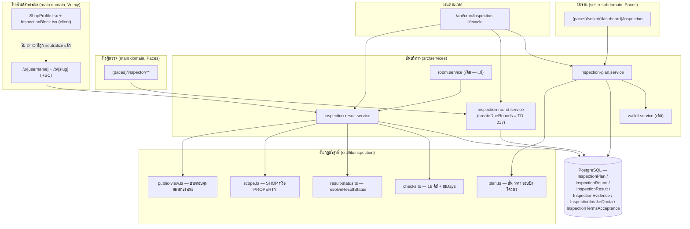
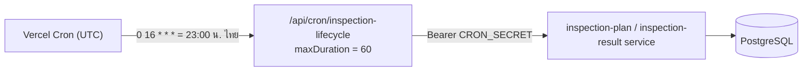
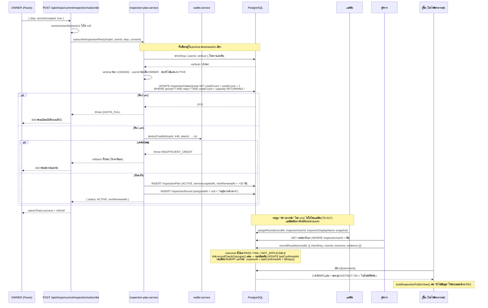
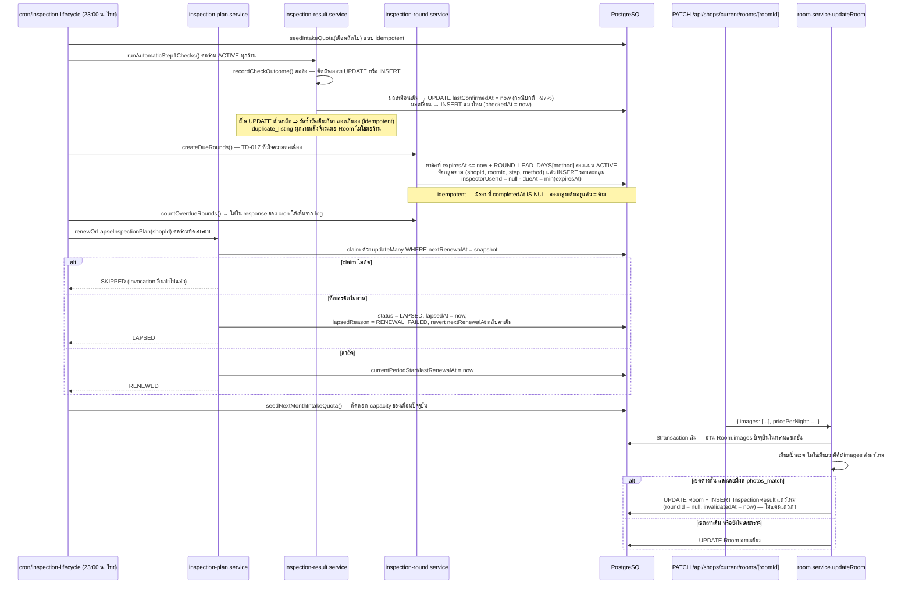
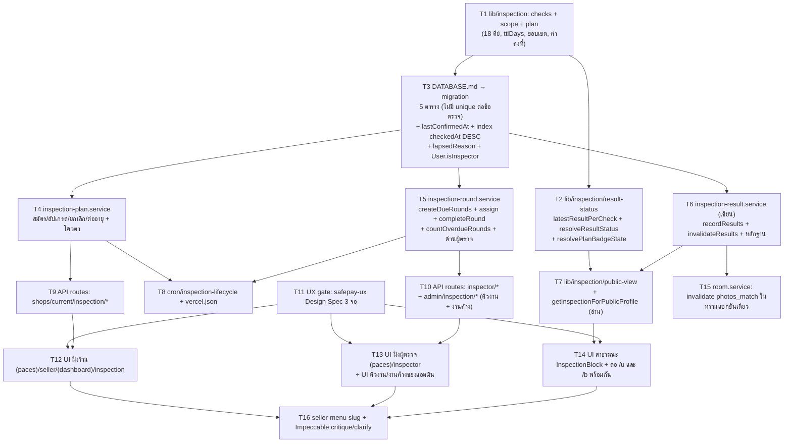

> **โมดูล:** M60-ShopInspection
> **ประเภทเอกสาร:** System Design Spec (SDS)
> **เวอร์ชัน:** 1.0
> **วันที่จัดทำ:** 2026-08-29
> **สถานะ:** Draft
> **เจ้าของเอกสาร:** SA (ดู [[Feature-Docs-Ownership]])

# SDS: แผนการตรวจสอบร้านค้า (Shop Inspection Plan) — System Design Spec

---

## 1. บทนำ & References

### 1.1 วัตถุประสงค์

เอกสารนี้ออกแบบ **"อะไรจะถูกสร้างขึ้นอย่างไร"** สำหรับแผนการตรวจสอบต่อเนื่องของร้านบ้านพัก (`Shop.vertical = 'LODGING'`) ตามที่ [[PRD]] และ [[BRD]] กำหนดไว้ ครอบตั้งแต่การสมัคร/ตัดเครดิต/โควตารับสมัคร ไปจนถึงการมอบหมายงานผู้ตรวจ การบันทึกผลตรวจรายข้อ และการแสดงผลบนโปรไฟล์สาธารณะ

ผู้อ่านคือ **DEV** (นำไป implement ทีละ task) · **QA** (ใช้เป็นแผนที่ความเสี่ยง) · **DevOps** (ประเมินผลกระทบ cron/infra)

เอกสารนี้ไม่กำหนดสัญญา HTTP รายละเอียด (อยู่ที่ `API.md`) และไม่กำหนดคอลัมน์/ดัชนี/migration (อยู่ที่ `DATABASE.md`) — ที่นี่กำหนด **โครงสร้างโมดูล ขอบเขตความรับผิดชอบ ลำดับการไหลของข้อมูล และการตัดสินใจเชิงเทคนิคพร้อมเหตุผล**

### 1.2 ขอบเขตการออกแบบ

**อยู่ในขอบเขต**

| ส่วน | สาระ |
|---|---|
| ชั้นกฎบริสุทธิ์ (`src/lib/inspection/**`) | นิยาม 18 ข้อตรวจ · อายุผลตรวจ · การแปลงแถวเป็นสถานะที่แสดง · ขอบเขต SHOP/PROPERTY · การประกอบมุมมองสาธารณะ |
| ชั้นบริการ (`src/services/inspection-*.service.ts`) | สมัคร/อัปเกรด/ยกเลิก/ต่ออายุ · โควตารับสมัคร · **กลไกทำให้การตรวจเกิดขึ้นจริง (สร้างรอบล่วงหน้า + ตัวชี้วัดงานค้าง — TD-017)** · มอบหมายรอบตรวจ · บันทึกผลตรวจ + หลักฐาน · บันทึกความยินยอม |
| งานตามเวลา | `src/app/api/cron/inspection-lifecycle/route.ts` (`"0 16 * * *"`) |
| หน้าจอฝั่งร้าน | `src/app/(paces)/seller/(dashboard)/inspection/**` |
| หน้าจอฝั่งผู้ตรวจ | `src/app/(paces)/inspector/**` (บทบาทใหม่ `User.isInspector`) |
| หน้าจอสาธารณะ | บล็อกใหม่ที่แทรกใน `src/views/pages/user-profile/v2/ShopProfile.tsx` (ใช้ร่วมทั้ง `/u/[username]` และ `/b/[slug]`) |
| การแก้ของเดิม | `src/services/room.service.ts` (ทำให้ `photos_match` ตกเป็น "รอตรวจซ้ำ" เมื่อภาพเปลี่ยน) · `src/lib/seller-menu.ts` (เพิ่ม slug) · `vercel.json` (เพิ่ม cron) |

**นอกขอบเขต**

- ไดเรกทอรีสาธารณะ/SEO (ฟีเจอร์ `00061`) — บล็อกผลตรวจในรอบนี้แสดงบนโปรไฟล์ร้านเท่านั้น
- ช่องทางชำระเงินใหม่ — ใช้ `SellerWallet` + `deductCredit()` เดิมทั้งหมด
- การแก้สูตร Trust Score — ห้ามแตะ `src/services/trust-score.service.ts` แม้บรรทัดเดียว (BR 8.1)
- ระบบสิทธิ์แบบกระจายฝั่งร้าน — รอบนี้ OWNER เท่านั้นที่เขียนได้
- ระบบวิดีโอคอลของตัวเอง — ผู้ตรวจใช้เครื่องมือภายนอกแล้วอัปโหลดภาพนิ่งเป็นหลักฐาน

### 1.3 เอกสารอ้างอิง

| เอกสาร | ความสัมพันธ์ |
|--------|-------------|
| [[PRD]] ของโมดูลนี้ | เป้าหมายธุรกิจ · กฎที่แตะไม่ได้ 7 ข้อ (§4.1) · มติ D-1..D-16 |
| [[BRD]] ของโมดูลนี้ | FR-INS-001..029 + AC ทุกข้อ ที่การออกแบบนี้ต้อง realize |
| [[SRS]] ของโมดูลนี้ | ข้อกำหนดเชิงเทคนิค (เขียนคู่ขนานรอบเดียวกัน) — ตาราง Traceability §7 ผูกกับ FR/AC ของ BRD ไว้ก่อน แล้วเติม TFR id เมื่อ SRS ลง |
| `DATABASE.md` / `API.md` ของโมดูลนี้ | คอลัมน์/ดัชนี/migration และสัญญา HTTP แตกจากเอกสารนี้ |
| `CONTEXT.md` (ราก) | อภิธานศัพท์ — สองแกนความน่าเชื่อถือแยกขาดจากกัน ห้ามยืมคำกัน |
| `docs/conventions/ui-boolean-needs-a-testable-home.md` | เหตุผลที่ `resolveResultStatus()` ต้องเป็นฟังก์ชันบริสุทธิ์ |
| `docs/conventions/stored-flag-vs-owner-truth.md` | เหตุผลที่ต้องไล่ทุกจุดเขียน `Room.images` ไม่ใช่แค่จุดที่รู้จัก |
| `docs/conventions/session-exists-is-not-identity.md` | เหตุผลที่ทุก route ใช้ `sessionUserId()` ห้าม cast |
| `docs/conventions/rule-must-be-enforced-not-described.md` | เหตุผลที่กฎ "หลักฐานปิดห้ามหลุด" ต้องบังคับด้วย type + query ไม่ใช่คอมเมนต์ |
| memory `feedback_rsc_pii_neutralize_at_source` | RSC serialize ทุก prop ลง flight payload แม้ไม่ render |
| memory `feedback_distinct_on_needs_shop_key` | `DISTINCT ON` ต้องมี `shopId` เป็นคีย์แรก |

---

## 2. Architecture Overview

### 2.1 มุมมองสถาปัตยกรรม

โครงเดิมของโปรเจกต์คือ **Next.js App Router ก้อนเดียว + Prisma + PostgreSQL** ไม่มี service แยก ฉะนั้นสถาปัตยกรรมของฟีเจอร์นี้คือ **การแบ่งชั้นในกระบวนการเดียว (layered in-process)** ตาม convention เดิมของรีโป:

```
lib (ฟังก์ชันบริสุทธิ์ ไม่แตะ DB)  →  services (แตะ Prisma, ถือ transaction)  →  route/page (auth + I/O)
```

หลักการที่ทำให้ฟีเจอร์นี้แตกต่างจากฟีเจอร์อื่นในรีโป: **ตรรกะที่ตัดสิน "ผู้ซื้อเห็นอะไร" ทั้งหมดถูกดันลงชั้น `lib` ให้เป็นฟังก์ชันบริสุทธิ์** เพราะสถานะที่แสดง 5 ค่าคือหัวใจของความน่าเชื่อถือทั้งฟีเจอร์ และเป็น boolean/enum ที่ถ้าเขียนกลับด้านจะไม่มีอะไรจับได้เลยถ้าอยู่ในเทอร์นารีกลาง JSX



### 2.2 มุมมองการ Deploy

ไม่มี runtime ใหม่ ไม่มี worker ใหม่ ไม่มี external dependency ใหม่ — ทุกอย่างรันบน Vercel Functions เดิมและฐาน PostgreSQL เดิม สิ่งที่เปลี่ยนที่ระดับ infra มีอย่างเดียวคือ **cron รายการที่ 11 ใน `vercel.json`**



- ตารางเวลา UTC ที่ว่างอยู่จริง: cron เดิมกินช่วง 17–23 UTC และ `*/5`, `* * * * *` — `0 16` ไม่ชนใคร และรันก่อนงานรายวันตัวอื่นทั้งหมดในลำดับ UTC
- `maxDuration = 60` ตามแบบ `inventory-renewal` (Hobby default 10 วิ ไม่พอเมื่อร้านเยอะ)
- auth ของ cron ใช้แพตเทิร์นเดิมเป๊ะ: `CRON_SECRET` ว่าง = ปฏิเสธทันที (ห้ามปล่อยให้ `Bearer undefined` ผ่าน) และเทียบสตริงเต็มไม่ตัดส่วน
- `guardApi` ใน `src/proxy.ts` ยกเว้น `/api/cron/*` จาก CSRF Origin-check อยู่แล้ว — ไม่ต้องแก้

---

## 3. Component Design

### 3.1 ชั้นกฎบริสุทธิ์ — `src/lib/inspection/**` (ไม่ import Prisma เด็ดขาด)

| Component | หน้าที่ (หนึ่งอย่าง) | Dependency |
|-----------|----------------------|------------|
| **`checks.ts`** | SSOT ของ **18 ข้อตรวจ**: คีย์ · ป้ายภาษาไทย · ขั้นที่ข้อนั้นสังกัด · ขอบเขต · วิธีตรวจตั้งต้น · `ttlDays(checkKey, planStep)` | ไม่มี (pure) |
| **`result-status.ts`** | **`latestResultPerCheck()`** — ยุบแถวประวัติทั้งกองเหลือ "แถวล่าสุดต่อ (ขอบเขต, checkKey)" · **`resolveResultStatus()`** — แปลง (แถวล่าสุด หรือไม่มีแถว) เป็น 1 ใน 5 สถานะที่แสดง โดยคิดอายุจาก **`lastConfirmedAt`** · **`resolvePlanBadgeState()`** — สถานะระดับบล็อกของทั้งแผน · **`badgeLastVerifiedAt()` / `timelineOutcomeChangedAt()`** — ทางเดียวที่หน้าจอจะได้เวลาสองความหมายนี้ (TD-016) | `checks.ts` (เฉพาะ type) |
| **`scope.ts`** | `checkScope(checkKey): 'SHOP' \| 'PROPERTY'` — ตัดสินจาก **สิ่งที่ข้อนั้นตรวจ** ไม่ใช่จากขั้น (D-16) | `checks.ts` |
| **`plan.ts`** | ขั้น 1–4 · ชื่อขั้นภาษาไทย · `INSPECTION_STEP_PRICE` (ร่าง รอมติ) · `INSPECTION_RENEWAL_PERIOD_DAYS = 30` · `INSPECTION_GRACE_DAYS` · `DEFAULT_INTAKE_CAPACITY` · `WALLET_REASON_INSPECTION` / `WALLET_DESC_INSPECTION` · `stepCovers(planStep, checkStep)` | `checks.ts` |
| **`public-view.ts`** | **`buildInspectionPublicView()`** — ประกอบเมทริกซ์ **จากคีย์ทั้ง 18 ที่ประกาศไว้ใน `checks.ts`** × (ร้าน + ที่พักทุกหลัง) **ไม่ใช่จากแถวที่มีในฐาน** แล้วเติมแถวล่าสุดลงช่องที่ตรงกัน ช่องที่เหลือคือ "ยังไม่มีข้อมูล" โดยอัตโนมัติ · คืน DTO ที่ **ไม่มีที่ให้ใส่หลักฐานปิดเชิงชนิด** | `checks.ts`, `result-status.ts`, `scope.ts`, `plan.ts` |

**[สำคัญ] ทิศทางการวนลูปเป็นเรื่องความถูกต้อง ไม่ใช่สไตล์:** ต้องวน **จากคีย์ที่ประกาศไว้** แล้วมองหาแถว ไม่ใช่วนจากแถวแล้วสร้างช่อง — วนจากแถวแปลว่าช่องที่ไม่มีแถวจะ *หายไปจากหน้าจอ* ซึ่งผู้ซื้ออ่านว่า "ร้านนี้ผ่านครบแล้ว" ตรงข้ามกับ AC-INS-29-4 ที่บังคับให้ **แสดง** ว่ายังไม่มีข้อมูล

**[สำคัญ] ทำไมทั้งห้าไฟล์ต้องไม่แตะ DB:** ทุกไฟล์ต้องเทสได้ด้วย `vitest` ที่ตั้ง `environment: "node"` โดยไม่ต้องมีฐานข้อมูล และต้องพิสูจน์ด้วย mutation ได้ — ถอดบรรทัดกฎออกแล้วต้องมีเทสแดง ถ้ากฎเหล่านี้อยู่ใน service ที่ต้อง mock Prisma เทสจะเขียวได้แม้ตรรกะกลับด้าน (บทเรียน `mutation-silence-means-weak-corpus.md`)

### 3.2 ชั้นบริการ — `src/services/**`

| Component | หน้าที่ | Dependency |
|-----------|---------|------------|
| **`inspection-plan.service.ts`** | วงจรชีวิตของแผน: `subscribeInspectionPlan` · `upgradeInspectionPlanStep` · `cancelInspectionPlan` (ตั้ง `canceledAt` — ยังไม่ตัดสิทธิ์) · `renewOrLapseInspectionPlan` · `getInspectionPlan` · `claimIntakeSlot` / `seedIntakeQuota` (โควตาอยู่ที่นี่เพราะมันคือด่านของ "การรับเข้าแผน" ไม่ใช่เรื่องของรอบตรวจ) · `recordTermsAcceptance` (TD-019) | `prisma`, `wallet.service.deductCredit`, `lib/inspection/plan.ts` |
| **`inspection-round.service.ts`** | รอบตรวจ: **`createDueRounds()` = กลไกความต่อเนื่องของทั้งฟีเจอร์ (TD-017)** · `assignRound` (แอดมิน) · `listUnassignedRounds` (คิวงานของแอดมิน เรียงตาม `dueAt`) · **`countOverdueRounds()` = ตัวชี้วัดงานค้าง** · `listAssignmentsForInspector` · `getAssignedRound` · `completeRound` (เกณฑ์ปิดรอบตาม TD-018) · `assertInspector` / `assertRoundAssignedTo` | `prisma`, `lib/inspection/checks.ts`, `lib/inspection/plan.ts` |
| **`inspection-result.service.ts`** | ผลตรวจ + หลักฐาน + การอ่านฝั่งสาธารณะ: **`recordCheckOutcome()` = ผู้เขียนคนเดียวของตาราง** (ตัดสินเองว่า UPDATE หรือ INSERT — TD-002) · `recordResults` (ผู้ตรวจบันทึกทั้งรอบ, เรียก `recordCheckOutcome` ต่อข้อ) · `invalidateResults` · `runAutomaticStep1Checks` · `getInspectionForPublicProfile` · `getInspectionForOwner` | `prisma`, `lib/inspection/*`, `scam-report.service`, `chat-metrics`/`Shop.chat*` fields, `verification.service` |
| **`room.service.ts` (แก้ของเดิม)** | `updateRoom` เพิ่มการ invalidate `photos_match` ในทรานแซกชันเดียวกับการเขียน `Room.images` | `inspection-result.service.invalidateResults` |

**หนึ่ง component = หนึ่งความรับผิดชอบ** — `inspection-result.service` เป็นตัวเดียวที่แตะตาราง `InspectionResult`/`InspectionEvidence` ทั้งการเขียนและการอ่าน; `room.service` เรียกมันผ่านฟังก์ชันเดียว (`invalidateResults`) ไม่เขียนแถวเอง

### 3.3 ชั้นหน้าจอ

| Component | Path จริง | หมายเหตุ |
|---|---|---|
| หน้าแผนของร้าน | `src/app/(paces)/seller/(dashboard)/inspection/page.tsx` | RSC · เรียก `getInspectionForOwner()` |
| ส่วนประกอบฝั่งร้าน | `.../inspection/components/{PlanStatusCard,StepLadder,TermsConsentModal,ResultChecklist,RoundTimeline,PropertyResultPicker}.tsx` | Paces primitive เท่านั้น (HR7) |
| เชลล์ผู้ตรวจ | `src/app/(paces)/inspector/layout.tsx` | ด่าน `User.isInspector` ที่ layout (ไม่ใช่ที่ page) |
| รายการงานผู้ตรวจ | `src/app/(paces)/inspector/page.tsx` | เห็นเฉพาะรอบที่ตัวเองถูกมอบหมาย |
| หน้าบันทึกผลรายรอบ | `src/app/(paces)/inspector/rounds/[roundId]/page.tsx` + `components/` | mobile-first (ขั้นที่ 4 ผู้ตรวจยืนอยู่หน้างาน) |
| **คิวงาน + งานค้างของแอดมิน** | `src/app/(paces)/admin/(dashboard)/inspection/page.tsx` | **บังคับมี ไม่ใช่ nice-to-have** — รอบที่ยังไม่มอบหมายเรียงตาม `dueAt` + การ์ด "เลยกำหนดแล้ว N รอบ" (TD-017) |
| บล็อกสาธารณะ | `src/views/pages/user-profile/v2/InspectionBlock.tsx` · `InspectionChecklist.tsx` · `InspectionRoundTimeline.tsx` | แทรกใน `ShopProfile.tsx` **เป็นบล็อก ไม่ใช่แท็บ** |
| จุดต่อข้อมูลสาธารณะ | `src/app/(marketing)/u/[username]/page.tsx` และ `src/app/(marketing)/b/[slug]/page.tsx` | ทั้งสองหน้าใช้ `ShopProfile` ตัวเดียวกัน — ต้องต่อ prop ทั้งคู่ในคอมมิตเดียว ไม่งั้น `/b/[slug]` จะเงียบ |

### 3.4 API routes ที่ต้องสร้าง (สัญญาเต็มอยู่ที่ `API.md`)

| Path | ผู้เรียก | ด่าน |
|---|---|---|
| `src/app/api/shops/current/inspection/route.ts` (GET) | หน้าร้าน | OWNER หรือ ShopMember ADMIN (อ่านอย่างเดียว) |
| `src/app/api/shops/current/inspection/subscribe/route.ts` (POST) | หน้าร้าน | **OWNER เท่านั้น** + LODGING + โควตา + ความยินยอม |
| `src/app/api/shops/current/inspection/upgrade/route.ts` (POST) | หน้าร้าน | OWNER เท่านั้น |
| `src/app/api/shops/current/inspection/cancel/route.ts` (POST) | หน้าร้าน | OWNER เท่านั้น |
| `src/app/api/inspector/assignments/route.ts` (GET) | ผู้ตรวจ | `isInspector` + scope ใน `WHERE` |
| `src/app/api/inspector/rounds/[roundId]/route.ts` (GET) | ผู้ตรวจ | `inspectorUserId = sessionUserId()` ใน `WHERE` |
| `src/app/api/inspector/rounds/[roundId]/results/route.ts` (POST) | ผู้ตรวจ | เดียวกัน + รอบต้องยังไม่ `completedAt` |
| `src/app/api/inspector/rounds/[roundId]/evidence/route.ts` (POST) | ผู้ตรวจ | เดียวกัน + ผ่าน `@/lib/upload-client` เท่านั้น |
| `src/app/api/admin/inspection/rounds/route.ts` (GET/POST) | แอดมิน | `isAdmin` — มอบหมายผู้ตรวจ |
| `src/app/api/admin/inspection/quota/route.ts` (GET/PATCH) | แอดมิน | `isAdmin` — เปิด/ปรับโควตารายเดือน |
| `src/app/api/cron/inspection-lifecycle/route.ts` (GET+POST alias) | Vercel Cron | `Bearer CRON_SECRET` |

---

## 4. Data Flow

### 4.1 Flow หลัก: สมัครแผน → มอบหมาย → บันทึกผล → ขึ้นโปรไฟล์



### 4.2 Flow ย่อย: อายุผลตรวจ · การเปลี่ยนภาพ · การขาดชำระ



**การหมดอายุไม่มีการเขียนใด ๆ** — ดู TD-003 การเปลี่ยนสถานะ "ผ่าน → รอตรวจซ้ำ" คำนวณสด ณ เวลาอ่านเสมอ

### 4.3 Flow กรณีล้มเหลว / ชดเชย

| กรณี | พฤติกรรม |
|---|---|
| โควตาเต็ม + เครดิตพอ | rollback ทั้งทรานแซกชัน · ไม่หักเงิน · ตอบ `QUOTA_FULL` พร้อมเดือนที่เปิดรอบถัดไป (ห้ามตอบว่าเครดิตไม่พอ) |
| โควตาว่าง + เครดิตไม่พอ | rollback ทั้งทรานแซกชัน · **โควตาที่เพิ่ง claim คืนเองเพราะอยู่ทรานแซกชันเดียวกัน** · ตอบ `INSUFFICIENT_CREDIT` |
| ไม่มีแถวโควตาของเดือนนั้น | **fail-closed** = `QUOTA_NOT_OPEN` ไม่ใช่ "ไม่จำกัด" (ปิดรับดีกว่ารับเกินกำลังเงียบ ๆ ตาม BR 8.7) — และ cron สร้างแถวเดือนถัดไปให้เองทุกคืนเพื่อไม่ให้ระบบปิดรับเพราะ ops ลืม (TD-007) |
| cron ยิงซ้ำ/ยิงพร้อมกัน | `claim` ด้วย `updateMany` เทียบ `nextRenewalAt` snapshot → invocation ที่สองได้ `count = 0` = `SKIPPED` (ไม่หักซ้ำ) |
| หักเงินต่ออายุไม่ผ่าน | `LAPSED` + `lapsedReason = 'RENEWAL_FAILED'` + **revert `nextRenewalAt` กลับค่าก่อน claim** เพื่อคงหลักฐานว่ารอบไหนล้ม (แพตเทิร์นเดียวกับ `renewOrLockEntitlement`) |
| OWNER กดยกเลิกเอง | `LAPSED` + `lapsedReason = 'OWNER_CANCELLED'` เมื่อสิ้นรอบบิล — **หน้าสาธารณะแสดงข้อความเดียวกันกับกรณีบน** (TD-015) |
| **รอบถูกสร้างแล้วแต่ไม่มีใครมอบหมาย** | รอบค้างอยู่ในคิวโดย `dueAt` ผ่านไปแล้ว ⇒ `countOverdueRounds()` ขึ้นการ์ดแดงบนหน้าแอดมิน **และ** ร้านเห็น "รอผู้ตรวจเข้าตรวจ" ในหน้าแผนของตัวเอง (ผู้ซื้อไม่เห็น ตาม AC-INS-19/FR-INS-017) — สองทางนี้คือด่านที่ทำให้ปัญหาไม่เงียบ (TD-017) |
| **OWNER กดยกเลิกกลางรอบบิล** | ตั้ง `canceledAt = now` เท่านั้น · `status` **ยังเป็น `ACTIVE`** จนถึง `nextRenewalAt` (AC-INS-26-3) · เมื่อ cron ถึงรอบต่ออายุแล้วเห็น `canceledAt != null` → ไม่หักเงิน เปลี่ยนเป็น `LAPSED` + `lapsedReason='OWNER_CANCELLED'` (TD-015) |
| ผู้ตรวจบันทึกผลแล้วอัปโหลดหลักฐานล้ม | ผลตรวจกับหลักฐานอยู่ทรานแซกชันเดียวกัน — ล้มแล้วไม่มีผลตรวจครึ่งใบที่อ้างหลักฐานที่ไม่มีอยู่ |
| ผู้ตรวจถูกเปลี่ยนกลางรอบ | รอบเก่าปิดด้วย `completedAt` ไม่ได้ → ยกเลิกรอบแล้วเปิดรอบใหม่ · **ไทม์ไลน์ของรอบที่ปิดไปแล้วไม่ถูกแตะ** (`inspectorDisplayName` เป็น snapshot — TD-006) |
| ร้านเลิกจ่ายแล้วกลับมาสมัครใหม่ | ประวัติเดิมไม่ถูกลบทุกกรณี (AC-INS-27-1) — แผนกลับเป็น `ACTIVE` โดยไม่แตะ `activatedAt` (แพตเทิร์นเดียวกับ `reactivateInventoryEntitlement`) |

---

## 5. Integration Points

| จุดเชื่อม | ประเภท | Contract | ความเสี่ยงเมื่อล่ม |
|-----------|--------|----------|---------------------|
| **`wallet.service.deductCredit()`** | internal | เรียกพร้อมส่ง `tx` เสมอ · โยน `INSUFFICIENT_CREDIT` | หักเงินไม่ผ่าน = ไม่มีแผน (rollback) ไม่มีสถานะครึ่ง ๆ |
| **`scam-report.service.searchScamByIdentifier()`** | internal | ใช้เป็นแหล่งของข้อ `scam_db` | ล่ม = ข้อนั้นไม่มีแถวใหม่ → ยังคงแสดงผลเดิมจนหมดอายุ (1 วัน) แล้วตกเป็น "รอตรวจซ้ำ" — **ห้าม fallback เป็น PASS** |
| **`verification.service.getMaxVerificationLevel()`** | internal | แหล่งของข้อ `phone_identity` (L1/L2) | เดียวกับข้างบน |
| **`Shop.chatResponseRate` / `chatMedianResponseSec`** | internal | เขียนโดย cron `chat-response-metrics` อยู่แล้ว — **อ่านอย่างเดียว ห้ามคำนวณซ้ำ** (HR16) | ค่า `null` = ตัวอย่างไม่พอ → ข้อนี้เป็น "ยังไม่มีข้อมูล" ไม่ใช่ "ไม่ผ่าน" |
| **`order-dispute.service`** | internal | แหล่งของข้อ `complaints` | เดียวกัน |
| **`room.service.updateRoom()`** | internal | ต้องเรียก `invalidateResults()` ในทรานแซกชันเดียวกัน | ไม่เรียก = ร้านสลับภาพหลังผ่านการตรวจโดยป้ายยังเขียว = รูรั่วที่ FR-INS-028 มีไว้อุด |
| **`@/lib/upload-client`** | internal | หลักฐานทุกชิ้นต้องผ่าน ticket → PUT ตรงเข้า storage → commit | ส่งไฟล์ผ่าน body ของ route = `413` ที่ 4.5MB โดยไม่มีเหตุผลให้ผู้ใช้อ่าน (`upload-body-size-limit.md`) |
| **Vercel Cron** | platform | GET + `Bearer CRON_SECRET` | **[สำคัญ]** **จุดเปราะที่สุดของฟีเจอร์** — cron ไม่รัน = ไม่มีการต่ออายุ **และไม่มีรอบตรวจใหม่ถูกสร้างเลย** (TD-017) ⇒ ป้ายของทุกร้านค่อย ๆ ตกเป็น "รอตรวจซ้ำ" โดยไม่มี error สักตัว · การหมดอายุยังถูกต้องเสมอเพราะคำนวณสดตอนอ่าน (TD-003) — **ความถูกต้องไม่พัง แต่บริการหยุดส่งมอบ** ⇒ ต้องเฝ้าที่ตัวชี้วัดงานค้าง ไม่ใช่ที่ error rate |

- **Timeout / Retry:** cron ไม่มี retry อัตโนมัติ — ทุกฟังก์ชันจึงต้อง idempotent (claim ก่อนทำ, seed แบบ skip-if-exists, สร้างรอบซ้ำไม่ได้)
- **Idempotency:** ตัวคุมคือ `nextRenewalAt` snapshot (การต่ออายุ) · unique ของ `(shopId, roomId, checkKey)` ที่ยังเปิดอยู่ (การสร้างรอบ) — รายละเอียดดัชนีอยู่ที่ `DATABASE.md`
- **สัญญา API เต็ม:** ดู `API.md` ของโมดูลนี้

---

## 6. Technical Decisions

### TD-001: 18 ข้อตรวจเป็น SSOT ในโค้ด ไม่ใช่แถวใน DB

- **ตัดสินใจ:** `src/lib/inspection/checks.ts` เป็นที่เดียวที่นิยามคีย์ทั้ง 18 · ป้ายภาษาไทย · ขั้นที่สังกัด · ขอบเขต · อายุผล — ฐานข้อมูลเก็บแค่ `checkKey` เป็นสตริง
- **เหตุผล:** ชุดข้อตรวจคือ **กฎของผลิตภัณฑ์** ไม่ใช่ข้อมูลที่ผู้ใช้สร้าง การเก็บเป็นแถวแปลว่าแอดมินแก้ป้าย/ขอบเขตได้ตอนรันไทม์ ซึ่งจะทำให้ผลตรวจเก่าเปลี่ยนความหมายย้อนหลัง — เอกสารทั้งชุดประกาศว่าไทม์ไลน์คือหลักฐาน · ยิ่งกว่านั้น `checkScope()` ที่ derive จาก DB จะทำให้ `tsc` ตรวจความครบไม่ได้เลย ขณะที่ `Record<CheckKey, ...>` บังคับให้ครบทุกคีย์ตอน compile (บทเรียน 00028: `rg "'GENERAL'"` จับ object key ไม่ได้ ต้องให้ type บังคับ)
- **ทางเลือกที่ตัดทิ้ง:** ตาราง `InspectionCheckDefinition` — ตัดเพราะได้ความยืดหยุ่นที่ไม่มีใครขอ แลกกับการเสียด่าน compile-time ทั้งหมด
- **ผลกระทบ:** เพิ่ม/ลบข้อตรวจ = deploy ไม่ใช่แก้ข้อมูล · การเปลี่ยนชื่อคีย์ต้องมี migration ของค่าในคอลัมน์ `checkKey` และต้อง grep ทั้งรีโปตาม `enum-value-removal.md`

### TD-002: `InspectionResult` เขียนแถวใหม่ **เฉพาะตอนผลเปลี่ยน** — ผลเดิมที่ยืนยันซ้ำแค่เลื่อนเวลาในที่

- **ตัดสินใจ (สามชั้น แยกกันไม่ได้):**
  1. **ชั้นแถว — append-on-change:** หนึ่งข้อตรวจมีได้ **หลายแถว** ตามจำนวนครั้งที่ผล **เปลี่ยน** · **ไม่มี partial unique บน `(shopId, checkKey)` หรือ `(roomId, checkKey)`** · **ไม่มี `UPDATE` ที่เขียนทับ `outcome` ของแถวเดิม** — แถวเก่าคงอยู่ตลอดไป
  2. **ชั้นเวลา — สองฟิลด์คนละความหมาย:**
     - **`checkedAt`** = ผลนี้ถูกตัดสิน **ครั้งแรก** เมื่อไร → **เขียนครั้งเดียวตอน INSERT ไม่เปลี่ยนอีกตลอดกาล** (นี่คือ "ผลเปลี่ยนเมื่อไร" ที่ไทม์ไลน์ใช้)
     - **`lastConfirmedAt`** = ผลเดิมถูกยืนยันซ้ำล่าสุดเมื่อไร → **อัปเดตในที่ทุกครั้งที่ตรวจแล้วได้ผลเหมือนเดิม** (นี่คือ "ตรวจล่าสุดเมื่อไร" ที่ป้ายใช้)
     - **อายุผลตรวจนับจาก `lastConfirmedAt` ไม่ใช่ `checkedAt`** — `expiresAt = lastConfirmedAt + ttlDays(checkKey, planStep)`
  3. **ชั้นสถานะ:** `outcome` เก็บได้แค่ `PASS | FAIL | NOT_APPLICABLE` (contract ล็อกแล้ว) ส่วน **"รอตรวจซ้ำ"** และ **"ยังไม่มีข้อมูล"** derive ทั้งคู่ — "รอตรวจซ้ำ" มาจาก `invalidatedAt` หรือการเลยอายุที่นับจาก `lastConfirmedAt` · "ยังไม่มีข้อมูล" มาจาก **การไม่มีแถวเลย**
- **กติกาการเขียน (ตัดสินที่ `recordCheckOutcome()` ที่เดียว):**
  | สถานการณ์ | การกระทำ |
  |---|---|
  | ไม่มีแถวของข้อนี้เลย | **INSERT** (`checkedAt = lastConfirmedAt = now`) |
  | ตรวจแล้วได้ `outcome` **เหมือนเดิม** และแถวล่าสุดยังไม่ถูก invalidate | **UPDATE** `lastConfirmedAt = now` (+ `expiresAt` ที่คำนวณใหม่) — `checkedAt` และ `outcome` ไม่ถูกแตะ |
  | ตรวจแล้วได้ `outcome` **ต่างจากเดิม** | **INSERT** แถวใหม่ |
  | แถวล่าสุดถูก invalidate ไปแล้ว (เช่นเปลี่ยนภาพ) แล้วตรวจใหม่ | **INSERT** แถวใหม่เสมอ แม้ผลจะเหมือนเดิม (เพราะรอบนั้นเป็นเหตุการณ์จริงที่ไทม์ไลน์ต้องเห็น) |
  | ภาพประกาศเปลี่ยน (ไม่ใช่การตรวจ) | **INSERT** แถวที่มี `invalidatedAt` (TD-009) |
- **เหตุผลของชั้นที่ 1 (ทำไมไม่ unique):** unique ต่อข้อตรวจแปลว่าการตรวจรอบใหม่ต้องเขียนทับผลรอบเก่า ซึ่งชนกับข้อกำหนดสองข้อแบบตรงตัว — AC-INS-16 (ไทม์ไลน์ต้องแสดง **ทุกรอบ** รวมรอบที่ผล "ไม่ผ่าน") และ AC-INS-27-1/27-3 (ประวัติห้ามถูกลบแม้ลดขั้นหรือยกเลิกแผน) · และมันทำลายคุณค่าหลักของสินค้าเงียบ ๆ: ร้านที่ตรวจไม่ผ่านแล้วตรวจใหม่จนผ่านจะเหลือแค่ผลที่ผ่าน = **ล้างประวัติได้** ซึ่ง PRD §3.6 บอกว่าเป็นสิ่งที่ทำให้ป้ายนี้น่าเชื่อกว่าคำโฆษณาทั่วไป
- **เหตุผลของชั้นที่ 2 (ทำไมไม่ INSERT ทุกครั้งที่ตรวจ):** ข้อตรวจขั้น 1 รันทุกวัน — INSERT ทุกครั้งแปลว่าไทม์ไลน์ของ `scam_db` จะมี **365 บรรทัด "ผ่าน" ที่เหมือนกันทุกตัวอักษรต่อปีต่อร้าน** กลบรอบที่มีความหมายจริง (วิดีโอคอล · ลงพื้นที่ · รอบที่ผลเปลี่ยน) จนมองไม่เห็น — **และไทม์ไลน์คือตัวสินค้า** (AC-INS-16 · PRD §3.6) ไม่ใช่ log · ที่ 100 ร้านคิดเป็นราว **226,000 แถว/ปี ซึ่ง ~97% เป็นแถวซ้ำ** ที่ต้องถูกกรองทิ้งทุกครั้งที่มีคนเปิดโปรไฟล์ · การเลื่อน `lastConfirmedAt` ในที่เก็บข้อมูลได้ครบเท่าเดิม ("ตรวจล่าสุดเมื่อไร") โดยไม่ผลิตแถวที่ไม่มีใครอยากอ่าน
- **เหตุผลของชั้นที่ 3:** สองสถานะนั้นเป็นฟังก์ชันของ **เวลา** และ **การไม่มีข้อมูล** ซึ่งเก็บเป็นค่าคงที่ไม่ได้ — เก็บแล้วต้องมีใครคอยเขียนทับให้ทัน แปลว่ามันจะผิดทุกช่วงระหว่างรอบงาน (`status-field-is-not-an-event.md`) ขณะที่ PRD §8 กำหนดว่าต้อง "ไม่มีเคสค้างเป็นผ่านเกินอายุ" — คำว่าไม่มีเคสแปลว่าไม่มีหน้าต่างเวลาให้ผิดได้เลย
- **ทางเลือกที่ตัดทิ้ง:**
  (ก) **partial unique + ตาราง `InspectionResultHistory` แยก** — ได้สองแหล่งความจริงของสิ่งเดียวกันที่จะเดินแยกกัน (HR16) และไทม์ไลน์กับเช็คลิสต์จะอ่านคนละตารางแล้วเลขไม่ตรงกันเมื่อไรก็ได้
  (ข) **INSERT ทุกครั้งที่ตรวจ (append-only แท้)** — ตัดตามเหตุผลชั้นที่ 2; ถ้าจะแก้ด้วยการกรองแถวซ้ำตอนแสดง แปลว่าต้องมีตรรกะ "ซ้ำหรือไม่ซ้ำ" อีกชุดที่ฝั่งอ่าน ซึ่งเป็นตรรกะเดียวกับที่ฝั่งเขียนเลี่ยงไม่เขียน — เอาไปวางไว้ในที่ที่เทสยากกว่าและมีผู้เรียกมากกว่า
  (ค) **เพิ่ม `RECHECK`/`NO_DATA` เป็นค่าที่ 4–5 ในคอลัมน์แล้วให้ cron เขียน** — สร้างหน้าต่างผิดพลาดสูงสุด 24 ชม. และ "ไม่มีข้อมูล" ต้องมีแถวเพื่อบอกว่าไม่มีแถว = ต้อง pre-generate 18 × จำนวนที่พัก แถวต่อร้านทุกร้านตลอดกาล
- **ผลกระทบ:**
  - **`recordCheckOutcome()` ต้องเป็นผู้เขียนคนเดียวของตารางนี้** — ห้ามให้ `runAutomaticStep1Checks` / `recordResults` / route ใด ตัดสิน UPDATE-หรือ-INSERT เอง เพราะเส้นทางที่ตัดสินเองเส้นเดียวที่พลาดจะเขียนแถวซ้ำทุกวันโดยไม่มีอะไรฟ้อง (ตัวเลขจะดูปกติ กราฟจะดูปกติ มีแต่ไทม์ไลน์ที่ยาวขึ้นเรื่อย ๆ ซึ่งไม่มี gate ไหนตรวจ) — บังคับด้วยเทส `[blocker]` ที่สแกน `src/` ห้าม `inspectionResult.create` / `inspectionResult.update` ปรากฏนอก `inspection-result.service.ts`
  - **cron ขั้น 1 รายวันกลายเป็นงาน UPDATE เป็นหลัก ไม่ใช่ INSERT** — ผลพลอยได้ที่สำคัญคือ **มันกลายเป็น idempotent โดยอัตโนมัติ**: รันซ้ำวันเดียวกันสองครั้ง (double-trigger / retry ของ Vercel Cron / แอดมินกด manual trigger) ได้ผลเหมือนรันครั้งเดียว ไม่มีแถวซ้ำ ไม่ต้องมีตัวกันซ้ำแยกต่างหาก — ต่างจากท่า INSERT ทุกครั้งซึ่งต้องมี guard ของตัวเองและ guard นั้นจะเป็นจุดที่พลาดได้อีกจุด
  - **ห้าม component ไหน query แถวผลตรวจเองหรือคำนวณ "อันไหนล่าสุด" เอง** — ทางเดียวคือ `latestResultPerCheck()` + `resolveResultStatus()` ใน `src/lib/inspection/result-status.ts` (เทส `[blocker]` สแกนห้าม `\.outcome ===` และห้าม `inspectionResult` ปรากฏนอก `src/lib/inspection/` กับ `src/services/inspection-*.service.ts`)
  - ต้องมีดัชนีรองรับการหาแถวล่าสุด: `(shopId, checkKey, checkedAt DESC)` และ `(roomId, checkKey, checkedAt DESC)` (รายละเอียดที่ `DATABASE.md`) — เรียงด้วย `checkedAt` ถูกต้องเพราะแถวที่ถูกแทนที่แล้วจะไม่มีวันได้ `checkedAt` ใหม่กว่าแถวที่มาแทน
  - **สูตร "แถวล่าสุด" มีนิยามเดียวทั้งระบบ: `ORDER BY checkedAt DESC, id DESC`** — ใช้เหมือนกันเป๊ะทั้งใน SQL (`DISTINCT ON` ของ TD-004) และใน TS (`latestResultPerCheck()`) · tie-break ด้วย `id` จำเป็นจริงเพราะรอบเดียวบันทึกหลายข้อในทรานแซกชันเดียวได้ `checkedAt` เท่ากันเป๊ะ · **สองฝั่งที่เรียงต่างกันคือบั๊กที่หน้าจอกับ API ตอบคนละคำโดยไม่มีอะไรฟ้อง** ⇒ ต้องมีเทส parity ที่ป้อนชุดแถวเดียวกันเข้าทั้งสองทางแล้วยืนยันว่าได้แถวเดียวกัน (HR16)
  - **`expiresAt` ที่เก็บในคอลัมน์เป็นของ cron ไม่ใช่ของหน้าจอ** — มีไว้ให้ `createDueRounds()` ทำ `WHERE expiresAt <= now + lead` แบบใช้ดัชนีได้ ส่วนการตัดสิน "หมดอายุหรือยัง" ที่หน้าจอคำนวณสดจาก `lastConfirmedAt + ttlDays()` เสมอ (TD-003) · ทั้งสองต้องเขียนในคำสั่งเดียวกันเสมอ และมีเทส `[blocker]` ยืนยันว่าค่าที่คำนวณใหม่เท่ากับค่าที่เก็บ — **ไม่ใช่คอมเมนต์เตือน** (`rule-must-be-enforced-not-described.md`)
  - **ผลข้างเคียงที่ตั้งใจ:** `ttlDays()` รับ `planStep` ⇒ ร้านที่อัปเกรดจากขั้น 3 เป็นขั้น 4 จะได้ `video_tour` ที่อายุสั้นลงจาก 180 เป็น 90 วัน **มีผลกับแถวที่มีอยู่แล้วทันที** เพราะคำนวณตอนอ่าน — ตรงกับ PRD §3.2 ที่กำหนดว่าร้านขั้น 4 ต้องทวนข้อของขั้น 3 ทุก 3 เดือน ไม่ใช่รอรอบเดิมของขั้น 3 หมดก่อน

**สัญญาของฟังก์ชัน (ลำดับการตัดสินสำคัญ — สลับแล้วผิด):**

```
row = latestResultPerCheck(rows)[scopeKey]      // แถวใหม่สุดของคู่นั้น หรือ undefined

resolveResultStatus({ row, planStep, now }) →
  1. row == null                      → NO_DATA          ("ยังไม่มีข้อมูล")
  2. row.outcome === 'NOT_APPLICABLE' → NOT_APPLICABLE   ("ไม่เกี่ยวกับร้านประเภทนี้")  ← ต้องมาก่อนการเช็คอายุ
  3. row.invalidatedAt != null        → RECHECK          ("รอตรวจซ้ำ")
  4. addDays(row.lastConfirmedAt, ttlDays(row.checkKey, planStep)) <= now → RECHECK
  5. row.outcome === 'PASS'           → PASS             ("ผ่าน")
  6. row.outcome === 'FAIL'           → FAIL             ("ไม่ผ่าน" — ไม่แสดงต่อสาธารณะ)
```

- ข้อ 4 นับจาก **`lastConfirmedAt`** ไม่ใช่ `checkedAt` — ผลที่ถูกยืนยันซ้ำทุกวัน (ขั้น 1) จะมี `checkedAt` เก่าเป็นปีแต่ยังไม่หมดอายุ · ใช้ `checkedAt` แทนจะทำให้ทุกข้อของขั้น 1 ตกเป็น "รอตรวจซ้ำ" ตั้งแต่วันที่สองและไม่มีวันกลับเป็น "ผ่าน" อีกเลย
- ข้อ 2 ต้องมาก่อนข้อ 4 เพราะ `NOT_APPLICABLE` ไม่มีวันหมดอายุ — สลับแล้วข้อที่ไม่เกี่ยวกับร้านนี้จะกลายเป็น "รอตรวจซ้ำ" ตลอดไปทั้งที่ไม่มีอะไรให้ตรวจ (ให้ `ttlDays()` คืน `null` สำหรับแถว `NOT_APPLICABLE` เป็นด่านที่สอง)
- ข้อ 3 ต้องมาก่อนข้อ 5/6 เพราะ `FAIL` ที่ร้านแก้แล้วขอตรวจใหม่ต้องกลายเป็น "รอตรวจซ้ำ" ตามวงจรใน PRD §10.5
- **ห้ามรับ `planStatus` เข้ามาเป็นพารามิเตอร์** — สถานะ "ไม่ได้อยู่ในแผนแล้ว" เป็นเรื่องของ **ทั้งบล็อก** ไม่ใช่ของข้อตรวจข้อใดข้อหนึ่ง ยัดรวมกันแล้วจะกลายเป็นสถานะที่ 6 ที่ไม่มีอยู่ในสัญญา จึงแยกเป็น `resolvePlanBadgeState()` **ในไฟล์เดียวกัน** ตาม HR16 (นิยามที่เกี่ยวกันต้องอยู่ติดกัน)
- **เทส `[blocker]`:** ต้องพิสูจน์ด้วย mutation ทุกข้อ — สลับลำดับข้อ 2↔4 · เปลี่ยน `<=` เป็น `<` · ตัดข้อ 3 ทิ้ง · เปลี่ยน `row == null` เป็น `row === undefined` · **สลับ `lastConfirmedAt` เป็น `checkedAt` ในข้อ 4** — แต่ละอย่างต้องทำให้เทสแดงอย่างน้อยหนึ่งข้อ
  **[สำคัญ] ชุดข้อมูลทดสอบต้องมีอย่างน้อยหนึ่งแถวที่ `checkedAt` กับ `lastConfirmedAt` ต่างกันจริง** (เช่นข้อขั้น 1 ที่ตัดสินเมื่อ 300 วันก่อนแต่ยืนยันซ้ำเมื่อวาน) — ถ้าทุกแถวใน fixture มีสองค่าเท่ากัน mutation ข้อสุดท้ายจะเขียวโดยไม่มีอะไรผิด ซึ่งแปลว่า **ชุด input อ่อน ไม่ใช่ mutation ไม่เกี่ยว** ต้องเติม input แล้วรัน mutation เดิมซ้ำจนแดง (`mutation-silence-means-weak-corpus.md`) และเขียนคอมเมนต์กำกับแถวนั้นไว้ ไม่งั้นคนถัดไปจะเห็นว่า "ซ้ำกับเคสอื่น" แล้วลบทิ้ง

### TD-003: อายุผลตรวจคำนวณตอนอ่าน ไม่มี job ที่เขียนสถานะหมดอายุ

- **ตัดสินใจ:** cron **ไม่แตะ** สถานะของผลตรวจที่หมดอายุเลย — หน้าที่ของ cron คือ seed โควตาเดือนถัดไป · รันข้อตรวจอัตโนมัติของขั้น 1 (ซึ่งเป็นการ **เลื่อน `lastConfirmedAt`** เป็นหลัก ไม่ใช่การเขียนสถานะ) · เปิดรอบตรวจใหม่ · ตัดเครดิต เท่านั้น · "หมดอายุหรือยัง" คำนวณสดจาก `lastConfirmedAt + ttlDays()` ทุกครั้งที่มีคนอ่าน
- **เหตุผล:** ต่อจาก TD-002 — ถ้า cron เป็นคนเขียน "หมดอายุ" ผลตรวจที่หมดอายุตอน 08:00 น. จะยังโชว์ "ผ่าน" จนถึง 23:00 น. ทุกวัน ซึ่งขัดกฎ "ป้ายพูดความจริงเสมอ" (§4.1) ตรงตัว และเป็นบั๊กที่ไม่มีใครเห็นเพราะหน้าจอไม่ error
- **ทางเลือกที่ตัดทิ้ง:** materialized column `isExpired` + cron อัปเดต — ตัดด้วยเหตุผลเดียวกัน
- **ผลกระทบ:** `now` ต้องถูกส่งเข้าฟังก์ชันเป็นพารามิเตอร์เสมอ (ห้ามเรียก `Date.now()` ข้างใน) ไม่งั้นเทสเรื่องเวลาจะเขียนไม่ได้ · การเปิดรอบตรวจใหม่ (`createDueRounds`) ใช้คอลัมน์ `expiresAt` ที่เก็บไว้ (`WHERE expiresAt <= now + leadDays`) เพื่อให้ใช้ดัชนีได้ ซึ่งเป็น **คนละคำถาม** กับ "หมดอายุหรือยัง" ที่หน้าจอถาม — สองอย่างนี้ต้องไม่ใช้ค่าคงที่ตัวเดียวกัน และคอลัมน์นั้นต้องถูกเขียนพร้อม `lastConfirmedAt` เสมอในคำสั่งเดียว (TD-002)

### TD-004: การอ่านฝั่งสาธารณะ = 3 คำสั่งคงที่ + materialize "ยังไม่มีข้อมูล" ที่ชั้น service

- **ตัดสินใจ:** `getInspectionForPublicProfile(shopId, rooms)` ยิง 3 คำสั่งเสมอไม่ว่าร้านจะมีที่พักกี่หลัง:
  1. `inspectionPlan.findUnique({ where: { shopId } })`
  2. `$queryRaw` — ผลล่าสุดต่อคู่ (ที่พัก, ข้อตรวจ) จากตาราง **append-only** (TD-002):
     ```sql
     SELECT DISTINCT ON ("shopId", "roomId", "checkKey") *
       FROM "InspectionResult"
      WHERE "shopId" = $1
      ORDER BY "shopId", "roomId", "checkKey", "checkedAt" DESC, "id" DESC;
     ```
  3. `inspectionRound.findMany({ where: { shopId, completedAt: { not: null } }, orderBy: { completedAt: 'desc' }, take: N })` + หลักฐาน `visibility: 'PUBLIC'` — ไทม์ไลน์แบบตัดหน้า
  แล้วส่งผลเข้า `latestResultPerCheck()` → `buildInspectionPublicView()` ซึ่งวน **คีย์ทั้ง 18 ที่ประกาศไว้ใน `checks.ts`** × (ร้าน + ที่พักทุกหลัง) แล้วเติมแถวล่าสุดลงช่องที่ตรงกัน — **ช่องที่ไม่มีแถวคือ "ยังไม่มีข้อมูล" โดยอัตโนมัติ ไม่ใช่ช่องที่หายไป**
- **เหตุผล:** ร้านหนึ่งร้านมีที่พักได้หลายหลัง × 18 ข้อ × หลายรอบ และตารางเป็น **append-only** ⇒ จำนวนแถวโตตามเวลาโดยไม่มีเพดาน (ขั้น 1 เขียน 6 ข้อทุกวัน) การไล่ query ต่อหลังต่อข้อคือ N+1 ที่โตสองมิติ ส่วนการดึงทั้งกองมา reduce ใน JS โตตามอายุของแผน · `DISTINCT ON` ต้องมี **`shopId` เป็นคีย์แรก** เป็นข้อบังคับของรีโปนี้อยู่แล้ว (memory `feedback_distinct_on_needs_shop_key` — เคยเกิดเคสข้อมูลข้ามร้านจากการลืมคีย์นี้) และต้องมีดัชนี `(shopId, checkKey, checkedAt DESC)` / `(roomId, checkKey, checkedAt DESC)` รองรับ ไม่งั้นแผนคิวรีจะสแกนทั้งตาราง · `"id" DESC` ต่อท้ายเป็น tie-break เมื่อ `checkedAt` เท่ากันพอดี (เกิดจริงเมื่อรอบเดียวบันทึกหลายข้อในทรานแซกชันเดียว) · **"ไม่มีแถว ≠ ไม่แสดง"** เพราะ AC-INS-29-4 บังคับให้ **แสดง** ว่ายังไม่มีข้อมูล — หายไปเฉย ๆ ผู้ซื้อจะอ่านว่า "ร้านนี้ผ่านหมดแล้ว"
- **ทางเลือกที่ตัดทิ้ง:** (ก) ดึงผลตรวจทุกแถวของร้านมา reduce ใน JS — ตัดเพราะร้านขั้น 4 ที่ตรวจมา 3 ปีกับที่พัก 20 หลังจะมีหลายพันถึงหลายหมื่นแถว และทั้งหมดจะถูก serialize เข้า flight payload ของ RSC (ข) ใส่ `take` บนคิวรีผลล่าสุด — อันตรายกว่า เพราะจะตัดแถวล่าสุดของที่พักที่ตรวจไม่บ่อยทิ้งโดยไม่มีอะไรฟ้อง แล้วช่องนั้นจะกลายเป็น "ยังไม่มีข้อมูล" ทั้งที่ตรวจผ่านแล้ว
- **ผลกระทบ:** `rooms` ต้องถูกส่งเข้าฟังก์ชันจากหน้า (หน้าโหลดอยู่แล้วผ่าน `getPublicRooms`) ไม่ query ซ้ำ · ต้องต่อ prop ทั้ง `/u/[username]` และ `/b/[slug]` ในคอมมิตเดียวกัน (`sibling-surface-parity.md`) · คิวรีที่ 2 เป็น `$queryRaw` จึงไม่มี type จาก Prisma — ต้องประกาศ type ผลลัพธ์เองแล้วให้ `latestResultPerCheck()` เป็นตัวรับ ห้ามปล่อยแถวดิบไหลเข้า component (แถวดิบมีทั้ง `outcome` และฟิลด์ภายในที่ TD-005 ห้ามข้ามเส้น)

### TD-005: หลักฐานปิดถูกกันด้วย type + query ไม่ใช่ด้วยการ "ไม่ render"

- **ตัดสินใจ:** สามชั้นซ้อนกัน
  1. คิวรีฝั่งสาธารณะ **ฮาร์ดโค้ด** `where: { visibility: 'PUBLIC' }` และไม่รับพารามิเตอร์ visibility จากผู้เรียกเลย — ไม่มีทางส่ง `'PRIVATE'` เข้าไปได้
  2. DTO ที่คืนออกไป (`PublicInspectionEvidence`) **ไม่มีฟิลด์** `storagePath` ของหลักฐานปิด · ไม่มี `inspectorUserId` · ไม่มีบันทึกภายในของผู้ตรวจ · ไม่มี `assignedAt`/สถานะ "รอผู้ตรวจเข้าตรวจ" — `tsc` จึงปฏิเสธการเผลอส่งต่อ
  3. `InspectionEvidence.visibility` มี default เป็น `PRIVATE` (contract ล็อกแล้ว) — คนที่ลืมระบุได้ค่าที่ปลอดภัย ไม่ใช่ค่าที่รั่ว
- **เหตุผล:** RSC serialize **ทุก prop** ที่ข้ามเส้น server→client ลง flight payload แม้ component จะไม่ render มัน (memory `feedback_rsc_pii_neutralize_at_source` · เคสจริง PII ของผู้ซื้อรั่วในหน้า seller 2026-06-06) การกรองใน JSX จึงไม่ใช่การกัน · และกฎที่ "เขียนไว้" ยังไม่ใช่กฎที่ "บังคับได้" (`rule-must-be-enforced-not-described.md`) — ต้องชี้ได้ว่าโค้ดบรรทัดไหนบังคับและเทสตัวไหนแดงถ้าเอาบรรทัดนั้นออก
- **ทางเลือกที่ตัดทิ้ง:** ส่งหลักฐานทั้งหมดไป client แล้วให้ component เลือกแสดง — ตัดทันที คือรูปแบบของบั๊กที่ §6.2 ของ PRD ระบุว่าร้ายแรงที่สุด
- **ผลกระทบ:** เทส `[blocker]` สแกนซอร์สว่า `src/app/(marketing)/**` และ `src/views/**` ต้องไม่มีคำว่า `inspectionEvidence` / `visibility: 'PRIVATE'` เลย และ `getInspectionForPublicProfile` ต้องไม่มีพารามิเตอร์ visibility — พิสูจน์ด้วย mutation (เติมพารามิเตอร์กลับเข้าไปแล้วต้องแดง)

### TD-006: `inspectorDisplayName` เป็น snapshot ไม่ join ชื่อสด

- **ตัดสินใจ:** `InspectionRound.inspectorDisplayName` เก็บชื่อ ณ เวลาที่มอบหมาย และหน้าสาธารณะอ่านจากคอลัมน์นี้เท่านั้น — **ห้าม** `include: { inspector: { select: { displayName: true } } }`
- **เหตุผล (AC-INS-25-2):** ไทม์ไลน์คือหลักฐาน หลักฐานต้องไม่เปลี่ยนย้อนหลัง ชื่อสดเปลี่ยนได้ **สี่ทาง** ที่ทุกทางเกิดจริงในรีโปนี้: (ก) เปลี่ยนผู้ตรวจกลางทาง `inspectorUserId` ชี้คนใหม่ ⇒ รอบเก่าทั้งหมดกลายเป็นชื่อคนใหม่ (ข) ผู้ตรวจแก้ `displayName` ของตัวเองที่ `/account` (ค) ผู้ตรวจท้องถิ่นเป็นบุคคลภายนอกที่จ้างรายครั้ง — offboard แล้วบัญชีถูก soft delete และ cron `account-purge` ตามลบทีหลัง ⇒ join ได้ `null` ⇒ ผลตรวจไม่มีชื่อกำกับ ซึ่งขัด BRD §6.3 ที่เขียนว่า "ไม่มีรอบใดที่ผลตรวจไม่ระบุตัวผู้รับผิดชอบ" (ง) `inspectorUserId` เป็น nullable โดยเจตนา (ข้อตรวจอัตโนมัติของขั้น 1 ไม่มีคน) — join จึงต้องมี fallback ที่จะกลายเป็นที่ซ่อนของบั๊ก
  เหตุผลเสริม: ชื่อที่เผยแพร่คือชื่อที่ Deep เลือกจะเผยแพร่ อาจตั้งใจไม่เท่ากับชื่อบัญชี · และการ join `User` เข้าคิวรีสาธารณะคือการเปิดผิว PII ให้กว้างขึ้นโดยไม่จำเป็น
- **ทางเลือกที่ตัดทิ้ง:** join สด + fallback เป็น "ผู้ตรวจของ Deep" — ตัดเพราะแก้ได้แค่กรณี (ค)/(ง) และยังผิดกรณี (ก)/(ข) ซึ่งเป็นกรณีที่ AC-INS-25-2 พูดถึงตรง ๆ
- **ผลกระทบ:** ต้องเขียน `inspectorDisplayName` ตอน `assignRound` ในคำสั่งเดียวกับ `inspectorUserId` (แยกไม่ได้) · เทส `[blocker]` ห้าม `inspector:` ปรากฏใน `include`/`select` ของคิวรีสาธารณะ

### TD-007: โควตาใช้ UPDATE แบบมีเงื่อนไขในคำสั่งเดียว ไม่ใช่ read-then-increment

- **ตัดสินใจ:**
  ```sql
  UPDATE "InspectionIntakeQuota"
     SET "usedCount" = "usedCount" + 1
   WHERE "periodYearMonth" = $1 AND "step" = $2 AND "usedCount" < "capacity"
  RETURNING "usedCount", "capacity";
  ```
  คืน 0 แถว = เต็ม (หรือยังไม่เปิดรับเดือนนั้น) → โยน `QUOTA_FULL` / `QUOTA_NOT_OPEN` → rollback ทั้งทรานแซกชัน
- **เหตุผล:** เป็นแพตเทิร์นเดียวกับ `deductCredit` เป๊ะ ๆ (`WHERE balance >= amount` + `updateMany`) ซึ่งคอมเมนต์ใน `wallet.service.ts` อธิบายไว้แล้วว่าทำไม read-then-write พัง: สอง request อ่าน `usedCount` เดียวกันแล้วผ่าน check ทั้งคู่ · **ต้องเป็น raw SQL เพราะ Prisma เทียบคอลัมน์กับคอลัมน์ใน `where` ไม่ได้** (`usedCount < capacity`)
- **ทางเลือกที่ตัดทิ้ง:** อ่าน `capacity` มาก่อนแล้ว `updateMany({ where: { usedCount: { lt: capacitySnapshot } } })` — ปลอดภัยจาก double-claim จริง (Postgres re-evaluate `WHERE` หลังปลดล็อกแถวใน READ COMMITTED) **แต่** ถ้าแอดมินลดเพดานพร้อมกัน snapshot ที่สูงกว่าจะปล่อยให้เกินเพดานใหม่ได้ — raw SQL ไม่มีช่องนี้เพราะเทียบกับค่าจริงในแถว ณ ขณะ update
- **ผลกระทบ:** ต้องมี `CHECK ("usedCount" <= "capacity")` ที่ระดับ DB เป็นด่านสุดท้าย (รายละเอียดที่ `DATABASE.md`) · ต้อง claim **ก่อน** `deductCredit` เสมอ เพื่อให้ error ที่ผู้ใช้เห็นตรงกับสาเหตุจริง (เต็มโควตา ≠ เครดิตไม่พอ) · แถวโควตาที่หายไป = ปิดรับ ไม่ใช่ไม่จำกัด

**การเปิดโควตาเดือนถัดไปเป็นหน้าที่ของ cron ไม่ใช่ของ ops**

`seedNextMonthIntakeQuota()` ใน `/api/cron/inspection-lifecycle` สร้างแถวของเดือนถัดไป **โดยคัดลอก `capacity` ของเดือนปัจจุบันมาตรง ๆ** (`usedCount` เริ่มที่ 0) แบบ idempotent (มีแถวแล้วข้าม) — `DEFAULT_INTAKE_CAPACITY` ใน `plan.ts` ใช้เฉพาะตอน bootstrap ครั้งแรกที่ยังไม่มีเดือนไหนเลย

**เหตุผลที่ต้องมี:** fail-closed (ไม่มีแถว = ปิดรับ) เป็นค่าตั้งต้นที่ถูกแล้วสำหรับความปลอดภัย **แต่มันเงียบ** — ถ้า ops ลืมเปิดโควตา ทุกขั้นจะปิดรับพร้อมกันตอนเที่ยงคืนของวันที่ 1 โดยไม่มี error ไม่มี log ไม่มีใครรู้ จนกว่าจะมีร้านมาสมัครแล้วเจอข้อความว่าเต็ม — หน้าตาเหมือน "เดือนนี้ขายดี" ทุกประการ (คลาสเดียวกับ `default-off-switch-nobody-knows`) การให้ cron คัดลอกเพดานเดิมมาเองทำให้ระบบเดินต่อได้เป็นค่าตั้งต้น และแอดมินยังปรับขึ้น/ลงรายเดือนได้ผ่าน `PATCH /api/admin/inspection/quota` เหมือนเดิม

**ผลข้างเคียงที่ต้องรู้:** เพดานจะ "ติดตาม" เดือนล่าสุดไปเรื่อย ๆ — แอดมินที่ลดเพดานเดือนหนึ่งเพราะทีมตรวจลาพร้อมกัน จะได้เพดานที่ลดแล้วต่อไปทุกเดือนจนกว่าจะปรับกลับเอง ⇒ หน้าจอแอดมินต้องแสดงเพดานของ **เดือนถัดไป** คู่กับเดือนปัจจุบันเสมอ ไม่ใช่แสดงเฉพาะเดือนนี้

### TD-008: ขอบเขตของผู้ตรวจบังคับใน `WHERE` และตัวตนมาจาก `sessionUserId()` เท่านั้น

- **ตัดสินใจ:** ทุกคิวรีของ `src/app/api/inspector/**` และ `src/app/(paces)/inspector/**` เขียนแบบ
  ```ts
  const userId = sessionUserId(session)          // string | null — ห้าม cast
  if (!userId) return unauthorized()
  const round = await prisma.inspectionRound.findFirst({
    where: { id: roundId, inspectorUserId: userId },   // scope อยู่ใน WHERE ตั้งแต่คำสั่งแรก
    select: { /* ไม่มีฟิลด์การเงินใด ๆ */ },
  })
  ```
  **ห้าม** `findUnique({ where: { id } })` แล้วค่อยเทียบเจ้าของทีหลัง
- **เหตุผล:** สองเรื่องรวมกัน — (1) ข้อมูลที่ดึงมาแล้วค่อยปฏิเสธ ถูก serialize เข้า flight payload ไปแล้วก่อนถูกปฏิเสธ (`feedback_rsc_dal_authz`; คอมเมนต์หัวไฟล์ `room.service.ts` เขียนกฎนี้ไว้เองอยู่แล้ว) (2) `session` ที่ไม่เป็น `null` ไม่ได้แปลว่ามี `id` — cast `session.user as { id: string }` ทำให้ `undefined` ไหลเข้า `where` แล้วทั้งหน้าเป็น 500 (`session-exists-is-not-identity.md`) และผู้ตรวจในที่นี้เป็น **บุคคลภายนอก** ความเสียหายจากด่านหลวมสูงกว่าปกติ
- **ทางเลือกที่ตัดทิ้ง:** middleware ที่เช็ค `isInspector` แล้วปล่อยผ่านทุก route — ตัดเพราะ `isInspector` ตอบว่า "เป็นผู้ตรวจไหม" ไม่ได้ตอบว่า "รอบนี้ของคุณไหม" ซึ่งเป็นคำถามที่ AC-INS-24-2 ถาม
- **ผลกระทบ:** เทส `[blocker]` สองตัว — สแกน `src/app/api/inspector/**` + `src/app/(paces)/inspector/**` ห้ามมี `sellerWallet|walletTransaction|topUpRequest|slip` (AC-INS-24-3) และห้ามมีแพตเทิร์น `session.user as` · `assertInspector()` อยู่ที่ `layout.tsx` ของกลุ่ม ไม่ใช่ที่แต่ละ page (page ใหม่ที่ใครเพิ่มทีหลังจะได้ด่านฟรี)

### TD-009: `photos_match` ถูก invalidate ในทรานแซกชันเดียวกับการเขียน `Room.images` และตัดสินจาก **เนื้อหา** ไม่ใช่จาก **การมีคีย์**

- **สำรวจของจริงก่อนออกแบบ** (`rg "\.room\.(create|update|updateMany|upsert)"` + `rg '"Room"' ทั้ง `src/ scripts/ prisma/`): จุดที่เขียน `Room.images` มี **2 จุดเท่านั้น** และไม่มีทางลัดใด ๆ
  | จุด | บรรทัด | เขียน `images` ไหม |
  |---|---|---|
  | `src/services/room.service.ts` → `createRoom` | 106 | เขียน (`images: input.images ?? []`) |
  | `src/services/room.service.ts` → `updateRoom` | 135 | เขียนผ่าน `toRoomData()` เมื่อ `input.images !== undefined` |
  | `src/services/profile-visibility.service.ts` → `room.updateMany` | 153, 190 | **ไม่เขียน** — `data` มีคีย์เดียวคือ `showOnProfile` และหัวฟังก์ชันเขียนห้ามเพิ่มคีย์ไว้เอง |
  ผู้เรียกมีเพียง `src/app/api/shops/current/rooms/route.ts` (POST) และ `src/app/api/shops/current/rooms/[roomId]/route.ts` (PATCH) — **ไม่มี quick-create · ไม่มีสคริปต์ · ไม่มี raw SQL** ต่างจากกรณี `Product.fulfillmentMode` ใน 00030 ที่ Quick-Create เขียนคอลัมน์ตรง ๆ ข้าม SSOT
- **ตัดสินใจ:**
  1. `updateRoom` ถูกห่อด้วย `prisma.$transaction` (ปัจจุบัน **ไม่มีทรานแซกชันเลย** — `getRoom` อ่านนอกทรานแซกชันแล้วค่อย `update`)
  2. อ่าน `Room.images` เดิม **ในทรานแซกชัน** แล้วเทียบกับค่าใหม่ **แบบเซต**
  3. ถ้าเซตต่างกัน → **เขียนแถวใหม่** ลง `InspectionResult` ในทรานแซกชันเดียวกัน (**ห้าม `UPDATE` แถวเก่า** ตาม TD-002 — และเคสนี้เป็น INSERT เสมอแม้ `outcome` จะเหมือนเดิม เพราะ "ภาพเปลี่ยน" คือเหตุการณ์ที่ไทม์ไลน์ต้องเห็น):
     ```
     { shopId, roomId, checkKey: 'photos_match',
       outcome: <ยกมาจากแถวล่าสุด>,   // ไม่ตัดสินผลใหม่ — การเปลี่ยนภาพไม่ใช่การตรวจ
       roundId: null,                  // null = เหตุการณ์ของระบบ ไม่ใช่ผลจากรอบตรวจใด
       checkedAt: now, lastConfirmedAt: now, invalidatedAt: now, expiresAt: null }
     ```
     `latestResultPerCheck()` จะหยิบแถวนี้เป็นแถวล่าสุด แล้ว `resolveResultStatus()` ข้อ 3 คืน `RECHECK` — **แถวของรอบตรวจเดิมไม่ถูกแตะเลย ไทม์ไลน์จึงยังครบ** (AC-INS-27-1) และ AC-INS-28-3 ยังแสดงอัลบั้มที่ Deep ถ่ายเองของรอบก่อนคู่กับภาพใหม่ได้ เพราะหลักฐานผูกกับ `InspectionRound` ที่ยังอยู่
  4. ถ้า **ไม่มีแถว `photos_match` ของห้องนั้นเลย** → ไม่เขียนอะไร (ยังไม่เคยตรวจ ไม่มีอะไรให้ทำให้เป็นโมฆะ — เขียนไปจะได้แถวที่ `outcome` ไม่มีที่มา)
  5. `createRoom` **ไม่เขียนอะไรเลย** — ห้องใหม่ไม่มีผลตรวจเก่า และ "ยังไม่มีข้อมูล" ถูก materialize ที่ชั้นอ่าน (TD-004) ไม่ใช่ที่ชั้นเขียน
- **[สำคัญ] กับดักที่ต้องเขียนกันไว้ตั้งแต่ต้น:** `src/app/(paces)/seller/(dashboard)/rooms/components/RoomForm.tsx:118` ส่ง `images: values.images` **ทุกครั้งที่กดบันทึก** แม้ร้านจะแก้แค่ราคา ⇒ เกณฑ์ "มีคีย์ `images` ส่งมาไหม" จะทำให้ `photos_match` ตกเป็น "รอตรวจซ้ำ" **ทุกครั้งที่ร้านแตะห้องด้วยเรื่องใดก็ตาม** และไม่มีวันกลับเป็น "ผ่าน" ได้นานพอที่ผู้ซื้อจะเห็น — ป้ายที่กะพริบตลอดเวลามีค่าเท่ากับไม่มีป้าย และไม่มี `tsc`/build/เทสตัวไหนจับได้เพราะโค้ดถูกทุกตัวอักษร
- **ทางเลือกที่ตัดทิ้ง:** (ก) เทียบว่า `input.images !== undefined` — ตัดตามเหตุผลข้างบน (ข) เทียบเป็น **ลิสต์เรียงลำดับ** ⇒ การสลับลำดับรูป (เปลี่ยนรูปปก) นับเป็นการเปลี่ยน — ตัดเพราะการสลับลำดับไม่ได้เพิ่มรูปที่ไม่เคยถูกตรวจ ซึ่งคือรูรั่วที่ FR-INS-028 มีไว้อุด (ดู Open Question OQ-3) (ค) trigger ที่ระดับฐานข้อมูล — ตัดเพราะเป็น unmanaged SQL ที่ `prisma db pull` มองไม่เห็น และรีโปนี้มีบทเรียนเรื่องนั้นแล้ว
- **ผลกระทบ:** `updateRoom` เปลี่ยนพฤติกรรมเชิงทรานแซกชัน มีผู้เรียก 2 ราย ต้องรีเกรสชันทั้งคู่ · เทส `[blocker]` ต้องครอบ 4 เคส: เพิ่มรูป (invalidate) · ลบรูป (invalidate) · สลับลำดับล้วน (ไม่ invalidate) · แก้ราคาโดยส่ง `images` ชุดเดิมมาด้วย (ไม่ invalidate) — เคสสุดท้ายคือเคสที่พังจริงถ้าเขียนผิด และเป็นเคสที่ชุดข้อมูลทดสอบมักไม่มี

### TD-010: บล็อกผลตรวจเป็น "บล็อก" ไม่ใช่ "แท็บ" บนโปรไฟล์สาธารณะ

- **ตัดสินใจ:** แทรก `InspectionBlock` ลงใน `ShopProfile.tsx` เป็นบล็อกเหนือ/ใต้แถบแท็บ **ไม่เพิ่มคีย์ใน `PROFILE_TAB_KEYS`**
- **เหตุผล:** `src/lib/profile-tab-keys.ts` เป็น SSOT ร่วมกับตัวจัดหน้าร้าน (00035) — เพิ่มคีย์ที่นั่นแปลว่าผู้ขาย **จัดลำดับ/ย้ายตำแหน่ง** บล็อกผลตรวจได้ ซึ่งขัดกับหลักการ "trust guardrail บังคับในระดับโค้ด" ที่ 00035 วางไว้ (หัวโปรไฟล์ตรึงไม่มีที่จับลาก) และขัดกับเจตนาว่าผลตรวจไม่ใช่ของที่ร้านจัดการได้ · อีกทั้งคอมเมนต์ในไฟล์นั้นเตือนว่าคีย์ต้องตรงกับ `TAB_ICON` ใน `ProfileTabs.tsx` เสมอ — เพิ่มแล้วลืมคือแท็บไม่มีไอคอนโดยไม่พังเสียงดัง
- **ทางเลือกที่ตัดทิ้ง:** แท็บ "ผลตรวจสอบ" — ตัดเพราะทำให้ผลตรวจเป็นของที่ผู้ขายซ่อน/ย้ายได้ และเพราะแท็บที่ 8 จะดัน `applyTabOrder` ให้ต้องรองรับคีย์ที่ห้ามย้าย ซึ่งเป็นข้อยกเว้นที่จะกลายเป็นที่ซ่อนของบั๊ก
- **ผลกระทบ:** ไม่ต้องแก้ `profile-tab-keys.ts`, `ProfileTabs.tsx`, หรือหน้า builder ของ 00035 เลย · ต้องแยกบล็อกจากบล็อก Trust Score ให้ชัดด้วยหัวข้อและคำที่ไม่ยืมกัน (PRD §4.1 + `CONTEXT.md` "สองแกน") — ห้ามใช้คำว่า "ระดับ" หรือ "คะแนน" ในบล็อกนี้

### TD-011: หน้าผู้ตรวจอยู่บนโดเมนหลัก และต้องเป็น mobile-first

- **ตัดสินใจ:** `(paces)/inspector/**` เสิร์ฟที่ `deepthailand.app/inspector` (โดเมนหลัก) โดย **ไม่แก้ `src/proxy.ts`**
- **เหตุผล — ยืนยันจาก `src/proxy.ts` ไม่ใช่จากความจำ:** บน subdomain `admin.` ทุก path ที่ไม่ขึ้นต้นด้วย `/admin` ถูก rewrite เป็น `/admin{path}` (บรรทัด 259–263) และบน `seller.` ถูก rewrite เป็น `/seller{path}` (237–245) ⇒ `admin.deepthailand.app/inspector` จะไปหา `(paces)/admin/inspector` ซึ่งไม่มี = 404 · บนโดเมนหลักมีเพียงการบล็อก `/seller`/`/admin` (บรรทัด 131) และการ rewrite ไป `/m` ซึ่งจำกัดอยู่ที่ `MOBILE_PREFIXES = ['/orders','/messages','/reviews','/badges','/settings','/u','/a']` + `/dashboard` + `/check` (บรรทัด 157–173) — **`/inspector` ไม่อยู่ในลิสต์ใดเลย จึงผ่านตรงไปที่ route group `(paces)` ได้ทันที**
- **ทางเลือกที่ตัดทิ้ง:** ยกเว้น `/inspector` ในบล็อก `admin` ของ proxy — ตัดเพราะแก้ไฟล์ที่คุมการเข้าถึงทั้งระบบเพื่อฟีเจอร์เดียว และเพราะเซสชันแยกตาม subdomain: ผู้ตรวจภายนอกจะต้องมีบัญชีที่ล็อกอินบน `admin.` ซึ่งเป็นการเปิดผิวที่ไม่ต้องการ
- **ผลกระทบ:** เซสชันของผู้ตรวจคือเซสชันโดเมนหลัก (เหมือนผู้ซื้อ) — ด่านคือ `User.isInspector` ที่ `layout.tsx` ไม่ใช่ subdomain · **หน้าผู้ตรวจต้องออกแบบ mobile-first จริง ๆ** เพราะขั้นที่ 4 ผู้ตรวจยืนถ่ายรูปอยู่หน้างานด้วยมือถือ · ต้องระวังว่าหน้ากลุ่มนี้อยู่ใต้ `(paces)/layout.tsx` (Preline + Tailwind) ขณะที่ URL อยู่บนโดเมนที่ปกติเสิร์ฟ Vuexy — ห้ามผสมสอง theme ในหน้าเดียว

### TD-012: ราคา โควตาตั้งต้น และระยะผ่อนผัน เป็นค่าคงที่ที่มีชื่อ ไม่ใช่ตัวเลขในโค้ด

- **ตัดสินใจ:** `src/lib/inspection/plan.ts` ประกาศ `INSPECTION_STEP_PRICE: Record<InspectionStep, number>`, `INSPECTION_STEP_ONBOARDING_FEE`, `DEFAULT_INTAKE_CAPACITY`, `INSPECTION_GRACE_DAYS` — **ค่าทั้งหมดยังเป็น TBD รอมติ** (PRD A-4/D-15 ห้าม hardcode ตัวเลขจากเอกสาร §10.2)
- **เหตุผล:** ตัวเลขที่กระจายอยู่ในหลายไฟล์คือรูปแบบที่ทำให้ราคาสองหน้าจอไม่ตรงกันโดยไม่มี gate ไหนฟ้อง (HR16) · การรวมไว้ที่เดียวทำให้วันที่มติออกมาแก้จุดเดียวจบ
- **ผลกระทบ:** งานนี้ **บล็อกการเปิดขายจริง** จนกว่าจะมีมติราคา — แต่ไม่บล็อกการ implement (เทสใช้ค่าที่ inject เข้าไป) · `INSPECTION_GRACE_DAYS` คือ buffer ที่ PRD §6.2 เรียกร้อง: `LAPSED` ที่เกิดจากรอบตัดเครดิตจะไม่พลิกแถบสาธารณะเป็น "ไม่ได้อยู่ในแผนแล้ว" ทันที แต่รอ `lapsedAt + GRACE` ก่อน — ตัดสินใน `resolvePlanBadgeState()` ที่เดียว

### TD-013: ด่านสิทธิ์ฝั่งร้านใช้ "เป็นเจ้าของ" ไม่ใช่ `canAccessShop()`

- **ตัดสินใจ:** ทุก mutation ของแผน (สมัคร/อัปเกรด/ส่งเอกสาร/ยกเลิก) ตรวจ `shop.userId === actorUserId` · การอ่านใช้ `canAccessShop()` เดิมได้
- **เหตุผล:** `canAccessShop()` ใน `src/lib/shop-context.ts` คืน `true` ให้ **ShopMember** ด้วย ซึ่งรวม `role = 'ADMIN'` — ใช้ตัวนี้เป็นด่านเขียนจะละเมิด AC-INS-02-1/02-2 ตรงตัว (ADMIN ต้องดูได้แต่กดไม่ได้) และเป็นการละเมิดที่ไม่มีอะไรฟ้องเพราะฟังก์ชันชื่อฟังดูถูก
- **ผลกระทบ:** ต้องมีด่านสองชั้น (route + service) ตามแบบเดิมของรีโป — `applyVerticalMenu` ในเมนูซ้าย **ไม่ใช่การป้องกัน** (คอมเมนต์ในไฟล์นั้นเขียนไว้เอง) ต้องมี `assertLodgingShop()` ที่ service ด้วยเสมอ

### TD-014: ข้อกำหนดฝั่ง UI ที่บังคับตาม Hard Rule

| กฎ | ผลต่องานนี้ |
|---|---|
| **HR8** | หน้า `(paces)/seller/(dashboard)/inspection/**` และ `(paces)/inspector/**` และบล็อกสาธารณะ **ต้องผ่าน `safepay-ux` ออก Design Spec ก่อนเขียนโค้ดบรรทัดแรก** ไม่มีข้อยกเว้น · Controller ต้องรัน `/impeccable critique` + `/impeccable clarify` เป็น gate ก่อน mark complete |
| **HR7** | หน้า `(paces)/**` ประกอบจาก Paces primitive เท่านั้น (`.card`/`btn`/`badge`/`text-default-*`/`bg-{semantic}/15`) — ห้าม arbitrary value · `.card` เป็น `height: fit-content` ต้องใส่ `h-full` เองเมื่อการ์ดต้องสูงเท่ากันในแถว |
| **HR9** | toast ทุกตัวใน `(paces)/**` ใช้ `pacesToast` เท่านั้น — action/ปุ่มใช้ top-right |
| **HR10** | **รอบนี้ไม่มี chart** — ถ้ามีใครจะเพิ่มกราฟสรุปผลตรวจ ต้อง copy structure จาก `theme/paces/Admin/TS/src/app/(admin)/widgets/charts/components/` และผ่าน `@/components/wrappers/ApexChart` เท่านั้น |
| **HR12** | ห้าม emoji ทุกจุด — สถานะ 5 แบบใช้ไอคอน tabler จริง ไม่ใช่ emoji เครื่องหมายถูก/กากบาท · จุดที่ควรมีไอคอนแต่ spec ไม่ระบุตัว ต้องถาม user ก่อน (**หมายเหตุ:** ประโยคนี้จงใจไม่ยกตัวอย่าง emoji จริง เพราะไฟล์ที่อธิบายกฎมักกลายเป็นไฟล์ที่ทำให้ grep gate ของกฎนั้นแดงเอง — เกิดมาแล้วกับ HR9 เมื่อ 2026-08-02) |
| **HR5** | ฟอนต์ Anuphan ทุก surface |
| **HR3** | ทุกคอมมิตที่แตะ UI ต้องมีบรรทัด `Base:` ชี้ไฟล์ theme ที่ copy มา |
| **สี** | แถบ "ไม่ได้อยู่ในแผนแล้ว" ต้องเป็นโทนกลาง · **สีแดง/ถ้อยคำลงโทษสงวนให้กรณีมิจฉาชีพจริงเท่านั้น** (BR 8.5) — ข้อที่ "ไม่ผ่าน" ไม่แสดงต่อสาธารณะอยู่แล้ว จึงไม่มีสีแดงในบล็อกนี้เลย |

### TD-015: วงจรชีวิตของแผนใช้ **ฟิลด์เวลา** ไม่ใช่ค่า enum เพิ่ม — `canceledAt` · `graceUntil` · `lapsedReason`

- **ตัดสินใจ:** เพิ่มคอลัมน์ `lapsedReason String?` ค่า `'RENEWAL_FAILED' | 'OWNER_CANCELLED'` (มิเรอร์ `Shop.packageLockReason` ที่มีอยู่แล้วในรีโป) เขียนพร้อม `lapsedAt` ในคำสั่งเดียวกันเสมอ — และ **`resolvePlanBadgeState()` ไม่ได้รับค่านี้เข้าไปเลย** ฝั่งสาธารณะจึงแสดงข้อความเดียวกันทั้งสองกรณี
- **เหตุผลที่ต้องเก็บ:** ทีมปฏิบัติการต้องแยกให้ออกว่าร้านหายไปเพราะ **เครดิตหมด** (ทักไปเตือนแล้วได้ลูกค้ากลับ) หรือเพราะ **เจ้าของตั้งใจเลิก** (คนละบทสนทนากันคนละเรื่อง) และ KPI "อัตราการต่ออายุ" ใน PRD §1.2 แยกสองอย่างนี้ไม่ออกถ้าไม่มีคอลัมน์นี้ — `lapsedAt` เพียงอย่างเดียวบอกแค่ "เมื่อไร" ไม่ได้บอก "ทำไม"
- **เหตุผลที่หน้าสาธารณะต้องไม่แยก:** BRD §8.4 กำหนดข้อความไว้ประโยคเดียว ("ไม่ได้อยู่ในแผนการตรวจสอบต่อเนื่องแล้ว" + วันที่ข้อมูลล่าสุด) และ PRD §4.1 ข้อสุดท้ายห้ามใช้โทนลงโทษกับร้านที่เลิกจ่าย — การแยกข้อความเป็น "เครดิตหมด" กับ "ยกเลิกเอง" คือการเปิดเผยสถานะการเงินของร้านต่อสาธารณะ และอันแรกอ่านเป็นการประจานทันที
- **ทางเลือกที่ตัดทิ้ง:** ไม่เก็บสาเหตุเลยแล้วอนุมานย้อนหลังจาก `WalletTransaction` — ตัดเพราะการอนุมานจาก ledger ต้องเดาจากการ *ไม่มี* รายการ ซึ่งแยกไม่ออกจากกรณีที่ deploy ล้มจนหัก cron ไม่ทำงาน
- **ผลกระทบ:** เป็นคอลัมน์ nullable แบบ additive · แถวเก่าที่ `LAPSED` ก่อนคอลัมน์นี้มี (ถ้ามี) จะเป็น `null` = "ไม่ทราบ" — **ห้าม backfill เป็น `RENEWAL_FAILED` เพราะเดาไม่ได้** · `null` ต้องถูกจัดการที่หน้าจอแอดมินเป็น "ไม่ทราบ" ไม่ใช่ตกไปเป็นค่าใดค่าหนึ่ง (allow-list + fail-closed ตาม `enum-value-removal.md`)

**อีกสองฟิลด์ในกลุ่มเดียวกัน (มติรอบ 3):**

| ฟิลด์ | ความหมาย | กติกา |
|---|---|---|
| **`canceledAt DateTime?`** | OWNER กดยกเลิกเมื่อไร | **ตั้งค่านี้อย่างเดียว ห้ามแตะ `status`** — AC-INS-26-3 บอกว่าการยกเลิกมีผล **สิ้นรอบบิล** ไม่ใช่ตัดสิทธิ์กลางรอบที่จ่ายเงินไปแล้ว ⇒ ระหว่างนั้นแผนยัง `ACTIVE` ทุกประการ (ยังตรวจ ยังมีป้าย) · `renewOrLapseInspectionPlan()` เห็น `canceledAt != null` → **ไม่หักเงิน** แล้วเปลี่ยนเป็น `LAPSED` |
| **`graceUntil DateTime?`** | แถบสาธารณะจะพลิกเป็น "ไม่ได้อยู่ในแผนแล้ว" เมื่อไร | ตั้ง `= lapsedAt + INSPECTION_GRACE_DAYS` ตอนเปลี่ยนเป็น `LAPSED` · `resolvePlanBadgeState()` ใช้ค่านี้ตัดสิน ไม่คำนวณจาก `lapsedAt` เอง เพื่อให้ระยะผ่อนผันที่ร้านได้รับ **นิ่งตามวันที่เกิดเหตุ** ไม่ขยับตามค่าคงที่ที่เราแก้ทีหลัง (ร้านที่ lapse ไปแล้วต้องไม่ถูกตัดป้ายเร็วขึ้นเพราะเราลดตัวเลขใน `plan.ts`) |

**[สำคัญ]** **สองข้อห้ามที่ล็อกไว้:**
1. **ห้ามเพิ่มค่าที่สามใน enum `status`** (`ACTIVE | LAPSED` เท่านั้น) — สถานะ "ยกเลิกแล้วแต่ยังใช้ได้" และ "หมดแล้วแต่ยังอยู่ในระยะผ่อนผัน" เป็น **ช่วงเวลา** ไม่ใช่สถานะ เก็บเป็นค่าที่สามแปลว่าต้องมีใครคอยเขียนทับให้ทันตอนหมดช่วง = บั๊กคลาสเดียวกับ TD-002/TD-003 ที่เอกสารนี้เลี่ยงมาตลอด
2. **ห้ามเพิ่ม `currentPeriodEnd`** — ซ้ำกับ `nextRenewalAt` ตรงตัว (ทั้งคู่ตอบ "รอบนี้จบเมื่อไร") สองคอลัมน์ที่ตอบคำถามเดียวกันจะ drift แน่นอน แล้วไม่มีอะไรบอกว่าอันไหนถูก (HR16)

### TD-016: `checkedAt` กับ `lastConfirmedAt` สลับกันง่ายที่สุดในฟีเจอร์นี้ — กันด้วยชนิดข้อมูลและชื่อ ไม่ใช่คอมเมนต์

- **ข้อกำหนด:**
  - **ป้ายบนโปรไฟล์ "ตรวจล่าสุดเมื่อ …" = `lastConfirmedAt`** (ผู้ซื้อถามว่า "ข้อมูลนี้สดแค่ไหน")
  - **ไทม์ไลน์ "ผลเปลี่ยนเมื่อ …" = `checkedAt`** (ผู้ซื้อถามว่า "ร้านนี้ผ่าน/ไม่ผ่านตั้งแต่เมื่อไร")
- **ทำไมมันอันตราย:** สองค่านี้เป็น `DateTime` เหมือนกัน อยู่แถวเดียวกัน ชื่อใกล้กัน และ **ในข้อมูลทดสอบส่วนใหญ่มันเท่ากันพอดี** (แถวที่เพิ่ง INSERT มี `checkedAt === lastConfirmedAt`) ⇒ สลับแล้ว `tsc` ผ่าน · build ผ่าน · เทสเขียว · หน้าจอดูปกติทุกประการ — แล้วไปโผล่บน prod กับร้านที่ตรวจมานานพอที่สองค่าจะห่างกัน ในรูปของ **ป้ายที่บอกว่า "ตรวจล่าสุด 300 วันก่อน" ทั้งที่ระบบตรวจให้เมื่อวาน** (ผู้ซื้อเลิกเชื่อป้าย) หรือ **ไทม์ไลน์ที่บอกว่าผลเปลี่ยนเมื่อวาน ทั้งที่ไม่มีอะไรเปลี่ยนมาเป็นปี** (ไทม์ไลน์กลายเป็นเรื่องแต่ง) — ทั้งสองทางคือการโกหกผู้ใช้ด้วยตัวเลขที่ถูกต้องตามชนิดข้อมูลทุกประการ
- **ตัดสินใจ — กัน 4 ชั้น ไม่มีชั้นไหนเป็นคอมเมนต์:**
  1. **DTO ไม่มีชื่อคอลัมน์ดิบ** — สิ่งที่ข้ามเส้นออกจาก `src/lib/inspection/` ใช้ชื่อที่บอกความหมาย: `lastVerifiedAt` (ของป้าย) และ `outcomeChangedAt` (ของไทม์ไลน์) — component จึงไม่มีทางพิมพ์ `checkedAt` ได้เลย
  2. **branded type** — `type VerifiedAt = Date & { readonly __k: 'VerifiedAt' }` และ `type OutcomeChangedAt = Date & { readonly __k: 'OutcomeChangedAt' }` ⇒ ส่งผิดช่อง `tsc` แดงทันที
  3. **accessor เดียว** — `badgeLastVerifiedAt(row)` และ `timelineOutcomeChangedAt(row)` ใน `result-status.ts` เป็นทางเดียวที่จะได้ค่าเหล่านี้ออกมา
  4. **เทส `[blocker]` + mutation** — สแกน `src/views/**`, `src/app/(marketing)/**`, `src/app/(paces)/**/inspection*/**`, `src/app/(paces)/inspector/**` ห้ามปรากฏคำว่า `checkedAt` หรือ `lastConfirmedAt` เลย · และเทสที่ยืนยันว่าป้ายอ่านค่าไหน **ต้องใช้ fixture ที่สองค่าต่างกัน** ไม่งั้น mutation "สลับสองฟิลด์" จะเขียว
- **ทางเลือกที่ตัดทิ้ง:** คอมเมนต์เตือนเหนือคอลัมน์ใน `schema.prisma` — ตัดเพราะรีโปนี้มีหลักฐานแล้วว่าคอมเมนต์กันซ้ำไม่ได้ (คอมเมนต์เล่าบั๊ก `.m4a` อยู่เหนือ regex บรรทัดเดียวกันแต่ `.webmanifest` ยังพลาดซ้ำ เพราะคนที่เพิ่มไฟล์ไม่ได้เปิดไฟล์นั้นอ่าน)

### TD-017: กลไกที่ *ทำให้* การตรวจต่อเนื่องเกิดขึ้นจริง — cron สร้างรอบล่วงหน้า + ตัวชี้วัดงานค้าง

**[สำคัญ]** **ข้อนี้ไม่ใช่ nice-to-have ถ้าไม่มี ฟีเจอร์ไม่ส่งมอบสิ่งที่ขาย**

**ช่องโหว่ที่ปิด:** ขั้นที่ 1 มี cron ขยับ `lastConfirmedAt` ให้ทุกวันจึงไม่มีวันหมดอายุตราบใดที่ระบบยังเดิน — แต่ **ข้อของขั้น 2–4 ขยับได้ก็ต่อเมื่อมีรอบตรวจจริงเกิดขึ้น** และถ้าการเปิดรอบเป็นงานมือของแอดมิน ก็ไม่มีอะไรในระบบที่ *ทำให้* มันเกิด ⇒ ร้านที่จ่ายเงินต่อเนื่องจะเห็นป้ายของตัวเองตกเป็น "รอตรวจซ้ำ" ทีละข้อ ๆ ตามอายุที่ครบ โดยไม่มีใครมาตรวจ

**ทำไมมันร้ายกว่าบั๊กปกติ:** ระบบทำงาน**ถูกทุกบรรทัด** — `resolveResultStatus()` พูดความจริงเป๊ะ (ผลมันเก่าจริง ๆ) · `tsc`/build/เทส/detector เขียวหมด · ไม่มี error สักตัว · ไม่มีหน้าจอไหนพัง สิ่งที่พังคือ **ฟีเจอร์เสื่อมเองเงียบ ๆ หลัง 6–12 เดือน** ซึ่งนานเกินกว่าที่ใครจะโยงกลับมาถึงต้นเหตุ และมันกัดกินคำโฆษณาเดียวที่ฟีเจอร์นี้ขาย ("ตรวจสอบอย่างต่อเนื่อง") พอดี — เป็นคลาสเดียวกับ `docs/conventions/rule-must-be-enforced-not-described.md` เป๊ะ: **กฎ ("ตรวจซ้ำทุก 12 เดือน") ถูกเขียนไว้ครบทั้ง PRD/BRD/`ttlDays()` แต่ไม่มีด่านไหนบังคับให้มันเกิด**

- **ตัดสินใจ — สามส่วน ขาดส่วนไหนก็กลับไปเป็นปัญหาเดิม:**

  **(1) `createDueRounds()` ใน cron สร้างรอบล่วงหน้าเอง**
  - กวาดทุกแผนที่ `status = 'ACTIVE'` หาข้อตรวจที่ `expiresAt <= now + leadDays` **และอยู่ในขั้นที่ร้านจ่ายอยู่** (`stepCovers()`) — รวมถึงข้อที่ยังไม่มีแถวเลย (ยังไม่เคยตรวจ) ซึ่งต้องนับว่าถึงกำหนดทันที ไม่ใช่รอ `expiresAt` ที่ไม่มีอยู่
  - **จัดกลุ่มก่อนสร้าง** — คีย์กลุ่มคือ `(shopId, roomId, step, method)` แล้วสร้าง **หนึ่งรอบต่อกลุ่ม** ไม่ใช่หนึ่งรอบต่อข้อตรวจ: การลงพื้นที่หนึ่งครั้งครอบข้อของขั้น 4 ได้ 6 ข้อพร้อมกัน ถ้าสร้างรายข้อจะได้ 6 รอบให้แอดมินมอบหมาย 6 ครั้งสำหรับการเดินทางครั้งเดียว แล้วผู้ตรวจต้องปิด 6 รอบด้วยหลักฐานชุดเดียวกัน
  - `inspectorUserId = null` (ยังไม่มอบหมาย) · `assignedAt = null` · **`dueAt = min(expiresAt)` ของข้อในกลุ่มนั้น** เพื่อให้คิวเรียงตามความเร่งด่วนจริง ไม่ใช่ตามเวลาที่ระบบบังเอิญสร้างแถว

  **(2) `leadDays` เป็นค่าคงที่ที่มีชื่อ และแยกตามวิธีตรวจ**
  ```
  ROUND_LEAD_DAYS: Record<InspectionMethod, number> = {
    AUTO: 0,          // ไม่สร้างรอบเลย — cron ตรวจเองรายวัน
    DOCUMENT: 14,
    VIDEO_CALL: 14,
    ONSITE: 30,
  }
  ```
  **เหตุผลที่ 14 วันเป็นค่าตั้งต้น:** งานที่ต้องนัดกับเจ้าของร้าน (เอกสาร/วิดีโอคอล) ใช้เวลาประสานงานจริงประมาณ 1–2 สัปดาห์ รวมการทักไปแล้วร้านไม่ตอบรอบแรก · เทียบกับรอบตรวจที่สั้นที่สุดของข้อที่ต้องใช้คน (`operating_evidence` = 90 วัน) 14 วันคิดเป็น ~15% ของรอบ ซึ่งกันชนพอที่จะไม่ต้องรีบ แต่ไม่มากจนคิวเต็มไปด้วยงานที่ยังไม่ถึงเวลา
  **เหตุผลที่ `ONSITE` เป็น 30:** ขั้นที่ 4 ต้อง **จ้างผู้ตรวจท้องถิ่นเป็นรายครั้ง** แล้วจัดการเดินทาง (PRD §3.3) ซึ่งเป็นงานที่หาคนไม่ได้ภายในสองสัปดาห์เสมอไป — ใช้ 14 วันเท่ากันทุกวิธีจะทำให้ขั้นที่แพงที่สุดเป็นขั้นเดียวที่ทำไม่ทันเป็นประจำ
  ทั้งสองค่าอยู่ใน `src/lib/inspection/plan.ts` ที่เดียว (ปรับได้เมื่อเห็นข้อมูลจริง — ดู OQ-10)

  **(3) ตัวชี้วัดงานค้างที่แอดมินเห็นจริง — บังคับมี**
  **[สำคัญ]** **การสร้างรอบทิ้งไว้เฉย ๆ โดยไม่มีใครเห็นว่ามันกองอยู่ คือการย้ายที่ของปัญหาเดิม ไม่ใช่การแก้** — เดิมงานหายไปเพราะไม่มีใครสร้าง ใหม่งานหายไปเพราะไม่มีใครดูคิว ผลต่อร้านเหมือนกันทุกประการ
  - `countOverdueRounds()` = จำนวนรอบที่ `dueAt < now AND completedAt IS NULL` → การ์ดบนหน้า `admin/(dashboard)/inspection` **แยกตามขั้นและตามวิธีตรวจ** (คิวที่ตันเพราะหาผู้ตรวจท้องถิ่นไม่ได้ เป็นคนละปัญหากับคิวที่ตันเพราะไม่มีคนกดมอบหมาย)
  - cron คืนตัวเลขนี้ใน response ด้วย เพื่อให้เห็นได้จาก log โดยไม่ต้องเปิดหน้าจอ
  - **ด่านที่แข็งที่สุดคือร้านเอง:** หน้าแผนของร้านแสดง "รอผู้ตรวจเข้าตรวจ" อยู่แล้วตาม FR-INS-017/§3.6 (ผู้ซื้อไม่เห็น แต่ร้านเห็น) ⇒ ร้านที่จ่ายเงินแล้วรอนานจะทัก ซึ่งเป็นสัญญาณที่ไม่มีทางถูกเพิกเฉยได้เหมือนตัวเลขบนแดชบอร์ด — **จงใจไม่ซ่อนสถานะนี้จากร้าน**

- **ต้อง idempotent:** ก่อนสร้าง ตรวจว่ามีรอบของกลุ่มเดียวกันที่ `completedAt IS NULL` อยู่แล้วหรือไม่ — มี = ข้าม (ไม่สร้างซ้ำ ไม่แก้ `dueAt` ของรอบเดิม) · cron รันซ้ำวันเดียวกัน / Vercel retry / แอดมินกด manual trigger ต้องได้ผลเท่ากับรันครั้งเดียว · **ห้ามใช้ "วันนี้สร้างไปหรือยัง" เป็นเกณฑ์** เพราะรอบที่ค้างข้ามวันจะถูกสร้างซ้ำทุกวันจนคิวบวม — เกณฑ์ต้องเป็นสถานะของงาน ไม่ใช่เวลาที่รัน
- **ทางเลือกที่ตัดทิ้ง:** (ก) ให้แอดมินเปิดรอบเองทั้งหมด — คือสภาพเดิมที่เป็นต้นเหตุ (ข) สร้างรอบตอนที่ผลหมดอายุพอดี (lead = 0) — ตัดเพราะแปลว่าป้ายตกเป็น "รอตรวจซ้ำ" **ก่อน** ที่ใครจะเริ่มหาคนตรวจเสมอ ร้านจึงเห็นป้ายเสื่อมทุกครั้งที่ครบรอบแม้ทีมทำงานตรงเวลา (ค) แจ้งเตือนแอดมินโดยไม่สร้างแถว — ตัดเพราะไม่มีที่ให้ `dueAt` เกาะ จึงเรียงคิวและนับงานค้างไม่ได้
- **ผลกระทบ:** `InspectionRound` ต้องมี `dueAt DateTime?` (แจ้ง DATABASE agent แล้ว) · `createDueRounds()` ต้องรันหลัง `runAutomaticStep1Checks()` ในลำดับของ cron เพื่อให้ `expiresAt` ของขั้น 1 เป็นค่าล่าสุดก่อนถูกอ่าน · เทส `[blocker]`: รัน 2 ครั้งติดต้องได้จำนวนรอบเท่าเดิม · ข้อ 6 ข้อของ ONSITE ที่ครบพร้อมกันต้องได้ **1 รอบ ไม่ใช่ 6** · แผนที่ `LAPSED` ต้องไม่ถูกสร้างรอบ (พิสูจน์ด้วย mutation: ถอด `status='ACTIVE'` ออกจาก `WHERE` แล้วต้องแดง)

### TD-018: เกณฑ์ปิดรอบคือ `lastConfirmedAt >= round.assignedAt` ไม่ใช่ "มีแถวที่ `roundId` = รอบนี้"

- **ตัดสินใจ:** `completeRound(roundId)` ตรวจว่าข้อตรวจทุกข้อที่รอบนั้นครอบ มีแถวล่าสุดที่ **`lastConfirmedAt >= round.assignedAt`** — ผ่านครบจึงตั้ง `completedAt` ได้
- **เหตุผล:** จาก TD-002 การตรวจที่ได้ผล **เหมือนเดิม** จะเป็น `UPDATE lastConfirmedAt` ไม่ได้สร้างแถวใหม่ ⇒ ไม่มีแถวไหนถือ `roundId` ของรอบนั้นเลย ⇒ เกณฑ์ "มีแถวที่ `roundId` = รอบนี้" จะ **ปิดรอบไม่ได้ตลอดกาล** และนี่คือ **เคสที่พบบ่อยที่สุด** ไม่ใช่เคสขอบ: รอบทวนสอบของขั้น 4 ที่ทุกอย่างยังเหมือนเดิม (ซึ่งคือผลลัพธ์ปกติของร้านที่ดี) จะไม่ผลิตแถวสักแถว · อาการที่ตามมาต่อเนื่องเป็นลูกโซ่: รอบปิดไม่ได้ → `completedAt IS NULL` ค้าง → `createDueRounds()` เห็นว่ายังมีรอบเปิดอยู่จึงไม่สร้างรอบถัดไป (idempotency guard ของ TD-017) → **การตรวจหยุดถาวรสำหรับร้านนั้น** โดยที่ทุกอย่างดูปกติ
- **ทางเลือกที่ตัดทิ้ง:** (ก) บังคับ INSERT แถวใหม่ทุกครั้งที่ปิดรอบเพื่อให้มี `roundId` — ย้อนกลับไปเป็นทางเลือก (ข) ของ TD-002 ที่ตัดไปแล้ว (ไทม์ไลน์บวมด้วยบรรทัดซ้ำ) (ข) ให้ผู้ตรวจกด "ปิดรอบ" เองโดยไม่ตรวจอะไร — ตัดเพราะรอบที่ปิดโดยไม่มีข้อไหนถูกยืนยันเลย จะเลื่อน `expiresAt` ไม่ได้ ป้ายก็ยังเสื่อมเหมือนเดิม แค่ตัวเลขงานค้างสวยขึ้น
- **ผลกระทบ:** `assignedAt` กลายเป็นค่าที่มีความหมายเชิงตรรกะ ไม่ใช่แค่ข้อมูลประกอบ — **ห้ามเขียนทับเมื่อเปลี่ยนผู้ตรวจกลางรอบ** (ต้องยกเลิกรอบแล้วเปิดใหม่ ตาม §4.3) ไม่งั้นงานที่ผู้ตรวจคนแรกทำไว้จะ "หายไป" จากเกณฑ์ปิดรอบ · เทส `[blocker]`: รอบที่ทุกข้อได้ผลเหมือนเดิม (ไม่มีแถวใหม่สักแถว) **ต้องปิดได้** — พิสูจน์ด้วย mutation โดยเปลี่ยนกลับไปใช้เกณฑ์ `roundId` แล้วต้องแดง · fixture ต้องมีรอบที่ไม่ผลิตแถวเลย ไม่งั้น mutation จะเงียบ

### TD-019: `InspectionTermsAcceptance` เป็นตารางหลักฐาน append-only แยกจาก `InspectionPlan`

- **ตัดสินใจ:** โมเดลที่ 6 — `InspectionTermsAcceptance { shopId · acceptedAt · step · priceSnapshotBaht · termsVersion }` เขียนอย่างเดียว ไม่มี update ไม่มี delete · เขียนหนึ่งแถวต่อการกดยืนยันหนึ่งครั้ง (สมัคร · อัปเกรด · ต่ออายุที่เงื่อนไขเปลี่ยน) ในทรานแซกชันเดียวกับการหักเงิน
- **เหตุผล:** `InspectionPlan.termsAcceptedAt` (ฟิลด์เดียวในแถวเดียว) ตอบได้แค่ "ครั้งล่าสุด" — แต่คำถามที่ต้องตอบจริงคือ **"ตอนที่ร้านนี้จ่าย 599 บาทเมื่อ 8 เดือนก่อน เขาเห็นเงื่อนไขฉบับไหนและราคาเท่าไร"** ซึ่งเป็นคำถามที่ถูกถามตอนมีข้อพิพาทเรื่องเงินคืนพอดี (D-13/AC-INS-23-3 บอกว่าไม่คืนเงินทุกกรณี — คำที่ยืนยันไม่ได้ว่าร้านเคยอ่าน คือคำที่ใช้ไม่ได้เมื่อถูกโต้แย้ง) · `priceSnapshotBaht` จำเป็นเพราะ **ราคายังไม่เคาะและจะเปลี่ยนแน่ ๆ** (TD-012/D-15) — เก็บแค่ `step` แล้วไปหาราคาจากค่าคงที่ปัจจุบันคือการเขียนประวัติศาสตร์ใหม่ทุกครั้งที่ปรับราคา · `termsVersion` ทำให้รู้ว่าต้องขอความยินยอมใหม่เมื่อไร (เงื่อนไขเปลี่ยน = ความยินยอมเดิมไม่ครอบ)
- **ทางเลือกที่ตัดทิ้ง:** เก็บเป็น `Json` array บน `InspectionPlan` — ตัดเพราะ query ไม่ได้ (หาว่า "ใครยอมรับเงื่อนไขเวอร์ชัน 2 แล้วบ้าง" ต้องสแกนทุกแถว) และเพราะการเขียนต่อท้าย JSON คือ read-modify-write ที่ชนกันเองได้
- **ผลกระทบ:** `subscribeInspectionPlan` / `upgradeInspectionPlanStep` ต้องเขียนแถวนี้ **ก่อน** `deductCredit` ในทรานแซกชันเดียวกัน (ถ้าหักเงินล้ม ความยินยอมก็ไม่ควรถูกบันทึกว่าเกิดขึ้น) · `InspectionPlan.termsAcceptedAt` ยังคงอยู่ตาม contract แต่มีสถานะเป็น **ค่าอ่านเร็วของแถวล่าสุด** ไม่ใช่แหล่งความจริง — ต้องเขียนคู่กันเสมอในคำสั่งเดียว และหน้าจอ/ข้อพิพาทต้องอ่านจากตาราง ไม่ใช่จากฟิลด์นี้ (HR16)

---

## 7. Traceability

> SRS ของโมดูลนี้เขียนคู่ขนานในรอบเดียวกัน ตารางนี้จึงผูกกับ **FR/AC ของ BRD** ซึ่งเป็นรหัสที่นิ่งแล้ว — ให้เติมคอลัมน์ TFR เมื่อ `SRS.md` ลงดิสก์

| Requirement (BRD/PRD) | SDS Element | สถานะ |
|---|---|---|
| FR-INS-001 (AC-01-1..3) ร้าน LODGING · PERSONAL สมัครได้ · ผูกกับร้าน | `inspection-plan.service.subscribeInspectionPlan` + `assertLodgingShop`, TD-013 | Draft |
| FR-INS-002 (AC-02-1..3) OWNER เขียน · ADMIN อ่าน | TD-013 · ด่านสองชั้น route+service | Draft |
| FR-INS-003..006 บันได 4 ขั้น | `lib/inspection/checks.ts` (ขั้นของแต่ละคีย์) + `plan.ts::stepCovers()` | Draft |
| **FR-INS-003..006 + BR 8.4 "ตรวจซ้ำตามรอบ" — ข้อกำหนดที่ *ต้องมีด่านบังคับ* ไม่ใช่แค่เขียนไว้** | **TD-017** `createDueRounds()` ใน cron + `ROUND_LEAD_DAYS` + `countOverdueRounds()` + สถานะ "รอผู้ตรวจเข้าตรวจ" ที่ร้านเห็น — **ถ้าไม่มีสามอย่างนี้ ฟีเจอร์ไม่ส่งมอบสิ่งที่ขาย** | Draft |
| FR-INS-006 ขั้น 4 ทวนข้อขั้น 3 ทุก 3 เดือน | `ttlDays('video_tour', 4) = 90` คำนวณตอนอ่าน มีผลกับแถวเดิมทันทีเมื่ออัปเกรด (TD-002) + `createDueRounds()` เปิดรอบให้เอง (TD-017) | Draft |
| FR-INS-007 ขั้นบนครอบขั้นล่าง | `stepCovers(planStep, checkStep)` — ใช้ทั้งตอนสร้างรอบและตอนอ่าน | Draft |
| FR-INS-008 ขั้นตอนสมัคร+ชำระเงิน | Flow §4.1 · `deductCredit` ในทรานแซกชันเดียว | Draft |
| FR-INS-009 โควตารายเดือน · ปิดรับเมื่อเต็ม | TD-007 · `claimIntakeSlot` · `seedIntakeQuota` ใน cron | Draft |
| FR-INS-010 แสดงเงื่อนไขก่อนกดจ่าย | `TermsConsentModal` + **`InspectionTermsAcceptance` (TD-019)** เก็บ `priceSnapshotBaht`/`termsVersion` ต่อครั้ง · service ปฏิเสธถ้าไม่มีความยินยอม | Draft |
| FR-INS-011 (AC-11) 5 สถานะ ห้ามยุบรวม | **TD-002** `latestResultPerCheck()` + `resolveResultStatus()` + เทส `[blocker]` ห้ามอ่าน `.outcome` ดิบนอก lib | Draft |
| FR-INS-012 หมดอายุ → รอตรวจซ้ำ อัตโนมัติ | **TD-003** คำนวณตอนอ่านจาก `lastConfirmedAt + ttlDays()` · `ttlDays()` ใน `checks.ts` | Draft |
| FR-INS-013 ไม่ผ่านไม่ยกเลิก/ลดขั้นอัตโนมัติ | `recordResults` ไม่แตะ `InspectionPlan` เลย (แยกความรับผิดชอบ §3.2) | Draft |
| FR-INS-014 วันที่แยกรายข้อ | `buildInspectionPublicView()` คืน `checkedAt` ต่อช่อง ไม่ใช่วันเดียวรวม | Draft |
| FR-INS-015 ภาพนิ่ง/อัลบั้ม/พิกัด/ชื่อผู้ตรวจ | `InspectionEvidence` kind `VIDEO_STILL`/`PHOTO`/`GEO` + TD-006 | Draft |
| FR-INS-016 ไทม์ไลน์ทุกรอบ (รวมรอบที่ไม่ผ่าน) | **TD-002 append-on-change** — ไม่มี unique ต่อข้อตรวจ ไม่มี `UPDATE` ที่เขียนทับ `outcome` และไม่มีแถวซ้ำจากการยืนยันผลเดิม + คิวรีที่ 3 ของ TD-004 + `InspectionRoundTimeline.tsx` (แสดง `outcomeChangedAt`) | Draft |
| FR-INS-014 วันที่แยกรายข้อ (ป้าย "ตรวจล่าสุด") | **TD-016** ป้ายอ่าน `lastVerifiedAt` (= `lastConfirmedAt`) ไทม์ไลน์อ่าน `outcomeChangedAt` (= `checkedAt`) — กันสลับด้วย branded type + accessor + เทสสแกนซอร์ส | Draft |
| FR-INS-017 (AC-17) หลักฐานปิด + ซ่อน "รอผู้ตรวจเข้าตรวจ" | **TD-005** สามชั้น (query hardcode · DTO ไม่มีฟิลด์ · default PRIVATE) | Draft |
| FR-INS-018 ไม่ผ่าน = ไม่มีป้าย ไม่มีคำว่า "ไม่ผ่าน" | `buildInspectionPublicView()` แปลง `FAIL` เป็นการ **ไม่มีป้าย** ก่อนข้ามเส้น RSC (client ไม่เคยได้รับคำนั้น) | Draft |
| FR-INS-019 แถบเทาเมื่อพ้นแผน | `resolvePlanBadgeState()` + `INSPECTION_GRACE_DAYS` (TD-012) + `lapsedReason` ที่ **ไม่ถูกส่งให้หน้าสาธารณะ** (TD-015) | Draft |
| FR-INS-020 ไม่มีผลต่อ Trust Score/ลำดับค้นหา | ไม่มีไฟล์ใดในฟีเจอร์นี้ import `trust-score.service` — เทส `[blocker]` สแกนห้าม import ข้ามกันสองทาง | Draft |
| FR-INS-021 สัญญาณอันตรายฟรีทุกร้าน | ใช้ `/check` + `scam-report.service` เดิมที่ไม่เคยผูกกับการจ่ายเงิน — ฟีเจอร์นี้ **ไม่แตะไฟล์นั้น** ซึ่งคือหลักฐานว่ากฎยังอยู่ | Draft |
| FR-INS-022 ไม่ยึดของฟรีเดิม | ไม่มีการเพิ่มเงื่อนไข `InspectionPlan` ลงในโค้ดเดิมจุดใดเลย (การเปลี่ยนแปลงทั้งหมดเป็น additive) | Draft |
| FR-INS-023 เส้นทางแยกกรณีฉ้อโกง | ปุ่มแยกในหน้าผู้ตรวจ → `scam-report.service.createScamReport()` **ไม่ใช่** การบันทึก `outcome = FAIL` | Draft |
| FR-INS-024 (AC-24-1..3) ขอบเขตผู้ตรวจ | **TD-008** scope ใน `WHERE` + เทส `[blocker]` ห้ามอ้างฟิลด์การเงิน | Draft |
| FR-INS-025 (AC-25-2) ชื่อผู้ตรวจไม่ถูกเขียนทับ | **TD-006** snapshot | Draft |
| FR-INS-026 (AC-26-3) การยกเลิกมีผลสิ้นรอบบิล | **TD-015** `canceledAt` ตั้งอย่างเดียว `status` ยัง `ACTIVE` จนถึง `nextRenewalAt` — ไม่มีค่าที่สามใน enum | Draft |
| BRD §6.3 ทุกรอบของขั้น 2/3/4 ต้องปิดได้และมีชื่อผู้ตรวจ | **TD-018** เกณฑ์ปิดรอบ `lastConfirmedAt >= assignedAt` — รอบที่ผลเหมือนเดิมทุกข้อต้องปิดได้ ไม่งั้นการตรวจหยุดถาวรทั้งร้าน | Draft |
| FR-INS-027 (AC-27-1..3) ประวัติถาวร | **TD-002** — ไม่มีฟังก์ชัน delete/hard-delete และ `UPDATE` ที่มีอยู่แตะได้เฉพาะ `lastConfirmedAt`/`expiresAt` เท่านั้น ห้ามแตะ `outcome`/`checkedAt` · การลดขั้น/ยกเลิกไม่ลบแถวใด | Draft |
| FR-INS-028 (AC-28-1..3) เปลี่ยนภาพ → รอตรวจซ้ำ | **TD-009** เขียนแถวใหม่ (ไม่แตะแถวเก่า) ในทรานแซกชันเดียวกับ `updateRoom` + เทียบแบบเซต | Draft |
| FR-INS-029 (AC-29-1..5) ขอบเขตรายหลัง | `lib/inspection/scope.ts` + `buildInspectionPublicView()` materialize NO_DATA รายหลัง (TD-004) | Draft |
| BRD §6.2 ความรวดเร็ว (โควตาแจ้งทันทีที่เปิดหน้า) | `GET /api/shops/current/inspection` คืนโควตาคงเหลือมาพร้อมกัน ไม่ใช่รู้ตอนกดจ่าย | Draft |
| PRD §6.2 รอบตัดเครดิตผิดจังหวะ | `INSPECTION_GRACE_DAYS` (TD-012) + revert `nextRenewalAt` เมื่อหักไม่ผ่าน (§4.3) | Draft |

---

## 8. สรุป (Summary)

เอกสาร SDS นี้กำหนดการออกแบบเชิงระบบของ **แผนการตรวจสอบต่อเนื่องหน้าร้าน (M60-ShopInspection)** โดยมีแกนสามอย่างที่ทุกอย่างอื่นวางอยู่บนนั้น:

1. **`InspectionResult` เขียนแถวใหม่เฉพาะตอนผลเปลี่ยน** — ผลเดิมที่ถูกยืนยันซ้ำแค่เลื่อน `lastConfirmedAt` ในที่ ⇒ ไทม์ไลน์เหลือเฉพาะเหตุการณ์ที่มีความหมาย และ cron รายวันกลายเป็น idempotent เอง · ส่วน "ผลปัจจุบัน" กับ "สถานะที่แสดง" เป็นฟังก์ชันบริสุทธิ์ที่คำนวณสดตอนอ่านทั้งคู่ (`latestResultPerCheck()` → `resolveResultStatus()`) ไม่มี job ไหนเขียนสถานะ · **`checkedAt` (ผลเปลี่ยนเมื่อไร) กับ `lastConfirmedAt` (ตรวจล่าสุดเมื่อไร) ห้ามสลับกัน** และกันด้วย branded type + ชื่อ DTO ไม่ใช่คอมเมนต์ (TD-016)
2. **หลักฐานปิดถูกกันด้วยชนิดข้อมูลและตัวคิวรี** ไม่ใช่ด้วยการเลือกไม่ render — เพราะ RSC ส่งทุก prop ข้ามเส้นไม่ว่าจะ render หรือไม่
3. **ทุกด่านสิทธิ์อยู่ใน `WHERE`** และตัวตนมาจาก `sessionUserId()` เท่านั้น เพราะผู้ตรวจเป็นบุคคลภายนอก
4. **[สำคัญ]** **มีกลไกที่ *ทำให้* การตรวจต่อเนื่องเกิดขึ้นจริง** (TD-017) — cron สร้างรอบล่วงหน้าเอง + คิวเรียงตาม `dueAt` + ตัวชี้วัดงานค้างที่ทั้งแอดมินและร้านเห็น · **ถ้าตัดข้อนี้ออก ฟีเจอร์จะทำงานถูกทุกบรรทัดแล้วเสื่อมเองเงียบ ๆ ใน 6–12 เดือน** ซึ่งทำลายคำโฆษณาเดียวที่มันขาย

### ลำดับการ build ที่แนะนำ (แต่ละข้อ = หนึ่งคอมมิต)



| Task | ส่งมอบอะไร (interface) | บล็อกโดย | หมายเหตุความเสี่ยง |
|---|---|---|---|
| **T1** | `CHECKS: Record<CheckKey, CheckDef>` · `ttlDays()` · `checkScope()` · ค่าคงที่แผน | — | เริ่มที่นี่ได้ทันที ไม่ต้องรอ schema · ให้ `tsc` บังคับความครบด้วย `Record<CheckKey, …>` |
| **T2** | `latestResultPerCheck()` · `resolveResultStatus()` · `resolvePlanBadgeState()` · `badgeLastVerifiedAt()` / `timelineOutcomeChangedAt()` + branded type + เทส `[blocker]` พร้อม mutation | T1 | **หัวใจของฟีเจอร์** — ถ้า T2 ผิด ทุกหน้าจอผิดเหมือนกันหมดโดยไม่มีอะไรฟ้อง · ต้องมีเทสเคส "สองแถว `checkedAt` เท่ากันเป๊ะ" และ fixture ที่ `checkedAt ≠ lastConfirmedAt` (TD-016) |
| **T3** | migration + Prisma client (**6 ตาราง** — รวม `InspectionTermsAcceptance`) | T1 (ต้องรู้ชุดคีย์ก่อนตั้ง CHECK constraint) | **ห้ามใส่ partial unique บน `(shopId, checkKey)` / `(roomId, checkKey)`** (TD-002) · ต้องมี `lastConfirmedAt DateTime` (NOT NULL, ตั้งเท่ากับ `checkedAt` ตอน INSERT) · `InspectionRound.dueAt DateTime?` · `InspectionPlan.lapsedReason/canceledAt/graceUntil` (ทั้งหมด nullable, **ห้ามเพิ่มค่าที่สามใน enum `status` และห้ามเพิ่ม `currentPeriodEnd`**) · index `(shopId, checkKey, checkedAt DESC)` และ `(roomId, checkKey, checkedAt DESC)` มิฉะนั้น `DISTINCT ON` สแกนทั้งตาราง · migration ที่แก้ CHECK แบบรายชื่อ **ต้องอ่านของเดิมมาต่อท้าย ห้าม hardcode** (บทเรียน 00033) |
| **T4** | `subscribeInspectionPlan` ฯลฯ + `claimIntakeSlot` + `lapsedReason` | T3 | ลำดับ claim-โควตา-ก่อน-หักเงิน ห้ามสลับ |
| **T4 (ที่ส่งมอบจริง 2026-08-30)** | `lib/inspection/pricing.ts` (ราคา + `assertInspectionPricingDecided()` + `INSPECTION_TERMS_VERSION`) · `inspection-plan.service.ts` (สมัคร/เปลี่ยนขั้น/ยกเลิก/ต่ออายุ/โควตา/ความยินยอม) · **`inspection-round.service.ts::createDueRoundsForShop()`** · `inspection-result.service.ts::recomputeExpiryForPlanStep()` | T3 | 🛑 **`createDueRoundsForShop()` ถูกเขียนที่ T4 ไม่ใช่ T5** เพราะร้านที่เพิ่งจ่ายเงินต้องมีคิวตรวจทันที ไม่ใช่รอ cron อีกไม่เกิน 24 ชม. — เขียนไว้ใน `inspection-round.service.ts` ตั้งแต่ต้นเพื่อให้ cron ของ T8 เรียก**ตัวเดียวกัน** ถ้าปล่อยให้มีสองชุด เกณฑ์ "ถึงกำหนดตรวจ" จะ drift แล้วร้านที่สมัครใหม่กับร้านที่ต่ออายุจะได้คิวคนละแบบโดยไม่มีอะไรฟ้อง (HR16) · T5 ที่เหลือ = `assignRound` · `listUnassignedRounds` · `countOverdueRounds` · `completeRound` · ด่านผู้ตรวจ |
| **T5** | `createDueRounds()` · `assignRound` · `listUnassignedRounds` · `countOverdueRounds()` · `completeRound` · `listAssignmentsForInspector` · `assertRoundAssignedTo` | T3 | **TD-017 อยู่ที่นี่ — ถือว่าเป็น task บังคับ ไม่ใช่ตัวเลือก** · เกณฑ์ปิดรอบต้องเป็น `lastConfirmedAt >= assignedAt` ตั้งแต่คอมมิตแรก (TD-018) ไม่ใช่ตามไปแก้ทีหลัง · scope ต้องอยู่ใน `WHERE` ตั้งแต่คอมมิตแรก |
| **T6** | **`recordCheckOutcome()` (ผู้เขียนคนเดียว)** · `recordResults` · `invalidateResults` · `runAutomaticStep1Checks` | T3 | ทุกเส้นทางการเขียนต้องผ่าน `recordCheckOutcome()` — เทส `[blocker]` ห้าม `inspectionResult.create/.update` ปรากฏนอกไฟล์นี้ · `UPDATE` แตะได้แค่ `lastConfirmedAt`/`expiresAt` · `duplicate_listing` เป็นข้ออัตโนมัติที่ผูกรายหลัง — ต้องวนต่อ `Room` ไม่ใช่ต่อร้าน |
| **T7** | `getInspectionForPublicProfile()` คืน DTO ที่ปลอดหลักฐานปิดเชิงชนิด | T2, T6 | `DISTINCT ON` ต้องมี `shopId` เป็นคีย์แรก + tie-break ด้วย `id` · วนจาก 18 คีย์ ไม่ใช่จากแถว |
| **T8** | cron 5 หน้าที่ (seed โควตาเดือนถัดไป · ข้อตรวจอัตโนมัติขั้น 1 · เปิดรอบที่ถึงกำหนด · ต่ออายุ/`LAPSED` · สรุปผล) + รายการที่ 11 ใน `vercel.json` | T4, T5, T6 | **ต้องแจ้ง user เรื่อง migrate-on-deploy (HR15) ก่อนรัน migrate ใด ๆ** · การ seed โควตาต้อง idempotent (มีแถวแล้วข้าม) · งานขั้น 1 idempotent อยู่แล้วเพราะเป็น UPDATE เป็นหลัก (TD-002) — มีเทสยืนยันว่ารันสองครั้งไม่เพิ่มแถว · **`createDueRounds()` ต้องรันหลัง `runAutomaticStep1Checks()`** และต้อง idempotent ด้วยเกณฑ์ "มีรอบเปิดอยู่ไหม" ไม่ใช่ "วันนี้รันไปหรือยัง" (TD-017) |
| **T9/T10** | REST ตาม `API.md` | T4/T5 | ทุก route ใช้ `sessionUserId()` · ไฟล์แนบผ่าน `@/lib/upload-client` |
| **T11** | Design Spec 3 จอ (มือถือ/แท็บเล็ต/เดสก์ท็อป) จาก `safepay-ux` | — | **บล็อก T12–T14 ทั้งหมด (HR8) เริ่มขนานกับ T1 ได้เลย** |
| **T12–T14** | หน้าจอ | T9/T10/T7 + T11 | T14 ต้องต่อ `/u/[username]` **และ** `/b/[slug]` ในคอมมิตเดียว |
| **T15** | `updateRoom` ใหม่ที่มีทรานแซกชัน + เทียบเซต | T6 | รีเกรสชันของโค้ดเดิมที่มีผู้เรียก 2 ราย — เทส 4 เคสตาม TD-009 |
| **T16** | slug เมนู + ผลรัน `/impeccable critique` และ `clarify` | T12–T14 | gate ก่อน mark complete |

**งานที่ทำขนานกันได้ตั้งแต่วันแรก:** T1+T2 (กฎ) · T3 (schema) · T11 (UX spec) — สามสายนี้ไม่พึ่งกัน

### Open Questions

| # | คำถาม | ทำไมต้องตอบก่อน |
|---|---|---|
| **OQ-1** | ราคาต่อขั้น · ค่าแรกเข้าขั้น 4 · โควตาตั้งต้นต่อขั้นต่อเดือน · `INSPECTION_GRACE_DAYS` | PRD D-15/A-4 ระบุว่าตัวเลขใน §10.2 เป็นร่าง — implement ได้แต่ **เปิดขายจริงไม่ได้** จนกว่าจะมีมติ |
| **OQ-2** | ร้านที่ **ลดขั้น** (4 → 2): ข้อตรวจของขั้น 3–4 ที่เคย "ผ่าน" ควรปล่อยให้หมดอายุกลายเป็น "รอตรวจซ้ำ" (แล้วไม่มีวันถูกตรวจซ้ำ) หรือควรมีสถานะเฉพาะว่า "ประวัติ ไม่ทำงานต่อ"? | AC-INS-27-3 เขียนว่า "แสดงเป็นประวัติที่ไม่ทำงานต่อ" ซึ่ง **ไม่ตรงกับสถานะใดใน 5 สถานะที่ล็อกไว้** — ตอบผิดทางแล้วจะกลายเป็นสถานะที่ 6 ที่ไม่มีในสัญญา ข้อเสนอตั้งต้น: ปล่อยให้เป็น "รอตรวจซ้ำ" (พูดความจริง) และให้ข้อความประกอบบล็อกอธิบายว่าร้านอยู่ขั้นไหนตอนนี้ |
| **OQ-3** | การ **สลับลำดับรูป** และการ **ลบรูปออกอย่างเดียว** นับเป็น "เปลี่ยนภาพประกาศ" ตาม FR-INS-028 ไหม | ข้อเสนอใน TD-009 คือ *สลับลำดับล้วน = ไม่นับ · เพิ่มหรือลบ = นับ* เพราะรูรั่วที่กฎมีไว้อุดคือ "รูปที่ไม่เคยถูกตรวจ" แต่การเปลี่ยนรูปปกก็เปลี่ยนสิ่งที่ผู้ซื้อเห็นเป็นอย่างแรก — ต้องเคาะก่อนเขียนเทส ไม่งั้นเทสจะยืนยันข้อสันนิษฐานของคนเขียนโค้ดเอง |
| **OQ-4** | ข้อ `hotel_license` ใช้ `NOT_APPLICABLE` กับที่พักขนาดเล็กที่กฎหมายไม่บังคับใบอนุญาต — ใครเป็นคนตัดสิน (ผู้ตรวจกดเอง หรือมีเกณฑ์จำนวนห้อง)? | เป็นข้อเดียวที่ `NOT_APPLICABLE` ถูกใช้จริงเป็นประจำ ถ้าไม่มีเกณฑ์ ผู้ตรวจแต่ละคนจะตัดสินไม่เหมือนกัน แล้วป้ายจะไม่มีความหมายเดียวกันข้ามร้าน |
| **OQ-5** | เมื่อผู้ตรวจส่งเรื่องเข้าฐานมิจฉาชีพ (FR-INS-023) รอบตรวจนั้นควรถูกปิดด้วย `outcome` อะไร และแผนควรถูกระงับไหม | FR-INS-013 บอกว่าผลไม่ผ่านไม่ทำให้แผนถูกยกเลิกอัตโนมัติ แต่กรณีฉ้อโกงเป็นคนละเส้นทาง — ยังไม่มี AC ข้อไหนบอกว่าแผนเป็นอย่างไรต่อ |
| **OQ-6** | ผู้ตรวจต้องเห็น **ที่อยู่/พิกัดจริง** ของที่พักเพื่อไปตรวจขั้นที่ 4 — ข้อมูลนี้เป็น PII ของร้าน ควรเปิดให้เห็นเฉพาะช่วงที่รอบยังไม่ปิดหรือเห็นได้ตลอด? | AC-INS-24-2 พูดถึงขอบเขต "ร้านที่ได้รับมอบหมาย" แต่ไม่ได้พูดถึงขอบเขต **เวลา** — ผู้ตรวจภายนอกที่จ้างรายครั้งไม่ควรเก็บสิทธิ์เห็นที่อยู่ไว้ตลอดกาลหลังจบงาน |
| **OQ-7** | ไทม์ไลน์สาธารณะควรตัดหน้าที่กี่รอบ และมีปุ่ม "ดูเพิ่ม" ไหม | TD-004 ตั้ง `take: N` ไว้เพื่อกัน payload บวม แต่ AC-INS-16 บอกว่า "ทุกรอบย้อนหลัง" — ถ้าไม่มีทางดูต่อ การตัดหน้าคือการซ่อนประวัติ ซึ่งขัดกฎ "ป้ายพูดความจริงเสมอ" |
| **OQ-8** | ไทม์ไลน์ควรแสดง **รอบตรวจของขั้น 1 ที่ผลไม่เปลี่ยน** หรือไม่ | จาก TD-002 การยืนยันผลเดิมไม่สร้างแถวใหม่ ⇒ ไทม์ไลน์จะ **ไม่มี** บรรทัดของขั้น 1 เลยตราบใดที่ผลไม่เคยเปลี่ยน — นี่คือเจตนา (ไทม์ไลน์เก็บเหตุการณ์ ไม่ใช่ log) แต่แปลว่าผู้ซื้ออาจอ่านว่า "ไม่เคยตรวจขั้น 1" ทั้งที่ตรวจทุกวัน ⇒ ข้อเสนอ: ให้บล็อกเช็คลิสต์แสดง "ตรวจล่าสุด {`lastVerifiedAt`}" ต่อข้อ ซึ่งตอบคำถามนั้นอยู่แล้ว และไม่ต้องเติมบรรทัดซ้ำในไทม์ไลน์ — ต้องให้ ux/user ยืนยันว่าอ่านแล้วเข้าใจตรงกัน |
| **OQ-9** | ร้านที่ตรวจ **ซ้ำแล้วได้ผลเดิม** ในรอบที่ใช้คนจริง (ขั้น 3/4 วิดีโอคอลหรือลงพื้นที่) ควรมีบรรทัดในไทม์ไลน์ไหม | ตามกติกาใน TD-002 จะเป็น UPDATE (ไม่มีบรรทัดใหม่) — แต่รอบที่ผู้ตรวจเดินทางไปจริงคือ **เหตุการณ์ที่เกิดขึ้นจริงและมีหลักฐานชุดใหม่** (อัลบั้มภาพของรอบนั้น) ซึ่งต่างจากการรันสคริปต์ ⇒ ข้อเสนอ: ไทม์ไลน์ขับด้วย `InspectionRound` (ที่มี `completedAt`) อยู่แล้วตาม TD-004 คิวรีที่ 3 จึงเห็นรอบครบทุกรอบโดยไม่ขึ้นกับว่าผลเปลี่ยนไหม — ยืนยันว่านี่คือพฤติกรรมที่ต้องการ แล้วบันทึกเป็นมติ |
| **OQ-10** | `ROUND_LEAD_DAYS` = 14 วัน (DOCUMENT/VIDEO_CALL) และ 30 วัน (ONSITE) ตามที่ตัดสินใน TD-017 — ตัวเลขนี้ถูกไหมเมื่อเทียบกับเวลาจริงที่ทีมใช้หาผู้ตรวจท้องถิ่น | ค่าที่สั้นเกินไปทำให้ป้ายตกเป็น "รอตรวจซ้ำ" เป็นประจำแม้ทีมทำงานตรงเวลา · ค่าที่ยาวเกินไปทำให้คิวเต็มไปด้วยงานที่ยังไม่ถึงเวลาจนตัวเลข "งานค้าง" อ่านไม่ออก — ตัวเลขนี้ปรับได้ที่เดียวใน `plan.ts` แต่ควรเคาะจากเวลาจริงของทีม ไม่ใช่จากที่ผมประมาณ |
| **OQ-11** | เมื่อ `dueAt` เลยมาแล้ว **นานเท่าไร** จึงถือว่าผิดปกติจนต้องแจ้งเตือนเชิงรุก (ไม่ใช่แค่ขึ้นเลขบนแดชบอร์ด) และแจ้งใคร | TD-017 วางตัวชี้วัดไว้แล้ว แต่ตัวเลขบนแดชบอร์ดยังเป็นสิ่งที่ต้องมีคนเปิดดู — ถ้าไม่มีเกณฑ์แจ้งเตือน ปัญหาเดิมกลับมาได้ในรูปแบบที่ช้าลงเท่านั้น |
