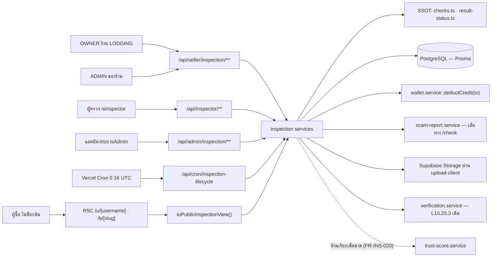
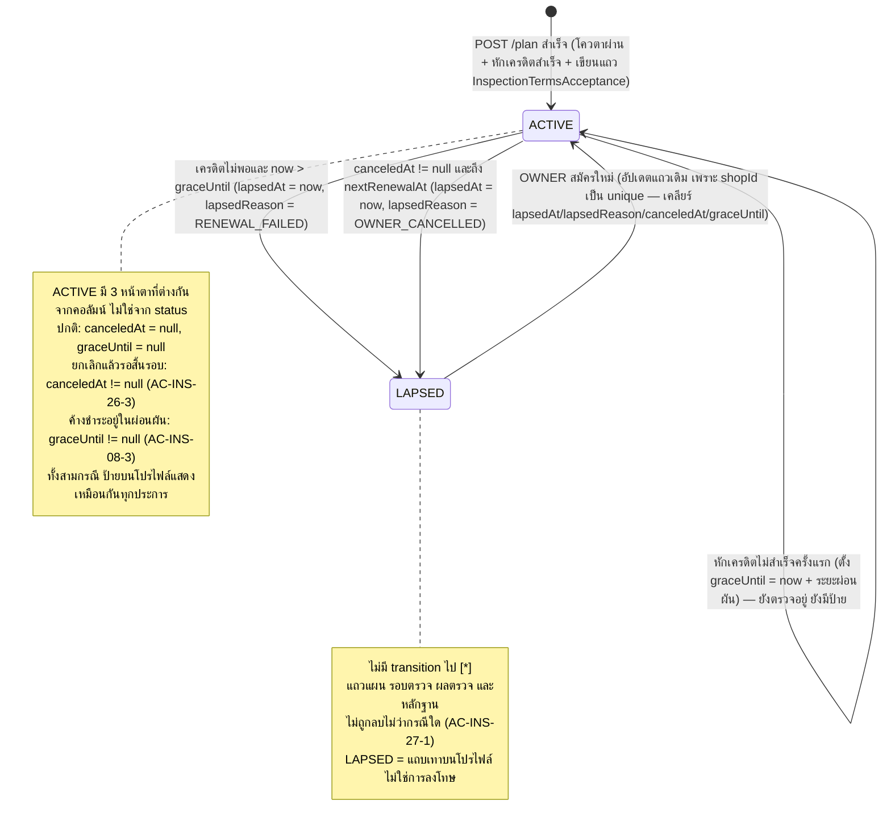
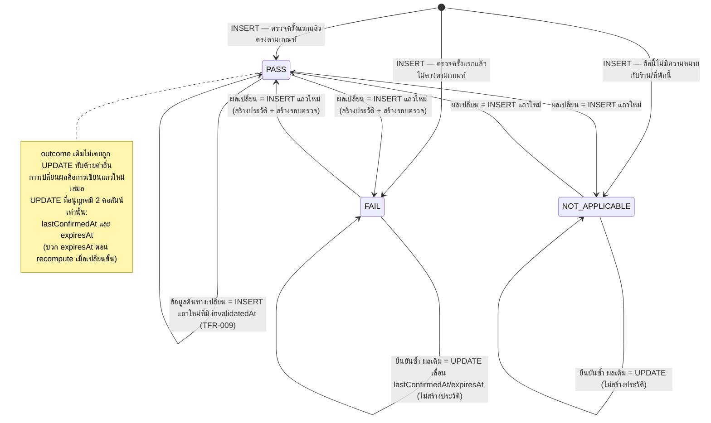
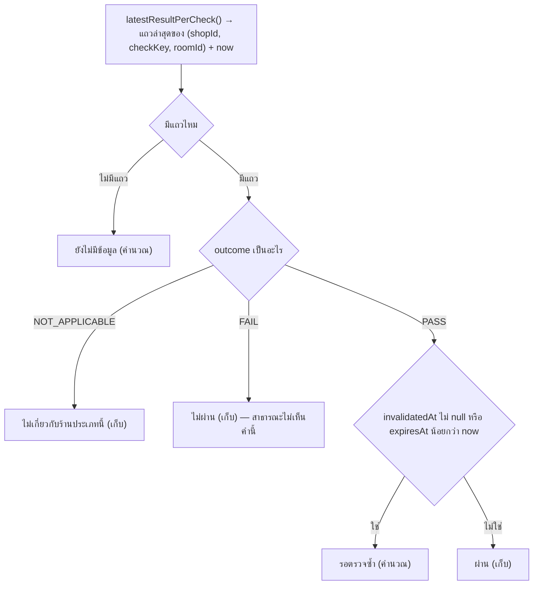
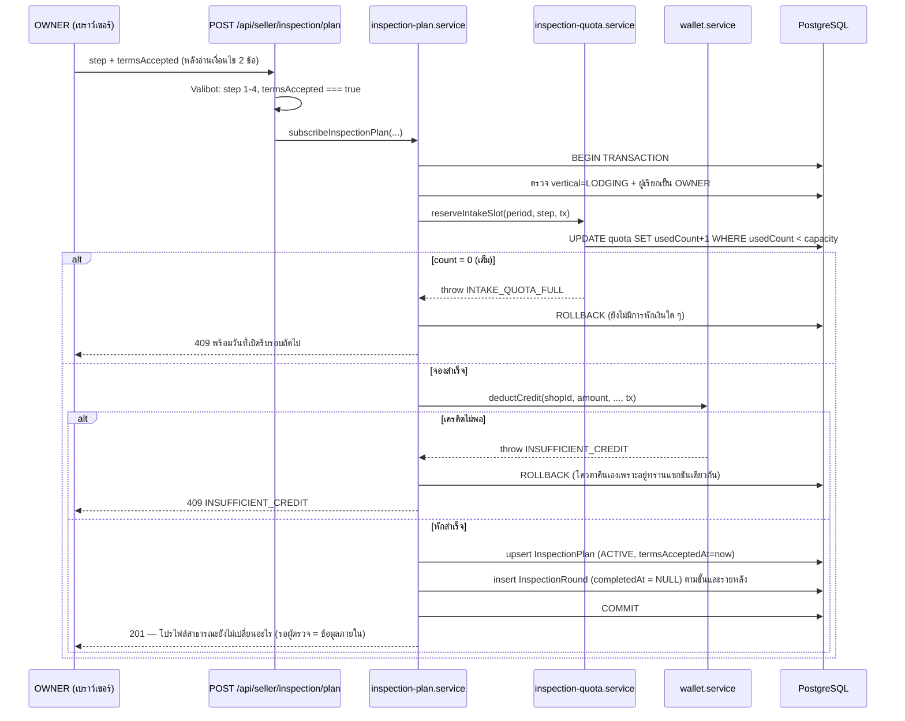
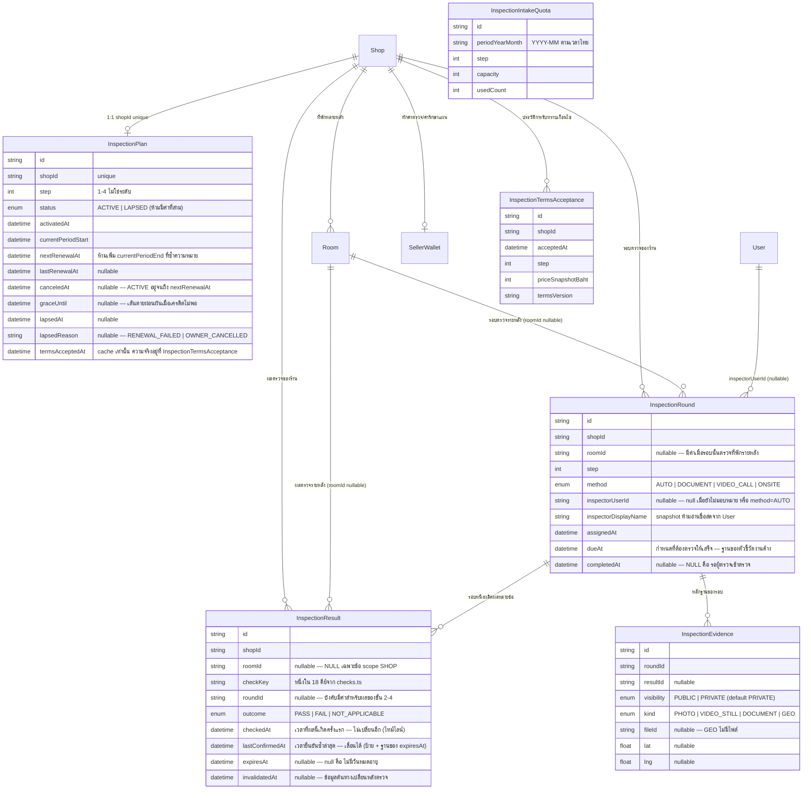

> **โมดูล:** M60-ShopInspection
> **ประเภทเอกสาร:** Software Requirements Specification (SRS) - TECHNICAL
> **เวอร์ชัน:** 1.0
> **วันที่จัดทำ:** 2026-08-29
> **สถานะ:** Draft
> **เจ้าของเอกสาร:** SA (ดู [[Feature-Docs-Ownership]])

# SRS: แผนการตรวจสอบร้านค้า (Shop Inspection Plan) — Software Requirements Specification (Technical)

---

## 1. บทนำ (Introduction)

### 1.1 วัตถุประสงค์ของเอกสาร

เอกสารนี้กำหนด **ข้อกำหนดเชิงเทคนิค** ของแผนการตรวจสอบร้านค้า (M60-ShopInspection) เพื่อให้ DEV/QA/DevOps นำไป implement และทดสอบได้ตรงกับเจตนาธุรกิจใน [[PRD]] และ [[BRD]] โดยครอบคลุม:

- โครงสร้างข้อมูลใหม่ 6 โมเดล + enum ใหม่ 5 ตัว + คอลัมน์ `User.isInspector`
- ตำแหน่งของ SSOT ทุกตัวในโค้ด (ข้อตรวจ 18 คีย์ · อายุผลตรวจ · การเลือกแถวล่าสุด · การแปลงแถวเป็นสถานะที่แสดง)
- สัญญาของ API และงานตามเวลา (cron) รวมเงื่อนไขความเป็น atomic ของการสมัคร
- เมทริกซ์สิทธิ์ครบทุก actor และตารางว่าฟิลด์ใดหลุดสู่สาธารณะได้/ไม่ได้
- กฎ validation ฝั่ง API (Valibot) และ NFR ที่วัดได้

**ผู้อ่าน:** DEV (ผู้ implement), QA (ผู้ออกแบบเคสทดสอบ), DevOps (ผู้ตั้ง cron/secret), SA/PO (ผู้ทวนสอบ traceability)

**หมายเหตุสำคัญ — คำที่ห้ามใช้:** เอกสารทั้งชุดนี้ห้ามใช้คำว่า "ระดับ" / "Level" / "Tier" กับสินค้านี้ คำเหล่านั้นสงวนให้ **Trust Tier** ซึ่งเป็นคนละแกนโดยสมบูรณ์ (ดู `CONTEXT.md`) คำที่ใช้คือ **แผนการตรวจสอบ · ขั้นการตรวจสอบ · ข้อตรวจ · ผลตรวจ · รอบตรวจ · ผู้ตรวจ · หลักฐาน** ชื่อ identifier ในโค้ดใช้ `step` ไม่ใช่ `level`/`tier`

### 1.2 ขอบเขตเชิงระบบ (System Scope)

**อยู่ในขอบเขตทางเทคนิค:**

| ส่วน | รายละเอียด |
|------|-----------|
| โมเดลข้อมูลใหม่ | `InspectionPlan` · `InspectionRound` · `InspectionResult` · `InspectionEvidence` · `InspectionIntakeQuota` · `InspectionTermsAcceptance` + คอลัมน์ `User.isInspector` |
| SSOT ในโค้ด | `src/lib/inspection/checks.ts` (ข้อตรวจ 18 คีย์ + `ttlDays()`) · `src/lib/inspection/result-status.ts` (`latestResultPerCheck()` + `resolveResultStatus()`) · `src/lib/inspection/public-view.ts` (`toPublicInspectionView()`) |
| Service layer | `src/services/inspection-plan.service.ts` · `inspection-round.service.ts` · `inspection-result.service.ts` · `inspection-quota.service.ts` |
| API | `/api/seller/inspection/**` · `/api/inspector/**` · `/api/admin/inspection/**` · `/api/cron/inspection-lifecycle` |
| งานตามเวลา | cron `inspection-lifecycle` schedule `"0 16 * * *"` (ตัดเครดิตรอบ 30 วัน · ตั้ง `lapsedAt`/`lapsedReason` · รันข้อตรวจอัตโนมัติของขั้นที่ 1 · **สร้างแถวโควตาของเดือนถัดไป**) |
| จุดที่แตะโค้ดเดิม | `Room.images` update path (invalidate `photos_match` ในทรานแซกชันเดียวกัน) · หน้าโปรไฟล์สาธารณะ `/u/[username]` และ `/b/[slug]` (บล็อกแสดงผลใหม่ + neutralize ที่ server boundary) · `wallet.service::deductCredit` (เรียกโดยส่ง `tx`) |

**อยู่นอกขอบเขตทางเทคนิค:**

| ส่วน | เหตุผล |
|------|--------|
| ช่องทางชำระเงินใหม่ | ใช้ `SellerWallet` + `WalletTransaction` เดิม (PRD §5) |
| การแก้สูตร Trust Score / Trust Tier | ห้ามแตะโดยเด็ดขาด (FR-INS-020) โมดูลนี้ **ต้องไม่ import `trust-score.service` เลยแม้แต่บรรทัดเดียว** |
| ไดเรกทอรีสาธารณะ + SEO | เป็นฟีเจอร์ `00061` แยกต่างหาก |
| ระบบยืนยันตัวตนใหม่ | ใช้ Verification L1/L2/L3 เดิมเป็นแหล่งข้อมูลของข้อตรวจ `phone_identity` |
| ฐานมิจฉาชีพ `/check` | มีอยู่แล้ว (`scam-report.service.ts`) โมดูลนี้เป็นเพียง **ผู้ป้อนเข้า** ผ่านเส้นทางแยก ไม่แก้กลไกภายในของมัน |
| ระบบสิทธิ์แบบกระจายบทบาทฝั่งร้าน | รอบแรกจำกัดที่ OWNER (FR-INS-002) |

### 1.3 เอกสารอ้างอิง (References)

| เอกสาร | ความสัมพันธ์ |
|--------|-------------|
| [[PRD]] ของโมดูลนี้ | ที่มาของเป้าหมายธุรกิจ KPI มติ D-1..D-16 และกฎที่แตะไม่ได้ 7 ข้อ (§4.1) |
| [[BRD]] ของโมดูลนี้ | ที่มาของ FR-INS-001..029 และ AC ทุกข้อ — TFR ทุกข้อในเอกสารนี้ trace กลับได้ |
| `CONTEXT.md` (รากรีโป) | อภิธานศัพท์ที่ล็อกแล้ว — นิยาม "ขั้นการตรวจสอบ" และข้อห้ามใช้คำว่า "ระดับ/Level/Tier" |
| `docs/SRS.md` (เอกสารระบบ) | ต้อง sync กลับหลัง implement (ดู §11) |
| `docs/conventions/rsc-mui-navigation.md` · memory `feedback_rsc_pii_neutralize_at_source` | หลัก neutralize PII ที่ server boundary ไม่ใช่ซ่อนที่ client |
| `docs/conventions/one-value-many-entry-points.md` | ใช้กับ `Room.images` ที่มีหลายทางเข้า — ต้องไล่ทางเข้าจากหน้าจอ ไม่ใช่จาก schema |
| `docs/conventions/migration-check-constraint-additive.md` | CHECK constraint ต้อง additive ห้าม hardcode รายการเดิมทับ |
| `docs/conventions/upload-body-size-limit.md` | ไฟล์หลักฐานทุกชนิดต้องผ่าน `@/lib/upload-client` ห้ามส่งผ่าน body ของ API route |
| `prisma/schema.prisma` (`Shop` · `Room` · `InventoryEntitlement` · `SellerWallet` · `User` · `ShopMember`) | รูปแบบที่โมเดลใหม่ต้องเดินตาม |

### 1.4 นิยามและตัวย่อ (Definitions & Acronyms)

| คำ/ตัวย่อ | ความหมายเชิงเทคนิค |
|-----------|----------|
| **ขั้นการตรวจสอบ (`step`)** | จำนวนเต็ม 1–4 เก็บเป็น `Int` ไม่ใช่ enum และไม่ใช่ "ระดับ" ขั้นที่สูงกว่ารวมข้อตรวจของขั้นที่ต่ำกว่าทั้งหมด |
| **ข้อตรวจ (`checkKey`)** | สตริงคีย์คงที่ 18 ค่า นิยามในโค้ดที่ `src/lib/inspection/checks.ts` **ไม่เก็บในฐานข้อมูล** |
| **ขอบเขตข้อตรวจ (`scope`)** | `SHOP` = ผลใช้ร่วมทุกที่พักของร้าน · `ROOM` = ผลผูกกับ `Room` รายหลัง — **ค่าคงที่ชื่อ `ROOM` ให้ตรงกับ entity `Room`/`roomId` ในสคีมา** ห้ามใช้ชื่อที่สอง (`PROPERTY`) สำหรับสิ่งเดียวกัน (Hard Rule 16) · ในเนื้อความเชิงธุรกิจยังเรียก "ที่พักรายหลัง" ได้ตามปกติ |
| **ผลตรวจที่เก็บ (`outcome`)** | ค่าที่บันทึกจริงในฐานข้อมูล 3 ค่า: `PASS` / `FAIL` / `NOT_APPLICABLE` |
| **สถานะที่แสดง (display status)** | 5 ค่าที่ผู้ใช้เห็น: ผ่าน / ไม่ผ่าน / รอตรวจซ้ำ / ยังไม่มีข้อมูล / ไม่เกี่ยวกับร้านประเภทนี้ — **2 ค่าเป็นผลลัพธ์ของการคำนวณ ไม่ได้เก็บ** |
| **`checkedAt`** | เวลาที่ผลของแถวนั้นถูกตัดสิน **ครั้งแรก** — เขียนครั้งเดียวตอน INSERT แล้ว **ไม่เปลี่ยนอีกเลย** ตอบคำถาม "ผลเปลี่ยนเมื่อไร" (ใช้กับไทม์ไลน์) |
| **`lastConfirmedAt`** | เวลาที่ผลเดิมถูกยืนยันซ้ำล่าสุด — **อัปเดตในที่ได้** ตอบคำถาม "ตรวจล่าสุดเมื่อไร" (ใช้กับป้ายบนโปรไฟล์) และเป็นฐานของ `expiresAt` |
| **รอบตรวจ (`InspectionRound`)** | หน่วยงานตรวจหนึ่งครั้ง มีผู้ตรวจ วันที่ และหลักฐานของตัวเอง `completedAt IS NULL` = "รอผู้ตรวจเข้าตรวจ" |
| **หลักฐานปิด / หลักฐานสาธารณะ** | `InspectionEvidence.visibility = PRIVATE` (ค่าตั้งต้น) / `PUBLIC` |
| **โควตารับสมัคร** | `InspectionIntakeQuota(periodYearMonth, step, capacity, usedCount)` — เพดานจำนวนร้านใหม่ต่อเดือนต่อขั้น |
| **"เต็มแล้ว" vs "ยังไม่เปิดรับ"** | **สองสถานะที่ต่างกันและห้ามพูดเหมือนกัน** — "เต็มแล้ว" = มีแถวโควตาและ `usedCount >= capacity` · "ยังไม่เปิดรับ" = **ไม่มีแถวโควตาของเดือน/ขั้นนั้น** (พฤติกรรมเหมือนกันคือปฏิเสธ แต่ข้อความต่างกัน) |
| **ระยะผ่อนผัน (`graceUntil`)** | เส้นตายที่แผนยังเป็น `ACTIVE` ได้ทั้งที่หักเครดิตไม่สำเร็จ เก็บเป็น **วันที่** ไม่ใช่จำนวนวัน เพื่อให้หน้าจอนับถอยหลังได้ตรง — จำนวนวันที่ใช้ตั้งค่า **รอเคาะ** (ดู §10) |
| **ยกเลิกแล้วแต่ยังไม่หมดรอบ** | `status = 'ACTIVE'` **และ** `canceledAt != null` — **ไม่ใช่ค่าที่สามของ `InspectionPlanStatus`** ป้ายยังแสดงปกติจนถึง `nextRenewalAt` |
| **RSC flight payload** | ข้อมูลที่ Next.js serialize ข้ามจาก server component ไป client — สิ่งที่หลุดเข้าไปแล้วผู้ใช้อ่านได้จาก view-source |

---

## 2. ภาพรวมสถาปัตยกรรม (Architecture Overview)

### 2.1 บริบทระบบ (System Context)



### 2.2 องค์ประกอบหลัก (Components)

| Component | หน้าที่ | Submodule / Stack |
|-----------|---------|-------------------|
| **`src/lib/inspection/checks.ts`** | SSOT ของข้อตรวจ 18 คีย์ (`step` · `scope` · `method` · `ttlDays` · `labelTh` · `publicEvidence`) + ฟังก์ชัน `ttlDays(checkKey, planStep)` | TypeScript pure module (ไม่ import prisma ไม่ import React) |
| **`src/lib/inspection/result-status.ts`** | `latestResultPerCheck()` — เลือกแถวล่าสุดต่อ (ขอบเขต, `checkKey`) จากตารางที่เป็น append-only · `resolveResultStatus()` — แปลงแถวนั้นเป็น 1 ใน 5 สถานะที่แสดง **ทั้งคู่เป็น SSOT ห้ามหน้าจอไหน query หรือคำนวณเอง** | TypeScript pure module |
| **`src/lib/inspection/public-view.ts`** | `toPublicInspectionView()` — ตัดฟิลด์ที่ห้ามหลุดออกที่ server boundary ก่อน serialize | TypeScript pure module |
| **`src/services/inspection-plan.service.ts`** | สมัคร / อัปเกรด / ยกเลิก / ต่ออายุ / ตั้ง `lapsedAt` | Service layer (Prisma) |
| **`src/services/inspection-round.service.ts`** | มอบหมายผู้ตรวจ · snapshot ชื่อผู้ตรวจ · ปิดรอบ · query งานของผู้ตรวจ (scope ใน `WHERE`) | Service layer |
| **`src/services/inspection-result.service.ts`** | บันทึกผลรายข้อ · invalidate · recompute `expiresAt` · อ่านผลล่าสุดต่อร้าน/ต่อหลัง | Service layer |
| **`src/services/inspection-quota.service.ts`** | จอง/คืนโควตาแบบ atomic (conditional `updateMany`) | Service layer |
| **`src/app/api/cron/inspection-lifecycle/route.ts`** | งานรายวัน: ตัดเครดิต · `lapsedAt` · รันข้อตรวจอัตโนมัติของขั้นที่ 1 | Next.js route handler (nodejs runtime, `maxDuration = 60`) |
| **หน้าโปรไฟล์สาธารณะ** | บล็อกแสดงผลตรวจ + ไทม์ไลน์ (แยกบล็อกแยกคำจาก Trust Tier เสมอ) | `(marketing)` route group — Vuexy |
| **หน้าฝั่งร้าน / ผู้ตรวจ / แอดมิน** | สมัคร · ส่งเอกสาร · บันทึกผล · จัดโควตา | `(paces)` route group — Paces (ผ่าน `safepay-ux` gate ก่อนเขียนโค้ด) |

### 2.3 มุมมองการ Deploy (Deployment View)

- ทุกส่วนรันบน Vercel (region `sin1`) เป็น Next.js App Router เดียวกับระบบเดิม **ไม่มี service แยก ไม่มี worker แยก**
- cron ตัวใหม่ประกาศใน `vercel.json` ที่ช่อง `"0 16 * * *"` ซึ่งยังว่างอยู่ (ตรวจแล้ว 2026-08-29 — cron ปัจจุบันใช้ `17,18,19,20,21,22,23` และ `*/5`, `*`)
  - **Vercel cron ใช้เวลา UTC** ⇒ `0 16 * * *` = **23:00 น. เวลาไทย** การตัดวันภายในงานต้องใช้ `thaiDayKey()` จาก `src/lib/format-date.ts` ห้ามใช้ `toISOString().slice(0,10)` (บทเรียน 00033)
  - auth ของ cron ใช้รูปแบบเดียวกับ `inventory-renewal`: `Authorization: Bearer ${CRON_SECRET}` เทียบสตริงเต็ม และ **reject ทันทีถ้า `CRON_SECRET` ว่าง** (ห้ามปล่อยให้เทียบกับ `Bearer undefined` แล้วผ่าน)
  - ต้อง export ทั้ง `GET` (Vercel ยิง GET) และ `POST` (manual trigger) ไม่งั้น cron ได้ 405 และ **ไม่เคยรันจริงโดยไม่มีอะไรฟ้อง**
- migration ขึ้น prod อัตโนมัติผ่าน `prisma migrate deploy` ใน `buildCommand` — push `main` = migrate ขึ้น prod ในตัว (Hard Rule 15)

---

## 3. ข้อกำหนดเชิงฟังก์ชันเชิงเทคนิค (Technical Functional Requirements)

### TFR-001: SSOT ข้อตรวจ 18 คีย์ในโค้ด ไม่เก็บในฐานข้อมูล

- **Trace to:** FR-INS-003, FR-INS-004, FR-INS-005, FR-INS-006, FR-INS-029
- **คำอธิบายเชิงเทคนิค:** ประกาศ `INSPECTION_CHECKS` เป็น `Record<InspectionCheckKey, InspectionCheckDef>` ที่ `src/lib/inspection/checks.ts` โดย `InspectionCheckKey` เป็น type union ของ 18 คีย์ (ทำให้ `tsc` บังคับว่า record มีครบทุกคีย์ — บทเรียน `enum-value-removal.md`: grep จับ object key ไม่ได้ ต้องให้ type บังคับ)

| `checkKey` | `step` | `scope` | `method` | `ttlDays` (ฐาน) | `publicEvidence` | `labelTh` |
|---|---|---|---|---|---|---|
| `scam_db` | 1 | SHOP | AUTO | 1 | false | ตรวจฐานมิจฉาชีพ |
| `phone_identity` | 1 | SHOP | AUTO | 1 | false | ยืนยันเบอร์โทร/ตัวตนขั้นต้น |
| `account_age` | 1 | SHOP | AUTO | 1 | false | อายุบัญชี |
| `chat_response_speed` | 1 | SHOP | AUTO | 1 | false | ความเร็วตอบแชท |
| `complaints` | 1 | SHOP | AUTO | 1 | false | ข้อร้องเรียน |
| `duplicate_listing` | 1 | ROOM | AUTO | 1 | false | ที่พักไม่ถูกประกาศซ้ำโดยบัญชีอื่น |
| `id_card_selfie` | 2 | SHOP | DOCUMENT | 365 | false | บัตรประชาชนคู่เซลฟี่ |
| `bank_account_name` | 2 | SHOP | DOCUMENT | 365 | false | ชื่อบัญชีรับเงินตรงกับเจ้าของ |
| `lease_right_document` | 2 | ROOM | DOCUMENT | 365 | false | เอกสารสิทธิ์ปล่อยเช่า |
| `hotel_license` | 2 | ROOM | DOCUMENT | 365 | false | ใบอนุญาตประกอบกิจการโรงแรม |
| `video_tour` | 3 | ROOM | VIDEO_CALL | 180 | true | วิดีโอคอลนำชมสด |
| `operating_evidence` | 3 | ROOM | DOCUMENT | 90 | false | หลักฐานการเปิดให้บริการจริง |
| `location_exists` | 4 | ROOM | ONSITE | 365 | true | สถานที่มีอยู่จริงตามพิกัด |
| `photos_match` | 4 | ROOM | ONSITE | 365 | true | ภาพประกาศตรงกับของจริง |
| `room_count` | 4 | ROOM | ONSITE | 365 | true | จำนวนและประเภทห้องตรงตามประกาศ |
| `facilities` | 4 | ROOM | ONSITE | 365 | true | สิ่งอำนวยความสะดวกมีอยู่จริง |
| `accessibility` | 4 | ROOM | ONSITE | 365 | true | ที่พักเข้าถึงได้จริงตามที่ประกาศ |
| `deep_photo_album` | 4 | ROOM | ONSITE | 365 | true | อัลบั้มภาพที่ผู้ตรวจของ Deep ถ่ายเอง |

  รวม: ผูกร้าน 7 ข้อ · ผูกที่พักรายหลัง 11 ข้อ · ขั้นที่ 1 มี 6 ข้อพอดีตาม AC-INS-03-1
- **Precondition:** ไม่มี — เป็นค่าคงที่ระดับ module
- **Postcondition:** ทุกจุดในระบบที่ต้องรู้ว่า "ข้อนี้อยู่ขั้นไหน / ผูกอะไร / ตรวจด้วยวิธีไหน / หลักฐานเปิดได้ไหม / ชื่อไทยว่าอะไร" อ่านจากที่นี่ที่เดียว
- **Error / Edge cases:**
  - `method` **ไม่ผูกกับ `step` แบบหนึ่งต่อหนึ่ง** — `operating_evidence` อยู่ขั้นที่ 3 แต่ method เป็น `DOCUMENT` ห้าม derive `method` จาก `step` (`no-derive-meaning-from-count.md` คลาสเดียวกัน)
  - **หมายเหตุสำคัญ — `operating_evidence.method` ต้องเป็น `DOCUMENT` ห้ามเป็น `VIDEO_CALL` ทั้งที่อยู่ขั้นเดียวกับ `video_tour`** — `method` ไม่ได้เป็นแค่ป้ายบอกชนิดงาน แต่เป็น **คีย์จัดกลุ่มรอบตรวจ** (`createDueRounds()` จัดกลุ่มตาม `(shopId, roomId, step, method)` — TFR-021) ⇒ ถ้าตั้งเป็น `VIDEO_CALL` มันจะถูกจับกลุ่มเข้ากับ `video_tour` แล้วรอบนั้นจะถูกกำหนดด้วย `dueAt` ที่เร็วที่สุดในกลุ่ม ซึ่งคือ 90 วันของ `operating_evidence` ⇒ **ผู้ตรวจถูกบังคับให้นัดวิดีโอคอลทุก 90 วันทั้งที่ `video_tour` ต้องการแค่ 180 วัน = งานเพิ่มเท่าตัวโดยไม่ได้ข้อมูลเพิ่มแม้แต่ข้อเดียว** · หลักฐานการเปิดให้บริการจริงเป็นเอกสารย้อนหลังที่ร้านส่งได้เอง ไม่ต้องนัดเวลากับใคร การรวมเข้ากับงานที่ต้องนัดจึงผิดทั้งเชิงต้นทุนและเชิงความหมาย
  - ร้าน LODGING ที่ยังไม่มีแถว `Room` เลย: ข้อตรวจ scope `ROOM` **ไม่มีเป้าหมายให้ตรวจ** ⇒ ไม่สร้างแถวผล = แสดง "ยังไม่มีข้อมูล" ห้ามสร้างแถวผลโดยตั้ง `roomId = null` แทน (จะกลายเป็นผลระดับร้านที่สืบทอดข้ามหลัง ผิด FR-INS-029)
  - เพิ่มคีย์ใหม่ในอนาคตต้องเพิ่มใน type union ก่อน แล้วให้ `tsc` ไล่จุดที่ยังไม่รองรับ — **ห้ามใช้ `Record<string, ...>`**

### TFR-002: `ttlDays(checkKey, planStep)` และการ recompute `expiresAt` เมื่อขั้นเปลี่ยน

- **Trace to:** FR-INS-006 (AC-INS-06-1, AC-INS-06-3), FR-INS-012, FR-INS-007
- **คำอธิบายเชิงเทคนิค:** อายุผลตรวจ **ไม่ใช่ค่าคงที่ต่อคีย์** แต่ขึ้นกับขั้นของแผนที่ร้านอยู่ ณ เวลาที่บันทึกผล จึงต้อง export เป็นฟังก์ชัน:

  ```
  ttlDays(checkKey, planStep) =
    ถ้า planStep === 4 และ checkKey ∈ { 'video_tour', 'operating_evidence' } → 90
    นอกนั้น → INSPECTION_CHECKS[checkKey].ttlDays
  ```

  เหตุผล: AC-INS-06-1 บังคับว่าร้านขั้นที่ 4 ต้องทวนข้อตรวจของขั้นที่ 3 ซ้ำ **ทุก 3 เดือน** ขณะที่ร้านขั้นที่ 3 ทวน `video_tour` ทุก 6 เดือน — ค่าเดียวกันต่างกันตามขั้น
- **Precondition:** รู้ `planStep` ปัจจุบันของร้าน (จาก `InspectionPlan.step`)
- **Postcondition:** `InspectionResult.expiresAt = lastConfirmedAt + ttlDays(checkKey, planStep) วัน` ทุกครั้งที่เขียนหรือยืนยันแถวผล

  **หมายเหตุสำคัญ — ฐานของ `expiresAt` คือ `lastConfirmedAt` ไม่ใช่ `checkedAt`** เพราะข้อตรวจอัตโนมัติที่ยืนยันผลเดิมทุกวันต้องต่ออายุได้โดยไม่สร้างแถวใหม่ (TFR-014) ถ้านับจาก `checkedAt` ผลของข้อขั้นที่ 1 จะหมดอายุในวันถัดไปเสมอทั้งที่ระบบยืนยันซ้ำอยู่ทุกวัน
- **Error / Edge cases:**
  - **`expiresAt` เป็นค่าที่ถูกเก็บไว้ (snapshot) ไม่ใช่ค่าที่คำนวณสด** ⇒ ตอนร้าน **อัปเกรดจากขั้น 3 ไปขั้น 4** แถว `video_tour` ที่มี `expiresAt` = +180 วันจะยังยาวเกินไปทั้งที่กฎใหม่คือ 90 วัน ⇒ **การเปลี่ยน `InspectionPlan.step` ต้อง recompute `expiresAt` ของแถวผลล่าสุดทุกแถวที่ได้รับผลกระทบ ในทรานแซกชันเดียวกับการเปลี่ยนขั้น** (recompute จาก `lastConfirmedAt` ของแถวนั้น ไม่ใช่จากเวลาปัจจุบัน — ไม่งั้นการอัปเกรดจะกลายเป็นการต่ออายุผลเก่าให้ฟรี) ห้ามปล่อยให้ cron ตามเก็บ (ระหว่างนั้นป้ายจะโกหกว่า "ผ่าน" ทั้งที่เกินกำหนดทวนแล้ว)
  - ทิศกลับ (ลดขั้น 4 → 3) `expiresAt` ที่สั้นกว่าจะถูกยืดกลับเป็น 180 วัน — ยอมรับได้เพราะกฎ 90 วันเป็นเงื่อนไขของขั้นที่ 4 เท่านั้น แต่ต้อง recompute ทั้งสองทิศด้วยฟังก์ชันเดียวกัน ห้ามเขียนสูตรซ้ำ
  - เทส `[blocker]`: mutation "ถอดกิ่ง `planStep === 4` ออก" ต้องทำให้เทสแดง และ mutation "ลบการ recompute ตอนเปลี่ยนขั้น" ต้องทำให้เทสแดงเช่นกัน (สองเรื่องคนละตัว ต้องมีเทสคนละตัว)

### TFR-003: `latestResultPerCheck()` + `resolveResultStatus()` — สถานะที่แสดง 5 แบบ เก็บใน DB 3 แบบ

- **Trace to:** FR-INS-011, FR-INS-012, FR-INS-016, FR-INS-027, FR-INS-029 (AC-INS-29-4)
- **คำอธิบายเชิงเทคนิค:** `InspectionResult` เป็นตาราง **append-only ที่เก็บประวัติ ไม่ใช่ตารางสถานะปัจจุบัน** (TFR-014) ⇒ การอ่านสถานะต้องผ่าน 2 ขั้นที่อยู่ในไฟล์ SSOT เดียวกัน `src/lib/inspection/result-status.ts`:

  **ขั้นที่ 1 — เลือกแถวล่าสุด**
  ```
  latestResultPerCheck(rows: InspectionResultRow[]): Map<ResultScopeKey, InspectionResultRow>
  ```
  คีย์คือ `(checkKey, roomId ?? null)` และ **สูตรของ "ล่าสุด" คือ `ORDER BY checkedAt DESC, id DESC` เสมอ ทุกที่ ทั้ง SQL และ TS** — ห้ามมีที่ไหนเรียงด้วย `checkedAt` เปล่า ๆ
  ฝั่งฐานข้อมูลดึงด้วย `DISTINCT ON` ที่มี **`shopId` เป็นคีย์แรกเสมอ**:
  `SELECT DISTINCT ON ("shopId", "checkKey", "roomId") ... ORDER BY "shopId", "checkKey", "roomId", "checkedAt" DESC, "id" DESC`

  **หมายเหตุสำคัญ — tie-break ด้วย `"id" DESC` ห้ามตัดออก และต้องเป็นสูตรเดียวกันเป๊ะทั้งฝั่ง SQL และฝั่ง TS (`latestResultPerCheck()`)** — cron ขั้นที่ 1 เขียนหลายข้อในทรานแซกชันเดียว `checkedAt` ซ้ำวินาทีจึงเป็นเรื่องปกติ ไม่ใช่ edge case ถ้าสองฝั่งเรียงไม่เหมือนกัน ป้ายกับไทม์ไลน์จะไม่ตรงกันแบบสุ่มโดยไม่มีอะไรฟ้อง ⇒ ต้องมีเทส parity ที่ป้อนแถวชุดเดียวกันเข้าทั้งสองทางแล้วยืนยันว่าได้แถวเดียวกัน
  (บทเรียนในรีโปนี้: `DISTINCT ON` ที่ไม่มี shop key เป็นคีย์แรกทำให้ข้อมูลข้ามร้านได้ — ดู memory `feedback_distinct_on_needs_shop_key`)

  **ขั้นที่ 2 — แปลงแถวเป็นสถานะที่แสดง**
  ```
  resolveResultStatus(row: InspectionResultRow | null, now: Date): InspectionDisplayStatus
  ```
  `InspectionDisplayStatus = 'PASS' | 'FAIL' | 'RECHECK' | 'NO_DATA' | 'NOT_APPLICABLE'`
  (คำไทยที่ผูกกับแต่ละค่าอยู่ในไฟล์เดียวกันเป็น `DISPLAY_STATUS_LABEL_TH` — ห้ามพิมพ์คำว่า "รอตรวจซ้ำ" ซ้ำที่หน้าจอไหนอีก ตาม Hard Rule 16)

  ลำดับการตัดสิน (ลำดับสำคัญ ห้ามสลับ):

  | # | เงื่อนไข | ผลลัพธ์ |
  |---|---------|--------|
  | 1 | `row === null` (ไม่มีแถว) | `NO_DATA` — ยังไม่มีข้อมูล |
  | 2 | `row.outcome === 'NOT_APPLICABLE'` | `NOT_APPLICABLE` — ไม่เกี่ยวกับร้านประเภทนี้ |
  | 3 | `row.outcome === 'PASS'` **และ** (`row.invalidatedAt !== null` **หรือ** (`row.expiresAt !== null` และ `row.expiresAt < now`)) | `RECHECK` — รอตรวจซ้ำ |
  | 4 | `row.outcome === 'PASS'` | `PASS` — ผ่าน |
  | 5 | `row.outcome === 'FAIL'` | `FAIL` — ไม่ผ่าน |

- **Precondition:** ผู้เรียกส่ง `now` เข้ามาเสมอ (ห้ามเรียก `new Date()` ในฟังก์ชัน — จะเทสค่าขอบไม่ได้) และส่งแถวที่ผ่าน `latestResultPerCheck()` มาแล้ว
- **Postcondition:** ไม่มีหน้าจอใดในระบบเลือกแถวเองหรือคำนวณสถานะเอง ทุกหน้าจอ (สาธารณะ · ร้าน · ผู้ตรวจ · แอดมิน · แอปมือถือ) เรียกสองฟังก์ชันนี้
- **Error / Edge cases:**
  - **`expiresAt` ผูกกับ `lastConfirmedAt` ไม่ใช่ `checkedAt`** (TFR-002) ⇒ ข้อที่ยืนยันซ้ำทุกวันจะไม่ตกเป็น `RECHECK` ตราบเท่าที่ cron ยังทำงาน และจะตกเป็น `RECHECK` เองภายใน 1 วันถ้า cron หยุด ซึ่งเป็นพฤติกรรมที่ถูก (ป้ายไม่ควรพูดว่า "ผ่าน" ถ้าไม่มีใครตรวจอยู่จริง)
  - **`latestResultPerCheck()` ต้องเรียงด้วย `checkedAt` ไม่ใช่ `lastConfirmedAt`** — แถวเก่าที่เคยถูกยืนยันซ้ำมานานอาจมี `lastConfirmedAt` ใหม่กว่าแถวที่มาแทนที่ได้ในเคส invalidate (TFR-009) เรียงผิดฟิลด์ = หยิบแถวที่ถูกแทนที่ไปแล้วกลับมาแสดง
  - `expiresAt` เปรียบเทียบด้วย `<` ไม่ใช่ `<=` ⇒ ณ วินาทีที่เท่ากันพอดี ยังถือว่า "ผ่าน" (ต้องมีเทสค่าขอบ 3 จุด: ก่อน 1ms / เท่ากันพอดี / หลัง 1ms)
  - `expiresAt === null` แปลว่า "ไม่มีวันหมดอายุ" ไม่ใช่ "หมดอายุแล้ว" — ห้ามใช้ `!row.expiresAt` เป็นเงื่อนไขหมดอายุ
  - แถว `FAIL` ที่มี `invalidatedAt` **ยังคงเป็น `FAIL`** ตามกฎข้อ 5 (ดู §10 Open Questions ข้อ OQ-4 — มีความตึงกับผังใน PRD §10.5)
  - เทส `[blocker]`: mutation "สลับข้อ 3 กับข้อ 4" · "เปลี่ยน `<` เป็น `<=`" · "ตัด `invalidatedAt` ออกจากเงื่อนไขข้อ 3" · "เปลี่ยน `latestResultPerCheck` ให้เรียงด้วย `lastConfirmedAt`" · "ถอด `shopId` ออกจากคีย์แรกของ `DISTINCT ON`" ต้องแดงทุกตัว **และถ้าไม่แดง แปลว่าชุด input อ่อน ต้องเติม input ไม่ใช่สรุปว่า mutation ไม่เกี่ยว** (`mutation-silence-means-weak-corpus.md`)
  - **ห้ามมีที่ไหนในระบบเก็บสถานะ `RECHECK`/`NO_DATA` ลงคอลัมน์** — ทั้งสองค่าเป็นผลลัพธ์ของการคำนวณ การเก็บซ้ำจะเน่าเงียบทันทีที่เวลาเดินผ่านเส้น `expiresAt` โดยไม่มีใครเขียนทับ (นี่คือเหตุผลที่ cron **ไม่มีงานอัปเดตสถานะหมดอายุ**)

### TFR-004: State machine ของ `InspectionPlan`

- **Trace to:** FR-INS-008, FR-INS-013, FR-INS-019, FR-INS-026, FR-INS-027



- **คำอธิบายเชิงเทคนิค:** สถานะเก็บใน `InspectionPlan.status` (`ACTIVE` | `LAPSED`) มิเรอร์รูปแบบของ `InventoryEntitlement` (`ACTIVE` | `LOCKED`) โดยเปลี่ยนชื่อค่าให้ตรงคำของโดเมนนี้ — "ไม่ได้อยู่ในแผนแล้ว" ไม่ใช่ "ถูกล็อก"

  **หมายเหตุสำคัญ — `LAPSED` รวมสองเหตุการณ์ที่ BRD แยกกัน** (ค้างชำระ vs OWNER กดยกเลิกเอง) จึงต้องมี `lapsedReason String?` เก็บ `'RENEWAL_FAILED'` หรือ `'OWNER_CANCELLED'` (มิเรอร์ `Shop.packageLockReason` ที่โปรเจกต์ใช้รูปแบบนี้อยู่แล้ว) — **หน้าสาธารณะแสดงข้อความเดียวกันทั้งสองกรณีตาม BRD ไม่เปลี่ยน** คอลัมน์นี้มีไว้เพื่อ (1) KPI อัตราการต่ออายุใน PRD §1.2 ซึ่งแยกไม่ออกเลยถ้าไม่เก็บ (2) ไม่ให้หน้าจอฝั่งร้านบอกเหตุผลผิด (ร้านที่กดยกเลิกเองไม่ควรถูกบอกว่า "เครดิตไม่พอ")
- **Postcondition:** `status = 'LAPSED'` ⇒ (1) หยุดสร้างรอบตรวจใหม่ทุกชนิด (2) หยุดรันข้อตรวจอัตโนมัติ (3) โปรไฟล์สาธารณะเปลี่ยนเป็นแถบเทา + วันที่ข้อมูลล่าสุด (4) ไทม์ไลน์เดิมยังแสดงครบ
- **Error / Edge cases:**
  - **"ไม่มีแถว `InspectionPlan` เลย" ไม่ใช่ค่า enum** — คือ "ไม่เคยสมัคร" (contract แบบเดียวกับ `InventoryEntitlement` ที่ `NOT_SUBSCRIBED` ไม่ใช่ค่า enum) หน้าจอต้องแยก "ไม่เคยสมัคร" ออกจาก "เคยสมัครแล้วเลิก" — อย่างหลังเท่านั้นที่ขึ้นแถบเทา
  - **ห้ามเพิ่มค่าที่สามใน `InspectionPlanStatus`** — "ยกเลิกแล้วแต่ยังไม่หมดรอบ" คือ `ACTIVE` + `canceledAt != null` ค่าที่สามจะทำให้ทุกที่ที่เช็ค `status === 'ACTIVE'` (การตรวจ · ป้าย · การตัดเครดิต) ตกกรณีนี้เงียบ ๆ ทั้งที่ร้านจ่ายเงินไปแล้วและมีสิทธิ์เต็ม
  - **ห้ามเพิ่มคอลัมน์ `currentPeriodEnd`** — ความหมายซ้ำกับ `nextRenewalAt` ทุกประการ สองคอลัมน์ที่แปลว่าสิ่งเดียวกันจะเลื่อนไม่พร้อมกันในวันใดวันหนึ่งแน่นอน (Hard Rule 16)
  - **ช่วง `ACTIVE` + `canceledAt != null` คือช่วงที่คนอ่านโค้ดทีหลังเข้าใจผิดง่ายที่สุด** — ต้องเขียนคอมเมนต์กำกับที่คอลัมน์ และมีเทส `[blocker]` ยืนยันว่าระหว่างช่วงนี้ (ก) ป้ายสาธารณะยังแสดงปกติ (ข) ข้อตรวจอัตโนมัติยังรัน (ค) รอบตรวจที่ค้างอยู่ยังถูกทำต่อจนจบ
  - ห้ามให้ `FAIL` ของข้อตรวจใดเปลี่ยน `status` หรือลด `step` โดยอัตโนมัติ (AC-INS-13-1) — ต้องมีเทส `[blocker]` ยืนยันว่าไม่มีเส้นทางไหนทำแบบนั้น

### TFR-005: State machine ของผลตรวจรายข้อ — สิ่งที่เก็บ vs สิ่งที่คำนวณ

- **Trace to:** FR-INS-011, FR-INS-012, FR-INS-013, FR-INS-028, FR-INS-029

**ชั้นที่เก็บจริงในฐานข้อมูล (`InspectionResult.outcome` — 3 ค่า) และการเขียน 2 แบบที่ต่างกันโดยสิ้นเชิง:**



**สองทรานซิชันที่ห้ามสับสนกัน:**

| | ยืนยันซ้ำ (ผลเดิม) | ผลเปลี่ยน |
|---|---|---|
| การเขียน | `UPDATE` แถวล่าสุด | `INSERT` แถวใหม่ |
| `checkedAt` | **ไม่แตะ** (คงเวลาที่ผลนี้เกิดครั้งแรก) | `= now` |
| `lastConfirmedAt` | `= now` | `= now` |
| `expiresAt` | `= now + ttlDays(...)` | `= now + ttlDays(...)` |
| สร้าง `InspectionRound` | **ไม่สร้าง** | สร้าง |
| ปรากฏในไทม์ไลน์สาธารณะ | **ไม่ปรากฏ** (ไม่มีข้อมูลใหม่ให้ผู้ซื้ออ่าน) | ปรากฏ |
| ป้าย "ตรวจล่าสุด" ขยับ | **ขยับ** (เพราะอ่าน `lastConfirmedAt`) | ขยับ |

**ชั้นที่คำนวณตอนอ่าน (5 สถานะที่ผู้ใช้เห็น — ไม่มีคอลัมน์ไหนเก็บ):**



- **คำอธิบายเชิงเทคนิค:** เส้นทางที่ทำให้เกิด "รอตรวจซ้ำ" มี 2 เส้นเท่านั้น และทั้งสองเส้น **ไม่มีงานเบื้องหลังมาเปลี่ยนสถานะของแถวเดิม**:
  1. **เวลาเดินผ่าน `expiresAt`** (ซึ่งนับจาก `lastConfirmedAt`) — ไม่มีใครเขียนอะไร สถานะเปลี่ยนเองตอนอ่าน (นี่คือเหตุผลที่ cron ไม่มีงานอัปเดตสถานะหมดอายุ)
  2. **มีแถวใหม่ที่มี `invalidatedAt`** — เกิดจากข้อมูลต้นทางเปลี่ยน กรณีเดียวในรอบแรกคือ `photos_match` ตอนร้านแก้ `Room.images` (TFR-009) — เป็น INSERT ไม่ใช่การแก้แถวเก่า
- **Error / Edge cases:** ห้ามมีหน้าจอไหนเขียนเงื่อนไข `expiresAt < now` เอง — ต้องเรียก `resolveResultStatus()` เท่านั้น (เทส `[blocker]` สแกนซอร์สทั้ง `src/` ห้ามพบ pattern `expiresAt` เทียบกับเวลานอกไฟล์ SSOT)

### TFR-006: การสมัคร — ทรานแซกชันเดียวครอบ โควตา + เครดิต + แผน + รอบตรวจ

- **Trace to:** FR-INS-001, FR-INS-002, FR-INS-008, FR-INS-009, FR-INS-010
- **คำอธิบายเชิงเทคนิค:** `subscribeInspectionPlan({ shopId, userId, step, termsAccepted })` ทำงานใน `prisma.$transaction` เดียวตามลำดับนี้:
  1. ตรวจ `Shop.vertical === 'LODGING'` และ `Shop.deletedAt === null` (server-side เสมอ ไม่ใช่แค่ซ่อนปุ่ม)
  2. ตรวจว่าผู้เรียกเป็น **OWNER** ของร้าน (`Shop.userId === userId`) — `ShopMember.role === 'ADMIN'` ไม่ผ่านด่านนี้
  3. ตรวจ `termsAccepted === true`
  4. **จองโควตาแบบ atomic** (TFR-007) — ไม่ผ่าน ⇒ โยน `INTAKE_QUOTA_FULL` หรือ `INTAKE_NOT_OPEN` และ rollback ทั้งก้อน
  5. `deductCredit(shopId, amount, refId, description, reason, tx)` — ส่ง `tx` เข้าไปเสมอ เพื่อให้การหักเงินอยู่ในทรานแซกชันเดียวกับการจองโควตา
  6. **INSERT แถว `InspectionTermsAcceptance`** (`shopId`, `acceptedAt=now`, `step`, `priceSnapshotBaht`, `termsVersion`) — **นี่คือแหล่งความจริงของการรับทราบเงื่อนไข**
  7. `upsert` แถว `InspectionPlan` (`shopId` เป็น unique) ตั้ง `status='ACTIVE'`, `step`, `activatedAt`, `currentPeriodStart=now`, `nextRenewalAt=now+30วัน`, `termsAcceptedAt=now` (cache), `canceledAt=null`, `graceUntil=null`, `lapsedAt=null`, `lapsedReason=null`
  8. ถ้า `step >= 2` สร้าง `InspectionRound` ที่ `completedAt = null` (สถานะภายใน "รอผู้ตรวจเข้าตรวจ") — 1 รอบต่อขั้นที่ต้องใช้คน และ **สร้างรายหลังสำหรับข้อตรวจ scope `ROOM`**

  **หมายเหตุสำคัญ — `InspectionPlan.termsAcceptedAt` เป็นเพียง cache สำหรับอ่านเร็ว ไม่ใช่แหล่งความจริง** ช่องเดียวเก็บได้แค่ครั้งล่าสุด แต่ AC-INS-10-3 บังคับให้ต้องรับทราบซ้ำ **ทุกครั้งที่มีการชำระเงิน** (สมัคร · อัปเกรด · ต่ออายุ) ⇒ ถ้ามีแค่ช่องเดียว จะพิสูจน์ย้อนหลังไม่ได้ว่าร้านเคยรับทราบตอนจ่ายรอบไหนบ้าง ซึ่งเป็นหลักฐานที่ต้องใช้พอดีตอนร้านทักท้วงเรื่อง "ค่าตรวจไม่คืน" — `priceSnapshotBaht` และ `termsVersion` ต้องบันทึกไว้ด้วยเพราะราคาและถ้อยคำเงื่อนไขเปลี่ยนได้ในอนาคต และคำถามที่ต้องตอบคือ "ตอนนั้นเขาเห็นอะไร" ไม่ใช่ "ตอนนี้เขียนว่าอะไร"
- **Precondition:** ร้าน LODGING · ผู้เรียกเป็น OWNER · โควตาเดือนนี้ของขั้นนั้นยังไม่เต็ม · เครดิตพอ
- **Postcondition:** ถ้าคำขอสำเร็จ ทั้ง 4 อย่าง (โควตาถูกจอง เงินถูกหัก แผนถูกสร้าง รอบตรวจถูกตั้ง) เกิดพร้อมกัน ถ้าล้มข้อใดข้อหนึ่ง **ไม่มีอะไรเกิดขึ้นเลย**
- **Error / Edge cases:**
  - **ห้ามหักเงินก่อนจองโควตาโดยเด็ดขาด** — ถ้าหักเงินสำเร็จแล้วโควตาเต็ม ร้านจะเสียเงินโดยไม่ได้บริการ และการคืนเงินขัดกับกฎ "ไม่คืนเงิน" ที่เขียนไว้เอง (กลายเป็นทางตันที่ต้องแก้ด้วยมือ)
  - `AC-INS-09-2`: หน้าสมัครต้องอ่านโควตาคงเหลือ **ก่อน** ให้กดจ่าย แต่การอ่านนั้นเป็นเพียง UX ไม่ใช่ด่าน — ด่านจริงคือขั้นที่ 4 ข้างบน (อ่านแล้วว่างตอนเปิดหน้าจอ ไม่ได้แปลว่ายังว่างตอนกด)
  - `termsAccepted` ต้องถูกส่งมาทุกครั้งที่มีการชำระเงิน (สมัครใหม่ · อัปเกรด · ต่ออายุด้วยมือ) ไม่ใช่จำจาก `termsAcceptedAt` เดิม (AC-INS-10-3) ⇒ **INSERT แถว `InspectionTermsAcceptance` ใหม่ทุกครั้ง** ส่วน `termsAcceptedAt` บน plan ถูกเขียนทับด้วยเวลาล่าสุด
  - การต่ออายุอัตโนมัติโดย cron **ไม่ใช่การชำระเงินที่ผู้ใช้กด** จึงไม่มีการรับทราบเงื่อนไขใหม่ — cron ไม่เขียนแถว `InspectionTermsAcceptance` (การรับทราบต้องมาจากมนุษย์ที่อ่านจริง)
  - ร้านที่ `status='LAPSED'` อยู่แล้วสมัครใหม่ = อัปเดตแถวเดิม **ต้องไม่ลบ/แตะ** `InspectionRound` และ `InspectionResult` เดิม

### TFR-007: โควตารับสมัครแบบ atomic — conditional update ไม่ใช่ read-then-write

- **Trace to:** FR-INS-009
- **คำอธิบายเชิงเทคนิค:** จองโควตาด้วย conditional `updateMany` แบบเดียวกับที่ `wallet.service::deductCredit` ใช้หักยอด:

  ```
  UPDATE "InspectionIntakeQuota"
     SET "usedCount" = "usedCount" + 1
   WHERE "periodYearMonth" = $1 AND "step" = $2 AND "usedCount" < "capacity"
  ```

  `count === 0` แปลว่า "จองไม่ได้" **แต่ยังไม่บอกว่าเพราะอะไร** ⇒ ต้อง `SELECT` แถวนั้นต่ออีกครั้งเพื่อแยกเหตุผล:

  | สภาพของข้อมูล | รหัสข้อผิดพลาด | ข้อความที่ผู้ใช้เห็น |
  |---|---|---|
  | มีแถว และ `usedCount >= capacity` | `INTAKE_QUOTA_FULL` | "รับสมัครขั้นนี้ครบจำนวนของเดือนนี้แล้ว เปิดรับรอบถัดไปวันที่ 1 <เดือนถัดไป>" |
  | **ไม่มีแถวของ `(periodYearMonth, step)`** | `INTAKE_NOT_OPEN` | "ยังไม่เปิดรับสมัครขั้นนี้" (ห้ามพูดว่าเต็ม) |

- **Precondition:** มีแถวโควตาของ `(periodYearMonth, step)` — ถ้าไม่มีแถว ให้ถือว่า **ปิดรับสมัคร** (fail-closed) ไม่ใช่ "ไม่จำกัด"
- **Postcondition:** ไม่มีทางที่ `usedCount` จะเกิน `capacity` แม้มีคำขอพร้อมกัน และผู้ใช้ได้ข้อความที่ตรงกับความจริงของสาเหตุเสมอ
- **Error / Edge cases:**
  - **หมายเหตุสำคัญ — "เต็มแล้ว" กับ "ยังไม่เปิดรับ" ต้องเป็นคนละข้อความ** fail-closed ทำให้ทั้งสองกรณีให้ผลลัพธ์เชิงพฤติกรรมเหมือนกัน (ปฏิเสธ) ซึ่ง **ถูกในเชิงพฤติกรรมแต่โกหกในเชิงข้อความ**: วันที่ทีมปฏิบัติการลืมตั้งโควตา ทุกขั้นจะขึ้นว่า "เต็มแล้ว" ทั้งที่ยังไม่มีใครสมัครสักคน และไม่มีใครเอะใจไปสืบ เพราะ "เต็ม" เป็นคำอธิบายที่ฟังขึ้นสมบูรณ์ — คลาสเดียวกับ `partial-data-must-be-labeled-or-filled.md` (`0` ที่แปลว่า "ยังไม่รู้" ห้ามแสดงเป็น `0` ที่แปลว่า "ไม่มี")
  - หน้าจอฝั่งแอดมินต้องขึ้น **คำเตือนชัดเจนเมื่อเดือนปัจจุบันหรือเดือนถัดไปยังไม่มีแถวโควตา** ไม่ใช่แสดงตารางว่างเฉย ๆ
  - `periodYearMonth` คำนวณจาก **เวลาไทย** (`thaiDayKey()` แล้วตัดเอา `YYYY-MM`) ไม่ใช่ UTC — ไม่งั้นคำขอช่วง 00:00–07:00 ของวันที่ 1 จะไปนับเป็นเดือนก่อนหน้า
  - ต้องมี `@@unique([periodYearMonth, step])` ที่ระดับฐานข้อมูล ไม่ใช่แค่ที่แอป
  - **ห้ามอ่านมาเทียบใน TypeScript แล้วค่อยเขียน** (`if (used < capacity) update`) — เป็น race ที่ทำให้รับเกินโควตาได้จริงในนาทีที่มีคนกดพร้อมกัน (การ `SELECT` เพื่อแยกเหตุผลข้างบนเกิด **หลัง** `updateMany` ล้มแล้วเท่านั้น จึงไม่ใช่ read-then-write)
  - ถ้าทรานแซกชัน rollback หลังจองโควตาแล้ว โควตาคืนเองโดยอัตโนมัติ (เพราะอยู่ในทรานแซกชันเดียวกัน) — นี่คือเหตุผลที่ห้ามแยกทรานแซกชัน
  - **การตั้งโควตาครั้งแรกเป็นขั้นตอนบังคับก่อนเปิดใช้งานจริง** (ดู §10 รายการก่อนเปิดใช้งาน) — ship ไปโดยไม่ตั้ง = ไม่มีใครสมัครได้เลยสักราย โดยหน้าจอตอบว่า "ยังไม่เปิดรับสมัคร" ซึ่งอย่างน้อยก็เป็นคำที่ตรงกับความจริงและชี้ทางให้คนไปแก้ถูกจุด

### TFR-008: cron `inspection-lifecycle` — 5 งานในรอบเดียว ไม่มีงานอัปเดตสถานะหมดอายุ

- **Trace to:** FR-INS-003, FR-INS-004, FR-INS-005, FR-INS-006, FR-INS-008, FR-INS-009, FR-INS-012, FR-INS-019
- **คำอธิบายเชิงเทคนิค:** `GET /api/cron/inspection-lifecycle` (schedule `"0 16 * * *"`) ทำ 5 งานตามลำดับ:

  | ลำดับ | งาน | รายละเอียด |
  |---|---|---|
  | 1 | **ตัดเครดิตรอบ 30 วัน** | หาแผน `status='ACTIVE' AND canceledAt IS NULL AND nextRenewalAt <= now` แล้วเรียก `deductCredit` ต่อร้าน สำเร็จ ⇒ `lastRenewalAt=now`, `currentPeriodStart=now`, `nextRenewalAt=now+30วัน`, `graceUntil=null` |
  | 2 | **ตั้ง `graceUntil` / `lapsedAt` + `lapsedReason`** | หักไม่สำเร็จครั้งแรก ⇒ ตั้ง `graceUntil = now + ระยะผ่อนผัน` คงสถานะ `ACTIVE` (หน้าจอฝั่งร้านนับถอยหลังจากค่านี้ตาม AC-INS-08-3) · `now > graceUntil` ⇒ `status='LAPSED'`, `lapsedAt=now`, `lapsedReason='RENEWAL_FAILED'` · แผนที่ `canceledAt != null` และถึง `nextRenewalAt` ⇒ `LAPSED`, `lapsedReason='OWNER_CANCELLED'` **โดยไม่พยายามหักเงิน** |
  | 3 | **รันข้อตรวจอัตโนมัติของขั้นที่ 1** | ทุกแผน `ACTIVE` รันข้อตรวจ 6 ข้อของขั้นที่ 1 (5 ข้อระดับร้าน + `duplicate_listing` รายหลัง) แล้วเขียนผลตามกติกา "ผลเหมือนเดิม = UPDATE เลื่อน `lastConfirmedAt`/`expiresAt` · ผลเปลี่ยน = INSERT แถวใหม่ + สร้างรอบใหม่" (TFR-005, TFR-014) |
  | 4 | **สร้างรอบตรวจล่วงหน้าของขั้นที่ 2–4** | TFR-021 — งานที่ทำให้ "การตรวจต่อเนื่อง" เกิดขึ้นจริง |
  | 5 | **สร้างแถวโควตาของเดือนถัดไป** | ถ้ายังไม่มีแถวของ `(เดือนถัดไป, step)` ให้สร้างโดย **คัดลอก `capacity` ของเดือนปัจจุบัน** และตั้ง `usedCount = 0` |

  **ทำไมต้องมีงานที่ 5:** ระบบ fail-closed อย่างตั้งใจ (ไม่มีแถวโควตา = ปิดรับ) ซึ่งถูกในแง่ความปลอดภัย **แต่แปลว่าถ้าทีมปฏิบัติการลืมสร้างแถวของเดือนใหม่ ทุกขั้นจะปิดรับสมัครเงียบ ๆ ทันทีที่ขึ้นเดือน** โดยไม่มี error ไม่มีการแจ้งเตือน และรายได้หายไปเฉย ๆ จนกว่าจะมีคนสังเกต — การให้ cron ต่อยอดจากค่าเดือนปัจจุบันทำให้ค่าตั้งต้นคือ "เท่าเดิม" ซึ่งเป็นเจตนาที่ถูกต้องในกรณีที่ไม่มีใครสั่งเปลี่ยน ส่วนการปรับเพิ่ม/ลดยังต้องทำด้วยมือเหมือนเดิม
- **Postcondition:** ทุกรอบการรันบันทึกสรุปเป็นข้อมูลที่ query ย้อนหลังได้ (`renewed` / `grace` / `lapsed` / `autoCheckedShops` / `resultRowsWritten` / `roundsScheduled` / `quotaRowsCreated` / `errors`)
- **Error / Edge cases:**
  - **ไม่มีงาน "ไล่อัปเดตสถานะที่หมดอายุ"** เพราะ "รอตรวจซ้ำ" เป็นสถานะที่คำนวณตอนอ่าน (TFR-003) — ถ้ามีใครเพิ่มงานแบบนั้นเข้ามา แปลว่ามีคอลัมน์สถานะซ้ำเกิดขึ้นแล้วที่ไหนสักแห่ง ต้องถอดออก ไม่ใช่เพิ่ม cron
  - งานที่ 3 มีต้นทุนโตตามจำนวน `Room` ของแต่ละร้าน (เพราะ `duplicate_listing` เป็น scope `ROOM`) ต้อง batch และตั้ง `maxDuration = 60`
  - ความล้มเหลวของร้านหนึ่งต้องไม่ทำให้ทั้งรอบหยุด — จับ error ต่อร้านแล้วนับเป็น `errors` (รูปแบบเดียวกับ `inventory-renewal`)
  - งานที่ 5 ต้อง idempotent (มีแถวแล้วไม่สร้างซ้ำ ไม่เขียนทับ `capacity` ที่แอดมินแก้ไว้เอง) และคำนวณ "เดือนถัดไป" จากเวลาไทย
  - **ความเสี่ยงที่ต้องทดสอบเคสขอบก่อนเปิดใช้** (PRD §6.2): ร้านที่เพิ่งเติมเครดิตในวันเดียวกับรอบตัด ต้องไม่ถูกตี `LAPSED` — buffer คือ `graceUntil` ไม่ใช่ความบังเอิญของลำดับงาน

### TFR-009: `photos_match` ต้อง invalidate ในทรานแซกชันเดียวกับการเขียน `Room.images`

- **Trace to:** FR-INS-028 (AC-INS-28-1, AC-INS-28-2)
- **คำอธิบายเชิงเทคนิค:** ทุกเส้นทางที่เขียนคอลัมน์ `Room.images` ต้องเรียก `invalidatePhotosMatch(roomId, tx)` ในทรานแซกชันเดียวกัน ซึ่ง **INSERT แถวใหม่** ของ `(shopId, 'photos_match', roomId)` — **ไม่ใช่แก้แถวเก่า** เพราะ `InspectionResult` เป็น append-only (TFR-014) แถวเก่าคือประวัติที่ต้องคงอยู่

  ค่าของแถวที่ INSERT:

  | ฟิลด์ | ค่า | เหตุผล |
  |---|---|---|
  | `outcome` | คัดลอกจากแถวล่าสุด (`PASS`) | ผลของการตรวจครั้งก่อนไม่ได้เปลี่ยน สิ่งที่เปลี่ยนคือ "ข้อมูลต้นทางที่เคยตรวจไว้ไม่ตรงกับปัจจุบันแล้ว" |
  | `invalidatedAt` | `now` | ทำให้ `resolveResultStatus()` คืน `RECHECK` (TFR-003 ข้อ 3) |
  | `checkedAt` | `now` | เป็นเวลาที่ **แถวนี้** เกิด ⇒ ไทม์ไลน์แสดง "ข้อนี้ตกเป็นรอตรวจซ้ำเมื่อวันที่นี้" ถูกต้อง และทำให้ `latestResultPerCheck()` หยิบแถวนี้ |
  | `lastConfirmedAt` | **คัดลอกจากแถวล่าสุด (ไม่ใช่ `now`)** | ป้ายบนโปรไฟล์ต้องบอก "ตรวจล่าสุดเมื่อไร" ซึ่งคือวันที่ตรวจจริงครั้งก่อน ไม่ใช่วันที่ร้านเปลี่ยนรูป — AC-INS-12-3 และ AC-INS-19-2 ต้องการวันที่ตรวจล่าสุดคู่กับสถานะ "รอตรวจซ้ำ" |
  | `expiresAt` | `null` | หมดความหมายแล้ว สถานะถูกตัดสินด้วย `invalidatedAt` ไปก่อน |
  | `roundId` | `null` | ไม่ได้เกิดจากรอบตรวจ |

  **แถว invalidate เป็นแถวเดียวในระบบที่ `lastConfirmedAt < checkedAt`** — เป็น invariant ที่เทสต้องยืนยัน ไม่ใช่ความบังเอิญ
- **Precondition:** ต้องไล่ **ทางเข้าจากหน้าจอ ไม่ใช่จาก schema** (`one-value-many-entry-points.md`) — `rg "images:" src/` หาทุกจุดที่เขียนคอลัมน์นี้ตรง ๆ รวมเส้นทางสร้างห้อง แก้ห้อง อัปโหลดเพิ่ม ลบรูป และเส้นทาง import/quick-create ถ้ามี
- **Postcondition:** ไม่มีช่วงเวลาใดเลยที่ภาพประกาศใหม่ปรากฏบนโปรไฟล์คู่กับป้าย "ผ่าน" ของข้อ `photos_match`
- **Error / Edge cases:**
  - **ห้ามทำเป็นงาน cron ตามเก็บ** — BRD §6.2 ระบุตรง ๆ ว่าต้องเกิด "ในการบันทึกครั้งเดียวกัน" ช่องว่างแม้ 1 นาทีคือช่วงที่ป้ายโกหก และเป็นรูที่ฟีเจอร์นี้ถูกสร้างมาเพื่ออุดพอดี
  - กระทบ **เฉพาะ** `photos_match` (AC-INS-28-2) ห้ามเผลอ invalidate `deep_photo_album` หรือ `room_count` ไปด้วย
  - เปลี่ยนรูปแล้วเปลี่ยนกลับเป็นชุดเดิม ยังนับเป็นการเปลี่ยน (เราไม่เทียบเนื้อรูป) — ยอมรับตามเจตนา ฝั่งอนุรักษ์นิยมปลอดภัยกว่า
  - **ด่านต้องบังคับได้ ไม่ใช่แค่เขียนไว้** (`rule-must-be-enforced-not-described.md`): เทส `[blocker]` สแกนซอร์ส ทุกไฟล์ที่มี `images` ในบล็อก `room.update`/`room.create` ต้องปรากฏการเรียก `invalidatePhotosMatch(` ในไฟล์เดียวกัน และ mutation "ลบการเรียกออก" ต้องทำให้เทสแดง

### TFR-010: ขอบเขต SHOP vs ROOM — ห้ามสืบทอดผลข้ามที่พัก

- **Trace to:** FR-INS-029 (AC-INS-29-1..29-5)
- **คำอธิบายเชิงเทคนิค:** คีย์ตรรกะของแถวผลคือ `(shopId, checkKey, roomId)` โดย `roomId` เป็น `NULL` **เฉพาะ** ข้อที่ `scope === 'SHOP'` เท่านั้น การอ่านผลของที่พักหลังหนึ่งประกอบด้วย 2 ส่วนที่ไม่ปนกัน:
  - ข้อ `SHOP` 7 ข้อ → อ่านแถวที่ `roomId IS NULL` ใช้ร่วมทุกหลัง
  - ข้อ `ROOM` 11 ข้อ → อ่านแถวที่ `roomId = <หลังนั้น>` เท่านั้น **ไม่มี fallback ไปหลังอื่นและไม่มี fallback ไป `roomId IS NULL`**
- **Postcondition:** หลังที่ยังไม่เคยถูกตรวจได้ "ยังไม่มีข้อมูล" จากการที่ **ไม่มีแถว** (TFR-003 ข้อ 1) โดยไม่ต้องสร้างแถวว่างใด ๆ
- **Error / Edge cases:**
  - การเขียน query ที่ `OR` เอาแถว `roomId IS NULL` มาเป็นค่าสำรองของข้อ `ROOM` คือรูปร่างของบั๊กทั้งหมดในเรื่องนี้ — เทส `[blocker]` ต้องมีเคสร้านที่มี 3 หลัง ตรวจหลัง A แล้วยืนยันว่า B และ C ได้ `NO_DATA` ไม่ใช่ `PASS` และไม่ใช่ `FAIL`
  - Valibot ต้องปฏิเสธคำขอที่ส่ง `roomId` มากับข้อ `SHOP` หรือไม่ส่ง `roomId` มากับข้อ `ROOM` ด้วย **400 `CHECK_SCOPE_MISMATCH`** ห้าม ignore เงียบ ๆ (ดู §4.5)
  - `roomId` ที่ส่งมาต้องเป็นห้องของร้านนั้นจริง ตรวจด้วย `WHERE id = roomId AND shopId = shopId` ไม่ใช่แค่ตรวจรูปแบบ uuid

### TFR-011: การมอบหมายรอบตรวจ และ snapshot ชื่อผู้ตรวจ

- **Trace to:** FR-INS-024, FR-INS-025 (AC-INS-25-1, AC-INS-25-2)
- **คำอธิบายเชิงเทคนิค:** `InspectionRound` เก็บ **ทั้ง** `inspectorUserId` (FK ไป `User`, nullable) และ `inspectorDisplayName` (สตริง snapshot ณ เวลามอบหมาย) การแสดงผลบนโปรไฟล์สาธารณะอ่านจาก `inspectorDisplayName` เสมอ **ห้าม join ไปอ่านชื่อสดจาก `User`**
- **Postcondition:** เปลี่ยนผู้ตรวจของรอบใหม่ หรือผู้ตรวจคนเดิมเปลี่ยนชื่อ/ลบบัญชี ไทม์ไลน์เก่ายังคงชื่อเดิมของรอบนั้น (AC-INS-25-2)
- **Error / Edge cases:**
  - รอบที่ `method === 'AUTO'` ไม่มีคนตรวจ ⇒ `inspectorUserId = null` และ `inspectorDisplayName = 'ระบบตรวจอัตโนมัติของ Deep'` — **ห้ามปล่อยว่าง** เพราะหน้าจอที่ render ชื่อจะได้ค่าว่างแล้วดูเหมือนข้อมูลหาย
  - `inspectorDisplayName` เป็นชื่อที่จะปรากฏต่อสาธารณะ ⇒ ต้องเป็นชื่อที่ตั้งใจให้เปิดเผย ไม่ใช่ `User.username` ที่อาจเป็น `fb1234567890`
  - การมอบหมายทำได้เฉพาะแอดมินระบบ และผู้ถูกมอบหมายต้องมี `User.isInspector = true` ณ เวลามอบหมาย (ตรวจใน service ไม่ใช่แค่กรอง dropdown)
  - **ต้องมี `PATCH /api/admin/users/[id]/inspector` ให้ ops ตั้ง/ถอดสิทธิ์ผู้ตรวจได้เอง — ห้ามให้ไปแก้ที่ฐานข้อมูลตรง** เพราะผู้ตรวจท้องถิ่นเป็นคนนอกที่จ้างเป็นรายครั้งและ **หมุนเวียนตลอด** (PRD §2.3) ถ้าเปิดบัญชีใหม่ให้แต่ละคนไม่ได้ในทางปฏิบัติ ทีมจะแก้ปัญหาด้วยการ **เอาบัญชีเดิมไปใช้ซ้ำกันหลายคน** ซึ่งทำลาย `inspectorDisplayName` ทั้งกลไก — ชื่อที่ปรากฏบนโปรไฟล์จะไม่ใช่คนที่ตรวจจริง และ AC-INS-25-1 (ผลตรวจต้องตรวจสอบย้อนกลับถึงตัวผู้รับผิดชอบได้) จะเป็นเท็จทั้งที่ระบบยังแสดงชื่อครบทุกรอบ

### TFR-012: ขอบเขตการมองเห็นของผู้ตรวจ — บังคับใน `WHERE` เท่านั้น

- **Trace to:** FR-INS-024 (AC-INS-24-2, AC-INS-24-3)
- **คำอธิบายเชิงเทคนิค:** ทุก query ของ `/api/inspector/**` ต้องผูก `inspectorUserId = <session user id>` **ไว้ใน `WHERE` ของคิวรีแรก** ห้ามดึงมาแล้วกรองใน TypeScript ทีหลัง เช่น:

  ```
  prisma.inspectionRound.findFirst({ where: { id: roundId, inspectorUserId: me } })
  ```

  ไม่ใช่ `findUnique({ where: { id } })` แล้ว `if (round.inspectorUserId !== me) return 403`
- **Precondition:** `sessionUserId(session)` คืนค่าไม่เป็น `null` (ใช้ `@/lib/session-user` เท่านั้น — "มี session" ไม่เท่ากับ "รู้ว่าเป็นใคร")
- **Postcondition:** ผู้ตรวจไม่มีทางเห็นรายชื่อหรือรายละเอียดของร้าน/รอบที่ตนไม่ได้รับมอบหมาย และ **ไม่มี endpoint ใดในกลุ่ม `/api/inspector/**` ที่คืนข้อมูลการเงิน** (ยอดเครดิต ธุรกรรม สลิป) ไม่ว่าร้านไหน
- **Error / Edge cases:**
  - การกรองหลังดึงยังทำให้ข้อมูลถูกอ่านจากฐานและอาจหลุดผ่าน log/error message ได้ — และเป็นแพตเทิร์นที่ "ดูเหมือนถูก" จน review ผ่านง่าย
  - เทส `[blocker]` สแกนซอร์สทั้ง `src/app/api/inspector/`: ทุกไฟล์ที่เรียก `prisma.inspectionRound` ต้องมี `inspectorUserId` อยู่ในบล็อก `where` และต้องไม่มีการ `import` service ของกระเป๋าเงิน/สลิปในไดเรกทอรีนี้เลย
  - ผู้ตรวจที่ถูกถอด `isInspector` ระหว่างมีงานค้าง ต้องเข้าไม่ได้ทันที (ตรวจ `isInspector` ทุกคำขอ ไม่ใช่ตอน login)

### TFR-013: `toPublicInspectionView()` — neutralize ที่ server boundary ไม่ใช่ซ่อนที่ client

- **Trace to:** FR-INS-017, FR-INS-018 (AC-INS-17-1, AC-INS-17-2, AC-INS-18-2)
- **คำอธิบายเชิงเทคนิค:** หน้าโปรไฟล์สาธารณะเป็น RSC ที่ส่ง prop ข้ามไป client component ⇒ อะไรที่ถูกส่งไปจะอยู่ใน flight payload และผู้ใช้อ่านได้จาก view-source แม้ไม่ได้ render ⇒ ต้องมีฟังก์ชันเดียวที่แปลงข้อมูลภายในเป็นข้อมูลสาธารณะ **ก่อน** ส่งข้ามเส้น:
  - ข้อที่ `resolveResultStatus()` คืน `FAIL` ⇒ **ตัดแถวทิ้งทั้งแถว** ไม่ส่งค่าใด ๆ ออกไป (ไม่ส่ง `outcome`, ไม่ส่ง `checkedAt`, ไม่ส่งหลักฐาน) — ผลคือ "ไม่มีป้าย" ตามที่ AC-INS-18-1 ต้องการ และคำว่า "ไม่ผ่าน" ไม่มีอยู่ใน payload เลย
  - รอบที่ `completedAt IS NULL` ⇒ ตัดทิ้ง (AC-INS-17-2)
  - `InspectionEvidence` ⇒ ส่งเฉพาะ `visibility === 'PUBLIC'` และเฉพาะของข้อที่ `publicEvidence === true`
  - `inspectorUserId`, `termsAcceptedAt`, `nextRenewalAt`, `currentPeriodStart`, ข้อมูลเครดิต ⇒ ไม่ส่ง
- **Postcondition:** flight payload ของหน้าโปรไฟล์ไม่มีคำว่า `FAIL`/"ไม่ผ่าน" ไม่มี `fileId` ของหลักฐานปิด ไม่มีรอบที่ยังไม่เสร็จ
- **Error / Edge cases:**
  - `hidden`/`display:none`/การไม่ render **ไม่ใช่การซ่อน** — บทเรียนเดียวกับ PII leak ของหน้า seller (memory `feedback_rsc_pii_neutralize_at_source`)
  - `/u/[username]` และ `/b/[slug]` เป็น **2 เส้นทางที่ใช้ component ร่วมกัน** — แก้เส้นเดียวไม่พอเสมอ (บทเรียน 00028) ต้องเรียก `toPublicInspectionView()` ที่ต้นทางข้อมูลของทั้งสองเส้น
  - เทส `[blocker]`: สร้างข้อมูลที่มีทั้ง `FAIL` · รอบค้าง · หลักฐาน `PRIVATE` แล้ว assert ว่าผลลัพธ์ที่ผ่านฟังก์ชันนี้ไม่มีคีย์/ค่าเหล่านั้นเลย (assert บนโครงสร้างที่ serialize แล้ว ไม่ใช่บนสตริงที่ render)

### TFR-014: ไทม์ไลน์สาธารณะ และกติกาการสร้างรอบของข้อตรวจอัตโนมัติ

- **Trace to:** FR-INS-014, FR-INS-015, FR-INS-016, FR-INS-027
- **คำอธิบายเชิงเทคนิค:**
  - **วันที่แสดงเป็นรายข้อ ไม่ใช่รายป้าย** (AC-INS-14-1/14-2) ⇒ แหล่งวันที่คือแถว `InspectionResult` ไม่ใช่ `InspectionRound.completedAt` — และ **ต้องเลือกฟิลด์ให้ถูกตามคำถามที่หน้าจอนั้นถาม** (TFR-022)
  - **`InspectionResult` เป็นตารางประวัติแบบ append-only ไม่ใช่ตารางสถานะปัจจุบัน** ⇒ **ไม่มี unique constraint บน `(shopId, checkKey)` หรือ `(roomId, checkKey)` ทั้งแบบเต็มและแบบ partial** — ข้อตรวจหนึ่งข้อมีได้หลายแถวตามจำนวนครั้งที่ผลเปลี่ยน constraint แบบนั้นจะทำให้ผลของรอบเก่าถูกเขียนทับหาย ซึ่งขัด AC-INS-16-3 (รอบที่ไม่ผ่านต้องปรากฏในไทม์ไลน์) และ AC-INS-27-1 (ประวัติห้ามลบ) โดยตรง
  - **แถวใหม่เกิดเฉพาะตอนผลเปลี่ยน ไม่ใช่ทุกครั้งที่ตรวจ** (TFR-005) — ยืนยันผลเดิม = `UPDATE` เลื่อน `lastConfirmedAt`/`expiresAt` เท่านั้น ไม่สร้างแถวและไม่สร้างรอบ
    เหตุผล: ขั้นที่ 1 ตรวจทุกวัน ถ้า INSERT ทุกครั้ง ไทม์ไลน์ของ `scam_db` จะมี 365 บรรทัด "ผ่าน" ที่เหมือนกันทุกตัวอักษรต่อปี กลบรอบที่มีความหมายจนหมด — **ไทม์ไลน์คือตัวสินค้าของฟีเจอร์นี้** (AC-INS-16) ถ้าอ่านไม่ได้ก็ไม่เหลืออะไรให้ขาย · ที่ 100 ร้านจะได้ราว 226,000 แถว/ปี ซึ่ง ~97% เป็นแถวซ้ำที่ไม่มีข้อมูลใหม่แม้แต่บิตเดียว
  - รอบที่ผลเป็น `FAIL` ยังต้องอยู่ในไทม์ไลน์ (AC-INS-16-3) แต่แสดงแบบเป็นกลางโดยไม่มีคำว่า "ไม่ผ่าน" — ทำได้โดย `toPublicInspectionView()` ส่งเฉพาะ "มีรอบตรวจเมื่อวันที่ X โดยผู้ตรวจ Y" และ **ไม่ส่งผลรายข้อของรอบนั้น**
- **Error / Edge cases:**
  - `AC-INS-28-3`: เมื่อ `photos_match` อยู่ในสถานะ "รอตรวจซ้ำ" เพราะเปลี่ยนภาพ โปรไฟล์ยังต้องแสดง **อัลบั้มที่ Deep ถ่ายเองของรอบก่อนหน้าคู่กับภาพใหม่ของร้าน** ⇒ หลักฐาน `PUBLIC` ของรอบเก่าต้องไม่ถูกซ่อนตามสถานะของข้อ (สถานะข้อกับการแสดงหลักฐานเป็นคนละเรื่อง)
  - ไทม์ไลน์ต้องไม่ N+1 (ดู NFR §6)

### TFR-015: สถานะ LAPSED บนโปรไฟล์ — แถบเทา ไม่ใช่การลงโทษ

- **Trace to:** FR-INS-019, FR-INS-022
- **คำอธิบายเชิงเทคนิค:** เมื่อ `InspectionPlan.status === 'LAPSED'` บล็อกแผนการตรวจสอบบนโปรไฟล์แสดง (1) ข้อความ "ไม่ได้อยู่ในแผนการตรวจสอบต่อเนื่องแล้ว" (2) **วันที่ของผลตรวจล่าสุดก่อนพ้นสถานะ** = `MAX(lastConfirmedAt)` ของผลที่ `outcome='PASS'` ก่อน `lapsedAt` — **ต้องเป็น `lastConfirmedAt` ไม่ใช่ `checkedAt`** เพราะคำถามที่แถบเทาตอบคือ "ข้อมูลนี้ตรวจล่าสุดเมื่อไร" ตรงตาม TFR-022 (ใช้ `checkedAt` จะได้วันที่ผลเปลี่ยนครั้งสุดท้าย ซึ่งเก่ากว่าความจริงและทำให้ร้านที่ถูกตรวจต่อเนื่องมาตลอดดูเหมือนถูกทิ้งร้างมานาน) (3) ไทม์ไลน์เดิมครบถ้วน
- **Postcondition:** ไม่มีสีหรือถ้อยคำเชิงลงโทษ (แดง/คำเตือน/สัญลักษณ์อันตราย) ในบล็อกนี้ — สีเหล่านั้นสงวนให้สัญญาณจากฐานมิจฉาชีพเท่านั้น (AC-INS-18-3)
- **Error / Edge cases:**
  - การเปลี่ยนเป็น `LAPSED` ต้องไม่แตะองค์ประกอบอื่นของโปรไฟล์เลย (AC-INS-22-1/22-2) — ป้ายยืนยันตัวตนเดิม ยอดออเดอร์ รีวิว Trust Tier คงเดิมทุกประการ
  - เทส `[blocker]`: snapshot ของ public view ก่อน/หลังตั้ง `LAPSED` ต้องต่างกันเฉพาะบล็อกของโมดูลนี้

### TFR-016: เส้นทางพบหลักฐานฉ้อโกง — แยกจากผลตรวจ ไม่ใช่ `FAIL` ที่หนักขึ้น

- **Trace to:** FR-INS-023, FR-INS-021
- **คำอธิบายเชิงเทคนิค:** เส้นทางนี้ **แยกอำนาจเป็น 2 ขั้น คนละบทบาท คนละ endpoint**:
  1. **ผู้ตรวจบันทึก** — ส่ง `suspectedFraudNote` (optional) มากับคำขอบันทึกผลหรือปิดรอบของตัวเอง (`/results` หรือ `/complete`) พร้อมแนบหลักฐาน `PRIVATE` และบันทึกผลของข้อที่เกี่ยวข้องเป็น `FAIL` ตามที่ตรวจพบจริง — **การส่งบันทึกนี้ไม่เขียนอะไรลงฐานมิจฉาชีพเลย**
  2. **แอดมินตัดสิน** — `POST /api/admin/inspection/fraud` เป็น **endpoint เดียวในระบบที่เรียก `scam-report.service::createScamReport`** โดยแอดมินอ่านบันทึกและหลักฐานของผู้ตรวจแล้วตัดสินเอง

  **หมายเหตุสำคัญ — ทำไมต้องแยก:** การใส่ชื่อคนเข้าฐานมิจฉาชีพ **ย้อนกลับยากและกระทบคนจริง** จึงไม่ควรเป็นการตัดสินหน้างานของผู้ตรวจท้องถิ่นซึ่งเป็นบุคคลภายนอกที่จ้างเป็นรายครั้ง (PRD §2.3) — คนที่รับผลของการตัดสินนั้นคือ Deep ไม่ใช่ผู้ตรวจ **แต่ถ้าไม่มีช่องให้ผู้ตรวจส่งสัญญาณเลย สิ่งที่เขาเห็นหน้างานจะหายไปพร้อมกับตัวเขา** และไม่มีใครรู้ว่าเคยมีสัญญาณนั้นอยู่ ⇒ ต้องมีทั้งสองอย่าง: **ผู้ตรวจบันทึกได้ · แอดมินตัดสิน** การตัดข้อใดข้อหนึ่งออกทำให้ระบบพังคนละทาง (ตัดข้อแรก = ข้อมูลหาย · ตัดข้อสอง = คนนอกมีอำนาจขึ้นบัญชีดำคนอื่น)
- **Postcondition:** สัญญาณอันตรายทำงานตามกลไกเดิมของ `/check` ซึ่ง **ไม่ขึ้นกับสถานะการซื้อแผนเลย** (AC-INS-21-1..21-3) และไม่มีเส้นทางใดที่ทำให้ร้านที่จ่ายเงินได้รับการยกเว้น
- **Error / Edge cases:**
  - **AC-INS-23-2 ยังถูกบังคับอยู่** (ห้ามจบที่ `FAIL` ข้อเดียวเฉย ๆ) แต่บังคับด้วย **กระบวนการ ไม่ใช่ทรานแซกชัน** ⇒ `suspectedFraudNote` ที่ยังไม่มีแอดมินตัดสิน **ต้องปรากฏเป็นคิวงานที่มีคนเห็น** บนหน้าจอแอดมิน — บันทึกที่ไม่มีใครเห็นมีค่าเท่ากับไม่มี และเป็นความล้มเหลวเงียบชนิดเดียวกับงานตรวจค้างใน TFR-021
  - `suspectedFraudNote` เป็น **หลักฐานปิดเสมอ** ห้ามหลุดสู่สาธารณะไม่ว่ากรณีใด (เป็นข้อสงสัยที่ยังไม่ถูกตัดสิน การเปิดเผยคือการกล่าวหา)
  - ไม่มีสิทธิ์คืนเงินในทุกกรณี (AC-INS-23-3) — โค้ดต้องไม่มีเส้นทางคืนเครดิตจากโมดูลนี้เลย
  - ข้อตรวจ `scam_db` ของขั้นที่ 1 อ่านจากฐานเดียวกัน ⇒ ร้านที่แอดมินตัดสินให้เข้าฐานแล้วจะได้ `FAIL` ในข้อนี้ในรอบ cron ถัดไปโดยอัตโนมัติ (ไม่ต้องเขียนซ้ำ)
  - เทส `[blocker]`: สแกนซอร์ส — `createScamReport(` ต้องปรากฏใน `src/app/api/admin/inspection/fraud/` **ที่เดียวเท่านั้น** และห้ามปรากฏใต้ `src/app/api/inspector/` เลย

### TFR-017: ความเป็นกลางต่อ Trust Score — บังคับด้วยด่านที่รันได้ ไม่ใช่คำสัญญาในเอกสาร

- **Trace to:** FR-INS-020 (AC-INS-20-1..20-3)
- **คำอธิบายเชิงเทคนิค:** โมดูลนี้ **ต้องไม่มีการ import `trust-score.service` หรือเขียนคอลัมน์ใดที่เป็น input ของสูตร Trust Score** และต้องไม่มีจุดใดที่ผลตรวจถูกแปลงเป็นคะแนน หรือคะแนนถูกแปลงเป็นผลตรวจ
- **Postcondition:** ค่า Trust Score / Trust Tier ของร้านเท่าเดิมทุกประการ ไม่ว่าจะสมัคร อัปเกรด ยกเลิก หรือมีผลตรวจไม่ผ่าน และลำดับผลค้นหาไม่เปลี่ยน
- **Error / Edge cases:**
  - AC ที่ "เขียนไว้" ไม่ใช่ AC ที่ "บังคับได้" (`rule-must-be-enforced-not-described.md`) ⇒ เทส `[blocker]` สแกนซอร์ส: ไฟล์ใต้ `src/services/inspection-*.ts`, `src/lib/inspection/`, `src/app/api/seller/inspection/`, `src/app/api/inspector/`, `src/app/api/admin/inspection/`, `src/app/api/cron/inspection-lifecycle/` **ห้ามปรากฏ** `trust-score` หรือ `recalculateTrustScore(` และ mutation "เพิ่ม import กลับเข้าไป" ต้องทำให้เทสแดง
  - ด่านต้องสแกน **ซอร์สจริง** ไม่ใช่รายชื่อไฟล์ และต้อง **ตัดคอมเมนต์ก่อนสแกน** ไม่งั้นคอมเมนต์ที่อธิบายกฎข้อนี้เองจะทำให้ด่านแดงค้างตลอดกาล (บทเรียน grep gate ของ HR9 เมื่อ 2026-08-02→03)

### TFR-018: การยกเลิกมีผลเมื่อสิ้นรอบบิล ไม่ตัดสิทธิ์กลางรอบ

- **Trace to:** FR-INS-026 (AC-INS-26-1..26-3)
- **คำอธิบายเชิงเทคนิค:** `cancelInspectionPlan(shopId, userId)` ตรวจว่าเป็น OWNER แล้วเซ็ต `canceledAt = now` โดย **ไม่เปลี่ยน `status`** การเปลี่ยนเป็น `LAPSED` (พร้อม `lapsedReason='OWNER_CANCELLED'`) เกิดที่ cron เมื่อถึง `nextRenewalAt` (TFR-008 งานที่ 2)
- **Precondition:** OWNER เท่านั้น · ระบบต้องแสดงผลลัพธ์ที่จะเกิดขึ้นให้อ่านก่อนยืนยัน (แถบเทา · ไทม์ไลน์ยังอยู่ · เงินไม่คืน)
- **Postcondition:** ระหว่าง `canceledAt` ถึง `nextRenewalAt` **สถานะยังเป็น `ACTIVE` เต็มรูปแบบ** — ป้ายบนโปรไฟล์แสดงปกติ ข้อตรวจอัตโนมัติยังรัน รอบตรวจที่ค้างอยู่ยังถูกทำต่อจนจบ ร้านได้รับสิ่งที่จ่ายเงินไปแล้วครบถ้วน (AC-INS-26-3)
- **Error / Edge cases:**
  - **ช่วง `ACTIVE` + `canceledAt != null` คือจุดที่คนอ่านโค้ดทีหลังเข้าใจผิดง่ายที่สุดของทั้งโมดูล** — คนที่เห็นชื่อคอลัมน์ "canceledAt" จะเดาว่ายกเลิกแล้ว แล้วเขียน `if (plan.canceledAt) return null` ในหน้าจอใดหน้าจอหนึ่ง ซึ่งตัดสิทธิ์ร้านกลางรอบที่จ่ายเงินไปแล้วทันที ⇒ ต้องมีคอมเมนต์กำกับที่คอลัมน์ + เทส `[blocker]` ที่ยืนยันทั้ง 3 อย่างใน Postcondition
  - งานตัดเครดิตต้องข้ามแผนที่ `canceledAt != null` (เงื่อนไข `AND canceledAt IS NULL` ในคิวรีของงานที่ 1) — ไม่งั้นร้านที่กดยกเลิกแล้วจะถูกหักเงินรอบใหม่
  - กดยกเลิกแล้วเปลี่ยนใจก่อนสิ้นรอบ ⇒ ต้องมีทางเซ็ต `canceledAt = null` กลับ ไม่ใช่บังคับให้รอหมดรอบแล้วสมัครใหม่ (ซึ่งจะกินโควตาเดือนถัดไปโดยไม่จำเป็น)

### TFR-019: การอัปเกรดขั้น — ไม่ล้างผลเดิม ไม่จ่ายซ้ำสิ่งที่ยังไม่หมดอายุ

- **Trace to:** FR-INS-007 (AC-INS-07-1..07-3), FR-INS-027 (AC-INS-27-3)
- **คำอธิบายเชิงเทคนิค:** `PATCH` ขั้นทำใน `$transaction` เดียว: จองโควตาของขั้นใหม่ → หักส่วนต่าง → อัปเดต `step` → **recompute `expiresAt`** (TFR-002) → สร้างรอบตรวจของข้อที่ยังไม่มีผลที่ยังไม่หมดอายุ
- **Postcondition:** ข้อตรวจของขั้นที่ต่ำกว่าทั้งหมดยังทำงานต่อ (AC-INS-07-1) ร้านจ่ายราคาเดียวของขั้นปัจจุบัน (AC-INS-07-2) และผลตรวจ/ประวัติของขั้นเดิมไม่ถูกลบ (AC-INS-27-3)
- **Error / Edge cases:**
  - **การลดขั้น** (4 → 2) ต้องไม่ลบผลของขั้น 3–4 แต่ต้องหยุดตรวจซ้ำ ⇒ ผลเดิมจะทยอยกลายเป็น "รอตรวจซ้ำ" เองเมื่อเลยกำหนด ซึ่งเป็นพฤติกรรมที่ถูก ไม่ต้องเขียนโค้ดพิเศษ
  - วิธีคิดส่วนต่างค่าตรวจ **รอเคาะ** (AC-INS-07-3) — ห้าม hardcode สูตรใดไว้ก่อน (ดู OQ-1)

### TFR-020: หลักฐาน — ค่าตั้งต้นปิด และมีด่านสองชั้น

- **Trace to:** FR-INS-015, FR-INS-017
- **คำอธิบายเชิงเทคนิค:** `InspectionEvidence.visibility` มีค่า default เป็น `PRIVATE` **ที่ระดับ schema** และการตั้งเป็น `PUBLIC` ต้องผ่าน 2 ด่าน: (1) `INSPECTION_CHECKS[checkKey].publicEvidence === true` (2) ผู้ตรวจระบุเจตนาชัดเจนในคำขอ
- **Postcondition:** หลักฐานปิด (บัตรประชาชน เซลฟี่ โฉนด สัญญาเช่า บัญชี สเตทเมนต์) ไม่มีทางกลายเป็น `PUBLIC` เพราะข้อที่รองรับหลักฐานเหล่านั้นมี `publicEvidence: false` ทั้งหมด
- **Error / Edge cases:**
  - ไฟล์หลักฐานทุกชนิดต้องอัปโหลดผ่าน `@/lib/upload-client` (ticket → PUT ตรงเข้า storage → commit) **ห้ามส่งผ่าน body ของ API route** เพราะเพดาน 4.5MB ของ Vercel ตอบ 413 ก่อนถึงโค้ดเรา (`upload-body-size-limit.md`)
  - `claim` ต้องผูก `fileId` กับ `userId` ผู้อัปโหลด ไม่งั้นเป็นช่องลบไฟล์ของคนอื่น
  - หลักฐานชนิด `GEO` เก็บพิกัดที่ผู้ตรวจไปยืน — เป็น `PUBLIC` ได้ตาม PRD §3.5 (เป็นพิกัดของสถานที่ ไม่ใช่ของบุคคล) แต่ยังต้องผ่านด่านที่ (1) เหมือนกัน
  - `kind = 'GEO'` **ไม่มีไฟล์** ⇒ `fileId` และ `lat`/`lng` ต้อง nullable ทั้งคู่ และมี CHECK ว่า **มีอย่างน้อยหนึ่งอย่าง** (`fileId IS NOT NULL OR (lat IS NOT NULL AND lng IS NOT NULL)`) — ไม่งั้นจะบันทึกแถวหลักฐานที่ไม่มีหลักฐานอยู่ข้างในได้

### TFR-021: สร้างรอบตรวจล่วงหน้าอัตโนมัติ — สิ่งที่ทำให้ "การตรวจต่อเนื่อง" เกิดขึ้นจริง

- **Trace to:** FR-INS-004, FR-INS-005, FR-INS-006 (AC-INS-06-1, AC-INS-06-3), FR-INS-012
- **คำอธิบายเชิงเทคนิค:** ข้อตรวจของขั้นที่ 1 ถูก cron ยืนยันซ้ำให้ทุกวันโดยอัตโนมัติ **แต่ข้อของขั้นที่ 2–4 ขยับได้ก็ต่อเมื่อมีรอบตรวจจริงเกิดขึ้น** ซึ่งเป็นงานที่ต้องมีคนมอบหมาย ⇒ ถ้าไม่มีอะไรในระบบเป็นตัวเริ่ม ร้านที่จ่ายเงินต่อเนื่องจะเห็นป้ายทยอยตกเป็น "รอตรวจซ้ำ" ทีละข้อโดยไม่มีใครมาตรวจ

  **หมายเหตุสำคัญ — นี่คือช่องโหว่ที่ใหญ่ที่สุดของฟีเจอร์นี้ถ้าไม่ทำ:** ฟีเจอร์จะทำงานถูกทุกบรรทัด ผ่านทุก gate ไม่มี error สักตัว แล้ว **เสื่อมเองเงียบ ๆ ใน 6–12 เดือน** ซึ่งนานเกินกว่าที่ใครจะโยงกลับถึงต้นเหตุ และมันฆ่าคำโฆษณาเดียวที่ฟีเจอร์นี้ขายพอดี — กฎ "ตรวจซ้ำทุก 12 เดือน" เขียนครบทั้ง PRD, BRD และ `ttlDays()` แต่ถ้าไม่มีด่านไหนบังคับให้มันเกิด มันก็เป็นแค่คำบรรยาย ไม่ใช่กฎ (`rule-must-be-enforced-not-described.md`)

  cron งานที่ 4 จึงสร้าง `InspectionRound` ล่วงหน้าให้เอง:

  | เรื่อง | ข้อกำหนด |
  |---|---|
  | **ขอบเขต** | ทุกแผน `status='ACTIVE'` — ข้อที่ `expiresAt` ใกล้ถึง **รวมข้อที่ยังไม่เคยตรวจเลย** (ไม่มีแถวผล = ถึงกำหนดทันที) |
  | **หน่วยของรอบ** | **จัดกลุ่มตาม `(shopId, roomId, step, method)` แล้วสร้างรอบละกลุ่ม ไม่ใช่รายข้อ** — การลงพื้นที่ครั้งเดียวครอบหลายข้อพร้อมกัน ถ้าสร้างรายข้อจะได้หลายรอบสำหรับการเดินทางครั้งเดียว ซึ่งทั้งผิดความจริงและทำให้ไทม์ไลน์อ่านไม่รู้เรื่อง |
  | **lead time** | `DOCUMENT` และ `VIDEO_CALL` = 14 วันก่อน `expiresAt` · `ONSITE` = 30 วันก่อน (ต้องนัดเดินทาง) · `AUTO` = **ไม่สร้างรอบ** (cron งานที่ 3 จัดการเอง) |
  | **สถานะรอบที่สร้าง** | `inspectorUserId = null` (ยังไม่มอบหมาย) · `inspectorDisplayName` ยังว่างจนกว่าจะมอบหมาย · `completedAt = null` · **`dueAt` = `expiresAt` ที่เร็วที่สุดในกลุ่ม** |
  | **หมายเหตุสำคัญ — คีย์ต้องรวม `step` ด้วย ไม่ใช่แค่ `method`** | เอกสารรอบก่อนเขียนคีย์ไว้ 2 แบบที่ขัดกันเอง (SRS/SDS/API เขียน `(shopId, roomId, method)` ส่วน DATABASE เขียน `(shopId, roomId, step)`) — ทั้งสองแบบผิดคนละทาง: **ขาด `step`** ⇒ ข้อของขั้น 2 (`lease_right_document`, `hotel_license`) กับข้อของขั้น 3 (`operating_evidence`) เป็น `DOCUMENT` + `ROOM` เหมือนกันหมด จะถูกยุบเป็นรอบเดียวแล้ว `InspectionRound.step` ไม่มีค่าที่ถูกต้องให้ใส่ · **ขาด `method`** ⇒ ขั้นที่ 3 มี 2 วิธีตรวจอยู่ด้วยกัน (`video_tour`=VIDEO_CALL · `operating_evidence`=DOCUMENT) ตัวกันซ้ำจะข้ามรอบที่สองตลอดกาล แล้ว `operating_evidence` จะไม่มีวันได้รอบของตัวเอง = หมดอายุค้างเป็น "รอตรวจซ้ำ" ตลอดไป ซึ่งเป็นบั๊กชนิดเดียวกับที่ TFR-021 ถูกสร้างมาป้องกัน (พบตอน implement 2026-08-29 · เทส `[blocker]` ผูกไว้แล้วที่ `round-planning.test.ts`) |
  | **idempotency** | **เกณฑ์คือ "มีรอบของกลุ่ม `(shopId, roomId, step, method)` เดิมที่ `completedAt IS NULL` อยู่แล้วหรือไม่"** ถ้ามี ให้ข้าม |

- **Precondition:** แผน `ACTIVE` (รวมกรณี `canceledAt != null` ที่ยังไม่ถึงสิ้นรอบ — ร้านยังมีสิทธิ์ได้รับการตรวจ)
- **Postcondition:** ทุกข้อของขั้นที่ 2–4 ที่กำลังจะหมดอายุมีรอบตรวจรออยู่ก่อนที่ป้ายจะตกเป็น "รอตรวจซ้ำ" และทีมปฏิบัติการมีคิวงานที่มองเห็นได้แทนที่จะต้องไล่หาเอง
- **Error / Edge cases:**
  - **ห้ามใช้ "วันนี้สร้างไปหรือยัง" เป็นเกณฑ์ idempotent** — รอบที่ค้างข้ามวัน (ซึ่งเป็นเรื่องปกติ เพราะงานตรวจใช้เวลาหลายวัน) จะถูกสร้างซ้ำทุกวันจนคิวบวมเป็นร้อยรอบสำหรับงานเดียว
  - **หมายเหตุสำคัญ — เกณฑ์ปิดรอบต้องเป็น `lastConfirmedAt >= round.assignedAt` ไม่ใช่ "มีแถวผลที่ `roundId` = รอบนี้"** เพราะรอบที่ตรวจแล้วได้ผลเหมือนเดิมจะ **ไม่ผลิตแถวใหม่** (TFR-005) ⇒ ถ้าใช้เกณฑ์ผิดจะเกิดลูกโซ่: ปิดรอบไม่ได้ → `completedAt` ค้าง `null` → ตัว idempotent เห็นว่ายังมีรอบเปิดอยู่จึงไม่สร้างรอบถัดไป → **การตรวจของร้านนั้นหยุดถาวร** โดยทุกอย่างบนหน้าจอดูปกติทุกประการ — เป็นความล้มเหลวชนิดที่ไม่มี error ไม่มี log และไม่มีใครรายงาน
  - **ต้องมีตัวชี้วัดงานค้างที่มีคนเห็นจริง** — จำนวนรอบที่ `dueAt < now` และยัง `completedAt IS NULL` **แยกตามขั้นและวิธีตรวจ** แสดงบนหน้าจอแอดมิน · การสร้างรอบทิ้งไว้โดยไม่มีใครเห็นว่ากองอยู่ = **ย้ายที่ของปัญหา ไม่ใช่แก้ปัญหา** (จากเดิม "ไม่มีใครรู้ว่าต้องตรวจ" กลายเป็น "ไม่มีใครรู้ว่ามีงานค้าง")
  - เทส `[blocker]`: mutation "เปลี่ยนเกณฑ์ปิดรอบเป็นการเช็ค `roundId`" ต้องแดง · mutation "เปลี่ยน idempotency เป็นเช็ควันที่" ต้องแดง · mutation "สร้างรอบรายข้อแทนรายกลุ่ม" ต้องแดง

### TFR-022: `lastConfirmedAt` กับ `checkedAt` ห้ามสลับกัน — คนละคำถาม คนละหน้าจอ

- **Trace to:** FR-INS-012, FR-INS-014, FR-INS-016, FR-INS-019
- **คำอธิบายเชิงเทคนิค:** สองฟิลด์นี้อยู่บนแถวเดียวกัน ชนิดเดียวกัน ชื่อคล้ายกัน และ **สลับกันแล้วโค้ดยังคอมไพล์ผ่าน เทสเดิมยังเขียว หน้าจอยังแสดงวันที่ที่ดูสมเหตุสมผล** — สิ่งที่ผิดคือความหมาย ไม่ใช่รูปแบบ จึงไม่มี gate ไหนของโปรเจกต์จับได้เลย

  | หน้าจอ / คำถามที่ตอบ | ฟิลด์ที่ถูก | ถ้าสลับจะเกิดอะไร |
  |---|---|---|
  | ป้ายบนโปรไฟล์: **"ตรวจล่าสุดเมื่อไร"** (FR-INS-014, AC-INS-19-2) | **`lastConfirmedAt`** | ป้ายขึ้นวันที่**เก่ากว่าความจริง** — ข้อที่ระบบยืนยันซ้ำให้ทุกวันจะแสดงวันที่ของการตรวจครั้งแรกเมื่อหลายเดือนก่อน ผู้ซื้ออ่านว่า "ร้านนี้ไม่ได้ถูกตรวจมานานแล้ว" ทั้งที่ถูกตรวจเมื่อวานนี้ = โกหกผู้ใช้ในทางที่เสียหายต่อร้านที่จ่ายเงิน |
  | ไทม์ไลน์: **"ผลเปลี่ยนเมื่อไร"** (FR-INS-016) | **`checkedAt`** | ทุกบรรทัดในไทม์ไลน์ขยับวันที่ตามการยืนยันซ้ำรายวัน ⇒ ประวัติที่ควรนิ่งกลายเป็นเลื่อนไปเรื่อย ๆ ผู้ซื้ออ่านไม่ได้ว่าเหตุการณ์เกิดเมื่อไรจริง |
  | เกณฑ์หมดอายุ `expiresAt` | **`lastConfirmedAt`** | ข้อของขั้นที่ 1 หมดอายุในวันถัดไปเสมอ ทั้งที่ยืนยันซ้ำอยู่ทุกวัน |
  | `latestResultPerCheck()` เลือกแถวล่าสุด | **`checkedAt DESC, id DESC`** | หยิบแถวที่ถูกแทนที่ไปแล้วกลับมาแสดง (เคส invalidate — TFR-009) |
  | แถบเทาตอนพ้นแผน: "ข้อมูลล่าสุดเมื่อไร" (AC-INS-19-2) | **`MAX(lastConfirmedAt)`** | ร้านที่ถูกตรวจต่อเนื่องมาตลอดดูเหมือนถูกทิ้งร้างมานาน |

- **Postcondition:** ทุกจุดที่แสดงวันที่ผ่าน `toPublicInspectionView()` ซึ่งตั้งชื่อฟิลด์ขาออกให้ตรงกับคำถาม (`lastInspectedAt` สำหรับป้าย · `occurredAt` สำหรับไทม์ไลน์) เพื่อไม่ให้ปลายทางต้องเลือกเอง
- **Error / Edge cases:**
  - **เทสที่จับ:** เคสที่ `checkedAt` กับ `lastConfirmedAt` **ต่างกันจริง** (ตรวจครั้งแรกเมื่อ 90 วันก่อน ยืนยันซ้ำเมื่อวาน) แล้ว assert ว่าป้ายได้วันที่เมื่อวาน และไทม์ไลน์ได้วันที่ 90 วันก่อน — **ถ้าชุดข้อมูลทดสอบตั้งสองฟิลด์นี้ให้เท่ากัน mutation ที่สลับฟิลด์จะเขียวตลอด** ซึ่งไม่ใช่ "mutation ไม่เกี่ยว" แต่แปลว่าชุด input อ่อน ต้องเติม input จนแดง (`mutation-silence-means-weak-corpus.md`)
  - บวกเคส invalidate (TFR-009) ที่ `lastConfirmedAt < checkedAt` ซึ่งเป็นเคสเดียวที่ลำดับกลับด้าน

---

## 4. ข้อกำหนดส่วนต่อประสาน (Interface / API Specification)

> `API.md` ของโมดูลนี้เป็น SSOT ของ payload รายฟิลด์ — ส่วนนี้กำหนด **สัญญาระดับสถาปัตยกรรม** (เส้นทาง สิทธิ์ ความเป็น atomic รหัสข้อผิดพลาด) ที่ `API.md` ต้องไม่ขัด

### 4.1 API Endpoints

| Method | Path | คำอธิบาย | Auth |
|--------|------|----------|------|
| GET | `/api/seller/inspection/plan` | สถานะแผน + ผลตรวจรายข้อ + รอบที่ค้าง | session + OWNER หรือ ADMIN ของร้าน |
| POST | `/api/seller/inspection/plan` | สมัครแผน (`step`, `termsAccepted`) | session + **OWNER เท่านั้น** |
| PATCH | `/api/seller/inspection/plan` | เปลี่ยนขั้น (`step`, `termsAccepted`) | session + **OWNER เท่านั้น** |
| POST | `/api/seller/inspection/plan/cancel` | ขอยกเลิก (มีผลสิ้นรอบบิล) / ยกเลิกคำขอยกเลิก | session + **OWNER เท่านั้น** |
| GET | `/api/seller/inspection/quota` | สถานะการรับสมัครของเดือนนี้แยกตามขั้น — คืน `'OPEN' \| 'FULL' \| 'NOT_OPEN'` ต่อขั้น **ไม่ใช่แค่ตัวเลขคงเหลือ** (ใช้แสดงก่อนกดจ่าย) | session + OWNER หรือ ADMIN |
| GET | `/api/admin/inspection/backlog` | ตัวชี้วัดงานค้าง: จำนวนรอบที่ `dueAt < now` และยังไม่ `completedAt` แยกตามขั้นและวิธีตรวจ (TFR-021) | session + `isAdmin` |
| POST | `/api/seller/inspection/documents` | แนบเอกสารหลักฐาน (commit `fileId` ที่อัปโหลดตรงเข้า storage แล้ว) | session + **OWNER เท่านั้น** |
| GET | `/api/inspector/rounds` | รายการงานที่ตนได้รับมอบหมาย | session + `isInspector` |
| GET | `/api/inspector/rounds/[id]` | รายละเอียดรอบ (เฉพาะของตน) | session + `isInspector` + `inspectorUserId = me` |
| POST | `/api/inspector/rounds/[id]/results` | บันทึกผลรายข้อ (`checkKey`, `roomId?`, `outcome`) **พร้อมแนบหลักฐานในคำขอเดียวกัน** และ `suspectedFraudNote?` | เหมือนข้างบน |
| POST | `/api/inspector/rounds/[id]/complete` | ปิดรอบ (`completedAt = now`) รับ `suspectedFraudNote?` ได้ด้วย | เหมือนข้างบน |
| GET/PUT | `/api/admin/inspection/quota` | ดู/ตั้งโควตารายเดือนต่อขั้น | session + `isAdmin` |
| POST | `/api/admin/inspection/rounds` | มอบหมายผู้ตรวจให้รอบ | session + `isAdmin` |
| POST | `/api/admin/inspection/fraud` | **ตัวเดียวที่เขียนเข้าฐานมิจฉาชีพ `/check`** — แอดมินตัดสินจากบันทึกของผู้ตรวจ | session + `isAdmin` |
| PATCH | `/api/admin/users/[id]/inspector` | ตั้ง/ถอด `User.isInspector` | session + `isAdmin` |
| GET/POST | `/api/cron/inspection-lifecycle` | งานรายวัน 3 อย่าง (TFR-008) | `Authorization: Bearer ${CRON_SECRET}` เท่านั้น |

**ไม่มี endpoint สาธารณะใหม่** — ข้อมูลฝั่งผู้ซื้อไหลผ่าน RSC ของ `/u/[username]` และ `/b/[slug]` โดยผ่าน `toPublicInspectionView()` ที่ server boundary (TFR-013)

### 4.2 รายละเอียดต่อ Endpoint (เฉพาะที่มีข้อผูกพันเชิงสถาปัตยกรรม)

#### POST `/api/seller/inspection/plan`

- **Request:**
```json
{ "step": "1 | 2 | 3 | 4 (integer เท่านั้น)",
  "termsAccepted": "true เท่านั้น (v.literal(true))",
  "termsVersion": "string — เวอร์ชันของถ้อยคำเงื่อนไขที่ผู้ใช้เพิ่งอ่าน" }
```
- **Response (success 201):**
```json
{ "plan": { "step": "number", "status": "ACTIVE", "nextRenewalAt": "ISO string", "termsAcceptedAt": "ISO string" },
  "roundsCreated": "number — จำนวนรอบที่ตั้งเป็น รอผู้ตรวจเข้าตรวจ" }
```
- **Error codes:**
  - `400 VALIDATION_ERROR` — `step` นอกช่วง / `termsAccepted` ไม่ใช่ `true` / ไม่มี `termsVersion`
  - `403 NOT_SHOP_OWNER` — เป็น ADMIN ของร้านหรือไม่มีบทบาทในร้าน
  - `409 VERTICAL_NOT_ELIGIBLE` — `Shop.vertical !== 'LODGING'`
  - `409 INTAKE_QUOTA_FULL` — **มีแถวโควตาแล้วและเต็ม** (ต้องแนบวันที่เปิดรับรอบถัดไปในข้อความ ตาม AC-INS-09-2)
  - `409 INTAKE_NOT_OPEN` — **ยังไม่มีแถวโควตาของเดือน/ขั้นนั้น** (ห้ามใช้ข้อความ "เต็มแล้ว" กับกรณีนี้ — TFR-007)
  - `409 INSUFFICIENT_CREDIT` — เครดิตไม่พอ
  - `409 PLAN_ALREADY_ACTIVE` — มีแผน `ACTIVE` อยู่แล้ว (ให้ใช้ `PATCH` เพื่อเปลี่ยนขั้น)
- **Idempotency / Rate limit:** อยู่ใต้ `guardApi` เดิม (mutation ผู้ใช้ล็อกอิน 30 คำขอ/นาที) — เพียงพอเพราะเป็นการกระทำที่ผู้ใช้ทำไม่กี่ครั้ง **ทั้งการทำงานอยู่ในทรานแซกชันเดียว จึงไม่มีสถานะครึ่ง ๆ กลาง ๆ ให้ต้อง reconcile**

#### POST `/api/inspector/rounds/[id]/results`

- **Request:**
```json
{ "checkKey": "หนึ่งใน 18 คีย์ (allow-list จาก checks.ts)",
  "roomId": "uuid — บังคับเมื่อ scope=ROOM, ห้ามส่งเมื่อ scope=SHOP",
  "outcome": "PASS | FAIL | NOT_APPLICABLE",
  "note": "string? — ภายในเท่านั้น ไม่หลุดสาธารณะ",
  "evidence": "array? — หลักฐานของข้อนี้ แนบมาในคำขอเดียวกัน (ไม่มี endpoint แยกสำหรับหลักฐาน)",
  "suspectedFraudNote": "string? — ข้อสงสัยฉ้อโกง เข้าคิวให้แอดมินตัดสิน ไม่เขียนเข้า /check เอง (TFR-016)" }
```
- **Response (success 201):** แถวผลที่สร้าง พร้อม `expiresAt` ที่คำนวณจาก `ttlDays(checkKey, plan.step)`
- **Error codes:**
  - `400 CHECK_SCOPE_MISMATCH` — ส่ง `roomId` มากับข้อที่ผูกร้าน หรือไม่ส่งมากับข้อที่ผูกรายหลัง (**ห้ามละเลยเงียบ ๆ**)
  - `400 CHECK_NOT_IN_STEP` — `checkKey` อยู่ในขั้นที่สูงกว่าขั้นของแผนร้านนั้น
  - `403 NOT_ASSIGNED` — `inspectorUserId` ไม่ตรงกับผู้เรียก (มาจากการที่คิวรีไม่เจอแถว ไม่ใช่จากการเทียบทีหลัง)
  - `404 ROOM_NOT_IN_SHOP` — `roomId` ไม่ใช่ห้องของร้านในรอบนั้น

#### GET `/api/cron/inspection-lifecycle`

- **Response (success 200):**
```json
{ "renewed": "number", "grace": "number", "lapsed": "number",
  "autoCheckedShops": "number", "resultRowsWritten": "number",
  "roundsScheduled": "number", "quotaRowsCreated": "number", "errors": "number" }
```
- **Error codes:** `401 unauthorized` (secret ไม่ตรง **หรือ env ว่าง** — ตอบเหมือนกันทุกประการ ไม่ leak ว่ากรณีไหน)
- **Idempotency:** รันซ้ำในวันเดียวกันต้องไม่หักเงินซ้ำ — ป้องกันด้วยเงื่อนไข `nextRenewalAt <= now` ซึ่งถูกเลื่อนไปแล้วหลังหักสำเร็จ

### 4.3 Events / Messaging

ระบบนี้ **ไม่มี message queue และไม่มี webhook** งานเบื้องหลังทั้งหมดเป็น cron ตัวเดียว

| Trigger | Producer | Consumer | Payload |
|---------|----------|----------|---------|
| Vercel Cron `0 16 * * *` | Vercel Platform | `/api/cron/inspection-lifecycle` | ไม่มี body — auth ผ่าน header เท่านั้น |
| เขียน `Room.images` | `room.service` (ทุกทางเข้า) | `invalidatePhotosMatch()` **ในทรานแซกชันเดียวกัน** | `roomId` |
| ผู้ตรวจพบข้อสงสัยฉ้อโกง | `/api/inspector/rounds/[id]/results` หรือ `/complete` (ฟิลด์ `suspectedFraudNote`) | คิวงานบนหน้าจอแอดมิน — **ไม่ยิงเข้า `/check` โดยตรง** | บันทึกข้อความ + หลักฐาน `PRIVATE` |
| แอดมินตัดสินว่าเข้าข่ายฉ้อโกง | `/api/admin/inspection/fraud` | `scam-report.service::createScamReport` | ตามสัญญาเดิมของ `/check` |

### 4.4 Sequence ของ flow สำคัญ — การสมัครแผน



### 4.5 Validation Rules (Valibot ฝั่ง API)

| ฟิลด์ / เงื่อนไข | กฎ | ทำอะไรเมื่อไม่ผ่าน |
|---|---|---|
| `step` | `v.picklist([1, 2, 3, 4])` บนค่า integer — **ห้าม `v.number()` เปล่า** และห้ามรับสตริง | `400 VALIDATION_ERROR` |
| `checkKey` | `v.picklist(INSPECTION_CHECK_KEYS)` — allow-list จาก `checks.ts` ห้าม `v.string()` | `400 VALIDATION_ERROR` |
| `checkKey` เทียบ `plan.step` | คีย์ต้องอยู่ในขั้น ≤ ขั้นของแผนร้านนั้น | `400 CHECK_NOT_IN_STEP` |
| `roomId` มี/ไม่มี เทียบ `scope` | `scope === 'ROOM'` ⇒ บังคับมี · `scope === 'SHOP'` ⇒ **ห้ามมี** | `400 CHECK_SCOPE_MISMATCH` (ห้าม ignore เงียบ) |
| `roomId` เป็นของร้านนั้นจริง | query `room.findFirst({ where: { id, shopId } })` ไม่ใช่ตรวจรูปแบบ uuid | `404 ROOM_NOT_IN_SHOP` |
| `outcome` | `v.picklist(['PASS', 'FAIL', 'NOT_APPLICABLE'])` | `400 VALIDATION_ERROR` |
| `termsAccepted` | `v.literal(true)` — ค่า `"true"`, `1`, `undefined` ไม่ผ่าน | `400 VALIDATION_ERROR` |
| `termsVersion` | สตริงไม่ว่าง ต้องส่งมาคู่กับ `termsAccepted` ทุกครั้ง เพื่อบันทึกลง `InspectionTermsAcceptance` | `400 VALIDATION_ERROR` |
| **ฟิลด์วันที่ที่ส่งออกหน้าจอ** | ป้าย "ตรวจล่าสุด" ต้องมาจาก `lastConfirmedAt` · ไทม์ไลน์ต้องมาจาก `checkedAt` — **ห้ามสลับ** (TFR-022) บังคับด้วยการตั้งชื่อฟิลด์ขาออกให้ตรงกับคำถาม (`lastInspectedAt` / `occurredAt`) ที่ `toPublicInspectionView()` | เทส `[blocker]` ที่ใช้ข้อมูลซึ่งสองฟิลด์นี้ **ต่างกันจริง** |
| หลักฐาน: ต้องมีเนื้อหาจริง | CHECK `fileId IS NOT NULL OR (lat IS NOT NULL AND lng IS NOT NULL)` — รองรับ `kind='GEO'` ที่ไม่มีไฟล์ | `400 EVIDENCE_EMPTY` |
| `suspectedFraudNote` | สตริงไม่ว่างเมื่อส่งมา · **เป็นหลักฐานปิดเสมอ** ห้ามมีเส้นทางใดส่งค่านี้ออกสาธารณะ · การส่งค่านี้ **ต้องไม่เรียก `createScamReport`** จาก route ของผู้ตรวจ (TFR-016) | `400 VALIDATION_ERROR` + เทสสแกนซอร์ส |
| `visibility` ของหลักฐาน | `v.picklist(['PUBLIC', 'PRIVATE'])` และ `PUBLIC` ผ่านได้เฉพาะเมื่อ `INSPECTION_CHECKS[checkKey].publicEvidence === true` | `400 EVIDENCE_MUST_BE_PRIVATE` |
| `kind` ของหลักฐาน | `v.picklist(['PHOTO', 'VIDEO_STILL', 'DOCUMENT', 'GEO'])` | `400 VALIDATION_ERROR` |
| `Shop.vertical` | ต้องเป็น `'LODGING'` ตรวจที่ **ทุก mutation ฝั่ง server** ไม่ใช่แค่ซ่อนปุ่ม (บทเรียน 00028: ระบบประมูล/Inventory ไม่เคยมี server-side guard เลย) | `409 VERTICAL_NOT_ELIGIBLE` |
| `shopId` | **ห้ามรับจาก client** — resolve จาก session/ร้านที่ active เสมอ | — |
| `periodYearMonth` | รูปแบบ `YYYY-MM` คำนวณจากเวลาไทย | `400 VALIDATION_ERROR` |
| `capacity` (แอดมิน) | integer ≥ 0 · ตั้งต่ำกว่า `usedCount` ปัจจุบันได้ (= ปิดรับทันที) แต่ห้ามติดลบ | `400 VALIDATION_ERROR` |

---

## 5. ข้อกำหนดด้านข้อมูล (Data Requirements)

> `DATABASE.md` ของโมดูลนี้เป็น SSOT ของคอลัมน์/ดัชนี/migration รายบรรทัด — ส่วนนี้กำหนดความหมายและข้อผูกพันที่ schema ต้องรองรับ

### 5.1 Data Model / Entities

| Entity | คำอธิบาย | Owner store |
|--------|----------|-------------|
| **`InspectionPlan`** | แผนการตรวจสอบของร้าน **1 แถวต่อ 1 ร้าน** (`shopId @unique`) ถือขั้นปัจจุบัน สถานะ รอบบิล `canceledAt?` · `graceUntil?` · `lapsedAt?` · `lapsedReason?` และ `termsAcceptedAt` (cache) | PostgreSQL (Prisma) |
| **`InspectionRound`** | รอบตรวจหนึ่งครั้ง ผูก `shopId` และ `roomId?` มี `step` · `method` · ผู้ตรวจ (`inspectorUserId?` + `inspectorDisplayName` snapshot) · `assignedAt` · **`dueAt`** · `completedAt?` | PostgreSQL |
| **`InspectionResult`** | **ตารางประวัติแบบ append-only** — `checkKey` · `roomId?` · `roundId?` · `outcome` (3 ค่า) · `checkedAt` (นิ่ง) · **`lastConfirmedAt`** (เลื่อนได้) · `expiresAt?` · `invalidatedAt?` | PostgreSQL |
| **`InspectionEvidence`** | หลักฐานของรอบตรวจ — `visibility` (default `PRIVATE`) · `kind` · `fileId?` · `lat?`/`lng?` (มีอย่างน้อยหนึ่ง) | PostgreSQL (metadata) + Supabase Storage (ไฟล์) |
| **`InspectionIntakeQuota`** | เพดานรับสมัครต่อเดือนต่อขั้น — `periodYearMonth` · `step` · `capacity` · `usedCount` | PostgreSQL |
| **`InspectionTermsAcceptance`** | **append-only** — หลักฐานว่าร้านรับทราบเงื่อนไขตอนไหน: `shopId` · `acceptedAt` · `step` · `priceSnapshotBaht` · `termsVersion` | PostgreSQL |
| **`User.isInspector`** | คอลัมน์ boolean ใหม่ แยกบทบาทผู้ตรวจออกจาก `isAdmin` โดยสิ้นเชิง | PostgreSQL |

**Enum ใหม่ 5 ตัว:** `InspectionPlanStatus` (`ACTIVE` | `LAPSED`) · `InspectionMethod` (`AUTO` | `DOCUMENT` | `VIDEO_CALL` | `ONSITE`) · `InspectionOutcome` (`PASS` | `FAIL` | `NOT_APPLICABLE`) · `InspectionEvidenceVisibility` (`PUBLIC` | `PRIVATE`) · `InspectionEvidenceKind` (`PHOTO` | `VIDEO_STILL` | `DOCUMENT` | `GEO`)

**สิ่งที่จงใจ *ไม่* เก็บในฐานข้อมูล:**

| สิ่งที่ไม่เก็บ | อยู่ที่ไหนแทน | เหตุผล |
|---|---|---|
| รายการข้อตรวจ 18 คีย์ | `src/lib/inspection/checks.ts` | เป็นค่าคงที่ที่แอปกำหนด (รูปแบบเดียวกับ `ROOM_FACILITIES` ใน `src/lib/lodging.ts`) และต้องให้ `tsc` บังคับความครบถ้วน ซึ่งตาราง lookup ทำไม่ได้ |
| สถานะ "รอตรวจซ้ำ" | คำนวณจาก `expiresAt`/`invalidatedAt` | เก็บซ้ำ = เน่าเงียบทันทีที่เวลาเดินผ่านเส้น โดยไม่มีใครเขียนทับ |
| สถานะ "ยังไม่มีข้อมูล" | คือ "ไม่มีแถว" | สร้างแถวว่างจะทำให้เผลอสืบทอดผลข้ามที่พักได้ (คลาสเดียวกับ `NOT_SUBSCRIBED` ของ `InventoryEntitlement`) |
| "ผลปัจจุบันของข้อตรวจ" เป็นคอลัมน์/ตารางแยก | `latestResultPerCheck()` คำนวณตอนอ่าน | ถ้าเก็บซ้ำ จะมีสองแหล่งความจริงที่เลื่อนไม่พร้อมกัน และเป็นเหตุผลที่ทำให้เกิด unique constraint ซึ่งจะกินประวัติทิ้ง |
| อายุผลตรวจต่อคีย์แบบตายตัว | `ttlDays(checkKey, planStep)` | อายุขึ้นกับขั้นของแผนด้วย (AC-INS-06-1) |
| "ยกเลิกแล้วแต่ยังไม่หมดรอบ" เป็นค่า enum | `status='ACTIVE'` + `canceledAt != null` | ค่าที่สามจะทำให้ทุกจุดที่เช็ค `status === 'ACTIVE'` ตกกรณีนี้เงียบ ๆ ทั้งที่ร้านมีสิทธิ์เต็ม |
| `currentPeriodEnd` | `nextRenewalAt` | ความหมายซ้ำกันทุกประการ (Hard Rule 16) |

### 5.2 ความสัมพันธ์ (ERD)



**ข้อผูกพันที่ schema ต้องรองรับ:**

| # | ข้อผูกพัน | บังคับที่ไหน |
|---|-----------|-------------|
| D-1 | `InspectionPlan.shopId` unique — ร้านหนึ่งอยู่ขั้นเดียวในเวลาหนึ่ง (AC-INS-07-2) | `@unique` |
| D-2 | `InspectionIntakeQuota` unique ที่ `(periodYearMonth, step)` | `@@unique` |
| D-3 | `step` อยู่ในช่วง 1–4 | CHECK constraint (เขียนแบบ additive) + Valibot |
| D-4 | อ่านผลล่าสุดต่อ `(shopId, checkKey, roomId)` ได้เร็ว | `@@index([shopId, checkKey, checkedAt(sort: Desc), id(sort: Desc)])` และ `@@index([roomId, checkKey, checkedAt(sort: Desc), id(sort: Desc)])` — **`shopId` ต้องเป็นคีย์แรก** ทั้งใน index และใน `DISTINCT ON` (memory `feedback_distinct_on_needs_shop_key`) · ต่อท้าย `id` ให้ index เรียงตรงกับ `ORDER BY checkedAt DESC, id DESC` ที่ใช้จริง ไม่งั้น Postgres ต้อง sort เพิ่มทุกครั้ง |
| D-4a | **`InspectionResult` ห้ามมี unique constraint บน `(shopId, checkKey)` หรือ `(roomId, checkKey)` ทั้งแบบเต็มและแบบ partial** | ไม่ประกาศ `@@unique` ใด ๆ — ตารางนี้เป็นประวัติ ไม่ใช่สถานะ (TFR-014) constraint แบบนั้นจะลบประวัติทิ้งโดยขัด AC-INS-16-3 และ AC-INS-27-1 |
| D-5 | หางานของผู้ตรวจได้เร็วและ scope ถูก | `@@index([inspectorUserId, completedAt])` |
| D-5a | นับงานค้างได้เร็ว (TFR-021) | `@@index([completedAt, dueAt])` — คิวรีคือ `completedAt IS NULL AND dueAt < now` |
| D-6 | cron หาแผนที่ครบกำหนดได้เร็ว | `@@index([status, nextRenewalAt])` (มิเรอร์ `InventoryEntitlement`) |
| D-6a | หลักฐานต้องมีเนื้อหาจริง | CHECK `"fileId" IS NOT NULL OR ("lat" IS NOT NULL AND "lng" IS NOT NULL)` |
| D-6b | ดูประวัติการรับทราบเงื่อนไขของร้านได้เร็ว | `@@index([shopId, acceptedAt])` บน `InspectionTermsAcceptance` — **ไม่มี unique** (append-only) |
| D-7 | ลบร้าน = ลบข้อมูลตรวจของร้านนั้น | `onDelete: Cascade` จาก `Shop` (มิเรอร์ `Room`/`InventoryEntitlement`) |
| D-8 | **ลบห้องต้องไม่ลบประวัติการตรวจเงียบ ๆ** | FK `Room` → `InspectionRound`/`InspectionResult` เป็น `Restrict` หรือ `SetNull` ตามมติที่ `DATABASE.md` ตัดสิน — **ห้าม Cascade** เพราะประวัติรอบตรวจห้ามถูกลบ (AC-INS-27-1) และ `Room` มี `isActive` ไว้ "หยุดขายโดยไม่ลบ" อยู่แล้ว |

### 5.3 Migration / Data Lifecycle

- **Migration เป็น additive ล้วน** — เพิ่ม 6 ตาราง + 5 enum + 1 คอลัมน์ (`User.isInspector Boolean @default(false)`) ไม่แก้/ไม่ลบคอลัมน์เดิมของใคร ⇒ ไม่มีความเสี่ยงต่อข้อมูลเดิม
- **ไม่มี backfill** — ไม่มีร้านใดมีแผนการตรวจสอบมาก่อน ทุกแถวเกิดจากการสมัครจริง
- **CHECK constraint ที่เขียนเป็นรายชื่อค่า ต้องอ่านของเดิมมาต่อท้าย ห้าม hardcode** (`migration-check-constraint-additive.md` — เคสจริง 00033 ที่ migration สองสายลบค่าของกันเองเงียบ ๆ)
- **Retention:** ไม่มีการลบข้อมูลตามเวลาเลย — `InspectionRound` / `InspectionResult` / `InspectionEvidence` เก็บถาวรตาม AC-INS-27-1 แม้ร้านลดขั้นหรือยกเลิกแผน การลบเกิดได้ทางเดียวคือลบร้าน (cascade)
- **การเติบโตของข้อมูล:** `InspectionResult` เป็น append-only **แต่แถวใหม่เกิดเฉพาะตอนผลเปลี่ยน** (TFR-005) ⇒ โตตาม **จำนวนครั้งที่ผลเปลี่ยน** ไม่ใช่ตามจำนวนวัน · ถ้า INSERT ทุกครั้งที่ตรวจ จะได้ราว 226,000 แถว/ปีที่ 100 ร้าน โดย ~97% ไม่มีข้อมูลใหม่
- **การเปลี่ยนแปลงในที่ (UPDATE) ที่อนุญาตมีเพียง 3 กรณี** และต้องไม่มีกรณีที่สี่: (1) `lastConfirmedAt` + `expiresAt` ตอนยืนยันผลเดิม (2) `expiresAt` ตอน recompute เมื่อเปลี่ยนขั้น (3) คอลัมน์สถานะบน `InspectionPlan`/`InspectionRound`/`InspectionIntakeQuota` — **`outcome`, `checkedAt`, `roundId` ห้าม UPDATE เด็ดขาด**
- **หลังขึ้นระบบต้องรัน `prisma generate` ในทุกเวิร์กทรีที่ค้างอยู่** ไม่งั้น `tsc` แดงด้วยเหตุผลที่ดูไม่เกี่ยว (บทเรียน HR17)

---

## 6. ข้อกำหนดที่ไม่ใช่ฟังก์ชัน (Non-Functional Requirements)

| ด้าน | ข้อกำหนด | เป้าหมายที่วัดได้ |
|------|----------|-------------------|
| **Performance** | โปรไฟล์สาธารณะของร้านที่มีที่พักหลายหลัง **ต้องไม่ N+1** — จำนวนคิวรีคงที่ไม่ว่าร้านมีกี่หลัง | ≤ 2 คิวรีสำหรับข้อมูลตรวจทั้งหมด (ผลล่าสุด 1 + หลักฐาน PUBLIC 1) · เวลาเพิ่มจาก baseline ของหน้าเดิม p95 ≤ 80ms ที่ร้าน 10 หลัง |
| **Performance** | ผลล่าสุดต่อ `(shopId, checkKey, roomId)` ดึงด้วย `DISTINCT ON` เรียง **`checkedAt DESC, id DESC`** โดยมี `shopId` เป็นคีย์แรกของทั้ง index และ `DISTINCT ON` | เวลา query ≤ 30ms ที่ 10,000 แถวต่อร้าน · มีเทส parity ที่ยืนยันว่า SQL กับ TS คืนแถวเดียวกันเมื่อ `checkedAt` ซ้ำ |
| **Observability (สำคัญที่สุดของฟีเจอร์นี้)** | **ต้องเฝ้าที่ "ตัวชี้วัดงานค้าง" ไม่ใช่ที่ error rate** — cron ไม่รันหรือไม่มีใครรับงานตรวจ **ความถูกต้องของข้อมูลไม่พังเลยแม้แต่นิดเดียว แต่บริการหยุดส่งมอบ** และ error rate จะเป็น 0 สวยงามตลอดเวลาที่ฟีเจอร์กำลังตายอยู่ | หน้าจอแอดมินแสดงจำนวนรอบที่ `dueAt < now` และยัง `completedAt IS NULL` แยกตามขั้นและวิธีตรวจ · ต้องมีเกณฑ์ที่ตกลงกันว่าค้างเท่าไรถือว่าผิดปกติ |
| **Performance** | `photos_match` invalidate **ในทรานแซกชันเดียวกับการเขียน `Room.images`** ห้ามเป็นงานตามเก็บ | ช่องว่างเวลาระหว่างภาพใหม่ปรากฏกับป้ายตกเป็น "รอตรวจซ้ำ" = 0 |
| **Scalability** | cron รอบเดียวรองรับร้าน `ACTIVE` ได้ทั้งหมดในเวลาที่กำหนด | จบภายใน `maxDuration = 60` วินาที ที่ 1,000 ร้าน × 10 หลัง — เกินกว่านั้นต้องแบ่ง batch ต่อรอบ |
| **Availability** | ความล้มเหลวของร้านหนึ่งใน cron ต้องไม่ทำให้ทั้งรอบหยุด | นับเป็น `errors` แล้วทำต่อ — รูปแบบเดียวกับ `inventory-renewal` |
| **Security** | หลักฐานปิดต้องไม่ปรากฏใน RSC flight payload ของหน้าสาธารณะไม่ว่าในรูปแบบใด | เทส `[blocker]` assert บนผลลัพธ์ของ `toPublicInspectionView()` ว่าไม่มี `fileId` ของหลักฐาน `PRIVATE` · ไม่มีค่า `FAIL` · ไม่มีรอบ `completedAt = null` |
| **Security** | ผู้ตรวจถูก scope ด้วย `WHERE` ไม่ใช่การกรองหลังดึง และไม่มีทางเข้าถึงข้อมูลการเงิน | เทส `[blocker]` สแกนซอร์ส `src/app/api/inspector/` |
| **Security** | ทุก mutation ตรวจ `vertical === 'LODGING'` และบทบาทที่ server | เทสเคสร้าน `ONLINE_SALES` และเคส ADMIN ของร้าน ต้องได้ 409/403 ไม่ใช่ 200 |
| **Observability** | cron ต้องบันทึกผลลัพธ์รายรอบเป็นข้อมูลที่ **query ย้อนหลังได้** ไม่ใช่ `console.log` อย่างเดียว | Vercel plan ปัจจุบัน query runtime log ย้อนหลังไม่ได้ (บทเรียน 2026-08-08) ⇒ ผลของทุกรอบต้องปรากฏเป็นแถวใน `InspectionRound`/`InspectionResult` ที่นับได้ |
| **Maintainability** | ทุกกฎที่เอกสารนี้เรียกว่า "ห้าม" ต้องมีเทส `[blocker]` และพิสูจน์ด้วย mutation | อย่างน้อย 12 ด่าน: TTL ต่อขั้น · recompute ตอนเปลี่ยนขั้น · `resolveResultStatus` ลำดับเงื่อนไข · `latestResultPerCheck` เรียงด้วย `checkedAt` + `shopId` เป็นคีย์แรก · ไม่สืบทอดผลข้ามหลัง · `photos_match` in-transaction · scope ผู้ตรวจใน WHERE · ไม่มี `trust-score` ในโมดูลนี้ · public view ไม่รั่ว · **`lastConfirmedAt` vs `checkedAt` ไม่สลับ** · **เกณฑ์ปิดรอบเป็น `lastConfirmedAt >= assignedAt`** · **`ACTIVE` + `canceledAt != null` ยังให้บริการเต็ม** |
| **Maintainability** | คำที่ผู้ใช้เห็น (ชื่อข้อตรวจ · ชื่อสถานะ · ชื่อขั้น) มีที่มาที่เดียว | ห้ามพบสตริงไทยของสถานะ/ข้อตรวจนอกไฟล์ SSOT (Hard Rule 16) |

### 6.1 Authorization Matrix

`OWNER` = `Shop.userId === userId` · `ADMIN ของร้าน` = `ShopMember(shopId, userId).role === 'ADMIN'` · `ผู้ตรวจ` = `User.isInspector === true` **และ** `InspectionRound.inspectorUserId === userId` · `แอดมินระบบ` = `User.isAdmin === true` · `guest` = ไม่ล็อกอิน หรือ ล็อกอินแต่ไม่มีบทบาทในร้านนั้น

| การกระทำ | guest (สาธารณะ) | ADMIN ของร้าน | OWNER | ผู้ตรวจ | แอดมินระบบ |
|---|---|---|---|---|---|
| ดูผลตรวจที่ผ่าน + วันที่รายข้อ + หลักฐานสาธารณะ + ไทม์ไลน์ | ได้ | ได้ | ได้ | ได้ (เฉพาะร้านที่ได้รับมอบหมาย) | ได้ |
| ดูสถานะ "ไม่ผ่าน" ของข้อตรวจ | **ไม่ได้** (ตัดที่ server — TFR-013) | ได้ | ได้ | ได้ (เฉพาะร้านที่ได้รับมอบหมาย) | ได้ |
| ดูรอบที่ `completedAt IS NULL` ("รอผู้ตรวจเข้าตรวจ") | **ไม่ได้** (AC-INS-17-2) | ได้ | ได้ | ได้ (เฉพาะของตน) | ได้ |
| ดูหลักฐานปิด (`visibility = PRIVATE`) | **ไม่ได้** | **ไม่ได้** | ได้ (เฉพาะที่ร้านตนส่งเอง) | ได้ (เฉพาะรอบของตน) | ได้ |
| สมัครแผน / เปลี่ยนขั้น / ยกเลิก | ไม่ได้ | **ไม่ได้** (AC-INS-02-2) | ได้ | ไม่ได้ | ไม่ได้ |
| ส่งเอกสารหลักฐานของร้าน | ไม่ได้ | **ไม่ได้** | ได้ | ไม่ได้ | ไม่ได้ |
| ชำระเงิน / เห็นยอดเครดิต / เห็นสลิป | ไม่ได้ | ตามสิทธิ์เดิมของร้าน (ไม่เปลี่ยนแปลงในโมดูลนี้) | ได้ | **ไม่ได้เด็ดขาด** (AC-INS-24-3 — รวมร้านที่ตนได้รับมอบหมาย) | ได้ |
| บันทึกผลตรวจ / แนบหลักฐาน / ปิดรอบ | ไม่ได้ | ไม่ได้ | ไม่ได้ | ได้ (เฉพาะรอบที่ `inspectorUserId = ตัวเอง`) | ไม่ได้ (มอบหมายอย่างเดียว) |
| **บันทึกข้อสงสัยฉ้อโกง** (`suspectedFraudNote`) | ไม่ได้ | ไม่ได้ | ไม่ได้ | ได้ (เฉพาะรอบของตน) | ได้ |
| **เขียนชื่อเข้าฐานมิจฉาชีพ `/check`** | ไม่ได้ | ไม่ได้ | ไม่ได้ | **ไม่ได้** (บันทึกได้ แต่ตัดสินไม่ได้ — TFR-016) | ได้ |
| เห็นรายชื่อ/ข้อมูลร้านที่ตนไม่ได้รับมอบหมาย | ไม่ได้ | ไม่ได้ | ไม่ได้ | **ไม่ได้** (AC-INS-24-2) | ได้ |
| มอบหมายผู้ตรวจให้รอบตรวจ | ไม่ได้ | ไม่ได้ | ไม่ได้ | ไม่ได้ | ได้ |
| ตั้ง/แก้โควตารับสมัครรายเดือน | ไม่ได้ | ไม่ได้ | ไม่ได้ | ไม่ได้ | ได้ |
| ตั้ง/ถอด `User.isInspector` | ไม่ได้ | ไม่ได้ | ไม่ได้ | ไม่ได้ | ได้ |

**ข้อบังคับเชิงเทคนิคของเมทริกซ์นี้:**
1. **สิทธิ์ของผู้ตรวจต้องอยู่ใน `WHERE` ของคิวรีแรกเสมอ** (`inspectorUserId: me`) การดึงมาแล้วเทียบทีหลังถือว่าละเมิดแม้ผลลัพธ์ที่ผู้ใช้เห็นจะเหมือนกัน (TFR-012)
2. `isInspector` และ `isAdmin` เป็นคอลัมน์คนละตัวและ **ไม่มีความสัมพันธ์เชิงลำดับชั้น** — `isAdmin` ไม่ได้ทำให้เป็นผู้ตรวจโดยอัตโนมัติ และ `isInspector` ไม่ได้ให้สิทธิ์แอดมินใด ๆ (AC-INS-24-1)
3. ทุกด่านตรวจ `sessionUserId(session)` จาก `@/lib/session-user` และปฏิบัติกับ `null` เป็น "ไม่รู้ว่าเป็นใคร" ⇒ 401/ตกไปจอสาธารณะ **ห้าม cast** (`session-exists-is-not-identity.md`)
4. บทบาทในร้านต้อง resolve จาก `Shop.userId` และ `ShopMember` เท่านั้น ห้ามเชื่อ `activeShopId` ที่ client ส่งมา

### 6.2 ฟิลด์ใดหลุดสู่สาธารณะได้ / ไม่ได้

ตารางนี้บังคับที่ `toPublicInspectionView()` (TFR-013) — **"ไม่ได้" หมายถึงห้ามอยู่ใน RSC flight payload** ไม่ใช่แค่ห้าม render

| ข้อมูล | หลุดสู่สาธารณะได้ | เหตุผล / วิธีบังคับ |
|---|---|---|
| สถานะ "ผ่าน" + **`lastConfirmedAt`** (ส่งออกในชื่อ `lastInspectedAt`) | ได้ | เป็นแกนของฟีเจอร์ (FR-INS-014) — **ต้องเป็น `lastConfirmedAt` ไม่ใช่ `checkedAt`** (TFR-022) |
| **`checkedAt`** ของรายการในไทม์ไลน์ (ส่งออกในชื่อ `occurredAt`) | ได้ | ตอบ "ผลเปลี่ยนเมื่อไร" (FR-INS-016) — สลับกับฟิลด์บนไม่ได้ |
| สถานะ "รอตรวจซ้ำ" + วันที่ตรวจล่าสุด | ได้ | AC-INS-12-2 บังคับให้ต้องแสดง ห้ามแสดงเป็น "ผ่าน" |
| สถานะ "ยังไม่มีข้อมูล" / "ไม่เกี่ยวกับร้านประเภทนี้" | ได้ | ต้องแยกจาก "ไม่ผ่าน" ชัดเจน (AC-INS-11-2) |
| สถานะ **"ไม่ผ่าน"** และทุกฟิลด์ของแถวนั้น | **ไม่ได้** | AC-INS-18-1/18-2 — ตัดทั้งแถวที่ server ไม่ใช่ซ่อนที่ client |
| `inspectorDisplayName` | ได้ (**บังคับต้องมี** สำหรับขั้น 2–4) | AC-INS-15-3, AC-INS-25-1 |
| `inspectorUserId` | **ไม่ได้** | เป็นตัวระบุตัวตนภายใน ไม่มีเหตุผลให้เปิดเผย |
| รอบที่ `completedAt IS NULL` ("รอผู้ตรวจเข้าตรวจ") | **ไม่ได้** | AC-INS-17-2 — เป็นสถานะกระบวนการของ Deep ไม่ใช่ข้อเท็จจริงเกี่ยวกับร้าน |
| หลักฐาน `visibility = PUBLIC` (ภาพนิ่งจากวิดีโอคอล · อัลบั้มที่ Deep ถ่ายเอง · พิกัด) | ได้ | PRD §3.5 · AC-INS-15-1/15-2 |
| หลักฐาน `visibility = PRIVATE` (บัตรประชาชน · เซลฟี่ · โฉนด · สัญญาเช่า · เลขบัญชี · สเตทเมนต์) รวมทั้ง `fileId` และ URL | **ไม่ได้** | AC-INS-17-1 — ผู้เยี่ยมชมเห็นได้แค่ว่าข้อที่เกี่ยวข้องผ่านเมื่อวันที่ใด |
| `note` ที่ผู้ตรวจเขียน | **ไม่ได้** | เป็นบันทึกภายใน อาจมีรายละเอียดที่ยังไม่ยืนยัน |
| `suspectedFraudNote` | **ไม่ได้เด็ดขาด** | เป็นข้อสงสัยที่ยังไม่ถูกแอดมินตัดสิน — การเปิดเผยคือการกล่าวหา (TFR-016) |
| `InspectionPlan.step` และวันที่ข้อมูลล่าสุด | ได้ | จำเป็นต่อการอ่านป้ายและแถบเทา (AC-INS-19-2) |
| `termsAcceptedAt` · `currentPeriodStart` · `nextRenewalAt` · `lastRenewalAt` · `canceledAt` · `graceUntil` · `lapsedReason` · ทั้งตาราง `InspectionTermsAcceptance` | **ไม่ได้** | เป็นข้อมูลสัญญา/รอบบิล/สถานะการชำระ ไม่ใช่ข้อเท็จจริงเกี่ยวกับร้าน — โดยเฉพาะ `lapsedReason` ที่ **หน้าสาธารณะต้องพูดเหมือนกันทั้งสองกรณี** ตาม BRD |
| `dueAt` และรอบที่ยังไม่ถูกมอบหมาย | **ไม่ได้** | เป็นคิวงานภายในของ Deep — คลาสเดียวกับ "รอผู้ตรวจเข้าตรวจ" (AC-INS-17-2) |
| ยอดเครดิต · `WalletTransaction` · สลิป | **ไม่ได้** | ข้อมูลการเงิน — ไม่หลุดแม้แต่กับผู้ตรวจ (AC-INS-24-3) |
| `InspectionIntakeQuota.usedCount` / `capacity` | **ไม่ได้** บนโปรไฟล์ (แสดงได้เฉพาะหน้าสมัครฝั่งร้าน) | เป็นข้อมูลปฏิบัติการของ Deep |
| `lapsedAt` / ข้อความ "ไม่ได้อยู่ในแผนการตรวจสอบต่อเนื่องแล้ว" | ได้ | AC-INS-19-1/19-2 บังคับให้บอกความจริงข้อนี้ |

---

## 7. ข้อจำกัดทางเทคนิคและการพึ่งพา (Technical Constraints & Dependencies)

### 7.1 ข้อจำกัดทางเทคนิค

- **ไฟล์หลักฐานทุกชนิดต้องผ่าน `@/lib/upload-client`** (ticket → PUT ตรงเข้า storage → commit) เพราะ Vercel จำกัด request body ที่ 4.5MB และตอบ 413 ก่อนถึงโค้ดเรา — วิดีโอ/ภาพจากมือถือเกินเพดานนี้แทบทุกไฟล์
- **Vercel Cron ยิง `GET` และใช้เวลา UTC** — ต้อง export `GET` และตัดวันด้วย `thaiDayKey()`
- **การเปลี่ยน `Room.images` มีหลายทางเข้า** — ต้องไล่จากหน้าจอ ไม่ใช่จาก schema (`one-value-many-entry-points.md`)
- **`/u/[username]` และ `/b/[slug]` เป็นสองเส้นทางที่ใช้ component เดียวกัน** — แก้เส้นเดียวไม่พอ
- **ห้ามใช้คำว่า "ระดับ/Level/Tier"** ทั้งใน UI copy และในชื่อ identifier ของโค้ด
- **หน้าฝั่ง `(paces)` ต้องผ่าน `safepay-ux` gate ก่อนเขียนโค้ด** (Hard Rule 8) และประกอบจาก Paces primitive เท่านั้น (Hard Rule 7) · toast ใช้ `pacesToast` (Hard Rule 9) · ห้าม emoji ใช้ icon จริง (Hard Rule 12)
- **บล็อกฝั่งสาธารณะอยู่ใน `(marketing)` = Vuexy** ห้ามหยิบ component ของ Paces ข้ามมา
- ระบบไม่มี RLS ที่ฐานข้อมูล — **สิทธิ์ทุกชั้นบังคับที่ service layer เท่านั้น** ไม่มีตาข่ายรองรับที่ชั้นล่าง

### 7.2 การพึ่งพาภายนอก/ภายใน

| Dependency | ประเภท | ความเสี่ยงถ้าล่ม / เปลี่ยน |
|------------|--------|------------|
| **`SellerWallet` + `wallet.service::deductCredit`** | internal | หักเงินไม่ได้ ⇒ สมัคร/ต่ออายุไม่สำเร็จ (ทั้งทรานแซกชัน rollback ⇒ ไม่มีสถานะครึ่ง ๆ) |
| **`scam-report.service` / กระบวนการ `/check`** | internal | ข้อตรวจ `scam_db` และเส้นทางฉ้อโกงใช้ไม่ได้ — **แต่สัญญาณอันตรายเป็นกลไกของ `/check` เอง ไม่ได้พึ่งโมดูลนี้** (ทิศทางพึ่งพาเป็นทางเดียว) |
| **`verification.service` (L1/L2/L3)** | internal | ข้อตรวจ `phone_identity` ไม่มีแหล่งข้อมูล ⇒ ต้องได้ "ยังไม่มีข้อมูล" ไม่ใช่ "ไม่ผ่าน" |
| **`chat-metrics` / ข้อร้องเรียน** | internal | แหล่งของ `chat_response_speed` และ `complaints` — ถ้าไม่มีข้อมูลต้องได้ "ยังไม่มีข้อมูล" ไม่ใช่ 0 (`partial-data-must-be-labeled-or-filled.md`) |
| **Supabase Storage** | external | อัปโหลดหลักฐานไม่ได้ ⇒ ผู้ตรวจปิดรอบไม่ได้ · ไฟล์เดิมที่ commit แล้วยังอ่านได้ |
| **Vercel Cron + `CRON_SECRET`** | external | cron ไม่ทำงาน ⇒ ไม่ตัดเครดิต ไม่รันข้อตรวจอัตโนมัติ · **แต่สถานะ "รอตรวจซ้ำ" ยังถูกต้องเสมอเพราะคำนวณตอนอ่าน** |
| **ฟีเจอร์ `00061` ไดเรกทอรีสาธารณะ** | internal (ธุรกิจ) | **ไม่ใช่ dependency ทางเทคนิค** — ระบบทำงานได้ครบโดยไม่มี 00061 แต่ **ห้ามเปิดขายเชิงพาณิชย์** จนกว่า 00061 พร้อม หรือปรับคำโฆษณาให้ตรงความจริง (PRD §9.1) |

### 7.3 สมมติฐานทางเทคนิค (Assumptions)

- **A-T1:** ร้าน LODGING ที่สมัครมีแถว `Room` อย่างน้อย 1 หลัง — ถ้าไม่มี ข้อตรวจ scope `ROOM` ทั้ง 11 ข้อจะเป็น "ยังไม่มีข้อมูล" ตลอดไปโดยไม่มีอะไรผิดพลาด (พฤติกรรมที่ถูก แต่หน้าจอฝั่งร้านควรบอกว่าต้องสร้างห้องก่อน)
- **A-T2:** จำนวนที่พักต่อร้านอยู่ในหลักหน่วยถึงหลักสิบ — ถ้าเกินหลักร้อย ต้นทุน cron ของข้อตรวจอัตโนมัติที่ผูกรายหลังต้องออกแบบใหม่
- **A-T3:** `InspectionEvidence` ที่ผู้ตรวจอัปโหลดมีขนาดอยู่ในเพดานของ bucket ที่ตั้งไว้แล้ว — ไม่ต้องตั้ง bucket ใหม่
- **A-T4:** ราคาค่าตรวจต่อขั้นถูกอ่านจากค่าคงที่ตัวเดียวใน `src/lib/inspection/pricing.ts` — **ยังไม่มีมติราคา** ห้ามกระจายตัวเลขไปหลายไฟล์ก่อนเคาะ (PRD A-4)
- **A-T5:** `Shop.vertical` ของร้านที่มีแผน `ACTIVE` จะไม่ถูกเปลี่ยน เพราะ `vertical` ถูกล็อกหลังตั้ง slug แล้ว (`409 VERTICAL_LOCKED` ตั้งแต่ 00028) — ถ้ากติกานี้ถูกผ่อนในอนาคต ต้องมีด่านใหม่ว่าร้านที่มีแผน `ACTIVE` เปลี่ยน vertical ไม่ได้

---

## 8. ความเสี่ยงเชิงสถาปัตยกรรม (Architectural Risks)

| ความเสี่ยง | ผลกระทบเชิงระบบ | แนวทางลด |
|-----------|---------|----------|
| **`expiresAt` เป็น snapshot แล้วขั้นเปลี่ยนทีหลัง** | ร้านขั้นที่ 4 ถือป้าย "ผ่าน" ของ `video_tour` นานถึง 180 วันทั้งที่กฎบังคับ 90 วัน — ป้ายโกหกโดยที่ไม่มี error ใด ๆ และ `tsc`/build/เทสผ่านหมด | recompute ในทรานแซกชันเดียวกับการเปลี่ยนขั้น (TFR-002) + เทส `[blocker]` ที่พิสูจน์ด้วย mutation |
| **หักเงินกับจองโควตาอยู่คนละทรานแซกชัน** | ร้านเสียเงินแล้วโควตาเต็ม — และกฎ "ไม่คืนเงิน" ที่เราเขียนเองทำให้แก้ไม่ได้โดยไม่ขัดกฎตัวเอง กลายเป็นเคสที่ต้องแก้ด้วยมือทุกใบ | ทรานแซกชันเดียวและ **จองโควตาก่อนหักเงินเสมอ** (TFR-006) |
| **สถานะ "ไม่ผ่าน" หลุดเข้า RSC flight payload** | ละเมิด AC-INS-18-2 โดยที่หน้าจอดูปกติทุกประการ — ไม่มี gate ไหนของโปรเจกต์จับได้ เพราะ markup ถูกทุกตัวอักษร | ตัดทั้งแถวที่ `toPublicInspectionView()` + เทส `[blocker]` ที่ assert บนโครงสร้างที่ serialize แล้ว |
| **ผู้ตรวจซึ่งเป็นบุคคลภายนอกเห็นข้อมูลร้านอื่น** | ความเสียหายด้านความเป็นส่วนตัวและความไว้วางใจโดยตรง (PRD §6.2) | scope ใน `WHERE` + เทสสแกนซอร์ส + ห้าม import service การเงินในไดเรกทอรีของผู้ตรวจ |
| **ข้อตรวจอัตโนมัติเขียนแถว/สร้างรอบทุกวัน** | ไทม์ไลน์สาธารณะมี 365 รายการต่อปีต่อร้านที่เนื้อหาเหมือนกัน กลบรอบที่มีความหมาย และตารางโต ~226,000 แถว/ปีที่ 100 ร้านโดยไม่ให้ข้อมูลเพิ่ม — **ไทม์ไลน์คือตัวสินค้า ถ้าอ่านไม่ได้ก็ไม่เหลืออะไร** | แยกการเขียน 2 แบบ: ยืนยันซ้ำ = UPDATE `lastConfirmedAt` · ผลเปลี่ยน = INSERT (TFR-005) |
| **ไม่มีอะไรทำให้การตรวจของขั้น 2–4 เกิดขึ้นจริง** | ป้ายทยอยตกเป็น "รอตรวจซ้ำ" ทีละข้อโดยไม่มีใครมาตรวจ **ฟีเจอร์ถูกทุกบรรทัด ผ่านทุก gate ไม่มี error แล้วเสื่อมเองเงียบ ๆ ใน 6–12 เดือน** ซึ่งนานเกินกว่าที่ใครจะโยงกลับถึงต้นเหตุ | cron สร้างรอบล่วงหน้า + ตัวชี้วัดงานค้างที่มีคนเห็น (TFR-021) |
| **เกณฑ์ปิดรอบใช้ "มีแถวผลที่ `roundId` = รอบนี้"** | รอบที่ผลเหมือนเดิมไม่ผลิตแถว ⇒ ปิดรอบไม่ได้ ⇒ `completedAt` ค้าง ⇒ idempotent ไม่สร้างรอบถัดไป ⇒ **การตรวจของร้านนั้นหยุดถาวรโดยทุกอย่างดูปกติ** | เกณฑ์ต้องเป็น `lastConfirmedAt >= round.assignedAt` + mutation test (TFR-021) |
| **`lastConfirmedAt` กับ `checkedAt` สลับกัน** | ป้ายขึ้นวันที่เก่ากว่าความจริง หรือไทม์ไลน์ขยับทุกวัน — **โค้ดคอมไพล์ผ่าน เทสเดิมเขียว หน้าจอแสดงวันที่ที่ดูสมเหตุสมผล** ไม่มี gate ไหนจับได้ | TFR-022 + ชุดข้อมูลทดสอบที่สองฟิลด์ต่างกันจริง |
| **ทีมปฏิบัติการลืมสร้างแถวโควตาของเดือนใหม่** | ทุกขั้นปิดรับสมัครเงียบ ๆ ทันทีที่ขึ้นเดือน โดยหน้าจอเดิมจะตอบว่า "เต็มแล้ว" ซึ่งเป็นคำอธิบายที่ฟังขึ้นสมบูรณ์จนไม่มีใครไปสืบ | cron สร้างแถวเดือนถัดไปให้ (TFR-008 งานที่ 5) + แยกข้อความ `INTAKE_NOT_OPEN` ออกจาก `INTAKE_QUOTA_FULL` (TFR-007) |
| **มีคนเพิ่ม unique constraint บน `(shopId, checkKey)` เพื่อ "กันข้อมูลซ้ำ"** | ผลของรอบเก่าถูกเขียนทับหาย ⇒ ไทม์ไลน์ขาด ⇒ ขัด AC-INS-16-3 และ AC-INS-27-1 พร้อมกัน โดยดูเหมือนการทำความสะอาดข้อมูลที่ดี | เขียนเหตุผลไว้ที่ D-4a + เทสที่มีหลายแถวต่อข้อตรวจเดียวกัน |
| **มีคนเพิ่มคอลัมน์เก็บสถานะ "รอตรวจซ้ำ" ในอนาคต** | สถานะเน่าเงียบทันทีที่เวลาเดินผ่าน `expiresAt` โดยไม่มีอะไรฟ้อง แล้วจะมีคนเพิ่ม cron มาไล่อัปเดต ซึ่งเป็นการแก้อาการไม่ใช่เหตุ | เขียนเหตุผลไว้ในไฟล์ SSOT + เทสสแกนซอร์สห้ามมีการเทียบ `expiresAt` นอกไฟล์นั้น |
| **รอบตัดเครดิตผิดจังหวะ** | ร้านที่จ่ายเงินแล้วขึ้นแถบเทา = ความเสียหายต่อความน่าเชื่อถือของสินค้าโดยตรง (PRD §6.2) | ระยะผ่อนผันที่ชัดเจน (ค่ารอเคาะ) + เทสเคสขอบของรอบวันที่ก่อนเปิดใช้จริง |
| **`Room` ถูกลบแล้วประวัติการตรวจหายไปด้วย** | ละเมิด AC-INS-27-1 แบบเงียบ ๆ ผ่าน FK cascade ที่ไม่มีใครสังเกต | FK ไม่เป็น Cascade (D-8) + เทสลบห้องแล้วยืนยันว่าประวัติยังอยู่ |
| **ทีมถัดไปตีความ "ขั้น" เป็น "ระดับ"** | ผู้ซื้อเทียบ Trust Tier กับขั้นการตรวจสอบข้ามแกน = ความเสียหายเชิงความหมายที่แก้ยากเมื่อคำแพร่ไปทั่วโค้ดแล้ว | ชื่อคอลัมน์/type/คำ UI ล็อกที่ `step`/"ขั้นการตรวจสอบ" + `CONTEXT.md` เป็น SSOT |

---

## 9. Traceability Matrix

| BRD FR-ID | SRS TFR-ID | Component | สถานะ |
|-----------|------------|-----------|-------|
| FR-INS-001 (ร้านที่มีสิทธิ์สมัคร) | TFR-006 | `inspection-plan.service` + Valibot | Draft |
| FR-INS-002 (บทบาทที่ดำเนินการได้) | TFR-006, §6.1 | Authorization matrix + service guard | Draft |
| FR-INS-003 (ขั้นที่ 1 อัตโนมัติ) | TFR-001, TFR-008 | `checks.ts` + cron | Draft |
| FR-INS-004 (ขั้นที่ 2 เอกสาร) | TFR-001, TFR-002, TFR-021 | `checks.ts` + cron สร้างรอบ | Draft |
| FR-INS-005 (ขั้นที่ 3 เห็นของจริง) | TFR-001, TFR-002, TFR-021 | `checks.ts` + cron สร้างรอบ | Draft |
| FR-INS-006 (ขั้นที่ 4 ถึงที่ + ทวน 3 เดือน) | TFR-002, TFR-021 | `ttlDays()` + recompute + cron สร้างรอบ | Draft |
| FR-INS-007 (ขั้นบนกินขั้นล่าง) | TFR-019 | `inspection-plan.service` | Draft |
| FR-INS-008 (สมัคร/ชำระเงิน) | TFR-006, TFR-008 | service + cron + wallet + `graceUntil` | Draft |
| FR-INS-009 (โควตารายเดือน) | TFR-007, TFR-008 | `inspection-quota.service` + cron งานที่ 5 | Draft |
| FR-INS-010 (เงื่อนไขก่อนกดจ่าย) | TFR-006, §4.5 | `termsAccepted` = `v.literal(true)` + `InspectionTermsAcceptance` | Draft |
| FR-INS-011 (5 สถานะ) | TFR-003, TFR-005 | `result-status.ts` | Draft |
| FR-INS-012 (หมดอายุ → รอตรวจซ้ำ) | TFR-002, TFR-003, TFR-021 | คำนวณตอนอ่าน + cron สร้างรอบก่อนหมดอายุ | Draft |
| FR-INS-013 (ไม่ผ่านไม่ล้มแผน) | TFR-004 | `inspection-plan.service` | Draft |
| FR-INS-014 (วันที่รายข้อ) | TFR-014, TFR-022 | `lastConfirmedAt` (ป้าย) / `checkedAt` (ไทม์ไลน์) | Draft |
| FR-INS-015 (ภาพนิ่ง/อัลบั้ม/พิกัด/ชื่อผู้ตรวจ) | TFR-011, TFR-020 | `InspectionEvidence` + snapshot ชื่อ | Draft |
| FR-INS-016 (ไทม์ไลน์ทุกรอบ) | TFR-014, TFR-022 | append-only + ไม่มี unique + `checkedAt` | Draft |
| FR-INS-017 (ข้อมูลที่ปกปิด) | TFR-013, §6.2 | `toPublicInspectionView()` | Draft |
| FR-INS-018 (ไม่มีคำว่า "ไม่ผ่าน") | TFR-013 | ตัดทั้งแถวที่ server | Draft |
| FR-INS-019 (แถบเทา) | TFR-015, TFR-022 | public view + `status='LAPSED'` + `lapsedReason` | Draft |
| FR-INS-020 (ไม่แตะ Trust Score) | TFR-017 | เทสสแกนซอร์ส | Draft |
| FR-INS-021 (สัญญาณอันตรายฟรี) | TFR-016 | `/check` เดิม (ทิศพึ่งพาทางเดียว) | Draft |
| FR-INS-022 (ไม่ยึดของฟรีเดิม) | TFR-015 | public view snapshot test | Draft |
| FR-INS-023 (เส้นทางฉ้อโกงแยก) | TFR-016 | `suspectedFraudNote` (ผู้ตรวจบันทึก) + `/api/admin/inspection/fraud` (แอดมินตัดสิน) | Draft |
| FR-INS-024 (บทบาทผู้ตรวจแยก) | TFR-012, §6.1 | `isInspector` + WHERE-bound query | Draft |
| FR-INS-025 (ชื่อผู้ตรวจคู่ผลตรวจ) | TFR-011 | `inspectorDisplayName` snapshot | Draft |
| FR-INS-026 (ยกเลิก) | TFR-004, TFR-018 | `canceledAt` (สถานะยัง `ACTIVE` จนสิ้นรอบ) | Draft |
| FR-INS-027 (เก็บประวัติถาวร) | TFR-014, TFR-019, §5.3 | append-only + ไม่มี unique (D-4a) + FK ไม่ Cascade จาก Room | Draft |
| FR-INS-028 (เปลี่ยนภาพ → รอตรวจซ้ำ) | TFR-009 | invalidate ในทรานแซกชันเดียวกัน | Draft |
| FR-INS-029 (ขอบเขตรายหลัง) | TFR-001, TFR-010 | `scope` + คีย์ `(shopId, checkKey, roomId)` | Draft |

---

## 10. สรุป (Summary)

เอกสาร SRS นี้กำหนดข้อกำหนดเชิงเทคนิคของ **แผนการตรวจสอบร้านค้า (M60-ShopInspection)** เพื่อให้ DEV/QA/DevOps นำไป implement และทดสอบได้ตรงกับเจตนาธุรกิจใน [[PRD]] และ [[BRD]]

**ขอบเขตที่ครอบคลุม:**
- โมเดลใหม่ 6 ตัว + enum ใหม่ 5 ตัว + คอลัมน์ `User.isInspector` (migration additive ล้วน ไม่มี backfill)
- SSOT 3 ไฟล์ที่ทุกหน้าจอต้องเรียก: ข้อตรวจ 18 คีย์ · อายุผลตรวจที่ขึ้นกับขั้น · การเลือกแถวล่าสุด + การแปลงเป็น 1 ใน 5 สถานะ
- หลักการที่กำหนดรูปร่างของทั้งระบบ:
  1. **สถานะที่แสดง 5 แบบ แต่เก็บจริง 3 แบบ** — "รอตรวจซ้ำ" และ "ยังไม่มีข้อมูล" เป็นผลลัพธ์ของการคำนวณ จึงไม่มีวันเน่า และไม่ต้องมี cron ไล่อัปเดต
  2. **`InspectionResult` เป็นประวัติ ไม่ใช่สถานะปัจจุบัน** — ไม่มี unique constraint · แถวใหม่เกิดเฉพาะตอนผลเปลี่ยน · การยืนยันผลเดิมเลื่อนแค่ `lastConfirmedAt`
  3. **`checkedAt` ตอบ "ผลเปลี่ยนเมื่อไร" · `lastConfirmedAt` ตอบ "ตรวจล่าสุดเมื่อไร"** — สลับกันแล้วไม่มี gate ไหนจับได้
  4. **ต้องมีตัวเริ่มการตรวจอัตโนมัติ + ตัวชี้วัดงานค้าง** ไม่งั้นฟีเจอร์เสื่อมเองเงียบ ๆ โดย error rate เป็น 0 ตลอด
- ความเป็น atomic ของการสมัคร (โควตา → เครดิต → หลักฐานการรับทราบ → แผน → รอบตรวจ ในทรานแซกชันเดียว จองโควตาก่อนหักเงินเสมอ)
- เมทริกซ์สิทธิ์ 5 actor และตารางฟิลด์ที่หลุด/ไม่หลุดสู่สาธารณะ ซึ่งบังคับที่ server boundary ไม่ใช่ที่ client
- 22 TFR ที่ trace กลับ FR-INS-001..029 ได้ครบทุกข้อ

**รายการที่ต้องทำก่อนเปิดใช้งานจริง (ไม่ใช่ทางเลือก):**

| # | สิ่งที่ต้องทำ | ถ้าไม่ทำจะเกิดอะไร |
|---|---|---|
| L-1 | **ตั้งแถวโควตาครั้งแรก** ของเดือนที่จะเปิดใช้ ครบทุกขั้นที่เปิดขาย | ไม่มีใครสมัครได้เลยสักราย โดยหน้าจอตอบว่า "ยังไม่เปิดรับสมัคร" — ระบบทำงานถูกต้องทุกประการแต่ไม่มีรายได้ |
| L-2 | ตั้ง `CRON_SECRET` และยืนยันว่า cron ยิงถึงจริง (ดูค่า `renewed`/`roundsScheduled` ของรอบแรก) | ไม่มีการตัดเครดิต ไม่มีการตรวจต่อเนื่อง ไม่มีการสร้างรอบ — และไม่มี error ให้ใครเห็น |
| L-3 | ตั้งผู้ใช้ที่มี `isInspector = true` อย่างน้อย 1 คน และมอบหมายรอบแรกได้จริง | รอบที่ cron สร้างจะกองอยู่โดยไม่มีใครรับ |
| L-4 | เปิดหน้าจอตัวชี้วัดงานค้างให้ทีมปฏิบัติการเห็นและตกลงเกณฑ์ว่าค้างเท่าไรถือว่าผิดปกติ | การสร้างรอบทิ้งไว้โดยไม่มีใครเห็น = ย้ายที่ปัญหา ไม่ใช่แก้ปัญหา |
| L-5 | เคาะราคาและระยะผ่อนผัน (OQ-1, OQ-3) | ค่าคงที่ที่ยังไม่มีมติจะถูกกระจายไปหลายไฟล์ระหว่างทาง |

**ประเด็นที่ต้องตัดสินใจเพิ่ม (Open Questions):**

| # | ประเด็น | ทำไมต้องตัดสินก่อน |
|---|---------|-------------------|
| **OQ-1** | ราคาค่าตรวจต่อขั้น · ค่าแรกเข้าขั้นที่ 4 · **วิธีคิดส่วนต่างตอนอัปเกรด (AC-INS-07-3)** | ตัวเลขใน PRD §10.2 เป็นร่าง ห้าม hardcode — วิธีคิดส่วนต่างกระทบตรรกะใน `PATCH` ไม่ใช่แค่ตัวเลข และ `priceSnapshotBaht` ต้องบันทึกค่าที่ผู้ใช้เห็นจริง |
| **OQ-2** | จำนวนโควตารับสมัครต่อเดือนต่อขั้น (ค่าตั้งต้นที่ cron จะคัดลอกต่อไปทุกเดือน) | ระบบ fail-closed ⇒ ไม่มีตัวเลข = ปิดรับสมัครทั้งหมด (ดู L-1) |
| **OQ-3** | จำนวนวันของระยะผ่อนผันที่ใช้คำนวณ `graceUntil` | กระทบข้อความ "เหลืออีกกี่วัน" ที่ AC-INS-08-3 บังคับให้แสดง |
| **OQ-4** | ผัง PRD §10.5 มีเส้น "ไม่ผ่าน → รอตรวจซ้ำ (ร้านแก้ไขแล้วขอตรวจใหม่)" แต่กติกาการคำนวณที่ล็อกไว้ให้ "รอตรวจซ้ำ" เกิดจาก `PASS` เท่านั้น | ทางออกที่เสนอ: ข้อที่ `FAIL` และมีรอบตรวจใหม่ค้างอยู่ แสดงฝั่งร้านว่า "รอผู้ตรวจเข้าตรวจ" (สถานะภายใน) ส่วนฝั่งสาธารณะไม่ต่างกันอยู่แล้วเพราะ `FAIL` ไม่มีป้ายทั้งสองกรณี — **ต้องยืนยัน** |
| **OQ-5** | `hotel_license` = "ไม่เกี่ยวกับร้านประเภทนี้" (AC-INS-04-3) ตัดสินโดยใคร | ก่อนมีรอบตรวจแรก ข้อนี้จะเป็น "ยังไม่มีข้อมูล" เสมอ — ต้องเป็นผู้ตรวจที่บันทึก `NOT_APPLICABLE` หรือมีคำถามให้ร้านตอบตอนสมัคร |
| **OQ-6** | นโยบาย FK จาก `Room` ไปตารางตรวจ (`Restrict` vs `SetNull`) | `Restrict` = ลบห้องที่เคยตรวจไม่ได้เลย · `SetNull` = ประวัติอยู่แต่ไม่รู้ว่าหลังไหน — ทั้งสองทางมีต้นทุน ต้องเลือกร่วมกับ `DATABASE.md` |
| **OQ-7** | เกณฑ์ "ค้างเท่าไรถือว่าผิดปกติ" ของตัวชี้วัดงานค้าง (TFR-021) และใครเป็นคนดู | ตัวเลขที่ไม่มีใครดูมีค่าเท่ากับไม่มี — ต้องมีเจ้าของและเกณฑ์ ไม่ใช่แค่หน้าจอ |
| **OQ-8** | `termsVersion` ใช้รูปแบบอะไร และเก็บถ้อยคำของแต่ละเวอร์ชันไว้ที่ไหน | บันทึกเลขเวอร์ชันโดยไม่มีถ้อยคำเก็บคู่ = พิสูจน์ย้อนหลังไม่ได้อยู่ดี ซึ่งเป็นเหตุผลทั้งหมดที่ตารางนี้มีอยู่ |

---

## 11. จุดที่ต้อง sync กลับ `docs/SRS.md` (เอกสารระบบ)

Hard Rule 11 ระบุว่างานที่แตะ **data model / API / enum / validation / authorization** ต้อง sync `docs/SRS.md` ด้วยเสมอ ไม่ใช่แค่ feature docs — เอกสารระบบที่ค้างคือกับดักที่วางไว้รอคนถัดไป (บทเรียน 00033) รายการต่อไปนี้ **ยังไม่มีอยู่ใน `docs/SRS.md` เลยแม้แต่บรรทัดเดียว** ณ 2026-08-29:

| หัวข้อใน `docs/SRS.md` | สิ่งที่ต้องเพิ่ม |
|---|---|
| **§6.2 Models** | **โมเดลใหม่ 6 ตัว**: `InspectionPlan` · `InspectionRound` · `InspectionResult` · `InspectionEvidence` · `InspectionIntakeQuota` · `InspectionTermsAcceptance` — พร้อมหมายเหตุ 4 ข้อที่ห้ามหาย: (1) "ไม่มีแถว `InspectionPlan`" = ไม่เคยสมัคร (ไม่ใช่ค่า enum) (2) "ไม่มีแถว `InspectionResult`" = ยังไม่มีข้อมูล (3) **`InspectionResult` เป็น append-only และห้ามมี unique บน `(shopId, checkKey)`** (4) `checkedAt` นิ่ง / `lastConfirmedAt` เลื่อนได้ และคนละหน้าจอใช้คนละตัว |
| **§6.2 Models (`User`)** | **คอลัมน์ใหม่ `User.isInspector Boolean @default(false)`** พร้อมหมายเหตุว่าไม่มีความสัมพันธ์เชิงลำดับชั้นกับ `isAdmin` |
| **§6.1 ER Overview** | เส้นความสัมพันธ์ `Shop`/`Room` → ตารางตรวจ และหมายเหตุว่า FK จาก `Room` **ไม่เป็น Cascade** |
| **§8 Enums & Constants** | **enum ใหม่ 5 ตัว**: `InspectionPlanStatus` · `InspectionMethod` · `InspectionOutcome` · `InspectionEvidenceVisibility` · `InspectionEvidenceKind` — พร้อมย้ำ 2 ข้อ: **สถานะที่ผู้ใช้เห็นมี 5 แต่ enum ที่เก็บมี 3** และ **`InspectionPlanStatus` มี 2 ค่าเท่านั้น ห้ามเพิ่มค่าที่สาม** ("ยกเลิกแล้วรอสิ้นรอบ" = `ACTIVE` + `canceledAt`) · บวกค่าของ `lapsedReason` (`RENEWAL_FAILED` / `OWNER_CANCELLED`) ซึ่งเป็น `String?` ไม่ใช่ enum (มิเรอร์ `Shop.packageLockReason`) |
| **§8 Enums & Constants** | ข้อตรวจ 18 คีย์และ `ttlDays(checkKey, planStep)` ในฐานะค่าคงที่ที่ SSOT อยู่ใน `src/lib/inspection/checks.ts` (รูปแบบเดียวกับที่ §8 อ้าง `src/lib/order-event.ts`) |
| **§7 API Reference** | หัวข้อใหม่สำหรับ `/api/seller/inspection/**` · `/api/inspector/**` · `/api/admin/inspection/**` |
| **§9 Authorization Matrix** | หัวข้อใหม่: บทบาท **ผู้ตรวจ** ซึ่งเป็น actor ที่ไม่เคยมีในเมทริกซ์เดิมเลย + กติกา "scope ใน `WHERE` ไม่ใช่กรองหลังดึง" + ข้อห้ามเข้าถึงข้อมูลการเงิน |
| **§10 Validation Rules** | หัวข้อใหม่: `step` picklist 1–4 · `checkKey` allow-list · `roomId` ต้องเป็นห้องของร้านนั้น · `CHECK_SCOPE_MISMATCH` · `termsAccepted` = `v.literal(true)` · `vertical === 'LODGING'` ที่ทุก mutation |
| **§3 Page Map & Routing** | เส้นทางใหม่ฝั่ง seller (สมัคร/สถานะแผน) · ฝั่งผู้ตรวจ · ฝั่งแอดมิน (โควตา/มอบหมาย) และบล็อกใหม่บนหน้าสาธารณะ `/u/[username]`, `/b/[slug]` |
| **§4 NFR** | 3 ข้อ: "โปรไฟล์สาธารณะต้องไม่ N+1 เมื่อร้านมีหลายหลัง" · "หลักฐานปิดห้ามอยู่ใน RSC flight payload" · **"ฟีเจอร์นี้ต้องเฝ้าที่ตัวชี้วัดงานค้าง ไม่ใช่ที่ error rate"** (error rate เป็น 0 ตลอดเวลาที่ฟีเจอร์กำลังหยุดส่งมอบ) |
| **cron (ไม่มีหัวข้อรองรับ)** | `docs/SRS.md` **ไม่มีหัวข้อรวมรายการ cron เลย** ทั้งที่ระบบมี 10 ตัวแล้ว — การเพิ่ม `/api/cron/inspection-lifecycle` (ซึ่งทำ 5 งานและเป็นตัวที่ทำให้ "การตรวจต่อเนื่อง" เกิดขึ้นจริง) เป็นโอกาสที่ควรสร้างหัวข้อนั้นขึ้นพร้อมกัน ไม่ใช่ปล่อยให้ `vercel.json` เป็นที่เดียวที่รู้ |

---

**หมายเหตุ:**
สำหรับความต้องการทางธุรกิจระดับภาพรวม/personas/KPI ดู [[PRD]] ของโมดูลนี้
สำหรับ Functional Requirements / User Story / Acceptance Criteria ดู [[BRD]] ของโมดูลนี้
สำหรับรายละเอียดคอลัมน์/ดัชนี/migration ดู [[DATABASE]] · สำหรับการออกแบบเชิงโค้ด ดู [[SDS]] · สำหรับสัญญา payload รายฟิลด์ ดู [[API]] · สำหรับเคสทดสอบ ดู [[TestCase]]
