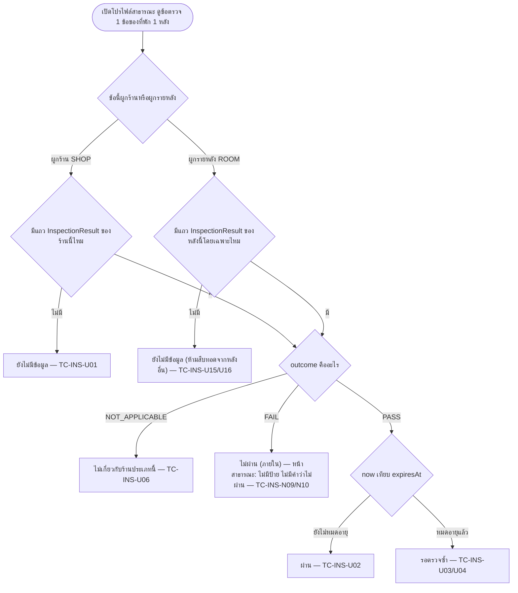

> **โมดูล:** M60-ShopInspection
> **ประเภทเอกสาร:** Test Case
> **เวอร์ชัน:** 1.0
> **วันที่จัดทำ:** 2026-08-29
> **สถานะ:** Draft — ยังไม่ได้รันสักเคส (สถานะเริ่มต้นของทุกเคสคือ "ยังไม่ทดสอบ") เพราะ SRS/SDS/API/DATABASE
> ของฟีเจอร์นี้ยังไม่ถูกเขียน (มีแค่ PRD+BRD ผ่าน user review) — เอกสารนี้ทำหน้าที่ "สเปกให้ dev สร้างตาม"
> ล่วงหน้าตามลำดับ Doc-First (Hard Rule 11) ไม่ใช่บันทึกผลของสิ่งที่มีอยู่แล้ว
> **เจ้าของเอกสาร:** QA (ดู [[Feature-Docs-Ownership]])

# Test Case: แผนการตรวจสอบร้านค้า (Shop Inspection Plan)

---

## 1. Overview

ชุดทดสอบนี้ trace กลับ [[BRD]] ทุก AC (`AC-INS-01-1` .. `AC-INS-29-5`, รวม 84 ข้อ จาก FR-INS-001..029)
และยึด **Contract ที่ล็อกแล้ว** ต่อไปนี้เป็นฐานการออกแบบเคส (ยังไม่มี SDS/DATABASE.md อย่างเป็นทางการ —
ชื่อ entity/field ด้านล่างคือของที่ผู้เรียกงานล็อกไว้ก่อนเขียนเทส):

- `InspectionPlan` (`shopId` @unique, `step` 1-4, `status` ACTIVE|LAPSED, `lapsedReason`
  **RENEWAL_FAILED|OWNER_CANCELLED**, `canceledAt?`, `nextRenewalAt`, `expiresAt` — 🛑 **ยกเลิกมีผล
  สิ้นรอบบิล ไม่ใช่ทันที** ดู §1.0a ข้อ 2)
- `InspectionRound` (`roomId?`, `assignedAt`, `dueAt`, `inspectorUserId?`, `completedAt IS NULL` =
  "รอผู้ตรวจเข้าตรวจ" — 🛑 **ต้องมีตัวสร้างอัตโนมัติล่วงหน้า** ดู §1.0a ข้อ 4)
- `InspectionResult` (`outcome` **PASS|FAIL|NOT_APPLICABLE เท่านั้น**, `checkedAt`, `lastConfirmedAt`,
  `roundId` (ของรอบที่ **สร้าง** แถวนี้ — ไม่ใช่ของทุกรอบที่เคยยืนยันซ้ำ) — 🛑 **append-only แบบ "insert
  เฉพาะตอนผลเปลี่ยน"** ดู §1.0a ข้อ 1)
- `InspectionEvidence` (`visibility` default **PRIVATE**)
- `InspectionIntakeQuota` (🛑 **ไม่มีแถวของเดือนนั้น = โควตา 0 = ปิดรับ (fail-closed)** ดู §1.0a)
- `InspectionTermsAcceptance` (🛑 **append-only** — 1 แถวต่อการจ่ายเงิน 1 ครั้ง พร้อม `priceSnapshotBaht`
  ดู §1.0a ข้อ 6)
- `User.isInspector`

### 1.0a แก้ contract 2026-08-29 (Controller) — มีผลต่อการออกแบบเคสด้านล่างโดยตรง

**1. `InspectionResult` เป็นตาราง append-only แบบ "เขียนแถวใหม่เฉพาะตอนผลเปลี่ยน" (แก้ทับรอบแรกอีกที
2026-08-29) — contract รุ่นแรกสื่อว่ามี 1 แถวต่อ 1 ข้อตรวจ (คล้าย unique `(shopId, checkKey)` /
`(roomId, checkKey)`) ซึ่ง **ผิด** เพราะจะเขียนทับผลรอบเก่าหายไป ขัด AC-INS-16-3 (รอบที่ไม่ผ่านต้องยังอยู่ใน
ไทม์ไลน์) และ AC-INS-27-1 (ประวัติห้ามลบ) — แต่ก็อป "insert ทุกครั้งที่ตรวจ" ตรง ๆ (มติรอบแรกของแก้ contract
นี้) ก็ผิดเช่นกัน เพราะขั้นที่ 1 ตรวจ**ทุกวัน** ถ้า insert ทุกครั้งไทม์ไลน์จะมี 365 บรรทัด "ผ่าน" เหมือนกัน
ต่อปีต่อข้อ กลบรอบที่มีความหมายจนหมด**

- **เพิ่ม field `lastConfirmedAt: DateTime`** บน `InspectionResult`
- `checkedAt` = เวลาที่ผลนี้**ถูกตัดสินครั้งแรก** — ค่านี้ **ไม่เปลี่ยนอีกเลย** หลังแถวถูกสร้าง (ใช้เป็น "จุดใน
  ไทม์ไลน์")
- `lastConfirmedAt` = เวลาที่ยืนยันผลเดิมซ้ำล่าสุด (อัปเดตในที่ทุกครั้งที่ตรวจซ้ำแล้วได้ผลเหมือนเดิม — ใช้เป็น
  "ผลนี้ยังสดแค่ไหน")
- **`expiresAt` = `lastConfirmedAt + ttlDays` (ของขั้นนั้น) เสมอ — ไม่ใช่ `checkedAt + ttlDays`**
- **ตรวจแล้วผลเหมือนเดิม (outcome ไม่เปลี่ยน) → `UPDATE` แถวล่าสุด (`lastConfirmedAt` เลื่อน, `checkedAt`
  คงที่) — ไม่สร้างแถวใหม่**
- **ผลเปลี่ยน (outcome ต่างจากแถวล่าสุด) → `INSERT` แถวใหม่** (แถวใหม่นี้ `checkedAt = lastConfirmedAt` =
  เวลาปัจจุบัน)
- "ผลปัจจุบัน" = แถวที่ `checkedAt` ใหม่สุด (เท่ากับแถวเดียวที่มีอยู่ต่อ "ช่วงผลเดียวกัน") **คำนวณตอนอ่าน**
  ผ่าน SSOT เดียว: **`src/lib/inspection/result-status.ts`** — ทุกจุดที่ต้องรู้ "สถานะตอนนี้"/"หมดอายุหรือยัง"
  ของข้อตรวจต้องเรียกฟังก์ชันนี้ ห้าม query ตรงแล้วหยิบแถวเอาเองที่อื่น หรือคำนวณวันหมดอายุจาก `checkedAt`
  เองที่อื่น (ดู TC-INS-U32..U34, TC-INS-U37..U39 ที่เพิ่ม/แก้ในกลุ่ม A)

**2. `InspectionPlan.lapsedReason`** แยก 2 เหตุผล (`RENEWAL_FAILED` ค้างชำระ / `OWNER_CANCELLED` OWNER
กดยกเลิกเอง) — **หน้าสาธารณะต้องแสดงข้อความเดียวกันทั้งสองเหตุผล** (ผู้ซื้อไม่จำเป็นต้องรู้ว่าร้านค้างชำระ
หรือยกเลิกเอง — ทั้งสองกรณีเป็นข้อเท็จจริงที่เป็นกลางเท่ากันตาม §4.1) แต่ **ฝั่งร้าน (OWNER/ADMIN) ต้องเห็น
เหตุผลที่ถูกต้องจริง** (ดู TC-INS-U35, TC-INS-A30, TC-INS-N18 ที่เพิ่มใหม่ในกลุ่ม C)

🛑 **มติเพิ่มจากรอบ 3 (กระทบ TC-INS-A13/TC-INS-E09 เดิม — แก้ไขแล้ว):** OWNER กดยกเลิกแล้ว **ไม่ตัดสิทธิ์
ทันที** — ระบบตั้ง `canceledAt` แต่ `status` ยังเป็น `ACTIVE` จนถึง `nextRenewalAt` (สิ้นรอบบิลปัจจุบัน)
ป้ายบนโปรไฟล์สาธารณะ**ยังแสดงปกติเหมือนไม่มีอะไรเกิดขึ้น**จนกว่าจะถึง `nextRenewalAt` ถึงจะเปลี่ยนเป็น
`status=LAPSED, lapsedReason=OWNER_CANCELLED` (แถบเทา) — เดิมเอกสารรุ่นก่อนเขียนกำกวมว่า "ระยะเวลาที่แน่นอน
รอเคาะ" ตอนนี้ **ไม่รอเคาะแล้ว** สเปกชัดเจน (ดู TC-INS-A13 ที่แก้แล้ว + TC-INS-N19 ใหม่)

**3. `InspectionIntakeQuota` fail-closed เมื่อไม่มีแถว** — ไม่มีแถวของ (ขั้น, เดือน) นั้นเลย = โควตา **0** =
ปิดรับสมัครทันที (**ไม่ใช่** unlimited และ **ไม่ใช่** 500) เดือนใหม่ที่ ops ลืมสร้างแถวโควตาไว้ล่วงหน้าต้อง
ยังปิดรับได้ถูกต้องโดยอัตโนมัติ ไม่เงียบทั้งระบบ — cron ต้องสร้างแถวของเดือนถัดไปเองล่วงหน้า (ดู TC-INS-U36,
TC-INS-A31, TC-INS-A32 ที่เพิ่มใหม่ในกลุ่ม E)

**4. 🛑🛑 ฟีเจอร์เสื่อมเองเงียบ ๆ (contract รอบ 4 — คำสั่งของ Controller โดยตรง, "เคสที่สำคัญที่สุดของทั้ง
ชุด"):** ขั้นที่ 1 มี cron ขยับ `lastConfirmedAt` ให้ทุกวันอัตโนมัติ (ไม่ต้องมีรอบตรวจ) แต่ข้อของขั้น 2–4
ขยับได้ **ต่อเมื่อมีรอบตรวจจริงที่ถูกปิด (`completedAt`)** — ถ้าไม่มีตัวสร้างรอบอัตโนมัติล่วงหน้า ร้านที่จ่าย
เงินต่อเนื่องแต่ไม่มีใครมอบหมายรอบด้วยมือจะเห็นป้ายตกเป็น "รอตรวจซ้ำ" ทีละข้อไปเรื่อย ๆ โดยไม่มีใครมาตรวจ —
**เสื่อมหลัง 6–12 เดือน (ตาม ttlDays ของแต่ละขั้น) ซึ่งนานเกินกว่าที่ใครจะโยงกลับมาถึงต้นเหตุได้** มติ: cron
**`/api/cron/inspection-lifecycle`** สร้าง `InspectionRound` ที่ยังไม่มอบหมาย (`inspectorUserId=null`,
มี `dueAt`) **ล่วงหน้า 14 วัน** ก่อน `expiresAt` ของแผน `ACTIVE` แต่ละข้อ — ต้อง **idempotent** (รันซ้ำวัน
เดียวกันไม่สร้างรอบซ้ำ ถ้ามีรอบ `completedAt IS NULL` อยู่แล้วสำหรับข้อนั้น = ข้าม) และต้องมี **ตัวชี้วัด
งานค้าง** ให้แอดมินเห็น (รอบที่ `dueAt` ผ่านแล้วยังไม่ `completedAt`) — สร้างรอบทิ้งไว้โดยไม่มีใครเห็นว่า
กองอยู่ = ย้ายที่ปัญหา ไม่ใช่แก้ (ดู TC-INS-U40, TC-INS-A33..A35 ใหม่)

**5. ปิดรอบไม่ได้ตลอดกาล (ผลข้างเคียงของ "ยืนยันในที่" ในข้อ 1) — พบบ่อยที่สุดที่ขั้น 1 และ 4:** ด่านปิดรอบ
**ต้องใช้เกณฑ์ `lastConfirmedAt >= round.assignedAt` ต่อทุกข้อที่รอบนั้นรับผิดชอบ ไม่ใช่ "มีแถว
`InspectionResult` ที่ `roundId` = รอบนี้"** เพราะรอบที่ผลตรวจซ้ำแล้วเหมือนเดิมทุกข้อ **ไม่ผลิตแถวใหม่เลย
สักแถว** (ตามข้อ 1 — ผลเดิมซ้ำ = `UPDATE` ไม่ใช่ `INSERT`) ⇒ ถ้าด่านเช็คแบบ `roundId`-based รอบที่ผู้ตรวจ
ทำครบสมบูรณ์แล้วจะปิดไม่ได้ตลอดกาล จอบอกว่า "ยังบันทึกไม่ครบ" ทั้งที่ตรวจครบแล้วจริง ๆ (ดู TC-INS-U41,
TC-INS-A36 ใหม่)

**6. ไทม์ไลน์ของรอบที่ "ยืนยันอย่างเดียว" (ไม่มีผลเปลี่ยนเลย):** ต้องแยก `changedResults[]` (ข้อที่ผลเปลี่ยน
จริงในรอบนี้ = มีแถวใหม่) กับ `confirmedCheckKeys[]` (ข้อที่ยืนยันผลเดิม = อัปเดต `lastConfirmedAt` เฉย ๆ)
— รอบที่ไม่มีข้อไหนเปลี่ยนเลยต้อง**ไม่**ขึ้นเป็นบรรทัดว่างที่อ่านได้ว่า "ผู้ตรวจมาแล้วไม่ได้ทำอะไร" ต้องสื่อว่า
"ตรวจแล้วทุกอย่างเหมือนเดิม" (ดู TC-INS-U42 ใหม่)

**7. `InspectionTermsAcceptance` เป็น append-only (contract รอบ 4)** — 1 แถวต่อการจ่ายเงิน 1 ครั้ง (สมัคร
ครั้งแรก/อัปเกรด/ต่ออายุ) พร้อม `priceSnapshotBaht` ของครั้งนั้น — **นี่คือหลักฐานที่ใช้ตอนร้านทักท้วงเรื่อง
ไม่คืนเงิน** (จ่าย 3 ครั้งต้องมี 3 แถวแยกกัน ไม่ใช่เขียนทับแถวเดียว — ดู TC-INS-A38 ใหม่)

🛑 **DB เก็บ 3 ค่า (`outcome`) แต่หน้าจอต้องแสดง 5 สถานะ** — สองสถานะที่เหลือ ("รอตรวจซ้ำ", "ยังไม่มีข้อมูล")
เป็นค่า **derive** ไม่ใช่คอลัมน์: "รอตรวจซ้ำ" = `outcome=PASS` แต่ `expiresAt` ผ่านแล้ว (หรือถูก trigger
บังคับ เช่น FR-INS-028) · "ยังไม่มีข้อมูล" = **ไม่มีแถว `InspectionResult`** สำหรับข้อ/ร้าน/หลังนั้นเลย
ชุดเทส 2.1 คือชุดที่พิสูจน์ตรรกะ derive นี้แบบละเอียด

**ข้อตรวจ 18 คีย์ แบ่งตาม "สิ่งที่ตรวจ" ไม่ใช่ตาม "ขั้น" (AC-INS-29-1):**

| ผูกร้าน (7) | ผูกที่พักรายหลัง (11) |
|---|---|
| `scam_db` `phone_identity` `account_age` `chat_response_speed` `complaints` `id_card_selfie` `bank_account_name` | `duplicate_listing` `lease_right_document` `hotel_license` `video_tour` `operating_evidence` `location_exists` `photos_match` `room_count` `facilities` `accessibility` `deep_photo_album` |

🛑 **กับดักที่ QA ต้องตั้งใจจับ:** ขั้นที่ 1 (6 ข้อ) มี **5 ข้อผูกร้าน + 1 ข้อผูกรายหลัง** (`duplicate_listing`
— "ที่พักไม่ถูกประกาศซ้ำ" ตรวจตัวประกาศ ไม่ใช่ตัวร้าน) ทั้งที่ขั้นที่ 1 ทั้งขั้นถูกอธิบายว่า "อัตโนมัติ
ต่อเนื่อง" — คนอ่านผ่าน ๆ จะเดาว่าขั้น 1 = ผูกร้านล้วน แล้วเขียน scope map ผิด (ดู TC-INS-U22/U28)

**ประเภทการทดสอบ:**
- **Unit (Vitest, `[blocker]`)** — ฟังก์ชันบริสุทธิ์ที่ตัดสินสถานะ/ขอบเขต/โควตา — พิสูจน์ด้วย **mutation**
  ทุกตัวก่อน merge (กลับตรรกะแล้วต้องแดง ไม่ใช่แค่เขียนเทสแล้วเขียวตอนแรก — `mutation-silence-means-weak-corpus.md`)
- **Server/API** — สิทธิ์ข้ามบทบาท/ข้ามร้าน, race condition ของโควตา, การผูก scope ที่ระดับเขียน
- **Browser QA (Playwright, `e2e/shop-inspection-plan.spec.ts`)** — happy path + negative/edge ที่
  static ตรวจไม่ได้ (เลย์เอาต์ 5 สถานะปนกัน, แถบเทา, ไทม์ไลน์)
- **Security** — flight payload / view-source สำหรับหลักฐานปิด (บัตรประชาชน/เซลฟี่/โฉนด/บัญชี/สเตทเมนต์)
- **Cross-cutting** — ความเป็นกลางต่อ Trust Score/ลำดับค้นหา, ไม่ยึดของฟรีเดิม, เส้นทางฉ้อโกงแยกจาก FAIL

**Out of scope ของชุดเทสนี้ (ตาม BRD §5/PRD §5):** ร้านประเภทอื่นนอก LODGING, ไดเรกทอรีสาธารณะ 00061,
ระบบ payment gateway ใหม่, สิทธิ์แบบกระจายตามบทบาท (role-based) ฝั่งร้าน, การตัดสินคุณภาพที่พัก

**สภาพแวดล้อม:** `http://seller.deepth.local:4000` (ฝั่งร้าน), `http://deepth.local:4000` (ฝั่งผู้ซื้อ/
โปรไฟล์สาธารณะ), `http://admin.deepth.local:4000` (ฝั่งผู้ตรวจ/ทีมปฏิบัติการ ถ้าอยู่ใต้ subdomain นี้ —
ยืนยันกับ SDS เมื่อมี เพราะ BRD ยังไม่ฟันธง URL ของหน้าจอผู้ตรวจ)

> ⚠️ **เอกสารนี้เขียนก่อนมี SRS/SDS/API/DATABASE.md** — ชื่อฟังก์ชัน/ไฟล์ที่อ้างในคอลัมน์ "โมดูล/ฟังก์ชัน"
> เป็น **ข้อเสนอ** เพื่อให้เคสรันได้จริงเมื่อถึงเวลา implement ไม่ใช่ของที่ยืนยันแล้ว — เมื่อ SDS ล็อกชื่อจริง
> ให้ปรับคอลัมน์นี้ตาม ห้ามเปลี่ยนความหมายของเคส

### 1.1 ข้อมูลทดสอบที่ต้องเตรียม (สร้างผ่าน Prisma script หรือ UI — ทุก id ที่เทสสร้างเองใช้ cleanup แบบ scope)

ทุกฟิกซ์เจอร์ด้านล่างสร้างด้วย id ที่เก็บไว้เป็นตัวแปร (`shopId`, `roomIds`, `userId`) เพื่อให้ทำความสะอาด
ท้ายรอบด้วย `prisma.inspectionPlan.deleteMany({ where: { shopId: { in: testShopIds } } })` (และตารางลูก
ตาม FK) **เท่านั้น** — ห้ามมีคำสั่งลบที่ไม่มี `where` ผูกกับ id ชุดนี้ (Hard Rule 13)

| Label | vertical / ประเภทบัญชี | ลักษณะ | ใช้ในกลุ่มเคส |
|---|---|---|---|
| **L-SOLO** | `LODGING`, บัญชี **PERSONAL** | ไม่มี Business Package, ที่พัก 1 หลังหรือไม่มี `Room` เลย | Happy path พื้นฐาน, สิทธิ์ OWNER/ADMIN, AC-INS-01-2 |
| **L-MULTI** | `LODGING`, บัญชี BUSINESS | มีที่พัก **3 หลัง A/B/C** (`Room` แยก id) | กลุ่ม B ขอบเขตรายหลัง (FR-INS-029) |
| **L-QUOTA-1..N** | `LODGING` | ร้านเปล่าใหม่จำนวนพอสร้างให้โควตาของขั้นที่ทดสอบเต็มพอดี +1 | FR-INS-009 (โควตา) |
| **L-FRAUD** | `LODGING` | **ไม่เคยสมัครแผนการตรวจสอบเลย** แต่ผูกกับ record ในฐานมิจฉาชีพ (`ScamRecord`/`/check` ทดสอบ — ชื่อ entity จริงยึดตาม `/check` ที่มีอยู่แล้ว) | กลุ่ม F |
| **L-LAPSED-PAY** | `LODGING` | เคยผ่านการตรวจ → `InspectionPlan.status=LAPSED`, `lapsedReason=RENEWAL_FAILED` (ค้างชำระ) | TC-INS-U35, TC-INS-A30, TC-INS-N18 |
| **L-LAPSED-CANCEL** | `LODGING` | เคยผ่านการตรวจ → `InspectionPlan.status=LAPSED`, `lapsedReason=OWNER_CANCELLED` (OWNER กดยกเลิกเอง) | TC-INS-U35, TC-INS-A30, TC-INS-N18 |
| **NL-1** | `ONLINE_SALES` (หรือ `SERVICE_QUEUE`) | ร้านปกติที่ไม่ใช่ LODGING | AC-INS-01-1 |
| **INSPECTOR-1** | `User.isInspector=true` | มอบหมายให้ตรวจ **เฉพาะ L-SOLO** รอบปัจจุบัน | FR-INS-024 |
| **INSPECTOR-2** | `User.isInspector=true` | **ไม่มีร้านมอบหมายเลย** | AC-INS-24-2 (เห็นร้านอื่นไม่ได้) |
| **ADMIN-OF-L-SOLO** | `ShopMember(shopId=L-SOLO, role=ADMIN)` | ผู้ช่วยร้าน ไม่ใช่ OWNER | FR-INS-002 |
| **STRANGER** | ผู้ใช้ที่ไม่มีบทบาทใดในร้านใด ๆ ข้างต้นเลย | — | AC-INS-02-3 |

**การสร้างรอบตรวจ/ผลตรวจสำหรับเคสที่ต้อง seed สถานะล่วงหน้า** (เช่น "ข้อที่ผ่านแล้วเกินอายุ") ทำผ่าน
Prisma ตรง ๆ โดยตั้ง `InspectionResult.checkedAt`/`lastConfirmedAt` ย้อนหลัง — **ห้าม** รอเวลาจริงผ่านไป
หลายเดือนเพื่อ repro เคสหมดอายุ ให้เขียนวันที่ย้อนหลังตรง ๆ ในข้อมูลตั้งต้นแทน (นี่คือ "วิธีสร้างข้อมูลตั้งต้น"
ที่ใช้แทนคำว่า "ยังไม่มีวิธี repro" ทุกจุดในเอกสารนี้)

**การ seed เคส append-only แบบ "insert เฉพาะตอนผลเปลี่ยน" (แก้ contract รอบ 2, 2026-08-29 — ดู §1.0a):**
🛑 **ห้ามสร้างชุดที่ 2 รอบติดกันมี `outcome` เดิมแล้วคาดว่าจะได้ 2 แถว** — ตามกติกาใหม่ ผลเดิมซ้ำ = `UPDATE`
แถวเดิม ไม่ใช่แถวใหม่ ชุดฟิกซ์เจอร์ด้านล่างจึงต้องสลับ `outcome` ทุกครั้งที่ต้องการแถวใหม่จริง ๆ:

- **TC-INS-U32 (idempotent):** สร้าง 1 แถว `{outcome:PASS, checkedAt:t0, lastConfirmedAt:t0}` แล้ว
  จำลองตรวจซ้ำ **30 ครั้งติดกัน** (คนละวัน) ด้วยผล `PASS` เหมือนเดิมทุกครั้ง โดยแต่ละครั้งเรียกฟังก์ชันเขียน
  ผลจริง (ไม่ใช่ Prisma `create` ตรง ๆ — ต้องผ่าน path ที่ตัดสินใจ insert-or-update เพื่อพิสูจน์ตรรกะนั้น)
- **TC-INS-U33 (ผลเปลี่ยนสามครั้ง = สามแถว):** `PASS(t1) → FAIL(t2) → PASS(t3)` — **สาม `outcome` ต้องสลับ
  กันจริงทุกคู่ที่ติดกัน** (`t1≠t2`, `t2≠t3` ในแง่ค่า outcome) ไม่งั้นบางคู่จะยุบเป็น UPDATE แล้วได้แถวน้อยกว่า 3
- **TC-INS-U34 (ข้ามร้าน):** เหมือนเดิม — 2 ร้าน `checkKey` เดียวกัน `outcome` ต่างกันชัดเจน
- **TC-INS-U37 (ป้ายอ่านผิดฟิลด์ — 🛑 เคสสำคัญที่สุดของกลุ่มนี้):** 1 แถว `{outcome:PASS, checkedAt:
  <3 เดือนก่อน>, lastConfirmedAt:<เมื่อวาน>}` (จำลองว่าผ่านครั้งแรกเมื่อ 3 เดือนก่อน แล้วตรวจซ้ำผลเดิมล่าสุด
  เมื่อวาน) — ต้อง **ต่างกันชัดเจน** ทั้งสองค่า ไม่งั้น mutation สลับฟิลด์จะไม่มีผลต่างให้จับ
- **TC-INS-U38 (หมดอายุนับจาก `lastConfirmedAt`):** 1 แถว `{outcome:PASS, checkedAt:<400 วันก่อน>,
  lastConfirmedAt:<10 วันก่อน>}`, `ttlDays=365` — **เลือกตัวเลขนี้แทนตัวอย่าง "300 วัน/10 วัน/ttl 365"**
  เพราะคู่ 300/365 ให้คำตอบ "ยังไม่หมดอายุ" เหมือนกันทั้งวิธีนับถูกและผิด (mutation จะเงียบ — ดู
  `mutation-silence-means-weak-corpus.md`) ส่วนคู่ 400/10/365 ให้คำตอบ **ตรงข้ามกัน**: นับจาก
  `lastConfirmedAt` (ถูก) → เหลืออีก 355 วันจึงหมดอายุ = "ยังไม่หมดอายุ" · นับจาก `checkedAt` (ผิด/mutation)
  → เลย 400-365=35 วันมาแล้ว = "หมดอายุแล้ว" — ค่าที่คาดหวังคือ "ยังไม่หมดอายุ" (นับจาก `lastConfirmedAt`)
- **TC-INS-U39 (เขียนซ้ำวันเดียวกัน = idempotent ไม่สร้างแถวซ้ำ):** เรียกฟังก์ชันเขียนผลด้วย input
  เดียวกันเป๊ะ (`outcome` เดิม, เวลาปัจจุบันเดียวกัน) **2 ครั้งติดกันในการทดสอบเดียว** จำลอง cron ที่รันซ้ำ

**การ seed เคสโควตาไม่มีแถว (TC-INS-U36, TC-INS-A31):** **อย่า** สร้างแถว `InspectionIntakeQuota` ของ
เดือน/ขั้นที่จะทดสอบเลย (ไม่ใช่สร้างแล้วตั้ง cap=0 — คนละเคสกัน) แล้วเรียก resolver/endpoint ตรง ๆ เพื่อ
พิสูจน์ path "ไม่มีแถว" ไม่ใช่ path "cap เต็มพอดี"

**การจำลองเวลา 400 วัน (TC-INS-A33, contract รอบ 4):** **ห้ามใช้เวลาจริง** — ต้องมีกลไก mock/override
"วันนี้" ของระบบที่ทดสอบเรียกได้ (เช่น inject clock ผ่าน dependency หรือ query param เฉพาะ test env) แล้ว
เดินนาฬิกาทีละสัปดาห์ (~57 รอบ) เรียก cron endpoint จริงทุกรอบ — **ห้าม** จำลองด้วยการเขียนผลลัพธ์สุดท้าย
ตรง ๆ ลง DB โดยข้ามตัว cron ไปเลย เพราะจะพิสูจน์ไม่ได้ว่า cron ทำงานจริงตลอดช่วงเวลา (นี่คือแก่นของเคสนี้)

**การ seed เคส `InspectionTermsAcceptance` (TC-INS-A38):** เดิน flow จริง 3 รอบ (สมัคร → อัปเกรด → ต่ออายุ)
ผ่าน endpoint จ่ายเงินจริง ไม่ใช่ Prisma `create` ตรง ๆ 3 แถว เพราะเป้าหมายคือพิสูจน์ว่า **โค้ดจริง** เขียน
แถวใหม่ทุกครั้งที่มีการจ่ายเงินเกิดขึ้น (ถ้าใช้ Prisma สร้างเองจะพิสูจน์ได้แค่ว่า schema รองรับ ไม่ใช่ว่า
endpoint จ่ายเงินเขียนถูก)

---

## 2. Test Scenarios

### 2.1 Unit — `[blocker]` (Vitest, pure function, พิสูจน์ด้วย mutation)

🛑 ทุกแถวต้องพิสูจน์ด้วย mutation จริง (กลับตรรกะ/เงื่อนไขที่ระบุ แล้วรันเทส → ต้องแดง) คอลัมน์ "Fixture
ต้องมี" ระบุ input ที่จำเป็นเพื่อไม่ให้ mutation เงียบ (ดู `mutation-silence-means-weak-corpus.md`)

**กลุ่ม A — สถานะ 5 แบบ (`resolveResultStatus()` — SSOT ที่ `src/lib/inspection/result-status.ts` ตาม §1.0a)**

| TC | เคส | Fixture ต้องมี | mutation ที่ต้องทำให้แดง | Expected | Trace |
|---|---|---|---|---|---|
| TC-INS-U01 | ไม่มีแถว `InspectionResult` เลย → "ยังไม่มีข้อมูล" | ข้อตรวจที่ไม่เคยมีการตรวจ | เปลี่ยนค่า default จาก `NO_DATA` เป็น `FAIL` เมื่อหาแถวไม่เจอ | คืน `NO_DATA` (ไม่ใช่ `FAIL`) | AC-INS-11-1, AC-INS-14-1 |
| TC-INS-U02 | 🛑 (แก้ตาม §1.0a รอบ 2) `outcome=PASS` และ `now < lastConfirmedAt + ttlDays` → "ผ่าน" — **นับจาก `lastConfirmedAt` ไม่ใช่ `checkedAt`** | `checkedAt`=90 วันก่อน (ตัดสินครั้งแรกนานแล้ว), `lastConfirmedAt`=วันนี้-1วัน (เพิ่งยืนยันซ้ำ), `ttlDays`=30 ของขั้นนั้น — **`checkedAt`/`lastConfirmedAt` ต้องต่างกันชัดเจน** ไม่งั้นแยกไม่ออกว่าฟังก์ชันนับจากตัวไหน | เปลี่ยนเงื่อนไขจาก `now < lastConfirmedAt + ttlDays` เป็น `now < checkedAt + ttlDays` (จะได้ "หมดอายุแล้ว" ผิด ๆ เพราะ `checkedAt` เก่ากว่า `ttlDays` ไปแล้ว) | คืน `PASS` | AC-INS-11-1, AC-INS-04-1 |
| TC-INS-U03 | `outcome=PASS` แต่ `now >= lastConfirmedAt + ttlDays` → "รอตรวจซ้ำ" ไม่ใช่ "ผ่าน" | `lastConfirmedAt`=เมื่อวาน, `ttlDays`=0 (หรือกำหนดให้ `lastConfirmedAt + ttlDays` เป็นเมื่อวานพอดี) | ถอดเงื่อนไขเช็ควันหมดอายุออกทั้งหมด | คืน `NEEDS_RECHECK` (**ไม่ใช่** `PASS`) | AC-INS-12-1, AC-INS-12-2 |
| TC-INS-U04 | ขอบเขต: `now === lastConfirmedAt + ttlDays` เป๊ะ (boundary) | ตั้งเวลาให้ `now` ตรงเป๊ะกับ `lastConfirmedAt + ttlDays` วินาทีเดียวกัน | เปลี่ยน `>=` เป็น `>` (off-by-one) | นับเป็นหมดอายุแล้ว (`NEEDS_RECHECK`) — เอกสารระบุนโยบายนี้ชัด ห้ามปล่อยให้ `>`/`>=` สลับกันเงียบ ๆ | AC-INS-12-1 |
| TC-INS-U05 | `outcome=FAIL` → "ไม่ผ่าน" (ค่าภายใน ใช้ตัดสินป้าย/นับข้อตก) | ข้อตรวจที่ผู้ตรวจบันทึกไม่ผ่าน | สลับ `FAIL` ให้ map เข้า `NO_DATA` | คืน `FAILED` | AC-INS-11-1 |
| TC-INS-U06 | `outcome=NOT_APPLICABLE` → "ไม่เกี่ยวกับร้านประเภทนี้" เสมอ ไม่ว่า `lastConfirmedAt`/`ttlDays` จะเป็นอะไร | `hotel_license` ของร้านไม่เข้าข่ายกฎหมาย, `lastConfirmedAt=null` (ไม่มีความหมายสำหรับ N/A) | เอาเงื่อนไข "เช็ควันหมดอายุก่อนเช็ค `NOT_APPLICABLE`" มาใส่ (ทำให้ N/A ที่ไม่มี `lastConfirmedAt` พังเป็น error/NEEDS_RECHECK) | คืน `NOT_APPLICABLE` เสมอ ไม่ผ่านเส้นทางเช็ควันหมดอายุ | AC-INS-04-3, FR-INS-011 |
| TC-INS-U07 | 5 ค่าที่ฟังก์ชันคืนได้มีแค่ 5 ค่า ไม่มีค่าที่ 6 หลุดออกมา (regression บน type union) | รันทุกกิ่งใน U01-U06 | เพิ่มกิ่งใหม่ที่คืน string ที่ไม่อยู่ใน union (เช่น `'UNKNOWN'`) โดยไม่ผ่าน `satisfies` | `tsc` ต้องแดงถ้ามีค่าที่ 6 หลุดออกจาก union — เทสนี้ import type แล้ว exhaustive-check ด้วย `never` | AC-INS-11-1 |

**กลุ่ม A ต่อ — การนับ "ข้อที่ตก" (`countFailedInspectionItems()`)**

| TC | เคส | Fixture ต้องมี | mutation ที่ต้องทำให้แดง | Expected | Trace |
|---|---|---|---|---|---|
| TC-INS-U08 | นับเฉพาะ `FAILED` — ไม่นับ `NEEDS_RECHECK`/`NO_DATA`/`NOT_APPLICABLE` | ชุดผลตรวจ 5 ข้อ: 1 `FAILED`, 1 `NEEDS_RECHECK`, 1 `NO_DATA`, 1 `NOT_APPLICABLE`, 1 `PASS` — **ต้องมีครบ 5 สถานะในชุดเดียว** ไม่งั้น mutation ที่ไปนับสถานะอื่นเพิ่มจะไม่โดนจับ | เปลี่ยนเงื่อนไขนับจาก `status === 'FAILED'` เป็น `status !== 'PASS'` (จะไปนับ NEEDS_RECHECK/NO_DATA/N-A ด้วย) | นับได้ `1` เท่านั้น | AC-INS-11-3 |
| TC-INS-U09 | ไม่มีข้อไหน `FAILED` เลย (ทั้งหมดเป็นสถานะอื่น) → นับได้ 0 ไม่ใช่ error/NaN | ชุด `NO_DATA`+`NOT_APPLICABLE`+`NEEDS_RECHECK` ล้วน | ลบ guard กรณี array ว่างระหว่างกรอง | นับได้ `0` และ `Number.isNaN(result)===false` | AC-INS-11-3 |

**กลุ่ม A ต่อ — `InspectionResult` เป็น append-only (แก้ contract 2026-08-29, ดู §1.0a) — `resolveLatestInspectionResult()` / `buildInspectionTimeline()` ที่ `src/lib/inspection/result-status.ts`**

🛑 สามแถวนี้คือชุดที่พิสูจน์ว่า resolver **คำนวณสถานะปัจจุบันจากประวัติที่สะสม** ไม่ใช่จากแถวเดียวที่ถูก
เขียนทับ — ถ้า implement ด้วยการ `UPDATE` แถวเดิมแทนการ `INSERT` แถวใหม่ (ย้อนกลับไปที่พฤติกรรมของ contract
รุ่นแรกที่ผิด) เคสกลุ่มนี้ต้องแดงทั้งหมด

| TC | เคส | Fixture ต้องมี | mutation ที่ต้องทำให้แดง | Expected | Trace |
|---|---|---|---|---|---|
| TC-INS-U32 | 🛑 **idempotent**: ตรวจซ้ำ 30 วันติดผลเหมือนเดิม (`PASS` ทุกครั้ง) → ต้องมี **แถวเดียว** ไม่ใช่ 30 แถว · `checkedAt` คงที่ที่ค่าแรก · `lastConfirmedAt` เลื่อนตามการยืนยันครั้งล่าสุด | 1 แถวเริ่มต้น + เรียกฟังก์ชันเขียนผลซ้ำ 30 ครั้ง (คนละวัน) ด้วย `outcome=PASS` เหมือนเดิมทุกครั้ง ตามที่ระบุใน §1.1 | เอาเงื่อนไข "outcome เดิม → UPDATE" ออก แล้วให้ `INSERT` แถวใหม่ทุกครั้งไม่มีเงื่อนไข (ย้อนกลับไปพฤติกรรมที่แก้ contract รอบ 2 มาแก้) | นับแถวได้ `1` เท่านั้น · `checkedAt` ของแถวนั้น = วันแรก (ไม่ขยับ) · `lastConfirmedAt` = วันที่ยืนยันครั้งล่าสุด (วันที่ 30) | AC-INS-16-1, AC-INS-27-1, `[blocker]` |
| TC-INS-U33 | 🛑 ผลเปลี่ยน 3 ครั้ง `PASS(t1) → FAIL(t2) → PASS(t3)` ต้องได้ **3 แถวจริง** และไทม์ไลน์ต้องเห็นครบทั้ง 3 รอบ รวมรอบ `FAIL` ตรงกลาง แม้รอบหลังสุดจะกลับมาผ่านแล้ว — ห้าม dedupe เหลือแค่ "สถานะล่าสุด" | เรียกฟังก์ชันเขียนผลตามลำดับ `PASS→FAIL→PASS` คนละเวลาจริง (**สาม outcome ต้องสลับกันจริงทุกคู่ที่ติดกัน** ไม่งั้นบางคู่จะยุบเป็น UPDATE แล้วได้แถวน้อยกว่า 3) | เอาฟังก์ชัน `buildInspectionTimeline()` ไปเรียก resolver ตัวเดียวกับ "สถานะปัจจุบัน" ผิด ๆ (dedupe by `checkKey` เหลือแถวเดียว แทนที่จะคืนทุกแถว) | นับแถวได้ `3` พอดี · อาร์เรย์ไทม์ไลน์มีความยาว **3** และมีรอบที่ `outcome=FAIL` (`t2`) ปรากฏอยู่ตรงกลางด้วย | AC-INS-16-1, AC-INS-16-3, AC-INS-27-1, `[blocker]` |
| TC-INS-U34 | ข้ามร้าน: ร้าน A กับร้าน B มี `checkKey` เดียวกัน (`scam_db`) ผลของ A ต้องไม่โผล่มาปนกับผลของ B | ร้าน A `outcome=PASS`, ร้าน B `outcome=FAIL` ของ `checkKey` เดียวกัน — **ต้องต่างค่ากันชัดเจน** ไม่งั้น mutation ที่ลืมกรอง `shopId` จะไม่ถูกจับ | เอาเงื่อนไข `shopId` ออกจาก group-by/filter ก่อนเรียง `checkedAt DESC` (เทียบเท่าบั๊ก `DISTINCT ON` ที่ไม่มี `shopId` เป็นคีย์แรก — `distinct-on-needs-shop-key.md`) | resolver ที่เรียกด้วย `shopId=A` คืนผลของ A (`PASS`) เท่านั้น ไม่ใช่ผลของ B หลุดมาปน | AC-INS-01-3, §6.4, `[blocker]` |
| TC-INS-U37 | 🛑🛑 **(เคสสำคัญที่สุดของกลุ่มนี้ — คำสั่งของ Controller โดยตรง) ป้ายอ่านผิดฟิลด์**: badge "ตรวจล่าสุดเมื่อ" ต้องอ่านจาก `lastConfirmedAt` · จุดในไทม์ไลน์ต้องอ่านจาก `checkedAt` — สองค่านี้เป็นคนละแหล่งข้อมูลสำหรับคนละ UI | 1 แถว `checkedAt`=3 เดือนก่อน (ตัดสินครั้งแรก), `lastConfirmedAt`=เมื่อวาน (ยืนยันซ้ำล่าสุด) — **ต้องต่างกันชัดเจน** (ตามที่ระบุใน §1.1) ไม่งั้น mutation สลับฟิลด์จะไม่มีผลต่างให้จับ | **สลับสองฟิลด์นี้** ในจุดที่ badge/timeline ไปอ่านค่า (badge อ่าน `checkedAt` แทน, timeline อ่าน `lastConfirmedAt` แทน) | `resolveBadgeFreshness()` คืน "เมื่อวาน" (จาก `lastConfirmedAt`) · `buildInspectionTimeline()` วางจุดที่ "3 เดือนก่อน" (จาก `checkedAt`) — สองค่านี้ต้องไม่เท่ากันในผลลัพธ์ | AC-INS-14-1, AC-INS-16-1, `[blocker]` |
| TC-INS-U38 | หมดอายุนับจาก `lastConfirmedAt` ไม่ใช่ `checkedAt` — `checkedAt`=400 วันก่อน, `lastConfirmedAt`=10 วันก่อน, `ttlDays`=365 → ต้อง "ยังไม่หมดอายุ" | แถวเดียวตามค่าด้านซ้าย — **เลือกตัวเลขนี้เจตนา** (ไม่ใช้ตัวอย่าง "300 วัน/ttl 365" ที่ให้คำตอบเหมือนกันทั้งวิธีนับถูก/ผิด — ดู §1.1 คำอธิบาย) | เปลี่ยนสูตรจาก `now > lastConfirmedAt + ttlDays` เป็น `now > checkedAt + ttlDays` | คืน "ยังไม่หมดอายุ" (`PASS`) — ถ้านับจาก `checkedAt` ผิด ๆ จะได้ "หมดอายุแล้ว" (`NEEDS_RECHECK`) ซึ่งต้องทำให้เทสแดง | AC-INS-04-1, AC-INS-12-1, `[blocker]` |
| TC-INS-U39 | เขียนผลซ้ำด้วย input เดียวกันเป๊ะ (จำลอง cron รันซ้ำวันเดียวกัน) → ต้อง **ไม่เกิดแถวซ้ำ** (idempotent) | เรียกฟังก์ชันเขียนผล 2 ครั้งติดกันในเทสเดียว ด้วย `outcome`/เวลาปัจจุบันเดียวกันเป๊ะ | ถอด guard กันซ้ำ (เช่น `if (lastRow.outcome === outcome) update else insert`) ออก ปล่อยให้ `insert` ตรง ๆ ทุกครั้ง | นับจำนวนแถวหลังเรียก 2 ครั้ง = `1` ไม่ใช่ `2` | AC-INS-03-2 (ขั้น 1 ตรวจทุกวัน — ต้อง idempotent ไม่งั้นรันซ้ำ (retry) แล้วข้อมูลบวม), `[blocker]` |

**กลุ่ม A ต่อ — สร้างรอบอัตโนมัติ / ปิดรอบ / ไทม์ไลน์ยืนยันอย่างเดียว (contract รอบ 4, §1.0a ข้อ 4-6 — เสนอที่ `src/lib/inspection/lifecycle.ts`)**

| TC | เคส | Fixture ต้องมี | mutation ที่ต้องทำให้แดง | Expected | Trace |
|---|---|---|---|---|---|
| TC-INS-U40 | `shouldCreateRoundForItem()` — cron รันซ้ำวันเดียวกันต้อง**ไม่**สร้างรอบซ้ำ ถ้ามีรอบ `completedAt IS NULL` อยู่แล้วสำหรับข้อนั้น | ข้อตรวจที่มีรอบเปิดค้างอยู่แล้ว (`completedAt=null`) + เรียกฟังก์ชันพร้อมเงื่อนไข "ใกล้ `expiresAt` ภายใน 14 วัน" ซ้ำ 2 ครั้ง | ถอดเงื่อนไข "มีรอบเปิดค้างอยู่แล้ว → ข้าม" ออก ปล่อยให้สร้างรอบใหม่ทุกครั้งที่เข้าเงื่อนไข 14 วัน | คืน `false` (ไม่สร้างรอบที่ 2) เมื่อมีรอบเปิดค้างอยู่แล้ว | AC-INS-09-1 (แนวคิดเดียวกับ fail-closed โควตา — ห้ามสร้างงานซ้ำเงียบ ๆ), `[blocker]` |
| TC-INS-U41 | 🛑 `isRoundReadyToClose(round, results)` ต้องเช็คด้วย `lastConfirmedAt >= round.assignedAt` **ต่อทุกข้อที่รอบนั้นรับผิดชอบ** ไม่ใช่เช็คว่า "มีแถว `roundId` ตรงกับรอบนี้" | รอบที่ผู้ตรวจตรวจครบทุกข้อ (18 ข้อของขั้น 1 หรือทุกข้อของขั้น 4) แต่**ผลเหมือนเดิมทุกข้อ** (ไม่มีข้อไหน `INSERT` แถวใหม่เลย — เป็นไปตาม §1.0a ข้อ 1) | เปลี่ยนด่านกลับไปเช็ค `results.some(r => r.roundId === round.id)` (ตามที่คอมเมนต์อ้างไว้ผิด ๆ) | คืน `true` (ปิดรอบได้) แม้ไม่มีแถวไหนอ้าง `roundId` ของรอบนี้เลยสักแถว — ทุกข้อมี `lastConfirmedAt >= round.assignedAt` ก็พอ | AC-INS-13-1, §6.2, `[blocker]` |
| TC-INS-U42 | `summarizeRoundForTimeline(round, results)` แยก `changedResults[]` ออกจาก `confirmedCheckKeys[]` — รอบที่ยืนยัน 18 ข้อโดยไม่มีข้อไหนเปลี่ยนต้องได้ `changedResults=[]` และ `confirmedCheckKeys.length=18` (ไม่ใช่ทั้งคู่ว่างเปล่า) | รอบเดียวกับ U41 (ยืนยันทุกข้อ ไม่มีข้อไหนเปลี่ยน) | รวมทุกข้อเข้า `changedResults[]` เหมือนกันหมด ไม่แยกตามว่ามีแถวใหม่จริงหรือแค่ยืนยัน | `changedResults.length === 0` และ `confirmedCheckKeys.length === 18` — ตัวเรียกใช้ (timeline UI) ต้องแยกสองค่านี้ได้เพื่อไม่ให้แสดงเป็นบรรทัดว่าง | AC-INS-16-1, AC-INS-25-1 (ผู้ตรวจยังต้องปรากฏแม้ไม่มีข้อไหนเปลี่ยน), `[blocker]` |

**กลุ่ม B — ขอบเขตรายหลัง (`INSPECTION_ITEM_SCOPE` map + `resolveScopedInspectionStatus()` — เสนอที่ `src/lib/inspection/scope.ts`)**

| TC | เคส | Fixture ต้องมี | mutation ที่ต้องทำให้แดง | Expected | Trace |
|---|---|---|---|---|---|
| TC-INS-U10 | 7 คีย์ผูกร้านตรงกับ contract เป๊ะ (regression) | รายชื่อ 7 คีย์ตามสัญญา | ลบ `bank_account_name` ออกจากเซ็ต หรือเผลอเติม `duplicate_listing` เข้าไป | เซ็ต SHOP scope = 7 คีย์ตรงเป๊ะ (assert `toEqual` แบบ set, ไม่ใช่ length เฉย ๆ) | AC-INS-29-2 |
| TC-INS-U11 | 11 คีย์ผูกรายหลังตรงกับ contract เป๊ะ (regression) | รายชื่อ 11 คีย์ตามสัญญา | ลบ `duplicate_listing` ออกจากเซ็ต ROOM (ย้ายไปเซ็ต SHOP โดยไม่ตั้งใจ) | เซ็ต ROOM scope = 11 คีย์ตรงเป๊ะ | AC-INS-29-3 |
| TC-INS-U12 | 🛑 **กับดักขั้น 1**: `duplicate_listing` เป็น ROOM scope แม้อยู่ในขั้นที่ 1 (ขั้นที่เหลือ 5 ข้อเป็น SHOP) | ข้อตรวจทั้ง 6 ข้อของขั้นที่ 1 พร้อม step number | เขียน scope resolver แบบ `step === 1 ? 'SHOP' : lookupTable[key]` (ผูกกับขั้นแทนที่จะผูกกับคีย์ตรง ๆ) | `duplicate_listing` ได้ `ROOM`, อีก 5 ข้อได้ `SHOP` — พิสูจน์ resolver ไม่ได้ดูเลขขั้นเลย | AC-INS-29-1 |
| TC-INS-U13 | รวม 2 เซ็ตแล้วได้ 18 คีย์พอดี ไม่มีคีย์ซ้ำข้ามเซ็ต | 2 เซ็ตจาก U10/U11 | ใส่คีย์เดียวกันไว้ทั้งสองเซ็ต (เช่น `id_card_selfie` ปรากฏใน ROOM ด้วย) | `SHOP ∩ ROOM = ∅` และ `SHOP ∪ ROOM` มีสมาชิก 18 ตัว | AC-INS-29-1 |
| TC-INS-U14 | ข้อผูกร้าน (SHOP) — ค่าเดียวใช้ได้ทุกหลัง ไม่ต้องมี `roomId` | shop L-MULTI มี PASS ของ `scam_db` ที่ระดับร้าน (ไม่มี `roomId`) | เปลี่ยนให้ resolver require `roomId` แม้เป็นข้อ SHOP scope | หลัง A/B/C ทั้ง 3 หลังอ่านค่า `scam_db=PASS` เท่ากันจากแถวเดียวกัน | AC-INS-29-2, Example ใน FR-INS-029 |
| TC-INS-U15 | 🛑 ข้อผูกรายหลัง (ROOM) — หลังที่ยังไม่เคยตรวจ ต้องได้ "ยังไม่มีข้อมูล" **ห้ามสืบทอด "ผ่าน" จากหลังอื่น** | shop L-MULTI: หลัง A มี `photos_match=PASS`, หลัง B และ C **ไม่มีแถวเลย** สำหรับ `photos_match` | เปลี่ยน query จาก `WHERE roomId = :roomId` เป็น `WHERE shopId = :shopId ORDER BY checkedAt DESC LIMIT 1` (ดึงผลล่าสุดของร้านข้ามหลังมาแทน) | หลัง A = `PASS`, หลัง B = `NO_DATA`, หลัง C = `NO_DATA` — **ไม่ใช่ `PASS` ทั้ง 3 หลัง** | AC-INS-29-4 (`[blocker]` แกนหลักของ Group B) |
| TC-INS-U16 | ข้อผูกรายหลัง — หลังที่ยังไม่ตรวจ **ห้ามแสดงเป็น "ไม่ผ่าน" เช่นกัน** | เหมือน U15 | เปลี่ยน default ตอนไม่เจอแถวจาก `NO_DATA` เป็น `FAILED` | หลัง B/C = `NO_DATA` ไม่ใช่ `FAILED` | AC-INS-29-4 |
| TC-INS-U17 | Fail-closed: ส่ง `roomId` มากับข้อ SHOP scope → ต้องถูกปฏิเสธที่ตัว validator ก่อนถึงชั้นเขียน DB | payload บันทึกผล `scam_db` ที่แนบ `roomId` มาด้วย | ถอด guard `if (scope==='SHOP' && roomId) throw` ออก | validator throw/return error — ไม่ยอมให้ SHOP item ผูก `roomId` | AC-INS-29-5 (fail-closed ตามสเปกกลุ่ม B ในคำสั่งงาน) |
| TC-INS-U18 | Fail-closed: ข้อ ROOM scope ที่ **ไม่มี** `roomId` แนบมา → ต้องถูกปฏิเสธ | payload บันทึกผล `photos_match` ที่ไม่มี `roomId` | ถอด guard `if (scope==='ROOM' && !roomId) throw` | validator throw/error | AC-INS-29-5 |

**กลุ่ม C — ป้ายพูดความจริง (`resolvePlanBadgeState()` / `resolveTimelineOutcomeLabel()` / `publicLapsedMessage()` — เสนอที่ `src/lib/inspection/badge.ts`)**

| TC | เคส | Fixture ต้องมี | mutation ที่ต้องทำให้แดง | Expected | Trace |
|---|---|---|---|---|---|
| TC-INS-U19 | `outcome=FAIL` → label ที่แปลงมาแสดงในไทม์ไลน์ **ห้ามมีคำว่า "ไม่ผ่าน" หรือคำพ้องเชิงลงโทษ** | round ที่มีข้อ FAIL | ให้ label function คืนสตริงตรง ๆ ว่า `outcome` (`'FAIL'`→"ไม่ผ่าน") | label ที่ได้ไม่ match regex `/ไม่ผ่าน\|ตก\|fail/i` ในเวอร์ชันสาธารณะ (มี fixture คำต้องห้ามไว้เทียบ) | AC-INS-18-2, AC-INS-16-3 |
| TC-INS-U20 | `outcome=FAIL` → **ไม่มี** badge/ไอคอนยืนยันแสดงประกอบ (คืน `null`/undefined ไม่ใช่ badge สีอ่อน) | เหมือน U19 | เปลี่ยนจากคืน `null` เป็นคืน badge โทน `neutral` (ยังมี badge อยู่ แค่สีอ่อนลง) | คืนค่า falsy (ไม่มี badge เรนเดอร์เลย) | AC-INS-18-1 |
| TC-INS-U21 | สีแดง/ถ้อยคำเตือนภัยสงวนให้กรณีฉ้อโกงเท่านั้น — ผลตรวจ FAIL ปกติต้องไม่ได้โทนเดียวกับสัญญาณฉ้อโกง | 2 เคส: FAIL ปกติ vs สัญญาณฉ้อโกง (`isFraudSignal=true`) | ให้ทั้งสองกรณีใช้ token สีเดียวกัน (`danger`) | FAIL ปกติ = โทนกลาง (ไม่ใช่ `danger`) · สัญญาณฉ้อโกง = โทน `danger` เท่านั้น | AC-INS-18-3, FR-INS-023 |
| TC-INS-U22 | `resolvePlanBadgeState()` — ยังจ่ายอยู่ตามรอบบิล → `ACTIVE` (ไม่ใช่แถบเทา) | `InspectionPlan.status=ACTIVE`, ยังไม่พ้น grace period | เปลี่ยนเงื่อนไขให้เข้า `LAPSED` เร็วกว่าที่ควร (ตัด grace period ทิ้ง) | คืน `ACTIVE` | AC-INS-19-1 |
| TC-INS-U23 | 🛑 พ้นระยะผ่อนผัน (ค้างชำระ) หรือ OWNER ยกเลิก → `LAPSED` (แถบเทา) + ต้องพก **วันที่ผลตรวจล่าสุดก่อนพ้นสถานะ** ติดมาด้วย | `InspectionPlan.status=LAPSED`, มี `lastKnownResultAt` | ถอด field `lastKnownResultAt` ออกจาก return (แถบเทาไม่มีวันที่กำกับ) | คืน `{ state: 'LAPSED', lastKnownResultAt: <วันที่จริง> }` — `lastKnownResultAt` ต้อง **ไม่เป็น null** เมื่อเคยมีผลตรวจมาก่อน | AC-INS-19-2 |
| TC-INS-U24 | โทนของแถบเทา **ต้องไม่ใช่โทนลงโทษ** (ไม่ใช่ `danger`, ไม่ใช่ `warning` แดง) | เหมือน U23 | ให้ `LAPSED` map ไปที่ token `danger` | โทนที่คืนเป็นกลาง (`neutral`/`muted` ไม่ใช่ `danger`/`warning`) | AC-INS-19-1, BR §8.5 (ร้านเลิกจ่ายไม่ได้ทำผิด) |
| TC-INS-U35 | 🛑 `publicLapsedMessage(lapsedReason)` คืน**ข้อความเดียวกันเป๊ะ**ไม่ว่า `lapsedReason` จะเป็น `RENEWAL_FAILED` หรือ `OWNER_CANCELLED` (แก้ contract 2026-08-29, §1.0a) | เรียกฟังก์ชันด้วยทั้ง 2 ค่า | เขียน branch ตาม `lapsedReason` แล้วใส่คำใบ้ (เช่น "ค้างชำระ") เฉพาะกรณี `RENEWAL_FAILED` | ข้อความที่คืนมา `toEqual` กันทุกตัวอักษรทั้ง 2 ค่า input — string เดียวกัน ไม่ใช่แค่ "ความหมายคล้ายกัน" | AC-INS-19-2, `[blocker]` |

**กลุ่ม E — เงินและโควตา (`hasIntakeQuota()` / `daysUntilLapse()` / `canSubmitInspectionPayment()` — เสนอที่ `src/lib/inspection/quota.ts` + `src/lib/inspection/billing.ts`)**

| TC | เคส | Fixture ต้องมี | mutation ที่ต้องทำให้แดง | Expected | Trace |
|---|---|---|---|---|---|
| TC-INS-U25 | `hasIntakeQuota(step, month)` — ใช้ครบ cap → false | โควตาขั้นที่ 3 เดือนนี้ cap=5, ใช้ไปแล้ว 5 | เปลี่ยน `used >= cap` เป็น `used > cap` (off-by-one ให้รับเกินได้อีก 1) | คืน `false` เมื่อ `used===cap` พอดี (ไม่ใช่แค่ตอนเกิน) | AC-INS-09-1, AC-INS-09-2 |
| TC-INS-U26 | `hasIntakeQuota` เดือนถัดไปนับแยกจากเดือนนี้ (reset รายเดือน) | cap เดือนนี้เต็ม, เดือนหน้า used=0 | ให้ query นับสะสมข้ามเดือนแทนที่จะกรองตามเดือน | เดือนหน้าคืน `true` แม้เดือนนี้เต็ม | AC-INS-09-2 |
| TC-INS-U27 | `daysUntilLapse(now, dueDate, gracePeriodDays)` — ยังไม่พ้น grace → ค่าบวก | `dueDate`=วันนี้-2, grace=7 → เหลือ 5 วัน | เปลี่ยนสูตรจาก `dueDate+grace-now` เป็น `dueDate-now` (ลืมบวก grace) | คืน `5` ไม่ใช่ `-2` | AC-INS-08-3 |
| TC-INS-U28 | `daysUntilLapse` พ้น grace แล้ว → ค่า ≤0 (ใช้เป็น trigger เข้า `LAPSED`) | `dueDate`=วันนี้-10, grace=7 | ปัดค่าติดลบให้เป็น 0 แทนที่จะปล่อยติดลบจริง (บัง signal ที่ resolver อื่นเอาไปเช็ค `<= 0`) | คืนค่าติดลบจริง (`-3`) ให้ resolver ฝั่ง badge เช็คได้ตรง | AC-INS-08-3, AC-INS-19-1 |
| TC-INS-U29 | `canSubmitInspectionPayment(termsAccepted)` — ปุ่มจ่ายกดไม่ได้จนกว่าจะติ๊กรับทราบ | `termsAccepted=false` | เปลี่ยน guard เป็น `!== undefined` (จะผ่านแม้ยังไม่ติ๊ก เพราะ `false !== undefined`) | คืน `false` เมื่อยังไม่ติ๊ก, คืน `true` เมื่อติ๊กแล้วเท่านั้น | AC-INS-10-2 |
| TC-INS-U36 | 🛑 **fail-closed**: ไม่มีแถว `InspectionIntakeQuota` ของ (ขั้น, เดือน) นั้นเลย → `hasIntakeQuota()` ต้องคืน `false` (โควตา = 0) ไม่ใช่ `true`/throw (แก้ contract 2026-08-29, §1.0a) | เรียกด้วยคู่ (step, month) ที่**ไม่มีแถวอยู่ในฐานเลย** — ต้อง "ไม่มีแถว" จริง ๆ ไม่ใช่แถวที่มี `cap=0` (คนละเคสกับ U25) | เปลี่ยน default ตอนหาแถวไม่เจอจาก `return false` เป็น `return true` (ตีความว่า "ไม่มีเพดาน" แทน "ปิดรับ") | คืน `false` — resolver ต้องไม่มีทางตีความ "ไม่มีข้อมูลโควตา" เป็น "รับได้ไม่จำกัด" | AC-INS-09-1, AC-INS-09-3, `[blocker]` |

**กลุ่ม F — เส้นทางฉ้อโกง (`classifyInspectionFinding()` — เสนอที่ `src/lib/inspection/fraud.ts`)**

| TC | เคส | Fixture ต้องมี | mutation ที่ต้องทำให้แดง | Expected | Trace |
|---|---|---|---|---|---|
| TC-INS-U30 | พบหลักฐานฉ้อโกงระหว่างตรวจ → classify เป็น `FRAUD_FINDING` แยกจาก `FAILED` ปกติ | ผลตรวจที่ผู้ตรวจ flag `isFraudEvidence=true` ควบคู่ `outcome=FAIL` | รวม `isFraudEvidence` เข้าเป็นแค่อีกเหตุผลของ `FAILED` (ไม่แยก class) | คืน `FRAUD_FINDING` (คนละค่ากับ `FAILED`) — ค่านี้ต้องเป็นตัวกระตุ้นเส้นทางเข้า `/check` แยกจาก flow ผลตรวจปกติ | AC-INS-23-1, AC-INS-23-2 |
| TC-INS-U31 | ร้านไม่เคยสมัครแผนเลย ก็ต้องรับผล `FRAUD_FINDING`/สัญญาณอันตรายได้เหมือนร้านที่สมัคร | shop ที่ไม่มี `InspectionPlan` เลย แต่มี record ในฐานมิจฉาชีพ | ใส่ guard `if (!plan) return null` ก่อนเช็คฐานมิจฉาชีพ (บังสัญญาณของร้านไม่จ่ายเงิน) | สัญญาณอันตรายคืนค่าเดียวกันไม่ว่าร้านมี plan หรือไม่ | AC-INS-21-2, AC-INS-21-3, FR-INS-021 (`[blocker]` — กฎห้ามพลาดตามคำสั่งงาน) |

---

### 2.2 Server/API — สิทธิ์, ข้ามร้าน, ข้ามบทบาท, race condition

| TC | เคส | ข้อมูลตั้งต้น | ขั้นตอน | ผลที่คาดหวัง | ระดับ | Trace |
|---|---|---|---|---|---|---|
| TC-INS-A01 | ร้านไม่ใช่ LODGING ไม่มีทางเข้าสมัคร | shop NL-1 (`ONLINE_SALES`) | ยิง `POST` สมัครแผนตรงไป endpoint (ข้าม UI) ด้วยสิทธิ์ OWNER ของ NL-1 | 403/400 พร้อมเหตุผล "ประเภทร้านไม่รองรับ" — endpoint ปฏิเสธแม้ข้าม UI มา ไม่ใช่แค่ซ่อนปุ่ม | `[blocker]` | AC-INS-01-1 |
| TC-INS-A02 | แผนผูกกับร้าน ไม่ผูกกับคน — เจ้าของ 2 ร้านสมัครแยก | user เดียวเป็น OWNER ทั้ง L-SOLO และร้านที่ 2 (LODGING เช่นกัน, ยังไม่สมัคร) | สมัครแผนให้ L-SOLO เท่านั้น แล้ว query สถานะแผนของร้านที่ 2 | ร้านที่ 2 ยังไม่มีแผน (`NOT_SUBSCRIBED`) แม้เจ้าของคนเดียวกัน | ปกติ | AC-INS-01-3 |
| TC-INS-A03 | `[blocker]` เฉพาะ OWNER ทำ 5 การกระทำได้ (สมัคร/อัปเกรด/ส่งเอกสาร/จ่ายเงิน/ยกเลิก) — ADMIN ทำไม่ได้สักอย่าง | ADMIN-OF-L-SOLO login | ยิง 5 endpoint (subscribe/upgrade/submit-doc/pay/cancel) ด้วยสิทธิ์ ADMIN ทีละตัว | ทั้ง 5 คืน 403 — ตรวจให้ครบทั้ง 5 verb ไม่ใช่แค่ตัวเดียวแล้วสรุปว่าครบ | `[blocker]` | AC-INS-02-1, AC-INS-26-1 |
| TC-INS-A04 | STRANGER (ไม่มีบทบาทในร้านเลย) เข้าหน้าจัดการแผนไม่ได้ในทุกกรณี | STRANGER login | เปิด endpoint สถานะแผนของ L-SOLO ตรง ๆ | 403/404 (ไม่รั่วแม้แค่การอ่าน) | `[blocker]` | AC-INS-02-3 |
| TC-INS-A05 | ขั้นที่ 1 รันอัตโนมัติทุกวันโดยไม่ต้องมีผู้ตรวจ (`InspectionResult.inspectorId IS NULL` สำหรับข้อขั้น 1) | L-SOLO สมัครขั้นที่ 1 | เรียก job/endpoint ที่จำลองการรันรายวันของขั้น 1 | ผลตรวจ 6 ข้อของขั้น 1 ถูกเขียน (หรืออัปเดต) โดยไม่มี `inspectorId` ผูก และไม่มีสถานะ "รอผู้ตรวจเข้าตรวจ" ค้าง | ปกติ | AC-INS-03-2 |
| TC-INS-A06 | ซื้อขั้นที่ N (2/3/4) ต้องได้ข้อตรวจของขั้น 1..N มาด้วยเสมอ ไม่มีทางเลือกซื้อเฉพาะขั้นบน | L-SOLO สมัครขั้นที่ 3 ตรง ๆ (ไม่เคยผ่านขั้น 1 มาก่อน) | ตรวจ `InspectionResult` ที่ถูกสร้าง/คิวไว้หลังสมัคร | มีข้อของขั้น 1, 2, 3 ครบ (ไม่ใช่แค่ขั้น 3) | `[blocker]` | AC-INS-07-1, FR-INS-007 |
| TC-INS-A07 | ราคาคิดครั้งเดียวตามขั้นที่อยู่ ไม่ใช่ผลรวมของทุกขั้น | L-SOLO สมัครขั้นที่ 4 | ตรวจ `WalletTransaction`/รายการหักเงินของรอบสมัคร | มีรายการหักเงิน 1 รายการ = ราคาของขั้น 4 เท่านั้น ไม่ใช่ราคาขั้น1+2+3+4 รวมกัน | ปกติ | AC-INS-07-2 |
| TC-INS-A08 | บันทึกผลวิดีโอคอลที่ไม่มีการสุ่มขอมุม ไม่นับผ่านข้อ `video_tour` | L-SOLO สมัครขั้น 3 | ผู้ตรวจบันทึก `InspectionRound` ของ `video_tour` โดยไม่ตั้ง flag การสุ่มขอมุม (เช่น `randomAngleRequested=false`/ไม่มีค่า) | endpoint ปฏิเสธการบันทึกเป็น `PASS`, หรือบังคับ field นี้เป็น required — `video_tour` ต้องไม่ขึ้นเป็นผ่านได้จากคอลที่ไม่มีการสุ่มขอมุม | `[blocker]` | AC-INS-05-2, AC-INS-05-3 |
| TC-INS-A09 | ทวนข้อขั้น 3 ทุก 3 เดือนไม่เกิดขึ้น → ข้อขั้น 4 ที่พึ่งพามันตกเป็น "รอตรวจซ้ำ" แม้ผลตรวจขั้น 4 เองยังไม่ครบ 12 เดือน | L-SOLO ขั้น 4, ผ่านครบ, `video_tour` ล่าสุดเกิน 3 เดือนแล้วไม่มีรอบใหม่ | GET สถานะข้อ `photos_match`/`location_exists` ของขั้น 4 | สถานะข้อขั้น 4 ที่พึ่งพาการทวนขั้น 3 กลายเป็น "รอตรวจซ้ำ" แม้ `expiresAt` ของขั้น 4 เองยังไม่ถึง | `[blocker]` | AC-INS-06-3 |
| TC-INS-A10 | โควตาเต็ม → ปฏิเสธพร้อมวันที่เปิดรอบถัดไป ไม่ใช่รับไว้เงียบ ๆ | สร้างร้าน L-QUOTA-1..N จนโควตาขั้นที่ทดสอบเต็มพอดี (ดู §1.1) | สมัครร้านที่ N+1 เข้าขั้นเดียวกัน | 4xx พร้อม field ระบุวันที่เปิดรับรอบถัดไป (ไม่ใช่แค่ข้อความ "เต็ม" ลอย ๆ) | `[blocker]` | AC-INS-09-2, AC-INS-09-3 |
| TC-INS-A11 | 🛑 race condition: สมัครพร้อมกัน 2 คำขอตอนโควตาเหลือ 1 ที่ | โควตาขั้นนั้นเหลือ 1 ที่ (cap-used=1) | ยิง 2 request สมัคร (คนละร้าน) **พร้อมกัน** (`Promise.all`) เข้า endpoint เดียวกัน | ผ่านแค่ 1 คำขอ (2xx), อีกคำขอได้ 4xx "โควตาเต็ม" — ต้องไม่ใช่ 2xx ทั้งคู่ (การกันซ้ำต้องเป็น atomic ที่ระดับ DB เช่น conditional update/unique constraint ไม่ใช่ read-then-write) | `[blocker]` | AC-INS-09-1..3 (ห้ามพลาดตามคำสั่งงาน กลุ่ม E) |
| TC-INS-A12 | เงื่อนไขไม่คืนเงิน+ฉ้อโกงต้องแสดงซ้ำทุกรอบจ่าย (ไม่ใช่ครั้งแรกครั้งเดียว) | L-SOLO เคยสมัครขั้น 1 แล้ว (เคยยอมรับเงื่อนไขรอบแรกไปแล้ว) | อัปเกรดเป็นขั้น 2 → GET เนื้อหาหน้ายืนยันจ่ายเงินรอบอัปเกรด | เนื้อหาเงื่อนไข 2 ข้อ (ไม่คืนเงิน + เส้นทางฉ้อโกง) ปรากฏอีกครั้ง ไม่ใช่ข้าม step นี้เพราะเคยยอมรับมาก่อน | `[blocker]` | AC-INS-10-3 |
| TC-INS-A13 | 🛑 (แก้ตามมติรอบ 3 — เดิมเขียน "รอเคาะ" ตอนนี้ชัดแล้ว) ยกเลิกมีผลสิ้นสุดรอบบิลปัจจุบัน ไม่ใช่ตัดทันที | L-SOLO อยู่กลางรอบบิล (จ่ายไปแล้ว, `nextRenewalAt` อีก 15 วัน) | OWNER กดยกเลิก → ตรวจ `InspectionPlan.status`/`canceledAt`/`nextRenewalAt` ทันทีหลังกด | `canceledAt` ถูกตั้งค่าเป็นเวลาที่กด แต่ `status` ยังเป็น `ACTIVE` (ไม่ใช่ `LAPSED`) จนกว่าจะถึง `nextRenewalAt` — `nextRenewalAt` เดิมไม่เปลี่ยน | `[blocker]` | AC-INS-26-3 |
| TC-INS-A14 | ยกเลิก/ลดขั้น ไม่ลบประวัติรอบตรวจ | L-SOLO ผ่านขั้น 4 มาก่อนแล้วลดกลับไปขั้น 2 | GET ประวัติรอบตรวจทั้งหมดของร้านหลังลดขั้น | ประวัติของขั้น 3-4 เดิมยังอยู่ครบ (แสดงเป็น "ไม่ทำงานต่อ" ไม่ใช่ถูกลบ) | `[blocker]` | AC-INS-27-1, AC-INS-27-3 |
| TC-INS-A15 | Trust Score ไม่ขยับไม่ว่าสมัคร/อัปเกรด/ผ่าน | L-SOLO มี Trust Score baseline ก่อนสมัคร | สมัคร→อัปเกรด→ผ่านครบทุกข้อของขั้น 3 → เทียบ Trust Score ก่อน/หลัง | ค่าเท่าเดิมทุกขั้นตอน (diff = 0) | `[blocker]` | AC-INS-20-1 |
| TC-INS-A16 | Trust Score ไม่ลดไม่ว่ายกเลิก/มีข้อ FAIL | L-SOLO มี Trust Score baseline | ยกเลิกแผน + มีข้อ FAIL 1 ข้อ → เทียบ Trust Score | ค่าเท่าเดิม (diff = 0) | `[blocker]` | AC-INS-20-2 |
| TC-INS-A17 | ร้านไม่เคยสมัครแผนเลย ก็ยังถูกเช็คกับฐานมิจฉาชีพ (ไม่ใช่แค่ร้านที่จ่ายเงิน) | shop L-FRAUD (ไม่มี `InspectionPlan` เลย) มี record ในฐานมิจฉาชีพ | เปิด endpoint สัญญาณอันตรายของ L-FRAUD | สัญญาณอันตรายปรากฏเหมือนร้านที่สมัครแผน | `[blocker]` | AC-INS-21-1, AC-INS-21-2 |
| TC-INS-A18 | พบหลักฐานฉ้อโกงระหว่างตรวจ → เข้า `/check` แยกจากผลตรวจปกติ | L-SOLO อยู่ในแผน, ผู้ตรวจ flag ฉ้อโกงระหว่างรอบ | บันทึกผลพร้อม flag ฉ้อโกง → ตรวจว่ามี record ใหม่ในกระบวนการ `/check` | มี record ใน `/check` เกิดขึ้น **แยก** จากแถว `InspectionResult` ของข้อนั้น (คนละ entity คนละ flow) | `[blocker]` | AC-INS-23-1 |
| TC-INS-A19 | พบฉ้อโกง → ไม่มีสิทธิ์คืนเงินค่าตรวจที่จ่ายไปแล้ว | เหมือน A18 | หลัง flag ฉ้อโกง เรียก endpoint ขอคืนเงิน (ถ้ามี) หรือตรวจ ledger ว่าไม่มีการคืน | ไม่มีธุรกรรมคืนเงินเกิดขึ้น | ปกติ | AC-INS-23-3 |
| TC-INS-A20 | ผู้ตรวจเห็นเฉพาะร้านที่ได้รับมอบหมาย | INSPECTOR-1 (มอบหมาย L-SOLO เท่านั้น) | ยิง GET รายการร้าน/ข้อมูลของร้าน L-MULTI (ไม่ได้รับมอบหมาย) | 403/404 — ไม่มีข้อมูลของ L-MULTI หลุดออกมาแม้แต่ metadata | `[blocker]` | AC-INS-24-2 |
| TC-INS-A21 | ผู้ตรวจไม่มีรายชื่อร้านอื่นให้เห็นเลย (ไม่ใช่แค่เปิดเข้าไม่ได้ — รายการที่ list มาก็ต้องไม่มี) | INSPECTOR-1 | ยิง GET รายการงานที่มอบหมายให้ตน | เห็นเฉพาะ L-SOLO ในรายการ ไม่มี L-MULTI/L-QUOTA/ฯลฯ ปนมา | `[blocker]` | AC-INS-24-2 |
| TC-INS-A22 | 🛑 ผู้ตรวจห้ามเห็นข้อมูลการเงินแม้ของร้านที่ตนได้รับมอบหมาย | INSPECTOR-1 ดูข้อมูล L-SOLO (ร้านของตัวเอง) | ยิง GET ยอดเครดิต/ประวัติชำระเงิน/สลิปของ L-SOLO ด้วยสิทธิ์ INSPECTOR-1 | 403 หรือ payload ไม่มี field การเงินเลย (ไม่ใช่แค่ UI ซ่อน — endpoint ต้องปฏิเสธ/ตัด field ที่ต้นทาง) | `[blocker]` | AC-INS-24-3 |
| TC-INS-A23 | INSPECTOR-2 (ไม่มีร้านมอบหมายเลย) ไม่เห็นร้านใดเลยแม้แต่ร้านเดียว | INSPECTOR-2 | GET รายการงานที่มอบหมาย | รายการว่างเปล่า ไม่ใช่ error/รายการทั้งหมด | ปกติ | AC-INS-24-2 |
| TC-INS-A24 | เปลี่ยนผู้ตรวจของรอบใหม่ ไม่เขียนทับชื่อผู้ตรวจของรอบเก่าในไทม์ไลน์ | L-SOLO มีรอบตรวจเก่าโดย INSPECTOR-1, มอบหมายรอบใหม่ให้ INSPECTOR-2 | รอบใหม่บันทึกเสร็จ → GET ไทม์ไลน์ทั้งหมด | รอบเก่ายังโชว์ชื่อ INSPECTOR-1 · รอบใหม่โชว์ชื่อ INSPECTOR-2 — ไม่มีรอบไหนถูกเขียนทับ | `[blocker]` | AC-INS-25-2 |
| TC-INS-A25 | ชื่อผู้ตรวจต้องมากับทุกผลตรวจของขั้น 2/3/4 ไม่มีรอบใดไม่ระบุ | L-SOLO ผ่านครบขั้น 2, 3, 4 | GET ทุกรอบของขั้น 2-4 | ทุกรอบมี `inspectorName`/`inspectorId` ไม่ null สักรอบ | `[blocker]` | AC-INS-15-3, AC-INS-25-1 |
| TC-INS-A26 | อัปโหลดภาพประกาศใหม่ → `photos_match` ของหลังนั้นตกเป็น "รอตรวจซ้ำ" **ในการเขียนครั้งเดียวกัน** (ไม่ใช่ eventual) | หลัง A ของ L-MULTI มี `photos_match=PASS` | `PATCH` อัปเดต `Room.images` ของหลัง A → **ทันทีในการตอบกลับของ request เดียวกัน** GET สถานะ `photos_match` ของหลัง A | สถานะเป็น "รอตรวจซ้ำ" ทันที ไม่ต้องรอ job/cron แยก | `[blocker]` | AC-INS-28-1 |
| TC-INS-A27 | เปลี่ยนภาพหลัง A ไม่กระทบข้อตรวจอื่นของหลัง A และไม่กระทบหลัง B/C เลย | เหมือน A26 แต่มี 3 หลัง | เทียบสถานะข้อตรวจอื่น (`room_count`, `facilities` ของหลัง A) และทุกข้อของหลัง B/C ก่อน/หลังอัปเดตภาพ | ไม่มีข้อใดเปลี่ยนนอกจาก `photos_match` ของหลัง A เพียงข้อเดียว | `[blocker]` | AC-INS-28-2 |
| TC-INS-A28 | ส่งผลตรวจข้อ ROOM scope ของหลัง A ต้องไม่กระทบแถวของหลัง B | L-MULTI 3 หลัง | บันทึกผล `video_tour` ของหลัง A เป็น `PASS` | GET สถานะ `video_tour` ของหลัง B/C ยังเป็น `NO_DATA` เหมือนเดิม ไม่ถูกแตะ | `[blocker]` | AC-INS-29-5 |
| TC-INS-A29 | 🛑 (append-only, §1.0a) endpoint ไทม์ไลน์คืนทุกรอบจริงจาก DB จริง ไม่ใช่แค่ฟังก์ชัน pure ที่ mock ข้อมูล | L-SOLO seed ผลตรวจตามชุด `PASS(t1) → FAIL(t2) → PASS(t3)` ของ TC-INS-U33 (§1.1) ผ่าน Prisma ตรง ๆ ให้เกิดเป็น 3 แถวจริงในฐาน | ยิง GET endpoint ไทม์ไลน์จริง (ผ่าน HTTP ไม่ใช่เรียกฟังก์ชันตรง ๆ) | response มี 3 entries รวมรอบ `FAIL` ของ `t2` ตรงกลาง — พิสูจน์ว่า schema จริง (ไม่มี unique constraint ทับ, insert เกิดจริงตอนผลเปลี่ยน) และ endpoint จริงไม่ dedupe | `[blocker]` | AC-INS-16-1, AC-INS-16-3, AC-INS-27-1 |
| TC-INS-A30 | ฝั่งร้าน (OWNER) เห็นเหตุผลที่ถูกต้องของการพ้นสถานะแผน (`lapsedReason`) แยกกันตามร้านจริง | L-LAPSED-PAY (`RENEWAL_FAILED`) และ L-LAPSED-CANCEL (`OWNER_CANCELLED`) | Login OWNER ของแต่ละร้าน → GET สถานะแผนของร้านตน | L-LAPSED-PAY เห็นข้อความ/field ที่สื่อว่าค้างชำระ · L-LAPSED-CANCEL เห็นข้อความ/field ที่สื่อว่ายกเลิกเอง — **สองข้อความต้องต่างกันจริงฝั่งนี้** (ตรงข้ามกับฝั่งสาธารณะใน TC-INS-N18) | `[blocker]` | AC-INS-19-2 |
| TC-INS-A31 | 🛑 (fail-closed โควตา, §1.0a) endpoint สมัครแผนตอบปฏิเสธแบบมีข้อความ เมื่อเดือน/ขั้นนั้นไม่มีแถวโควตาเลย — ไม่ใช่ 500 | ขั้น/เดือนที่**ไม่มีแถว** `InspectionIntakeQuota` เลยตาม §1.1 | ยิง `POST` สมัครแผนขั้นนั้นตรง ๆ | 4xx พร้อมข้อความปิดรับ (รูปแบบเดียวกับ TC-INS-A10 กรณีโควตาเต็ม) — **ไม่ใช่** `500 Internal Server Error` และ**ไม่ใช่** `2xx` (รับสมัครไม่จำกัด) | `[blocker]` | AC-INS-09-1, AC-INS-09-3 |
| TC-INS-A32 | cron/job สร้างแถวโควตาของเดือนถัดไปล่วงหน้าเอง — ป้องกันไม่ให้ A31 เกิดขึ้นจริงบน prod ทุกต้นเดือน | ลบ/ไม่สร้างแถวโควตาของเดือนถัดไปไว้ก่อน | รัน job/endpoint ที่ทำหน้าที่นี้ (ยืนยันชื่อจริงกับ SDS เมื่อมี — ดู §6 Open Questions) | หลังรัน มีแถว `InspectionIntakeQuota` ของเดือนถัดไปครบทุกขั้นที่ขายอยู่ พร้อมค่า cap ที่กำหนดไว้ (ไม่ใช่ 0) | ปกติ | AC-INS-09-1 |
| TC-INS-A33 | 🛑🛑 (contract รอบ 4 — เคสสำคัญที่สุดของทั้งชุดตามคำสั่ง Controller) ฟีเจอร์เสื่อมเองเงียบ ๆ: จ่ายเงินต่อเนื่อง 400 วันจำลอง โดยไม่มีใครมอบหมายรอบด้วยมือเลย → ต้องมีรอบถูกสร้างอัตโนมัติ และป้ายต้องไม่ตกเป็น "รอตรวจซ้ำ" ทั้งกระดาน | L-SOLO สมัครขั้น 4 (ครอบทุก ttlDays ของขั้น 1-4) วันที่ 0 — **จำลองเวลาด้วยการเลื่อน "วันนี้" ของระบบ (mock clock) ไม่ใช่รอจริง** | (1) เดินนาฬิกาไปทีละสัปดาห์จนถึงวันที่ 400 โดยรันเฉพาะ cron `/api/cron/inspection-lifecycle` ทุกสัปดาห์ (ไม่มี admin/inspector มอบหมายรอบด้วยมือเลย) (2) ทุกครั้งที่ cron สร้างรอบใหม่ ให้จำลองผู้ตรวจ "เข้าไปยืนยันผลเดิม" ปิดรอบนั้นทันที (จำลอง ops ทำงานตามคิวที่ระบบสร้างให้ — นี่คือสิ่งที่ฟีเจอร์นี้ทำให้เป็นไปได้) | ณ วันที่ 400: (a) มีอย่างน้อย 1 `InspectionRound` เคยถูกสร้างโดย cron ต่อข้อของขั้น 2-4 (ไม่ใช่ 0 — พิสูจน์ว่า cron ทำงานจริงตลอด 400 วัน) (b) สัดส่วนข้อตรวจที่แสดง "รอตรวจซ้ำ" ต้อง**ไม่ใช่ทั้งกระดาน** (ต่างจาก baseline ที่ไม่มี cron ซึ่งทุกข้อของขั้น 2-4 จะหมดอายุหมดภายใน 400 วัน) | `[blocker]` | AC-INS-12-1, §1.0a ข้อ 4 |
| TC-INS-A34 | cron `/api/cron/inspection-lifecycle` รันซ้ำวันเดียวกัน → ไม่สร้าง `InspectionRound` ซ้ำสำหรับข้อเดิม | ข้อตรวจที่เข้าเงื่อนไข "ใกล้หมดอายุใน 14 วัน" และยังไม่เคยมีรอบเปิดค้าง | ยิง endpoint cron 2 ครั้งติดกัน | นับ `InspectionRound` ที่สร้างสำหรับข้อนั้นได้ `1` แถวเท่านั้น (ไม่ใช่ 2) | `[blocker]` | §1.0a ข้อ 4 |
| TC-INS-A35 | ตัวชี้วัดงานค้าง: แอดมินเห็นรอบที่ `dueAt` ผ่านแล้วยังไม่ `completedAt` ได้ | สร้าง `InspectionRound` ที่ `dueAt`=เมื่อวาน, `completedAt=null` | Login แอดมิน → GET endpoint/หน้าตัวชี้วัดงานค้าง | เห็นรอบนั้นอยู่ในรายการงานค้าง พร้อมนับจำนวนได้ถูกต้อง | ปกติ | §1.0a ข้อ 4 |
| TC-INS-A36 | 🛑 ปิดรอบได้แม้ผู้ตรวจยืนยันผลเดิมทุกข้อ (ไม่มีข้อไหนเปลี่ยน — ไม่มีแถวใหม่เกิดขึ้นเลย) | รอบที่มอบหมายให้ INSPECTOR-1 ครบทุกข้อของขั้นที่ทดสอบ, ผู้ตรวจยืนยันผลเดิมทุกข้อ (`outcome` เท่าเดิมหมด) | ผู้ตรวจกดปิดรอบผ่าน endpoint จริง | ปิดรอบสำเร็จ (`completedAt` ถูกตั้งค่า) — **mutation: เปลี่ยนด่านกลับไปเช็ค "มีแถว `roundId` ตรงกับรอบนี้" → เคสนี้ต้องแดง** (ปิดรอบไม่ได้ทั้งที่ตรวจครบจริง) | `[blocker]` | AC-INS-13-1, §1.0a ข้อ 5 |
| TC-INS-A37 | 🛑 (มติรอบ 3) กดยกเลิกแล้วเปิดโปรไฟล์สาธารณะทันที → ป้ายต้องยังแสดงปกติ ไม่ใช่แถบเทา | L-SOLO ผ่านการตรวจอยู่, `status=ACTIVE` | OWNER กดยกเลิก → **ทันทีในวินาทีต่อมา** เปิด `/u/[username]` แบบ guest | ป้ายผลตรวจแสดงปกติเหมือนก่อนกดยกเลิกทุกประการ ไม่มีแถบเทา ไม่มีข้อความ "ไม่ได้อยู่ในแผน" จนกว่าจะถึง `nextRenewalAt` | `[blocker]` | AC-INS-26-3, §1.0a ข้อ 2 |
| TC-INS-A38 | `InspectionTermsAcceptance` append-only — จ่าย 3 ครั้ง (สมัคร→อัปเกรด→ต่ออายุ) ต้องมี 3 แถวแยกกัน พร้อม `priceSnapshotBaht` ของแต่ละครั้ง | L-SOLO: สมัครขั้น 1 → อัปเกรดขั้น 2 → ครบรอบบิลต่ออายุอัตโนมัติ (หรือจำลองการต่ออายุ) | GET ประวัติ `InspectionTermsAcceptance` ทั้งหมดของร้าน | มี **3 แถว** แยกกัน แต่ละแถวมี `priceSnapshotBaht` ของราคา ณ ตอนนั้น (ไม่ใช่ราคาปัจจุบันย้อนเขียนทับทุกแถว) — นี่คือหลักฐานที่ใช้ตอบร้านที่ทักท้วงเรื่องไม่คืนเงินแต่ละรอบ | `[blocker]` | AC-INS-10-3, §1.0a ข้อ 7 |

---

### 2.3 Browser QA — Happy Path (Playwright `e2e/shop-inspection-plan.spec.ts`)

| TC | เคส | Steps | Expected | ระดับ | Trace |
|---|---|---|---|---|---|
| TC-INS-E01 | บัญชี PERSONAL สมัครขั้นที่ 3 ได้โดยไม่ต้องมี Business Package | Login L-SOLO (PERSONAL) → เข้าเมนูแผนการตรวจสอบ → เลือกขั้นที่ 3 → ยอมรับเงื่อนไข → จ่ายเงิน | สมัครสำเร็จ ไม่มีข้อความ/modal ใดบังคับให้ซื้อ Business Package ก่อน | ปกติ | AC-INS-01-2 |
| TC-INS-E02 | หน้ายืนยันจ่ายเงินแสดงเงื่อนไข 2 ข้อก่อนปุ่มยืนยันเสมอ | เปิดหน้ายืนยันจ่ายเงิน (สมัครครั้งแรก) | เห็นข้อความ "ไม่คืนเงิน" + "เส้นทางกรณีพบหลักฐานฉ้อโกง" อยู่**เหนือปุ่มยืนยัน**ในหน้าเดียว ไม่ต้องเปิดเอกสารแยก | ปกติ | AC-INS-10-1, §6.5 |
| TC-INS-E03 | ชำระผ่านกระเป๋าเครดิตร้าน (Seller Wallet) ที่มีอยู่แล้ว | จ่ายเงินสมัครแผน | ยอดเครดิตกระเป๋าร้านลดลงตรงตามราคาขั้นที่เลือก ไม่มี modal ช่องทางชำระเงินใหม่โผล่ | ปกติ | AC-INS-08-1 |
| TC-INS-E04 | สถานะ "รอผู้ตรวจเข้าตรวจ" มองเห็นได้ที่ฝั่ง OWNER | หลังจ่ายเงินสำเร็จ (ยังไม่มีผู้ตรวจบันทึกผล) → เปิดหน้าสถานะแผนของ OWNER | เห็นสถานะ "รอผู้ตรวจเข้าตรวจ" ระบุชัดเจน | ปกติ | AC-INS-17-2 |
| TC-INS-E05 | โปรไฟล์สาธารณะแสดงวันที่แยกรายข้อ | Seed ผลตรวจของขั้น 1-2 ที่มีวันที่ตรวจต่างกันจริง (คนละวัน) → เปิด `/u/[username]` หรือ `/b/[slug]` ของ L-SOLO | แต่ละข้อตรวจมีวันที่ของตัวเอง ไม่มีวันที่เดียวรวมทั้งป้าย | ปกติ | AC-INS-14-1, AC-INS-14-2 |
| TC-INS-E06 | ข้อขั้น 3 ที่ผ่านแสดงภาพนิ่งจากวิดีโอคอล | Seed ผลตรวจ `video_tour=PASS` พร้อมภาพนิ่งแนบ → เปิดโปรไฟล์สาธารณะ | เห็นภาพนิ่งประกอบข้อนั้น ไม่ใช่แค่คำว่า "ผ่าน" ลอย ๆ | ปกติ | AC-INS-15-1 |
| TC-INS-E07 | ข้อขั้น 4 ที่ผ่านแสดงอัลบั้ม+พิกัด+ชื่อผู้ตรวจ | Seed ผลตรวจขั้น 4 ผ่านครบพร้อมหลักฐาน → เปิดโปรไฟล์สาธารณะ | เห็นอัลบั้มภาพที่ Deep ถ่ายเอง + พิกัด + ชื่อผู้ตรวจ ครบทั้ง 3 อย่าง | ปกติ | AC-INS-15-2, AC-INS-15-3 |
| TC-INS-E08 | ไทม์ไลน์แสดงทุกรอบย้อนหลัง ไม่ใช่แค่ล่าสุด | Seed 3 รอบตรวจของ L-SOLO คนละวัน | เปิดโปรไฟล์สาธารณะ → ไทม์ไลน์มีครบ 3 รายการเรียงตามเวลา | ปกติ | AC-INS-16-1 |
| TC-INS-E09 | 🛑 (แก้ตามมติรอบ 3) ยกเลิกแผนแล้วผ่าน `nextRenewalAt` ไปแล้ว → แถบเทาปรากฏพร้อมข้อความ+วันที่ล่าสุด — **ต้อง seed `canceledAt`/`nextRenewalAt` ให้ผ่านไปแล้วจริง ไม่ใช่กดยกเลิกแล้วเปิดดูทันที** (นั่นคือ TC-INS-N19 คนละเคส) | L-SOLO มีผลตรวจผ่านมาก่อน, `canceledAt`=30 วันก่อน, `nextRenewalAt`=15 วันก่อน (ผ่านไปแล้ว), `status=LAPSED, lapsedReason=OWNER_CANCELLED` (จำลอง cron ตัดสถานะไปแล้ว) → เปิดโปรไฟล์สาธารณะ | พื้นที่แผนการตรวจสอบเป็นแถบสีเทา ข้อความ "ไม่ได้อยู่ในแผนการตรวจสอบต่อเนื่องแล้ว" + วันที่ผลตรวจล่าสุด | ปกติ | AC-INS-19-1, AC-INS-19-2 |
| TC-INS-E10 | หลังยกเลิก ไทม์ไลน์เก่ายังอยู่ครบ | ต่อจาก E09 | ไทม์ไลน์รอบตรวจเดิมทั้งหมดยังปรากฏอยู่ ไม่หายไปพร้อมแถบเทา | ปกติ | AC-INS-19-3, AC-INS-27-2 |
| TC-INS-E11 | สัญญาณอันตรายแสดงแม้ร้านไม่เคยจ่ายเงินแผนเลย | shop L-FRAUD (ไม่มี `InspectionPlan`) มี record ในฐานมิจฉาชีพ → เปิดโปรไฟล์สาธารณะ | เห็นสัญญาณอันตรายเหมือนร้านที่จ่ายเงิน ไม่มีพื้นที่ "ตรวจแล้วสะอาด" (เพราะไม่เคยสมัคร) แต่สัญญาณอันตรายต้องขึ้นเต็มรูปแบบ | `[blocker]` | AC-INS-21-1, AC-INS-21-2 |
| TC-INS-E12 | เปลี่ยนภาพประกาศ → อัลบั้มเก่าคู่กับภาพใหม่ให้เทียบ | ต่อจาก A26/A27 (หลัง A ตกเป็น "รอตรวจซ้ำ" เพราะเปลี่ยนภาพ) → เปิดโปรไฟล์สาธารณะของหลัง A | เห็นอัลบั้มภาพที่ Deep ถ่ายเองของรอบก่อนหน้า **คู่กับ** ภาพประกาศใหม่ของร้าน ในหน้าเดียวกัน | ปกติ | AC-INS-28-3 |
| TC-INS-E13 | ที่พัก 3 หลัง — ตรวจถึงที่เฉพาะหลัง A → B/C ยังเป็น "ยังไม่มีข้อมูล" (สถานการณ์ตัวอย่างจาก BRD FR-INS-029) | L-MULTI: ผู้ตรวจลงพื้นที่เฉพาะหลัง A ครบทุกข้อขั้น 4 → เปิดโปรไฟล์สาธารณะ สลับดูทั้ง 3 หลัง | หลัง A: ข้อผูกร้าน=ผ่าน, ข้อผูกรายหลัง=ผ่าน · หลัง B/C: ข้อผูกร้าน=ผ่าน (ใช้ร่วม), ข้อผูกรายหลัง="ยังไม่มีข้อมูล" ทุกข้อ — ไม่มีคำว่า "ผ่าน"/"ไม่ผ่าน" ปนมาที่หลัง B/C | `[blocker]` | AC-INS-29-4 |
| TC-INS-E14 | 5 สถานะปนกันในหน้าจอเดียวต้องแยกกันชัดเจน (Group A แกนหลักของฟีเจอร์) | Seed L-SOLO ให้มีครบทั้ง 5 สถานะพร้อมกันคนละข้อตรวจ (`PASS`, `FAIL`→ไม่แสดง, `NEEDS_RECHECK`, `NO_DATA`, `NOT_APPLICABLE`) → เปิดโปรไฟล์สาธารณะ | เห็น 4 การแสดงผลที่ต่างกันชัดเจน (ข้อ FAIL ไม่แสดงอะไรเลยตาม AC-INS-18-1) — ไม่มีข้อไหนถูกยุบรวมหน้าตาเดียวกับอีกข้อที่สถานะต่างกัน | `[blocker]` | AC-INS-11-2 |

---

### 2.4 Browser QA — Negative / Edge

| TC | เคส | Steps | Expected | ระดับ | Trace |
|---|---|---|---|---|---|
| TC-INS-N01 | ร้านไม่ใช่ LODGING ไม่มีปุ่ม/ทางเข้าสมัครเลย | Login ร้าน NL-1 (ไม่ใช่ LODGING) → ไล่หาเมนู "แผนการตรวจสอบ" | ไม่มีปุ่ม/เมนู/ทางเข้าใด ๆ ที่พาไปหน้าสมัครแผนเลย | ปกติ | AC-INS-01-1 |
| TC-INS-N02 | ADMIN เห็นสถานะได้ แต่ปุ่มดำเนินการถูกปิด/ซ่อนทั้งหมด | Login ADMIN-OF-L-SOLO → เปิดหน้าแผนการตรวจสอบ | เห็นสถานะ+ไทม์ไลน์ปกติ แต่ปุ่มสมัคร/อัปเกรด/ส่งเอกสาร/จ่ายเงิน/ยกเลิก **ไม่มีสักปุ่มที่กดได้จริง** (ปิดใช้งานหรือไม่ render) | ปกติ | AC-INS-02-2 |
| TC-INS-N03 | โควตาเต็ม → ข้อความปิดรับแสดงทันทีตอนเปิดหน้า ไม่ใช่หลังกดจ่ายเงินแล้วค่อยบอก | โควตาขั้นที่ทดสอบเต็ม (ตาม §1.1) → เปิดหน้าสมัครขั้นนั้น | เห็นข้อความ "ปิดรับสมัครชั่วคราว" + วันที่เปิดรอบถัดไป **ทันทีที่โหลดหน้า** — ไม่มีฟอร์มจ่ายเงินให้กรอกต่อ | ปกติ | AC-INS-09-2, §6.2 (ความเร็ว — ห้ามให้กดจ่ายไปก่อนแล้วค่อยบอกว่าเต็ม) |
| TC-INS-N04 | เครดิตไม่พอตอนถึงรอบบิล → แสดงค้างชำระ+จำนวนวันผ่อนผัน ไม่ใช่ตัดสิทธิ์เงียบ ๆ | ปรับยอดเครดิตร้าน L-SOLO ให้ต่ำกว่าค่ารักษาแผน แล้วจำลองรอบตัดเครดิต | หน้าสถานะแผนของ OWNER ขึ้นสถานะ "ค้างชำระ" พร้อมจำนวนวันที่เหลือก่อนถูกปรับเป็นยกเลิก | ปกติ | AC-INS-08-3 |
| TC-INS-N05 | ปุ่มยืนยันจ่ายเงินกดไม่ได้จนกว่าจะติ๊กยอมรับเงื่อนไข | เปิดหน้ายืนยันจ่ายเงิน ยังไม่ติ๊กช่องยอมรับ | ปุ่ม "ยืนยันจ่ายเงิน" อยู่ในสถานะ disabled — คลิกแล้วไม่มีอะไรเกิดขึ้น | ปกติ | AC-INS-10-2 |
| TC-INS-N06 | ข้อตรวจที่เกินอายุไม่แสดง "ผ่าน" ในรูปแบบใดเลย (ป้าย/ไอคอน/ข้อความ) | Seed ข้อตรวจของ L-SOLO ให้ `PASS` แต่ `expiresAt` ผ่านมาแล้ว → เปิดโปรไฟล์สาธารณะ | ไม่มีจุดไหนบนหน้าจอ (ป้าย, ไอคอน, ข้อความ) ที่บอกว่าข้อนี้ "ผ่าน" — ต้องเห็นเป็น "รอตรวจซ้ำ" เท่านั้น | ปกติ | AC-INS-12-2 |
| TC-INS-N07 | ข้อตรวจต่างกันในขั้นเดียวกัน ห้ามแสดงวันที่รวมวันเดียว | Seed ขั้นที่ 2 ของ L-SOLO ให้ 2 ข้อมีวันที่ตรวจต่างกันจริง → เปิดโปรไฟล์สาธารณะ | วันที่ที่แสดงของแต่ละข้อไม่เท่ากัน ตรงกับข้อมูลจริงของแต่ละข้อ | ปกติ | AC-INS-14-2 |
| TC-INS-N08 | ไทม์ไลน์: รอบที่ไม่มีหลักฐานภาพ (ถ้ามีเคสนี้เกิดได้จริงตาม SDS) ต้องไม่แสดงเป็น "ผ่าน" เปล่า ๆ | Seed รอบที่ไม่มีภาพประกอบ | ตรวจว่า UI ไม่ทึกทักแสดงเป็น "ผ่านสมบูรณ์" ทั้งที่ไม่มีภาพ — ต้องมีการจัดการที่ชัดเจน (ยึด `partial-data-must-be-labeled-or-filled.md`) | ปกติ | AC-INS-16-2 |
| TC-INS-N09 | 🛑 รอบตรวจที่ผล FAIL ยังต้องปรากฏในไทม์ไลน์ แต่ **ห้ามมีคำว่า "ไม่ผ่าน"** | Seed รอบที่มีข้อ FAIL → เปิดโปรไฟล์สาธารณะ → grep เนื้อหาที่ render จริง (view-source) หาคำว่า "ไม่ผ่าน"/"ตก"/"failed" | รอบนั้นปรากฏในไทม์ไลน์ (เป็นกลาง เช่น "รอบตรวจที่ยังไม่มีป้ายให้ในข้อนั้น") แต่ **ไม่พบ**คำว่า "ไม่ผ่าน" หรือคำพ้องเชิงลงโทษที่ไหนเลยบนหน้าสาธารณะ | `[blocker]` | AC-INS-16-3, AC-INS-18-2 |
| TC-INS-N10 | ข้อ FAIL ไม่มีป้าย/ไอคอนยืนยันแสดงเลย | เหมือน N09 | ไม่มีป้าย/ไอคอนสีเขียว/เครื่องหมายถูกที่ข้อนั้น | ปกติ | AC-INS-18-1 |
| TC-INS-N11 | สีแดง/ถ้อยคำเตือนภัยต้องไม่ปรากฏกับข้อ FAIL ปกติ | เหมือน N09 (ร้านนี้ไม่มีสัญญาณฉ้อโกงจริง) | ไม่มีองค์ประกอบสีแดง/ไอคอนเตือนภัยที่ข้อ FAIL นั้น — โทนต้องเป็นกลาง | ปกติ | AC-INS-18-3 |
| TC-INS-N12 | 🛑 สถานะ "รอผู้ตรวจเข้าตรวจ" ต้อง **ไม่** ปรากฏบนโปรไฟล์สาธารณะเลย | L-SOLO เพิ่งจ่ายเงิน ยังไม่มีผู้ตรวจบันทึกผล → เปิดโปรไฟล์สาธารณะแบบ guest (ไม่ login) | ไม่มีคำว่า "รอผู้ตรวจเข้าตรวจ" หรือสถานะกระบวนการภายในใด ๆ ปรากฏเลย (view-source ยืนยันด้วย ไม่ใช่แค่ดูตาเปล่า) | `[blocker]` | AC-INS-17-2 |
| TC-INS-N13 | หลักฐานปิดไม่ปรากฏบนโปรไฟล์สาธารณะไม่ว่ารูปแบบใด | L-SOLO ผ่านขั้น 2 (มีบัตรประชาชน/เซลฟี่/โฉนด/บัญชี เป็นหลักฐานปิด) → เปิดโปรไฟล์สาธารณะ | ไม่มีรูปภาพ ลิงก์ หรือข้อความสรุปของหลักฐานปิดปรากฏเลย — เห็นได้แค่ "ผ่านเมื่อวันที่ X" | ปกติ | AC-INS-17-1 (ดู TC-INS-S01 สำหรับการตรวจแบบ payload-level) |
| TC-INS-N14 | ที่พักหลัง B/C (ยังไม่ตรวจ) ต้องไม่มีป้ายอะไรเลย ไม่ใช่ทั้ง "ผ่าน" และ "ไม่ผ่าน" | เหมือน E13 | สลับดูหลัง B/C ต้องเห็น "ยังไม่มีข้อมูล" อย่างเดียวสำหรับข้อผูกรายหลัง — ไม่มีป้ายเขียว ไม่มีข้อความลบ | ปกติ | AC-INS-29-4 |
| TC-INS-N15 | ค่าตรวจที่จ่ายไปแล้วไม่คืนแม้ตรวจไม่ผ่าน | ต่อจากเคสที่มีข้อ FAIL หลังจ่ายเงินไปแล้ว (Scenario 2 ของ BRD) | ตรวจ ledger/ยอดเครดิตของร้าน — ไม่มีการคืนเงินเกิดขึ้นจากผล FAIL | ปกติ | AC-INS-13-1, §8.7 |
| TC-INS-N16 | ก่อนกดยืนยันยกเลิก ต้องเห็นผลลัพธ์ที่จะเกิดขึ้นก่อน | OWNER L-SOLO กดปุ่มยกเลิกแผน | ก่อนยืนยัน มี modal/หน้าจอสรุปว่า "โปรไฟล์จะเปลี่ยนเป็นแถบเทา, ไทม์ไลน์เดิมยังอยู่, ค่าที่จ่ายไปแล้วไม่คืน" ให้อ่านก่อนกดยืนยันจริง | ปกติ | AC-INS-26-2 |
| TC-INS-N17 | ข้อ FAIL ข้อเดียว ไม่ทำให้ข้ออื่นในรอบเดียวกันหายไปด้วย | รอบตรวจที่มี 1 ข้อ FAIL + ข้ออื่น PASS → เปิดโปรไฟล์สาธารณะ | ข้อที่ PASS ยังแสดงผลปกติครบ ไม่ถูกซ่อนไปเพราะมีข้ออื่นในรอบเดียวกัน FAIL | ปกติ | AC-INS-13-2 |
| TC-INS-N18 | 🛑 (lapsedReason, §1.0a) หน้าสาธารณะแสดงข้อความแถบเทา**เหมือนกันเป๊ะ**ไม่ว่าเหตุผลจริงจะเป็นค้างชำระหรือ OWNER ยกเลิกเอง | เปิด `/u/[username]`/`/b/[slug]` ของ L-LAPSED-PAY และ L-LAPSED-CANCEL คนละแท็บ แบบ guest → view-source ทั้ง 2 หน้า เทียบข้อความในบล็อกแผนการตรวจสอบตัวต่อตัว | ข้อความ (ไม่นับวันที่ล่าสุดซึ่งต่างกันได้ตามข้อมูลจริง) **เหมือนกันทุกตัวอักษร** — ไม่มีคำว่า "ค้างชำระ" ปรากฏที่ L-LAPSED-PAY หรือคำว่า "ยกเลิก" ปรากฏเฉพาะที่ L-LAPSED-CANCEL | ปกติ | AC-INS-19-2 |
| TC-INS-N19 | 🛑 (มติรอบ 3, §1.0a ข้อ 2) กดยกเลิกแล้วเปิดโปรไฟล์สาธารณะ**ทันที** (ยังไม่ถึง `nextRenewalAt`) → ป้ายต้อง**ยังแสดงปกติ ไม่ใช่แถบเทา** — คนละเคสกับ TC-INS-E09 (ซึ่งต้องรอผ่าน `nextRenewalAt` ไปแล้ว) | Login OWNER ของ L-SOLO (มีผลตรวจผ่านอยู่, `status=ACTIVE`, ยังไม่เคยยกเลิก) → กดปุ่มยกเลิกแผน → ยืนยัน → **เปิดโปรไฟล์สาธารณะทันทีในแท็บใหม่** (ไม่รอข้ามวัน) | ป้ายผลตรวจ/บล็อกแผนการตรวจสอบยังแสดงผลปกติเหมือนก่อนกดยกเลิกทุกประการ — ไม่มีแถบเทา ไม่มีข้อความ "ไม่ได้อยู่ในแผนแล้ว" ปรากฏ | `[blocker]` | AC-INS-26-3, §1.0a ข้อ 2 |

---

### 2.5 Security — flight payload / view-source (หลักฐานปิด + สถานะภายใน)

**TC-INS-S01 — หลักฐานปิดต้องไม่หลุดเข้า RSC flight payload ของหน้าโปรไฟล์สาธารณะ**

- **Trace:** AC-INS-17-1, `[blocker]`
- **Precondition:** L-SOLO ผ่านขั้น 2 (มีหลักฐานปิดจริงในระบบ: URL ไฟล์บัตรประชาชน/เซลฟี่/โฉนด/สัญญาเช่า/
  เลขบัญชีธนาคาร/สเตทเมนต์) — ต้องรู้ค่าจริงอย่างน้อย 1 ค่า (เช่น URL ไฟล์บัตรประชาชนที่อัปโหลดไว้) เพื่อค้นหา
- **Steps:**
  1. เปิด `/u/[username]` หรือ `/b/[slug]` ของ L-SOLO **แบบ guest ไม่ login**
  2. DevTools → **Network** → reload → เลือก request เอกสารหลัก (`document`) → tab **Response** → `Cmd+F`
     ค้นหา URL/ชื่อไฟล์ของหลักฐานปิดที่รู้ค่าจริง (บัตรประชาชน, เซลฟี่, โฉนด, เลขบัญชี, สเตทเมนต์)
  3. ทำซ้ำกับ **ทุก request ที่มี query `_rsc=`** (Next App Router ส่ง RSC payload แยกตอน navigate)
  4. **View Page Source** (`Cmd+U`) → ค้นหาค่าเดียวกัน
  5. เปิด DevTools → **Elements** → ตรวจว่าไม่มีการซ่อนด้วย CSS (`display:none`/`hidden`) ที่ยังฝัง URL จริงไว้ใน DOM — การซ่อนด้วย CSS **ยังนับเป็นรั่ว** เพราะ payload มาถึง client แล้ว
- **Expected:** ไม่พบ URL/ชื่อไฟล์/เนื้อหาของหลักฐานปิดที่ไหนเลยในขั้นตอน 2–5 — เห็นได้เฉพาะผลลัพธ์ข้อความ
  ("ผ่านเมื่อวันที่ X") ไม่มี URL ของไฟล์อ่อนไหวหลุดมาแม้อยู่นอกสายตา (`aria-name-requires-supporting-role.md`
  สอนไว้แล้วว่า "ซ่อนด้วย CSS" ≠ "ปลอดภัย")

**TC-INS-S02 — สถานะ "รอผู้ตรวจเข้าตรวจ" เห็นได้เฉพาะฝั่งร้าน/ผู้ตรวจ/ทีมปฏิบัติการ ไม่เห็นฝั่งสาธารณะ**

- **Trace:** AC-INS-17-2, `[blocker]`
- **Precondition:** L-SOLO เพิ่งจ่ายเงินสมัครขั้น 2 ยังไม่มีผู้ตรวจบันทึกผลสักข้อ (สถานะภายในคือ "รอผู้ตรวจ
  เข้าตรวจ" ทุกข้อของขั้น 2)
- **Steps:**
  1. เปิดโปรไฟล์สาธารณะแบบ guest (ไม่ login) → ทำ view-source/network เหมือน S01 → ค้นหาคำว่า "รอผู้ตรวจ"
  2. Login เป็น OWNER ของ L-SOLO → เปิดหน้าสถานะแผนการตรวจสอบฝั่งร้าน
  3. Login เป็น ADMIN-OF-L-SOLO → เปิดหน้าเดียวกัน
  4. Login เป็น INSPECTOR-1 (มอบหมาย L-SOLO) → เปิดหน้างานของตน
- **Expected:** ขั้นตอน 1 **ไม่พบ**คำว่า "รอผู้ตรวจเข้าตรวจ"/สถานะกระบวนการภายในใด ๆ เลย · ขั้นตอน 2–4
  **เห็น**สถานะนี้ชัดเจนทั้ง 3 บทบาท — เป็นการพิสูจน์ audience-based rendering ที่ต้องรับพารามิเตอร์ผู้ชม
  ชัดเจน ไม่มี default (สอดคล้องกับรูปแบบที่ใช้แล้วใน `describeProgress(audience)` ของ 00056 — ห้ามมี
  default เพราะ default คือจุดที่ทำให้ audience ผิดกลุ่มมองเห็นข้อมูลที่ไม่ควรเห็น)

---

### 2.6 Cross-cutting

| TC | เคส | Steps | Expected | ระดับ | Trace |
|---|---|---|---|---|---|
| TC-INS-D01 | ลำดับผลค้นหาไม่เปลี่ยนเพราะซื้อ/อัปเกรด/ยกเลิกแผน | เทียบลำดับร้านในผลค้นหา/รายการร้านก่อน-หลังสมัครแผนขั้น 4 ของ L-SOLO | ลำดับเท่าเดิม (code review ยืนยันด้วยว่า query ค้นหา/จัดอันดับไม่ join ตาราง inspection เลย) | ปกติ | AC-INS-20-3 |
| TC-INS-D02 | สิ่งที่ร้านมีอยู่แล้วฟรีก่อนสมัคร ไม่ถูกยึดคืนเพราะไม่ซื้อ/ยกเลิกแผน | L-SOLO มีป้ายยืนยันตัวตน L1/รีวิว/ยอดออเดอร์อยู่ก่อนแล้ว → ยกเลิกแผนการตรวจสอบ (หรือไม่เคยสมัครเลย) → เปิดโปรไฟล์สาธารณะ | ป้าย/สถิติเดิมทั้งหมดยังอยู่ครบ ไม่มีอะไรหายไปเพราะการยกเลิก/ไม่สมัครแผนนี้ | ปกติ | AC-INS-22-1 |
| TC-INS-D03 | ยกเลิกแผนกระทบเฉพาะพื้นที่แสดงผลของแผนเอง ไม่ลามไปองค์ประกอบอื่น | ต่อจาก D02 | ส่วนอื่นของโปรไฟล์ (แท็บสินค้า/รีวิว/ป้ายเดิม) เรนเดอร์เหมือนก่อนยกเลิกทุกประการ มีแค่บล็อกแผนการตรวจสอบที่เปลี่ยนเป็นแถบเทา | ปกติ | AC-INS-22-2 |
| TC-INS-D04 | บล็อก Trust Score/Tier กับบล็อกผลตรวจ แยกกันชัดเจนบนหน้าจอ ไม่ใช้คำร่วมกัน | เปิดโปรไฟล์สาธารณะของ L-SOLO ที่มีทั้ง Trust Tier และผลตรวจ | คนละบล็อก คนละหัวข้อ ไม่มีคำว่า "ระดับ"/"Level"/"Tier" ปรากฏที่บล็อกขั้นการตรวจสอบ (สงวนให้ Trust Tier ตาม CONTEXT.md) | ปกติ | §4.1 (แกนอิสระ), Glossary |
| TC-INS-D05 | ทุกหน้าจอที่แสดงผลตรวจต้องมีข้อความกำกับว่าเป็น "ข้อเท็จจริง ณ วันที่ตรวจ" ไม่ใช่การรับประกันคุณภาพ/อนาคต | เปิดทุกหน้าจอที่แสดงป้ายผลตรวจ (โปรไฟล์สาธารณะ, หน้าสถานะฝั่งร้าน) | มีข้อความลักษณะนี้กำกับอยู่ ไม่ใช่แค่ในเอกสารกฎหมาย/ที่เดียว | ปกติ | §6.5, §6.1 (Risk: ความรับผิด) |
| TC-INS-D06 | คำศัพท์ห้ามใช้ผิด — grep เนื้อหาที่ implement แล้ว | grep คำว่า "แพ็กเกจ"/"ระดับ"/"Level"/"Tier" ในไฟล์ UI ใหม่ของฟีเจอร์นี้ | ไม่พบคำเหล่านี้ใช้เรียกแผนการตรวจสอบ/ขั้นการตรวจสอบ (ต้องเรียก "แผนการตรวจสอบ"/"ขั้นการตรวจสอบ" เท่านั้นตาม Glossary) | ปกติ | BRD §9 Glossary |

---

## 3. Traceability Matrix

| AC ใน [[BRD]] | Test Case | ครอบคลุมหรือไม่ |
|---|---|---|
| AC-INS-01-1 | TC-INS-A01, TC-INS-N01 | Yes |
| AC-INS-01-2 | TC-INS-E01 | Yes |
| AC-INS-01-3 | TC-INS-A02, TC-INS-U34 | Yes |
| AC-INS-02-1 | TC-INS-A03 | Yes |
| AC-INS-02-2 | TC-INS-N02 | Yes |
| AC-INS-02-3 | TC-INS-A04 | Yes |
| AC-INS-03-1 | TC-INS-U10, TC-INS-U12 (ตรวจว่า 6 ข้อของขั้น 1 ตรงกับที่ contract ระบุ ผ่านเซ็ต scope ที่ต้องครบ) | Yes |
| AC-INS-03-2 | TC-INS-A05, TC-INS-U39 | Yes |
| AC-INS-03-3 | TC-INS-A06 | Yes |
| AC-INS-04-1 | TC-INS-U02, TC-INS-U03, TC-INS-U38 | Yes |
| AC-INS-04-2 | TC-INS-U10, TC-INS-U11 (รายการข้อตรวจของขั้น 2 อยู่ในเซ็ต SHOP/ROOM ที่ regression ยืนยันครบ) | Yes |
| AC-INS-04-3 | TC-INS-U06 | Yes |
| AC-INS-05-1 | TC-INS-U03 (อายุ 6 เดือน — ใช้ตรรกะเดียวกับ expiry) | Yes |
| AC-INS-05-2 | TC-INS-A08 | Yes |
| AC-INS-05-3 | TC-INS-A08 | Yes |
| AC-INS-06-1 | TC-INS-A09 | Yes |
| AC-INS-06-2 | TC-INS-U11 (รายการ 6 ข้อของขั้น 4 อยู่ในเซ็ต ROOM ที่ยืนยันครบ 11 คีย์) | Yes |
| AC-INS-06-3 | TC-INS-A09 | Yes |
| AC-INS-07-1 | TC-INS-A06 | Yes |
| AC-INS-07-2 | TC-INS-A07 | Yes |
| AC-INS-07-3 | ไม่มี TC — **วิธีคิดส่วนต่างยัง "รอเคาะ"** ตาม BRD §7.1 | No (ดู §6 Open Questions) |
| AC-INS-08-1 | TC-INS-E03 | Yes |
| AC-INS-08-2 | ไม่มี TC ตรง — รอบบิล 30 วันใช้กลไกเดิมของระบบ (มีเทสอยู่แล้วในฟีเจอร์ Inventory Add-on) — เทสนี้แค่ยืนยันว่า "เรียกกลไกเดิม" ไม่สร้างใหม่ (code review เท่านั้น ไม่ใช่ TC แยก) | Partial |
| AC-INS-08-3 | TC-INS-U27, TC-INS-U28, TC-INS-N04 | Yes |
| AC-INS-09-1 | TC-INS-U25, TC-INS-U36, TC-INS-U40, TC-INS-A10, TC-INS-A11, TC-INS-A31, TC-INS-A32, TC-INS-A34 | Yes |
| AC-INS-09-2 | TC-INS-U25, TC-INS-U26, TC-INS-A10, TC-INS-A11, TC-INS-N03 | Yes |
| AC-INS-09-3 | TC-INS-A10, TC-INS-U36, TC-INS-A31 | Yes |
| AC-INS-10-1 | TC-INS-E02 | Yes |
| AC-INS-10-2 | TC-INS-U29, TC-INS-N05 | Yes |
| AC-INS-10-3 | TC-INS-A12, TC-INS-A38 | Yes |
| AC-INS-11-1 | TC-INS-U01..U07 | Yes |
| AC-INS-11-2 | TC-INS-E14 | Yes |
| AC-INS-11-3 | TC-INS-U08, TC-INS-U09 | Yes |
| AC-INS-12-1 | TC-INS-U03, TC-INS-U04, TC-INS-U38, TC-INS-A33 | Yes |
| AC-INS-12-2 | TC-INS-U03, TC-INS-N06 | Yes |
| AC-INS-12-3 | TC-INS-A14 | Yes |
| AC-INS-13-1 | TC-INS-N15, TC-INS-U41, TC-INS-A36 | Yes |
| AC-INS-13-2 | TC-INS-N17 | Yes |
| AC-INS-14-1 | TC-INS-U01, TC-INS-E05, TC-INS-U37 | Yes |
| AC-INS-14-2 | TC-INS-N07 | Yes |
| AC-INS-15-1 | TC-INS-E06 | Yes |
| AC-INS-15-2 | TC-INS-E07 | Yes |
| AC-INS-15-3 | TC-INS-A25 | Yes |
| AC-INS-16-1 | TC-INS-E08, TC-INS-U32, TC-INS-U33, TC-INS-U37, TC-INS-U42, TC-INS-A29 | Yes |
| AC-INS-16-2 | TC-INS-N08 | Yes |
| AC-INS-16-3 | TC-INS-U19, TC-INS-N09, TC-INS-U33, TC-INS-A29 | Yes |
| AC-INS-17-1 | TC-INS-N13, TC-INS-S01 | Yes |
| AC-INS-17-2 | TC-INS-E04, TC-INS-N12, TC-INS-S02 | Yes |
| AC-INS-18-1 | TC-INS-U20, TC-INS-N10 | Yes |
| AC-INS-18-2 | TC-INS-U19, TC-INS-N09 | Yes |
| AC-INS-18-3 | TC-INS-U21, TC-INS-N11 | Yes |
| AC-INS-19-1 | TC-INS-U22, TC-INS-U23, TC-INS-U24, TC-INS-E09, TC-INS-N19 | Yes |
| AC-INS-19-2 | TC-INS-U23, TC-INS-E09, TC-INS-U35, TC-INS-A30, TC-INS-N18 | Yes |
| AC-INS-19-3 | TC-INS-E10 | Yes |
| AC-INS-20-1 | TC-INS-A15 | Yes |
| AC-INS-20-2 | TC-INS-A16 | Yes |
| AC-INS-20-3 | TC-INS-D01 | Yes |
| AC-INS-21-1 | TC-INS-A17, TC-INS-E11 | Yes |
| AC-INS-21-2 | TC-INS-U31, TC-INS-A17, TC-INS-E11 | Yes |
| AC-INS-21-3 | TC-INS-U31 | Yes |
| AC-INS-22-1 | TC-INS-D02 | Yes |
| AC-INS-22-2 | TC-INS-D03 | Yes |
| AC-INS-23-1 | TC-INS-U30, TC-INS-A18 | Yes |
| AC-INS-23-2 | TC-INS-U30 | Yes |
| AC-INS-23-3 | TC-INS-A19 | Yes |
| AC-INS-24-1 | TC-INS-A20 (ยืนยันโดยอ้อมผ่านการที่สิทธิ์คนละชุดกับแอดมิน — ดู Open Questions §6 สำหรับเคสตรง ๆ) | Partial |
| AC-INS-24-2 | TC-INS-A20, TC-INS-A21, TC-INS-A23 | Yes |
| AC-INS-24-3 | TC-INS-A22 | Yes |
| AC-INS-25-1 | TC-INS-A25, TC-INS-U42 | Yes |
| AC-INS-25-2 | TC-INS-A24 | Yes |
| AC-INS-26-1 | TC-INS-A03 | Yes |
| AC-INS-26-2 | TC-INS-N16 | Yes |
| AC-INS-26-3 | TC-INS-A13, TC-INS-A37, TC-INS-N19 | Yes |
| AC-INS-27-1 | TC-INS-A14, TC-INS-U32, TC-INS-U33, TC-INS-A29 | Yes |
| AC-INS-27-2 | TC-INS-E10 | Yes |
| AC-INS-27-3 | TC-INS-A14 | Yes |
| AC-INS-28-1 | TC-INS-A26 | Yes |
| AC-INS-28-2 | TC-INS-A27 | Yes |
| AC-INS-28-3 | TC-INS-E12 | Yes |
| AC-INS-29-1 | TC-INS-U10, TC-INS-U11, TC-INS-U12 | Yes |
| AC-INS-29-2 | TC-INS-U10, TC-INS-U14 | Yes |
| AC-INS-29-3 | TC-INS-U11 | Yes |
| AC-INS-29-4 | TC-INS-U15, TC-INS-U16, TC-INS-E13, TC-INS-N14 | Yes |
| AC-INS-29-5 | TC-INS-U17, TC-INS-U18, TC-INS-A28 | Yes |

> ทุก AC ใน [[BRD]] ปรากฏในตารางนี้ครบ 84/84 ข้อ — 2 ข้อที่เป็น **Partial** (AC-INS-07-3, AC-INS-08-2) และ
> 1 ข้อ (AC-INS-24-1) คือช่องโหว่จริงที่ต้องปิดก่อนเทสจะพิสูจน์ได้เต็มเม็ดเต็มหน่วย ดู §6 Open Questions

---

## 4. Flow

> ใช้ Mermaid ประกอบเฉพาะจุดที่ผู้ทดสอบสับสนง่ายที่สุด — ทางแยกของสถานะ 5 แบบ (Group A) กับขอบเขตรายหลัง
> (Group B) เมื่อประกบกัน ณ จุดเดียว (ข้อ ROOM scope ที่ทั้งหมดอายุและไม่เคยตรวจพร้อมกันในร้านเดียว)

---

## 5. ผลล่าสุด

| Run | วันที่ | ผล (Pass/Fail/Blocked) | ผู้ทดสอบ (Tester) |
|-----|--------|--------------------------|---------------------|
| 1 | — | **ยังไม่เคยรัน** — SRS/SDS/API/DATABASE.md ของฟีเจอร์นี้ยังไม่ถูกเขียน ยังไม่มีโค้ดให้ทดสอบ (ดู §1 หมายเหตุสถานะ) | — |

---

## 6. สรุป (Summary)

เอกสาร Test Case นี้กำหนดชุดเคสทดสอบของ **แผนการตรวจสอบร้านค้า (Shop Inspection Plan)** ที่ trace กลับ
Acceptance Criteria ใน [[BRD]] ครบทั้ง 84 ข้อ (AC-INS-01-1 .. AC-INS-29-5) แบ่งเป็น **42 เคส unit
(`[blocker]` ทั้งหมด, พิสูจน์ด้วย mutation — รวม 13 เคสที่เพิ่ม/แก้จากการแก้ contract 2026-08-29 สี่รอบ:
append-only history แบบ "insert เฉพาะตอนผลเปลี่ยน" 6 เคส [U32/U33/U34/U37/U38/U39] + แก้ fixture ของ
U02/U03/U04/U06 ให้อิง `lastConfirmedAt` แทน `expiresAt` ที่เคยเป็นฟิลด์แยก, `lapsedReason` 1 เคส,
โควตา fail-closed 1 เคส, สร้างรอบอัตโนมัติ/ปิดรอบ/ไทม์ไลน์ยืนยันอย่างเดียว 3 เคส [U40/U41/U42])**,
**38 เคส Server/API** (รวม 10 เคสที่เพิ่มใหม่: append-only endpoint, `lapsedReason` ฝั่งร้าน, โควตาไม่มีแถว,
cron สร้างแถวเดือนถัดไป, ฟีเจอร์เสื่อมเองข้ามเวลา 400 วัน [A33 — เคสที่ Controller ระบุว่าสำคัญที่สุดของ
ทั้งชุด], cron รอบสร้างซ้ำ, ตัวชี้วัดงานค้าง, ปิดรอบด้วยผลยืนยันซ้ำ, ยกเลิกมีผลสิ้นรอบบิล [A37 — แก้จากมติ
รอบ 3], `InspectionTermsAcceptance` append-only), **14 เคส Browser happy path**, **19 เคส Browser
negative/edge** (รวม 2 เคสใหม่: ข้อความแถบเทาเหมือนกันทุก `lapsedReason`, กดยกเลิกแล้วป้ายต้องยังปกติ
จนกว่าจะถึง `nextRenewalAt` [N19]), **2 เคส Security เจาะลึก (payload-level)**, และ **6 เคส cross-cutting**
— รวม **121 test case**

**สรุปจำนวนตามระดับ:** `[blocker]` 81 เคส (42 unit ทั้งหมด + 31 API + 3 Browser happy + 3 Browser
negative + 2 Security — ครอบแกนสถานะ 5 แบบ, ขอบเขตรายหลัง, append-only history (โดยเฉพาะเคส "ป้ายอ่าน
ผิดฟิลด์" TC-INS-U37), ฟีเจอร์เสื่อมเองข้ามเวลา (TC-INS-A33 — เคสที่สำคัญที่สุดตามคำสั่ง Controller ตรง ๆ),
สิทธิ์ข้ามบทบาท/ข้ามร้าน, สัญญาณอันตรายฟรี, Trust Score เป็นกลาง, หลักฐานปิด, โควตา fail-closed, ยกเลิก
มีผลสิ้นรอบบิล) · ปกติ 40 เคส

**สรุปตามชนิด:** Unit (pure function, mutation-proven) 42 · API/Server (permission, race, append-only,
lifecycle/cron, RSC-adjacent) 38 · Browser happy path (Playwright) 14 · Browser negative/edge
(Playwright) 19 · Security (payload/view-source) 2 · Cross-cutting 6

### Open Questions (จุดที่ BRD ยังทดสอบไม่ได้เต็มเม็ดเต็มหน่วย)

- **AC-INS-07-3** (วิธีคิดส่วนต่างตอนอัปเกรดไม่จ่ายซ้ำข้อที่ยังไม่หมดอายุ) — BRD เขียนกำกับเองว่า "วิธีคิด
  ส่วนต่างรอเคาะ" (§2.2) จึงยังเขียน TC แบบยืนยันตัวเลขไม่ได้ ทำได้แค่ยืนยัน *ทิศทาง* (ไม่จ่ายซ้อนราคาเต็ม
  ของทุกขั้น — ครอบใน TC-INS-A07) ต้องกลับมาเติมเคสตัวเลขจริงเมื่อมีมติ
- **AC-INS-08-2** (รอบบิล 30 วัน "เดียวกับที่ระบบอื่นใช้อยู่แล้ว") — ยังไม่มี SDS ยืนยันว่า endpoint/service
  ตัวไหนของ Inventory Add-on ถูกเรียกซ้ำจริง จึงเขียนได้แค่ระดับ "ต้องไม่สร้างกลไกใหม่" (code review) ไม่ใช่
  TC ที่ยืนยันพฤติกรรมตรง ๆ ได้ — ต้องปิดช่องนี้ตอนมี SDS
- **AC-INS-24-1** ("บทบาทผู้ตรวจแยกจากแอดมินระบบอย่างชัดเจน ไม่ใช่สิทธิ์ระดับเดียวกัน") — BRD ไม่ได้ระบุว่า
  `User.isInspector=true` ที่เป็น admin อยู่แล้ว (`User.isAdmin=true`) ควรมีพฤติกรรมอย่างไร (ยกสิทธิ์แอดมิน
  ทับ inspector guard หรือไม่) — เป็นช่องโหว่ทางสเปกจริง ไม่ใช่แค่เทสยังไม่ครบ ต้องถาม user/เขียนลง SRS
  ก่อนจะออกแบบ TC ยืนยันตรง ๆ ได้ (คลาสเดียวกับ `docs/conventions/or-rule-guard-every-operand`— กฎ "แยก
  จากแอดมิน" ต้องกั้นทุกทิศ ไม่ใช่แค่ inspector ที่ไม่ใช่แอดมินอยู่แล้ว)
- **ตัวเลขที่ BRD/PRD ทำเครื่องหมาย "รอเคาะ" ทั้งหมด** (ราคาต่อขั้น, ค่าแรกเข้าขั้น 4, จำนวนโควตาต่อเดือน,
  จำนวนวันผ่อนผันก่อนยกเลิกเพราะค้างชำระ, ระยะเวลาที่ยกเลิกมีผลจริงหลังจบรอบบิล) — เคสในเอกสารนี้ออกแบบให้
  ทดสอบได้โดย **ไม่ hardcode ตัวเลขเหล่านี้** (ใช้ pattern "ยังไม่ถึง cap"/"เกิน cap" แทนเลขตายตัว) ตาม
  A-4 ของ PRD แต่เมื่อมีมติราคาจริงต้องเติมเคส "ราคาตรงตามมติ" แยกต่างหาก ไม่ใช่แค่ pattern เชิงตรรกะ
- **URL/subdomain ของหน้าจอผู้ตรวจ/ทีมปฏิบัติการ** ยังไม่ถูกล็อกใน BRD (BRD เขียนแค่ "หน้าจอ" ไม่ระบุ
  subdomain) — สมมติไว้ที่ `admin.deepth.local:4000` ในเอกสารนี้ ต้องยืนยันกับ SDS ก่อนรัน TC-INS-A20..A25
  จริง
