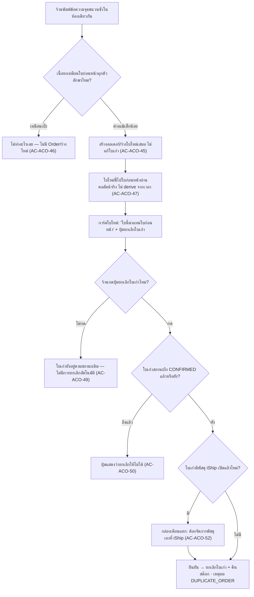
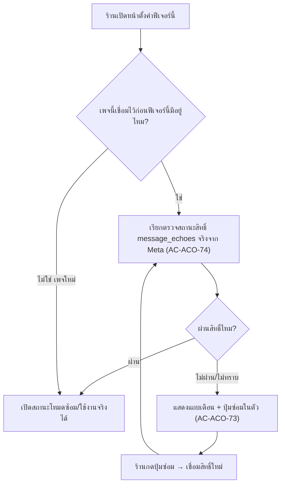

> **โมดูล:** 00061-AutoCreateOrder
> **ประเภทเอกสาร:** Business Requirements Document (BRD) — NON-TECHNICAL
> **เวอร์ชัน:** 1.0
> **วันที่จัดทำ:** 2026-08-29
> **สถานะ:** Draft — รอ user review
> **เจ้าของเอกสาร:** BA

# BRD: สร้างออเดอร์อัตโนมัติจากคำสั่งในแชท

> ## 🔄 มติเปลี่ยน 2026-08-30 — ร่างเป็น `Order.status='DRAFTED'` ไม่ใช่ตารางแยก
>
> *"ไม่อยากให้สร้างตารางแยกแล้ว · อยากให้สร้างออเดอร์ไว้รวมกันเลย แต่เป็น drafted แทน · ง่ายกว่า"* (user 2026-08-30)
> ⇒ ร่าง = แถว `Order` ที่ `status='DRAFTED'` อยู่ในหน้า `/orders` เดิม · **ไม่มีตารางใหม่ ไม่มีหน้ารวมศูนย์แยก**
> ⇒ ดู **BR-ACO-20d/20e/20f** ใน PRD §3.3 (ราคาที่ต้องจ่ายของการรวมโต๊ะ) และ **FR-ACO-28** ใน §2.4 ของเอกสารนี้


---

## 1. บทนำ

### 1.1 วัตถุประสงค์ของเอกสาร

เอกสารนี้อธิบายความต้องการเชิงธุรกิจของฟีเจอร์ "สร้างออเดอร์อัตโนมัติจากคำสั่งในแชท" ในระดับที่
ผู้ที่ไม่ใช่นักพัฒนาอ่านแล้วตรวจสอบได้ว่าระบบทำอะไร ตัดสินใจอย่างไรในแต่ละกรณี และเมื่อไหร่จึงถือว่า
ทำงานถูกต้อง — 🛑 **ทุก Acceptance Criteria ในเอกสารนี้ผูกกลับไปที่ Business Rule (`BR-ACO-xx`) ใน PRD
และต้องตอบได้ว่า "โค้ดบรรทัดไหนบังคับ + เทสตัวไหนแดงถ้าถอดออก" ก่อนจะทำเครื่องหมายว่าเสร็จ**

เอกสารนี้เป็นฐานให้ SRS/SDS (เอกสารเชิงเทคนิค) และ TestCase เขียนต่อ — **สิ่งที่ไม่ปรากฏใน BRD ถือว่า
ไม่อยู่ในความต้องการ**

### 1.2 ขอบเขตของระบบ

**สร้างออเดอร์อัตโนมัติจากคำสั่งในแชท** คือระบบที่ดักข้อความฝั่งร้านในห้องแชทที่มี "วลีจุดชนวน"
แกะข้อมูลลูกค้า + รายการสินค้าตามเทมเพลตที่กำหนดตายตัว แล้วสร้างออเดอร์จริงทันทีถ้าข้อมูลครบ หรือ
เก็บเป็นร่างพร้อมเหตุผลถ้ายังไม่ครบ — **ไม่มีการเดาแทนผู้ใช้ในจุดที่ข้อมูลกำกวม**

**เข้าสู่ระบบ (Input):**
- ข้อความที่ร้านพิมพ์ในห้องแชท (ผ่านกล่องแชท Deep หรือ echo จากแอปของ Meta) ที่มีวลีจุดชนวนปรากฏอยู่
- ชุดตั้งค่าของร้าน (วลีจุดชนวน · เพจ/ช่องทางที่เปิดใช้ · สถานะ ปิด/ซ้อม/ใช้งานจริง)
- แคตตาล็อกสินค้าปัจจุบันของร้าน (สำหรับจับคู่รายการ)

**ออกจากระบบ (Output):**
- ออเดอร์จริง (เมื่อข้อมูลครบเกณฑ์เดียวกับฟอร์ม) พร้อมธงบอกที่มา
- ร่าง (เมื่อข้อมูลไม่ครบ/กำกวม/ประมวลผลไม่สำเร็จ) พร้อมเหตุผลที่อ่านออกได้ครบทุกข้อ
- การ์ดผลลัพธ์ในห้องแชท (เห็นเฉพาะฝั่งร้าน) + ร่างปรากฏในหน้า `/orders` เดิม

**ระบบที่เกี่ยวข้อง:**
- `createOrder()` — เส้นทางสร้างออเดอร์จริงตัวเดียวกับทุกช่องทางอื่นในระบบ
- ระบบตอบกลับอัตโนมัติเดิม (00023) — หน้าตั้งค่าอยู่ร่วมกัน
- ระบบแชท (00018 Messenger/Instagram · 00025 LINE) — จุดดักจับข้อความทั้ง 2 จุด

**อยู่ในขอบเขต:**
- ตั้งค่า 1 ชุดต่อร้าน (วลีจุดชนวนหลายวลี + เพจที่เลือกใช้ + สถานะ ปิด/ซ้อม/ใช้งานจริง)
- ดักข้อความฝั่งร้านจาก 2 จุดเข้า (กล่องแชท Deep + echo จาก Business Suite) สำหรับ Messenger/Instagram · LINE ดักได้ทางเดียว
- แกะข้อมูลลูกค้า + รายการสินค้าตามเทมเพลตตายตัว จับคู่สินค้าแบบตรงเป๊ะเท่านั้น
- สร้างออเดอร์จริงทันทีเมื่อครบเกณฑ์ / สร้างร่างพร้อมเหตุผลเมื่อไม่ครบ
- การ์ดผลลัพธ์ในห้องแชท (เห็นเฉพาะฝั่งร้าน) + ร่างในหน้า `/orders` เดิม
- ตรวจสุขภาพสิทธิ์รับข้อความสะท้อนกลับของเพจเก่า + ปุ่มซ่อมในตัว

**ไม่อยู่ในขอบเขต (v1):**
- ระบบถามยืนยันลูกค้าแล้วสร้างอัตโนมัติ (P2 — ดู PRD §5.1)
- AI ช่วยแกะข้อความที่ไม่ตรงเทมเพลต · การจับคู่สินค้าแบบคล้ายกัน (fuzzy) · การสร้างสินค้าใหม่อัตโนมัติ
- การส่งข้อความหาลูกค้าแบบอัตโนมัติทุกรูปแบบ (ร้านกดส่งเองผ่านปุ่มเดิมเสมอ)
- TikTok · ร้านประเภทคิวงาน/บ้านพัก · แชท DEEP ในแอปมือถือผู้ซื้อ · การแจ้งเตือนแบบ push

### 1.3 กลุ่มผู้ใช้งาน

| กลุ่มผู้ใช้ | บทบาท | สิทธิ์การใช้งาน |
|-----------|--------|----------------|
| **เจ้าของร้าน / สมาชิกร้านสิทธิ์ผู้ดูแล** | ตั้งค่าวลีจุดชนวน/เพจ/สถานะ · ดูผลลัพธ์ · กู้ร่าง | แก้ไขการตั้งค่าได้ (BR-ACO-05) — ระดับเดียวกับหน้าตอบกลับอัตโนมัติเดิม |
| **สมาชิกร้านที่มีสิทธิ์เข้าถึงห้องแชทนั้น** | เห็นการ์ดผลลัพธ์/ร่างของห้องที่ตัวเองเข้าถึงได้อยู่แล้ว · กู้ร่างได้ | เห็น/กู้ร่างได้ ไม่ต้องมีสิทธิ์เพิ่มเติม (BR-ACO-25) แต่แก้ชุดตั้งค่าไม่ได้ถ้าไม่ใช่ผู้ดูแล |
| **ระบบ (ทำงานอัตโนมัติ)** | ดักจับ/แกะข้อความ/ตัดสินใจสร้างออเดอร์หรือร่าง | ผู้กระทำที่ไม่ใช่คน — ทุกออเดอร์ที่สร้างต้องแยกจากออเดอร์ที่คนกดสร้างเองได้เสมอ (BR-ACO-18) |
| **ลูกค้าปลายทาง** | ผู้รับผลลัพธ์ทางอ้อม (ได้รับสรุปคำสั่งซื้อเมื่อร้านกดส่งเอง) | ไม่มีสิทธิ์ตั้งค่าใด ๆ และ **ต้องไม่เห็นข้อความ/การ์ดภายในของระบบเลย** (BR-ACO-21) |

---

## 2. ความต้องการหลัก (Functional Requirements)

### 2.1 การตั้งค่าต่อร้าน

**FR-ACO-01 — ชุดตั้งค่า 1 ชุดต่อร้าน + วลีจุดชนวนหลายวลี** (ผูก BR-ACO-01/02/03)

> ในฐานะเจ้าของร้าน ฉันต้องการตั้งวลีจุดชนวนและเลือกเพจที่ใช้ได้ในที่เดียว
> เพื่อไม่ต้องตั้งค่าซ้ำทีละเพจเมื่อร้านมีหลายช่องทาง

**Acceptance Criteria:**
- [ ] **AC-ACO-01** ตั้งวลีจุดชนวนได้หลายวลีต่อร้าน มีวลีเริ่มต้น 1 วลี ("สรุปคำสั่งซื้อ") ที่แก้/ลบได้ — ช่องกรอกวลี **ไม่มีวิธีเขียน regex/wildcard ใด ๆ** (BR-ACO-02)
- [ ] **AC-ACO-02** การเทียบวลี: ไม่สนตัวพิมพ์เล็ก/ใหญ่ ยุบช่องว่างซ้ำ **แต่เทียบบนข้อความดิบ** — มีเทสยืนยันว่าวลีที่มีสัญลักษณ์นำหน้า (เช่น `/go`) **ไม่ถูกทำให้เป็นคำธรรมดาก่อนเทียบ** (BR-ACO-01)
- [ ] **AC-ACO-03** เลือกเพจ/ช่องทางที่เปิดใช้ได้หลายรายการ ด้วย UI แบบเดียวกับตัวเลือกเพจของหน้าตอบกลับอัตโนมัติเดิม (`sibling-surface-parity`)

**Business Flow:**
1. ร้านเปิด `/seller/settings/auto-reply` → เห็นการ์ด "สร้างออเดอร์อัตโนมัติจากคำสั่งในแชท" ต่อจากการ์ดตอบกลับอัตโนมัติ
2. กรอก/แก้วลีจุดชนวน → เลือกเพจที่เปิดใช้ → บันทึก
3. ชุดตั้งค่าเดียวมีผลกับทุกเพจที่เลือกไว้ทันที

**Example:**
```
ร้านตั้งวลี "สรุปคำสั่งซื้อ" และ "/go" — เพจ A + เพจ B (Messenger, Instagram)
ข้อความ "/go สรุปให้หน่อย" จากเพจ A  → ตรงวลี "/go" → เข้าสู่การดักจับ
ข้อความ "สรุปคำสั่งซื้อ" จากเพจ C (ไม่ได้เลือกไว้) → ไม่ดักจับ
```

**FR-ACO-02 — สถานะ 3 ระดับของชุดตั้งค่า** (ผูก BR-ACO-04)

> ในฐานะเจ้าของร้าน ฉันต้องการทดลองระบบกับข้อความจริงก่อนเปิดใช้เต็มรูปแบบ
> เพื่อไม่ให้ออเดอร์ปลอมจากการทดลองไปปนกับออเดอร์จริงของร้าน

**Acceptance Criteria:**
- [ ] **AC-ACO-04** มี 3 สถานะ: ปิด / โหมดซ้อม / ใช้งานจริง — **ค่าเริ่มต้นหลังตั้งค่าครั้งแรกคือ "ปิด"**
- [ ] **AC-ACO-05** โหมดซ้อมดักจับ **เฉพาะห้องแชททดสอบที่ร้านระบุไว้** — ห้องอื่นไม่ถูกดักแม้มีวลีจุดชนวน
- [ ] **AC-ACO-06** 🛑 โหมดซ้อม **ไม่สร้างออเดอร์จริงไม่ว่าข้อมูลจะครบแค่ไหน** — ผลลัพธ์ทุกกรณีแสดงเป็นร่างให้ดูอย่างเดียว **มีเทสยืนยันว่าไม่มี branch ใดในโหมดนี้เรียก `createOrder()`**

**FR-ACO-03 — สิทธิ์แก้ไขการตั้งค่า** (ผูก BR-ACO-05)

- [ ] **AC-ACO-07** เฉพาะเจ้าของร้านและสมาชิกร้านสิทธิ์ผู้ดูแลแก้ไขชุดตั้งค่าได้ — สมาชิกสิทธิ์ต่ำกว่าเปิดดูได้อย่างเดียว (ระดับเดียวกับหน้าตอบกลับอัตโนมัติเดิม)

**FR-ACO-04 — จำกัดเฉพาะร้านขายออนไลน์** (ผูก BR-ACO-06)

> ในฐานะทีม Deep ฉันต้องการให้ฟีเจอร์นี้ใช้ได้เฉพาะร้านที่มีแนวคิด "รายการสินค้า"
> เพื่อไม่ให้ร้านคิวงาน/บ้านพักเห็นเมนูที่ใช้กับธุรกิจของตัวเองไม่ได้

- [ ] **AC-ACO-08** ร้าน `vertical !== 'ONLINE_SALES'` ไม่เห็นเมนูตั้งค่านี้
- [ ] **AC-ACO-09** 🛑 เรียก API ตั้งค่า/เปิดใช้ตรงจากร้านที่ไม่ใช่ `ONLINE_SALES` **ต้องถูกปฏิเสธที่ server เสมอ** — ต้องมี integration test ยืนยันว่าเรียก endpoint ตรงจากร้าน `SERVICE_QUEUE`/`LODGING` แล้วได้ 403 **ไม่ใช่แค่ทดสอบว่าเมนูถูกซ่อน** (BR-ACO-06 เขียนไว้ตรงตัวว่า "ไม่ใช่แค่ซ่อนเมนู")

**FR-ACO-05 — ตรวจสุขภาพสิทธิ์รับข้อความสะท้อนกลับก่อนเปิดใช้ได้จริง** (ผูก BR-ACO-07)

- [ ] **AC-ACO-10** เพจที่เชื่อมไว้ก่อนฟีเจอร์นี้ ต้องผ่านการตรวจสถานะสิทธิ์ `message_echoes` **จริงจากแพลตฟอร์ม** ก่อนจึงจะเปิดสถานะ "ใช้งานจริง"/"โหมดซ้อม" ได้ — **ไม่ใช่เดาจากวันที่เชื่อมเพจ** (มีเทสยืนยันว่ามีการเรียก API ตรวจสถานะจริง ไม่ใช่ query ฐานข้อมูลอย่างเดียว)

---

### ✅ OD-ACO-01 (ปิดแล้ว 2026-08-29) — เหตุผลยกเลิกสำหรับ "ใบเก่าถูกแทนที่ด้วยใบใหม่"

> **มติ user: เลือก (ก) เพิ่มค่าใหม่ `DUPLICATE_ORDER`** — ต้องทำครบ 4 อย่างในคอมมิตเดียวกัน
> (1) เพิ่มใน `src/lib/cancel-reasons.ts` ชุด `ONLINE_SALES`
> (2) migration ต่อท้าย CHECK constraint แบบ **additive** (อ่านค่าเดิมมาต่อ **ห้าม hardcode รายชื่อใหม่ทั้งชุด**
>     — `docs/conventions/migration-check-constraint-additive.md`)
> (3) 🛑 **ห้ามเพิ่มเข้า `BUYER_FAULT_CANCEL_REASONS`** (`src/lib/cancel-reason-buyer-fault.ts`) —
>     ระบบสร้างซ้ำเองไม่ใช่ความผิดลูกค้า **และต้องเขียนคอมเมนต์กำกับที่ตัวค่าเองว่า "จงใจไม่อยู่ในแมปนี้"**
>     กันคนถัดไปเข้าใจผิดว่าลืมใส่แล้วเพิ่มเข้าไป (ไฟล์นั้นบันทึกไว้เองว่าเคยเกิดกรณีค่าที่หายเงียบบน prod)
> (4) เทส `[blocker]` 1 เคสยืนยันว่า `DUPLICATE_ORDER` **ไม่อยู่** ใน allow-list ความผิดผู้ซื้อ
>     + อัปเดต `cancel-reason-db-constraint.test.ts`


**บริบท:** สถานะที่ 4 ของการ์ดผลลัพธ์ (BR-ACO-15) มีปุ่มยกเลิกใบเก่า แต่ **ไม่มีค่าใน
`CANCEL_REASONS_BY_VERTICAL.ONLINE_SALES` (`src/lib/cancel-reasons.ts`) ที่ตรงกับเหตุผลนี้** —
มีแค่ `BUYER_NO_PAYMENT` / `BUYER_REQUESTED` / `PARCEL_RETURNED` / `SHOP_ISSUE` / `MUTUAL`

| ทางเลือก | ข้อดี | ข้อเสีย | ผลกับ `cancel-reason-buyer-fault.ts` |
|---|---|---|---|
| **(ก) เพิ่มค่าใหม่** `DUPLICATE_ORDER` ("สั่งซ้ำ/ถูกแทนที่ด้วยใบใหม่") | สถิติเหตุผลยกเลิกตรงความจริง ไม่ปนกับเหตุผลอื่น | แตะ ≥3 จุด (`cancel-reasons.ts` + migration ต่อท้าย CHECK แบบ additive ตาม `migration-check-constraint-additive.md` + ทุกจุดที่ render dropdown ยกเลิก) และ **ค่าใหม่จะไปโผล่ในดรอปดาวน์ยกเลิกของทุกหน้า** ไม่ใช่แค่ของฟีเจอร์นี้ | 🛑 **ต้องไม่ถูกเพิ่มเข้า `BUYER_FAULT_CANCEL_REASONS`** — ระบบสร้างซ้ำเองไม่ใช่ความผิดลูกค้า · ค่าใหม่ปลอดภัยโดย fail-closed อยู่แล้ว (ไม่เพิ่ม = ไม่นับ) **แต่ต้องมีคอมเมนต์กำกับที่ตัวค่าเอง กันคนเข้าใจผิดว่า "ลืมใส่" แล้วเพิ่มทีหลัง** (ซ้ำรอยที่ไฟล์นั้นบันทึกไว้เอง) + เทส `[blocker]` 1 เคสยืนยันว่าไม่อยู่ใน allow-list |
| **(ข) ใช้ `MUTUAL` ไปก่อน** | ไม่ต้อง migration ไม่กระทบหน้าจอเดิม | **สถิติเหตุผลยกเลิกเพี้ยน** — ใบที่ระบบสร้างซ้ำเองถูกนับปนกับ "ตกลงกันได้" กระทบรายงานเหตุผลยกเลิกของร้าน | ไม่กระทบ — `MUTUAL` ไม่อยู่ใน allow-list อยู่แล้ว ปลอดภัยด้าน Trust Score **แต่ผิดด้านความแม่นของสถิติ** |
| **(ค) ไม่ยกเลิกจากการ์ดเลย** | ไม่ต้องตัดสิน enum · เหตุผลที่เลือกเป็นเหตุผลจริงที่ร้านรู้ดีที่สุด | **เสียความสะดวกที่เป็นเหตุผลทั้งหมดของสถานะที่ 4** — ร้านต้องสลับหน้าไปทำเอง ขัดเจตนา "ตัดขั้นตอนซ้ำ" | ไม่กระทบเลย |

**ข้อเสนอ (ไม่ใช่มติ):** **(ก)** — ให้ผลตรงความจริงที่สุด ความเสี่ยงด้าน Trust Score ปิดได้ด้วยคอมเมนต์กำกับ
+ เทสเพิ่ม 1 เคส · ต้นทุนคือแตะหลายไฟล์ **ครั้งเดียวตอนสร้าง ไม่ใช่หนี้สะสม**

---

### 2.2 การดักจับและแกะข้อความ

**FR-ACO-06 — ดักเฉพาะข้อความฝั่งร้าน** (ผูก BR-ACO-08)

> ในฐานะเจ้าของร้าน ฉันไม่ต้องการให้ระบบสร้างออเดอร์จากสิ่งที่ลูกค้าพิมพ์
> เพื่อไม่ให้ลูกค้าสั่งของปลอมได้ด้วยการพิมพ์คำที่รู้ว่าเป็นวลีจุดชนวน

- [ ] **AC-ACO-11** ข้อความที่ `senderRole==='BUYER'` มีวลีจุดชนวนครบทุกตัวอักษร → **ต้องไม่เกิดอะไรขึ้นเลย**: ไม่มีแถว `Order` ใหม่ (ทั้ง `PENDING` และ `DRAFTED`) · ไม่มีการ์ดในห้องแชท — **เทสต้องยืนยันด้วยการนับแถวก่อน/หลัง ไม่ใช่แค่เช็คว่าไม่มี error**

**FR-ACO-07 — 2 จุดดักจับต้องให้ผลลัพธ์เดียวกันเสมอ** (ผูก BR-ACO-09)

> ในฐานะแอดมินที่สลับไปตอบจาก Business Suite ฉันต้องการให้ระบบทำงานเหมือนตอนพิมพ์จากกล่องแชท Deep
> เพื่อไม่ต้องกังวลว่าต้องใช้แอปไหนถึงจะ "นับ"

- [ ] **AC-ACO-12** 🛑 **เทส parity บังคับ:** ป้อนข้อความเนื้อหาเดียวกันทุกตัวอักษรเข้าทั้ง 2 เส้นทาง (ส่งผ่าน `sendMessage()` จากกล่องแชท Deep vs. เข้าเป็น echo ผ่าน webhook) แล้วเทียบผลลัพธ์ **ทุกฟิลด์**: ชนิดผลลัพธ์ (ออเดอร์จริง/ร่าง) ต้องตรงกัน · ถ้าเป็นออเดอร์ ทุกฟิลด์ต้องเท่ากัน (ยกเว้น id/timestamp ที่ระบบสร้างเอง) · ถ้าเป็นร่าง **ชุดเหตุผลต้องเป็นเซตเดียวกันเป๊ะ** — เทสที่เช็คแค่ "ทั้งสองทางทำงานได้/ไม่ error" **ไม่ผ่านเกณฑ์นี้**
- [ ] **AC-ACO-13** ตัวแกะข้อความเป็น **ฟังก์ชันเดียวที่ทั้ง 2 เส้นทางเรียกร่วมกัน** (ไม่ใช่ 2 ก้อนโค้ดที่เขียนแยกแล้วบังเอิญให้ผลตรงกัน) — reviewer ตรวจได้จาก import graph ว่าทั้งสอง call site เรียกฟังก์ชันตัวเดียวกัน

**FR-ACO-08 — ช่องทางที่รองรับใน v1** (ผูก BR-ACO-10)

- [ ] **AC-ACO-14** รองรับ Messenger · Instagram · LINE — ช่องทางอื่น (TikTok ฯลฯ) **ไม่มีตัวเลือกให้เปิดใช้เลย**
- [ ] **AC-ACO-15** เลือกช่องทาง LINE ในหน้าตั้งค่า → **มีข้อความกำกับที่จุดนั้นทันที** ว่าดักได้เฉพาะข้อความจากกล่องแชท Deep (**ไม่ใช่แค่ในเอกสาร — ต้องเห็นบนหน้าจอจริง**)
- [ ] **AC-ACO-16** ข้อความที่ร้านพิมพ์จากแอป LINE Official Account Manager โดยตรง **ไม่ถูกดักจับ** — เพราะไม่มีกลไกส่ง echo ให้ระบบภายนอก

**FR-ACO-09 — เทมเพลตที่ระบบจดจำได้** (ผูก BR-ACO-11)

- [ ] **AC-ACO-17** แกะได้ 4 หัวข้อบังคับ (ชื่อ/เบอร์/ที่อยู่/รายการ) + หัวข้อเสริม (ส่วนลด/ยอดรวม/หมายเหตุ/ชำระโดย) โดยรับคำพ้องตามชุดที่กำหนด — **มีเทสยิงคำพ้องแต่ละคำ** แล้วยืนยันว่าแกะลงฟิลด์เดียวกัน

**FR-ACO-10 — รูปแบบรายการสินค้า + ห้ามเดาราคาเป็น ฿0** (ผูก BR-ACO-12)

> ในฐานะเจ้าของร้าน ฉันไม่ต้องการให้ระบบตัดสินใจแทนว่าสินค้าที่ไม่ระบุราคาคือของแถม
> เพราะถ้าเดาผิด ลูกค้าจะได้ของฟรีโดยที่ฉันไม่ได้ตั้งใจ

- [ ] **AC-ACO-18** บรรทัด `- ชื่อสินค้า x2 @250` แกะได้ครบชื่อ/จำนวน/ราคา — ไม่ระบุ `x` ให้ถือเป็น 1 ชิ้น
- [ ] **AC-ACO-19** 🛑 บรรทัดสินค้าที่ไม่มี `@ราคา` → **ต้องไม่มีแถว `Order` ใหม่ถูกสร้างเลย ไม่ว่าข้อมูลส่วนอื่นจะครบแค่ไหน** — **เทสต้องยืนยันด้วยการนับแถว `Order` ก่อน/หลัง** (ไม่ใช่แค่ตรวจว่าราคาในผลลัพธ์ไม่เป็น 0) ผลลัพธ์ต้องเป็นร่างพร้อมเหตุผล "มีรายการแต่ไม่ระบุราคา" เท่านั้น

**FR-ACO-11 — จับคู่สินค้าตรงเป๊ะ ห้ามสร้างสินค้าใหม่** (ผูก BR-ACO-13 — 🛑 ด่านบังคับ)

> ในฐานะเจ้าของร้าน ฉันไม่ต้องการให้สินค้าปลอมโผล่ในแคตตาล็อกจากการพิมพ์ชื่อผิด
> เพราะสินค้าที่สร้างผิดจะไปโผล่หน้าร้านสาธารณะทันทีโดยไม่มีใครตรวจก่อน

- [ ] **AC-ACO-20** ชื่อสินค้าที่ตรงกับของที่มีอยู่ (หลังยุบช่องว่าง + ไม่สนตัวพิมพ์เล็กใหญ่) หรือพิมพ์เป็นรหัสสินค้า → จับคู่สำเร็จ **ส่ง `productId` เข้า `createOrder()` เสมอ**
- [ ] **AC-ACO-21** ชื่อสินค้าที่ใกล้เคียงแต่ไม่ตรงเป๊ะ (สะกดผิด 1 ตัวอักษร) → **ต้องไม่จับคู่** ไม่มี fuzzy matching ใด ๆ
- [ ] **AC-ACO-22** 🛑 **ด่านบังคับ — พิสูจน์ด้วยการนับ ไม่ใช่เช็คผลลัพธ์:** นับแถว `Product` ของร้านไว้ก่อน (N) → ส่งข้อความที่มีชื่อสินค้าไม่ตรงกับที่มีอยู่ **แต่ข้อมูลส่วนอื่นครบทุกอย่าง** → หลังประมวลผลจบ นับ `Product` อีกครั้ง **ต้องยังเป็น N เท่าเดิม** และผลลัพธ์ต้องเป็นร่างพร้อมเหตุผล "สินค้าไม่ตรงกับที่มีในร้าน"
      **เหตุผลที่ต้องนับสินค้าแยกจากการเช็คว่าตกร่าง:** `Product` อาจถูก Quick-Create สร้างไปแล้ว **ก่อน** ที่ order จะตกร่างด้วยเหตุอื่นทีหลังในลำดับการประมวลผล ⇒ เทสที่เช็คแค่ "ตกร่างไหม" **ไม่มีทางจับความรั่วนี้ได้**
- [ ] **AC-ACO-23** เทสตัวเดียวกับ AC-ACO-22 **ต้องแดงทันทีถ้าเอาด่าน "ส่ง `productId` ที่จับคู่แล้วเสมอ" ออก** (mutation-proven) — เพราะเป็นด่านที่ปิดพฤติกรรม Quick-Create เดิมซึ่ง **เปิดอยู่เป็นค่าเริ่มต้น**

**FR-ACO-12 — วันที่ของออเดอร์ = เวลาที่ข้อความจุดชนวนถูกส่งจริง** (ผูก BR-ACO-14 · เพดานเวลาอ้าง SSOT `src/lib/order-date-window.ts`)

- [ ] **AC-ACO-24** ออเดอร์ที่สร้างสำเร็จมี `createdAt` = เวลาที่ข้อความถูกส่งจริง (ไม่ใช่เวลาที่ระบบประมวลผลเสร็จ) — **มีเทสจำลองความหน่วง** (ข้อความส่งเวลา T ระบบประมวลผลเสร็จ T+30 วินาที) แล้วยืนยัน `createdAt = T`
- [ ] **AC-ACO-25** ข้อความที่มีเวลาส่งเกินเพดาน (ค่าเดียวกับที่ฟอร์มสร้างออเดอร์ใช้) → **ต้องตกเป็นร่างพร้อมเหตุผล "เวลาเกินเพดานที่ยอมรับ" ห้ามถอยไปใช้เวลาปัจจุบันเงียบ ๆ** — เทสต้องยืนยันว่า**ไม่มี `Order` ถูกสร้างด้วยเวลาอื่นที่ไม่ใช่เวลาของข้อความ** ไม่ใช่แค่ตรวจว่ามีร่างเกิดขึ้น

---

### 2.3 ผลลัพธ์: ออเดอร์จริงหรือร่าง

**FR-ACO-13 — เกณฑ์ "ครบ" เข้มเท่าฟอร์มสร้างออเดอร์ทุกประการ** (ผูก BR-ACO-15/15a — 🛑 ด่านบังคับ)

- [ ] **AC-ACO-26** เกณฑ์ครบ: เบอร์มือถือไทยถูกต้อง (06/08/09 ครบ 10 หลัก) + รายการสินค้า ≥1 รายการที่มีชื่อ/จำนวน/ราคาครบ + ที่อยู่ครบ (บ้านเลขที่+จังหวัด+รหัสไปรษณีย์) เมื่อเป็นออเดอร์ที่ต้องส่งของ — ไม่บังคับตำบล/อำเภอ
- [ ] **AC-ACO-27** 🛑 ชั้นตรวจของฟีเจอร์นี้เป็นของตัวเอง ไม่เรียกผ่าน API validation ของฟอร์มปกติ — **เทส parity: ทุกเคสที่ฟอร์มปกติปฏิเสธ ต้องถูกฟีเจอร์นี้ตีเป็น "ไม่ครบ" เหมือนกันทุกเคส**

**FR-ACO-14 — ตัดสต๊อกจริงผ่าน `createOrder()` เดียวกันทุกช่องทาง** (ผูก BR-ACO-16)

- [ ] **AC-ACO-28** 🛑 **พิสูจน์ด้วยการนับ `stockQty` ก่อน/หลัง ไม่ใช่แค่เช็คว่ามี `StockMovement` แถวใหม่** (สองอย่างไม่เท่ากัน — อาจมี movement ที่ delta ไม่ตรงกับจำนวนที่สั่งจริง) เทส: seed `stockQty=N` → สั่งซื้อ Q ชิ้น → ยืนยัน `stockQty = N−Q` ตรงเป๊ะ

**FR-ACO-15 — ยอดรวมต้องตรงกับที่คำนวณได้** (ผูก BR-ACO-17)

- [ ] **AC-ACO-29** ยอดที่พิมพ์ต่างจากผลรวมที่คำนวณแม้ 1 บาท → ตกเป็นร่าง **พร้อมแสดงส่วนต่างเป็นตัวเลขบาทตรง ๆ** (ไม่ใช่แค่บอกว่า "ยอดไม่ตรง")

**FR-ACO-16 — ธงบอกที่มา + สถานะการรับรู้ของลูกค้า** (ผูก BR-ACO-18)

- [ ] **AC-ACO-30** 🛑 `Order` มี **คอลัมน์จริง** บอกที่มา (ไม่ derive) แยกจากออเดอร์ที่คนกดสร้างเอง **และแยกจากออเดอร์ที่ระบบอื่นสร้างให้แบบไม่มีคนกด** — เทส query แยกที่มาได้ถูกต้อง 100% จากทั้ง 3 กลุ่ม
- [ ] **AC-ACO-31** ออเดอร์ `CREATED` จากฟีเจอร์นี้แสดง **แถบเตือนค้างว่า "ลูกค้ายังไม่เห็นสรุปนี้"** จนกว่าร้านจะกดส่งเข้าแชท — derive จากการมี/ไม่มีบับเบิลออเดอร์ในเธรด **ไม่เพิ่มคอลัมน์ใหม่**

**FR-ACO-17 — ทุกความล้มเหลวต้องตกเป็นร่างพร้อมเหตุผลครบ** (ผูก BR-ACO-19/20 — 🛑 ด่านบังคับ)

| # | เหตุผล | AC | เกณฑ์ทดสอบ |
|---|---|---|---|
| 1 | ไม่พบเบอร์โทร | **AC-ACO-32** | ไม่มีเลขรูปแบบเบอร์เลย → ร่างมีเหตุผลนี้ |
| 2 | เบอร์ไม่ถูกต้อง | **AC-ACO-33** | มีเลขหน้าตาเหมือนเบอร์แต่ไม่ผ่านกฎ → ร่างมีเหตุผลนี้ (**ไม่ปนกับข้อ 1**) |
| 3 | ที่อยู่ไม่ครบ | **AC-ACO-34** | ต้องส่งของแต่ขาดบ้านเลขที่/จังหวัด/รหัสไปรษณีย์ → ร่างมีเหตุผลนี้ |
| 4 | ไม่พบรายการสินค้า | **AC-ACO-35** | ไม่มีบรรทัดขึ้นต้น `-` เลย → ร่างมีเหตุผลนี้ |
| 5 | มีรายการแต่ไม่ระบุราคา | **AC-ACO-36** | = AC-ACO-19 — **ต้องยืนยันไม่มี `Order` เกิดด้วย** |
| 6 | สินค้าไม่ตรงกับที่มีในร้าน | **AC-ACO-37** | = AC-ACO-22 — **ต้องนับ `Product` ก่อน/หลังด้วย** |
| 7 | ยอดรวมไม่ตรง | **AC-ACO-38** | = AC-ACO-29 |
| 8 | เวลาเกินเพดานที่ยอมรับ | **AC-ACO-39** | = AC-ACO-25 |
| 9 | ประมวลผลไม่สำเร็จ | **AC-ACO-40** | จำลองงานเบื้องหลังล้ม/timeout **ก่อนถึงตัวแกะ** → ร่างมีเหตุผลนี้เท่านั้น |

- [ ] **AC-ACO-41** เหตุผลเชิงเนื้อหาหลายข้อพร้อมกัน → **แสดงครบทุกเหตุผลในครั้งเดียว ไม่ทยอยแสดง**
- [ ] **AC-ACO-42** 🛑 เหตุผลระดับระบบ **เกิดเดี่ยว ๆ เท่านั้น** — เทสยืนยันไม่ปนกับเหตุผลเชิงเนื้อหาข้อใดในร่างใบเดียวกัน
- [ ] **AC-ACO-43** ร่างจากเหตุผลระดับระบบ **ไม่มีปุ่มเปิดฟอร์มแก้ไข** มีแค่ "ลองอ่านข้อความนี้อีกครั้ง" (ไม่มีอะไรถูกแกะเลย ฟอร์มจะเปิดมาว่างเปล่าซึ่งเป็นการโกหก)
- [ ] **AC-ACO-44** ลำดับแสดงเหตุผลเชิงเนื้อหา: **เบอร์ → ที่อยู่ → วันที่ → รายการ → ยอดรวม** (ตามลำดับช่องใน `QuickForm.tsx` จริง)

**FR-ACO-18 — ข้อความจุดชนวนซ้ำในห้องเดียวกัน** (ผูก BR-ACO-20a)

> ในฐานะเจ้าของร้าน ฉันไม่ต้องการให้ออเดอร์ถูกแก้ย้อนหลังเงียบ ๆ จากข้อความในแชท
> เพราะถ้าใบเดิมเปิดพัสดุ/เก็บเงินไปแล้ว การแก้เงียบ ๆ คือความเสียหายจริง ไม่ใช่แค่ความสับสน

- [ ] **AC-ACO-45** เนื้อหาต่างจากใบก่อนหน้าในห้องเดียวกัน (แม้ตัวอักษรเดียว) → สร้างใบใหม่เสมอ **ห้ามอัปเดตใบเดิม** — เทสสแนปช็อตใบเดิมก่อน/หลัง **ต้องเท่ากันทุกฟิลด์ไม่มีข้อยกเว้น**
- [ ] **AC-ACO-46** 🛑 เนื้อหาเหมือนเดิมทุกตัวอักษร → **ไม่สร้างอะไรเพิ่มเลย** — เทสนับแถว `Order` + ร่างของห้องนั้นก่อน/หลัง ต้องเท่าเดิม

**FR-ACO-19 — ใบใหม่ชี้ใบเก่า + ปุ่มยกเลิกใบเก่าที่ผู้ขายกดเอง** (ผูก BR-ACO-20b — 🛑 ด่านบังคับ)

> ในฐานะเจ้าของร้าน ฉันต้องการเห็นว่าใบใหม่มาแทนใบไหน และยกเลิกใบเก่าได้ในคลิกเดียวถ้าฉันต้องการ
> เพื่อไม่ต้องเก็บกวาดเองทุกครั้งที่ทีมพิมพ์ผิด **แต่ยังคุมการยกเลิกด้วยตัวเองเสมอ**

- [ ] **AC-ACO-47** 🛑 ใบใหม่มีคอลัมน์/ความสัมพันธ์จริงชี้ไปใบก่อนหน้า **ไม่ derive จากเวลา+ห้องแชท** — เทส: ส่ง 2 ข้อความจุดชนวนเนื้อหาต่างกันในห้องเดียวกัน **ภายในนาทีเดียว** (เคสปกติที่ไม่ใช่การแทนที่) → **ต้องไม่ถูกจับคู่เป็น "แทนที่กัน" โดยอัตโนมัติ**
- [ ] **AC-ACO-48** การ์ดใบใหม่แสดง "ใบนี้มาแทนใบก่อนหน้า" + ลิงก์ไปใบเก่า + ปุ่มยกเลิกใบเก่าในคลิกเดียวจากการ์ดเดียวกัน
- [ ] **AC-ACO-49** 🛑 **ปุ่มยกเลิกต้องเป็นการกระทำที่ผู้ขายกดเองเสมอ** — เทสยืนยันว่าฟังก์ชันที่เชื่อมใบใหม่กับใบเก่า **ไม่เรียก `cancelOrder()` เลยในตัวมันเอง** การยกเลิกเกิดจาก endpoint ที่ผู้ขายเรียกโดยตรงเท่านั้น (**ไม่มีทางที่ระบบยกเลิกอัตโนมัติได้**)
- [ ] **AC-ACO-50** ยกเลิกได้เฉพาะใบเก่าที่ยังไม่ถึง `CONFIRMED` — ใบที่ `CONFIRMED` แล้ว ปุ่มต้องแสดงสถานะว่ายกเลิกให้ไม่ได้ **ไม่ใช่กดแล้วเจอ error**
- [ ] **AC-ACO-51** ยกเลิกใบเก่าคืนสต๊อกอัตโนมัติเสมอ — เทสนับ `stockQty` ก่อน/หลังแบบเดียวกับ AC-ACO-28
- [ ] **AC-ACO-52** 🛑 `cancelOrder()` **ไม่แตะ `OrderShipment`/iShip เลย** — ถ้าใบเก่ามี `OrderShipment` ที่ `status='CREATED'` ต้องมี **กล่องเตือนแยกต่างหากบนหน้าจอยืนยัน (ไม่ใช่แค่ toast)**: "ใบนี้เปิดพัสดุกับขนส่งไปแล้ว ระบบจะไม่ยกเลิกพัสดุให้ ต้องจัดการเองที่ iShip" — เทสยืนยันกล่องปรากฏเมื่อมีแถวนี้ **และไม่ปรากฏเมื่อไม่มี**
- [ ] **AC-ACO-53** เหตุผลยกเลิกที่บันทึกคือ `DUPLICATE_ORDER` (มติ OD-ACO-01)
- [ ] **AC-ACO-54** เนื้อหาเหมือนเดิม (AC-ACO-46) → **ไม่มีการ์ด "มาแทนใบก่อนหน้า" เกิดขึ้นเลย**

**FR-ACO-20 — แก้ไข/ถอนข้อความจุดชนวนภายหลัง ไม่ย้อนแก้ผลลัพธ์** (ผูก BR-ACO-20c)

- [ ] **AC-ACO-55** ข้อความที่สร้างออเดอร์/ร่างไปแล้วถูกแก้ไข (`message_edits`) → **ผลลัพธ์ไม่เปลี่ยนฟิลด์ใดเลย** (เทสสแนปช็อตก่อน/หลัง)
- [ ] **AC-ACO-56** ข้อความถูกถอนคืน (unsend) → ผลลัพธ์ **ไม่ถูกยกเลิก/ลบ/เปลี่ยนสถานะโดยอัตโนมัติ**
- [ ] **AC-ACO-57** ทั้ง 2 กรณี ระบบ **แจ้งผู้ขายให้รู้** (หมายเหตุในการ์ด/ประวัติ) แต่ไม่กระทำการใด ๆ กับออเดอร์/ร่างเอง

---

### 2.4 การแสดงผลและการดูแลระบบ

**FR-ACO-21 — ชั้นเขียน: ข้อความภายในต้องมีเส้นทางเขียนของตัวเอง** (ผูก BR-ACO-21/21a · PRD §6.3)

> ในฐานะเจ้าของร้าน ฉันไม่ต้องการให้การ์ดผลลัพธ์ของฟีเจอร์นี้ไปรบกวนบอทตอบอัตโนมัติหรือรายงานผลงานแอดมิน
> เพราะทั้งสองอย่างเป็นระบบที่ทำงานอยู่แล้วก่อนฟีเจอร์นี้จะมี

- [ ] **AC-ACO-58** 🛑 ข้อความภายในเขียนผ่านเส้นทางของตัวเอง — เทสยืนยันว่า **ไม่มีการเรียก `sendMessage()` หรือ `sendOutboundMessage()` เลย** ตลอดกระบวนการ — **mutation-proven:** ถอดด่านนี้ (เปลี่ยนกลับไปเรียก `sendMessage`) แล้วเทสต้องแดง
- [ ] **AC-ACO-59** ผลจาก AC-58: บอทอัตโนมัติของห้อง **ไม่ถูกสั่งหยุด** (`pauseForHumanTakeover` ไม่ถูกเรียก) — เทส: เปิดบอทในห้องทดสอบ → ให้ฟีเจอร์นี้เขียนข้อความภายใน → ยืนยันสถานะบอทยังเป็น "เปิด" — **ครอบทั้ง 2 เส้นทาง** (DEEP + ช่องทางนอก · PRD §6.2 แถว 1–2)
- [ ] **AC-ACO-60** 🛑 **แก้ 2026-08-30 — ข้อนี้ *ไม่ใช่* ผลจาก AC-58 และเป็นด่านอิสระที่ต้องแก้โค้ดแยก** (PRD §6.3 "ชั้นตัวนับ") — ตัวคำนวณเวลาตอบของรายงานผลงานแอดมิน (00059) **ไม่นับข้อความภายในเป็น "การตอบของแอดมิน"**
  **เหตุผลที่ต้องแยก:** `chat-metrics.service.ts:64,91` **query ตาราง `ChatMessage` โดยตรง ไม่ได้อยู่บนเส้นทางเขียน** ⇒ การไม่เรียก `sendMessage()` **ไม่ช่วยอะไรเลย** ⇒ ต้องเติม `type: { not: 'AUTO_ORDER_RESULT' }` ที่ query ของไฟล์นั้นเอง
  **เทส:** คำนวณเวลาตอบของห้องหนึ่ง → เขียนข้อความภายในเพิ่ม → คำนวณซ้ำ **ค่าต้องเท่าเดิมทุกหลัก** · **mutation:** ถอด `type: { not: ... }` ออกจาก query → ต้องแดง
  🛑 **ห้ามพิสูจน์ด้วย spy บน `pauseForHumanTakeover`** (นั่นคือด่านของ AC-59 คนละกลไก — จะเขียวปลอมเพราะกลไกนี้ไม่เกี่ยวกับ spy ตัวนั้นเลย)
- [ ] **AC-ACO-61** ข้อความภายในมีผลต่อ `Conversation.lastMessageAt`/พรีวิว/`lastSenderRole` **ตามที่ SRS ตัดสินไว้แน่ชัด** (ไม่ปล่อยเป็นผลข้างเคียงที่ไม่ได้ตั้งใจ) — เทสยืนยันพฤติกรรมที่เลือกสม่ำเสมอทุกครั้ง (แถว 4)
- [ ] **AC-ACO-62** ตัวนับ unread (แถว 5) และคิว `enqueueAutoReplyJob` (แถว 6) **ยังไม่ถูกกระทบ** — เทส regression: เขียนข้อความภายในแล้วยืนยัน badge unread ไม่เพิ่ม และไม่มี auto-reply job ถูกสร้าง
      🛑 **ต้องมีเทสตรงจุดนี้แม้แถวนี้จะ "ปลอดภัยอยู่แล้ว" — เพราะมันปลอดภัยด้วยเงื่อนไข (`senderRole='BUYER'` เท่านั้นถึงนับ) ซึ่งเป็นแถวที่คนถัดไปแก้พังโดยไม่รู้ตัวได้ง่ายที่สุด**

**FR-ACO-22 — ชั้นอ่าน: endpoint ที่ client เรียกอ่านข้อความต้องกรองตาม role** (ผูก BR-ACO-21 · PRD §6.3 — 🛑 **คนละข้อจาก FR-ACO-21 เสมอ**)

- [ ] **AC-ACO-63** 🛑 `GET /api/chat/conversations/[id]/messages` (และทุก endpoint ที่ client อ่านข้อความของห้อง) **กรองข้อความภายในตาม role ของผู้เรียกก่อนตอบกลับเสมอ** — เทส: เรียกด้วย token ฝั่ง `BUYER` ในห้องที่มีข้อความภายใน → response **ต้องไม่มีข้อความภายในปนเลย** — **mutation-proven:** ถอดเงื่อนไขกรองแล้วเทสต้องแดง
- [ ] **AC-ACO-64** เรียก endpoint เดียวกันด้วย token ฝั่ง `SHOP` ในห้องเดียวกัน → response ต้องมีข้อความภายในครบ
- [ ] **AC-ACO-65** Postgres realtime trigger ทำงานตามปกติ **โดยไม่ต้องปิด/กัน** (เลี่ยงไม่ได้ตาม PRD §6.2 แถว 7) — เทสยืนยันว่า client ฝั่งลูกค้าที่ได้สัญญาณ refetch แล้วเรียก GET ตาม AC-63 **ยังคงไม่เห็นข้อความภายใน**
      🛑 **พิสูจน์ว่าชั้นอ่านทำงานได้แม้ trigger ยิงสัญญาณตามปกติ ไม่ใช่พึ่งพาว่า trigger จะไม่ยิง**

**FR-ACO-23 — ร่างปรากฏในหน้า `/orders` เดิม** (ผูก BR-ACO-22)

- [ ] **AC-ACO-66** ร่างทุกใบปรากฏในหน้า `/orders` เดิมผ่าน **ชิปกรอง "ร่าง"** ที่เพิ่มในแถบตัวกรองที่มีอยู่แล้ว — **ไม่มีหน้าใหม่ ไม่มีเมนูใหม่**
- [ ] **AC-ACO-67** 🛑 ตัวเลขบนชิปกรอง "ร่าง" + ตัวเลขบนแถวห้องแชท มาจาก **ฟังก์ชัน/query เดียวกัน** — เทสยืนยันว่าทั้ง 3 จุดเรียก symbol เดียวกัน **ไม่คำนวณแยกกัน 3 ที่** (กันบั๊กคลาสที่เคยเกิดจริงในระบบนี้: 00029 โชว์ "ยังไม่ตอบ" 7 กับ 8 พร้อมกันบนจอเดียว)

**FR-ACO-24 — ร่างหมดอายุอัตโนมัติใน 7 วัน พร้อมแจ้งเตือนล่วงหน้า** (ผูก BR-ACO-23)

- [ ] **AC-ACO-68** ร่างที่ไม่ถูกจัดการครบ 7 วัน → **เปลี่ยนเป็น `status='CANCELLED'` + `cancelReason='DRAFT_EXPIRED'` ไม่ลบแถวจริง** (แก้ 2026-08-30 หลังย้ายมาใช้ `Order`) — เทสจำลองเวลาผ่านครบ 7 วันแล้วยืนยันสถานะ+เหตุผล
      🛑 **ห้าม hard-delete** — `Order` มี FK จาก `OrderItem`/`OrderEvent`/`OrderPayment`/`OrderReturn`/`ShipmentTracking` และ **ทั้งระบบไม่มีจุดไหนที่ลบแถว `Order` จริงเลย** ยกเลิกทุกที่ทำผ่าน `CANCELLED` เสมอ
- [ ] **AC-ACO-68a** 🛑 `DRAFT_EXPIRED` **ต้องถูกยกเว้นใน `isRateExcludedCancellation()`** — ไม่งั้นร่างที่ไม่มีใครแตะจะไปกดอัตราความสำเร็จของร้าน · และ **ต้องไม่อยู่ใน `BUYER_FAULT_CANCEL_REASONS`** (ร่างหมดอายุเป็นเหตุจากระบบ ไม่ใช่ลูกค้า) — เทส `[blocker]` ยืนยันทั้ง 2 exclusion
- [ ] **AC-ACO-69** มีการแจ้งเตือนล่วงหน้าอย่างน้อย 1 ครั้งก่อนลบ — ป้ายเปลี่ยนสีเมื่อเหลือ **≤24 ชม.** (มติ user) — เทสยืนยันว่าเปลี่ยนสีที่ขอบเขตเวลานี้พอดี **ไม่ใช่ตลอดอายุร่าง**
- [ ] **AC-ACO-70** ร่างที่หมดอายุแล้วไม่ปรากฏในหน้า `/orders` และไม่ถูกนับบนชิปอีก — เทสนับก่อน/หลัง

**FR-ACO-25 — ร่างโหมดซ้อมแยกจากร่างจริง** (ผูก BR-ACO-24)

- [ ] **AC-ACO-71** ร่างจากโหมดซ้อม (`isDryRun=true`) ไม่ถูกนับรวมในชิป "ร่าง" ปกติและ **ห้ามถูกนับในตัวเลข/ยอดใด ๆ ของร้าน** มีตัวกรองแยกให้ดู — เทสยืนยันว่าตัวกรองนี้ **ใช้ค่าสถานะเดียวกับที่ตัดสินใน FR-ACO-02 ไม่ใช่นิยามแยกอีกชุด**

**FR-ACO-26 — สิทธิ์เห็นร่างผูกกับสิทธิ์เข้าห้องแชทเดิม** (ผูก BR-ACO-25)

- [ ] **AC-ACO-72** ทุกคนที่มีสิทธิ์เข้าห้องแชทนั้นอยู่แล้วเห็นร่าง/ผลลัพธ์ของห้องนั้นได้ครบ **ไม่มีสิทธิ์เพิ่มเติมที่แยกจากสิทธิ์เข้าห้องแชท** — เทสยืนยันด้วย role ที่มีสิทธิ์เข้าห้องแชทระดับต่ำสุดที่ระบบรองรับ

**FR-ACO-27 — ตรวจสุขภาพสิทธิ์เพจเก่า + ปุ่มซ่อมในตัว** (ผูก BR-ACO-26 · คู่กับ FR-ACO-05)

- [ ] **AC-ACO-73** หน้าตั้งค่าแสดงสถานะสิทธิ์ของแต่ละเพจ (ผ่าน/ไม่ผ่าน/ไม่ทราบ) พร้อมปุ่มซ่อมในตัว
- [ ] **AC-ACO-74** 🛑 สถานะที่แสดงมาจาก **การเรียกตรวจสอบจริงจากแพลตฟอร์ม ไม่ใช่ derive จากวันที่เชื่อมเพจ** — เทสยืนยันว่ามีการเรียก API ตรวจสอบจริง (mock แล้วยืนยันว่าถูกเรียก ไม่ใช่แค่ query ฐานข้อมูลภายใน)

**FR-ACO-28 — ร่างเป็น `Order.status='DRAFTED'` และต้องไม่ปนกับออเดอร์จริงทุกที่** (ผูก BR-ACO-20d/20e/20f — 🛑 ด่านบังคับ)

> ในฐานะเจ้าของร้าน ฉันไม่ต้องการให้ร่างที่ระบบแกะไม่สำเร็จไปปนกับยอดขายจริงของฉัน
> เพราะตัวเลขที่ผิดโดยที่ฉันไม่รู้ตัว แย่กว่าการไม่มีตัวเลขเลย

- [ ] **AC-ACO-75** 🛑 มี helper ตัวเดียวเป็น SSOT ที่กรอง `DRAFTED` ออก และ **เทส `[blocker]` สแกนซอร์สทั้ง `src/` ห้ามมี `prisma.order.findMany/count/aggregate` ที่ไม่ผ่าน helper นั้น** — **mutation-proven:** ถอด helper ออกจาก call site ใดก็ได้ เทสต้องแดง
      🛑 **จำเป็นเพราะ `Order.status` ไม่มี CHECK constraint ในฐานข้อมูลเลย** (ยืนยันแล้ว) ⇒ **ไม่มีชั้นป้องกันที่ DB · เทสคือด่านเดียวที่มีจริง**
- [ ] **AC-ACO-76** เทสครอบทั้ง **3 คลาส** ไม่ใช่คลาสเดียว: (1) query ที่นับ**เงิน** (ยอดขาย/P&L/dashboard/export) (2) query ที่นับ**จำนวนออเดอร์** (หน้ารายการ/ประวัติลูกค้า/Trust Score) (3) 🛑 query ที่ **assume ว่า `Order` มี `OrderItem` ≥1 แถว** (`items[0]` · `.reduce()` · `COUNT`) — คลาสที่ 3 **crash ได้จริง ไม่ใช่แค่เลขเพี้ยน**
- [ ] **AC-ACO-77** แถว `DRAFTED` มี `orderNo = NULL` · **ไม่ตัดสต๊อก** (เทสนับ `stockQty` ก่อน/หลังต้องเท่าเดิม) · **`totalAmount = 0` เสมอ** — เทสยืนยันว่าไม่มีเส้นทางใดเขียนยอดที่ร้านพิมพ์ลง `totalAmount` ของแถว `DRAFTED`
- [ ] **AC-ACO-78** เลื่อนขั้น `DRAFTED → PENDING` (บันทึกจากฟอร์ม) ต้อง: คำนวณ `orderNo` · ตัดสต๊อก · คำนวณ `totalAmount` จริง — เทสยืนยันครบทั้ง 3 อย่างในทรานแซกชันเดียว
- [ ] **AC-ACO-79** `assertTransition()` อนุญาตเฉพาะ `DRAFTED → PENDING` และ `DRAFTED → CANCELLED` — 🛑 **`DRAFTED → CONFIRMED` ตรง ๆ ต้องถูกปฏิเสธ** (ลูกค้ายืนยันออเดอร์ที่ยังไม่ครบไม่ได้) · mutation-proven

---

## 3. Acceptance Criteria สรุป

### 3.1 การตั้งค่าต่อร้าน
- ✅ ร้านตั้งวลีจุดชนวนหลายวลี + เลือกเพจได้ในชุดเดียว ไม่ต้องตั้งซ้ำทีละเพจ
- ✅ วลีเทียบบนข้อความดิบ ไม่ผ่านตัวปกติที่ลบเครื่องหมายวรรคตอน และห้ามเขียน regex เอง
- ✅ สถานะปิด/ซ้อม/ใช้งานจริง แยกชัด — **โหมดซ้อมไม่มีทางสร้างออเดอร์จริงได้ไม่ว่าข้อมูลจะครบแค่ไหน**
- ✅ เฉพาะเจ้าของร้าน/สมาชิกสิทธิ์ผู้ดูแลแก้ไขได้
- ✅ ร้านที่ไม่ใช่ `ONLINE_SALES` ไม่เห็นเมนู **และเรียก API ตรงก็ถูกปฏิเสธที่ server เสมอ**
- ✅ เพจที่เชื่อมไว้ก่อนฟีเจอร์นี้ ต้องผ่านการตรวจสิทธิ์จริงก่อนเปิดสถานะซ้อม/ใช้งานจริงได้

### 3.2 การดักจับและแกะข้อความ
- ✅ ดักเฉพาะข้อความฝั่งร้าน — **ลูกค้าพิมพ์วลีจุดชนวนแล้วไม่มีอะไรเกิดขึ้นเลย**
- ✅ 2 จุดเข้าให้ผลลัพธ์เหมือนกันทุกฟิลด์เสมอ ผ่านตัวแกะฟังก์ชันเดียวกัน
- ✅ LINE ดักได้ทางเดียว พร้อมข้อความกำกับ **บนหน้าจอตั้งค่าจริง**
- ✅ รายการที่ไม่ระบุราคา **ไม่มีทางถูกเดาเป็น ฿0** — ต้องไม่มี `Order` เกิดขึ้นเลย
- ✅ สินค้าที่จับคู่ไม่ได้ **ไม่มีทางถูกสร้างใหม่ให้เอง** — นับ `Product` ก่อน/หลังต้องเท่ากันเสมอ
- ✅ วันที่ = เวลาที่ข้อความถูกส่งจริงเสมอ **และไม่ถอยไปใช้เวลาปัจจุบันเมื่อเกินเพดาน**

### 3.3 ผลลัพธ์: ออเดอร์จริง / ร่าง / ใบซ้ำ
- ✅ เกณฑ์ "ครบ" เข้มเท่าฟอร์มทุกประการ — **ไม่มีเคสใดหลุดผ่านทางลัดนี้ที่ฟอร์มปกติจะบล็อก**
- ✅ ออเดอร์ที่เกิด **ตัดสต๊อกจริง (พิสูจน์ด้วยการนับ)** และมีธงบอกที่มาเป็นคอลัมน์จริง
- ✅ ยอดต่างแม้ 1 บาท → ตกร่างพร้อมส่วนต่างให้เห็น
- ✅ ทั้ง 9 เหตุผลตกร่างมีเทสยิงจริงแยกทีละข้อ — เชิงเนื้อหาโชว์ครบพร้อมกัน · ระดับระบบเกิดเดี่ยว ๆ ไม่ปนกัน
- ✅ เนื้อหาต่าง = ใบใหม่เสมอ ไม่แก้ใบเก่า / เนื้อหาเหมือนเดิม = ไม่ทำอะไรเลย
- ✅ ใบใหม่ชี้ใบเก่าด้วยคอลัมน์จริง (ไม่ derive จากเวลา) พร้อมปุ่มยกเลิกที่ **ผู้ขายกดเองเสมอ** — ระบบไม่ยกเลิกอัตโนมัติไม่ว่ากรณีใด
- ✅ แก้ไข/ถอนข้อความต้นทางภายหลัง **ไม่ย้อนแก้ผลลัพธ์ที่เกิดไปแล้ว** แจ้งผู้ขายเท่านั้น

### 3.4 การแสดงผลและการดูแลระบบ
- ✅ ข้อความภายในเขียนผ่านเส้นทางของตัวเอง ไม่เรียก `sendMessage`/`sendOutboundMessage` — **บอทไม่ถูกสั่งหยุด เวลาตอบของแอดมินไม่ผิดเพี้ยน**
- ✅ endpoint ที่ client อ่านข้อความกรองตาม role เสมอ — **ลูกค้าไม่มีทางเห็นข้อความภายในแม้ระบบเรียลไทม์จะสั่ง refetch**
- ✅ ตัวเลขบนชิปกรอง "ร่าง"/แถวห้องแชท มาจาก query เดียวกัน **ตัวเลขตรงกันทุกจุดเสมอ**
- ✅ ร่างที่ค้างครบ 7 วันถูกลบจริง พร้อมแจ้งเตือนล่วงหน้าเมื่อเหลือ ≤24 ชม.
- ✅ ร่างจากโหมดซ้อมไม่ปนกับร่างจริงในหน้า `/orders`
- ✅ สิทธิ์เห็นร่าง = สิทธิ์เข้าห้องแชทเดิม ไม่มีชั้นสิทธิ์ใหม่
- ✅ เพจเก่าที่สิทธิ์ยังไม่ครบ มีสถานะให้เห็น + ปุ่มซ่อมในตัว **มาจากการตรวจจริง ไม่ใช่การเดา**

---

## 4. Business Flows (กระบวนการทำงาน)

### 4.1 Flow หลัก: จากข้อความจุดชนวนถึงผลลัพธ์

> ผังเต็มอยู่ที่ **PRD §10 Appendix A.1** (2 จุดเข้าบรรจบที่ตัวแกะเดียวกัน) และ **A.2** (เส้นทางกู้ร่าง)
> — **ไม่วาดซ้ำที่นี่ตาม HR16** (ของสิ่งเดียวกันห้ามมี 2 ฉบับที่ drift จากกันได้) BRD อ้างผังเดียวกันนั้นเป็น SSOT

### 4.2 Flow ใหม่: ข้อความจุดชนวนซ้ำ — ใบใหม่แทนใบเก่า (ผูก FR-ACO-18/19 · BR-ACO-20a/20b)



### 4.3 Flow ใหม่: ตรวจสุขภาพสิทธิ์เพจเก่าก่อนเปิดใช้ (ผูก FR-ACO-05/27 · BR-ACO-07/26)



---

## 5. Use Case Scenarios (สถานการณ์การใช้งานจริง)

### Scenario 1: ร้านพิมพ์ครบตามเทมเพลต → ได้ออเดอร์ทันที

**เงื่อนไขเริ่มต้น:** ร้านตั้งวลี "สรุปคำสั่งซื้อ" เปิดสถานะ "สร้างออเดอร์จริง" กับเพจ Messenger · สินค้า "เสื้อยืดสีดำ" มีในแคตตาล็อก สต๊อก 20 ชิ้น

1. ร้านคุยกับลูกค้าในกล่องแชท Deep จนตกลงซื้อ
2. ร้านพิมพ์สรุปตามเทมเพลต (ชื่อ/เบอร์/ที่อยู่/รายการ `- เสื้อยืดสีดำ x2 @250`/ยอดรวม 500)
3. ระบบดักจับ แกะครบทุกฟิลด์ จับคู่สินค้าตรงเป๊ะ ยอดตรงกับที่คำนวณได้

**ผลลัพธ์:** ออเดอร์จริงถูกสร้างทันที (`createdVia` ชี้มาจากฟีเจอร์นี้) · **สต๊อกลด 2 ชิ้นเหลือ 18** · การ์ดในห้องแชทแสดงผล **พร้อมแถบเตือน "ลูกค้ายังไม่เห็นสรุปนี้" จนกว่าร้านจะกดส่งเข้าแชท**

### Scenario 2: ร้านพิมพ์รายการไม่ระบุราคา → ได้ร่าง

1. ร้านพิมพ์เหมือนเดิม **แต่ลืมใส่ `@250`**
2. ระบบแกะได้ชื่อ/เบอร์/ที่อยู่ครบ แต่รายการไม่มีราคากำกับ

**ผลลัพธ์:** **ไม่มี `Order` ถูกสร้างเลย** (ไม่เดาราคาเป็น ฿0) · เกิดร่างพร้อมเหตุผล "มีรายการแต่ไม่ระบุราคา" · การ์ดมีปุ่มเปิดฟอร์มที่กรอกชื่อ/เบอร์/ที่อยู่ไว้ให้แล้ว เหลือแค่เติมราคา

### Scenario 3: ร้านพิมพ์ซ้ำเพื่อแก้ไข → ใบใหม่ + ปุ่มยกเลิกใบเก่า

**เงื่อนไขเริ่มต้น:** ออเดอร์จาก Scenario 1 ถูกสร้างไป 5 นาทีก่อน ยังไม่ถึง `CONFIRMED`

1. ร้านรู้ตัวว่าลูกค้าสั่งเสื้อสีขาวไม่ใช่สีดำ พิมพ์ข้อความจุดชนวนใหม่ในห้องเดิมด้วยรายการที่แก้แล้ว
2. เนื้อหาต่างจากใบก่อนหน้า → ระบบสร้างออเดอร์ใหม่ **ไม่แตะใบเดิม**

**ผลลัพธ์:** ใบใหม่มีคอลัมน์ชี้กลับไปใบเก่า · การ์ดขึ้น "ใบนี้มาแทนใบก่อนหน้า" พร้อมปุ่มยกเลิกใบเก่า · ร้านกดปุ่ม → ตรวจว่ายังไม่ `CONFIRMED` และไม่มีพัสดุ iShip เปิดค้าง → ยกเลิกสำเร็จด้วยเหตุผล `DUPLICATE_ORDER` **สต๊อกเสื้อสีดำถูกคืน 2 ชิ้น**

### Scenario 4: แอดมินพิมพ์จากแอป Business Suite โดยตรง

**เงื่อนไขเริ่มต้น:** เพจเชื่อมมาก่อนฟีเจอร์นี้ **และผ่านการตรวจสิทธิ์ `message_echoes` แล้ว**

1. แอดมินตอบลูกค้าจาก Business Suite บนคอมออฟฟิศ พิมพ์สรุปแบบเดียวกับ Scenario 1
2. Meta ส่งข้อความนี้เป็น echo เข้า webhook

**ผลลัพธ์:** ระบบดักจับจากจุดเข้าที่ 2 แกะและตัดสินด้วย **ตัวแกะฟังก์ชันเดียวกับ Scenario 1** ได้ผลลัพธ์เหมือนกันทุกฟิลด์ · แอดมินกลับมาเปิดกล่องแชท Deep ภายหลัง **เห็นการ์ดผลลัพธ์รออยู่แล้ว ไม่ต้องทำอะไรซ้ำ**

### 🛑 Scenario 5: เพจเก่าที่สิทธิ์ยังไม่ครบ → ไม่มีอะไรเกิดขึ้นเลย (เคสสำคัญที่สุด — silent failure)

**เงื่อนไขเริ่มต้น:** ร้านเชื่อมเพจไว้ตั้งแต่ก่อนฟีเจอร์นี้ **และยังไม่เคยผ่านการตรวจสิทธิ์ `message_echoes`**

1. ร้านพิมพ์สรุปครบถ้วนจาก Business Suite
2. เพจไม่มีสิทธิ์ → **Meta ไม่ส่ง echo เข้า webhook เลย**

**ผลลัพธ์:** **ไม่มีอะไรเกิดขึ้นเลย** — ไม่มีออเดอร์ ไม่มีร่าง ไม่มีการ์ด **ไม่มี error ให้ร้านเห็น**
🛑 นี่คืออาการที่ผู้ขายเจอแล้วหาสาเหตุไม่เจอ เพราะทุกอย่าง "ดูเหมือนใช้งานได้" จากฝั่งร้าน
**ทางออกที่ต้องมีอยู่ก่อนถึงจุดนี้:** ระบบต้อง **บล็อกไม่ให้เปิดสถานะ "สร้างออเดอร์จริง" ได้ตั้งแต่แรก** ถ้าเพจยังไม่ผ่านสิทธิ์ (AC-ACO-10/73/74) — **Scenario นี้คือเหตุผลที่ AC เหล่านั้นต้องบังคับได้จริง ไม่ใช่แค่เขียนไว้เฉย ๆ**

### Scenario 6: งานเบื้องหลังล้มกลางทาง → ต้องจบที่ร่างเสมอ

1. งานเบื้องหลังที่ประมวลผลข้อความนี้ crash/timeout **ก่อนตัวแกะจะเริ่มอ่านเนื้อหา**

**ผลลัพธ์:** เกิดร่างพร้อมเหตุผลระดับระบบ "ประมวลผลไม่สำเร็จ" — **ไม่ใช่การหายเงียบ** และไม่ใช่ร่างที่ขึ้นเหตุผลเชิงเนื้อหาผิด ๆ (เช่น "ไม่พบเบอร์โทร" ทั้งที่จริงคือ crash) · การ์ดมีเฉพาะปุ่ม "ลองอ่านข้อความนี้อีกครั้ง"

---

## 6. ความต้องการด้านคุณภาพ (Quality Requirements)

### 6.1 ความถูกต้องของข้อมูล
- เกณฑ์ "ครบ" เข้มเท่าฟอร์มทุกประการ **ไม่มีเคสที่ฟอร์มปกติปฏิเสธแล้วหลุดผ่านทางลัดนี้** (AC-ACO-27)
- **ห้ามเดาค่าที่ไม่ชัดเจน** (ราคา/สินค้า/ยอดรวม/วันที่) ทุกความกำกวมต้องตกเป็นร่าง
- 2 จุดเข้าต้องให้ผลลัพธ์เหมือนกันทุกฟิลด์เสมอ (AC-ACO-12)

### 6.2 ความรวดเร็ว + เพดานอัตราการทำงาน

มัธยฐานเวลาตั้งแต่ข้อความถึงผลลัพธ์ **≤5 วินาที** (KPI, PRD §1.2)

**คำถามเปิดเรื่องเพดานอัตรา — ประเมินแล้วว่า v1 ไม่ต้องมีเพดานแข็ง (hard cap) ต่อร้าน** เพราะ:
1. เส้นทางสร้างออเดอร์คือ `createOrder()` **ตัวเดียวกับที่ POS/Quick-Create/API มือถือเรียกอยู่แล้ว** — ไม่ใช่โค้ดใหม่ที่ไม่เคยพิสูจน์รับโหลด burst
2. rate limit ของ Meta/LINE เองเป็นตัวจำกัดความเร็ว burst ในทางปฏิบัติอยู่แล้วก่อนถึงระบบเรา

🛑 **แต่มี NFR ที่ SRS ต้องออกแบบจริง ไม่ใช่แค่สรุปว่า "ไม่ต้องกังวล":**
- **จำกัดการประมวลผลพร้อมกันต่อร้าน** (ไม่ใช่จำกัดจำนวนรวม) — กันเคส 2 ข้อความอ้างสินค้าตัวเดียวกันแข่งกันตัดสต๊อกจนเกิด lock contention ระดับแถว
- **burst จากร้านหนึ่งต้องไม่ทำให้ webhook ของร้านอื่นดีเลย์** — pipeline รับ echo ใช้ร่วมกันทุกร้าน ถ้างานหนัก (parse + match + `createOrder`) ทำแบบ blocking อยู่ในเส้นทางรับ webhook หลัก **ร้านที่พิมพ์ 200 ข้อความรัวจะไปหน่วงร้านอื่นด้วย**
- **ตัวจับ timeout ของเหตุผล "ประมวลผลไม่สำเร็จ" ต้องไม่กลายเป็นคอขวดเอง** — ถ้างานค้างจนตัวจับ timeout ทำงานหนักกว่าตัวประมวลผลจริง จะยิ่งซ้ำเติม burst แทนที่จะเป็นทางออก

### 6.3 ความน่าเชื่อถือ
- งานเบื้องหลังที่ล้ม/timeout **ต้องจบที่ร่างเสมอ ไม่ใช่หายเงียบ** (AC-ACO-40)
- ข้อความที่ถูกแก้ไข/ถอนคืนภายหลัง **ไม่ย้อนแก้ผลลัพธ์ที่เกิดไปแล้ว** (BR-ACO-20c)
- ข้อความซ้ำจาก backfill/redelivery **ต้องไม่ถูกดักซ้ำเป็นครั้งที่ 2** — อาศัย `externalMessageId @unique` เดิม (PRD §6.2 แถว 9)
- 🛑 **เส้นทางเขียนข้อความภายในต้องไม่ถูกป้อนกลับเข้าตัวดักจับซ้ำ** — เพราะข้อความภายในก็เป็น **ข้อความฝั่งร้านในห้องเดียวกัน** ถ้าตัวสแกนวลีจุดชนวนกวาดทุกข้อความในห้องรวมถึงข้อความที่ตัวเองเพิ่งเขียน **อาจเกิดวงจรป้อนกลับ** ⇒ ต้องยืนยันว่าเส้นทางเขียนภายในไม่ได้ต่อสายเข้ากับตัวดักจับเลย **ตั้งแต่การออกแบบ ไม่ใช่ตัดด้วยเงื่อนไขทีหลัง**

### 6.4 ความปลอดภัย
- ข้อความภายในกรองตาม role ที่ endpoint อ่านเสมอ **ลูกค้าไม่มีทางเห็นได้ไม่ว่ากรณีใด** (AC-ACO-63/64)
- แก้ไขชุดตั้งค่าได้เฉพาะเจ้าของร้าน/สมาชิกสิทธิ์ผู้ดูแล (BR-ACO-05)
- เรียก API ตรงจากร้านที่ไม่ใช่ `ONLINE_SALES` **ถูกปฏิเสธที่ server เสมอ ไม่ใช่แค่ซ่อนเมนู** (AC-ACO-09)
- สินค้าที่จับคู่ไม่ได้ **ไม่มีทางถูกสร้างใหม่ให้เอง** (BR-ACO-13)

### 6.5 ความสะดวกในการใช้งาน
- เหตุผลตกร่างเป็นภาษาที่ร้านเข้าใจ ไม่ใช่รหัสภายใน และ **แสดงครบทุกข้อพร้อมกัน**
- ลำดับเหตุผลเรียงตามลำดับช่องในฟอร์มจริง: เบอร์ → ที่อยู่ → วันที่ → รายการ → ยอดรวม (AC-ACO-44)
- **ปุ่มต้องไม่หลอกผู้ใช้** — ร่างที่ไม่มีข้อมูลให้เปิดฟอร์มต้องไม่มีปุ่มเปิดฟอร์มเปล่า (AC-ACO-43)
- เพจที่สิทธิ์ไม่ครบต้องมีสถานะให้เห็น + ปุ่มซ่อมในตัว **ไม่ปล่อยให้ร้านเจออาการแบบ Scenario 5**

---

## 7. ข้อจำกัด (Constraints)

### 7.1 ข้อจำกัดทางธุรกิจ
> รายละเอียดเต็มอยู่ที่ **PRD §4.2** — สรุปเฉพาะที่กระทบ AC ในเอกสารนี้

- **LINE ดักได้ทางเดียว** (กล่องแชท Deep) — ไม่มีกลไก echo เหมือน Messenger/Instagram
- สิทธิ์รับข้อความสะท้อนกลับต้องได้รับอนุมัติต่อเพจ — เพจเก่าต้องผ่านการตรวจ/ซ่อมก่อน
- **ไม่มี AI ช่วยแกะ** — ข้อความที่ไม่ตรงเทมเพลตตกร่างเสมอ ไม่ว่าจะเข้าใจง่ายแค่ไหนสำหรับคนอ่าน
- ไม่มีระบบถามยืนยันจากลูกค้าใน v1 (P2 — PRD §5.1)
- ใช้ได้เฉพาะร้าน `ONLINE_SALES`

### 7.2 ข้อจำกัดทางเทคนิค
> รายละเอียดเต็มอยู่ที่ **PRD §6.2** (ตาราง 9 กลไก) และ **§6.3** (สถาปัตยกรรม 2 ชั้น)

- **Postgres trigger ผูกกับตาราง `ChatMessage` เลี่ยงไม่ได้** ⇒ การกันข้อมูลรั่วต้องอยู่ที่ **endpoint อ่าน ไม่ใช่ทางเขียน**
- ฟีเจอร์นี้เรียก `createOrder()` ตรง **ไม่ผ่านชั้นตรวจของ API ที่ฟอร์มปกติใช้** ⇒ ต้องมีชั้นตรวจของตัวเอง (BR-ACO-15a)
- ต้องมีเส้นทางเขียนข้อความภายใน **แยกจาก `sendMessage`/`sendOutboundMessage` โดยสิ้นเชิง**

---

## 8. กฎทางธุรกิจ (Business Rules)

> 🛑 รายละเอียดกฎเต็ม (คำอธิบาย + เหตุผล + ด่านบังคับ) เป็น **SSOT อยู่ที่ PRD §3 และ §4** — หัวข้อนี้ชี้กลุ่มกฎ
> ที่เกี่ยวกับ FR/AC ในเอกสารนี้เท่านั้น **ไม่เขียนนิยามซ้ำ** (ป้องกันสองฉบับ drift จากกัน — HR16)

| กลุ่มกฎ | รหัส BR | อ้างอิง PRD | ผูกกับ FR ในเอกสารนี้ |
|---|---|---|---|
| การตั้งค่าต่อร้าน | BR-ACO-01..07 | §3.1 | §2.1 |
| การดักจับและแกะข้อความ | BR-ACO-08..14 | §3.2 | §2.2 |
| ผลลัพธ์: ออเดอร์จริงหรือร่าง | BR-ACO-15..20c | §3.3 | §2.3 |
| การแสดงผลและการดูแลระบบ | BR-ACO-21..26 | §3.4 | §2.4 |
| การส่งผลลัพธ์หาลูกค้า | BR-ACO-27 | §3.5 | §2.4 (FR-ACO-21) |
| เหตุผลที่ตกร่าง (ชุดค่าคงที่ 9 ข้อ) | — | §4.3 | §2.3 (FR-ACO-17) |

---

## 9. อภิธานศัพท์ (Glossary)

> ศัพท์เฉพาะของฟีเจอร์นี้ทั้งหมดนิยามไว้ที่ **PRD §7** แล้ว — **ไม่เขียนนิยามใหม่ที่นี่** (HR16)
> ตารางนี้มีเฉพาะข้อตกลงของเอกสาร BRD ฉบับนี้ ซึ่งไม่มีใน PRD

| คำศัพท์ | ความหมาย |
|---|---|
| **AC-ACO-xx** | รหัส Acceptance Criteria ของเอกสารนี้ — เรียงเลขต่อเนื่องข้ามทุกหัวข้อ **ไม่รีเซ็ตต่อ FR** |
| **FR-ACO-xx** | รหัส Functional Requirement — 1 FR ผูกกับ 1 กลุ่ม BR ของ PRD เสมอ (ระบุในหัวข้อของแต่ละ FR) |
| **🛑 ด่านบังคับ** | เครื่องหมายที่สืบทอดจาก PRD — AC ที่ติดเครื่องหมายนี้ **ต้องมี mutation-proven test (แดงเมื่อถอดด่านออก) ก่อนถือว่าเสร็จ ไม่ใช่แค่เทสเขียว** |
| **OD-ACO-xx** | รหัส Open Decision — ประเด็นที่รอ user เคาะระหว่างเขียนเอกสาร (ปิดแล้วทั้งหมด ดู OD-ACO-01 ใน §2.1) |

---

## 10. สรุป

เอกสารนี้แปลง Business Rule ทุกข้อของ PRD ให้เป็น Functional Requirement ที่มี Acceptance Criteria ทดสอบได้จริง
ครอบทั้ง **เส้นทางสำเร็จ** (ออเดอร์จริง) **เส้นทางไม่สำเร็จ** (ร่างครบทั้ง 9 เหตุผล) และ **เส้นทางแก้ไข**
(ใบซ้ำ / แก้ไขข้อความย้อนหลัง)

**จุดเด่น:**
- ตัดขั้นตอนพิมพ์ซ้ำสำหรับสิ่งที่ร้านทำอยู่แล้วทุกวัน **โดยไม่เพิ่มความเสี่ยงใหม่ให้สต๊อก/แคตตาล็อกสินค้า**
- ทุกจุดที่ข้อมูลกำกวมเลือก **"ช้าแต่ถูก" เสมอ** (ตกร่าง) แทนการเดาแล้วสร้างผิดเงียบ ๆ
- แยกชั้นความรับผิดชอบ 2 ชั้น (เขียน/อ่าน) เพื่อไม่กระทบระบบเดิมที่ทำงานอยู่ (บอทอัตโนมัติ · รายงานผลงานแอดมิน) และไม่ให้ข้อมูลภายในรั่วถึงลูกค้า

**หมายเหตุ:** ภาพรวม/personas/KPI ดู [[PRD]] · technical specification ดู [[SRS]] (ยังไม่เริ่มเขียน — เจ้าของ: `safepay-planner`)

