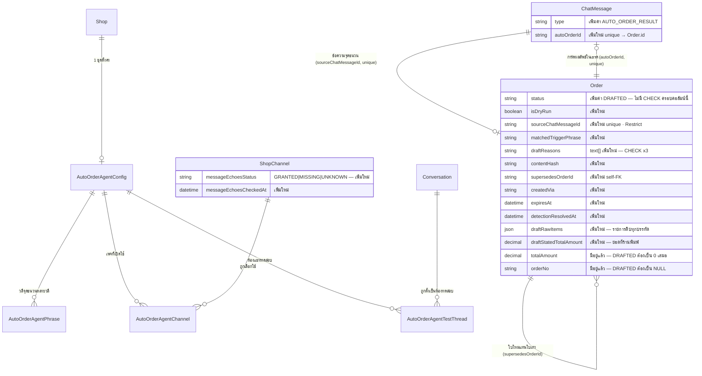

> **โมดูล:** 00061-AutoCreateOrder
> **ประเภทเอกสาร:** DATABASE Design
> **เวอร์ชัน:** 1.0
> **วันที่จัดทำ:** 2026-08-29
> **สถานะ:** Draft — รอ user review
> **เจ้าของเอกสาร:** SA (`safepay-database`)

# DATABASE: สร้างออเดอร์อัตโนมัติจากคำสั่งในแชท

> ## 🔄 มติเปลี่ยน 2026-08-30 — ยกเลิกตาราง `ChatOrderIntercept` ทั้งตาราง
>
> *"ไม่อยากให้สร้างตารางแยกแล้ว · อยากให้สร้างออเดอร์ไว้รวมกันเลย แต่เป็น drafted แทน · ง่ายกว่า"* (user)
> ⇒ **ร่าง = แถว `Order` ที่ `status='DRAFTED'`** · คอลัมน์ที่ยังจำเป็นย้ายมาเป็นคอลัมน์ของ `Order` (§3.6)
> ⇒ **ตารางตั้งค่า §3.1–§3.4 และ `ShopChannel` §3.5 ไม่เปลี่ยน** — เปลี่ยนเฉพาะที่เก็บ "ร่าง"
> ⇒ **§C (ใหม่) = ราคาที่ต้องจ่ายของการรวมโต๊ะ** — รายการจุดที่ต้องกรอง `DRAFTED` ออก พร้อมหลักฐานจริง


---

## 1. Overview

โมดูลนี้ใช้ **PostgreSQL 16 เดียวกันทั้งระบบ ผ่าน Prisma ORM** (`prisma/schema.prisma`) — ไม่มี store อื่น
**ไม่มี Prisma enum** (โปรเจกต์นี้ใช้ `String` + DB `CHECK` ตาม convention เดิมทุกโมเดล เช่น `Order.status`,
`Shop.vertical`, `AutoReplyKeyword.status`) — validate ที่ Valibot เป็นด่านแรก · `CHECK` เป็นด่านสุดท้าย
ที่พังไม่ได้แม้ validation ฝั่งแอปหลุด

**ต้นแบบที่ยกโครงมาโดยตรง:**
- **ตารางตั้งค่า 1 ชุดต่อร้าน** + วลีหลายวลี + เพจหลายเพจ + สถานะ 3 ระดับ + ห้องแชททดสอบ →
  ยกโครงจาก `AutoReplyConfig` + `AutoReplyPhrase` + `AutoReplyKeywordTestThread` (00023)
  **แต่ 1 ชุดต่อร้าน ไม่ใช่ 1 ชุดต่อกลุ่มคำ** (BR-ACO-01 — ฟีเจอร์นี้ไม่มีแนวคิด "หลายกลุ่ม")
- **ไม่มีตารางคิวงาน** (มติ 2026-08-30) — dedup ใช้ `Order.sourceChatMessageId @unique` + insert-then-catch
  (pattern ที่รีโปนี้ใช้อยู่แล้ว) · **watchdog หาเคสที่ล้มด้วยคำถาม "ข้อความที่ตรงวลีจุดชนวนแต่ยังไม่มีแถว `Order` ผูกอยู่"**
  — อ่านจาก `ChatMessage` + `Order` ที่มีอยู่แล้วทั้งคู่ **ไม่ต้องมีตารางใหม่**
- **ไม่มี snapshot ก้อน JSON ของข้อมูลลูกค้าอีกแล้ว** — ข้อมูลที่แกะได้เขียนลง **คอลัมน์จริงของ `Order`**
  (`buyerName`/`buyerContact`/`shippingAddress`) ⇒ 🛑 **หมดปัญหา "ตัวแกะ 2 ตัวให้คำตอบต่างกัน" ตั้งแต่ต้นทาง**
  เพราะฟอร์มแก้ไขอ่านจากคอลัมน์เดียวกับที่ตัวแกะเขียน · เหลือเฉพาะ `draftRawItems` สำหรับรายการสินค้าที่
  เก็บเป็น `OrderItem` ไม่ได้ (เหตุผลเต็มใน §3.6)
- **`isDryRun Boolean` เป็นมิติที่ตั้งฉากกับ `status`** ไม่ใช่ค่าเพิ่มในสถานะ → ยกโครงจาก `OrderShipment.isDryRun`
  ตรงตัว (BR-ACO-04) — **`Order` ไม่เคยมีคอลัมน์นี้มาก่อน**

**เอกสารต้นทาง:** PRD §3 / §4.3 / §6.2 / §6.3 + BRD §2 / §8 — ทุกตารางด้านล่าง trace กลับ BR-ACO-xx ได้

- **Store:** PostgreSQL 16 (Supabase-hosted) — เดียวกับทั้งระบบ
- **ORM/Migration:** Prisma Migrate (`prisma migrate deploy` รันอัตโนมัติตอน deploy — HR15)

---

## 2. ERD




---

## 3. Tables

### 3.0 ข้อตัดสิน 3 ข้อที่กระทบหลายตาราง (ตัดสินก่อน เพราะ ERD ข้างบนอ้างถึง)

**(1) `contentHash` — scope ต่อห้องแชท + หน้าต่างเวลา 2 นาที**

- **Scope = `conversationId` ไม่ใช่ `shopId`** — ปัญหาที่ BR-ACO-20a อธิบายคือ *แอดมินพิมพ์ซ้ำในห้องเดิม*
  ไม่ใช่ระหว่างห้อง · ผูกกับร้านจะกว้างเกินและไปพึ่งความบังเอิญว่าลูกค้าคนละคนมีข้อมูลต่างกัน
- 🛑 **หน้าต่างเวลา 2 นาที ต้องมี ห้าม unbounded เด็ดขาด** — ร้านขายของชุดเดิมให้ลูกค้าคนเดิมเดือนหน้า
  ด้วยข้อความหน้าตาเหมือนเดิมทุกตัวอักษร **เป็นเรื่องปกติมาก** ⇒ ถ้าไม่มีหน้าต่างเวลา ออเดอร์ที่ 2
  จะถูก "ไม่ทำอะไรเลย" อย่างเงียบ ๆ **ตลอดไป** (ใช้ตัวเลขเดียวกับเพดาน "ประมวลผลไม่สำเร็จ" ที่ ux เสนอ —
  ทั้งคู่ตอบคำถามเดียวกันว่า *"การกระทำของคนคนเดียวหนึ่งครั้งใช้เวลานานสุดกี่นาที"*)
- **บังคับที่ query ไม่ใช่ DB constraint** — `WHERE conversationId=? AND contentHash=? AND createdAt > now() - interval '2 minutes'`
  ก่อน insert · ไม่ทำ partial/time-bucketed unique index เพราะ Postgres ทำ "unique เฉพาะในหน้าต่างเวลาเลื่อนได้"
  ไม่ได้โดยธรรมชาติ **และ constraint ถาวรจะกลายเป็นบล็อกถาวรตามที่กังวลพอดี**
- **race ที่ยอมรับ:** 2 ข้อความเนื้อหาเดียวกันมาถึงในเสี้ยววินาทีเดียวกันอาจได้ 2 แถว `READING`
  — ยอมรับได้เพราะเจตนาคือ *"อนุญาตให้ซ้ำได้หลังพ้นหน้าต่าง"* ไม่ใช่ *"ห้ามซ้ำตลอดกาล"*
  แย่สุด = ได้ร่าง/ออเดอร์ซ้ำ 1 ใบ **ซึ่งเห็นและแก้ได้ทันทีจากหน้าจอ ไม่ใช่ความเสียหายเงียบ**

**(2) `supersedesOrderId` เมื่อใบก่อนหน้าเป็น "ร่าง" → ไม่ชี้อะไรเลย (`NULL`)**

กลไก "แทนที่ + ปุ่มยกเลิกใบเก่า" ทั้งชุด (คืนสต๊อก · เช็ค `CONFIRMED` · เตือน iShip) **มีความหมายเฉพาะกับ
`Order` จริงเท่านั้น** — ร่างที่ยังไม่เป็นออเดอร์ไม่มีสต๊อกที่ถูกตัด ไม่มีอะไรให้ "ยกเลิก" ในความหมายนั้น ·
ถ้าบังคับให้ชี้ไปร่างเก่าจะต้องออกแบบ UI/ปุ่มชุดที่สอง ("ทิ้งร่างเก่าแทน") ซึ่ง BRD ไม่ได้ขอ และร่างเก่ามีทางออก
ของตัวเองอยู่แล้ว (ผู้ขายกด "ทิ้งร่างนี้" หรือหมดอายุ 7 วัน)

🛑 **นิยามที่แน่นอนของ "ใบก่อนหน้า" (SRS ต้องยึดตามนี้ กันตีความสองแบบ):**
`supersedesOrderId` = `id` ของแถว `Order` **ล่าสุดในห้องเดียวกันที่ `createdVia='CHAT_AUTO_ORDER'` และ `status <> 'DRAFTED'`**
— ใบที่ยังเป็น **ร่าง** (`DRAFTED`) ระหว่างทาง **ถูกข้ามไป ไม่ใช่ตัวขวางการค้นหา**
> ตัวอย่าง: `msg1`→ออเดอร์จริง order1 · `msg2`→ตกร่าง (`DRAFTED`) · `msg3`→ออเดอร์จริง order3
> ⇒ `order3.supersedesOrderId = order1` **ไม่ใช่ใบร่างจาก `msg2`**

> 📝 **แก้ถ้อยคำ 2026-08-30 (drift จากมติพลิกเป็น `DRAFTED`)** — ย่อหน้านี้เคยอ้าง `ChatOrderIntercept`
> ซึ่งเป็นตารางที่ถูกยกเลิกไปแล้วตามกล่องมติด้านบน · กฎไม่เปลี่ยน เปลี่ยนแค่ชื่อสิ่งที่กฎชี้ไป

**(3) `chatMessageId` ใช้ `onDelete: Restrict` ไม่ใช่ `Cascade`**

🛑 **ยืนยันกับโค้ดจริงแล้วว่า `ChatMessage` ถูก hard-delete ได้จริง** — `channel-chat.service.ts:4193`
(`tx.chatMessage.delete()` ใน `cancelFailedOutboundMessage()` · มีไฟล์เทสกำกับที่
`__tests__/channel-chat-cancel-failed.test.ts`) ลบเฉพาะแถวฝั่งร้านที่ `deliveryStatus='FAILED'`
— **ซึ่งเป็นข้อความกลุ่มเดียวกับจุดเข้าที่ 1 ของฟีเจอร์นี้เป๊ะ** (ร้านพิมพ์จากกล่องแชท Deep แล้ว relay
ออกช่องทางนอกไม่สำเร็จ — เกิดได้จริง ไม่ใช่สมมติ)

**ถ้าใช้ `Cascade` จะเกิดอะไร:** ข้อความจุดชนวนที่แกะสำเร็จเป็น **ออเดอร์จริงไปแล้ว (ตัดสต๊อกแล้ว)**
แต่การส่งออกไปหาลูกค้าดันล้มเหลว (คนละเรื่องกัน — การดักจับเกิดจาก *เนื้อหา* ไม่เกี่ยวกับ *ส่งถึงลูกค้าไหม*)
แล้วร้านกดยกเลิกข้อความที่ส่งไม่สำเร็จนั้น ⇒ **ข้อความจุดชนวนหายไปเงียบ ๆ พาการ์ดผลลัพธ์ในเธรดหายตามไปด้วย
ทั้งที่แถว `Order` ยังอยู่ครบ** ⇒ ออเดอร์จริงมีอยู่แต่ **ไม่มีร่องรอยว่ามาจากไหน และไม่มีการ์ดให้กดส่งเข้าแชท**

⇒ **`onDelete: Restrict`** — Postgres บล็อกให้เอง **ไม่พึ่งวินัยโค้ด** · service layer ต้อง catch แล้วตอบ error
ที่อ่านออก (งาน SRS/dev — บันทึกเป็น cross-cutting note)
> `isDeleted` (unsend แบบ soft) **ไม่กระทบเรื่องนี้เลย** เพราะเป็น `UPDATE` ไม่ใช่ `DELETE` — FK ไม่ทำงานกับ
> soft delete และผลลัพธ์ก็ไม่ต้องอ่านค่าที่แก้ไขอยู่แล้วเพราะ `draftRawItems` เป็น snapshot

---

### 3.1 `AutoOrderAgentConfig`

ชุดตั้งค่า **1 แถวต่อ 1 ร้าน** (BR-ACO-01) — โครงยกจาก `AutoReplyConfig` แต่ตัดฟิลด์เฉพาะของ Auto-Reply/ChatBot
ออกทั้งหมด เหลือเฉพาะที่ BR-ACO-01..07 ต้องการจริง

| Column | Type | Null | Default | Key |
|--------|------|------|---------|-----|
| `id` | `text` (uuid) | NO | `uuid()` | PK |
| `shopId` | `text` | NO | — | FK → `Shop.id` `onDelete: Cascade` · **UNIQUE** (1 ร้าน 1 ชุด — บังคับที่ DB ตาม pattern `AutoReplyConfig.shopId`) |
| `status` | `text` | NO | `'OFFLINE'` | CHECK `IN ('OFFLINE','TEST','LIVE')` (BR-ACO-04) |
| `createdByUserId` | `text` | YES | `NULL` | FK → `User.id` `onDelete: SetNull` |
| `updatedByUserId` | `text` | YES | `NULL` | FK → `User.id` `onDelete: SetNull` — audit: **ใครเปิด LIVE ล่าสุด** |
| `createdAt` | `timestamptz` | NO | `now()` | — |
| `updatedAt` | `timestamptz` | NO | auto | — |

**หมายเหตุออกแบบ:**
- 🛑 **ไม่มีคอลัมน์เก็บ "แม่แบบข้อความ"** — เทมเพลตที่ UX หน้า A แสดงเป็น **ค่าคงที่ระดับระบบตาม BR-ACO-11**
  ไม่ใช่สิ่งที่ร้านแก้ได้ ⇒ เป็น constant ฝั่งโค้ด **ไม่ใช่ข้อมูลใน DB** (ถ้าวันหนึ่งร้านแก้เองได้ ค่อยเพิ่มคอลัมน์ตอนนั้น)
- **ไม่เก็บวลี/เพจเป็น array** — แยกเป็นตารางลูกเพราะต้อง join แสดงชื่อเพจ และต้องลบทิ้งอัตโนมัติเมื่อ
  `ShopChannel`/`Conversation` ถูกลบ (**array ทำ FK cascade ไม่ได้** — เหตุผลเดียวกับที่ `AutoReplyKeywordTestThread` แยกตาราง)

---

### 3.2 `AutoOrderAgentPhrase`

วลีจุดชนวนหลายวลีต่อชุดตั้งค่า (BR-ACO-01/02) — โครงยกจาก `AutoReplyPhrase` **แต่ normalize คนละฟังก์ชัน**

| Column | Type | Null | Default | Key |
|--------|------|------|---------|-----|
| `id` | `text` (uuid) | NO | `uuid()` | PK |
| `configId` | `text` | NO | — | FK → `AutoOrderAgentConfig.id` `onDelete: Cascade` |
| `phrase` | `text` | NO | — | ค่าที่ร้านพิมพ์จริง (แสดงกลับใน UI ให้แก้ไข) |
| `normalizedPhrase` | `text` | NO | — | ผ่าน `normalizeTriggerPhrase()` **ตัวใหม่** |
| `createdAt` | `timestamptz` | NO | `now()` | — |

🛑 **`normalizedPhrase` ต้องมาจากฟังก์ชันคนละตัวกับ `AutoReplyPhrase.normalizedPhrase`** (BR-ACO-01) —
ฟังก์ชันเดิมของ Auto-Reply **ลบเครื่องหมายวรรคตอนก่อนเทียบ** ซึ่งจะทำให้ `/go` กลายเป็น `go` แล้วชนกับ
คำทั่วไปโดยไม่ตั้งใจ ⇒ **SRS ต้องประกาศ `normalizeTriggerPhrase()` เป็น SSOT ใหม่** ที่ทำแค่ lowercase +
ยุบช่องว่างซ้ำ **ไม่ตัดสัญลักษณ์ใด ๆ**

**Constraints:** `@@unique([configId, normalizedPhrase])` (วลีซ้ำในชุดเดียวกันถูกปฏิเสธ) · `@@index([configId])`

---

### 3.3 `AutoOrderAgentChannel`

เพจ/ช่องทางที่เปิดใช้กับชุดตั้งค่านี้ (BR-ACO-03) — join table แทน `String[]`

| Column | Type | Null | Default | Key |
|--------|------|------|---------|-----|
| `id` | `text` (uuid) | NO | `uuid()` | PK |
| `configId` | `text` | NO | — | FK → `AutoOrderAgentConfig.id` `onDelete: Cascade` |
| `shopChannelId` | `text` | NO | — | FK → `ShopChannel.id` `onDelete: Cascade` |
| `createdAt` | `timestamptz` | NO | `now()` | — |

**Constraints:** `@@unique([configId, shopChannelId])` · `@@index([shopChannelId])`
(reverse lookup — งานตรวจสุขภาพสิทธิ์ใช้หาว่าชุดตั้งค่าไหนอ้างเพจนี้อยู่บ้างเมื่อสถานะ `message_echoes` เปลี่ยน)

#### 🛑 เคส "สถานะเป็น LIVE แต่ไม่มีเพจเหลือเลย"

**ตัดสิน: ไม่บังคับตกกลับ `OFFLINE` อัตโนมัติ — ปล่อยค่าที่เก็บไว้ตามที่ร้านตั้ง แต่ผลที่มองเห็นได้ (effective) เป็นศูนย์**

มี **บรรทัดต้นแบบอยู่แล้วในคอมเมนต์ของ `AutoReplyKeyword.status`** (00023):
> *"TEST ต้องมีอย่างน้อย 1 เธรดเสมอ ไม่งั้น TEST จะกลายเป็น OFFLINE **โดยปริยาย**"*

คำว่า "โดยปริยาย" คือ **พฤติกรรม** เท่ากับ OFFLINE โดยที่ **ค่าใน DB ไม่เปลี่ยน** — โปรเจกต์นี้เลือกวิธีนี้
มาแล้วครั้งหนึ่งกับปัญหารูปร่างเดียวกันเป๊ะ (สถานะบอกว่าทำงาน แต่เป้าหมายที่ใช้จริงเป็นศูนย์)

**เหตุผลที่ไม่ auto-flip:** ร้านถอดเพจชั่วคราวเพื่อ re-auth 5 นาที ถ้า auto-revert เป็น `OFFLINE`
**ร้านต้องจำมาเปิดคืนเอง** และมันคือ **magic write ที่ผู้ใช้ไม่ได้สั่ง**

**สิ่งที่ต้องมีแทน (งาน SRS/หน้า A ไม่ใช่ DB):** query "จำนวนเพจที่ effective" ต้อง join
`AutoOrderAgentChannel → ShopChannel WHERE status='ACTIVE'` **สด ไม่ cache** แล้วโชว์แถบเตือนที่หน้า A
เมื่อ `config.status IN ('TEST','LIVE')` และจำนวนนั้น = 0 — **ใช้ query เดียวกับที่ต้องมีอยู่แล้วสำหรับ
ตัวตรวจสุขภาพเพจ ไม่ต้องมีกลไกใหม่**

🛑 **ผลต่อ detection pipeline (สำคัญกว่าที่หน้าจอ):** **ทั้ง 2 จุดดักจับต้องพึ่ง `AutoOrderAgentChannel`
เป็นแหล่งความจริงเดียวกัน** — จุดเข้าที่ 1 (พิมพ์จากกล่องแชท Deep) **ก็ยังต้องกรอง** ว่าห้องนั้นอยู่บน
`conversation.shopChannelId` ที่อยู่ในชุด effective ด้วย **ไม่ใช่ยกเว้น** เพราะห้องแชทที่ `channel='DEEP'`
(ลูกค้าเป็นบัญชี buyer ในแอปเราเอง ไม่มี `ShopChannel` เลย) **อยู่นอกขอบเขต v1 ตรงตัวตาม PRD §5**
⇒ ไม่มีกรณีที่ต้อง "ยกเว้นไม่ต้องเลือกเพจ" เลย **ไม่ต้องมีเคสพิเศษ**

**Cascade เมื่อร้านถอดเพจ:** *ไม่เกิดอะไรกับตารางนี้* — การถอดเพจเป็น **soft** (`ShopChannel.status→'DISCONNECTED'`
แถวไม่ถูกลบ) แถวเลือกยังอยู่ครบ · เชื่อมเพจเดิมกลับมา = **กลับมา effective ทันทีโดยไม่ต้องเลือกใหม่**
· Cascade ทำงานจริงเฉพาะกรณี `ShopChannel` **hard-delete** (หายาก)

---

### 3.4 `AutoOrderAgentTestThread`

ห้องแชทที่ใช้ทดสอบ — มีผลเฉพาะตอน `status='TEST'` (BR-ACO-04/05) · โครงเดียวกับ `AutoReplyKeywordTestThread`
ต่างแค่ผูก `configId` แทน `keywordId`

| Column | Type | Null | Default | Key |
|--------|------|------|---------|-----|
| `id` | `text` (uuid) | NO | `uuid()` | PK |
| `configId` | `text` | NO | — | FK → `AutoOrderAgentConfig.id` `onDelete: Cascade` |
| `conversationId` | `text` | NO | — | FK → `Conversation.id` `onDelete: Cascade` |
| `createdAt` | `timestamptz` | NO | `now()` | — |

**Constraints:** `@@unique([configId, conversationId])` · `@@index([conversationId])`

**Cascade:** ห้องแชทถูกลบจริง (หายาก) → แถวทดสอบหายตาม · **ถอดเพจ (soft) → ไม่กระทบ** (`Conversation`
ไม่ถูกแตะจากการถอดเพจแบบ soft) ⇒ **ห้องทดสอบกลับมาใช้ได้ทันทีถ้าร้านเชื่อมเพจเดิมใหม่ โดยไม่ต้องตั้งค่าซ้ำ**

---

### 3.5 `ShopChannel` — คอลัมน์ที่เพิ่ม (additive ไม่แตะแถวเดิม)

ตัวตรวจสุขภาพสิทธิ์รับข้อความสะท้อนกลับ (BR-ACO-07/26 · AC-ACO-10/73/74) — cache แบบเดียวกับ
`lineTokenExpiresAt`/`lineTokenCheckedAt` ที่มีอยู่แล้วในโมเดลนี้ (**advisory เท่านั้น ไม่ใช่ตัวตัดสินตอนรับ webhook จริง**)

| Column | Type | Null | Default | Key |
|--------|------|------|---------|-----|
| `messageEchoesStatus` | `text` | NO | `'UNKNOWN'` | CHECK `IN ('GRANTED','MISSING','UNKNOWN')` |
| `messageEchoesCheckedAt` | `timestamptz` | YES | `NULL` | — |

**ทำไมไม่มี CHECK บังคับว่า `UNKNOWN` ต้องคู่กับ `checkedAt IS NULL`:** เป็นคนละสถานะกัน 2 แบบ
- `checkedAt IS NULL` = **ไม่เคยตรวจเลย**
- `checkedAt` มีค่าแต่ `status='UNKNOWN'` = **เคยยิงตรวจแล้วแต่ Graph ตอบไม่ชัดเจน** (network/API error)

🛑 **default ต้อง `'UNKNOWN'` ไม่ใช่ `'GRANTED'`** — เพจเก่าทุกแถวที่มีอยู่ก่อน migration นี้ต้องขึ้น "ไม่ทราบ"
ไม่ใช่ "ผ่าน" เพราะยังไม่เคยมีการตรวจจริงเกิดขึ้นเลยสักครั้ง
⇒ **ตั้ง `GRANTED` เป็น default จะทำให้เพจเก่าทั้งหมดเปิด "สร้างออเดอร์จริง" ได้ทันทีโดยไม่ผ่านด่าน AC-ACO-10 เลย
ตรงกับ Scenario 5 ของ BRD เป๊ะตัวอักษร** ("ไม่มีอะไรเกิดขึ้นเลย ไม่มี error ให้ร้านเห็น")
— **เขียนผิด default ตัวเดียว regress กฎที่ BR-ACO-07/26 เขียนไว้ทั้งหมด**

**ใช้กับ `provider IN ('MESSENGER','INSTAGRAM')` เท่านั้น** — `provider='LINE'` ไม่มีแนวคิด `message_echoes`
(BR-ACO-10) จึงเป็น `'UNKNOWN'`/`NULL` ตลอดกาลสำหรับ LINE โดย **ไม่ต้องมี CHECK แยก provider**
(ไม่มีใครอ่านค่านี้ของ LINE — pattern เดียวกับ `channelSecretEnc` ที่ "Messenger/IG เป็น NULL เสมอ" กลับด้าน)

---
---

### 3.6 `Order` — คอลัมน์ที่เพิ่มทั้งหมด (additive · nullable/default ทั้งหมด · ไม่แตะแถวเดิม)

| Column | Type | Null | Default | หมายเหตุ |
|---|---|---|---|---|
| `status` (มีอยู่แล้ว) | `text` | — | `'PENDING'` | **เพิ่มค่าใหม่ `'DRAFTED'`** — 🛑 **ไม่มี CHECK ครอบคอลัมน์นี้อยู่ก่อน และรอบนี้ไม่เพิ่ม** (เหตุผลด้านล่าง) ⇒ **`assertTransition()` คือด่านเดียวที่มีจริง** |
| `isDryRun` | `boolean` | NO | `false` | มิติตั้งฉากกับ `status` (BR-ACO-04) — **`Order` ไม่เคยมีคอลัมน์นี้มาก่อน** |
| `sourceChatMessageId` | `text` | YES | `NULL` | **UNIQUE** · FK→`ChatMessage.id` **`onDelete: Restrict`** — กันลบข้อความต้นทางทำลายผลลัพธ์เงียบ ๆ |
| `matchedTriggerPhrase` | `text` | YES | `NULL` | snapshot วลีที่ match ณ ตอนนั้น |
| `draftReasons` | `text[]` | NO | `'{}'` | CHECK ×3 (ดูล่าง) |
| `contentHash` | `varchar(64)` | YES | `NULL` | sha256 hex — กันพิมพ์ซ้ำเนื้อหาในห้องเดียวกันภายใน 2 นาที |
| `supersedesOrderId` | `text` | YES | `NULL` | **self-FK**→`Order.id` `SetNull` — **ง่ายกว่าเดิมจริง** ไม่ต้องเดินผ่านตารางกลาง |
| `createdVia` | `text` | YES | `NULL` | `NULL` = ก่อนมีคอลัมน์นี้ (**ไม่ใช่ `MANUAL`**) |
| `expiresAt` | `timestamptz` | YES | `NULL` | ตั้งเฉพาะแถวที่เคยเป็น `DRAFTED` = **เวลาที่แถวถูก insert จริง + 7 วัน** — 🛑 **อิสระจาก `createdAt`** |
| `detectionResolvedAt` | `timestamptz` | YES | `NULL` | write-once — **เวลาจริงที่ประมวลผลเสร็จ** (ปลายทางของ KPI latency) |
| `draftRawItems` | `jsonb` | YES | `NULL` | รายการสินค้าดิบ **ทุกบรรทัด** |
| `draftStatedTotalAmount` | `numeric(12,2)` | YES | `NULL` | ยอดที่ร้านพิมพ์ (ถ้ามี) — 🛑 **ไม่ใช่ `totalAmount`** |

🛑 **`totalAmount` ของแถว `DRAFTED` = `0` เสมอ · `orderNo` = `NULL` เสมอ · ไม่ตัดสต๊อก** (BR-ACO-20f)

> **ทำไม `totalAmount` ต้องเป็น `0` ไม่ใช่ยอดที่ร้านพิมพ์:** `totalAmount` เป็น `NOT NULL` มาแต่เดิม
> ⇒ แถวร่างต้องใส่ตัวเลข **ในคอลัมน์เดียวกับที่ query ยอดขายจริงอ่าน** และ **ไม่มีชั้นป้องกันที่สอง**
> (พึ่งตัวกรองของ §C 100%) · ทั้งสองทางพึ่งตัวกรองเท่ากัน **แต่ตอนพลาดต่างกันคนละโลก** —
> ใส่ยอดจริง = **ยอดขายเพี้ยนเป็นเงินจริงแบบที่ดูสมเหตุสมผล** ไม่มีอะไรสะดุดตาจนกว่าจะกระทบยอด ·
> ใส่ `0` = จำนวนเพี้ยนแต่เงินไม่เพี้ยน และ **ค่าเฉลี่ยต่อบิลที่ตกฮวบคือสัญญาณที่มองเห็นได้**
> ⇒ **เลือกค่าที่ทำให้ความผิดพลาดส่งเสียง แทนค่าที่ทำให้มันเงียบ**

**`draftRawItems` — รูปร่าง** (เก็บ *เฉพาะรายการสินค้า* — ข้อมูลลูกค้าอยู่ในคอลัมน์จริงของ `Order` แล้ว):

```jsonc
[
  { "rawName": "เสื้อยืดสีดำ",  "productId": "uuid", "name": "เสื้อยืดสีดำ", "qty": 2, "price": 250 },
  { "rawName": "กางเกงขาสั้น", "productId": null,   "name": null,          "qty": 1, "price": null }
]
```

🛑 **ทำไมต้องมีคอลัมน์นี้แทนที่จะใช้ `OrderItem`:** `OrderItem.price` เป็น **`Decimal` NOT NULL** (ยืนยันแล้ว)
⇒ รายการที่ "ไม่ระบุราคา" เก็บเป็น `OrderItem` **ไม่ได้เลย** เพราะต้องใส่ราคา ซึ่ง BR-ACO-12 ห้ามเดาเป็น ฿0
· และการแก้ `price` ให้ nullable **ไม่ใช่ทางเลือก** (คอลัมน์แกนที่ใช้คำนวณยอด/กำไร/P&L ทั้งระบบ)
⇒ เก็บ **ทุกบรรทัดในรูปดิบ** ที่นี่ (ไม่ใช่เฉพาะบรรทัดที่แปลงไม่ได้) เพราะถ้าเก็บครึ่งเดียว **ร่างจะมีข้อมูล
อยู่ 2 ที่คนละรูปแบบ แล้วหน้าจอต้องรวมสองแหล่ง** = ที่มาของบั๊กแบบ `one-value-many-entry-points`
⇒ แปลงเป็น `OrderItem` จริง **ตอนเลื่อนขั้นเป็น `PENDING` เท่านั้น**

🛑 **ผลข้างเคียงที่ต้องรู้:** แถว `DRAFTED` จะมี **`OrderItem` = 0 แถวเสมอ** ⇒ เป็น **ออเดอร์แถวแรกในระบบ
ที่ไม่มีรายการสินค้าได้ตามปกติ ไม่ใช่ edge case** (สมมติฐาน *"ออเดอร์ต้องมีรายการ ≥1"* จริงมาตลอดเพราะ
`CreateOrderSchema` บังคับ `minLength(1)`) — ดูคลาสที่ 3 ใน §C

**Relations เพิ่ม:**

```prisma
sourceChatMessage  ChatMessage? @relation("OrderSourceChatMessage", fields: [sourceChatMessageId], references: [id], onDelete: Restrict)
supersedesOrder    Order?       @relation("OrderSupersedes", fields: [supersedesOrderId], references: [id], onDelete: SetNull)
supersededByOrders Order[]      @relation("OrderSupersedes")
```

**CHECK constraints ใหม่บน `Order` — 6 ตัว** (ทุกตัว `NOT VALID` + `VALIDATE CONSTRAINT` · validate ผ่านเสมอ
เพราะ default ทำให้ทุกแถวเดิมเป็น `NULL`/`'{}'` ซึ่งไม่ละเมิดข้อใด):

1. `Order_created_via_check` — `"createdVia" IS NULL OR "createdVia" = ANY (ARRAY['MANUAL','CHAT_AUTO_ORDER','ISHIP_LINKED']::text[])`
2. `Order_cancel_reason` + `DUPLICATE_ORDER` (additive DO $$ — §3.8 เดิม ยังใช้ได้ทั้งบล็อก)
3. `Order_draft_reasons_allowlist` — `"draftReasons" <@ ARRAY[9 ค่าตาม §4.3]::text[]`
4. `Order_draft_reasons_system_exclusive` — `NOT ('PROCESSING_FAILED' = ANY("draftReasons")) OR cardinality("draftReasons") = 1`
5. `Order_draft_reasons_only_when_drafted` — `"status" = 'DRAFTED' OR cardinality("draftReasons") = 0`
6. `Order_source_chat_message_requires_via` — `"sourceChatMessageId" IS NULL OR "createdVia" = 'CHAT_AUTO_ORDER'`

🛑 **ทำไมไม่เพิ่ม CHECK ครอบทั้งคอลัมน์ `status`:** `Order` เป็นตารางที่เขียนถี่ที่สุดในระบบและ **ไม่เคยมี CHECK
บน `status` มาก่อนเลย** — การเพิ่มตอนนี้ต้องไล่แจกแจงค่าที่เคยใช้จริงข้าม 3 vertical ให้ครบ 100% ก่อน ไม่งั้น
INSERT ของ flow อื่นที่ใช้ค่าที่เราไม่รู้จัก **จะพังทันที** ⇒ **นอกขอบเขตฟีเจอร์นี้ และความเสี่ยงสูงกว่าประโยชน์**
⇒ **ด่านที่มีจริงคือ `assertTransition()` เท่านั้น — บันทึกเป็นความเสี่ยงที่ยอมรับ ไม่ใช่เงียบไว้**

**`assertTransition()` ที่ต้องเพิ่ม:** `DRAFTED → PENDING` (เลื่อนขั้น) · `DRAFTED → CANCELLED` (ทิ้งร่าง)
🛑 **`DRAFTED → CONFIRMED` ตรง ๆ ต้องถูกปฏิเสธ** (ลูกค้ายืนยันออเดอร์ที่ยังไม่ครบไม่ได้)

---

## C. 🛑 จุดที่ต้องกรอง `status='DRAFTED'` ออก — ราคาที่ต้องจ่ายของการรวมโต๊ะ

### วิธีไล่ (เปิดเผยก่อนตาราง)

**grep ครอบ:** `prisma.order.*` ทุกรูปแบบ (`findMany`/`count`/`aggregate`/`groupBy`) ใน `src/services`,
`src/lib`, `src/app/api` · deny-list pattern ที่รู้ว่าเสี่ยง (`status:{not:'CANCELLED'}` · ไม่มีตัวกรอง status เลย) ·
แพตเทิร์น `.items[0]`/`.reduce()`/`.map()` บน `order.items`

🛑 **grep ไม่ครอบ (บอกตรง ๆ):**
- **ไม่ได้ไล่ `src/app/(paces)/**` ทั้งหมด** (RSC/route ที่ query ตรงไม่ผ่าน service layer)
- **ไม่ได้ไล่ SQL ดิบ (`$queryRaw`)** — หลายไฟล์มีทั้ง Prisma query และ SQL มือ
- **ไม่ได้ไล่ `src/app/api/app/**` (Buyer App REST) อย่างเป็นระบบ**
- **ไม่ได้ไล่ export/CSV เลยแม้แต่ไฟล์เดียว**
- **ไม่ได้รัน type-check** เพื่อยืนยันว่า `.items[0]` ตัวไหนมี `?.` กันไว้แล้ว

⇒ **ตารางนี้คือ "หลักฐานว่าเสี่ยงจริง" ไม่ใช่ "รายการที่ครบสมบูรณ์"** — grep เต็มขอบเขต + audit ที่ช่วยด้วย
type-check ต้องเป็นงานของ SRS/QA **ก่อนปิด Definition of Done**

### ตารางหลักฐาน (เปิดโค้ดจริงทุกแถว)

| # | ไฟล์:บรรทัด | คลาส | รูปแบบที่พบ | ผลถ้าลืมกรอง |
|---|---|---|---|---|
| 1 | `dashboard.service.ts:266` | เงิน | `status:{not:'CANCELLED'}` ดึง `totalAmount` เข้ากราฟยอดขายหน้าแรก | จำนวนจุดบนกราฟเกินจำนวนออเดอร์จริง (ยอดเงินไม่เพี้ยนเพราะเราตัดสินใส่ `0`) |
| 2 | `dashboard.service.ts:594` | จำนวน | `groupBy(['salesChannel'])` โดนัทช่องทางขาย | โดนัทบวมผิดสัดส่วน |
| 3 | `dashboard.service.ts:648` | เงิน+จำนวน | `getProvinceSales` ดึงยอด+จังหวัดขึ้นแผนที่ | **จังหวัดที่ร้านยังไม่เคยขายจริงขึ้นแผนที่** (ที่อยู่ของร่างก็เป็นที่อยู่จริง) |
| 4 | `order.service.ts:1834` (`getShippingStageCounts`) | จำนวน | `status:{not:'CANCELLED'}` ป้อน Command Center | ไทล์ "รอเลขพัสดุ" เพี้ยน — ร่างไม่มีพัสดุจะกองรวมกับใบที่รอจริง |
| 5 | `customer.service.ts:86` (`getCustomerSummary`) | จำนวน | `status:{not:'CANCELLED'}` นับออเดอร์ต่อลูกค้า | **"เคยสั่งกับร้านนี้ N ครั้ง" นับร่างรวมด้วย** — ผู้ขายตัดสินใจผิดว่าลูกค้าซื้อซ้ำ |
| 6 | `customer-behavior.service.ts` | จำนวน | `status:{not:'CANCELLED'}` | ป้ายพฤติกรรม/ความน่าเชื่อถือของลูกค้าปนร่าง |
| 7 | `product.service.ts:486,539` (`getBestSellerProducts`) | รายการสินค้า | `orderItem.groupBy` + `order:{status:{not:'CANCELLED'}}` | ⚠️ **ปลอดภัย "โดยบังเอิญ" เท่านั้น** เพราะ `DRAFTED` ไม่มี `OrderItem` — 🛑 **ความปลอดภัยแบบนี้ไม่นับเป็น defense ต้องกรองให้ชัด** |
| 8 | `app-order.service.ts:39` | รายการสินค้า (**อาจ crash**) | `const first = o.items[0]` **ไม่มี `?.`** | 🛑 **ตรวจเป็นลำดับแรก — เป็น buyer-facing** ⇒ ถ้า query ต้นทางไม่กรอง จะ **500 หรือแย่กว่านั้น: ร่างที่มี PII ของลูกค้าหลุดไปแสดงในแอปฝั่งผู้ซื้อ** |
| 9 | `agent-performance.service.ts:428` | จำนวน | `order.count({shopId, conversationId:null})` **ไม่มีตัวกรอง status เลย** | ⚠️ **ปลอดภัยบังเอิญ** — `DRAFTED` มี `conversationId` เสมอจึงหลุดจาก query นี้เอง **ไม่ใช่เพราะตั้งใจกรอง** |
| 10 | `public-order-count.ts` (`countableOrderWhere`) | ✅ **ปลอดภัยจริง** | **allow-list** `OR:[{status:'CONFIRMED'},…]` | ไม่เสี่ยง — **เพราะเป็น allow-list ไม่ใช่ deny-list** · ยกเป็นต้นแบบว่า pattern ไหนปลอดภัยโดยธรรมชาติ |
| 11 | `order-revenue.ts` (`revenueOrderWhere` → `pnl.service.ts`) | ✅ **ปลอดภัยจริง** | allow-list เดียวกัน | **P&L ปลอดภัยอัตโนมัติ ไม่ต้องแก้** |
| 12 | `trust-score.service.ts:83` | ✅ **ปลอดภัยจริง** | `status:'CONFIRMED'` ตรง ๆ | Trust Score ไม่กระทบ |
| 13 | `badge.service.ts:361` | ❌ false positive | เป็น `prisma.auction.count` ไม่ใช่ `Order` | บันทึกไว้เตือนว่า **grep ผิวเผินหลอกได้** |

> 🛑 **บทเรียนจากแถว 7/9/10:** มี 2 จุดที่ "ปลอดภัยโดยบังเอิญ" (เพราะร่างไม่มี `OrderItem` / เพราะร่างมี
> `conversationId` เสมอ) — **ทั้งคู่จะพังทันทีที่มีใครเปลี่ยนดีไซน์เล็กน้อยโดยไม่รู้ว่ามีคนพึ่งพาความบังเอิญนี้อยู่**
> ⇒ ต้องกรองให้ชัดทั้งคู่ · ส่วนแถว 10–12 ปลอดภัย **จริง** เพราะใช้ allow-list — **นี่คือความต่างที่ต้องเข้าใจ**

### Helper + เทส `[blocker]`

```ts
// src/lib/order-visibility.ts (ใหม่) — SSOT เดียวของ "ออเดอร์นี้นับเป็นออเดอร์จริงหรือยัง"
export const excludeDraftedWhere = { status: { not: 'DRAFTED' } } as const
// ใช้ควบคู่กับตัวกรองเดิมเสมอ: where: { ...excludeDraftedWhere, status: { not: 'CANCELLED' }, … }
```

🛑 **เทสสแกนซอร์ส `[blocker]`:** สแกนทุกไฟล์ใต้ `src/services`/`src/lib`/`src/app/api` หา
`status:\s*{\s*not:\s*['"]CANCELLED['"]` **ที่ไม่มี** `excludeDraftedWhere`/`'DRAFTED'` ในบล็อก `where` เดียวกัน
(±10 บรรทัดรอบ match) — **แดงทันทีที่พบแม้จุดเดียว** · จับแถว 1–6 ได้ครบ · พิสูจน์ด้วย mutation (ลบ helper
ออกจากจุดที่แก้แล้ว → ต้องแดง)
⚠️ **ไม่ครอบแถว 8** (buyer app ไม่มี pattern `not:CANCELLED` ให้จับ) **และไม่ครอบ raw SQL** ⇒ ต้องมี **เทสตัวที่สอง**
สแกน `$queryRaw` ที่มีคำว่า `"Order"` แต่ไม่มีคำว่า `DRAFTED` (คร่ากว่า แต่ดีกว่าไม่มี)

---

## 4. Indexes — ทบทวนจากมุม "ต้นทุนต่อการเขียน 1 ออเดอร์"

**ข่าวดี: ส่วนใหญ่ reuse index เดิมได้ทันที** เพราะไม่มีหน้ารวมศูนย์แยกแล้ว (`/orders` เดิมรับบทบาท)
- `@@index([shopId, status, createdAt])` (มีอยู่แล้วตั้งแต่ 00016) **ครอบทั้ง "list `DRAFTED` ต่อร้าน" และ "นับต่อร้าน"** (leading columns ตรงกัน) ⇒ **ไม่ต้องเพิ่ม index ใหม่สำหรับ 2 use case นี้เลย**
- `@@index([conversationId])` (มีอยู่แล้ว) พอสำหรับ badge/lookup ต่อห้อง — จำนวนออเดอร์ต่อห้องแชทเล็กมากโดยธรรมชาติ

**Index ใหม่ที่จำเป็นจริง — เป็น partial ทั้งหมด** (ต้นทุนจ่ายเฉพาะแถวส่วนน้อย ไม่ใช่ทุกออเดอร์):

| Index | ประเภท | ทำไม partial ไม่ใช่ full |
|---|---|---|
| `Order_sourceChatMessageId_key` | UNIQUE (เต็ม) | **ด่าน dedup เดียวที่มีอยู่จริง ต่อรองไม่ได้** · Postgres ยอม `NULL` ซ้ำได้เอง แถวที่ไม่ใช่ของฟีเจอร์นี้ไม่ถูกนับชนกัน |
| `Order_conversationId_contentHash_partial` | partial `WHERE "createdVia"='CHAT_AUTO_ORDER'` | 🛑 **แก้จากที่เสนอเดิม — ใช้ `createdVia` ไม่ใช่ `status='DRAFTED'`** เพราะการเช็คซ้ำต้องจับ **เคสที่จบเป็น `PENDING` จริงด้วย** ⇒ ใช้ `status='DRAFTED'` จะพลาดเคสที่อันตรายกว่า (สร้างออเดอร์จริงซ้ำ) |
| `Order_supersedesOrderId_partial` | partial `WHERE "supersedesOrderId" IS NOT NULL` | ออเดอร์ 99% ไม่เคยถูกแทนที่ |
| `Order_drafted_expiry_partial` | partial `WHERE status='DRAFTED'` บน `(expiresAt)` | 🛑 **ใหม่** — reaper sweep ข้ามทุกร้าน (`WHERE status='DRAFTED' AND expiresAt<=now()`) ซึ่ง index เดิม **ไม่ครอบ** (ไม่มี `shopId` เดียวให้ query ระดับระบบ · ไม่มี `expiresAt`) |

**ตัดออกจากแผนเดิมทั้งหมด:** `(shopId,status,isDryRun,expiresAt)` · `(conversationId,status,isDryRun)` ·
`(conversationId,createdAt)` — ถูกครอบด้วย index เดิม + cardinality ที่เล็กพอ **ไม่คุ้มต้นทุนเขียนซ้ำทุกออเดอร์
100% ของร้าน** 🛑 **นี่คือความต่างสำคัญจากตอนที่ยังเป็นตารางแยก** (ตอนนั้น index อยู่บนตารางเล็กที่ไม่มีต้นทุน
ต่อออเดอร์ปกติเลย)

---

## 5. Migration Plan

| ลำดับ | การเปลี่ยนแปลง | หมายเหตุ |
|---|---|---|
| 1 | เพิ่ม 12 คอลัมน์บน `Order` — nullable/default คงที่ทั้งหมด | **metadata-only ทันที** (Postgres 11+ `ADD COLUMN` ไม่ rewrite ตารางเมื่อ default เป็นค่าคงที่/NULL) |
| 2 | เพิ่ม `ChatMessage.autoOrderResultId` (`text?`) + UNIQUE | 🛑 ดูคำเตือนล่าง |
| 3 | CHECK 6 ตัวบน `Order` — `NOT VALID` ก่อน แยกทีละ statement | metadata-only (ไม่ scan ตอนเพิ่ม) |
| 4 | `VALIDATE CONSTRAINT` ทีละตัว (6 รอบ) | 🛑 ดูคำเตือนล่าง |
| 5 | `Order_cancel_reason` additive — เพิ่ม **`DUPLICATE_ORDER` + `DRAFT_EXPIRED` พร้อมกันในบล็อกเดียว** | รวมเป็น 1 migration แทน 2 รอบ **ลดความเสี่ยงชนกัน** |
| 6 | 3 partial index — `CREATE INDEX CONCURRENTLY` | 🛑 **Prisma ห่อ migration ในทรานแซกชันโดย default** ⇒ ต้อง **แก้ไฟล์ migration ด้วยมือ** ให้ statement เหล่านี้อยู่นอกทรานแซกชัน (`CONCURRENTLY` ใช้ในทรานแซกชันไม่ได้เลย — Postgres error ตรง ๆ ถ้าฝืน) |

🛑 **เวลา/lock ของขั้นตอน 4 — ตอบตรง ไม่เดาให้ดูแม่นเกินจริง:**
`VALIDATE CONSTRAINT` ใช้ **`SHARE UPDATE EXCLUSIVE` เท่านั้น** ⇒ **ไม่ block SELECT/INSERT/UPDATE/DELETE ปกติ**
บล็อกแค่ DDL อื่นที่แย่ง lock ระดับเดียวกัน (migration อื่นที่รันพร้อมกัน)
**agent นี้ไม่มีสิทธิ์ query prod (HR14)** ⇒ ประเมินคร่าว ๆ จากอายุแพลตฟอร์ม (deploy แรก 2026-06-07) ว่าน่าจะอยู่
หลักหมื่นถึงหลักแสนแถว ซึ่ง validate ได้ในหลักวินาที — **แต่นี่คือการประมาณ ไม่ใช่ตัวเลขที่วัดจริง**
⇒ **SRS/dev ต้องรัน `SELECT count(*) FROM "Order"` บน prod (read-only ผ่าน Supabase PAT) ก่อน apply จริง**

🛑 **ขั้นตอน 2 เสี่ยงคนละแบบ — `ChatMessage` คือตารางที่ *ใหญ่ที่สุด* ในระบบ** (ไม่ใช่แค่เขียนถี่เหมือน `Order`
แต่ปริมาณสะสมมากกว่าด้วย) แม้ทุกแถวเป็น `NULL` (ไม่มีการชนกัน) **การสร้าง unique index ยังต้องสแกนทั้งตารางเพื่อ
สร้างโครง B-tree** ⇒ แนะนำให้รันแยก step และพิจารณา `CREATE UNIQUE INDEX CONCURRENTLY`

**Rollback:** คอลัมน์ใหม่ `DROP COLUMN` ปลอดภัยเสมอ · `Order_cancel_reason` ยังมีข้อจำกัดเดิม (backfill ก่อนถอด
CHECK ถ้ามีแถวใช้ค่านั้นแล้ว) — ✅ **ไม่มีความเสี่ยง rollback ใหม่จากการยุบตาราง** เพราะไม่มีตารางให้ DROP อีกต่อไป

**ผลกระทบเพิ่ม 1 จุดที่ต้องพูดตรง ๆ:** `Order` มี **service หลายสิบตัวอ่าน/เขียนพร้อมกันตลอดเวลา** (ต่างจากตอน
มีตารางแยกซึ่งไม่มีใครอื่นแตะเลย) ⇒ **หน้าต่างเวลาที่เสี่ยงชนกับ migration อื่นที่แตะ `Order` สูงกว่าเดิม**
ต้องเช็ค branch อื่นที่กำลังแก้ schema ของ `Order` ก่อน merge (HR17 — เคยชนกันมาแล้วจริงกับ `cancelReason` CHECK)

---

## 6. Retention / ข้อควรระวัง — 🛑 เขียนใหม่ทั้งข้อ

### ตัดสิน: ร่างหมดอายุ 7 วัน → `status='CANCELLED'` + `cancelReason='DRAFT_EXPIRED'` **ไม่ลบแถวจริง**

**ทำไม hard-delete ไม่ปลอดภัย:** `Order` มี FK fan-in จากหลายตาราง (`OrderItem` · `OrderEvent` audit log ·
`OrderPayment` · `OrderReturn` · `ShipmentTracking` …) การลบแถวจริงต้อง cascade ทำลายทุกแถวลูก **รวม audit trail
ที่ระบบนี้ไม่เคยยอมให้หายที่ไหนเลย** — 🛑 **ทั้งระบบไม่มีจุดไหนที่ `Order` ถูก `DELETE` จริง ยกเลิกทุกที่ทำผ่าน
`status='CANCELLED'` เสมอ** ⇒ hard-delete ของฟีเจอร์นี้จะเป็น **ข้อยกเว้นเดียวในทั้งระบบ** ที่ทำลายแถว `Order` ถาวร
· **UPDATE-not-DELETE ตัดปัญหา FK cascade ทั้งชุดทิ้งไปเลย** (ไม่ต้องพิสูจน์ว่าทุกตารางลูก cascade ถูก)

**"ปนกับออเดอร์ที่ถูกยกเลิกจริงในสถิติไหม" — ปนได้จริง ไม่ปฏิเสธ แต่มีกลไกรองรับอยู่แล้ว:**
`isRateExcludedCancellation()` (`lib/order-stats.ts`) ที่ `cancel-reasons.ts` อธิบายตัวเองไว้ว่า *"เหตุผลที่เลือก
ไม่มีอำนาจตัดสินตัวเลข อัตราความสำเร็จตัดจาก **เส้นทางที่ถูกใช้** ไม่ใช่จากคำที่เลือก"*
⇒ **`DRAFT_EXPIRED` ต้องถูกเพิ่มในลิสต์ยกเว้นของฟังก์ชันนั้น** (เหมือนที่ `PARCEL_RETURNED` ทำไปแล้ว)
— **pattern เดิมของระบบ ไม่ใช่กลไกใหม่ที่ต้องประดิษฐ์**

🛑 **ทำไมใช้ `CANCELLED` (ค่าเดิม) แทนการสร้างสถานะใหม่เช่น `'EXPIRED'` — เหตุผลจากหลักฐานตรงใน §C:**
มีอย่างน้อย **6 จุดที่เขียน `status:{not:'CANCELLED'}` (deny-list) อยู่แล้ว** ⇒ **ถ้าใช้สถานะใหม่ ทุกจุดเหล่านั้น
จะยังนับร่างที่หมดอายุเป็น "ยังไม่ยกเลิก" ต่อไป** (เพราะไม่ใช่ `CANCELLED`) ต้องไล่แก้ซ้ำอีกรอบ
**ในขณะที่การใช้ `CANCELLED` ได้การกรองฟรีทันทีจากจุดเหล่านั้น** ⇒ ความเสี่ยงที่เหลือแคบลงเหลือแค่จุดที่
แยกแยะ **ตาม `cancelReason`** (Trust Score / success-rate) ซึ่งมีกลไกรองรับอยู่แล้ว

**`DRAFT_EXPIRED` — 4 อย่างที่ต้องทำ:**
1. CHECK additive (รวม migration เดียวกับ `DUPLICATE_ORDER`)
2. 🛑 **ไม่เพิ่มเข้า `CANCEL_REASONS_BY_VERTICAL`** — **คนละเหตุผลกับ `DUPLICATE_ORDER`**: ตัวนี้ **ระบบ (reaper) ตั้งเองล้วน ๆ ไม่มีมนุษย์เลือกจาก dropdown เลย** ⇒ เขียนผ่านฟังก์ชันภายในของ reaper โดยตรง **ไม่ผ่าน `cancelOrder()`** (pattern เดียวกับที่ draft-write ไม่ผ่าน `createOrder()`)
3. 🛑 **ไม่เพิ่มเข้า `BUYER_FAULT_CANCEL_REASONS`** + คอมเมนต์ "จงใจไม่อยู่ในนี้ — ร่างหมดอายุเป็นเหตุจากระบบ ไม่ใช่ลูกค้า"
4. `isRateExcludedCancellation()` ต้องยกเว้นค่านี้ + เทส `[blocker]` ยืนยันทั้ง 2 exclusion

`cancelInitiator = NULL` (ระบบเป็นคนทำ — ตรง convention เดิมของ `Order` ที่ "`null` = ระบบเสมอ" **ไม่ต้องเพิ่ม enum ค่าที่ 3**)

> **"ทิ้งร่างนี้" (ผู้ขายกดเอง) ควรเดินเส้นทางเดียวกัน (`CANCELLED` ไม่ใช่ `DELETE`) ด้วยเหตุผล FK เดียวกัน
> — แต่ `cancelReason` ที่ใช้ยังเป็น open question** (ไม่ใช่ `DRAFT_EXPIRED` เพราะนั่นแปลว่า "ระบบหมดอายุ"
> คนละเหตุการณ์กับ "ผู้ขายกดทิ้งเอง") ⇒ SRS ตัดสิน

🛑 **doc-debt ที่ต้องเปิดเผย:** **BRD AC-ACO-68 เขียนว่า "แถวหายจากฐานข้อมูลจริง (ไม่ใช่แค่เปลี่ยนสถานะ)"
ซึ่งขัดกับมตินี้ตรง ๆ** — ต้องแก้ก่อนปิดงาน

**Performance เปลี่ยนทิศ:** จากเดิมกังวลว่าตารางแยกจะโตเร็ว **ตอนนี้กังวลตรงข้าม — แถวที่ค้างเป็น
`CANCELLED(DRAFT_EXPIRED)` จะสะสมใน `Order` ไม่มีวันหาย** (ต่างจากตอนลบทิ้งได้) · ยอมรับได้เพราะปริมาณเล็ก

---

## 7. Traceability

| Column group | BR-ACO |
|---|---|
| `status='DRAFTED'` / `isDryRun` / `draftReasons` | BR-ACO-04/19/20 |
| `sourceChatMessageId` / `contentHash` | BR-ACO-09/20a |
| `supersedesOrderId` | BR-ACO-20a/20b |
| `createdVia` | BR-ACO-18 |
| `expiresAt` / `cancelReason='DRAFT_EXPIRED'` | BR-ACO-23 (🛑 ขัดกับ AC-ACO-68 เดิม — ต้องแก้ BRD) |
| `draftRawItems` / `draftStatedTotalAmount` | BR-ACO-12/17 · §4.3 |
| `ChatMessage.autoOrderResultId` / `type` | BR-ACO-21/21a |
| §C helper `excludeDraftedWhere` | BR-ACO-20e |

---

## 8. สรุป + ความเสี่ยงที่ยอมรับ

หลังกลับมติ Q9 เอกสารนี้เปลี่ยนจาก "ตารางคิวแยก" เป็น **"ร่าง = `Order.status='DRAFTED'` ในตารางเดิม"**
— **ง่ายขึ้นจริงในแง่จำนวนตาราง** (ลบ 1 ตาราง + ตัด FK ทางอ้อมทั้งชุด) **แต่ย้ายความเสี่ยงจาก "ออกแบบตารางใหม่
ให้ถูก" ไปเป็น "อย่าให้ร่างปนกับของจริงในตารางที่ทั้งระบบพึ่งพา"** — **§C คือคำตอบของความเสี่ยงฝั่งหลัง**
ตารางตั้งค่า 4 ตัว (§3.1–3.4) ไม่กระทบจากมตินี้เลย

| ความเสี่ยงที่ยอมรับ | เหตุผล | **ด่านที่มีจริง** |
|---|---|---|
| **`Order.status` ไม่มี CHECK คุ้มครอง `DRAFTED`** | เพิ่ม CHECK ครอบทั้งคอลัมน์ตอนนี้เสี่ยงกว่าประโยชน์ (ต้อง enumerate ค่าทุก vertical ที่ไม่เคยมีใครทำ) | 🛑 **`assertTransition()` + เทสของมันเป็นด่านเดียว** — ถ้าเทสไม่ครอบ `DRAFTED→CONFIRMED` (ต้องห้าม) **จะไม่มีอะไรจับได้เลยจนเกิดจริงบน prod** |
| **`totalAmount=0` อยู่คอลัมน์เดียวกับยอดขายจริง** | แยกชนิดข้อมูลจากคอลัมน์นี้เองไม่ได้ (เลือก `0` เพื่อให้ error ส่งเสียงเป็นจำนวนที่ผิดปกติ ไม่ใช่ยอดเงินที่ดูสมเหตุสมผล) | **ตัวกรอง `excludeDraftedWhere` ที่ทุก query ต้องเรียก 100%** — เทสครอบได้แค่ deny-list pattern ที่รู้จัก **ไม่ครอบ raw SQL/route ที่ query ตรง** |
| **`OrderItem`=0 แถวเป็นไปได้จริงครั้งแรกในระบบ** | ทางเลือกอื่น (ทำ `price` nullable) blast radius ทั้งระบบการเงิน | **ไม่มีด่านอัตโนมัติ** — ต้องไล่โค้ดที่ crash ได้ (`app-order.service.ts:39` **buyer-facing แก้ก่อนอันดับแรก**) |
| **ยังไม่วัดเวลา VALIDATE/index กับ prod จริง** | agent ไม่มีสิทธิ์ query prod (HR14) | SRS/dev ต้อง `SELECT count(*)` ผ่าน read-only PAT ก่อน apply |
| **BRD AC-ACO-68 ขัดกับสถาปัตยกรรมนี้** | doc drift จากการกลับมติกลางทาง — เกิดได้ปกติ | ต้องแก้ BRD ก่อนปิด DoD (HR11) |

**Open Questions:** `cancelReason` ของปุ่ม "ทิ้งร่างนี้" (manual discard) · วิธี "ลองอ่านข้อความนี้อีกครั้ง"
บนโครง `Order` (ไม่มี `attempts`/`lockedAt` แล้วตามมติ user) · ตัวเลข timing ที่ต้องยืนยันกับ prod

