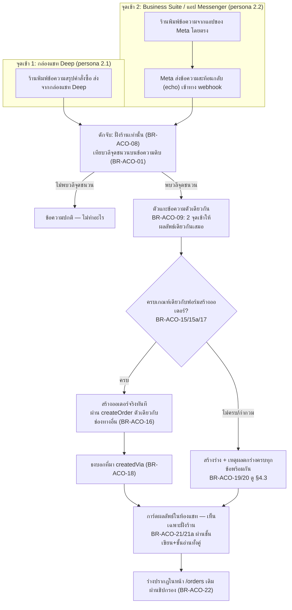
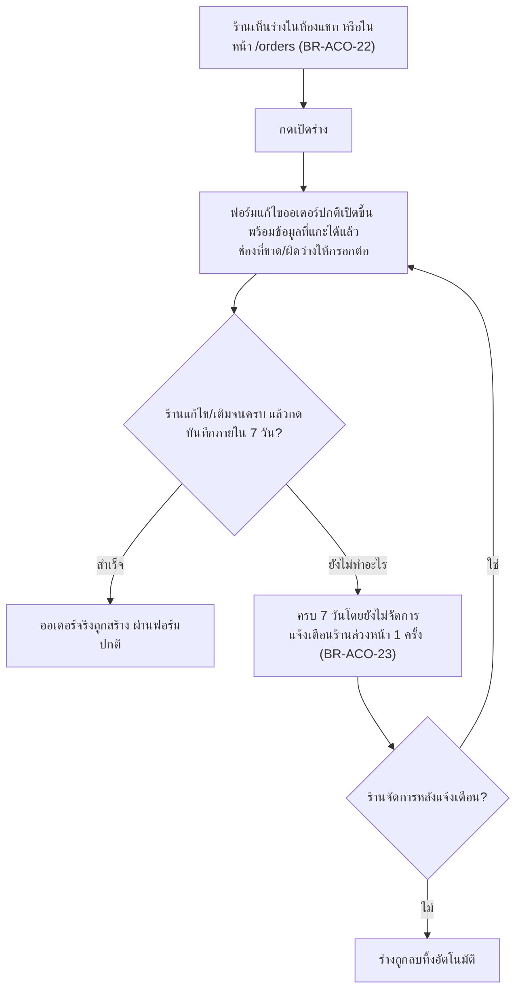

> **โมดูล:** 00061-AutoCreateOrder
> **ประเภทเอกสาร:** Product Requirements Document (PRD)
> **เวอร์ชัน:** 1.0
> **วันที่จัดทำ:** 2026-08-29
> **สถานะ:** Draft — รอ user review
> **เจ้าของเอกสาร:** BA + PO + PM

# PRD: สร้างออเดอร์อัตโนมัติจากคำสั่งในแชท (Auto Create Order from Chat Keyword)

> ## 🔄 มติเปลี่ยน 2026-08-30 — ร่างเป็น `Order.status='DRAFTED'` ไม่ใช่ตารางแยก
>
> **เดิม (Q9 ตอน grilling):** ร่างเก็บในตารางใหม่แยกต่างหาก · มีหน้ารวมศูนย์ของตัวเอง
> **ใหม่ (user 2026-08-30):** *"ไม่อยากให้สร้างตารางแยกแล้ว · อยากให้สร้างออเดอร์ไว้รวมกันเลย แต่เป็น drafted แทน · ง่ายกว่า"*
>
> ⇒ **ร่าง = แถว `Order` ที่ `status='DRAFTED'` อยู่ในหน้า `/orders` เดิม** · ไม่มีตารางใหม่ · ไม่มีหน้ารวมศูนย์แยก
> ⇒ **สิ่งที่หายไป:** หน้ารวมศูนย์ (UX หน้า C) · ปุ่ม "เปิดฟอร์มที่กรอกไว้ให้แล้ว" (ใช้ฟอร์มแก้ไขออเดอร์ปกติแทน)
> ⇒ **สิ่งที่เพิ่มมา:** BR-ACO-20d/20e/20f (§3.3) — ราคาที่ต้องจ่ายของการรวมโต๊ะ

---

## Executive Summary

ทุกวันนี้ผู้ขาย/แอดมินพิมพ์ "สรุปคำสั่งซื้อ" ให้ลูกค้าอ่านในห้องแชท (Messenger/Instagram/LINE) อยู่แล้ว
เป็นขั้นตอนทำงานปกติของการปิดการขาย — แต่หลังพิมพ์เสร็จ ต้องมากดสร้างออเดอร์ในระบบซ้ำอีกรอบด้วยมือ
ระบบมีปุ่ม **"สร้างออเดอร์จากข้อความนี้"** อยู่แล้ว (กดค้าง/hover บนบับเบิลข้อความ → เปิดฟอร์มพร้อม
ชื่อ/เบอร์/ที่อยู่ที่แกะให้ล่วงหน้า) แต่ **ยังต้องกด และรายการสินค้ายังต้องพิมพ์ซ้ำเองในฟอร์ม**
เพราะตัวแกะข้อความเดิม (`parseOrderMessage`) แกะได้แค่บล็อกข้อมูลลูกค้า ไม่แกะรายการสินค้าเลย

**เดลต้าที่ฟีเจอร์นี้เพิ่ม มี 2 อย่างเท่านั้น: (1) ไม่ต้องกดปุ่มอีกต่อไป — ระบบดักข้อความที่มี
"วลีจุดชนวน" (เช่น "สรุปคำสั่งซื้อ") ที่ฝั่งร้านพิมพ์เองแล้วประมวลผลให้ทันที และ (2) แกะรายการสินค้า
ได้ด้วย — จับคู่กับสินค้าที่มีอยู่ในร้าน คำนวณยอด ตัดสต๊อก** เมื่อข้อความครบถ้วนตามเกณฑ์เดียวกับที่
ฟอร์มสร้างออเดอร์บังคับอยู่แล้ว ระบบสร้าง **ออเดอร์จริง** ให้ทันที — ถ้าไม่ครบหรือมีสิ่งที่ตัดสินใจแทน
ไม่ได้ ระบบเก็บเป็น **ร่าง** ที่กดเปิดฟอร์มพร้อมข้อมูลที่แกะได้แล้วต่อได้ในคลิกเดียว ไม่มีกรณีใดที่
ระบบ "เดา" แล้วสร้างออเดอร์ผิดเงียบ ๆ

ขอบเขตรอบแรก (v1) ครอบคลุมร้านประเภท **ขายออนไลน์เท่านั้น** ผ่านช่องทาง **Messenger, Instagram,
LINE** และ **ไม่ส่งอะไรหาลูกค้าอัตโนมัติ** — ผู้ขายยังเป็นคนกดส่งสรุปออเดอร์ให้ลูกค้าเองผ่านปุ่ม
"ส่งเข้าแชท" ที่มีอยู่แล้ว รอบนี้ตัดปัญหาเรื่องหน้าต่างเวลา 24 ชั่วโมงของ Meta ออกทั้งก้อน เพื่อให้ของ
ที่ปลอดภัยที่สุด (แกะให้ ไม่ส่งเอง) ขึ้นก่อน แล้วค่อยต่อยอดเป็นระบบถามยืนยันอัตโนมัติในเฟสถัดไป (P2)

---

## 1. Business Goals & KPIs

### 1.1 เป้าหมายทางธุรกิจ

| เป้าหมาย | รายละเอียด |
|----------|-----------|
| **ตัดขั้นตอนซ้ำออกจากงานที่ทำอยู่แล้ว** | ร้านพิมพ์สรุปคำสั่งซื้อให้ลูกค้าอ่านอยู่แล้วทุกวัน — ระบบใช้ข้อความเดียวกันนั้นสร้างออเดอร์ให้เลย โดยไม่เพิ่มขั้นตอนใหม่ให้ร้านต้องเรียนรู้ |
| **ลดความผิดพลาดจากการคีย์ซ้ำ** | ทุกครั้งที่ร้านพิมพ์รายการสินค้า+ราคาในแชท แล้วมาคีย์ซ้ำในฟอร์ม คือจุดที่พิมพ์ผิด/ลืมบรรทัดได้ — ให้ระบบอ่านจากข้อความต้นทางเดียวกันแทน |
| **ทำให้ประวัติออเดอร์สะท้อนเวลาจริงที่ลูกค้าสั่ง** | ออเดอร์ที่คีย์ตามหลังหลายชั่วโมง/วัน มักถูกบันทึกด้วยเวลาที่คีย์ ไม่ใช่เวลาที่ลูกค้าสั่งจริง — ฟีเจอร์นี้ใช้เวลาของข้อความเป็นวันที่สั่งซื้อเสมอ (สอดคล้องกับกลไกเดิมของปุ่ม "สร้างออเดอร์จากข้อความนี้" ที่ทำแบบนี้อยู่แล้ว) |
| **ไม่เพิ่มความเสี่ยงใหม่ให้ระบบสต๊อก/ยอดขาย** | ทุกออเดอร์ที่เกิดจากฟีเจอร์นี้เดินเส้นทาง `createOrder()` เดียวกับออเดอร์ที่คนกดสร้างเอง — ตัดสต๊อกปกติ คำนวณ VAT/discount ปกติ ไม่มีสวิตช์ลัดที่ทำให้ตัวเลขรวมของร้านตอบคำถามไม่ได้อีกต่อไป |
| **ไม่สร้างความเสี่ยงต่อแคตตาล็อกสินค้า** | ต้องไม่มีเส้นทางใดที่พิมพ์ชื่อสินค้าผิดในแชทแล้วเกิดสินค้าใหม่ในร้านโดยไม่มีใครสั่ง (Quick-Create เดิมของ `createOrder` ทำแบบนี้ได้ — ฟีเจอร์นี้ต้องปิดช่องนี้ด้วยการส่ง productId ที่จับคู่แล้วเสมอ) |

### 1.2 ตัวชี้วัดความสำเร็จ (KPIs)

| KPI | คำอธิบาย | เป้าหมาย |
|-----|----------|---------|
| **อัตราแปลงข้อความเป็นออเดอร์จริงทันที** | (จำนวนข้อความจุดชนวนที่จบด้วยสถานะ CREATED ÷ จำนวนข้อความจุดชนวนทั้งหมดในช่วงเวลา) × 100 — ดึงจากสถานะของแถวดักจับ | ≥ 50% ในร้านที่เปิดสถานะ LIVE — ปรับเป้าหลังมีข้อมูลจริง 30 วัน เพราะขึ้นกับวินัยการพิมพ์ตามเทมเพลตของแต่ละร้าน |
| **อัตรากู้ร่างเป็นออเดอร์จริง** | (ร่างที่ถูกเปิดฟอร์มแล้วบันทึกสำเร็จ ÷ ร่างทั้งหมดที่ไม่หมดอายุ) × 100 — ดึงจาก `Order.status` (`DRAFTED`→`PENDING` เทียบกับ `DRAFTED`→`CANCELLED` ที่ `cancelReason='DRAFT_EXPIRED'` **บวกกับค่าของปุ่ม "ทิ้งร่างนี้" ซึ่งยังเป็น open question** — ดู `DATABASE.md` §6) | ≥ 60% — วัดว่า "แกะให้บางส่วน" มีค่าจริงแม้ไม่ครบ ไม่ใช่ต้องครบ 100% ถึงมีประโยชน์ |
| **เวลาตั้งแต่ข้อความถึงผลลัพธ์** | มัธยฐานของ (เวลาที่แถวดักจับเปลี่ยนจาก READING เป็น CREATED/DRAFT − เวลาที่ข้อความถูกส่ง) — ต้องมี timestamp ของทั้ง 2 จุดบนแถวดักจับ | ≤ 5 วินาที |
| **สาเหตุที่ตกร่างบ่อยที่สุด** | นับความถี่ของแต่ละค่าในชุดเหตุผลที่ตกร่าง (D-26) ต่อร้าน/ต่อรวมทั้งระบบ — ดึงตรงจากคอลัมน์เหตุผลที่เก็บเป็นรายการค่าคงที่ | ไม่มีเป้าหมายตายตัว — ใช้เป็นสัญญาณตัดสินใจว่าจุดไหนควรอัปเกรดตัวแกะในเฟสถัดไป (ตอบโจทย์ P2/AI) |
| **ออเดอร์ที่ถูกสร้างผิด (เดาแล้วผิด)** | **วัดอัตโนมัติแบบแม่นยำไม่ได้ในตอนนี้ — ต้องใช้การรายงานจากผู้ขายเป็นหลัก** เหตุผล: การยกเลิก/แก้ไขออเดอร์เกิดขึ้นได้ปกติจากสาเหตุที่ไม่เกี่ยวกับความผิดของระบบเลย (ลูกค้าเปลี่ยนใจ เปลี่ยนไซซ์ เพิ่มของ) — ถ้านับจากอัตรายกเลิก/แก้ไขของออเดอร์ที่ `createdVia` ชี้มาจากฟีเจอร์นี้ตรง ๆ จะปนเคสปกติเข้ามาจนตัวเลขไม่มีความหมาย ยังไม่มีคอลัมน์ใดในระบบที่แยก "เหตุผลการยกเลิก" ออกเป็น "ระบบแกะข้อมูลผิด" กับ "ลูกค้าเปลี่ยนใจ" ได้ | ใช้ **อัตรายกเลิก/แก้ไขของออเดอร์ที่ `createdVia` มาจากฟีเจอร์นี้ ภายใน 24 ชั่วโมงแรก** เป็น **สัญญาณเฝ้าระวัง (proxy สำหรับ triage)** เท่านั้น — ไม่ใช่ตัวชี้วัดที่ตัดสินความสำเร็จ/ล้มเหลวได้ในตัวเอง ตัวชี้วัดจริงของ "เดาแล้วผิด" คือ **จำนวนครั้งที่ผู้ขายรายงานเข้าช่องทางสนับสนุนว่าออเดอร์จากฟีเจอร์นี้มีข้อมูลผิดจากที่ตั้งใจสั่งจริง** เป้า **0 รายงาน** ใน 30 วันแรกหลังเปิดใช้ |
| **อัตราการใช้งานของร้าน** | ร้าน ONLINE_SALES ที่เชื่อมช่องทางอย่างน้อย 1 ช่อง และตั้งสถานะ LIVE พร้อมวลีอย่างน้อย 1 วลี — ดึงจากตารางตั้งค่าของฟีเจอร์นี้ | ≥ 30% ของร้าน ONLINE_SALES ที่มีออเดอร์เกิน 5 ใบ/เดือน ภายใน 60 วันหลังเปิดใช้ |

> **ข้อกำหนด (ไม่ใช่แค่หมายเหตุ):** แถวดักจับต้องเก็บ **เวลาที่เข้าแต่ละสถานะแยกกัน** (อย่างน้อยเวลาที่เริ่มดักจับ/READING
> และเวลาที่จบด้วยผลลัพธ์สุดท้าย) ไม่ใช่แค่ "สถานะปัจจุบัน" เฉย ๆ — ถ้าเก็บแค่สถานะปัจจุบันโดยไม่มี timestamp ของการ
> เปลี่ยนสถานะ KPI ความเร็ว (แถวข้างต้น) จะคำนวณย้อนหลังไม่ได้เลย และจะไม่มีใครรู้ตัวจนกว่าจะถึงวันที่ต้องรายงานจริง

> **หมายเหตุเรื่องการวัด:** ทุก KPI คำนวณได้จากคอลัมน์ที่ฟีเจอร์นี้เขียนเอง (สถานะของแถวดักจับ,
> เหตุผลที่ตกร่าง, `Order.createdVia`, เวลาที่แถวเปลี่ยนสถานะ) — ไม่ต้องต่อเครื่องมือวิเคราะห์ภายนอก
> และไม่ต้องเดาจาก log. **KPI ตัวไหนที่ต้องมี timestamp เพิ่มเติมนอกเหนือจาก D-22/D-26 (เช่น
> เวลาที่เข้าสถานะ READING แยกจากเวลาที่จบ) ต้องระบุเป็นข้อกำหนดของแถวดักจับใน SRS ให้ชัด — ไม่ใช่แค่
> "สถานะปัจจุบัน" แต่ต้องมี "เวลาที่เข้าแต่ละสถานะ" เก็บไว้ด้วย ไม่งั้นวัด KPI ความเร็ว (แถวที่ 3)
> ไม่ได้จริง**

---

## 2. User Personas (กลุ่มผู้ใช้งาน)

### 2.1 เจ้าของร้าน/แอดมินที่พิมพ์สรุปออเดอร์ในกล่องแชท Deep (Primary)

**ข้อมูลพื้นฐาน:**
- ปิดการขายในห้องแชทของกล่องแชท Deep เป็นหลัก
- มีรูปแบบข้อความสรุปที่พิมพ์ซ้ำ ๆ ทุกวันอยู่แล้ว (ชื่อ/เบอร์/ที่อยู่/รายการ) แม้จะไม่รู้ตัวว่ามัน "เป็นเทมเพลต"

**เป้าหมาย:**
- ไม่อยากพิมพ์ข้อมูลเดิมสองรอบ (ในแชท แล้วอีกรอบในฟอร์ม)
- อยากให้ออเดอร์ที่เกิดขึ้นตรงกับสิ่งที่ตัวเองพิมพ์เป๊ะ ไม่ใช่ระบบไปเดาเอง

**ความต้องการ:**
- ตั้งค่าครั้งเดียว (วลีจุดชนวน + เพจที่ใช้) แล้วระบบทำงานเองทุกครั้งที่พิมพ์ตามแบบเดิม
- เห็นได้ทันทีว่าข้อความไหนกลายเป็นออเดอร์ ข้อความไหนยังไม่ครบต้องเติม

**จุดปวด (Pain Points):**
- พิมพ์รายการสินค้ายาว ๆ ในแชท แล้วต้องมานั่งพิมพ์ซ้ำในฟอร์มสร้างออเดอร์
- ลืมกดปุ่ม "สร้างออเดอร์จากข้อความนี้" ทั้งที่พิมพ์สรุปไปแล้ว ทำให้ออเดอร์ตกหล่น
- คีย์ยอดรวมผิดจากที่คุยกับลูกค้าไว้ ทำให้ยอดที่ระบบคิดกับยอดที่ลูกค้าโอนไม่ตรงกัน

### 2.2 แอดมิน/พนักงานที่ตอบแชทจากแอป Facebook Business Suite / Messenger โดยตรง (Secondary)

**ข้อมูลพื้นฐาน:**
- ไม่ได้เปิดกล่องแชท Deep ตลอดเวลา — บางช่วงสลับไปตอบจากแอป Messenger บนมือถือ หรือ Business Suite บนคอม
- ไม่รู้ว่ามีระบบดักข้อความอยู่เบื้องหลัง (ไม่ต้องรู้ก็ได้ — ฟีเจอร์นี้ต้องทำงานได้เหมือนกันไม่ว่าพิมพ์จากที่ไหน สำหรับ Messenger/IG)

**เป้าหมาย:**
- พิมพ์สรุปออเดอร์แบบเดิมที่คุ้นเคย ไม่ต้องเปลี่ยนพฤติกรรมไปเปิดแอปอื่น

**ความต้องการ:**
- ข้อความที่พิมพ์จาก Business Suite ต้องถูกดักและประมวลผลเหมือนพิมพ์จากกล่องแชท Deep (สำหรับ Messenger/Instagram)
- กลับมาเปิดกล่องแชท Deep แล้วต้องเห็นผลลัพธ์ (ออเดอร์/ร่าง) รอไว้อยู่แล้ว ไม่ต้องทำอะไรซ้ำ

**จุดปวด (Pain Points):**
- ทำงานคนละแอปกับที่ระบบ Deep มองเห็น กลัวว่าสิ่งที่พิมพ์ไปจะ "ไม่นับ"
- ไม่รู้ว่าเพจที่ตัวเองดูแลอยู่ เปิดใช้ฟีเจอร์นี้ไว้หรือเปล่า

### 2.3 ลูกค้าปลายทาง (ผู้รับผลลัพธ์)

**ข้อมูลพื้นฐาน:**
- คนทั่วไปที่คุยกับร้านผ่าน Messenger/Instagram/LINE จนตกลงซื้อ
- ไม่รู้และไม่จำเป็นต้องรู้ว่ามีระบบอัตโนมัติทำงานอยู่หลังบ้าน

**เป้าหมาย:**
- ได้รับสรุปคำสั่งซื้อที่ตรงกับสิ่งที่คุยกันไว้ (ชื่อ/ที่อยู่/รายการ/ยอด) ไม่ผิดเพี้ยน

**ความต้องการ:**
- ไม่มีข้อความแปลกปลอมโผล่เข้ามาในห้องแชทของตัวเองที่ไม่ได้มาจากร้าน

**จุดปวด (Pain Points):**
- ถ้าระบบเดาข้อมูลผิด (สินค้าผิดตัว/ที่อยู่ผิด) แล้วกลายเป็นออเดอร์จริงโดยไม่มีใครตรวจ — ปัญหาจะไปโผล่ตอนของถึงมือผิด ซึ่งแก้ยากกว่ามาก

---

## 3. Business Requirements

> รหัส `BR-ACO-xx` = Business Requirement ของโมดูล 00061

### 3.1 การตั้งค่าต่อร้าน

**ความต้องการ:**
- ร้านตั้งค่าฟีเจอร์นี้ได้ **1 ชุดต่อร้าน** ไม่ใช่ต่อเพจแยกกัน — ภายในชุดเดียวนั้นเลือกได้ว่าจะใช้กับเพจ/ช่องทางไหนบ้าง และตั้งวลีจุดชนวนได้หลายวลี
- หน้าตั้งค่าอยู่รวมกับหน้าตอบกลับอัตโนมัติเดิม (`/seller/settings/auto-reply`) ไม่แยกเป็นเมนูใหม่โดดเดี่ยว

**Business Rules:**
- **BR-ACO-01** วลีจุดชนวนตั้งได้หลายวลี ปรากฏที่ไหนก็ได้ในข้อความ ไม่สนตัวพิมพ์เล็ก/ใหญ่ ยุบช่องว่างซ้ำก่อนเทียบ แต่ **เทียบบนข้อความดิบ ไม่ผ่านตัวปกติของระบบเดิมที่ลบเครื่องหมายวรรคตอนออก** (ตัวปกตินั้นจะทำให้วลีที่มีสัญลักษณ์นำหน้า เช่น `/go` กลายเป็นคำธรรมดาแล้วชนกับคำทั่วไปโดยไม่ตั้งใจ)
- **BR-ACO-02** ระบบตั้งวลีเริ่มต้นให้ 1 วลี ("สรุปคำสั่งซื้อ") ร้านแก้/ลบได้ — **ห้ามเปิดให้ร้านเขียน regex เอง**
- **BR-ACO-03** เลือกเพจ/ช่องทางที่จะเปิดใช้ได้หลายรายการ (รูปแบบเดียวกับตัวเลือกเพจของระบบตอบกลับอัตโนมัติเดิม)
- **BR-ACO-04** สถานะของชุดตั้งค่ามี 3 ระดับ: **ปิด / โหมดซ้อม / ใช้งานจริง** — โหมดซ้อมดักเฉพาะห้องแชททดสอบที่ระบุไว้ และ**ไม่สร้างออเดอร์จริงแม้ข้อมูลจะครบ** แสดงผลเป็นร่างให้ดูอย่างเดียว
- **BR-ACO-05** แก้ไขการตั้งค่าได้เฉพาะเจ้าของร้านและสมาชิกร้านที่มีสิทธิ์ระดับผู้ดูแล
- **BR-ACO-06** ฟีเจอร์นี้ใช้ได้เฉพาะร้านประเภท **ขายออนไลน์** — ร้านประเภทคิวงาน/บ้านพักไม่เห็นเมนูนี้ **และเรียกผ่านทางลัด (API ตรง) ก็ต้องถูกปฏิเสธเช่นกัน** ไม่ใช่แค่ซ่อนเมนู
- **BR-ACO-07** เพจที่เชื่อมไว้ก่อนฟีเจอร์นี้จะมี ต้องผ่านการตรวจสุขภาพสิทธิ์รับข้อความสะท้อนกลับ (ดู 3.4) ก่อนเปิดใช้ได้จริง

**เหตุผล:**
- 1 ชุดต่อร้านแทนหลายชุด เพื่อไม่ต้องออกแบบลำดับความสำคัญ/การชนกันของกฎในรอบแรก ซึ่งยังไม่มีใครขอ — ถ้าร้านมีหลายเพจที่ต้องการวลีต่างกัน จะเห็นความต้องการจริงจากการใช้งานก่อนค่อยออกแบบ
- โหมดซ้อมทำให้ร้านเห็นผลจริงกับข้อความจริงของตัวเองก่อนเปิดใช้งานเต็ม โดยไม่มีความเสี่ยงที่ออเดอร์ปลอมจะไปปนกับของจริง — รูปแบบเดียวกับที่ระบบตอบกลับอัตโนมัติเดิมใช้ได้ผลมาแล้ว

### 3.2 การดักจับและแกะข้อความ

**ความต้องการ:**
- ระบบต้องดักได้ทั้งข้อความที่ร้านพิมพ์จากกล่องแชท Deep เอง **และ** ข้อความที่พิมพ์จากแอปของ Meta โดยตรง (สำหรับ Messenger/Instagram) โดยไม่ต้องให้ร้านทำอะไรเพิ่ม
- ต้องแกะได้ทั้งข้อมูลลูกค้าและ **รายการสินค้า** ซึ่งเป็นส่วนที่ตัวแกะเดิมทำไม่ได้เลย

**Business Rules:**
- **BR-ACO-08** ดักเฉพาะข้อความ**ฝั่งร้าน**เท่านั้น — ไม่ดักข้อความที่ลูกค้าพิมพ์
- **BR-ACO-09** จุดดักจับมี 2 จุด: ข้อความที่ส่งออกจากกล่องแชท Deep และข้อความสะท้อนกลับ (echo) ที่เข้ามาทาง webhook เมื่อร้านพิมพ์จากแอปของ Meta โดยตรง — ทั้งสองจุดต้องให้ผลลัพธ์เดียวกันสำหรับข้อความเนื้อหาเดียวกัน
- **BR-ACO-10** ช่องทางที่รองรับใน v1: **Messenger, Instagram, LINE** — 🛑 **LINE ดักได้เฉพาะข้อความที่พิมพ์จากกล่องแชท Deep เท่านั้น** LINE ไม่มีกลไกส่งข้อความสะท้อนกลับให้ระบบภายนอก ข้อจำกัดนี้**ต้องเขียนไว้บนหน้าจอตั้งค่าจริง ไม่ใช่แค่ในเอกสาร** — จุดที่ร้านเลือกช่องทาง LINE ต้องมีข้อความกำกับให้เห็นตรงนั้นเลยว่าใช้ได้เฉพาะข้อความจากกล่องแชท Deep — ไม่รองรับ TikTok
- **BR-ACO-11** เทมเพลตที่ระบบจดจำได้มี 4 หัวข้อบังคับ (ชื่อ / เบอร์ / ที่อยู่ / รายการ) และหัวข้อเสริม (ส่วนลด / ยอดรวม / หมายเหตุ / ชำระโดย) — รับคำพ้องของแต่ละหัวข้อได้ (เช่น "เบอร์"="เบอร์โทร"="โทร"="Tel")
- **BR-ACO-12** รายการสินค้าเขียนบรรทัดละชิ้น ขึ้นต้นด้วย `-` รูปแบบ `ชื่อสินค้า x2 @250` (ไม่ระบุจำนวน = 1 ชิ้น) — **บรรทัดที่ไม่มีราคากำกับ ต้องไม่ถูกเดาเป็น ฿0 เด็ดขาด** เพราะระบบยอมรับสินค้าราคา ฿0 ได้จริง (สินค้าแถม/มัดจำ) การเติม 0 ให้เองจะทำให้ออเดอร์ที่ "ยังไม่รู้ราคา" ผ่านเป็นออเดอร์ที่ "ตั้งใจให้ฟรี" อย่างเงียบ ๆ
- **BR-ACO-13** จับคู่ชื่อสินค้ากับสินค้าที่มีอยู่ในร้านเท่านั้น (ตรงเป๊ะหลังยุบช่องว่าง+ไม่สนตัวพิมพ์เล็กใหญ่ หรือพิมพ์เป็นรหัสสินค้า) — **ห้ามจับคู่แบบคล้ายกัน (fuzzy) และห้ามสร้างสินค้าใหม่ให้เองไม่ว่ากรณีใด**
  > 🛑 **ด่านบังคับ:** ตัวสร้างออเดอร์ของระบบมีพฤติกรรม "สร้างสินค้าใหม่ให้เองเมื่อชื่อไม่ตรงกับสินค้าที่มีอยู่"
  > เป็น**ค่าเริ่มต้นอยู่แล้ว** (ไม่ใช่พฤติกรรมที่ต้องเปิดเพิ่ม) ⇒ "ห้ามสร้างสินค้าใหม่" ในกฎข้อนี้
  > **ไม่ใช่สิ่งที่ได้มาฟรี ๆ โดยไม่ทำอะไร** ต้องมีจุดในโค้ดที่ปิดพฤติกรรมนั้นไว้จริง (เส้นทางนี้ต้องส่งรหัสสินค้า
  > ที่จับคู่ได้แล้วเข้าไปเสมอ ไม่ปล่อยให้ตัวสร้างสินค้าอัตโนมัติเดิมมีโอกาสทำงานเลยแม้แต่ครั้งเดียว)
  > **และต้องมีเทสที่แดงทันทีถ้าด่านนั้นถูกถอดออก** — ถ้าไม่มีด่านนี้จริง กฎข้อนี้จะถูกละเมิดเงียบ ๆ
  > ทุกครั้งที่ชื่อสินค้าพิมพ์ไม่ตรง โดยไม่มี error ไม่มีอะไรฟ้อง และสินค้าใหม่จะไปโผล่ในแคตตาล็อก
  > และหน้าร้านสาธารณะทันที
- **BR-ACO-14** วันที่ของออเดอร์ = เวลาที่ข้อความจุดชนวนถูกส่งจริง ไม่ใช่เวลาที่ระบบประมวลผลเสร็จ

**เหตุผล:**
- ดักที่ 2 จุดเพราะ Messenger/Instagram มีทางเข้าที่ระบบไม่ได้เป็นคนส่งเอง (แอป Business Suite/มือถือ) ถ้าดักจุดเดียวจะพลาดครึ่งหนึ่งของการใช้งานจริง — LINE ไม่มีกลไกนี้ให้ใช้ จึงจำกัดเหลือทางเดียวโดยธรรมชาติของแพลตฟอร์ม ไม่ใช่ข้อจำกัดของเรา
- ห้าม fuzzy matching และห้ามสร้างสินค้าใหม่ เพราะความเสียหายของการ "จับผิดชิ้น" (ขายผิดของ ตัดสต๊อกผิดตัว) มากกว่าความเสียหายของการ "ตกร่างแล้วช้าลง" หลายเท่า — ระบบนี้ต้องเลือกช้าแต่ถูก ไม่ใช่เร็วแต่เสี่ยงผิด

### 3.3 ผลลัพธ์: ออเดอร์จริงหรือร่าง

**ความต้องการ:**
- ข้อความที่ครบถ้วนตามเกณฑ์เดียวกับที่ฟอร์มสร้างออเดอร์บังคับอยู่แล้ว ต้องกลายเป็น **ออเดอร์จริง** ทันที ไม่ต้องมีใครกดยืนยันซ้ำ
- ข้อความที่ไม่ครบ/มีความกำกวม ต้องกลายเป็น **ร่าง** ที่บอกเหตุผลชัดเจนว่าขาดอะไร ไม่ใช่หายไปเฉย ๆ และไม่ใช่ถูกเดาแล้วสร้างแบบผิด ๆ

**Business Rules:**
- **BR-ACO-15** เกณฑ์ "ครบ" ต้องเข้มเท่ากับเกณฑ์ที่ฟอร์มสร้างออเดอร์บังคับอยู่แล้วทุกประการ (เท่ากับเกณฑ์ที่ระบบ validate ตอนบันทึกออเดอร์จากฟอร์มปกติ) — เบอร์ต้องเป็นเบอร์มือถือไทยที่ถูกต้อง (ขึ้นต้น 06/08/09 ครบ 10 หลัก), มีรายการสินค้าอย่างน้อย 1 รายการที่มีทั้งชื่อ/จำนวน/ราคา, และมีที่อยู่จัดส่งครบ (บ้านเลขที่ + จังหวัด + รหัสไปรษณีย์) เมื่อเป็นออเดอร์ที่ต้องส่งของ — **ไม่บังคับตำบล/อำเภอ** เพราะเป็นเงื่อนไขของการเปิดพัสดุขนส่งซึ่งเป็นคนละขั้นตอน
- 🛑 **BR-ACO-15a** เส้นทางนี้เรียกตัวสร้างออเดอร์ **ตรง** ไม่ผ่านหน้าฟอร์มและไม่ผ่านชั้นตรวจสอบข้อมูลของ API ที่ฟอร์มปกติต้องผ่าน (ชั้นนั้นถูกข้ามไปโดยอัตโนมัติเพราะเป็นการเรียกจากภายในระบบเอง ไม่ใช่การเรียกผ่านหน้าเว็บ) ⇒ **ฟีเจอร์นี้ต้องมีชั้นตรวจสอบข้อมูลของตัวเองที่เข้มเท่ากันทุกกฎ ก่อนตัดสินใจว่า "ครบ"** ห้ามอาศัยชั้นตรวจสอบของฟอร์มปกติเพราะเส้นทางนี้ไม่เคยเดินผ่านมันเลย

- **BR-ACO-16** เส้นทางนี้เรียกใช้ตัวสร้างออเดอร์ตัวเดียวกับที่ทุกช่องทางอื่นในระบบใช้ — **ไม่มีสวิตช์ลัดใด ๆ ที่ข้ามการตัดสต๊อก** ออเดอร์ที่เกิดจากฟีเจอร์นี้ตัดสต๊อกเหมือนออเดอร์ปกติทุกใบ
- **BR-ACO-17** ยอดรวมที่ร้านพิมพ์ไว้ (ถ้ามี) ต้องตรงกับผลรวมที่คำนวณจากรายการสินค้า — **ต่างแม้ 1 บาทก็ตกเป็นร่าง** พร้อมแสดงส่วนต่างให้เห็น เพราะยอดที่ลูกค้าอ่านไปแล้วคือยอดที่กำลังจะโอนจริง
- **BR-ACO-18** ทุกออเดอร์ที่เกิดจากฟีเจอร์นี้ต้องมีธงบอกที่มา แยกจากออเดอร์ที่คนกดสร้างเองและออเดอร์ที่ระบบอื่น (เช่น การผูกพัสดุ) สร้างให้แบบไม่มีคนกดเช่นกัน — 🛑 **ด่านบังคับ:** ถ้าไม่มีธงนี้จริงในฐานข้อมูล จะแยกออเดอร์ของฟีเจอร์นี้จากออเดอร์ที่มาจากทางอื่นไม่ได้เลยหลังสร้างเสร็จ (ไม่มีทางกู้คืนย้อนหลัง) — SRS ต้องกำหนดเป็นคอลัมน์จริง ไม่ใช่แค่ derive จากข้อมูลอื่น
- **BR-ACO-19** ทุกความล้มเหลวต้องตกเป็นร่างพร้อมเหตุผลที่อ่านออกได้ **ไม่มีข้อยกเว้นแม้แต่กรณีเดียว** — ไม่มีกรณีที่ระบบเดาแล้วเงียบ ไม่มีกรณีที่ปล่อยผ่านโดยไม่บันทึกอะไร — 🛑 **ด่านบังคับ:** ทุก branch ของตัวแกะที่จบด้วย "ไม่ทำอะไรเลย" (ไม่สร้างออเดอร์ ไม่สร้างร่าง ไม่บันทึกเหตุผล) คือการละเมิดกฎนี้ — SRS/TestCase ต้องมีเทสที่ป้อนข้อความทุกรูปแบบความล้มเหลวที่ระบุใน §4.3 แล้วยืนยันว่าจบด้วยร่างเสมอ ไม่ใช่ทดสอบแค่เคสที่ผ่าน — **ครอบทั้ง 2 ระดับ:** (1) ทุก branch ภายในตัวแกะ (2) **งานเบื้องหลังที่ล้ม/หมดเวลาก่อนตัวแกะจะเริ่มทำงาน** — ทั้งสองกรณีต้องจบด้วยร่างเหมือนกัน ไม่ใช่แค่กรณีแรก
- **BR-ACO-20** เหตุผลที่ตกร่างแบ่งเป็น **2 ชั้นที่ไม่ปนกัน**: (1) **เชิงเนื้อหา** (8 ข้อใน §4.3) — ระบบอ่านสำเร็จแล้วแต่ข้อมูลไม่ครบ **เกิดพร้อมกันได้หลายข้อในข้อความเดียว** (เช่น ขาดทั้งเบอร์และที่อยู่พร้อมกัน) ต้องแสดงให้ร้านเห็นครบทุกข้อพร้อมกัน ไม่ใช่ทีละอย่างที่ทำให้ร้านต้องแก้แล้วเจอเหตุผลถัดไปทีหลัง (กดวน) (2) **ระดับระบบ** (`ประมวลผลไม่สำเร็จ`) — ระบบไม่ได้อ่านข้อความจนจบ จึงไม่มีทางรู้ว่าเนื้อหาขาดอะไร 🛑 **เกิดเดี่ยว ๆ เท่านั้น ห้ามปนกับเหตุผลเชิงเนื้อหาข้อใดในร่างใบเดียวกัน** — ร่างชนิดนี้ไม่มีข้อมูลที่แกะได้ให้เปิดฟอร์มต่อ (ต่างจากร่างเชิงเนื้อหาที่กดเปิดฟอร์มแล้วมีข้อมูลกรอกไว้ให้เสมอ)
- **BR-ACO-20a** 🛑 **ข้อความจุดชนวนซ้ำในห้องเดียวกัน — เนื้อหาต่าง = ออเดอร์ใบใหม่เสมอ ห้ามอัปเดตใบเดิม** เพราะออเดอร์ที่แก้ตัวเองย้อนหลังจากข้อความในแชท คือสิ่งที่ผู้ขายไม่มีทางคาดเดาได้ และถ้าใบนั้นเปิดพัสดุ/เก็บเงินไปแล้ว การแก้เงียบ ๆ คือความเสียหายจริง ไม่ใช่ความสับสน · **เนื้อหาเหมือนเดิมทุกตัวอักษร = ไม่ทำอะไรเลย** (กันซ้ำด้วย `externalMessageId` + ลายเซ็นเนื้อหาต่อห้องในหน้าต่างสั้น ๆ)
- **BR-ACO-20b** 🛑 **ใบใหม่ต้องชี้ไปยังใบก่อนหน้าในห้องเดียวกัน และการ์ดต้องบอกว่า "ใบนี้มาแทนใบก่อนหน้า" พร้อมปุ่มยกเลิกใบเก่าในคลิกเดียวจากการ์ดเดียวกัน** — 🛑 **ผู้ขายเป็นคนกดเสมอ ระบบห้ามยกเลิกใบเก่าอัตโนมัติเด็ดขาด** เพราะใบเก่าอาจเปิดพัสดุ/เก็บเงินไปแล้วภายในไม่กี่นาที การยกเลิกอัตโนมัติจะไปทับงานจริงที่ทำไปแล้ว · แต่การ **ไม่ทำอะไรเลย** ก็ไม่ได้ เพราะเท่ากับสร้างงานเก็บกวาดให้ผู้ขายทุกครั้งที่ทีมพิมพ์ผิด ⇒ **วางทางออกไว้ตรงที่ผู้ใช้อยู่ ตอนที่เขายังจำได้ว่าเกิดอะไรขึ้น**
  > 🛑 **ด่านบังคับ:** ต้องมีคอลัมน์/ความสัมพันธ์จริงที่ชี้จากใบใหม่ไปใบเก่า **ไม่ใช่ derive จากเวลา+ห้องแชท** เพราะข้อความจุดชนวนหลายใบในห้องเดียวกันภายในนาทีเดียวเป็นเรื่องปกติ
- **BR-ACO-20c** 🛑 **ข้อความจุดชนวนที่ถูกแก้ไขภายหลัง (`message_edits`) หรือถูกถอนคืน (unsend) ต้องไม่ย้อนแก้/ย้อนยกเลิกออเดอร์หรือร่างที่เกิดไปแล้ว** — แจ้งผู้ขายให้รู้เท่านั้น เหตุผลเดียวกับ BR-ACO-20a: ออเดอร์ที่เปลี่ยนตัวเองเพราะมีคนไปแก้ข้อความเก่าในแชท คือสิ่งที่ผู้ขายไม่มีทางคาดเดา
- **BR-ACO-20d** 🛑 **ร่างคือแถว `Order` ที่ `status='DRAFTED'` ไม่ใช่ตารางแยก** (มติ user 2026-08-30) — เปิด/แก้ด้วยฟอร์มแก้ไขออเดอร์ปกติ · อยู่ในหน้า `/orders` เดิม · **ไม่มี "ตัวแกะสองตัว"** เพราะฟอร์มอ่านจากคอลัมน์เดียวกับที่ตัวแกะเขียน
- **BR-ACO-20e** 🛑 **`DRAFTED` ต้องถูกกรองออกจากทุก query ที่นับเงินหรือนับจำนวนออเดอร์ของร้าน** (ยอดขาย · P&L · หน้ารายการค่าเริ่มต้น · ตัวนับ · ประวัติลูกค้า · Trust Score · dashboard · export) — 🛑 **ด่านบังคับ:** ต้องมี helper ตัวเดียวเป็น SSOT + **เทส `[blocker]` ที่สแกนซอร์สหา `prisma.order.findMany/count/aggregate` ที่ไม่ผ่าน helper นั้น** เพราะ **`Order.status` ไม่มี CHECK constraint ในฐานข้อมูลเลย** (ยืนยันแล้ว) ⇒ ไม่มีชั้นป้องกันที่ DB · **ลืมจุดเดียว = ร่างไปโผล่เป็นยอดขายจริงเงียบ ๆ**
  > 🛑 **คลาสที่สามที่มองข้ามง่ายที่สุด:** ร่างจะเป็น **ออเดอร์แถวแรกในระบบที่มี `OrderItem` = 0 แถวได้ตามปกติ** (รายการที่ไม่ระบุราคาเก็บเป็น `OrderItem` ไม่ได้เพราะ `price` เป็น NOT NULL) ⇒ ทุกจุดที่เขียน `items[0]` / `.reduce()` / `COUNT` บนรายการสินค้าโดยไม่กรองสถานะก่อน **crash ได้จริง ไม่ใช่แค่เลขเพี้ยน** — สมมติฐาน *"ออเดอร์ต้องมีรายการ ≥1 ชิ้น"* เป็นความจริงมาตลอดตั้งแต่วันแรกของระบบจนถึงฟีเจอร์นี้
- **BR-ACO-20f** ค่าที่แถว `DRAFTED` ต้องเป็น: **`orderNo = NULL`** (คำนวณตอนเลื่อนขั้นเป็น `PENDING` — ถ้าแจกให้ร่างด้วย ร่างที่ถูกทิ้งจะทำให้เลขออเดอร์ของร้านขาดช่วงถาวร) · **ไม่ตัดสต๊อก** (ตัดตอนเลื่อนขั้นเท่านั้น) · 🛑 **`totalAmount = 0` เสมอ ไม่ใช่ยอดที่ร้านพิมพ์** — ยอดที่พิมพ์เก็บแยกในคอลัมน์ที่ไม่มี query ยอดขายไหนอ่าน
  > **เหตุผลที่ต้องเป็น `0`:** ทั้งสองทางพึ่งตัวกรองของ BR-ACO-20e เท่ากัน **แต่ความเสียหายตอนพลาดต่างกันคนละโลก** — ใส่ยอดจริง = ยอดขายเพี้ยนเป็นเงินจริงแบบที่ดูสมเหตุสมผล ไม่มีอะไรสะดุดตาจนกว่าจะกระทบยอด · ใส่ `0` = จำนวนเพี้ยนแต่เงินไม่เพี้ยน และค่าเฉลี่ยต่อบิลที่ตกฮวบคือ**สัญญาณที่มองเห็นได้** ⇒ **เลือกค่าที่ทำให้ความผิดพลาดส่งเสียง แทนค่าที่ทำให้มันเงียบ**

**เหตุผล:**
- ใช้เกณฑ์เดียวกับฟอร์ม เพราะเส้นทางนี้เรียกตัวสร้างออเดอร์ตัวเดียวกันตรง ๆ ไม่ผ่านหน้าฟอร์ม — ถ้าไม่บังคับเกณฑ์เดียวกันเอง (BR-ACO-15a) ออเดอร์ที่ฟอร์มปกติปฏิเสธจะหลุดเข้าระบบทางนี้ได้
- เหตุผลตกร่างต้องเก็บเป็นชุดค่าที่นับได้ เพราะจะใช้ตัดสินใจในเฟสถัดไปว่าจุดไหนที่ตัวแกะแบบกฎตายตัวยังพลาดบ่อย ควรอัปเกรดเป็นตัวช่วยที่ฉลาดขึ้นหรือไม่ — ถ้าเก็บเป็นข้อความอิสระจะนับไม่ได้และการตัดสินใจนั้นจะกลับไปเป็นการเดา

### 3.4 การแสดงผลและการดูแลระบบ

**ความต้องการ:**
- ผลลัพธ์ (ทั้งที่กำลังอ่าน/สำเร็จ/เป็นร่าง) ต้องเห็นได้ในห้องแชทที่ข้อความนั้นเกิดขึ้น และร่างทุกใบต้องเห็นรวมกันได้ที่**หน้า `/orders` เดิม**
- ลูกค้าต้องไม่เห็นสิ่งที่ระบบกำลังทำอยู่เบื้องหลังเลย

**Business Rules:**
- **BR-ACO-21** ผลลัพธ์แสดงเป็นข้อความพิเศษในห้องแชท เห็นเฉพาะฝั่งร้าน **ไม่ถูกส่งออกไปหาลูกค้าไม่ว่ากรณีใด** — 🛑 **ด่านบังคับ:** ต้องมีจุดตรวจกลางจุดเดียวที่ทุกทางออก (การสรุปห้องแชท/ระบบเรียลไทม์/คิวส่งออกไปแพลตฟอร์ม/การซิงก์ย้อนหลัง/หน้าจอฝั่งผู้ซื้อ) เรียกใช้ร่วมกัน ไม่ใช่กันเฉพาะจุดแสดงผลจุดเดียว — ถ้ากันแค่จุดเดียว ทางออกอื่นที่ไม่ได้ผ่านการตรวจนี้จะรั่วออกไปเงียบ ๆ โดยไม่มี error
- **BR-ACO-21a** จุดตรวจกลางเดียวกับ BR-ACO-21 **ต้องครอบกลไกที่ไม่ได้ดูที่ "ชนิดข้อความ" ด้วย** — ยืนยันกับโค้ดจริงแล้วว่ามีอย่างน้อย 2 กลไกที่ตัดสินจาก "มีข้อความฝั่งร้านถูกเขียนลงห้อง" เฉย ๆ โดยไม่สนใจว่าข้อความนั้นคืออะไร: (1) **ตัวหยุดบอทอัตโนมัติเมื่อ "คนเข้ามาตอบเอง"** (`chat.service.ts:871` — `if (params.senderRole === 'SHOP') await pauseForHumanTakeover(...)` **ไม่มีเงื่อนไขกรองชนิดข้อความเลย** ต่างจากเส้นทางคิวส่งออกที่กันด้วย `autoReplyKind` ไว้แล้ว) ⇒ เขียนข้อความภายในของฟีเจอร์นี้แล้วจะสั่งหยุด DeepBot ของห้องนั้นไปด้วยโดยไม่มีใครสั่ง ร้านจะเจออาการ "บอทเลิกตอบลูกค้าเอง" ที่หาสาเหตุไม่เจอเพราะต้นเหตุอยู่คนละฟีเจอร์กับอาการ (2) **ตัวคำนวณเวลาตอบของรายงานผลงานแอดมิน (00059)** (`chat-metrics.service.ts` — หา `msgs.find(m => m.senderRole === 'SHOP' && ...)` เป็น "การตอบครั้งแรก" โดยไม่กรองชนิดข้อความ) ⇒ นับข้อความภายในเป็นการตอบของแอดมิน ทำให้เวลาตอบเร็วผิดปกติและนับงานที่ไม่มีคนทำ — 🛑 **ทางแก้ที่ถูกต้องคือข้อความภายในของฟีเจอร์นี้ต้องไม่เดินผ่านฟังก์ชันส่งข้อความปกติของระบบเลย** (ทั้งเส้นทาง DEEP และช่องทางนอก) ต้องมีเส้นทางเขียนของตัวเองที่แยกออกมาต่างหาก **ไม่ใช่แค่ติดธง `type` พิเศษแล้วยังเดินผ่านฟังก์ชันเดิม** เพราะฟังก์ชันเดิมไม่มีจุดใดกรองชนิดข้อความก่อนกระตุ้นกลไกเหล่านี้เลยสักจุด
- **BR-ACO-22** ร่างทุกใบปรากฏใน **หน้า `/orders` เดิม** (ไม่มีหน้าใหม่/เมนูใหม่) — มีชิปกรอง "ร่าง" เพิ่มในแถบตัวกรองที่มีอยู่แล้ว + ตัวเลขแจ้งเตือนบนชิปนั้นและบนแถวห้องแชทที่มีร่างค้าง
- **BR-ACO-23** ร่างที่ไม่ได้รับการจัดการภายใน 7 วัน ถูกลบทิ้งโดยอัตโนมัติ — **ต้องแจ้งเตือนร้านล่วงหน้าอย่างน้อย 1 ครั้งก่อนลบจริง**
- **BR-ACO-24** ร่างที่เกิดจากโหมดซ้อม (`isDryRun=true`) **ถูกกรองออกจากหน้า `/orders` โดยค่าเริ่มต้น** มีตัวกรองแยกให้ดู — ป้องกันไม่ให้ปนกับร่างจากการใช้งานจริง 🛑 **และห้ามถูกนับในตัวเลข/ยอดใด ๆ ของร้านเด็ดขาด**
- **BR-ACO-25** ทุกคนที่มีสิทธิ์เข้าถึงห้องแชทนั้นอยู่แล้ว เห็นร่างของห้องนั้นได้ทั้งหมด — ไม่มีการจำกัดสิทธิ์เพิ่มเติมสำหรับร่าง เพราะร่างไม่มีข้อมูลใดที่คนนั้นเข้าถึงไม่ได้อยู่แล้วจากตัวข้อความในห้อง

- **BR-ACO-26** เพจที่เชื่อมต่อไว้ตั้งแต่ก่อนฟีเจอร์นี้มีอยู่ ต้องผ่านการตรวจสุขภาพสิทธิ์รับข้อความสะท้อนกลับก่อน — หน้าตั้งค่าต้องแสดงสถานะและมีปุ่มซ่อมให้ในตัว ไม่ใช่ให้ร้านไปงมหาวิธีแก้เอง — 🛑 **ด่านบังคับ:** ต้องมีการเรียกตรวจสถานะสิทธิ์จริงจากแพลตฟอร์ม (ไม่ใช่แค่เดาจากวันที่เชื่อมเพจ) เพราะสิทธิ์ที่ "แทนที่ทั้งชุด" ทำให้เพจเดียวกันเปลี่ยนสถานะพร้อมกันได้จากการกระทำอื่นที่ไม่เกี่ยวกับฟีเจอร์นี้เลย

**เหตุผล:**
- ไม่ส่งข้อความแสดงผลลัพธ์ออกไปหาลูกค้า เพราะข้อความเหล่านี้เป็นภาษาที่คุยกับ "ระบบของร้าน" ไม่ใช่ภาษาที่คุยกับลูกค้า และการรั่วไหลแบบนี้เคยเป็นความเสี่ยงจริงในฟีเจอร์อื่นของระบบมาก่อน
- ต้องมีตัวตรวจสุขภาพสิทธิ์เพราะสิทธิ์รับข้อความสะท้อนกลับของ Meta เป็นการตั้งค่าแบบ "แทนที่ทั้งชุด" ไม่ใช่ "เพิ่มเข้าไป" — เพจที่เชื่อมไว้ก่อนสิทธิ์นี้จะมีอยู่ในระบบ จะไม่มีสิทธิ์นี้ติดมาโดยอัตโนมัติ และจะดักจับข้อความจากแอปของ Meta ไม่ได้เลยโดยไม่มีอะไรฟ้อง ถ้าไม่มีตัวตรวจ

### 3.5 การส่งผลลัพธ์หาลูกค้า

**ความต้องการ:**
- เมื่อระบบสร้างออเดอร์หรือแกะร่างให้แล้ว ร้านต้องมีทางส่งสรุปนั้นกลับหาลูกค้าได้ง่าย โดยไม่ต้องสร้างระบบส่งใหม่

**Business Rules:**
- **BR-ACO-27** v1 **ไม่ส่งอะไรหาลูกค้าโดยอัตโนมัติ** — ร้านกดส่งเองผ่านปุ่ม "ส่งเข้าแชท" ที่มีอยู่แล้วในระบบ ฟีเจอร์นี้แค่ทำทางลัดจากการ์ดผลลัพธ์ไปเรียกปุ่มเดิม — 🛑 **ด่านบังคับ (ยืนยันกับโค้ดแล้วว่าเป็นความเสี่ยงจริง ไม่ใช่สมมติฐาน):** ต้องใช้จุดตรวจกลางเดียวกับ **BR-ACO-21a** — **ห้ามเขียนข้อความภายในของฟีเจอร์นี้ผ่าน `sendMessage`/`sendOutboundMessage` เด็ดขาด** เพราะทั้งสองเส้นทางมีกลไกที่ผูกกับ "มีข้อความฝั่งร้านถูกเขียน" อยู่แล้วโดยไม่กรองชนิดข้อความ (ตัวหยุดบอทอัตโนมัติ + ตัวคำนวณเวลาตอบของรายงานผลงานแอดมิน) — การส่งซ้อนที่เดาไว้ตอนแรกไม่ใช่ความเสี่ยงเดียว **ความเสี่ยงที่หนักกว่าคือการทำให้ของที่กำลังทำงานอยู่หยุดทำงานเงียบ ๆ**

**เหตุผล:**
- การส่งอัตโนมัติต้องเจอปัญหาหน้าต่างเวลา 24 ชั่วโมงของ Meta (ส่งได้เฉพาะตอนลูกค้าเพิ่งคุยด้วย ไม่งั้นระบบจะได้รับการปฏิเสธจาก Meta) ซึ่งเป็นความซับซ้อนอีกชั้นที่ไม่จำเป็นสำหรับรอบแรก — ตัดออกทั้งก้อนเพื่อให้ของที่ปลอดภัยที่สุดขึ้นก่อน

---

## 4. Business Rules & Constraints

### 4.1 กฎทางธุรกิจหลัก

| กฎ | คำอธิบาย |
|----|----------|
| **ดักฝั่งร้านเท่านั้น** | ไม่มีเงื่อนไขใดที่ทำให้ระบบดักข้อความของลูกค้าได้ |
| **ห้ามเดาแล้วสร้างผิด** | ทุกจุดที่ข้อมูลไม่ชัดเจน (ราคาไม่ระบุ/สินค้าไม่ตรง/ยอดไม่ตรง/เวลาเกินเพดาน) ต้องตกเป็นร่าง ไม่ใช่เดาค่าแทน |
| **ห้ามสร้างสินค้าใหม่** | จับคู่ไม่ได้ = ร่าง ไม่ใช่สร้างสินค้าใหม่ให้เอง — ปิดพฤติกรรม Quick-Create เดิมของตัวสร้างออเดอร์สำหรับเส้นทางนี้โดยเฉพาะ (ต้องมีด่านบังคับในโค้ด ดู BR-ACO-13) |
| **ห้ามส่งหาลูกค้าเอง** | v1 ไม่มีข้อความใดถูกส่งออกไปหาลูกค้าโดยไม่มีคนกด |
| **จำกัดเฉพาะร้านขายออนไลน์** | ร้านประเภทคิวงาน/บ้านพัก ไม่ใช้ฟีเจอร์นี้ (ไม่มีแนวคิด "รายการสินค้า" แบบเดียวกัน) |
| **1 ข้อความ = 1 การตัดสินใจ** | ข้อความจุดชนวนแต่ละอันจบด้วยผลลัพธ์เดียว (ออเดอร์จริง/ร่าง) ไม่มีการรวมหลายข้อความเข้าด้วยกันใน v1 |

### 4.2 ข้อจำกัดทางธุรกิจ

| ข้อจำกัด | รายละเอียด |
|---------|-----------|
| **LINE ดักได้ทางเดียว** | LINE ไม่มีกลไกส่งข้อความสะท้อนกลับให้ระบบภายนอกเหมือน Messenger/Instagram — ดักได้เฉพาะข้อความที่พิมพ์จากกล่องแชท Deep เท่านั้น **ต้องเขียนข้อจำกัดนี้บนหน้าจอตั้งค่าจริง** ในจุดที่ร้านเลือกช่องทาง LINE ไม่ใช่แค่ในเอกสารนี้ |
| **สิทธิ์รับข้อความสะท้อนกลับต้องได้รับการอนุมัติต่อเพจ** | เพจที่เชื่อมไว้ก่อนหน้านี้ต้องเชื่อมสิทธิ์ใหม่หรือให้ระบบซ่อมให้ก่อนใช้งานได้จริงกับข้อความจากแอปของ Meta |
| **ไม่มี AI ช่วยแกะใน v1** | ตัวแกะเป็นกฎตายตัวตามเทมเพลตเท่านั้น — ข้อความที่ไม่ตรงรูปแบบจะตกเป็นร่างเสมอ ไม่ว่าเนื้อหาจะเข้าใจได้ง่ายแค่ไหนสำหรับคนอ่าน |
| **ไม่มีระบบถามยืนยันจากลูกค้า** | v1 ไม่มีกลไก "ระบบถาม ลูกค้าตอบ แล้วสร้างออเดอร์" — เป็นแผนของเฟสถัดไป |

### 4.3 เหตุผลที่ตกร่าง

ร้านต้องเห็นเหตุผลเหล่านี้ต่อร่าง ไม่ใช่แค่เห็นว่า "ยังไม่เป็นออเดอร์" — ร่างหนึ่งใบเกิดได้จากหลายเหตุผล
พร้อมกัน (อ้างถึงจาก BR-ACO-19/20):

| เหตุผล | ความหมายสำหรับร้าน |
|---|---|
| ไม่พบเบอร์โทร | ไม่มีตัวเลขที่หน้าตาเหมือนเบอร์มือถือในข้อความ |
| เบอร์ไม่ถูกต้อง | มีตัวเลขที่หน้าตาเหมือนเบอร์ แต่ไม่ใช่เบอร์มือถือไทยที่ถูกต้อง (ไม่ขึ้นต้น 06/08/09 หรือไม่ครบ 10 หลัก) |
| ที่อยู่ไม่ครบ | ออเดอร์นี้ต้องจัดส่ง แต่ไม่พบบ้านเลขที่/จังหวัด/รหัสไปรษณีย์ครบ |
| ไม่พบรายการสินค้า | ไม่มีบรรทัดที่ขึ้นต้นด้วย `-` เลย |
| มีรายการแต่ไม่ระบุราคา | มีบรรทัดสินค้า แต่ไม่มี `@ราคา` กำกับ |
| สินค้าไม่ตรงกับที่มีในร้าน | ชื่อ/รหัสสินค้าที่พิมพ์ ไม่ตรงกับสินค้าที่มีอยู่จริงในร้านแบบตรงเป๊ะ |
| ยอดรวมไม่ตรง | ยอดที่พิมพ์ไว้ ต่างจากผลรวมของรายการที่คำนวณได้ |
| เวลาเกินเพดานที่ยอมรับ | ข้อความเก่าเกินไปหรือใหม่เกินไปเทียบกับช่วงเวลาที่ระบบสร้างออเดอร์ย้อนหลัง/ล่วงหน้าได้ |

🛑 **เหตุผลที่ 9 — คนละชนิดกับ 8 ข้อข้างบน ห้ามยุบรวม** (เพิ่ม 2026-08-29 หลัง ux ชี้ระหว่างออกแบบการ์ด):

| เหตุผล | ความหมายสำหรับร้าน |
|---|---|
| **ประมวลผลไม่สำเร็จ** | ระบบ**ไม่ได้อ่านข้อความจนจบ** (งานเบื้องหลังล้ม/หมดเวลา) ไม่ใช่เรื่องที่ข้อมูลไม่ครบ |

> 8 ข้อข้างบนเป็นเหตุผล **เชิงเนื้อหา** — ทั้งหมดสื่อว่า *ระบบอ่านสำเร็จแล้วแต่ข้อมูลไม่ครบ*
> ส่วนข้อนี้เป็นเหตุผล **ระดับระบบ** — *ระบบไม่ได้อ่านจบเลย*
> 🛑 **ถ้าเอา 8 ข้อเดิมมาใช้กับเคสนี้ (เช่นขึ้น "ไม่พบเบอร์โทร" ทั้งที่จริงคืองานเบื้องหลังล้ม)
> ร้านจะไปแก้เบอร์ที่ถูกอยู่แล้ว แล้วกดใหม่ไปเรื่อย ๆ โดยไม่มีวันหาย**
> ⇒ ร่างที่เกิดจากเหตุนี้ **ไม่มีปุ่ม "เปิดฟอร์มที่กรอกไว้ให้แล้ว"** (ไม่มีอะไรถูกแกะเลย ปุ่มนั้นจะเปิดฟอร์มเปล่า
> ซึ่งเป็นการโกหก) มีแค่ปุ่ม **"ลองอ่านข้อความนี้อีกครั้ง"**
> **ค้างให้ SRS ตัดสิน:** เพดานเวลาก่อนตัดสินว่าไม่สำเร็จ (ux เสนอ 2 นาที)

> รายการนี้เป็นชุดค่าคงที่ตามมติ D-26 — ชื่อรหัสภายในระบบ (สำหรับ SRS) ให้กำหนดต่อในเอกสารเทคนิค
> แต่ **จำนวนและความหมายของแต่ละเหตุผลต้องตรงกับตารางนี้เป๊ะ** ห้ามเพิ่ม/ลดโดยไม่กลับมาแก้ที่นี่ก่อน

---

## 5. Out of Scope (นอกขอบเขต)

| หัวข้อ | คำอธิบาย |
|--------|----------|
| **ระบบถามยืนยันแล้วสร้างอัตโนมัติ (P2)** | รอผลจริงของ v1 ก่อน — ต้องมี state machine ต่อห้องแชทซึ่งระบบยังไม่มีเลยในตอนนี้ |
| **ปุ่ม "ออเดอร์นี้ผิดจากที่แกะ" บนการ์ดผลลัพธ์** | ยังไม่ใส่ใน v1 — **เงื่อนไขที่จะกลับมาพิจารณา:** ถ้าสัญญาณเฝ้าระวัง 24 ชั่วโมงแรก (อัตรายกเลิก/แก้ไขของออเดอร์ที่ `createdVia` มาจากฟีเจอร์นี้ — ดู §1.2) สูงผิดปกติอย่างต่อเนื่อง **และ** แยกสาเหตุด้วยวิธีอื่น (สอบถามร้านโดยตรง) ไม่ได้ชัดเจนพอ — อยู่ระหว่างเสนอให้ user ตัดสินคู่ขนาน ไม่ใช่มติที่ผ่าน grilling แล้ว |
| **AI ช่วยแกะข้อความที่ไม่ตรงเทมเพลต** | ถ้าเปิดใช้ตั้งแต่แรก ร้านจะไม่มีวันรู้ว่าเทมเพลตที่ตัวเองต้องพิมพ์ตามหน้าตาเป็นอย่างไร เพราะ AI กู้ให้เงียบ ๆ ได้เสมอ — พิจารณาใหม่หลังมีตัวเลขจริงจาก v1 |
| **การจับคู่สินค้าแบบคล้ายกัน (fuzzy matching)** | จับผิดชิ้นอันตรายกว่าตกร่างมาก — ไม่ทำในทุกเฟสจนกว่าจะมีกลไกยืนยันก่อนสร้างจริง |
| **การสร้างสินค้าใหม่อัตโนมัติจากรายการที่จับคู่ไม่ได้** | เสี่ยงสินค้าปลอมโผล่หน้าร้านสาธารณะ — ไม่ทำไม่ว่าเฟสไหน (ดู BR-ACO-13) |
| **การ์ดออเดอร์ผ่าน Generic Template ของ Messenger** | รอบนี้ใช้ปุ่ม "ส่งเข้าแชท" เดิม ไม่สร้างการ์ดใหม่ |
| **การส่งข้อความหาลูกค้าแบบอัตโนมัติทุกรูปแบบ** | ต้องมีคนกดเสมอใน v1 — รวมถึงการส่งซ้อนที่อาจเกิดโดยไม่ตั้งใจจากฟีเจอร์อื่น (ดู BR-ACO-21a/27) |
| **TikTok** | ยังไม่มี webhook รับข้อความแชทของ TikTok ในระบบ |
| **ร้านประเภทคิวงาน/บ้านพัก** | ไม่มีแนวคิด "รายการสินค้า" แบบเดียวกับร้านขายออนไลน์ |
| **แชท DEEP ในแอปมือถือของผู้ซื้อ** | เป็นการคุยระหว่างผู้ซื้อกับร้านในแอปของเราเอง ไม่ใช่ข้อความจากช่องทางภายนอก — นอกขอบเขต v1 |
| **การแจ้งเตือนแบบ push** | v1 ใช้ตัวเลขบนชิปกรอง "ร่าง" ในหน้า `/orders` + การ์ดในห้องแชทแทน (ผู้ใช้สั่งพักเรื่อง push ไว้ก่อน) |

### 5.1 P2 — รายละเอียดเจตนา (ยังไม่ทำในรอบนี้)

> 🛑 **ข้อเท็จจริงที่ต้องอ่านก่อนเริ่มออกแบบ P2:** ระบบปัจจุบัน **ไม่มี per-conversation state machine เลยสักตัว**
> — ยืนยันด้วยการค้น `pendingFlow`/`awaitingReply`/`conversationState`/`waitingFor` ทั้ง `src/` และ `prisma/`
> ไม่พบ. `Conversation` มีแต่ธงอิสระที่เป็น **latch ทางเดียว** เช่น `handoffAt: DateTime?` (`schema.prisma:1713`)
> — **ไม่มีแนวคิด "ระบบถามไปแล้ว รอคำตอบของคำถามนั้นอยู่" ในระบบเลยแม้แต่จุดเดียว**
> P2 ต้องออกแบบกลไกนี้ตั้งแต่ศูนย์ ไม่ใช่ต่อยอดของเดิม

**5 คำถามที่ P2 ต้องตอบก่อนเข้า BRD** (ไม่ตอบ = ยังไม่พร้อม):

1. **หมดอายุกี่นาที** — ถามลูกค้าแล้วไม่ตอบนานแค่ไหนถึงถือว่ายกเลิก (P1 ใช้ 7 วันสำหรับร่างที่รอ **ร้าน** ซึ่งยาวเกินไปสำหรับบทสนทนาสดที่รอ **ลูกค้า** — คนละสเกลเวลา)
2. **ข้อความสั้น ๆ ที่ไม่ได้ตั้งใจตอบคำถามที่ระบบถามไป** (ลูกค้าพิมพ์ "ครับ"/"ค่ะ" คุยเรื่องอื่นระหว่างนั้น) นับเป็นคำตอบยืนยันไหม
3. **ลูกค้าแก้ที่อยู่/รายการก่อนตอบยืนยัน** — ระบบแกะใหม่จากข้อความที่แก้ หรือปฏิเสธแล้วให้เริ่มกระบวนการใหม่ทั้งหมด
4. **แอดมินอีกคนแทรกเข้ามาตอบลูกค้าเองระหว่างที่ระบบกำลังรอคำตอบ** — สถานะ "รอ" ต้องถูกยกเลิกทันทีไหม
5. **ลูกค้าตอบยืนยันซ้ำ** (กด 2 ครั้งเพราะเน็ตช้า/พิมพ์ซ้ำ) — ต้องกันสร้างออเดอร์ซ้ำจากคำตอบเดียวกัน

**เหตุผลที่ P2 อยู่ในเอกสารฉบับเดียวกับ P1 (ไม่แยกเลขฟีเจอร์):** สถานะ `DRAFTED` และคอลัมน์ที่ P1 เพิ่มบน `Order` คือ **ที่ยึดที่ P2 จะใช้ต่อ**
— สถานะใหม่ที่ P2 ต้องเพิ่ม เช่น "ถามไปแล้วรออยู่" จะแขวนบน **แถวเดียวกับร่างที่ P1 สร้างไว้แล้ว** ไม่ใช่ตาราง
คนละก้อน เพราะข้อความจุดชนวนเดียวกันต้องเดินในเส้นทางเดียว (อ่านสำเร็จ → ครบ/ไม่ครบ → [P1: จบที่ออเดอร์/ร่าง]
→ [P2: หรือแตกไปรอคำตอบลูกค้าก่อนถ้าเปิดใช้]) — **แยกเป็นตารางคนละใบจะทำให้ "ร่างที่รอคำตอบลูกค้า" กับ
"ร่างที่รอร้านแก้เอง" ปนกันไม่ได้ ต้องเช็คสองที่ทุกจุดที่อ่านสถานะ**

---

## 6. Risks & Mitigation (ความเสี่ยงและแนวทางแก้ไข)

### 6.1 ความเสี่ยงทางธุรกิจ

| ความเสี่ยง | ผลกระทบ | ระดับ | แนวทางแก้ไข |
|-----------|---------|-------|-------------|
| **ระบบเดาผิดแล้วสร้างออเดอร์จริงที่ไม่ตรงกับที่คุยกับลูกค้าไว้** (สินค้าผิดตัว/ที่อยู่ผิด/ราคาผิด) | ของถึงมือลูกค้าผิด แก้ยากกว่าตกร่างมาก ลูกค้าเสียความเชื่อมั่นในร้าน | สูง | ห้าม fuzzy matching · ห้ามเดาราคาเป็น 0 · เกณฑ์ "ครบ" เข้มเท่าฟอร์มสร้างออเดอร์ทุกประการ (BR-ACO-13/15/15a/17) — เลือกช้าแต่ถูกเสมอ |
| **ร้านไม่เข้าใจว่าทำไมข้อความถึงตกร่าง แล้วเลิกใช้** | อัตราการใช้งานต่ำ (KPI §1.2) ฟีเจอร์กลายเป็นของที่ตั้งไว้เฉย ๆ | กลาง | แสดงทุกเหตุผลที่ตกร่างพร้อมกันในครั้งเดียว ไม่ใช่ทีละอย่าง (BR-ACO-19/20) |
| **ข้อความ/การ์ดผลลัพธ์ภายในของระบบรั่วไปถึงลูกค้า** | ลูกค้าเห็นข้อความที่เขียนคุยกับ "ระบบของร้าน" ไม่ใช่ภาษาที่คุยกับลูกค้า | สูง | จุดตรวจกลางจุดเดียวที่ทุกทางออกเรียกร่วมกัน (BR-ACO-21/21a) — รายละเอียดใน §6.2 |
| **เพจที่เชื่อมไว้ก่อนฟีเจอร์นี้ไม่ผ่านสิทธิ์รับข้อความสะท้อนกลับ ร้านเปิดใช้แล้วไม่มีอะไรทำงานเลย** | ร้านเสียความเชื่อมั่นตั้งแต่ครั้งแรกที่ลอง ("เปิดแล้วทำไมไม่ทำงาน") โดยไม่มี error ให้เห็น | กลาง | ตรวจสุขภาพสิทธิ์จริงจากแพลตฟอร์ม + ปุ่มซ่อมในหน้าตั้งค่า ไม่ใช่ให้ร้านไปงมหาเอง (BR-ACO-07/26) |
| **โหมดซ้อมกับโหมดใช้งานจริงสลับกันผิด ทำให้ออเดอร์ปลอมจากการซ้อมปนกับของจริง** | ยอดขาย/สต๊อกผิดเพี้ยนโดยไม่รู้ตัว ตรวจย้อนหลังยาก | สูง | โหมดซ้อมห้ามสร้างออเดอร์จริงไม่ว่าข้อมูลจะครบแค่ไหน (BR-ACO-04) + ร่างจากโหมดซ้อมถูกกรองออกจากหน้า `/orders` โดยค่าเริ่มต้นและห้ามถูกนับในตัวเลขใด ๆ (BR-ACO-24) |
| **ร้านพิมพ์ไม่ตรงเทมเพลตต่อเนื่องแล้วเข้าใจว่าฟีเจอร์นี้ "ใช้ไม่ได้"** ทั้งที่ตัวแกะทำงานถูกต้องตามที่ออกแบบ | KPI "อัตราแปลงข้อความเป็นออเดอร์จริง" ต่ำ ทั้งที่ระบบไม่มีบั๊ก | กลาง | สาเหตุที่ตกร่างบ่อยที่สุด (§1.2) ใช้เป็นสัญญาณปรับเทมเพลต/ข้อความช่วยเหลือ — ไม่ใช่การเปิด AI ช่วยแกะทันที (§5) |

### 6.2 ความเสี่ยงทางเทคนิค — กลไกที่ถูกกระตุ้นด้วย "มีข้อความใหม่ในห้อง"

> **บริบท:** BR-ACO-21a ยืนยันแล้วว่ามีกลไกอย่างน้อย 2 ตัวที่ทำงานจาก "มีข้อความฝั่งร้านถูกเขียนลงห้อง"
> โดยไม่สนใจชนิดข้อความ ตารางนี้คือรายการที่ไล่ครบทุกตัวและ **ยืนยันกับโค้ดจริงแล้ว**
> พร้อมสถานะ **กันแล้ว / ยังไม่ได้กัน / ปลอดภัยอยู่แล้ว** — SRS ต้องนำไปทำเป็น acceptance ที่ทดสอบได้ทีละแถว
> 🛑 **ห้ามเหลือแถวที่ไม่มีสถานะ** (รายการที่ไม่บอกสถานะจะถูกอ่านว่า "รู้แล้ว" แล้วไม่มีใครไปทำ)

| # | กลไก (จุดในโค้ด) | เงื่อนไขที่ทำงาน | สถานะ | หมายเหตุ |
|---|---|---|---|---|
| 1 | ตัวหยุดบอทอัตโนมัติ เส้นทาง DEEP — `pauseForHumanTakeover` (`chat.service.ts:871`) | `senderRole==='SHOP'` เท่านั้น **ไม่กรองชนิดข้อความ** | **ยังไม่ได้กัน** | เลี่ยงด้วยการไม่เรียก `sendMessage()` เลยสำหรับข้อความภายในของฟีเจอร์นี้ (BR-ACO-21a) |
| 2 | ตัวหยุดบอทอัตโนมัติ เส้นทางช่องทางนอก — `pauseForHumanTakeover` (`chat-outbox.service.ts:495`) | `!params.autoReplyKind` — ไม่กรองชนิดข้อความ | **ยังไม่ได้กัน** | เลี่ยงด้วยการไม่เรียก `sendOutboundMessage()` เช่นกัน |
| 3 | ตัวคำนวณเวลาตอบของรายงานผลงานแอดมิน 00059 (`chat-metrics.service.ts:64,91`) | หาข้อความแรกที่ `senderRole==='SHOP'` เป็น "การตอบ" ไม่กรองชนิด | **ยังไม่ได้กัน** — 🛑 **และชั้นเขียนกันให้ไม่ได้** (ดู §6.3 ชั้นที่ 3) | ทำให้เวลาตอบเร็วผิดปกติ + นับงานที่ไม่มีคนทำจริง · **query ตาราง `ChatMessage` ตรง ๆ อิสระจากเส้นทางเขียน** ⇒ ต้องเติม `type: { not: 'AUTO_ORDER_RESULT' }` ที่ไฟล์นี้เอง |
| 4 | Conversation snapshot (`lastMessageAt`/พรีวิว/`lastSenderRole`) — `chat.service.ts:839-849` | อัปเดตทุกข้อความที่ผ่าน `sendMessage()` ไม่กรองชนิด | **ยังไม่ได้กัน** (จะปลอดภัยเองถ้าไม่เรียก `sendMessage()` ตามข้อ 1) | คนละคำถามกับ "รั่วไปหาลูกค้า" — SRS ต้องตัดสินแยกว่าการ์ดผลลัพธ์ควรเลื่อนลำดับห้องแชทในรายการของร้านหรือไม่ |
| 5 | ตัวนับ unread ฝั่งร้าน (`chat.service.ts:418/450/477/508`) | กรอง `senderRole='BUYER'` อยู่แล้วทุกจุด (ยืนยันแล้ว 4 จุด) | **ปลอดภัยอยู่แล้ว** | ข้อความภายในเขียนด้วย `senderRole='SHOP'` จึงไม่ถูกนับ — ไม่ต้องทำอะไรเพิ่ม **ตราบใดที่ไม่เปลี่ยน `senderRole`** |
| 6 | คิว auto-reply — `enqueueAutoReplyJob` | คืน `OUTBOUND_MESSAGE` ทันทีถ้า `senderRole !== 'BUYER'` (BR-AR-22) และเรียกจาก webhook ingest เท่านั้น ไม่ผูกกับ `sendMessage()` | **ปลอดภัยอยู่แล้ว** | ไม่มีเส้นทางใดที่ enqueue จากข้อความ SHOP |
| 7 | Postgres trigger realtime — `chat_message_realtime_broadcast_trigger` | ผูกกับ **ตาราง** ไม่ใช่ฟังก์ชัน ⇒ ทำงานทุกครั้งที่มีแถวใหม่เข้า `ChatMessage` **ไม่ว่าจะเขียนผ่านทางไหน** | 🛑 **เลี่ยงไม่ได้โดยธรรมชาติ** | signal-only (ไม่มี body/imageUrl ในสัญญาณ) จึงไม่รั่ว PII ตรง ๆ · ช่อง `chat:shop:{id}` ยิงเฉพาะ `INSERT + senderRole='BUYER'` จึงไม่โดน · **แต่ช่อง `chat:{conversationId}` โดนแน่นอน** ⇒ สั่งให้ client ทุกฝั่ง **รวมฝั่งลูกค้าที่เปิดห้องอยู่** refetch ทันที ⇒ ตัวที่ต้องกันจริงคือแถวที่ 8 ไม่ใช่ตัว trigger |
| 8 | API ที่ client refetch หลังได้สัญญาณจากแถว 7 — `GET /api/chat/conversations/[id]/messages` | ยังไม่มี concept "ข้อความภายใน" ในระบบเลย จึงยังไม่มีจุดกรองใด ๆ | **ยังไม่ได้กัน** | 🛑 **นี่คือจุดตรวจกลางตัวจริงตาม BR-ACO-21** — เพราะแถว 7 เลี่ยงไม่ได้ ทางเดียวที่กันการรั่วถึงลูกค้าคือ endpoint นี้ต้องกรองตาม role ของผู้เรียกก่อนตอบกลับเสมอ |

| # | กลไก (จุดในโค้ด) | เงื่อนไขที่ทำงาน | สถานะ | หมายเหตุ |
|---|---|---|---|---|
| 9 | ทุกเส้นทาง backfill/sync ย้อนหลังที่เขียนตรงเข้า `ChatMessage` — `syncMissingMessagesFromMeta` (`channel-chat.service.ts:336` ผ่าน `prisma.chatMessage.createMany`) และสคริปต์ backfill อื่นในคลาสเดียวกัน | เขียนตรงผ่าน `createMany`/`create` ไม่เดินผ่าน `sendMessage()`/`sendOutboundMessage()` เลย — แต่ Postgres ยิง trigger **ต่อแถว** แม้เป็น multi-row INSERT | 🛑 **เลี่ยงไม่ได้โดยธรรมชาติ** (คลาสเดียวกับแถว 7) | ทิศที่ฟีเจอร์นี้ต้องตอบใน SRS **ไม่ใช่** "การ์ดผลลัพธ์ถูก sync ย้อนหลัง" (มันไม่มีอยู่บน Meta ให้ sync) แต่คือ **ทิศตรงข้าม**: ข้อความจุดชนวนตัวจริงที่ร้านพิมพ์ ถ้า webhook มาช้าแล้ว backfill ไปเจอข้อความเดิมอีกรอบ **ต้องไม่ถูกดักซ้ำเป็นข้อความจุดชนวนครั้งที่ 2** — อาศัย idempotency key เดิมของระบบ (`externalMessageId @unique`) ที่มีอยู่แล้ว ไม่ต้องออกแบบใหม่ (ผูกกับ BR-ACO-09) |

### 6.3 สรุปสถาปัตยกรรมการกัน — 🛑 บังคับอ่านก่อนออกแบบ SRS

การกันความเสี่ยงในตาราง §6.2 แบ่งเป็น **2 ชั้นที่ทำหน้าที่ต่างกันโดยสิ้นเชิง และห้ามยุบรวมเป็นชั้นเดียว**

- **ชั้นเขียน** (กันแถว **1, 2, 4** — **ไม่ใช่แถว 3**) — ข้อความภายในของฟีเจอร์นี้ต้องมีเส้นทางเขียนของตัวเอง **ไม่เดินผ่าน**
  `sendMessage()` / `sendOutboundMessage()`
  ⇒ ชั้นนี้กัน **"ของเราไปรบกวนกลไกเดิมของระบบ"** (บอทหยุดตอบเอง · ลำดับห้องแชทขยับโดยไม่ควร)
  **ได้ผลเพราะกลไกอันตรายของแถว 1/2/4 อยู่ *ภายในตัว* ฟังก์ชันสองตัวนั้นเอง** — ไม่เรียก = ไม่มีทางกระตุ้น
- **ชั้นอ่าน** (กันแถว 7–9) — endpoint ที่ client เรียกอ่านข้อความ (`GET .../messages` เป็นอย่างน้อย)
  ต้องกรองข้อความภายในตาม **role ของผู้เรียก** ก่อนตอบกลับเสมอ
  ⇒ ชั้นนี้กัน **"ข้อมูลรั่วไปถึงลูกค้า"** ซึ่งเกิดจาก Postgres trigger ที่ผูกกับ **ตาราง** ไม่ใช่ผูกกับฟังก์ชัน
  จึงทำงานเสมอไม่ว่าจะเขียนผ่านทางไหน

- 🛑 **ชั้นตัวนับ** (กันแถว **3** เท่านั้น) — **แก้ไข 2026-08-30 หลัง SRS TFR-022 ตรวจพบว่ามติเดิมของ PRD ผิด**
  เดิม §6.3 จัดแถว 3 ไว้ใต้ชั้นเขียน โดยเข้าใจว่า *"ไม่เรียก `sendMessage()` แล้วจะปลอดภัยเอง"* เหมือนแถว 1/2/4
  **ข้อสรุปนั้นผิด** — `chat-metrics.service.ts` **query ตาราง `ChatMessage` โดยตรง ไม่ได้อยู่บนเส้นทางเขียนเลย**
  (`:64` ดึงทุกแถวของห้อง แล้ว `:91` หาแถวแรกที่ `senderRole==='SHOP'` เป็น "การตอบ") ⇒ **ไม่ว่าแถวนั้นถูกเขียนมาจากทางไหน ก็ถูกนับ**
  ⇒ ต้องเติม `type: { not: 'AUTO_ORDER_RESULT' }` **ที่ query ของไฟล์นั้นเอง** เป็นการแก้แยกต่างหาก

  🛑 **อัปเดต 2026-08-30 (จาก audit ตอน SDS): ชั้นนี้มี 3 จุด ไม่ใช่ 1** — `chat-metrics.service.ts` ·
  **`auto-reply.service.ts:846` (`lastShop` กรองแค่ `senderRole:'SHOP'` ไม่กรอง `type`)** ·
  **`ai-suggest/route.ts:235` (`findMany({where:{conversationId}})` ไม่มีตัวกรองเลยสักตัว แล้ว feed เข้า AI ตรง)**
  **ทั้งสามมีรูปร่างเดียวกัน: query `ChatMessage` ตรง ไม่ผ่านเส้นทางเขียน ⇒ ชั้นเขียนกันให้ไม่ได้เลยสักจุด**

  > **ทำไมพลาด:** แถว 1/2/4 กับแถว 3 มีอาการปลายทางคล้ายกัน (ตัวเลข/พฤติกรรมเพี้ยนเพราะข้อความภายใน)
  > แต่ **กลไกคนละชนิด** — สามตัวแรกถูก *กระตุ้นโดยการเขียน* ตัวที่สี่ *อ่านผลของการเขียนทีหลัง*
  > การจัดกลุ่มตาม **อาการ** แทน **กลไก** ทำให้แถวที่ต้องแก้แยกถูกกลบอยู่ในกลุ่มที่ "ได้ฟรี"

🛑 **ชั้นเขียนอย่างเดียวกันการรั่วไม่ได้เลย** — ต่อให้เลี่ยง `sendMessage()` ครบทุกจุด ลูกค้าที่เปิดห้องแชท
ค้างไว้ก็ยังถูก trigger สั่ง refetch แล้วดึงข้อความภายในไปเต็ม ๆ ถ้าชั้นอ่านไม่กรอง
⇒ **สองชั้นนี้ต้องมีอยู่พร้อมกันเสมอ** คนที่มาแก้ทีหลังแล้วเห็นว่า *"มีชั้นเขียนกันอยู่แล้ว ชั้นอ่านซ้ำซ้อน"*
แล้วถอดออก **จะเปิดช่องรั่วทันทีโดยไม่มี error ใด ๆ เตือน**

---

## 7. Glossary (อภิธานศัพท์)

> ศัพท์ที่มีนิยาม/พฤติกรรมกำหนดไว้แล้วในระบบ **ชี้ไปที่จุดนั้นแทนการเขียนนิยามใหม่** (HR16) —
> ศัพท์ที่เกิดใหม่เฉพาะฟีเจอร์นี้ นิยามไว้ในเอกสารนี้เท่านั้น (SSOT คือ PRD ฉบับนี้)

| คำศัพท์ | ความหมาย |
|---|---|
| **วลีจุดชนวน (trigger phrase)** | ข้อความ/คำที่ร้านตั้งไว้ (เช่น "สรุปคำสั่งซื้อ") ให้ระบบใช้เทียบกับข้อความฝั่งร้านเพื่อตัดสินว่าจะเริ่มดักจับหรือไม่ — ศัพท์ใหม่ของฟีเจอร์นี้ นิยามเต็มดู BR-ACO-01/02 |
| **ข้อความสะท้อนกลับ (echo)** | ข้อความที่ Meta ส่งเข้า webhook เมื่อร้านพิมพ์จากแอปของ Meta เอง (Business Suite / แอป Messenger) — ไม่ใช่ศัพท์ที่เราตั้ง เป็นชื่อฟิลด์ของ Meta เอง (`is_echo=true` ภายใต้ permission `message_echoes`, ดู `src/lib/facebook/constants.ts`) |
| **ร่าง (draft)** | แถวผลลัพธ์ที่เกิดจากข้อความจุดชนวนที่ยังไม่ครบเกณฑ์สร้างออเดอร์จริง — นิยามเต็มดู §3.3/§4.3 (**คนละความหมายกับ "ร่าง" ทั่วไปในระบบอื่น** เช่น ร่างโพสต์) |
| **โหมดซ้อม** | สถานะหนึ่งใน 3 สถานะของชุดตั้งค่า (ปิด/โหมดซ้อม/ใช้งานจริง) ที่ดักเฉพาะห้องแชททดสอบและ **ไม่สร้างออเดอร์จริงแม้ข้อมูลครบ** — ดู BR-ACO-04 (รูปแบบเดียวกับที่ระบบตอบกลับอัตโนมัติ 00023 ใช้อยู่แล้ว) |
| **ข้อความภายใน (internal message)** | การ์ดผลลัพธ์ที่ระบบเขียนลงห้องแชทให้ฝั่งร้านเห็นเท่านั้น ไม่ใช่ข้อความที่ส่งออกไปหาลูกค้า — ดู BR-ACO-21 |
| **ชั้นเขียน / ชั้นอ่าน** | 2 ชั้นการป้องกันที่ทำหน้าที่ต่างกันสำหรับ "ข้อความภายใน" — ชั้นเขียนกันไม่ให้ไปรบกวนกลไกเดิมของระบบ ชั้นอ่านกันไม่ให้ข้อมูลรั่วถึงลูกค้า **ห้ามยุบรวม** — นิยามเต็มดู §6.3 |
| **เหตุผลเชิงเนื้อหา / เหตุผลระดับระบบ** | 2 กลุ่มของ "เหตุผลที่ตกร่าง" — เชิงเนื้อหา = ระบบอ่านสำเร็จแต่ข้อมูลไม่ครบ (8 ข้อ) · ระดับระบบ = ระบบไม่ได้อ่านจนจบ (1 ข้อ) — ดู BR-ACO-19/20 + §4.3 |
| **Quick-Create** | พฤติกรรมเดิมของ `createOrder()` ที่สร้างสินค้าใหม่อัตโนมัติเมื่อรายการที่ส่งเข้ามาไม่มี `productId` (`src/services/order.service.ts:373`) — ฟีเจอร์นี้ต้องปิดพฤติกรรมนี้เฉพาะเส้นทางของตัวเอง ดู BR-ACO-13 |
| **หน้าต่างเวลา 24 ชั่วโมง** | นโยบายของ Meta ที่จำกัดว่าเพจส่งข้อความหาผู้ใช้ได้เฉพาะภายใน 24 ชม. หลังผู้ใช้ทักมาล่าสุด — เป็นนโยบายของแพลตฟอร์ม ไม่ใช่ของระบบเรา (v1 ไม่แตะเพราะ BR-ACO-27) |
| **การ์ดออเดอร์ในห้องแชท** | การ์ดที่มีอยู่แล้วในระบบ (`ChatMessage.type='ORDER'`) แสดงสรุปออเดอร์ในห้องแชท — ฟีเจอร์นี้ **ไม่สร้างการ์ดใหม่ ใช้ของเดิม** (ดู §5) |

---

## 8. Success Metrics (ตัวชี้วัดความสำเร็จ)

### 8.1 Definition of Done — v1 พร้อมเปิดใช้กับร้านจริง

| เกณฑ์ | หลักฐานที่ต้องมี |
|---|---|
| ทุก BR ที่ติดป้าย 🛑 ด่านบังคับ (BR-ACO-13/18/19/20/21/21a/26/27) มีเทสที่ **แดงเมื่อถอดด่านออก** | mutation-proven ต่อข้อ **ไม่ใช่แค่เทสเขียว** |
| ชั้นเขียน + ชั้นอ่าน (§6.3) มีเทส **แยกกันคนละชุด** | เทสชั้นเขียนพิสูจน์ว่าไม่เรียก `sendMessage`/`sendOutboundMessage` · เทสชั้นอ่านพิสูจน์ว่า endpoint กรองตาม role — **เทสเดียวพิสูจน์ทั้งคู่ไม่นับ** |
| เกณฑ์ "ครบ" (BR-ACO-15/15a) เทียบเท่าฟอร์มสร้างออเดอร์แบบพิสูจน์ได้ | เทส parity ระหว่าง validation ของฟีเจอร์นี้กับของฟอร์มปกติ |
| ทั้ง 9 เหตุผลตกร่าง (8 เชิงเนื้อหา + 1 ระดับระบบ) มีเทสยิงจริง **แต่ละเหตุผล** | ไม่ใช่แค่ happy path + 1 เคส fail รวม |
| เพจเก่าที่ยังไม่ผ่านสิทธิ์แสดงสถานะ + ปุ่มซ่อมได้จริง | ทดสอบกับเพจที่จงใจไม่มีสิทธิ์ **ไม่ใช่แค่ mock ค่า boolean** |
| โหมดซ้อม → ใช้งานจริง สลับได้โดยไม่มีออเดอร์ปลอมหลุดออกมา | เทสสลับโหมดกลางบทสนทนา |
| **Browser QA อย่างน้อย 1 รอบด้วยข้อความจริง ทั้ง 2 จุดเข้า** (กล่องแชท Deep + echo จาก Business Suite) | โปรเจกต์นี้เจ็บซ้ำหลายรอบกับฟีเจอร์ที่ "โค้ดเสร็จแต่ยังไม่เคยเปิดหน้าจริง" — ฟีเจอร์นี้แตะเงินจริง/สต๊อกจริง ความเสี่ยงสูงกว่าปกติ |

### 8.2 Success Criteria — ระดับธุรกิจ (วัดหลังเปิดใช้จริง)

| ตัวชี้วัด | ค่าที่คาดหวัง | วิธีวัด |
|---|---|---|
| KPI ทั้ง 6 ตัวใน §1.2 มีค่าให้อ่านได้จริงจากคอลัมน์ที่ฟีเจอร์นี้เขียนเอง | ไม่มี KPI ตัวไหนต้อง "เดา" หรือ query ad-hoc | รายงานที่ query ตรงจากคอลัมน์ของ `Order` — ไม่ต้องต่อเครื่องมือภายนอก |
| ร้าน `ONLINE_SALES` ที่เปิดสถานะ "สร้างออเดอร์จริง" ไม่มีรายงานว่าออเดอร์จากฟีเจอร์นี้ผิดจากที่ตั้งใจสั่ง | 0 รายงานใน 30 วันแรก | ช่องทางสนับสนุนของร้าน |
| ไม่มีเหตุการณ์ "บอทหยุดตอบเอง" หรือ "เวลาตอบของแอดมินผิดปกติ" ที่โยงกลับมาที่ฟีเจอร์นี้ | 0 เหตุการณ์ | เทียบกับ §6.2 แถว 1–3 — **ถ้าเกิดแปลว่าชั้นเขียนหลุด** |

---

## 9. Dependencies & Assumptions

### 9.1 สิ่งที่ต้องพึ่งพา

| ระบบ/ส่วนประกอบ | ความสัมพันธ์ |
|---|---|
| **`createOrder()` (`src/services/order.service.ts`)** | เส้นทางสร้างออเดอร์จริงตัวเดียวกับทุกช่องทางอื่น (BR-ACO-16) — ฟีเจอร์นี้เรียกตรง ไม่ผ่านฟอร์ม **ต้องเข้าใจพฤติกรรม Quick-Create ของมันก่อนเรียก** |
| **`ChatMessage.externalMessageId @unique`** | idempotency key ที่มีอยู่แล้ว — ฟีเจอร์นี้อาศัยตัวนี้กันการดักข้อความจุดชนวนซ้ำจาก backfill/sync ย้อนหลัง (§6.2 แถว 9) **ไม่ออกแบบกลไกกันซ้ำใหม่** |
| **Postgres trigger `chat_message_realtime_broadcast_trigger`** | ผูกกับ **ตาราง** ไม่ใช่ฟังก์ชัน ⇒ ทำงานกับทุกแถวที่ insert ไม่ว่าเขียนผ่านทางไหน — เป็นเหตุผลที่ต้องมีชั้นอ่านแยกต่างหาก (§6.3) |
| **สิทธิ์ `message_echoes` ระดับเพจ** | permission ของ Meta ที่เป็น **"แทนที่ทั้งชุด" ไม่ใช่ "เพิ่มเข้าไป"** — เพจที่เชื่อมไว้ก่อนฟีเจอร์นี้ต้องผ่านการตรวจ/ซ่อมก่อนใช้จุดเข้าที่ 2 ได้ (BR-ACO-07/26) |
| **`Product.sku` (optional)** | ร้านส่วนใหญ่ปล่อยว่างตอนสร้างสินค้า (ฟอร์ม onboarding ไม่บังคับ) ⇒ 🛑 **การจับคู่ด้วยรหัสสินค้า (BR-ACO-13) จะใช้ได้จริงกับร้านส่วนน้อยเท่านั้น** — ร้านส่วนใหญ่ต้องพึ่งการจับคู่ด้วยชื่อสินค้าตรงเป๊ะแทน |
| **ปุ่ม "ส่งเข้าแชท" ที่มีอยู่แล้ว** | v1 ไม่สร้างกลไกส่งใหม่ (BR-ACO-27) — การ์ดผลลัพธ์เป็นทางลัดไปเรียกของเดิม **ถ้าปุ่มเดิมเปลี่ยนพฤติกรรม ฟีเจอร์นี้กระทบตาม** |
| **ระบบตอบกลับอัตโนมัติ (00023) + หน้า `/seller/settings/auto-reply`** | หน้าตั้งค่าของฟีเจอร์นี้อยู่รวมกับหน้านี้ (§3.1) — โครง UI/ตัวเลือกเพจยกรูปแบบมาใช้ซ้ำ (`sibling-surface-parity`) |

### 9.2 สมมติฐาน

- ร้านที่ใช้ฟีเจอร์นี้มีรูปแบบข้อความสรุปที่ทำซ้ำสม่ำเสมอพอที่ตัวแกะแบบกฎตายตัวจะจับได้ — **ถ้าไม่จริง KPI "อัตราแปลงข้อความเป็นออเดอร์จริง" จะต่ำ ซึ่งเป็นสัญญาณให้พิจารณา AI ช่วยแกะใน P2 ไม่ใช่ตัวชี้ว่าฟีเจอร์ผิด**
- เพจ/ช่องทางที่ร้านจะเปิดใช้ผ่านการเชื่อมต่อพื้นฐาน (00018/00025) มาก่อนแล้ว — ฟีเจอร์นี้ไม่รับผิดชอบขั้นตอนเชื่อมเพจครั้งแรก
- สินค้าที่จะถูกจับคู่ต้องถูกสร้างไว้ในแคตตาล็อกก่อนแล้ว — ฟีเจอร์นี้ไม่ช่วยสร้างสินค้า (BR-ACO-13)

---

## 10. Appendix — User Flows

### A.1 เส้นทางหลัก — 2 จุดเข้า บรรจบที่ตัวแกะเดียวกัน

### A.2 เส้นทางกู้ร่างเป็นออเดอร์จริง

