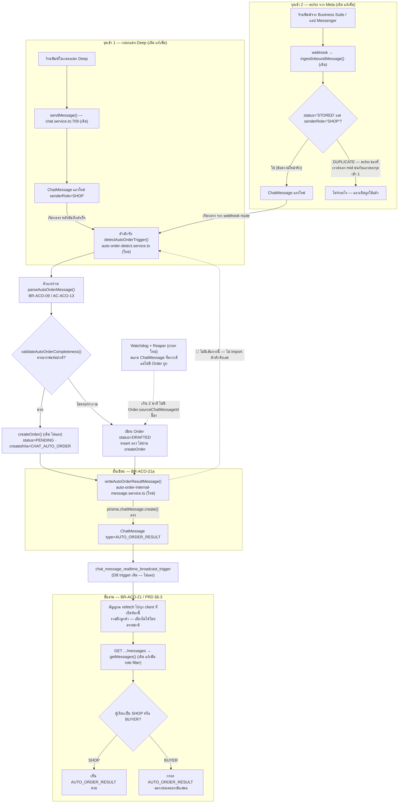

> **โมดูล:** 00061-AutoCreateOrder
> **ประเภทเอกสาร:** Software Requirements Specification (SRS) — TECHNICAL
> **เวอร์ชัน:** 1.0
> **วันที่จัดทำ:** 2026-08-30
> **สถานะ:** Draft — รอ user review
> **เจ้าของเอกสาร:** SA (`safepay-planner`)

# SRS: สร้างออเดอร์อัตโนมัติจากคำสั่งในแชท

> ## 🔄 สืบทอดมติ 2026-08-30 จาก PRD/BRD/DATABASE
> ร่าง = แถว `Order` ที่ `status='DRAFTED'` ในตารางเดิม — **ไม่มีตารางคิว ไม่มีตารางร่างแยก**
> เอกสารนี้ปิด open question ที่ DATABASE.md/BRD.md ทิ้งไว้ให้ SRS ตัดสิน พร้อมยืนยันกับโค้ดจริงทุกจุดก่อนอ้าง

---

## 1. บทนำ

### 1.1 วัตถุประสงค์

กำหนด **วิธีทำ (How)** ของทุก Business Rule ใน PRD §3/§4 และทุก Acceptance Criteria ใน BRD §2 ให้เป็นข้อกำหนด
เชิงเทคนิคที่ dev นำไป implement ได้ทันที **โดยไม่ต้องเดา** และ QA นำไปเขียน TestCase ได้ตรงกับพฤติกรรมที่ตั้งใจ

🛑 **เอกสารนี้ตัดสินคำถามที่ยังไม่มีคำตอบ 3 ข้อที่เอกสารก่อนหน้าทิ้งไว้ให้ SRS โดยเฉพาะ:**
เพดานเวลา + watchdog "ประมวลผลไม่สำเร็จ" · กลไก "ลองอ่านข้อความนี้อีกครั้ง" · `cancelReason` ของปุ่ม "ทิ้งร่างนี้"
— **ทั้ง 3 ข้อยืนยันกับโค้ดจริงก่อนตัดสินทุกข้อ**

### 1.2 ขอบเขตเชิงระบบ

**อยู่ในขอบเขต:**
- **ตัวแกะข้อความ (parser) แบบกฎตายตัว** — ฟังก์ชันเดียวที่ 2 จุดเข้าเรียกร่วมกัน
- Pipeline ตรวจจับ: วลีจุดชนวน → แกะ → validate → `createOrder()` **หรือ** เขียนร่าง `DRAFTED`
- ตารางตั้งค่า 4 ตัว + คอลัมน์ที่เพิ่มบน `Order`/`ShopChannel`/`ChatMessage` (**ล็อกแล้วใน DATABASE.md — SRS ไม่แก้สคีมา**)
- **ชั้นเขียน** ข้อความภายใน (แยกจาก `sendMessage`/`sendOutboundMessage`) + **ชั้นอ่าน** (กรอง role ที่ endpoint อ่านข้อความ)
- ตัวตรวจสุขภาพสิทธิ์ `message_echoes` ต่อเพจ + ปุ่มซ่อม
- **Watchdog** ("ประมวลผลไม่สำเร็จ") + **reaper** (หมดอายุ 7 วัน) — cron ใหม่
- ตัวกรอง `DRAFTED` ออกจากทุก query ที่นับเงิน/จำนวนออเดอร์ (`excludeDraftedWhere` — DATABASE §C)
- ปุ่ม "แก้ไข"/"ทิ้งร่างนี้" บนแถวร่างใน `/orders` — **ขยาย `order-action-set.ts` ที่มีอยู่แล้ว ไม่สร้างใหม่**

**นอกขอบเขต (v1 — อ้าง PRD §5):** ระบบถามยืนยันจากลูกค้า (P2) · AI ช่วยแกะ · fuzzy matching · สร้างสินค้าใหม่
อัตโนมัติ · ส่งข้อความหาลูกค้าอัตโนมัติ · TikTok · ร้านคิวงาน/บ้านพัก · แชท DEEP ในแอปผู้ซื้อ · push

**ระบบที่แตะแต่ไม่เป็นเจ้าของ (อ่าน/เรียกใช้เท่านั้น ไม่แก้ contract เดิม):**

| ของเดิม | ฟีเจอร์นี้ทำอะไรกับมัน |
|---|---|
| `createOrder()` (`order.service.ts:253`) | **เรียกตรง ไม่ผ่าน API route** (route บังคับ session คน) |
| `cancelOrder()` (`order.service.ts:1136`) | เรียกตรงจากปุ่ม "ยกเลิกใบเก่า" · **reaper ไม่ใช้ตัวนี้** (ดู §3.15) |
| `sendMessage` / `sendOutboundMessage` | 🛑 **ห้ามเรียกเลย** (BR-ACO-21a) |
| `getMessages()` (`chat.service.ts`) | ต้องแก้เพิ่ม role filter — **จุดเดียวที่ต้องแก้ contract เดิม** |

### 1.3 เอกสารอ้างอิง

| เอกสาร | ความสัมพันธ์ |
|---|---|
| [[PRD]] | BR-ACO-01..27 + 20a–20f · §4.3 (9 เหตุผลตกร่าง) · §6.2/§6.3 (สถาปัตยกรรม 2 ชั้น) — **SSOT ของกฎธุรกิจ** |
| [[BRD]] | FR-ACO-01..28 + AC-ACO-01..79 — ทุก TFR ในเอกสารนี้ trace กลับ AC ได้ |
| [[DATABASE]] | **สคีมาล็อกแล้ว** — เอกสารนี้ไม่ออกแบบสคีมาใหม่ · โดยเฉพาะ §C (จุดที่ต้องกรอง `DRAFTED`) |
| `src/services/order.service.ts` | `createOrder`/`cancelOrder`/`VALID_TRANSITIONS`/error class — **ยืนยันบรรทัดจริงก่อนเขียนเอกสารนี้** |
| `src/lib/order-date-window.ts` | SSOT เพดานเวลาย้อนหลัง/ล่วงหน้า — **ใช้ตัวเดิม ไม่ตั้งเพดานใหม่** |
| `src/lib/auto-reply-normalize.ts::normalizeMessage` | ตัวที่ `normalizeTriggerPhrase()` 🛑 **ห้ามเป็นตัวเดียวกัน** (ลบเครื่องหมายวรรคตอน) |
| `src/app/api/cron/auto-reply-sweeper/route.ts` | **ต้นแบบ cron pattern** (`CRON_SECRET` bearer + หลาย phase ต่อ route) ที่ watchdog/reaper ยกโครงมา |

### 1.4 นิยามและตัวย่อ

| คำ | ความหมาย |
|---|---|
| **จุดเข้า 1 / จุดเข้า 2** | (1) ข้อความที่ร้านพิมพ์จากกล่องแชท Deep — sync ใน `sendMessage()` · (2) echo จาก Meta เมื่อร้านพิมพ์จากแอป Business Suite/Messenger — webhook |
| **ตัวแกะ (parser)** | `parseAutoOrderMessage()` (ใหม่) ที่ **ทั้ง 2 จุดเข้าเรียกร่วมกัน** |
| **เกณฑ์ครบ** | `validateAutoOrderCompleteness()` (ใหม่) — **เข้มเท่า `CreateOrderSchema` ทุกประการ** |
| **แถวจุดชนวน** | `ChatMessage` ที่ `senderRole='SHOP'` และเนื้อหาตรงวลีจุดชนวนที่ normalize แล้ว |
| **แถวผลลัพธ์** | `Order` ที่เกิดจากแถวจุดชนวน — `status IN ('PENDING','DRAFTED')` + `createdVia='CHAT_AUTO_ORDER'` |
| **ข้อความภายใน** | `ChatMessage` ที่ `type='AUTO_ORDER_RESULT'` เขียนผ่าน**เส้นทางแยก** ไม่ใช่ `sendMessage`/`sendOutboundMessage` |
| **Watchdog** | cron sweep ที่หาแถวจุดชนวน**ที่ยังไม่มีแถวผลลัพธ์ผูกอยู่**เกินเพดานเวลา |

---

## 2. ภาพรวมสถาปัตยกรรม

### 2.1 บริบทระบบ

🛑 **หลักการที่ทำให้ตอบโจทย์ "วงจรป้อนกลับ" ได้โดยไม่ต้องพึ่งเงื่อนไข `if type !== …`:**

ตัวดักจับ (`detectAutoOrderTrigger()`) **ไม่ใช่ observer ที่ฟังทุกแถวใหม่ของ `ChatMessage`** — มันคือฟังก์ชันธรรมดา
ที่ถูก **เรียกตรง (explicit call) จากเพียง 2 จุดที่ตั้งชื่อได้** ในทั้งระบบ · เส้นทางเขียนข้อความภายใน
(`writeAutoOrderResultMessage()`) **ไม่ import ไฟล์ของตัวดักจับเลย** ⇒ **ไม่มีบรรทัดโค้ดที่จะเรียกมันได้แม้จะพยายาม**
⇒ ไม่ใช่ *"ตัดด้วยเงื่อนไข"* แต่คือ **"ไม่มีสายที่จะให้ตัด"**

🛑 **บังคับด้วยเทส `[blocker]`** ที่ grep หา **ทุกจุด import** `detectAutoOrderTrigger` แล้วยืนยันว่าเซตนั้นมีสมาชิก
**เท่ากับ 2 ไฟล์ที่ระบุชื่อไว้ตายตัวเท่านั้น** — เพิ่ม/ลดจุดเรียกโดยไม่แก้เทสนี้ = **แดงทันที**



🛑 **ทำไม backfill/sync (`syncMissingMessagesFromMeta` · PRD §6.2 แถว 9) ไม่ใช่จุดเข้าที่ 3 — และช่องว่างที่ตามมา**

มันแทรก `ChatMessage` ผ่าน `createMany` ตรง **ไม่เดินผ่าน `ingestInboundMessage()` เลย** ⇒ ไม่มีจุดเรียกตัวดักจับ
ที่เส้นทางนี้โดยธรรมชาติ (สอดคล้องกับหลัก "closed caller set" — ไม่เพิ่มจุดเรียกที่ 3)

**แต่นั่นแปลว่าข้อความจุดชนวนที่มาช้าแล้วถูก backfill เข้ามา จะไม่ถูกดักจับเลยถ้าไม่มีอะไรกันไว้**
⇒ ช่องว่างนี้ปิดที่ **Watchdog** (ซึ่งสแกนจาก **เนื้อหาจริงของ `ChatMessage` ไม่สนว่าแถวมาจากเส้นทางไหน**)
**ไม่ใช่ปิดที่ตัวดักจับ** ⇒ **Watchdog มี 2 หน้าที่พร้อมกัน:**
1. จับเคส timeout/crash ที่เคยเข้า pipeline แล้วไม่จบ
2. **จับเคสที่ไม่เคยเข้า pipeline เลยเพราะมาทาง backfill**

### 2.2 องค์ประกอบหลัก — แบ่ง 3 กลุ่มตามความเสี่ยง

🛑 **กลุ่ม B (แก้ของเดิม) คือกลุ่มที่ reviewer ต้องเพ่งหนักสุด** เพราะเป็นจุดที่โค้ดเดิมซึ่งระบบอื่นพึ่งพาอยู่แล้ว
ถูกแตะ — **ผิดตรงนี้กระทบฟีเจอร์อื่นทันที** ต่างจากกลุ่ม A ที่ผิดแล้วกระทบแค่ตัวเอง

**กลุ่ม A — สร้างใหม่ (เสี่ยงต่ำสุด)**

| Component | หน้าที่ | ไฟล์ |
|---|---|---|
| ตัวแกะร่วม | `parseAutoOrderMessage()` — เทมเพลตตายตัว คืนรายการดิบ + ข้อมูลลูกค้า | `src/lib/auto-order-parser.ts` |
| SSOT normalize วลี | `normalizeTriggerPhrase()` — lowercase + ยุบช่องว่าง **ไม่ตัดสัญลักษณ์** | `src/lib/auto-order-normalize.ts` |
| ชั้นตรวจ "ครบ" | `validateAutoOrderCompleteness()` — parity กับ `CreateOrderSchema` | `src/lib/auto-order-validate.ts` |
| SSOT กรองร่าง | `excludeDraftedWhere` (DATABASE §C) | `src/lib/order-visibility.ts` |
| ตัวดักจับ + orchestration | `detectAutoOrderTrigger()` / `promoteDraftToOrder()` / `retryAutoOrderDraft()` / `discardAutoOrderDraft()` | `src/services/auto-order-detect.service.ts` |
| ชุดตั้งค่า CRUD | config / phrase / channel / test-thread | `src/services/auto-order-config.service.ts` |
| **ชั้นเขียนข้อความภายใน** | `writeAutoOrderResultMessage()` — insert ตรง **ไม่เรียก `sendMessage`/`sendOutboundMessage`/ตัวดักจับ** | `src/services/auto-order-internal-message.service.ts` |
| ตัวตรวจสุขภาพสิทธิ์ | เรียก Graph `subscribed_fields` จริง | `src/services/message-echoes-health.service.ts` |
| Route ตั้งค่า/ทดสอบ/retry/discard/health | ดู API.md | `src/app/api/seller/auto-order/**` |
| Cron watchdog + reaper | §2.3 | `src/app/api/cron/auto-order-sweeper/route.ts` |

**กลุ่ม B — แก้ของเดิม (🛑 เสี่ยงสูงสุด)**

| ไฟล์เดิม | แก้อะไร | ระบบอื่นที่พึ่งพาไฟล์นี้อยู่ (ต้องไม่พัง) |
|---|---|---|
| `chat.service.ts::sendMessage()` | เรียก `detectAutoOrderTrigger()` **หลัง** บันทึกแถว SHOP สำเร็จ (จุดเข้า 1) | **ทุกช่องทางส่งข้อความของร้านทั้งระบบ** |
| `chat.service.ts::getMessages()` | เพิ่ม role filter กรอง `AUTO_ORDER_RESULT` (ชั้นอ่าน) | **ทุกหน้าที่อ่านประวัติแชท (seller + buyer)** |
| `api/channels/facebook/webhook/route.ts` | เรียก `detectAutoOrderTrigger()` เมื่อ ingest คืน `STORED` + `senderRole='SHOP'` (จุดเข้า 2) | Ingestion ของทุกข้อความ Messenger/Instagram |
| `order.service.ts::VALID_TRANSITIONS` | เพิ่ม `DRAFTED: ['PENDING','CANCELLED']` | ทุกจุดที่เรียก `assertTransition` (confirm/ship/cancel) |
| `src/lib/cancel-reasons.ts` | เพิ่ม `DUPLICATE_ORDER` แบบ additive | **ทุก dropdown ยกเลิกออเดอร์ทั้งระบบ** |
| `src/lib/order-stats.ts::isRateExcludedCancellation()` | เพิ่ม `DRAFT_EXPIRED` เข้า exclusion | **Trust Score / success-rate ของทุกร้าน** |
| `order-action-set.ts` | เพิ่ม branch ปุ่มสำหรับ `DRAFTED` | ปุ่ม action ทุกแถวใน `/orders` |
| `StageChips` / `OrdersList.tsx` | เพิ่มชิป "ร่าง" | ตัวกรองหน้า `/orders` เดิม |
| `InboxList.tsx` | เพิ่ม badge ร่างค้างถัดจาก unread badge | รายการห้องแชททั้งหมด |

**กลุ่ม C — เรียกเฉย ๆ ไม่แตะ (สัญญาเดิมคงเดิม 100%)**

| Component | ใช้ยังไง |
|---|---|
| `createOrder()` | เรียกตรงเมื่อเกณฑ์ครบผ่าน — **ไม่มี fork/สวิตช์ลัด** (BR-ACO-16) |
| `cancelOrder()` | เรียกตรงจากปุ่ม "ยกเลิกใบเก่า" และ "ทิ้งร่างนี้" — 🛑 **reaper (`DRAFT_EXPIRED`) ไม่เรียกฟังก์ชันนี้** เขียน `status`/`cancelReason` ตรงเอง |
| `orderDateRejectReason()` | ตัดสินเหตุผล "เวลาเกินเพดาน" — **ไม่ตั้งเพดานใหม่** |
| `MOBILE_PHONE_RE` | ตัดสินเหตุผล "เบอร์ไม่ถูกต้อง" |
| `chat_message_realtime_broadcast_trigger` | ทำงานเองทุก INSERT — **ไม่แก้ ไม่ปิด** |

### 2.3 มุมมองการ Deploy

**Cron ใหม่: 1 ตัว** — `/api/cron/auto-order-sweeper` · `* * * * *` (ทุกนาที) · `maxDuration = 60`

**ทำไมรวม watchdog (2 นาที) กับ reaper (7 วัน) ใน route เดียว:** ยกโครงจาก `auto-reply-sweeper` ที่รวมหลาย phase
ต่อ route เป็น convention อยู่แล้ว (auth ด้วย `CRON_SECRET` bearer + แยก try/catch ต่อ phase) — reaper ใช้
`Order_drafted_expiry_partial` ซึ่งราคาถูกมาก **รันทุกนาทีไม่มีต้นทุนมีนัย** และไม่ต้องเสียโควตา cron slot เพิ่ม

**ทำไมไม่ยัดรวมกับ cron ที่มีอยู่แล้ว:**
- `chat-outbox` (`* * * * *`) — เทมโปเดียวกัน **แต่คนละตาราง คนละปัญหา** และไฟล์นั้นมี**งบเวลาที่คำนวณละเอียด
  ผูกกับ `STALE_CLAIM_MS` ของตัวเอง** ⇒ เพิ่มงานหนักเข้าไปเสี่ยงกินงบนั้นโดยไม่ตั้งใจ
- `auto-reply-sweeper` (`0 22 * * *`) — **เทมโปช้าเกินไปสำหรับเพดาน 2 นาที** (ข้อความที่ล้มจะรอเกือบ 24 ชม.
  กว่าจะได้ร่าง) และเป็นตารางของ subsystem อื่น — ทุก cron ในโปรเจกต์นี้ scope ตามฟีเจอร์ตัวเองอยู่แล้ว

> ⚠️ **ต้องกลับไปถาม `safepay-database` ก่อน implement:** query ของ watchdog อาจต้องการ index บน
> `ChatMessage(senderRole, createdAt)` ซึ่ง **DATABASE.md ยังไม่ได้ล็อกไว้** — **นอกขอบเขตที่ SRS ตัดสินเองได้**

**Runtime:** จุดเข้า 1/2 ยังรันในเส้นทาง request เดิม · `detectAutoOrderTrigger()` เรียกผ่าน **Next.js `after()`**
(pattern เดียวกับ `syncMissingMessagesFromMeta`) ⇒ ตอบ response หลักให้ผู้เรียก (client/Meta webhook) **ก่อน**
ที่ parse+validate+createOrder จะทำงานจริง — **ตอบโจทย์ NFR "burst ร้านหนึ่งไม่หน่วง webhook ร้านอื่น"**
เพราะ webhook handler คืน 200 ทันทีโดยไม่รอ pipeline นี้จบ

---

## 3. Technical Functional Requirements

> ทุก TFR ระบุ **AC ที่ผูก** เสมอ — **AC ที่ไม่มี TFR รองรับ = ช่องโหว่ที่ต้องกลับมาแก้ก่อนปิด SRS**

### TFR-001 — ชุดตั้งค่า 1 ชุดต่อร้าน + วลีจุดชนวนหลายวลี
**Trace:** BR-ACO-01/02/03 · **AC:** 01, 03
- `getOrCreateAutoOrderConfig(shopId)` (upsert unique `shopId`) · `upsertPhrases()` · `setChannels()` — `auto-order-config.service.ts`
- **Postcondition:** แถว config มีอยู่เสมอหลังเรียกครั้งแรก (`status='OFFLINE'`) · `AutoOrderAgentPhrase` มี ≥1 แถวเสมอ
- **Edge:** วลีซ้ำหลัง normalize → 400 `PHRASE_DUPLICATE` (จับ P2002) · ลบวลีสุดท้าย → 400 `PHRASE_MIN_ONE`
  🛑 **บังคับที่ service ไม่ใช่แค่ disable ปุ่มฝั่ง UI** (client เรียก API ตรงได้เสมอ)

### TFR-002 — `normalizeTriggerPhrase()` SSOT ใหม่ ห้ามใช้ร่วมกับ `normalizeMessage()`
**Trace:** BR-ACO-01 · **AC:** 02
- pure function ทำ **แค่ 2 ขั้น**: lowercase อังกฤษ + ยุบช่องว่างซ้ำ/ตัดหัวท้าย — 🛑 **ไม่มีขั้นลบสัญลักษณ์เด็ดขาด**
  (ต่างจาก `normalizeMessage` ที่มี 8 ขั้นและขั้น 5 ลบวรรคตอน — **ห้าม reuse เพราะ `/go` จะกลายเป็น `go`**)

| input | output | เหตุผล |
|---|---|---|
| `/go` | `/go` | `/` ต้องอยู่ครบ — ถ้าถูกลบจะชนกับคำว่า "go" เปล่า ๆ |
| `สรุปคำสั่งซื้อ` | `สรุปคำสั่งซื้อ` | วรรณยุกต์/สระไทย (่ ั ื ์) **ต้องไม่ถูกตัดแม้ตัวเดียว** |
| `SUMMARY Order` | `summary order` | lowercase เฉพาะอังกฤษ |
| `สรุป   คำสั่งซื้อ` | `สรุป คำสั่งซื้อ` | ยุบช่องว่างซ้ำ |
| `  /go  ` | `/go` | ตัดหัวท้าย |

- **Postcondition:** idempotent — `f(f(x)) === f(x)`
- 🛑 **ด่านบังคับ:** `src/lib/__tests__/auto-order-normalize.test.ts` ต้องมีเคส `/go` โดยตรง
  (`expect(normalizeTriggerPhrase('/go')).toBe('/go')` **ไม่ใช่ `'go'`**) — **แดงทันทีถ้ามีใครแก้ให้เรียก `normalizeMessage`**

### TFR-003 — สถานะ 3 ระดับ + จำกัดเฉพาะ `ONLINE_SALES` (server-side)
**Trace:** BR-ACO-04/06 · **AC:** 04, 05, 06, 08, 09
- `setAutoOrderStatus(shopId, status, actorUserId)` — ก่อนเขียน: (1) `Shop.vertical === 'ONLINE_SALES'` มิฉะนั้น `VerticalNotSupportedError` (2) ถ้า `status !== 'OFFLINE'` ทุกเพจ MESSENGER/IG ที่เลือกต้องเป็น `GRANTED` มิฉะนั้น `MessageEchoesNotGrantedError`
- **Postcondition:** `status='TEST'` → detect เฉพาะ `conversationId` ใน `AutoOrderAgentTestThread` **และทุก branch ที่ผลลัพธ์ "ครบ" ต้องเขียนร่าง ห้ามเรียก `createOrder()` เด็ดขาด**
- 🛑 **ด่านบังคับ (AC-09):** `src/app/api/seller/auto-order/__tests__/vertical-guard.test.ts` — เรียก route ตรงด้วย session ร้าน `SERVICE_QUEUE`/`LODGING` ต้องได้ **403** · mutation: comment out เงื่อนไข vertical → แดง
- 🛑 **ด่านบังคับ (AC-06):** `auto-order-detect.test.ts::"TEST mode never calls createOrder"` — spy บน `createOrder` ต้อง **ไม่ถูกเรียกเลย** · mutation: ลบเงื่อนไข `isDryRun` → แดง

### TFR-004 — ตรวจสุขภาพสิทธิ์ `message_echoes` จริงจากแพลตฟอร์ม
**Trace:** BR-ACO-07/26 · **AC:** 10, 73, 74
- `checkMessageEchoesHealth(shopChannelId)` — เรียก Graph `GET /{page-id}/subscribed_apps?fields=subscribed_fields` → เขียน `GRANTED`/`MISSING` + `checkedAt=now()` · เครือข่ายพัง → เขียน `'UNKNOWN'` (**ไม่ throw ไม่ทิ้งค่าเดิม** เพื่อให้ `checkedAt` สะท้อนว่า "เพิ่งลองแล้ว")
- **ทริกเกอร์:** (1) sync ตอนหน้า A mount (หน้านี้เข้าไม่บ่อย ยอมรับ latency) (2) ปุ่ม "ซ่อมให้" → `POST subscribed_fields` 🛑 **replace ทั้งชุด ต้อง GET ก่อนเสมอ** แล้วเรียกตรวจซ้ำยืนยัน
- **Postcondition:** TFR-003 อ่านค่านี้จาก DB **ไม่เรียก Graph ซ้ำ** (cache แบบ advisory)
- **Edge:** `provider==='LINE'` → **ไม่ถูกเรียกเลย** (short-circuit ไม่แตะ Graph)
- 🛑 **ด่านบังคับ (AC-10/74):** `message-echoes-health.test.ts::"เรียก Graph จริงไม่ derive จากวันที่เชื่อม"` — `expect(graphClientSpy).toHaveBeenCalled()` · **เทสที่แค่ตรวจว่า DB คอลัมน์ถูกอ่าน ไม่ผ่านเกณฑ์นี้**

### TFR-005 — ตัวแกะร่วม: 2 จุดเข้าเรียกฟังก์ชันเดียวกันเป๊ะ
**Trace:** BR-ACO-08/09/10 · **AC:** 11–16
- `detectAutoOrderTrigger(chatMessageId)` เป็น entry point เดียว — ลำดับเช็ค: (1) `senderRole==='SHOP'` มิฉะนั้น return (AC-11) (2) config มีและ `status!=='OFFLINE'` (3) เพจอยู่ใน effective channel set (4) `matchesTriggerPhrase(rawBody, phrases)` — เทียบ **ข้อความดิบ** (ไม่ผ่าน `normalizeMessage`) กับ `normalizedPhrase` ที่ normalize ด้วยตัวเดียวกัน — ไม่ match → return เงียบ
- 🛑 **ทั้ง 2 จุดเข้าส่ง `chatMessageId` เข้ามาเท่านั้น ไม่ส่ง raw payload** → ตัวแกะโหลดข้อมูลเองจาก DB เสมอ
  **กัน parity พังจากการที่ 2 จุดเข้าเตรียม input ต่างกัน**
- 🛑 **ด่านบังคับ (AC-12/13):** `auto-order-parser-parity.test.ts` — ยิงเนื้อหาเดียวกันทุกตัวอักษรเข้าทั้ง 2 เส้นทาง แล้ว snapshot ผลลัพธ์ **ทุกฟิลด์** (ยกเว้น id/timestamp) ต้องเท่ากัน · mutation: แก้ entry 2 ให้เรียก parse คนละตัว → แดง

### TFR-006 — เทมเพลต 4 หัวข้อบังคับ + พฤติกรรมเทมเพลตครึ่ง ๆ (นิยามครบ ไม่ปล่อยว่าง)
**Trace:** BR-ACO-11 · **AC:** 17
- แยกบรรทัด → บรรทัดที่ตรงรูป `{หัวข้อ/คำพ้อง}:` เปิด field นั้น · บรรทัดถัดไปที่ **ไม่ตรงรูปหัวข้อใด ๆ** ถูกครอบด้วย field ที่เปิดล่าสุด (มีผลกับ `ที่อยู่`/`หมายเหตุ` ที่ยาวหลายบรรทัด)
- 🛑 **หัวข้อซ้ำในข้อความเดียว → ค่าที่ปรากฏ "ครั้งหลังสุด" ชนะ สำหรับ field สเกลาร์** (ชื่อ/เบอร์/ที่อยู่/ส่วนลด/ยอดรวม/หมายเหตุ/ชำระโดย)
  **เหตุผล:** ร้านพิมพ์แก้ต่อท้ายในข้อความเดียวกันเป็นพฤติกรรมจริง (แก้คำผิดโดยพิมพ์ทับด้านล่าง) **ค่าล่าสุดคือเจตนาจริง**
- 🛑 **`รายการ:` ซ้ำ 2 ครั้ง → สะสมต่อกัน (append) ไม่ใช่ overwrite** — **ต่างจาก field สเกลาร์โดยตั้งใจ**
  เพราะ overwrite รายการสินค้า = **ทำสินค้าที่พิมพ์ไว้ก่อนหน้าหายไปเงียบ** ซึ่งขัด BR-ACO-19 ตรงกว่าความเสี่ยงของ
  การนับซ้ำ (ซึ่งถ้าเกิดจะโผล่เป็นยอดไม่ตรงแล้วตกร่างอยู่ดี — **ปลอดภัยกว่า**)
- 🛑 **`รายการ:` ปรากฏแต่ไม่มีบรรทัด `-` ตามมา → คืน `items: []` เฉย ๆ ไม่ throw** — ผลปลายทางเหมือนไม่มี `รายการ:` เลย (ตกร่างด้วยเหตุผล "ไม่พบรายการสินค้า" ที่ **`validateAutoOrderCompleteness` ตัดสิน ไม่ใช่ที่ parser**)
  ⇒ **ตัดสินใจนี้ทำให้ parser ไม่ต้องมี special-case เลย** ความรับผิดชอบเรื่อง "ครบไหม" อยู่ที่ TFR-010 ทั้งหมด
- **หัวข้อที่ไม่รู้จัก** → เป็นส่วนหนึ่งของเนื้อความ field ที่เปิดอยู่ (ไม่ throw)
- **Edge:** ไม่มีหัวข้อใดตรงเลย → ทุก field ว่าง → ตกร่างด้วยเหตุผล**เชิงเนื้อหา**หลายข้อ (**ไม่ใช่เหตุผลระดับระบบ** — parser ทำงานสำเร็จ แค่ผลลัพธ์ว่าง)

### TFR-007 — รายการสินค้า `- ชื่อ xN @ราคา` + ห้ามเดาราคาเป็น ฿0
**Trace:** BR-ACO-12 · **AC:** 18, 19
- regex: `^-\s*(.+?)(?:\s+x(\d+))?\s*@\s*([\d,]+(?:\.\d+)?)?\s*$` — ชื่อดิบ · จำนวน (ไม่มี = `1`) · ราคา (ไม่มี = **`null` ไม่ใช่ `0`**)
- **Postcondition:** `price: number | null` เสมอ — 🛑 **ไม่มี branch ใดในไฟล์นี้เขียน `0` แทน `null`**
- 🛑 **ด่านบังคับ (AC-19):** `auto-order-parser.test.ts::"ไม่มี @ราคา ต้องไม่เป็น 0"` → `expect(items[0].price).toBeNull()` · และเทสระดับ pipeline **นับแถว `Order` ก่อน/หลังต้องเท่าเดิม** · mutation: `price: rawPrice ?? 0` → **แดงทั้งสองเทส**

### TFR-008 — จับคู่สินค้าตรงเป๊ะ + ปิด Quick-Create เดิม
**Trace:** BR-ACO-13 (🛑 ด่านบังคับ) · **AC:** 20–23
> 🛑 **ปรับวิธี implement ใน `SDS.md` §3.3 (2026-08-30):** เปลี่ยนจาก **query ต่อ 1 ชื่อ** เป็น **batch-fetch แคตตาล็อกครั้งเดียวแล้วเทียบ in-memory** — เพราะเส้นทางนี้อยู่บน webhook ที่มี KPI 5 วินาที และ **Prisma ไม่รองรับ `mode:'insensitive'` ร่วมกับ `in`** · 🛑 **กฎ "ตรงเป๊ะเท่านั้น" ไม่เปลี่ยน** เปลี่ยนแค่ *ที่ที่การเทียบเกิดขึ้น*

- `matchProductByRawName(shopId, rawName)` — `findFirst({ where:{ shopId, OR:[{name:{equals:normalized,mode:'insensitive'}},{sku:rawName}] } })` · **ไม่มี fuzzy/similarity ใด ๆ**
- 🛑 **จุดปิด Quick-Create ตัวจริงอยู่ที่ `validateAutoOrderCompleteness()` ไม่ใช่ที่ matcher:** ถ้ามี raw item ใดคืน `null` → **ทั้งข้อความ "ไม่ครบ" ทันที** ⇒ **`createOrder()` ไม่มีวันถูกเรียกด้วย item ที่ไม่มี `productId` จากเส้นทางนี้เลย**
- 🛑 **นี่คือส่วนที่เข้มกว่าฟอร์มปกติโดยตั้งใจ** (ฟอร์มยอมให้พิมพ์สินค้าเองผ่าน Quick-Create แต่เส้นทางนี้ไม่ยอม)
  **ไม่ขัด AC-ACO-27** เพราะ AC นั้นห้ามแค่ *"หลุดผ่านทางลัดทั้งที่ฟอร์มปฏิเสธ"* **ไม่ได้ห้ามการปฏิเสธที่มากกว่า**
- 🛑 **ด่านบังคับ (AC-22/23) — พิสูจน์ด้วยการนับ:** `auto-order-detect.test.ts::"สินค้าไม่ตรง — ห้าม Quick-Create"` — นับ `product.count({shopId})` = N ก่อน → ยิงข้อความครบทุกอย่างยกเว้นชื่อสินค้าสะกดผิด 1 ตัว → หลังจบต้องยัง `=== N` **และ** `Order.count(...) === 0` · mutation: เอาเงื่อนไข null-check ออกจาก validate → **แดงเพราะ `product.count` เพิ่มขึ้น**

### TFR-009 — วันที่ออเดอร์ = เวลาที่ข้อความจุดชนวนถูกส่งจริง (ผูกเพดานเดิม ห้าม hardcode ใหม่)
**Trace:** BR-ACO-14 · **AC:** 24, 25
- `messageAtMs = chatMessage.createdAt.getTime()` (**เวลาข้อความ ไม่ใช่เวลาที่ตัวดักจับเริ่มทำงาน**) → `isOrderDateInWindow()` จาก `src/lib/order-date-window.ts:45` ✅ยืนยันแล้ว
  🛑 **ใช้ค่าคงที่เดิม `ORDER_BACKDATE_DAYS=90` / `ORDER_FUTUREDATE_DAYS=7`** (`order-date-window.ts:20,22` ✅) **ไม่ประกาศเพดานใหม่ที่ไหนเลย** — เป็นตัวเดียวกับที่ `createOrder()` เรียกภายในตัวเองที่ `order.service.ts:321-326`
- `createOrder(..., { createdAt: chatMessage.createdAt })` — ส่ง `Date` object ตรง (ไม่ต้อง parse ซ้ำ; signature รับ `createdAt?: Date | string` ✅ `order.service.ts:52`)
- **Edge — ข้อความ backfill มาช้าเกิน 90 วัน:** `validateAutoOrderCompleteness()` เช็ค `isOrderDateInWindow` **ก่อน** เรียก `createOrder()` เสมอ
  🛑 **ไม่ปล่อยให้ `createOrder()` เป็นคนโยน `OrderDateOutOfWindowError` เอง** ⇒ ได้ **ร่างพร้อมเหตุผล "เวลาเกินเพดาน" ไม่ใช่ 500 ดิบ**
- **ทำไมไม่มีป้ายด่านบังคับที่นี่:** เพดานเป็นของเดิมที่มีเทสคุ้มครองอยู่แล้ว — TFR นี้แค่ **เรียกใช้ ไม่สร้างเพดานใหม่** · ความเสี่ยงจริงคือ "ลืมเช็คก่อนเรียก createOrder" ซึ่งครอบด้วยเทสของ TFR-010 (AC-39: ทุกเหตุผลต้องมีเทสยิงจริงแยกทีละข้อ)

### TFR-010 — `validateAutoOrderCompleteness()` ตัวที่แบกงานหนักสุดของฟีเจอร์
**Trace:** BR-ACO-15/15a (🛑 ด่านบังคับ) · **AC:** 26, 27
🛑 **แยก 2 ชั้น: ชั้นบริสุทธิ์ (ตัดสินใจ) กับชั้นห่อ I/O (จับคู่สินค้า)** — เพราะ TFR-008 ต้อง query DB ⇒ ฟังก์ชันเดียวจบจะไม่บริสุทธิ์
**เหตุผล: ตรรกะที่ซับซ้อนที่สุดของฟีเจอร์ต้องเทสได้ด้วย mutation โดยไม่ต้องแตะ DB เลย**

```ts
// src/lib/auto-order-reasons.ts — PURE ไม่มี I/O ไม่ import prisma
export type DraftReasonCode =
  | 'NO_PHONE' | 'INVALID_PHONE' | 'ADDRESS_INCOMPLETE' | 'DATE_OUT_OF_WINDOW'
  | 'NO_ITEMS' | 'ITEM_PRICE_MISSING' | 'ITEM_NOT_MATCHED' | 'TOTAL_MISMATCH'
  | 'PROCESSING_FAILED'   // 🛑 ไม่เคยถูกฟังก์ชันนี้ผลิตเอง — ดู TFR-014

export function deriveDraftReasons(input: {
  phone: string | null
  shipsGoods: boolean
  address: { line1: string | null; province: string | null; postcode: string | null } | null
  items: { rawName: string; matchedProductId: string | null; qty: number; price: number | null }[]
  statedTotal: number | null
  messageAtMs: number
  nowMs: number
}): DraftReasonCode[]

// src/services/auto-order-validate.service.ts — ห่อ I/O (product matching)
export async function validateAutoOrderCompleteness(
  shopId: string, parsed: ParsedAutoOrderMessage, messageAt: Date, nowMs: number,
): Promise<{
  complete: boolean
  reasons: DraftReasonCode[]
  matchedItems: { productId: string; name: string; qty: number; price: number }[] // มีค่าเฉพาะเมื่อ complete
  shipsGoods: boolean
}>
```

**ลำดับการเช็ค — 🛑 สะสมทุกเหตุผล ห้าม short-circuit เด็ดขาด** (BR-ACO-20):
1. `phone===null` → `NO_PHONE` · มีค่าแต่ `!MOBILE_PHONE_RE.test()` → `INVALID_PHONE` (**คนละเงื่อนไข ไม่ปนกัน** — AC-32/33)
2. `shipsGoods && (!line1 || !province || !postcode)` → `ADDRESS_INCOMPLETE`
3. `!isOrderDateInWindow()` → `DATE_OUT_OF_WINDOW`
4. `items.length===0` → `NO_ITEMS` · มิฉะนั้น: มี `price===null` → `ITEM_PRICE_MISSING` (ครั้งเดียวไม่ว่ากี่รายการ) · มี `matchedProductId===null` → `ITEM_NOT_MATCHED` (ครั้งเดียว)
5. 🛑 **เช็คยอดรวมเฉพาะเมื่อ items ผ่านครบข้อ 4** — ยอดที่คำนวณจาก item ที่ยังไม่ครบคือยอด**ที่ไม่มีความหมาย** เทียบแล้วได้ `TOTAL_MISMATCH` ปลอมที่**ซ้ำเติมสิ่งที่ผู้ขายต้องแก้อยู่แล้วโดยไม่ให้ข้อมูลใหม่** · ผ่านครบ + `statedTotal!==null` → เทียบกับ **`computeItemsTotal()`** ต่างแม้ 1 บาท → `TOTAL_MISMATCH`
   > 🛑 **แก้ 2026-08-30 ตอน implement — ฉบับแรกเขียนว่าเทียบ `sum(qty*price)` เฉย ๆ ซึ่ง *ลืมหักส่วนลด***
   > นิยาม "ยอดรวม" ของทั้งระบบคือ **`subtotal − discount + vat`** (`order.service.ts:332-334`)
   > ⇒ ถ้าใช้ `sum(qty*price)` **เทมเพลตตัวอย่างของฟีเจอร์เอง** (`2×250 + @390` · `ส่วนลด: 50` · `ยอดรวม: 840`)
   > **จะได้ `TOTAL_MISMATCH` ทุกครั้ง เพราะ 890 ≠ 840 — happy path ของตัวเองไม่มีวันผ่าน**
   > นี่คือ **HR16** ตรงตัว (ศัพท์ธุรกิจต้องมีนิยามเดียวทั้งระบบ) · ตัวคำนวณอยู่ที่ `auto-order-reasons.ts::computeItemsTotal()` ที่เดียว

- **คืนค่า:** `complete = reasons.length===0`
- 🛑 **ด่านบังคับ (AC-27 parity กับฟอร์ม):** `auto-order-reasons.test.ts::"parity กับ CreateOrderSchema"` — ไล่ทุกเคสที่ `CreateOrderSchema` ปฏิเสธ แล้วยืนยัน `deriveDraftReasons()` คืน `length > 0` เสมอ · mutation: ลบเงื่อนไข `ADDRESS_INCOMPLETE` → แดง (เคสที่อยู่ขาดกลายเป็น `complete:true`)

### TFR-011 — `createOrder()` เดียวกันทุกช่องทาง: ตัดสต๊อกจริง พิสูจน์ด้วยการนับ
**Trace:** BR-ACO-16 · **AC:** 28
- `complete:true` → เรียก `createOrder()` ตรง 🛑 **ไม่มี wrapper ที่ข้ามการตัดสต๊อก** · `items` ทุกตัวมี `productId` จาก TFR-008 ⇒ เดินเข้าเส้นทาง `deductStockForOrderItems` (`src/services/inventory-stock.service.ts:32` ✅ import ที่ `order.service.ts:8`)
- `createdByUserId: null` **ตั้งใจ** (ไม่มีคนกด) — ตรงคอมเมนต์ในโค้ดเองที่ `order.service.ts:40` ✅ ⇒ หน้าประวัติแสดง "ระบบ" ถูกต้องโดยไม่ต้องแก้อะไรเพิ่ม
- 🛑 **ด่านบังคับ:** `auto-order-detect.test.ts::"ตัดสต๊อกจริง"` — seed `stockQty=20` → ยิง `x2` → **ต้อง `=18` ตรงเป๊ะ**
  **ไม่ใช่แค่เช็คว่ามีแถว `StockMovement` ใหม่** (AC-28 ระบุเองว่าสองอย่างนี้ไม่เท่ากัน) · mutation: bypass stock → แดงเพราะ `stockQty` ไม่ลด

### TFR-012 — ยอดรวมต้องตรงกับที่คำนวณได้ (contract ของค่าที่แสดง)
**Trace:** BR-ACO-17 · **AC:** 29
- `TOTAL_MISMATCH` ต้องพ่วง **ส่วนต่างเป็นตัวเลขบาท ไม่ใช่แค่ boolean** — เก็บ `Order.draftStatedTotalAmount` (ยอดที่ร้านพิมพ์) แล้ว **คำนวณส่วนต่างสดตอนแสดงผล** (`computed = computeItemsTotal()` = `subtotal − discount`, `diff = stated − computed`) 🛑 **ไม่เก็บส่วนต่างเป็นคอลัมน์แยก** (ค่าที่ derive ได้ห้ามมี 2 แหล่ง — HR16)
- **Edge:** `statedTotal===null` (ร้านไม่พิมพ์ "ยอดรวม:") → **ไม่เกิด `TOTAL_MISMATCH` เลย ไม่ใช่ error** (BR-ACO-17 พูดถึงกรณี "ยอดที่พิมพ์ไว้ *ถ้ามี*")

### TFR-013 — `createdVia` + แถบเตือน "ลูกค้ายังไม่เห็นสรุปนี้"
**Trace:** BR-ACO-18 · **AC:** 30, 31
- 🛑 **`createOrder()` ปัจจุบัน *ไม่มี* พารามิเตอร์ `createdVia`** (ยืนยัน signature `order.service.ts:253-305` ✅ ไม่มีคีย์นี้) ⇒ **ต้องเพิ่ม optional param ใหม่** (`createdVia?: 'MANUAL'|'CHAT_AUTO_ORDER'|'ISHIP_LINKED'`, ไม่ส่ง = `NULL`)
  🛑 **ผลกระทบต่อ §2.2: `createOrder()` ต้องย้ายจากกลุ่ม C ("เรียกเฉย ๆ ไม่แตะ") ไปกลุ่ม B ("แก้ของเดิม")** — แก้แบบ **additive parameter เท่านั้น** ไม่กระทบ caller เดิมที่ไม่ส่งคีย์นี้
- **Postcondition:** `createdVia='CHAT_AUTO_ORDER'` ทุกแถวจากเส้นทางนี้ (ทั้ง `PENDING` และ `DRAFTED`) — **คอลัมน์จริง ไม่ derive**
- **แถบเตือน = derive ล้วน ไม่มีคอลัมน์ใหม่:** `createdVia==='CHAT_AUTO_ORDER' && !hasOrderCardInThread(conversationId, publicToken)`
  ⚠️ **ยังไม่ยืนยัน** ว่ามี helper นี้อยู่แล้วหรือต้องเขียนใหม่ — คอลัมน์ `ChatMessage.orderRefToken` มีจริง (`chat.service.ts:832` ✅ เขียนเฉพาะ `type==='ORDER'`) แต่ `orderTokens`/`orderMap` ที่ `messages/route.ts:322-338` คือการ **enrich ข้อความที่มีอยู่แล้ว ไม่ใช่ query ตรวจว่า "มีการ์ดของ token นี้ในห้องหรือยัง"** — **ไม่เท่ากัน ต้องยืนยันแยกก่อนเขียน SDS**

### TFR-014 — 9 เหตุผลตกร่าง: ลำดับแสดงผล + `PROCESSING_FAILED` เดี่ยวเสมอ
**Trace:** BR-ACO-19/20 (🛑 ด่านบังคับ) · **AC:** 32–44
**ลำดับ `reasons[]` — ตรงกับลำดับช่องจริงใน `QuickForm.tsx`** (`CustomerQuickBlock`→`ChannelPaymentSelect`→**`OrderDateRow`**→`QuickLineItem`→`QuickSummaryPanel`):
1. `NO_PHONE` / `INVALID_PHONE` (เบอร์) · 2. `ADDRESS_INCOMPLETE` (ที่อยู่) · 3. `DATE_OUT_OF_WINDOW` (**วันที่ — ตำแหน่งที่ 3 ไม่ใช่ท้ายสุด**) · 4. `NO_ITEMS`/`ITEM_PRICE_MISSING`/`ITEM_NOT_MATCHED` (รายการ) · 5. `TOTAL_MISMATCH` (ยอดรวม)
- 🛑 **การจัดเรียงเป็นหน้าที่ของ `sortDraftReasons()` แยกจาก `deriveDraftReasons()`** — เพื่อให้**การเปลี่ยนลำดับแสดงผล (เรื่อง UX) ไม่ต้องแตะตรรกะตัดสินใจ (เรื่อง business logic)**

🛑 **`PROCESSING_FAILED` เดี่ยวเสมอ — กันที่ชั้นแอปก่อนถึง DB CHECK `Order_draft_reasons_system_exclusive`:**
**กลไกกันจริงคือสถาปัตยกรรม ไม่ใช่ `if` เดี่ยว ๆ** — มี **แค่ 2 ฟังก์ชันในทั้งระบบ**ที่เขียน `Order.draftReasons`:
1. `writeAutoOrderDraft(reasons)` — เรียกจาก pipeline หลักหลัง `deriveDraftReasons()` สำเร็จเสมอ ⇒ `reasons` มาจากฟังก์ชันที่ **ไม่เคยผลิต `PROCESSING_FAILED` เองเลย**
2. `writeProcessingFailedDraft(chatMessageId)` — เรียกจาก **Watchdog เท่านั้น** เขียน `['PROCESSING_FAILED']` เป็นค่าคงที่ตายตัว 🛑 **ไม่รับ parameter `reasons` จากใครเลย** (signature ไม่มีช่องให้ปนค่าอื่น)

⇒ **ไม่มีจุดใดในโค้ดที่สองอาร์เรย์มารวมกัน** — **CHECK ของ DB เป็นด่านสุดท้ายที่ไม่ควรมีวันถูกชนจากโค้ดที่เขียนถูก ไม่ใช่ด่านแรกที่ผู้ใช้เจอเป็น 500 ดิบ**

- 🛑 **ด่านบังคับ (AC-42):** `auto-order-detect.test.ts::"PROCESSING_FAILED ไม่ปนเหตุผลเชิงเนื้อหา"` — สแกนซอร์ส `auto-order-reasons.ts` ต้องเจอสตริงนี้ **เฉพาะใน type definition** ไม่เจอใน branch ของ `deriveDraftReasons` · mutation: เพิ่ม `reasons.push('PROCESSING_FAILED')` เข้าไป → แดงทันที
- 🛑 **ด่านบังคับ (AC-41):** `auto-order-reasons.test.ts::"หลายเหตุผลพร้อมกัน"` — ขาดเบอร์+ที่อยู่+รายการพร้อมกัน → `reasons.length===3` **ไม่ใช่ 1** · mutation: early-return หลัง push ตัวแรก → แดง

### TFR-015 — `contentHash` กันข้อความซ้ำในห้องเดียวกันภายใน 2 นาที
**Trace:** BR-ACO-20a · **AC:** 45, 46
- `computeContentHash(rawBody) = sha256(rawBody).hex` (pure) — 🛑 **ฮาชจากข้อความดิบล้วน ไม่ผ่าน normalize ใด ๆ** เพราะ BR-ACO-20a บังคับ "ต่างแม้ตัวอักษรเดียว = ใบใหม่เสมอ" ⇒ ถ้าฮาชจาก normalized text ตัวอักษรที่ถูกยุบทิ้ง (ช่องว่างซ้ำ) จะทำให้ 2 ข้อความที่**ต่างกันจริง**ได้ hash เดียวกัน = ขัดกฎตรง ๆ
- 🛑 **ทำไมเวลาต้องอยู่ *นอก* hash:** ถ้า hash รวม timestamp ด้วย **ทุกข้อความจะได้ hash ไม่ซ้ำกันเสมอ ⇒ กลไกทั้งตัวกลายเป็น no-op ทันที** (ไม่มีทางที่ hash 2 ตัวจะเท่ากันให้ query เจอ) · hash ตอบ *"เนื้อหาเดียวกันไหม"* · เวลาตอบ *"อยู่ในหน้าต่างที่ยอมให้ dedup ไหม"* — **คนละหน้าที่ ห้ามยุบรวมกัน**
```ts
prisma.order.findFirst({ where: { conversationId, contentHash,
  createdAt: { gt: new Date(nowMs - 2*60*1000) } } })
```
เจอ → return ทันที (no-op) · ไม่เจอ → parse ตามปกติ (แม้ซ้ำกับใบที่เก่ากว่า 2 นาที ⇒ เดินเข้า TFR-016 เต็มเส้นทาง)
- 🛑 **ใครจ่ายราคาเมื่อเดาผิด (ตอบตรง ไม่กลบ):** ระบบ **แยกไม่ได้จริง** ระหว่าง *"ร้านตั้งใจสั่งซ้ำภายใน 2 นาที"* (ลูกค้าขอแยก 2 กล่อง) กับ *"กดส่งซ้ำเพราะเน็ตค้าง"* — **ระบบเลือกเชื่อฝั่งหลังเสมอ** ⇒ **ร้านที่ตั้งใจสั่งซ้ำจริงจะไม่ได้อะไรเลยจากข้อความที่สอง โดยไม่มีสัญญาณใด ๆ ว่ามันถูกเพิกเฉย**
  ⚠️ **คนละเคสกับ "race ที่ยอมรับ" ใน DATABASE.md §3.0(1)** — อันนั้นคือ *สร้างซ้ำโดยไม่ตั้งใจ* ตรงข้ามกับอันนี้ที่เป็น *ระงับโดยไม่ตั้งใจ* ⇒ **ต้องเขียน `console.info` บันทึกทุกครั้งที่ suppress** (v1 ไม่มี UI สำหรับเคสนี้ — ถ้าร้านร้องเรียนว่า "สั่งซ้ำแล้วหาย" ต้องมี log ให้ตามได้ว่าใบไหนถูกกลืน)

### TFR-016 — `supersedesOrderId` หาใบก่อนหน้าด้วย query จริง
**Trace:** BR-ACO-20a/20b · **AC:** 47
```ts
prisma.order.findFirst({
  where: { conversationId, createdVia: 'CHAT_AUTO_ORDER', status: { not: 'DRAFTED' } },
  orderBy: { createdAt: 'desc' },
})   // เรียกในทรานแซกชันเดียวกับที่เขียนแถวใหม่ (กันแถวที่เพิ่งสร้างเห็นตัวเอง)
```
- 🛑 **`status: { not: 'DRAFTED' }` คือหัวใจของกฎ "ร่างระหว่างทางถูกข้ามไป"** (msg1→ออเดอร์จริง · msg2→ตกร่าง · msg3→ออเดอร์จริง ⇒ ชี้ไป order1 ไม่ใช่ร่างจาก msg2)
- **ตีความ AC-47 ที่ทดสอบได้จริง:** อ่านตรงตัวจะขัดกับกฎ chain ที่ไม่มีเงื่อนไขเวลา ⇒ สิ่งที่ AC นี้พิสูจน์คือ **`supersedesOrderId` มาจาก query ล่าสุดจริง ไม่ใช่ heuristic ที่เดาจากความใกล้ของเวลา** — ข้อความ A → orderA · 10 วินาทีถัดมา ข้อความ B (เนื้อหาต่างจาก A) → orderB **ต้อง** ชี้ `orderA` (ตัวล่าสุดจริง ณ ขณะนั้น) ไม่ใช่ยังชี้ตัวก่อน A
- ⚠️ **ความเสี่ยง UX ที่ต้องให้ user ตัดสิน (ยังไม่มีมติ):** ร้านขายของชุดเดิมให้ลูกค้าคนเดิม **เดือนถัดไป** ด้วยข้อความหน้าตาเหมือนเดิม (เกิน 2 นาที ⇒ ไม่ถูก dedup) จะได้ `supersedesOrderId` ชี้ใบเดือนก่อนอัตโนมัติ ⇒ การ์ดขึ้น "ใบนี้มาแทนใบก่อนหน้า" ทั้งที่ไม่ใช่การแก้ไข
  **ความเสียหายจำกัดแค่ป้ายที่ทำให้งง เพราะปุ่มยกเลิกต้องให้ร้านกดเอง (TFR-017) ไม่มีอะไรถูกยกเลิกอัตโนมัติ** — เสนอให้ตัดสินว่ายอมรับ หรือควรมีเพดานเวลาสำหรับ chain

### TFR-017 — ปุ่มยกเลิกใบเก่า: ผู้ขายกดเองเสมอ (พิสูจน์ด้วย spy ไม่ใช่สถานะปลายทาง)
**Trace:** BR-ACO-20b (🛑 ด่านบังคับ) · **AC:** 48–54
- 🛑 **`detectAutoOrderTrigger()` และ `promoteDraftToOrder()` ไม่ import `cancelOrder` เลย** — จุดเดียวที่เรียกคือ route เดิม `POST /api/orders/[token]/cancel` ซึ่งถูกยิงจากปุ่มในการ์ด (**คนละ HTTP request จากที่สร้างออเดอร์ใหม่**)
- **UI:** Swal ยืนยันก่อน (แสดงกล่องเตือน iShip ถ้ามี `OrderShipment.status='CREATED'`) → กดยืนยันแล้วค่อยยิง
- 🛑 **ด่านบังคับ (AC-49) — spy ไม่ใช่สถานะปลายทาง:**
  `auto-order-detect.test.ts::"detectAutoOrderTrigger ไม่เรียก cancelOrder เอง"` — `vi.spyOn(orderService,'cancelOrder')` → seed ห้องที่มีออเดอร์เก่า → รัน pipeline เต็มด้วยเนื้อหาต่าง → `expect(spy).not.toHaveBeenCalled()`
  🛑 **ห้ามเขียนเทสที่เช็ค `oldOrder.status !== 'CANCELLED'` แทน** — ใบเก่าอาจถูกยกเลิกไปแล้วจากเหตุอื่นก่อนเทสรัน (สต๊อกหมด) ⇒ **เทสแบบนั้นเขียวปลอมได้แม้ pipeline จะเรียก `cancelOrder` เองจริง ๆ**
  · mutation: เพิ่ม `if (supersedesOrderId) await cancelOrder(...)` → spy แดงทันที

### TFR-018 — แก้ไข/ถอนข้อความจุดชนวนภายหลัง: ไม่ย้อนแก้ผลลัพธ์
**Trace:** BR-ACO-20c · **AC:** 55, 56, 57
- ⚠️ **ยังไม่ยืนยัน:** ยังไม่เปิดโค้ดเต็มของ `ingestMessageEdit` และสาขา `is_deleted` (เห็นบางส่วนว่าเป็น `updateMany` บน `ChatMessage` ไม่แตะ `Order`)
  **ข้อกำหนดนี้ยืนยันได้จาก BR-ACO-20c ตรง ๆ โดยไม่ต้องพึ่งพฤติกรรมโค้ดปัจจุบัน** — เป็น **ข้อห้ามเชิงลบ**: ทั้งสองฟังก์ชัน **ต้องไม่ถูกแก้ให้แตะแถว `Order` ใดเลย** ⇒ SDS/dev ยืนยันว่าไม่มี regression เพิ่ม ไม่ใช่ต้องเขียนโค้ดใหม่เพื่อบล็อก
- **สิ่งที่ต้องเพิ่มจริง:** เมื่อแตะข้อความที่มี `Order.sourceChatMessageId` ชี้มา (`findUnique({where:{sourceChatMessageId}})`) → `writeAutoOrderResultMessage(kind:'SOURCE_EDITED'|'SOURCE_UNSENT')` — **แค่แจ้ง ไม่กระทำการใด ๆ กับ order**

### TFR-019 — ร่าง = `Order.status='DRAFTED'`: `assertTransition` + `excludeDraftedWhere`
**Trace:** BR-ACO-20d/20e/20f (🛑 ด่านบังคับ) · **AC:** 75–79
- แก้ `VALID_TRANSITIONS` (`order.service.ts:30` ✅) เพิ่ม `DRAFTED: ["PENDING","CANCELLED"]`
  🛑 **ไม่มี status เดิมตัวไหนมี `"DRAFTED"` เป็นปลายทาง** — ไม่มีอะไร transition **เข้า** `DRAFTED` ได้ นอกจาก INSERT ตอนสร้างร่างครั้งแรก
- 🛑 **ด่านบังคับ (AC-79):** `"DRAFTED→CONFIRMED ต้องถูกปฏิเสธ"` — seed `DRAFTED` → `confirmOrder()` (เรียก `assertTransition` ที่ `order.service.ts:972`) ต้อง throw · mutation: เพิ่ม `DRAFTED` เข้า path ที่อนุญาต → แดง (⚠️ ยังไม่ยืนยันว่าไฟล์เทสของ `order.service.ts` มีอยู่แล้ว — ตรวจตอน SDS)
- 🛑 **`excludeDraftedWhere`** — SSOT + เทสสแกนซอร์สนิยามครบแล้วที่ `DATABASE.md` §C **SRS ไม่นิยามซ้ำ** (HR16) · TFR นี้ยืนยันแค่ว่า pipeline เขียนแถว `DRAFTED` ผ่าน **insert ตรง ไม่ผ่าน `createOrder()`** พร้อม `totalAmount: 0` · `orderNo: null` เสมอ
  เทส `"DRAFTED เขียน totalAmount=0 เสมอ"` — ยืนยันว่า**ไม่มี branch ใดเขียน `draftStatedTotalAmount` ทับลง `totalAmount`**
- **`promoteDraftToOrder()` (AC-78):** ⚠️ **ยังไม่ยืนยันว่า reuse `updateOrder()` (`order.service.ts:683`) ได้หรือต้องเขียนใหม่** — `updateOrder()` ดูออกแบบมาสำหรับออเดอร์ที่**มี `OrderItem` อยู่แล้ว** (แก้ไข ไม่ใช่สร้างครั้งแรก) ขณะที่ร่างมี `OrderItem` = 0 แถวเสมอ ⇒ **ต้อง Explore เต็มไฟล์ตอน SDS ก่อนตัดสิน**
  ไม่ว่าผลเป็นทางไหน ต้องครบใน **ทรานแซกชันเดียว**: สร้าง `OrderItem` จาก `draftRawItems` → `deductStockForOrderItems()` → `formatOrderNo()` → คำนวณ `totalAmount` จริง → `assertTransition('DRAFTED','PENDING')` → update `status`

### TFR-020 — ชั้นเขียน: ข้อความภายในมีเส้นทางของตัวเอง
**Trace:** BR-ACO-21/21a (🛑 ด่านบังคับ) · **AC:** 58–62
- `writeAutoOrderResultMessage({ conversationId, orderId, kind })` — body ทำแค่
  `prisma.chatMessage.create({ data: { conversationId, senderRole:'SHOP', type:'AUTO_ORDER_RESULT', autoOrderId, body:null, imageUrl:null } })`
  🛑 **ไฟล์นี้ import แค่ `prisma` — ไม่ import อะไรจาก `chat.service.ts`/`channel-chat.service.ts` เลยแม้แต่ type**
- 🛑 **การตัดสินที่ SRS ต้องฟันธง (AC-61 บังคับ):** ข้อความภายใน **ไม่แตะ `Conversation.lastMessageAt`/preview/`lastSenderRole` เลย** (ไม่มี `tx.conversation.update` ตามหลัง)
  **เหตุผล:** การ์ดนี้เป็นเนื้อหารองที่เห็นได้จากในเธรด **ไม่ใช่เหตุการณ์ระดับ "มีคนคุยใหม่" ที่ควรดันห้องขึ้นบนสุดของ inbox** — ดันอันดับเพราะ background job ทำงานเสร็จ = inbox กระโดดโดยไม่มีใครพิมพ์อะไรใหม่จริง ๆ
- 🛑 **ด่านบังคับ (AC-58):** `auto-order-internal-message.test.ts::"ไม่เรียก sendMessage/sendOutboundMessage"`
  `expect(src).not.toMatch(/import\s*\{[^}]*\b(sendMessage|sendOutboundMessage)\b/)` · mutation: เปลี่ยน insert เป็น `sendMessage({...})` → แดงทันที
- 🛑 **ด่านบังคับ (AC-59/60):** `"ไม่กระตุ้นบอทหยุด/เวลาตอบแอดมิน"` — spy `pauseForHumanTakeover` **ทั้ง 2 เส้นทางพร้อมกัน** (`chat.service.ts:871` + `chat-outbox.service.ts:495`) → ต้องไม่ถูกเรียกทั้งคู่
  **ผลนี้ได้ฟรีจากสถาปัตยกรรม** (ไม่เรียก `sendMessage`/`sendOutboundMessage` = ไม่มีทางไปกระตุ้นสิ่งที่อยู่ *ภายใน* สองฟังก์ชันนั้น) ⇒ **เป็นเทส regression กันคนเพิ่มทางลัดในอนาคต ไม่ใช่เทสที่มี "ด่าน" ให้ถอด**

### TFR-021 — 🛑 วงจรป้อนกลับ: "ไม่มีสายให้ตัด" ไม่ใช่ "ตัดด้วยเงื่อนไข"
**Trace:** PRD §6.3 + BRD §6.3 (ข้อกำหนดสถาปัตยกรรม ผูกกับ §2.1)
**หลักการ:** `detectAutoOrderTrigger()` เรียกได้จาก **เพียง 2 จุดที่ตั้งชื่อตายตัว** — `chat.service.ts` (entry 1) และ `api/channels/facebook/webhook/route.ts` (entry 2; **LINE ไม่มี entry 2** ตาม BR-ACO-10 จึงไม่อยู่ในเซต) · `writeAutoOrderResultMessage()` **ไม่อยู่ในเซตและไม่มีบรรทัดใด import ตัวดักจับเลย**

```ts
// src/services/__tests__/auto-order-closed-caller-set.test.ts
const ALLOWED_CALLERS = new Set([
  'src/services/chat.service.ts',
  'src/app/api/channels/facebook/webhook/route.ts',
])
function importsSymbol(filePath: string, symbol: string): boolean {
  const src = readFileSync(filePath, 'utf8')
  return new RegExp(`import\\s*\\{[^}]*\\b${symbol}\\b[^}]*\\}\\s*from`).test(src)
}
describe('detectAutoOrderTrigger — closed caller set (PRD §6.3)', () => {
  it('ผู้ import มีสมาชิกเท่ากับ 2 ไฟล์ที่อนุญาต ไม่มากไม่น้อยกว่านี้', () => {
    const importers = listTsFiles(REPO_SRC)
      .filter((f) => importsSymbol(f, 'detectAutoOrderTrigger'))
      .map((f) => path.relative(path.join(REPO_SRC, '..'), f).replace(/\\/g, '/'))
    expect(new Set(importers)).toEqual(ALLOWED_CALLERS)
  })
  it('ชั้นเขียนต้องไม่มีสายกลับเข้าตัวดักจับ', () => {
    expect(importsSymbol(
      path.join(REPO_SRC, 'services/auto-order-internal-message.service.ts'),
      'detectAutoOrderTrigger')).toBe(false)
  })
})
```
- **mutation:** เพิ่มบรรทัด `import { detectAutoOrderTrigger } from './auto-order-detect.service'` เข้าไปใน `auto-order-internal-message.service.ts` **แม้ไม่มีบรรทัดใดเรียกใช้จริงเลย** → แดงทั้ง 2 เคส
  🛑 **จับได้ตั้งแต่ระดับ import ไม่ต้องรอให้มีคนเรียกใช้จนเกิดอาการ** — เร็วกว่ารอ symptom ปลายทาง (บอทหยุดตอบ/เวลาตอบแอดมินเพี้ยน) หลายขั้น
- 🛑 **ทำไมต้องแยกจากเทสของ AC-58:** AC-58 พิสูจน์ *"ไฟล์นี้ไม่เรียก `sendMessage`"* (กัน**ชั้นเขียน**รบกวนกลไกเดิม) · TFR-021 พิสูจน์ *"ไม่มีใครเรียกตัวดักจับ"* (กัน**วงจรป้อนกลับ**) — **สองเทสกันคนละความเสี่ยง ถ้ารวมเป็นเทสเดียวจะไม่รู้ว่าตัวไหนพังเมื่อแดง**

### TFR-022 — ชั้นอ่าน: endpoint ที่อ่านข้อความต้องกรองตาม role เสมอ
**Trace:** BR-ACO-21 · PRD §6.3 (🛑 ด่านบังคับ) · **AC:** 63, 64, 65
**วิธีไล่ (บอกตรง):** grep `chatMessage.findMany|findFirst` ทั้ง `src/` → **19 ไฟล์** · เปิดยืนยันจริง 3 ไฟล์ ที่เหลือระบุเป็น ⚠️ ด้านล่าง

| ไฟล์ | บทบาท | ต้องแก้ |
|---|---|---|
| `chat.service.ts::getMessages()` (`:599`) | ✅ **endpoint เดียวที่ทั้ง seller และ buyer web เรียกร่วมกัน** — ยืนยันแล้วว่า **ไม่มี endpoint แยกสำหรับ buyer เลย** (`(marketing)/(buyer-app)/messages/[shopId]/ChatThread.tsx:318` เรียก `/api/chat/conversations/{id}/messages` ตัวเดียวกับฝั่งร้าน) ⇒ **แก้จุดเดียวครอบทั้ง 2 ฝั่งจริง** | ✅ จุดแก้หลัก |
| `src/app/api/app/**` (buyer mobile REST) | grep `chatMessage` ทั้งโฟลเดอร์ → **0 ผลลัพธ์** | ไม่ต้องแก้ตอนนี้ — 🛑 **แต่ต้องเขียนกฎกำกับ:** endpoint ใดใต้ `/api/app/**` ที่จะเพิ่มการอ่าน `ChatMessage` ในอนาคต **ต้องผ่านชั้นกรองเดียวกันก่อน merge** (ไม่ใช่ยกเว้นเพราะ "ตอนนี้ไม่มี") |
| `chat-metrics.service.ts` (`:64,:91`) | 🛑 **ชั้นตัวนับ — คนละกลไกจาก GET messages** | ✅ **แก้แยก** — ดู PRD §6.3 "ชั้นตัวนับ" + AC-ACO-60 (แก้ 2026-08-30) |

⚠️ **ยังไม่ยืนยัน** (grep เจอชื่อฟังก์ชัน แต่ยังไม่เปิดอ่านว่าผลถูกส่งออกถึงผู้ซื้อไหม) — **ต้อง Explore ครบตอน SDS ก่อนปิด DoD ห้ามถือว่าปลอดภัยเพราะไม่อยู่ในลิสต์ที่ยืนยันแล้ว:**
`chat-outbox.service.ts` · `auto-reply.service.ts` · `customer-file-library.service.ts` (ดึงไฟล์แนบ — **คนละความเสี่ยง** ไม่ใช่ leak ข้อความ แต่ควรเช็คว่าดึงจากแถว `AUTO_ORDER_RESULT` ได้ไหม เพราะการ์ดนี้ไม่มีไฟล์แนบ) · `ai-suggest/route.ts` (**seller-only ไม่ leak** แต่ควรกรอง type ออกจาก context ที่ป้อน AI **ด้วยเหตุผลคุณภาพ ไม่ใช่ความปลอดภัย**) · `appointment-summary/route.ts` · `/api/files/[...fileId]/route.ts`

- **implement:** `getMessages()` รับ `viewerRole: 'SHOP'|'BUYER'` (resolve จาก `userId` ที่ฟังก์ชันมีอยู่แล้ว — logic เดิมต้องรู้อยู่แล้วว่า caller ฝั่งไหนเพื่อกำหนดสิทธิ์เข้าห้อง) → `...(viewerRole==='BUYER' ? { type: { not: 'AUTO_ORDER_RESULT' } } : {})`
- 🛑 **ด่านบังคับ (AC-63/64):** `auto-order-read-layer.test.ts` — seed `AUTO_ORDER_RESULT` 1 + ปกติ 2 → buyer เห็น `length===2` · shop เห็น `length===3` · mutation: ลบเงื่อนไข `viewerRole==='BUYER'` → ฝั่ง buyer แดง
- 🛑 **ด่านบังคับ (AC-65) — ต้องพิสูจน์ได้แม้ตอนตัวดักจับทำงานปกติ:** เทสต้องรัน **pipeline เต็มก่อน** (เขียนการ์ดจริงผ่าน `writeAutoOrderResultMessage()` **ไม่ mock ค่า**) แล้วค่อยอ่าน
  **เพราะเทสที่แต่งข้อมูลเองตามที่คนเขียนคิด ไม่ได้พิสูจน์ว่า pipeline จริงสร้างข้อมูลแบบนั้น** (คลาสเดียวกับ `external-payload-schema.md`)

### TFR-023 — ร่างปรากฏในหน้า `/orders` เดิม + ตัวเลขมาจาก query เดียว
**Trace:** BR-ACO-22 · **AC:** 66, 67
- `countDraftedOrders(shopId, { conversationId? })` = SSOT เดียวที่ทั้ง 3 จุดเรียก (ชิป "ร่าง" ใน `/orders` · badge แถวห้องแชท · ตัวนับหน้า A ถ้ามี)
- 🛑 **ใช้ `isDryRun:false` ตรง ๆ ไม่ใช้ `excludeDraftedWhere`** — helper ตัวนั้นมีไว้ **ตัด** DRAFTED ออก **คนละทิศ**กับตรงนี้ที่ต้องการ **นับเฉพาะ** DRAFTED
- 🛑 **ด่านบังคับ (AC-67):** `auto-order-count-single-source.test.ts` — grep `status:\s*['"]DRAFTED['"]` ทั้ง repo → **ทุกจุดต้องเรียกผ่าน `countDraftedOrders` เท่านั้น** ไม่มี query ประกอบเอง
  กันคลาส **"ตัวเลขเดียวกันโผล่ >1 ที่แล้วไม่ตรงกัน"** ที่เกิดจริงกับ 00029 มาแล้ว

### TFR-024 — Watchdog + Reaper: cron รวมงาน (🛑 2 หน้าที่ ไม่ใช่หน้าที่เดียว)
**Trace:** BR-ACO-19 + BR-ACO-23 · **AC:** 40, 68, 68a, 69, 70
`src/app/api/cron/auto-order-sweeper/route.ts` — `* * * * *` · auth `CRON_SECRET` bearer (pattern เดียวกับ `auto-reply-sweeper/route.ts:22-30` ✅)

**Phase 1 — Watchdog (2 หน้าที่พร้อมกัน โดยตั้งใจ):**
1. **จับเคส timeout/crash** — ข้อความที่เข้าตัวดักจับแล้วค้าง/ล้มกลางทางก่อนเขียนผลลัพธ์
2. **ปิดช่อง backfill ที่ไม่เดินผ่าน 2 จุดเข้าเลย** (`syncMissingMessagesFromMeta` แทรก `ChatMessage` ตรง) — **เคสนี้ไม่ใช่ "ล้ม" แต่ "ไม่เคยเริ่ม"**
```ts
prisma.chatMessage.findMany({ where: {
  senderRole: 'SHOP', type: { not: 'AUTO_ORDER_RESULT' },
  createdAt: { gte: new Date(nowMs - 30*60*1000), lte: new Date(nowMs - 2*60*1000) },
  conversation: { shopChannelId: { in: effectiveChannelIds } },
} })
```
→ เทียบ `matchesTriggerPhrase()` in-memory (ไม่มี I/O เพิ่ม) → match แล้ว `findUnique({where:{sourceChatMessageId}})` **ไม่พบ** → `writeProcessingFailedDraft(msg.id)`

🛑 **index ที่ยังไม่มีจริง — ต้องกลับไปเพิ่มใน `DATABASE.md` §4 ก่อน implement:**
index เดิมบน `ChatMessage` คือ `@@index([conversationId, senderRole, createdAt])` (`schema.prisma:164` ในบล็อกโมเดล ✅) — **นำหน้าด้วย `conversationId`** ⇒ **ใช้เร่ง query นี้ไม่ได้เลย** เพราะ watchdog ไม่รู้ `conversationId` ล่วงหน้า (ต้อง scan ข้ามทุกห้อง)
⇒ ต้องเพิ่ม **`@@index([senderRole, createdAt])`** — 🛑 **นี่คือ schema change ที่ SRS ไม่มีอำนาจตัดสินเอง ต้อง route กลับให้ `safepay-database` ก่อนเริ่ม implement ไม่ใช่ implement เงียบ ๆ แล้วปล่อยให้ query ช้าไปค้นพบทีหลัง**

**Phase 2 — Reaper (หมดอายุ 7 วัน):** `updateMany({ where:{ status:'DRAFTED', isDryRun:false, expiresAt:{lte:now} }, data:{ status:'CANCELLED', cancelReason: 'DRAFT_EXPIRED' } })` ใช้ index `Order_drafted_expiry_partial` (ล็อกแล้ว)
✅ **`cancelReason='DRAFT_EXPIRED'` — ตัดสินแล้วใน `DATABASE.md` §6** (ไม่ใช่ open question · ข้อความเดิมที่นี่เขียนผิด แก้ 2026-08-30)
- 🛑 **AC-68a:** ค่าที่ตัดสินสุดท้ายต้องถูกเพิ่มเข้า `isRateExcludedCancellation()` (`lib/order-stats.ts`) **และต้องไม่อยู่ใน `BUYER_FAULT_CANCEL_REASONS`** — เทส `[blocker]` 2 เคสรอค่าจริง

### TFR-025 — ร่างโหมดซ้อมแยกจากร่างจริง (`isDryRun`)
**Trace:** BR-ACO-24 · **AC:** 71
- `isDryRun` = มิติตั้งฉากกับ `status` · เขียนจาก `config.status==='TEST'` ณ เวลาสร้างแถว (**snapshot ไม่ผันตาม config ที่เปลี่ยนทีหลัง**)
- `countDraftedOrders()` ต้อง `isDryRun:false` เป็นค่าเริ่มต้นเสมอ + `includeDryRun?` สำหรับตัวกรอง "โหมดซ้อม" เท่านั้น 🛑 **ห้ามมี query อื่นใดที่นับ `isDryRun:true` รวมกับตัวเลขปกติ**
- 🛑 **ด่านบังคับ:** `"ร่างโหมดซ้อมไม่ถูกนับ"` — seed ซ้อม 3 + จริง 2 → ค่าเริ่มต้นต้อง `=== 2` · mutation: ลบ `isDryRun:false` → แดง (`=== 5`)

### TFR-026 — สิทธิ์เห็นร่างผูกกับสิทธิ์เข้าห้องแชทเดิม (ไม่มีชั้นสิทธิ์ใหม่)
**Trace:** BR-ACO-25 · **AC:** 72
- **ไม่มี guard ใหม่ใด ๆ** — ร่างโผล่ใน `/orders` ผ่าน query เดิมของหน้านั้น (ตรวจ `ShopMember`/`activeShopId` อยู่แล้ว) และในห้องแชทผ่าน `getMessages()` เดิม
  ⇒ **TFR นี้คือการยืนยันว่า "ไม่ต้องทำอะไรเพิ่ม" ไม่ใช่ TFR ที่มีโค้ดใหม่**
- 🛑 **ด่านบังคับ:** เทส regression `drafted-visibility.test.ts` — สมาชิกสิทธิ์ต่ำสุดที่ระบบรองรับเรียก `/orders?stage=drafted` → เห็นแถวร่างครบ (ไม่ถูกกรองเพิ่มจากสิทธิ์ปกติของหน้านั้น)

---

## 4. Interface / API Specification

> 🛑 **หัวข้อนี้เป็นสรุประดับภาพรวมเท่านั้น — รายละเอียด request/response/error code เต็มอยู่ที่ `API.md` ห้ามซ้ำสองที่ (HR16)**

| Method | Path | คำอธิบาย | TFR |
|--------|------|----------|---|
| `GET/PUT` | `/api/seller/auto-order/config` | อ่าน/บันทึกชุดตั้งค่า (วลี/เพจ/สถานะ) | 001, 003 |
| `POST` | `/api/seller/auto-order/config/test-threads` | เพิ่ม/ลบห้องแชททดสอบ | 001 |
| `POST` | `/api/seller/auto-order/dry-test` | "ลองพิมพ์ดู" — dry-run ตัวแกะ **ไม่บันทึก DB** | 005–010 |
| `GET` | `/api/seller/auto-order/channels/health` | สถานะสิทธิ์ `message_echoes` ต่อเพจ | 004 |
| `POST` | `/api/seller/auto-order/channels/{id}/repair` | ปุ่ม "ซ่อมให้" | 004 |
| `POST` | `/api/orders/{token}/auto-order/retry` | "ลองอ่านข้อความนี้อีกครั้ง" | 024 |
| `POST` | `/api/orders/{token}/auto-order/discard` | "ทิ้งร่างนี้" | 019 |
| — *(reuse)* | `POST /api/orders/[token]/cancel` | "ยกเลิกใบเก่า" — **reuse route เดิม ไม่สร้างใหม่** | 017 |
| — *(แก้เพิ่ม)* | `GET /api/chat/conversations/[id]/messages` | ชั้นอ่าน | 022 |
| — *(แก้เพิ่ม)* | `/api/channels/facebook/webhook` | entry 2 | 005 |
| — *(cron)* | `GET /api/cron/auto-order-sweeper` | Watchdog + Reaper | 024 |

**Events:** ไม่มี event/queue ใหม่ — **ไม่มีตารางคิว** ใช้ `after()` + cron เท่านั้น (§2.3)
**Sequence:** ดู §2.1 — ไม่วาดซ้ำ (HR16)

---

## 5. Data Requirements

> 🛑 **สคีมาล็อกแล้วที่ `DATABASE.md` — หัวข้อนี้อ้างอิงเท่านั้น ไม่นิยามซ้ำ (HR16)**

**5.1** อ้าง `DATABASE.md` §2 (ERD) + §3 — 4 ตารางตั้งค่าใหม่ + คอลัมน์เพิ่มบน `Order`/`ShopChannel`/`ChatMessage`

**5.2 — ส่วนต่อขยายที่ SRS พบระหว่างออกแบบ TFR-024 (ยังไม่อยู่ใน DATABASE.md):**

| Index | คอลัมน์ | เหตุผล | สถานะ |
|---|---|---|---|
| `ChatMessage_senderRole_createdAt_idx` | `(senderRole, createdAt)` | Watchdog สแกนข้าม conversation ทั้งหมด — index เดิมนำหน้าด้วยคอลัมน์ที่ query นี้ไม่รู้ค่าล่วงหน้า | 🛑 **ต้องส่งกลับ `safepay-database` เพิ่มใน DATABASE.md §4 ก่อน implement TFR-024** |

**5.3** อ้าง `DATABASE.md` §5 + §6 — ไม่มี migration เพิ่มนอกจากที่ล็อกไว้ **ยกเว้น** index ใน §5.2 (`CREATE INDEX CONCURRENTLY` แยกทรานแซกชัน)

---

## 6. Non-Functional Requirements

> 🛑 **ทุกตัวเลขผูกกับกลไกที่ระบุได้จริงในระบบ — ตัวที่วัดไม่ได้ เขียนว่า "วัดไม่ได้" ตรง ๆ แทนการตั้ง SLA ลอย**

| ด้าน | ข้อกำหนด | กลไกที่วัดได้จริง |
|---|---|---|
| **Performance** | มัธยฐานข้อความ→ผลลัพธ์ **≤5 วินาที** (KPI เดิมจาก PRD §1.2 — SRS ไม่ตั้งค่าใหม่) | `detectionResolvedAt − ChatMessage.createdAt` (2 timestamp ที่ DATABASE.md §3.6 ล็อกแล้ว) · SRS รับผิดชอบแค่ **ไม่เพิ่ม latency สะสม**: entry point ทั้ง 2 เรียกผ่าน `after()` **ไม่ block response** ของ webhook/`sendMessage` (pattern เดียวกับ `syncMissingMessagesFromMeta` ที่ `messages/route.ts:289-291`) |
| **Concurrency ต่อร้าน** | 2 ข้อความอ้างสินค้าตัวเดียวกันแข่งกันตัดสต๊อก | **ไม่มีกลไกใหม่** — พึ่ง `deductStockForOrderItems()` ที่ทุกช่องทาง (POS/Quick-Create/API มือถือ) ใช้ร่วมกันอยู่แล้ว · ⚠️ **ยังไม่เปิดอ่านว่าล็อกระดับแถวแบบไหน** — **ไม่ใช่ความเสี่ยงใหม่ที่ฟีเจอร์นี้เพิ่ม** เพราะเดินเส้นทางเดียวกับที่ระบบพิสูจน์แล้วว่ารับ concurrent จากช่องทางอื่นได้ |
| **Burst ร้านหนึ่งไม่หน่วงร้านอื่น** | webhook ตอบ 200 ก่อนเสมอ | `after()` แยก pipeline ออกจาก request หลัก · **ยังไม่มี baseline — ต้องวัดตอน QA** |
| **Watchdog ไม่เป็นคอขวด** | query bound ด้วยหน้าต่าง 28 นาที + index ใหม่ (§5.2) | `maxDuration=60` วินาที · **ยังไม่มีตัวเลขแถวเฉลี่ยต่อรอบเพราะยังไม่ deploy** — วัดหลังขึ้น prod รอบแรกแล้วปรับหน้าต่างถ้าจำเป็น |
| **Availability** | ไม่มี SLA ใหม่ — พึ่งของเดิม (Vercel + Supabase) | **วัดแยกเฉพาะฟีเจอร์นี้ไม่ได้** ไม่มี infra ใหม่ |
| **Security** | ชั้นอ่านกรอง role (TFR-022) · vertical guard server-side (TFR-003) · product ownership reuse ของ `createOrder()` เดิม (`order.service.ts:374-381` มี SECURITY comment อยู่ก่อนฟีเจอร์นี้) | เทส `[blocker]` ตาม §3 ทุกข้อ — ไม่มีเกณฑ์เชิงตัวเลข |
| **Observability** | `detectionResolvedAt` write-once · `console.info` ทุกครั้งที่ dedup ระงับข้อความ (TFR-015) · reason breakdown นับจาก `draftReasons` ตรง | **ไม่ต้องต่อเครื่องมือภายนอก** — ทุก KPI มาจากคอลัมน์ที่ฟีเจอร์นี้เขียนเอง |
| **Maintainability** | 3 กลุ่มไฟล์ตามความเสี่ยง (§2.2) · pure function แยกจาก I/O ทุกจุดที่ทำได้ (`deriveDraftReasons`/`normalizeTriggerPhrase`/`computeContentHash`) | **ไม่มีเกณฑ์ coverage %** — เกณฑ์จริงคือ **mutation-proven** ต่อ AC ที่ติดป้าย 🛑 |

**เพดาน body 4.5MB ของ Vercel: ไม่เกี่ยว** — ทุก write path เป็น JSON เล็ก (webhook payload/settings form) ไม่มีการอัปโหลดไฟล์ใด ๆ ในโมดูลนี้

---

## 7. Technical Constraints & Dependencies

### 7.1 ข้อจำกัด
- **ไม่มีตารางคิว/`lockedAt`** — งานเบื้องหลังพึ่ง `after()` + watchdog ไม่มี worker pool แยก
- 🛑 **`Order.status` ไม่มี CHECK constraint ใน DB** — `assertTransition()` (TFR-019) เป็น**ด่านเดียวที่มีจริง** ไม่มีชั้นป้องกันที่ DB สำหรับ `DRAFTED`
- 🛑 **Postgres trigger ผูกกับ *ตาราง* ไม่ใช่ฟังก์ชัน** — เลี่ยงไม่ได้โดยธรรมชาติ ⇒ **บังคับให้ต้องมีชั้นอ่านเสมอ ต่อให้ชั้นเขียนสมบูรณ์แบบแค่ไหน**
- **`ChatMessage` = ตารางใหญ่ที่สุดในระบบ** ⇒ ทุก query ที่ scan ข้าม conversation ต้องมี index รองรับ **ห้าม full-table scan**
- **`createOrder()` ไม่มีชั้นตรวจของ API route ให้พึ่ง** (เรียกตรงจาก service เดียวกับ iShip import) ⇒ ฟีเจอร์นี้ต้องมีชั้นตรวจของตัวเองที่เข้มเท่าฟอร์มเสมอ (TFR-010)

### 7.2 การพึ่งพา

| Dependency | ประเภท | ความเสี่ยง |
|---|---|---|
| Meta Graph `subscribed_apps` | external | ตรวจสิทธิ์ล้ม → เปิด LIVE ไม่ได้ · **ผลจำกัดเฉพาะการตั้งค่า ไม่กระทบ pipeline ที่ทำงานอยู่** |
| `createOrder()`/`cancelOrder()`/`VALID_TRANSITIONS` | internal (กลุ่ม B) | 🛑 แก้ signature/transition map ผิด **กระทบทุกช่องทางในระบบ ไม่ใช่แค่ฟีเจอร์นี้ — ความเสี่ยงสูงสุดในเอกสารนี้** |
| `normalizeMessage()` (00023) | internal — **ห้ามแก้ ห้าม reuse** | แก้โดยไม่รู้ตัวจะกระทบ auto-reply (00023) พร้อมกัน |
| `getMessages()`/`sendMessage()` | internal (กลุ่ม B) | จุดที่ buyer web + seller web ใช้ร่วมกันทั้งระบบ |
| `chat-metrics.service.ts` (00059) | internal — **ค้นพบใหม่ระหว่างเขียน SRS** | ลืมแก้ = รายงานผลงานแอดมินนับข้อความภายในเป็นการตอบ **เงียบ ๆ** |
| `Product.sku` (optional) | internal | ร้านส่วนใหญ่ไม่กรอก ⇒ TFR-008 พึ่งการจับคู่ด้วย**ชื่อ**เป็นหลัก |

### 7.3 สมมติฐาน
- ร้านพิมพ์ตามเทมเพลตสม่ำเสมอพอที่ตัวแกะกฎตายตัวจะจับได้ (สืบทอดจาก PRD §9.2 **ไม่ใช่สมมติฐานใหม่**)
- `after()` รันจนจบภายในเพดาน invocation เดิมของแต่ละ route (ไม่เปลี่ยน `maxDuration`)

---

## 8. Architectural Risks

| ความเสี่ยง | ผลกระทบ | แนวทางลด |
|---|---|---|
| `Order.status` ไม่มี CHECK คุ้มครอง `DRAFTED` | โค้ดที่เขียนผิด set `status` เป็นอะไรก็ได้โดย DB ไม่ทัดทาน | `assertTransition()` + เทส mutation-proven **เป็นด่านเดียว** |
| ข้อความซ้ำที่ร้าน**ตั้งใจ**ส่งใน 2 นาทีถูกระงับเงียบ | ร้านคิดว่าได้ 2 ใบ แต่ได้ 1 | `console.info` เท่านั้นใน v1 — 🛑 **ยอมรับความเสี่ยงนี้อย่างเปิดเผย ไม่ใช่ซ่อนไว้** |
| `supersedesOrderId` chain ไม่มีเพดานเวลา | ออเดอร์ที่ห่างกันเป็นเดือนถูกติดป้าย "มาแทนใบก่อนหน้า" — **ไม่มีความเสียหายเชิงข้อมูลเพราะไม่มีการยกเลิกอัตโนมัติ** | ต้องให้ user ยืนยัน (§10 #3) |
| ผู้อ่าน `ChatMessage` ที่ยังไม่ audit ครบ (6 ไฟล์ ⚠️) | อาจมีจุดรั่ว/นับผิดที่ยังไม่ถูกค้นพบ **นอกเหนือจาก `chat-metrics` ที่เจอไปแล้ว** | Explore ให้ครบก่อนปิด DoD (§10 #6) |
| index ใหม่ยังไม่มีอยู่จริง | Watchdog scan เต็มตารางที่ใหญ่ที่สุดในระบบ | route กลับ `safepay-database` **ก่อน** เริ่ม TFR-024 |
| `OrderItem`=0 แถวเป็นไปได้จริง**ครั้งแรกในระบบ** | โค้ดที่ assume `items.length>=1` (`app-order.service.ts:39`) crash เมื่อเจอร่างที่หลุดตัวกรอง | `excludeDraftedWhere` + ไล่แก้ `app-order.service.ts:39` **เป็นลำดับแรกเพราะ buyer-facing** |
| `promoteDraftToOrder()` ยังไม่ยืนยันว่า reuse `updateOrder()` ได้ | เขียนใหม่โดยไม่ระวัง → drift จากพฤติกรรมเดิม (`fulfillmentMode` derivation, VAT/discount) | Explore เต็มไฟล์ตอน SDS (§10 #5) |

---

## 9. Traceability Matrix — AC-ACO-01..79

> 🛑 **AC ที่ไม่มี TFR รองรับ เขียนตรง ๆ ไม่จับยัดให้ดูครบ:** AC-15, AC-48 (เป็น UI copy/rendering → ขอบเขตของ `UX-Design-Spec.md` โดยธรรมชาติ **ไม่ใช่ช่องโหว่**) และ **AC-52 = gap จริงที่ต้องปิดตอน SDS**

| AC-ACO | TFR | สถานะ |
|---|---|---|
| 01, 03 | TFR-001 | Draft |
| 02 | TFR-002 | Draft |
| 04, 05, 06, 08, 09 | TFR-003 | Draft |
| **07** | TFR-001 (implied — role-check syntax ยังไม่ระบุชัด) | ⚠️ Draft-บางส่วน |
| 10, 73, 74 | TFR-004 | Draft |
| 11, 12, 13, 14 | TFR-005 | Draft |
| **15** | **ไม่มี TFR → `UX-Design-Spec.md`** | N/A |
| 16 | TFR-005 / §2.1 (ไม่มี entry 2 สำหรับ LINE) | Draft |
| 17 | TFR-006 | Draft |
| 18, 19 | TFR-007 | Draft |
| 20, 21, 22, 23 | TFR-008 | Draft |
| 24, 25 | TFR-009 | Draft |
| 26, 27 | TFR-010 | Draft |
| 28 | TFR-011 | Draft |
| 29 | TFR-012 | Draft |
| 30, 31 | TFR-013 | Draft |
| 32, 33, 34, 35 | TFR-010 (`deriveDraftReasons` ข้อ 1–4) | Draft |
| 36 | TFR-007 + TFR-010 | Draft |
| 37 | TFR-008 + TFR-010 | Draft |
| 38 | TFR-012 + TFR-010 | Draft |
| 39 | TFR-009 + TFR-010 | Draft |
| 40 | TFR-024 | Draft |
| 41, 42, 44 | TFR-014 | Draft |
| 43 | TFR-014 (backend ส่งสัญญาณ · การ render ปุ่มอยู่ที่ UX) | Draft-บางส่วน |
| 45, 46 | TFR-015 | Draft |
| 47, 54 | TFR-016 | Draft |
| **48** | **ไม่มี TFR — UI copy** (ข้อมูลเบื้องหลังมาจาก TFR-016) | N/A |
| 49, 50, 51, 53 | TFR-017 | Draft |
| **52** | 🛑 **ไม่มี TFR — gap จริง** ต้องเพิ่ม query `OrderShipment.status='CREATED'` ก่อนเปิด Swal | ⚠️ **Gap** |
| 55, 56, 57 | TFR-018 | Draft (มี ⚠️ ในตัว TFR) |
| 58, 59, 61, 62 | TFR-020 | Draft |
| **60** | **TFR-022** (ย้ายจาก TFR-020 — ตามที่แก้ PRD/BRD แล้ว) | Draft |
| 63, 64, 65 | TFR-022 | Draft |
| 66, 67 | TFR-023 | Draft |
| 68, 68a, 69, 70 | TFR-024 | Draft (`cancelReason` = placeholder) |
| 71 | TFR-025 | Draft |
| 72 | TFR-026 | Draft |
| 75, 76, 77, 78, 79 | TFR-019 | Draft (78 มี ⚠️ `updateOrder()` reuse) |

**สรุป:** AC ทั้ง 79 ข้อ (+68a) มี TFR อ้างอิงอย่างน้อย 1 ตัว **ยกเว้น 2 ข้อที่เป็น N/A ตรง ๆ** (AC-15, AC-48) และ **1 ข้อที่เป็น gap จริง** (AC-52)

---

## 10. Summary & Open Questions

SRS นี้แปลง BR-ACO-01..27 + AC-ACO-01..79 เป็น **26 TFR** บนโครง `Order.status='DRAFTED'` ที่ล็อกแล้วใน `DATABASE.md` (ไม่มีตารางคิว/ตารางร่างแยก) **โดยไม่ออกแบบสคีมาใหม่นอกจาก 1 index ที่ค้นพบระหว่างทาง**

**สิ่งที่ SRS แก้/ค้นพบเพิ่มจากเอกสารต้นทาง (ตรวจย้อนกลับได้):**
1. `PRD.md` §6.2 แถว 3 + §6.3 — เพิ่ม **"ชั้นตัวนับ" เป็นชั้นที่ 3** ✅ แก้แล้ว
2. `BRD.md` AC-ACO-60 — จาก "ผลจาก AC-58" → **ด่านอิสระ** ✅ แก้แล้ว
3. `DATABASE.md` §3.0(2) — ถ้อยคำที่อ้างตาราง `ChatOrderIntercept` ที่ตายแล้ว ✅ แก้แล้ว
4. `PRD.md` §1.2 (ตัวชี้วัด "อัตรากู้ร่าง") — อ้างสถานะของตารางเดิม ✅ แก้แล้ว

**Open Questions — ระบุผู้ตัดสินทุกข้อ:**

| # | คำถาม | ผู้ตัดสิน | อ้างอิง |
|---|---|---|---|
| 1 | `cancelReason` ของปุ่ม "ทิ้งร่างนี้" (ผู้ขายกดเอง) | **user** | DATABASE.md §6/§8 · TFR-019 |
| ~~2~~ | ~~`cancelReason` ของ reaper~~ | ✅ **ปิดแล้ว — `DATABASE.md` §6 ตัดสินไว้ตั้งแต่ต้นว่าเป็น `'DRAFT_EXPIRED'`** พร้อมรายการที่ต้องทำ 4 ข้อ · SRS/SDS เผลอเขียนเป็น placeholder ทั้งที่มีคำตอบแล้ว (แก้ 2026-08-30 หลัง QA ทัก) | DATABASE.md §6 |
| 3 | เพดานเวลาของ `supersedesOrderId` chain — ควรมีไหม | **user** (คำถามเชิง UX/ธุรกิจ ไม่ใช่เทคนิคล้วน) | TFR-016 |
| 4 | `ChatMessage_senderRole_createdAt_idx` — เพิ่มเข้า DATABASE.md §4 | **safepay-database** | §5.2 |
| ~~5~~ | ~~`promoteDraftToOrder()` reuse `updateOrder()` ได้ไหม~~ | ✅ **ปิดแล้วใน `SDS.md` §0 — ตอบว่า "ไม่ได้"** (`updateOrder:758` บล็อกทุกสถานะที่ไม่ใช่ `PENDING` + ไม่มี path ใดตั้ง `orderNo` เมื่อเป็น `NULL`) | SDS §0 |
| ~~6~~ | ~~6 ไฟล์ที่ยัง ⚠️ ในการไล่ผู้อ่าน `ChatMessage`~~ | ✅ **ปิดแล้วใน `SDS.md` §0 — เจอจุดรั่วเพิ่ม 2 จุด** (`auto-reply.service.ts:846` · `ai-suggest/route.ts:235`) อีก 4 ไฟล์ปลอดภัยจริงพร้อมหลักฐาน | SDS §0 |
| 7 | AC-ACO-52 — query `OrderShipment` ก่อนเปิด Swal ยกเลิกใบเก่า | **dev ตอน SDS** | §9 |
| 8 | AC-ACO-07 — role-check syntax ของ TFR-001 | **dev ตอน SDS** | §9 |
