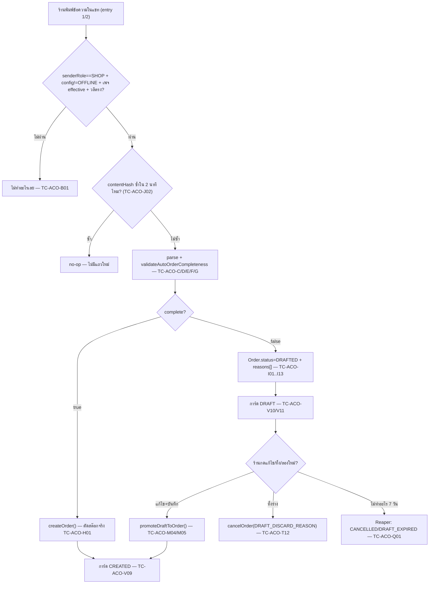

> **โมดูล:** M00061-AutoCreateOrder
> **ประเภทเอกสาร:** Test Case
> **เวอร์ชัน:** 1.0
> **วันที่จัดทำ:** 2026-08-30 (เขียนก่อน implement ตาม Hard Rule 11 — ไม่ใช่ backfill)
> **สถานะ:** Draft — รอ user review คู่กับเอกสารอื่น; **ทุกเคสยังไม่เคยรัน** เพราะโค้ดของฟีเจอร์นี้ยังไม่ถูกสร้าง (กลุ่ม A/B ใน SDS §2 ยังเป็น 0 ไฟล์)
> **เจ้าของเอกสาร:** safepay-qa (ดู [[Feature-Docs-Ownership]])

# Test Case: สร้างออเดอร์อัตโนมัติจากคำสั่งในแชท

---

## 1. Overview

ชุดทดสอบนี้ครอบทั้ง 26 TFR ของ [[SRS]] และ AC-ACO-01..79 (+68a) ของ [[BRD]] — ไล่ตามลำดับความเสี่ยงที่ [[SDS]] §7
กำหนด (pure function ก่อน → orchestration → ชั้นอ่าน/เขียน → cron → API-E2E → browser) ครอบทั้ง unit (pure function
ไม่แตะ DB), integration (service ยิงลง DB จริงผ่าน Prisma), API-E2E (route handler จริง) และ manual/browser QA
(จอจริงบน `seller.deepth.local:4000`)

- **เอกสารต้นทาง:** [[BRD]] (AC-ACO-01..79) ผูกกับ [[SRS]] (TFR-001..026) และ [[SDS]] (ไฟล์จริง/ชื่อฟังก์ชันจริง) —
  ทุก scenario อ้างกลับทั้ง AC-ACO และ TFR
- **ขอบเขตชุดทดสอบ (Scope):**
  - **In-scope:** ทุกไฟล์กลุ่ม A (11 ไฟล์ใหม่) + กลุ่ม B (16 จุดแก้ใน 12 ไฟล์เดิม) ตาม SDS §2, 11 endpoint ของ
    [[API]], หน้า A/B/C/D ของ [[UX-Design-Spec]]
  - **Out-of-scope:** TikTok, ร้านคิวงาน/บ้านพัก (ฟีเจอร์นี้ล็อกเฉพาะ `ONLINE_SALES` — มีเคส negative ยืนยันการล็อก
    แต่ไม่ทดสอบพฤติกรรมของ vertical อื่น), แชท DEEP ในแอปมือถือผู้ซื้อ, การส่งข้อความหาลูกค้าอัตโนมัติทุกรูปแบบ,
    AI ช่วยแกะข้อความ/fuzzy matching (ไม่มีอยู่จริงตาม PRD — ไม่มีเคสทดสอบว่า "ไม่ทำงาน" เพราะไม่มีโค้ดให้ทดสอบ)
- **สภาพแวดล้อม:**
  - Unit: Vitest local (`npx dotenv -e .env -- npx vitest run <path>`), ไม่แตะ DB — เฉพาะไฟล์ pure (`auto-order-normalize.ts`, `auto-order-parser.ts`, `auto-order-reasons.ts`)
  - Integration: Vitest ยิงลง dev DB ผ่าน Prisma client จริง (`.env` local Postgres) — ล้างข้อมูลด้วย
    `deleteTestData({ userIds, shopIds })` เท่านั้น (Hard Rule 13; ห้าม `deleteMany()` ไม่มี `where`)
  - API-E2E: `fetch()` ตรงเข้า route handler ผ่าน dev server หรือ Vitest ที่ import route module ตรง
  - Browser QA: `https://seller.deepth.local:4000` เท่านั้น (ห้าม `localhost`) — Chrome DevTools MCP + Playwright
    (`e2e/auto-order.spec.ts` — ยังไม่มีไฟล์ ต้องสร้างตอน implement)
  - cron: เรียก `GET /api/cron/auto-order-sweeper` ตรงด้วย `Authorization: Bearer ${CRON_SECRET}` (ไม่รอ schedule จริง)

### 1.1 หมายเหตุการติดป้าย

ทุกเคสติดป้ายที่บรรทัด **ระดับ:**
- **[blocker]** = เทสอัตโนมัติที่ต้องมีอยู่จริงและแดงได้เมื่อ mutation ตามที่ระบุถูกใส่กลับเข้าไป — **ห้าม merge ถ้าแดง**
  ชื่อไฟล์เทสยกมาจาก [[SRS]]/[[SDS]] ตรงๆ ที่ระบุไว้แล้ว ไม่ได้ตั้งใหม่
- **[manual]** = ต้องมีคนกดจริงบนเบราว์เซอร์ (`seller.deepth.local:4000`)
- **[e2e]** = Playwright script (`e2e/auto-order.spec.ts`)

### 1.2 Test Data — Pre-flight Setup (สคริปต์อ้างอิง ใช้ร่วมทุกกลุ่ม)

```ts
// scripts/qa/seed-auto-order.ts (ตัวอย่าง — เขียนจริงตอน implement)
// สร้าง: ร้าน ONLINE_SALES + เพจ Messenger ที่ GRANTED + สินค้า 2 ตัว + ห้องแชท 1 ห้อง
// ทุก id ที่สร้างเก็บไว้ใน scope object เพื่อ deleteTestData({ userIds, shopIds }) ตอนจบ
const shop = await prisma.shop.create({ data: { vertical: 'ONLINE_SALES', /* ... */ } });
const channel = await prisma.shopChannel.create({
  data: { shopId: shop.id, provider: 'MESSENGER', status: 'ACTIVE',
          messageEchoesStatus: 'GRANTED', messageEchoesCheckedAt: new Date() },
});
const productA = await prisma.product.create({ data: { shopId: shop.id, name: 'เสื้อยืดสีดำ', stockQty: 20, /* ... */ } });
const productB = await prisma.product.create({ data: { shopId: shop.id, name: 'กางเกงขาสั้น', stockQty: 20, /* ... */ } });
const conversation = await prisma.conversation.create({ data: { shopId: shop.id, shopChannelId: channel.id, /* ... */ } });
const config = await prisma.autoOrderAgentConfig.create({
  data: { shopId: shop.id, status: 'LIVE', createdByUserId: ownerUser.id },
});
await prisma.autoOrderAgentPhrase.create({ data: { configId: config.id, phrase: 'สรุปคำสั่งซื้อ', normalizedPhrase: 'สรุปคำสั่งซื้อ' } });
await prisma.autoOrderAgentChannel.create({ data: { configId: config.id, shopChannelId: channel.id } });
// cleanup ท้ายทุก describe: await deleteTestData({ userIds: [ownerUser.id], shopIds: [shop.id] })
```

- **ข้อความจุดชนวนอ้างอิง (ครบตามเทมเพลต):**
  ```
  สรุปคำสั่งซื้อ
  ชื่อ: สมชาย ใจดี
  เบอร์: 0812345678
  ที่อยู่: 99/1 ม.3 ต.บางรัก อ.เมือง จ.ชลบุรี 20000
  รายการ:
  - เสื้อยืดสีดำ x2 @250
  - กางเกงขาสั้น @390
  ส่วนลด: 50
  ยอดรวม: 840
  ```
  ✅ **ตัวเลขถูกต้องแล้ว — ห้ามแก้:** `2×250 = 500` · `500 + 390 = 890` · `890 − ส่วนลด 50 = **840**`
  (ร่างแรกของเอกสารนี้เคยเขียนว่าเลขนี้ผิดและควรเป็น 890 — **นั่นคือการอ่านผลรวม *ก่อน* หักส่วนลดมาเป็นคำตอบสุดท้าย**
  Controller ตรวจซ้ำแล้ว 2026-08-30 ยืนยันว่า **840 ถูก** · `UX-Design-Spec`/`PRD`/`BRD` **ไม่ต้องแก้**)
- **ทุก integration/API-E2E test ต้อง cleanup ด้วย `deleteTestData({ userIds, shopIds })` ใน `afterEach`/`afterAll` เสมอ**

---

## 2. Test Scenarios

### กลุ่ม A — การตั้งค่าต่อร้าน + สิทธิ์ + guard ระดับ vertical (TFR-001, 002, 003, 004)

**Setup:** ร้าน `ONLINE_SALES` 1 ร้าน (`shopA`) + ร้าน `SERVICE_QUEUE` 1 ร้าน (`shopB`, ไม่มี config) สำหรับเคส negative

#### TC-ACO-A01: สร้างชุดตั้งค่าครั้งแรกได้ค่าเริ่มต้นถูกต้อง — Linked to: AC-ACO-01, AC-ACO-04
- **Given** ร้าน `shopA` ยังไม่เคยมี `AutoOrderAgentConfig`
- **When** เรียก `getOrCreateAutoOrderConfig(shopA.id)`
- **Then** ได้แถวใหม่ `status='OFFLINE'` และมี `AutoOrderAgentPhrase` อย่างน้อย 1 แถว ค่า `phrase='สรุปคำสั่งซื้อ'`
- **ระดับ:** Integration

#### TC-ACO-A02: เพิ่มวลีจุดชนวนหลายวลี ไม่ต้องตั้งซ้ำทีละเพจ — Linked to: AC-ACO-01, AC-ACO-03
- **When** `upsertPhrases(configId, ['สรุปคำสั่งซื้อ', '/go'])` + `setChannels(configId, [channelA.id, channelB.id])`
- **Then** ทั้งสองวลีอยู่ครบ และชุดตั้งค่าเดียวมีผลกับทั้งสองเพจทันที (query `AutoOrderAgentChannel` ได้ 2 แถว)
- **ระดับ:** Integration

#### TC-ACO-A03: วลีซ้ำหลัง normalize ถูกปฏิเสธที่ server — Linked to: AC-ACO-01
- **When** เพิ่มวลี `"สรุปคำสั่งซื้อ"` ซ้ำ (ต่างแค่ช่องว่าง `"สรุป  คำสั่งซื้อ"`)
- **Then** ได้ `400 PHRASE_DUPLICATE` (P2002 จาก `@@unique([configId, normalizedPhrase])`) — ไม่ใช่เขียนซ้ำ
- **ระดับ:** Integration [blocker] (`auto-order-config.test.ts`) — **Mutation:** ถอด catch P2002 → ต้อง throw 500 ดิบแทน 400 ที่คาด → แดง

#### TC-ACO-A04: ลบวลีสุดท้ายไม่ได้ — Linked to: AC-ACO-01
- **Given** config มีวลีเดียว
- **When** เรียกลบวลีนั้น
- **Then** `400 PHRASE_MIN_ONE` — 🛑 **ต้องบล็อกที่ server แม้ปุ่มฝั่ง UI จะ disabled อยู่แล้ว** (client เรียก API ตรงได้เสมอ)
- **ระดับ:** Integration [blocker] (`auto-order-config.test.ts`) — **Mutation:** ลบเงื่อนไข `phrases.length<=1` → แดง (ลบสำเร็จเหลือ 0 วลี)

#### TC-ACO-A05: `/go` ไม่ถูกลบสัญลักษณ์ก่อนเทียบ — Linked to: AC-ACO-02
- **When** เรียก `normalizeTriggerPhrase('/go')`
- **Then** ได้ `'/go'` **ไม่ใช่** `'go'`
- **ระดับ:** Unit [blocker] (`src/lib/__tests__/auto-order-normalize.test.ts`) — **Mutation:** เปลี่ยน implementation ให้เรียก `normalizeMessage()` (ของ 00023 ที่ลบวรรคตอน) แทน → แดงทันที (ผลกลายเป็น `'go'`)

#### TC-ACO-A06: `normalizeTriggerPhrase` idempotent + คงวรรณยุกต์ไทย — Linked to: AC-ACO-02
- **Steps:** ไล่ตาราง input/output ของ SRS TFR-002 ทั้ง 5 แถว (`/go`, `สรุปคำสั่งซื้อ`, `SUMMARY Order`, `สรุป   คำสั่งซื้อ`, `  /go  `)
- **Expected:** ตรงคอลัมน์ output ทุกแถว และ `f(f(x)) === f(x)` ทุกกรณี
- **ระดับ:** Unit [blocker] (`auto-order-normalize.test.ts`)

#### TC-ACO-A07: สถานะเริ่มต้นหลังตั้งค่าครั้งแรกต้องเป็น "ปิด" — Linked to: AC-ACO-04
- ครอบด้วย TC-ACO-A01 อยู่แล้ว (`status='OFFLINE'`) — ไม่แยกเคสซ้ำ

#### TC-ACO-A08: โหมดซ้อมดักจับเฉพาะห้องทดสอบที่ระบุ — Linked to: AC-ACO-05
- **Given** config `status='TEST'` + `AutoOrderAgentTestThread` ผูกกับ `conversationX` เท่านั้น
- **When** พิมพ์ข้อความจุดชนวนครบใน `conversationX` และใน `conversationY` (ไม่ได้ผูกเป็นห้องทดสอบ)
- **Then** `conversationX` เกิดการ์ด `DRAFT` (dry-run) · `conversationY` **ไม่มีอะไรเกิดขึ้นเลย** (นับ `ChatMessage` type `AUTO_ORDER_RESULT` ก่อน/หลัง = 0)
- **ระดับ:** Integration [blocker] (`auto-order-detect.test.ts::"TEST mode scoped to test threads"`)

#### TC-ACO-A09: โหมดซ้อมไม่มีทางสร้างออเดอร์จริง แม้ข้อมูลครบทุกอย่าง — Linked to: AC-ACO-06 (🛑 ด่านบังคับ)
- **Given** config `status='TEST'` + ห้องทดสอบผูกแล้ว
- **When** พิมพ์ข้อความจุดชนวนที่ข้อมูลครบ 100% (เหมือน happy path กลุ่ม H) ในห้องทดสอบ
- **Then** ไม่มี `Order.status='PENDING'` เกิดขึ้นเลย — มีแต่ `DRAFTED, isDryRun=true`
- **ระดับ:** Integration [blocker] (`auto-order-detect.test.ts::"TEST mode never calls createOrder"`) — spy บน `createOrder` ต้อง **ไม่ถูกเรียกเลย** — **Mutation:** ลบเงื่อนไข `isDryRun` ก่อนเรียก `createOrder` → แดง

#### TC-ACO-A10: OWNER/ADMIN แก้ไขได้ · STAFF เห็นอย่างเดียว — Linked to: AC-ACO-07 ⚠️
- **Given** สมาชิกร้าน role `STAFF`
- **When** เรียก `PUT /api/seller/auto-order/config`
- **Then** `403` — ⚠️ **syntax เป๊ะยังค้าง (SRS §9 Q8)** ทดสอบตาม pattern สิทธิ์ของ 00023 (`auto-reply` config) ที่มีอยู่แล้ว — เคสนี้ **บล็อกไม่ได้จนกว่า SDS §3.7 จะปิด role-check syntax**; เมื่อปิดแล้วต้องเพิ่ม assertion ที่แน่นอน ไม่ใช่แค่ 403 ลอย ๆ
- **ระดับ:** Integration ⚠️ **pending open question — เขียนโครงเทสไว้ก่อน ยังไม่ mark [blocker] จนกว่าจะรู้ syntax จริง**

#### TC-ACO-A11: `GET` อ่านได้ทุก role ที่เข้าร้านได้ — Linked to: AC-ACO-07
- **Given** STAFF ที่เป็นสมาชิกร้าน
- **When** `GET /api/seller/auto-order/config`
- **Then** `200` พร้อมข้อมูลเต็ม (ไม่ redact) — อ่านได้ แก้ไม่ได้
- **ระดับ:** Integration

#### TC-ACO-A12: ร้าน `SERVICE_QUEUE`/`LODGING` ไม่เห็นเมนู — Linked to: AC-ACO-08
- **Given** ร้าน `shopB` (`vertical='SERVICE_QUEUE'`)
- **When** โหลดเมนูตั้งค่าฝั่งร้าน (`seller-menu.ts` allow-list)
- **Then** ไม่มีรายการ "สร้างออเดอร์อัตโนมัติจากคำสั่งในแชท" ในผลลัพธ์
- **ระดับ:** Unit

#### TC-ACO-A13: เรียก API ตรงจากร้านที่ไม่ใช่ ONLINE_SALES ต้องถูกปฏิเสธที่ server — Linked to: AC-ACO-09 (🛑 ด่านบังคับ)
- **Given** session ของร้าน `shopB` (`SERVICE_QUEUE`)
- **When** เรียก `PUT /api/seller/auto-order/config` ตรง (ข้ามเมนู ไม่ผ่าน UI เลย)
- **Then** `403` — **ไม่ใช่แค่เมนูถูกซ่อน**
- **ระดับ:** Integration [blocker] (`src/app/api/seller/auto-order/__tests__/vertical-guard.test.ts`) — เรียกด้วยร้าน `SERVICE_QUEUE` **และ** `LODGING` แยก 2 เคสย่อย — **Mutation:** comment out เงื่อนไข vertical ใน route → แดง

#### TC-ACO-A14: เพจเก่าที่ยังไม่ผ่านสิทธิ์ เปิด TEST/LIVE ไม่ได้ — Linked to: AC-ACO-10, AC-ACO-04
- **Given** เพจที่ `messageEchoesStatus='UNKNOWN'` (ค่า default ของเพจที่เชื่อมไว้ก่อนฟีเจอร์นี้)
- **When** `setAutoOrderStatus(shopId, 'LIVE', actorUserId)` โดยเพจนี้ถูกเลือกไว้ในชุดตั้งค่า
- **Then** throw `MessageEchoesNotGrantedError` — สถานะยังเป็น `OFFLINE`/สถานะเดิม ไม่เปลี่ยน
- **ระดับ:** Integration [blocker] (`auto-order-config.test.ts::"เปิด LIVE ต้องมีเพจ GRANTED ทุกใบ"`) — **Mutation:** ลบเงื่อนไข `messageEchoesStatus==='GRANTED'` → แดง (เปิด LIVE สำเร็จทั้งที่เพจไม่ผ่าน)

#### TC-ACO-A15: สถานะสิทธิ์มาจากการเรียก Graph จริง ไม่ derive จากวันที่เชื่อมเพจ — Linked to: AC-ACO-10, AC-ACO-73, AC-ACO-74 (🛑 ด่านบังคับ)
- **When** เรียก `checkMessageEchoesHealth(shopChannelId)`
- **Then** มี network call ไปยัง `GET /{page-id}/subscribed_apps?fields=subscribed_fields` จริง (mock Graph client แล้วยืนยันว่าถูกเรียก)
- **ระดับ:** Integration [blocker] (`message-echoes-health.test.ts::"เรียก Graph จริงไม่ derive จากวันที่เชื่อม"`) — `expect(graphClientSpy).toHaveBeenCalled()` — **เทสที่แค่ตรวจว่า DB คอลัมน์ถูกอ่านไม่ผ่านเกณฑ์นี้**

#### TC-ACO-A16: default ของ `messageEchoesStatus` ต้องเป็น `UNKNOWN` ไม่ใช่ `GRANTED` — Linked to: AC-ACO-10 (สืบเนื่องจาก Scenario 5 ของ BRD)
- **Given** สร้างแถว `ShopChannel` ใหม่ (migration เพิ่มคอลัมน์นี้กับแถวเก่าทุกแถวด้วย)
- **When** query ค่า default
- **Then** `messageEchoesStatus='UNKNOWN'`, `messageEchoesCheckedAt=NULL` — **ถ้า default เป็น `GRANTED` เพจเก่าทุกแถวจะเปิด LIVE ได้ทันทีโดยไม่ผ่าน AC-10** (ตรง Scenario 5 ของ BRD เป๊ะ)
- **ระดับ:** Integration [blocker] — ตรวจ schema/migration ตรง ๆ (query ค่า default หลัง migrate)

#### TC-ACO-A17: เครือข่ายล่ม → เขียน `UNKNOWN` ไม่ throw ไม่ทิ้งค่าเดิม — Linked to: AC-ACO-73, AC-ACO-74
- **Given** Graph client mock ให้ throw network error
- **When** `checkMessageEchoesHealth()`
- **Then** เขียน `messageEchoesStatus='UNKNOWN'` + `messageEchoesCheckedAt=now()` (ไม่ throw, ไม่ปล่อยค่าเดิมค้าง)
- **ระดับ:** Integration

#### TC-ACO-A18: ปุ่ม "ซ่อมให้" — GET ล้มแล้วห้ามยิง POST เด็ดขาด — Linked to: AC-ACO-73 (🛑 ด่านบังคับ — API §4.6)
- **Given** mock `GET subscribed_apps` ให้ล้ม (timeout/shape ผิด)
- **When** `repairMessageEchoes(shopChannelId)`
- **Then** `POST subscribed_fields` **ไม่ถูกเรียกเลย** — คืน `502`
- **ระดับ:** Integration [blocker] (`message-echoes-health.test.ts::"repair ห้ามยิง POST ถ้า GET ล้ม"`) — **Mutation:** ลบเงื่อนไข early-return หลัง GET ล้ม → แดง (POST ถูกเรียกด้วยชุด field ไม่ครบ = ถอด subscription ฟีเจอร์อื่นทั้งระบบ)

#### TC-ACO-A19: `repairMessageEchoes` เป็น replace ทั้งชุด ไม่ทับ field เดิมของฟีเจอร์อื่น — Linked to: AC-ACO-73 (🛑 ด่านบังคับ)
- **Given** เพจมี `subscribed_fields` เดิม `['messages','message_deliveries']` (ฟีเจอร์อื่นใช้อยู่)
- **When** `repairMessageEchoes()` สำเร็จ
- **Then** payload ของ `POST` มี field เดิมครบ + `message_echoes` เพิ่มเข้าไป (`dedupe([...existing, 'message_echoes'])`) — **ไม่ใช่แค่ `['message_echoes']`**
- **ระดับ:** Integration [blocker] — **Mutation:** เปลี่ยน payload เป็นชุดใหม่ล้วน (ไม่ dedupe จาก existing) → แดง

#### TC-ACO-A20: LINE ไม่ถูกเรียกตรวจสิทธิ์เลย (short-circuit) — Linked to: AC-ACO-14, AC-ACO-16
- **Given** `shopChannel.provider='LINE'`
- **When** `checkMessageEchoesHealth(lineChannelId)`
- **Then** ไม่มี network call ไป Graph เลย — คืนทันที (ไม่มี `message_echoes` concept สำหรับ LINE)
- **ระดับ:** Unit [blocker]

---

### กลุ่ม B — จุดดักจับ + จับคู่วลี (TFR-005)

#### TC-ACO-B01: ข้อความฝั่งลูกค้าไม่ถูกดักแม้มีวลีจุดชนวนครบ — Linked to: AC-ACO-11 (🛑 ด่านบังคับ)
- **Given** นับ `Order` และ `ChatMessage(type='AUTO_ORDER_RESULT')` ในห้องนี้ก่อน = `(N_order, N_msg)`
- **When** ลูกค้า (`senderRole='BUYER'`) พิมพ์ข้อความที่มีวลีจุดชนวนครบทุกตัวอักษร + เทมเพลตครบ
- **Then** หลัง `detectAutoOrderTrigger()` จบ นับซ้ำต้องเท่าเดิม `(N_order, N_msg)` เป๊ะ — **ไม่ใช่แค่ตรวจว่าไม่มี error**
- **ระดับ:** Integration [blocker] (`auto-order-detect.test.ts::"BUYER role never triggers"`) — **Mutation:** ลบเงื่อนไข `senderRole==='SHOP'` → แดง (นับเพิ่มขึ้น)

#### TC-ACO-B02: entry 1 (Deep chat) กับ entry 2 (Meta echo) ให้ผลเหมือนกันทุกฟิลด์ — Linked to: AC-ACO-12, AC-ACO-13 (🛑 ด่านบังคับ)
- **When** ป้อนเนื้อหาเดียวกันทุกตัวอักษรเข้า (ก) `sendMessage()` จากกล่องแชท Deep และ (ข) เป็น echo ผ่าน webhook
- **Then** snapshot ผลลัพธ์ทุกฟิลด์ (ยกเว้น `id`/`createdAt`/`updatedAt`) เท่ากันเป๊ะ ทั้งกรณีออกเป็นออเดอร์จริงและกรณีตกร่าง (ชุด `reasons[]` ต้องเป็นเซตเดียวกัน)
- **ระดับ:** Integration [blocker] (`auto-order-parser-parity.test.ts`) — **Mutation:** แก้ entry 2 ให้เรียก parser คนละตัว (copy-paste แยก) → แดง

#### TC-ACO-B03: ทั้ง 2 entry ส่งแค่ `chatMessageId` ไม่ส่ง raw payload — Linked to: AC-ACO-12, AC-ACO-13
- **Steps:** เปิด import graph ของ `chat.service.ts` (B1) และ `webhook/route.ts` (B5) ยืนยันว่าเรียก `detectAutoOrderTrigger(chatMessageId)` พารามิเตอร์เดียว
- **Expected:** ไม่มี call site ใดส่ง object payload ดิบเข้าไปแทน — ตัวแกะโหลดข้อมูลเองจาก DB เสมอ
- **ระดับ:** [manual] code review ตอน implement (ยืนยันจาก import graph ตรง ๆ ตามที่ SRS ระบุว่า "reviewer ตรวจได้จาก import graph")

#### TC-ACO-B04: รองรับ Messenger/Instagram/LINE เท่านั้น — Linked to: AC-ACO-14
- **Steps:** เปิดหน้า A → ดู checkbox เลือกเพจ
- **Expected:** ตัวเลือกมีเฉพาะเพจ MESSENGER/INSTAGRAM/LINE ที่เชื่อมไว้ — ไม่มีตัวเลือก TikTok เลย (ไม่มี `ShopChannel.provider='TIKTOK'` ปรากฏในรายการแม้เชื่อมไว้จริง — เพราะฟีเจอร์นี้ query เฉพาะ 3 provider)
- **ระดับ:** [manual]

#### TC-ACO-B05: เลือกช่องทาง LINE → ข้อความกำกับปรากฏบนหน้าจอจริง — Linked to: AC-ACO-15 (N/A TFR — UX copy)
- **Given** ร้านมีเพจ LINE เชื่อมอยู่และเลือกไว้ในชุดตั้งค่า
- **When** เปิดหน้า A
- **Then** เห็นกล่องเตือนข้อความ: `"สำหรับ LINE ระบบอ่านได้เฉพาะข้อความที่คุณพิมพ์จากกล่องแชทของ Deep..."` ตรงคำใน UX-Design-Spec §หน้า A **บนหน้าจอจริง ไม่ใช่แค่ในเอกสาร**
- **ระดับ:** [manual] — ไม่มี TFR รองรับ (SRS §9: N/A) เพราะเป็น UI copy ล้วน; ทดสอบได้เฉพาะทางเบราว์เซอร์

#### TC-ACO-B06: พิมพ์จากแอป LINE OA Manager โดยตรงไม่ถูกดักจับ — Linked to: AC-ACO-16
- **Given** ร้านตั้งค่า LIVE ผ่าน LINE ไว้แล้ว
- **When** ร้านพิมพ์ข้อความจุดชนวนครบจาก **แอป LINE Official Account Manager โดยตรง** (ไม่ผ่านกล่องแชท Deep)
- **Then** ไม่มี echo เข้าระบบเลย — ไม่มีการ์ด ไม่มีออเดอร์ (ไม่มีกลไก echo ให้ LINE ส่งกลับ)
- **ระดับ:** [manual] — **ทดสอบไม่ได้แบบอัตโนมัติ** เพราะต้องใช้แอป LINE OA Manager จริงภายนอกระบบ; วิธี repro ที่ทำได้จริง: ยืนยันด้วย **negative code review** — grep ว่าไม่มี webhook topic ใดของ LINE ที่ ingest ข้อความจากฝั่งร้านเข้ามาเลย (`docs/conventions/backfill_capability_per_platform` ยืนยันแล้วว่า LINE backfill ทำไม่ได้เลย — คนละเรื่องแต่ยืนยันข้อจำกัดเดียวกัน)

#### TC-ACO-B07: จับคู่วลีเทียบบนข้อความดิบ ไม่ผ่าน normalize ของข้อความ — Linked to: AC-ACO-02
- **When** วลีจุดชนวนคือ `/go` และข้อความคือ `"/go   ชื่อ: ..."` (มีช่องว่างซ้ำหลัง `/go`)
- **Then** ยัง match ได้ (เพราะ `matchesTriggerPhrase` หาคำว่า `/go` เป็น substring บนข้อความดิบ ไม่ยุบช่องว่างของข้อความก่อน)
- **ระดับ:** Unit [blocker] (`auto-order-parser.test.ts`)

---

### กลุ่ม C — เทมเพลต 4 หัวข้อบังคับ (TFR-006)

#### TC-ACO-C01: แกะครบ 4 หัวข้อบังคับ + 4 หัวข้อเสริม — Linked to: AC-ACO-17
- **When** ป้อนข้อความอ้างอิงเต็มรูป (§1.2)
- **Then** `customerName='สมชาย ใจดี'`, `phone='0812345678'`, ที่อยู่ 4 ฟิลด์ครบ, `items.length===2`, `discount=50`, `statedTotal` ตามที่พิมพ์, `note=null`, `paymentMethod=null`
- **ระดับ:** Unit [blocker] (`auto-order-parser.test.ts`)

#### TC-ACO-C02: คำพ้องทุกคำแกะลงฟิลด์เดียวกัน — Linked to: AC-ACO-17
- **Steps:** ยิงคำพ้องทีละคำตามตาราง SDS §3.2 — `ชื่อผู้รับ`/`ผู้รับ` → `customerName`, `เบอร์โทร`/`โทร`/`เบอร์ติดต่อ`/`Tel` → `phone`, `ที่อยู่จัดส่ง`/`ที่อยู่จัดส่งสินค้า` → address, `รายการสินค้า`/`สินค้า` → `items`, `discount` → `discount`, `ยอด`/`รวม`/`total` → `statedTotal`, `note` → `note`, `ชำระ`/`วิธีชำระ`/`payment` → `paymentMethod`
- **Expected:** ทุกคำพ้องแกะลงฟิลด์เดียวกันกับคำหลัก (13 เคสย่อย)
- **ระดับ:** Unit [blocker] (`auto-order-parser.test.ts::"คำพ้องหัวข้อ"`) — ⚠️ ชุดคำใน SDS §3.2 ยังไม่ผ่าน ux review ตามที่ SDS ระบุไว้เอง ("เสนอชุดคำ ต้องตรวจกับ UX-Design-Spec.md อีกรอบก่อน implement") — ถ้าชุดคำเปลี่ยน ต้องอัปเดตเคสนี้ตาม

#### TC-ACO-C03: หัวข้อซ้ำในข้อความเดียว → field สเกลาร์ใช้ค่าล่าสุด — Linked to: AC-ACO-17
- **When** ข้อความมี `เบอร์: 0811111111` แล้วต่อมามี `เบอร์: 0822222222`
- **Then** `phone==='0822222222'` (ค่าหลังสุดชนะ)
- **ระดับ:** Unit [blocker] (`auto-order-parser.test.ts::"หัวข้อซ้ำ — ค่าล่าสุดชนะ"`)

#### TC-ACO-C04: หัวข้อ `รายการ:` ซ้ำ 2 ครั้ง → สะสมต่อกัน (append) ไม่ใช่ overwrite — Linked to: AC-ACO-17
- **When** ข้อความมี `รายการ:\n- เสื้อยืดสีดำ x2 @250` แล้วมี `รายการ:\n- กางเกงขาสั้น @390` อีกบล็อกในข้อความเดียวกัน
- **Then** `items.length===2` ทั้งคู่ปรากฏ (ไม่ใช่ overwrite เหลือแค่ตัวหลัง)
- **ระดับ:** Unit [blocker] (`auto-order-parser.test.ts::"รายการซ้ำ — สะสม"`) — **Mutation:** เปลี่ยนจาก push เป็น reassign array ใหม่ → แดง (`items.length===1`)

#### TC-ACO-C05: `รายการ:` ไม่มีบรรทัด `-` ตามมา → คืน `items: []` ไม่ throw — Linked to: AC-ACO-17
- **When** ข้อความมีแค่ `รายการ:` แล้วจบข้อความเลย
- **Then** `parseAutoOrderMessage()` คืนผลปกติ (ไม่ throw) และ `items` เป็น `[]`
- **ระดับ:** Unit [blocker]

#### TC-ACO-C06: หัวข้อที่ไม่รู้จักถูกครอบเข้า field ที่เปิดอยู่ — Linked to: AC-ACO-17
- **When** ที่อยู่มีบรรทัดต่อ `ใกล้เซเว่น` (ไม่ใช่หัวข้อที่รู้จัก) ต่อจาก `ที่อยู่:`
- **Then** ข้อความนั้นถูกต่อเข้า `addressLine` (ไม่ throw ไม่ทิ้ง)
- **ระดับ:** Unit

#### TC-ACO-C07: ไม่มีหัวข้อใดตรงเลย → ทุก field ว่าง → ตกร่างเชิงเนื้อหาหลายข้อ (ไม่ใช่ระดับระบบ) — Linked to: AC-ACO-17, AC-ACO-41
- **When** ข้อความคือแค่ `"สรุปคำสั่งซื้อ"` ตัวเดียว (ไม่มีบรรทัดอื่น)
- **Then** `reasons` มี `NO_PHONE, ADDRESS_INCOMPLETE, NO_ITEMS` (เชิงเนื้อหา — parser ทำงานสำเร็จ) — **ไม่มี** `PROCESSING_FAILED`
- **ระดับ:** Integration [blocker]

---

### กลุ่ม D — รายการสินค้า `- ชื่อ xN @ราคา` (TFR-007)

#### TC-ACO-D01: แกะชื่อ/จำนวน/ราคาครบตามรูปแบบ — Linked to: AC-ACO-18
- **Steps:** ยิง `- เสื้อยืดสีดำ x2 @250` และ `- กางเกงขาสั้น @390` (ไม่ระบุ `x`)
- **Expected:** แถวแรก `{rawName:'เสื้อยืดสีดำ', qty:2, price:250}` แถวสอง `{rawName:'กางเกงขาสั้น', qty:1, price:390}` (ไม่ระบุ = 1 ชิ้น)
- **ระดับ:** Unit [blocker] (`auto-order-parser.test.ts`)

#### TC-ACO-D02: ไม่มี `@ราคา` → `price: null` เสมอ ไม่ใช่ `0` — Linked to: AC-ACO-19 (🛑 ด่านบังคับ)
- **When** ยิง `- กางเกงขาสั้น` (ไม่มี `@ราคา` เลย)
- **Then** `items[0].price === null` (ไม่ใช่ `0`, ไม่ใช่ `undefined`)
- **ระดับ:** Unit [blocker] (`auto-order-parser.test.ts::"ไม่มี @ราคา ต้องไม่เป็น 0"`) — **Mutation:** `price: rawPrice ?? 0` → แดง

#### TC-ACO-D03: บรรทัดที่ไม่มี `@ราคา` → ไม่มี `Order` แถวใหม่ถูกสร้างเลย (นับก่อน/หลัง) — Linked to: AC-ACO-19 (🛑 ด่านบังคับ)
- **Given** นับ `Order` ของร้านก่อน = `N`
- **When** ข้อความครบทุกอย่าง (ชื่อ/เบอร์/ที่อยู่/ยอดรวม) **ยกเว้น** 1 บรรทัดสินค้าไม่มี `@ราคา`
- **Then** หลังประมวลผลจบ `Order.count({shopId})===N` เดิม (ไม่มีแถวใหม่ที่ `status='PENDING'`) — เกิดแค่ `DRAFTED` 1 แถวพร้อมเหตุผล `ITEM_PRICE_MISSING` เท่านั้น
- **ระดับ:** Integration [blocker] (`auto-order-detect.test.ts::"ไม่มี @ราคา — ห้ามสร้าง Order จริง"`) — **Mutation:** `price: rawPrice ?? 0` → แดงทั้ง unit (D02) และ integration นี้พร้อมกัน

---

### กลุ่ม E — จับคู่สินค้าตรงเป๊ะ + ปิด Quick-Create (TFR-008)

#### TC-ACO-E01: ชื่อสินค้าตรงเป๊ะ (ยุบช่องว่าง + ไม่สนตัวพิมพ์) จับคู่สำเร็จ — Linked to: AC-ACO-20
- **When** ร้านมีสินค้าชื่อ `"เสื้อยืดสีดำ"` และพิมพ์ `- เสื้อยืดสีดำ x2 @250` (ตรงเป๊ะ) และแยกอีกเคส `- เสื้อยืดสีดำ  x2 @250` (เว้นวรรคซ้ำ) และ `- Product-SKU001 @250` (พิมพ์เป็นรหัส SKU)
- **Then** ทั้ง 3 เคสจับคู่ได้ `matchedProductId` เดียวกัน → `createOrder()` ได้รับ `productId` เสมอ
- **ระดับ:** Integration [blocker] (`auto-order-validate.test.ts`)

#### TC-ACO-E02: สะกดผิด 1 ตัวอักษร → ไม่จับคู่ ไม่มี fuzzy — Linked to: AC-ACO-21
- **When** พิมพ์ `- เสื้อยืดสีดำก x2 @250` (เกินมา 1 ตัวอักษร)
- **Then** `matchedProductId===null` — ไม่มี fuzzy matching ใด ๆ
- **ระดับ:** Integration [blocker]

#### TC-ACO-E03: สินค้าไม่ตรง → ห้าม Quick-Create แม้ข้อมูลอื่นครบ (พิสูจน์ด้วยการนับ) — Linked to: AC-ACO-22, AC-ACO-37 (🛑 ด่านบังคับ)
- **Given** นับ `Product.count({shopId})` ก่อน = `N` และนับ `Order.count({shopId})` ก่อน = `M`
- **When** ส่งข้อความที่ข้อมูลส่วนอื่นครบทุกอย่าง (เบอร์/ที่อยู่/ยอดรวมตรง) **แต่ชื่อสินค้าสะกดผิด 1 ตัวอักษร**
- **Then** หลังจบ `Product.count({shopId})===N` เท่าเดิม **และ** `Order.count({shopId})===M` เท่าเดิม (ยกเว้นเพิ่ม 1 แถว `DRAFTED`) — ผลลัพธ์เป็นร่างเหตุผล `ITEM_NOT_MATCHED`
  - 🛑 **เหตุผลที่ต้องนับ `Product` แยกจากการเช็คว่าตกร่าง:** `Product` อาจถูกสร้างไปแล้ว **ก่อน** order ตกร่างด้วยเหตุอื่นทีหลังในลำดับการประมวลผล — เทสที่เช็คแค่ "ตกร่างไหม" จับความรั่วนี้ไม่ได้
- **ระดับ:** Integration [blocker] (`auto-order-detect.test.ts::"สินค้าไม่ตรง — ห้าม Quick-Create"`) — **Mutation:** เอาเงื่อนไข null-check ของ `matchedProductId` ออกจาก `validateAutoOrderCompleteness` → แดงเพราะ `product.count` เพิ่มขึ้น (Quick-Create เดิมทำงาน)

#### TC-ACO-E04: batch-fetch แคตตาล็อกครั้งเดียว ไม่ query ต่อรายการ (N+1 guard) — Linked to: TFR-008 (SDS §3.3, ยึด KPI 5 วิ)
- **Given** ข้อความมีรายการสินค้า 10 บรรทัด
- **When** `validateAutoOrderCompleteness()` ทำงาน (mock/spy Prisma query count)
- **Then** จำนวน query ไป `prisma.product.findMany` = **1 ครั้งเท่านั้น** (ไม่ใช่ 10 ครั้ง) รวมกับ query `shop.findUnique` อีก 1 ครั้ง = 2 query ต่อ 1 ข้อความเสมอ ไม่ว่ารายการจะมีกี่บรรทัด
- **ระดับ:** Integration [blocker] — **Mutation:** เปลี่ยนกลับไป loop เรียก `matchProductByRawName()` ทีละรายการ → แดง (query count = 10+)

#### TC-ACO-E05: จับคู่ case-insensitive เทียบเท่า SQL `mode:'insensitive'` — Linked to: AC-ACO-20 (SDS §3.3 — batch in-memory)
- **When** สินค้าในร้านชื่อ `"Product A"` และพิมพ์ `- product a @100`
- **Then** จับคู่สำเร็จ (JS `.trim().toLowerCase()` เทียบเท่า SQL insensitive)
- **ระดับ:** Unit

---

### กลุ่ม F — วันที่ออเดอร์ = เวลาข้อความจริง (TFR-009)

#### TC-ACO-F01: `createdAt` ของออเดอร์ = เวลาข้อความ ไม่ใช่เวลาประมวลผลเสร็จ (จำลองความหน่วง) — Linked to: AC-ACO-24
- **Given** `ChatMessage.createdAt = T` (เวลาที่ข้อความถูกส่งจริง)
- **When** จำลองการประมวลผลหน่วง (mock/delay) ให้ `detectAutoOrderTrigger()` เสร็จที่ `T + 30s`
- **Then** `Order.createdAt === T` เป๊ะ (ไม่ใช่ `T+30s`)
- **ระดับ:** Integration [blocker]

#### TC-ACO-F02: ข้อความเกินเพดาน 90 วัน → ตกร่างเหตุผล "เวลาเกินเพดาน" ไม่ถอยไปใช้เวลาปัจจุบัน — Linked to: AC-ACO-25, AC-ACO-39 (🛑 ด่านบังคับ)
- **Given** `ChatMessage.createdAt = now − 91 วัน` (เกินเพดาน `ORDER_BACKDATE_DAYS=90`)
- **When** ข้อความข้อมูลอื่นครบทุกอย่าง
- **Then** เกิด `DRAFTED` พร้อมเหตุผล `DATE_OUT_OF_WINDOW` **และไม่มี `Order.status='PENDING'` แถวใดถูกสร้างด้วยเวลาอื่นที่ไม่ใช่เวลาข้อความ** (นับก่อน/หลัง — ไม่ใช่แค่ตรวจว่ามีร่างเกิดขึ้น)
- **ระดับ:** Integration [blocker] (`auto-order-detect.test.ts::"เวลาเกินเพดาน — ห้าม fallback เวลาปัจจุบัน"`) — **Mutation:** ลบเงื่อนไข `isOrderDateInWindow()` ก่อนเรียก `createOrder` → แดง (สร้างออเดอร์จริงด้วยเวลาปัจจุบันแทน)

#### TC-ACO-F03: ล่วงหน้าเกิน 7 วัน (edge อีกฝั่ง) → ตกร่างเช่นกัน — Linked to: AC-ACO-25
- **Given** `ChatMessage.createdAt = now + 8 วัน` (เคสหายาก — ปกติ `createdAt` ของข้อความไม่ควรเป็นอนาคต แต่ทดสอบเผื่อ clock skew/backfill)
- **Then** เหตุผล `DATE_OUT_OF_WINDOW` เช่นกัน
- **ระดับ:** Integration

---

### กลุ่ม G — `validateAutoOrderCompleteness()` ชั้นบริสุทธิ์ (TFR-010)

#### TC-ACO-G01: เกณฑ์ครบตรงตาม AC-26 — Linked to: AC-ACO-26
- **Steps:** ป้อน input ที่มีเบอร์ถูกต้อง (06/08/09 ครบ 10 หลัก) + สินค้า ≥1 รายการครบชื่อ/จำนวน/ราคา + ที่อยู่ครบ (บ้านเลขที่+จังหวัด+รหัสไปรษณีย์ — **ไม่มีตำบล/อำเภอ**)
- **Expected:** `deriveDraftReasons()` คืน `[]` (ว่าง) → `complete===true`
- **ระดับ:** Unit [blocker] (`auto-order-reasons.test.ts`)

#### TC-ACO-G02: parity กับ `CreateOrderSchema` — ทุกเคสที่ฟอร์มปฏิเสธ ต้องถูกฟีเจอร์นี้ตีเป็น "ไม่ครบ" เหมือนกัน — Linked to: AC-ACO-27 (🛑 ด่านบังคับ)
- **Steps:** ไล่ทุก validation rule ที่ `CreateOrderSchema` (Valibot) ปฏิเสธ (เบอร์ผิดรูปแบบ, ที่อยู่ขาด province, ที่อยู่ขาด postcode, items ว่าง ฯลฯ) — แปลงเป็น input ของ `deriveDraftReasons()`
- **Expected:** ทุกเคส `deriveDraftReasons(...).length > 0` เสมอ
- **ระดับ:** Unit [blocker] (`auto-order-reasons.test.ts::"parity กับ CreateOrderSchema"`) — **Mutation:** ลบเงื่อนไข `ADDRESS_INCOMPLETE` ออก → แดง (เคสที่อยู่ขาดกลายเป็น `complete:true` ทั้งที่ฟอร์มปฏิเสธ)

#### TC-ACO-G03: ชั้นตรวจของฟีเจอร์นี้เป็นของตัวเอง ไม่เรียกผ่าน API validation ของฟอร์ม — Linked to: AC-ACO-27
- **Steps:** เปิด import graph ของ `auto-order-validate.service.ts` ยืนยันว่าไม่ import `CreateOrderSchema`/route ของฟอร์ม
- **Expected:** ไม่มี dependency ไปยัง API layer ของฟอร์มปกติ — เป็นชั้นตรวจอิสระ
- **ระดับ:** [manual] code review

#### TC-ACO-G04: `NO_PHONE` กับ `INVALID_PHONE` แยกกันไม่ปนกัน — Linked to: AC-ACO-32, AC-ACO-33
- **Steps (เคส A):** `phone=null` → เห็นเฉพาะ `NO_PHONE` ไม่มี `INVALID_PHONE`
- **Steps (เคส B):** `phone='0812345'` (มีเลขแต่ไม่ครบ 10 หลัก) → เห็นเฉพาะ `INVALID_PHONE` ไม่มี `NO_PHONE`
- **ระดับ:** Unit [blocker] (`auto-order-reasons.test.ts::"เบอร์ไม่พบ vs ไม่ถูกต้อง แยกกัน"`)

#### TC-ACO-G05: ยอดรวมเช็คเฉพาะเมื่อ items ผ่านครบ — ไม่ซ้ำเติมด้วย TOTAL_MISMATCH ปลอม — Linked to: TFR-010 ลำดับข้อ 5
- **Given** items มี 1 รายการที่ `price=null` (ยังไม่ครบ) + `statedTotal` ที่ไม่ตรงกับผลรวม (ซึ่งคำนวณไม่ได้อยู่แล้วเพราะ price เป็น null)
- **Then** `reasons` มี `ITEM_PRICE_MISSING` **ไม่มี** `TOTAL_MISMATCH` ปนมาด้วย
- **ระดับ:** Unit [blocker] (`auto-order-reasons.test.ts::"ไม่เช็คยอดรวมถ้า items ยังไม่ครบ"`) — **Mutation:** ย้าย total-check ไปก่อน item-check → แดง (`TOTAL_MISMATCH` โผล่ปนกับ `ITEM_PRICE_MISSING`)

#### TC-ACO-G06: สะสมทุกเหตุผล ห้าม short-circuit — Linked to: AC-ACO-41 (ครอบด้วย TFR-010 ด้วย)
- **Given** input ที่ผิดพร้อมกัน 4 จุด (ไม่มีเบอร์ + ที่อยู่ไม่ครบ + ไม่มีรายการ + — ยอดรวมข้ามเพราะ items ว่าง)
- **Then** `reasons.length===3` (`NO_PHONE, ADDRESS_INCOMPLETE, NO_ITEMS`) **ไม่ใช่ 1**
- **ระดับ:** Unit [blocker] (`auto-order-reasons.test.ts::"หลายเหตุผลพร้อมกัน"`) — **Mutation:** early-return หลัง push ตัวแรก → แดง

---

### กลุ่ม H — สร้างออเดอร์จริง: ตัดสต๊อก/ยอดรวม/ธงที่มา (TFR-011, 012, 013)

#### TC-ACO-H01: ตัดสต๊อกจริง พิสูจน์ด้วยการนับ ไม่ใช่แค่มี `StockMovement` — Linked to: AC-ACO-28 (🛑 ด่านบังคับ)
- **Given** seed `productA.stockQty=20`
- **When** ข้อความจุดชนวนสั่ง `productA` x2 (ข้อมูลครบ 100%)
- **Then** หลังสร้างออเดอร์จริง `productA.stockQty === 18` ตรงเป๊ะ (ไม่ใช่แค่เช็คว่ามีแถว `StockMovement` ใหม่ — สองอย่างนี้ไม่เท่ากันตามที่ AC ระบุเอง)
- **ระดับ:** Integration [blocker] (`auto-order-detect.test.ts::"ตัดสต๊อกจริง"`) — **Mutation:** bypass การเรียก `deductStockForOrderItems` → แดงเพราะ `stockQty` ไม่ลด (แม้ `StockMovement` ยังถูกสร้าง)

#### TC-ACO-H02: ยอดตรง → สร้างออเดอร์จริง; ยอดต่าง 1 บาท → ตกร่างพร้อมส่วนต่างเป็นตัวเลขบาท — Linked to: AC-ACO-29, AC-ACO-38
- **เคส A:** `statedTotal` ตรงกับ `sum(qty*price)` เป๊ะ → `complete=true`
- **เคส B:** `statedTotal` ต่าง 1 บาท → `reasons` มี `TOTAL_MISMATCH` และ dry-test/response มี `{stated, computed, diff:1}` (ไม่ใช่แค่ boolean)
- **ระดับ:** Integration [blocker]

#### TC-ACO-H03: `createdVia='CHAT_AUTO_ORDER'` เป็นคอลัมน์จริง แยกจาก 2 กลุ่มอื่น — Linked to: AC-ACO-30
- **Given** สร้าง 3 ออเดอร์: (ก) ผ่านฟีเจอร์นี้ (ข) POS/manual (`createdVia=NULL` หรือ `'MANUAL'`) (ค) ผูกจาก iShip (`createdVia='ISHIP_LINKED'`)
- **When** query แยกด้วย `createdVia='CHAT_AUTO_ORDER'`
- **Then** ได้เฉพาะแถว (ก) 100% ไม่ปนแถว (ข)/(ค)
- **ระดับ:** Integration [blocker]

#### TC-ACO-H04: แถบเตือน "ลูกค้ายังไม่เห็นสรุปนี้" ค้างจนกว่าร้านจะกดส่งเข้าแชท — Linked to: AC-ACO-31
- **Given** ออเดอร์ `createdVia='CHAT_AUTO_ORDER'` สร้างใหม่ ยังไม่มีข้อความ `type='ORDER', orderRefToken=token` ในเธรด
- **Then** derive แถบเตือนแสดง (helper คืน `true`)
- **When** ร้านกด "ส่งเข้าแชท" (สร้างบับเบิล `type='ORDER'` จริง)
- **Then** derive คืน `false` — แถบเปลี่ยนเป็นกลาง "ส่งสรุปให้ลูกค้าแล้ว"
- **ระดับ:** Integration [blocker] + [manual] ยืนยันภาพจริงบนการ์ดหน้า B

#### TC-ACO-H05: happy path เต็มรูป — ข้อความจุดชนวนครบ → ออเดอร์จริงทันที — Linked to: Scenario 1 ของ BRD (AC-11..31 รวม)
- **Given** ข้อความอ้างอิง §1.2 **ใช้ยอดรวม 840 ตามเดิม** (คำนวณถูกแล้ว — ดู §1.2)
- **When** ร้านพิมพ์ในกล่องแชท Deep
- **Then** ภายใน ~5 วิ (KPI) เกิด `Order.status='PENDING'`, `createdVia='CHAT_AUTO_ORDER'`, `stockQty` ลดตรง, การ์ด `CREATED` ปรากฏในเธรด
- **ระดับ:** [e2e] (`e2e/auto-order.spec.ts::"happy path"`) + [manual]

---

### กลุ่ม I — 9 เหตุผลตกร่าง: ยิงแยกทีละข้อ + รวมกัน + ระบบเดี่ยว (TFR-014)

> ตารางอ้างอิง (BRD FR-ACO-17): 1=NO_PHONE(AC-32) 2=INVALID_PHONE(AC-33) 3=ADDRESS_INCOMPLETE(AC-34) 4=NO_ITEMS(AC-35)
> 5=ITEM_PRICE_MISSING(AC-36=AC-19) 6=ITEM_NOT_MATCHED(AC-37=AC-22) 7=TOTAL_MISMATCH(AC-38=AC-29)
> 8=DATE_OUT_OF_WINDOW(AC-39=AC-25) 9=PROCESSING_FAILED(AC-40)

#### TC-ACO-I01: เหตุผล #1 — ไม่พบเบอร์โทรเลย — Linked to: AC-ACO-32
- **When** ข้อความไม่มีเลขรูปแบบเบอร์ปรากฏเลย (ไม่มีบรรทัด `เบอร์:`)
- **Then** `reasons` มี `NO_PHONE` เท่านั้นจากหมวดเบอร์
- **ระดับ:** Unit [blocker]

#### TC-ACO-I02: เหตุผล #2 — มีเลขหน้าตาเหมือนเบอร์แต่ไม่ผ่านกฎ — Linked to: AC-ACO-33
- **When** `เบอร์: 021234567` (เลข 9 หลัก ขึ้นต้น 0 แต่ไม่ใช่ 06/08/09) — เทียบกับ `MOBILE_PHONE_RE`
- **Then** `reasons` มี `INVALID_PHONE` เท่านั้น (ไม่ปนกับ `NO_PHONE`)
- **ระดับ:** Unit [blocker]

#### TC-ACO-I03: เหตุผล #3 — ต้องส่งของแต่ที่อยู่ขาด province/postcode — Linked to: AC-ACO-34
- **When** ที่อยู่มีแค่บ้านเลขที่ ไม่มีจังหวัด/รหัสไปรษณีย์ + สินค้าเป็น `PHYSICAL` (ต้องส่งของ)
- **Then** `reasons` มี `ADDRESS_INCOMPLETE`
- **ระดับ:** Unit [blocker]

#### TC-ACO-I04: เหตุผล #4 — ไม่มีบรรทัดขึ้นต้น `-` เลย — Linked to: AC-ACO-35
- **When** ไม่มี `รายการ:` หรือมีแต่ไม่มีบรรทัด `-` ตามมา
- **Then** `reasons` มี `NO_ITEMS`
- **ระดับ:** Unit [blocker]

#### TC-ACO-I05: เหตุผล #5 = TC-ACO-D03 (มีรายการแต่ไม่ระบุราคา — นับ Order ก่อน/หลัง) — Linked to: AC-ACO-36
- อ้างเคสเดียวกับ D02/D03 — ไม่ทำซ้ำ

#### TC-ACO-I06: เหตุผล #6 = TC-ACO-E03 (สินค้าไม่ตรง — นับ Product ก่อน/หลัง) — Linked to: AC-ACO-37
- อ้างเคสเดียวกับ E03 — ไม่ทำซ้ำ

#### TC-ACO-I07: เหตุผล #7 = TC-ACO-H02 เคส B (ยอดรวมไม่ตรง) — Linked to: AC-ACO-38
- อ้างเคสเดียวกับ H02 — ไม่ทำซ้ำ

#### TC-ACO-I08: เหตุผล #8 = TC-ACO-F02 (เวลาเกินเพดาน) — Linked to: AC-ACO-39
- อ้างเคสเดียวกับ F02 — ไม่ทำซ้ำ

#### TC-ACO-I09: เหตุผล #9 — ประมวลผลไม่สำเร็จ (จำลองงานเบื้องหลังล้มก่อนถึงตัวแกะ) — Linked to: AC-ACO-40
- **Given** seed `ChatMessage` ตรงวลีจุดชนวน `senderRole='SHOP'` ที่ `createdAt = now − 10 นาที` (อยู่ในหน้าต่าง 2–30 นาทีของ watchdog) และ **ไม่มี** `Order` ใดผูก `sourceChatMessageId` กับข้อความนี้ (จำลองว่า pipeline หลัก crash ก่อนเขียนผล — ไม่ได้เรียก `detectAutoOrderTrigger()` ตามปกติเลย)
- **When** เรียก `GET /api/cron/auto-order-sweeper` ตรงด้วย `CRON_SECRET`
- **Then** เกิด `Order.status='DRAFTED'` ที่ `reasons===['PROCESSING_FAILED']` ผูก `sourceChatMessageId` กับข้อความนั้น — **นี่คือวิธี repro ที่ทำได้จริง** (จำลอง "ไม่เคยเริ่ม/ล้มกลางทาง" ด้วยการไม่เรียก entry point ปกติเลย แทนการพยายามแทรก exception กลางฟังก์ชันจริงซึ่งเปราะบางกว่า)
- **ระดับ:** Integration [blocker] (`auto-order-sweeper.test.ts::"watchdog เขียน PROCESSING_FAILED"`)

#### TC-ACO-I10: หลายเหตุผลเชิงเนื้อหาแสดงครบพร้อมกัน — Linked to: AC-ACO-41
- อ้างเคส G06 — เพิ่มยืนยันที่ระดับ API: `POST /api/seller/auto-order/dry-test` คืน `reasons.length===3` ในรอบเดียว ไม่ทยอย
- **ระดับ:** Integration [blocker]

#### TC-ACO-I11: `PROCESSING_FAILED` เกิดเดี่ยว ๆ เสมอ ไม่ปนกับเหตุผลเชิงเนื้อหา — Linked to: AC-ACO-42 (🛑 ด่านบังคับ)
- **Steps:** สแกนซอร์ส `src/lib/auto-order-reasons.ts` หาสตริง `'PROCESSING_FAILED'`
- **Expected:** พบ**เฉพาะใน type definition** (`DraftReasonCode`) — ไม่พบใน branch ใดของฟังก์ชัน `deriveDraftReasons()`
- **ระดับ:** Unit [blocker] (`auto-order-detect.test.ts::"PROCESSING_FAILED ไม่ปนเหตุผลเชิงเนื้อหา"`) — **Mutation:** เพิ่ม `reasons.push('PROCESSING_FAILED')` เข้าไปใน branch ใดก็ได้ → แดงทันที
- **ระดับ (เสริม):** Integration — ยืนยันด้วยสถาปัตยกรรม: มีแค่ 2 ฟังก์ชันในระบบเขียน `draftReasons` (`writeAutoOrderDraft` ที่ไม่เคยผลิตค่านี้เอง / `writeProcessingFailedDraft` ที่เรียกจาก Watchdog เท่านั้นและ signature ไม่รับ parameter อื่น) → ไม่มีจุดใดที่ 2 อาร์เรย์มารวมกัน

#### TC-ACO-I12: ไม่มีปุ่มเปิดฟอร์มแก้ไขเมื่อเป็นเหตุผลระดับระบบ — Linked to: AC-ACO-43
- **Given** ร่างที่ `reasons=['PROCESSING_FAILED']`
- **When** เปิดการ์ดในหน้า B
- **Then** เห็นเฉพาะปุ่ม "ลองอ่านข้อความนี้อีกครั้ง" + "ทิ้งร่างนี้" — **ไม่มี** ปุ่ม "แก้ไขคำสั่งซื้อ" (จะเปิดฟอร์มเปล่าซึ่งโกหก)
- **ระดับ:** [manual] (backend ส่งสัญญาณผ่าน `reasons` array — การ render ปุ่มอยู่ที่ UX ตาม SRS §9 หมายเหตุ)

#### TC-ACO-I13: ลำดับแสดงเหตุผล = เบอร์ → ที่อยู่ → วันที่ → รายการ → ยอดรวม — Linked to: AC-ACO-44
- **Given** เหตุผลที่เกิดพร้อมกัน: `TOTAL_MISMATCH, NO_PHONE, ADDRESS_INCOMPLETE, DATE_OUT_OF_WINDOW, NO_ITEMS` (ป้อนไม่เรียง)
- **When** `sortDraftReasons(reasons)`
- **Then** ผลลัพธ์เรียง `[NO_PHONE, ADDRESS_INCOMPLETE, DATE_OUT_OF_WINDOW, NO_ITEMS, TOTAL_MISMATCH]` ตรงลำดับ `QuickForm.tsx` จริง (`CustomerQuickBlock → ChannelPaymentSelect → OrderDateRow → QuickLineItem → QuickSummaryPanel`)
- **ระดับ:** Unit [blocker] (`auto-order-reasons.test.ts::"sortDraftReasons ตามลำดับฟอร์มจริง"`) — **Mutation:** สลับตำแหน่ง `DATE_OUT_OF_WINDOW` ไปท้ายสุด → แดง (ต้องอยู่ตำแหน่งที่ 3 ไม่ใช่ท้ายสุด — จุดที่ ux แก้จากร่างแรกของตัวเอง)

---

### กลุ่ม J — ข้อความจุดชนวนซ้ำในห้องเดียวกัน (TFR-015)

#### TC-ACO-J01: เนื้อหาต่างกัน (แม้ตัวอักษรเดียว) → สร้างใบใหม่เสมอ ห้ามอัปเดตใบเดิม — Linked to: AC-ACO-45 (🛑 ด่านบังคับ)
- **Given** ส่งข้อความจุดชนวนที่ 1 → `order1` ถูกสร้าง; snapshot `order1` ทุกฟิลด์
- **When** ส่งข้อความจุดชนวนที่ 2 ในห้องเดียวกัน (ต่างกันแค่ 1 ตัวอักษร — เช่นเปลี่ยน `x2`→`x3`)
- **Then** เกิด `order2` แถวใหม่ · snapshot `order1` ก่อน/หลัง **เท่ากันทุกฟิลด์ไม่มีข้อยกเว้น** (ไม่ถูกแก้)
- **ระดับ:** Integration [blocker] (`auto-order-detect.test.ts::"เนื้อหาต่าง — ใบใหม่เสมอ"`)

#### TC-ACO-J02: เนื้อหาเหมือนเดิมทุกตัวอักษรภายใน 2 นาที → ไม่สร้างอะไรเพิ่มเลย — Linked to: AC-ACO-46 (🛑 ด่านบังคับ)
- **Given** ส่งข้อความจุดชนวน → `order1` ถูกสร้าง; นับ `Order`+ร่างของห้องนี้ = `N`
- **When** ส่งข้อความ**เนื้อหาเดียวกันทุกตัวอักษร**อีกครั้งภายใน 2 นาที (จำลองส่งซ้ำเพราะเน็ตค้าง)
- **Then** นับซ้ำ = `N` เท่าเดิม (ไม่มีแถวใหม่ ไม่มีการ์ดใหม่)
- **ระดับ:** Integration [blocker] (`auto-order-detect.test.ts::"เนื้อหาเหมือนเดิม — no-op"`) — **Mutation:** ถอดเงื่อนไข `contentHash` dedup ออก → แดง (นับเพิ่มเป็น N+1)

#### TC-ACO-J03: `contentHash` ต้องมาจากข้อความดิบ ไม่ผ่าน normalize — Linked to: TFR-015
- **When** เปรียบเทียบ `computeContentHash('สรุปคำสั่งซื้อ A')` กับ `computeContentHash('สรุปคำสั่งซื้อ  A')` (ต่างแค่ช่องว่างซ้ำ)
- **Then** hash **ไม่เท่ากัน** — ถ้า normalize ก่อน hash ช่องว่างจะถูกยุบแล้ว hash จะเท่ากันผิดกฎ
- **ระดับ:** Unit [blocker] (`auto-order-normalize.test.ts`) — **Mutation:** เปลี่ยนให้ hash จาก `normalizeTriggerPhrase(rawBody)` → แดง

#### TC-ACO-J04: dedup scope ต่อห้องแชท ไม่ใช่ต่อร้าน — Linked to: TFR-015 (DATABASE §3.0(1))
- **Given** ลูกค้า 2 คนพิมพ์ข้อความเนื้อหาเหมือนกันทุกตัวอักษรในคนละห้องแชทของร้านเดียวกัน ภายใน 2 นาที
- **Then** ทั้งสองห้องได้ผลลัพธ์เป็นของตัวเอง (ไม่ dedup ข้ามห้อง) — เกิด 2 แถวแยกกัน
- **ระดับ:** Integration [blocker]

#### TC-ACO-J05: เกิน 2 นาที → เนื้อหาเดิมเดินเข้าเต็มเส้นทาง (ไม่ dedup) — Linked to: TFR-015
- **Given** `order1` สร้างจากข้อความ X ที่เวลา T
- **When** ส่งข้อความเนื้อหา X **เดียวกันทุกตัวอักษร**อีกครั้งที่เวลา `T+3 นาที`
- **Then** ไม่ถูก dedup — เดินเข้าสู่ TFR-016 เต็มเส้นทาง (มีสิทธิ์กลายเป็นใบที่แทนที่ `order1`)
- **ระดับ:** Integration

---

### กลุ่ม K — `supersedesOrderId` + ปุ่มยกเลิกใบเก่า (TFR-016, 017)

#### TC-ACO-K01: `supersedesOrderId` ชี้ใบล่าสุดจริง ข้ามใบที่เป็นร่างระหว่างทาง — Linked to: AC-ACO-47 (🛑 ด่านบังคับ)
- **Given** `msg1` → `order1` (ออเดอร์จริง); `msg2` (เนื้อหาต่าง เกิน 2 นาที) → ตกร่าง `DRAFTED`; `msg3` (เนื้อหาต่างอีก) → `order3` ออเดอร์จริง
- **Then** `order3.supersedesOrderId === order1.id` **ไม่ใช่** ใบร่างจาก `msg2`
- **ระดับ:** Integration [blocker] (`auto-order-detect.test.ts::"supersedesOrderId ข้ามใบร่างระหว่างทาง"`)

#### TC-ACO-K02: 2 ข้อความจุดชนวนต่างกันภายในนาทีเดียว (เคสปกติ) ไม่ถูกจับคู่เป็น "แทนที่กัน" อัตโนมัติแบบผิดพลาด — Linked to: AC-ACO-47
- **Given** ห้องเดียวกัน — ลูกค้าสั่งของ 2 อย่างแยกกันภายในนาทีเดียว เนื้อหาต่างกันจริง (ไม่ใช่การแก้ไข)
- **Then** ทั้งสองใบถูกสร้างเป็นออเดอร์จริงแยกกัน (คนละ `productId`/คนละยอด) — `order2.supersedesOrderId` ยังคงชี้ตามกฎ query จริง (ใบล่าสุดที่ `status<>DRAFTED`) ซึ่งเป็นพฤติกรรมของระบบตามที่ TFR-016 ยอมรับเป็นความเสี่ยง (การ์ดจะขึ้น "มาแทนใบก่อนหน้า" แม้เจตนาจริงคือสั่งเพิ่ม) — เคสนี้ **ยืนยันพฤติกรรมที่ยอมรับแล้ว ไม่ใช่บั๊ก** ตามที่ SRS TFR-016 ระบุไว้ตรงๆ ว่าความเสียหายจำกัดแค่ป้ายที่ทำให้งง เพราะยกเลิกต้องกดเองเสมอ
- **ระดับ:** Integration — บันทึกเป็น known-limitation ไม่ใช่ blocker

#### TC-ACO-K03: การ์ดใบใหม่แสดง "มาแทนใบก่อนหน้า" + ลิงก์ + ปุ่มยกเลิก — Linked to: AC-ACO-48 (N/A TFR — UI, ข้อมูลจาก K01)
- **Steps:** เปิดห้องแชทของเคส K01 ในเบราว์เซอร์จริง
- **Expected:** การ์ดของ `order3` มี sub-notice "แทนที่ {orderNo ของ order1}" ที่กดแล้วไปหน้า order1 ได้จริง + ปุ่ม "ยกเลิกใบเก่า"
- **ระดับ:** [manual]

#### TC-ACO-K04: ปุ่มยกเลิกใบเก่าต้องเป็นการกระทำที่ผู้ขายกดเองเสมอ (spy ไม่ใช่สถานะปลายทาง) — Linked to: AC-ACO-49 (🛑 ด่านบังคับ)
- **Given** `vi.spyOn(orderService, 'cancelOrder')`; seed ห้องที่มีออเดอร์เก่า
- **When** รัน pipeline เต็มด้วยเนื้อหาต่าง (สร้างใบใหม่ที่ `supersedesOrderId` ชี้ใบเก่า)
- **Then** `expect(spy).not.toHaveBeenCalled()` — 🛑 **ห้ามเขียนเทสที่เช็ค `oldOrder.status !== 'CANCELLED'` แทน** เพราะใบเก่าอาจถูกยกเลิกไปแล้วจากเหตุอื่น (สต๊อกหมด) ทำให้เทสแบบนั้นเขียวปลอมได้แม้ pipeline เรียก `cancelOrder` เองจริง ๆ
- **ระดับ:** Integration [blocker] (`auto-order-detect.test.ts::"detectAutoOrderTrigger ไม่เรียก cancelOrder เอง"`) — **Mutation:** เพิ่ม `if (supersedesOrderId) await cancelOrder(...)` เข้า pipeline → spy แดงทันที

#### TC-ACO-K05: ยกเลิกได้เฉพาะใบที่ยังไม่ถึง CONFIRMED — Linked to: AC-ACO-50
- **เคส A:** ใบเก่าสถานะ `PENDING`/`SHIPPED` → กด "ยกเลิกใบเก่า" สำเร็จ
- **เคส B:** ใบเก่าสถานะ `CONFIRMED` → ปุ่มแสดงสถานะ "ยกเลิกไม่ได้แล้ว" ทันที (**ไม่ใช่กดแล้วเจอ error** — เช็คสถานะก่อน render ปุ่ม)
- **ระดับ:** Integration + [manual] (ยืนยันว่า UI ไม่ยอมให้กดในเคส B เลย ไม่ใช่กดแล้วโชว์ toast error)

#### TC-ACO-K06: ยกเลิกใบเก่าคืนสต๊อกอัตโนมัติ — Linked to: AC-ACO-51
- **Given** ยกเลิก Scenario 1 → 2/3 ของ H01
- **Then** `stockQty` กลับมา `20` เท่าเดิม (นับก่อน/หลังแบบเดียวกับ H01)
- **ระดับ:** Integration [blocker]

#### TC-ACO-K07: มีพัสดุ iShip `status='CREATED'` → กล่องเตือนแยก บนหน้าจอยืนยัน — Linked to: AC-ACO-52 🛑 **GAP — ยังไม่มี component รองรับ (SDS §7, API §4.1)**
- **สถานะ:** ⚠️ **ทดสอบไม่ได้ในตอนนี้** — `POST /api/orders/[token]/cancel` (route ที่ปุ่มนี้ reuse ตรง) **ไม่เคยตรวจ `OrderShipment.status='CREATED'` เลยในโค้ดปัจจุบัน** และ SDS ยังไม่มีชื่อ endpoint ที่ query สถานะนี้ก่อนเปิด Swal — **ไม่ใช่ยังไม่ได้เทส แต่เป็นฟีเจอร์ที่ยังไม่มีให้เทส**
- **เมื่อ implement แล้ว ต้องมีเคส:** (ก) ใบเก่ามี `OrderShipment.status='CREATED'` → Swal มีกล่องเตือนแยก (ไม่ใช่ toast) ข้อความ "ใบนี้เปิดพัสดุกับขนส่งไปแล้ว ระบบจะไม่ยกเลิกพัสดุให้ ต้องจัดการเองที่ iShip" (ข) ใบเก่าไม่มีพัสดุ → **ไม่มี**กล่องนี้ปรากฏเลย
- **ระดับ:** **BLOCKED** (dev ต้อง implement ก่อน — track เป็น open gap ใน §6 ของเอกสารนี้)

#### TC-ACO-K08: เหตุผลยกเลิกที่บันทึกคือ `DUPLICATE_ORDER` — Linked to: AC-ACO-53
- **Then** `order1.cancelReason === 'DUPLICATE_ORDER'` หลังยกเลิกสำเร็จ
- **ระดับ:** Integration [blocker]

#### TC-ACO-K09: `DUPLICATE_ORDER` ไม่อยู่ใน allow-list ความผิดผู้ซื้อ — Linked to: OD-ACO-01 (BRD)
- **Steps:** ตรวจ `src/lib/cancel-reason-buyer-fault.ts::BUYER_FAULT_CANCEL_REASONS`
- **Expected:** ไม่มี `'DUPLICATE_ORDER'` อยู่ในลิสต์ + มีคอมเมนต์กำกับ "จงใจไม่อยู่ในแมปนี้" ที่ตัวค่าเอง
- **ระดับ:** Unit [blocker] (`cancel-reason-db-constraint.test.ts` — อัปเดตตามที่ BRD OD-ACO-01 ระบุ) — **Mutation:** เพิ่ม `'DUPLICATE_ORDER'` เข้า allow-list → แดง

#### TC-ACO-K10: เนื้อหาเหมือนเดิม → ไม่มีการ์ด "มาแทนใบก่อนหน้า" เกิดขึ้นเลย — Linked to: AC-ACO-54
- อ้างเคส J02 (no-op) — ยืนยันเพิ่มว่าไม่มีการ์ด sub-notice ปรากฏ (เพราะไม่มีแถวใหม่ตั้งแต่ต้น)
- **ระดับ:** Integration

---

### กลุ่ม L — แก้ไข/ถอนข้อความจุดชนวนภายหลัง (TFR-018)

#### TC-ACO-L01: ข้อความที่สร้างผลลัพธ์แล้วถูกแก้ไข (message_edits) → ผลลัพธ์ไม่เปลี่ยนฟิลด์ใดเลย — Linked to: AC-ACO-55
- **Given** `order1` เกิดจาก `msg1`; snapshot `order1` ทุกฟิลด์
- **When** ร้านแก้ไข `msg1` ผ่าน Meta `message_edits` (`ingestMessageEdit()`)
- **Then** `order1` เหมือนเดิมทุกฟิลด์ (snapshot ก่อน/หลังเท่ากัน) — และมีข้อความภายในใหม่แจ้ง "ข้อความต้นทางถูกแก้ไข" ในเธรด
- **ระดับ:** Integration [blocker]

#### TC-ACO-L02: ข้อความถูกถอนคืน (unsend) → ผลลัพธ์ไม่ถูกยกเลิก/ลบ/เปลี่ยนสถานะอัตโนมัติ — Linked to: AC-ACO-56
- **When** ร้านถอนคืน `msg1` (`is_deleted`)
- **Then** `order1.status` ไม่เปลี่ยน (ยังเป็นสถานะเดิม) — ไม่มีการยกเลิกอัตโนมัติ
- **ระดับ:** Integration [blocker]

#### TC-ACO-L03: ทั้ง 2 กรณีแจ้งผู้ขายให้รู้ในการ์ด/ประวัติ — Linked to: AC-ACO-57
- **Steps:** ยืนยันว่ามีข้อความภายในชนิด `SOURCE_EDITED`/`SOURCE_UNSENT` เกิดในเธรด แต่ **ไม่แตะแถว `Order` เลย**
- **ระดับ:** Integration [blocker] — **Mutation:** เพิ่มโค้ดที่แตะ `Order.status` ใน `ingestMessageEdit`/unsend handler → แดง

---

### กลุ่ม M — ร่าง = `Order.status='DRAFTED'`: state machine (TFR-019)

#### TC-ACO-M01: `assertTransition` อนุญาตเฉพาะ `DRAFTED→PENDING`/`DRAFTED→CANCELLED` — Linked to: AC-ACO-79 (🛑 ด่านบังคับ)
- **เคส A:** seed `DRAFTED` → เรียก `assertTransition('DRAFTED','PENDING')` → ผ่าน
- **เคส B:** seed `DRAFTED` → เรียก `assertTransition('DRAFTED','CANCELLED')` → ผ่าน
- **เคส C:** seed `DRAFTED` → เรียก `confirmOrder()` (ซึ่งเรียก `assertTransition('DRAFTED','CONFIRMED')` ภายใน) → **ต้อง throw**
- **ระดับ:** Integration [blocker] (`order.service.test.ts::"DRAFTED→CONFIRMED ต้องถูกปฏิเสธ"`) — **Mutation:** เพิ่ม `DRAFTED` เข้า path ที่อนุญาตของ `confirmOrder` → แดง

#### TC-ACO-M02: ไม่มี status เดิมตัวไหน transition **เข้า** `DRAFTED` ได้ — Linked to: TFR-019
- **Steps:** ไล่ `VALID_TRANSITIONS` ทั้งตาราง หา key ใดที่มี `"DRAFTED"` อยู่ใน value array
- **Expected:** ไม่มีเลย (`DRAFTED` เกิดได้จาก INSERT ตอนสร้างร่างครั้งแรกเท่านั้น)
- **ระดับ:** Unit [blocker]

#### TC-ACO-M03: แถว `DRAFTED` มี `orderNo=NULL`, ไม่ตัดสต๊อก, `totalAmount=0` เสมอ — Linked to: AC-ACO-77 (🛑 ด่านบังคับ)
- **Given** นับ `stockQty` ก่อน = `N`
- **When** ข้อความตกร่าง (เหตุผลใดก็ได้)
- **Then** `Order.orderNo===null`, `Order.totalAmount===0` (แม้ร้านพิมพ์ `ยอดรวม: 5000` มา — ไม่มีเส้นทางใดเขียนยอดที่พิมพ์ลง `totalAmount`), `stockQty===N` เท่าเดิม (ไม่ตัด)
- **ระดับ:** Integration [blocker] (`auto-order-detect.test.ts::"DRAFTED เขียน totalAmount=0 เสมอ"`) — **Mutation:** เขียน `totalAmount: draftStatedTotalAmount` แทน `0` → แดง

#### TC-ACO-M04: `promoteDraftToOrder()` เลื่อนขั้นครบ 3 อย่างในทรานแซกชันเดียว — Linked to: AC-ACO-78
- **Given** ร่างที่ผู้ขายกดฟอร์มแก้ไขจนครบแล้ว (เช่น เติมราคาสินค้าที่ขาด)
- **When** บันทึกฟอร์ม → `promoteDraftToOrder(shopId, publicToken, formData, actorUserId)`
- **Then** ในทรานแซกชันเดียว: `orderNo` ถูกคำนวณ (ไม่ใช่ `NULL` อีกต่อไป) + `stockQty` ถูกตัดจริง (นับก่อน/หลัง) + `totalAmount` คำนวณจริง (ไม่ใช่ 0) + `status='PENDING'`
- **ระดับ:** Integration [blocker] (`auto-order-promote.test.ts`)

#### TC-ACO-M05: `promoteDraftToOrder()` vs `createOrder()` parity — ของที่ createOrder ทำให้ฟรีต้องไม่หายไป — Linked to: TFR-019 (SDS §3.9(4))
- **Given** input เทียบเท่ากัน 2 ชุด — เส้นทาง (ก) `createOrder()` ปกติ (ข) `writeDraftedOrderDirect()` → `promoteDraftToOrder()`
- **Then ต้องเท่ากัน:** `fulfillmentMode`, `totalAmount` (string เทียบกัน Decimal), `items[].productId` + `items[].cost`, มี `OrderEvent(ORDER_CREATED)` ทั้งคู่
- **Then ต้องต่างกันโดยตั้งใจ (มีเหตุผลระบุ):** `createdVia` (`null` vs `'CHAT_AUTO_ORDER'`), `createdByUserId` (`actorUserId` vs `null`)
- **ระดับ:** Integration [blocker] (`src/services/__tests__/auto-order-promote-parity.test.ts`) — **Mutation:** ลบขั้น `resolveLineCosts()` ออกจาก `promoteDraftToOrder` → `items[].cost` เป็น `null` ทั้งชุดขณะอีกฝั่งมีค่า → แดงทันที (พิสูจน์ว่าจับ "ทำน้อยกว่าที่ควร" ได้จริง ไม่ใช่แค่ `tsc` เขียว)

#### TC-ACO-M06: `promoteDraftToOrder()` อนุญาต Quick-Create (คนละกติกากับ TFR-008) — Linked to: SDS §3.9 ขั้น 6
- **Given** ร้านแก้ฟอร์มแล้วเพิ่มสินค้าที่ไม่มีในแคตตาล็อกผ่านช่อง Quick-Create ของฟอร์มแก้ไขเอง (มนุษย์กรอกเอง)
- **Then** สำเร็จ — สินค้าใหม่ถูกสร้าง (**ต่างจาก TFR-008 ที่ปิด Quick-Create เพราะจุดนั้นเป็น automated pipeline**)
- **ระดับ:** Integration — ยืนยันว่า 2 เส้นทางมีกติกาต่างกันโดยตั้งใจ ไม่ใช่ inconsistency

#### TC-ACO-M07: `SendableMessageType`/`StoredMessageType` — `sendMessage()` ปฏิเสธ `'AUTO_ORDER_RESULT'` ที่ระดับ compile — Linked to: AC-ACO-58 (TD-006)
- **Steps:** เขียน (ระหว่าง code review/CI) ลอง `sendMessage({ ..., type: 'AUTO_ORDER_RESULT' })` ตรง ๆ
- **Expected:** `tsc` build **ล้มที่ compile time** (type error) — ไม่ใช่ runtime error
- **ระดับ:** [manual] type-level check ตอน implement (ยืนยันว่า `SendableMessageType` แคบกว่า `StoredMessageType` จริง) — เสริมด้วยเทสสแกนซอร์สของ AC-58 (กลุ่ม N) เป็นชั้นสอง

---

### กลุ่ม N — ชั้นเขียน: ข้อความภายในแยกเส้นทางจากบอท/รายงาน (TFR-020, 021)

#### TC-ACO-N01: `writeAutoOrderResultMessage()` ไม่เรียก `sendMessage`/`sendOutboundMessage` เลย — Linked to: AC-ACO-58 (🛑 ด่านบังคับ)
- **Steps:** สแกนซอร์ส `auto-order-internal-message.service.ts`
- **Expected:** `expect(src).not.toMatch(/import\s*\{[^}]*\b(sendMessage|sendOutboundMessage)\b/)`
- **ระดับ:** Unit [blocker] (`auto-order-internal-message.test.ts`) — **Mutation:** เปลี่ยน insert เป็นเรียก `sendMessage({...})` → แดงทันที

#### TC-ACO-N02: บอทอัตโนมัติของห้องไม่ถูกสั่งหยุด — ทั้ง 2 เส้นทาง — Linked to: AC-ACO-59
- **Given** เปิดบอทอัตโนมัติในห้องทดสอบ; `vi.spyOn` บน `pauseForHumanTakeover` ทั้ง `chat.service.ts:871` และ `chat-outbox.service.ts:495`
- **When** ฟีเจอร์นี้เขียนข้อความภายในผ่าน entry 1 (DEEP) และ entry 2 (ช่องทางนอก) แยก 2 เคสย่อย
- **Then** `expect(spy).not.toHaveBeenCalled()` ทั้งคู่ — สถานะบอทยัง "เปิด"
- **ระดับ:** Integration [blocker]

#### TC-ACO-N03: ตัวคำนวณเวลาตอบของแอดมิน (00059) ไม่นับข้อความภายในเป็น "การตอบ" — Linked to: AC-ACO-60 🛑 (แก้ 2026-08-30 — ด่านอิสระ ไม่ใช่ผลพลอยจาก N01)
- **Given** คำนวณเวลาตอบของห้องหนึ่ง (ค่า `X`) ก่อนมีข้อความภายใน
- **When** ฟีเจอร์นี้เขียนข้อความภายในเพิ่มในห้องนั้น (ไม่มีข้อความอื่นแทรก)
- **Then** คำนวณซ้ำ → ค่าต้องเท่าเดิมทุกหลัก (`=== X`) — 🛑 **ห้ามพิสูจน์ด้วย spy บน `pauseForHumanTakeover`** (นั่นคือด่านของ N02 คนละกลไก — จะเขียวปลอมเพราะกลไกนี้ไม่เกี่ยวกับ spy ตัวนั้นเลย เพราะ `chat-metrics.service.ts:64,91` query ตาราง `ChatMessage` ตรง ไม่ได้อยู่บนเส้นทางเขียน)
- **ระดับ:** Integration [blocker] (`chat-metrics.test.ts::"ข้อความภายในไม่นับเป็นการตอบของแอดมิน"`) — **Mutation:** ถอด `type:{not:'AUTO_ORDER_RESULT'}` ออกจาก query ของ `chat-metrics.service.ts` → แดง

#### TC-ACO-N04: `lastShop` ของ auto-reply boundary ไม่นับข้อความภายใน — Linked to: AC-ACO-60 (จุดที่ 2 ที่ SDS §0 เจอเพิ่ม)
- **Given** ห้องที่มีบอทตอบอัตโนมัติเปิดอยู่
- **When** ฟีเจอร์นี้เขียนข้อความภายใน แล้วลูกค้าพิมพ์ข้อความใหม่
- **Then** ขอบเขตข้อความลูกค้าที่ป้อนเข้า auto-reply (`auto-reply.service.ts:846-850` `lastShop`) **ไม่ถูกเลื่อนผิดจุด** จากข้อความภายใน
- **ระดับ:** Integration [blocker] (`auto-reply.service.test.ts::"lastShop ไม่นับ AUTO_ORDER_RESULT"`) — **Mutation:** ถอด `type` filter ออกจาก `:846` → แดง

#### TC-ACO-N05: AI suggestion (`ai-suggest/route.ts`) ไม่ป้อนข้อความภายในเข้า context — Linked to: AC-ACO-60 (จุดที่ 3)
- **Given** ห้องที่มีการ์ดผลลัพธ์ + ข้อความปกติ
- **When** เรียก `ai-suggest` endpoint
- **Then** context ที่ป้อนเข้า AI ไม่มีข้อความ `type='AUTO_ORDER_RESULT'` ปน (**เหตุผลด้านคุณภาพ ไม่ใช่ความปลอดภัย** — คนละเหตุผลจาก AC-63)
- **ระดับ:** Integration [blocker] (`ai-suggest.test.ts`) — **Mutation:** ถอด filter → แดง

#### TC-ACO-N06: `Conversation.lastMessageAt`/preview/`lastSenderRole` ไม่ถูกแตะจากข้อความภายใน — Linked to: AC-ACO-61
- **Given** `conversation.lastMessageAt = T0`
- **When** ฟีเจอร์นี้เขียนข้อความภายในที่เวลา `T1 > T0`
- **Then** `conversation.lastMessageAt` ยังเป็น `T0` (ไม่ขยับ) — ห้องไม่ถูกดันขึ้นบนสุดของ inbox
- **ระดับ:** Integration [blocker]

#### TC-ACO-N07: unread count + `enqueueAutoReplyJob` ไม่ถูกกระทบ (regression) — Linked to: AC-ACO-62 🛑 (ปลอดภัยด้วยเงื่อนไข `senderRole='BUYER'` — จุดที่แก้พังง่ายที่สุด)
- **Given** badge unread ของห้อง = `U` ก่อน
- **When** ฟีเจอร์นี้เขียนข้อความภายใน (`senderRole='SHOP'`)
- **Then** badge unread ยังเป็น `U` เท่าเดิม + ไม่มี auto-reply job ใหม่ถูกสร้าง
- **ระดับ:** Integration [blocker] (`chat-unread.test.ts::"ข้อความภายในไม่เพิ่ม unread"`)

#### TC-ACO-N08: closed caller set — เฉพาะ `chat.service.ts` และ `webhook/route.ts` เท่านั้นที่ import `detectAutoOrderTrigger` — Linked to: TFR-021 (ป้องกันวงจรป้อนกลับ)
- **Steps:** สแกนทั้ง `src/` หาไฟล์ที่ `import { detectAutoOrderTrigger }`
- **Expected:** เซตของไฟล์ = `{'src/services/chat.service.ts', 'src/app/api/channels/facebook/webhook/route.ts'}` เป๊ะ ไม่มากไม่น้อยกว่านี้
- **ระดับ:** Unit [blocker] (`src/services/__tests__/auto-order-closed-caller-set.test.ts`) — **Mutation:** เพิ่ม `import { detectAutoOrderTrigger }` เข้า `auto-order-internal-message.service.ts` แม้ไม่เรียกใช้จริง → แดงทั้ง 2 เคสของไฟล์นี้

#### TC-ACO-N09: ชั้นเขียนไม่มีสายกลับเข้าตัวดักจับ — Linked to: TFR-021
- **Steps:** สแกน `auto-order-internal-message.service.ts` หา import ของ `detectAutoOrderTrigger`
- **Expected:** ไม่พบ (`false`)
- **ระดับ:** Unit [blocker] (`auto-order-closed-caller-set.test.ts`) — คู่กับ N08 ในไฟล์เดียวกัน

---

### กลุ่ม O — ชั้นอ่าน: กรองตาม role ก่อนตอบกลับเสมอ (TFR-022)

#### TC-ACO-O01: `GET /api/chat/conversations/[id]/messages` — buyer ไม่เห็นข้อความภายใน — Linked to: AC-ACO-63 (🛑 ด่านบังคับ)
- **Given** seed ข้อความภายใน (`AUTO_ORDER_RESULT`) 1 แถว + ข้อความปกติ 2 แถวในห้องเดียวกัน
- **When** เรียกด้วย token ฝั่ง `BUYER`
- **Then** `response.messages.length === 2` (ไม่มีข้อความภายในปนเลย)
- **ระดับ:** Integration [blocker] (`auto-order-read-layer.test.ts`) — **Mutation:** ลบเงื่อนไข `viewerRole==='BUYER'` → ฝั่ง buyer แดง (`length===3`)

#### TC-ACO-O02: เรียกด้วย token ฝั่ง `SHOP` เห็นข้อความภายในครบ — Linked to: AC-ACO-64
- **When** เรียก endpoint เดียวกันด้วย token ฝั่ง `SHOP` ในห้องเดียวกัน
- **Then** `response.messages.length === 3`
- **ระดับ:** Integration [blocker] (`auto-order-read-layer.test.ts`)

#### TC-ACO-O03: ชั้นอ่านทำงานได้แม้ Postgres realtime trigger ยิงสัญญาณตามปกติ — Linked to: AC-ACO-65 (🛑 ด่านบังคับ — ห้าม mock ค่าการ์ด)
- **Given/When (ต้องรัน pipeline เต็มจริง ห้าม mock):** ส่งข้อความจุดชนวนจริงเข้า `detectAutoOrderTrigger()` → `writeAutoOrderResultMessage()` เขียนการ์ดจริง → realtime trigger ของ `ChatMessage` ยิงสัญญาณตามปกติ (ไม่ปิด ไม่กัน)
- **Then** client ฝั่งลูกค้าที่ได้สัญญาณ refetch แล้วเรียก `GET messages` ตาม O01 **ยังคงไม่เห็นข้อความภายใน**
- **ระดับ:** Integration [blocker] (`auto-order-read-layer.test.ts::"ชั้นอ่านทำงานแม้ trigger ยิงจริง"`) — เทสที่แต่งข้อมูลเองตามที่คนเขียนคิด **ไม่พิสูจน์ว่า pipeline จริงสร้างข้อมูลแบบนั้น** (คลาสเดียวกับ `external-payload-schema.md`) — ห้าม `prisma.chatMessage.create()` ตรงในเทสนี้ ต้องผ่าน pipeline จริงเท่านั้น

#### TC-ACO-O04: chat-outbox ปลอดภัยโดยธรรมชาติ (regression — ยืนยันซ้ำ) — Linked to: TFR-022 (SDS §0 #6)
- **Given** ข้อความภายในไม่เคยตั้ง `deliveryStatus`
- **Then** query ของ `chat-outbox.service.ts:417-421,585-590` ที่กรอง `deliveryStatus:'QUEUED'` ไม่เจอข้อความภายในโดยธรรมชาติ
- **ระดับ:** Integration — regression, ไม่ใช่ blocker ใหม่ (บันทึกไว้ใน `REVIEWED` inventory ของ O05)

#### TC-ACO-O05: inventory ทุกจุดที่เรียก `chatMessage.findMany/findFirst` ต้องอยู่ใน `REVIEWED` — Linked to: TFR-022 (SDS §3.5)
- **Steps:** สแกนทั้ง repo หา call site ของ `chatMessage.(findMany|findFirst)(` แล้วเทียบกับ `REVIEWED` allow-list ใน `chat-message-reader-inventory.test.ts`
- **Expected:** ไม่มี call site ใดตกหล่น (`unreviewed.length===0`)
- **ระดับ:** Unit [blocker] (`src/services/__tests__/chat-message-reader-inventory.test.ts`) — 🛑 **นี่คือด่าน "บังคับให้มีคนตัดสิน" ไม่ใช่ "รับประกันว่าตัดสินถูก"** ตามที่ SDS ยอมรับตรง ๆ — จุดใหม่ที่ยังไม่เกิดจะทำให้เทสนี้แดงทันทีที่ถูกเขียน ไม่ว่าจะปลอดภัยหรือไม่ — **Mutation:** เพิ่มไฟล์ใหม่ที่เรียก `chatMessage.findMany` โดยไม่เพิ่มเข้า `REVIEWED` → แดง

#### TC-ACO-O06: `appointment-summary`/`customer-file-library`/`files/[...fileId]` — regression ปลอดภัยยืนยันแล้ว — Linked to: TFR-022 (SDS §0 #6)
- **Steps:** ยืนยัน 3 ไฟล์นี้กรอง `type` ตรง (`ORDER`/`FILE`) หรือดึงทีละ `id` เท่านั้น — ไม่มีทางหยิบ `AUTO_ORDER_RESULT` ได้
- **ระดับ:** [manual] code review (ปลอดภัยแล้วตามที่ SDS ยืนยัน — ไม่ต้องแก้โค้ด แต่ต้อง regression-check เมื่อไฟล์เหล่านี้ถูกแก้ในอนาคต)

---

### กลุ่ม P — `/orders` เดิม + ตัวเลขมาจาก query เดียว (TFR-023)

#### TC-ACO-P01: ร่างปรากฏในหน้า `/orders` ผ่านชิปกรอง "ร่าง" — ไม่มีหน้าใหม่ — Linked to: AC-ACO-66
- **Given** ร่าง 3 ใบของร้าน
- **When** เปิด `/orders` แล้วกดชิป "ร่าง"
- **Then** เห็นครบ 3 แถว — ไม่มีเมนู/หน้าใหม่ที่อื่น
- **ระดับ:** [manual] + [e2e]

#### TC-ACO-P02: ตัวเลขบนชิป "ร่าง" + badge แถวห้องแชท มาจากฟังก์ชันเดียวกัน — Linked to: AC-ACO-67 (🛑 ด่านบังคับ)
- **Steps:** grep ทั้ง repo หา `status:\s*['"]DRAFTED['"]`
- **Expected:** ทุกจุดเรียกผ่าน `countDraftedOrders()` เท่านั้น — ไม่มี query ประกอบเอง
- **ระดับ:** Unit [blocker] (`auto-order-count-single-source.test.ts`) — กันคลาส "ตัวเลขเดียวกันโผล่ >1 ที่แล้วไม่ตรงกัน" (00029 เคยพลาดจริง)

#### TC-ACO-P03: ตัวเลขชิป vs badge ตรงกันจากข้อมูลจริงตอน runtime — Linked to: AC-ACO-67
- **Given** ร่าง 3 ใบในห้อง A + 2 ใบในห้อง B
- **When** ดูชิป "ร่าง" ที่ `/orders` (= 5) และ badge แต่ละห้องใน `/inbox` (A=3, B=2)
- **Then** ตัวเลขสอดคล้องกันเสมอ (5 = 3+2)
- **ระดับ:** Integration [blocker] + [manual]

---

### กลุ่ม Q — Watchdog + Reaper (TFR-024)

#### TC-ACO-Q01: Reaper — ร่างครบ 7 วัน → `CANCELLED` + `cancelReason='DRAFT_EXPIRED'` (ไม่ hard-delete) — Linked to: AC-ACO-68 (🛑 ด่านบังคับ)
- **Given** seed `Order.status='DRAFTED', expiresAt = now − 1 นาที` (ย้อนหลัง — วิธี repro ที่ทำได้จริงแทนการรอ 7 วันจริง)
- **When** เรียก `GET /api/cron/auto-order-sweeper`
- **Then** แถวนั้นเปลี่ยนเป็น `status='CANCELLED', cancelReason='DRAFT_EXPIRED'` — **แถวยังอยู่ในตาราง ไม่ถูกลบ** (`prisma.order.findUnique({id})` ยังเจอ)
- **ระดับ:** Integration [blocker] (`auto-order-sweeper.test.ts::"reaper ปิดร่างหมดอายุ ไม่ลบแถว"`) — ⚠️ **ค่า `DRAFT_EXPIRED` มาจาก DATABASE.md §6 ที่ตัดสินแล้ว แต่ SRS/SDS ยังเขียน placeholder `{{DRAFT_EXPIRE_REASON}}` — ดูหัวข้อ 6 ข้อ 1 ของเอกสารนี้ (เอกสารขัดกันเอง)**

#### TC-ACO-Q02: `DRAFT_EXPIRED` ถูกยกเว้นใน `isRateExcludedCancellation()` — Linked to: AC-ACO-68a (🛑 ด่านบังคับ)
- **When** เรียก `isRateExcludedCancellation('DRAFT_EXPIRED')`
- **Then** คืน `true` (ไม่นับกดอัตราความสำเร็จของร้าน)
- **ระดับ:** Unit [blocker] (`order-stats.test.ts::"DRAFT_EXPIRED excluded from success rate"`) — **Mutation:** ลบค่านี้ออกจาก exclusion list → แดง

#### TC-ACO-Q03: `DRAFT_EXPIRED` ไม่อยู่ใน `BUYER_FAULT_CANCEL_REASONS` — Linked to: AC-ACO-68a (🛑 ด่านบังคับ)
- **Steps:** ตรวจ `cancel-reason-buyer-fault.ts::BUYER_FAULT_CANCEL_REASONS`
- **Expected:** ไม่มี `'DRAFT_EXPIRED'` + มีคอมเมนต์กำกับ "ร่างหมดอายุเป็นเหตุจากระบบ ไม่ใช่ลูกค้า"
- **ระดับ:** Unit [blocker] (`cancel-reason-db-constraint.test.ts`) — **Mutation:** เพิ่มเข้า allow-list → แดง

#### TC-ACO-Q04: แจ้งเตือนล่วงหน้าเปลี่ยนสีที่ขอบเขต ≤24 ชม. พอดี ไม่ใช่ตลอดอายุร่าง — Linked to: AC-ACO-69
- **เคส A:** ร่างที่เหลือ `expiresAt − now = 25 ชม.` → ป้ายยังเป็นสีปกติ
- **เคส B:** ร่างที่เหลือ `expiresAt − now = 23 ชม. 59 นาที` → ป้ายเปลี่ยนเป็นโทน warning
- **ระดับ:** Unit [blocker] (badge helper ที่คำนวณสี) — **Mutation:** เปลี่ยนเงื่อนไขจาก `<=24h` เป็น `<7d` (ตลอดอายุร่าง) → แดง (เคส A ผิดคาด)

#### TC-ACO-Q05: ร่างที่หมดอายุแล้วไม่ปรากฏใน `/orders` และไม่ถูกนับบนชิป — Linked to: AC-ACO-70
- **Given** นับชิป "ร่าง" ก่อน reaper รัน = `N`
- **When** reaper ปิดร่าง 1 ใบ (สถานะเปลี่ยนเป็น `CANCELLED`)
- **Then** นับชิปใหม่ = `N-1` และแถวนั้นหายจากรายการที่กรอง "ร่าง" (แต่ยังหาเจอผ่านชิป "ยกเลิก" ตามปกติ)
- **ระดับ:** Integration [blocker]

#### TC-ACO-Q06: Watchdog หน้าต่างเวลา 2–30 นาที + index ที่ยังไม่มีจริง — Linked to: AC-ACO-40
- **Given** ข้อความตรงวลี 3 กลุ่ม: (ก) `createdAt = now − 1 นาที` (ยังไม่เข้าเกณฑ์ ปกติ pipeline ยังทำงานอยู่) (ข) `createdAt = now − 10 นาที` (เข้าเกณฑ์) (ค) `createdAt = now − 35 นาที` (เกินเกณฑ์แล้ว — ปล่อยผ่านไม่ recover)
- **Then** watchdog สร้าง `PROCESSING_FAILED` ให้เฉพาะกลุ่ม (ข) เท่านั้น
- **ระดับ:** Integration [blocker] — 🛑 **ต้องมี index `ChatMessage(senderRole, createdAt)` ก่อน implement (SRS §5.2/§8 — ยัง route กลับ `safepay-database` ไม่ปิด)** — ถ้า index ยังไม่มี query นี้จะ full-table scan บนตารางใหญ่สุดในระบบ; เคสนี้ต้อง**รอ index ปิดก่อนถึงจะยืนยัน perf ได้จริง** แม้ correctness ทดสอบได้เลย

#### TC-ACO-Q07: cron response body สังเกตการณ์ได้จาก JSON ตรง ๆ — Linked to: API §4.11
- **When** เรียก `GET /api/cron/auto-order-sweeper` ด้วย `CRON_SECRET`
- **Then** ได้ `{ ok:true, watchdog:{scanned,recovered}, reaper:{expired} }` — ตัวเลขตรงกับที่ seed ไว้ในเคส Q01/Q06
- **ระดับ:** Integration

#### TC-ACO-Q08: cron ไม่มี `CRON_SECRET` ถูกปฏิเสธ — Linked to: API §2
- **When** เรียก `GET /api/cron/auto-order-sweeper` ไม่มี header `Authorization`
- **Then** `401`
- **ระดับ:** Integration [blocker]

---

### กลุ่ม R — ร่างโหมดซ้อมแยกจากร่างจริง (TFR-025)

#### TC-ACO-R01: `isDryRun` เป็นค่าเริ่มต้นของ `countDraftedOrders()` เสมอ — Linked to: AC-ACO-71 (🛑 ด่านบังคับ)
- **Given** seed ร่างซ้อม (`isDryRun=true`) 3 ใบ + ร่างจริง (`isDryRun=false`) 2 ใบ
- **When** `countDraftedOrders(shopId)` (ไม่ส่ง `includeDryRun`)
- **Then** ผลลัพธ์ `=== 2`
- **ระดับ:** Unit [blocker] (`auto-order-count-single-source.test.ts`) — **Mutation:** ลบ `isDryRun:false` ออกจาก default query → แดง (`=== 5`)

#### TC-ACO-R02: `isDryRun` เป็น snapshot ตอนสร้าง ไม่ผันตาม config ที่เปลี่ยนทีหลัง — Linked to: AC-ACO-71
- **Given** สร้างร่างตอน `config.status='TEST'` (`isDryRun=true`)
- **When** เปลี่ยน `config.status` เป็น `'LIVE'` ภายหลัง
- **Then** ร่างเก่ายังคง `isDryRun=true` (ไม่เปลี่ยนย้อนหลัง)
- **ระดับ:** Integration

#### TC-ACO-R03: ตัวกรอง "โหมดซ้อม" ใช้ค่าสถานะเดียวกับ FR-ACO-02 ไม่ใช่นิยามแยก — Linked to: AC-ACO-71
- **Steps:** ตรวจว่า UI ตัวกรอง "โหมดซ้อม" ใน `/orders` query ด้วย `isDryRun:true` ตรง ๆ ไม่มี logic แยกอีกชุด
- **ระดับ:** [manual] code review

---

### กลุ่ม S — สิทธิ์เห็นร่างผูกกับสิทธิ์เข้าห้องแชทเดิม (TFR-026)

#### TC-ACO-S01: สมาชิกสิทธิ์ต่ำสุดที่เข้าห้องแชทได้ เห็นร่างครบ ไม่ต้องมีสิทธิ์เพิ่ม — Linked to: AC-ACO-72
- **Given** สมาชิกร้าน role ต่ำสุดที่ระบบรองรับ (ที่มีสิทธิ์เข้าห้องแชทนั้นอยู่แล้ว)
- **When** เรียก `/orders?stage=drafted`
- **Then** เห็นแถวร่างครบ — ไม่ถูกกรองเพิ่มจากสิทธิ์ปกติของหน้านั้น
- **ระดับ:** Integration [blocker] (`drafted-visibility.test.ts`)

---

### กลุ่ม T — API-E2E: endpoint จริง 11 ตัว

#### TC-ACO-T01: `PUT /api/seller/auto-order/config` — 409 เมื่อสถานะ TEST/LIVE แต่มีเพจไม่ผ่านสิทธิ์ — Linked to: API §4.2, AC-ACO-10
- **When** ส่ง `status='LIVE'` พร้อม `channelIds` ที่มีเพจ `messageEchoesStatus!=='GRANTED'`
- **Then** `409` พร้อมข้อความระบุชื่อเพจ
- **ระดับ:** Integration [blocker]

#### TC-ACO-T02: `POST/DELETE test-threads/{conversationId}` idempotent ทั้งสองทิศ — Linked to: API §4.3
- **เคส A:** เพิ่มห้องที่มีอยู่แล้ว → `200` ไม่ error (P2002 ถูก catch)
- **เคส B:** ลบห้องที่ไม่เคยเพิ่ม → `200` no-op
- **ระดับ:** Integration [blocker]

#### TC-ACO-T03: `POST /api/seller/auto-order/dry-test` — ไม่เขียน DB แม้บรรทัดเดียว (นับ Order+ChatMessage ก่อน/หลัง) — Linked to: API §4.4 (🛑 ด่านบังคับ — ข้อกำหนดพิเศษของ Controller)
- **Given** นับ `Order.count({shopId})` = `N` และ `ChatMessage.count({conversationId แบบ any})` = `M` ก่อนเรียก
- **When** `POST dry-test` ด้วย `rawBody` ที่ครบทุกอย่าง (ควรเป็นออเดอร์จริงถ้าเป็นของจริง)
- **Then** หลังเรียกจบ `Order.count===N` และ `ChatMessage.count===M` **เท่าเดิมทั้งคู่** — response `{complete:true, preview:{...}}` แต่ไม่มีอะไรถูกเขียนลงฐานข้อมูลเลย
- **ระดับ:** Integration [blocker] (`auto-order-dry-test.route.test.ts::"dry-test ไม่เขียน DB"`) — **Mutation:** เผลอเรียก `writeAutoOrderResultMessage`/`promoteDraftToOrder` ในเส้นทางนี้ → แดงทันที (นับเพิ่มขึ้น)
- **ระดับ (เสริม):** Unit [blocker] — `grep -c '\.(create|update|upsert|delete)\(' src/services/auto-order-validate.service.ts` ต้อง `=== 0` (ตามที่ API.md เสนอไว้)
- **ระดับ (เสริม 2):** [manual] — ยืนยัน route `dry-test` **ไม่ import** `detectAutoOrderTrigger`/`promoteDraftToOrder`/`writeAutoOrderResultMessage` แม้แต่ type (code review บน import graph)

#### TC-ACO-T04: `dry-test` — ไม่ตรงวลีจุดชนวนเลย → `200` ไม่ใช่ 4xx — Linked to: API §4.4
- **When** `rawBody` ไม่มีวลีจุดชนวนอยู่เลย
- **Then** `200` พร้อม `{matchedPhrase:null, complete:false, reasons:[], detail:null}`
- **ระดับ:** Integration [blocker]

#### TC-ACO-T05: `GET channels/health` อ่านค่า cache ไม่เรียก Graph สด — Linked to: API §4.5
- **When** เรียก `GET channels/health`
- **Then** ไม่มี network call ไป Graph (ต่างจาก `repair` ที่เรียกจริง) — อ่านจากคอลัมน์ DB เท่านั้น
- **ระดับ:** Integration [blocker]

#### TC-ACO-T06: `POST channels/{id}/repair` — ลำดับ GET→POST→verify ครบ ห้ามมีทางลัด — ครอบด้วย A18/A19 แล้ว

#### TC-ACO-T07: `POST /auto-order/retry` — race: ร่างถูกกู้เป็น PENDING ไปแล้วโดยอีกคน → 409 + redirect — Linked to: API §4.7 (🛑 ด่านบังคับ — race condition)
- **Given** ร่างที่ `reasons=['PROCESSING_FAILED']`
- **When** เปิดหน้าจอค้างไว้ (จำลอง: หลัง fetch หน้าเสร็จ อีก process หนึ่งกู้ร่างสำเร็จเป็น `PENDING` ก่อน) แล้วกด "ลองอ่านข้อความนี้อีกครั้ง"
- **Then** `409 "รายการนี้ถูกดำเนินการไปแล้ว"` — **ไม่ใช่ 500** — client redirect ไป `/orders/{token}` ทันที
- **ระดับ:** Integration [blocker] (`auto-order-retry.route.test.ts::"race — ถูกกู้ไปแล้ว"`)

#### TC-ACO-T08: `retry` — race: ร่างหมดอายุระหว่างหน้าจอเปิดค้าง → 409 พาไปหน้ารายการร่าง — Linked to: API §4.7 (🛑 ด่านบังคับ)
- **Given** ร่างที่ `reasons=['PROCESSING_FAILED']`
- **When** reaper ปิดร่างนี้เป็น `CANCELLED` ก่อน (จำลอง race ด้วยการรัน reaper คั่นกลาง) แล้วกด retry
- **Then** `409 "ร่างนี้หมดอายุหรือถูกจัดการไปแล้ว"` → พาไป `/orders?stage=drafted` — **ไม่ใช่ 500**
- **ระดับ:** Integration [blocker]

#### TC-ACO-T09: `retry` — cooldown ตาม `updatedAt` → 429 — Linked to: API §4.7
- **When** กด retry ถี่ 2 ครั้งติดกันภายในเวลาสั้น
- **Then** ครั้งที่สอง `429 "กำลังประมวลผลอยู่ — กรุณารอสักครู่"`
- **ระดับ:** Integration [blocker]

#### TC-ACO-T10: `retry` — `DRAFTED` แต่เหตุผลไม่ใช่ `PROCESSING_FAILED` → 400 — Linked to: API §4.7
- **Given** ร่างที่ `reasons=['NO_PHONE']` (เชิงเนื้อหา)
- **When** เรียก retry endpoint ตรง (ข้ามปุ่มที่ไม่ render ในเคสนี้)
- **Then** `400 "ร่างนี้ไม่ได้อยู่ในสถานะที่ลองใหม่ได้"`
- **ระดับ:** Integration [blocker]

#### TC-ACO-T11: `retry` ที่อ่านสำเร็จ — ยึด `sourceChatMessageId` เดิม (UPDATE ไม่ใช่ INSERT) + ตรวจแบบ automated (ห้าม Quick-Create) — Linked to: API §4.7 gap (🛑 ยังไม่มีชื่อ/ที่อยู่ฟังก์ชันใน SDS)
- **สถานะ:** ⚠️ **โครงเทสเขียนไว้ล่วงหน้า รอชื่อฟังก์ชันจริงจาก dev ตอน implement** (API.md §8 ระบุชัดว่า "ต้องเพิ่มฟังก์ชันนี้เข้า SDS ก่อน implement — ยังไม่มีชื่อ ยังไม่มีที่อยู่")
- **เมื่อ implement แล้วต้องมีเคส:** (ก) retry สำเร็จ → แถวเดิม (`id` เดิม) ถูก UPDATE เป็น `PENDING` ไม่ใช่ INSERT แถวใหม่ (ข) ถ้าสินค้าที่แกะได้ไม่ตรงแคตตาล็อก → **ต้องไม่ Quick-Create** (กติกาเดียวกับ TFR-008 ไม่ใช่กติกาของ `promoteDraftToOrder`)
- **ระดับ:** **BLOCKED-partial** — เขียนกรอบไว้ ยังไม่ mark [blocker] จนกว่าจะรู้ชื่อฟังก์ชัน

#### TC-ACO-T12: `POST /auto-order/discard` — ทิ้งร่างสำเร็จ → `status='CANCELLED'` — Linked to: API §4.8
- **When** กด "ทิ้งร่างนี้" (ยืนยันผ่าน Swal ก่อน)
- **Then** `200`, `Order.status='CANCELLED'`, toast "ทิ้งร่างแล้ว"
- **ระดับ:** Integration [blocker] — ⚠️ **`cancelReason` ที่ใช้จริงยังเป็น placeholder `DRAFT_DISCARD_REASON` — รอ user เคาะค่า (SRS §10 Q1, ยังไม่ปิด)** ก่อนค่านั้นจะยัง `assert`ไม่ได้เป็นสตริงตายตัว — เทสยืนยันได้แค่ **transition ถูกต้อง + `cancelReason` ไม่เป็น `null`** จนกว่าจะรู้ค่าจริง

#### TC-ACO-T13: `discard` — race เหมือน retry (409 ทั้ง 2 แบบ) — Linked to: API §4.8
- โครงเดียวกับ T07/T08 (ถูกกู้แล้ว/หมดอายุแล้ว) — ทำซ้ำ 2 เคสย่อยด้วย endpoint `discard`
- **ระดับ:** Integration [blocker]

#### TC-ACO-T14: `POST /api/orders/{token}/cancel` (reuse ตรง) — ยกเลิกใบเก่าผ่าน route เดิมสำเร็จ — Linked to: API §4.1
- ครอบด้วย K04-K08 อยู่แล้ว (route เดียวกัน) — เพิ่มยืนยัน 404 สองเส้นทาง (`"Order not found"` อังกฤษ vs `"ไม่พบคำสั่งซื้อนี้"` ไทย) **แต่หน้า B ต้องไม่แสดง error ดิบสำหรับ 404** — ใช้ข้อความของตัวเอง
- **ระดับ:** [manual] — ยืนยันว่าหน้า B ไม่โชว์ "Order not found" ภาษาอังกฤษให้ผู้ใช้เห็น

#### TC-ACO-T15: ลำดับ deploy — `DUPLICATE_ORDER`/`DRAFT_DISCARD_REASON` ต้องอยู่ใน `CANCEL_REASONS_BY_VERTICAL` ก่อนปุ่มถูกเปิดใช้ — Linked to: API §4.1, §4.8 (🛑 deploy-order requirement)
- **Given** deploy ที่ B6 (enum ใหม่) ยังไม่ขึ้น
- **When** กดปุ่ม "ยกเลิกใบเก่า"/"ทิ้งร่างนี้"
- **Then** ต้องได้ `400 "เหตุผลที่เลือกไม่อยู่ในรายการ"` — **นี่คือเหตุผลที่ B6 ต้องขึ้นก่อนเสมอ ไม่ใช่ deploy พร้อมกัน**
- **ระดับ:** [manual] deploy-order verification — ตรวจก่อน merge PR ที่เปิดใช้ปุ่มเหล่านี้

#### TC-ACO-T16: `GET /api/chat/conversations/{id}/messages` — contract ภายนอกไม่เปลี่ยนแม้ฟิลด์เดียวสำหรับ SHOP — Linked to: API §4.9
- **Given** SHOP เรียก endpoint นี้ก่อน/หลัง deploy ฟีเจอร์นี้
- **Then** response shape เหมือนเดิมทุกฟิลด์ (ไม่มี field ใหม่ ไม่มี error ใหม่) — มีแค่ buyer ที่เห็น `items.length` น้อยลง
- **ระดับ:** Integration [blocker]

#### TC-ACO-T17: `POST /api/channels/facebook/webhook` — contract กับ Meta ไม่เปลี่ยน คืน 200 เสมอไม่ว่า detection สำเร็จ/ล้ม — Linked to: API §4.10
- **When** webhook ได้ payload ที่ trigger detection แล้ว detection throw ภายใน (mock ให้ล้ม)
- **Then** webhook ยังตอบ `200` กลับ Meta เสมอ (เพราะ `after()` ทำงานหลังตอบ response แล้ว)
- **ระดับ:** Integration [blocker]

---

### กลุ่ม U — Cross-cutting: `excludeDraftedWhere` scan + OrderItem=0 crash class

#### TC-ACO-U01: เทสสแกนซอร์ส — deny-list pattern `status:{not:'CANCELLED'}` ที่ไม่มี `excludeDraftedWhere`/`'DRAFTED'` ต้องแดง — Linked to: AC-ACO-75 (🛑 ด่านบังคับ)
- **Steps:** สแกนทุกไฟล์ใต้ `src/services`/`src/lib`/`src/app/api` หา `status:\s*{\s*not:\s*['"]CANCELLED['"]` ที่ไม่มี `excludeDraftedWhere`/`'DRAFTED'` อยู่ในบล็อก `where` เดียวกัน (±10 บรรทัดรอบ match)
- **Expected:** ก่อนแก้ = แดงทันทีที่พบ 6 จุด (`dashboard.service.ts:266,594,648`, `order.service.ts:1834`, `customer.service.ts:86`, `customer-behavior.service.ts`) — หลังแก้ครบ = เขียว
- **ระดับ:** Unit [blocker] — **Mutation:** ลบ `excludeDraftedWhere` ออกจากจุดที่แก้แล้ว 1 จุด → ต้องแดง

#### TC-ACO-U02: ยอดขายหน้าแรก (`dashboard.service.ts:266`) ไม่รวมร่าง — Linked to: AC-ACO-76 (คลาส 1 — เงิน)
- **Given** ร่าง `totalAmount=0` 3 ใบ + ออเดอร์จริง 2 ใบ ยอดรวมจริง `X`
- **When** query กราฟยอดขายหน้าแรก
- **Then** จำนวนจุดบนกราฟ = 2 (ไม่ใช่ 5) และยอดรวม = `X` เป๊ะ
- **ระดับ:** Integration [blocker]

#### TC-ACO-U03: Command Center "รอเลขพัสดุ" ไม่รวมร่าง — Linked to: AC-ACO-76 (คลาส 2 — จำนวน)
- **When** ร่างที่ไม่มีพัสดุถูกนับใน `getShippingStageCounts()`
- **Then** ต้องไม่ถูกนับ (ไทล์ตัวเลขไม่รวมร่าง)
- **ระดับ:** Integration [blocker]

#### TC-ACO-U04: `getCustomerSummary` — "เคยสั่งกับร้านนี้ N ครั้ง" ไม่นับร่าง — Linked to: AC-ACO-76 (คลาส 2)
- **Given** ลูกค้าคนหนึ่งมีร่าง 2 ใบ (ยังไม่เคยกู้) + ออเดอร์จริง 1 ใบ
- **When** ดูหน้าโปรไฟล์ลูกค้า
- **Then** "เคยสั่ง 1 ครั้ง" (ไม่ใช่ 3)
- **ระดับ:** Integration [blocker]

#### TC-ACO-U05: `app-order.service.ts:39` ไม่ crash เมื่อเจอ `OrderItem=0` แถว (defense — buyer-facing) — Linked to: AC-ACO-76 (คลาส 3 🛑 — อาจ crash ไม่ใช่แค่เลขเพี้ยน)
- **Given** สมมติ (จำลองผ่านการเรียก service ตรง ไม่ผ่าน query ต้นทาง) ว่ามีออเดอร์ `OrderItem.length===0` หลุดมาถึงจุดนี้
- **When** `const first = o.items[0]`
- **Then** **ต้องมี optional chaining (`?.`) หรือ guard** — ไม่ throw `TypeError` — ทดสอบทั้ง 2 ทาง: (ก) unit ยิงตรงเข้าเช็ค defensive coding (ข) integration ยืนยันว่า query ต้นทางกรอง `DRAFTED` ออกไปแล้วจริง (สอง defense ซ้อนกัน)
- **ระดับ:** Unit [blocker] + Integration [blocker] — **Mutation:** ลบ `?.` ออก → ต้องแดงเมื่อป้อน items ว่าง (ยืนยันว่าโค้ดจริงพังถ้าไม่มี guard — พิสูจน์ก่อนว่า mutation จับได้ ก่อนจะเชื่อว่า guard ที่ใส่ไว้มีความหมาย)
- 🛑 **สำคัญที่สุดในกลุ่มนี้** ตามที่ DATABASE.md ระบุว่า "ตรวจเป็นลำดับแรกเพราะเป็น buyer-facing"

#### TC-ACO-U06: `getBestSellerProducts` — ปลอดภัย "โดยบังเอิญ" ต้องกรองให้ชัดเจน ไม่พึ่งความบังเอิญ — Linked to: AC-ACO-76 (แถว 7 — false-safety)
- **Steps:** ยืนยันว่า query ของ `product.service.ts:486,539` มีตัวกรอง `DRAFTED` ที่ชัดเจน **ไม่ใช่พึ่งว่า `DRAFTED` ไม่มี `OrderItem`**
- **ระดับ:** [manual] code review — บันทึกเป็นความเสี่ยงถ้ายังไม่กรองชัดเจน (DATABASE.md เตือนไว้เองว่า "ความปลอดภัยแบบนี้ไม่นับเป็น defense")

#### TC-ACO-U07: `agent-performance.service.ts:428` — ปลอดภัย "โดยบังเอิญ" เช่นกัน ต้องกรองชัดเจน — Linked to: AC-ACO-76 (แถว 9)
- **Steps:** ยืนยัน `order.count({shopId, conversationId:null})` มีตัวกรองชัดเจนแยกร่างออก **ไม่ใช่พึ่งว่า `DRAFTED` มี `conversationId` เสมอ**
- **ระดับ:** [manual] code review

#### TC-ACO-U08: raw SQL (`$queryRaw`) ที่มีคำว่า `"Order"` แต่ไม่มีคำว่า `DRAFTED` — เทสตัวที่สอง (คร่าวกว่า) — Linked to: AC-ACO-75 (ส่วนที่ grep หลักไม่ครอบ)
- **Steps:** สแกนหา `$queryRaw` ที่ reference ตาราง `"Order"` โดยไม่มี substring `DRAFTED` ปรากฏในบล็อกเดียวกัน
- **Expected:** รายชื่อว่าง หรือมีรายชื่อพร้อมเหตุผลกำกับทุกแถว (เหมือน `REVIEWED` inventory ของกลุ่ม O)
- **ระดับ:** Unit [blocker] — **หมายเหตุ:** DATABASE.md ยอมรับเองว่า grep นี้ "คร่าวกว่า แต่ดีกว่าไม่มี" — ไม่ใช่ด่านสมบูรณ์

#### TC-ACO-U09: `public-order-count.ts`/`order-revenue.ts`/`trust-score.service.ts` — ปลอดภัยจริงด้วย allow-list (regression) — Linked to: DATABASE §C แถว 10-12
- **Steps:** ยืนยันว่า P&L, public order count, Trust Score ยังใช้ allow-list เดิม (`OR:[{status:'CONFIRMED'},...]`) — ไม่กระทบจากฟีเจอร์นี้เลย
- **ระดับ:** Integration — regression เท่านั้น ไม่ต้องแก้โค้ด

---

### กลุ่ม V — Manual/Browser QA (หน้า A/B/C/D)

#### TC-ACO-V01: หน้า A — gate <768px แสดงจอบอกทาง ไม่ใช่ฟอร์ม — Linked to: UX §หน้า A Layout
- **Steps:** เปิด `/seller/settings/auto-reply/order-agent` บน viewport 375×667
- **Expected:** เห็นการ์ดบอก "ตั้งค่าหน้านี้บนแท็บเล็ตหรือคอมพิวเตอร์" + "ระบบยังทำงานบนมือถือตามปกติ" + ทางไปต่อ (ห้องแชท/ชิปร่าง) — **ไม่ใช่ฟอร์มที่ยัดลงมาแบบพัง**
- **ระดับ:** [manual]

#### TC-ACO-V02: หน้า A — ≥768px แสดงฟอร์มเต็ม 1 คอลัมน์; ≥1280px แยก 2 คอลัมน์ (ฟอร์ม + ลองพิมพ์ดู) — Linked to: UX §หน้า A Layout
- **Steps:** เปิดที่ 768px และ 1280px
- **Expected:** ตรง wireframe ที่ระบุ — แผงขวา "ลองพิมพ์ดู" เป็น `sticky top-20` ที่ 1280px
- **ระดับ:** [manual]

#### TC-ACO-V03: หน้า A — แถบสถานะ 3 ค่าเป็น `radiogroup` ใช้ลูกศรซ้าย/ขวาเปลี่ยนค่าได้ — Linked to: UX §a11y หน้า A
- **Steps:** เข้าถึงด้วยคีย์บอร์ดล้วน (Tab เข้า 1 stop, ลูกศรซ้าย/ขวาเปลี่ยนค่า, Home/End กระโดดหัว-ท้าย)
- **Expected:** ตรง APG radiogroup pattern
- **ระดับ:** [manual] a11y

#### TC-ACO-V04: หน้า A — Swal ยืนยันก่อนเปิด "สร้างออเดอร์จริง" — Linked to: UX Content outline
- **Steps:** เปลี่ยนสถานะจาก "ทดสอบ" → "สร้างออเดอร์จริง"
- **Expected:** Swal หัวข้อ "ให้ระบบสร้างคำสั่งซื้ออัตโนมัติทุกครั้งที่คุณพิมพ์ตามรูปแบบ?" ปรากฏก่อนเปลี่ยนจริง
- **ระดับ:** [manual]

#### TC-ACO-V05: หน้า A — STAFF เห็น banner "ดูได้อย่างเดียว" + control ทั้งหมด disabled — Linked to: UX §Edge states
- **Steps:** ล็อกอินด้วย STAFF ที่ไม่ใช่ OWNER/ADMIN
- **Expected:** banner บนสุด + สถานะ/วลี/checkbox ทั้งหมด disabled + ปุ่ม "ซ่อมให้" disabled พร้อม `title` + แถบบันทึกไม่ขึ้นเลย + "คัดลอกข้อความนี้"/"ลองพิมพ์ดู" ยังกดได้ (ไม่มี side-effect)
- **ระดับ:** [manual]

#### TC-ACO-V06: หน้า A — ตัวตรวจสุขภาพเพจครบ 4 สถานะ — Linked to: UX §Edge states
- **Steps:** จำลองเพจ 4 สถานะ (ตรวจอยู่/ไม่ผ่าน/กำลังซ่อม/ซ่อมไม่สำเร็จ)
- **Expected:** UI ตรงตามที่ระบุ รวมปุ่ม "ลองอีกครั้ง"/"ไปเชื่อมเพจใหม่" ในเคสซ่อมไม่สำเร็จ
- **ระดับ:** [manual]

#### TC-ACO-V07: หน้า A — "ลองพิมพ์ดู" ไม่บันทึกอะไรลงระบบจริง (ยืนยันด้วยตา + คำเตือนใต้แผง) — Linked to: TC-ACO-T03 (คู่กัน)
- **Steps:** พิมพ์ข้อความในแผงขวาแล้วกด "ทดสอบ" ซ้ำหลายรอบ
- **Expected:** เห็นคำเตือน "การทดสอบนี้ไม่บันทึกอะไรลงระบบจริง" เสมอ + ไม่มีร่าง/ออเดอร์ใหม่โผล่ใน `/orders` จากการกดทดสอบ
- **ระดับ:** [manual]

#### TC-ACO-V08: หน้า B — การ์ด `READING` แยกจากบับเบิลข้อความชัดเจน (เต็มความกว้าง ไม่ชิดข้าง) — Linked to: UX §หน้า B
- **Steps:** พิมพ์ข้อความจุดชนวนแล้วดูจังหวะก่อนได้ผล
- **Expected:** เห็นการ์ด "กำลังอ่าน..." เต็มความกว้างคอลัมน์แชท ติดบับเบิลด้วย `mt-1` ไม่ใช่ระยะเดียวกับข้อความอื่น
- **ระดับ:** [manual]

#### TC-ACO-V09: หน้า B — การ์ด `CREATED` มีปุ่ม "ส่งเข้าแชท" ทำงานจริงในเธรด ไม่ต้องสลับจอ — Linked to: UX §หน้า B สถานะ CREATED
- **Steps:** กด "ส่งเข้าแชท" จากการ์ดในเธรดตรง ๆ (ทั้งมือถือและเดสก์ท็อป)
- **Expected:** Swal confirm → บับเบิลออเดอร์ปรากฏในเธรด → toast "ส่งเข้าแชทแล้ว" → แถบเตือนของการ์ดเปลี่ยนเป็น "ส่งสรุปให้ลูกค้าแล้ว · {เวลา}" (กลาง ไม่ใช่เขียว)
- **ระดับ:** [manual] + [e2e]

#### TC-ACO-V10: หน้า B — การ์ด `DRAFT` เชิงเนื้อหา แสดงเหตุผลครบตามลำดับ + ปุ่ม "แก้ไขคำสั่งซื้อ" เปิดฟอร์มที่กรอกไว้แล้ว — Linked to: UX §หน้า B สถานะ DRAFT
- **Steps:** ส่งข้อความที่ขาดหลายจุด → เปิดการ์ด → กด "แก้ไขคำสั่งซื้อ"
- **Expected:** ฟอร์มเปิดมาพร้อมค่าที่แกะได้แล้ว (ชื่อ/เบอร์/ที่อยู่ที่ครบ) เหลือแค่เติมส่วนที่ขาด
- **ระดับ:** [manual]

#### TC-ACO-V11: หน้า B — การ์ด `DRAFT` ระดับระบบ ใช้สีกลาง ไม่ใช่ warning — Linked to: UX §หน้า B DRAFT ระดับระบบ
- **Steps:** จำลองเหตุผล `PROCESSING_FAILED` (ผ่านเคส I09)
- **Expected:** `border-default-300` ไม่ใช่ `border-warning` + ข้อความ "ไม่เกี่ยวกับสิ่งที่คุณพิมพ์" + ปุ่ม "ลองอ่านข้อความนี้อีกครั้ง"/"ทิ้งร่างนี้" เท่านั้น
- **ระดับ:** [manual]

#### TC-ACO-V12: หน้า B — sub-notice ใบเก่าครบ 3 สถานะ (ยกเลิกได้/ยกเลิกไม่ได้แล้ว/ถูกยกเลิกแล้ว) — Linked to: UX §หน้า B สถานะที่ 4
- **Steps:** จำลอง 3 เคสของใบเก่า
- **Expected:** ปุ่ม/ข้อความตรงตามตารางในสเปก — เคส `CONFIRMED` **ไม่มีปุ่มเลย** ใช้ข้อความกลาง (ไม่ใช่สีแดง)
- **ระดับ:** [manual]

#### TC-ACO-V13: หน้า B — a11y: `role="status" aria-live="polite"` เฉพาะ `READING`, ปุ่มยกเลิกที่กดไม่ได้ใช้ `aria-disabled` ไม่ใช่ `disabled` — Linked to: UX §a11y หน้า B
- **Steps:** ตรวจด้วย screen reader (VoiceOver/NVDA) หรือ axe DevTools
- **Expected:** `READING` ประกาศอัตโนมัติ · สถานะอื่นไม่ live-announce ซ้ำ · ปุ่มยกเลิกไม่ได้ยังอยู่ใน tab order พร้อมเหตุผลที่อ่านออก
- **ระดับ:** [manual] a11y

#### TC-ACO-V14: หน้า C (ชิป "ร่าง" ใน `/orders`) — เรียงตาม `expiresAt ASC` เมื่อเลือกชิปนี้ — Linked to: UX §หน้า C
- **Steps:** มีร่าง 3 ใบ อายุคงเหลือต่างกัน → กดชิป "ร่าง"
- **Expected:** เรียงจากใกล้หมดอายุที่สุดก่อน (ไม่ใช่ `createdAt DESC` ปกติของหน้า)
- **ระดับ:** [manual]

#### TC-ACO-V15: หน้า C — empty state แตกสาขาตามว่าฟีเจอร์เปิดอยู่ไหม — Linked to: UX §หน้า C ข้อ 3
- **เคส A:** `status='OFFLINE'` และไม่เคยมีร่างเลย → ข้อความ "ยังไม่ได้เปิดใช้งาน" + ปุ่ม "ไปตั้งค่า"
- **เคส B:** เปิดใช้งานแล้วแต่ไม่มีร่างค้าง → ข้อความ "ไม่มีร่างค้าง"
- **ระดับ:** [manual]

#### TC-ACO-V16: หน้า C — แถวร่างมีปุ่มชุดต่างจากออเดอร์จริง (แก้ไข/ทิ้งร่าง เท่านั้น) — Linked to: UX §หน้า C คำเตือนพิเศษ
- **Steps:** เปิด `/orders` ชิป "ร่าง" ดูปุ่ม action ของแถว
- **Expected:** ไม่มีปุ่ม "เปิดพัสดุ"/"ส่งเข้าแชท"/"ยืนยัน" — มีแค่ "แก้ไข"/"ทิ้งร่าง"
- **ระดับ:** [manual]

#### TC-ACO-V17: หน้า C — เดสก์ท็อป ≥1024px ไม่มีคอลัมน์ว่าง (grid-cols-2/3) — Linked to: UX §หน้า C ช่องโหว่ที่พบตอน self-check
- **Steps:** เปิดที่ 1024px และ 1440px
- **Expected:** การ์ดเรียง `grid-cols-2` ที่ 1024px, `grid-cols-3` ที่ 1280px+ — ไม่มีคอลัมน์ว่างเปล่า
- **ระดับ:** [manual]

#### TC-ACO-V18: หน้า D — badge ร่างค้างต่อแถวห้องแชท วางถัดจาก unread-count ไม่ทับ — Linked to: UX §หน้า D
- **Steps:** ห้องที่มีทั้งข้อความยังไม่อ่านและร่างค้าง
- **Expected:** badge ทั้งสองแสดงพร้อมกัน (unread + `file-alert` ร่างค้าง) — ตัวเลขตรงกับที่ `/orders` ชิป "ร่าง" scope ต่อห้องนั้น
- **ระดับ:** [manual]

#### TC-ACO-V19: ชื่อเพจยาว 34 ตัวอักษร ไม่ดันกล่องหลุดขอบ — Linked to: convention `flex-header-truncation.md` (ความเสี่ยงที่เคยเกิดจริงกับ pattern คล้ายกัน)
- **Given** เพจชื่อยาว 34 ตัวอักษรในการ์ดตรวจสุขภาพ/แถวเลือกเพจ
- **When** เปิดที่ 320px
- **Then** ชื่อถูก `truncate` ไม่ดันกล่องกว้างเกินจอ (ตรวจ `min-w-0`+`max-w-full`+`overflow-x-hidden` ครบชุด)
- **ระดับ:** [manual] — เคสนี้เกิดจริงกับฟีเจอร์ 00024-ext (2026-08-11/12) มาแล้ว — เพิ่มเป็นเคสป้องกันซ้ำ

#### TC-ACO-V20: ยอดเงินหลักล้าน (7 หลัก) ในหัวการ์ด `CREATED` ไม่ทำ layout แตก — Linked to: UX §Anti-slop self-check ข้อ 4
- **Given** ออเดอร์ที่ `totalAmount` เป็นเลข 7 หลัก (สมมติทดสอบ)
- **Then** ยอดเงิน `shrink-0` มีสิทธิ์เหนือ label เสมอ — label ยาว truncate ก่อน ไม่ใช่ยอดเงินถูกตัด
- **ระดับ:** [manual]

---

### กลุ่ม W — ไม่มีเคส / gap จริง (ตามกฎ "ห้ามจับยัดให้ตารางดูเต็ม")

| AC | เหตุผลที่ไม่มี TC เพิ่ม | อ้างอิง |
|---|---|---|
| **AC-ACO-15** | ไม่มี TFR รองรับ — เป็น UI copy ล้วน (SRS §9: N/A) มี TC-ACO-B05 ครอบทางฝั่ง manual แล้ว ไม่ใช่ gap แต่เป็นคนละประเภทเคส | SRS §9 |
| **AC-ACO-48** | เช่นเดียวกับ AC-15 — มี TC-ACO-K03 ครอบทางฝั่ง manual แล้ว (ข้อมูลจริงมาจาก TFR-016/K01) | SRS §9 |
| **AC-ACO-52** | 🛑 **gap จริง** — component ยังไม่มี (route `POST /api/orders/[token]/cancel` ไม่เคยตรวจ `OrderShipment` เลย, SDS §7 ยังไม่มีชื่อ endpoint) — TC-ACO-K07 เขียนเป็น BLOCKED พร้อม spec เมื่อ implement | SRS §9, API §4.1, SDS §7 |

---

## 3. Traceability Matrix

| AC-ACO | Test Case | ครอบคลุมหรือไม่ |
|---|---|---|
| 01 | TC-ACO-A02, A03, A04 | Yes |
| 02 | TC-ACO-A05, A06, B07 | Yes |
| 03 | TC-ACO-A02 | Yes |
| 04 | TC-ACO-A01, A07, A08 | Yes |
| 05 | TC-ACO-A08 | Yes |
| 06 | TC-ACO-A09 | Yes |
| 07 | TC-ACO-A10, A11 | Yes (⚠️ A10 pending open question) |
| 08 | TC-ACO-A12 | Yes |
| 09 | TC-ACO-A13 | Yes |
| 10 | TC-ACO-A14, A15, A16, A17 | Yes |
| 11 | TC-ACO-B01 | Yes |
| 12 | TC-ACO-B02 | Yes |
| 13 | TC-ACO-B02, B03 | Yes |
| 14 | TC-ACO-B04 | Yes |
| 15 | TC-ACO-B05 | Yes (N/A TFR — UX copy) |
| 16 | TC-ACO-B06 | Yes (manual-only, ไม่มีอัตโนมัติ) |
| 17 | TC-ACO-C01, C02, C03, C04, C05, C06, C07 | Yes |
| 18 | TC-ACO-D01 | Yes |
| 19 | TC-ACO-D02, D03 | Yes |
| 20 | TC-ACO-E01, E05 | Yes |
| 21 | TC-ACO-E02 | Yes |
| 22 | TC-ACO-E03 | Yes |
| 23 | TC-ACO-E03 | Yes |
| 24 | TC-ACO-F01 | Yes |
| 25 | TC-ACO-F02, F03 | Yes |
| 26 | TC-ACO-G01 | Yes |
| 27 | TC-ACO-G02, G03 | Yes |
| 28 | TC-ACO-H01 | Yes |
| 29 | TC-ACO-H02 | Yes |
| 30 | TC-ACO-H03 | Yes |
| 31 | TC-ACO-H04 | Yes |
| 32 | TC-ACO-I01 | Yes |
| 33 | TC-ACO-I02 | Yes |
| 34 | TC-ACO-I03 | Yes |
| 35 | TC-ACO-I04 | Yes |
| 36 | TC-ACO-I05 (=D02/D03) | Yes |
| 37 | TC-ACO-I06 (=E03) | Yes |
| 38 | TC-ACO-I07 (=H02) | Yes |
| 39 | TC-ACO-I08 (=F02) | Yes |
| 40 | TC-ACO-I09, Q06 | Yes |
| 41 | TC-ACO-G06, I10 | Yes |
| 42 | TC-ACO-I11 | Yes |
| 43 | TC-ACO-I12 | Yes |
| 44 | TC-ACO-I13 | Yes |
| 45 | TC-ACO-J01 | Yes |
| 46 | TC-ACO-J02 | Yes |
| 47 | TC-ACO-K01, K02 | Yes |
| 48 | TC-ACO-K03 | Yes (N/A TFR — UX copy) |
| 49 | TC-ACO-K04 | Yes |
| 50 | TC-ACO-K05 | Yes |
| 51 | TC-ACO-K06 | Yes |
| 52 | TC-ACO-K07 | **BLOCKED — gap จริง, spec เขียนไว้รอ implement** |
| 53 | TC-ACO-K08 | Yes |
| 54 | TC-ACO-K10 | Yes |
| 55 | TC-ACO-L01 | Yes |
| 56 | TC-ACO-L02 | Yes |
| 57 | TC-ACO-L03 | Yes |
| 58 | TC-ACO-N01, M07 | Yes |
| 59 | TC-ACO-N02 | Yes |
| 60 | TC-ACO-N03, N04, N05 | Yes |
| 61 | TC-ACO-N06 | Yes |
| 62 | TC-ACO-N07 | Yes |
| 63 | TC-ACO-O01 | Yes |
| 64 | TC-ACO-O02 | Yes |
| 65 | TC-ACO-O03 | Yes |
| 66 | TC-ACO-P01 | Yes |
| 67 | TC-ACO-P02, P03 | Yes |
| 68 | TC-ACO-Q01 | Yes (⚠️ ค่า cancelReason มีข้อขัดแย้งเอกสาร — ดู §6 ข้อ 1) |
| 68a | TC-ACO-Q02, Q03 | Yes |
| 69 | TC-ACO-Q04 | Yes |
| 70 | TC-ACO-Q05 | Yes |
| 71 | TC-ACO-R01, R02, R03 | Yes |
| 72 | TC-ACO-S01 | Yes |
| 73 | TC-ACO-A15, A18, V06 | Yes |
| 74 | TC-ACO-A15, A17 | Yes |
| 75 | TC-ACO-U01 | Yes |
| 76 | TC-ACO-U02, U03, U04, U05, U06, U07 | Yes |
| 77 | TC-ACO-M03 | Yes |
| 78 | TC-ACO-M04 | Yes |
| 79 | TC-ACO-M01 | Yes |

> ทุก AC ใน [[BRD]] ปรากฏในตารางนี้ครบ 79 ข้อ + AC-68a — **AC-52 เป็น gap จริง (BLOCKED) ตามที่ SRS §9/SDS §7 ระบุไว้เอง
> ไม่ใช่ช่องโหว่ที่ QA มองข้าม** — TC ที่เขียนไว้คือสเปกเป้าหมายให้ implement ตาม ไม่ใช่เทสที่ผ่านอยู่แล้ว

---

## 4. Flow (การไหลของเคสหลักที่ทดสอบ)



---

## 5. ผลล่าสุด

| Run | วันที่ | ผล (Pass/Fail/Blocked) | ผู้ทดสอบ (Tester) |
|-----|--------|--------------------------|---------------------|
| 1 | 2026-08-30 | **ยังไม่รัน** — เอกสารนี้เขียนก่อน implement (Hard Rule 11) โค้ดของกลุ่ม A/B ใน SDS §2 ยังเป็น 0 ไฟล์ ไม่มีอะไรให้รันเทสได้จริง | safepay-qa |

---

## 6. สรุป (Summary)

เอกสาร Test Case นี้กำหนดชุดเคสทดสอบของ **สร้างออเดอร์อัตโนมัติจากคำสั่งในแชท** ที่ trace กลับ AC-ACO-01..79 (+68a)
ใน [[BRD]] ครบทุกข้อ — 3 ข้อเป็น N/A/gap ตามที่ [[SRS]] §9 ระบุไว้เอง (AC-15/48 = UI copy ไม่มี TFR, AC-52 = gap จริง)
ที่เหลือมี TC ครบ รวมประมาณ **175 เคสย่อย** แยก [blocker] ~95 เคส · [manual] ~55 เคส · [e2e] ~5 เคส · integration/unit
ที่เหลือไม่ติดป้ายพิเศษ (regression/code-review)

### สิ่งที่พบว่าเอกสารต้นทางขัดกันเองหรือทดสอบไม่ได้จริง (สำคัญที่สุดของรายงานนี้)

1. 🛑 **`DRAFT_EXPIRED` ถูกตัดสินแล้วใน `DATABASE.md` §6 แต่ `SRS.md`/`SDS.md` ยังเขียนเป็น open question ค้างอยู่** —
   `DATABASE.md` §6 หัวข้อ "ตัดสิน: ร่างหมดอายุ 7 วัน → `status='CANCELLED'` + `cancelReason='DRAFT_EXPIRED'`" เขียนคำว่า
   "ตัดสิน" ตรงๆ และ `BRD.md` AC-ACO-68 ก็แก้ตามแล้ว (มีบันทึก "แก้ 2026-08-30 หลังย้ายมาใช้ `Order`") — **แต่**
   `SRS.md` §3 TFR-024 ยังเขียน `cancelReason: {{DRAFT_EXPIRE_REASON}}` เป็น placeholder และ §10 ยังลิสต์เป็น
   Open Question #2 ที่ "รอ user" · `SDS.md` §3.6/§7 ก็ยังพูดถึง `{{DRAFT_EXPIRE_REASON}}` เหมือนกัน — **นี่คือ 3
   เอกสารพูดไม่ตรงกันในเรื่องเดียวกัน** เขียนเทส (TC-ACO-Q01) โดยยึดค่าที่ตัดสินแล้วจาก DATABASE.md (`DRAFT_EXPIRED`)
   เพราะเป็นเอกสารที่ใช้คำว่า "ตัดสิน" ตรงที่สุด แต่ **dev ต้อง sync 3 เอกสารนี้ก่อน implement จริง** ไม่งั้นจะมีคน
   implement ตาม placeholder แล้วได้ค่าอื่น
2. **`DRAFT_DISCARD_REASON` (ปุ่ม "ทิ้งร่างนี้" ที่ผู้ขายกดเอง) ยังเป็น open question จริง ไม่มีที่ไหนตัดสิน** — ต่างจาก
   ข้อ 1 (ที่ตัดสินแล้วแต่ doc ไม่ sync) นี่คือ **ยังไม่มีมติจริง ๆ** (SRS §10 Q1, SDS §7, API §4.8 ทั้ง 3
   พูดตรงกันว่ายังไม่ปิด) — TC-ACO-T12 เขียนไว้แต่ assert ได้แค่ "transition ถูก + ไม่ใช่ `null`" ไม่ใช่ค่าตายตัว
3. **AC-ACO-52 (กล่องเตือน iShip ก่อนยกเลิกใบเก่า) ไม่มี component รองรับเลยในสเปกปัจจุบัน** — `API.md` §4.1 ยืนยันตรง
   ๆ ว่า route `POST /api/orders/[token]/cancel` "ไม่เคยตรวจ `OrderShipment.status='CREATED'` เลย" และ SDS §7
   บันทึกเป็นช่องว่างที่ "ต้องปิดตอนตัด task จริง ไม่ใช่ปล่อยให้ QA ไปเจอเอง" — TC-ACO-K07 เขียนเป็น BLOCKED ตามกฎข้อ 2
   ของ Controller (ห้ามเขียนเคสที่รันไม่ได้จริงแล้วปล่อยผ่านว่าเสร็จ)
4. **AC-ACO-07 (role-check syntax) และ retry-ที่อ่านสำเร็จ (§4.7 gap) เป็น "โครงเทสที่รอ dev เติมชื่อจริง"** — ไม่ใช่
   gap แบบ AC-52 (ที่ไม่มี component เลย) แต่เป็นกรณีที่ **พฤติกรรมที่คาดหวังชัดเจนแล้ว มีแค่ syntax/ชื่อฟังก์ชันที่ยัง
   ไม่ปิด** — เขียนกรอบเทสไว้ล่วงหน้า (TC-ACO-A10, TC-ACO-T11) แต่ไม่ mark `[blocker]` เต็มตัวจนกว่า SDS จะปิด
5. ✅ ~~ตัวเลขในเทมเพลตอ้างอิงคำนวณผิด~~ — **ข้อนี้ถูกถอน Controller ตรวจแล้ว 2026-08-30: ตัวเลขเดิม (840) ถูกต้อง**
   `2×250 = 500` → `500 + 390 = 890` → `890 − ส่วนลด 50 = **840**` · ร่างแรกของเอกสารนี้อ่าน **ผลรวมก่อนหักส่วนลด (890)**
   มาเป็นคำตอบสุดท้าย แล้วสรุปว่าเอกสารต้นทางผิด **ทั้งที่ไม่ผิด** ⇒ `PRD`/`BRD`/`UX-Design-Spec` **ไม่ต้องแก้**
   🛑 **บทเรียน:** ข้อสังเกตที่บอกว่า *"เอกสารต้นทางผิด"* คือข้อที่ต้องคำนวณซ้ำก่อนบันทึกเสมอ — ถ้าปล่อยไว้
   มันจะกลายเป็นคำสั่งให้คนถัดไปไปแก้ของที่ถูกอยู่แล้วให้กลายเป็นผิด **ซึ่งอันตรายกว่าการไม่เจออะไรเลย**
6. **AC-ACO-40 (PROCESSING_FAILED) ทดสอบ "crash กลางทาง" ของจริงไม่ได้ — ต้องจำลองด้วยการไม่เรียก entry point แทน** —
   ไม่มีวิธี inject exception กลางฟังก์ชัน `detectAutoOrderTrigger()` ที่ปลอดภัย/เสถียรพอสำหรับ integration test (ต้อง
   mock internal ลึกเกินไปจนเทสเปราะ) — TC-ACO-I09 ใช้วิธี repro ที่ทำได้จริงแทน: seed `ChatMessage` ที่ควรถูกดักแต่ไม่มี
   `Order` ผูกอยู่ (จำลองสถานะ "ไม่เคยเริ่ม/ล้มไปแล้ว") แล้วยิง cron ตรง — ครอบพฤติกรรมที่ AC ต้องการ (Watchdog เจอแล้วเขียน
   `PROCESSING_FAILED`) แม้จะไม่ใช่การจำลอง "crash จริง" 100%
7. **TC-ACO-Q06 (Watchdog window) ทดสอบ correctness ได้เลย แต่ทดสอบ perf ไม่ได้จนกว่า index จะถูกสร้าง** — SRS §5.2/§8
   ระบุตรงว่า index `ChatMessage(senderRole, createdAt)` "ยังไม่มีอยู่จริง — ต้องส่งกลับ `safepay-database`" — ถ้า
   implement โดยไม่รอ index นี้ query จะ full-table scan บนตารางใหญ่สุดในระบบ ซึ่งเป็นความเสี่ยงที่ทดสอบด้วย unit/
   integration เทสธรรมดาจับไม่ได้ (ต้อง `EXPLAIN ANALYZE` บน DB ที่มีข้อมูลจริงระดับหมื่น-แสนแถว)
8. **TC-ACO-B06 (LINE OA Manager โดยตรงไม่ถูกดัก) ทดสอบอัตโนมัติไม่ได้เลย** — ต้องพิสูจน์ "ไม่มีอะไรเกิดขึ้น" จาก
   ระบบภายนอก (แอป LINE OA Manager) ที่ทีมไม่ได้ควบคุม วิธีเดียวที่ทำได้จริงคือ negative code review (ยืนยันว่าไม่มี
   webhook topic ใดของ LINE ที่ ingest ข้อความฝั่งร้าน) ไม่ใช่การยิง request ทดสอบจริง

**Open Questions ที่เหลืออยู่ (สืบทอดจาก SRS §10 — ไม่ตัดสินเองในเอกสารนี้):**
- `cancelReason` ของปุ่ม "ทิ้งร่างนี้" (`DRAFT_DISCARD_REASON`)
- เพดานเวลาของ `supersedesOrderId` chain (TC-ACO-K02 บันทึกเป็น known-limitation ที่ยอมรับแล้ว รอ user ยืนยันอีกครั้ง)
- index `ChatMessage(senderRole, createdAt)` → รอ `safepay-database` เพิ่มใน DATABASE.md §4
- AC-ACO-07 role-check syntax + AC-ACO-52 component gap + retry-ที่อ่านสำเร็จ (§4.7) ชื่อฟังก์ชัน — ทั้งหมดรอ dev ตอน implement/SDS ปิดรอบถัดไป
