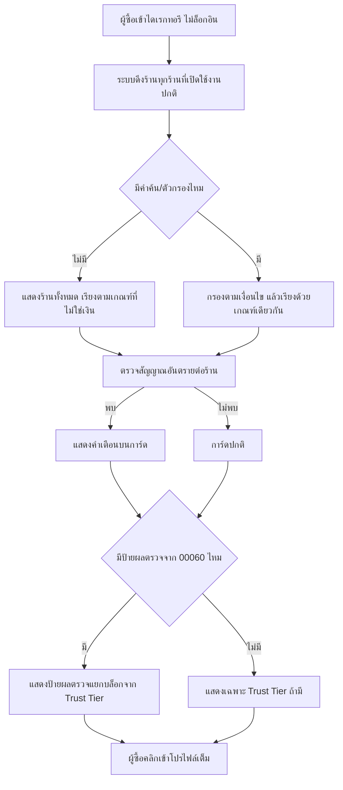
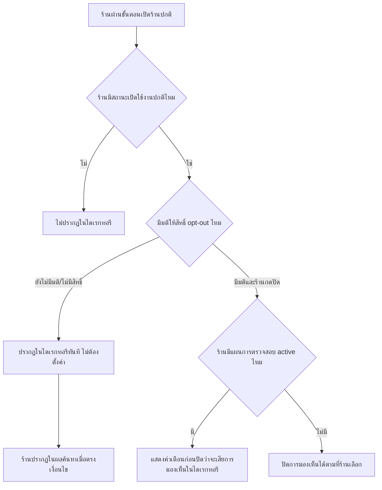

> **โมดูล:** M61-PublicDirectory
> **ประเภทเอกสาร:** Business Requirements Document (BRD) - NON-TECHNICAL
> **เวอร์ชัน:** 1.0
> **วันที่จัดทำ:** 2026-08-29
> **สถานะ:** Draft
> **เจ้าของเอกสาร:** BA (ดู [[Feature-Docs-Ownership]])

# BRD: ไดเรกทอรีร้านค้า (Public Shop Directory) (Business Requirements Document)

---

## 1. บทนำ

### 1.1 วัตถุประสงค์ของเอกสาร

เอกสารนี้มีวัตถุประสงค์เพื่อ:
1. อธิบายความต้องการทางธุรกิจของ "ไดเรกทอรีร้านค้า" — หน้าสาธารณะที่ผู้ซื้อค้นหาร้านบน Deep ได้โดยไม่ต้องล็อกอิน มีร้านทุกร้านรวมร้านที่ไม่ได้ซื้อแผนการตรวจสอบ
2. กำหนดขอบเขตว่าไดเรกทอรีนี้แสดงร้านทุกร้าน แข่งขันกันด้วยความน่าเชื่อถือจริง ไม่ใช่ด้วยเงิน
3. อธิบายเงื่อนไขและกฎทางธุรกิจที่ป้องกันไม่ให้ไดเรกทอรีกลายเป็นพื้นที่โฆษณาที่ซื้ออันดับได้
4. สร้างความเข้าใจร่วมกันว่าฟีเจอร์นี้เป็น dependency ที่บล็อกการเปิดขายเชิงพาณิชย์ของ `00060` และต้องส่งมอบเป็นอิสระจากความคืบหน้าของ 00060

### 1.2 ขอบเขตของระบบ

**ไดเรกทอรีร้านค้า** คือหน้าสาธารณะที่ผู้ซื้อค้นหา กรอง และเปิดดูโปรไฟล์ร้านบน Deep ได้ทั้งหมดโดยไม่ต้องล็อกอิน รวมร้านทุกร้านไม่ว่าจะจ่ายเงินให้ฟีเจอร์ใดของ Deep หรือไม่ ลำดับผลค้นหาไม่มีวันซื้อได้

**เข้าสู่ระบบ (Input):**
- คำค้นและตัวกรองที่ผู้ซื้อพิมพ์/เลือก (ไม่ต้องล็อกอิน)
- ข้อมูลร้านที่มีอยู่แล้วในระบบ (ชื่อร้าน ประเภทร้าน Trust Tier รูปโปรไฟล์)
- สัญญาณจากฐานมิจฉาชีพ (`/check`)
- ป้ายผลตรวจจากแผนการตรวจสอบ (`00060`) เมื่อมีข้อมูลพร้อม

**ออกจากระบบ (Output):**
- รายการร้านที่ตรงกับคำค้น/ตัวกรอง เรียงตามเกณฑ์ที่ไม่ใช่เงิน
- การ์ดร้านที่แสดงคำเตือนความเสี่ยง (ถ้ามี) และป้ายผลตรวจ (ถ้ามี) แยกจาก Trust Tier
- ทางเข้าสู่หน้าโปรไฟล์เต็มของแต่ละร้าน
- ข้อมูลสำหรับเครื่องมือค้นหาภายนอก (แผนผังเว็บไซต์ ข้อมูลตัวอย่างสำหรับแชร์ลิงก์)

**ระบบที่เกี่ยวข้อง:**
- โปรไฟล์สาธารณะร้านค้าที่มีอยู่แล้ว (`/u/{username}`, `/b/{slug}`)
- Trust Score / Trust Tier ที่มีอยู่แล้ว
- ฐานมิจฉาชีพ / กระบวนการ `/check`
- แผนการตรวจสอบร้านค้า (`00060`) — reverse dependency

### 1.3 กลุ่มผู้ใช้งาน

| กลุ่มผู้ใช้ | บทบาท | สิทธิ์การใช้งาน |
|-----------|--------|----------------|
| **ผู้ซื้อ (สาธารณะ ไม่ล็อกอิน)** | ผู้ค้นหาและเปิดดูร้าน | ค้นหา กรอง เปิดดูการ์ดร้านและโปรไฟล์เต็มได้ทั้งหมดโดยไม่ต้องมีบัญชี |
| **ร้าน (ทุกประเภท/ทุกสถานะการจ่ายเงิน)** | ผู้ถูกแสดงในไดเรกทอรี | ปรากฏโดยอัตโนมัติเมื่อเปิดใช้งานร้านปกติ ไม่ต้องตั้งค่าอะไรเพิ่ม (ยกเว้นถ้ามีมติสิทธิ์ opt-out ตาม PRD §3.6) |
| **ร้านที่มีแผนการตรวจสอบ active (`00060`)** | ผู้ที่ต้องการให้ผลตรวจของตัวเองมองเห็นได้ในไดเรกทอรี | เห็นป้ายผลตรวจของตัวเองปรากฏในการ์ดโดยอัตโนมัติเมื่อผลตรวจพร้อม ไม่ต้องตั้งค่าเพิ่ม |
| **เครื่องมือค้นหาภายนอก** | ผู้เก็บเนื้อหาไดเรกทอรี/โปรไฟล์เพื่อนำไปแสดงผลนอกแพลตฟอร์ม | เข้าถึงแผนผังเว็บไซต์และหน้าที่อนุญาตให้เก็บได้ตามกฎที่กำหนด |
| **ทีมธุรกิจ/ทีมปฏิบัติการ Deep** | ผู้ดูแลภาพรวมและตัดสินประเด็นที่ยังไม่เคาะ | ตัดสินใจ Q-1..Q-6 (PRD §10.2) และเฝ้าดูว่ากฎ "อันดับซื้อไม่ได้" ถูกบังคับใช้จริง |

---

## 2. ความต้องการหลัก (Functional Requirements)

### 2.1 ขอบเขตของไดเรกทอรี — รวมร้านทุกร้าน

#### FR-DIR-001: ร้านทุกร้านปรากฏในไดเรกทอรีโดยไม่ต้องจ่ายเงิน

**User Story:**
> ในฐานะร้านที่ไม่เคยจ่ายเงินให้ Deep เลย ฉันต้องการให้ร้านของฉันปรากฏในไดเรกทอรีเหมือนร้านที่จ่ายเงิน เพื่อให้ผู้ซื้อค้นเจอฉันได้เท่าเทียมกัน

**Acceptance Criteria:**
- [ ] AC-DIR-01-1: ร้านที่มีสถานะเปิดใช้งานปกติทุกร้าน (ไม่ว่าจะจ่ายเงินให้ฟีเจอร์ใดของ Deep หรือไม่) ปรากฏในผลค้นหาของไดเรกทอรีเมื่อตรงกับคำค้น/ตัวกรอง
- [ ] AC-DIR-01-2: ไม่มีหน้าจอ/ตัวเลือก/แพ็กเกจใดที่เสนอ "จ่ายเงินเพื่อให้ปรากฏในไดเรกทอรี"
- [ ] AC-DIR-01-3: ไม่มีไดเรกทอรีแยกสำหรับร้านที่จ่ายเงิน — ร้านฟรีและร้านที่จ่ายเงินอยู่ในผลค้นหาเดียวกันเสมอ

#### FR-DIR-002: ร้านที่ไม่เคยตั้งค่าอะไรเลยต้องปรากฏโดยอัตโนมัติ

**User Story:**
> ในฐานะเจ้าของร้านที่เพิ่งเปิดร้านเสร็จตามขั้นตอนปกติ ฉันต้องการให้ร้านของฉันปรากฏในไดเรกทอรีทันที โดยไม่ต้องไปตั้งค่าอะไรเพิ่มอีก

**Acceptance Criteria:**
- [ ] AC-DIR-02-1: ร้านที่ผ่านขั้นตอนเปิดร้านปกติแล้ว ปรากฏในไดเรกทอรีได้ทันทีโดยไม่ต้องมีการกระทำเพิ่มเติมจากเจ้าของร้าน
- [ ] AC-DIR-02-2: การ์ดของร้านที่ไม่มีข้อมูลเสริมใด ๆ (ไม่มีสินค้า ไม่มีป้ายผลตรวจ) ยังคงแสดงข้อมูลพื้นฐานที่มีอยู่แล้ว (ชื่อร้าน ประเภทร้าน) ได้อย่างสมบูรณ์ ไม่แสดงเป็นการ์ดว่างเปล่าหรือผิดพลาด

### 2.2 การค้นหาและการเรียงลำดับ

#### FR-DIR-003: ค้นหาร้านจากไดเรกทอรีได้โดยไม่ต้องล็อกอิน

**User Story:**
> ในฐานะผู้ซื้อที่ไม่มีบัญชี Deep ฉันต้องการค้นหาร้านได้ทันทีโดยไม่ต้องสมัครสมาชิกก่อน เพื่อประเมินว่าร้านที่ต้องการมีอยู่จริงและน่าเชื่อถือหรือไม่

**Acceptance Criteria:**
- [ ] AC-DIR-03-1: หน้าไดเรกทอรีเปิดเข้าถึงได้จาก session ที่ไม่ล็อกอิน โดยไม่มีการ redirect ไปหน้าล็อกอิน
- [ ] AC-DIR-03-2: การค้นหาด้วยคำค้น (ชื่อร้าน/คำที่เกี่ยวข้อง) คืนผลลัพธ์ที่ตรงกับความเกี่ยวข้องของคำค้นเป็นอันดับแรกเสมอ

#### FR-DIR-004: อันดับในผลค้นหาต้องไม่ได้รับผลจากการจ่ายเงิน

**User Story:**
> ในฐานะร้านที่ไม่จ่ายเงินให้ Deep ฉันต้องการให้อันดับของฉันในผลค้นหาตัดสินด้วยความน่าเชื่อถือจริงของฉันเท่านั้น เพื่อให้ฉันมีโอกาสถูกเห็นเท่ากับร้านที่จ่ายเงิน

**Acceptance Criteria:**
- [ ] AC-DIR-04-1: การสมัครหรือจ่ายเงินให้แผนการตรวจสอบ (`00060`) หรือฟีเจอร์เสริมใดของ Deep ต้องไม่เปลี่ยนอันดับของร้านในผลค้นหา เมื่อเกณฑ์อื่นทั้งหมดเท่ากัน
- [ ] AC-DIR-04-2: เกณฑ์ที่ใช้เรียงลำดับต้องมาจากรายการที่เคาะไว้ล่วงหน้าและตรวจสอบได้ (PRD §4.3) — ห้ามมีตัวแปรลับที่ไม่เปิดเผยและไม่ตรวจสอบได้ว่าเชื่อมโยงกับการจ่ายเงินหรือไม่
- [ ] AC-DIR-04-3: ก่อนใช้ Trust Tier เป็นส่วนหนึ่งของเกณฑ์เรียงลำดับ ต้องยืนยันแล้วว่าไม่มีองค์ประกอบใดของ Trust Score ที่ซื้อได้ด้วยเงิน (PRD §6.1, Q-6) — ถ้ามี ต้องไม่ใช้ Trust Tier ตรง ๆ เป็นเกณฑ์เรียง

#### FR-DIR-005: ตัวกรองผลลัพธ์

**User Story:**
> ในฐานะผู้ซื้อที่ตามหาร้านประเภทเฉพาะ ฉันต้องการกรองผลลัพธ์ให้แคบลง เพื่อไม่ต้องไล่ดูร้านที่ไม่เกี่ยวข้องทั้งหมด

**Acceptance Criteria:**
- [ ] AC-DIR-05-1: ตัวกรองที่มี (รายการสุดท้ายรอเคาะตาม PRD §3.7) ต้องเป็นข้อมูลที่ร้านมีอยู่แล้วในระบบ ไม่บังคับร้านกรอกข้อมูลใหม่เพื่อให้ถูกกรองเจอ
- [ ] AC-DIR-05-2: การเลือกตัวกรองใด ๆ ไม่เปลี่ยนเกณฑ์การเรียงลำดับภายในผลลัพธ์ที่กรองแล้ว — ยังคงใช้เกณฑ์เดียวกับ FR-DIR-004

#### FR-DIR-006: ตัวกรอง "มีผลตรวจ" ต้องเป็นตัวเลือกที่ผู้ซื้อเปิดเอง

**User Story:**
> ในฐานะผู้ซื้อ ฉันต้องการเลือกดูเฉพาะร้านที่มีผลตรวจจาก Deep ได้ถ้าต้องการ แต่ไม่ต้องการให้ระบบเลือกให้ฉันโดยอัตโนมัติ เพื่อให้มั่นใจว่าฉันเห็นร้านทุกแบบก่อนตัดสินใจกรอง

**Acceptance Criteria:**
- [ ] AC-DIR-06-1: หน้าไดเรกทอรีเมื่อเปิดครั้งแรก (ก่อนผู้ซื้อกดตัวกรองใด ๆ) ต้องแสดงร้านทุกแบบปนกัน ไม่กรอง "มีผลตรวจ" เป็นค่าเริ่มต้น
- [ ] AC-DIR-06-2: ตัวกรอง "มีผลตรวจ" ถ้ามี ต้องอยู่ในกลุ่มเดียวกับตัวกรองอื่น มีน้ำหนักการแสดงผล (ขนาด/ตำแหน่ง) เท่ากับตัวกรองอื่น ไม่ใช่ปุ่มที่เด่นกว่าหรือถูกเลือกไว้ล่วงหน้า

### 2.3 สัญญาณอันตราย

#### FR-DIR-007: แสดงคำเตือนความเสี่ยงในการ์ดไดเรกทอรีโดยไม่ขึ้นกับการจ่ายเงิน

**User Story:**
> ในฐานะผู้ซื้อ ฉันต้องการเห็นคำเตือนความเสี่ยงตั้งแต่ในหน้าผลค้นหา เพื่อไม่ต้องเสียเวลาคลิกเข้าไปดูโปรไฟล์ร้านที่มีความเสี่ยงก่อนรู้ตัว

**Acceptance Criteria:**
- [ ] AC-DIR-07-1: ร้านที่มีข้อมูลตรงกับฐานมิจฉาชีพแสดงคำเตือนความเสี่ยงบนการ์ดของตัวเองในหน้าผลค้นหา ไม่ต้องคลิกเข้าไปดูโปรไฟล์ก่อน
- [ ] AC-DIR-07-2: คำเตือนนี้ปรากฏเหมือนกันไม่ว่าร้านนั้นจะจ่ายเงินให้ฟีเจอร์ใดของ Deep หรือไม่ — ทดสอบด้วยร้านที่จ่ายเงินและไม่จ่ายเงินที่อยู่ในฐานมิจฉาชีพทั้งคู่ ต้องได้ผลเหมือนกัน

### 2.4 การมองเห็นของร้านในไดเรกทอรี

#### FR-DIR-008: สิทธิ์ของร้านในการไม่ปรากฏในไดเรกทอรี (สถานะ: รอเคาะ — implement เมื่อมีมติแล้วเท่านั้น)

**User Story:**
> ในฐานะร้านที่ปิดโปรไฟล์สาธารณะไว้ด้วยเหตุผลของตัวเอง ฉันต้องการไม่ให้ตัวเองปรากฏในไดเรกทอรี เพื่อไม่ให้ผู้ซื้อคลิกเข้าไปเจอหน้าที่เปิดดูไม่ได้

**Acceptance Criteria (ร่าง — รอมติ):**
- [ ] AC-DIR-08-1 (รอเคาะ): กำหนดว่าฟีเจอร์นี้ผูกกับกลไก `isPublished` เดิม หรือเป็นสิทธิ์ใหม่แยกต่างหาก
- [ ] AC-DIR-08-2 (รอเคาะ): กำหนดว่าร้านที่มีแผนการตรวจสอบ active จาก 00060 มีสิทธิ์นี้ได้เต็มเหมือนร้านอื่นหรือไม่ (PRD §6.1)

### 2.5 การค้นพบผ่านเครื่องมือค้นหาภายนอก (SEO)

#### FR-DIR-009: แผนผังเว็บไซต์ (sitemap) รวมหน้าโปรไฟล์ร้านสาธารณะ

**User Story:**
> ในฐานะร้าน ฉันต้องการให้โปรไฟล์ของฉันถูกเครื่องมือค้นหาเก็บและแสดงผลได้ เพื่อให้คนที่ค้นหาจากนอก Deep เจอร้านของฉันได้

**Acceptance Criteria:**
- [ ] AC-DIR-09-1: มีแผนผังเว็บไซต์ที่รวมรายการหน้าโปรไฟล์ร้านสาธารณะทั้งหมดที่อนุญาตให้เครื่องมือค้นหาเก็บได้ (เกณฑ์ว่าร้านแบบใดเข้าเงื่อนไข ดู Q-4)
- [ ] AC-DIR-09-2: แผนผังเว็บไซต์อัปเดตตามร้านที่เปิด/ปิดใช้งานจริง ไม่ค้างรายการร้านที่ปิดตัวไปแล้ว

#### FR-DIR-010: อนุญาตให้บอทของเครื่องมือค้นหาเข้าถึงหน้าไดเรกทอรีและหน้าโปรไฟล์

**User Story:**
> ในฐานะทีมธุรกิจ ฉันต้องการให้บอทของเครื่องมือค้นหาเข้าถึงหน้าไดเรกทอรีและหน้าโปรไฟล์ร้านได้ เพื่อให้ระบบค้นหาภายนอกเก็บเนื้อหาของ Deep ไปแสดงผลได้

**Acceptance Criteria:**
- [ ] AC-DIR-10-1: หน้าไดเรกทอรีและหน้าโปรไฟล์ร้านสาธารณะไม่ถูกปิดกั้นจากบอทของเครื่องมือค้นหาที่ถูกต้อง
- [ ] AC-DIR-10-2: หน้าที่ไม่ควรถูกเก็บ (หน้าที่ต้องล็อกอิน หน้าภายในของร้าน) ยังคงถูกกันไว้ตามเดิม ไม่ถูกเปิดเผยเพิ่มโดยไม่ตั้งใจจากการเปลี่ยนแปลงนี้

#### FR-DIR-011: หน้าโปรไฟล์ร้านมีข้อมูลตัวอย่างสำหรับการแชร์ลิงก์

**User Story:**
> ในฐานะร้าน ฉันต้องการให้ลิงก์โปรไฟล์ของฉันแสดงชื่อร้าน รูปภาพ และคำอธิบายที่ถูกต้องเมื่อถูกแชร์หรือปรากฏในผลค้นหา เพื่อดึงดูดให้คนคลิกเข้ามาดู

**Acceptance Criteria:**
- [ ] AC-DIR-11-1: หน้าโปรไฟล์ร้านมีข้อมูลตัวอย่าง (ชื่อร้าน รูปภาพ คำอธิบายสั้น) ที่ใช้แสดงผลเมื่อถูกแชร์หรือค้นเจอ — ปัจจุบันไม่มีข้อมูลนี้เลย
- [ ] AC-DIR-11-2: ข้อมูลตัวอย่างนี้ต้องดึงจากข้อมูลร้านจริง ไม่ใช่ข้อความ generic เดียวกันทุกร้าน

### 2.6 ความเป็นส่วนตัวและการป้องกันการรวบรวมข้อมูล

#### FR-DIR-012: จำกัดข้อมูลที่แสดงในการ์ดรายการของไดเรกทอรี

**User Story:**
> ในฐานะร้าน ฉันต้องการให้การ์ดของฉันในไดเรกทอรีแสดงเฉพาะข้อมูลที่ฉันเผยแพร่ต่อสาธารณะอยู่แล้วบนโปรไฟล์ ไม่ใช่ข้อมูลติดต่อส่วนตัวที่ฉันไม่ได้ตั้งใจเผยแพร่กว้างขนาดนี้

**Acceptance Criteria:**
- [ ] AC-DIR-12-1: การ์ดร้านแสดงเฉพาะข้อมูลที่ปรากฏบนโปรไฟล์สาธารณะของร้านอยู่แล้ว (ชื่อร้าน รูป Trust Tier ป้ายผลตรวจถ้ามี)
- [ ] AC-DIR-12-2: การ์ดร้านไม่แสดงข้อมูลติดต่อส่วนตัวโดยตรง (เบอร์โทร ที่อยู่ละเอียด) แม้ข้อมูลนั้นจะปรากฏอยู่ในหน้าโปรไฟล์เต็มก็ตาม

#### FR-DIR-013: มาตรการจำกัดการเข้าถึงไดเรกทอรีในปริมาณผิดปกติ (สถานะ: รอเคาะรายละเอียด)

**User Story:**
> ในฐานะทีมธุรกิจ ฉันต้องการป้องกันไม่ให้บุคคลที่สามดึงข้อมูลร้านทั้งหมดไปใช้เชิงพาณิชย์โดยไม่ได้รับอนุญาต โดยไม่กระทบการเข้าถึงของเครื่องมือค้นหาที่ถูกต้องและผู้ซื้อจริง

**Acceptance Criteria (ร่าง — รอมติระดับที่เหมาะสม):**
- [ ] AC-DIR-13-1 (รอเคาะ): กำหนดเกณฑ์ว่าปริมาณการเข้าถึงระดับใดถือว่าผิดปกติ
- [ ] AC-DIR-13-2: มาตรการที่เลือกใช้ต้องไม่ปิดกั้นบอทของเครื่องมือค้นหาที่ถูกต้อง (ไม่ขัดกับ FR-DIR-010)

### 2.7 ความสัมพันธ์กับแผนการตรวจสอบ (00060)

#### FR-DIR-014: การ์ดร้านแสดงป้ายผลตรวจแยกจาก Trust Tier

**User Story:**
> ในฐานะร้านที่มีผลตรวจจากแผนการตรวจสอบ ฉันต้องการให้ป้ายผลตรวจของฉันปรากฏในไดเรกทอรีอย่างชัดเจน แยกจาก Trust Tier เพื่อไม่ให้ผู้ซื้อสับสนว่าเป็นคะแนนเดียวกัน

**Acceptance Criteria:**
- [ ] AC-DIR-14-1: การ์ดของร้านที่มีป้ายผลตรวจแสดงป้ายผลตรวจในบล็อกที่แยกจาก Trust Tier อย่างชัดเจน ไม่ใช้คำร่วมกัน (สืบทอดกฎเดียวกับที่ 00060 กำหนดไว้บนหน้าโปรไฟล์)
- [ ] AC-DIR-14-2: ร้านที่ไม่มีผลตรวจไม่แสดงบล็อกป้ายผลตรวจเลย (ไม่แสดงเป็นช่องว่างหรือสถานะลบ)

#### FR-DIR-015: ไดเรกทอรีทำงานได้สมบูรณ์โดยไม่ต้องพึ่งพา 00060

**User Story:**
> ในฐานะทีมธุรกิจ ฉันต้องการให้ไดเรกทอรีขึ้นใช้งานได้แม้ 00060 จะยังไม่ขึ้นระบบ เพื่อให้ 00061 ไม่ถูกดึงช้าลงตามความคืบหน้าของฟีเจอร์อื่น

**Acceptance Criteria:**
- [ ] AC-DIR-15-1: ทุก FR ในเอกสารนี้ (ยกเว้น FR-DIR-014 ซึ่งเป็นการต่อยอด) ทำงานได้สมบูรณ์โดยไม่มีร้านใดมีผลตรวจจาก 00060 เลย
- [ ] AC-DIR-15-2: เมื่อ 00060 เริ่มมีข้อมูลผลตรวจพร้อมแสดง การต่อยอดเข้า FR-DIR-014 ไม่ต้องออกแบบไดเรกทอรีใหม่ทั้งหมด

---

## 3. Acceptance Criteria สรุป

### 3.1 ขอบเขตของไดเรกทอรี

**เมื่อระบบทำงานถูกต้อง:**
- ✅ ร้านทุกร้านที่เปิดใช้งานปกติปรากฏในไดเรกทอรี ไม่ว่าจะจ่ายเงินหรือไม่
- ✅ ร้านที่ไม่เคยตั้งค่าอะไรเลยปรากฏโดยอัตโนมัติ ไม่ต้องมีการกระทำเพิ่มเติม
- ✅ ไม่มีทางเลือก "จ่ายเงินเพื่อให้ปรากฏ" ที่ไหนในระบบ

### 3.2 การค้นหาและการเรียงลำดับ

**เมื่อระบบทำงานถูกต้อง:**
- ✅ ค้นหาได้โดยไม่ต้องล็อกอิน
- ✅ อันดับผลค้นหาไม่เปลี่ยนเมื่อร้านจ่ายเงิน โดยเกณฑ์อื่นคงที่
- ✅ ตัวกรอง "มีผลตรวจ" ไม่ใช่ค่าเริ่มต้นของหน้าไดเรกทอรี

### 3.3 สัญญาณอันตราย

**เมื่อร้านมีข้อมูลตรงกับฐานมิจฉาชีพ:**
- ✅ คำเตือนความเสี่ยงปรากฏบนการ์ดในผลค้นหา ไม่ต้องคลิกเข้าไปดูก่อน
- ✅ คำเตือนปรากฏเหมือนกันไม่ว่าร้านจะจ่ายเงินให้ Deep หรือไม่

### 3.4 SEO และความเป็นส่วนตัว

**เมื่อระบบทำงานถูกต้อง:**
- ✅ มีแผนผังเว็บไซต์ที่รวมหน้าโปรไฟล์ร้านสาธารณะ
- ✅ บอทของเครื่องมือค้นหาเข้าถึงหน้าไดเรกทอรี/โปรไฟล์ได้
- ✅ การ์ดร้านไม่มีข้อมูลติดต่อส่วนตัวที่ไม่ได้ตั้งใจเผยแพร่

### 3.5 ความสัมพันธ์กับ 00060

**เมื่อระบบทำงานถูกต้อง:**
- ✅ ป้ายผลตรวจแสดงแยกบล็อกจาก Trust Tier ในการ์ดไดเรกทอรี
- ✅ ไดเรกทอรีทำงานได้สมบูรณ์แม้ไม่มีร้านใดมีผลตรวจจาก 00060 เลย

---

## 4. Business Flows (กระบวนการทำงาน)

### 4.1 Flow หลัก: ผู้ซื้อค้นหาและเห็นผลลัพธ์

### 4.2 Flow: ร้านเข้าสู่ไดเรกทอรีโดยอัตโนมัติ

---

## 5. Use Case Scenarios (สถานการณ์การใช้งานจริง)

### Scenario 1: ผู้ซื้อค้นหาที่พักจากภายนอก Deep (Best Case)

**ผู้เกี่ยวข้อง:** ผู้ซื้อ (ไม่ล็อกอิน)

**เงื่อนไขเริ่มต้น:**
- ไดเรกทอรีมีร้าน LODGING หลายร้านปนกันทั้งมีป้ายผลตรวจและไม่มี

**ขั้นตอน:**
1. ผู้ซื้อค้นหาผ่านเครื่องมือค้นหาภายนอกแล้วเจอลิงก์ไดเรกทอรี
2. เข้าหน้าไดเรกทอรี กรองด้วยประเภทร้าน "บ้านพัก"
3. เห็นผลลัพธ์เรียงตามความเกี่ยวข้อง + Trust Tier ไม่ใช่ตามการจ่ายเงิน
4. คลิกเข้าโปรไฟล์ร้านที่สนใจ

**ผลลัพธ์:**
- ผู้ซื้อพบร้านที่ต้องการโดยไม่ต้องมีบัญชีหรือลิงก์มาก่อนเลย

### Scenario 2: ร้านฟรีแข่งขันในผลค้นหากับร้านที่จ่ายเงิน

**ผู้เกี่ยวข้อง:** ร้าน A (ไม่จ่ายเงินให้ฟีเจอร์ใด) ร้าน B (มีแผนการตรวจสอบ active)

**เงื่อนไขเริ่มต้น:**
- ร้าน A และร้าน B มี Trust Tier เท่ากัน และตรงกับคำค้นเดียวกัน

**ขั้นตอน:**
1. ผู้ซื้อค้นหาคำที่ตรงกับทั้งสองร้าน
2. ระบบเรียงลำดับด้วยเกณฑ์ที่ไม่ใช่เงิน

**ผลลัพธ์:**
- ร้าน A และร้าน B มีโอกาสปรากฏในตำแหน่งใกล้เคียงกันเท่ากัน **ความแตกต่างเดียวคือร้าน B มีป้ายผลตรวจติดอยู่ที่การ์ด ไม่ใช่ตำแหน่งที่ดีกว่า**

### Scenario 3: ร้านที่พบในฐานมิจฉาชีพไม่สามารถซ่อนตัวเองได้แม้ไม่จ่ายเงิน

**ผู้เกี่ยวข้อง:** ร้าน C (ไม่จ่ายเงินให้ Deep เลย ข้อมูลตรงกับฐานมิจฉาชีพ)

**เงื่อนไขเริ่มต้น:**
- ร้าน C ยังไม่ถูกระงับบัญชี แต่มีข้อมูลตรงกับรายการในฐานมิจฉาชีพ

**ขั้นตอน:**
1. ผู้ซื้อค้นหาคำที่ตรงกับร้าน C
2. ร้าน C ปรากฏในผลค้นหาพร้อมคำเตือนความเสี่ยงบนการ์ด

**ผลลัพธ์:**
- ผู้ซื้อเห็นคำเตือนก่อนตัดสินใจคลิกเข้าไปดู — ไม่มีทางที่ร้าน C จะซ่อนคำเตือนนี้ได้ไม่ว่าจะจ่ายเงินหรือไม่

### Scenario 4: เครื่องมือค้นหาภายนอกเก็บหน้าโปรไฟล์ร้าน

**ผู้เกี่ยวข้อง:** บอทของเครื่องมือค้นหา

**เงื่อนไขเริ่มต้น:**
- หน้าโปรไฟล์ร้านที่มีเนื้อหาเพียงพอ (ผ่านเกณฑ์ที่เคาะไว้ตาม Q-4)

**ขั้นตอน:**
1. บอทอ่านแผนผังเว็บไซต์ที่รวมรายการหน้าโปรไฟล์
2. บอทเข้าถึงหน้าโปรไฟล์และเก็บข้อมูลตัวอย่างสำหรับแสดงผลค้นหา

**ผลลัพธ์:**
- หน้าโปรไฟล์ร้านเริ่มปรากฏในผลค้นหาของเครื่องมือค้นหาภายนอก

### Scenario 5: ร้านใหม่ที่ไม่เคยตั้งค่าอะไรเลย

**ผู้เกี่ยวข้อง:** เจ้าของร้านที่เพิ่งเปิดร้านเสร็จ

**เงื่อนไขเริ่มต้น:**
- ร้านผ่าน onboarding ปกติ ไม่ได้ซื้อฟีเจอร์เสริมใด ๆ

**ขั้นตอน:**
1. เจ้าของร้านไม่ได้กดตั้งค่าอะไรเพิ่มเลยหลังเปิดร้าน
2. ผู้ซื้อค้นหาคำที่เกี่ยวข้องกับร้านนี้

**ผลลัพธ์:**
- ร้านปรากฏในผลค้นหาทันที แข่งขันด้วย Trust Tier และความเกี่ยวข้องกับคำค้นเท่านั้น ไม่มีร้านใดถูกดันขึ้นเพราะจ่ายเงิน

---

## 6. ความต้องการด้านคุณภาพ (Quality Requirements)

### 6.1 ความถูกต้องของข้อมูล
- ร้านที่ปรากฏต้องเป็นร้านที่มีสถานะเปิดใช้งานจริง ณ เวลาที่แสดงผล ไม่ค้างร้านที่ปิด/ถูกระงับไปแล้ว
- สัญญาณอันตรายที่แสดงต้องอ้างอิงข้อมูลฐานมิจฉาชีพล่าสุด ไม่ใช่ข้อมูลที่ cache ไว้นานจนล้าสมัย

### 6.2 ความรวดเร็ว
- การค้นหาและกรองต้องให้ผลลัพธ์ในเวลาที่ผู้ซื้อไม่รู้สึกว่ารอนาน แม้จำนวนร้านในระบบเพิ่มขึ้นตามเวลา

### 6.3 ความน่าเชื่อถือ
- อันดับผลค้นหาต้องคงที่และอธิบายได้ — ค้นคำเดิมซ้ำโดยไม่มีอะไรเปลี่ยนต้องได้ลำดับเดิม (ยกเว้นองค์ประกอบสุ่มที่ตั้งใจใช้เมื่อคะแนนเท่ากัน ตาม PRD §4.3)

### 6.4 ความปลอดภัย
- ข้อมูลในการ์ดต้องไม่รั่วข้อมูลที่ร้านไม่ได้ตั้งใจเผยแพร่สาธารณะ (FR-DIR-012)
- ต้องมีมาตรการป้องกันการดึงข้อมูลร้านทั้งหมดในปริมาณผิดปกติ (FR-DIR-013 — รอเคาะ)

### 6.5 ความสะดวกในการใช้งาน (Usability)
- ค้นหาและกรองต้องใช้งานได้โดยไม่ต้องมีคำแนะนำเพิ่มเติม
- คำเตือนความเสี่ยงต้องสังเกตเห็นได้ทันทีโดยไม่ต้องอ่านรายละเอียดทั้งการ์ด

---

## 7. ข้อจำกัด (Constraints)

### 7.1 ข้อจำกัดทางธุรกิจ
- ห้ามมีการซื้อโฆษณาหรือตำแหน่งในผลค้นหาถาวร ไม่ว่าเฟสใด (PRD §5)
- ตัวแผนการตรวจสอบเองไม่อยู่ในขอบเขตของเอกสารนี้ (ขอบเขตของ `00060`)
- ไดเรกทอรีต้องส่งมอบได้เป็นอิสระจากความคืบหน้าของ `00060`

### 7.2 ข้อจำกัดทางเทคนิค
- ต้องใช้ข้อมูลร้าน/Trust Tier ที่มีอยู่แล้วในระบบ ไม่สร้างระบบคำนวณคะแนนใหม่ซ้ำซ้อน
- ต้องผ่าน `safepay-ux` gate ก่อนแตะโค้ดฝั่งหน้าจอ (Hard Rule 8)

---

## 8. กฎทางธุรกิจ (Business Rules)

### 8.1 กฎการรวมร้านในไดเรกทอรี
- ร้านทุกร้านที่เปิดใช้งานปกติต้องปรากฏ ไม่มีข้อยกเว้นเพราะไม่จ่ายเงิน
- ร้านที่ไม่เคยตั้งค่าอะไรเลยต้องปรากฏโดยอัตโนมัติ ไม่มีขั้นตอน opt-in

### 8.2 กฎการเรียงลำดับ
- ห้ามใช้เงินเป็นเกณฑ์เรียงลำดับไม่ว่าทางตรงหรือทางอ้อม
- ก่อนใช้ Trust Tier เป็นเกณฑ์เรียง ต้องยืนยันว่าไม่มีองค์ประกอบที่ซื้อได้ในสูตร Trust Score (Q-6)

### 8.3 กฎสัญญาณอันตราย
- คำเตือนความเสี่ยงต้องแสดงในระดับการ์ด ไม่ใช่แค่ในหน้าโปรไฟล์เต็ม
- ไม่มีเงื่อนไขการจ่ายเงินใดที่ทำให้คำเตือนนี้หายไป

### 8.4 กฎตัวกรอง "มีผลตรวจ"
- ต้องไม่เป็นค่าเริ่มต้นของหน้าไดเรกทอรี
- ต้องมีน้ำหนักการแสดงผลเท่ากับตัวกรองอื่น ไม่ถูกดันให้เด่นกว่า

### 8.5 กฎ SEO
- ต้องเปิดให้เครื่องมือค้นหาภายนอกเข้าถึงได้ตามที่กำหนด
- ต้องมีข้อมูลตัวอย่างสำหรับการแชร์ลิงก์ในหน้าโปรไฟล์

### 8.6 กฎความเป็นส่วนตัว
- การ์ดไดเรกทอรีแสดงเฉพาะข้อมูลที่ร้านเผยแพร่สาธารณะอยู่แล้ว
- ต้องมีมาตรการป้องกันการรวบรวมข้อมูลปริมาณผิดปกติ (รายละเอียดรอเคาะ)

---

## 9. อภิธานศัพท์ (Glossary)

| คำศัพท์ | ความหมาย |
|---------|----------|
| **ไดเรกทอรีร้านค้า** | หน้าสาธารณะที่ผู้ซื้อค้นหาร้านบน Deep ได้โดยไม่ต้องล็อกอิน มีร้านทุกร้าน ลำดับผลค้นหาซื้อไม่ได้ |
| **การ์ดร้าน** | หน่วยแสดงผลของร้านหนึ่งร้านในหน้าไดเรกทอรี ก่อนคลิกเข้าไปดูโปรไฟล์เต็ม |
| **สัญญาณอันตราย** | คำเตือนความเสี่ยงจากข้อมูลตรงกับฐานมิจฉาชีพ แสดงฟรีและใช้กับทุกร้านเสมอ |
| **ป้ายผลตรวจ** | สิ่งที่แสดงต่อสาธารณะจากผลตรวจของแผนการตรวจสอบ (`00060`) แยกจาก Trust Tier โดยสมบูรณ์ |
| **เกณฑ์เรียงลำดับที่ไม่ใช่เงิน** | ปัจจัยที่ใช้จัดลำดับผลค้นหา ต้องไม่รวมสถานะการจ่ายเงินของร้าน ไม่ว่าทางตรงหรือทางอ้อม |
| **opt-out (การไม่ปรากฏในไดเรกทอรี)** | สิทธิ์ที่ยังไม่มีมติว่าร้านจะปิดการแสดงผลตัวเองได้หรือไม่ (Q-1) |

---

## 10. สรุป

เอกสาร BRD นี้อธิบายความต้องการหลักของ **ไดเรกทอรีร้านค้า** แบบไม่ใช่เทคนิค

**จุดเด่นของระบบ:**
- รวมร้านทุกร้านบน Deep ไม่แบ่งแยกตามการจ่ายเงิน
- อันดับผลค้นหาซื้อไม่ได้เด็ดขาด — แข่งขันด้วยความน่าเชื่อถือจริง
- สัญญาณอันตรายแสดงฟรีตั้งแต่ระดับการ์ด ไม่ต้องคลิกเข้าไปดูก่อน
- ปลดล็อกการเปิดขายเชิงพาณิชย์ของ `00060` ให้เป็นความจริงตามคำโฆษณา

**ผลลัพธ์ที่คาดหวัง:**
- ผู้ซื้อที่ไม่เคยรู้จัก Deep ค้นเจอร้านได้โดยไม่ต้องมีลิงก์มาก่อน
- ร้านทุกร้าน (ไม่ว่าจะจ่ายเงินหรือไม่) มีโอกาสถูกเห็นเท่าเทียมกันตามความน่าเชื่อถือจริง
- ยังมีประเด็นสำคัญ 6 ข้อ (Q-1..Q-6 ใน PRD §10.2) ที่ต้องเคาะก่อนเริ่ม implement เต็มรูป

---

**หมายเหตุ:**
สำหรับความต้องการทางธุรกิจระดับภาพรวม/personas/KPI ดู [[PRD]] ของโมดูลนี้
สำหรับ technical specification (architecture/API/data/NFR) ดู [[SRS]] ของโมดูลนี้
