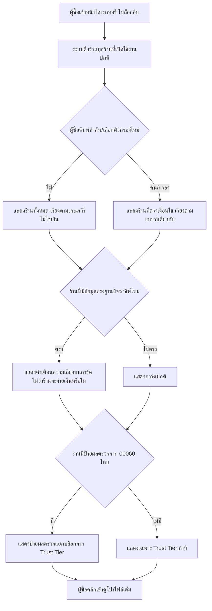

> **โมดูล:** M61-PublicDirectory
> **ประเภทเอกสาร:** Product Requirements Document (PRD)
> **เวอร์ชัน:** 1.0
> **วันที่จัดทำ:** 2026-08-29
> **สถานะ:** Draft — รอ user review ก่อน implement; หลายหัวข้อใน §3/§4/§10 เป็น "รอเคาะ" ยังไม่ใช่มติสุดท้าย
> **เจ้าของเอกสาร:** BA + PO + PM (ดู [[Feature-Docs-Ownership]])

# PRD: ไดเรกทอรีร้านค้า (Public Shop Directory)

---

## Executive Summary

วันนี้ Deep ไม่มีที่ใดให้คนที่ไม่ล็อกอินค้นหาร้านได้เลย — ช่องค้นหาบนหน้าแรกตรวจสอบได้เฉพาะ *มิจฉาชีพ* ไม่ใช่ค้นร้าน หน้าเดียวที่ browse ร้านได้ (`/m/shops`) ต้องล็อกอินและมีแต่เวอร์ชันมือถือ และไม่มีกลไกใดที่ทำให้ Google หรือเครื่องมือค้นหาอื่นพาใครมาเจอโปรไฟล์ร้านได้เลย ทางเข้าเดียวของโปรไฟล์วันนี้คือลิงก์ที่ร้านแชร์เอง

**ไดเรกทอรีร้านค้า** แก้ปัญหานี้: หน้าสาธารณะที่ไม่ต้องล็อกอิน รวม**ร้านทุกร้าน**บน Deep ทั้งร้านที่จ่ายเงินให้ฟีเจอร์ใด ๆ และร้านที่ไม่เคยจ่ายอะไรเลย ผู้ซื้อค้นหา กรอง และเปิดดูโปรไฟล์ร้านได้จากที่นี่ที่เดียว หลักการที่กำหนดทุกกฎในเอกสารนี้คือ **ป้ายมีค่าก็ต่อเมื่อมันแยกร้านออกจากร้านที่ไม่มี** — ถ้าไดเรกทอรีมีแต่ร้านที่จ่ายเงิน ทุกร้านในหน้านั้นจะมีป้ายเหมือนกันหมดและป้ายจะไร้ความหมายทันที ร้านฟรีจึงไม่ใช่ของแถม แต่เป็นฉากหลังที่จำเป็นต่อคุณค่าของป้าย

กฎที่แตะไม่ได้อีกข้อคือ **ลำดับผลค้นหาซื้อไม่ได้เด็ดขาด** — การจ่ายเงินซื้อแผนการตรวจสอบ (00060) หรือฟีเจอร์ใดของ Deep ต้องไม่มีผลต่ออันดับที่ร้านปรากฏในผลค้นหา เพราะถ้าอันดับซื้อได้ ไดเรกทอรีจะกลายเป็นหน้าโฆษณา ซึ่งทำลายเหตุผลที่ผู้ซื้อมาที่นี่ตั้งแต่แรก (มาเพื่อหาความจริง ไม่ใช่มาดูใครจ่ายเงินมากที่สุด)

**ความสัมพันธ์กับ `00060 — แผนการตรวจสอบร้านค้า`:** 00060 ประกาศไว้เองว่า**ขายเชิงพาณิชย์จริงไม่ได้จนกว่า 00061 จะขึ้นระบบ** เพราะคำโฆษณาหลักของ 00060 คือ "ให้ผู้ซื้อค้นเจอ" — ฟีเจอร์นี้จึงเป็น dependency ที่บล็อกการเปิดขายของอีกฟีเจอร์หนึ่งโดยตรง ในทางกลับกัน 00061 **ไม่ต้องพึ่งพา 00060** — ต้องทำงานได้สมบูรณ์ด้วยตัวเองแม้ 00060 จะยังไม่ขึ้นระบบเลย (ผลตรวจจาก 00060 เป็นข้อมูลเสริมที่ต่อยอดทีหลังได้)

---

## 1. Business Goals & KPIs

### 1.1 เป้าหมายทางธุรกิจ

| เป้าหมาย | รายละเอียด |
|----------|-----------|
| **เปิดทางให้คนที่ไม่รู้จัก Deep มาก่อนค้นเจอร้านได้** | วันนี้ทางเข้าเดียวคือลิงก์ที่ร้านแชร์เอง — ไดเรกทอรีเปิดช่องทางค้นพบใหม่ที่ไม่ต้องพึ่งพาร้านแชร์ลิงก์เอง |
| **ทำให้ป้ายทุกชนิดบน Deep (Trust Tier, ป้ายผลตรวจ, สัญญาณอันตราย) มีความหมายจริง** | ป้ายที่แสดงในบริบทที่ทุกร้านมีเหมือนกันหมดไม่มีความหมาย — ต้องมีร้านที่ไม่มีป้ายให้เทียบเสมอ |
| **ปลดล็อกการขายเชิงพาณิชย์ของ `00060`** | 00060 ประกาศเองว่าขายจริงไม่ได้จนกว่าฟีเจอร์นี้จะขึ้นระบบ — เป็นเป้าหมายทางธุรกิจที่วัดผลได้ตรงไปตรงมาที่สุดของฟีเจอร์นี้ |
| **สร้างช่องทาง SEO ให้แพลตฟอร์มโดยไม่ต้องพึ่งพาโฆษณาแบบจ่ายเงิน** | หน้าโปรไฟล์ร้านที่มีอยู่แล้วจำนวนมากไม่เคยถูก search engine เก็บเลย — ไดเรกทอรีทำให้เนื้อหาที่มีอยู่แล้วเริ่มสร้างมูลค่าทาง organic search |
| **รักษาความน่าเชื่อถือของผลค้นหาไม่ให้ถูกซื้อได้** | ถ้าอันดับซื้อได้ ไดเรกทอรีจะเสื่อมสภาพเป็นพื้นที่โฆษณาในเวลาไม่นาน ซึ่งทำลายคุณค่าของทั้งแพลตฟอร์ม ไม่ใช่แค่ของฟีเจอร์นี้ |

### 1.2 ตัวชี้วัดความสำเร็จ (KPIs)

| KPI | คำอธิบาย | เป้าหมาย |
|-----|----------|---------|
| **สัดส่วนร้านทั้งหมดที่ปรากฏในไดเรกทอรี** | ร้านที่มีสถานะเปิดใช้งานปกติที่ปรากฏจริงในไดเรกทอรี หารด้วยร้านทั้งหมดที่เข้าเงื่อนไข | ใกล้ 100% — เบี่ยงลงเฉพาะจำนวนที่อธิบายได้ด้วยกลไกที่ตั้งใจ (§3.6) |
| **จำนวนการเข้าชมไดเรกทอรีที่ไม่ล็อกอิน (unique visitor ต่อเดือน)** | นับการเข้าถึงหน้าไดเรกทอรี/หน้าโปรไฟล์ที่มาจาก session ไม่ล็อกอิน | ใช้เป็น baseline หลังเปิดใช้งาน — ยังไม่มีเป้าตายตัวในรอบแรก |
| **สัดส่วนหน้าโปรไฟล์ร้านที่ search engine เก็บ (indexed)** | วัดจากเครื่องมือของ search engine เทียบจำนวนร้านที่มีอยู่ | เพิ่มขึ้นต่อเนื่องหลังเปิด sitemap — ไม่มี baseline ก่อนหน้า |
| **สัดส่วนผู้เข้าไดเรกทอรีที่คลิกเข้าดูโปรไฟล์ร้าน** | คลิกเข้าโปรไฟล์ / จำนวนคนที่เห็นผลค้นหา | ใช้เฝ้าดูคุณภาพผลค้นหา ไม่ใช่ตัวชี้วัดธุรกิจโดยตรงในรอบแรก |
| **สัดส่วนสัญญาณอันตรายที่แสดงฟรีโดยไม่ขึ้นกับการจ่ายเงิน** | จำนวนครั้งที่ร้านซึ่งอยู่ในฐานมิจฉาชีพแสดงคำเตือนในการ์ดไดเรกทอรี หารด้วยจำนวนร้านทั้งหมดที่อยู่ในฐานมิจฉาชีพ | 100% เสมอ — กฎเดียวกับ 00060 คนละจุดแสดงผล |
| **จำนวนครั้งที่มีคนพิสูจน์ได้ว่าอันดับผลค้นหาเปลี่ยนจากการจ่ายเงิน** | สุ่มตรวจว่าลำดับผลค้นหาไม่เปลี่ยนตามสถานะการจ่ายเงินของร้าน | ต้องเป็น 0 เคสเสมอ |

### 1.3 ขอบเขตการส่งมอบ

รอบแรกเปิดให้**ทุกร้านบน Deep** ปรากฏในไดเรกทอรีทันทีที่มีสถานะเปิดใช้งานปกติ ไม่จำกัดที่ประเภทร้าน (vertical) หรือแพ็กเกจที่ถืออยู่ — ไม่ใช่ฟีเจอร์ที่ต้องสมัครหรือเปิดใช้งานเอง ฟีเจอร์นี้เป็น dependency ที่บล็อกการเปิดขายเชิงพาณิชย์ของ `00060` และควรได้รับความสำคัญตามนั้น

---

## 2. User Personas (กลุ่มผู้ใช้งาน)

### 2.1 ผู้ซื้อที่ยังไม่รู้จักร้านใดบน Deep มาก่อน

**ข้อมูลพื้นฐาน:**
- คนทั่วไปที่ไม่เคยใช้ Deep มาก่อน ไม่มีบัญชี ไม่เคยเห็นลิงก์โปรไฟล์ร้านจากที่ไหนมาก่อน

**เป้าหมาย:**
- อยากค้นหาร้าน/ที่พัก/บริการที่กำลังมองหา แล้วเทียบความน่าเชื่อถือของแต่ละร้านก่อนตัดสินใจติดต่อ

**ความต้องการ:**
- ค้นหาได้ทันทีโดยไม่ต้องสมัครสมาชิกก่อน
- เห็นความน่าเชื่อถือของร้านเปรียบเทียบกันได้ในหน้าเดียว (Trust Tier, สัญญาณอันตรายถ้ามี, ป้ายผลตรวจถ้ามี)

**จุดปวด (Pain Points):**
- วันนี้ไม่มีทางค้นหาร้านบน Deep ได้เลยถ้าไม่มีลิงก์มาก่อน — ต้องพึ่งการค้นหาทั่วไปนอกแพลตฟอร์มซึ่งไม่มีตัวกรองความน่าเชื่อถือใด ๆ

### 2.2 ร้านที่ไม่เคยจ่ายเงินให้ Deep เลย

**ข้อมูลพื้นฐาน:**
- ร้านที่เปิดบัญชีและขายของอยู่บน Deep แต่ไม่ได้ซื้อฟีเจอร์เสริมใด ๆ

**เป้าหมาย:**
- อยากให้ร้านของตัวเองถูกค้นเจอได้เหมือนร้านอื่น โดยไม่ต้องเสียเงินก่อน

**ความต้องการ:**
- ปรากฏในไดเรกทอรีโดยอัตโนมัติ ไม่ต้องไปตั้งค่าอะไรเพิ่ม
- ไม่ถูกจัดให้อยู่อันดับท้ายเพราะไม่จ่ายเงิน (ต้องแข่งด้วยความน่าเชื่อถือจริง ไม่ใช่ด้วยเงิน)

**จุดปวด (Pain Points):**
- (ที่ต้องป้องกันไม่ให้เกิด) ถ้าไดเรกทอรีเรียงอันดับตามการจ่ายเงิน ร้านกลุ่มนี้จะไม่มีทางถูกเห็นเลยไม่ว่าจะสร้างความน่าเชื่อถือได้ดีแค่ไหน

### 2.3 ร้านที่ซื้อแผนการตรวจสอบจาก `00060`

**ข้อมูลพื้นฐาน:**
- ร้าน LODGING ที่จ่ายเงินให้ Deep ตรวจสอบข้อเท็จจริงต่อเนื่อง เพื่อให้ผู้ซื้อที่ไม่รู้จักร้านมาก่อนเชื่อถือได้

**เป้าหมาย:**
- อยากให้เงินที่จ่ายไปกับแผนการตรวจสอบส่งผลจริง คือทำให้ผู้ซื้อที่ไม่รู้จักร้านมาก่อน**ค้นเจอร้านนี้ได้**

**ความต้องการ:**
- ป้ายผลตรวจของตัวเองต้องปรากฏในไดเรกทอรี ไม่ใช่แค่บนหน้าโปรไฟล์ที่ต้องมีลิงก์มาก่อนถึงจะเห็น

**จุดปวด (Pain Points):**
- (ที่ 00060 ระบุไว้เองแล้ว) ถ้าไดเรกทอรีไม่มีอยู่จริง คำโฆษณา "ให้ผู้ซื้อค้นเจอ" ของแผนการตรวจสอบเป็นเท็จ — ร้านจ่ายเงินไปแล้วแต่ไม่ได้สิ่งที่ซื้อ

### 2.4 ร้านที่อยู่ในฐานมิจฉาชีพ

**ข้อมูลพื้นฐาน:**
- ร้านที่มีข้อมูล (เบอร์/ชื่อ/บัญชี) ตรงกับรายการในฐานมิจฉาชีพของ Deep ไม่ว่าจะจ่ายเงินให้ฟีเจอร์ใดของ Deep หรือไม่

**เป้าหมาย:**
- (ไม่มีเป้าหมายที่ Deep ต้องตอบสนอง — persona นี้มีไว้เพื่อยืนยันว่ากฎ "สัญญาณอันตรายฟรีเสมอ" ใช้ได้จริงในบริบทของไดเรกทอรีด้วย)

**ความต้องการ:**
- (จากมุมผู้ซื้อ) ต้องเห็นคำเตือนนี้ในไดเรกทอรีโดยไม่ต้องคลิกเข้าไปดูโปรไฟล์ก่อน

**จุดปวด (Pain Points):**
- (ที่ต้องป้องกันไม่ให้เกิด) ถ้าคำเตือนแสดงเฉพาะในหน้าโปรไฟล์แต่ไม่แสดงในการ์ดของไดเรกทอรี ผู้ซื้ออาจเห็นแค่การ์ดแล้วตัดสินใจติดต่อโดยไม่เคยเห็นคำเตือนเลย

---

## 3. Business Requirements

### 3.1 ไดเรกทอรีต้องรวมร้านทุกร้าน รวมร้านที่ไม่ได้จ่ายเงิน

**ความต้องการ:**
- ไดเรกทอรีต้องแสดงร้านทุกร้านบน Deep ที่มีสถานะเปิดใช้งานปกติ โดยไม่แยกว่าร้านนั้นจ่ายเงินให้ฟีเจอร์ใดของ Deep หรือไม่

**Business Rules:**
- ห้ามมีการตั้งค่าหรือฟีเจอร์ใดที่ทำให้เฉพาะร้านที่จ่ายเงินเท่านั้นปรากฏในไดเรกทอรี
- ร้านฟรีและร้านที่จ่ายเงินต้องอยู่ในกลไกค้นหา/กรองเดียวกันทั้งหมด ไม่มีไดเรกทอรีแยกสำหรับร้านที่จ่ายเงิน

**เหตุผล:**
- ถ้าไดเรกทอรีมีแต่ร้านที่จ่ายเงิน ทุกร้านในหน้านั้นจะมีป้ายเหมือนกันหมดและป้ายจะไร้ความหมายทันที — ป้ายมีค่าก็ต่อเมื่อมันแยกร้านออกจากร้านที่ไม่มี ร้านฟรีคือฉากหลังที่ทำให้ป้ายเปล่งแสง

### 3.2 อันดับในผลค้นหาซื้อไม่ได้เด็ดขาด

**ความต้องการ:**
- ระบบต้องเรียงลำดับร้านในผลค้นหาด้วยเกณฑ์ที่ไม่ใช่เงิน โดยการจ่ายเงินซื้อแผนการตรวจสอบ (00060) หรือฟีเจอร์เสริมใดของ Deep ต้องไม่มีผลต่ออันดับ

**Business Rules:**
- ห้ามมีสินค้า/แพ็กเกจ/ฟีเจอร์ใดที่ระบุว่า "ซื้อแล้วขึ้นอันดับสูงขึ้น" ไม่ว่าทางตรงหรือทางอ้อม
- เกณฑ์เรียงลำดับต้องอธิบายได้ต่อสาธารณะโดยไม่ต้องปิดบัง (ตรงข้ามกับอัลกอริทึมโฆษณาที่ปิดบังเกณฑ์) — ดู §4.3
- ถ้ามีการเชื่อมโยงระหว่างฟีเจอร์ที่จ่ายเงินได้กับเกณฑ์เรียงลำดับ (ดู §6.1) ต้องยกขึ้นมาพิจารณาแยกก่อนใช้เกณฑ์นั้น ไม่ใช้โดยอัตโนมัติ

**เหตุผล:**
- ถ้าอันดับซื้อได้ ผลค้นหาของ Deep กลายเป็นโฆษณา ซึ่งทำลายเหตุผลที่ผู้ซื้อมาที่นี่ตั้งแต่แรก

### 3.3 สัญญาณอันตรายแสดงฟรีและใช้กับทุกร้านเสมอ แม้ในหน้าไดเรกทอรี

**ความต้องการ:**
- คำเตือนความเสี่ยง (ร้านที่ข้อมูลตรงกับฐานมิจฉาชีพ) ต้องปรากฏในการ์ดของร้านนั้นตั้งแต่ในหน้าผลค้นหา ไม่ใช่แสดงเฉพาะเมื่อคลิกเข้าไปดูโปรไฟล์แล้วเท่านั้น

**Business Rules:**
- คำเตือนต้องปรากฏไม่ว่าร้านนั้นจะจ่ายเงินให้ฟีเจอร์ใดของ Deep หรือไม่ ไม่มีเงื่อนไขการจ่ายเงินใดที่ทำให้คำเตือนนี้หายไปหรือถูกซ่อน
- ต้องมองเห็นได้ตั้งแต่ระดับการ์ดในผลค้นหา ไม่ใช่ข้อมูลที่ต้องคลิกเข้าไปดูก่อน

**เหตุผล:**
- Deep ขายเฉพาะคำรับรองด้านบวก ไม่เคยขายการปิดปาก — ผู้ซื้อที่กำลังจะติดต่อร้านหนึ่งต้องมีโอกาสเห็นความเสี่ยงก่อนตัดสินใจคลิกเข้าไปดูรายละเอียดด้วยซ้ำ

### 3.4 ฟีเจอร์นี้เป็น dependency ที่บล็อกการเปิดขายของ `00060`

**ความต้องการ:**
- ระบบต้องขึ้นใช้งานได้จริง (ค้นหา/กรอง/เห็นการ์ดร้าน) ก่อนที่ `00060` จะประกาศเปิดขายเชิงพาณิชย์ตามคำโฆษณา "ให้ผู้ซื้อค้นเจอ"

**Business Rules:**
- ฟีเจอร์นี้ไม่ต้องรอให้ `00060` ขึ้นระบบก่อน — ทำงานได้สมบูรณ์ด้วยตัวเองแม้ยังไม่มีร้านใดมีผลตรวจจาก 00060 เลย
- เมื่อ `00060` มีข้อมูลผลตรวจของร้านใดพร้อมแสดง ต้องต่อยอดเข้าการ์ดร้านได้โดยไม่ต้องออกแบบใหม่ (progressive enhancement)

**เหตุผล:**
- 00060 ระบุไว้เองว่าขายจริงไม่ได้จนกว่า 00061 จะขึ้นระบบ — ถ้าเปิดขายก่อนมีที่ให้ค้น คำโฆษณานั้นเป็นเท็จ ฟีเจอร์นี้จึงต้องส่งมอบได้เป็นอิสระ ไม่ผูกกับความคืบหน้าของ 00060

### 3.5 ร้านที่ไม่เคยตั้งค่าอะไรเลยต้องปรากฏในไดเรกทอรีโดยอัตโนมัติ

**ความต้องการ:**
- ร้านที่ไม่เคยเปิดใช้งานฟีเจอร์ใดเพิ่มเติมเลยนอกจากเปิดร้านตามปกติ ต้องปรากฏในไดเรกทอรีทันทีโดยไม่ต้องมีการกระทำเพิ่มเติมจากเจ้าของร้าน

**Business Rules:**
- ห้ามมีขั้นตอนสมัคร/เปิดใช้งาน/ยืนยันเพิ่มเติมก่อนที่ร้านจะปรากฏ — การมีอยู่ในไดเรกทอรีเป็นค่าเริ่มต้นของทุกร้าน ไม่ใช่สิ่งที่ต้อง opt-in
- ข้อมูลที่แสดงในการ์ดต้องดึงจากข้อมูลที่ร้านมีอยู่แล้ว ไม่บังคับให้ร้านกรอกข้อมูลใหม่ก่อนจะปรากฏ

**เหตุผล:**
- สิ่งที่ร้านมีสิทธิ์ใช้ฟรีอยู่แล้ววันนี้ต้องยังใช้ได้ฟรีเหมือนเดิมทุกประการ — ร้านที่ทำอะไรน้อยที่สุดต้องได้รับสิทธิ์พื้นฐานเท่ากับร้านอื่น

### 3.6 สิทธิ์ของร้านในการไม่ปรากฏในไดเรกทอรี — รอเคาะ

**ความต้องการ (ที่ต้องเคาะ):**
- ยังไม่มีมติว่าร้านมีสิทธิ์เลือกไม่ให้ตัวเองปรากฏในไดเรกทอรีได้หรือไม่ และถ้ามี ควรผูกกับกลไกที่มีอยู่แล้ว (`ShopPageLayout.isPublished`) หรือควรเป็นสิทธิ์ใหม่ที่แยกจากกัน

**ข้อเสนอ (พร้อมเหตุผล — ยังไม่ใช่มติ):**
1. **เคารพกลไกเดิม (`isPublished`)** — ร้านที่ปิดโปรไฟล์สาธารณะไว้แล้ว ไม่ควรถูกไดเรกทอรีดันกลับเข้ามาให้คนเห็น เพราะโปรไฟล์ปลายทางเปิดดูไม่ได้อยู่ดี การลิงก์ไปหน้าที่ตายจะทำลายประสบการณ์ของผู้ซื้อ · ข้อดีคือไม่ต้องสร้างสิทธิ์ใหม่ ไม่ขัดกับ §3.5 (ร้านต้องกดปิดเองก่อน ไม่ใช่ค่าเริ่มต้น)
   - **ข้อควรระวัง:** ถ้าร้านที่มีแผนการตรวจสอบ active จาก 00060 ปิด `isPublished` ได้ด้วย จะเกิดสถานการณ์ที่ร้านจ่ายเงินไปแล้วแต่หายไปจากไดเรกทอรี ซึ่งขัดกับเหตุผลทั้งหมดที่ 00060 ผูก dependency กับฟีเจอร์นี้
2. **ไม่มีสิทธิ์ปิดเลย** — สอดคล้องกับมติ "ทุกร้านต้องปรากฏ" อย่างเคร่งครัดที่สุด แต่อาจขัดความคาดหวังของร้านที่ตั้งใจปิดโปรไฟล์ไว้ด้วยเหตุผลส่วนตัว (เช่น หยุดขายชั่วคราว)

### 3.7 ตัวกรองผลลัพธ์ — รอเคาะ

**ข้อเสนอ (ยังไม่ใช่มติ):**
- **ประเภทร้าน (vertical)** — ข้อมูลมีอยู่แล้ว ผู้ซื้อที่ตามหาที่พักไม่อยากเห็นร้านขายเสื้อผ้าปนอยู่
- **จังหวัด/พื้นที่** — มีประโยชน์มากที่สุดกับร้าน LODGING แต่ร้านประเภทอื่นอาจไม่มีข้อมูลพื้นที่ ต้องยืนยันว่าข้อมูลครบพอก่อนเปิดเป็นตัวกรอง
- **หมวดหมู่สินค้า** — มีอยู่แล้วสำหรับร้าน ONLINE_SALES
- **มีผลตรวจจากแผนการตรวจสอบ (00060)** — ดู §3.8

### 3.8 ตัวกรอง "มีผลตรวจ" ต้องไม่กลายเป็นการขายอันดับทางอ้อม

**ความต้องการ:**
- ถ้ามีตัวกรอง "แสดงเฉพาะร้านที่มีผลตรวจ" ตัวกรองนี้ต้องเป็นสิ่งที่ผู้ซื้อ**เลือกเปิดเอง** ไม่ใช่สิ่งที่ระบบ**ตั้งเป็นค่าเริ่มต้นให้**

**Business Rules:**
- ค่าเริ่มต้นของหน้าไดเรกทอรี (ก่อนผู้ซื้อกดกรองอะไรเลย) ต้องแสดงร้านทุกร้านปนกัน ไม่แยกร้านที่มีผลตรวจขึ้นก่อน
- ตัวกรองนี้ต้องอยู่ในกลุ่มเดียวกับตัวกรองอื่น ไม่ใช่ปุ่มเด่นแยกต่างหากที่ชวนให้กดเป็นค่าแรก

**เหตุผล:**
- ผู้ใช้เลือกกรองเองต่างจากระบบจัดอันดับให้ — ถ้าระบบตั้งเป็นค่าเริ่มต้นหรือดันให้เด่นกว่าตัวกรองอื่น จะเป็นการขายอันดับทางอ้อมที่ขัดกับ §3.2

### 3.9 การมองเห็นผ่านเครื่องมือค้นหาภายนอก (SEO) — รอเคาะรายละเอียด

**Business Rules:**
- ต้องมีแผนผังเว็บไซต์ (sitemap) ที่รวมหน้าโปรไฟล์ร้านสาธารณะ
- ต้องอนุญาตให้บอทของเครื่องมือค้นหาเข้าถึงหน้าไดเรกทอรีและหน้าโปรไฟล์ได้ (ปัจจุบันไม่มีกลไกนี้เลยทั้งระบบ)
- หน้าโปรไฟล์ร้านต้องมีข้อมูลตัวอย่างสำหรับการแชร์ลิงก์ (ชื่อร้าน รูปภาพ คำอธิบายสั้น) — ปัจจุบันไม่มีเลย

**ประเด็นที่ยังต้องเคาะ:**
- **ร้านที่ไม่มีเนื้อหาใด ๆ เลย** ควรถูกเก็บโดยเครื่องมือค้นหาหรือไม่ — การเก็บทุกร้านให้ความครบถ้วนสูงสุด แต่หน้าที่ว่างเปล่าจำนวนมากอาจทำให้คุณภาพผลค้นหาของทั้งโดเมนตกในสายตาของเครื่องมือค้นหา

### 3.10 ความเป็นส่วนตัวและการป้องกันการรวบรวมข้อมูล — รอเคาะรายละเอียด

**Business Rules:**
- ข้อมูลในการ์ดต้องจำกัดเฉพาะข้อมูลที่ร้านเผยแพร่ต่อสาธารณะอยู่แล้วบนโปรไฟล์ — ห้ามมีข้อมูลติดต่อส่วนตัว (เบอร์โทร ที่อยู่ละเอียด) ปรากฏในระดับการ์ด

**ประเด็นที่ยังต้องเคาะ:**
- ต้องมีมาตรการจำกัดการเข้าถึงในปริมาณผิดปกติหรือไม่ และระดับใด — ต้องชั่งน้ำหนักระหว่างการเปิดกว้างให้เครื่องมือค้นหาเข้าถึงได้เต็มที่ (§3.9) กับการป้องกันการรวบรวมข้อมูลเชิงพาณิชย์โดยบุคคลที่สาม

**เหตุผล:**
- ไดเรกทอรีเปลี่ยนสถานะของข้อมูลร้านจาก "หาเจอถ้ามีลิงก์" เป็น "หาเจอได้ทุกร้านในที่เดียว" ซึ่งเป็นการเปลี่ยนความเสี่ยงเชิงคุณภาพ ไม่ใช่แค่ปริมาณ

---

## 4. Business Rules & Constraints

### 4.1 กฎทางธุรกิจหลัก (แตะไม่ได้)

| กฎ | คำอธิบาย |
|----|----------|
| **ไดเรกทอรีมีร้านทุกร้าน รวมร้านที่ไม่ได้จ่ายเงิน** | ไม่มีร้านใดถูกกันออกเพราะไม่จ่ายเงิน |
| **อันดับในผลค้นหาซื้อไม่ได้เด็ดขาด** | การจ่ายเงินซื้อฟีเจอร์ใดของ Deep ต้องไม่มีผลต่อลำดับการแสดงผล ไม่ว่าทางตรงหรือทางอ้อม |
| **สัญญาณอันตรายฟรีเสมอ แม้ในระดับการ์ด** | คำเตือนต้องมองเห็นได้ตั้งแต่ก่อนคลิกเข้าไปดูโปรไฟล์ ไม่ขึ้นกับสถานะการจ่ายเงิน |
| **ไม่ยึดสิทธิ์ฟรีเดิมของร้านแม้แต่ข้อเดียว** | ร้านที่ไม่เคยตั้งค่าอะไรเลยต้องปรากฏโดยอัตโนมัติ |
| **00061 บล็อกการขายของ `00060` แต่ไม่พึ่งพา `00060`** | ต้องส่งมอบและใช้งานได้สมบูรณ์โดยไม่ต้องรอ 00060 |
| **ตัวแผนการตรวจสอบเองไม่ใช่ขอบเขตของฟีเจอร์นี้** | กระบวนการตรวจสอบทั้งหมดเป็นขอบเขตของ `00060` |

### 4.2 ข้อจำกัดทางธุรกิจ

| ข้อจำกัด | รายละเอียด |
|---------|-----------|
| **ไม่มีการซื้อโฆษณาหรือตำแหน่งในผลค้นหาถาวร** | ไม่ใช่เฟสถัดไปที่รอเปิดขาย แต่เป็นข้อห้ามถาวร (ดู §5) |
| **ไม่รับผิดชอบกระบวนการตรวจสอบเอง** | ขอบเขตของ `00060` |
| **เกณฑ์การเรียงลำดับที่ไม่ใช่เงินยังไม่เคาะ** | ต้องมีมติแยกก่อน implement (§4.3) |
| **สิทธิ์การไม่ปรากฏในไดเรกทอรียังไม่เคาะ** | ต้องมีมติแยกก่อน implement (§3.6) |
| **ตัวกรองยังไม่เคาะครบทุกตัว** | เฉพาะกฎของตัวกรอง "มีผลตรวจ" (§3.8) ที่ล็อกแล้ว |

### 4.3 เกณฑ์การเรียงลำดับที่ไม่ใช่เงิน — ข้อเสนอ (รอเคาะ)

| เกณฑ์ที่เสนอ | ข้อดี | ข้อควรระวัง |
|---|---|---|
| **ความเกี่ยวข้องกับคำค้น** | ตรงกับสิ่งที่ผู้ซื้อพิมพ์มากที่สุด เป็นเกณฑ์พื้นฐานของการค้นหาทุกระบบ | ต้องมีอยู่เสมอเป็นเกณฑ์แรก ไม่ใช่ตัวเลือกที่ใช้แทนกันได้ |
| **Trust Tier** | สอดคล้องกับสิ่งที่ Deep วัดความน่าเชื่อถืออยู่แล้ว | ต้องยืนยันก่อนว่าไม่มีองค์ประกอบใดของ Trust Score ที่ซื้อได้ (§6.1) ไม่งั้นเป็นการขายอันดับทางอ้อม |
| **ระยะทาง/พื้นที่ (ถ้าผู้ซื้อระบุ)** | มีประโยชน์มากกับร้าน LODGING | ร้านประเภทอื่นอาจไม่มีข้อมูลพื้นที่ — ใช้เฉพาะเมื่อผู้ซื้อระบุเอง ไม่ใช่ค่าเริ่มต้น |
| **สุ่ม (ภายในกลุ่มที่คะแนนเท่ากัน)** | ป้องกันร้านที่ตัวเลขเท่ากันติดอันดับเดิมซ้ำ ๆ ให้โอกาสร้านใหม่/ร้านเล็กเท่าเทียม | ต้องอธิบายให้ร้านเข้าใจว่าทำไมอันดับขยับได้แม้ไม่มีอะไรเปลี่ยน |

**ข้อเสนอเบื้องต้น:** ความเกี่ยวข้องกับคำค้นเป็นเกณฑ์หลัก + Trust Tier เป็นตัวจัดลำดับรองภายในกลุ่มที่เกี่ยวข้องเท่ากัน + สุ่มเมื่อคะแนนเท่ากันทั้งหมด — **ยังไม่ใช่มติ**

---

## 5. Out of Scope (นอกขอบเขต)

| หัวข้อ | คำอธิบาย |
|--------|----------|
| **ตัวแผนการตรวจสอบเอง** | กระบวนการสมัคร/ตรวจสอบ/ผลตรวจเป็นขอบเขตของ `00060` ทั้งหมด |
| **การซื้อโฆษณาหรือตำแหน่งในผลค้นหา — ถาวร ไม่ใช่แค่เฟสนี้** | ขัดกับมติ "ลำดับผลค้นหาซื้อไม่ได้เด็ดขาด" โดยตรง — ไม่ใช่สิ่งที่รอเปิดในเฟสถัดไป |
| **การเปลี่ยนสูตร Trust Score/Trust Tier** | ใช้ค่าที่มีอยู่แล้ว ไม่แก้สูตรหรือสร้างคะแนนใหม่ |
| **การปรับแต่งเนื้อหาการ์ด/SEO รายร้านเป็นพิเศษ** | ถ้ามีมติให้ร้านควบคุมการมองเห็นได้ ขอบเขตจำกัดเฉพาะเปิด/ปิดการปรากฏ |
| **แผนที่แบบโต้ตอบได้ (map view)** | การกรองตามพื้นที่เป็นตัวกรองแบบข้อความ/รายการ |
| **การแปลไดเรกทอรีเป็นภาษาอื่นสำหรับ SEO ต่างประเทศ** | รอบแรกเป็นภาษาไทยเท่านั้น |

---

## 6. Risks & Mitigation (ความเสี่ยงและแนวทางแก้ไข)

### 6.1 ความเสี่ยงทางธุรกิจ

| ความเสี่ยง | ผลกระทบ | ระดับความรุนแรง | แนวทางแก้ไข |
|-----------|---------|-----------------|-------------|
| **Trust Tier ที่ใช้เรียงลำดับ อาจได้รับอิทธิพลทางอ้อมจากฟีเจอร์ที่ซื้อได้ในอนาคต** — `docs/PRD.md` วางแผน Paid Verified Badge (~฿299/เดือน, Phase 2) ไว้แล้ว และเหรียญตรามีน้ำหนักสูงสุด 10 คะแนนใน Trust Score | ถ้าใช้ Trust Tier เป็นเกณฑ์เรียงและ Trust Score ส่วนหนึ่งซื้อได้ อันดับจะถูกซื้อทางอ้อม ขัดกับมติ "อันดับซื้อไม่ได้" และขัดกับ `CONTEXT.md` ที่นิยามว่า Trust Score "เงินซื้อไม่ได้ไม่ว่าทางใด" | สูง | ต้องเคาะเป็นกฎระดับแพลตฟอร์มก่อน: เหรียญตราที่ซื้อได้ต้องไม่นับเข้า Trust Score — ดู §10.4 |
| **ร้านที่มีแผนการตรวจสอบ active เลือกปิดตัวเองจากไดเรกทอรีได้ (ถ้า §3.6 เคาะให้มีสิทธิ์)** | ร้านจ่ายเงินไปแล้วแต่หายจากไดเรกทอรี ขัดกับเหตุผลทั้งหมดที่ 00060 ผูก dependency กับฟีเจอร์นี้ | กลาง | พิจารณาจำกัดสิทธิ์นี้สำหรับร้านที่มีแผน active หรืออย่างน้อยต้องเห็นคำเตือนชัดเจนก่อนปิด |
| **หน้าที่ว่างเปล่าจำนวนมากถูก index แล้วทำให้คุณภาพผลค้นหาของทั้งโดเมนตก** | กระทบ SEO ของทั้งแพลตฟอร์ม ไม่ใช่แค่ของร้านนั้น | กลาง | เคาะเกณฑ์ขั้นต่ำของเนื้อหาก่อนถูก index (§3.9) แยกจากการปรากฏในไดเรกทอรีภายในแพลตฟอร์ม |
| **ผู้ซื้อสับสนระหว่าง Trust Tier กับป้ายผลตรวจเมื่อทั้งสองปรากฏพร้อมกันในการ์ดเดียว** | ตัดสินใจผิดพลาดเพราะเข้าใจว่าเป็นคะแนนเดียวกัน | กลาง | บังคับกฎเดียวกับที่ 00060 กำหนดไว้แล้ว (แยกบล็อกแยกคำ) ในระดับการ์ดด้วย ไม่ใช่แค่หน้าโปรไฟล์เต็ม |

### 6.2 ความเสี่ยงทางเทคนิค

| ความเสี่ยง | ผลกระทบ | แนวทางแก้ไข |
|-----------|---------|-------------|
| **การรวบรวมข้อมูลร้านทั้งหมด (scraping) ง่ายขึ้นมากเมื่อมีไดเรกทอรีศูนย์กลาง** | ข้อมูลร้านถูกดึงไปใช้เชิงพาณิชย์โดย Deep ไม่ได้ประโยชน์ | เคาะมาตรการจำกัดปริมาณที่สมดุลกับความต้องการเปิดให้ search engine เข้าถึงเต็มที่ (§3.10) |
| **ไม่มีกลไกตรวจสอบอัตโนมัติว่าอันดับไม่ได้รับอิทธิพลจากเงิน** | ยากที่จะยืนยันว่ากฎ §3.2 ถูกบังคับใช้จริงตลอดเวลา | ควรมีกลไกตรวจสอบเป็นระยะ สอดคล้องกับ KPI ใน §1.2 |

---

## 7. Glossary (อภิธานศัพท์)

| คำศัพท์ | ความหมาย |
|---------|----------|
| **ไดเรกทอรีร้านค้า** | หน้าสาธารณะที่ผู้ซื้อค้นหาร้านบน Deep ได้โดยไม่ต้องล็อกอิน มีร้านทุกร้าน ลำดับผลค้นหาซื้อไม่ได้ (นิยาม SSOT จาก `CONTEXT.md`) |
| **ผู้ซื้อ** | คนที่เข้ามาดูโปรไฟล์ร้านเพื่อตัดสินใจว่าจะเชื่อร้านนั้นหรือไม่ ไม่จำเป็นต้องล็อกอิน |
| **ร้าน** | หน่วยที่ขายของบน Deep และเป็นเจ้าของโปรไฟล์สาธารณะหนึ่งหน้า |
| **Trust Score / Trust Tier** | แกนความน่าเชื่อถือที่วัดผลงานของร้านบน Deep เอง เงินซื้อไม่ได้ไม่ว่าทางใด (ดู `CONTEXT.md`) |
| **ป้ายผลตรวจ** | สิ่งที่แสดงต่อสาธารณะจากผลตรวจของแผนการตรวจสอบ (`00060`) เป็นแกนคนละอันจาก Trust Tier |
| **สัญญาณอันตราย** | คำเตือนความเสี่ยงจากข้อมูลตรงกับฐานมิจฉาชีพ แสดงฟรีและใช้กับทุกร้านเสมอ |
| **การ์ดร้าน** | หน่วยแสดงผลของร้านหนึ่งร้านในหน้าไดเรกทอรี ก่อนที่ผู้ซื้อจะคลิกเข้าไปดูโปรไฟล์เต็ม |

---

## 8. Success Metrics (ตัวชี้วัดความสำเร็จ)

| ตัวชี้วัด | ค่าที่คาดหวัง | วิธีวัด |
|----------|---------------|--------|
| **ไดเรกทอรีมีร้านครบตามจำนวนร้านที่เข้าเงื่อนไขจริง** | ใกล้ 100% ของร้านที่เปิดใช้งานปกติ | เทียบจำนวนร้านในไดเรกทอรีกับจำนวนร้านทั้งหมดในระบบ |
| **ผู้ซื้อไม่ล็อกอินค้นหาและเข้าดูโปรไฟล์ได้จริง** | ทำ journey สำเร็จโดยไม่ต้องมีบัญชี ไม่ต้องมีลิงก์มาก่อน | ทดสอบด้วย session ไม่ล็อกอินจริง |
| **สัญญาณอันตรายไม่เคยหายไปเพราะร้านจ่ายเงิน** | 0 เคส | สุ่มตรวจร้านในฐานมิจฉาชีพ ทั้งที่จ่ายและไม่จ่ายเงิน |
| **อันดับผลค้นหาไม่เปลี่ยนเมื่อร้านจ่ายเงิน** | 0 เคสที่พิสูจน์ได้ว่าจ่ายเงินแล้วอันดับดีขึ้นโดยเกณฑ์อื่นไม่เปลี่ยน | เทียบอันดับก่อน/หลังร้านสมัครแผนการตรวจสอบโดยคุมตัวแปรอื่นคงที่ |
| **เครื่องมือค้นหาภายนอกเก็บหน้าโปรไฟล์ร้านได้** | สัดส่วน indexed เพิ่มขึ้นต่อเนื่องหลังเปิด sitemap | ตรวจสอบผ่านเครื่องมือของ search engine |

---

## 9. Dependencies & Assumptions

### 9.1 สิ่งที่ต้องพึ่งพา (Dependencies)

| ระบบ/ส่วนประกอบ | ความสัมพันธ์ |
|-----------------|-------------|
| **หน้าโปรไฟล์สาธารณะที่มีอยู่แล้ว (`/u/{username}`, `/b/{slug}`)** | ไดเรกทอรีเป็นทางเข้าใหม่ที่พาไปสู่หน้าเหล่านี้ ไม่ได้สร้างโปรไฟล์ใหม่ |
| **Trust Score / Trust Tier ที่มีอยู่แล้ว** | ใช้เป็นข้อมูลแสดงผลและเกณฑ์เรียงลำดับที่เป็นไปได้ (§4.3) — ไม่แก้สูตรเดิม |
| **ฐานมิจฉาชีพที่ `/check`** | แหล่งข้อมูลของสัญญาณอันตรายที่ต้องแสดงในการ์ด |
| **`00060` — แผนการตรวจสอบร้านค้า** | **reverse dependency** — 00060 ต้องรอ 00061 ก่อนขายเชิงพาณิชย์ แต่ 00061 ไม่ต้องรอ 00060 |
| **กลไกเปิด/ปิดโปรไฟล์สาธารณะที่มีอยู่แล้ว (`ShopPageLayout.isPublished`)** | เกี่ยวข้องโดยตรงกับ §3.6 ที่ยังไม่เคาะ |
| **`safepay-ux` gate (Hard Rule 8)** | งานนี้เป็น UI สาธารณะทั้งหมด — ต้องผ่าน `safepay-ux` ออก Design Spec ก่อนแตะโค้ด |

### 9.2 สมมติฐาน (Assumptions)

- **A-1:** ร้านส่วนใหญ่มีข้อมูลพื้นฐานเพียงพอ (ชื่อร้าน ประเภทร้าน) ที่จะแสดงเป็นการ์ดได้โดยไม่ต้องขอข้อมูลเพิ่ม
- **A-2:** Trust Tier ที่มีอยู่แล้วเพียงพอที่จะใช้เป็นสัญญาณคุณภาพในการเรียงลำดับ — **สมมติฐานนี้ต้องยืนยันซ้ำกับความเสี่ยงใน §6.1 ก่อนล็อกเป็นมติ**
- **A-3:** ปริมาณร้านบน Deep ปัจจุบันและที่คาดว่าจะเติบโต ยังไม่ถึงระดับที่ต้องใช้ full-text search engine เฉพาะทาง
- **A-4:** ทีมธุรกิจจะเคาะประเด็น Q-1..Q-6 ให้เสร็จก่อนเริ่ม implement — เอกสารนี้ไม่ควรถูกนำไป implement ทั้งฉบับโดยข้ามหัวข้อที่ยังเป็น "รอเคาะ"

---

## 10. Appendix

### 10.1 ตัวอย่าง User Journey

**Scenario A: ผู้ซื้อค้นหาที่พักโดยไม่เคยรู้จัก Deep มาก่อน**

1. ผู้ซื้อค้นหา "ที่พักเชียงใหม่" ผ่านเครื่องมือค้นหาทั่วไป แล้วเจอลิงก์ไดเรกทอรีของ Deep ในผลค้นหา (มาจาก sitemap ที่เปิดให้ index — §3.9)
2. เข้าหน้าไดเรกทอรีโดยไม่ต้องล็อกอิน เห็นรายการร้านที่พักปนกันทั้งร้านที่มีป้ายผลตรวจและร้านที่ไม่มี
3. กรองด้วยประเภทร้าน "บ้านพัก" เห็นรายการที่แคบลง เรียงตามเกณฑ์ที่ไม่ใช่เงิน
4. คลิกเข้าดูโปรไฟล์ร้านหนึ่ง เห็นป้ายผลตรวจพร้อมไทม์ไลน์ แยกบล็อกชัดเจนจาก Trust Tier
5. ตัดสินใจติดต่อร้านโดยไม่เคยต้องมีลิงก์จากร้านมาก่อนเลย

**Scenario B: ร้านที่อยู่ในฐานมิจฉาชีพปรากฏในไดเรกทอรี**

1. ร้านหนึ่งมีข้อมูลตรงกับรายการในฐานมิจฉาชีพ — ร้านนี้ไม่เคยจ่ายเงินให้ฟีเจอร์ใดของ Deep
2. ผู้ซื้อค้นหาแล้วเห็นการ์ดของร้านนี้พร้อมคำเตือนความเสี่ยงติดอยู่บนการ์ดตั้งแต่ยังไม่คลิกเข้าไปดู
3. ผู้ซื้อเห็นคำเตือนก่อนตัดสินใจว่าจะคลิกเข้าไปดูรายละเอียดเพิ่มหรือไม่ — คำเตือนปรากฏเหมือนกันไม่ว่าร้านคู่แข่งข้าง ๆ จะจ่ายเงินให้ Deep หรือไม่

**Scenario C: ร้านใหม่ที่ไม่เคยตั้งค่าอะไรเลยหลังเปิดร้าน**

1. เจ้าของร้านเพิ่งเปิดร้านเสร็จตามขั้นตอน onboarding ปกติ (ไม่ได้ซื้อฟีเจอร์เสริมใด ๆ)
2. โดยไม่ต้องกดตั้งค่าอะไรเพิ่ม ร้านนี้ปรากฏในไดเรกทอรีทันทีที่มีคนค้นหาคำที่เกี่ยวข้อง
3. ร้านนี้แข่งขันด้วย Trust Tier และความเกี่ยวข้องกับคำค้นเท่านั้น ไม่มีร้านใดถูกดันขึ้นเพราะจ่ายเงิน

### 10.2 สรุปประเด็นที่ยังไม่เคาะ (ต้องมีมติแยกก่อน implement)

| # | ประเด็น | สถานะ | อ้างอิง |
|---|---------|-------|---------|
| Q-1 | สิทธิ์ของร้านในการไม่ปรากฏในไดเรกทอรี (opt-out) และจะผูกกับ `isPublished` เดิมหรือไม่ | รอเคาะ | §3.6 |
| Q-2 | ตัวกรองที่ต้องมีครบ นอกเหนือจาก "มีผลตรวจ" ที่ล็อกกฎแล้ว | รอเคาะ | §3.7 |
| Q-3 | เกณฑ์การเรียงลำดับที่ไม่ใช่เงิน (ใช้ Trust Tier ได้จริงหรือไม่) | รอเคาะ | §4.3, §6.1 |
| Q-4 | ร้านที่ไม่มีเนื้อหาเลยควรถูก index หรือไม่ | รอเคาะ | §3.9 |
| Q-5 | มาตรการจำกัดการเข้าถึงปริมาณผิดปกติ ควรจำกัดระดับใด | รอเคาะ | §3.10 |
| Q-6 | **เหรียญตราที่ซื้อได้ (Paid Verified Badge, Phase 2) ต้องไม่นับเข้า Trust Score ใช่หรือไม่** | รอเคาะ — **เป็นกฎระดับแพลตฟอร์ม ไม่ใช่ของฟีเจอร์นี้** | §6.1, §10.4 |

### 10.3 ภาพรวม flow การเข้าถึงไดเรกทอรี

### 10.4 ประเด็นระดับแพลตฟอร์มที่ฟีเจอร์นี้เปิดโปง (Q-6)

`docs/PRD.md` วางแผน **Paid Verified Badge (~฿299/เดือน, Phase 2)** ไว้ และเหรียญตรามีน้ำหนัก **สูงสุด 10 คะแนน** ใน Trust Score (`src/lib/badge-score-rule.ts`) ขณะที่ `CONTEXT.md` นิยาม Trust Score ว่า **"เงินซื้อไม่ได้ไม่ว่าทางใด"**

ณ วันนี้ยังไม่ขัดกันจริง — เหรียญตราทั้ง 31 ใบที่มีอยู่ใช้เกณฑ์พฤติกรรมล้วน ไม่มีใบใดอ้างอิงการชำระเงิน **แต่ในวันที่ Paid Verified Badge ขึ้นระบบ ถ้ามันถูกสร้างเป็นเหรียญตราปกติ Trust Score จะกลายเป็นสิ่งที่ซื้อได้บางส่วนทันที** และเมื่อไดเรกทอรีใช้ Trust Tier เป็นเกณฑ์เรียงลำดับ **อันดับผลค้นหาก็จะซื้อได้ทางอ้อมไปด้วย** โดยไม่มีใครตั้งใจและไม่มีอะไรฟ้อง

**ทางเลือก:**
1. **เหรียญตราที่ซื้อได้ต้องไม่นับเข้า Trust Score** — บังคับที่ระดับโค้ดในตัวคำนวณคะแนนเหรียญ ไม่ใช่แค่เขียนกฎไว้ · รักษาทั้ง Paid Verified Badge และนิยามใน `CONTEXT.md` ไว้ได้ทั้งคู่
2. **ยกเลิกแผน Paid Verified Badge**
3. **ยอมรับว่า Trust Score ซื้อได้บางส่วน แล้วแก้ `CONTEXT.md` ให้ตรงความจริง** — ต้องยอมรับผลที่ตามมาว่าไดเรกทอรีจะใช้ Trust Tier เป็นเกณฑ์เรียงลำดับไม่ได้อีกต่อไป

**ข้อเสนอ: ทางเลือกที่ 1** — ถูกที่สุด รักษาทั้งสองอย่างไว้ได้ และเป็นกฎที่บังคับด้วยโค้ดได้จริง ไม่ใช่กฎที่เขียนไว้เฉย ๆ

---

**หมายเหตุ:**
เอกสารนี้เป็นการบันทึกความต้องการทางธุรกิจ (Business Requirements) โดยไม่มีรายละเอียดทางเทคนิค
สำหรับ Functional Requirements / User Story / Acceptance Criteria ดู [[BRD]] ของโมดูลนี้
สำหรับ technical specification ดู [[SRS]] ของโมดูลนี้
