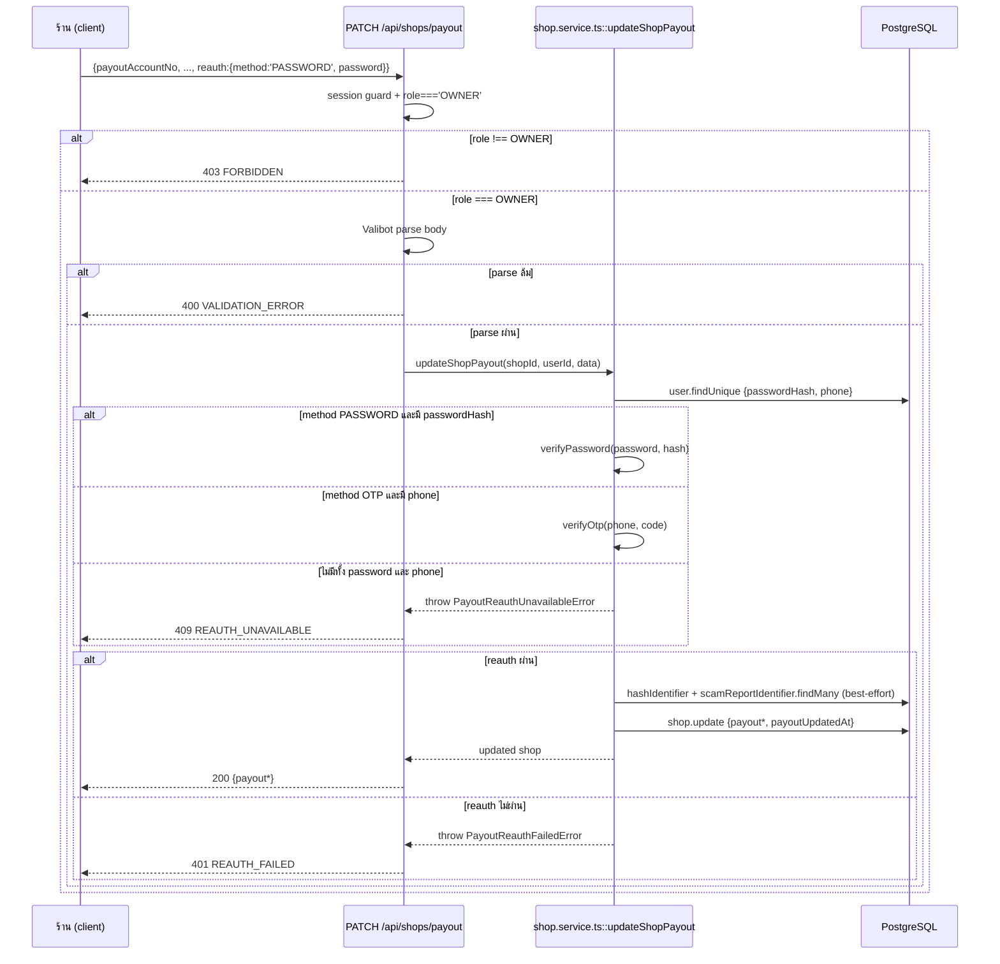

> **โมดูล:** M62-PickupBankTransfer
> **ประเภทเอกสาร:** API Contract
> **เวอร์ชัน:** 1.0
> **วันที่จัดทำ:** 2026-08-28
> **สถานะ:** Draft
> **เจ้าของเอกสาร:** SA

# API Contract: นัดรับสินค้า และ การชำระเงินแบบโอน

---

## 1. Overview

API ชุดนี้รองรับ SDS §3 (Component Design) — provider คือ Next.js 16 App Router Route Handler ทั้งหมด (nodejs runtime) ผู้บริโภคคือ:
- `src/app/(paces)/seller/...` (client component ฝั่งร้าน — handover, payment-confirm, payout settings, สร้าง/แก้ไขออเดอร์)
- `src/app/(marketing)/o/[token]/...` (guest/ผู้ซื้อ — อ่านอย่างเดียว ผ่าน RSC `guest-order-data.ts` ไม่ใช่ REST call)
- `Vercel Cron` (auto-confirm-pickup)

- **เอกสารออกแบบต้นทาง:** SDS ของโมดูลนี้ §3-6 (ทุก endpoint trace กลับ component/TD ได้)
- **Base URL:** โดเมนเดียวกับแอปหลัก (`https://deepthailand.app` prod / `https://seller.deepth.local:4000` dev) — ไม่มี API gateway แยก
- **Content-Type:** `application/json`
- **Convention:** response envelope แบบเดิมของโปรเจกต์ — คืน object ตรง ๆ (ไม่มี `{data, meta}` wrapper), error คืน `{ error: string }` เดียว (ตาม `cod-received/route.ts` และ route อื่นทั้งหมดที่สำรวจแล้ว — **ไม่ใช่** `{ error: { code, message, details } }` ของ template §5 ซึ่งเป็น pattern ทั่วไปของ template ไม่ใช่ convention จริงของโปรเจกต์นี้)

---

## 2. Authentication

| รายการ | ค่า |
|--------|-----|
| **วิธี (Auth Method)** | NextAuth.js v4 session cookie (seller subdomain session) — ตรวจผ่าน `getServerSession(authOptions)` + `requireActiveShop()` |
| **Header** | ไม่มี custom header — cookie-based เท่านั้น (ยกเว้น cron endpoint) |
| **Token/Scope** | `session.user.id` → resolve `activeShopId` → ยืนยัน order/shop นั้นเป็นของร้านนี้ผ่าน `WHERE shopId=` ใน query (ownership scope ที่ query ไม่ใช่เช็คทีหลัง) |
| **กรณีไม่ผ่าน** | 401/403 ตามตาราง error ข้อ 5 |
| **Cron exception** | `GET /api/cron/auto-confirm-pickup` ใช้ `Authorization: Bearer {CRON_SECRET}` เท่านั้น ไม่มี session (server-to-server) |

---

## 3. Endpoint List

| Method | Path | คำอธิบาย |
|--------|------|----------|
| `POST` | `/api/orders/[token]/handover` | ร้านยืนยัน "มอบสินค้าแล้ว" |
| `DELETE` | `/api/orders/[token]/handover` | ยกเลิกการยืนยัน (กดผิด) |
| `POST` | `/api/orders/[token]/payment-confirm` | ร้านยืนยัน "ได้รับเงินแล้ว" (TRANSFER/PROMPTPAY/CASH) |
| `DELETE` | `/api/orders/[token]/payment-confirm` | ยกเลิกการยืนยัน |
| `PATCH` | `/api/shops/payout` | ตั้ง/เปลี่ยนบัญชีรับเงินของร้าน (ต้อง reauth) |
| `GET` | `/api/cron/auto-confirm-pickup` | ปิดออเดอร์นัดรับที่พ้น grace period (cron เท่านั้น) |
| `POST` | `/api/orders` | **(แก้ไขของเดิม)** เพิ่มรับ `fulfillmentMode` |
| `PATCH` | `/api/orders/[token]` | **(แก้ไขของเดิม)** เพิ่มรับ `fulfillmentMode` |

---

## 4. Endpoint Detail

### 4.1 `POST /api/orders/[token]/handover`

ร้านยืนยันว่ามอบสินค้าให้ผู้ซื้อในการนัดรับแล้ว — เริ่มนับ grace period 48 ชม. ก่อน auto-confirm ไม่เปลี่ยน `Order.status`

**Request**

| ส่วน | ฟิลด์ | ชนิด | บังคับ | คำอธิบาย |
|------|-------|------|--------|----------|
| Path Param | `token` | `string` (uuid, `publicToken`) | yes | — |
| Body | — | — | — | ไม่มี body (มิเรอร์ `cod-received`) |

**Response — Success (200)**

| ฟิลด์ | ชนิด | คำอธิบาย |
|-------|------|----------|
| `handedOverAt` | `string \| null` (ISO 8601) | เวลาที่บันทึก |

**Response — Error:** `NOT_PICKUP_ORDER` (400), `ORDER_NOT_PENDING` (409), `NOT_FOUND` (404), `UNAUTHORIZED` (403) — ดูตารางข้อ 5

**ตัวอย่าง JSON**
```json
// Response 200
{ "handedOverAt": "2026-08-28T10:15:00.000+07:00" }
```

### 4.2 `DELETE /api/orders/[token]/handover`

ยกเลิกการยืนยัน "มอบสินค้าแล้ว" — ใช้ได้เฉพาะ `status='PENDING'` (ถ้า auto-confirm ทำงานไปแล้ว undo ไม่ได้อีก)

**Request:** เหมือน 4.1 (path param เท่านั้น)

**Response — Success (200):** `{ "handedOverAt": null }`

**Response — Error:** `ORDER_ALREADY_CLOSED` (409, ออเดอร์ปิดไปแล้วก่อนกด undo), อื่น ๆ เหมือน 4.1

### 4.3 `POST /api/orders/[token]/payment-confirm`

ร้านยืนยันได้รับเงินโอน/พร้อมเพย์/เงินสด — mirror `cod-received` แต่ครอบ `paymentMethod ∈ {TRANSFER, PROMPTPAY, CASH}` เท่านั้น (COD ใช้ `/cod-received` เดิม)

**Request:** path param `token` เท่านั้น ไม่มี body

**Response — Success (200):**
```json
{ "paymentConfirmedAt": "2026-08-28T10:20:00.000+07:00" }
```

**Response — Error:** `PAYMENT_METHOD_NOT_ELIGIBLE` (400 — รวมกรณีเป็น COD ด้วย ข้อความชี้ไปปุ่มเดิม), `NOT_FOUND` (404), `UNAUTHORIZED` (403)

### 4.4 `DELETE /api/orders/[token]/payment-confirm`

ยกเลิกการยืนยันรับเงิน — ไม่มีเงื่อนไข status (ต่างจาก handover — เพราะ `codReceivedAt` เดิมก็ undo ได้ทุกสถานะที่ยังไม่ CANCELLED ตามพฤติกรรมเดิม)

**Response — Success (200):** `{ "paymentConfirmedAt": null }`

### 4.5 `PATCH /api/shops/payout`

ตั้ง/เปลี่ยนบัญชีรับเงินของร้าน — เจ้าของร้าน (`role='OWNER'`) เท่านั้น ต้อง reauth ทุกครั้ง

**Request**

| ส่วน | ฟิลด์ | ชนิด | บังคับ | คำอธิบาย |
|------|-------|------|--------|----------|
| Body | `payoutBankCode` | `string` (จาก `THAI_BANKS` code) | no | ไม่ส่ง = ไม่เปลี่ยน; ส่ง `null` = ลบค่า |
| Body | `payoutAccountNo` | `string` | no | เช่นเดียวกัน — normalize ที่ server ก่อน validate/hash |
| Body | `payoutAccountName` | `string` (≤100 ตัวอักษร) | no | เช่นเดียวกัน |
| Body | `payoutPromptPayId` | `string` | no | เช่นเดียวกัน — validate เป็น MOBILE (10 หลัก, `MOBILE_PHONE_RE`) หรือ NATIONAL_ID (13 หลัก) |
| Body | `reauth` | `object` | **yes** | `{ method:'PASSWORD', password:string }` หรือ `{ method:'OTP', code:string }` |

**Response — Success (200)**

```json
{
  "payoutBankCode": "KBANK",
  "payoutAccountNo": "1234567890",
  "payoutAccountName": "ร้าน BT เคสมือถือ",
  "payoutPromptPayId": "0812345678",
  "payoutUpdatedAt": "2026-08-28T10:30:00.000+07:00"
}
```

**Response — Error:** `VALIDATION_ERROR` (400 — bank code ไม่รู้จัก/เลขบัญชีผิดรูป/PromptPay ID ผิดรูป), `REAUTH_FAILED` (401), `REAUTH_UNAVAILABLE` (409 — ไม่มีทั้ง password และเบอร์โทรให้ reauth), `FORBIDDEN` (403 — ไม่ใช่ OWNER)

### 4.6 `GET /api/cron/auto-confirm-pickup`

ปิดออเดอร์นัดรับที่ `handedOverAt` เกิน 48 ชม. และไม่มีข้อพิพาทค้าง — เรียกจาก Vercel Cron ทุก 6 ชม. เท่านั้น

**Request:** header `Authorization: Bearer {CRON_SECRET}`

**Response — Success (200):**
```json
{ "scanned": 12, "confirmed": 9, "skippedDispute": 2, "skippedAlreadyClosed": 1, "failed": 0 }
```

**Response — Error:** `unauthorized` (401 — secret ไม่ตรง/ไม่ตั้ง), `internal_error` (500)

### 4.7 `POST /api/orders` (แก้ไขของเดิม)

เพิ่ม field ใน `CreateOrderSchema`: `fulfillmentMode?: 'SHIPPED' | 'PICKUP'` — ไม่ส่ง = พฤติกรรมเดิมทุกประการ (auto-derive จาก item/product)

**Response — Error เพิ่ม:** `PICKUP_NOT_ALLOWED` (400 — `shop.vertical !== 'ONLINE_SALES'` แต่ส่ง `fulfillmentMode:'PICKUP'` มา)

### 4.8 `PATCH /api/orders/[token]` (แก้ไขของเดิม)

เพิ่ม field ใน `UpdateOrderSchema` เหมือนกัน — แก้ได้เฉพาะ `status='PENDING'` (ด่านเดิม `OrderNotEditableError` ครอบอยู่แล้ว)

**Response — Error เพิ่ม:** `PICKUP_NOT_ALLOWED` (400) — เงื่อนไขเดียวกับ 4.7

---

## 5. Error Code Table

🛑 **ตารางนี้คือ cross-file error-mapping ที่บังคับ (Controller/reviewer ต้องเทียบกับ route จริง)** — ตาม `docs/conventions/feedback_service_error_route_mapping`: error ใหม่ทุกตัวต้องมี route ที่ catch มันจริง ไม่ใช่แค่ประกาศคลาสไว้

| Error Code | HTTP Status | เงื่อนไข | Service/Route ที่ throw หรือ guard | Route ที่ต้อง catch/map |
|------------|-------------|----------|--------------------------------------|---------------------------|
| `PICKUP_NOT_ALLOWED` | 400 | `data.fulfillmentMode==='PICKUP'` แต่ `shop.vertical !== 'ONLINE_SALES'` | `order.service.ts::createOrder`/`updateOrder` throw **`PickupNotAllowedError`** (ใหม่) | `POST /api/orders` (เพิ่ม branch ถัดจาก `ShippingAddressRequiredError` ที่มีอยู่แล้ว) · `PATCH /api/orders/[token]` (เพิ่มบรรทัดถัดจากของเดิม) |
| `NOT_PICKUP_ORDER` | 400 | เรียก `/handover` กับออเดอร์ที่ `fulfillmentMode !== 'PICKUP'` | inline guard ใน `handover/route.ts` (ไม่ throw — คืน response ตรง ๆ มิเรอร์ `cod-received/route.ts`) | ไม่ต้อง catch (ไม่มี throw) |
| `ORDER_NOT_PENDING` | 409 | POST `/handover` กับออเดอร์ที่ `status !== 'PENDING'` | inline guard `handover/route.ts` | ไม่ต้อง catch |
| `ORDER_ALREADY_CLOSED` | 409 | DELETE `/handover` กับออเดอร์ที่ปิดไปแล้ว | inline guard `handover/route.ts` | ไม่ต้อง catch |
| `PAYMENT_METHOD_NOT_ELIGIBLE` | 400 | `/payment-confirm` กับ `paymentMethod` ที่ไม่ใช่ TRANSFER/PROMPTPAY/CASH (รวม COD) | inline guard `payment-confirm/route.ts` (มิเรอร์ `isCODPayment` check ที่ `cod-received/route.ts`) | ไม่ต้อง catch |
| `NOT_FOUND` (`"ไม่พบคำสั่งซื้อนี้"`) | 404 | order ไม่พบ/ไม่ใช่ของร้าน active | inline `resolveOrder()` มิเรอร์ `cod-received/route.ts` ทั้ง 2 endpoint ใหม่ | ไม่ต้อง catch |
| `UNAUTHORIZED` (`"ไม่มีสิทธิ์"`) | 403 | `requireActiveShop()` คืน `null` | inline `resolveOrder()` มิเรอร์ `cod-received/route.ts` | ไม่ต้อง catch |
| `VALIDATION_ERROR` | 400 | bank code/เลขบัญชี/PromptPay ID รูปแบบผิด | Valibot parse ล้มที่ `PATCH /api/shops/payout` route | ตัว route เองจับ parse error |
| `REAUTH_FAILED` | 401 | `verifyPassword`/`verifyOtp` คืน `false` | `shop.service.ts::updateShopPayout` throw **`PayoutReauthFailedError`** (ใหม่) | `PATCH /api/shops/payout/route.ts` |
| `REAUTH_UNAVAILABLE` | 409 | User ไม่มีทั้ง `passwordHash` และ `phone` | `updateShopPayout` throw **`PayoutReauthUnavailableError`** (ใหม่) | `PATCH /api/shops/payout/route.ts` — branch แยกจาก `REAUTH_FAILED` |
| `FORBIDDEN` (`"ไม่มีสิทธิ์แก้ไขบัญชีรับเงิน"`) | 403 | `role !== 'OWNER'` | inline guard ใน `payout/route.ts` (เช็คก่อนเรียก service) | ไม่ต้อง catch |
| `unauthorized` | 401 | `CRON_SECRET` ไม่ตรง/ไม่ตั้ง | inline guard `auto-confirm-pickup/route.ts` (มิเรอร์ `auto-confirm-delivered/route.ts` เป๊ะ) | ไม่ต้อง catch |
| `internal_error` | 500 | exception ไม่คาดคิดใน `autoConfirmPickup()` | try/catch ที่ `auto-confirm-pickup/route.ts` | ตัว route เอง |

**โครง error response จริงของโปรเจกต์** (verified จาก `cod-received/route.ts` และทุก route ที่สำรวจ — ไม่ใช่ envelope ทั่วไปของ template):
```json
{ "error": "ข้อความภาษาไทยสำหรับผู้ใช้" }
```

**คลาส Error ใหม่ที่ต้อง implement** (ทั้งหมด extend `Error`, pattern เดียวกับ `order.service.ts` เดิม):
1. `PickupNotAllowedError` (`order.service.ts`)
2. `PayoutReauthFailedError` (`shop.service.ts`)
3. `PayoutReauthUnavailableError` (`shop.service.ts`)

ทุกตัว **ต้องมี route ที่ catch มัน** ตามตารางข้างบน — ตาม `docs/conventions/rule-must-be-enforced-not-described.md` ต้องมี integration test ยิง condition ที่ทำให้ throw แล้วเช็ค HTTP status จริง ไม่ใช่แค่เช็คว่าคลาสถูกประกาศ

---

## 6. Sequence (flow ที่ซับซ้อน)

### 6.1 `PATCH /api/shops/payout` — reauth แบบ 2 ทาง



---

## 7. Traceability

| Endpoint | SDS Component / Decision | BRD FR |
|----------|---------------------------|--------|
| `POST/DELETE /handover` | Component `order.service.ts` (U6) / TD-002 | FR-PKP-03 |
| `POST/DELETE /payment-confirm` | Component `order.service.ts` (U6) / TD-002 | FR-PAY-01, FR-PAY-03 |
| `PATCH /shops/payout` | TD-005, TD-006 (U7) | FR-BANK-01, BR-BANK-02 |
| `GET /cron/auto-confirm-pickup` | Flow SDS §4.2 (U5) | FR-PKP-04 |
| `POST /orders`, `PATCH /orders/[token]` | TD-001 (U3) | FR-PKP-01 |

---

## 8. สรุป (Summary)

API Contract นี้กำหนดสัญญาของ 4 endpoint ใหม่ + การเปลี่ยนแปลงของ 2 endpoint เดิม ทั้งหมดมิเรอร์ pattern ที่พิสูจน์แล้วในโปรเจกต์ (`cod-received/route.ts`, `auto-confirm-delivered/route.ts`) — envelope, auth guard และ error-response ตรงตาม convention จริงของโปรเจกต์ (ไม่ใช่ envelope ทั่วไปของ template) DEV implement ได้โดยไม่ต้องตัดสินใจรูปร่าง request/response ใหม่ QA ใช้ตารางข้อ 5 วางแผนทดสอบ negative case ได้ครบ

**Open Questions (Controller เคาะแล้ว 2026-08-28):**
- ~~ควรมี `GET /api/shops/payout` แยกไหม~~ → **ไม่มี** — หน้า `/shop` เป็น RSC อยู่แล้ว อ่านค่าปัจจุบันจาก server component ตรง ๆ ไม่ต้องผ่าน REST (ถ้าภายหลัง ux ต้องการ client-side refresh หลัง save ให้ใช้ `router.refresh()` ตาม pattern เดิมของโปรเจกต์)
