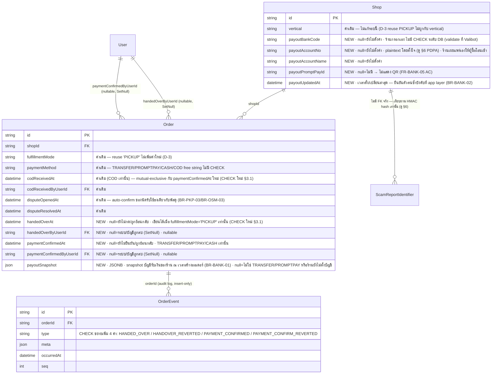

> **โมดูล:** M62-PickupBankTransfer
> **ประเภทเอกสาร:** DATABASE Design
> **เวอร์ชัน:** 1.0
> **วันที่จัดทำ:** 2026-08-28
> **สถานะ:** Draft — ออกแบบจาก PRD/BRD (มติ D-1..D-5 อนุมัติแล้ว 2026-08-28) **ก่อน** SRS/SDS ของโมดูลนี้จะถูกเขียน
> **เจ้าของเอกสาร:** SA (safepay-database)

> 🛑 **หมายเหตุลำดับเอกสาร:** ตาม `docs/99 - Rules/Feature-Docs-Ownership.md` ลำดับปกติคือ PRD→BRD→SRS→SDS→(API.md+DATABASE.md) — เอกสารนี้ถูกสั่งให้เขียนก่อน SRS/SDS ของโมดูล 00062 จะถูกจัดทำ (คำสั่งจาก Controller) จึง trace กลับได้แค่ระดับ **BRD FR-ID** เท่านั้น (§7) ไม่ใช่ SDS component ตามฟอร์แมตเต็มของ template — เมื่อ SRS/SDS ของโมดูลนี้เขียนเสร็จ ต้องกลับมาตรวจว่า data model ที่นี่ตรงกับ SDS หรือไม่ (ระบุเป็น Open Question ท้ายเอกสาร)
>
> 🛑 **งานรอบนี้เป็นการออกแบบ + เขียนเอกสารล้วน** — ยังไม่แตะ `prisma/schema.prisma` และยังไม่สร้างไฟล์ `prisma/migrations/**` จริง (Hard Rule 14 — ห้ามรันคำสั่งที่แตะฐานข้อมูลใด ๆ ในรอบนี้) SQL ทั้งหมดใน §5 คือ**ฉบับที่เสนอให้ implement** ไม่ใช่ของที่ apply แล้ว
>
> 🛑 **การ deploy จะรัน `prisma migrate deploy` ให้อัตโนมัติเมื่อ merge เข้า `main`** (Hard Rule 15) — เมื่อถึงขั้นตอน implement ต้องแจ้ง user ก่อนรัน `prisma migrate dev` ทุกครั้งตามกฎนั้น ไม่มีข้อยกเว้น

<!-- ลบ comment แนวทาง template ที่เหลือทั้งหมดแล้ว เพราะเอกสารนี้ปรับโครงจาก template ให้ตอบ
     5 คำถามที่ Controller สั่งไว้ครบ (ER diagram / SQL migration ฉบับเต็ม / query impact /
     rollback+ข้อมูลเดิม / PDPA) — โครง 8 หัวข้อของ template ยังอยู่ครบ แค่แทรกเนื้อหาตามคำสั่ง -->

# DATABASE: นัดรับสินค้า และ การชำระเงินแบบโอน (Order Pickup & Bank Transfer)

---

## 1. Overview

ฟีเจอร์นี้แตะ 3 ตารางที่มีอยู่แล้ว **ไม่มีตารางใหม่**:

| ตาราง | สิ่งที่เพิ่ม | เหตุผล (อ้าง BRD) |
|---|---|---|
| `Order` | 5 คอลัมน์ใหม่ (`handedOverAt`, `handedOverByUserId`, `paymentConfirmedAt`, `paymentConfirmedByUserId`, `payoutSnapshot`) | FR-PKP-03/04, FR-PAY-01, FR-BANK-02 |
| `Shop` | 5 คอลัมน์ใหม่ (`payoutBankCode`, `payoutAccountNo`, `payoutAccountName`, `payoutPromptPayId`, `payoutUpdatedAt`) | FR-BANK-01 |
| `OrderEvent` | ขยาย CHECK `OrderEvent_type_check` เพิ่ม 4 ค่า (`HANDED_OVER`, `HANDOVER_REVERTED`, `PAYMENT_CONFIRMED`, `PAYMENT_CONFIRM_REVERTED`) | FR-PKP-03, FR-PAY-01 (audit trail — ประวัติต้องเห็นทั้งการกดและการย้อนกลับ) |

**ค่าที่ reuse ไม่แตะ schema:** `Order.fulfillmentMode = 'PICKUP'` (D-3 — ค่าเดิมของ feature 00017 booking) และ `Order.paymentMethod ∈ {TRANSFER, PROMPTPAY, CASH}` (free string เดิม ไม่มี DB CHECK อยู่แล้ว — ยืนยันจาก `grep` ทั้ง `prisma/migrations/**` ไม่พบ CHECK ผูกกับคอลัมน์นี้)

- **Store:** PostgreSQL 16 บน Supabase (dev/prod แยกฐานกันแล้วตาม `project_dev_db_separated_from_prod.md`) — เข้าถึงผ่าน Prisma ORM เท่านั้น (ไม่มี RLS, authorization อยู่ที่ `src/services/`)
- **เอกสารต้นทาง:** `PRD.md` §4.3 (มติ D-1..D-5) + `BRD.md` §2, §4, §7.2 (เหตุผลเบื้องหลังมติ) ของโมดูลนี้ — SDS ยังไม่มี ณ ตอนเขียนเอกสารนี้
- **Engine/Charset:** InnoDB ไม่เกี่ยวข้อง (Postgres) — ทุกคอลัมน์ข้อความใหม่เป็น `TEXT` ตาม convention เดิมของโปรเจกต์ (ไม่ใช้ `VARCHAR(n)` ที่ไหนในสคีมานี้เลย)

---

## 2. ERD



**คำอธิบายทุกคอลัมน์ใหม่ — ใครเขียน / null แปลว่าอะไร:**

| คอลัมน์ | ใครเขียน | `NULL` แปลว่าอะไร | เขียนทับได้ไหม |
|---|---|---|---|
| `Order.handedOverAt` | ร้าน (พนักงานที่มีสิทธิ์แก้ไขออเดอร์) กดปุ่ม "มอบสินค้าแล้ว" — เขียนเฉพาะออเดอร์ `fulfillmentMode='PICKUP'` | ยังไม่กด **หรือ** เคยกดแล้วถูกย้อนกลับ (FR-PKP-03 AC "ร้านย้อนกลับได้") — schema แยกสองเคสนี้ไม่ออก ต้องดู `OrderEvent` (`HANDED_OVER` ล่าสุด vs `HANDOVER_REVERTED` ล่าสุด) ถ้าต้องการรู้ว่า "ไม่เคย" หรือ "เคยแล้วถอน" | **ได้** (ต่างจาก `OrderShipment.deliveredAt`/`returnedAt` ที่ write-once — ที่นี่ user เคาะให้ย้อนกลับได้ FR-PKP-03 AC ข้อ 4 จึงต้องเป็น conditional update ไม่ใช่ write-once) |
| `Order.handedOverByUserId` | ระบบเขียนพร้อมกับ `handedOverAt` เสมอ (คนละ query ไม่ได้) | ระบบเขียนค่า `handedOverAt` แต่ไม่รู้ผู้กระทำ (ไม่ควรเกิดในระบบนี้เพราะ mirror `codReceivedByUserId` ที่ null ได้จากกรณี "ระบบเขียนเอง" — auto-confirm **ไม่ใช่** ผู้เขียนคอลัมน์นี้ มันเขียนแค่ `Order.status`) หรือบัญชีที่กดถูกลบ (`onDelete: SetNull`) | เขียนทับพร้อมกับ `handedOverAt` เท่านั้น (toggle คู่กันเสมอ) |
| `Order.paymentConfirmedAt` | ร้านกดปุ่ม "ได้รับเงินแล้ว" — เขียนเฉพาะออเดอร์ `paymentMethod ∈ {TRANSFER, PROMPTPAY, CASH}` (FR-PAY-01 AC ข้อ 4 — `COD` ใช้ `codReceivedAt` เดิม ห้ามปน) | ยังไม่ยืนยัน **หรือ** เคยยืนยันแล้วถูกย้อนกลับ (Scenario 3 ของ BRD) — เหมือน `handedOverAt` แยกสองเคสไม่ได้จาก schema เดี่ยว ๆ | **ได้** (mirror `codReceivedAt` ที่ toggle ได้อยู่แล้ว — ดู `src/services/order.service.ts:1343-1344` `codReceivedAt: null` เมื่อกด toggle ปิด) |
| `Order.paymentConfirmedByUserId` | คู่กับ `paymentConfirmedAt` เสมอ | เหมือน `handedOverByUserId` — mirror `codReceivedByUserId` | คู่กับ `paymentConfirmedAt` เท่านั้น |
| `Order.payoutSnapshot` | `createOrder()` **เขียนครั้งเดียวตอนสร้างออเดอร์** — อ่าน `Shop.payout*` ณ ขณะนั้นแล้ว freeze ลงคอลัมน์นี้ (BR-BANK-01, mirror `OrderShipment.senderSnapshot`/`receiverSnapshot`) | ออเดอร์ที่ `paymentMethod` ไม่ใช่ `TRANSFER`/`PROMPTPAY` (ไม่ต้องมีบัญชีให้โอน) **หรือ** ร้านยังไม่ตั้งค่าบัญชีตอนสร้างออเดอร์ใบนั้น (ไม่ error — แค่ไม่มีเลขบัญชีให้แสดง, UI ต้อง fallback ตามที่ SDS ออกแบบ) | **ห้ามเขียนทับ** — เหมือน `senderSnapshot`/`receiverSnapshot` ทุกประการ: "ถ้าอ้างอิงสดแล้วร้านแก้ค่าตั้งต้นทีหลัง ประวัติเก่าจะเปลี่ยนตาม" (คอมเมนต์ต้นฉบับใน `schema.prisma:2302-2303`) — `updateOrder()` (แก้ไขออเดอร์ตอนยัง `PENDING`) **ต้อง re-snapshot ใหม่ทั้งก้อนถ้าเปลี่ยน `paymentMethod` เป็น TRANSFER/PROMPTPAY ระหว่างแก้ไข** (เหมือนที่ HR16 บันทึกไว้ว่า `updateOrder` re-snapshot ต้นทุนอยู่แล้วสำหรับ `OrderItem.cost` — เป็น pattern เดียวกัน ไม่ใช่ freeze ตายตัวแบบ `OrderShipment`) |
| `Shop.payoutBankCode/AccountNo/AccountName/PromptPayId` | ร้าน (owner) ผ่านหน้าตั้งค่า — ต้องยืนยันตัวตนซ้ำก่อนเปลี่ยน (BR-BANK-02, บังคับที่ app layer ไม่มี DB trigger เหมือนทุก business rule อื่นในโปรเจกต์นี้) | ร้านยังไม่เคยตั้งค่าบัญชีรับเงินเลย | เขียนทับได้เสมอ (ค่า "ปัจจุบัน" ของร้าน — ออเดอร์เก่าไม่โดนกระทบเพราะอ่านจาก `payoutSnapshot` ไม่ใช่ live-read) |
| `Shop.payoutUpdatedAt` | คู่กับ 4 ฟิลด์ข้างบนเสมอ | ยังไม่เคยตั้งค่า | เขียนทับทุกครั้งที่ 4 ฟิลด์ข้างบนเปลี่ยน |

---

## 3. Tables

### 3.1 `Order` (PostgreSQL — เพิ่มคอลัมน์)

| Column | Type | Null | Default | Key |
|---|---|---|---|---|
| `handedOverAt` | `TIMESTAMP(3)` | YES | `NULL` | — |
| `handedOverByUserId` | `TEXT` | YES | `NULL` | FK → `User.id` (`ON DELETE SET NULL ON UPDATE CASCADE`) |
| `paymentConfirmedAt` | `TIMESTAMP(3)` | YES | `NULL` | — |
| `paymentConfirmedByUserId` | `TEXT` | YES | `NULL` | FK → `User.id` (`ON DELETE SET NULL ON UPDATE CASCADE`) |
| `payoutSnapshot` | `JSONB` | YES | `NULL` | — |

**โครงสร้างข้างใน `payoutSnapshot` (ไม่มี schema บังคับที่ DB — ตกลงกันที่ TS type ใน SDS):**
```json
{
  "bankCode": "SCB",
  "accountNo": "1234567890",
  "accountName": "ร้าน BT เคสมือถือ",
  "promptPayId": "0812345678"
}
```
ฟิลด์ใดใน 4 ฟิลด์นี้ที่ `Shop.payout*` เดิมเป็น `null` ตอนสร้างออเดอร์ → snapshot ไม่มี key นั้นเลย (ไม่ใส่ `null` ทับ — เหมือนกติกาที่ `docs/conventions/external-payload-schema.md` วางไว้เรื่อง "ค่าที่ไม่รู้ ≠ เขียน null ทับ" แม้บริบทต่างกัน หลักการเดียวกัน: ไม่มีข้อมูล → ไม่มี key ดีกว่ามี key ที่เป็น null ปนกับกรณี "ตั้งใจลบ")

**เหตุผลที่ไม่แยก `payoutSnapshot` เป็น 4 คอลัมน์เดี่ยว (mirror `payoutBankCode` ฯลฯ):** `OrderShipment.senderSnapshot`/`receiverSnapshot` ที่มีอยู่แล้วในระบบใช้ pattern `Json?` เดี่ยวสำหรับ snapshot ที่มีหลายฟิลด์ประกอบกันเป็นก้อนเดียว (ที่อยู่ผู้ส่ง/ผู้รับ) — การ mirror pattern เดิมทำให้โค้ดที่อ่าน snapshot ทั้งสองจุด (พัสดุ + บัญชีรับเงิน) มีรูปแบบเดียวกัน และไม่ต้อง migration เพิ่มคอลัมน์ถ้า SDS ตัดสินใจเพิ่มฟิลด์ในอนาคต (เช่น หมายเหตุพิเศษของบัญชี)

### 3.2 `Shop` (PostgreSQL — เพิ่มคอลัมน์)

| Column | Type | Null | Default | Key |
|---|---|---|---|---|
| `payoutBankCode` | `TEXT` | YES | `NULL` | — |
| `payoutAccountNo` | `TEXT` | YES | `NULL` | — |
| `payoutAccountName` | `TEXT` | YES | `NULL` | — |
| `payoutPromptPayId` | `TEXT` | YES | `NULL` | — |
| `payoutUpdatedAt` | `TIMESTAMP(3)` | YES | `NULL` | — |

**ไม่มี CHECK ระดับ DB จำกัดรูปแบบ** (เช่น `payoutBankCode` ต้องอยู่ในลิสต์ธนาคารไทยที่รู้จัก, `payoutAccountNo` ต้องเป็นตัวเลข n หลัก) — สอดคล้องกับ convention เดิมของตาราง `Shop` ที่ฟิลด์แบบเดียวกัน (`address`, `businessType`, ฯลฯ) validate ที่ Valibot ชั้นเดียว ไม่มี CHECK คู่ขนาน SDS ต้องออกแบบ:
1. รายการรหัส/ชื่อธนาคารไทย (SSOT ใหม่ เช่น `src/lib/thai-banks.ts`) — ปัจจุบัน**ไม่มีไฟล์นี้อยู่ในรีโป** (grep ทั้ง repo หา `bankCode`/`thai-banks` ไม่พบ) ต้องสร้างใหม่ ไม่ใช่งานของ DATABASE.md แต่ระบุไว้เป็น dependency ของ Valibot schema ที่จะ validate คอลัมน์นี้
2. รูปแบบ `payoutPromptPayId` (เบอร์โทร 10 หลัก / เลขบัตร ปชช. 13 หลัก / รหัส e-Wallet) — validate ที่ Valibot เช่นกัน ไม่ใช่ DB CHECK

### 3.3 `OrderEvent` (PostgreSQL — ไม่มีคอลัมน์ใหม่ แก้ CHECK เท่านั้น)

ไม่มีคอลัมน์ใหม่ — `type` ยังเป็น `TEXT` เดิม แค่ขยาย `OrderEvent_type_check` (unmanaged SQL, ดู §5) ให้ยอมรับ 4 ค่าเพิ่ม:

| ค่าใหม่ | ความหมาย | `meta` ที่คาดว่าจะมี (ตกลงที่ SDS) |
|---|---|---|
| `HANDED_OVER` | ร้านกด "มอบสินค้าแล้ว" | ไม่มี PII — event นี้ไม่มีอะไรต้องเก็บเพิ่มจาก `actorUserId`/`occurredAt` ที่มีอยู่แล้ว |
| `HANDOVER_REVERTED` | ร้านย้อนกลับการกด "มอบสินค้าแล้ว" | เหมือนกัน |
| `PAYMENT_CONFIRMED` | ร้านกด "ได้รับเงินแล้ว" | อาจมี `{ "paymentMethod": "TRANSFER" }` เพื่อให้ไทม์ไลน์อ่านออกว่ายืนยันเงินประเภทไหน — **ตกลงที่ SDS ไม่ใช่ตอนนี้** |
| `PAYMENT_CONFIRM_REVERTED` | ร้านย้อนกลับการกด "ได้รับเงินแล้ว" | เหมือนกัน |

ตั้งชื่อ 4 ค่าใหม่ให้ตรงกับ pattern ที่มีอยู่แล้วในตาราง (`SHIPMENT_CREATED`/`SHIPMENT_CANCELLED`, `ORDER_DISPUTE_OPENED`/`ORDER_DISPUTE_RESOLVED`) คือ **คำนามของเหตุการณ์ ไม่ใช่คำสั่ง** และมีคู่ "ทำ/ย้อนกลับ" ชัดเจนเหมือน pattern เดิม — ไม่ตั้งชื่อว่า `PICKUP_HANDED_OVER` เพราะ `Order.fulfillmentMode` เป็นคอลัมน์เดียวที่รู้อยู่แล้วว่าใบนี้เป็นนัดรับ ไม่ต้องซ้ำในชื่อ event

**🛑 ต้องอัปเดตคอมเมนต์ที่นับจำนวนค่า** — `schema.prisma:3739-3741` ตอนนี้เขียนว่า "type: 15 ค่าคงที่" ซึ่งล้าสมัยไปแล้ว (จริง ๆ คือ 21 ค่า ณ วันที่เขียนเอกสารนี้ ก่อนฟีเจอร์นี้) ต้องอัปเดตเป็น **25 ค่า** ในคอมมิตเดียวกับ migration นี้ — คอมเมนต์บรรทัดถัดไปเตือนไว้เองแล้วว่า "เคยเขียนค้างมาก่อน" (บทเรียนจาก feature 00033) ห้ามให้ประวัติซ้ำรอยเดิม

---

## 4. Indexes

| Table | Columns | Type | Rationale (query pattern ที่รองรับ) |
|---|---|---|---|
| `Order` | `(fulfillmentMode, status, handedOverAt)` | BTREE composite (Prisma-managed `@@index`) | job ปิดงานอัตโนมัติของออเดอร์นัดรับ (FR-PKP-04, mirror `autoConfirmDelivered()`) — คัด `WHERE fulfillmentMode='PICKUP' AND status IN ('PENDING') AND handedOverAt <= cutoff` โดยไม่ scan ทั้งตาราง `Order` (ตารางนี้ใหญ่กว่า `OrderShipment` — ทุก order มีแถวเดียวใน `Order` แต่ auto-confirm พัสดุ query จาก `OrderShipment` ซึ่งมีแค่ order ที่ shipped เท่านั้น ⇒ งานนัดรับต้อง query จาก `Order` ตรง ๆ index จึงจำเป็นกว่า ไม่ใช่ optional) |
| `Order` | `(shopId, paymentConfirmedAt)` | BTREE composite (Prisma-managed `@@index`) | mirror `Order_shopId_codReceivedAt_idx` ที่มีอยู่แล้ว (migration `20260804200000_order_cod_received`) — รองรับไทล์/ตัวกรองฝั่งร้าน "ออเดอร์โอนเงินที่ยังไม่ยืนยันรับเงิน" ถ้า SDS ออกแบบไทล์แบบเดียวกับ "รอเงิน COD" |

**ตัดสินใจไม่เพิ่ม index สำหรับ:**

- **`handedOverByUserId` / `paymentConfirmedByUserId`** — ไม่เพิ่ม dedicated index มิเรอร์การตัดสินใจของ `codReceivedByUserId` (field คู่ขนานที่เพิ่งเพิ่มเมื่อ 2026-08-04 — ตรวจแล้วว่า**ไม่มี** `@@index` ให้ทั้ง schema.prisma และ migration SQL) ต่างจาก `createdByUserId` ที่มี index เพราะคอมเมนต์ระบุเหตุผลเจาะจง ("กัน full table scan ตอนลบบัญชีพนักงาน") — โปรเจกต์นี้ยอมรับต้นทุนนี้แล้วสำหรับ FK แบบเดียวกัน ไม่จำเป็นต้องเข้มกว่าฟิลด์พี่น้องที่ทำหน้าที่เดียวกันทุกประการ
- **`Shop.payout*`** — ไม่มี query pattern ที่ filter/join ด้วยฟิลด์เหล่านี้ (อ่านเสมอผ่าน `shopId` ซึ่งเป็น PK อยู่แล้ว) จึงไม่ต้องมี index เพิ่ม
- **หน้ารายการ `/orders`** — **ไม่ต้องเพิ่ม index ใหม่** สำหรับ stage ใหม่ของนัดรับ เพราะ query หลักของหน้านี้ (`Order_shopId_status_createdAt` + `Order_shopId_createdAt_id_idx` ที่มีอยู่แล้ว) ดึงแถวมาครบอยู่แล้วตาม `shopId`+`status`+`createdAt` — stage "นัดรับ" derive จากคอลัมน์ที่ดึงมาแล้ว (`fulfillmentMode`, `handedOverAt`, `disputeOpenedAt`) **ในหน่วยความจำ** ที่ `deriveShippingStage()`/`buildShippingStageSql()` (SDS ต้องแก้ทั้งสองฝั่งพร้อมกัน — ดู BRD §7.3) ไม่ใช่ query แยก — ตรงกับข้อบังคับ BRD §6.2 "การเพิ่มกองสถานะของนัดรับต้องไม่เพิ่มจำนวน query ของหน้ารายการ `/orders`"

---

## 5. Migration Plan

### 5.1 ลำดับการ Migrate

| ลำดับ | การเปลี่ยนแปลง | Store | Dependency |
|---|---|---|---|
| 1 | `Order` เพิ่ม `handedOverAt`/`handedOverByUserId`/`paymentConfirmedAt`/`paymentConfirmedByUserId` + FK 2 ตัว + CHECK 2 ตัว + index 2 ตัว | Postgres (Prisma-managed คอลัมน์/FK/index + unmanaged CHECK ผสมในไฟล์เดียวกัน — pattern เดียวกับ `20260708000000_add_expense_cost_tracking_schema`) | ต้องมาก่อนลำดับ 3 (CHECK ของ OrderEvent อ้างชนิด event ที่ผูกกับคอลัมน์กลุ่มนี้ในเชิงความหมาย แม้ไม่มี FK ผูกจริง) |
| 2 | `Shop` เพิ่ม `payoutBankCode`/`payoutAccountNo`/`payoutAccountName`/`payoutPromptPayId`/`payoutUpdatedAt` + `Order` เพิ่ม `payoutSnapshot` | Postgres (Prisma-managed ล้วน — ไม่มี CHECK/FK ใหม่) | ไม่ผูกกับลำดับ 1 (คนละ concern) แต่ควรอยู่คนละไฟล์เพื่อ rollback แยกกันได้ (ดู §5.2) |
| 3 | ขยาย `OrderEvent_type_check` เพิ่ม 4 ค่า | Postgres (unmanaged SQL ล้วน — ห้าม Prisma DSL ประกาศ) | ควรรันหลังลำดับ 1 (แม้ไม่มี FK บังคับ) เพื่อให้โค้ดที่เขียน `HANDED_OVER` event ใช้คอลัมน์ `handedOverAt` ได้พร้อมกัน |

**ชื่อไฟล์ที่เสนอ** (timestamp ตรวจแล้วว่าไม่ชนกับ `git log --all --name-only -- 'prisma/migrations/*'` ณ วันที่เขียนเอกสารนี้ — migration ล่าสุดที่มีอยู่คือ `20260827100000_channel_ice_breaker`; **🛑 ต้องตรวจซ้ำคำสั่งเดียวกันนี้อีกครั้งตอน implement จริง** เพราะอาจมี branch อื่น merge เข้ามาก่อนหน้านั้น ตาม `docs/conventions/migration-check-constraint-additive.md` กฎข้อ 2):

```
prisma/migrations/20260828100000_order_pickup_handover_payment_confirm/migration.sql
prisma/migrations/20260828110000_order_shop_payout_account/migration.sql
prisma/migrations/20260828120000_order_event_pickup_payment_types/migration.sql
```

#### Migration 1 — `20260828100000_order_pickup_handover_payment_confirm`

```sql
-- feature 00062 — นัดรับสินค้า: ร้านกด "มอบสินค้าแล้ว" (FR-PKP-03) + ยืนยันรับเงินโอน (FR-PAY-01)
--
-- 4 คอลัมน์ mirror Order.codReceivedAt/codReceivedByUserId ทุกประการ (ดู DATABASE.md §2 ตาราง
-- "ใครเขียน/null แปลว่าอะไร") — additive ล้วน, nullable, ไม่มี default, ไม่แตะข้อมูลเดิม
-- ออเดอร์ทุกใบที่มีอยู่ก่อนหน้านี้จะได้ค่า NULL ทั้ง 4 คอลัมน์ ซึ่งคือค่าที่ถูกต้อง
-- (ไม่เคยมีการกด "มอบสินค้าแล้ว"/"ได้รับเงินแล้ว" มาก่อน เพราะฟีเจอร์นี้เพิ่งมี — ห้ามเดา backfill)

ALTER TABLE "Order" ADD COLUMN "handedOverAt" TIMESTAMP(3);
ALTER TABLE "Order" ADD COLUMN "handedOverByUserId" TEXT;
ALTER TABLE "Order" ADD COLUMN "paymentConfirmedAt" TIMESTAMP(3);
ALTER TABLE "Order" ADD COLUMN "paymentConfirmedByUserId" TEXT;

ALTER TABLE "Order" ADD CONSTRAINT "Order_handedOverByUserId_fkey"
  FOREIGN KEY ("handedOverByUserId") REFERENCES "User"("id") ON DELETE SET NULL ON UPDATE CASCADE;
ALTER TABLE "Order" ADD CONSTRAINT "Order_paymentConfirmedByUserId_fkey"
  FOREIGN KEY ("paymentConfirmedByUserId") REFERENCES "User"("id") ON DELETE SET NULL ON UPDATE CASCADE;

-- job ปิดงานนัดรับอัตโนมัติ (FR-PKP-04) ต้องคัด "ออเดอร์นัดรับที่ PENDING และมอบของแล้วเกิน grace
-- period" โดยไม่ scan ทั้งตาราง Order — mirror index ที่ autoConfirmDelivered() มีให้ OrderShipment
-- (ต่างที่ตรงนี้ query ตรงจาก Order เพราะออเดอร์นัดรับไม่มี OrderShipment เลย)
CREATE INDEX "Order_fulfillmentMode_status_handedOverAt_idx"
  ON "Order"("fulfillmentMode", "status", "handedOverAt");

-- mirror Order_shopId_codReceivedAt_idx (20260804200000) — เผื่อ SDS ออกแบบไทล์ "ออเดอร์โอนเงิน
-- ที่ยังไม่ยืนยันรับเงิน" แบบเดียวกับไทล์ "รอเงิน COD" ที่มีอยู่แล้ว
CREATE INDEX "Order_shopId_paymentConfirmedAt_idx"
  ON "Order"("shopId", "paymentConfirmedAt");

-- 🛑 CHECK ทั้งสองตัวด้านล่างปลอดภัย 100% กับข้อมูลเดิมบน prod โดยไม่ต้องนับก่อน apply:
-- paymentConfirmedAt และ handedOverAt เป็นคอลัมน์ที่เพิ่งสร้างในไฟล์นี้เอง (ไม่เคยมีมาก่อน) ⇒
-- ทุกแถวที่มีอยู่แล้วในตาราง (รวม 380 ใบที่มี codReceivedAt ไม่ว่างตาม PRD §Executive Summary)
-- จะมีค่า NULL ในคอลัมน์ใหม่ทั้งคู่โดยอัตโนมัติ 100% ⇒ CHECK ที่มีเงื่อนไข "คอลัมน์ใหม่ IS NULL OR …"
-- ผ่านทุกแถวเดิมแน่นอนโดยไม่ต้อง SELECT COUNT(*) มายืนยันก่อน (ต่างจาก CHECK ที่เพิ่มเงื่อนไข
-- ให้คอลัมน์เก่าที่มีข้อมูลจริงอยู่แล้ว ซึ่งต้องนับเสมอ — กรณีนั้นไม่เกิดในไฟล์นี้)
-- ใช้ NOT VALID + VALIDATE ตาม convention ของตารางนี้ (Order มี row จริงบน prod) เพื่อไม่ lock
-- ตารางระหว่าง ALTER TABLE (VALIDATE ใช้ SHARE UPDATE EXCLUSIVE ไม่ใช่ ACCESS EXCLUSIVE)

-- D-2: TRANSFER/PROMPTPAY/CASH ใช้ paymentConfirmedAt, COD ใช้ codReceivedAt เดิม — ไม่มีออเดอร์
-- ใดควรมีทั้งคู่พร้อมกัน (BRD §7.2 D-2 "ไม่มีออเดอร์ใดใช้ทั้งคู่พร้อมกัน") บังคับเป็น CHECK เพื่อให้
-- เป็นด่านที่สองนอกจาก app layer (ปรัชญาเดียวกับ OrderEvent_type_check — insert-only/ค่าอ่อนไหว
-- คุ้มมี CHECK เป็น safety net) ถ้า SDS ออกแบบผิดจน service ตั้งทั้งสองพร้อมกัน จะได้ error 23514
-- ทันทีแทนที่จะปล่อยให้ข้อมูลขัดแย้งเงียบ ๆ
ALTER TABLE "Order" ADD CONSTRAINT "Order_payment_confirm_exclusive_check"
  CHECK ("paymentConfirmedAt" IS NULL OR "codReceivedAt" IS NULL) NOT VALID;
ALTER TABLE "Order" VALIDATE CONSTRAINT "Order_payment_confirm_exclusive_check";

-- BR-PKP-02: handedOverAt มีความหมายเฉพาะออเดอร์นัดรับ — กันไม่ให้ path อื่น (bug ในอนาคต) เขียน
-- ค่านี้ให้ออเดอร์ที่ fulfillmentMode ไม่ใช่ PICKUP โดยไม่ตั้งใจ. 🛑 ผลข้างเคียงที่ SDS ต้องจัดการ:
-- ถ้า service ยอมให้ร้านแก้ fulfillmentMode ออกจาก PICKUP *หลังจาก* กด "มอบสินค้าแล้ว" ไปแล้ว
-- (เช่น ร้านกดผิดแล้วเปลี่ยนใจเป็น "จัดส่ง") ต้อง SET handedOverAt = NULL ในทรานแซกชันเดียวกัน
-- ก่อนเปลี่ยน fulfillmentMode ไม่งั้นจะได้ Postgres error 23514 ดิบขึ้นจอผู้ใช้แทนข้อความไทย
-- (แนวทางเดียวกับที่ FR-PKP-03 AC ข้อ 4 อยู่แล้ว: ร้านย้อนกลับปุ่ม "มอบสินค้าแล้ว" ได้ก่อนเปลี่ยน
-- วิธีส่งมอบ — ลำดับ UI ที่ถูกต้องคือย้อนกลับก่อน ไม่ใช่เปลี่ยนพร้อมกัน)
ALTER TABLE "Order" ADD CONSTRAINT "Order_handedOver_requires_pickup_check"
  CHECK ("handedOverAt" IS NULL OR "fulfillmentMode" = 'PICKUP') NOT VALID;
ALTER TABLE "Order" VALIDATE CONSTRAINT "Order_handedOver_requires_pickup_check";
```

> **หมายเหตุสำหรับ dev ที่ implement:** ในทางปฏิบัติ ลำดับ Prisma-managed (คอลัมน์ 4 ตัว + FK 2 ตัว + index 2 ตัว) ควรถูก **auto-generate** โดย `npx prisma migrate dev --name order_pickup_handover_payment_confirm` หลังแก้ `schema.prisma` ให้ตรงกับ §3.1 — SQL ข้างบนคือสิ่งที่คาดว่า Prisma จะ generate ให้ (เพื่อ review ก่อนแก้ schema จริง) ส่วน 2 บล็อก `ALTER TABLE ... ADD CONSTRAINT ..._check ... NOT VALID` ต้อง**เพิ่มด้วยมือ**ในไฟล์ migration ที่ Prisma สร้างให้ (Prisma DSL ประกาศ CHECK ไม่ได้ — ทุก CHECK ในตารางนี้เป็น unmanaged SQL ที่ต้องแก้ไฟล์เอง เหมือน `Order.cost`/`Expense.amount` ก่อนหน้านี้)

#### Migration 2 — `20260828110000_order_shop_payout_account`

```sql
-- feature 00062 — บัญชีรับเงินของร้าน (D-5): เก็บเป็นฟิลด์เดี่ยวบน Shop (ไม่ใช่ตารางใหม่ — MVP
-- ไม่รองรับหลายบัญชี ดู BRD §7.2 D-5) + payoutSnapshot บน Order สำหรับ freeze ค่า ณ เวลาสร้างออเดอร์
-- (BR-BANK-01, mirror OrderShipment.senderSnapshot/receiverSnapshot — schema.prisma:2302-2303)
--
-- additive ล้วน, nullable ทั้งหมด, ไม่มี default, ไม่มี CHECK ใหม่ (รูปแบบ/ความยาวเลขบัญชี validate
-- ที่ Valibot ชั้นเดียว — ดู DATABASE.md §3.2) ร้านทุกร้านที่มีอยู่ก่อนฟีเจอร์นี้จะได้ค่า NULL ทั้ง 5
-- คอลัมน์ ซึ่งคือความจริง (ไม่เคยมีที่เก็บบัญชีรับเงินมาก่อนเลยทั้งระบบ — ยืนยันจาก PRD §7.2 D-5
-- "grep ทั้ง repo เจอแต่ ScamReportIdentifier.bankName ซึ่งเป็นบัญชีที่ถูกรายงานว่าโกง")

ALTER TABLE "Shop" ADD COLUMN "payoutBankCode" TEXT;
ALTER TABLE "Shop" ADD COLUMN "payoutAccountNo" TEXT;
ALTER TABLE "Shop" ADD COLUMN "payoutAccountName" TEXT;
ALTER TABLE "Shop" ADD COLUMN "payoutPromptPayId" TEXT;
ALTER TABLE "Shop" ADD COLUMN "payoutUpdatedAt" TIMESTAMP(3);

ALTER TABLE "Order" ADD COLUMN "payoutSnapshot" JSONB;
```

> ไม่มี index ใหม่ในไฟล์นี้ (ดู §4 เหตุผลที่ไม่ต้องมี) — `prisma migrate dev` จะ generate SQL นี้ได้เต็มรูปแบบจากการแก้ `schema.prisma` เพียงอย่างเดียว ไม่ต้องแก้ไฟล์ด้วยมือเลย (ต่างจาก Migration 1 ที่มี CHECK ต้องเติมเอง)

#### Migration 3 — `20260828120000_order_event_pickup_payment_types`

```sql
-- feature 00062 — event 4 ชนิดใหม่บนใบเดิม: HANDED_OVER / HANDOVER_REVERTED /
--   PAYMENT_CONFIRMED / PAYMENT_CONFIRM_REVERTED
--
-- 🛑 ห้าม DROP+ADD ด้วยรายชื่อ hardcode — อ่านของเดิมจากฐานมาต่อท้ายเสมอ
--    (docs/conventions/migration-check-constraint-additive.md) เหตุการณ์จริง 2026-08-06:
--    สอง branch รันคู่ขนานแล้วตัวที่รันทีหลังลบค่าของตัวแรกทิ้งเงียบ ๆ
-- โครงยกมาจาก 20260824170000_order_return_event_types ทั้งดุ้น (precedent ล่าสุดของ pattern นี้
-- ที่เพิ่มหลายค่าพร้อมกันในไฟล์เดียว) รวมด่านนับ quote ที่ล้มเสียงดังเมื่อ regex อ่านไม่ครบ
--
-- 🛑 timestamp นี้ (120000) ต้องเป็นตัวล่าสุดในบรรดา migration ที่แก้ OrderEvent_type_check
--    ณ เวลาที่ apply จริง — เช็คซ้ำด้วย
--    git log --all --name-only --pretty=format: -- 'prisma/migrations/*' | grep -oE '2026082[0-9]{7}_[a-z_]+' | sort -u
--    ก่อนตั้งชื่อโฟลเดอร์จริงตอน implement (branch อื่นอาจ merge ค่าใหม่เข้ามาก่อนหน้านี้ได้)

DO $$
DECLARE
  def           text;
  vals          text;
  matched_count int;
  quote_count   int;
BEGIN
  SELECT pg_get_constraintdef(oid) INTO def
  FROM pg_constraint
  WHERE conname = 'OrderEvent_type_check'
    AND conrelid = '"OrderEvent"'::regclass;

  IF def IS NULL THEN
    -- ฐานที่ยังไม่มี constraint เลย (เผื่อฐานทดสอบใหม่ล้วน) — ใส่ชุดที่ branch นี้รู้จักทั้งหมด
    -- ณ วันที่เขียน migration นี้ (21 ค่าจาก src/lib/order-event.ts) + 4 ค่าใหม่ของฟีเจอร์นี้
    -- ตัวที่มาทีหลังจะอ่านของเราแล้วต่อท้ายเอง
    ALTER TABLE "OrderEvent" ADD CONSTRAINT "OrderEvent_type_check" CHECK ("type" IN (
      'ORDER_CREATED', 'ORDER_EDITED', 'ORDER_CANCELLED', 'TRACKING_ADDED',
      'SHIPMENT_CREATED', 'SHIPMENT_CANCELLED', 'SHIPMENT_LINKED', 'SMS_LINK_SENT',
      'BUYER_CONFIRMED', 'COD_SETTLED', 'SYSTEM_CONFIRMED', 'PAYMENT_METHOD_SYNCED',
      'ORDER_DATE_CHANGED', 'ORDER_DISPUTE_OPENED', 'ORDER_DISPUTE_RESOLVED',
      'AUTH_FLOW_STARTED', 'AUTH_FLOW_COMPLETED',
      'RETURN_REQUESTED', 'RETURN_SHIPPED', 'RETURN_RECEIVED', 'RETURN_CANCELLED',
      'HANDED_OVER', 'HANDOVER_REVERTED', 'PAYMENT_CONFIRMED', 'PAYMENT_CONFIRM_REVERTED'
    )) NOT VALID;
    ALTER TABLE "OrderEvent" VALIDATE CONSTRAINT "OrderEvent_type_check";

  ELSIF position('HANDED_OVER' IN def) = 0 THEN
    SELECT string_agg(quote_literal(m[1]), ', '), count(*)
    INTO vals, matched_count
    FROM regexp_matches(def, '''([A-Za-z0-9_]+)''', 'g') AS m;

    -- ล้มเสียงดังดีกว่าลบค่าทิ้งเงียบ ๆ: จำนวนค่าที่ regex จับได้ × 2 ต้องเท่ากับจำนวน quote
    -- ในนิยามเดิม ถ้าไม่เท่าแปลว่า regex อ่านนิยามไม่ครบ — หยุดทันที อย่าเขียนทับ
    quote_count := (length(def) - length(replace(def, '''', '')));
    IF matched_count IS NULL OR matched_count * 2 <> quote_count THEN
      RAISE EXCEPTION
        'OrderEvent_type_check: regex จับค่าได้ % รายการ แต่พบ quote ในนิยามเดิม % ตัว (ต้องเป็น matched*2) — def=%',
        matched_count, quote_count, def;
    END IF;

    ALTER TABLE "OrderEvent" DROP CONSTRAINT "OrderEvent_type_check";
    EXECUTE format(
      'ALTER TABLE "OrderEvent" ADD CONSTRAINT "OrderEvent_type_check" CHECK ("type" = ANY (ARRAY[%s, ''HANDED_OVER'', ''HANDOVER_REVERTED'', ''PAYMENT_CONFIRMED'', ''PAYMENT_CONFIRM_REVERTED'']::text[])) NOT VALID',
      vals
    );
    ALTER TABLE "OrderEvent" VALIDATE CONSTRAINT "OrderEvent_type_check";
  END IF;
  -- มีค่าอยู่แล้ว = ไม่ทำอะไร (idempotent รันซ้ำได้ปลอดภัย)
END $$;
```

**ห้าม `prisma db pull` / `migrate dev` กับตาราง `OrderEvent`** หลัง apply migration นี้ — `OrderEvent_type_check` เป็น unmanaged SQL ที่ introspection มองไม่เห็น (ตารางที่อยู่ใต้กฎนี้อยู่แล้วตาม `docs/conventions/migration-check-constraint-additive.md` — เพิ่มแถวนี้เข้าไปอีก 1 การเปลี่ยนแปลง ไม่ใช่ตารางใหม่ในลิสต์)

### 5.2 Rollback

| ลำดับ | Rollback | ข้อจำกัด |
|---|---|---|
| 1 (`Order` handover/payment) | `ALTER TABLE "Order" DROP CONSTRAINT "Order_handedOver_requires_pickup_check", DROP CONSTRAINT "Order_payment_confirm_exclusive_check";` แล้ว `DROP INDEX` ทั้งสอง แล้ว `ALTER TABLE "Order" DROP COLUMN "handedOverAt", DROP COLUMN "handedOverByUserId", DROP COLUMN "paymentConfirmedAt", DROP COLUMN "paymentConfirmedByUserId";` (FK ถูก drop ไปพร้อมคอลัมน์อัตโนมัติ) | **ทำลายข้อมูล** ถ้ามีออเดอร์กด "มอบสินค้าแล้ว"/"ได้รับเงินแล้ว" ไปแล้วก่อน rollback — ค่าที่หายไม่มีทางกู้คืน (ไม่มี audit ระดับคอลัมน์ แต่ `OrderEvent` ที่บันทึกไว้แล้ว ​**ยังอยู่** เพราะ rollback ไม่แตะ `OrderEvent` — เท่ากับมีประวัติเหตุการณ์เหลืออยู่ แต่ query สถานะปัจจุบันจาก `Order` ตรง ๆ จะตอบผิด) 🛑 **ต้อง rollback ก่อน 3 (OrderEvent CHECK)** เสมอ ไม่งั้นโค้ดที่ยัง insert `HANDED_OVER` อยู่ (ถ้า rollback ไม่พร้อมกับ deploy โค้ดเก่า) จะยังผ่าน CHECK แต่คอลัมน์ที่มันควรคู่กันหายไปแล้ว — ข้อมูลไม่ตรงกันเชิงความหมาย แม้ไม่มี FK บังคับให้ error |
| 2 (`Shop` payout + `Order.payoutSnapshot`) | `ALTER TABLE "Shop" DROP COLUMN "payoutBankCode", DROP COLUMN "payoutAccountNo", DROP COLUMN "payoutAccountName", DROP COLUMN "payoutPromptPayId", DROP COLUMN "payoutUpdatedAt"; ALTER TABLE "Order" DROP COLUMN "payoutSnapshot";` | **ทำลายข้อมูล** ถ้าร้านตั้งค่าบัญชีรับเงินไปแล้ว — เลขบัญชีที่ร้านกรอกหายถาวร ร้านต้องกรอกใหม่ทั้งหมด และออเดอร์เก่าที่มี `payoutSnapshot` จะเสีย "ประวัติว่าผู้ซื้อควรโอนไปบัญชีไหน" (กระทบ audit trail ของธุรกรรมที่ปิดไปแล้ว ไม่ใช่แค่ UI ปัจจุบัน) |
| 3 (`OrderEvent` CHECK) | รัน `DO $$ … $$` แบบเดียวกับ migration แต่กลับทิศ (อ่านนิยามปัจจุบัน ตัด 4 ค่าออก) — **ไม่มี template สำเร็จรูปสำหรับทิศทางนี้ในโปรเจกต์**, ต้องเขียนใหม่ | 🛑 **rollback ทิศนี้อันตรายกว่าการเพิ่ม**: ถ้ามีแถว `OrderEvent` ที่ `type` เป็นหนึ่งใน 4 ค่าใหม่อยู่แล้ว (insert-only, ห้ามลบตาม convention ตารางนี้) การ DROP ค่าออกจาก CHECK จะทำให้ **แถวเก่าที่มีอยู่ละเมิด CHECK ทันที** (Postgres ไม่บังคับ retroactive แต่ query อื่นที่อาศัยว่า "ทุกแถวผ่าน CHECK" จะพัง) — ถ้าเคยมีข้อมูลจริงเกิดแล้ว **ห้าม rollback ขั้นนี้เด็ดขาด** ต้องปล่อยค่าไว้ในลิสต์ตลอดไป (เหมือนที่ `ORDER_DATE_CHANGED` ทำมาแล้วตั้งแต่ 00033 — ไม่มีใครถอดออกอีกเลย) |

**ลำดับ rollback ที่ปลอดภัย (ถ้าต้อง rollback จริง): 1 → 2 → 3** (ย้อนกลับลำดับ apply พอดี) — และ **ต้อง rollback โค้ดแอปพลิเคชันที่เขียน 4 event ใหม่ก่อนเสมอ** (deploy โค้ดเก่าก่อน แล้วค่อย rollback DB) ไม่งั้นโค้ดที่ยัง production อยู่จะพยายาม `INSERT` ด้วยคอลัมน์ที่ไม่มีอยู่แล้ว = 500 ทันทีทุกครั้งที่มีคนกดปุ่ม

### 5.3 ผลกระทบ (Impact)

**ไม่มี downtime / ไม่ lock ตารางใหญ่:** ทุกคอลัมน์ใหม่เป็น `nullable` ไม่มี `default` (ยกเว้นไม่มีเลย — ทุกคอลัมน์ nullable ล้วน) → `ALTER TABLE ADD COLUMN` บน Postgres 11+ เป็น metadata-only operation (ไม่ rewrite ตาราง) และ CHECK ทั้งสองใช้ `NOT VALID` + `VALIDATE CONSTRAINT` แยกขั้น (`VALIDATE` ใช้ `SHARE UPDATE EXCLUSIVE` lock ไม่ใช่ `ACCESS EXCLUSIVE` — เขียน/อ่านตารางระหว่าง validate ได้ปกติ)

**ผลต่อข้อมูลเดิม: ไม่มี — ไม่ต้อง backfill** ทุกคอลัมน์ใหม่เป็น `NULL` สำหรับแถวเดิมทั้งหมดโดยธรรมชาติของฟีเจอร์ (ไม่เคยมีใครกด "มอบสินค้าแล้ว"/"ได้รับเงินแล้ว" มาก่อนเพราะยังไม่มีปุ่มให้กด และไม่เคยมีร้านไหนตั้งค่าบัญชีรับเงินในระบบมาก่อนเพราะไม่มีที่ให้ตั้ง — ยืนยันจาก grep ทั้ง repo ใน BRD §7.2 D-5) การเดา backfill ค่าใด ๆ ในกรณีนี้จะเป็นการ**สร้างข้อมูลเท็จ** (เหมือนที่คอมเมนต์ `createdByUserId` ในสคีมาเตือนไว้: "เดาแล้วใส่ลงไปจะเป็นการบันทึกข้อมูลเท็จที่พิสูจน์ไม่ได้")

**Backward compatibility ของ query เดิม:** คอลัมน์ nullable ใหม่ไม่กระทบ query ที่ใช้ `select *`/`include` ทั้งก้อน (ไม่มีในโปรเจกต์นี้อยู่แล้วตามกฎห้าม `select *` กับตารางข้อมูลอ่อนไหว) **แต่กระทบทุกจุดที่ใช้ `select: { ... }` แบบระบุคอลัมน์ตรง ๆ** — คอลัมน์ใหม่จะไม่ปรากฏในผลลัพธ์จนกว่าจะถูกเพิ่มเข้า `select` โดยตั้งใจ นี่คือ**พฤติกรรมที่ต้องการ** (allow-list ปลอดภัยกว่า deny-list) แต่หมายความว่าทุกจุดข้างล่างนี้ต้องถูกแก้ไขจริงในเฟส implement (ไม่ใช่แค่ schema เพียงอย่างเดียว) — ไล่จาก `grep -rln "codReceivedAt" src` (ฟิลด์พี่น้องที่ทำหน้าที่คู่ขนาน ใช้เป็นแผนที่ของจุดที่ต้องแก้เพราะรูปแบบ query เหมือนกันทุกจุด):

1. 🛑 **`src/app/(marketing)/o/[token]/guest-order-data.ts` (บังคับตาม PRD §6.2 risk ข้อ 4 — allow-list ของ guest view)** — ต้องเพิ่ม field ใหม่เข้า `GuestOrderData` type + `OrderLike` type + `buildGuestOrderData()` โดยตั้งใจ: อย่างน้อย `payoutSnapshot` (บัญชีที่ผู้ซื้อต้องเห็นก่อนล็อกอิน — FR-BANK-03 AC) และสถานะที่ derive จาก `paymentConfirmedAt` (สำหรับป้าย "ร้านยืนยันว่าได้รับเงินแล้ว" — FR-PAY-02 AC ที่บอกว่าทุกจอต้องได้ป้ายชุดเดียวกัน) — **ไม่เพิ่มฟิลด์นี้ = ฟีเจอร์ใช้งานไม่ได้จริงสำหรับกลุ่มเป้าหมายหลัก** (ผู้ซื้อที่ไม่ล็อกอิน 100% ตามข้อมูล prod) เหมือนที่ BRD เขียนเตือนไว้ตรง ๆ แล้ว
2. **`src/services/order.service.ts`** — มี `select: { ... codReceivedAt: true ... }` อย่างน้อย 4 จุด (บรรทัดประมาณ 1377, 1671, 1839 ตามที่ grep เจอ ณ วันที่เขียนเอกสารนี้ — เลขบรรทัดจะขยับเมื่อไฟล์แก้ไขเพิ่ม ต้อง grep ซ้ำตอน implement ไม่ยึดเลขบรรทัดนี้) แต่ละจุดต้องพิจารณาว่าควรมี `handedOverAt`/`paymentConfirmedAt`/`payoutSnapshot` เพิ่มไหมตามบริบท (จุดที่ query สำหรับ toggle คอลัมน์เดียวไม่จำเป็นต้องดึงคอลัมน์อื่นเพิ่ม)
3. **`src/services/order-list.service.ts`** — raw SQL column map (บรรทัด `codReceivedAt: 'o."codReceivedAt"'`) ที่ใช้ประกอบ query แบบ raw SQL สำหรับหน้า `/orders` — **คอลัมน์ใหม่ไม่ถูกดึงมาอัตโนมัติ** ต้องเพิ่ม mapping ใหม่ด้วยมือถ้า SDS ต้องการแสดง stage/badge ของนัดรับในหน้ารายการ (ตรงกับ BRD §7.3 ที่ระบุว่า `buildShippingStageSql()` ต้องแก้คู่กับ `deriveShippingStage()` — งานนี้อยู่ใน SDS ไม่ใช่ DATABASE.md แต่ระบุ dependency ไว้ที่นี่เพื่อไม่ให้ตกหล่นเหมือนที่ BRD เตือนไว้แล้ว)
4. **`src/app/(paces)/seller/(dashboard)/orders/[token]/page.tsx`** + **`OrderDetailClient.tsx`** — หน้ารายละเอียดออเดอร์ฝั่งร้าน ต้อง select คอลัมน์ใหม่เพื่อ render ปุ่ม "มอบสินค้าแล้ว"/"ได้รับเงินแล้ว" และ badge สถานะ
5. **`src/services/dashboard.service.ts`** — มี `codReceivedAt` อยู่ในรายการที่ grep เจอ (บริบทเดิมคือ dashboard summary) — ต้องพิจารณาว่าตัวเลขแดชบอร์ดควรนับออเดอร์ที่ยืนยันรับเงินแล้วแยกหรือไม่ (SDS territory)

**ไม่กระทบ query ที่มีอยู่แล้วและไม่ได้อยู่ในลิสต์นี้** — คอลัมน์ nullable ใหม่ที่ไม่ถูก `select` จะไม่ error และไม่ทำให้ response เปลี่ยนรูปร่าง (TypeScript ยัง infer type เดิมของ `select` block นั้นถูกต้อง เพราะ Prisma generate type ตาม `select` ไม่ใช่ตาม schema เต็ม)

---

## 6. Retention / ข้อควรระวัง

### 6.1 Data Retention

ไม่มี job ลบ/archive ใหม่จากฟีเจอร์นี้ — `Order`/`Shop`/`OrderEvent` ใช้ retention policy เดิมของระบบทั้งหมด (soft-delete ที่ `Shop.deletedAt`/`purgedAt` ครอบคลุมออเดอร์ของร้านนั้นทางอ้อมผ่าน `onDelete: Restrict` ที่มีอยู่แล้ว — ไม่แตะ) `OrderEvent` เป็น insert-only ที่ไม่เคยมี job ลบ (ตารางโตตาม `Order` — ฟีเจอร์นี้เพิ่มโอกาสที่แต่ละออเดอร์จะมีแถว `OrderEvent` มากขึ้น 0-4 แถว ไม่ใช่การเปลี่ยนแปลงเชิงโครงสร้าง)

### 6.2 PII / ข้อมูลอ่อนไหว — ทำไม `Shop.payoutAccountNo` เก็บ plaintext ได้ทั้งที่ `ScamReportIdentifier` เก็บเลขบัญชีเป็น HMAC เท่านั้น

🛑 **นี่คือคำถามที่ต้องตอบให้ชัด เพราะทั้งสองตารางเก็บ "เลขบัญชีธนาคาร" เหมือนกัน แต่ใช้วิธีเก็บตรงข้ามกันโดยเจตนา — ไม่ใช่ความไม่สอดคล้องกัน:**

| | `ScamReportIdentifier.valueHash`/`valueMasked` | `Shop.payoutAccountNo`/`payoutAccountName`/`payoutBankCode`/`payoutPromptPayId` |
|---|---|---|
| **เจ้าของข้อมูล** | บุคคลที่ **ถูกรายงานว่าโกง** โดยคนอื่น — ไม่เคยยินยอมให้ Deep เก็บเลขบัญชีของตัวเอง | ร้านค้าเจ้าของบัญชี — เป็นผู้กรอกเอง ตั้งใจให้ Deep เก็บเพื่อเผยแพร่ต่อ |
| **วัตถุประสงค์การเก็บ** | ค้นหาแบบ exact-match ("เลขนี้เคยถูกรายงานไหม") — ไม่มีความจำเป็นต้องรู้ค่าจริงเลย hash ก็พอ | **ต้องแสดงค่าจริงให้ผู้ซื้อเห็นเพื่อโอนเงินเข้า** (FR-BANK-03) + ต้องเข้ารหัสเป็น QR EMVCo (FR-BANK-05) — HMAC hash ใช้งานไม่ได้เลยเพราะ hash ถอดกลับเป็นค่าเดิมไม่ได้ (คุณสมบัติของ HMAC คือ one-way) |
| **ใครเห็นค่าเต็มได้** | ไม่มีใครเห็นค่าเต็มอีกเลยหลังบันทึก (ทีมงาน/แอดมินเห็นได้แค่ `valueMasked`) | ต้องเห็นได้: ร้าน (เจ้าของ), ผู้ซื้อทุกคนที่ถือลิงก์ `/o/{token}` แม้ยังไม่ล็อกอิน (guest view) |
| **ฐานทางกฎหมาย/ความยินยอม (PDPA)** | ไม่มีความยินยอมจากเจ้าของข้อมูล (บุคคลที่สามที่ถูกรายงาน) — ต้องลดความเสี่ยงด้วยการไม่เก็บ plaintext เลย | ร้านกรอกเองในหน้าตั้งค่าของตัวเอง โดยรู้ว่าจะถูกเผยแพร่ต่อผู้ซื้อ (เทียบเท่าการพิมพ์เลขบัญชีไว้ในใบเสร็จ/สลิปธุรกิจที่เผยแพร่เองอยู่แล้ว) — ไม่ใช่ PII ของบุคคลที่สาม |

**ขอบเขตที่ยังต้องระวังแม้เป็น plaintext ที่ร้านตั้งใจเผยแพร่ (ไม่ใช่ "เผยแพร่ได้ = ไม่ต้องระวังอะไรเลย"):**

1. **ห้ามหลุดเข้า log ที่ไม่เกี่ยวข้อง** — `OrderShipment.lastErrorMessage` ในสคีมานี้มีคอมเมนต์เตือนอยู่แล้วว่า "ต้อง redact token ออกก่อนบันทึกทุกครั้ง" (บทเรียนเดียวกัน แม้ context ต่างกัน — API token vs เลขบัญชี) เมื่อ implement service ที่เขียน `payoutSnapshot` หรือ handler ที่ throw error ระหว่างเซฟบัญชีร้าน ต้องตรวจว่าไม่มี `console.error`/exception message ใดพ่นเลขบัญชีเต็มลง log แบบไม่จำเป็น
2. **ห้ามหลุดเข้า flight payload ของหน้าที่ไม่เกี่ยวข้อง** — เหมือนกับ PII ผู้ซื้อ (`docs/conventions/rsc-mui-navigation.md` + memory `feedback_rsc_pii_neutralize_at_source`) แม้ `payoutAccountNo` ไม่ใช่ PII ผู้ซื้อ แต่เป็นข้อมูลอ่อนไหวของร้าน (account takeover เป้าหมาย) — **query ที่ไม่เกี่ยวกับหน้าตั้งค่า/หน้าออเดอร์ที่ต้องแสดงบัญชี ไม่ควร `select` คอลัมน์นี้เลย** เช่น หน้ารายการร้าน (`/u/[username]`), หน้าค้นหาร้าน, API ที่คืนรายชื่อร้านหลายใบพร้อมกัน — เพิ่มพื้นที่โจมตี (attack surface) โดยไม่มีประโยชน์
3. **`payoutSnapshot` (บน `Order`) ต้องเข้า allow-list ของ `guest-order-data.ts` โดยตั้งใจเท่านั้น** (ดู §5.3 ข้อ 1) — เหมือนกับที่ไฟล์นั้นออกแบบไว้: ฟิลด์ใหม่ต้องถูกเพิ่มทีละฟิลด์อย่างมีสติ ไม่ใช่ไหลตามอัตโนมัติเมื่อมีคนเปลี่ยน type ต้นทาง
4. **การเปลี่ยนบัญชี (`payoutBankCode`/`payoutAccountNo`/`payoutAccountName`/`payoutPromptPayId`) ต้องผ่านการยืนยันตัวตนซ้ำเสมอ** (BR-BANK-02) — เป็น**หน้าที่ของ app layer** ไม่ใช่ DB (ไม่มี DB trigger ในโปรเจกต์นี้เลยตามที่ schema.prisma ระบุไว้ซ้ำหลายจุด "บังคับที่ service layer เท่านั้น") DATABASE.md ระบุไว้ที่นี่เพื่อเป็นสัญญาณเตือนให้ SDS/dev ไม่ลืม เพราะนี่คือช่องทางที่ BRD §6.1 ระบุว่าเป็นความเสี่ยงทางธุรกิจระดับ "สูง" (account takeover → เงินลูกค้าไหลผิดที่)
5. **`payoutAccountNo` ไม่ควรถูกส่งผ่าน URL query string ที่ไหนเลย** (เช่น `GET /api/.../payout?accountNo=...`) — ควรอยู่ใน request body เสมอ เพื่อไม่ให้หลุดเข้า access log/browser history/proxy log ตาม pattern ความปลอดภัยทั่วไปของข้อมูลอ่อนไหว (ไม่ใช่กฎเฉพาะของโปรเจกต์นี้ แต่สอดคล้องกับที่ระบบไม่เคยส่งข้อมูลอ่อนไหวผ่าน query string ที่ไหนเลย)
6. **แนะนำ (Should, FR-BANK-04)** — ตรวจ `hashIdentifier('BANK_ACCOUNT', accountNo)` (ฟังก์ชันที่มีอยู่แล้ว `src/lib/scam-identifier.ts`) กับ `ScamReportIdentifier(type='BANK_ACCOUNT')` ทุกครั้งที่ร้านตั้ง/เปลี่ยนบัญชี — **ไม่ต้องเพิ่ม schema ใหม่** (ตารางนี้มีอยู่แล้ว มีแค่ `@@index([type, valueHash])` ให้พร้อมสำหรับ exact-match lookup) เป็น service-layer logic ล้วน ไม่ใช่งาน DATABASE.md ระบุไว้ที่นี่เพื่อยืนยันว่า**ไม่ต้องมี schema change เพิ่มสำหรับ FR-BANK-04**

### 6.3 Performance

- **ตารางที่โตเร็วที่สุดในระบบ (`OrderEvent`) โตเร็วขึ้นเล็กน้อย** — สูงสุด +4 แถวต่อออเดอร์นัดรับ 1 ใบ (กด/ย้อนกลับ ทั้งสองปุ่ม) เทียบกับ~ 5-10 แถวต่อออเดอร์ทั่วไปในปัจจุบัน ไม่ใช่การเปลี่ยนแปลงเชิง magnitude
- **job auto-confirm ของนัดรับ (FR-PKP-04)** ควรรันแยก cron/endpoint จาก `autoConfirmDelivered()` เดิม (คนละตาราง คนละเงื่อนไข) — ไม่ recommend ให้รวมเป็น query เดียวข้าม `Order`/`OrderShipment` เพราะจะซับซ้อนขึ้นโดยไม่จำเป็น (ทั้งสอง job เป็น `MAX_PER_RUN` แบบเดียวกันได้ — SDS territory)
- ไม่มีความเสี่ยง hot row / lock contention ใหม่จากฟีเจอร์นี้ (การกด "มอบสินค้าแล้ว"/"ได้รับเงินแล้ว" เป็น per-row update ความถี่ต่ำ ไม่ใช่ counter ที่ concurrent เขียนบ่อย)

### 6.4 Consistency ข้าม store

ไม่มี — ทุกตารางที่แตะอยู่ใน Postgres เดียวกัน ไม่มีการ sync ข้าม store ในฟีเจอร์นี้

---

## 7. Traceability

> 🛑 อ้างอิงกับ **BRD FR-ID** เนื่องจาก SDS ของโมดูลนี้ยังไม่เขียน (ดูหมายเหตุหัวเอกสาร) — เมื่อ SDS เขียนเสร็จต้องเพิ่มคอลัมน์ "SDS Component" แล้ว cross-check ว่าตรงกับที่นี่

| Table / Column | BRD FR-ID | สถานะ |
|---|---|---|
| `Order.handedOverAt` / `handedOverByUserId` | FR-PKP-03, FR-PKP-04 | Draft |
| `Order.paymentConfirmedAt` / `paymentConfirmedByUserId` | FR-PAY-01, FR-PAY-02, FR-PAY-03 | Draft |
| `Order.payoutSnapshot` | FR-BANK-02, FR-BANK-03, FR-BANK-05 | Draft |
| `Shop.payoutBankCode` / `payoutAccountNo` / `payoutAccountName` | FR-BANK-01, FR-BANK-03 | Draft |
| `Shop.payoutPromptPayId` | FR-BANK-01, FR-BANK-05 | Draft |
| `Shop.payoutUpdatedAt` | FR-BANK-01 (BR-BANK-02 — ยืนยันตัวตนซ้ำ) | Draft |
| `OrderEvent.type` (4 ค่าใหม่) | FR-PKP-03, FR-PAY-01 (audit trail) | Draft |
| `Order.fulfillmentMode = 'PICKUP'` (reuse, ไม่มี schema change) | FR-PKP-01 (D-3) | N/A — ไม่มีการเปลี่ยนแปลง schema |
| `Order.paymentMethod ∈ {TRANSFER,PROMPTPAY,CASH}` (reuse, ไม่มี schema change) | FR-PAY-01 | N/A — ไม่มีการเปลี่ยนแปลง schema |
| `ScamReportIdentifier` (อ่านอย่างเดียว, ไม่มี schema change) | FR-BANK-04 (Should) | N/A — reuse ทั้งหมด |

---

## 8. สรุป (Summary)

เอกสารนี้กำหนดโครงสร้างข้อมูลของ **นัดรับสินค้า และ การชำระเงินแบบโอน** — additive ล้วน 3 migration, ไม่มี DROP/ไม่มีการเปลี่ยนความหมายของคอลัมน์เดิม, ไม่ต้อง backfill (ทุกคอลัมน์ใหม่เป็น NULL 100% บนข้อมูลเดิมโดยธรรมชาติของฟีเจอร์), CHECK ใหม่ทั้งสองตัวปลอดภัยกับข้อมูลเดิมเพราะผูกกับคอลัมน์ที่เพิ่งสร้าง, และ CHECK ที่แก้ (`OrderEvent_type_check`) ใช้ pattern read-then-append ตาม convention บังคับของโปรเจกต์ ไม่ hardcode รายชื่อ

**Contract ที่ล็อกแล้ว (ห้ามเปลี่ยนชื่อคอลัมน์โดยไม่แจ้งสายอื่นที่เขียน SRS/SDS/API/TestCase พร้อมกัน):**
`Order.handedOverAt` / `handedOverByUserId` / `paymentConfirmedAt` / `paymentConfirmedByUserId` / `payoutSnapshot` · `Shop.payoutBankCode` / `payoutAccountNo` / `payoutAccountName` / `payoutPromptPayId` / `payoutUpdatedAt` · `OrderEvent.type` +4 (`HANDED_OVER` / `HANDOVER_REVERTED` / `PAYMENT_CONFIRMED` / `PAYMENT_CONFIRM_REVERTED`) · `fulfillmentMode='PICKUP'` (reuse)

**Open Questions (ต้องตอบก่อน/ระหว่าง SDS):**
1. `payoutSnapshot` เป็น `Json?` ก้อนเดียว — SDS ต้องนิยาม TS type ที่ตรงกับ 4 คีย์ที่ระบุใน §3.1 (`bankCode`/`accountNo`/`accountName`/`promptPayId`) เป็น SSOT เดียว (แบบเดียวกับที่ `OrderShipment` มี TS type คู่กับ `senderSnapshot`)
2. ไทล์ "ออเดอร์โอนเงินที่ยังไม่ยืนยันรับเงิน" (ที่ index `Order_shopId_paymentConfirmedAt_idx` เตรียมรองรับไว้) — มีอยู่ใน scope MVP จริงไหม หรือเป็น "เผื่ออนาคต" (ถ้าไม่ต้องใช้จริงใน MVP ควรตัด index นี้ออกเพื่อลดต้นทุน write — SDS ตัดสิน)
3. รายการรหัสธนาคารไทย (`src/lib/thai-banks.ts` หรือชื่อไฟล์ที่ SDS เลือก) ยังไม่มีในรีโป — ใครเป็นเจ้าของงานนี้ (SDS territory แต่ DATABASE.md ต้องรอผลเพื่อยืนยันว่า `payoutBankCode` เก็บเป็นรหัส (`"SCB"`) หรือชื่อเต็ม (`"ธนาคารไทยพาณิชย์"`) — ตอนนี้ schema เก็บเป็น `TEXT` เฉย ๆ ไม่ผูกความหมาย รอ SDS ตัดสิน ไม่กระทบ column type)
4. เมื่อ SRS/SDS ของโมดูล 00062 เขียนเสร็จ ต้องกลับมาแก้ §7 Traceability ให้ trace กลับ SDS component แทน BRD FR-ID ตาม template มาตรฐาน
