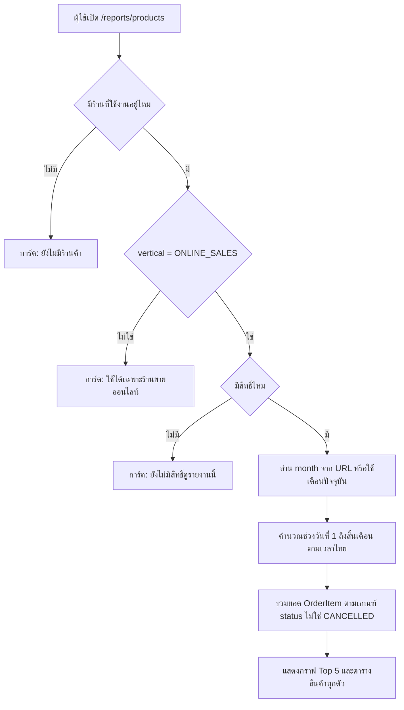
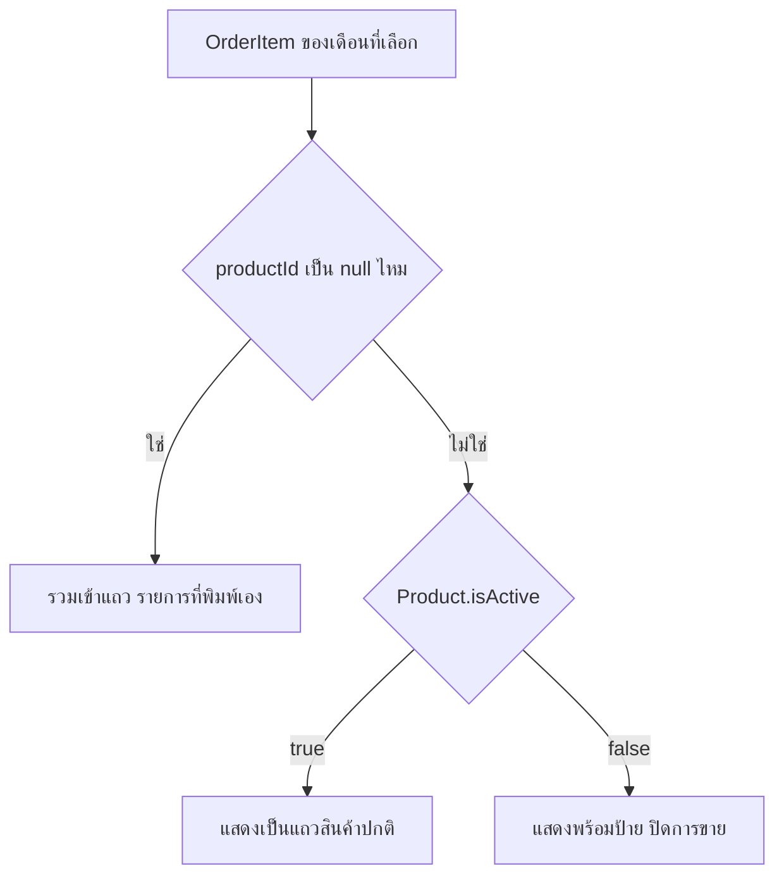
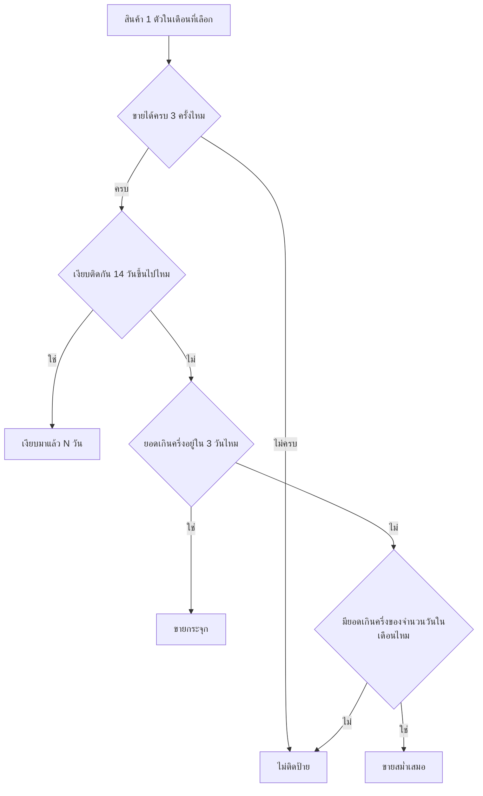

> **โมดูล:** M62-ProductSalesTimeSeries
> **ประเภทเอกสาร:** Business Requirements Document (BRD) — NON-TECHNICAL
> **เวอร์ชัน:** 1.0
> **วันที่จัดทำ:** 2026-08-29
> **สถานะ:** Draft

# BRD: ยอดขายรายสินค้า

---

## 1. บทนำ

### 1.1 วัตถุประสงค์ของเอกสาร

1. อธิบายความต้องการหลักของหน้ารายงาน "ยอดขายรายสินค้า" (`/reports/products`)
2. กำหนดขอบเขต — เฉพาะร้าน `ONLINE_SALES` · เลือกได้ทีละเดือน · ไม่มี export
3. กำหนดนิยามข้อมูล ("ขายแล้ว" · หน่วยจำนวน/บาท · การจัดกลุ่มสินค้า · เกณฑ์ป้ายสรุป) ให้ตรงกันทั้งทีม
4. บันทึกข้อจำกัดของข้อมูลเดิมที่รายงานนี้สืบทอดมา เพื่อไม่ให้ถูกเข้าใจผิดว่าเป็น "งานที่ยังไม่ได้ทำ"

### 1.2 ขอบเขตของระบบ

**เข้าสู่ระบบ (Input):**
- เดือนที่เลือก (`?month=YYYY-MM`)
- หน่วยที่เลือกแสดง (จำนวนชิ้น / ยอดขายบาท)
- สวิตช์ "แสดงสินค้าที่ไม่มียอดขาย"
- การติ๊กเลือก/ยกเลิกเส้นบนกราฟ (เฉพาะ ≥768px)

**ออกจากระบบ (Output):**
- กราฟเส้น Top 5 สินค้าขายดีของเดือน (≥768px)
- ตารางสินค้าทุกตัวพร้อมยอดรวมของเดือนและป้ายสรุปพฤติกรรม
- รายการสินค้าแบบการ์ด + แถบสรุปรายวัน (<768px)

**ระบบที่เกี่ยวข้อง:** ข้อมูลออเดอร์/รายการสินค้าเดิม (`Order`, `OrderItem`, `Product`) · เมนูฝั่งขาย
(`seller-menu.ts`) และกลไกตัดสิน vertical เดิม · ธงสิทธิ์ `Shop.staffCanViewFinance` เดิม

### 1.3 กลุ่มผู้ใช้งาน

| กลุ่มผู้ใช้ | บทบาท | สิทธิ์การใช้งาน |
|-----------|--------|----------------|
| **เจ้าของร้าน** | `Shop.userId` | เห็นรายงานเต็มเสมอ |
| **พนักงานร้าน** | `ShopMember(role='ADMIN')` | เห็นรายงานเต็มเมื่อ `Shop.staffCanViewFinance = true` |
| **ร้าน `SERVICE_QUEUE` / `LODGING`** | เจ้าของ/พนักงานร้านประเภทอื่น | ไม่เห็นเมนู · เข้า URL ตรงเห็นข้อความอธิบาย |

---

## 2. ความต้องการหลัก (Functional Requirements)

### 2.1 การเข้าถึงและสิทธิ์

#### FR-PST-01: เมนูและหน้ารายงานใหม่

**User Story:**
> ในฐานะเจ้าของร้าน `ONLINE_SALES` ฉันต้องการเมนู "ยอดขายรายสินค้า" ในกลุ่ม ANALYTICS
> เพื่อเข้าถึงรายงานนี้ได้จากที่เดียวกับรายงานอื่นของร้าน

**Acceptance Criteria:**
- [ ] เมนูปรากฏในกลุ่ม ANALYTICS ด้วย slug ถาวร `seller:reports-products`
- [ ] URL คือ `/reports/products`
- [ ] เมนูปรากฏเฉพาะร้าน `Shop.vertical = 'ONLINE_SALES'`

#### FR-PST-02: จำกัดเฉพาะร้านขายออนไลน์

**User Story:**
> ในฐานะร้าน `SERVICE_QUEUE`/`LODGING` ฉันไม่ควรเห็นรายงานที่ไม่มีความหมายกับธุรกิจของฉัน
> แต่ถ้าพิมพ์ URL เข้าตรงก็ควรรู้ว่าทำไมใช้ไม่ได้ ไม่ใช่เจอหน้าเปล่าที่ดูเหมือนบั๊ก

**Acceptance Criteria:**
- [ ] ร้าน `SERVICE_QUEUE`/`LODGING` ไม่เห็นเมนูนี้
- [ ] พิมพ์ URL เข้าตรง → เห็นการ์ดข้อความ "รายงานนี้ใช้ได้เฉพาะร้านขายออนไลน์" ไม่ redirect เงียบ
- [ ] เมื่อ vertical ไม่ผ่าน ระบบ **ไม่ query ข้อมูลยอดขายเลย**

**Business Flow:**
1. ระบบตรวจ `Shop.vertical` ของร้านที่กำลังใช้งาน
2. ไม่ใช่ `ONLINE_SALES` → render การ์ดข้อความแทนเนื้อหารายงาน
3. ใช่ → ไปต่อ FR-PST-03

#### FR-PST-03: สิทธิ์เข้าถึง

**User Story:**
> ในฐานะเจ้าของร้าน ฉันต้องการควบคุมได้ว่าพนักงานจะเห็นยอดขายรวมของร้านหรือไม่
> โดยไม่ต้องไปกดปิดหลายที่

**Acceptance Criteria:**
- [ ] เจ้าของร้านเห็นรายงานเต็มเสมอ
- [ ] `ShopMember(role='ADMIN')` เห็นรายงานเต็มเมื่อ `Shop.staffCanViewFinance = true`
- [ ] `ShopMember(role='ADMIN')` ที่ธงเป็น `false` → เห็นการ์ด "ยังไม่มีสิทธิ์ดูรายงานนี้" พร้อมบอกว่าต้องให้เจ้าของร้านเปิดให้
- [ ] **ไม่มีธงสิทธิ์ตัวใหม่** ถูกเพิ่มเข้าระบบสำหรับรายงานนี้

**หมายเหตุที่ต้องรู้:** สคีมามีเพียง role `OWNER` และ `ADMIN` — ไม่มี role ที่ต่ำกว่านั้น ⇒ "พนักงาน"
ทุกคนคือ ADMIN และธง `staffCanViewFinance` คือกลไกเดียวที่แยกได้ · ธงนี้ `@default(true)` ⇒ ค่าตั้งต้น
คือพนักงานเห็นได้ (ดู PRD §4.4)

### 2.2 การเลือกช่วงเวลา

#### FR-PST-04: เลือกเดือนทีละเดือน

**User Story:**
> ในฐานะผู้ขาย ฉันต้องการเลือกดูข้อมูลทีละเดือนผ่านปุ่ม ‹ › และกดปุ่ม back ของเบราว์เซอร์
> แล้วกลับมาเดือนเดิมได้จริง

**Acceptance Criteria:**
- [ ] เดือนที่เลือกอยู่ใน URL รูปแบบ `?month=YYYY-MM`
- [ ] เปิดหน้าโดยไม่ระบุ `?month=` → ได้เดือนปัจจุบัน (เวลาไทย)
- [ ] ปุ่ม ‹ › เป็นลิงก์จริง ไม่ใช่ปุ่มที่แก้ state ล้วน
- [ ] `?month=` ที่ผิดรูปแบบหรือเกินขอบเขต → ถอยไปเดือนปัจจุบัน + แจ้งผู้ใช้ **ไม่ throw ไม่ 404**
- [ ] เลือกได้ถึงเดือนถัดไปหนึ่งเดือน (เพราะผู้ขายคีย์วันที่ล่วงหน้าได้ 7 วัน)

### 2.3 นิยามข้อมูลยอดขาย

#### FR-PST-05: นิยาม "ขายแล้ว"

**User Story:**
> ในฐานะร้านที่ขายผ่านแชทเป็นหลัก ฉันต้องการให้รายงานนับยอดจากออเดอร์ที่ยังไม่ถูกยกเลิก
> โดยไม่ต้องรอผู้ซื้อกดยืนยัน เพราะลูกค้าของฉันแทบไม่เคยกด

**Acceptance Criteria:**
- [ ] นับ `OrderItem` ของ `Order.status != 'CANCELLED'` (PENDING + SHIPPED + CONFIRMED)
- [ ] มีข้อความอธิบายนิยามนี้แสดงอยู่บนหน้าจอเสมอ พร้อมระบุว่าต่างจากหน้า "ภาพรวมกำไร/ขาดทุน"

**Example:**
```
ร้าน A มี 30 ออเดอร์ในเดือน: PENDING 5 · SHIPPED 20 · CONFIRMED 3 · CANCELLED 2
ยอด "ขายแล้ว" ของรายงานนี้      = จากออเดอร์ 28 ใบ (ทุกสถานะยกเว้น CANCELLED)
ยอดของหน้า /sales (กำไร/ขาดทุน) = น้อยกว่านี้ เพราะนับเฉพาะ CONFIRMED หรือ
                                   SHIPPED ที่ขนส่งรับของไปแล้วเท่านั้น
```

#### FR-PST-06: หน่วยแสดงผล (จำนวน/บาท)

**User Story:**
> ในฐานะผู้ขาย ฉันต้องการสลับดูเป็น "จำนวนชิ้น" หรือ "ยอดขายบาท" เพื่อดูทั้งปริมาณและมูลค่า

**Acceptance Criteria:**
- [ ] ค่าเริ่มต้น = จำนวนชิ้น
- [ ] โหมดบาทคำนวณจาก `Σ(qty × price)` ต่อรายการ ไม่รวมส่วนลด/VAT ระดับออเดอร์
- [ ] โหมดบาทแสดงข้อความกำกับว่าไม่รวมส่วนลด/VAT และผลรวมจะไม่เท่ากับหน้า `/sales`
- [ ] ข้อความกำกับนี้แสดง **เฉพาะโหมดบาท** (โหมดจำนวนชิ้นไม่มีปัญหานี้)

#### FR-PST-07: bucket รายวันตามเวลาไทย

**Acceptance Criteria:**
- [ ] ทุกจุดข้อมูลรายวันตัดด้วย `thaiDayKey()` — ไม่มีจุดใดตัดวันด้วย UTC
- [ ] ออเดอร์ที่เกิดเวลา 00:00–07:00 เวลาไทย ตกอยู่ในวันที่ถูกต้อง ไม่ใช่วันก่อนหน้า

#### FR-PST-08: ความน่าเชื่อถือของตัวเลข

**User Story:**
> ในฐานะผู้ขาย ฉันต้องการรู้ว่าตัวเลขของเดือนก่อนอาจเปลี่ยนได้ เพื่อไม่ตกใจถ้าเห็นค่าไม่เหมือนเดิม

**Acceptance Criteria:**
- [ ] แสดง "อัปเดตล่าสุด {เวลา}" พร้อมคำอธิบายว่าออเดอร์ที่คีย์ย้อนหลังทำให้ตัวเลขเปลี่ยนได้
- [ ] วันที่ในอนาคตของเดือนปัจจุบันแสดงเป็นเทา **ไม่ใช่ยอด 0**
- [ ] เดือนที่ผ่านไปแล้วต้องไม่มีแถบเทาเลย

### 2.4 การจัดกลุ่มสินค้า

#### FR-PST-09: รวมรายการที่ไม่มีสินค้าอ้างอิงเป็นแถวเดียว

**User Story:**
> ในฐานะผู้ขายที่พิมพ์รายการเองบ่อย ฉันต้องการเห็นยอดของรายการเหล่านั้นรวมเป็นก้อนเดียว
> ไม่ใช่แตกเป็นสินค้าปลอมหลายรายการตามชื่อที่พิมพ์

**Acceptance Criteria:**
- [ ] `OrderItem.productId = null` ทุกที่มา (พิมพ์เอง / ประมูล / สินค้าที่ถูกลบ) รวมเป็นแถวเดียวชื่อ "รายการที่พิมพ์เอง"
- [ ] **ไม่แตกตาม `OrderItem.name`** (พิมพ์ผิด/เว้นวรรคต่างกันจะกลายเป็นคนละสินค้า และชื่อซ้ำจากคนละสินค้าจริงจะถูกยุบรวมเงียบ ๆ)
- [ ] แถวนี้ติ๊กขึ้นกราฟได้เหมือนสินค้าอื่น (เป็นยอดขายจริงที่นับรวมอยู่แล้ว)
- [ ] แถวนี้อยู่ในตารางเสมอเมื่อมียอด โดยไม่ต้องเปิดสวิตช์ "แสดงสินค้าที่ไม่มียอดขาย"

#### FR-PST-10: ป้าย "ปิดการขาย"

**Acceptance Criteria:**
- [ ] สินค้าที่ `Product.isActive = false` แต่มียอดขายในเดือนนั้น → แสดงในตารางพร้อมป้าย "ปิดการขาย"
- [ ] สินค้าที่ถูกลบจริง **ไม่มีป้ายแยก** — ตกไปรวมใน "รายการที่พิมพ์เอง" (ข้อจำกัดเชิงโครงสร้าง ดู PRD §4.3)
- [ ] ผลรวมของรายงานต้องไม่หายไปเพราะเรื่องนี้ (ยอดยังถูกนับ แค่ไม่แยกแถว)

### 2.5 การแสดงผล ≥768px

#### FR-PST-11: กราฟเส้น Top 5

**Acceptance Criteria:**
- [ ] Top 5 ยึดจำนวนชิ้นเสมอ **ไม่เปลี่ยนอันดับเมื่อสลับหน่วยเป็นบาท** (แกน Y เปลี่ยนหน่วยเท่านั้น)
- [ ] แสดงพร้อมกันได้สูงสุด 6 เส้น · ติ๊กเกินแล้วช่องที่เหลือถูกปิดพร้อมคำอธิบายว่าทำไม
- [ ] ใช้โทเคนสี `--color-chart-*` เท่านั้น ห้าม hardcode hex
- [ ] แกน X เป็นวันที่ 1..(จำนวนวันจริงของเดือนนั้น) ไม่ใช่ 31 ตายตัว

#### FR-PST-12: ตารางสินค้าทุกตัว

**Acceptance Criteria:**
- [ ] แสดง 20 แถว/หน้า เรียงตามจำนวนที่ขายได้มากสุดเป็นค่าเริ่มต้น
- [ ] เรียงสลับได้ทุกคอลัมน์
- [ ] ช่องติ๊ก = สลับเส้นบนกราฟ · ชื่อสินค้า = ลิงก์ไปหน้าสินค้า · ส่วนที่เหลือของแถวกดไม่ได้
- [ ] 5 แถวแรกของตารางคือ 5 เส้นบนกราฟพอดีตอนเปิดหน้าครั้งแรก

#### FR-PST-13: สวิตช์แสดงสินค้าที่ไม่มียอดขาย

**Acceptance Criteria:**
- [ ] ค่าเริ่มต้นปิด — ตารางแสดงเฉพาะสินค้าที่มียอดในเดือนนั้น
- [ ] เปิดสวิตช์ → เห็นสินค้าของร้านที่ยอด 0 ในเดือนนั้นเพิ่มเข้ามา
- [ ] สลับสวิตช์ **ไม่ยิงเซิร์ฟเวอร์ใหม่** (ข้อมูลถูกส่งลงมาแล้ว)
- [ ] สินค้าที่ยอด 0 ติ๊กขึ้นกราฟไม่ได้ (ไม่มีอะไรให้ลากเส้น) และไม่มีป้ายสรุป

#### FR-PST-14: ป้ายสรุปพฤติกรรมการขาย

**Acceptance Criteria:**
- [ ] "ขายกระจุก" เมื่อยอด **มากกว่า** 50% อยู่ใน ≤3 วัน (50% เป๊ะไม่นับ)
- [ ] "ขายสม่ำเสมอ" เมื่อมียอดเกินครึ่งของจำนวนวันในเดือน
- [ ] "เงียบมาแล้ว N วัน" เมื่อไม่มียอดต่อเนื่อง ≥14 วันนับถึงวันอ้างอิง
- [ ] สินค้าที่ขาย **น้อยกว่า 3 ครั้ง** ในเดือน → ไม่มีป้ายใด ๆ
- [ ] เข้าหลายเกณฑ์พร้อมกัน → ลำดับ **เงียบ → กระจุก → สม่ำเสมอ** แสดงป้ายเดียว
- [ ] วันอ้างอิง = วันนี้ (เดือนปัจจุบัน) หรือวันสุดท้ายของเดือน (เดือนที่ผ่านไปแล้ว)

### 2.6 การแสดงผล <768px

#### FR-PST-15: รายการสินค้าพร้อมแถบสรุปรายวัน

**Acceptance Criteria:**
- [ ] **ไม่มีกราฟรวมหลายเส้น** บนจอมือถือ
- [ ] แต่ละแถวแสดงแถบสรุปรายวัน (1 ช่อง = 1 วัน) ความเข้มตามยอดของวันนั้น
- [ ] แถบสรุป **ไม่ใช้ chart library** (เลี่ยงการวาดใหม่จำนวนมากพร้อมกัน)
- [ ] ความเข้มเทียบกับวันที่ดีที่สุดของสินค้าตัวเอง ไม่ใช่เทียบข้ามสินค้า

#### FR-PST-16: กราฟเต็มจอรายสินค้า

**Acceptance Criteria:**
- [ ] แตะแถวสินค้า → เปิดกราฟเต็มจอของสินค้าตัวนั้นตัวเดียว
- [ ] ชีตเต็มจอต้องล็อกการเลื่อนของหน้าหลัง (`useLockBodyScroll`)
- [ ] มีทางปิดที่ชัดเจน และกดปุ่มย้อนกลับของเครื่องแล้วปิดชีต ไม่ใช่ออกจากหน้า

---

## 3. Acceptance Criteria สรุป

| ID | เกณฑ์ |
|---|---|
| AC-PST-01 | เปิดหน้าโดยไม่ระบุ `?month=` → ได้เดือนปัจจุบัน (เวลาไทย) |
| AC-PST-02 | ร้าน `SERVICE_QUEUE`/`LODGING` เข้า URL ตรง → การ์ดข้อความอธิบาย ไม่ redirect เงียบ และไม่ query ยอดขาย |
| AC-PST-03 | ไม่มีร้านที่ใช้งานอยู่ → การ์ด "ยังไม่มีร้านค้า" ไม่ใช่หน้ารายงานเปล่า |
| AC-PST-04 | โหมดจำนวน = `SUM(qty)` ของ `OrderItem` ที่ `Order.status != CANCELLED` ในเดือนนั้น |
| AC-PST-05 | โหมดบาท = `Σ(qty×price)` ไม่รวมส่วนลด/VAT + มีข้อความกำกับ |
| AC-PST-06 | สลับหน่วยเป็นบาท → อันดับเส้นบนกราฟไม่สลับ |
| AC-PST-07 | ตารางเรียงตามหน่วยที่เลือกอยู่ในขณะนั้น |
| AC-PST-08 | `productId = null` ทุกที่มา → แถวเดียว "รายการที่พิมพ์เอง" ไม่แยกตามชื่อ |
| AC-PST-09 | สินค้า `isActive=false` ที่มียอด → แสดงพร้อมป้าย "ปิดการขาย" ติ๊กขึ้นกราฟได้ |
| AC-PST-10 | ค่าเริ่มต้นไม่เปิดสวิตช์ → ตารางไม่มีแถวยอด 0 |
| AC-PST-11 | เปิดสวิตช์ → เห็นสินค้าที่ยอด 0 เพิ่มเข้ามา โดยไม่ยิงเซิร์ฟเวอร์ใหม่ |
| AC-PST-12 | สินค้าขาย <3 ครั้งในเดือน → ไม่มีป้ายใด ๆ |
| AC-PST-13 | เข้าเกณฑ์หลายข้อพร้อมกัน → เงียบ ชนะ กระจุก ชนะ สม่ำเสมอ |
| AC-PST-14 | กราฟแสดงได้สูงสุด 6 เส้น ใช้โทเคนสีของธีมเท่านั้น |
| AC-PST-15 | <768px ไม่มีกราฟรวม · แตะแถว → กราฟเต็มจอของสินค้านั้น |
| AC-PST-16 | วันที่ยังไม่ถึงของเดือนปัจจุบัน → เทา ไม่ใช่ยอด 0 · เดือนที่จบแล้วไม่มีแถบเทา |
| AC-PST-17 | มี "อัปเดตล่าสุด {เวลา}" + คำเตือนเรื่องออเดอร์คีย์ย้อนหลัง |
| AC-PST-18 | เจ้าของร้านเห็นเสมอ · ADMIN เห็นเมื่อ `staffCanViewFinance = true` · ไม่มีธงใหม่ถูกเพิ่ม |
| AC-PST-19 | `?month=` ผิดรูป/เกินขอบ → ถอยไปเดือนปัจจุบัน + แจ้งผู้ใช้ ไม่ throw ไม่ 404 |
| AC-PST-20 | แกน X และแถบสรุปมีจำนวนช่องเท่าจำนวนวันจริงของเดือนนั้น (ก.พ. = 28/29) |

---

## 4. Business Flows

### 4.1 Flow หลัก: เปิดหน้ารายงานและเลือกเดือน



### 4.2 Flow การจัดกลุ่มรายการสินค้า



### 4.3 Flow การตัดสินป้ายสรุป



---

## 5. Use Case Scenarios

### Scenario 1: หาจังหวะขายของสินค้าขายดี (Best Case)

**ผู้เกี่ยวข้อง:** เจ้าของร้าน `ONLINE_SALES`
**เงื่อนไขเริ่มต้น:** ร้านมีออเดอร์ ≥20 ใบในเดือนที่เลือก กระจายในหลายสินค้า

**ขั้นตอน:**
1. เปิด `/reports/products` ได้เดือนปัจจุบันเป็นค่าเริ่มต้น
2. เห็นกราฟ Top 5 มีเส้นหนึ่งพุ่งสูงชัดเจนในช่วง 3 วันกลางเดือน
3. เลื่อนลงไปตาราง เห็นสินค้าตัวนั้นติดป้าย "ขายกระจุก"
4. สลับหน่วยเป็นบาทเพื่อดูมูลค่าที่ทำได้ในช่วงนั้น

**ผลลัพธ์:** ตัดสินใจสต็อกเพิ่มก่อนช่วงเวลาเดียวกันของเดือนถัดไป

### Scenario 2: หาสินค้าที่ตายแล้ว

**ผู้เกี่ยวข้อง:** เจ้าของร้าน
**เงื่อนไขเริ่มต้น:** ร้านมีสินค้าที่เปิดขายอยู่แต่ไม่มียอดมานาน

**ขั้นตอน:**
1. เปิดสวิตช์ "แสดงสินค้าที่ไม่มียอดขาย"
2. เรียงตารางจากยอดน้อยไปมาก
3. เห็นสินค้าที่ยอด 0 ทั้งเดือน และสินค้าที่ติดป้าย "เงียบมาแล้ว 28 วัน"

**ผลลัพธ์:** กดชื่อสินค้าไปหน้าสินค้าเพื่อพิจารณาปิดการขาย

### Scenario 3: พนักงานที่เจ้าของร้านปิดสิทธิ์การเงินไว้

**ผู้เกี่ยวข้อง:** `ShopMember(role='ADMIN')` ของร้านที่ `staffCanViewFinance = false`

**ขั้นตอน:**
1. พนักงานเปิด `/reports/products`

**ผลลัพธ์:** เห็นการ์ด "ยังไม่มีสิทธิ์ดูรายงานนี้ — ให้เจ้าของร้านเปิดสิทธิ์ผู้ดูแลให้ก่อน"
ไม่ใช่หน้าเปล่าหรือ 403 ดิบ

### Scenario 4: ร้าน `SERVICE_QUEUE` พิมพ์ URL เข้าตรง

**ขั้นตอน:** พิมพ์ `/reports/products` เข้าตรง (ไม่มีเมนูให้กด)
**ผลลัพธ์:** เห็นการ์ด "รายงานนี้ใช้ได้เฉพาะร้านขายออนไลน์" ไม่ใช่หน้าเปล่าหรือ error

### Scenario 5 (Edge): เดือนที่ไม่มีออเดอร์เลย

**ขั้นตอน:** ผู้ขายกด ‹ ย้อนไปเดือนที่ยังไม่ได้เปิดร้าน
**ผลลัพธ์:** กราฟแสดงข้อความ "ยังไม่มีคำสั่งซื้อในเดือนนี้" · ตารางว่างพร้อมข้อความ ไม่ใช่กราฟเปล่าที่ดูเหมือนพัง

### Scenario 6 (Edge): เดือนที่มีแต่รายการพิมพ์เอง

**ผลลัพธ์:** ตารางมีแถวเดียวคือ "รายการที่พิมพ์เอง" · กราฟมีเส้นเดียว · มีข้อความอธิบายว่าเดือนนี้
ยังไม่มีสินค้าจากแคตตาล็อกที่ขายได้ (ไม่ใช่ empty state — มีข้อมูลจริง แค่ชนิดเดียว)

---

## 6. ความต้องการด้านคุณภาพ

### 6.1 ความถูกต้องของข้อมูล
- ยอดบนกราฟและตารางคำนวณจากเกณฑ์เดียวกันเสมอ — กดดูรายละเอียดแล้วต้องไม่ได้ตัวเลขคนละชุด
- bucket รายวันใช้ `thaiDayKey()` ทุกจุด ห้ามมีจุดใดตัดวันด้วย UTC
- เกณฑ์ป้ายสรุปทุกข้อต้องมีเทสที่พิสูจน์ด้วย mutation ได้ (เขียนกลับด้านแล้วต้องแดง)

### 6.2 ความรวดเร็ว
- p90 < 1.5 วินาที ที่ขนาดข้อมูล prod ปัจจุบัน
- ขนาด payload ที่ส่งลง client ต้องถูกวัดเป็นตัวเลขจริงก่อน merge

### 6.3 ความน่าเชื่อถือ
- ตัวเลขของเดือนที่ปิดแล้วต้องมีคำอธิบายกำกับเมื่อมันขยับได้
- วันที่ยังไม่ถึงต้องแยกให้เห็นชัดจากวันที่มียอดเป็น 0 จริง
- ฐานข้อมูลล่มต้องไม่หน้าตาเหมือน "เดือนนี้ขายไม่ได้เลย"

### 6.4 ความปลอดภัย
- vertical guard และ role guard บังคับที่ server-side เสมอ ไม่ใช่ซ่อนเมนูอย่างเดียว
- ผู้ที่ไม่มีสิทธิ์ต้องไม่มีข้อมูลยอดขายอยู่ใน payload ของหน้าเลย (ไม่ใช่แค่ไม่ render)

### 6.5 ความสะดวกในการใช้งาน
- มือถือใช้แถบสรุป + กราฟเต็มจอรายตัว แทนกราฟรวมที่อ่านไม่ออกบนจอเล็ก
- ข้อความอธิบายนิยามต้องอยู่ในตำแหน่งที่ผู้ใช้เห็นก่อนอ่านตัวเลขผิด ไม่ใช่ซ่อนใน tooltip
- ปุ่มและช่องติ๊กบนมือถือมีพื้นที่แตะอย่างน้อย 44px

---

## 7. ข้อจำกัด (Constraints)

### 7.1 ข้อจำกัดทางธุรกิจ
- เฉพาะร้าน `ONLINE_SALES`
- เลือกได้ทีละเดือน ไม่มีช่วงวันอิสระ ไม่มีการเทียบเดือนก่อนหน้า
- ไม่มี export CSV/PDF
- สินค้าที่ถูกลบจริงแยกป้ายจาก "รายการที่พิมพ์เอง" ไม่ได้ (ข้อจำกัดเชิงโครงสร้าง ไม่ใช่งานที่ยังไม่ทำ)
- พนักงานเห็นรายงานเป็นค่าตั้งต้น เพราะธง `staffCanViewFinance` เป็น `true` โดยกำเนิด

### 7.2 ข้อจำกัดทางเทคนิค
- ไม่มี migration · ไม่มี API endpoint ใหม่ · ไม่มี DB index ใหม่ในรอบนี้
- `OrderItem` ไม่มี index บน `productId` — เพดานพิจารณาเพิ่ม: ~1,500 ออเดอร์/เดือน
- payload อนุกรมรายวันของทุกสินค้าต้องวัดขนาดจริงก่อน merge

---

## 8. กฎทางธุรกิจ (Business Rules)

ดู PRD §4 — ไม่ทำซ้ำที่นี่เพื่อไม่ให้มีสองฉบับที่เพี้ยนจากกัน (HR16)

---

## 9. อภิธานศัพท์ (Glossary)

ดู PRD §7

---

## 10. สรุป

**จุดเด่นของระบบ:**
- ไขว้มิติ "เวลา" กับมิติ "สินค้า" ที่ระบบมีอยู่แล้วแต่ไม่เคยรวมกัน โดยไม่เพิ่มโครงสร้างข้อมูลใหม่
- ป้ายสรุปพฤติกรรมมาจากตัวเลขที่พิสูจน์ได้เท่านั้น มีด่านขั้นต่ำกันการเดา
- ใช้ธงสิทธิ์เดิม ไม่เพิ่มที่ให้เจ้าของร้านต้องไปปิดเพิ่มอีกจุด

**ผลลัพธ์ที่คาดหวัง:**
- ผู้ขายวางแผนสต็อก/โปรโมทได้จากจังหวะการขายจริงของสินค้าแต่ละตัว
- ผู้ขายพบสินค้าที่ตายแล้วได้เร็วขึ้น ผ่านสวิตช์ "แสดงสินค้าที่ไม่มียอดขาย"

---

**หมายเหตุ:**
สำหรับความต้องการทางธุรกิจระดับภาพรวม/personas/KPI ดู [[PRD]]
สำหรับ technical specification ดู [[SRS]]
