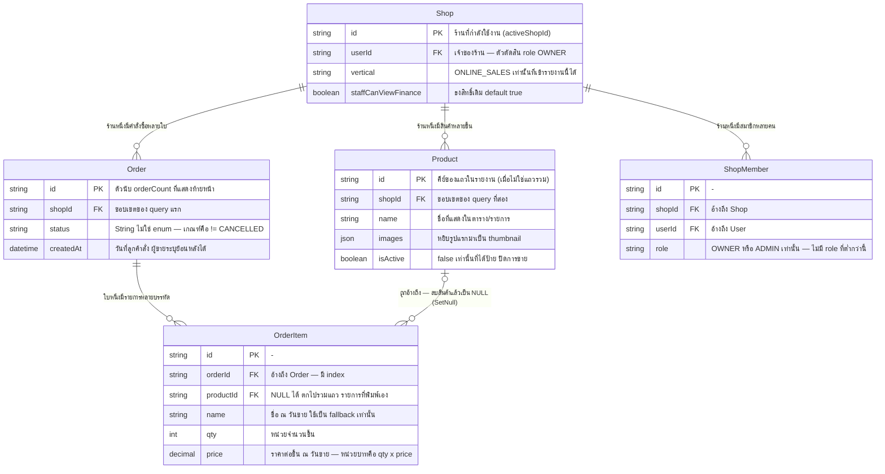
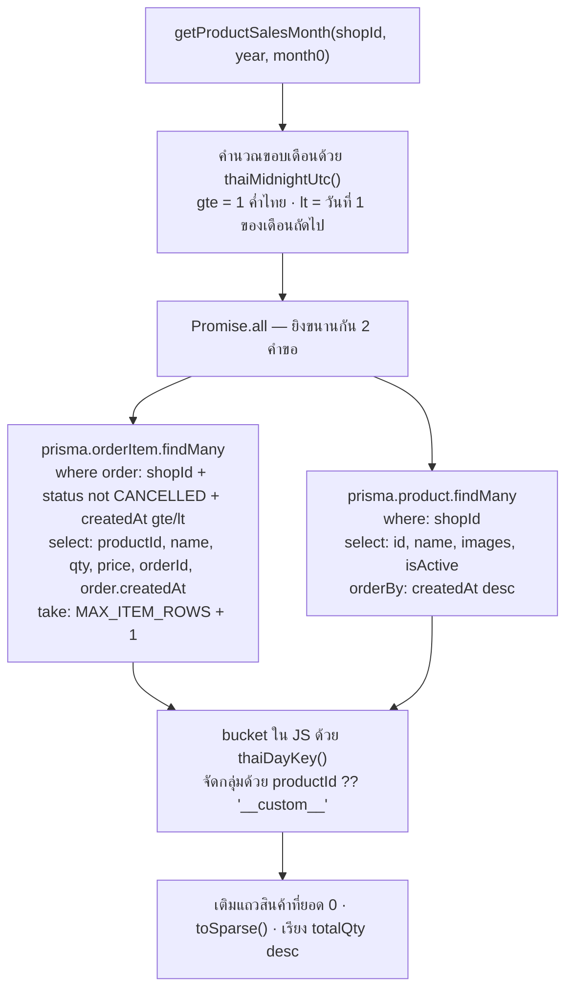

> **โมดูล:** M62-ProductSalesTimeSeries
> **ประเภทเอกสาร:** DATABASE Design
> **เวอร์ชัน:** 1.0
> **วันที่จัดทำ:** 2026-08-29
> **สถานะ:** Draft
> **เจ้าของเอกสาร:** SA (ดู [[Feature-Docs-Ownership]])

# DATABASE: ยอดขายรายสินค้า (รายงานไทม์ซีรีส์รายเดือน)

---

## 1. Overview

### 1.1 สิ่งที่ฟีเจอร์นี้เพิ่มเข้าไปในฐานข้อมูล

**ไม่มี**

- ❌ ไม่มีตารางใหม่
- ❌ ไม่มีคอลัมน์ใหม่
- ❌ ไม่มี index ใหม่
- ❌ ไม่มีไฟล์ migration
- ❌ ไม่มี CHECK constraint / trigger / view / extension ใหม่
- ❌ ไม่มี write path ใด ๆ ทั้งสิ้น (ไม่มี `create` / `update` / `delete` / `upsert` ในสายโค้ดของฟีเจอร์นี้)

ยืนยันจากซอร์สจริง: ทั้งฟีเจอร์มี prisma call เพียง **2 ตัว** และเป็น `findMany` ทั้งคู่
(`src/services/product-sales-series.service.ts`) ไฟล์ที่เหลือของฟีเจอร์นี้เป็นฟังก์ชันบริสุทธิ์
(`src/lib/product-sales-month.ts`) · ตัวตัดสินสิทธิ์ที่อ่านผ่าน `requireActiveShop()`
(`src/services/product-report-access.service.ts`) · และ component ฝั่งหน้าจอ

เอกสารฉบับนี้จึงไม่ใช่ "แผนสร้างตาราง" แต่เป็นบันทึกว่า **รายงานนี้อ่านอะไรจากตารางเดิมบ้าง
และคอลัมน์แต่ละตัวมีข้อควรระวังอะไร** ซึ่งเป็นข้อมูลที่ QA และคนที่มาแก้ต่อจำเป็นต้องรู้จริง ๆ

### 1.2 Store และสภาพแวดล้อม

| หัวข้อ | ค่า |
|---|---|
| **Store** | PostgreSQL 16 — store เดียวทั้งฟีเจอร์ (ไม่มี polyglot ไม่มี cache layer ไม่มี materialized view) |
| **ORM** | Prisma (`src/lib/prisma.ts`) |
| **prod** | Supabase (ตั้งค่าผ่าน `DATABASE_URL`/`DIRECT_URL` ของ Vercel) |
| **dev** | Postgres ใน Docker บนเครื่อง (`localhost:5434`) — แยกจาก prod ตั้งแต่ 2026-08 |
| **Charset/Collation** | ตามค่าเริ่มต้นของฐานที่มีอยู่ ฟีเจอร์นี้ไม่แตะ |

### 1.3 เอกสารต้นทาง

template ของโปรเจกต์ระบุว่า input ของ DATABASE.md คือ SDS ของโมดูลเดียวกัน

🛑 **`SRS.md` และ `SDS.md` ของโมดูลนี้ถูกเขียนขนานกันกับเอกสารฉบับนี้ในรอบเดียวกัน** ⇒ เนื้อหา
ทุกบรรทัดในเอกสารนี้ถูกยืนยันกับ **สคีมาและซอร์สจริง** (`prisma/schema.prisma`,
`prisma/migrations/**`, `src/services/product-sales-series.service.ts`,
`src/services/product-report-access.service.ts`) **ไม่ได้คัดลอกต่อจาก SDS** — ถ้าจุดใดขัดกับ SDS
ให้ยึดโค้ดเป็นตัวตัดสินแล้วแก้เอกสารฝั่งที่ผิด (HR16 ทิศกลับ: ข้อความในเอกสารที่อ้างพฤติกรรม
ของโค้ด ต้องยืนยันกับโค้ดก่อนใช้ตัดสินใจ) ตาราง Traceability ใน §7 จึงชี้กลับไปที่ **PRD/BRD
และไฟล์โค้ดจริง**

**สถานะเอกสารของโมดูล ณ วันที่จัดทำ:** มี PRD · BRD · SRS · SDS · DATABASE · TestCase
= **6 จาก 7 ไฟล์ตาม template** — ยังขาด **`API.md`** (ฟีเจอร์นี้ไม่มี API endpoint ใหม่
แต่ตาม HR11 ต้องนับความครบด้วยการเทียบ **ชื่อไฟล์** กับ template ⇒ ไฟล์ที่หายยังนับเป็นหนี้
แม้เนื้อหาจะเป็น "ไม่มี endpoint ใหม่" ก็ตาม — ดู §8)

---

## 2. ERD

ERD ข้างล่างแสดงเฉพาะ **คอลัมน์ที่รายงานนี้อ่านจริง** ไม่ใช่ทุกคอลัมน์ของแต่ละตาราง
(ตารางเหล่านี้มีคอลัมน์รวมกันหลายสิบตัว การวาดทั้งหมดจะกลบสิ่งที่ฟีเจอร์นี้เกี่ยวข้องจริง)

---

## 3. Tables

ทุกตารางในหัวข้อนี้ **มีอยู่แล้วบน prod** และฟีเจอร์นี้ **อ่านอย่างเดียว**
คอลัมน์ที่ไม่ได้อยู่ในตารางข้างล่าง = ฟีเจอร์นี้ไม่ได้ `select` มาเลย

### 3.1 `OrderItem` (PostgreSQL — ตารางหลักของรายงาน)

แหล่งข้อมูลหลัก — หนึ่งแถว = "สินค้าหนึ่งรายการในคำสั่งซื้อหนึ่งใบ" ซึ่งเป็นหน่วยที่รายงานนี้นับ
(`saleEvents` = จำนวนแถว ไม่ใช่จำนวนชิ้น) ที่มา: `prisma/schema.prisma` (บล็อก `model OrderItem`)

| Column | Type | Null | Default | Key | ฟีเจอร์นี้ใช้ทำอะไร |
|--------|------|------|---------|-----|---------------------|
| `id` | `text (uuid)` | NO | `uuid()` | PK | ไม่ได้ `select` |
| `orderId` | `text` | NO | `-` | FK → `Order.id` (Cascade) + IDX | `select` มาใส่ `Set` เพื่อนับ `orderCount` ของเดือน |
| `productId` | `text` | **YES** | `NULL` | FK → `Product.id` (**SetNull**) | คีย์ของแถวในรายงาน · `NULL` → แถวรวม `__custom__` |
| `name` | `text` | NO | `-` | GIN trgm (unmanaged) | snapshot ชื่อ ณ วันขาย — ใช้เป็น `fallbackName` เท่านั้น **ไม่ใช้จัดกลุ่ม** |
| `description` | `text` | YES | `NULL` | - | ไม่ได้ใช้ |
| `qty` | `integer` | NO | `-` | - | หน่วย "จำนวนชิ้น" — บวกลงช่องวันตาม `thaiDayKey` |
| `price` | `numeric(12,2)` | NO | `-` | - | หน่วย "บาท" = `qty × price` ต่อบรรทัด |
| `stockDeducted` | `integer` | YES | `NULL` | - | ไม่ได้ใช้ (ของ Inventory Add-on 00003) |
| `cost` | `numeric(12,2)` | YES | `NULL` | - | ไม่ได้ใช้ — รายงานนี้ไม่พูดเรื่องกำไร (ของ 00016) |

**ข้อควรระวังของตารางนี้**

- 🛑 **`price` เป็น `Decimal` ของ Prisma ไม่ใช่ `number`** — โค้ดแปลงด้วย `Number(it.price)` แล้ว
  ปัดสองตำแหน่งด้วย `round2()` ทุกครั้งที่สะสม การเทียบยอดกับ SQL `SUM()` ตรง ๆ อาจต่างกันที่
  ทศนิยมตัวสุดท้ายเพราะการปัดคนละจังหวะ (JS สะสมเป็น float แล้วปัดตอนท้ายของแต่ละแถว)
- 🛑 **`name` ห้ามใช้จัดกลุ่ม** — เป็น snapshot ที่ผู้ขายพิมพ์เอง ชื่อเดียวกันจากคนละสินค้าจะยุบรวม
  และเว้นวรรคต่างกันจะแตกเป็นคนละแถว (AC-PST-08) การจัดกลุ่มยึด `productId` เท่านั้น
- **ไม่มีคอลัมน์ส่วนลด/VAT รายบรรทัด** — สองอย่างนั้นอยู่ที่ระดับ `Order` (ดู §3.2) นี่คือเหตุผล
  เชิงโครงสร้างของ `MONEY_MODE_CAVEAT` ไม่ใช่การเลือกจะไม่ทำ

### 3.2 `Order` (PostgreSQL — ตัวกรองของ query แรก)

รายงานไม่ `select` คอลัมน์ของ `Order` มาแสดงเลยนอกจาก `createdAt` — ที่เหลือเป็นเงื่อนไขใน `where`

| Column | Type | Null | Default | Key | ฟีเจอร์นี้ใช้ทำอะไร |
|--------|------|------|---------|-----|---------------------|
| `id` | `text (uuid)` | NO | `uuid()` | PK | ปลายทางของ `OrderItem.orderId` |
| `shopId` | `text` | NO | `-` | FK + IDX (หลายตัว) | ขอบเขตความปลอดภัย — อยู่ใน `where` ตั้งแต่ query แรก |
| `status` | `text` | NO | `'PENDING'` | IDX ร่วม | เกณฑ์ "ขายแล้ว" = `status != 'CANCELLED'` |
| `createdAt` | `timestamp` | NO | `now()` | IDX ร่วม | ขอบเขตเดือน + ตัดวันเป็นช่องรายวัน |
| `discount` | `numeric(12,2)` | YES | `NULL` | - | **จงใจไม่อ่าน** (ระดับออเดอร์ เฉลี่ยลงรายบรรทัดไม่ได้) |
| `vatRate` / `vatAmount` | `numeric(5,4)` / `numeric(12,2)` | YES | `NULL` | - | **จงใจไม่อ่าน** ด้วยเหตุผลเดียวกัน |
| `totalAmount` | `numeric(12,2)` | NO | `-` | - | **จงใจไม่อ่าน** — ผลรวมของรายงานนี้จึงไม่เท่ากับผลรวมของคอลัมน์นี้ |

**ข้อควรระวังของตารางนี้**

- 🛑 **`status` เป็น `String` ไม่ใช่ Prisma enum และ *ไม่มี* CHECK constraint บนคอลัมน์นี้เลย**
  (migration `20260824150000_order_return` เขียนยืนยันไว้เองว่า "ไม่แตะ CHECK ของ `Order.status`
  เพราะไม่มี CHECK บนคอลัมน์นั้นเลย — ตรวจ prod แล้ว") ⇒ ค่าที่เป็นไปได้ถูกกำหนดที่ชั้นแอปเท่านั้น
  ค่าที่ระบบใช้จริง ณ วันนี้มี **5 ค่า** ตาม `ORDER_STATUS_META` (`src/lib/order-display.ts`):

  | ค่า | ความหมาย | เข้ารายงานนี้ไหม |
  |---|---|---|
  | `PENDING` | รอดำเนินการ | ✅ นับ |
  | `SHIPPED` | กำลังจัดส่ง | ✅ นับ |
  | `CONFIRMED` | สำเร็จ | ✅ นับ |
  | `RETURNED` | คืนของแล้ว (feature 00056) | ✅ **นับ** |
  | `CANCELLED` | ยกเลิก | ❌ ตัดออก |

  🛑 **`RETURNED` ถูกนับเข้ารายงานนี้** เพราะเกณฑ์คือ `!= 'CANCELLED'` ไม่ใช่รายชื่อ allow-list —
  BRD FR-PST-05 เขียนวงเล็บกำกับไว้ว่า "(PENDING + SHIPPED + CONFIRMED)" ซึ่ง **แจกแจงไม่ครบ**
  (เขียนก่อนหรือโดยไม่ได้ไล่ค่าที่ 5) *กฎ* ที่ AC-PST-04 ระบุ (`status != CANCELLED`) ยังตรงกับโค้ด
  ทุกตัวอักษร — ที่ไม่ตรงคือรายการตัวอย่างในวงเล็บ ต้องแก้ที่ BRD ไม่ใช่แก้ที่โค้ด
  **การเปลี่ยนเกณฑ์เป็น allow-list จะทำให้ค่าที่ 6 ที่ใครเพิ่มในอนาคตหายจากรายงานเงียบ ๆ**
- 🛑 **`createdAt` ของตารางนี้ไม่ใช่ "เวลาที่แถวถูกสร้าง"** — ตั้งแต่ feature 00033 มันคือ
  **"วันที่ลูกค้าสั่ง"** ที่ผู้ขายระบุเองได้ ย้อนหลัง 90 วัน / ล่วงหน้า 7 วัน
  (`ORDER_BACKDATE_DAYS` / `ORDER_FUTUREDATE_DAYS` ใน `src/lib/order-date-window.ts`)
  ⇒ ตัวเลขของเดือนที่ปิดไปแล้ว **ขยับได้ตลอด** และเดือนถัดไปมีข้อมูลได้จริง
  (นี่คือเหตุผลที่ `maxSelectableMonth()` เปิดให้เลือกถึงเดือนหน้า และที่หน้าจอต้องมีบรรทัด
  "อัปเดตล่าสุด {เวลา}" — AC-PST-17)

### 3.3 `Product` (PostgreSQL — query ที่สอง)

| Column | Type | Null | Default | Key | ฟีเจอร์นี้ใช้ทำอะไร |
|--------|------|------|---------|-----|---------------------|
| `id` | `text (uuid)` | NO | `uuid()` | PK | คีย์ของแถว + `href` ของลิงก์ชื่อสินค้า (`/products/{id}`) |
| `shopId` | `text` | NO | `-` | FK + IDX ร่วม | ขอบเขตของ query (`where: { shopId }`) |
| `name` | `text` | NO | `-` | - | ชื่อที่แสดง (ชนะ `OrderItem.name` เสมอเมื่อหาแถวเจอ) |
| `images` | `jsonb` | NO | `'[]'` | - | หยิบ **สมาชิกตัวแรกที่เป็น string ไม่ว่าง** เป็น thumbnail |
| `isActive` | `boolean` | NO | `true` | - | `false` → ป้าย "ปิดการขาย" (AC-PST-09) |
| `createdAt` | `timestamp` | NO | `now()` | - | ใช้เป็น `orderBy` ของ query เท่านั้น ไม่ได้ `select` |

**ข้อควรระวัง**

- **query นี้ดึงสินค้าทั้งร้าน ไม่ใช่เฉพาะที่ขายได้** — โดยตั้งใจ สวิตช์ "แสดงสินค้าที่ไม่มียอดขาย"
  (AC-PST-11) ต้องทำงานได้โดยไม่ยิงเซิร์ฟเวอร์ใหม่ เพราะมติของฟีเจอร์คือ **ไม่มี API endpoint ใหม่**
- **`showOnProfile` / `pinnedAt` / `stockQty` / `cost` ไม่ถูกอ่าน** — รายงานหลังร้านไม่เกี่ยวกับ
  การแสดงผลหน้าร้านสาธารณะ (`showOnProfile` ตอบคนละคำถามกับ `isActive` — ดูคอมเมนต์ในสคีมา)
- **สินค้าที่ถูกลบไม่มีแถวให้อ่าน** — การลบสินค้าในระบบนี้เป็น hard delete (ดู §6.4)

### 3.4 `Shop` (PostgreSQL — อ่านผ่าน `requireActiveShop()` ไม่ได้ query เอง)

| Column | Type | Null | Default | Key | ฟีเจอร์นี้ใช้ทำอะไร |
|--------|------|------|---------|-----|---------------------|
| `id` | `text (uuid)` | NO | `uuid()` | PK | ส่งต่อเป็น `shopId` ให้ `getProductSalesMonth()` |
| `userId` | `text` | NO | `-` | FK + IDX ร่วม | ตัวตัดสินว่าเป็น `OWNER` (ทำใน `requireActiveShop`) |
| `vertical` | `text` | NO | `'ONLINE_SALES'` | IDX `Shop_vertical_idx` | ต้องเป็น `ONLINE_SALES` เท่านั้น (AC-PST-02) |
| `staffCanViewFinance` | `boolean` | NO | **`true`** | - | ธงสิทธิ์ของ ADMIN (AC-PST-18) |

**ข้อควรระวัง**

- 🛑 **`vertical` มี CHECK constraint `Shop_vertical_check` ที่เป็น unmanaged SQL** (จำกัดไว้ 3 ค่า:
  `ONLINE_SALES` / `SERVICE_QUEUE` / `LODGING`) — Prisma DSL ประกาศไม่ได้ ⇒ **ห้าม `prisma db pull`**
  (introspect มองไม่เห็นแล้วจะพยายาม DROP ทิ้ง)
- 🛑 **`staffCanViewFinance` เป็น `@default(true)`** ⇒ พนักงานเห็นรายงานนี้เป็นค่าตั้งต้น
  ตรงกับที่ PRD §4.4 บันทึกไว้ว่าไม่ตรงกับเจตนา "เปิดกว้างทีหลังง่ายกว่าปิดทีหลัง" เต็มร้อย
  การทำให้ปิดเป็นค่าตั้งต้นต้องมี **คอลัมน์ใหม่ + migration** ซึ่งอยู่นอกขอบเขตรอบนี้
  และการปิดสวิตช์นี้พลอยปิด `/expenses` กับ `/reports/agents` ไปด้วยเสมอ
- **ธงนี้ไม่ใช่ authorization gate ในตัวมันเอง** (คอมเมนต์ในสคีมาเขียนไว้เอง) — เป็นแค่ data flag
  ตัวบังคับจริงคือ `resolveProductReportAccess()` ที่ต้องอ่านธงด้วย `=== true` (fail-closed)

### 3.5 `ShopMember` (PostgreSQL — อ่านผ่าน `requireActiveShop()`)

| Column | Type | Null | Default | Key | ฟีเจอร์นี้ใช้ทำอะไร |
|--------|------|------|---------|-----|---------------------|
| `id` | `text (uuid)` | NO | `uuid()` | PK | - |
| `shopId` | `text` | NO | `-` | FK + `@@unique([shopId,userId])` + IDX `(shopId, role)` | หา role ของผู้ใช้ในร้านที่กำลังใช้งาน |
| `userId` | `text` | NO | `-` | FK + IDX | เช่นเดียวกัน |
| `role` | `text` | NO | `-` | IDX ร่วม | ค่าที่เป็นไปได้: **`OWNER` และ `ADMIN` เท่านั้น** |

🛑 **นี่คือข้อเท็จจริงเชิงสคีมาที่กำหนดรูปร่างของฟีเจอร์ทั้งฟีเจอร์**

คอมเมนต์ในสคีมาระบุตรง ๆ ว่า `role: "OWNER" | "ADMIN"` — **ไม่มี role ที่ต่ำกว่า ADMIN อยู่จริง**
ทุกคนที่ถูกเชิญเข้าร้านคือ ADMIN ทั้งหมด ⇒ มติเดิมที่ผู้ใช้เคาะว่า *"เจ้าของร้าน + ADMIN เท่านั้น
พนักงานไม่เห็น"* **แปลลงสคีมาตรง ๆ ไม่ได้** เพราะจะกลายเป็น "ทุกคนที่เข้าถึงร้านได้" ซึ่งตรงข้ามกับ
เจตนาที่อธิบายไว้ ("ยอดขายรวมทั้งร้านเป็นข้อมูลระดับเจ้าของ")

กลไก **เดียว** ที่มีอยู่แล้วและคุมข้อมูลชนิดเดียวกัน (ตัวเลขการเงินระดับร้าน) คือ
`Shop.staffCanViewFinance` — ฟีเจอร์นี้จึงยึดตัวนั้นแทนการเพิ่มคอลัมน์ `role` ค่าที่สาม
หรือธงสิทธิ์ตัวใหม่ (AC-PST-18: "ไม่มีธงใหม่ถูกเพิ่ม")

**ทางเลือกที่ถูกปฏิเสธและเหตุผล**

| ทางเลือก | ทำไมไม่เอา |
|---|---|
| เพิ่ม role ที่สาม (`STAFF`) | เปลี่ยนความหมายของสิทธิ์ทั้งระบบ ต้องไล่ทุกจุดที่เขียน `role === 'ADMIN'` + migration + backfill |
| เพิ่มคอลัมน์ `Shop.staffCanViewProductReport` | เจ้าของร้านต้องไปปิดสองที่ถึงจะปิดได้จริง = รูปร่างของช่องโหว่ที่ค้นเจอยากที่สุด |
| เพิ่มคอลัมน์บน `ShopMember` แทน `Shop` | **แถว `ShopMember` ถูกสร้างเฉพาะร้าน BUSINESS** เจ้าของร้าน PERSONAL ไม่มีแถวเลย (บทเรียน `ShopNotificationPref` 2026-08-08) |

### 3.6 รูปแบบ query ที่ใช้จริง

อ่านจาก `src/services/product-sales-series.service.ts` — **ทั้งฟีเจอร์มีแค่นี้**

**ประเด็นที่ต้องเข้าใจก่อนแก้ query นี้**

1. 🛑 **`shopId` อยู่ใน `where` ตั้งแต่คำขอแรก ไม่ใช่ดึงมาแล้วกรองทีหลัง** — ขอบเขตความปลอดภัย
   ต้องอยู่ในคำถามที่ส่งไปฐานข้อมูล ไม่ใช่ในโค้ดที่อ่านคำตอบ
2. 🛑 **bucket รายวันทำใน JS ไม่ใช่ SQL โดยตั้งใจ** — `thaiDayKey()` คือ SSOT ของการตัดวันตามเวลาไทย
   ทั้งระบบ (`src/lib/format-date.ts`) การเขียน SQL ตัดวันเองเป็นทางที่โปรเจกต์นี้เคยพลาดมาแล้วจริง
   (`dashboard/page.tsx` เคยใช้ `getFullYear/getMonth` ของเซิร์ฟเวอร์ซึ่งเป็น **UTC บน Vercel**
   และ `/sales` + `/orders` เคยตัดวันด้วย UTC จนต้องแก้เมื่อ 2026-08-06)
   ⇒ การย้ายไป `GROUP BY date_trunc(...)` **ไม่ใช่การ optimize เฉย ๆ แต่เป็นการสร้างนิยาม
   "วัน" ชุดที่สองในระบบ** (HR16)
3. **ไม่มี `groupBy` / `aggregate` ของ Prisma และไม่มี raw SQL** — ทุกการรวมยอดทำใน JS
   ซึ่งเป็นแพตเทิร์นเดียวกับ time series อื่นในรีโปนี้ (`dashboard.service` / `sales/page.tsx`)
4. **`take: MAX_ITEM_ROWS + 1` (20,001) ไม่ใช่ pagination แต่เป็นตัวกันหน้าจอค้าง** — ดึงเกินมา
   หนึ่งแถวเพื่อ *รู้ว่าชนเพดาน* แล้วส่ง `truncated: true` ขึ้นไปให้หน้าจอบอกผู้ใช้
   (ตัวเลขบางส่วนที่หน้าตาเหมือนตัวเลขครบแล้ว อันตรายกว่าไม่มีตัวเลข —
   `docs/conventions/partial-data-must-be-labeled-or-filled.md`)
5. **`order: { select: { createdAt: true } }` ทำให้ Prisma join `Order` มาด้วย** — ไม่ใช่ query ที่สาม
6. **แถวที่ `thaiDayKey` หา index ของวันไม่เจอถูก `continue` ทิ้ง ไม่ยัดลงวันที่ 1** — ไม่ควรเกิด
   เพราะกรองใน `where` แล้ว แต่ถ้าเกิด การยัดลงวันแรกคือการโกหกที่ไม่มีใครจับได้

### 3.7 ประมาณการปริมาณข้อมูล

⚠️ ตัวเลขในหัวข้อนี้มาจาก **PRD §6.2 และคอมเมนต์ในซอร์ส** ไม่ได้วัดใหม่ในเวิร์กทรีนี้
(เวิร์กทรีนี้ไม่มี `.env` จึงต่อฐานข้อมูลไม่ได้เลย) — ถือเป็นค่าอ้างอิง ไม่ใช่ผลการวัด

| ตัวชี้วัด | ค่า | ที่มา |
|---|---|---|
| ร้านใหญ่สุดบน prod (ออเดอร์สะสม) | ~421 ใบ | PRD §6.2 |
| เพดานที่ service ตั้งสมมติฐานไว้ | ~500 ออเดอร์/เดือน | หัวไฟล์ `product-sales-series.service.ts` |
| แถว `OrderItem` ที่ต้องอ่านต่อคำขอ (ร้านใหญ่สุด) | ~500–1,500 แถว/เดือน | ประมาณจาก 1–3 บรรทัดต่อออเดอร์ |
| `MAX_ITEM_ROWS` (เพดานกัน) | 20,000 แถว | ~40 เท่าของร้านใหญ่สุดวันนี้ |
| จำนวน `Product` ต่อร้าน (query ที่สอง) | หลักสิบถึงหลักร้อย | ไม่มีตัวเลขที่วัดแล้ว |
| เกณฑ์ที่จะกลับมาพิจารณาย้ายการรวมยอดไป SQL | ~1,500 ออเดอร์/เดือน | PRD §6.2 / BRD §7.2 |

**payload ที่ส่งลง client** — `SparseSeries` เก็บเฉพาะวันที่มียอดจริง (`[dayIndex, value][]`)
สินค้าที่ไม่มียอดทั้งเดือนจึงมีอนุกรมว่าง 2 ชุด แถวหนึ่งจึงกินพื้นที่ประมาณ
`key(36) + name + image URL + boolean 2 ตัว + ตัวเลขสรุป 4 ตัว` ⇒ ประมาณ 200–400 ไบต์ต่อสินค้า
ที่มียอดไม่กี่วัน · ร้อยสินค้า ≈ 20–40 KB

🛑 **ตัวเลขนี้ยังเป็นการประมาณ ไม่ใช่การวัด** — BRD §6.2 กำหนดไว้เองว่า "ขนาด payload ที่ส่งลง
client ต้องถูกวัดเป็นตัวเลขจริงก่อน merge" ⇒ ยังเป็นหนี้ที่เปิดอยู่ (§8)

---

## 4. Indexes

### 4.1 index ที่มีอยู่แล้วและรายงานนี้ได้ประโยชน์

| Table | Columns | Type | Rationale (query pattern ที่รองรับ) |
|-------|---------|------|--------------------------------------|
| `Order` | `(shopId, status, createdAt)` | BTREE composite | ตรงกับ `where` ของ query แรกทั้งสามเงื่อนไข — สร้างไว้ตั้งแต่ feature 00016 (P&L) |
| `Order` | `(shopId, createdAt DESC, id DESC)` | BTREE composite | ของหน้า `/orders` (keyset) — planner เลือกได้ถ้าคิดว่าถูกกว่า |
| `OrderItem` | `(orderId)` | BTREE | **ตัวสำคัญที่สุดของรายงานนี้** — Prisma แปลง relation filter เป็นการหา `OrderItem` จากชุด `Order.id` ที่ผ่านเงื่อนไข (สร้างไว้ตั้งแต่ feature 00016) |
| `Product` | `(shopId, stockQty)` · `(shopId, pinnedAt)` | BTREE composite | ทั้งคู่มี `shopId` เป็นคอลัมน์นำ ⇒ ใช้กับ `where: { shopId }` ของ query ที่สองได้ |
| `Shop` | `(vertical)` | BTREE | ไม่ได้ใช้โดยตรง (รายงานอ่าน `vertical` ของร้านเดียวผ่าน PK) |
| `ShopMember` | `@@unique([shopId, userId])` · `(shopId, role)` | UNIQUE / BTREE | หา role ของผู้ใช้ในร้านที่กำลังใช้งาน (ผ่าน `requireActiveShop`) |

### 4.2 index ที่ **ไม่มี** และเหตุผลที่ยังไม่สร้าง

| Table | Columns ที่ไม่มี index | สถานะ |
|---|---|---|
| `OrderItem` | `(productId)` | ❌ ไม่มี — **ยืนยันแล้วจากสคีมาและ migration ทุกไฟล์** |
| `Product` | `(shopId, createdAt)` | ❌ ไม่มี — `orderBy: createdAt desc` ของ query ที่สองจึงเรียงในหน่วยความจำ |

**การยืนยันว่า `OrderItem.productId` ไม่มี index จริง**

- ในสคีมา บล็อก `model OrderItem` มี `@@index` ตัวเดียวคือ `@@index([orderId])`
- ใน `prisma/migrations/**` มี `CREATE INDEX` บน `OrderItem` เพียง 2 คำสั่ง:
  `OrderItem_orderId_idx` (20260708000000) และ `OrderItem_name_trgm_idx`
  (20260825060000 — GIN + `gin_trgm_ops`, **unmanaged SQL** ที่ Prisma DSL ประกาศไม่ได้
  จึงเป็นอีกเหตุผลที่ **ห้าม `prisma db pull`**)
- Postgres **ไม่สร้าง index ให้ FK อัตโนมัติเหมือน MySQL** — คอมเมนต์ในสคีมาเขียนบทเรียนนี้ไว้เอง
  ตอนที่ต้องเพิ่ม `OrderItem_orderId_idx` ใน feature 00016

🛑 **ข้อสังเกตที่ต้องบันทึกไว้ให้ตรง เพราะเอกสารต้นทางกับโค้ดจริงเล่าคนละมุม**

PRD §6.2 และ BRD §7.2 บันทึก "`OrderItem` ไม่มี index บน `productId`" ไว้เป็น **ความเสี่ยงด้าน
ประสิทธิภาพของรายงานนี้** — ข้อเท็จจริงเรื่องการไม่มี index ถูกต้อง แต่เมื่ออ่าน query ที่เขียนจริง
จะเห็นว่า **รายงานนี้ไม่เคย filter หรือ join ด้วย `productId` เลย**:

- ตัวกรองอยู่ที่ความสัมพันธ์กับ `Order` (`orderId` — มี index)
- การจัดกลุ่มตาม `productId` เกิดใน **JS** (`acc.set(key, …)`) ไม่ใช่ใน SQL
- `Product` ถูกดึงแยกด้วย `where: { shopId }` แล้วจับคู่ในหน่วยความจำผ่าน `Map`

⇒ **การไม่มี index บน `productId` ไม่มีผลกับ query plan ของรายงานนี้ ณ รูปแบบโค้ดวันนี้**
ความเสี่ยงที่บันทึกไว้ยัง "จริง" แต่มันจะกลายเป็นความเสี่ยงจริง ๆ **ในวันที่มีคนย้ายการรวมยอด
ไปเป็น SQL** (`GROUP BY "productId"`) ตามเกณฑ์ ~1,500 ออเดอร์/เดือน — ซึ่งคือวันเดียวกับที่ต้อง
สร้าง index ตัวนี้ **ในคอมมิตเดียวกัน**

**สิ่งที่ต้องวัดจริงก่อนตัดสินใจเพิ่ม index (ยังไม่ได้ทำ)**

1. `EXPLAIN ANALYZE` ของ query แรกบนร้านที่ใหญ่ที่สุด — ดูว่า planner เลือก
   `Order_shopId_status_createdAt_idx` + `OrderItem_orderId_idx` จริงไหม หรือตกไป seq scan
2. เวลาที่ใช้จริงเทียบกับเป้า p90 < 1.5 วินาที (PRD §8)
3. ถ้าเกิน: ทางแก้ **ลำดับแรกไม่ใช่ index** แต่คือดูว่า `Promise.all` ตัวไหนช้า
   (`docs/conventions` — วัดก่อนแก้ / ใส่ Server-Timing แยกเฟสก่อนเดา)

---

## 5. Migration Plan

### 5.1 ลำดับการ Migrate

| ลำดับ | การเปลี่ยนแปลง | Store | หมายเหตุ |
|-------|----------------|-------|----------|
| — | **ไม่มี** | — | ฟีเจอร์นี้ไม่มีไฟล์ migration เลยแม้แต่ไฟล์เดียว |

ยืนยันได้จาก: ไม่มีโฟลเดอร์ `prisma/migrations/*` ที่อ้างถึง feature 00062 และ
`prisma/schema.prisma` ไม่มีบรรทัดใดที่เพิ่มเข้ามาเพื่อฟีเจอร์นี้

### 5.2 Rollback

**ไม่มีอะไรให้ rollback ที่ระดับฐานข้อมูล** — การถอนฟีเจอร์นี้คือการถอนโค้ด
(ลบเมนู 1 บรรทัดใน `src/lib/seller-menu.ts` + ลบโฟลเดอร์ route + service + lib + เทส 2 ไฟล์)
ฐานข้อมูลกลับสู่สภาพเดิมทันทีที่โค้ดถูกถอด เพราะไม่เคยถูกเปลี่ยนตั้งแต่ต้น

### 5.3 ผลกระทบ (Impact)

| ด้าน | ผล |
|---|---|
| Downtime | ไม่มี |
| Lock ตาราง | ไม่มี (ไม่มี DDL) |
| ข้อมูลเดิม | ไม่ถูกแตะ — **ไม่มี write path ในฟีเจอร์นี้เลย** |
| Backward compatibility | ไม่มีผลกับ service อื่นที่อ่านตารางเดียวกัน (อ่านอย่างเดียว ไม่ล็อกแถว) |
| Consistency ข้าม store | ไม่เกี่ยว — store เดียว |
| ภาระที่เพิ่มบนฐาน prod | คำขออ่าน 2 ตัวต่อการเปิดหน้าหนึ่งครั้ง (ไม่มี polling ไม่มี realtime subscription) |

🛑 **แม้ไม่มี migration ก็ยังต้องรู้ Hard Rule 15** — ถ้ารอบต่อไปมีการเพิ่ม index จริง:
1. **prod ไม่ต้องสั่ง migrate เอง** — `vercel.json` รัน `prisma migrate deploy` ตอน build อยู่แล้ว
   push ขึ้น `main` = migrate ขึ้น prod ในตัว
2. **ฐาน local ต้อง apply เอง** — Vercel มองไม่เห็น Docker บนเครื่อง (ปักหมุด localhost ตาม HR14)
3. **migrate ล้ม = build ล้ม = deploy ไม่ขึ้น** ของเก่ายังเสิร์ฟอยู่ ไม่มีสถานะครึ่ง ๆ กลาง ๆ

---

## 6. Retention / ข้อควรระวัง

### 6.1 Data Retention

**ไม่มีข้อมูลใหม่ให้เก็บและไม่มี job ลบ/archive ใด ๆ** — รายงานคำนวณสดทุกครั้งที่เปิดหน้า
ไม่มี pre-aggregate ไม่มีตารางสรุป ไม่มี cache ⇒ ไม่มีอะไรที่จะ "เก่า" หรือ "ไม่ตรงกับต้นทาง" ได้เลย

ผลข้างเคียงที่เป็นข้อดี: ไม่มีปัญหา "ตัวเลขในตารางสรุปไม่ตรงกับข้อมูลจริง" ซึ่งเป็นคลาสของบั๊ก
ที่แพงที่สุดในรายงาน · ผลข้างเคียงที่เป็นราคาที่จ่าย: ต้นทุน query เกิดใหม่ทุกครั้งที่เปิดหน้า

### 6.2 PII / ข้อมูลอ่อนไหว

| ประเด็น | สถานะ |
|---|---|
| ชื่อผู้ซื้อ (`Order.buyerName`) | ❌ ไม่ `select` |
| เบอร์/อีเมลผู้ซื้อ (`Order.buyerContact`) | ❌ ไม่ `select` |
| ที่อยู่จัดส่ง (`Order.shippingAddress`) | ❌ ไม่ `select` |
| `customerId` / ตาราง `Customer` | ❌ ไม่แตะเลย |
| ต้นทุน/กำไร (`OrderItem.cost`, `Product.cost`) | ❌ ไม่ `select` |

⇒ **payload ของหน้านี้ไม่มี PII ของผู้ซื้อเลยแม้แต่ฟิลด์เดียว** ไม่ต้อง mask อะไรที่ server boundary
(ต่างจากหน้า order detail ที่เคยรั่ว PII เข้า flight payload เมื่อ 2026-06-06)

**สิ่งที่ยังต้องระวัง** — `OrderItem.name` เป็นข้อความที่ผู้ขายพิมพ์เองในแชท/POS ในทางทฤษฎีอาจมี
อะไรก็ได้อยู่ในนั้น แต่ในรายงานนี้ค่านี้ถูกใช้เป็น `fallbackName` เท่านั้น และในทางปฏิบัติแถวที่
`productId` เป็น `NULL` **ไม่เคยแสดงชื่อจาก `OrderItem.name`** เพราะถูกยุบเป็นแถวรวมชื่อคงที่
"รายการที่พิมพ์เอง" (`CUSTOM_ITEM_LABEL`) ⇒ ข้อความที่ผู้ขายพิมพ์ไม่ถูกส่งขึ้นหน้าจอในเส้นทางหลัก

**ข้อมูลอ่อนไหวเชิงธุรกิจ** — ยอดขายรวมทั้งร้านคือความลับระดับเจ้าของร้าน ตัวคุมคือ
`Shop.staffCanViewFinance` (§3.4) และด่านต้องอยู่ **เหนือ** การ query เสมอ ไม่ใช่แค่ไม่ render
(BRD §6.4: "ผู้ที่ไม่มีสิทธิ์ต้องไม่มีข้อมูลยอดขายอยู่ใน payload ของหน้าเลย")

### 6.3 Performance

| ความเสี่ยง | สภาพจริง | ตัวกัน |
|---|---|---|
| อ่าน `OrderItem` ทั้งเดือนของร้าน | ~500–1,500 แถวสำหรับร้านใหญ่สุดวันนี้ | `Order(shopId, status, createdAt)` + `OrderItem(orderId)` |
| ร้านที่มีออเดอร์ผิดปกติ | ยังไม่เคยเกิด | `take: MAX_ITEM_ROWS + 1` (20,000) + ธง `truncated` ขึ้นหน้าจอ |
| ดึง `Product` ทั้งร้าน | หลักสิบ–หลักร้อยแถว | `Product(shopId, …)` — `orderBy createdAt` เรียงในหน่วยความจำ |
| Hot row / lock contention | **ไม่มี** | อ่านอย่างเดียว ไม่มีทรานแซกชัน ไม่มี `SELECT … FOR UPDATE` |
| ตารางโตเร็ว | `OrderItem` โตตามยอดขาย แต่ query ผูกกับ **ช่วงเดือน** ไม่ใช่อายุร้าน | ขอบเดือนอยู่ใน `where` เสมอ |

**ยังไม่ได้ทำ:** วัดเวลา query จริงและ `EXPLAIN ANALYZE` (§4.2) — ทำในเวิร์กทรีนี้ไม่ได้เพราะไม่มี `.env`

### 6.4 ความหมายของข้อมูลที่ต้องรู้ก่อนแก้ต่อ

🛑 **`onDelete: SetNull` บน `OrderItem.product` คือข้อจำกัดเชิงโครงสร้างที่ออกแบบหน้าจอแก้ไม่ได้**

การลบสินค้าในระบบนี้เป็น **hard delete** (คำเตือนบนหน้าจอเขียนเองว่า "ลบถาวร ย้อนกลับไม่ได้")
⇒ เมื่อผู้ขายลบสินค้า `OrderItem.productId` ของออเดอร์เก่าทุกใบถูกล้างเป็น `NULL` **ทันที
ที่ระดับฐานข้อมูล ก่อนถึงชั้นแอปพลิเคชัน** และหลังจากนั้นแถวนั้นมีค่า *เหมือนกันทุกประการ* กับ:

- รายการที่ผู้ขายพิมพ์ชื่อเองในแชท/POS
- รายการที่มาจากการปิดประมูล

⇒ **ไม่มีทางแยกออกจากกันได้อีกเลย** ไม่ว่าจะออกแบบหน้าจออย่างไร ทั้งสามที่มาจึงถูกยุบเป็นแถวเดียว
ชื่อ "รายการที่พิมพ์เอง" (AC-PST-08) และป้ายที่ระบบติดได้มีแค่ "ปิดการขาย" (`isActive = false`)
ซึ่งแถว `Product` ยังอยู่ (AC-PST-09)

**สิ่งที่ *ไม่* หายไปคือยอด** — ยอดของสินค้าที่ถูกลบยังถูกนับรวมอยู่ในแถวรวมเสมอ ผลรวมของรายงาน
จึงไม่เคยขาดหายเพราะเรื่องนี้ (AC-PST-10 ของ FR-PST-10)

การเปลี่ยนไปเป็น soft delete เพื่อแก้ข้อจำกัดนี้ = เปลี่ยนพฤติกรรมของระบบสินค้าทั้งระบบ
+ migration + แก้คำเตือนตอนลบ ⇒ **อยู่นอกขอบเขต** (PRD §5)

🛑 **`Order.createdAt` ไม่นิ่ง** — ดู §3.2 ตัวเลขของเดือนที่ปิดแล้วขยับได้ตลอด นี่ไม่ใช่บั๊ก
แต่เป็นผลของ feature 00033 และเป็นเหตุผลที่ AC-PST-17 บังคับให้มีคำอธิบายบนหน้าจอ

🛑 **ผลรวมของรายงานนี้จะไม่เท่ากับ `SUM(Order.totalAmount)` ตลอดกาล** — ไม่ใช่ความคลาดเคลื่อน
แต่เป็นนิยามคนละตัว: รายงานนี้ = `Σ(qty × price)` ต่อบรรทัด · `totalAmount` = หลังหักส่วนลด
และรวม VAT ที่คิดระดับทั้งใบ ⇒ ต้องมี `MONEY_MODE_CAVEAT` บนหน้าจอเมื่ออยู่โหมดบาท (HR16)

### 6.5 Consistency ข้าม store

ไม่เกี่ยว — ฟีเจอร์นี้อ่านจาก PostgreSQL แหล่งเดียว ไม่มีข้อมูลซ้ำ ไม่มี cache ไม่มี denormalized
column ที่ต้อง sync และไม่มี source of truth ที่กระจายหลายที่

---

## 7. Traceability

ตารางนี้ map กลับไปที่ **PRD/BRD และไฟล์โค้ดจริง** (เหตุผลอยู่ใน §1.3 — SDS ถูกเขียนขนานกัน
ในรอบเดียวกัน เอกสารนี้จึงยืนยันกับซอร์สโดยตรงแทนการอ้างต่อ)

| Table / คอลัมน์ | PRD / BRD | ไฟล์โค้ดที่ใช้ | สถานะ |
|---|---|---|---|
| `OrderItem` (ทั้งตาราง) | PRD §3.2, §4.1 · BRD FR-PST-05/06 · AC-PST-04/05 | `product-sales-series.service.ts` | Done |
| `OrderItem.productId` (SetNull) | PRD §4.3 · BRD FR-PST-09/10 · AC-PST-08 | `product-sales-month.ts` (`CUSTOM_ITEM_KEY`) | Done |
| `OrderItem.qty` / `.price` | PRD §4.1 (หน่วยยอดขาย) · AC-PST-04/05 | `product-sales-series.service.ts` · `data.ts` | Done |
| `Order.status` | PRD §3.2, §4.1 · BRD FR-PST-05 · AC-PST-04 | `product-sales-series.service.ts` (`status: { not: 'CANCELLED' }`) | Done — ⚠️ วงเล็บใน BRD แจกแจงไม่ครบ (§3.2) |
| `Order.createdAt` | PRD §4.2 · BRD FR-PST-08 · AC-PST-17 | `order-date-window.ts` · `page.tsx` | Done |
| `Order.shopId` | BRD §6.4 | `product-sales-series.service.ts` (`where`) | Done |
| `Product.isActive` | BRD FR-PST-10 · AC-PST-09 | `ProductSalesTable.tsx` · `ProductMobileList.tsx` | Done |
| `Product.name` / `.images` | BRD FR-PST-12 | `product-sales-series.service.ts` (`firstImage`) | Done |
| `Product` (ทั้งร้าน) | BRD FR-PST-13 · AC-PST-11 | query ที่สอง (ไม่ยิงเซิร์ฟเวอร์ใหม่ตอนสลับสวิตช์) | Done |
| `Shop.vertical` | PRD §3.1 · BRD FR-PST-02 · AC-PST-02 | `product-report-access.service.ts` · `seller-menu.ts` | Done |
| `Shop.staffCanViewFinance` | PRD §3.1, §4.4 · BRD FR-PST-03 · AC-PST-18 | `product-report-access.service.ts` | Done |
| `ShopMember.role` | PRD §2.2, §3.1 · BRD §1.3, FR-PST-03 | `shop-context.ts` (`requireActiveShop`) | Done |
| index `OrderItem(orderId)` | PRD §6.2 · BRD §7.2 | มีอยู่แล้วตั้งแต่ 00016 | Done |
| index `OrderItem(productId)` | PRD §6.2 · BRD §7.2 | **ไม่มี — และ query วันนี้ไม่ต้องการ** (§4.2) | Open |

---

## 8. สรุป (Summary)

เอกสาร DATABASE นี้บันทึกว่ารายงาน **ยอดขายรายสินค้า (00062)** ทำงานบน **โครงสร้างข้อมูลเดิม
ทั้งหมด** — ไม่มีตารางใหม่ ไม่มีคอลัมน์ใหม่ ไม่มี index ใหม่ ไม่มี migration และไม่มี write path
จึงไม่มีอะไรให้ DEV เขียน migration และไม่มีความเสี่ยงต่อข้อมูลเดิมเลย

สิ่งที่ QA และคนที่มาแก้ต่อต้องเอาไปใช้จริงคือ 5 ข้อนี้:

1. **`Order.status` เป็น `String` ไม่มี CHECK** และเกณฑ์ของรายงานคือ `!= 'CANCELLED'`
   ⇒ **`RETURNED` ถูกนับด้วย** (วงเล็บใน BRD FR-PST-05 แจกแจงไม่ครบ ต้องแก้ที่ BRD)
2. **`Order.createdAt` = "วันที่ลูกค้าสั่ง" ที่แก้ย้อนหลังได้** ⇒ ตัวเลขเดือนที่ปิดแล้วขยับได้
3. **`onDelete: SetNull`** ทำให้สินค้าที่ถูกลบแยกจาก "รายการที่พิมพ์เอง" ไม่ได้ **ตลอดกาล**
4. **`ShopMember.role` มีแค่ `OWNER`/`ADMIN`** ⇒ ต้องใช้ธง `staffCanViewFinance` ที่ `@default(true)`
5. **การไม่มี index บน `OrderItem.productId` ไม่กระทบ query ของรายงานนี้วันนี้** เพราะการจัดกลุ่ม
   ทำใน JS ไม่ใช่ SQL — แต่ต้องสร้าง index ตัวนี้ **ในคอมมิตเดียวกัน** กับวันที่ย้ายไป `GROUP BY`

**Open Questions / หนี้ที่ยังเปิดอยู่:**

- 🛑 **ยังขาด `API.md`** — โมดูลนี้มี 6/7 ไฟล์ตาม template (PRD · BRD · SRS · SDS · DATABASE ·
  TestCase) ⇒ ตรวจด้วย
  `diff <(ls "docs/99 - Rules/Feature-Templates/") <(ls "docs/20 - Features/00062 - Product Sales Time Series/")`
  ไม่ใช่นับจำนวนไฟล์ (HR11) · แม้เนื้อหาจะเป็น "ไม่มี endpoint ใหม่" ก็ยังต้องมีไฟล์บันทึกไว้
- ⚠️ **SRS/SDS ถูกเขียนขนานกับเอกสารนี้** — ยังไม่มีใครอ่านทั้งสามฉบับเทียบกันทีเดียวเพื่อหา
  จุดที่เล่าไม่ตรงกัน ควรทำก่อน sign-off (จุดที่เสี่ยงที่สุดคือรายการค่า `Order.status` — §3.2)
- 🛑 **ยังไม่ได้วัดเวลา query จริงและขนาด payload จริง** ทั้งที่ BRD §6.2 กำหนดไว้เองว่าต้องวัด
  ก่อน merge — เวิร์กทรีนี้ไม่มี `.env` จึงต่อฐานข้อมูลไม่ได้
- `docs/SRS.md` (เอกสารระบบ) ยังไม่ได้ sync — งานรอบนี้ไม่ได้เพิ่ม data model/enum/validation
  แต่เพิ่ม **นิยาม "ยอดขาย" ชุดที่ใช้บนหน้าจอใหม่** ซึ่งเป็นสิ่งที่ HR16 บอกให้ต้องมีที่เดียวทั้งระบบ
- ยังไม่ได้ยืนยันว่า planner เลือก index ที่คาดไว้จริง (`EXPLAIN ANALYZE` — §4.2)
