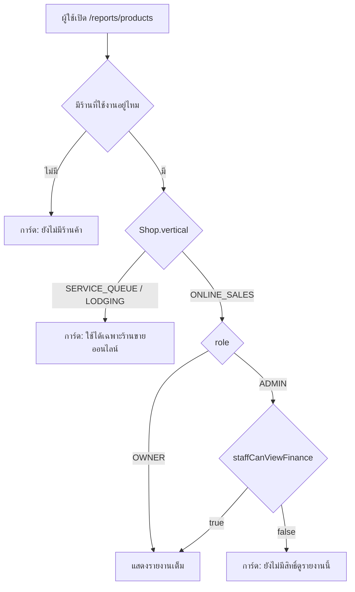
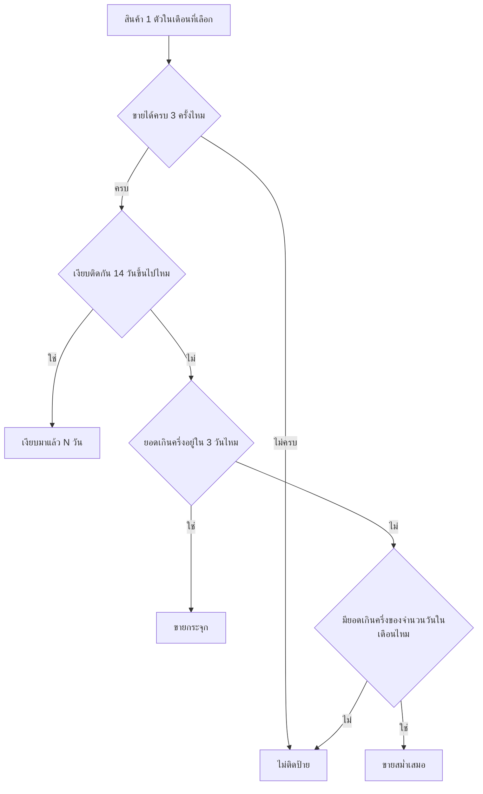

> **โมดูล:** M62-ProductSalesTimeSeries
> **ประเภทเอกสาร:** Product Requirements Document (PRD)
> **เวอร์ชัน:** 1.0
> **วันที่จัดทำ:** 2026-08-29
> **สถานะ:** Draft
> **เจ้าของเอกสาร:** BA + PO + PM (ดู [[Feature-Docs-Ownership]])

# PRD: ยอดขายรายสินค้า (รายงานไทม์ซีรีส์รายเดือน)

---

## Executive Summary

ระบบมีมิติ "เวลา" อยู่แล้วที่ `/sales` (กราฟยอดขายรายวัน) และมีมิติ "สินค้า" อยู่แล้วที่สินค้าขายดี
(`getBestSellerProducts()`) แต่ทั้งสองไม่เคยถูกนำมาไขว้กัน — ผู้ขายจึงตอบคำถามพื้นฐานอย่าง
"สินค้าตัวนี้ขายช่วงไหนของเดือน" หรือ "สินค้าตัวไหนตายแล้วควรเลิกขาย" ไม่ได้เลยจากหน้าจอที่มีอยู่

ฟีเจอร์นี้คือหน้ารายงานใหม่ `/reports/products` (เฉพาะร้าน `ONLINE_SALES`) ที่แสดงยอดขายรายสินค้า
เป็นไทม์ซีรีส์รายเดือน — กราฟเส้นสินค้าขายดี Top 5 + ตารางสินค้าทุกตัว พร้อมป้ายสรุปพฤติกรรมการขาย
("ขายกระจุก" / "ขายสม่ำเสมอ" / "เงียบมาแล้ว N วัน") เพื่อให้ผู้ขายวางแผนสต็อก/โปรโมท และพิจารณา
เลิกขายสินค้าที่ตายแล้วได้เร็วขึ้น **โดยไม่เพิ่มตาราง ไม่เพิ่ม migration และไม่เพิ่ม API endpoint ใหม่**

---

## 1. Business Goals & KPIs

### 1.1 เป้าหมายทางธุรกิจ

| เป้าหมาย | รายละเอียด |
|----------|-----------|
| **G-1 จับจังหวะขายของสินค้าแต่ละตัว** | ผู้ขายเห็นว่าสินค้าตัวหนึ่งขายดีช่วงไหนของเดือน (ต้นเดือน/กลางเดือน/กระจาย) เพื่อวางแผนสต็อกและจังหวะโปรโมท |
| **G-2 หาสินค้าที่ตายแล้ว** | ผู้ขายเห็นสินค้าที่ไม่มียอดขายมานาน เพื่อพิจารณาเลิกขายหรือเลิกสต็อก |

**ไม่ใช่เป้าหมายของฟีเจอร์นี้:** งานวิเคราะห์เปรียบเทียบสินค้าเชิงลึก (cohort / correlation / forecast) — ดู §5

### 1.2 ตัวชี้วัดความสำเร็จ (KPIs)

| KPI | คำอธิบาย | เป้าหมาย |
|-----|----------|---------|
| **อัตราเปิดหน้าซ้ำ** | ร้าน `ONLINE_SALES` ที่มีออเดอร์ ≥10 ใบ/เดือน เปิดหน้านี้ซ้ำภายใน 30 วัน | เพิ่มขึ้นทุกเดือนหลังเปิดใช้ (baseline วัดหลัง deploy 30 วันแรก) |
| **การใช้สวิตช์ "แสดงสินค้าที่ไม่มียอดขาย"** | พร็อกซีว่าเป้าหมาย G-2 ถูกใช้จริง ไม่ใช่แค่ G-1 | ≥ 30% ของ session ที่เปิดหน้านี้ |
| **เวลาโหลดหน้า** | p90 ของเวลาโหลดเมื่อเลือกเดือน | < 1.5 วินาที ที่ขนาดข้อมูลปัจจุบัน (ดู §6.2) |

---

## 2. User Personas (กลุ่มผู้ใช้งาน)

### 2.1 เจ้าของร้านขายออนไลน์

**ข้อมูลพื้นฐาน:**
- เจ้าของร้าน `Shop.vertical = 'ONLINE_SALES'` ที่ขายสินค้าหลายตัวพร้อมกัน (ไม่ใช่ร้านคิวงาน/บ้านพัก)
- ส่วนใหญ่ปิดการขายผ่านแชท ผู้ซื้อจึงแทบไม่เคยกดยืนยันรับของ

**เป้าหมาย:**
- รู้ว่าสินค้าตัวไหนควรสต็อกเพิ่ม/เลิกขาย ก่อนที่จะเสียเงินจมกับของที่ขายไม่ออก

**ความต้องการ:**
- เห็นแนวโน้มรายวันของสินค้าที่สนใจโดยไม่ต้องไล่เปิดออเดอร์ทีละใบ
- เห็นสินค้าที่ไม่มียอดขายเลยในเดือนนั้น เพื่อตัดสินใจเลิกขาย

**จุดปวด (Pain Points):**
- `/sales` บอกแค่ "วันนี้ขายได้เท่าไร" ไม่บอกว่า "สินค้าตัวไหน"
- สินค้าขายดีบน dashboard บอกแค่ "ตัวไหนขายดีสุดตลอดชีพ" ไม่บอกว่า "ช่วงไหนของเดือนนี้"
- สินค้าที่เลิกขายไปแล้วยังกินพื้นที่สต็อกโดยไม่มีใครสังเกต เพราะไม่มีหน้าไหนแสดง "ตัวที่ยอดเป็นศูนย์"

### 2.2 พนักงานร้านที่ได้รับสิทธิ์ดูตัวเลขการเงิน

**ข้อมูลพื้นฐาน:**
- ผู้ที่เจ้าของร้านเชิญเข้าร้าน มีแถว `ShopMember(role='ADMIN')`
- 🛑 สคีมามีเพียง 2 role คือ `OWNER` กับ `ADMIN` — ไม่มี role ที่ต่ำกว่านั้น "พนักงาน" ทุกคนคือ ADMIN

**เป้าหมาย:**
- ช่วยเจ้าของร้านดูแลสต็อกและจังหวะการขายรายสินค้า

**ความต้องการ:**
- เห็นรายงานเดียวกับเจ้าของร้านเมื่อเจ้าของร้านอนุญาต

**จุดปวด (Pain Points):**
- ถ้าไม่มีหน้านี้ ต้องไปไล่ดูออเดอร์ทีละใบเพื่อตอบคำถามว่าของตัวไหนขายดีช่วงไหน

**ผู้ที่ไม่ใช่ผู้ใช้ของหน้านี้:** ผู้ซื้อ · ร้าน `SERVICE_QUEUE`/`LODGING` (เห็นการ์ดข้อความอธิบาย ไม่ใช่หน้าเปล่า) · แอดมินแพลตฟอร์ม (`admin.*` คนละโดเมน)

---

## 3. Business Requirements

### 3.1 หน้ารายงานใหม่และการเข้าถึง

**ความต้องการ:**
- มีหน้าใหม่ `/reports/products` ในเมนูกลุ่ม ANALYTICS (กลุ่มเดียวกับ `/dashboard`, `/sales`, `/reports/agents`)
- เห็นเฉพาะร้าน `Shop.vertical = 'ONLINE_SALES'` — ร้านอื่นไม่เห็นเมนู และถ้าพิมพ์ URL เข้าตรงต้องเห็น
  ข้อความอธิบาย ไม่ใช่หน้าเปล่าหรือ redirect เงียบ
- เจ้าของร้านเห็นเสมอ · พนักงาน (`ShopMember role='ADMIN'`) เห็นเมื่อเจ้าของร้านเปิดสิทธิ์ดูตัวเลขการเงินไว้

**Business Rules:**
- vertical guard บังคับที่ server-side ไม่ใช่แค่ซ่อนเมนู (`seller-menu.ts` ประกาศตัวเองว่าเป็น
  "ตัวไม่รกตา ไม่ได้ทำหน้าที่ป้องกัน")
- สิทธิ์ผูกกับธง `Shop.staffCanViewFinance` ตัวเดียวกับ `/expenses` และ `/reports/agents` —
  **ห้ามตั้งธงใหม่** สำหรับข้อมูลประเภทเดียวกัน

**เหตุผล:**
- ร้าน `LODGING` ขายเป็น "คืน/ห้อง" ที่คร่อมหลายวัน การพล็อตลงแกน "วันที่สั่ง" ให้ความหมายผิด
  (จองวันที่ 1 เข้าพักวันที่ 20 จะไปโผล่ที่วันที่ 1) ส่วน `SERVICE_QUEUE` ยังไม่อยู่ในขอบเขตรอบนี้
- 🛑 **บันทึกไว้เพราะมติเดิมขัดกับสคีมา:** มติที่ผู้ใช้เคาะคือ "เจ้าของร้าน + ADMIN เท่านั้น (พนักงาน
  ไม่เห็น)" โดยเข้าใจว่า ADMIN กับพนักงานเป็นคนละ role — **แต่ในสคีมาจริง `ShopMember.role` มีแค่
  `OWNER` กับ `ADMIN`** ทุกคนที่ถูกเชิญคือ ADMIN ทั้งหมด ⇒ ทำตามถ้อยคำตรง ๆ จะกลายเป็น
  "ทุกคนที่เข้าถึงร้านได้" ซึ่งตรงข้ามกับ *เจตนา* ที่ผู้ใช้อธิบายไว้ ("ยอดขายรวมทั้งร้านเป็นข้อมูล
  ระดับเจ้าของ · เปิดให้กว้างทีหลังง่ายกว่าปิดทีหลัง") กลไกเดียวที่มีอยู่แล้วและคุมข้อมูลชนิดเดียวกัน
  คือ `staffCanViewFinance` จึงยึดตัวนั้น — ดูข้อจำกัดที่ตามมาใน §4.4

### 3.2 นิยามและมิติของข้อมูล

**ความต้องการ:**
- นับสินค้า "ขายแล้ว" จากออเดอร์ที่ยังไม่ถูกยกเลิก (รวมออเดอร์ที่ยังไม่ยืนยัน) — เกณฑ์เดียวกับ
  สินค้าขายดีฝั่งหลังร้าน ไม่ใช่เกณฑ์ของหน้ากำไร/ขาดทุน
- แสดงได้ 2 หน่วย: จำนวนชิ้น (ค่าตั้งต้น) และยอดขายเป็นบาท
- นับยอดต่อวันด้วยเวลาไทย ไม่ใช่ UTC
- เดือนที่ปิดไปแล้วยังขยับได้ ต้องบอกผู้ใช้ตรง ๆ

**Business Rules:**
- เกณฑ์ "ขายแล้ว" = `OrderItem` ของ `Order.status != 'CANCELLED'`
- โหมดบาทคำนวณจาก `Σ(qty × price)` ล้วน ๆ ห้ามเฉลี่ยส่วนลด/VAT ของออเดอร์ลงรายสินค้า
- bucket รายวันใช้ `thaiDayKey()` เดียวกับหน้าอื่น

**เหตุผล:**
- ร้านที่ขายผ่านแชทแทบไม่เคยได้สถานะ `CONFIRMED` (เคสจริงที่บันทึกไว้ในโค้ด: ร้านหนึ่ง SHIPPED 23 ใบ
  CONFIRMED 0) ⇒ ถ้าใช้นิยามของหน้ากำไร/ขาดทุน ร้านกลุ่มนี้จะเห็นกราฟว่างเปล่าทั้งเดือนทั้งที่ขายจริง
- `Order.discount`/`Order.vatAmount` เก็บที่ระดับออเดอร์ ไม่มีคอลัมน์แยกรายบรรทัดใน `OrderItem` —
  การเฉลี่ยลงมาคือการสร้างนิยาม "ยอดขาย" ชุดที่ 4 ในระบบที่มีอยู่แล้ว 3 ชุด และเป็นตัวเลขที่อธิบาย
  ที่มาให้ผู้ขายไม่ได้เลย
- ระบบเคยพลาดเรื่องตัดวันด้วย UTC มาแล้ว (`/sales` + `/orders` แก้ไป 2026-08-06)

### 3.3 การแสดงผลตามอุปกรณ์

**ความต้องการ:**
- เดสก์ท็อป/แท็บเล็ต (≥768px): กราฟเส้น Top 5 ด้านบน + ตารางสินค้าทุกตัวด้านล่าง
- มือถือ (<768px): ไม่มีกราฟรวม — รายการสินค้าที่มีแถบสรุปรายวัน แตะแถวเพื่อเปิดกราฟเต็มจอของตัวนั้น
- ค่าเริ่มต้นแสดงเฉพาะสินค้าที่มียอดในเดือนนั้น + สวิตช์แสดงสินค้าที่ไม่มียอดขาย

**Business Rules:**
- กราฟแสดงพร้อมกันได้สูงสุด 6 เส้น ตามจำนวนโทเคนสีกราฟที่ธีมมีให้
- แถบสรุปรายวันในแถวไม่ใช้ chart library

**เหตุผล:**
- 5 เส้น × 31 จุดบนจอ 360px อ่านไม่ออกจริง ไม่ว่าจะปรับอย่างไร
- เพดานสีของธีมมีจำกัด วาดเกินเพดานจะบังคับให้ hardcode hex ซึ่งขัด HR7/HR10
- ตัวห่อกราฟยิง `resize` ระดับ window ทุกครั้งที่ mount และกราฟทุกตัวที่อยู่บนหน้าฟังอยู่ด้วย ⇒
  N กราฟให้ผลเป็น N² การวาดใหม่ · โค้ดนั้น **ห้ามถอด** (แก้บั๊กกราฟกลับหัวบน iOS ที่ผู้ใช้เจอจริง)

### 3.4 ป้ายสรุปเชิงพฤติกรรม

**ความต้องการ:**
- ติดป้ายสถานะการขายให้สินค้าแต่ละตัวจากตัวเลขที่พิสูจน์ได้ ไม่ใช่การประเมินเชิงคาดเดา

**Business Rules:**

| ป้าย | เกณฑ์ |
|------|-------|
| **ขายกระจุก** | ยอดขายมากกว่า 50% ของเดือนอยู่ใน 3 วันหรือน้อยกว่า |
| **ขายสม่ำเสมอ** | มียอดขายเกินครึ่งหนึ่งของจำนวนวันในเดือนนั้น |
| **เงียบมาแล้ว N วัน** | ไม่มียอดขายต่อเนื่อง ≥14 วันนับถึงวันอ้างอิงของช่วงที่ดู |
| **(ไม่มีป้าย)** | ขายได้น้อยกว่า 3 ครั้งในเดือนนั้น หรือไม่เข้าเกณฑ์ใดเลย |

- ลำดับการตัดสินเมื่อเข้าหลายเกณฑ์: **เงียบ → กระจุก → สม่ำเสมอ**

**เหตุผล:**
- จำนวนครั้งที่น้อยเกินไป (<3) ไม่มีนัยสำคัญพอจะบอกจังหวะการขายได้ — การติดป้ายในกรณีนี้คือการเดา
  ที่ฟังดูมั่นใจ ซึ่งเสียหายกว่าการไม่แสดงอะไรเลย
- ป้ายมีไว้ชี้ทางว่าควรไปดูอะไรต่อ — ของที่หายไปสองสัปดาห์คือสิ่งนั้น และมันไม่ใช่ "ขายสม่ำเสมอ"
  อยู่แล้วโดยนิยาม ส่วนการเรียกมันว่า "ขายกระจุก" จะกลบข้อเท็จจริงที่ทำอะไรต่อได้มากกว่า

---

## 4. Business Rules & Constraints

### 4.1 กฎทางธุรกิจหลัก

| กฎ | คำอธิบาย |
|----|----------|
| **นิยาม "ขายแล้ว"** | `OrderItem` ของ `Order.status != 'CANCELLED'` — เหมือน `getBestSellerProducts()` ไม่เหมือนหน้ากำไร/ขาดทุน |
| **หน่วยยอดขาย (บาท)** | `Σ(qty × price)` ต่อรายการล้วน ๆ ไม่หักส่วนลด ไม่รวม VAT ระดับออเดอร์ |
| **bucket รายวัน** | ใช้เวลาไทย (`thaiDayKey()`) เสมอ |
| **รายการที่ไม่มีสินค้าอ้างอิง** | `OrderItem.productId = null` ทุกที่มา รวมเป็นแถวเดียว "รายการที่พิมพ์เอง" |
| **ป้าย "ปิดการขาย"** | ติดได้เฉพาะ `Product.isActive = false` — สินค้าที่ถูกลบจริงแยกไม่ออก (ดู §4.3) |
| **Top N บนกราฟ** | อันดับยึดจำนวนชิ้นเสมอ ไม่เปลี่ยนตามหน่วยที่เลือก — ตารางเท่านั้นที่เรียงตามหน่วย |
| **สิทธิ์การเข้าถึง** | เจ้าของร้านเสมอ · `ShopMember(role='ADMIN')` เมื่อ `Shop.staffCanViewFinance = true` |
| **ขอบเขต vertical** | เฉพาะร้าน `ONLINE_SALES` |

### 4.2 ข้อจำกัดทางธุรกิจ

| ข้อจำกัด | รายละเอียด |
|---------|-----------|
| **ไม่มีช่วงวันอิสระ** | เลือกได้ทีละเดือนผ่าน `?month=YYYY-MM` เท่านั้น |
| **ไม่มีการเทียบเดือนก่อนหน้า** | แสดงเดือนที่เลือกอย่างเดียว |
| **ไม่มี export** | ไม่มี CSV/PDF ในรอบนี้ |
| **ตัวเลขขยับได้หลังปิดเดือน** | `Order.createdAt` (วันที่ลูกค้าสั่ง) ผู้ขายระบุย้อนหลังได้ 90 วัน / ล่วงหน้า 7 วัน |

### 4.3 เหตุผลที่สินค้าที่ถูกลบแยกป้ายไม่ได้

`OrderItem.product` ประกาศ `onDelete: SetNull` และการลบสินค้าในระบบนี้เป็น **hard delete** (คำเตือน
บนหน้าจอเขียนเองว่า "ลบถาวร ย้อนกลับไม่ได้") ⇒ เมื่อผู้ขายลบสินค้า `OrderItem.productId` ของออเดอร์เก่า
ถูกล้างเป็น `null` ทันที **ที่ระดับฐานข้อมูล ก่อนถึงชั้น UI** และมีค่าเหมือนกับรายการที่ผู้ขายพิมพ์เอง
หรือรายการที่มาจากการประมูลทุกประการ

⇒ ไม่มีทางแยกได้อีกไม่ว่าจะออกแบบหน้าจออย่างไร ระบบจึงติดป้ายได้เฉพาะ "ปิดการขาย" (`isActive=false`)
ซึ่งแถว `Product` ยังอยู่ การเปลี่ยนการลบสินค้าเป็น soft delete เพื่อแก้ข้อจำกัดนี้อยู่นอกขอบเขต (ดู §5)

### 4.4 ข้อจำกัดของกลไกสิทธิ์ที่เลือกใช้

`Shop.staffCanViewFinance` ประกาศ `@default(true)` ⇒ **พนักงานเห็นรายงานนี้เป็นค่าตั้งต้น** เจ้าของร้าน
ต้องกดปิดเองจากสวิตช์เดิมที่หน้าตั้งค่าร้าน ซึ่งไม่ตรงกับเจตนา "เปิดให้กว้างทีหลังง่ายกว่าปิดทีหลัง"
เต็มร้อย การทำให้ปิดเป็นค่าตั้งต้นต้องเพิ่มคอลัมน์ใหม่ + migration ซึ่งอยู่นอกขอบเขตรอบนี้ (§5)
และการปิดสวิตช์นี้จะพลอยปิด `/expenses` กับ `/reports/agents` ไปด้วยเสมอ

---

## 5. Out of Scope (นอกขอบเขต)

| หัวข้อ | คำอธิบาย/เหตุผล |
|--------|----------|
| **Export CSV/PDF** | ไม่ทำในรอบนี้ — เพิ่มทีหลังได้โดยไม่ต้องรื้ออะไร |
| **เทียบเดือนก่อนหน้า** | เส้นบนกราฟจะคูณสอง ชนกับเพดาน 6 เส้นทันที |
| **ช่วงวันอิสระ (date range picker)** | เลือกได้ทีละเดือนเท่านั้น |
| **ร้าน `SERVICE_QUEUE` / `LODGING`** | `LODGING` พล็อตลงแกน "วันที่สั่ง" แล้วให้ความหมายผิด · `SERVICE_QUEUE` ยกไปรอบถัดไป |
| **เฉลี่ยส่วนลด/VAT ลงรายสินค้า** | สร้างนิยาม "ยอดขาย" ที่ 4 ในระบบที่มีอยู่แล้ว 3 นิยาม |
| **เปลี่ยนการลบสินค้าเป็น soft delete** | เป็นการเปลี่ยนพฤติกรรมของระบบสินค้าทั้งระบบ + migration + แก้คำเตือนตอนลบ |
| **ธงสิทธิ์แยกของรายงานนี้** | ต้องมี migration และทำให้เจ้าของร้านต้องปิดสองที่ถึงจะปิดได้จริง |
| **ตั้งเกณฑ์ป้ายสรุปเอง** | เกณฑ์ 50% / 3 วัน / 3 ครั้ง / 14 วัน คงที่ในรอบนี้ |
| **Migration · DB index ใหม่ · API endpoint ใหม่** | รอบนี้เป็น RSC อ่านอย่างเดียวจากข้อมูลเดิมทั้งหมด |

---

## 6. Risks & Mitigation

### 6.1 ความเสี่ยงทางธุรกิจ

| ความเสี่ยง | ผลกระทบ | ระดับ | แนวทางแก้ไข |
|-----------|---------|-------|-------------|
| ผู้ขายเทียบตัวเลขบาทกับ `/sales` ตรง ๆ | เข้าใจผิดว่าระบบคำนวณผิด แล้วเลิกเชื่อทั้งหน้า | สูง | ข้อความกำกับนิยามใต้กราฟเสมอ + คำเตือนเฉพาะโหมดบาท (HR16) |
| ตัวเลขเดือนที่ปิดแล้วขยับหลังอ่านไปแล้ว | สับสนว่าทำไมตัวเลขไม่นิ่ง | กลาง | "อัปเดตล่าสุด {เวลา}" + อธิบายว่าออเดอร์คีย์ย้อนหลังทำให้เปลี่ยนได้ |
| วันที่ยังไม่ถึงถูกอ่านเป็นยอดร่วง | ตัดสินใจผิดว่าสินค้าขายตก | สูง | วันอนาคตแสดงเทา แยกจาก "ยอด 0 จริง" ชัดเจน |
| ป้ายสรุปพูดคำที่ฟังดูมั่นใจแต่ผิด | เสียความเชื่อถือทั้งหน้า | สูง | ด่านขั้นต่ำ 3 ครั้ง + เกณฑ์ทุกข้อพิสูจน์ได้จากตัวเลข + เทส `[blocker]` พร้อม mutation |
| สินค้าที่ถูกลบปนกับ "รายการที่พิมพ์เอง" | ผู้ขายเข้าใจผิดว่าเป็นรายการเดียวกัน | ต่ำ | เขียนข้อจำกัดบนหน้าจอตรง ๆ ไม่ปิดบัง |

### 6.2 ความเสี่ยงทางเทคนิค

| ความเสี่ยง | ผลกระทบ | แนวทางแก้ไข |
|-----------|---------|-------------|
| `OrderItem` ไม่มี index บน `productId` | query ช้าลงเมื่อร้านมีออเดอร์มาก | รอบนี้ไม่เพิ่ม index (ร้านใหญ่สุด prod ~421 ออเดอร์ · ~500/เดือน · เกณฑ์ย้าย server-side ตั้งไว้ที่ 1,500) — **วัดเวลา query จริงเป็นตัวเลข** ถ้าเกินค่อยพิจารณา |
| payload อนุกรมรายวันของทุกสินค้าส่งลง client | ขนาดหน้าโตเมื่อร้านมีสินค้าเยอะ | ส่งแบบย่อ (เฉพาะวันที่มียอดจริง) + **วัดขนาดจริงเป็น KB ก่อน merge** |
| กราฟหลายตัวบนหน้าเดียวทำให้จอค้าง | หน้าไม่ตอบสนองตอนเปิด | แถบสรุปในแถวเป็น `div` ไม่ใช่ chart · กราฟบนหน้ามีไม่เกิน 1 ตัวเสมอ |

---

## 7. Glossary

| คำศัพท์ | ความหมาย |
|---------|----------|
| **bucket รายวัน** | การรวมยอดขายเป็นก้อนต่อวันปฏิทินไทย (`thaiDayKey()`) |
| **รายการที่พิมพ์เอง** | แถวรวมของ `OrderItem` ที่ `productId = null` ทุกที่มา (พิมพ์เอง / ประมูล / สินค้าที่ถูกลบ) |
| **Top 5** | สินค้า 5 อันดับแรกตามจำนวนชิ้นที่ขายได้ในเดือนนั้น — ไม่เปลี่ยนตามหน่วยที่เลือก |
| **ขายกระจุก** | ยอดขายมากกว่า 50% ของเดือนอยู่ใน ≤3 วัน |
| **ขายสม่ำเสมอ** | มียอดขายเกินครึ่งของจำนวนวันในเดือน |
| **เงียบมาแล้ว N วัน** | ไม่มียอดขายต่อเนื่อง ≥14 วันนับถึงวันอ้างอิงของช่วงที่ดู |
| **ปิดการขาย** | `Product.isActive = false` — สินค้ายังอยู่ในระบบแต่ปิดไม่ให้ซื้อ (ต่างจากถูกลบ) |
| **วันอ้างอิง** | เดือนปัจจุบัน = วันนี้ · เดือนที่ผ่านไปแล้ว = วันสุดท้ายของเดือน |

---

## 8. Success Metrics

| ตัวชี้วัด | ค่าที่คาดหวัง | วิธีวัด |
|----------|---------------|--------|
| หน้าโหลดเสร็จ | p90 < 1.5 วินาที | วัดเวลา query จริงเมื่อเลือกเดือน |
| กราฟกับตารางตรงกันเสมอ | ผลรวมจำนวนชิ้นบนกราฟ = ผลรวมคอลัมน์จำนวนในตาราง | ทดสอบด้วยเดือนที่มีข้อมูลจริง |
| อัตราการเปิดสวิตช์ "แสดงสินค้าที่ไม่มียอดขาย" | ≥ 30% ของ session | analytics event ของสวิตช์ |

---

## 9. Dependencies & Assumptions

### 9.1 สิ่งที่ต้องพึ่งพา

| ระบบ/ส่วนประกอบ | ความสัมพันธ์ |
|-----------------|-------------|
| `getBestSellerProducts()` (`src/services/product.service.ts`) | นิยามอ้างอิงของเกณฑ์ "ขายแล้ว" |
| `thaiDayKey()` (`src/lib/format-date.ts`) | bucket รายวันตามเวลาไทย |
| `thaiMidnightUtc()` (`src/lib/date-range.ts`) | ขอบเขตต้น/ปลายเดือนตามเวลาไทย |
| `src/lib/order-date-window.ts` | เหตุผลที่ตัวเลขเดือนที่ปิดแล้วยังขยับได้ (90/7 วัน) |
| `seller-menu.ts` (`VERTICAL_VISIBLE_SLUGS`) | การมองเห็นเมนูตาม `Shop.vertical` |
| `requireActiveShop()` (`src/lib/shop-context.ts`) | resolve ร้านที่กำลังใช้งาน + role |
| `ApexChart` wrapper | กราฟเส้นหลัก + กราฟเต็มจอรายสินค้า (ไม่ใช่แถบสรุปในแถว) |
| โทเคน `--color-chart-*` (`_root.css`) | เพดานจำนวนเส้นบนกราฟ (มี 7 ใช้จริง 6) |

### 9.2 สมมติฐาน

- **A-1** ปริมาณข้อมูลของร้านส่วนใหญ่เล็กพอให้คำนวณสดได้โดยไม่ต้อง pre-aggregate
- **A-2** ผู้ใช้ยอมรับได้ที่ตัวเลขบาทไม่เท่ากับ `/sales` ตราบใดที่มีคำอธิบายกำกับชัดเจน
- **A-3** จำนวนสินค้าต่อร้านไม่มากพอที่ payload อนุกรมรายวันจะเกินขนาดที่รับได้ (ต้องวัดจริงก่อน merge)

---

## 10. Appendix

### 10.1 ตัวอย่าง User Journey

**Scenario A: หาจังหวะขายของสินค้าขายดี**

1. เจ้าของร้านเปิด `/reports/products` จากเมนู ANALYTICS ได้เดือนปัจจุบันเป็นค่าตั้งต้น
2. เห็นกราฟ Top 5 มีเส้นหนึ่งพุ่งสูงใน 3 วันติดกันกลางเดือน
3. เลื่อนลงตาราง เห็นสินค้าตัวนั้นติดป้าย "ขายกระจุก"
4. สลับหน่วยเป็นบาทเพื่อดูว่าจังหวะนั้นทำเงินเท่าไร (อันดับบนกราฟไม่สลับ แกน Y เปลี่ยนหน่วย)
5. ตัดสินใจสต็อกเพิ่มก่อนช่วงเวลาเดียวกันของเดือนถัดไป

**Scenario B: หาสินค้าที่ตายแล้ว**

1. เปิดสวิตช์ "แสดงสินค้าที่ไม่มียอดขาย"
2. สินค้าที่ยอด 0 ทั้งเดือนโผล่ในตาราง
3. เรียงจากยอดน้อยไปมาก เห็นสินค้าที่ติดป้าย "เงียบมาแล้ว 28 วัน"
4. กดชื่อสินค้า → ไปหน้าสินค้าเพื่อพิจารณาปิดการขาย

### 10.2 Flow การตัดสินสิทธิ์และ vertical

### 10.3 Flow การตัดสินป้ายสรุป

---

**หมายเหตุ:**
เอกสารนี้เป็นการบันทึกความต้องการทางธุรกิจ (Business Requirements) โดยไม่มีรายละเอียดทางเทคนิค
สำหรับ Functional Requirements / User Story / Acceptance Criteria ดู [[BRD]] ของโมดูลนี้
สำหรับ technical specification ดู [[SRS]] ของโมดูลนี้
