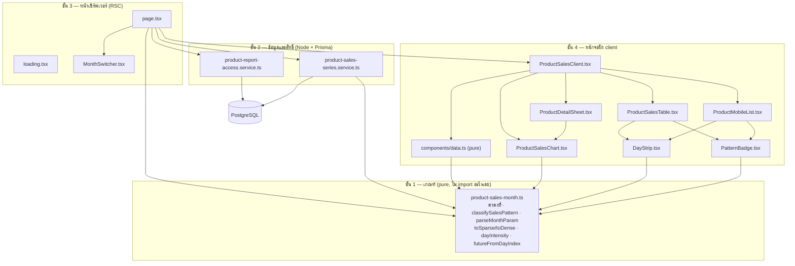
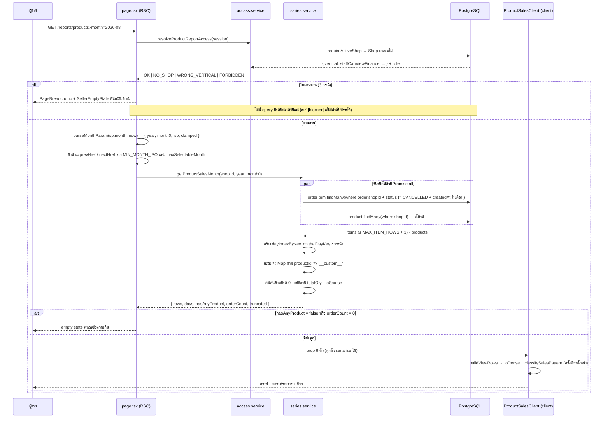
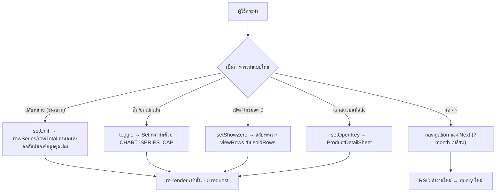
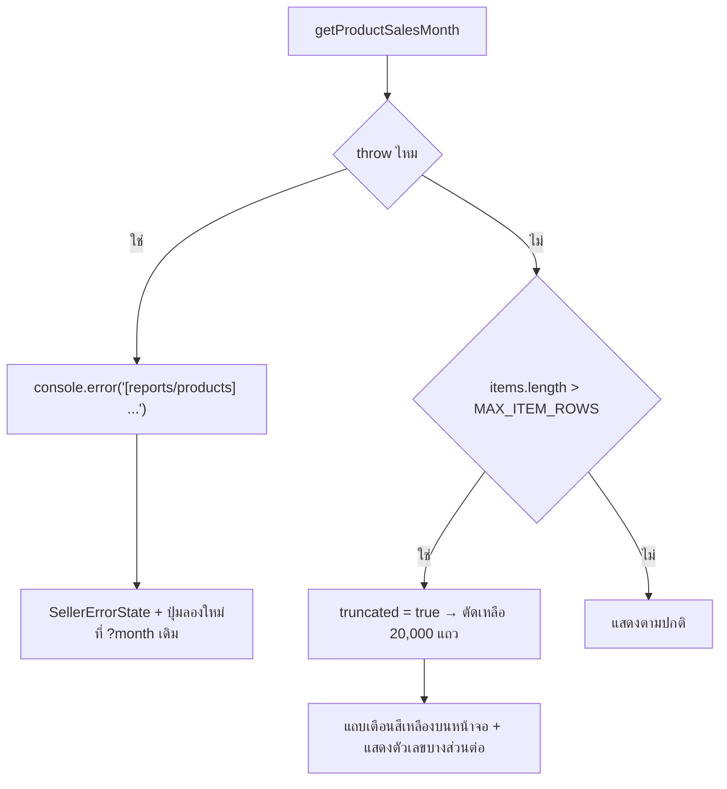

> **โมดูล:** M62-ProductSalesTimeSeries
> **ประเภทเอกสาร:** System Design Spec (SDS)
> **เวอร์ชัน:** 1.0
> **วันที่จัดทำ:** 2026-08-29
> **สถานะ:** Draft
> **เจ้าของเอกสาร:** SA (ดู [[Feature-Docs-Ownership]])

# SDS: ยอดขายรายสินค้า (System Design Spec)

---

## 1. บทนำ & References

### 1.1 วัตถุประสงค์

เอกสารนี้อธิบายว่า **ข้อกำหนดใน [[SRS]] ถูกสร้างขึ้นอย่างไร** — ไฟล์ไหนทำอะไร ข้อมูลไหลอย่างไร
และ **ทำไมถึงตัดสินใจแบบนั้นแทนที่จะเป็นแบบอื่น** ผู้อ่านคือ DEV ที่ต้องแก้ของนี้ต่อ, QA ที่ต้อง
รู้ว่าความเสี่ยงอยู่ตรงไหน และผู้ที่จะทำฟีเจอร์ถัดไปบนฐานเดียวกัน

ทุกข้อความในเอกสารนี้อ้างพฤติกรรมของโค้ดที่อ่านแล้วจริง ไม่ใช่เจตนาที่ตั้งใจไว้
(`docs/conventions/value-fate-decided-at-write-site.md`)

### 1.2 ขอบเขตการออกแบบ

**เปลี่ยน:** เพิ่ม route ใหม่ 1 route ในกลุ่ม `(paces)/seller/(dashboard)` · เพิ่ม lib pure 1 ไฟล์ ·
เพิ่ม service 2 ไฟล์ · แก้ `seller-menu.ts` และ dictionary 2 ไฟล์ (เพิ่มบรรทัด ไม่แก้ของเดิม)

**ไม่เปลี่ยน:** สคีมา · migration · API layer · เส้นทางเขียนข้อมูลทุกเส้น · หน้าอื่นทุกหน้า ·
`getBestSellerProducts()` และ `revenueOrderWhere` ที่หน้าอื่นใช้อยู่

### 1.3 เอกสารอ้างอิง

| เอกสาร | ความสัมพันธ์ |
|--------|-------------|
| [[SRS]] ของโมดูลนี้ | TFR-001..016 ที่ SDS นี้ต้อง realize ให้ครบ |
| [[BRD]] ของโมดูลนี้ | FR-PST-01..16 / AC-PST-01..20 |
| [[PRD]] ของโมดูลนี้ | เป้าหมาย G-1/G-2 และข้อจำกัดเชิงธุรกิจ |
| [[API]] ของโมดูลนี้ | บันทึกว่าไม่มี endpoint + สัญญาของหน้า |
| `docs/20 - Features/00059 - Agent Performance Report/SDS.md` | ต้นแบบโครงหน้ารายงานในกลุ่ม ANALYTICS ที่หน้านี้ copy มา |
| `docs/conventions/paces-charts-source.md` | Hard Rule 10 — ที่มาของกราฟและข้อยกเว้นของ `DayStrip` |
| `docs/conventions/overlay-scroll-lock.md` | เหตุผลที่ชีตต้องเรียก `useLockBodyScroll` เอง |
| `docs/conventions/sibling-surface-parity.md` | เหตุผลที่หน้านี้ยกโครงมาจาก `/reports/agents` ทั้งดุ้น |

---

## 2. Architecture Overview

### 2.1 มุมมองสถาปัตยกรรม

ออกแบบเป็น **4 ชั้นซ้อนกัน โดยชั้นในสุดไม่รู้จักชั้นนอก** — เป็นโครงเดียวกับ 00059 โดยตั้งใจ
เพื่อให้คนที่เคยแก้หน้านั้นเปิดหน้านี้แล้วรู้ทางทันที (`sibling-surface-parity.md`)

| ชั้น | ไฟล์ | รู้จักอะไรบ้าง |
|------|------|-----------------|
| **1. เกณฑ์ (pure)** | `src/lib/product-sales-month.ts` | ไม่รู้จักอะไรเลย — ไม่ import แม้แต่ไฟล์ในโปรเจกต์เดียวกัน |
| **2. ข้อมูล/สิทธิ์** | `src/services/product-sales-series.service.ts` · `product-report-access.service.ts` | รู้จัก Prisma + ชั้น 1 |
| **3. หน้าเซิร์ฟเวอร์** | `.../reports/products/page.tsx` · `loading.tsx` · `MonthSwitcher.tsx` | รู้จักชั้น 1 + 2 |
| **4. หน้าจอฝั่ง client** | `components/*.tsx` + `components/data.ts` | รู้จักชั้น 1 + ชนิดข้อมูลจากชั้น 2 (type-only) |

🛑 **ชั้น 1 ถูกเรียกจากทั้งชั้น 2, 3 และ 4** — นั่นคือเหตุผลทั้งหมดที่มันต้องเป็น pure และห้าม
import อะไร: `classifySalesPattern()` ถูกเรียกจาก **client** (`components/data.ts`) ขณะที่
`toSparse()` ถูกเรียกจาก **server** (service) ถ้าไฟล์นี้ลาก Prisma หรือ React เข้ามาแม้แต่ทางอ้อม
มันจะพังฝั่งใดฝั่งหนึ่งทันที

### 2.2 มุมมองการ Deploy

ไม่มีอะไรเปลี่ยน — route เพิ่มในแอปเดิม รันบน serverless function เดิมของ Vercel
ไม่มี env var ใหม่ ไม่มี migration ⇒ **rollback = revert commit เพียงอย่างเดียว ไม่มีสถานะฐานข้อมูลค้าง**

---

## 3. Component Design

| Component | หน้าที่ (Responsibility) | Dependency |
|-----------|--------------------------|------------|
| **`product-sales-month.ts`** | ที่เดียวที่รู้ว่า "กระจุกแปลว่าอะไร" · "เดือนที่ใช้ได้คือเดือนไหน" · "ย่อข้อมูลอย่างไร" · "คำไทยของแต่ละป้ายคืออะไร" | ไม่มี |
| **`product-report-access.service.ts`** | จุดตัดสินสิทธิ์ **จุดเดียว** ของหน้านี้ คืน union 4 ค่าให้ผู้เรียกเลือก UI เอง | `lib/shop-context` |
| **`product-sales-series.service.ts`** | ดึง `OrderItem` + `Product` ของเดือน → bucket รายวัน → ประกอบ `ProductSalesRow[]` ที่เรียงแล้ว | Prisma · `format-date` · `date-range` · ชั้น 1 |
| **`page.tsx`** | ประกอบทางออก 7 ทาง (6 ทางลัด + 1 ทางปกติ) · แปลง query · คำนวณ href ของ ‹ › · **ไม่มีสูตรใด ๆ อยู่ในไฟล์นี้** | ชั้น 1 + 2 · `SellerEmptyState`/`SellerErrorState` · `PageBreadcrumb` |
| **`loading.tsx`** | skeleton ที่เลียนโครงจริง — ซ่อนโครงกราฟต่ำกว่า `md` เพราะหน้าจริงก็ซ่อน | `SellerCardSkeleton` |
| **`MonthSwitcher.tsx`** | ปุ่ม ‹ ชื่อเดือน › — server component ล้วน ปุ่มเป็น `<Link>` และปุ่มที่ชนเพดานเป็น `` | `next/link` · `format-date` |
| **`components/data.ts`** | สะพานระหว่างชนิดข้อมูลของ service กับหน้าจอ: คลาย sparse · คำนวณป้าย · ตัดสินว่า "ตัวเลขของแถวนี้คืออะไร" ตามหน่วย · เลือกเส้นตั้งต้น | ชั้น 1 (type-only จาก service) |
| **`ProductSalesClient.tsx`** | ถือ state 4 ตัว (`unit`, `showZero`, `openKey`, `selected`) และจัดวางตาม breakpoint ด้วย CSS | ทุก component ในชั้น 4 |
| **`ProductSalesChart.tsx`** | กราฟเส้นหน่วยเดียว + แถบ annotation "ยังไม่ถึง" | `wrappers/ApexChart` · `utils/helpers::getColor` |
| **`ProductSalesTable.tsx`** | ตาราง 6 คอลัมน์ + ช่องติ๊ก + pagination 20 แถว | `@tanstack/react-table` · `components/table/*` |
| **`ProductMobileList.tsx`** | รายการการ์ด — ทั้งแถวเป็นปุ่มเปิดชีต | `DayStrip` · `PatternBadge` |
| **`ProductDetailSheet.tsx`** | ชีตเต็มจอ: กราฟเส้นเดียว + สถิติ 4 ช่อง + ป้าย + ทางไปหน้าสินค้า | `useLockBodyScroll` · `ProductSalesChart` |
| **`DayStrip.tsx`** | แถว `` 1 ช่อง = 1 วัน ระดับความเข้ม 5 ระดับ | ชั้น 1 เท่านั้น (`dayIntensity`) |
| **`PatternBadge.tsx`** | แปลง `SalesPattern` เป็นชิป (ไอคอน + สี + คำ) หรือขีดกลางเมื่อไม่มีป้าย | ชั้น 1 (`salesPatternLabel` / `salesPatternDescription`) |

**หลักที่ยึด:** หนึ่ง component = หนึ่งความรับผิดชอบ และ **คำที่ผู้ใช้อ่านต้องมาจากชั้น 1 เสมอ** —
`PatternBadge` ไม่รู้จักคำว่า "ขายกระจุก" มันรู้แค่ว่า `CONCENTRATED` ใช้ไอคอนอะไรและสีอะไร

---

## 4. Data Flow

### 4.1 Flow หลัก: เปิดหน้าและเลือกเดือน

### 4.2 Flow ฝั่ง client: การกระทำที่ไม่คุยกับเซิร์ฟเวอร์

🛑 **เส้นแบ่งของแผนภาพนี้คือมติหลักของฟีเจอร์:** ทุกอย่างที่ตอบได้จากข้อมูลที่ส่งลงมาแล้ว
อยู่ฝั่งซ้าย (ไม่มี request) · มีเพียง "เดือน" เท่านั้นที่ต้อง query ใหม่จริง จึงเป็นตัวเดียวที่อยู่ใน URL

### 4.3 Flow กรณีล้มเหลว / ชดเชย

🛑 **ไม่มี compensating action เพราะไม่มีการเขียนข้อมูล** — ความล้มเหลวทุกชนิดของฟีเจอร์นี้
เป็นความล้มเหลวของการ *อ่าน* ซึ่งชดเชยด้วยการบอกผู้ใช้ให้ถูกชนิดเท่านั้น

🛑 **`SellerErrorState` ต้องไม่ใช่ `SellerEmptyState`** — ฐานข้อมูลล่มกับ "เดือนนี้ขายไม่ได้เลย"
เป็นข้อเท็จจริงคนละอย่างที่ผู้ขายต้องทำคนละเรื่อง การใช้จอเดียวกันคือการโกหกในกรณีหนึ่งเสมอ

---

## 5. Integration Points

| จุดเชื่อม | ประเภท | Protocol / Contract | ความเสี่ยงเมื่อล่ม/เปลี่ยน |
|-----------|--------|----------------------|-----------------------------|
| **PostgreSQL (Prisma)** | internal | 2 query อ่านอย่างเดียวต่อการโหลด 1 ครั้ง | หน้าแสดง `SellerErrorState` ไม่ใช่ตัวเลข 0 |
| **`requireActiveShop()`** | internal | function call — คืน `ActiveShop \| null` ที่มี `shop` (Shop row เต็ม) + `role` | 🛑 ถ้าวันหนึ่งมีคนใส่ `select` เฉพาะบางคอลัมน์ ด่านจะอ่าน `vertical`/`staffCanViewFinance` เป็น `undefined` แล้ว **fail-open** ไปทาง `ONLINE_SALES` เงียบ ๆ |
| **`thaiDayKey()` / `thaiMidnightUtc()`** | internal | function call | รูปแบบคีย์เปลี่ยน = bucket เพี้ยนทั้งหน้าโดยไม่มี error |
| **`getBestSellerProducts()`** | internal (นิยามอ้างอิง) | ไม่ได้เรียกโดยตรง — **อ้างเป็นแหล่งของนิยาม** | ถ้าที่นั่นเปลี่ยนเกณฑ์ หน้านี้จะกลายเป็นนิยามที่ 4 ทันทีโดยไม่มีอะไรฟ้อง (HR16) |
| **`ApexChart` wrapper** | internal | props `{ type, height, key, getOptions }` | เป็นทางเดียวที่แตะไลบรารีกราฟได้ (HR10) |
| **โทเคน `--color-chart-*`** | internal (CSS) | `getColor('chart-*')` | ลบโทเคนออกจากธีม = เส้นกราฟไม่มีสี · เทส `[blocker]` ผูกจำนวนโทเคนกับเพดานเส้นไว้แล้ว |
| **`seller-menu.ts`** | internal | slug `seller:reports-products` | ลบ slug ออกจาก `ONLINE_SALES_ONLY_SLUGS` = ร้านทุกประเภทเห็นเมนู (แต่หน้ายัง guard ตัวเองได้) |
| **dictionary th/en** | internal | คีย์ `menu.reportsProducts` | คีย์หายจะ "คงป้ายเดิม" ไม่ใช่กลายเป็นช่องว่าง (พฤติกรรมของ `applyMenuLocale`) |

- **Timeout / Retry / Idempotency:** ไม่มี policy เฉพาะ — เป็น `GET` อ่านอย่างเดียว ผู้ใช้กด
  "ลองใหม่" ได้ไม่จำกัดโดยไม่มีผลข้างเคียง
- **สัญญา API เต็ม:** ดู `API.md` ของโมดูลนี้ (ซึ่งบันทึกว่า **ไม่มี endpoint** และอธิบายสัญญาของหน้าแทน)

---

## 6. Technical Decisions

### TD-001: ไม่เพิ่ม API endpoint แม้แต่ตัวเดียว

- **ตัดสินใจ:** ส่งข้อมูล **ทั้งสองหน่วยและทุกสินค้า** ลงมาพร้อม RSC ครั้งเดียว แล้วให้ทุกการโต้ตอบ
  ที่ไม่ใช่ "เปลี่ยนเดือน" ทำงานฝั่ง client ล้วน
- **เหตุผล:**
  - การสลับหน่วย/ติ๊กเส้น/เปิดสวิตช์ **ไม่ได้ต้องการข้อมูลที่เซิร์ฟเวอร์ยังไม่ได้ส่ง** — round trip
    ที่ไม่ได้อะไรกลับมาคือความช้าที่แลกด้วยความว่างเปล่า
  - endpoint ที่สองแปลว่า **นิยาม "ขายแล้ว" มีสองเส้นทาง** ซึ่งเป็นรูปร่างของบั๊กที่ HR16 อธิบายไว้
    (สองที่ที่ "ถูก" ในตัวเองแต่ไม่ตรงกัน และไม่มี gate ไหนจับได้)
  - ลด attack surface: หน้านี้ไม่รับ input จากผู้ใช้เลยนอกจาก `?month=`
- **ทางเลือกที่ตัดทิ้ง:**
  - *`GET /api/seller/reports/products` แล้วให้ client fetch* — จะต้องทำ auth guard ซ้ำอีกชุด
    และเปิดโอกาสให้เกิดเกณฑ์ชุดที่สอง
  - *ส่งเฉพาะ Top 5 แล้ว lazy-load ที่เหลือ* — สวิตช์ "แสดงสินค้าที่ไม่มียอดขาย" จะยิงเซิร์ฟเวอร์
    ทุกครั้ง ซึ่งขัด AC-PST-11 ตรงตัว และเป็นการแลก payload กับ latency ที่ผิดฝั่ง
- **ผลกระทบ:** payload ใหญ่ขึ้นตามจำนวนสินค้า ⇒ ต้องมี TD-002 มาคุมขนาด และ **ต้องวัดเป็น KB
  จริงก่อน merge** (SRS §8 R-3)

### TD-002: ย่ออนุกรมรายวันเป็น `SparseSeries`

- **ตัดสินใจ:** ส่ง `[dayIndex, value][]` เก็บเฉพาะวันที่ค่าไม่เป็น 0 แล้วคลายเป็น dense array
  ที่ฝั่ง client ด้วย `toDense(sparse, days)`
- **เหตุผล:** ร้านที่มีสินค้าเป็นร้อยตัวส่วนใหญ่ขายแต่ละตัวได้ไม่กี่วันต่อเดือน ⇒ การส่งเลขศูนย์
  28–30 ตัวต่อสินค้าคือ payload ที่จ่ายไปกับความว่างเปล่า และสินค้าที่ยอด 0 ทั้งเดือน (ซึ่งต้องส่ง
  ลงไปด้วยเพราะสวิตช์) มีค่าเป็นอาเรย์ว่างพอดี
- **ทางเลือกที่ตัดทิ้ง:**
  - *ส่ง dense array ตรง ๆ* — ง่ายกว่าแต่โตเป็นเชิงเส้นกับ (จำนวนสินค้า × จำนวนวัน)
  - *ส่งเฉพาะสินค้าที่มียอด แล้วดึงสินค้าที่ยอด 0 ทีหลัง* — ขัด TD-001
- **ผลกระทบ:** เพิ่มขั้นตอนแปลง 1 ชั้นทั้งสองฝั่ง ⇒ ต้องมีเทส round-trip เป็น `[blocker]`
  · 🛑 **เงื่อนไขต้องเป็น `!== 0` ไม่ใช่ `> 0`** ไม่งั้นค่าติดลบ (คืนของ/ปรับยอด) จะหายเงียบ

### TD-003: นิยาม "ขายแล้ว" = `status != 'CANCELLED'` ไม่ใช่ `revenueOrderWhere`

- **ตัดสินใจ:** ใช้เกณฑ์ชุดเดียวกับ `getBestSellerProducts()` แล้ว **บังคับให้หน้าจอพูดความต่างออกมา**
  ผ่าน `SALES_BASIS_NOTE` ที่แสดงเหนือกราฟเสมอ
- **เหตุผล:** ร้านที่ขายผ่านแชท ผู้ซื้อแทบไม่กลับมากดยืนยันรับของ (เคสจริงที่บันทึกอยู่ในโค้ด:
  SHIPPED 23 ใบ / CONFIRMED 0) ⇒ ใช้เกณฑ์ของหน้ากำไร/ขาดทุน ร้านกลุ่มนี้จะเปิดรายงานมาเจอ
  **กราฟว่างเปล่าทั้งเดือนทั้งที่ขายได้ทุกวัน** ซึ่งแย่กว่าตัวเลขที่ต้องอธิบาย
- **ทางเลือกที่ตัดทิ้ง:**
  - *ใช้ `revenueOrderWhere` ให้ตรงกับ `/sales`* — ตัวเลขจะตรงกันแต่รายงานจะไร้ประโยชน์กับ
    กลุ่มผู้ใช้หลัก
  - *ให้ผู้ใช้เลือกเกณฑ์เอง* — เพิ่มมิติที่ผู้ขายไม่มีทางรู้ว่าควรเลือกอะไร และจะทำให้ตัวเลข
    เดียวกันมีความหมายต่างกันในแต่ละ session
- **ผลกระทบ:** ตัวเลขจะไม่ตรงกับ `/sales` ตลอดกาลโดยตั้งใจ ⇒ **คำอธิบายบนจอไม่ใช่ของประดับ
  มันคือส่วนหนึ่งของความถูกต้อง** ลบเมื่อไรฟีเจอร์นี้กลายเป็นแหล่งของความเข้าใจผิดทันที

### TD-004: โหมดบาทไม่เฉลี่ยส่วนลด/VAT ลงรายบรรทัด

- **ตัดสินใจ:** `Σ(qty × price)` ล้วน แล้วแสดง `MONEY_MODE_CAVEAT` **เฉพาะเมื่ออยู่โหมดบาท**
- **เหตุผล:** `Order.discount` และ `Order.vatAmount` อยู่ระดับออเดอร์ ไม่มีคอลัมน์ใน `OrderItem`
  การเฉลี่ยลงมาคือการประดิษฐ์นิยาม "ยอดขาย" ชุดที่ 4 ในระบบที่มีอยู่แล้ว 3 ชุด และเป็นตัวเลข
  ที่ **อธิบายที่มาให้ผู้ขายไม่ได้เลย** ("ทำไมสินค้าตัวนี้ได้ส่วนลด 12.7 บาท" ตอบไม่ได้)
- **ทางเลือกที่ตัดทิ้ง:** *เฉลี่ยตามสัดส่วนมูลค่า* — ดูถูกต้องกว่าและผลรวมจะเท่า `Order.totalAmount`
  พอดี ซึ่งเป็นเหตุผลที่มันอันตราย: มันจะ "ตรง" กับ `/sales` จนไม่มีใครสงสัย ทั้งที่ตัวเลขรายสินค้า
  ไม่ได้มาจากข้อเท็จจริงใด
- **ผลกระทบ:** ผลรวมของทุกแถวจะไม่เท่า `Σ Order.totalAmount` เสมอ · คำเตือนต้องผูกกับหน่วย
  ไม่ใช่แสดงตลอดเวลา (คำเตือนที่ขึ้นทุกจอกลายเป็นของประดับที่ไม่มีใครอ่าน)

### TD-005: เกณฑ์ป้ายอยู่ในฟังก์ชันบริสุทธิ์ ไม่ใช่ในเทอร์นารีกลาง JSX

- **ตัดสินใจ:** `classifySalesPattern()` + `salesPatternLabel()` + `salesPatternDescription()`
  อยู่ในไฟล์ที่ไม่ import อะไรเลย และ `buildViewRows()` เรียกมันครั้งเดียวทั้งหน้า
- **เหตุผล:** เกณฑ์นี้คือ "โค้ดที่ตีความข้อมูลแทนผู้ขาย" ถ้าเขียนกลับด้าน **มันจะไม่พังเสียงดัง —
  มันจะพูดคำที่ฟังดูมั่นใจแล้วผิด** และ `tsc`/build/theme-guard/grep ผ่านหมดเพราะทุกบรรทัดถูกตามชนิด
  (`ui-boolean-needs-a-testable-home.md`: เกณฑ์ไม่ใช่ "ซับซ้อนพอไหม" แต่คือ "ถ้าเขียนกลับด้าน
  แล้วจะมีอะไรจับได้ไหม")
- **ทางเลือกที่ตัดทิ้ง:**
  - *คำนวณใน `useMemo` ของ `ProductSalesClient`* — ไม่มีที่ให้เทสจับ
  - *คำนวณฝั่ง service แล้วส่งป้ายลงมา* — จะทำให้ป้ายไม่ขยับตามอะไรเลยหลังส่ง และเพิ่มขนาด payload
    โดยไม่จำเป็น (ป้ายคำนวณจากข้อมูลที่ส่งลงมาอยู่แล้ว)
- **ผลกระทบ:** 51 เทสในไฟล์เดียว รวมเคสขอบที่ตั้งใจปักหมุด (50% เป๊ะ · เงียบ 13 vs 14 วัน ·
  `saleEvents` 2 vs 3 · ยอดรวม 0 ทั้งที่นับครั้งได้)

### TD-006: `DORMANT` ชนะทุกป้าย และ `CONCENTRATED` ชนะ `STEADY`

- **ตัดสินใจ:** ลำดับตัดสิน `DORMANT → CONCENTRATED → STEADY → NONE` (หลังผ่านด่านขั้นต่ำ 3 ครั้ง)
- **เหตุผล:** ป้ายมีไว้ **ชี้ว่าควรไปดูอะไรต่อ** ไม่ใช่บรรยายรูปร่างกราฟ — ของที่หายไปสองสัปดาห์
  คือสิ่งที่ควรไปดู และมันไม่ใช่ "ขายสม่ำเสมอ" อยู่แล้วโดยนิยาม ส่วนการเรียกมันว่า "ขายกระจุก"
  จะกลบข้อเท็จจริงที่ทำอะไรต่อได้มากกว่าไว้ข้างหลังคำที่บรรยายรูปร่างเฉย ๆ
- **ทางเลือกที่ตัดทิ้ง:** *แสดงหลายป้ายพร้อมกัน* — ผู้ใช้ต้องตีความเองว่าอันไหนสำคัญกว่า
  ซึ่งเป็นงานที่ระบบควรทำให้ และคอลัมน์จะกว้างจนตกบรรทัดบนมือถือ
- **ผลกระทบ:** สินค้าที่ขายรัวต้นเดือนแล้วเงียบยาวจะได้ป้าย "เงียบมาแล้ว N วัน" ไม่ใช่ "ขายกระจุก"
  — เป็นพฤติกรรมที่ตั้งใจและมีเทสปักหมุด

### TD-007: ด่านขั้นต่ำ 3 ครั้ง โดยนับ "บรรทัด" ไม่ใช่ "ชิ้น"

- **ตัดสินใจ:** `saleEvents` = จำนวนแถว `OrderItem` ของสินค้านั้นในเดือน · ต่ำกว่า 3 = ไม่ติดป้ายเลย
  ไม่ว่ารูปร่างจะเป็นอย่างไร
- **เหตุผล:** ขาย 50 ชิ้นในใบเดียวไม่ได้บอกอะไรเรื่อง *จังหวะ* การขาย — จำนวนชิ้นตอบคำถาม
  "ขายได้เท่าไร" ส่วนจำนวนครั้งตอบ "ขายบ่อยแค่ไหน" ซึ่งเป็นคำถามที่ป้ายนี้อ้างว่าตอบ
- **ทางเลือกที่ตัดทิ้ง:** *ใช้จำนวนชิ้นเป็นด่าน* — สินค้าขายส่งใบเดียวจะได้ป้าย "ขายกระจุก" ทันที
  ซึ่งเป็นการเดาที่ฟังดูมั่นใจ
- **ผลกระทบ:** สินค้าที่ขายน้อยครั้งจะเห็นขีดกลาง (`—`) พร้อม `title` อธิบายว่าทำไม —
  **ไม่ใช่ช่องว่างเปล่า** เพราะผู้อ่านต้องแยก "ไม่มีป้าย" ออกจาก "ป้ายยังโหลดไม่เสร็จ"

### TD-008: แถบรายวันเป็น `div` ไม่ใช่ chart (ข้อยกเว้นของ Hard Rule 10)

- **ตัดสินใจ:** `DayStrip` เรนเดอร์ `` จำนวน `days` ช่องใน CSS grid — **ไม่ผ่าน `ApexChart`
  และไม่ import ไลบรารีกราฟใด ๆ**
- **เหตุผล (สองชั้น ทั้งสองชั้นจำเป็น):**
  1. **มันไม่ใช่ chart จริง ๆ** — ไม่มีแกน ไม่มีสเกล ไม่มี tooltip ของตัวเอง ไม่มี legend
     มันคือแถวของช่องสี่เหลี่ยมที่ **นับได้ว่าวันที่เท่าไร** ซึ่งตอบคำถาม "ขายวันไหน" ตรงกว่า
     sparkline ที่ตอบ "รูปร่างของแนวโน้ม"
  2. **เชิงประสิทธิภาพ:** `ApexChart.tsx` ยิง `window.dispatchEvent(new Event('resize'))`
     **สองครั้งต่อการ mount หนึ่งครั้ง** (double rAF + `document.fonts.ready`) และ ApexCharts
     ทุกตัวบนหน้าติด listener ของ window ไว้ ⇒ N กราฟ = O(N²) การวาดใหม่พร้อมกัน ขณะที่ตารางนี้
     มี 20 แถว/หน้า · 🛑 **โค้ดที่ยิง resize ห้ามถอด** — มันแก้บั๊กกราฟเรนเดอร์กลับหัวบน iOS
     ที่ผู้ใช้รายงานจริง (iPhone 14 Pro Max, 2026-08-05)
- **ทางเลือกที่ตัดทิ้ง:**
  - *sparkline ผ่าน ApexChart ทุกแถว* — ตรงตัวอักษรของ HR10 แต่จะทำให้หน้าค้างบนมือถือ
  - *ถอดโค้ด resize ใน wrapper แล้วใช้ sparkline ได้* — คือการเอาบั๊กที่แก้แล้วกลับมา
- **ผลกระทบ:** ต้องมีเทส `[blocker]` 2 เคสกันคนเปลี่ยนกลับ (ห้าม import `ApexChart` และห้าม import
  `react-apexcharts`/`apexcharts`/`echarts`/`chart.js`/`recharts`) และต้องเขียนเหตุผลไว้บนหัวไฟล์
  เพราะคนที่เห็นครั้งแรกจะคิดว่านี่คือการละเมิด HR10

### TD-009: ความเข้มของแถบเทียบกับตัวเอง ไม่ใช่เทียบข้ามสินค้า

- **ตัดสินใจ:** `dayIntensity(value, maxValue)` โดย `maxValue` = ยอดสูงสุดของ **สินค้าตัวนั้นเอง**
- **เหตุผล:** แถบนี้ตอบคำถาม "ตัวนี้ขายวันไหน" ซึ่งเป็นคำถามภายในสินค้าหนึ่งตัว — ถ้า normalize
  ข้ามสินค้า ตัวที่ขายน้อยจะกลายเป็นแถบเทาทั้งแถบ แล้ว **มองไม่ออกเลยว่าขายวันไหน** ซึ่งคือ
  ข้อมูลเดียวที่แถวนั้นมีให้
- **ทางเลือกที่ตัดทิ้ง:** *normalize ด้วยยอดสูงสุดของทั้งเดือนทุกสินค้า* — จะเทียบข้ามแถวได้
  แต่แลกกับการทำให้แถวส่วนใหญ่ไร้ข้อมูล และการเทียบข้ามสินค้ามีกราฟทำหน้าที่นั้นอยู่แล้ว
- **ผลกระทบ:** ห้ามอ่านความเข้มข้ามแถวเป็นการเปรียบเทียบ — `aria-label` ของแต่ละแถบจึงระบุ
  ยอดสูงสุดของแถวนั้นเป็นตัวเลขจริงกำกับไว้

### TD-010: "เดือน" อยู่ใน URL · "หน่วย/ตัวเลือกเส้น/สวิตช์" อยู่ใน state

- **ตัดสินใจ:** `?month=YYYY-MM` เท่านั้นที่อยู่ใน URL · อีก 3 อย่างเป็น `useState` ล้วน
- **เหตุผล:** เดือนคือสิ่งเดียวที่ต้อง query ใหม่จริง และเป็นสิ่งที่ผู้ใช้อยากส่งลิงก์ให้กันดู
  ปุ่ม ‹ › จึงต้องเป็น `<Link>` จริงเพื่อให้ปุ่ม back ของเบราว์เซอร์ทำงาน ส่วนอีกสามอย่าง
  ถ้าดันเข้า URL จะได้ round trip ที่ไม่ได้อะไรกลับมา
- **ทางเลือกที่ตัดทิ้ง:** *ใส่ทุกอย่างใน URL เพื่อให้แชร์สถานะได้เป๊ะ* — แลกความช้าทุกคลิก
  กับกรณีใช้งานที่ไม่มีใครขอ
- **ผลกระทบ:** สลับหน่วยแล้วกด back จะกลับไปเดือนก่อนหน้า ไม่ใช่หน่วยก่อนหน้า — เป็นพฤติกรรม
  ที่ตั้งใจและสอดคล้องกับ `/sales` ที่ใช้ `?from=&to=` ด้วยหลักเดียวกัน

### TD-011: ใช้ธง `staffCanViewFinance` เดิม ไม่ตั้งธงใหม่

- **ตัดสินใจ:** สิทธิ์ผูกกับ `Shop.staffCanViewFinance` ตัวเดียวกับ `/expenses` และ `/reports/agents`
- **เหตุผล:** `ShopMember.role` มีแค่ `OWNER` กับ `ADMIN` ไม่มี role ที่ต่ำกว่า ⇒ ทำตามถ้อยคำของมติ
  ("OWNER + ADMIN เท่านั้น") ตรง ๆ จะแปลว่า "ทุกคนที่เข้าถึงร้านได้" ซึ่งตรงข้ามกับ *เจตนา*
  ที่ผู้ใช้อธิบายไว้ · และการตั้งธงที่สองมาคุมข้อมูลประเภทเดียวกัน (ตัวเลขการเงินระดับร้าน) แปลว่า
  **เจ้าของร้านต้องไปปิดสองที่ถึงจะปิดได้จริง** ซึ่งเป็นรูปร่างของช่องโหว่ที่ค้นเจอยากที่สุด
- **ทางเลือกที่ตัดทิ้ง:**
  - *เพิ่มคอลัมน์ `staffCanViewProductReport`* — ต้องมี migration (ขัดขอบเขต) และสร้างปัญหาข้างบน
  - *ให้ OWNER เท่านั้น* — ตัดพนักงานที่เจ้าของร้านไว้ใจออกทั้งหมด โดยไม่มีทางเปิดให้
- **ผลกระทบ:** 🛑 **ธงนี้ `@default(true)` ⇒ พนักงานเห็นรายงานเป็นค่าตั้งต้น** ซึ่งไม่ตรงกับเจตนา
  "เปิดกว้างทีหลังง่ายกว่าปิดทีหลัง" เต็มร้อย · และการปิดสวิตช์นี้จะพลอยปิด `/expenses` กับ
  `/reports/agents` ไปด้วยเสมอ — บันทึกไว้ทั้งใน PRD §4.4 และคอมเมนต์หัวไฟล์ของ service

### TD-012: กั้น vertical ที่ระดับหน้าจอ ไม่ใช่แค่ที่เมนู และตรวจก่อนตรวจสิทธิ์

- **ตัดสินใจ:** `WRONG_VERTICAL` เป็นค่าหนึ่งใน union ของด่าน และถูกตรวจ **ก่อน** role/ธง ·
  ผลลัพธ์คือการ์ดข้อความ ไม่ใช่ redirect
- **เหตุผล:**
  - `seller-menu.ts` ประกาศตัวเองว่า "ทำหน้าที่แค่ไม่รกตา ไม่ได้ทำหน้าที่ป้องกัน" ⇒ ต้องมีด่านจริง
  - ตรวจ vertical ก่อนสิทธิ์ เพราะทั้งสองฝ่ายเป็นคนในร้านอยู่แล้ว (รู้ประเภทร้านตัวเอง)
    การบอกว่า "รายงานนี้ใช้กับร้านประเภทนี้ไม่ได้" ไม่ใช่การรั่วข้อมูล และเป็นคำตอบที่ตรงกับ
    สิ่งที่ผู้ใช้กำลังงงมากกว่า "คุณไม่มีสิทธิ์"
  - **การ์ดข้อความไม่ใช่ redirect** — คนที่กดลิงก์มาจากที่อื่นต้องรู้ว่าเกิดอะไรขึ้น
    การเด้งกลับหน้าแรกเฉย ๆ อ่านเป็น "ระบบพัง"
- **ทางเลือกที่ตัดทิ้ง:** *`redirect('/dashboard')`* — เงียบและอธิบายอะไรไม่ได้
- **ผลกระทบ:** นี่เป็นหน้าแรกของระบบที่กั้นตาม vertical **ที่ระดับหน้าจอ** (ที่มีอยู่ก่อนกั้นแค่
  ระดับ API และเมนู) — เป็นแบบให้หน้าถัดไปที่ต้องกั้นแบบเดียวกัน

### TD-013: การแบ่งจอเป็น 3 ช่วง ด้วย CSS ล้วน

- **ตัดสินใจ:** `<768` = รายการการ์ดอย่างเดียว · `768–1023` = กราฟ (Top 5 ตายตัว) + รายการการ์ด ·
  `≥1024` = กราฟ + ตารางเต็มพร้อมช่องติ๊ก · สลับด้วย `hidden md:block` / `hidden lg:block` /
  `card-body lg:hidden`
- **เหตุผล:**
  - **ไม่มีกราฟรวมต่ำกว่า 768:** 5 เส้น × 31 จุดบนความกว้าง 360px ได้ ~11px ต่อจุด อ่านไม่ออกจริง
    ไม่ว่าจะปรับอย่างไร
  - **มีกราฟที่ 768–1023 แต่ไม่มีช่องติ๊ก:** ความกว้างนั้นอ่านกราฟออกสบายแล้ว แต่ตาราง 6 คอลัมน์
    ยังต้องการ ~1024px (แพตเทิร์นเดียวกับ `ProductsListing.tsx` ที่ตัดที่ `lg` ด้วยเหตุผลเดียวกัน)
    จึงต้องมีคำกำกับบนหัวการ์ดบอกว่ากราฟช่วงนี้แสดง Top 5 ตายตัว
  - **ใช้ CSS ไม่ใช่ `matchMedia`:** ไม่มีการวัดหน้าจอแล้วเอาผลไปเปลี่ยนสิ่งที่วัด
    (`measurement-must-not-decide-what-it-measures.md`) และ RSC ไม่ต้องรู้ขนาดจอ
- **ทางเลือกที่ตัดทิ้ง:** *ตารางย่อส่วนลงมาที่ 768* — จะได้ตารางที่เลื่อนแนวนอน ซึ่งเป็นสิ่งที่
  หน้า `/products` เคยเรียนรู้มาแล้วว่าใช้ยากจริง
- **ผลกระทบ:** ⚠️ **BRD เขียนเส้นแบ่งไว้ที่ 768px จุดเดียว** — เอกสารต้นทางกับโค้ดไม่ตรงกัน
  ต้องแก้ข้างใดข้างหนึ่ง (ดู §8 Open Questions)

### TD-014: เพดาน `MAX_ITEM_ROWS` ที่ **บอกผู้ใช้** ไม่ใช่ตัดเงียบ

- **ตัดสินใจ:** `take: MAX_ITEM_ROWS + 1` → ตั้ง `truncated` → ส่งขึ้นไปถึงหน้าจอเป็นแถบเตือน
- **เหตุผล:** ตัวเลขบางส่วนที่หน้าตาเหมือนตัวเลขที่ครบแล้ว **อันตรายกว่าไม่มีตัวเลข** ผู้ใช้ไม่มีทาง
  รู้ว่ามันยังไม่จบ ได้แต่สรุปว่าระบบคำนวณผิดแล้วเลิกเชื่อทั้งหน้า
  (`partial-data-must-be-labeled-or-filled.md`)
- **ทางเลือกที่ตัดทิ้ง:** *ไม่ใส่เพดานเลย* — ร้านที่มีข้อมูลผิดปกติจะทำให้หน้าค้างโดยไม่มีขอบเขต ·
  *ทำ pagination ฝั่งเซิร์ฟเวอร์* — ขัด TD-001 และรายงานทั้งเดือนต้องเห็นภาพรวมพร้อมกัน
- **ผลกระทบ:** ค่า 20,000 อยู่ที่ ~40 เท่าของร้านใหญ่สุดบน prod วันนี้ ⇒ ในทางปฏิบัติไม่มีใครชน
  แต่ถ้าชนจะรู้ทันที ไม่ใช่รู้ตอนมีคนทัก

### TD-015: `page.tsx` ไม่มีสูตรอะไรอยู่เลย

- **ตัดสินใจ:** ไฟล์ RSC ทำ 4 อย่างเท่านั้น — ตัดสินสิทธิ์ · แปลง query · เรียก service ·
  ส่งของที่ serialize ได้ลงไป
- **เหตุผล:** ทุกอย่างที่เป็นเกณฑ์ต้องมีที่ให้เทสจับ และ `page.tsx` ทดสอบด้วย unit test ไม่ได้ ·
  ผลข้างเคียงที่ได้มาฟรีคือเทส `[blocker]` สแกนซอร์สไฟล์นี้ได้อย่างมั่นใจว่าเจอ "การเรียก"
  ไม่ใช่ "การนิยาม"
- **ทางเลือกที่ตัดทิ้ง:** *คำนวณ `futureFrom`/`refDayIndex` ในหน้าเลย* — สองค่านี้เป็นเกณฑ์
  ("วันไหนยังไม่ถึง" / "นับเงียบจากวันไหน") ไม่ใช่การจัดวาง
- **ผลกระทบ:** `page.tsx` import จาก `product-sales-month.ts` ถึง 7 สัญลักษณ์ ซึ่งดูเยอะ
  แต่ทุกตัวเป็น "เกณฑ์ที่ถูกเรียกใช้" ไม่ใช่ "ตรรกะที่ถูกเขียนซ้ำ"

---

## 7. Traceability

| SRS Requirement | SDS Element | สถานะ |
|-----------------|-------------|-------|
| TFR-001 (เมนู/vertical) | §3 `seller-menu.ts` · TD-012 | Done |
| TFR-002 (ด่านสิทธิ์) | §3 `product-report-access.service` · TD-011 · TD-012 | Done |
| TFR-003 (ด่านเหนือ query) | Flow 4.1 (branch `alt ไม่ผ่านด่าน`) · TD-015 | Done |
| TFR-004 (parse เดือน) | §3 `MonthSwitcher` · TD-010 | Done |
| TFR-005 (นิยาม "ขายแล้ว") | TD-003 · Flow 4.1 | Done |
| TFR-006 (จัดกลุ่มแถว) | §3 `product-sales-series.service` · Flow 4.1 | Done |
| TFR-007 (เวลาไทย) | §5 จุดเชื่อม `thaiDayKey`/`thaiMidnightUtc` | Done |
| TFR-008 (หน่วยบาท) | TD-004 | Done |
| TFR-009 (SparseSeries) | TD-002 | Done |
| TFR-010 (เพดาน + truncated) | TD-014 · Flow 4.3 | Done |
| TFR-011 (เกณฑ์ป้าย) | TD-005 · TD-006 · TD-007 | Done |
| TFR-012 (วันอ้างอิง/วันอนาคต) | TD-015 (คำนวณในชั้น 1) · §3 `DayStrip` · `ProductSalesChart` | Done |
| TFR-013 (กราฟ/เพดานเส้น) | §3 `ProductSalesChart` · §5 โทเคนสี | Done |
| TFR-014 (breakpoint + DayStrip) | TD-008 · TD-009 · TD-013 | Done (ขัดกับ BRD — ดู §8) |
| TFR-015 (สถานะพิเศษ) | Flow 4.3 · §3 `page.tsx` | Done |
| TFR-016 (ชีตเต็มจอ) | §3 `ProductDetailSheet` | Done |
| NFR Performance (0 request ต่อการโต้ตอบ) | TD-001 · Flow 4.2 | Done |
| NFR Performance (≤1 chart instance) | TD-008 | Done |
| NFR Maintainability (SSOT ของคำ) | TD-003 · TD-004 · TD-005 · §3 `PatternBadge` | Done |
| NFR Security (ด่าน server-side) | TD-012 · Flow 4.1 | Done |

---

## 8. สรุป (Summary)

เอกสาร SDS นี้กำหนด **การออกแบบเชิงระบบ** ของรายงานยอดขายรายสินค้า เพื่อให้ DEV นำไป implement,
QA นำความเสี่ยงไปวางแผนทดสอบ และ DevOps ประเมินผลกระทบ infra ได้ตรงกับข้อกำหนดใน [[SRS]]

**ลำดับการ build ที่แนะนำ (ตามที่ implement จริง):**

1. **ชั้นเกณฑ์** `src/lib/product-sales-month.ts` + เทส 51 เคส —
   ส่งมอบ: ค่าคงที่ทุกตัว · `classifySalesPattern` · `parseMonthParam` · `toSparse/toDense` ·
   `dayIntensity` · `futureFromDayIndex` / `referenceDayIndex` (ไม่ต้องมีฐานข้อมูลก็ทดสอบได้ครบ)
2. **ชั้นสิทธิ์** `product-report-access.service.ts` —
   ส่งมอบ: union 4 ค่าที่หน้าจอใช้เลือก UI
3. **ชั้นข้อมูล** `product-sales-series.service.ts` —
   ส่งมอบ: `getProductSalesMonth()` → `ProductSalesMonth`
4. **เมนู + i18n** `seller-menu.ts` + dictionary —
   ส่งมอบ: slug `seller:reports-products` ที่มองเห็นเฉพาะ `ONLINE_SALES`
5. **หน้าเซิร์ฟเวอร์** `page.tsx` + `loading.tsx` + `MonthSwitcher.tsx` —
   ส่งมอบ: ทางออก 7 ทาง + สัญญา prop 9 ตัวลง client
6. **หน้าจอฝั่ง client** `data.ts` → `DayStrip`/`PatternBadge` → `ProductSalesChart` →
   `ProductSalesTable`/`ProductMobileList` → `ProductDetailSheet` → `ProductSalesClient` —
   ส่งมอบ: หน้าจอครบทั้ง 3 breakpoint
7. **เทสด่าน** `product-report-guards.test.ts` 13 เคส —
   ส่งมอบ: การบังคับใช้ของกฎที่เอกสารเขียนไว้ 3 ที่ (เมนู · ลำดับด่าน · `DayStrip` ไม่ใช่ chart)

**Open Questions:**

- **OQ-1** ยังไม่ได้วัดขนาด payload จริง (KB) และเวลา query จริง (ms) — ทั้ง PRD §6.2 และ BRD §6.2
  เรียกร้องไว้เองว่าต้องวัดก่อน merge
- **OQ-2** **BRD ระบุเส้นแบ่งจอไว้ที่ 768px จุดเดียว แต่โค้ดแบ่ง 3 ช่วง** (768 = เริ่มมีกราฟ ·
  1024 = เริ่มมีตารางและช่องติ๊ก) ⇒ FR-PST-11/12/15/16 และ AC-PST-15 ต้องถูกแก้ให้ตรงโค้ด
  หรือโค้ดต้องถูกแก้ให้ตรง BRD — **ต้องตัดสินก่อนเขียน `TestCase.md`** ไม่งั้นเคสทดสอบจะผูกกับ
  เส้นแบ่งที่ไม่มีอยู่จริง
- **OQ-3** BRD Scenario 5 เขียนว่าเดือนที่ไม่มีออเดอร์ "กราฟแสดงข้อความ · ตารางว่างพร้อมข้อความ"
  แต่โค้ดแทนที่ทั้งบล็อกด้วยการ์ด empty state ใบเดียว (ไม่มีทั้งกราฟและตาราง) — ต่างกันเชิงภาพ
  แต่เจตนาเดียวกัน ควรยืนยันว่าเวอร์ชันไหนคือที่ต้องการ
- **OQ-4** ยังไม่เคยเปิดหน้าจริงในเบราว์เซอร์สักครั้ง — บั๊กชั้นภาพ (ตกบรรทัด · คอนทราสต์ ·
  พฤติกรรมของชีตบนเครื่องจริง · `popstate` เมื่อกดชื่อสินค้าออกไปหน้าอื่น) ไม่มี gate ไหนจับได้
