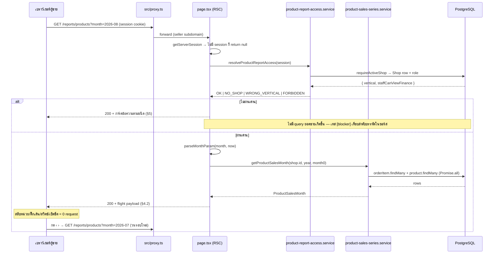

> **โมดูล:** M63-ProductSalesTimeSeries
> **ประเภทเอกสาร:** API Contract
> **เวอร์ชัน:** 1.0
> **วันที่จัดทำ:** 2026-08-29
> **สถานะ:** Draft
> **เจ้าของเอกสาร:** SA (ดู [[Feature-Docs-Ownership]])

# API Contract: ยอดขายรายสินค้า

---

## 1. Overview

🛑 **ฟีเจอร์นี้ไม่มี API endpoint ใหม่แม้แต่ตัวเดียว** — ตรวจยืนยันกับซอร์สแล้วว่า
**ไม่มีไฟล์ใดถูกเพิ่มใน `src/app/api/**`** ในรอบนี้ และไม่มี route handler ใดถูกแก้

เอกสารฉบับนี้จึงบันทึก **สองอย่าง** แทน:

1. **เหตุผลที่ไม่มี endpoint** (§1.1) — เพื่อไม่ให้คนถัดไปคิดว่ามันคือ "งานที่ยังไม่ได้ทำ"
   แล้วเผลอไปเพิ่มให้ (`known-limitation-vs-unfinished.md` ทิศกลับ: การไม่มีของบางอย่าง
   อาจเป็นการออกแบบ ไม่ใช่ช่องว่าง)
2. **"สัญญาของหน้า" (Page Contract)** — ซึ่งเป็นส่วนต่อประสานจริงเพียงชุดเดียวของฟีเจอร์นี้:
   query param ที่รับ · รูปร่างข้อมูลที่ส่งลง client · พฤติกรรมเมื่อ param ผิดรูป

| รายการ | ค่า |
|--------|-----|
| **Provider** | Next.js App Router (RSC) — `src/app/(paces)/seller/(dashboard)/reports/products/page.tsx` |
| **Consumer** | เบราว์เซอร์ของผู้ขายเท่านั้น (ไม่มี service อื่นหรือ 3rd-party บริโภคสัญญานี้) |
| **Base URL** | `https://seller.deepthailand.app` (dev: `https://seller.deepth.local:4000`) |
| **Path** | `/reports/products` |
| **Content-Type** | `text/html` + RSC flight payload (ไม่ใช่ `application/json`) |
| **เอกสารออกแบบต้นทาง** | [[SDS]] ของโมดูลนี้ — TD-001 (ไม่เพิ่ม endpoint) · TD-002 (การย่อข้อมูล) · TD-010 (อะไรอยู่ URL อะไรอยู่ state) |

### 1.1 ทำไมถึงไม่มี endpoint (ยืนยันกับโค้ดแล้วทั้ง 3 ข้อ)

| ข้ออ้าง | หลักฐานในโค้ด |
|---------|----------------|
| **หน้าอ่านอย่างเดียวและอ่านฝั่งเซิร์ฟเวอร์** | `page.tsx` เป็น async RSC เรียก `getProductSalesMonth()` ตรง ๆ ไม่มี `fetch()` ไม่มี route handler กลาง |
| **การสลับหน่วย/ติ๊กเส้น/สวิตช์ ไม่ต้องการข้อมูลใหม่** | `ProductSalesRow` ถือ **ทั้ง `qty` และ `amount`** มาพร้อมกันตั้งแต่ RSC แรก · `rowSeries()`/`rowTotal()` ใน `components/data.ts` แค่เลือกอ่านคนละคอลัมน์ของข้อมูลชุดเดิม · สินค้าที่ยอด 0 ก็ถูกส่งลงมาด้วยเสมอ (อาเรย์ว่าง) เพื่อให้สวิตช์ทำงานได้ทันที |
| **การเปลี่ยนเดือนเป็น navigation ของ RSC** | `MonthSwitcher` เป็น server component และปุ่ม ‹ › เป็น `<Link href="?month=...">` จริง ⇒ การเปลี่ยนเดือนคือการโหลดหน้าใหม่ ไม่ใช่การเรียก API |

**ผลที่ตามมาที่ต้องรู้:** ถ้าวันหนึ่งมีคนเพิ่ม `GET /api/seller/reports/products` ขึ้นมา
จะเกิดเส้นทางที่สองที่ต้องถือ **นิยาม "ขายแล้ว" ชุดเดียวกัน** — นั่นคือรูปร่างของบั๊กที่
Hard Rule 16 อธิบายไว้ (สองที่ที่ถูกในตัวเองแต่ไม่ตรงกัน และไม่มี gate ไหนจับได้)
ถ้าจำเป็นต้องมีจริง **ต้องเรียก `getProductSalesMonth()` ตัวเดิมและ `resolveProductReportAccess()`
ตัวเดิม ห้ามเขียน query ใหม่**

---

## 2. Authentication

| รายการ | ค่า |
|--------|-----|
| **วิธี (Auth Method)** | NextAuth session cookie ที่ scope ตาม subdomain `seller.*` (`getServerSession(authOptions)`) |
| **Header** | ไม่มี header เฉพาะ — cookie ของเบราว์เซอร์ |
| **Token / Scope** | `session.user.id` + `session.user.activeShopId` · สิทธิ์จริงตัดสินโดย `resolveProductReportAccess()` (ดู §5) |
| **กรณีไม่ผ่าน** | 🛑 **ไม่มี HTTP status code ใดถูกใช้เป็นคำตอบ** — ทุกกรณีคืน `200` พร้อม UI ที่อธิบายสาเหตุ (ดู §5) · ไม่มี session เลย → `page.tsx` `return null` และปล่อยให้ proxy/layout จัดการเส้นทางล็อกอิน (ท่าเดียวกับ `/reports/agents`) |

**ตารางสิทธิ์**

| ผู้ใช้ | เงื่อนไข | ผลลัพธ์ |
|--------|---------|---------|
| เจ้าของร้าน | `role === 'OWNER'` และ `vertical === 'ONLINE_SALES'` | เห็นรายงานเต็ม |
| พนักงาน | `role === 'ADMIN'` และ `vertical === 'ONLINE_SALES'` และ `shop.staffCanViewFinance === true` | เห็นรายงานเต็ม |
| พนักงาน | เงื่อนไขเดียวกันแต่ธงเป็นค่าอื่น | การ์ด "ยังไม่มีสิทธิ์ดูรายงานนี้" |
| ทุกคน | `vertical !== 'ONLINE_SALES'` | การ์ด "รายงานนี้ใช้ได้เฉพาะร้านขายออนไลน์" (ตรวจ **ก่อน** สิทธิ์) |
| ทุกคน | ไม่มีร้านที่ใช้งานอยู่ | การ์ด "ยังไม่มีร้านค้า" |

🛑 **ไม่มีธงสิทธิ์ตัวใหม่ถูกเพิ่ม** — `Shop.staffCanViewFinance` เป็นตัวเดียวกับที่ `/expenses`
และ `/reports/agents` ใช้ · เทียบด้วย `=== true` เท่านั้น (ห้าม `!== false`) และมีเทส `[blocker]`
ตรวจทั้งขาบวกและขาลบ

---

## 3. Endpoint List

| Method | Path | คำอธิบาย |
|--------|------|----------|
| — | — | **ไม่มี endpoint ใหม่ในโมดูลนี้** |

**สิ่งที่มาแทน:**

| ประเภท | เส้นทาง | คำอธิบาย |
|--------|--------|----------|
| Page (RSC) | `GET /reports/products` | หน้ารายงาน — รับ `?month=YYYY-MM` (ดู §4.1) |
| Server→Client contract | prop ของ `ProductSalesClient` | รูปร่างข้อมูลที่ส่งลง client (ดู §4.2) |

**endpoint เดิมของระบบที่หน้านี้พึ่ง (ไม่ได้ถูกแก้ในรอบนี้):** ไม่มี — หน้านี้ไม่เรียก API ใดเลย
ทั้งฝั่งเซิร์ฟเวอร์และฝั่ง client

---

## 4. Endpoint Detail

### 4.1 `GET /reports/products` (Page Contract)

หน้ารายงานยอดขายรายสินค้าของเดือนที่เลือก · อ่านอย่างเดียว · ไม่มี side effect ·
กดซ้ำได้ไม่จำกัด (idempotent โดยธรรมชาติของ `GET`)

**Request**

| ส่วน | ฟิลด์ | ชนิด | บังคับ | คำอธิบาย |
|------|-------|------|--------|----------|
| Query | `month` | `string` รูปแบบ `YYYY-MM` | no | เดือนที่ต้องการดู · ไม่ส่ง = เดือนปัจจุบันตาม **เวลาไทย** |

**ขอบเขตที่ยอมรับของ `month`**

| ขอบ | ค่า | ที่มา |
|-----|-----|------|
| ต่ำสุด | `MIN_MONTH_ISO = '2024-01'` | ก่อนหน้านี้ไม่มีข้อมูลในระบบแน่นอน |
| สูงสุด | **เดือนถัดจากเดือนปัจจุบัน 1 เดือน** (`maxSelectableMonth(now)`) | ผู้ขายคีย์วันที่ล่วงหน้าได้ 7 วัน (`order-date-window`) ⇒ ปลายเดือนมีออเดอร์ตกไปเดือนถัดไปได้จริง |

**Response — Success (`200`)**

HTML + RSC flight payload ของหน้ารายงาน · เนื้อหาแปรตามผลของด่านและข้อมูล (ดู §5)

**Response — Error**

🛑 **ไม่มี** — เอกสารนี้จงใจไม่มีตาราง HTTP error ของตัวเอง เพราะทุกความล้มเหลวที่ฟีเจอร์นี้
รู้จักถูกแปลงเป็น **สถานะบนหน้าจอ** ไม่ใช่ status code (ดู §5) · status code ที่ยังเกิดได้
เป็นของแพลตฟอร์มล้วน (401/403 จาก proxy · 500 จาก runtime ที่อยู่นอกเหนือ `try/catch`)

**พฤติกรรมเมื่อ `month` ผิดรูปหรือเกินขอบ (`parseMonthParam`)**

| input ตัวอย่าง | ผลลัพธ์ | `clamped` | หน้าจอ |
|----------------|---------|-----------|--------|
| ไม่ส่ง / `""` | เดือนปัจจุบัน | `false` | ปกติ |
| `2026-08` (อยู่ในช่วง) | เดือนนั้น | `false` | ปกติ |
| `2026-13` · `2026-00` | เดือนปัจจุบัน | `true` | + แถบแจ้ง |
| `26-08` · `2026/08` · `สิงหาคม` | เดือนปัจจุบัน | `true` | + แถบแจ้ง |
| `2019-05` (ต่ำกว่าเพดานล่าง) | เดือนปัจจุบัน | `true` | + แถบแจ้ง |
| `2026-10` เมื่อวันนี้คือ ส.ค. 2026 (เกินเพดานบน) | เดือนปัจจุบัน | `true` | + แถบแจ้ง |

🛑 **ไม่ throw · ไม่ 404 · ไม่ redirect ในทุกกรณี** — ลิงก์เก่าที่ถูกแชร์ต่อกันไม่ควรพาไปหน้าพัง
เมื่อ `clamped === true` หน้าจะแสดงแถบข้อความ
*"เดือนที่ระบุมาในลิงก์ใช้ไม่ได้ — แสดงข้อมูลของ{เดือน}แทน"* **แล้วแสดงรายงานของเดือนที่ถอยมาตามปกติ**

**ตัวอย่าง**

```
# Request
GET /reports/products?month=2026-08
Cookie: next-auth.session-token=...

# Request (ไม่ระบุเดือน — ได้เดือนปัจจุบันเวลาไทย)
GET /reports/products
```

---

### 4.2 สัญญา RSC → Client (prop ของ `ProductSalesClient`)

นี่คือ "รูปร่างข้อมูลที่ส่งลง client" ที่แทนที่ response body ของ API — ทุกค่า **serialize ได้**
(ไม่มี `Date` ไม่มีฟังก์ชัน ไม่มี `Map`/`Set`) ตามข้อกำหนดของ RSC

| ฟิลด์ | ชนิด | คำอธิบาย |
|-------|------|----------|
| `rows` | `ProductSalesRow[]` | แถวสินค้าทั้งหมด **เรียงจากขายดี→น้อยมาแล้ว** (`totalQty` desc, tie-break ด้วย `totalAmount`) |
| `days` | `number` | จำนวนวันจริงของเดือน (ก.พ. = 28/29) — ใช้คลาย `SparseSeries` และกำหนดจำนวนช่องของแถบ/ป้ายแกน X |
| `year` | `number` | ค.ศ. |
| `month0` | `number` | เดือนแบบ 0-based |
| `monthLabel` | `string` | ชื่อเดือนภาษาไทยที่ format ที่เซิร์ฟเวอร์แล้ว (เช่น `"สิงหาคม 2569"`) |
| `futureFrom` | `number \| null` | dayIndex แรกที่ยังมาไม่ถึง · **`null` = เดือนนั้นจบแล้ว (ห้ามวาดแถบเทาเลย)** · `0` = เดือนอนาคตทั้งเดือน |
| `refDayIndex` | `number` | วันอ้างอิงสำหรับนับ "เงียบมากี่วัน" |
| `orderCount` | `number` | จำนวนออเดอร์ (distinct) ที่นับเข้ารายงานนี้ในเดือนนั้น |
| `truncated` | `boolean` | `true` = ข้อมูลถูกตัดเพราะชนเพดาน `MAX_ITEM_ROWS` ⇒ หน้าต้องขึ้นแถบเตือน |

**`ProductSalesRow`**

| ฟิลด์ | ชนิด | คำอธิบาย |
|-------|------|----------|
| `key` | `string` | `Product.id` **หรือ** `'__custom__'` (`CUSTOM_ITEM_KEY`) สำหรับแถวรวมรายการที่พิมพ์เอง |
| `name` | `string` | ชื่อสินค้าปัจจุบัน · แถวรวมใช้ `'รายการที่พิมพ์เอง'` (`CUSTOM_ITEM_LABEL`) |
| `image` | `string \| null` | URL รูปแรก · `null` ได้เสมอ (แถวรวมไม่มีรูปโดยนิยาม) |
| `isActive` | `boolean` | `false` = สินค้าถูกปิดการขายแล้ว (ยอดในอดีตยังเป็นข้อเท็จจริง) · แถวรวมเป็น `true` เสมอ |
| `isCustom` | `boolean` | `true` เฉพาะแถวรวม — ใช้ตัดสินว่าชื่อเป็นลิงก์ไปหน้าสินค้าได้ไหม |
| `qty` | `SparseSeries` | ยอด **จำนวนชิ้น** รายวัน — `[dayIndex0based, value][]` เก็บเฉพาะวันที่ค่าไม่เป็น 0 |
| `amount` | `SparseSeries` | ยอด **บาท** รายวัน — `Σ(qty × price)` ปัด 2 ตำแหน่ง **ไม่รวมส่วนลด/VAT ระดับออเดอร์** |
| `totalQty` | `number` | ผลรวมทั้งเดือน (จำนวนชิ้น) |
| `totalAmount` | `number` | ผลรวมทั้งเดือน (บาท) ปัด 2 ตำแหน่ง |
| `saleEvents` | `number` | จำนวน **บรรทัด** `OrderItem` = "ขายได้กี่ครั้ง" · ใช้เป็นด่านขั้นต่ำของป้ายสรุป (ไม่ใช่จำนวนชิ้น) |
| `lastSoldDayIndex` | `number \| null` | dayIndex ล่าสุดที่มียอด · `null` = ไม่มียอดเลยในเดือนนี้ |

**ตัวอย่าง payload (ย่อ)**

```json
{
  "days": 31,
  "year": 2026,
  "month0": 7,
  "monthLabel": "สิงหาคม 2569",
  "futureFrom": 29,
  "refDayIndex": 28,
  "orderCount": 42,
  "truncated": false,
  "rows": [
    {
      "key": "b3f1c2a0-1111-4a2b-9c3d-000000000001",
      "name": "เสื้อยืดคอกลม สีดำ",
      "image": "https://.../shirt-black.jpg",
      "isActive": true,
      "isCustom": false,
      "qty": [[2, 4], [3, 12], [4, 9]],
      "amount": [[2, 1160.00], [3, 3480.00], [4, 2610.00]],
      "totalQty": 25,
      "totalAmount": 7250.00,
      "saleEvents": 11,
      "lastSoldDayIndex": 4
    },
    {
      "key": "__custom__",
      "name": "รายการที่พิมพ์เอง",
      "image": null,
      "isActive": true,
      "isCustom": true,
      "qty": [[10, 3]],
      "amount": [[10, 450.00]],
      "totalQty": 3,
      "totalAmount": 450.00,
      "saleEvents": 2,
      "lastSoldDayIndex": 10
    },
    {
      "key": "b3f1c2a0-1111-4a2b-9c3d-000000000009",
      "name": "หมวกแก๊ป (เลิกขายแล้ว)",
      "image": null,
      "isActive": false,
      "isCustom": false,
      "qty": [],
      "amount": [],
      "totalQty": 0,
      "totalAmount": 0,
      "saleEvents": 0,
      "lastSoldDayIndex": null
    }
  ]
}
```

**หมายเหตุที่ผูกกับตัวอย่างข้างบน**

- แถว `__custom__` **มีอยู่เสมอเมื่อมียอด** และไม่ต้องเปิดสวิตช์ "แสดงสินค้าที่ไม่มียอดขาย"
  ก็เห็น — มันเป็นยอดขายจริงที่นับรวมอยู่แล้ว
- แถวที่ `qty: []` และ `saleEvents: 0` คือสินค้าที่ **ไม่มียอดในเดือนนั้น** — ถูกส่งลงมาด้วยเสมอ
  (payload เล็กเพราะอนุกรมว่าง) เพื่อให้สวิตช์ทำงานได้โดยไม่ยิงเซิร์ฟเวอร์ · แถวกลุ่มนี้
  **ติ๊กขึ้นกราฟไม่ได้** และ **ไม่มีป้ายสรุป** (ผ่านด่านขั้นต่ำ 3 ครั้งไม่ได้)
- 🛑 `amount` **ไม่ใช่ยอดที่เทียบกับ `/sales` ได้** — ผลรวมของทุกแถวจะไม่เท่า
  `Σ Order.totalAmount` เพราะไม่หักส่วนลดและไม่รวม VAT ที่คิดระดับทั้งออเดอร์
  (`MONEY_MODE_CAVEAT` ต้องแสดงบนจอเมื่ออยู่โหมดบาท)
- `SparseSeries` เก็บทุกค่าที่ `!== 0` **รวมค่าติดลบ** (คืนของ/ปรับยอด) — ไม่ใช่เฉพาะค่าบวก

---

## 5. Error Code Table

🛑 **ฟีเจอร์นี้ไม่ใช้ HTTP error code เป็นคำตอบเลย** — ทุกความล้มเหลวที่รู้จักถูกแปลงเป็น
**สถานะบนหน้าจอที่อธิบายสาเหตุและบอกทางออก** เพราะผู้อ่านคือมนุษย์ที่เปิดหน้าเว็บ ไม่ใช่ client
ที่ต้องแยก branch ตาม status code

| สถานะภายใน | HTTP | UI ที่แสดง | เงื่อนไข |
|-------------|------|-----------|---------|
| `NO_SHOP` | `200` | `SellerEmptyState` "ยังไม่มีร้านค้า" + ปุ่ม "สร้างร้านค้า" → `/shop` | `requireActiveShop()` คืน `null` หรือไม่มี `session.user.id` |
| `WRONG_VERTICAL` | `200` | `SellerEmptyState` "รายงานนี้ใช้ได้เฉพาะร้านขายออนไลน์" + ปุ่มกลับ `/dashboard` | `shop.vertical !== 'ONLINE_SALES'` — **ตรวจก่อนสิทธิ์** |
| `FORBIDDEN` | `200` | `SellerEmptyState` "ยังไม่มีสิทธิ์ดูรายงานนี้" — **ไม่มีปุ่ม action** | `role === 'ADMIN'` และ `staffCanViewFinance !== true` |
| `DB_ERROR` | `200` | `SellerErrorState` "โหลดรายงานไม่สำเร็จ" + ปุ่มลองใหม่ที่ `?month=` เดิม | `getProductSalesMonth()` throw (มี `console.error('[reports/products] ...')` ก่อนเสมอ) |
| `NO_PRODUCT` | `200` | `SellerEmptyState` "ร้านนี้ยังไม่มีสินค้า" + ปุ่ม "เพิ่มสินค้าแรก" → `/products/new` | `hasAnyProduct === false` |
| `NO_ORDER` | `200` | การ์ด empty state "ยังไม่มีคำสั่งซื้อใน{เดือน}" + ลิงก์ไป `/orders` | `orderCount === 0` |
| `MONTH_CLAMPED` | `200` | แถบข้อความเหนือเนื้อหา **แล้วแสดงรายงานต่อตามปกติ** | `parseMonthParam()` คืน `clamped: true` |
| `TRUNCATED` | `200` | แถบเตือนสีเหลือง **แล้วแสดงตัวเลขบางส่วนต่อ** | `items.length > MAX_ITEM_ROWS (20,000)` |

**หลักที่ยึด 3 ข้อ**

1. 🛑 **`FORBIDDEN` ไม่มีปุ่ม action โดยตั้งใจ** — ผู้ใช้ไปหน้าอื่นแล้วแก้ปัญหานี้เองไม่ได้
   ต้องให้เจ้าของร้านเปิดสิทธิ์ให้ ปุ่มที่พาไปที่ไหนสักแห่งจะเป็นการหลอกให้ลองแล้วไม่สำเร็จ
2. 🛑 **`DB_ERROR` ต้องไม่ใช้จอเดียวกับ empty state** — "ฐานข้อมูลล่ม" กับ "เดือนนี้ขายไม่ได้เลย"
   เป็นข้อเท็จจริงคนละอย่างที่ผู้ขายต้องทำคนละเรื่อง จอเดียวกันคือการโกหกในกรณีหนึ่งเสมอ
3. 🛑 **`MONTH_CLAMPED` และ `TRUNCATED` ไม่บล็อกเนื้อหา** — ทั้งสองคือ "ข้อมูลยังใช้ได้แต่ต้องรู้
   ข้อจำกัด" การซ่อนตัวเลขไปเลยจะทำให้ผู้ใช้เสียของที่ยังใช้ได้ ส่วนการไม่บอกจะทำให้เขาสรุปผิด
   (`partial-data-must-be-labeled-or-filled.md`)

**โครง error response มาตรฐาน:** ไม่มี — ฟีเจอร์นี้ไม่คืน JSON error ที่ไหนเลย

---

## 6. Sequence

> **บังคับ:** diagram ในหัวข้อนี้ใช้ Mermaid เท่านั้น

flow ของหน้านี้ไม่ข้าม submodule และไม่มี 3rd-party — ที่ใส่ไว้เพราะ **ลำดับระหว่างด่านกับ query
เป็นส่วนหนึ่งของสัญญา** (ผู้ที่ไม่ผ่านด่านต้องไม่มีตัวเลขอยู่ใน payload เลย ไม่ใช่แค่ไม่ถูก render)



---

## 7. Traceability

| สัญญา | SDS Component / Decision | BRD FR |
|-------|--------------------------|--------|
| `GET /reports/products` (หน้า) | §3 `page.tsx` · TD-015 | FR-PST-01 |
| query `?month=` + ขอบเขต + `clamped` | §3 `MonthSwitcher` · TD-010 | FR-PST-04 |
| ด่านสิทธิ์/vertical ก่อน query (§2, §5) | §3 `product-report-access.service` · TD-011 · TD-012 | FR-PST-02, FR-PST-03 |
| `ProductSalesRow.qty` / `totalQty` | §3 `product-sales-series.service` · TD-003 | FR-PST-05 |
| `ProductSalesRow.amount` / `totalAmount` | TD-004 | FR-PST-06 |
| bucket รายวัน (index ของ `SparseSeries`) | §5 จุดเชื่อม `thaiDayKey` | FR-PST-07 |
| `futureFrom` / `refDayIndex` | TD-015 · §3 `DayStrip` / `ProductSalesChart` | FR-PST-08 |
| `key = '__custom__'` / `isCustom` | §3 service · Flow 4.1 | FR-PST-09 |
| `isActive` | §3 `ProductSalesTable` / `ProductMobileList` | FR-PST-10 |
| ลำดับ `rows` (Top N ยึดจำนวนชิ้น) | §3 `data.ts::defaultSelectedKeys` · TD-013 | FR-PST-11, FR-PST-12 |
| แถวที่ `saleEvents = 0` ถูกส่งลงมาด้วย | TD-001 · TD-002 | FR-PST-13 |
| `saleEvents` (ด่านขั้นต่ำของป้าย) | TD-005 · TD-006 · TD-007 | FR-PST-14 |
| `days` (จำนวนช่องของแถบ/แกน X) | TD-008 · TD-009 | FR-PST-15 |
| `truncated` | TD-014 | BRD §6.3 |
| `NO_SHOP`/`DB_ERROR` แยกจาก empty state | Flow 4.3 | BRD §6.3, AC-PST-03 |

---

## 8. สรุป (Summary)

เอกสาร API Contract นี้บันทึกว่า **รายงานยอดขายรายสินค้าไม่มี HTTP endpoint ของตัวเองเลย**
และอธิบายสัญญาที่มีอยู่จริงแทน — query param ที่หน้ารับ, รูปร่าง `ProductSalesRow[]` ที่ส่งลง
client, และพฤติกรรมที่รับประกันเมื่อ input ผิดรูป · QA ใช้ตาราง §5 วางแผน negative case ได้
โดยรู้ล่วงหน้าว่า **ทุกเคสตอบ `200` และต้องตรวจที่หน้าจอ ไม่ใช่ที่ status code**

**Open Questions:**

- **OQ-1** ถ้าอนาคตมีแอปมือถือหรือ export ที่ต้องการข้อมูลชุดนี้ จะต้องเพิ่ม endpoint จริง —
  ข้อบังคับตอนนั้นคือ **ต้องเรียก `getProductSalesMonth()` และ `resolveProductReportAccess()`
  ตัวเดิม** ห้ามเขียน query หรือด่านชุดใหม่ (ไม่งั้นเกิดนิยาม "ขายแล้ว" เส้นทางที่สอง — HR16)
- **OQ-2** ขนาดจริงของ flight payload ยังไม่เคยถูกวัดเป็น KB — เป็นตัวเลขที่ PRD §6.2 และ
  BRD §6.2 เรียกร้องไว้เองว่าต้องมีก่อน merge และเป็นข้อมูลที่จำเป็นต่อการตอบ OQ-1
- **OQ-3** ยังไม่มีเคสทดสอบที่ยิง `?month=` แปลก ๆ ผ่านเบราว์เซอร์จริง — ตรรกะถูกพิสูจน์ด้วย
  unit test แล้ว แต่ยังไม่ได้ยืนยันว่าแถบแจ้ง `clamped` แสดงจริงบนหน้าจอ
